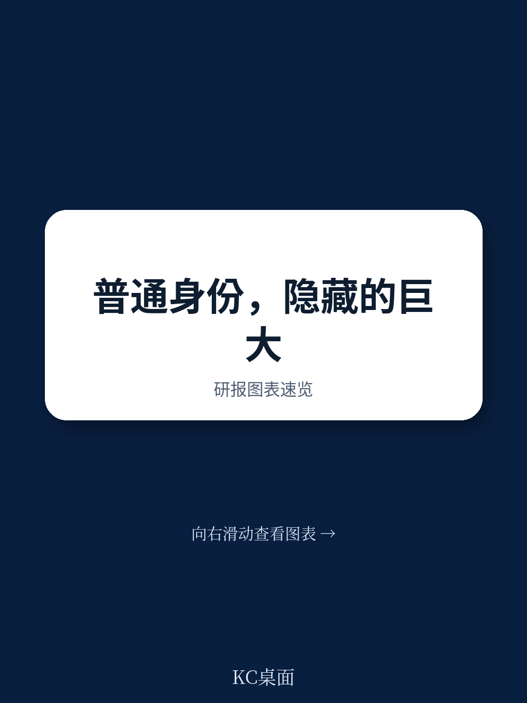
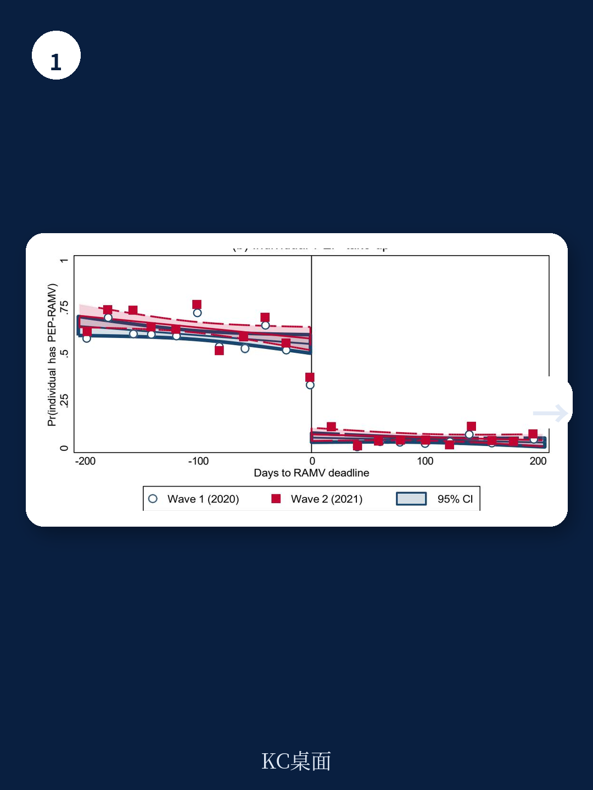
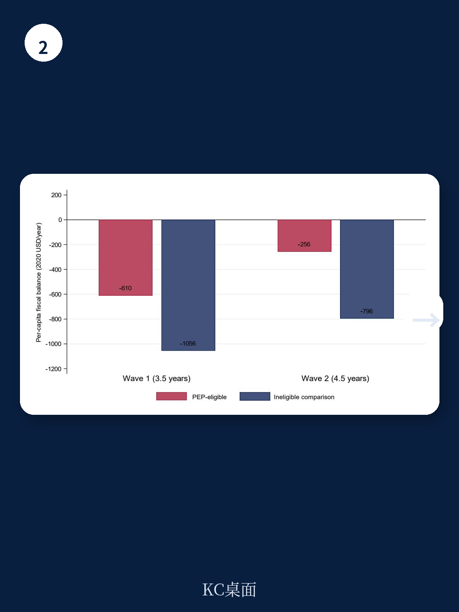

# 世界银行：正规化与社会资本形成证据

2018年7月，哥伦比亚政府意外宣布，此前在行政登记中注册的近50万委内瑞拉无证移民，可获得临时合法身份、工作许可与社会服务准入。四年半后，世界银行研究团队追踪这批移民发现：宏观环境改善在短期就已兑现，但真正改变移民与东道国关系的——社会资本的积累——直到中期才浮现。这份基于模糊断点回归设计的政策研究工作论文，提供了目前关于强制移民合法化项目最完整的中期因果证据。

合法身份带来的最大中期收益，不在收入，而在信任与融入。在项目启动四年半后的第二轮调查中，获得合法身份的移民在社会融入指数上比未获身份的同侪高出0.95个标准差，在亲社会行为指数上高出0.97个标准差。这两个指数衡量的是归属感、与哥伦比亚人的友谊、社区参与、对哥伦比亚的依恋，以及普遍信任和对两国同胞的信任。而在第一轮调查（项目启动约两年后，正值疫情封控期间），两组移民在这些指标上没有统计差异。社会资本的形成，需要时间，更需要稳定的身份与持续的正面接触。

> **KC评论：** 这个时间差很关键。疫情封控期间，合法身份带来的宏观环境好处（收入、服务可及性）已经显现，但社会融入无法在物理隔离中发生。等到封控解除、四年半的稳定身份积累完成，信任和归属感才真正长出来。这提示我们，合法化的社会回报不是自动到账的，它依赖“稳定的法律地位+日常的正面互动”这个组合。

宏观环境收益方面，合法身份的效果在短期就已出现，并在中期基本保持。获得合法身份的移民月劳动收入高出69%，服务可及性指数从短期的2个标准差升至中期的2.6个标准差，住房质量指数从0.6个标准差升至1.27个标准差——合法身份家庭开始研究于不动产。人均消费的短期优势则消失了，因为未获身份的家庭逐渐追赶上来。

## 1. 社会资本的形成机制：不是物质改善，而是稳定身份本身

研究检验了四种可能的传导渠道。前三种——服务可及性提升、物质匮乏缓解、认知带宽释放——都可以通过中介分析来评估。在控制这些渠道的代理变量后，合法身份对社会资本的影响几乎不变。证据指向第四种机制：稳定的法律地位本身，通过持续的合法融入和与东道国社会的重复正面接触，逐步积累社会资本。

这一解释与两个学术脉络吻合。群际接触理论认为，持续、平等、合作性的接触可以减少偏见、建立信任。社会资本理论则预测，个人对社会关系和社区的研究与预期流动性负相关——当人们拥有清晰且持久的合法身份时，更愿意投入不可移动的关系和资产。住房研究的同步增长也支持这一逻辑：住房是不可移动资产，其研究与社区参与高度相关。

## 2. 财政回报随时间增强：中期净成本下降约七成

研究还做了财政核算，将正规部门税收贡献与公共服务支出相抵。在中期，一个合法化移民家庭的净财政成本，相对于一个无证家庭，从短期的大约40%降到了中期的约70%。具体而言，无证家庭每年净财政成本为796美元，而部分正规就业的合法身份家庭为256美元。这还只是下限估计，因为长期税收渠道（企业资本税、企业创建、个人所得税）尚未纳入。

财政回报增强的逻辑是：合法身份家庭在正规部门就业的比例随时间上升，缴纳更多工资税，同时不再因无保险而依赖昂贵的急诊服务。教育支出则不受身份影响——哥伦比亚法律对所有儿童开放教育，无论国籍或移民身份。

## 3. 识别策略的巧妙之处：一个意外宣布的断点

这项研究的识别策略利用了项目设计的制度特征。2018年4月至6月，哥伦比亚政府进行了一次全国性无证移民登记，初衷只是清点和统计。六周后，总统意外签署法令，将所有登记者纳入合法化项目。这意味着，在登记截止日前抵达并完成注册的移民获得资格，截止日后抵达的则无法注册。由于项目在登记结束后才宣布，移民不可能提前调整抵达时间来获取资格。

研究使用模糊断点回归设计，比较抵达日期恰好落在截止日前后的移民。两轮调查之间的样本流失虽然与基线特征相关，但在截止点处没有不连续性，保证了局部随机化的有效性。Lee（2009）的排序修剪边界检验也确认，所有中期核心结论在边界内仍为正。

---

这份研究的政策含义清晰：合法化不是一次性的人道主义支出，而是一项随时间增值的研究。宏观环境收益在短期兑现，社会资本和财政回报在中期加速。对于正在设计或评估移民政策的政府而言，关键在于认识到合法化的真正回报需要时间才能完全释放——而等待是值得的。

For informational purposes only. Portions may be generated,translated,summarized,or edited with AI assistance based on source materials and may contain omissions or errors. Please verify independently. This is not investment,legal,tax,accounting,or other professional advice.

