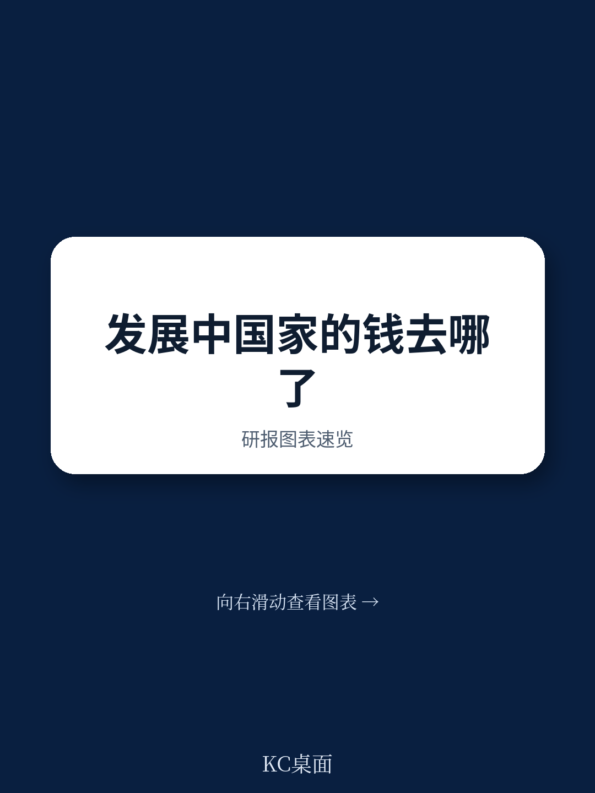

# 世界银行：斯坦利-费希尔纪念演讲，公共债务与中央银行

一份基于2026年世界银行ABCDE会议上的斯坦利-费希尔纪念演讲的政策研究论文，给出了一个与主流发展宏观环境学共识相左的判断：当前由IMF主导的浮动汇率与多重汇率体系，正在系统性地将财富从低收入工薪阶层转移至少数特权群体，而非促进宏观环境增长。作者David R. Malpass——世界银行集团前行长——以埃塞俄比亚为核心案例，展示了这一机制如何将贫困率从2016年的33%推升至2025年预计的43%。

这不是一个关于汇率波动的技术讨论，而是一个关于发展援助实效性的根本质疑。

## 1. 每一次贬值，都是对低收入群体的隐性征税

报告的核心论证建立在“汇率制度如何影响收入分配”这一较少被量化的维度上。以埃塞俄比亚为例：2019年，当地货币比尔兑美元汇率约为28:1。央行同时运行多重汇率与外汇配给制度，意味着受偏好的行业和群体可以比其他人更便宜地买到美元。贬值的激励极为强烈——因为获利丰厚。

贬值期间，资源从穷人流向持有外币或能获取本币贷款的人群。对于世界银行而言，这意味着以美元计价的贷款在兑换成本币后，实际购买力大幅缩水。一个1亿美元的贷款项目，原本意在提供28亿比尔的资源，但到资金实际支出时，其价值已显著降低。贬值的利润归于央行和受政府官员偏袒的小群体，而成本则通过通胀税转嫁给了穷人。

2024年7月，在IMF项目推动下，埃塞俄比亚“浮动”了比尔。IMF称之为“市场决定的汇率”。比尔随即贬值一半，以比尔领取工资的人群收入被腰斩。报告指出，2025年比尔已成为全球第三弱的货币，官方汇率跌至161:1，但外汇仍通过定期拍卖分配给少数银行——这意味着贫困人口的实际处境比数据更糟。

> **KC评论：** 这里容易被忽略的是“发展援助在贬值中的实际损耗”。报告提供了一个计算框架：当援助资金以本币计价拨付时，贬值直接侵蚀了援助的实物资源量。这意味着，即便贷款和赠款的名义金额不变，实际能购买的商品与服务也在缩水——而这一损失从未被纳入项目评估的常规指标中。

## 2. 债务重组框架：密集的债权人参与，极少的净现值减免

报告对当前主权债务重组机制的评价更为直接：G20共同框架和全球主权债务圆桌会议，在现有形式下均不适用。

与1989年布雷迪计划这一基准相比，当代框架虽然产生了密集的债权人参与，但为债务国带来的净现值减免微乎其微。报告指出了几个结构性缺陷：缺乏统一的折现率来衡量债务减免的“可比性”；中国和商业债权人的参与不完整；主权交易中的抵押品条款日益不透明；以及“价值回收工具”可能逆转已实现的债务减免。

以赞比亚为例：该国通过共同框架争取债务减免多年，但大量债务被排除在重组之外。更关键的是，已实现的有限减免还可能因价值回收工具而被逆转。报告认为，这些工具听起来对债权人有利，但会导致重组延迟，并破坏债务减免的可预测性和可持续性——而这恰恰是吸引新研究的关键。

## 3. 一个可复用的观察框架：用“中位收入”而非“人均收入”衡量发展实效

报告提出了一个值得所有关注发展议题的读者留意的分析框架：区分“人均收入”与“中位收入”。

人均收入可能因少数人收入大幅上升而提高，但中位收入更能反映普通人的实际处境。报告指出，发展中地区（不含中国）2026年的人均收入增速预计仅为2%，远低于长期均值。考虑到财富和收入集中在顶层，中位收入的增长会更低。这意味着56亿人的收入不到发达地区的十分之一，且差距几乎没有缩小的迹象。

作者将发展援助比作“食谱”而非“菜单”：食谱意味着多个必要成分缺一不可，菜单则允许挑挑拣拣。菜单式方法可以产生数千笔贷款、赠款、会议和报告，但很容易忽视持续仍在调整的中位收入。问题的核心在于激励机制：无论是国内精英还是全球机构，都倾向于选择菜单上更容易的项目——而这些项目往往对提升中位收入帮助有限。

这份演讲的结论并不乐观：在现有框架下，低收入国家每年约2%的人均收入增速将持续，数十亿人将在收入和生活水平上进一步落后。报告呼吁同时改革汇率制度与债务重组框架，否则全球发展差距只会继续扩大。
