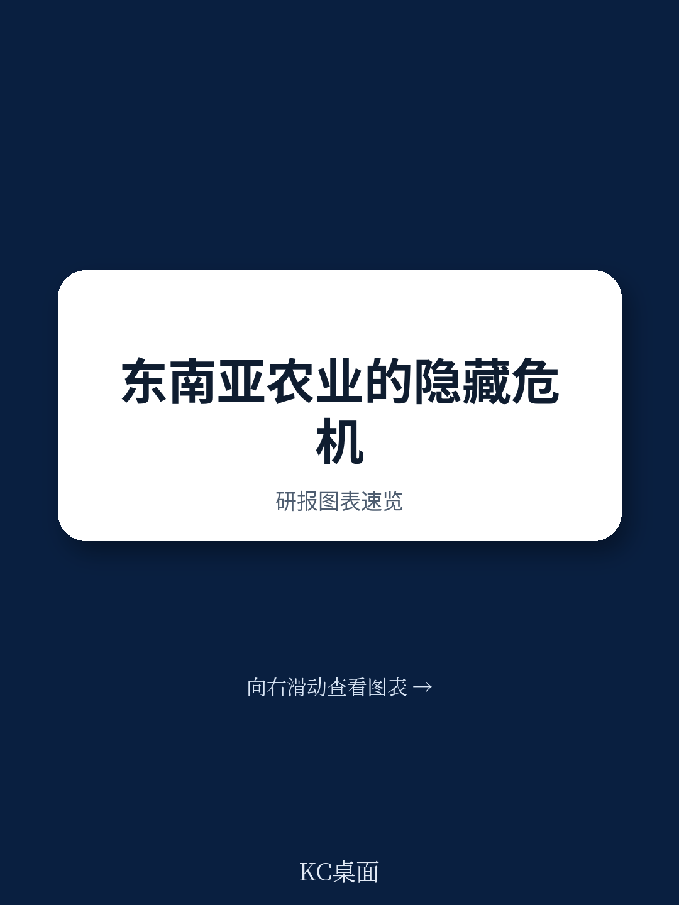
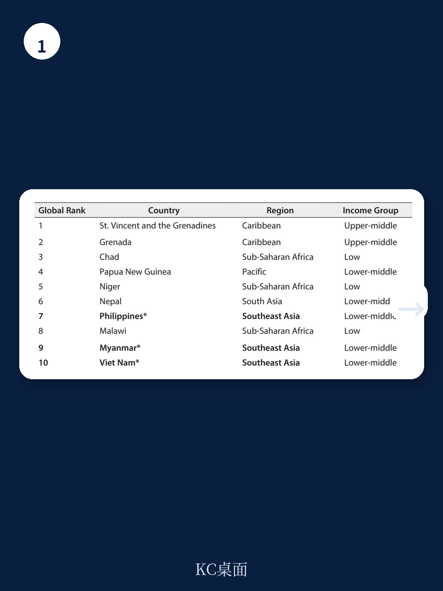
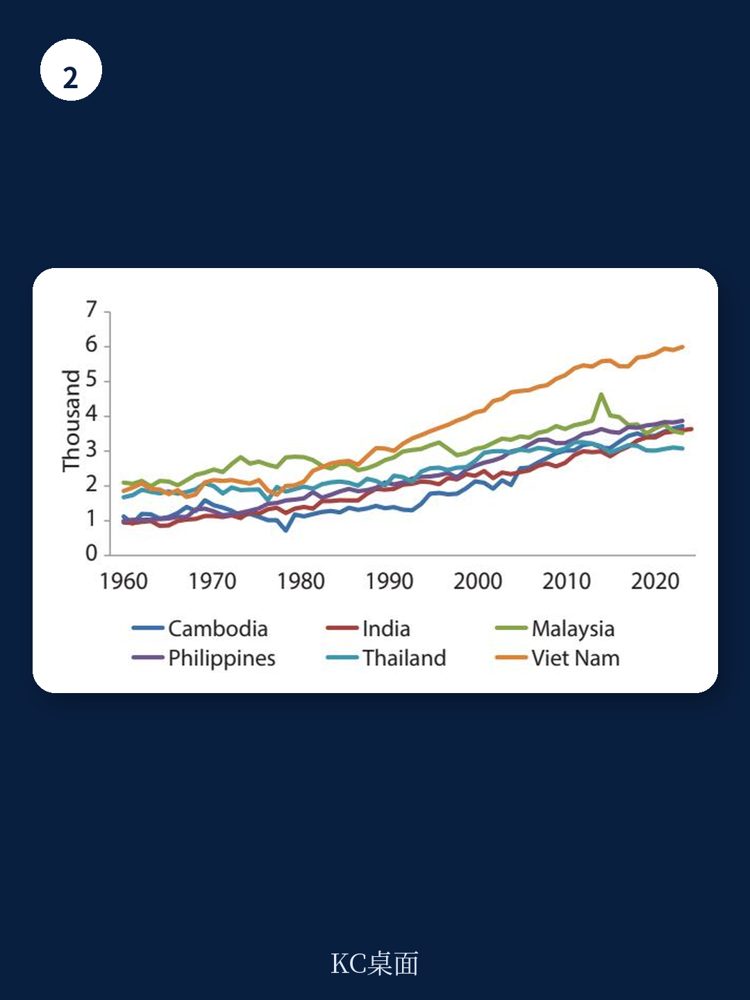

# 亚洲开发银行：研究主题与行业变化观察

东南亚农业正同时承受气候冲击和结构性性别不平等的不确定性，而这两者并非独立问题。亚洲开发银行研究所（ADBI）近期发布的一份政策简报指出，气候脆弱性与性别不平等在东南亚小农农业中相互强化，产生可量化的福利和生产力损失。该报告的核心判断是：标准干预措施之所以失败，是因为它们忽略了家庭内部资源错配这一已被反复验证的现象——同一家庭内由女性和男性管理的土地，在面临相同气候冲击时，获得的投入并不均等。

东南亚是全球气候不确定性最高的地区之一。缅甸、菲律宾和越南在过去十年极端天气事件影响最严重的十个国家之列。与此同时，该地区约75%的GDP高度依赖与自然资本相关的部门，其中农业既是女性就业的主要来源，也是受气候影响最直接的宏观环境活动。报告引用数据指出，在印度尼西亚，仅有13%的女性拥有或享有农业土地的稳定权利，而男性的这一比例为52%。

> **KC评论：** 报告强调了一个容易被忽视的机制——气候冲击会通过家庭内部的资源分配加剧性别不平等。当干旱发生时，资源受限的家庭倾向于将更多投入集中在男性管理的土地上，这进一步扩大了家庭内部的生产力差距。

## 1. 家庭内部资源错配导致女性管理土地产量低约30%

报告引用了发展宏观环境学中具有影响力的实证研究：在同一家庭内，女性管理的土地产量比男性管理的土地低约30%，但原因并非女性是效率较低的农民，而是家庭将过多劳动力和过少肥料分配给了男性管理的土地。这一错配造成的效率损失相当于家庭农业总产出的约6%。

这一发现直接挑战了发展宏观环境学中常用的“统一家庭模型”——该模型假设家庭成员共同决策、共享资源。报告认为，大多数农业发展项目和气候适应方案都基于这一假设设计，但过去三十年的实证研究已经否定了它。以家庭为单位发放的援助很可能绕过女性管理的土地，复制而非纠正已存在的资源错配。

## 2. 私人研发投入偏向商业化作物，女性种植的作物被系统性忽视

报告指出，私人研发研究流向服务于最大和最有利可图市场的技术。当商业化主导作物面临温度不确定性时，针对这些作物的创新会加速；但当同样的冲击影响女性小农大量种植的木薯、叶菜、豆类和根茎类作物时，没有相应的私人研发响应。这构成了一个需要公共研究来纠正的市场失灵。

绿色革命的数据说明了这一点：1961年至2016年间，全球谷物单产从每公顷约1.5吨提高到近4吨，但这一增长集中在小麦、水稻和玉米上。园艺作物、根茎类作物和食品加工——即东南亚女性劳动力集中的领域——获得的研发研究远低于谷物。报告认为，当女性参与品种选择时，最终选出的种子更适合女性小农通常管理的混合种植、不确定性规避和劳动力受限的耕作系统。

## 3. 移动货币基础设施已就位，可直接用于补贴发放

报告提出的第三条创新路径涉及资金工具，核心问题不是有多少钱到达家庭，而是交付渠道是否确保女性保留对资源的控制权。实验证据表明，将资金直接发放到女性的个人移动货币账户，显著提高了女性保留并研究于生产性活动的资源比例。

东南亚的移动钱包支付使用率已达到79%，印度尼西亚、马来西亚和菲律宾超过85%。报告认为，这一基础设施已经到位，可以直接用于农业补贴发放和保险赔付，无需新的技术研究。同时，获取实时价格信息已被证明能降低价格离散度、提高生产者利润并降低消费者价格，但前提是信息工具由女性本人控制，而非由家庭中的男性户主掌握。

## 4. 五项可研究交流按实施时间表划分

报告提出了五项具体干预措施，按实施时间表分为近期行动和中期改革。近期行动可在1至2年内通过行政决策或平台层面重新设计启动：增加针对女性种植作物的公共农业研发研究；将市场价格信息技术扩展到女性小农；将农业补贴直接发放到女性的个人移动货币账户。中期改革需要立法或监管变革，目标周期为3至5年：正式化女性的土地保有权；将性别指标纳入区域气候融资框架。

报告的核心逻辑是，气候脆弱性和性别不平等共享相同的根源——家庭内部资源错配、不安全的土地权利以及定向创新的市场失灵——因此对同一组有针对性的干预措施产生响应。这些建议所依赖的基础设施、制度和融资机制在区域内已经存在，关键在于重新设计资源的流向、交付和追踪方式。

> **KC评论：** 这份报告的价值不在于提出全新的政策方向，而在于将三个已被分别验证的机制——家庭内部资源分配、定向创新的市场失灵、移动货币的个体账户效应——整合为一个可操作的政策框架。读者可以关注的是，报告对“统一家庭模型”的批判意味着，任何以家庭为单位的农业补贴或气候适应资金，如果不考虑家庭内部的权力分配，都可能无法达到预期效果。

For informational purposes only. Portions may be generated,translated,summarized,or edited with AI assistance based on source materials and may contain omissions or errors. Please verify independently. This is not investment,legal,tax,accounting,or other professional advice.

