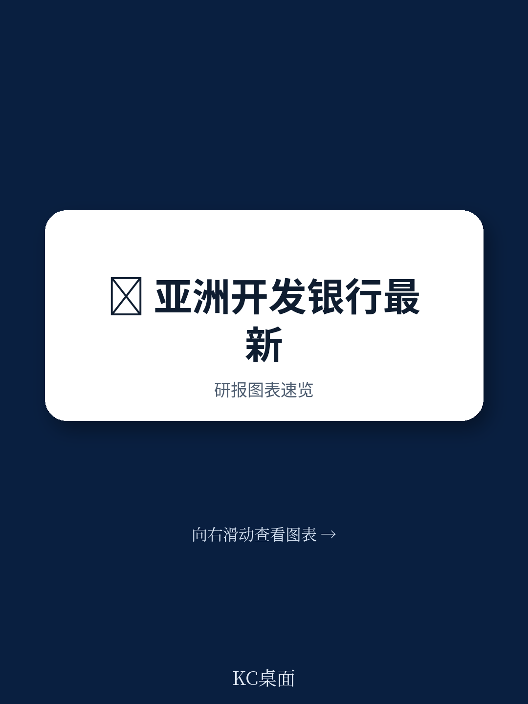
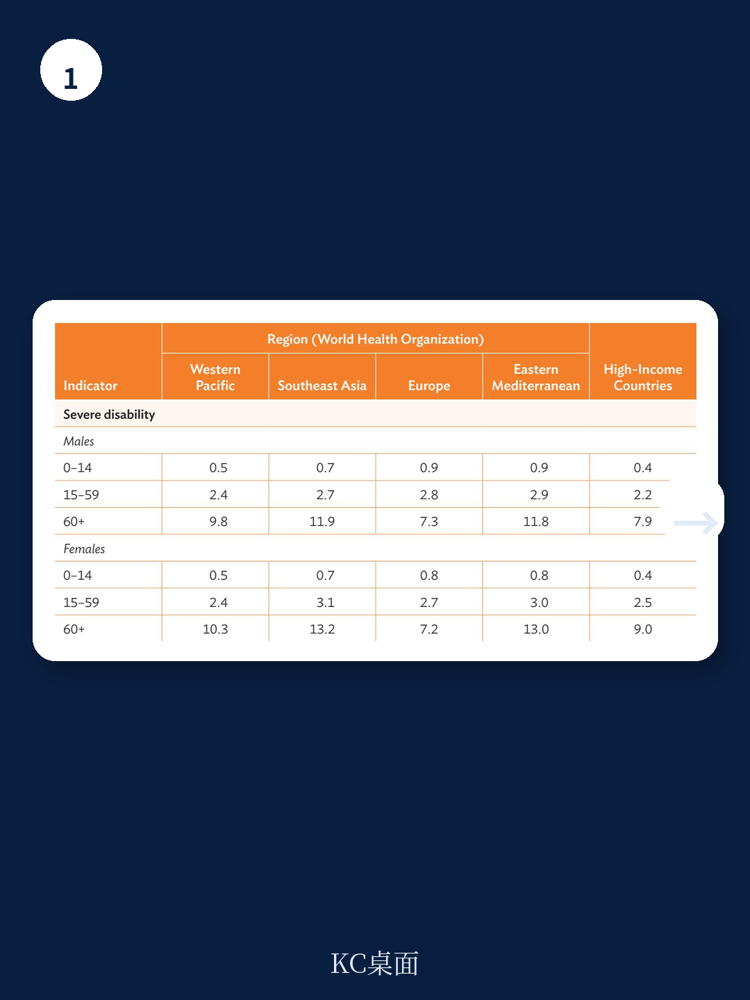
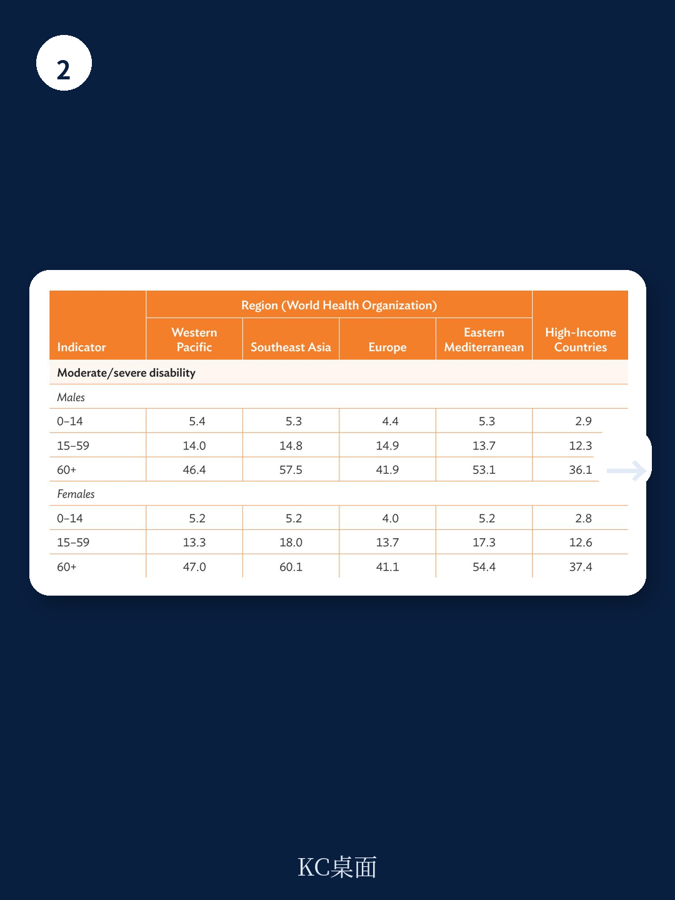

# 亚洲开发银行：社会保护覆盖与效果指标

亚洲开发银行（ADB）于2026年7月发布《社会保护覆盖与效果指标：社会保护评估工具》，提出了一套名为SPICES的标准化评估框架。该框架的核心变化在于，将社会保护评估的焦点从“投入了多少资金”转向“这些资金覆盖了哪些人群、解决了哪些需求、产生了什么效果”。报告认为，亚太地区各国社会保护体系发展阶段差异显著，缺乏一致的评估方法，导致政策对话和跨国比较难以有效开展。SPICES框架试图填补这一空白，为政策制定者提供一个直观、可比、可操作的诊断工具。

SPICES框架将指标分为三个层次：投入、产出和结果/影响。投入层主要考察社会保护支出的水平和结构；产出层关注人均支出和覆盖范围；结果层则通过住户调查数据分析社会保护对减贫和不平等的模拟影响。这一结构使得评估不再停留于支出总额占GDP比例的简单比较，而是深入到资源分配和实际效果层面。

## 1. 评估框架从按项目分类转向按需求分类

报告指出，以往的社会保护评估多按项目类别划分——社会保险、社会救助和积极劳动力市场项目。SPICES框架则改为围绕人口需求组织分析，包括老年、儿童/家庭、残疾、失业/就业不足、贫困/脆弱性和健康六大领域。这一转变意味着，评估不再预设某种工具优于另一种，而是关注不同需求是否被充分覆盖。

报告强调，这种需求导向的方法能够更清晰地揭示资源在不同群体间的分配情况，以及系统在哪些领域存在缺口。例如，一个国家的社会保护支出总额可能很高，但如果大部分资源集中在老年养老金上，而儿童和残疾人群体覆盖不足，那么系统的均衡性就存在问题。

> **KC评论：** 需求分类法的实质是让评估结果对政策制定者更有“可操作性”。当你知道某个需求领域覆盖不足时，下一步的行动方向就明确了——是增加预算、调整资格标准，还是设计新项目。这比笼统地说“社会保护支出占GDP比例偏低”更有指导意义。

## 2. 社会保护指标（SPI）被纳入产出层并实现需求维度分解

SPICES框架保留了ADB自2004年以来持续使用的社会保护指标（SPI），但对其进行了方法论修订。修订后的SPI不再是一个单一的汇总数值，而是可以按需求领域分解。具体而言，SPI由两个分量相乘得出：每个受益人的平均支出和潜在受益人的覆盖率。当这两个分量按需求分解时，就能显示出不同需求领域获得的平均支持水平和覆盖广度。

报告认为，SPI相比简单的支出占GDP比例指标，能更清晰地反映社会保护绩效。例如，两个国家可能社会保护支出占GDP比例相同，但SPI值可能差异很大，因为一个国家的受益人群更广但人均支持较低，另一个国家则相反。这种差异对政策选择有直接含义。

## 3. 综合指数和住户调查数据构成结果评估的核心

除了SPI，SPICES框架还引入了综合指数，用于评估社会保护体系在多大程度上均衡地覆盖了不同需求领域。报告提供了一个可视化工具——蜘蛛网图，可以直观展示各需求领域的覆盖程度，帮助识别系统的强项和短板。

在结果层，框架要求使用住户调查微观数据，模拟社会保护对贫困和收入不平等的影响。报告强调，这是评估社会保护有效性的关键环节——即使支出和覆盖数据表现良好，如果实际减贫效果有限，那么系统设计仍存在问题。报告还特别指出，健康支出的评估需要单独处理，重点考察其在降低健康相关财务不确定性方面的作用。

## 4. 框架设计兼顾跨国比较和国别诊断

SPICES框架的一个显著特点是其双重用途。一方面，统一的指标体系使得跨国比较成为可能，有助于识别区域性的模式和经验教训。报告举例说，可以比较GDP水平相似但社会保护支出结构不同的国家，观察其对关键结果指标的影响。另一方面，框架也支持生成详细的国别报告和简化的国家概况，供各国根据自身数据可得性和制度安排进行调整。

报告承认，亚太地区各国社会保护发展水平差异巨大，不同国家对“社会保护”的理解和范式也存在分歧。SPICES框架试图通过聚焦投入、产出和结果，绕开这些概念分歧，直接评估系统实际表现。这种实用主义取向，使得框架能够适应从低覆盖到高覆盖、从单一项目到综合体系的不同发展阶段。

> **KC评论：** 框架的灵活性是一把双刃剑。它让更多国家能够参与评估，但同时也意味着跨国比较的严格性可能打折扣。报告没有完全展开的是，当各国对“健康覆盖”或“残疾”的定义不同时，指标的可比性如何保证。这仍是需要在使用中逐步解决的问题。

SPICES框架的发布，标志着ADB在社会保护评估领域从“测量支出”向“测量效果”的转变。对于亚太地区各国而言，这一框架提供了一个相对标准化的工具，可以用来审视自身社会保护体系的覆盖盲区和效果瓶颈。框架的下一步价值，将取决于各国是否愿意投入资源收集和整理数据，以及能否在跨国比较中形成真正有意义的政策对话。

For informational purposes only. Portions may be generated,translated,summarized,or edited with AI assistance based on source materials and may contain omissions or errors. Please verify independently. This is not investment,legal,tax,accounting,or other professional advice.

