## BIS Working Papers No 1370

Dollarisation and monetary control: what lessons for the rise of stablecoins?

by Boris Hofmann, Aaron Mehrotra and Jan Paulick

Monetary and Economic Department

July 2026

JEL classification: E44, E58, F32, F38, G15, G23

Keywords: dollarisation, capital flows, stablecoins, monetary control, EMDEs

BIS Working Papers are written by members of the Monetary and Economic Department of the Bank for International Settlements, and from time to time by other economists, and are published by the Bank. The papers are on subjects of topical interest and are technical in character. The views expressed in this publication are those of the authors and do not necessarily reflect the views of the BIS or its member central banks.

This publication is available on the BIS website (www.bis.org).

ISSN 1020-0959 (print)
ISSN 1682-7678 (online)

# Dollarisation and monetary control: what lessons for the rise of stablecoins?\*

Boris Hofmann, $^{\dagger}$ Aaron Mehrotra, and Jan Paulick

Bank for International Settlements

This version: 30 June 2026

## Abstract

The emergence of stablecoins has created a new channel to access US dollar liquidity in emerging market and developing economies (EMDEs), similar to the historical role of foreign-currency deposits, or “deposit dollarisation”. This has raised concerns about the possible implications for monetary control in EMDEs. Drawing on data on foreign currency deposits and dollar-pegged stablecoin inflows for more than 130 economies, we compare the dynamics and drivers of “stablecoin dollarisation” with those of conventional deposit dollarisation. We document that historical deposit dollarisation and recent stablecoin flows are both associated with similar macro-financial drivers, including the strength of exchange rate pass-through and sovereign or banking crises. We further document significant persistence in both deposit and stablecoin dollarisation, suggesting that dollarisation is hard to reverse once established. Unlike deposit dollarisation, stablecoin flows seem to be largely unaffected by either broad or specific capital flow restrictions. This likely occurs because stablecoins are partly circulating outside the regulatory perimeter. The historical record also suggests that moderate deposit dollarisation has been associated with somewhat higher inflation risks, although there is little evidence of significant impacts on monetary policy transmission.

JEL codes: E44, E58, F32, F38, G15, G23.

Keywords: dollarisation, capital flows, stablecoins, monetary control, EMDEs.

## 1 Introduction

Stablecoins, a type of cryptoasset designed to maintain a stable value relative to a reference currency—most commonly the US dollar—have risen sharply in prominence in recent years. Since 2023, their market capitalisation has nearly tripled, driven almost exclusively by the two major US dollar-denominated coins (Graph 1). Some projections suggest stablecoin market capitalisation could rise further in the coming years, potentially positioning them as a significant factor in the global financial system. $^{1}$

Several factors could drive wider stablecoin adoption. One is their use as a settlement asset in the crypto ecosystem. But more importantly for our paper, they also offer easy access to foreign currencies for residents in emerging market and developing economies (EMDEs), particularly to the US dollar. The use of stablecoins as a store of value (and potentially as a means of payment) could counteract recent de-dollarisation tendencies in some EMDEs; in others, it could further entrench existing dollarisation.

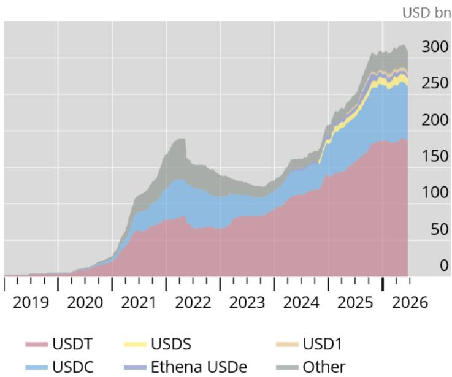  
Graph 1. Stablecoin market capitalisation

Note: Total market capitalisation of stablecoins, in billions of US dollars. Source: Kosse et al. (2023); CoinGecko; authors' calculations.

The use of stablecoins in EMDEs is reminiscent of the widespread reliance of many of these economies on foreign-currency deposits as a store of value, often referred to as "deposit dollarisation". $^{2}$ A number of EMDEs continue to feature significant deposit dollarisation today, and there are clear parallels between conventional dollarisation and the newer phenomenon of "stablecoin dollarisation". At the same time, dollarisation through stablecoins may bring about new challenges. Their ease of access, essentially just requiring a device with internet access, makes them attractive as instruments to gain exposure to foreign currency. Du et al. (2026) show that stablecoin-implied FX rates reflect a sizeable stablecoin access premium driven by the strong demand for dollar exposure in emerging market economies. Operating within borderless, decentralised networks, stablecoins offer use cases in payments and settlements. At the same time, these features make stablecoins harder to track and regulate than traditional dollar deposits. This could increase risks for users and raise challenges for policymakers. $^{3}$

These parallels and contrasts motivate a structured comparison. The historical experience of deposit dollarisation offers decades of cross-country evidence on what drives dollarisation, how persistent it is, and what it implies for monetary control. To the extent that similar forces are at work in the case of stablecoins, that evidence provides a useful benchmark; to the extent that they differ, the comparison helps isolate new dynamics and policy implications.

In this paper, we draw on historical data on dollar deposits going back to the 1990s and novel data on stablecoin flows in recent years to assess the parallels between the two forms of dollarisation. Our analysis yields four main findings.

First, there are important similarities between the drivers of deposit and stablecoin dollarisation. A higher exchange rate pass-through—associated with the portfolio motive of financial dollarisation—and economic or financial crises are both associated with higher deposit dollarisation and greater USD-pegged stablecoin flows. A noteworthy difference is the particular relevance of banking crises for higher stablecoin flows, consistent with the notion that the non-bank nature of stablecoins becomes more attractive if there has been instability in the banking sector.

Second, both deposit dollarisation and stablecoin dollarisation are highly persistent, implying that it is hard to reverse dollarisation once established. At the same time, we find only limited evidence of substitution between dollar deposits and stablecoins, suggesting that the growing demand for US dollar stablecoins in EMDEs largely does not stem from existing US dollar deposits, and vice versa. This could hint that the two markets are segmented to some degree. While the motives of demand for dollar deposits and stablecoins are similar, the economic agents behind these two types of transactions may be different to some extent, for example tech savvy users turning to stablecoins.

Third, FX-related restrictions including prudential regulation and capital controls appear to have little effect on stablecoin dollarisation. While restrictions on accounts and cross-border capital flow restrictions generally reduce deposit dollarisation, neither the latter nor specific restrictions on stablecoin use between residents and non-residents seem to have a statistically significant effect on gross stablecoin inflows.

Fourth, deposit dollarisation has some, albeit generally contained, effects on monetary control. Using an inflation-at-risk framework, we show that the consequences of deposit dollarisation for inflation are non-monotonic: low dollarisation is not significantly associated with inflation risks, moderate dollarisation tends to coincide with somewhat higher inflation across the inflation forecast distribution and highly dollarised economies appear to import monetary-policy credibility. At the same time, interacting monetary policy shocks with the degree of deposit dollarisation does not indicate significant effects of deposit dollarisation on the overall transmission of monetary policy.

The remainder of the paper is structured as follows. This section ends with a review of the relevant literature. Section 2 presents the data. In Section 3, we re-assess the drivers of deposit dollarisation and compare them with early evidence on the drivers of cross-border stablecoin flows. In Section 4, we assess the persistence of deposit dollarisation as an indicator of the lock-in risk from a dollarisation surge. This is followed in Section 5 by an analysis about the impact of regulatory restrictions on dollarisation. In Section 6, we focus on evidence for Latin America and the Caribbean, where the existence of higher frequency data allows us to analyse the dynamic interaction between dollar deposits and stablecoin flows as substitutes or complements, and the role of regional restrictions. In Section 7, we zoom in on the implications of financial dollarisation for monetary control, assessing the effects on inflation control and monetary transmission. Section 8 concludes.

## Literature review

Our paper stands at the intersection of three main strands of literature: the long-standing literature on the causes and implications of dollarisation in EMDEs, the more recent literature on the economic consequences of stablecoins and the literature on macro-financial stability frameworks in EMDEs.

The extensive literature on dollarisation reflects the historical relevance of the phenomenon going back to the 1970s. As highlighted by Levy-Yeyati (2006, 2021), there are different forms of dollarisation. There is official (or de jure) dollarisation when foreign currency gains legal tender status, while unofficial (or de facto) dollarisation refers to situations of parallel use of a local and foreign currency in an economy. In the latter case, there is in turn the distinction between real dollarisation, when foreign currency is used as means of payment or unit of account, and financial dollarisation, when foreign currency is used for borrowing and store of value. Previous literature on deposit dollarisation has highlighted both its macroeconomic and institutional drivers (see eg Honohan and Shi (2001); Reinhart et al. (2014); Levy-Yeyati (2006)). A number of policy papers have also explored the implications of dollarisation for monetary policy (see eg Bennett et al. (1999); Reinhart et al. (2014)). Our paper contributes to this literature in three ways. First, we revisit and expand the assessment of the drivers of deposit dollarisation and provide new evidence on the implications for monetary control. Second, we provide a comparative analysis of the factors driving deposit dollarisation and the use of stablecoins in EMDEs. Third, focusing on data for Latin America and the Caribbean, we analyse the interaction between deposit dollarisation and stablecoin dollarisation. In this respect, a closely related study is Auer et al. (2025), who analyse the factors driving cross-border stablecoin flows, considering a set of macro factors in sending and receiving countries. We complement this study by focusing on factors that help predict future flows and by investigating the possible interplay between deposit and stablecoin dollarisation.

The literature on the macroeconomic implications of stablecoins, to which our paper contributes, is still nascent. $^{4}$ A first strand of this literature studies how stablecoins affect bank balance sheets and credit supply. The key mechanism is that stablecoins compete with bank deposits and thereby weaken the liquidity premium traditionally enjoyed by banks. Recent empirical evidence by Altavilla et al. (2026) shows that stablecoin adoption induces substitution away from retail deposits and increases banks' reliance on wholesale funding. On the theoretical side, Huang and Keister (2026) develop a banking model with stablecoins to analyse credit supply, while Bindseil (2026) discusses the balance-sheet implications of stablecoins. A second strand of the stablecoin literature studies how inflows into stablecoins affect government financing costs. Since stablecoin issuers hold a substantial share of their assets in short-term government securities, inflows into stablecoins can raise demand for safe public debt and compress sovereign yields. Ahmed and Aldasoro (2025) and Cerutti et al. (2026) provide empirical evidence that inflows into dollar-backed stablecoins lower short-term U.S. Treasury bill yields. $^{5}$ A third strand emphasises the international dimension of stablecoins. Because stablecoins can be held and used across borders, their macroeconomic effects depend not only on domestic adoption but also on foreign demand. Azzimonti and Quadrini (2025) show that stablecoins can reshape global demand for dollar reserve assets and increase equilibrium demand for U.S. Treasury bills. Similarly, Minesso and Siena (2026) develop a multi-country model in which foreign households hold stablecoins backed by U.S. treasuries, thereby compressing sovereign yields. Conceptually, this mechanism is related to the broader literature on global safe-asset demand and to work on deposit dollarisation in emerging markets. Hofmann et al. (2026) develop a quantitative macroeconomic model bringing all the different channels together to assess the overall macroeconomic implications from the perspective of the stablecoin issuing economy. Aldasoro, Beltrán, and Grinberg (2026) analyse how inflows into foreign currency denominated stablecoins create spillovers between crypto and conventional FX markets, while Du et al. (2026) study the cost differences between cross-border payments made through banks, fintechs and stablecoins. Aldasoro, Frost, and Ito (2026) examine the various implications of stablecoin use for the international monetary and financial system. Our paper contributes to this literature by assessing the implications of stablecoins from the perspective of EMDEs holding foreign currency denominated stablecoins.

Finally, the paper also contributes to the literature on macro-financial stability frameworks in EMEs. Rey (2013) prominently highlighted that financial globalization has transformed the classical trilemma into a dilemma, so that monetary control can only be reestablished through the active management of capital flows. In this vein, Jeanne and Korinek (2010), Bianchi (2011), Farhi and Werning (2014), Benigno et al. (2015), Korinek and Sandri (2016) and Bruno et al. (2017) demonstrate how macroprudential and capital flow management measures can be effective in enhancing macro-financial stability. We contribute to this literature by assessing the implications of stablecoins for EMDEs and the challenges they may pose for these economies' macro-financial stability frameworks.

## 2 Data

The analysis draws on cross-country data on deposit dollarisation as well as data on cross-border stablecoin flows as the main outcome variables.

## Dollar deposits

For dollar deposits, we use both annual data for the broad global sample and quarterly data for a smaller group of Latin American countries.

Annual data on deposit dollarisation - defined as the ratio of foreign-currency deposits to total deposits - are obtained from Levy-Yeyati (2021). They cover more than 130 economies over 1990 to 2019. Despite substantial changes in the macroeconomic environment, especially the longer-term global decline in inflation, the cross-country distribution of deposit dollarisation has been remarkably stable. Graph 2 plots the cross-country distribution of deposit dollarisation in 1990, 2000, 2010 and 2019. In each year the median sits in a narrow band around 0.2 to 0.3, the interquartile range stretches from roughly 0.05 to 0.5, and the upper whisker reaches close to 1, indicating that some economies are fully dollarised. Economies that are fully dollarised are those where the US dollar acts as official legal tender. The 1990 distribution is somewhat more compressed at the top, with a maximum nearer to 0.85, but from 2000 onwards the picture is essentially unchanged.

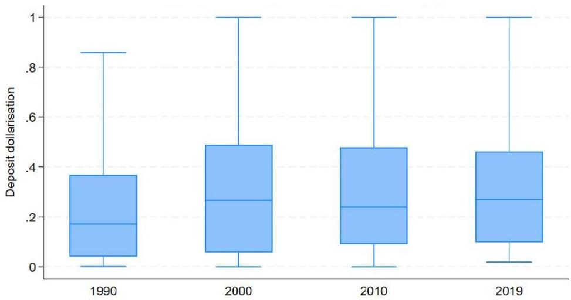  
Graph 2. Distribution of deposit dollarisation by year

Note: Boxes show medians and interquartile (IQR) ranges; whiskers show the 25th/75th percentiles plus or minus 1.5 times the IQR. Source: Levy-Yeyati (2021) and authors' calculations.

To leverage recent and higher-frequency (quarterly) data available for a sub-sample of Latin American countries, we use data on foreign-currency deposits from the Inter-American Development Bank. Dollarisation is a longstanding, yet a heterogeneous feature of Latin American financial systems. Several regional economies are fully dollarised (eg Panama, Ecuador and El Salvador), while others exhibit partial dollarisation with significant shares of bank deposits denominated in US dollars (eg Argentina, Bolivia and Peru). $^{6}$

Graph 3 plots the median and the interquartile range of the foreign currency deposit ratio for the Latin American countries over the period 1990-2024. The chart shows that deposit dollarisation across Latin America is heterogeneous and relatively volatile. Specifically, over the last two decades, the median deposit dollarisation ratio dropped from around 40% to roughly 20%. However, data availability is not stable in the earlier years.

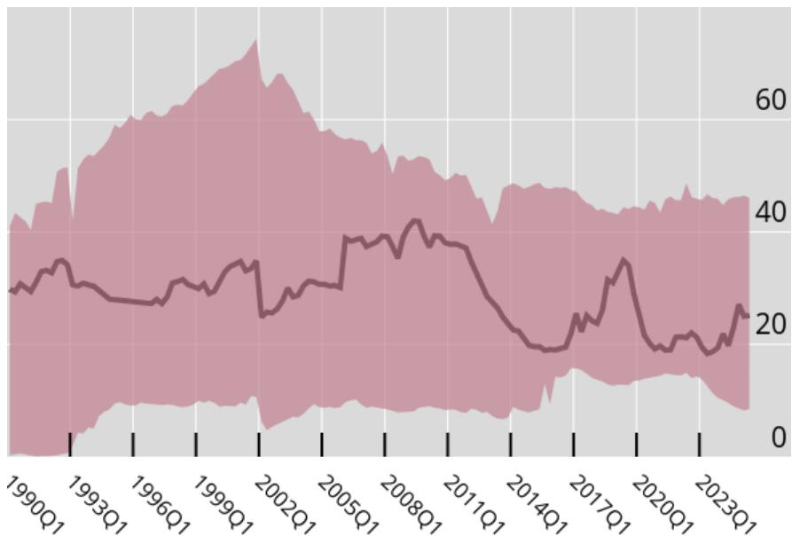  
Graph 3. Distribution of deposit dollarisation in Latin America over time, quarterly data

Note: The figure illustrates the cross-country distribution, where the line represents the median and the shaded band indicates the interquartile range. The sample of countries is not consistent over time due to data availability. Source: Inter-American Development Bank and authors' calculations.

## Cross-border stablecoin flows

As a measure of stablecoin use and adoption, we rely on cross-border stablecoin flows. As stablecoin transfers lack country attribution, a first step derives inter-entity flows based on address-entity associations and transfers in blockchain networks. In a second step, stablecoin flows are allocated pro rata to countries based on web-traffic distribution of the respective transacting entities, primarily major crypto exchanges. We employ gross inflows on a country basis. We use gross rather than net flows - the latter tend to be small, as stablecoin inflows and outflows are highly correlated. $^{7}$ Gross inflows on a country level are also more likely correlated with overall adoption and thus more similar to dollar deposits which represent stocks rather than flows. Stablecoin data cover the two largest USD-pegged stablecoins, USDT and USDC, which together make up over 80% of stablecoin market capitalisation. Country-level quarterly data on stablecoin inflows come from Chainalysis. The dataset covers 184 countries from 2017 to 2024.

The data show that cross-border stablecoin flows are a phenomenon that became quantitatively relevant only over the past few years. Graph 4 plots the cross-country distribution of stablecoin inflows to GDP for 2019, 2021 and 2023. The 2019 distribution is essentially flat at zero, with the entire interquartile range collapsing onto the horizontal axis. By 2021 the distribution opens out: the median rises to about 1.2% of GDP, the interquartile range extends roughly from 0.2% to 3% of GDP, and the upper whisker reaches close to 7% of GDP. By 2023 the distribution is similar but slightly compressed, with the median at about 0.9% of GDP and the upper whisker around 5%. The pattern underscores both how recent the phenomenon is and how heterogeneous conditions across countries have become within a short time span.

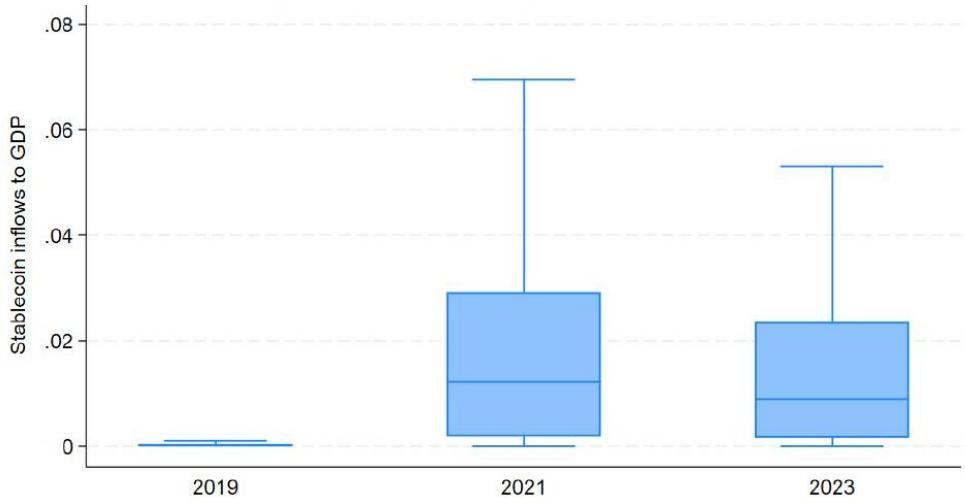  
Graph 4. Distribution of gross stablecoin inflows by year  
Note: Boxes show medians and interquartile (IQR) ranges; whiskers show the 25th/75th percentiles plus or minus 1.5 times the IQR. Source: Authors' calculations based on Auer et al. (2025) and Chainalysis data.

## Other data

Our regressions also include a number of macroeconomic controls both at annual and quarterly frequency. As to the annual variables, inflation is from the World Bank's global database of inflation (Ha et al. (2023)); sovereign credit ratings are from the World Bank's cross-country database of fiscal space (Kose et al. (2022)); all other annual macroeconomic variables, including the crisis dates, are from the Global Macro Database (Müller et al. (2025)). Regulatory restrictions on foreign currency accounts and cross-border stablecoin use are from the IMF AREAER database and a novel dataset on restriction indices by Bergant et al., 2026. The output gap is obtained by extracting the trend of (log) real GDP by a conventional HP-filter, with a smoothing parameter of 100. Some of the estimations are conducted separately for different country groups; those for advanced economies (AEs) and emerging market and developing economies (EMDEs) are based on IMF WEO classification. Quarterly variables, used in the estimations for Latin America and the Caribbean, are from the Inter-American Development Bank's Latin Macro Watch database.

## 3 Drivers of higher deposit dollarisation and stablecoin flows: a comparative analysis

We assess and compare the drivers of deposit dollarisation and stablecoin inflows from various perspectives. We first analyse the macro-financial factors predicting increases in future deposit dollarisation in the annual dataset. With these results as reference point, we explore the macro-financial drivers predicting future stablecoin flows, establishing similarities and differences.

## 3.1 Increases in deposit dollarisation—drivers

We estimate the following panel equation for deposit dollarisation:

$$
\Delta_ {1 0} D o l l _ {i, t + 1 0} = \alpha_ {i} + \beta_ {1} D o l l _ {i, t - 1} + \beta_ {2} X _ {i, t - 1} + u _ {i, t + 1 0},\tag{1}
$$

The dependent variable $\Delta_{10}Doll_{i,t+10}$ is the 10-year change in the deposit dollarisation ratio. $^{8}$ We focus on the change in deposit dollarisation (rather than its level) in order to evaluate what factors were associated with persistent increases in dollarisation in the past. The right-hand side variables include the one-year lag of the level deposit dollarisation, $Doll_{i,t-1}$ , capturing convergence dynamics. As for the other explanatory variables, to maintain a relatively parsimonious specification, we include the explanatory variables similar to those considered in Levy-Yeyati (2021): 5-year average inflation rate and the degree of exchange rate pass-through. We further add three crises dummies covering banking, currency and sovereign-debt crises, obtained from Müller et al. (2025). The sample runs from 1990 to 2019.

The inclusion of the inflation rate stems from the literature on currency substitution, where an increase in expected inflation raises the dollarisation of transaction balances. $^{9}$ Through this channel, inflation would also affect deposit dollarisation to the extent that deposit holdings reflect the transaction demand for foreign currency.

The inclusion of exchange rate pass-through as an explanatory variable is more closely related to asset dollarisation, including through a store of value motive. In a portfolio approach to dollarisation, assets are increasingly dollarised when the real exchange rate, which matters for the volatility of real returns in foreign currency instruments, is stable relative to the inflation rate, which matters for the volatility of real returns in local currency instruments. This can be captured by a simple measure of exchange rate pass-through: the coefficient on the domestic currency's depreciation in a contemporaneous regression of inflation on exchange rate changes. The higher the degree of pass-through, the stronger is the incentive for the deposit holders to dollarise. We estimate the exchange rate pass-through, by country, from 20-year rolling regressions of the annual inflation rate on the annual change in the (log) bilateral exchange rate against the US dollar.

Table 1. Drivers of higher deposit dollarisation

<table><tr><td>VARIABLES</td><td>(1) $\Delta_{10}Doll_{t+10}$ </td><td>(2) $\Delta_{10}Doll_{t+10}$ </td><td>(3) $\Delta_{10}Doll_{t+10}$ </td><td>(4) $\Delta_{10}Doll_{t+10}$ </td><td>(5) $\Delta_{10}Doll_{t+10}$ </td><td>(6) $\Delta_{10}Doll_{t+10}$ </td><td>(7) $\Delta_{10}Doll_{t+10}$ </td><td>(8) $\Delta_{10}Doll_{t+10}$ </td></tr><tr><td>Dollarisation level</td><td>-0.854***(0.0565)</td><td>-0.882***(0.0605)</td><td>-0.879***(0.0602)</td><td>-0.882***(0.0604)</td><td>-0.879***(0.0603)</td><td>-0.822***(0.0643)</td><td>-0.798***(0.0407)</td><td>-0.738***(0.0472)</td></tr><tr><td>5y average inflation</td><td>1.91e-05(1.19e-05)</td><td>2.43e-05*(1.39e-05)</td><td>2.58e-05*(1.39e-05)</td><td>2.44e-05*(1.40e-05)</td><td>2.58e-05*(1.38e-05)</td><td>1.49e-05(1.33e-05)</td><td>2.77e-05**(1.36e-05)</td><td>1.86e-05(1.32e-05)</td></tr><tr><td>Exc rate pass through</td><td>0.00198(0.00181)</td><td>0.00927**(0.00387)</td><td>0.00949**(0.00372)</td><td>0.00927**(0.00388)</td><td>0.00947**(0.00373)</td><td>0.00963***(0.00304)</td><td>0.00854**(0.00379)</td><td>0.00932***(0.00319)</td></tr><tr><td>Banking crisis</td><td></td><td>0.00468(0.0120)</td><td></td><td></td><td>0.00136(0.0122)</td><td>0.00116(0.0113)</td><td>0.00780(0.0145)</td><td>0.00512(0.0128)</td></tr><tr><td>Sov debt crisis</td><td></td><td></td><td>0.0607**(0.0246)</td><td></td><td>0.0611**(0.0245)</td><td>0.0466*(0.0242)</td><td>0.0597**(0.0245)</td><td>0.0443*(0.0241)</td></tr><tr><td>Currency crisis</td><td></td><td></td><td></td><td>0.000880(0.00904)</td><td>-0.00437(0.0101)</td><td>-0.0127(0.00992)</td><td>-0.00380(0.0105)</td><td>-0.00967(0.0103)</td></tr><tr><td>Constant</td><td>0.279***(0.0195)</td><td>0.276***(0.0204)</td><td>0.273***(0.0202)</td><td>0.276***(0.0201)</td><td>0.274***(0.0204)</td><td>0.308***(0.0263)</td><td>0.262***(0.0155)</td><td>0.307***(0.0251)</td></tr><tr><td>Fixed effects</td><td>Country</td><td>Country</td><td>Country</td><td>Country</td><td>Country</td><td>Country&amp;time</td><td>Country</td><td>Country&amp;time</td></tr><tr><td>Type of economies</td><td>AE&amp;EMDE</td><td>AE&amp;EMDE</td><td>AE&amp;EMDE</td><td>AE&amp;EMDE</td><td>AE&amp;EMDE</td><td>AE&amp;EMDE</td><td>EMDE</td><td>EMDE</td></tr><tr><td>Observations</td><td>1,676</td><td>1,468</td><td>1,465</td><td>1,465</td><td>1,465</td><td>1,465</td><td>1,165</td><td>1,165</td></tr><tr><td>R-squared</td><td>0.455</td><td>0.481</td><td>0.487</td><td>0.481</td><td>0.487</td><td>0.514</td><td>0.460</td><td>0.503</td></tr><tr><td>Number of economies</td><td>127</td><td>111</td><td>110</td><td>110</td><td>110</td><td>110</td><td>87</td><td>87</td></tr></table>

Note: Robust standard errors in parentheses; \*\*\* $p < 0.01$ , \*\* $p < 0.05$ , \* $p < 0.1$ . Dependent variable: 10-year change in the deposit dollarisation ratio ( $\Delta_{10}Doll_{t+10}$ ). Source: authors' estimates.

The results in Table 1 indicate significant convergence dynamics and an important role for macro-financial instability. The lagged level of deposit dollarisation enters with a strongly negative and highly significant coefficient (around -0.7 to -0.9 in Columns (1) and (8)), consistent with mean reversion conditional on the other determinants: economies with already high deposit dollarisation see smaller subsequent increases. Higher exchange-rate pass-through is significantly associated with subsequent increases in dollarisation. The economic significance is also relevant. In the specification of Column (6), which includes all economies and both country and time fixed effects, a one standard deviation increase in exchange rate pass-through is associated with a three percentage point increase in the degree of deposit dollarisation over the next ten years.

Among the three crises variables, it is sovereign debt crises that emerge as statistically and economically significant. In the specifications that include all explanatory variables, sovereign debt crises are associated with 4-6 percentage points higher deposit dollarisation ratio over the next ten years. These are sizable effects given that the cross-country median of deposit dollarisation is around 0.25 to 0.30. That said, the statistical significance weakens somewhat when time fixed effects are included. In some of the specifications, the 5-year average inflation also enters with a positive and statistically significant coefficient. In Specification (7) for EMDEs, a one standard deviation increase in the 5-year inflation rate is associated with a 1 percentage point higher deposit dollarisation ratio. However, the statistical significance of the inflation rate weakens when time fixed effects are included.

Overall, the results are consistent with the intuition that dollarisation builds up when sovereign-credit shocks erode confidence in domestic financial claims and when the exchange rate transmits external shocks more strongly into prices.

Annex Section A.1 includes further estimates in the spirit of Levy-Yeyati (2006), where additional macro-institutional variables are considered as drivers of the level of deposit dollarisation, and conducted in the cross-sectional rather than the panel dimension.

Table 2. Drivers of stablecoin inflows

<table><tr><td></td><td>(1)</td><td>(2)</td><td>(3)</td><td>(4)</td><td>(5)</td><td>(6)</td><td>(7)</td></tr><tr><td>VARIABLES</td><td>SC</td><td>SC</td><td>SC</td><td>SC</td><td>SC</td><td>SC</td><td>SC</td></tr><tr><td>5y average inflation</td><td>3.43e-06(0.000156)</td><td>-1.88e-06(0.000426)</td><td>-0.000303(0.000450)</td><td>-0.000118(0.000405)</td><td>-8.35e-05(0.000509)</td><td>-5.53e-05(0.000488)</td><td>-0.000198(0.000527)</td></tr><tr><td>Exc rate pass through</td><td>8.85e-05***(3.33e-05)</td><td>7.26e-05**(3.63e-05)</td><td>8.84e-05**(3.86e-05)</td><td>0.000121***(3.64e-05)</td><td>7.79e-05*(4.00e-05)</td><td>0.000118***(3.81e-05)</td><td>0.000107***(3.67e-05)</td></tr><tr><td>Dollarisation level</td><td></td><td>0.0127(0.00798)</td><td>0.0117(0.00880)</td><td>0.0128(0.00875)</td><td>0.0136(0.00918)</td><td>0.0128(0.00958)</td><td>0.0105(0.0104)</td></tr><tr><td>Sov debt crisis</td><td></td><td></td><td>0.197(0.126)</td><td></td><td></td><td>0.101(0.117)</td><td>0.0683(0.117)</td></tr><tr><td>Banking crisis</td><td></td><td></td><td></td><td>0.242*(0.124)</td><td></td><td>0.202(0.130)</td><td>0.332**(0.153)</td></tr><tr><td>Currency crisis</td><td></td><td></td><td></td><td></td><td>-0.00567(0.0802)</td><td>-0.0353(0.0714)</td><td>-0.0313(0.0712)</td></tr><tr><td>Constant</td><td>0.0128***(0.00154)</td><td>0.0120***(0.00309)</td><td>0.0132***(0.00339)</td><td>0.00988***(0.00338)</td><td>0.0131***(0.00331)</td><td>0.0102***(0.00354)</td><td>0.0112***(0.00415)</td></tr><tr><td>Type of economies</td><td>AE&amp;EMDE</td><td>AE&amp;EMDE</td><td>AE&amp;EMDE</td><td>AE&amp;EMDE</td><td>AE&amp;EMDE</td><td>AE&amp;EMDE</td><td>EMDE</td></tr><tr><td>Observations</td><td>162</td><td>104</td><td>95</td><td>95</td><td>95</td><td>95</td><td>77</td></tr><tr><td>R-squared</td><td>0.001</td><td>0.024</td><td>0.078</td><td>0.111</td><td>0.024</td><td>0.125</td><td>0.194</td></tr></table>

Note: Robust standard errors in parentheses; \*\*\* $p < 0.01$ , \*\* $p < 0.05$ , \* $p < 0.1$ . Dependent variable: Gross stablecoin inflows to GDP, 2017-24. Source: authors' estimates.

## 3.2 Stablecoin inflows - drivers

We then consider stablecoin inflows. Due to the short time span over which stablecoin cross-border flow data are available, we conduct the analysis at the cross-sectional level. The estimated equation to assess the drivers of future stablecoin inflows takes the form:

$$
S C _ {i, 2 0 1 7 - 2 0 2 4} = \alpha + \beta_ {1} D o l l _ {i, 2 0 1 6} + \beta_ {2} X _ {i, 2 0 1 6} + u _ {i},\tag{2}
$$

The dependent variable is gross stablecoin inflows over 2017 to 2024, by country, measured as ratio to GDP. Similarly to the specification for deposit dollarisation, which considers persistent increases in foreign currency deposits, we are interested in uncovering factors that led to greater stablecoin adoption in the past. The right-hand side variables refer to observations as of 2016.

As in the specification for deposit dollarisation, we include 5-year average inflation, the degree of exchange rate pass-through and three crisis dummy variables as the explanatory variables. Similarly to the model for deposit dollarisation, the one-year exchange-rate pass-through is measured over the previous 20 years. We also include the lagged level of deposit dollarisation, in order to examine whether conventional dollarisation predicts subsequent stablecoinisation.

Compared with results from the deposit-dollarisation regression, two differences stand out (Table 2). First, banking-crisis history matters for stablecoin inflows but not for deposit dollarisation. Their significance arises especially in the joint specification focusing on EMDEs, Column (7). The economic significance is relatively large. A one-standard-deviation increase in banking-crisis frequency is associated with about 0.8% of GDP higher stablecoin inflows. This compares with average stablecoin inflows of 1.7% of GDP during 2017-24, for the sample considered in Column (7). The result is interesting, given that stablecoins are circulating outside the banking system. Second, sovereign debt crises, which were a predictor of conventional deposit dollarisation, do not seem to matter for stablecoin inflows over the short sample studied here. Both findings warrant further investigation as more data accumulate. And as in earlier regressions, exchange rate pass-through obtains a positive and a statistically significant relationship with stablecoin inflows.

Similarly to the case of deposit dollarisation, we also investigate the drivers of gross stablecoin inflows using a broader set of macro-institutional variables. The results are shown in Annex Section A.2.

## 3.3 Exchange rate pass-through - some implications

The impact of exchange rate pass-through on dollarisation could influence what type of countries are more likely to dollarise. As pointed out by Levy-Yeyati, 2006, this could be the case for the more open and smaller economies, given that they tend to display higher rates of exchange rate pass-through. Table 3 and Table 4 provide some, albeit weak, evidence supporting these conjectures.

Table 3. Trade openness, deposit dollarisation and stablecoins

<table><tr><td></td><td>Trade openness</td><td>Trade openness</td><td>Trade openness</td><td>Trade openness</td></tr><tr><td>Variable</td><td>Dep. dollarisation</td><td>Dep. dollarisation</td><td>Dep. dollarisation</td><td>Stablecoin dollarisation</td></tr><tr><td>Year</td><td>2000</td><td>2010</td><td>2019</td><td>2017-24</td></tr><tr><td>Correlation</td><td>0.0954 (0.3793)</td><td>0.0903 (0.4027)</td><td>0.0732 (0.5956)</td><td>0.2388 (0.0116)**</td></tr></table>

Note: Correlation coefficients, for trade openness and deposit (dep.) dollarisation, and for trade openness and stablecoin dollarisation, respectively. Stablecoin dollarisation is measured as gross stablecoin inflows to GDP. p-values in parentheses; \*\*\* p < 0.01, \*\* p < 0.05, \* p < 0.1. EMDEs only. Source: authors' estimates.

Take trade openness first, measured as the ratio of exports and imports to GDP. Considering EMDEs in a cross-section at different points in time, Table 3 shows that deposit dollarisation is positively, but only weakly, correlated with exchange rate pass-through (first three columns). Interestingly, for stablecoins we similarly obtain a positive but also a statistically significant correlation between dollarisation and trade openness (last column).

Consider the size of the economy next. Larger economies tend to see lower dollarisation, and more significantly so when deposits are used as the measure of dollarisation (Table 4). By contrast, for stablecoins the degree of dollarisation appears only weakly related to the economy size.

These results focus on the sample of EMDEs, given their generally higher exchange rate pass-through and the importance of the dollarisation phenomenon in these economies. Including also AEs yields similar results albeit with slightly weaker statistical significance. $^{10}$

Table 4. Economy size, deposit dollarisation and stablecoins

<table><tr><td></td><td>Economy size</td><td>Economy size</td><td>Economy size</td><td>Economy size</td></tr><tr><td>Variable</td><td>Dep. dollarisation</td><td>Dep. dollarisation</td><td>Dep. dollarisation</td><td>Stablecoin dollarisation</td></tr><tr><td>Year</td><td>2000</td><td>2010</td><td>2019</td><td>2017-24</td></tr><tr><td>Correlation</td><td>-0.1247 (0.2027)</td><td>-0.2014 (0.0394)**</td><td>-0.1856 (0.1387)</td><td>-0.0449 (0.5918)</td></tr></table>

Note: Correlation coefficients, for economy size and deposit (dep.) dollarisation, and for economy size and stablecoin dollarisation, respectively. Stablecoin dollarisation is measured as gross stablecoin inflows to GDP. p-values in parentheses; \*\*\* p < 0.01, \*\* p < 0.05, \* p < 0.1. Source: authors' estimates.

## 4 Dollarisation persistence

A key question in the context of dollarisation concern its persistence. If an increase in dollarisation was very persistent, de-dollarisation through the establishment of sound policies and institutions would be harder and potentially more painful. We assess the persistence of dollarisation based on event studies - pre- and post-exit from high inflation regimes - and simple autoregressions.

## 4.1 Event-study evidence on persistence

Deposit dollarisation turns out to be highly persistent even after the macroeconomic conditions that may have triggered it have passed. The left-hand panel of Graph 5 plots the median deposit dollarisation and the interquartile range, from five years before to four years after the exit from a high-inflation regime. The latter is defined using the threshold of 100% for the five-year moving average of the inflation rate. $^{11}$ Dollarisation drifts upwards in the run-up to the exit $(t-5\text{ to }t)$ , reaching levels of around 50%, and stays close to that level through $t+4$ . There is no detectable downward trend after the high-inflation regime ends, although the interquartile range remains wide, between roughly 40 and 65%.

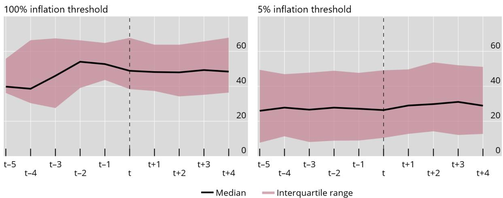  
Graph 5. Deposit dollarisation, pre- and post-exit from high-inflation regime.

Note: Event study, dollarisation ratio shown in per cent. The figure shows the median (solid line) and interquartile range (shaded band) of deposit dollarisation from t - 5 to $t + 4$ , where t is the year of exit from the high-inflation regime. The left-hand panel uses a 100% threshold to define the high-inflation regime; the right-hand panel a 5% threshold.

One question that arises is whether the 100% inflation threshold is too high to show any meaningful decline in dollarisation after an exit from a high-inflation regime. The right-hand panel of Graph 5 considers a lower, 5%, threshold for the five-year moving average of the inflation rate. Not surprisingly, the median dollarisation ratio is lower around the years of exit from the high inflation regime in this case, below 30%. However, even with this lower threshold there is no meaningful decline in dollarisation following the exit from a high inflation regime, underscoring the entrenched nature of dollarisation.

## 4.2 Autoregressions

To put a number on persistence, we estimate simple AR(1) models with fixed effects and interaction variables on annual data:

$$
D o l l _ {i, t} = \alpha_ {i} + \beta_ {1} D o l l _ {i, t - 1} + \beta_ {2} D _ {i, t} \cdot D o l l _ {i, t - 1} + \beta_ {3} D _ {i, t} + u _ {i, t},\tag{3}
$$

where $D_{i,t}$ is a dummy referring either to a time period (2000 to 2019) or to a country group (AEs). $\alpha_{i}$ denote country fixed effects. $^{12}$

The results, reported in Table 5, underscore the notable persistence in deposit dollarisation. The coefficient on lagged dollarisation is close to 0.8 across specifications. Standard errors are tight, $R^{2}$ values are high (around 0.75), and the interaction terms with the post-2000 dummy and the AE dummy are small and insignificant. Persistence is therefore similar in advanced and emerging market and developing economies, and has not declined since 2000. In Section 6, we leverage on higher frequency data for Latin America and the Caribbean to analyse the persistence of stablecoin dollarisation and compare it with the persistence of deposit dollarisation in that region.

Table 5. Persistence of deposit dollarisation: Autoregressive estimates

<table><tr><td>VARIABLES</td><td>(1)  $Doll_t$ </td><td>(2)  $Doll_t$ </td><td>(3)  $Doll_t$ </td></tr><tr><td> $Doll_{t-1}$ </td><td>0.829***(0.0278)</td><td>0.832***(0.0316)</td><td>0.824***(0.0323)</td></tr><tr><td> $Doll_{t-1} \times D_{2000-19}$ </td><td></td><td>-0.00368(0.00982)</td><td></td></tr><tr><td> $D_{2000-2019}$ </td><td></td><td>0.00695(0.0134)</td><td></td></tr><tr><td> $Doll_{t-1} \times D_{AE}$ </td><td></td><td></td><td>0.0347(0.0480)</td></tr><tr><td>Constant</td><td>0.0465***(0.0134)</td><td>0.0457***(0.0137)</td><td>0.0464***(0.0135)</td></tr><tr><td>Observations</td><td>3,447</td><td>3,447</td><td>3,447</td></tr><tr><td> $R^2$ </td><td>0.751</td><td>0.751</td><td>0.751</td></tr><tr><td>Type of economies</td><td>AEs &amp; EMDEs</td><td>AEs &amp; EMDEs</td><td>AEs &amp; EMDEs</td></tr><tr><td>Number of economies</td><td>153</td><td>153</td><td>153</td></tr></table>

Note: Robust standard errors in parentheses; \*\*\* $p < 0.01$ , \*\* $p < 0.05$ , \* $p < 0.1$ . Dependent variable: deposit dollarisation in year $t$ (Doll $_{t}$ ). Source: authors' estimates based on Levy-Yeyati (2021).

## 5 Regulatory restrictions on dollarisation

Dollarisation through stablecoins also raises new challenges. For one, dollar-denominated stablecoins provide a readily accessible substitute for domestic currencies in jurisdictions that have imposed restrictions on the holdings of foreign currency deposits in the past. A number of economies, in particular EMDEs, fall into this category. The ability to access and transfer funds in foreign currency 24/7 with only an internet connection adds to the attractiveness of stablecoins compared to foreign currency bank accounts or cash. Importantly, capital flow restrictions may apply to regulated entities like banks, and their effectiveness depends on the potential for circumvention, which may be easier to achieve in the case of stablecoins via entities outside the regulatory perimeter.

An important dimension in which exposure to foreign currency through conventional bank deposits and stablecoins might differ is hence the extent to which FX restrictions and capital controls bind. The red lines in Graph 6 show evidence for domestic foreign currency deposits. They show the distributions of deposit dollarisation for economies where residents' access to domestic foreign currency accounts is subject to approval (first line) and for those where no approval is required (second line), respectively. Taking just one example of such restrictions, the IMF 2023 Annual Report on Exchange Arrangements and Exchange Restrictions (AREAER) states that, for Fiji, the opening of foreign exchange accounts by resident individuals requires a permission from the Reserve Bank of Fiji.

The red lines in Graph 6 show that the interquartile range for the share of foreign currency deposits in total deposits is much lower in economies that impose approval requirements for domestic foreign currency deposits, over the period 2000-19. Indeed, the median deposit dollarisation ratio is around 5% when restrictions are in place, compared to over 30% in the case of no restrictions.

The right-hand panel of Graph 6 shows evidence for gross stablecoin inflows to GDP, during 2022-23, under two different regulatory regimes. In the first one, there are restrictions (at least partial) in stablecoin use between residents and non-residents; in the second one, no restrictions are in place. Take again the example of Fiji, for which the IMF AREAER documents the presence of restrictions. Specifically, for "current" transactions, only fiat currency is accepted as mode of payment, and for capital transactions the settlement in cryptocurrencies is not allowed.

Graph 6 shows that, in the case of stablecoins, the relationship with regulatory restrictions is much less obvious. The size of stablecoin inflows to GDP is broadly similar under the two regulatory regimes, with the median inflows between 1-1.5% of GDP. That said, such evidence does not show the counterfactual - it is possible that gross stablecoin inflows would have been even higher in economies with restrictions on stablecoin use.

These effects can also be examined formally. Consider the estimations in Annex Table A1 that include a broad range of macroeconomic and institutional factors as drivers of the level of deposit dollarisation in 2017. The results imply that, for the full sample of AEs and EMDEs, the deposit dollarisation ratio was 29 ppts lower in a country that had restrictions on foreign currency deposits during each year in 2000-16, compared to a country that had no restrictions in place in any of these years. For the sample of EMDEs, the effect rises to 32 percentage points. Both relationships are highly statistically significant.

Take then the corresponding estimates for gross stablecoin inflows in Annex Table A2. As restrictions data are only available for 2022-23, we use the prevailing restrictions in 2022 as a proxy for the 2017-23 sample. As such, the results need to be taken with a grain of salt. That said, the results concur with those shown Graph 6 - there appears to be no statistically significant relationship between restrictions on cross-border stablecoin use between residents and non-residents and the size of gross stablecoin inflows to GDP.

What might explain the differences in the results? FX restrictions and capital flow management measures are likely to be much easier to impose on regulated financial intermediaries. By contrast, stablecoins circulate in public, permissionless blockchains. The coins may be held in unhosted wallets, giving rise to lower regulatory and supervisory visibility.

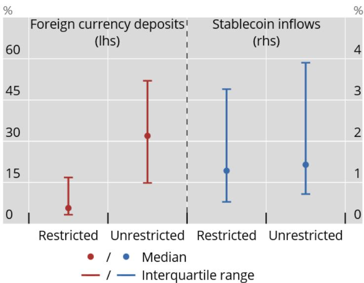  
Graph 6. Restrictions on dollar deposits and on stablecoin flows

Note: Share of foreign currency deposits (2000–19) and stablecoin inflows to GDP (2022–23) under different regulatory regimes. Restrictions on foreign currency deposits refer to approval requirements on domestic foreign currency deposits; for stablecoins, restrictions refer to limits on stablecoin use between residents and non-residents. Source: authors' calculations.

## 6 Dynamics and policy frictions in dollarisation channels

To further assess the drivers and dynamic interaction of dollar deposits and stablecoin flows, we leverage higher frequency data for Latin American countries. These data are interesting for our analysis for a number of reasons. First, they allow us to study the recent dynamic interaction between the two types of dollarisation, assessing potential substitutability and complementarity. Second, they allow to further examine the persistence of deposit dollarisation and to compare it with stablecoin dollarisation. Third, they enable a granular analysis of the effects of cross-border capital flow restrictions on foreign currency deposits and stablecoin flows.

To offer an overview of regional dynamics, Graph 7 presents stablecoin inflows as percentage of GDP and foreign currency deposits as a share of total deposits, highlighting the heterogeneity across countries in Latin America. Countries exhibit a wide span of deposit dollarisation levels, from barely to fully dollarised (x-axis). Gross stablecoin inflows range from just above zero to 4% of GDP (y-axis). Foreign currency deposits are still several orders of magnitude higher—when measured relative to GDP (not shown), they predominantly lie between 40% and 80%. Notably, stablecoin flows are observed across different levels of deposit dollarisation. Fully (deposit-)dollarised economies tend to have relatively high stablecoin flows. Meanwhile, some countries exhibit high stablecoin flows alongside low levels of deposit dollarisation, suggesting that stablecoins may act as a partial substitute for traditional foreign currency deposits or a new form of dollarisation hitherto absent.

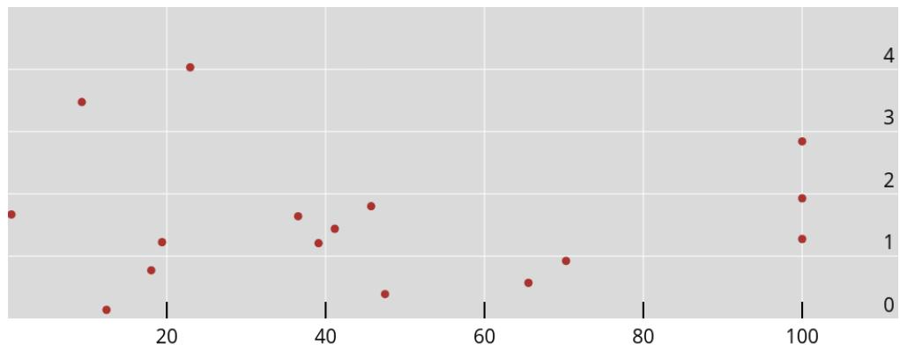  
Graph 7. Foreign currency deposits and gross stablecoin flows in Latin America

Note: The chart shows a scatter of stablecoin flows as percentage of GDP on the y-axis and foreign-currency deposits as share of total deposits on the x-axis, per country for 2024. The graph includes fully dollarised economies (Ecuador, El Salvador and Panama), which exhibit foreign currency deposit shares of 100 percent. Source: Chainalysis and Inter-American Development Bank.

Foreign currency deposits and stablecoin flows may interact either as substitutes or complements, each potentially influencing the dynamics of the other. To assess whether movements in stablecoin activity contain predictive information for deposit dollarisation and vice versa, we include lagged deposit dollarisation levels and lagged gross stablecoin flows to GDP as explanatory variables in our model, estimated at a quarterly frequency. The specification is given by:

$$
D o l l _ {i, t} = \alpha_ {i} + \beta_ {1} D o l l _ {i, t - 1} + \beta_ {2} S C _ {i, t - 1} + \beta_ {3} X _ {i, t} + u _ {i, t},\tag{4}
$$

where $Doll_{i,t}$ represents the level of deposit dollarisation in country i at time t and $SC_{i,t-1}$ denotes lagged stablecoin flows as percentage of GDP. The model further incorporates macroeconomic determinants in the vector $X_{i,t}$ : exchange rate pass-through over a five-year horizon, the mean inflation rate over the same period and, in an extension, different indices of cross-border flow restrictions. $^{13}$ The model is estimated using country and quarterly fixed effects to control for unobserved heterogeneity across countries and over time.

Respectively, we also estimate the model with stablecoin flows to GDP as the dependent variable:

$$
S C _ {i, t} = \alpha_ {i} + \beta_ {1} D o l l _ {i, t - 1} + \beta_ {2} S C _ {i, t - 1} + \beta_ {3} X _ {i, t} + u _ {i, t}.\tag{5}
$$

We restrict the sample to non-missing observations and exclude fully dollarised countries from the empirical analysis. Due to the very limited number of banking, currency and sovereign debt crises in the Latin American sample over the time horizon, we exclude these variables in our estimates. $^{14}$

The results in Table 6 show that both stablecoin flows and foreign currency deposits in particular are highly persistent. This is indicated by the positive and statistically significant coefficients on the lagged dependent variables in line with the magnitude of the earlier results at the global level. For foreign currency deposits, the coefficient estimate on the lagged dependent variable is high—also reflecting the fact that deposits represent a stock variable—with estimates consistently above 0.9. For stablecoin flows, the estimated coefficient on the lagged dependent variable lies above 0.4 across specifications. The predictive power of foreign currency deposits for stablecoin flows, and vice versa, is statistically insignificant across most specifications. The relationship is predominantly negative, indicating limited evidence of substitution between deposit dollarisation and stablecoin dollarisation. Exchange rate pass-through is insignificant across specifications, whereas inflation shows a consistently positive relationship with gross stablecoin inflows as well as with foreign currency deposits. The effect is marginally significant for foreign currency deposits but highly significant for stablecoin flows. This suggests that stablecoin flows could be more responsive to broader macroeconomic factors, potentially influencing their future adoption across countries.

Table 6. Quarterly dynamics of stablecoin flows and foreign currency deposits

<table><tr><td rowspan="2"></td><td colspan="3"> $Doll_t$ </td><td colspan="3"> $SC_t$ </td></tr><tr><td>(1)</td><td>(2)</td><td>(3)</td><td>(4)</td><td>(5)</td><td>(6)</td></tr><tr><td> $SC_{t-1}$ </td><td>-0.081*(0.045)</td><td></td><td>-0.105(0.061)</td><td>0.532***(0.068)</td><td>0.413***(0.068)</td><td>0.411***(0.071)</td></tr><tr><td> $Doll_{t-1}$ </td><td>0.906***(0.016)</td><td>0.917***(0.020)</td><td>0.915***(0.019)</td><td>-0.048(0.028)</td><td></td><td>-0.023(0.026)</td></tr><tr><td>Exc rate pass-through</td><td></td><td>-0.011(0.010)</td><td>-0.012(0.010)</td><td></td><td>0.009(0.010)</td><td>0.013(0.011)</td></tr><tr><td>5y inflation</td><td></td><td>0.009(0.008)</td><td>0.023*(0.011)</td><td></td><td>0.077***(0.012)</td><td>0.071***(0.012)</td></tr><tr><td>Constant</td><td>3.279***(0.577)</td><td>2.852***(0.771)</td><td>2.956***(0.728)</td><td>2.392**(0.968)</td><td>0.299***(0.050)</td><td>1.179(1.039)</td></tr><tr><td>Within  $R^2$ </td><td>0.872</td><td>0.871</td><td>0.873</td><td>0.726</td><td>0.719</td><td>0.720</td></tr><tr><td>Observations</td><td>325</td><td>300</td><td>300</td><td>325</td><td>300</td><td>300</td></tr><tr><td>Countries</td><td>13</td><td>12</td><td>12</td><td>13</td><td>12</td><td>12</td></tr></table>

Note: Foreign currency deposits expressed as a share of total deposits. SC represents stablecoin inflows at the country level as a percentage of GDP. The regressions include lagged values exchange rate (exc) pass-through (captured by the coefficient from a regression of nominal exchange rate changes on domestic price changes), and the five-year average inflation rate. All estimates include country and time fixed effects. Robust standard errors are shown in parentheses. Significance levels: $^{*}p<0.10$ , $^{**}p<0.05$ , $^{***}p<0.01$ .

Whereas the effects of macro-financial conditions are broadly similar, the impact of cross-border capital flow restrictions on stablecoin inflows and foreign currency deposits varies markedly. To examine the importance of capital flow restrictions, we use a novel dataset by Bergant et al. (2026) at the quarterly level. The data categorise the restrictions and capture their intensity, eg by weighing a reporting requirement less strongly than outright restrictions. The categories include FX market, payments and receipts, account, stablecoin and total capital flow measures and restrictions. FX market restrictions span exchange controls, currency practices and taxes or subsidies on foreign exchange transactions. Arrangements for payments and receipts affect the selection of currency, settlement methods and rules for payments between countries. Account restrictions can apply to residents maintaining accounts abroad and non-residents holding accounts domestically, including limitations on their use and currency types. Total restrictions are a combination of cross-border flow measures in place. For robustness we also employ the dataset by Baba et al. (2026) and find similar results. We also employ stablecoin specific restrictions from the IMF AREAER data, which we disaggregate to quarterly restrictions based on when the restrictions were introduced. Stablecoin restrictions contain any limitations concerning their cross-border use, for example the need to apply for a license to offer stablecoins. Given the reduced sample and a limited number of restrictions, the results should be interpreted with caution, especially against the background of stablecoins emerging as a new phenomenon.

Across all forms of cross-border capital flow restrictions presented in Table 7, the impacts on gross stablecoin flows are statistically insignificant. The results suggest that stablecoin inflows even increase in the presence of restrictions specifically targeting stablecoins, but the effect is statistically insignificant. By contrast, the effect of capital flow restrictions on foreign currency deposits is statistically significant and negative for total restrictions and FX market measures. It is also negative but not statistically significant for payment restrictions. Account restrictions exhibit the largest negative impact, suggesting that account restrictions are effective in constraining foreign currency deposits. Despite the short observation period and limited changes in restrictions for many countries in the sample, the evidence highlights that stablecoin flows are less affected by capital flow restrictions. One likely reason is that cross-border capital flow restrictions mostly apply to traditional financial institutions, whereas access to stablecoins often occurs via entities outside the domestic regulatory perimeter.

Table 7. Effect of capital flow restrictions on foreign currency deposits and stablecoin flows

<table><tr><td rowspan="2"></td><td colspan="4"> $Doll_t$ </td><td colspan="5"> $SC_t$ </td></tr><tr><td>(1)</td><td>(2)</td><td>(3)</td><td>(4)</td><td>(5)</td><td>(6)</td><td>(7)</td><td>(8)</td><td>(9)</td></tr><tr><td>Restrictions, total</td><td>-0.166***(0.036)</td><td></td><td></td><td></td><td>-0.022(0.027)</td><td></td><td></td><td></td><td></td></tr><tr><td>FX market restr</td><td></td><td>-0.895**(0.361)</td><td></td><td></td><td></td><td>-0.110(0.178)</td><td></td><td></td><td></td></tr><tr><td>Payments restr</td><td></td><td></td><td>-0.111(0.084)</td><td></td><td></td><td></td><td>0.105(0.070)</td><td></td><td></td></tr><tr><td>Account restr</td><td></td><td></td><td></td><td>-1.302***(0.149)</td><td></td><td></td><td></td><td>-0.017(0.100)</td><td></td></tr><tr><td>Stablecoin restr</td><td></td><td></td><td></td><td></td><td></td><td></td><td></td><td></td><td>0.333(0.381)</td></tr><tr><td>Constant</td><td>4.674***(1.310)</td><td>5.824***(1.687)</td><td>1.482(1.640)</td><td>6.000**(2.004)</td><td>0.323(1.079)</td><td>0.442(1.217)</td><td>-0.067(0.805)</td><td>-0.033(1.080)</td><td>1.042(0.960)</td></tr><tr><td>Within  $R^2$ </td><td>0.912</td><td>0.881</td><td>0.876</td><td>0.909</td><td>0.727</td><td>0.726</td><td>0.726</td><td>0.726</td><td>0.720</td></tr><tr><td>Observations</td><td>288</td><td>288</td><td>288</td><td>288</td><td>288</td><td>288</td><td>288</td><td>288</td><td>300</td></tr><tr><td>Countries</td><td>12</td><td>12</td><td>12</td><td>12</td><td>12</td><td>12</td><td>12</td><td>12</td><td>12</td></tr></table>

Note: Foreign currency deposits (Doll) expressed as a share of total deposits. SC represents stablecoin inflows at the country level as a percentage of GDP. All estimates include country and time fixed effects, exchange rate pass-through (captured by the coefficient from a regression of domestic price changes on nominal exchange rate changes) and the five-year average inflation rate as well as foreign currency deposits and stablecoin flows at one period lags (not displayed). The restrictions included are based on the categories outlined in Bergant et al. (2026), which measure weighted restrictions over time. Stablecoin-specific restrictions are implemented in four countries and are identified using the IMF AREAER database. These restrictions are adjusted to a quarterly frequency based on the timing of their implementation, taking a value of either zero or one. All estimates include country and time fixed effects. Robust standard errors in parentheses. \* $p < 0.10$ , \*\* $p < 0.05$ , \*\*\* $p < 0.01$ .

Overall, the findings highlight the persistence of both stablecoin flows and foreign currency deposits, while also underscoring the role macroeconomic factors. Leveraging higher-frequency regional data, we confirm some of the findings from the global sample. In particular, we observe no significant impact of cross-border capital flow restrictions on stablecoin flows, while restrictions prove effective in curbing foreign currency deposits.

## 7 Implications of deposit dollarisation for monetary control

The historical experience with deposit dollarisation can also provide some clues whether dollarisation through stablecoins, if it would become a major phenomenon, posed risks for monetary control. The evidence on the existence of any link between past deposit dollarisation and inflation on the one hand, and deposit dollarisation and monetary transmission on the other hand, can be informative for the debate about these questions.

## 7.1 Implications for inflation

In order to evaluate the implications of deposit dollarisation on inflation control, we use two approaches. First, focusing on inflation targeting economies, we examine whether economies with greater deposit dollarisation see larger deviations of inflation from target. Second, we use an inflation-at-risk framework to assess how deposit dollarisation affects the forecast distribution of inflation.

The first approach, reported only briefly here, amounts to a simple panel regression. We regress the inflation gap - the deviation of inflation from the target - on the contemporaneous deposit dollarisation ratio, country fixed effects and time fixed effects. The sample runs from 1990 to 2019 and includes 35 economies, both AEs and EMDEs. In such a regression, the estimated coefficient on the deposit dollarisation ratio amounts to 2.748, with a p-value of 0.158. The coefficient estimate implies that a one standard deviation increase in the deposit dollarisation ratio (an increase of 18.2 percentage points) would be associated with half a percentage point $0.182 \times 2.748 = 0.500$ higher deviation of inflation from the target. However, as the impact is not statistically significant, there is limited evidence that higher deposit dollarisation would have been impeding inflation control, at least in inflation targeting economies.

Consider then the evidence from an inflation-at-risk framework. Here, we are able to examine whether dollarisation matters for inflation control when controlling for factors that would generally be associated with inflation in a Phillips-curve type model. Moreover, the "at risk" formulation allows us to examine the relationship between dollarisation and different parts of the inflation forecast distribution, including tail risks to inflation. Following Banerjee et al. (2024), we estimate panel quantile Phillips curves, augmented by the degree of deposit dollarisation, with fixed effects, using the Machado and Santos Silva (2019) location-scale model estimator.

For each quantile $\tau$ , we estimate

$$
\widehat {Q} _ {\tau} (\bar {\pi} _ {i, t + 1} \mid x _ {i, t}) = x _ {i, t} \widehat {\beta} _ {t},\tag{6}
$$

where $x_{i,t} = (\Delta y_{i,t}, \pi_{i,t}, \Delta exc_{i,t}, crisis_{i,t}, dollar_{i,t})$ . The left-hand side variable is one-year-ahead inflation. The right-hand side variables are real GDP growth, current inflation, the log change in the exchange rate against the US dollar, dummy variables for banking, currency and sovereign-debt crises and a measure of the degree of deposit dollarisation. We obtain coefficients at the 5%, 25%, 50%, 75% and 95% quantiles of the conditional inflation distribution. The dollarisation measure is entered as a dummy that places each country-year in a part of the dollarisation distribution (first decile, second quartile and fourth quartile), allowing the relationship between dollarisation and inflation risk to be non-linear. The estimation sample includes 91 EMDEs.

We summarise three sets of quantile estimates that together describe a non-monotonic relationship between dollarisation and inflation risks in Graph 8. The left-hand panel reports the results when the dollarisation dummy refers to the first decile of the cross-country distribution, that is, very low dollarisation. The coefficient on dollarisation is small and statistically insignificant at every quantile (5%, 25%, 50%, 75% and 95%), with point estimates ranging from about -0.69 at the 5% quantile to about 1.06 at the 95% quantile. By contrast, Annex Table B3 shows that lagged inflation, currency crises and the output gap enter with the expected positive signs and are highly significant at most quantiles. In short, very low dollarisation is essentially neutral for inflation risk once the standard Phillips-curve determinants are accounted for.

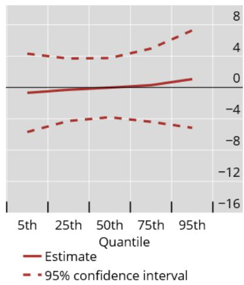  
(a) Low dollarisation

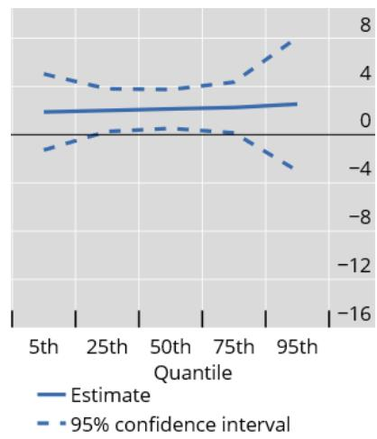  
(b) Moderate dollarisation

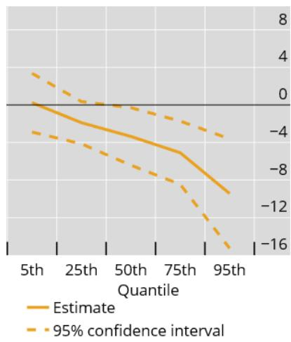  
(c) High dollarisation  
Graph 8. Inflation at risk and dollarisation

Note: The graph shows the coefficient on the dollarisation dummy variable in three separate inflation-at-risk regressions, by the quantile of the inflation forecast distribution. For low/moderate/high dollarisation, the dollarisation dummy refers to the first decile/2nd quartile/4th quartile of the deposit-dollarisation distribution. Full estimates are shown in Annex Table B3, Table B4 and Table B5. Source: authors' estimates.

The middle panel of Graph 8 shows the corresponding results when the dummy identifies the second quartile of the dollarisation distribution, that is, moderate dollarisation. The coefficient on dollarisation is positive across the entire conditional inflation distribution, with magnitudes between 1.9 and 2.5. The estimates are statistically significant at the 25%, 50% and 75% quantiles. Countries with moderate dollarisation therefore display somewhat higher inflation across the distribution than the comparison group, consistent with the view that partial dollarisation can complicate monetary control without conferring the credibility benefits associated with deeper dollarisation.

The right-hand panel of Graph 8 turns to the most highly dollarised countries, those in the fourth quartile. The picture flips: the coefficient on dollarisation is negative at every quantile other than the 5th, and increasingly so as we move up the distribution: about -1.9 at the $25\%$ quantile, -3.4 at the median, -5.1 at the $75\%$ quantile and -9.4 at the $95\%$ quantile, all statistically significant. In other words, highly dollarised economies face systematically lower inflation risks, especially in the upper tail, consistent with the interpretation that they effectively import the monetary-policy credibility of the anchor currency.

Taken together, the three sets of results in Graph 8 and Annex Tables B3 to B5 trace out a non-monotonic relationship: low dollarisation is broadly neutral, moderate dollarisation raises inflation risks, and high dollarisation lowers them.

## 7.2 Implications for monetary transmission

Greater dollarisation could also affect the transmission of monetary policy more broadly. To investigate the issue, we draw on a recent dataset of monetary policy shocks constructed for emerging market economies in Checo et al. (2024) and interact the shocks with the degree of deposit dollarisation in the individual economies at each point in time.

The shocks in Checo et al. (2024) are based on data on professional analysts' forecasts of policy rate decisions collected by Bloomberg. The analysts are able to revise their forecasts up to the time of the monetary policy meeting. Checo et al. (2024) mention that almost all forecasts are submitted during the two weeks before the monetary policy meetings. Moreover, they tend to be submitted closer to the policy meeting date during times when monetary policy decisions are particularly uncertain - as measured by larger forecast dispersion. As a consequence, forecast errors are likely to reflect unexpected shifts in monetary policy that are unrelated to economic developments. The authors further remove any remaining predictability in the forecast errors by orthogonalising them with respect to a range of macroeconomic and financial market data that are available before the monetary policy meeting. This would also remove any effects of analysts' imperfect knowledge of the central bank's reaction function (Bauer and Swanson (2023)).

We estimate the following equation using panel local projection regressions (see Jordà, 2005).

$$
Y _ {c, t + h} - Y _ {c, t - 1} = \alpha_ {c} ^ {h} + \beta^ {h} M P _ {c, t} + A ^ {h} (L) \Delta Y _ {c, t - 1} + B ^ {h} (L) P _ {c, t - 1} + \tau_ {t} ^ {h} + \epsilon_ {c, t} ^ {h}\tag{7}
$$

The vector $Y_{c,t}$ contains the following variables for country c in month t: log real GDP, the headline inflation rate, the bilateral exchange rate against the US dollar and the one-year government bond yield. $^{15}$ $MP_{c,t}$ is the monetary policy shock. The $A^{h}(L)$ and $B^{h}(L)$ are matrix polynomials of degree 2. $\alpha_{c}^{h}$ and $\tau_{t}^{h}$ denote country and time fixed effects, respectively. The local projections involve sequential regressions where the dependent variable is shifted forward by one period at each step h, in our case until 36 months have passed from the shock.

We have data for 14 EMEs. $^{16}$ The sample of countries reflects the availability of the monetary policy shock data as well as data on deposit dollarisation. The data are monthly and run from 2000 to 2024. We apply trimming of the 0.25 top and bottom percentiles of the data to limit the effects of outliers, as described in Checo et al. (2024).

Given the relatively small sample of available economies, leveraging on longest possible samples for the monetary policy shocks is crucial. We deal with missing data for deposit dollarisation

Macroeconomic effects of a 1 pp monetary policy shock

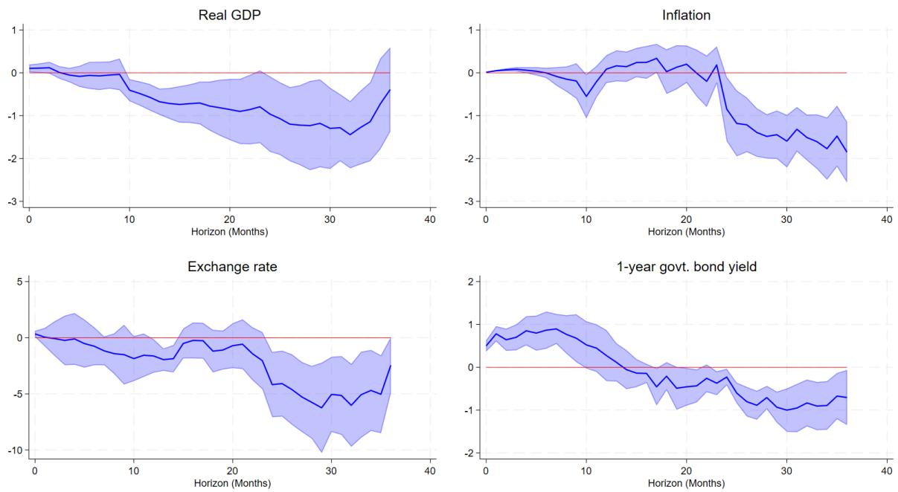  
Graph 9. Responses to monetary policy shocks in EMEs

Note: Responses of macroeconomic variables to a monetary policy shock of one percentage point. A decline in the exchange rate denotes a local currency appreciation against the US dollar. The shaded areas denote the 90% confidence intervals. Source: authors' estimates.

in the following way. First, for missing data within the sample, we interpolate the data using a factor model and the full global sample of deposit dollarisation. In particular, we use the EM-PCA factor model, which combines the expectations-maximisation algorithm (to deal with missing data) with principal components analysis (to reduce the dimensionality of the data); see Roweis (1997). Second, we extrapolate the missing values for the last years of the sample after the end of the deposit dollarisation data in Levy-Yeyati (2021). Given the documented persistence in deposit dollarisation (see Section 4), we fit an AR(1) model to the data, by country, and then use the AR(1) model for predicting the missing observations.

Graph 9 shows the impulse responses from the estimation, without conditioning on the degree of dollarisation. The underlying monetary policy shock is set as a one percentage point surprise tightening in policy rates. The shaded areas indicate the 90% confidence intervals. The responses of the variables are consistent with expected responses to monetary policy shocks. Real GDP declines gradually, by around 1% after 20 months and around 1.5% after 30 months. The decline in inflation takes place more slowly but becomes more sizeable after some 25 months have passed from the shock. The EME currency appreciates against the US dollar. The effect is large, around 5% after two years have passed from the shock. The one-year sovereign yield increases on impact and then declines, eventually reaching negative territory.

In order to examine the impact of deposit dollarisation within this framework, we augment Equation (7) by interacting the monetary policy shock with the degree of deposit dollarisation $Doll_{c,t-1}$ . The latter is measured as a dummy variable, obtaining a value of one when the deposit dollarisation ratio is above sample median (20.3%) and zero otherwise. $^{17}$ The degree of dollarisation is included at one month lag, $Doll_{c,t-1}$ in order to ensure that it is not affected contemporaneously by the monetary policy shock $MP_{c,t}$ . The estimated model is written as:

$$
Y _ {c, t + h} - Y _ {c, t - 1} = \alpha_ {c} ^ {h} + \beta^ {h} M P _ {c, t} + \gamma^ {h} M P _ {c, t} D o l l _ {c, t - 1} + \lambda^ {h} D o l l _ {c, t - 1} + A ^ {h} (L) \Delta Y _ {c, t - 1} + B ^ {h} (L) P _ {c, t - 1} + \tau_ {t} ^ {h} + \epsilon_ {c, t} ^ {h},\tag{8}
$$

where the set of controls now also includes the lagged dummy variable for deposit dollarisation, $Doll_{c,t-1}$ . For highly dollarised economies, the impulse response is obtained by tracing the sum of the coefficients $\beta^{h} + \gamma^{h}$ .

The results in Graph 10 show that there are some, albeit small, differences in monetary transmission between economies at different levels of deposit dollarisation. First, monetary policy shocks have larger impacts on inflation in economies with higher deposit dollarisation. This effect is consistent with evidence shown in Levy-Yeyati (2006) where changes in monetary aggregates have larger effects on inflation in more dollarised economies. This result could arise through the exchange rate, as the substitution from local currency to foreign currency deposits is more readily available. In the near-term, after around 10 months have passed from the shock, the exchange rate response is indeed somewhat higher in the more highly dollarised economies. However, in the longer run, the exchange rate effects are quite similar in the two groups of countries. In terms of the effects on economic activity, we find a lower impact on real GDP in the medium run in the more dollarised economies. Yet, all told, there is limited evidence that deposit dollarisation would significantly affect monetary transmission.

## 8 Conclusions

This paper examines the parallels between deposit dollarisation and stablecoin dollarisation using historical data on foreign currency deposits since the 1990s and recent proprietary data on stablecoin flows. The findings highlight four key insights: (1) Both forms of dollarisation are stronger in an environment of high exchange rate pass-through and economic or financial crises, with banking crises particularly boosting stablecoin inflows due to the latter occurring mostly outside the banking sector. (2) Both deposit and stablecoin dollarisation is highly persistent and difficult to reverse, though some demand for stablecoins may substitute existing foreign currency deposits rather than increasing overall dollarisation. (3) FX restrictions and capital controls are less effective for stablecoins, as the size of stablecoin inflows remains similar across regulatory regimes, unlike the foreign currency deposit share. (4) The relationship between deposit dollarisation and inflation risks is non-monotonic: moderate deposit dollarisation is associated with somewhat higher inflation risks but high dollarisation enhances monetary-policy credibility. At the same time, there is limited evidence of significant effects of deposit dollarisation on the transmission of monetary policy.

These findings have two important policy implications for EMDEs. (1) While deposit and stablecoin dollarisation are highly persistent, maintaining domestic monetary and financial sta-

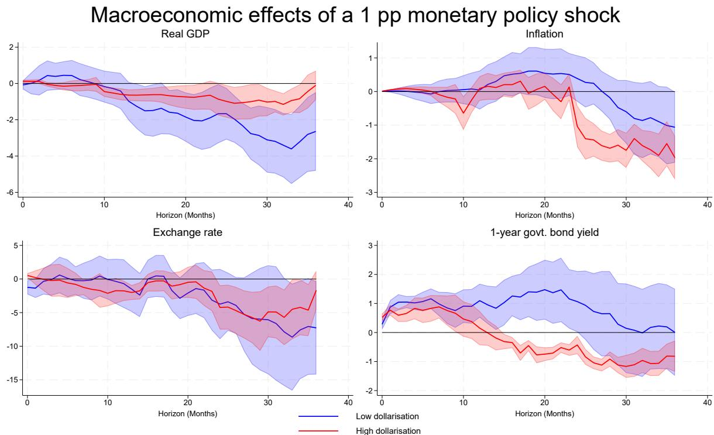  
Graph 10. Deposit dollarisation and monetary transmission

Note: Responses of macroeconomic variables to a monetary policy shock of one percentage point, economies with high (red line) and low (blue line) deposit dollarisation ratios. Source: authors' estimates.

bility can go some way to avoid dollarisation dynamics from taking hold. (2) To the extent that FX restrictions and capital controls represent important elements of macro-financial stability frameworks, their ineffectiveness in the face of stablecoin flows poses a challenge for EMDE policy frameworks.

All that said, it is important to acknowledge that these implications are uncertain and depend on many unknown future developments. Stablecoin adoption may not turn out to be as significant as currently expected by some observers. And the extrapolation of the experiences made with deposit dollarisation may turn out to be inadequate, also given that stablecoins tend to circulate outside the regulated banking sector, and could serve different use cases. This also means that there is ample scope for more research on this topic in the future as trends become clearer and more data are available.

## References

Ahmed, R., & Aldasoro, I. (2025). Stablecoins and safe asset prices (Working Paper No. 1270). Bank for International Settlements.

Aldasoro, I., Beltrán, P., & Grinberg, F. (2026). Stablecoin flows and spillovers to fx markets (BIS Working Papers No. 1340). Bank for International Settlements.

Aldasoro, I., Frost, J., & Ito, H. (2026). The impact of stablecoins on the international monetary and financial system (BIS Working Papers No. 170). Bank for International Settlements.

Altavilla, C., Boucinha, M., Burlon, L., Adalid, R., Fortes, R., & Maruhn, F. (2026). Stablecoins and monetary policy transmission (Working Paper No. 3199). European Central Bank.

Arner, D., Auer, R., & Frost, J. (2020). Stablecoins: Risks, potential and regulation (Working Paper No. 905). Bank for International Settlements.

Auer, R., Lewrick, U., & Paulick, J. (2025). Defying gravity? an empirical analysis of cross-border bitcoin, ether and stablecoin flows (BIS Working Papers No. 1265). Bank for International Settlements.

Azzimonti, M., & Quadrini, V. (2025). Digital economy, stablecoins, and the global financial system (Working Paper No. 34066). National Bureau of Economic Research.

Baba, C., Cervantes, R., Darbar, S., Kokenyne, A., & Zotova, V. (2026). Motivating Capital Controls (IMF Working Papers No. 26/16). International Monetary Fund. https://doi.org/10.5089/9798229036832.001

Banerjee, R., Contreras, J., Mehrotra, A., & Zampolli, F. (2024). Inflation at risk in advanced and emerging market economies. Journal of International Money and Finance, 142(100).

Barthélemy, J., Gardin, P., & Nguyen, B. (2026). Stablecoins and short-term funding markets. Journal of International Money and Finance, 161. https://doi.org/https://doi.org/10.1016/j.jimonfin.2025.103469

Bauer, M. D., & Swanson, E. T. (2023). A reassessment of monetary policy surprises and high-frequency identification. NBER Macroeconomics Annual, 37(1), 87-155.

Benigno, G., Converse, N., & Fornaro, L. (2015). Large capital inflows, sectoral allocation, and economic performance. Journal of International Money and Finance, 55, 60–87. https://doi.org/https://doi.org/10.1016/j.jimonfin.2015.02.015

Bennett, A., Borensztein, E., & Baliño, T. (1999). Monetary policy in dollarized economies (IMF Occasional Papers No. 1999/003). International Monetary Fund.

Bergant, K., Fernandez, A., Teoh, K., & Uribe, M. (2026). Expanding the Landscape of Cross-Border Flow Restrictions. IMF Working Papers, 2026(098), 1. https://doi.org/10.5089/9798229043519.001

Bertaut, C. C., Curcuru, S. E., & von Beschwitz, B. (2025). The international role of the u.s. dollar â€" 2025 edition (FEDS Notes No. 2025-07-18-1). Board of Governors of the Federal Reserve System (U.S.)

Bianchi, J. (2011). Overborrowing and systemic externalities in the business cycle. American Economic Review, 101(7), 3400–3426. https://doi.org/10.1257/aer.101.7.3400

Bindseil, U. (2026). Regulatory responses to the financial stability implications of stablecoins (Working Paper No. 470). Leibniz Institute for Financial Research SAFE.

Broda, C., & Yeyati, E. L. (2006). Endogenous deposit dollarization. Journal of Money, Credit and Banking, 38(4), 963–988. https://doi.org/10.1353/mcb.2006.0054

Bruno, V., Shim, I., & Shin, H. S. (2017). Comparative assessment of macroprudential policies. Journal of Financial Stability, 28, 183–202. https://doi.org/https://doi.org/10.1016/j.jfs.2016.04.001

Cerutti, E. M., Firat, M., Hengge, M., & Sagawa, T. (2026). Stablecoin shocks (Working Paper No. 2026/044). International Monetary Fund. https://www.imf.org/en/publications/wp/issues/2026/03/06/stablecoin-shocks-574528

Checo, A., Grigoli, F., & Sandri, D. (2024). Monetary policy transmission in emerging markets: Proverbial concerns, novel evidence (BIS Working Papers No. 1170). Bank for International Settlements. https://ideas.repec.org/p/bis/biswps/1170.html

Du, W., Huang, C., & Scharfstein, D. (2026). Competing rails for cross-border payments: Banks, fintechs, and stablecoins [mimeo].

Farhi, E., & Werning, I. (2014). Dilemma Not Trilemma? Capital Controls and Exchange Rates with Volatile Capital Flows. IMF Economic Review, 62(4), 569–605. https://ideas.repec.org/a/pal/imfecr/v62y2014i4p569-605.html

Ha, J., Kose, M. A., & Ohnsorge, F. (2023). One-stop source: A global database of inflation. Journal of International Money and Finance, 137(100). https://doi.org/10.1016/j.jimonfin.2023.102896

Hofmann, B., Kaldorf, M., & Rottner, M. (2026). The macroeconomics of stablecoins (BIS Working Papers No. 1363). Bank for International Settlements.

Honohan, P., & Shi, A. (2001). Deposit dollarization and the financial sector in emerging economies (Policy Research Working Paper Series No. 2748). The World Bank.

Huang, X., & Keister, T. (2026). Stablecoins vs. tokenized deposits: The narrow banking debate revisited (Staff Report No. 1179). Federal Reserve Bank of New York. https://doi.org/10.59576/sr.1179

Ilzetzki, E., Reinhart, C. M., & Rogoff, K. S. (2019). Exchange arrangements entering the twenty-first century: Which anchor will hold? The Quarterly Journal of Economics, 134(2), 599–646.

Ilzetzki, E., Reinhart, C. M., & Rogoff, K. S. (2022). Rethinking exchange rate regimes. In G. Gopinath, E. Helpman, & K. S. Rogoff (Eds.). North Holland.

Jeanne, O., & Korinek, A. (2010). Excessive volatility in capital flows: A pigouvian taxation approach. American Economic Review, 100(2), 403–407. https://doi.org/10.1257/aer.100.2.403

Jordà, Ó. (2005). Estimation and inference of impulse responses by local projections. American Economic Review, 95(1), 161–182. https://doi.org/10.1257/0002828053828518

Korinek, A., & Sandri, D. (2016). Capital controls or macroprudential regulation? [38th Annual NBER International Seminar on Macroeconomics]. Journal of International Economics, 99, S27–S42. https://doi.org/https://doi.org/10.1016/j.jinteco.2016.02.001

Kose, M. A., Kurlat, S., Ohnsorge, F., & Sugawara, N. (2022). A cross-country database of fiscal space. Journal of International Money and Finance, 128(100), None. https://doi.org/10.1016/j.jimonfin.2022.102682

Kosse, A., Glowka, M., Mattei, I., & Rice, T. (2023). Will the real stablecoin please stand up? (BIS Papers No. 141). Bank for International Settlements.

Levin, A. T., & Piger, J. M. (2004). Is inflation persistence intrinsic in industrial economies? (Working Paper Series No. 334). European Central Bank.

Levy-Yeyati, E. (2006). Financial dollarization: Evaluating the consequences. Economic Policy, 21(45), 62–118. https://doi.org/10.1111/j.1468-0327.2006.00156.x

Levy-Yeyati, E. (2021). Financial dollarization and de-dollarization in the new millennium (Working Paper). Fondo Latinoamericano de Reservas.

Machado, J. A., & Santos Silva, J. (2019). Quantiles via moments. Journal of Econometrics, 213(1), 145-173.

Martínez, L., & Werner, A. (2002). The exchange rate regime and the currency composition of corporate debt: The mexican experience. Journal of Development Economics, 69(2), 315–334. https://doi.org/https://doi.org/10.1016/S0304-3878(02)00091-3

Minesso, M. F., & Siena, D. (2026). Private money and public debt: U.S. stablecoins and the global safe asset channel (Working Paper No. 3174). European Central Bank.

Miran, S. I. (2025). A global stablecoin glut: Implications for monetary policy [Speech by Mr Stephen I. Miran, Member of the Board of Governors of the Federal Reserve System, 7 November].

Müller, K., Xu, C., Lehbib, M., & Chen, Z. (2025). The global macro database: A new international macroeconomic dataset (version 2026-03) (Working Paper No. 33714). National Bureau of Economic Research. https://doi.org/10.3386/w33714

Reinhart, C. M., Rogoff, K. S., & Savastano, M. A. (2014). Addicted to dollars. Annals of Economics and Finance, 15(1), 1-51.

Rey, H. (2013). Dilemma not trilemma: The global cycle and monetary policy independence. Proceedings - Economic Policy Symposium - Jackson Hole, 285–333.

Roweis, S. (1997). Em algorithms for pca and spca. In M. Jordan, M. Kearns, & S. Solla (Eds.), Advances in neural information processing systems (Vol. 10). MIT Press. https://proceedings.neurips.cc/paper\_files/paper/1997/file/d9731321ef4e063ebbee79298fa36f56-Paper.pdf

World Bank. (2025). The worldwide governance indicators: Revised methodology for measuring governance using perception data (WGI Methodology Paper). World Bank.

## Appendix

## A Further estimations

This Appendix considers a larger set of macroeconomic and institutional factors to investigate their relevance for the level of deposit dollarisation and stablecoin inflows.

## A.1 Deposit dollarisation

For deposit dollarisation, we estimate the following equation in a cross-section of economies:

$$
D o l l _ {i, 2 0 1 7} = \alpha + \beta_ {1} X _ {i, 2 0 1 6} + u _ {i}.\tag{9}
$$

The dependent variable $Doll_{i}$ is the contemporaneous deposit dollarisation ratio, ie the ratio of foreign currency deposits to total deposits. The right-hand side variables include a vector of macroeconomic and institutional drivers of deposit dollarisation, $X_{i}$ , measured at a one-year lag. $\alpha$ is a constant term. The variables (and the approach of estimating the model in a cross-section of countries) are based on Levy-Yeyati (2006) and are further discussed below. Regarding the timing of the left-hand side variable, we consider the level of deposit dollarisation in 2017. This corresponds to the year with greater availability of deposit dollarisation data and matches the start of stablecoin inflows data in the same year.

In addition to the variables included in the main text, we also include two other variables related to exchange rates. First, we consider the importance of less flexible exchange rate arrangements. Less flexible exchange rate arrangements may encourage dollarisation due to a perception of implicit exchange rate guarantees (eg Martínez and Werner (2002)). Similarly, the real exchange rate can become less flexible, incentivising dollarisation. We use the de facto exchange rate classification by Ilsetzki et al. (2019) and Ilsetzki et al. (2022). Specifically, we create a dummy variable obtaining a value of one when the exchange rate arrangement is less flexible (de facto crawling peg or a less flexible arrangement), and zero otherwise. Second, we include a variable capturing the procyclicality of the real exchange rate. Broda and Yeyati (2006) show how dollarisation can arise endogenously when the probability of default is correlated with the real exchange rate (i.e., the real exchange rate is procyclical) and there is limited information on the currency composition of the borrower, leading to lower effective cost of foreign currency use. To capture this channel, we use the 20-year moving correlation between the real exchange rate and real GDP growth rates.

Next, we consider regulatory restrictions on residents' access to domestic FX accounts. This is captured by a dummy variable obtaining a value of one when residents' access to domestic FX accounts is subject to approval, and zero otherwise.

We also include institutional variables. As in Levy-Yeyati (2006), GDP per capita serves as a proxy for the institutional development of the country which matters for the development of local currency markets. And, we include a composite indicator for governance (see World Bank (2025)), constructed as a simple average of six sub-dimensions, with higher values indicating a higher quality of governance. $^{18}$

$^{18}$ The sub-dimensions are voice and accountability, political stability, government effectiveness, regulatory qual-

The baseline regression results are summarised in Table A1. Each column corresponds to a separate specification. Column (1) only considers two variables similar to those included in Table 1 of Levy-Yeyati (2021): 5-year average inflation and the degree of exchange rate pass-through. Columns (2) to (6) introduce the explanatory variables one at a time, while columns (7) to (8) report joint specifications including all of them. For the explanatory variables of FX account restrictions, GDP per capita, institutional quality and de facto peg, we use averages for 2000-16 in the estimation.

Table A1. Drivers of deposit dollarisation, cross-section, additional macroeconomic and institutional variables

<table><tr><td>VARIABLES</td><td>(1)Dollarisation</td><td>(2)Dollarisation</td><td>(3)Dollarisation</td><td>(4)Dollarisation</td><td>(5)Dollarisation</td><td>(6)Dollarisation</td><td>(7)Dollarisation</td><td>(8)Dollarisation</td></tr><tr><td>5y average inflation</td><td>0.00779(0.00554)</td><td>0.00701(0.00537)</td><td>0.00377(0.00551)</td><td>0.00536(0.00649)</td><td>0.00706(0.00568)</td><td>0.00786(0.00578)</td><td>0.00302(0.00579)</td><td>0.00344(0.00576)</td></tr><tr><td>Exc rate pass through</td><td>-0.000542(0.000742)</td><td>-0.000826(0.000986)</td><td>-0.000938**(0.000449)</td><td>-0.000736(0.000744)</td><td>-0.000391(0.000634)</td><td>-0.000521(0.000818)</td><td>-0.00129**(0.000506)</td><td>-0.00149**(0.000671)</td></tr><tr><td>FX account restrictions</td><td></td><td>-0.246***(0.0448)</td><td></td><td></td><td></td><td></td><td>-0.290***(0.0546)</td><td>-0.323***(0.0603)</td></tr><tr><td>GDP per capita</td><td></td><td></td><td>-0.000433**(0.000176)</td><td></td><td></td><td></td><td>-0.000675**(0.000258)</td><td>-0.000774***(0.000269)</td></tr><tr><td>Institutional quality</td><td></td><td></td><td></td><td>-0.00205(0.00184)</td><td></td><td></td><td>0.00192(0.00282)</td><td>0.00447(0.00376)</td></tr><tr><td>De facto peg</td><td></td><td></td><td></td><td></td><td>-0.0580(0.0592)</td><td></td><td>-0.00362(0.0636)</td><td>0.0352(0.0756)</td></tr><tr><td>Real exc rate procyclicality</td><td></td><td></td><td></td><td></td><td></td><td>-0.0544(0.0999)</td><td>0.00698(0.0942)</td><td>0.0447(0.101)</td></tr><tr><td>Constant</td><td>0.273***(0.0349)</td><td>0.312***(0.0366)</td><td>0.655***(0.165)</td><td>0.394***(0.123)</td><td>0.310***(0.0500)</td><td>0.288***(0.0407)</td><td>0.798***(0.155)</td><td>0.731***(0.178)</td></tr><tr><td>Type of economies</td><td>AE&amp;EMDE</td><td>AE&amp;EMDE</td><td>AE&amp;EMDE</td><td>AE&amp;EMDE</td><td>AE&amp;EMDE</td><td>AE&amp;EMDE</td><td>AE&amp;EMDE</td><td>EMDE</td></tr><tr><td>Observations</td><td>106</td><td>106</td><td>105</td><td>106</td><td>106</td><td>105</td><td>105</td><td>86</td></tr><tr><td>R-squared</td><td>0.031</td><td>0.120</td><td>0.088</td><td>0.044</td><td>0.040</td><td>0.032</td><td>0.216</td><td>0.236</td></tr></table>

Note: Robust standard errors in parentheses; \*\*\* $p < 0.01$ , \*\* $p < 0.05$ , \* $p < 0.1$ . Dependent variable is the deposit dollarisation ratio in 2017; all explanatory variables are lagged by one period. Source: authors' estimates based on deposit dollarisation data from Levy-Yeyati (2021).

The results show an important role for regulatory restrictions on foreign currency deposits. The coefficient estimates imply that countries with regulatory restrictions on FX deposits during all years 2000-16 see 25-32 percentage points lower deposit dollarisation ratios. This is a meaningful difference, given that the regulatory restrictions are only partial, in the form of approval requirements on FX deposits. Moreover, countries with higher GDP per capita have lower deposit dollarisation ratios. In particular, a one standard deviation increase in GDP per capita is associated with around 10 percentage lower deposit dollarisation ratio, which is also economically significant. $^{19}$ In these specifications, 105 economies are included when both AEs and EMDEs and all explanatory variables are considered; 86 economies enter the estimation for EMDEs only. The specification that includes all economies and all explanatory variables has an $R^{2}$ of 0.216;

the $R^{2}$ is 0.236 when the estimation sample only comprises EMDEs.

## A.2 Stablecoin inflows

We then use a parallel approach to study stablecoin inflows. We use an equation similar to Equation (2) in the main text, as it also refers to a cross-section of economies.

Relative to the model on deposit dollarisation, we replace the dummy variable for regulatory restrictions on FX deposits with that for restrictions on stablecoins. In particular, we use the variable for restrictions on stablecoin use between residents and non-residents from IMF AREAER database. The data cover both full and partial restrictions. $^{20}$ The cross-sectional regression results for cumulative stablecoin inflows to GDP are reported in Table A2, with a similar column structure as in Table A1. Columns (7) and (8) show the joint specification.

Two exchange rate-related factors generally stand out as economically and statistically significant for stablecoin inflows. Exchange rate pass-through is positively and significantly associated with stablecoin inflows, even if the statistical significance falls in the specifications where all variables are included. In addition, the joint specification shows a statistically significant and positive coefficient on the procyclicality of the real exchange rate, when all economies are included in the estimation. This underscores the importance of the strength of the financial channel of the exchange rate for stablecoin inflows. A one standard deviation increase in the procyclicality of the real exchange rate is associated with a 0.4 percentage point increase in cumulative stablecoin inflows (measured as % of GDP; using the coefficient estimate in Specification (7)). This compares with an average increase in cumulative stablecoin inflows of around 1.4 percentage point of GDP over the sample period, 2017-24, again using the sample covered by Specification (7).

Differently from deposit dollarisation, regulatory restrictions do not appear to have a statistically significant association with stablecoin inflows in any specification. One possible reason for this result is that FX restrictions and capital flow management measures are likely to be much easier to impose on regulated financial intermediaries. By contrast, stablecoins circulate in public, permissionless blockchains. The coins may be held in unhosted wallets, leading to lower regulatory and supervisory visibility.

In the joint specifications, 130 economies are included when both AEs and EMDEs are considered; 95 economies when only EMDEs are included. The joint specification that includes all economies has an $R^{2}$ of 0.066 when both AEs and EMDEs are included and 0.114 when only EMDEs are considered.

Table A2. Drivers of gross stablecoin inflows, additional macroeconomic and institutional variables

<table><tr><td></td><td>(1)</td><td>(2)</td><td>(3)</td><td>(4)</td><td>(5)</td><td>(6)</td><td>(7)</td><td>(8)</td></tr><tr><td>VARIABLES</td><td>SC</td><td>SC</td><td>SC</td><td>SC</td><td>SC</td><td>SC</td><td>SC</td><td>SC</td></tr><tr><td>5y average inflation</td><td>3.43e-06(0.000156)</td><td>0.000506(0.000438)</td><td>1.18e-05(0.000164)</td><td>-1.24e-05(0.000156)</td><td>0.000248(0.000402)</td><td>0.000117(0.000362)</td><td>0.000321(0.000481)</td><td>0.000395(0.000500)</td></tr><tr><td>Exc rate pass through</td><td>8.85e-05***(3.33e-05)</td><td>7.77e-05(6.40e-05)</td><td>9.06e-05**(3.58e-05)</td><td>8.58e-05**(3.44e-05)</td><td>9.66e-05***(3.54e-05)</td><td>6.43e-05*(3.42e-05)</td><td>8.04e-05(5.56e-05)</td><td>9.71e-05*(5.54e-05)</td></tr><tr><td>SC restrictions</td><td></td><td>0.000490(0.00389)</td><td></td><td></td><td></td><td></td><td>-0.000445(0.00351)</td><td>0.00225(0.00407)</td></tr><tr><td>GDP per capita</td><td></td><td></td><td>1.93e-06(7.45e-06)</td><td></td><td></td><td></td><td>4.33e-06(1.43e-05)</td><td>7.89e-06(1.64e-05)</td></tr><tr><td>Institutional quality</td><td></td><td></td><td></td><td>-2.42e-05(6.24e-05)</td><td></td><td></td><td>-4.48e-05(0.000127)</td><td>-0.000174(0.000170)</td></tr><tr><td>De facto peg</td><td></td><td></td><td></td><td></td><td>-0.00362(0.00385)</td><td></td><td>-0.00257(0.00509)</td><td>-0.00743(0.00679)</td></tr><tr><td>Real exc rate procyclicality</td><td></td><td></td><td></td><td></td><td></td><td>0.0149***(0.00482)</td><td>0.0126**(0.00576)</td><td>0.0130(0.00808)</td></tr><tr><td>Constant</td><td>0.0128***(0.00154)</td><td>0.0117***(0.00238)</td><td>0.0111(0.00710)</td><td>0.0142***(0.00422)</td><td>0.0142***(0.00400)</td><td>0.0100***(0.00190)</td><td>0.0110(0.0119)</td><td>0.0149(0.0166)</td></tr><tr><td>Type of economies</td><td>AE&amp;EMDE</td><td>AE&amp;EMDE</td><td>AE&amp;EMDE</td><td>AE&amp;EMDE</td><td>AE&amp;EMDE</td><td>AE&amp;EMDE</td><td>AE&amp;EMDE</td><td>EMDE</td></tr><tr><td>Observations</td><td>162</td><td>132</td><td>162</td><td>162</td><td>159</td><td>157</td><td>130</td><td>95</td></tr><tr><td>R-squared</td><td>0.001</td><td>0.017</td><td>0.002</td><td>0.002</td><td>0.015</td><td>0.067</td><td>0.066</td><td>0.114</td></tr></table>

Note: Robust standard errors in parentheses; $^{***}p < 0.01$ , $^{**}p < 0.05$ , $^{*}p < 0.1$ . Dependent variable: cumulative stablecoin inflows to GDP, 2017 to 2024. Explanatory variables refer to 2016 or longer-run averages; see text for details. Source: authors' estimates based on Auer et al. (2025) and Chainalysis data; explanatory variables as in Table A1.

## B Additional tables

Table B3. Inflation at risk and low deposit dollarisation (first decile)

<table><tr><td>VARIABLES</td><td>5% q. $\pi_{t+1}$ </td><td>25% q. $\pi_{t+1}$ </td><td>50% q. $\pi_{t+1}$ </td><td>75% q. $\pi_{t+1}$ </td><td>95% q. $\pi_{t+1}$ </td></tr><tr><td> $\pi_t$ </td><td>-0.0242(0.0842)</td><td>0.283***(0.0641)</td><td>0.495***(0.0686)</td><td>0.742***(0.0818)</td><td>1.349***(0.174)</td></tr><tr><td> $y_t^{\text{gap}}$ </td><td>0.0392(0.0907)</td><td>0.135**(0.0540)</td><td>0.201***(0.0719)</td><td>0.278***(0.105)</td><td>0.468*(0.269)</td></tr><tr><td> $\Delta exc_t$ </td><td>0.00602(0.0385)</td><td>-0.0152(0.0396)</td><td>-0.0299(0.0496)</td><td>-0.0471(0.0639)</td><td>-0.0891(0.137)</td></tr><tr><td>SovDebtCrisist</td><td>4.185(2.716)</td><td>4.062***(1.361)</td><td>3.977*(2.034)</td><td>3.878(3.674)</td><td>3.634(7.586)</td></tr><tr><td>CurrencyCrisist</td><td>3.863(4.622)</td><td>10.17***(2.139)</td><td>14.54***(2.547)</td><td>19.62***(5.162)</td><td>32.10***(11.80)</td></tr><tr><td>BankingCrisist</td><td>3.140(3.571)</td><td>0.888(2.563)</td><td>-0.668(2.115)</td><td>-2.481(2.622)</td><td>-6.933(5.266)</td></tr><tr><td>Dollar 1st decilet</td><td>-0.688(2.552)</td><td>-0.297(2.035)</td><td>-0.0261(1.929)</td><td>0.289(2.388)</td><td>1.063(3.177)</td></tr><tr><td>Type of economies</td><td>EMDEs</td><td>EMDEs</td><td>EMDEs</td><td>EMDEs</td><td>EMDEs</td></tr><tr><td>Observations</td><td>2,108</td><td>2,108</td><td>2,108</td><td>2,108</td><td>2,108</td></tr></table>

Note: Bootstrapped standard errors in parentheses; $*\*\*$ $p < 0.01$ , $*\*$ $p < 0.05$ , $*$ $p < 0.1$ . Dependent variable: one-year-ahead inflation ( $\pi_{t+1}$ ). Source: authors' estimates following Machado and Santos Silva (2019); inflation-at-risk framework as in Banerjee et al. (2024).

Table B4. Inflation at risk and moderate deposit dollarisation (second quartile)

<table><tr><td>VARIABLES</td><td>5% q. $\pi_{t+1}$ </td><td>25% q. $\pi_{t+1}$ </td><td>50% q. $\pi_{t+1}$ </td><td>75% q. $\pi_{t+1}$ </td><td>95% q. $\pi_{t+1}$ </td></tr><tr><td> $\pi_t$ </td><td>-0.0345(0.0942)</td><td>0.286***(0.0647)</td><td>0.495***(0.0729)</td><td>0.740***(0.0827)</td><td>1.322***(0.191)</td></tr><tr><td> $y_t^{\text{gap}}$ </td><td>0.0352(0.0827)</td><td>0.136***(0.0526)</td><td>0.202***(0.0769)</td><td>0.279***(0.0996)</td><td>0.462(0.290)</td></tr><tr><td> $\Delta exc_t$ </td><td>0.00632(0.0465)</td><td>-0.0151(0.0315)</td><td>-0.0291(0.0513)</td><td>-0.0455(0.0716)</td><td>-0.0844(0.132)</td></tr><tr><td> $SovDebtCrisis_t$ </td><td>3.997(2.794)</td><td>3.882***(1.485)</td><td>3.807**(1.611)</td><td>3.719(3.542)</td><td>3.510(8.059)</td></tr><tr><td> $CurrencyCrisis_t$ </td><td>3.634(5.032)</td><td>10.29***(2.001)</td><td>14.64***(2.777)</td><td>19.74***(4.775)</td><td>31.83**(12.51)</td></tr><tr><td> $BankingCrisis_t$ </td><td>2.972(3.760)</td><td>0.832(2.495)</td><td>-0.569(2.225)</td><td>-2.209(2.633)</td><td>-6.098(5.212)</td></tr><tr><td> $Dollar\ 2nd\ quartile_t$ </td><td>1.881(1.610)</td><td>2.035**(0.904)</td><td>2.136***(0.822)</td><td>2.255**(1.074)</td><td>2.535(2.823)</td></tr><tr><td>Observations</td><td>2,108</td><td>2,108</td><td>2,108</td><td>2,108</td><td>2,108</td></tr></table>

Note: Bootstrapped standard errors in parentheses; \*\*\* $p < 0.01$ , \*\* $p < 0.05$ , \* $p < 0.1$ . Specification identical to Table B3 except that the dollarisation dummy refers to the second quartile of the deposit-dollarisation distribution. Source: authors' estimates following Machado and Santos Silva (2019); inflation-at-risk framework as in Banerjee et al. (2024).

Table B5. Inflation at risk and high deposit dollarisation (fourth quartile)

<table><tr><td>VARIABLES</td><td>5% q. $\pi_{t+1}$ </td><td>25% q. $\pi_{t+1}$ </td><td>50% q. $\pi_{t+1}$ </td><td>75% q. $\pi_{t+1}$ </td><td>95% q. $\pi_{t+1}$ </td></tr><tr><td> $\pi_t$ </td><td>-0.0179(0.0835)</td><td>0.286***(0.0638)</td><td>0.494***(0.0707)</td><td>0.741***(0.0908)</td><td>1.360***(0.181)</td></tr><tr><td> $y_t^{\text{gap}}$ </td><td>0.0522(0.0795)</td><td>0.140***(0.0515)</td><td>0.200***(0.0732)</td><td>0.272**(0.124)</td><td>0.451*(0.252)</td></tr><tr><td> $\Delta exc_t$ </td><td>0.00106(0.0355)</td><td>-0.0185(0.0415)</td><td>-0.0320(0.0378)</td><td>-0.0480(0.0641)</td><td>-0.0880(0.127)</td></tr><tr><td> $\text{SovDebtCrisis}_t$ </td><td>4.012(2.591)</td><td>3.911***(1.324)</td><td>3.843*(1.964)</td><td>3.761(4.081)</td><td>3.557(8.913)</td></tr><tr><td> $\text{CurrencyCrisis}_t$ </td><td>4.246(3.906)</td><td>10.41***(1.916)</td><td>14.65***(2.305)</td><td>19.67***(4.988)</td><td>32.25***(11.30)</td></tr><tr><td> $BankingCrisis_t$ </td><td>3.407(3.322)</td><td>0.892(2.346)</td><td>-0.836(2.318)</td><td>-2.883(2.510)</td><td>-8.011(6.563)</td></tr><tr><td> $Dollar\ 4th\ quartile_t$ </td><td>0.238(1.595)</td><td>-1.893*(1.147)</td><td>-3.357**(1.564)</td><td>-5.093***(1.718)</td><td>-9.439***(2.974)</td></tr><tr><td>Observations</td><td>2,108</td><td>2,108</td><td>2,108</td><td>2,108</td><td>2,108</td></tr></table>

Note: Bootstrapped standard errors in parentheses; \*\*\* $p < 0.01$ , \*\* $p < 0.05$ , \* $p < 0.1$ . Specification identical to Table B3 except that the dollarisation dummy refers to the fourth quartile of the deposit-dollarisation distribution. Source: authors' estimates following Machado and Santos Silva (2019); inflation-at-risk framework as in Banerjee et al. (2024).