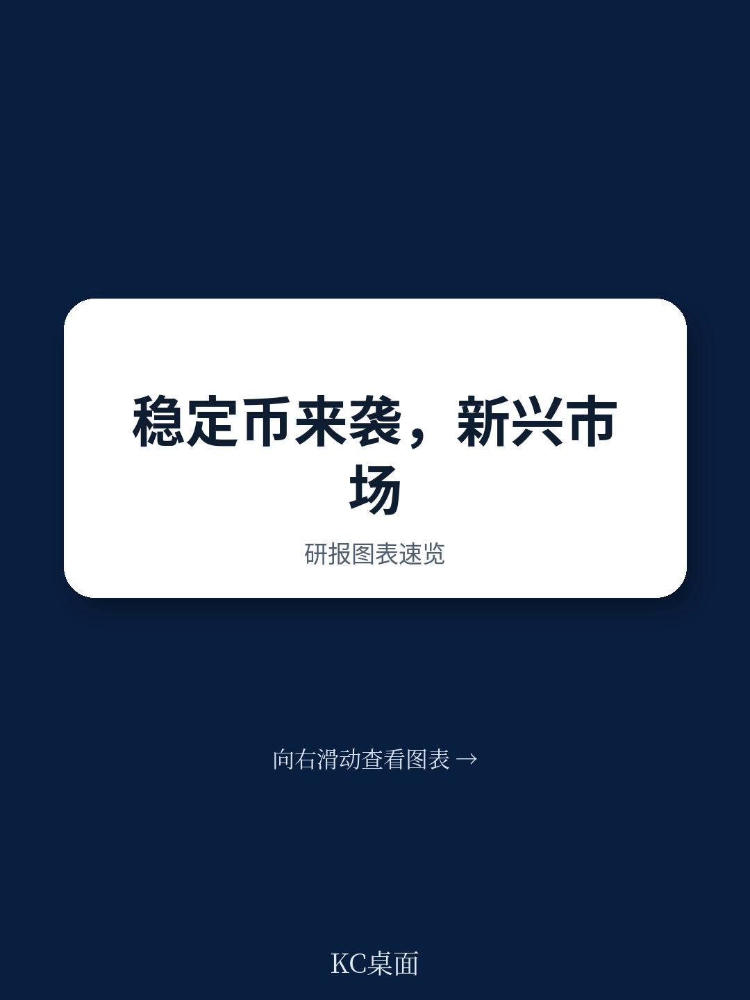
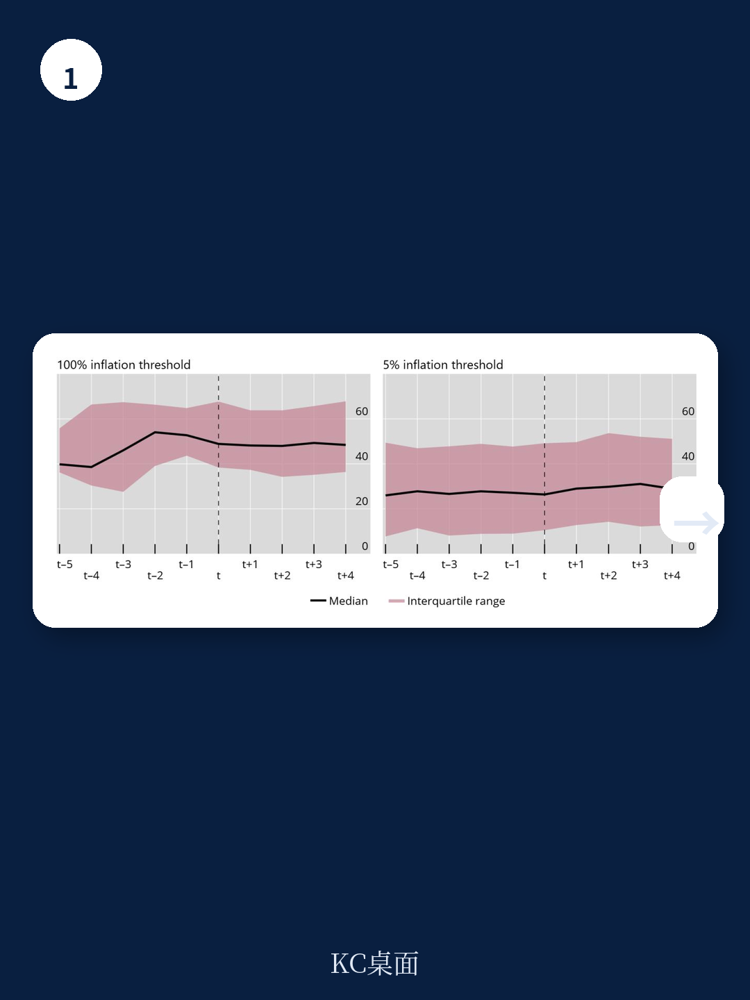
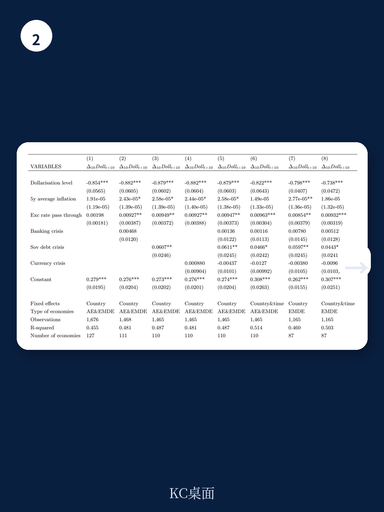

# 国际清算银行：美元化与货币控制

新兴市场和发展中地区（EMDEs）正在经历一种新型美元化：通过稳定币获取美元流动性。国际清算银行（BIS）最新工作论文（No.1370）系统比较了传统存款美元化与稳定币美元化的驱动因素、持久性及对货币政策的影响。核心发现是：两种美元化形式具有相似的宏观驱动因素，但稳定币对资本管制几乎免疫，且一旦形成就难以逆转。

## 1. 存款美元化与稳定币流入的驱动因素高度相似

报告基于超过130个地区1990年至2019年的存款美元化数据，以及2017年至2024年的跨境稳定币流入数据，发现两者均与汇率传递效应强度、主权或银行扰动显著相关。具体而言，汇率传递效应越高——反映资金美元化的资产组合动机——存款美元化程度和美元稳定币流入量都越大。宏观环境或资金扰动同样推高两种美元化水平。

一个值得注意的差异是：银行扰动对稳定币流入的推动作用尤为突出。报告认为，这符合稳定币的非银行属性——当银行体系出现不稳定时，非银行渠道的美元获取方式更具吸引力。

> **KC评论：** 稳定币并非凭空创造需求，而是承接了传统美元化背后的结构性不确定性。银行扰动这一变量特别值得关注，它提示稳定币可能成为银行体系脆弱性的放大器。

## 2. 两种美元化均高度持久，且相互替代证据有限

报告检验了存款美元化的持续性，发现其具有显著的自回归特征——历史美元化水平能很好预测当前水平。对于稳定币，虽然数据时间跨度较短，但初步证据同样显示高度持续性。这意味着美元化一旦建立，就很难逆转。

研究进一步考察了存款美元化与稳定币之间是否存在替代关系。结果显示，两者之间的替代效应有限。报告推测，这可能暗示两个市场存在一定程度的割裂：虽然需求动机相似，但背后的宏观环境主体可能不同——例如技术敏感型用户更倾向于使用稳定币。

## 3. 资本管制对稳定币美元化效果有限

这是报告最具政策含义的发现之一。研究检验了外汇相关限制——包括审慎监管和资本管制——对两种美元化的影响。结果显示，账户限制和跨境资本流动限制确实能降低存款美元化，但对稳定币流入没有统计上显著的影响。

报告认为，这很可能是因为稳定币部分运行在监管边界之外。其跨境、去中心化的网络特性使得追踪和监管比传统美元存款困难得多。这意味着，即使EMDEs加强资本管制，居民仍可能通过稳定币渠道获取美元敞口。

## 4. 存款美元化对通胀的影响呈非线性

报告使用“通胀不确定性”（inflation-at-risk）框架，分析了存款美元化对通胀分布的影响。结果显示，低美元化水平与通胀不确定性无显著关联；中等美元化水平（第二四分位数）与整个通胀预测分布中略高的通胀相关；而高美元化水平（第四四分位数）反而与较低的通胀相关。

报告对此的解释是：高度美元化的地区可能实际上“进口”了货币政策可信度——当居民和企业已经广泛使用美元时，央行面临更强的约束，通胀预期反而更稳定。但中等美元化水平可能带来“半美元化”的困境：部分美元化削弱了本币政策传导，又不足以获得完全美元化的纪律效应。

> **KC评论：** 这个非线性关系对政策制定者是个重要提醒。不是所有美元化都是坏事，但“中等程度”可能最棘手——既失去了货币政策独立性，又没有获得完全美元化的可信度锚定。

## 5. 对EMDEs政策框架的启示

报告虽然没有直接给出政策建议，但其发现指向几个关键问题。第一，稳定币正在创造一条绕过传统资本管制的美元获取通道，这对EMDEs的宏观审慎框架构成挑战。第二，美元化的高度持久性意味着，一旦稳定币使用在某个地区扎根，逆转成本将非常高。第三，存款美元化对货币政策传导的影响虽然总体有限，但中等美元化地区的通胀不确定性值得关注。

对于正在经历或可能面临稳定币美元化的地区，历史存款美元化的经验提供了一个参照系，但稳定币的独特属性——跨境、去中心化、监管困难——意味着旧框架可能不够用。如何在不抑制技术创新的前提下，将稳定币纳入宏观资金稳定框架，是报告留给政策制定者的核心问题。

For informational purposes only. Portions may be generated,translated,summarized,or edited with AI assistance based on source materials and may contain omissions or errors. Please verify independently. This is not investment,legal,tax,accounting,or other professional advice.

