# Understanding Economic Growth in The Gambia: Challenges and Policy Implications

Ali- Al-Sadiq, Nour Bouzouita, and Chie Aoyagi

SIP/2026/067

IMF Selected Issues Papers are prepared by IMF staff as background documentation for periodic consultations with member countries. It is based on the information available at the time it was completed on June 22, 2026. This paper is also published separately as IMF Country Report No 26/176.

# IMF Selected Issues Paper African Department

# Understanding Economic Growth in The Gambia: Challenges and Policy Implications Prepared by Ali- Al-Sadiq, Nour Bouzouita, and Chie Aoyagi

Authorized for distribution by Eva Jenkner
July 2026

IMF Selected Issues Papers are prepared by IMF staff as background documentation for periodic consultations with member countries. It is based on the information available at the time it was completed on June 22, 2026. This paper is also published separately as IMF Country Report No 26/176

ABSTRACT: This paper highlights past, current and future drivers of The Gambia's growth and suggests reforms to enhance growth potential and productivity. The Gambia needs to accelerate structural reforms to boost total factor productivity (TFP). Key policy options include strengthening governance and institutional capacity; maintaining macroeconomic stability through prudent fiscal and monetary policies; raising agricultural productivity; fostering private sector-led growth through improvements in the business environment and access to finance; promoting economic diversification; investing in human capital; and addressing critical infrastructure gaps.

RECOMMENDED CITATION: Al-Sadiq, Ali, Nour Bouzouita, and Chie Aoygai. 2026. Understanding Economic Growth in The Gambia: Challenges and Policy Implications. IMF Selected Issues Paper SIP/2026/067

JEL Classification Numbers:

O11, O40, O47, O55, E23.

Keywords:

The Gambia, Economic Growth, Total Factor Productivity, Potential growth, Government Effectiveness

Author's E-Mail Address:

AAlsadiq@imf.org; nbouzouita@imf.org; CAoyagi@imf.org

SELECTED ISSUES PAPERS

# Understanding Economic Growth in The Gambia: Challenges and Policy Implications

The Gambia

Prepared by Ali- Al-Sadiq, Nour Bouzouita, and Chie Aoyagi

## THE GAMBIA

SELECTED ISSUES

June 22, 2026

Approved By

Prepared by Ali- Al-Sadiq, Nour Bouzouita, and Chie Aoyagi.

African Department

## CONTENTS

## UNDERSTANDING ECONOMIC GROWTH IN THE GAMBIA: CHALLENGES AND

POLICY IMPLICATIONS 2

A. Introduction 2

B. Background 3

C. Empirical analysis \_\_\_\_ 5

D. Conclusion 16

## FIGURES

1. Economy's Structure and Export Diversification 4

2a. Impulse Response: Accumulated Impulse Responses of Real GDP to Generalized One

S.D. Innovations 8

2b. Impulse Response: Accumulated Impulse Responses of Credit to Private Sector to

Generalized One S.D. Innovations 9

## TABLES

1. Event Study: Before and After the 2017 Regime Change \_\_\_\_ 10

2. Summary of GMM Estimates of Governance on GDP Per Capita (SSA) \_\_\_\_ 15

References 17

## ANNEX

I. Short- and Long-run Impact of Governance Indicators 19

## APPENDIX

I. Tables 21

Source: IMF WEO database.

# UNDERSTANDING ECONOMIC GROWTH IN THE GAMBIA: CHALLENGES AND POLICY IMPLICATIONS $^{1}$

The Gambia's economic activity has grown at a rate comparable to peers over recent decades, but the income gap with neighboring countries remains large. As contributions from labor and capital to potential growth are expected to decline, The Gambia needs to accelerate structural reforms to boost total factor productivity (TFP). Successful implementation of structural reforms could yield substantial benefits. Key policy options include strengthening governance and institutional capacity; maintaining macroeconomic stability through prudent fiscal and monetary policies; raising agricultural productivity; fostering private sector-led growth through improvements in the business environment and access to finance; promoting economic diversification; investing in human capital; and addressing critical infrastructure gaps.

## A. Introduction

## 1. The Gambia has made commendable progress with lifting growth and incomes.

Following a prolonged period of stagnation due to domestic political autocracy and weak governance, the democratic transition in 2017 marked a turning point for the country's economic recovery. The Gambia's growth has outperformed that of the SSA since 2017, averaging around 5.4 percent, supported by reforms aimed at restoring macroeconomic

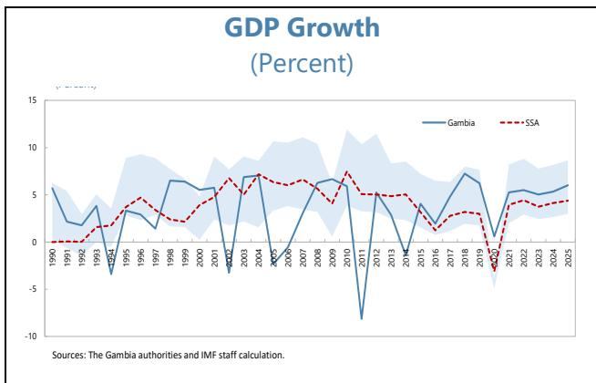

stability and rebuilding investor confidence. This strong performance has translated into sustained

increases in GDP per capita, which increased from about US\$600 in 2015 to approximately US\$940 in 2024.

2. However, The Gambia's economic growth needs to be strengthened and sustained to ensure long-term development and poverty reduction. Despite some progress, the country continues to lag behind other nations in the Sub-Saharan Africa (SSA) region. In 2024, The Gambia's per capita

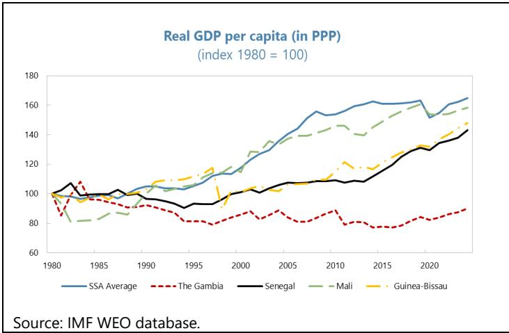

income remained roughly half the regional average and significantly below that of its neighboring countries. This disparity highlights structural weaknesses in the economy and the need for diversification beyond agriculture. Accelerating growth in non-agricultural sectors—such as manufacturing, tourism, and other services—is essential to reduce economic volatility, enhance resilience, and create meaningful employment opportunities for the country's young and rapidly expanding population.

3. This paper highlights past, current and future drivers of The Gambia's growth and suggests reforms to enhance productivity. Section B documents recent economic developments. A growth accounting is undertaken in Section C to identify the contributions of factors accumulation and total factor productivity (TFP) growth to the Gambia's economic performance. The determinants of growth are econometrically identified in Section D. Section E estimates potential GDP for The Gambia. Finally, policy recommendations are discussed in Section F.

## B. Background

4. The Gambia continues to face severe economic and developmental challenges, remaining among the poorest nations in the world. According to the 2024 United Nations Human Development Index (HDI), the country ranks 171st out of 191 countries, reflecting persistently low levels of income, limited access to quality education, and inadequate health outcomes with no significant improvement over the past ten years. As of the most recent data, The Gambia's HDI is approximately 0.52, reflecting low levels of income, educational attainment, and health outcomes that contribute to limited human development. By contrast, the average HDI for Sub-Saharan Africa (SSA) is higher—about 0.55—indicating that many SSA countries have achieved comparatively better progress in key human development dimensions such as life expectancy, education, and standard of living. These challenges are deeply interconnected and reinforce cycles of poverty, constraining human capital development and limiting productivity across the economy. High levels of vulnerability, particularly among rural communities, youth and women, further exacerbate inequality and undermine social and economic inclusion, posing significant obstacles to sustainable development.

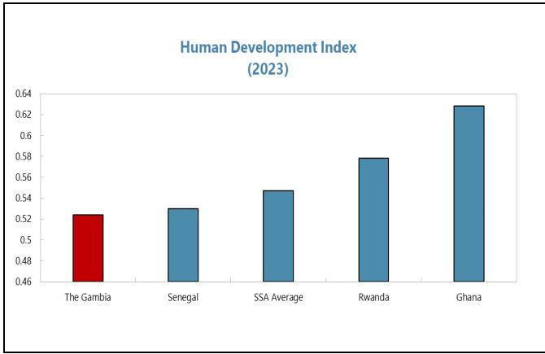

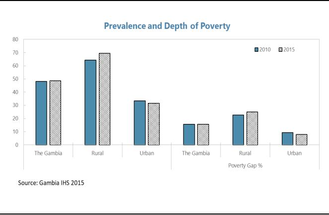

5. The economic structure has changed but still shows strong dependence on agriculture and tourism. The Gambian economy has experienced dynamic changes in the past decade, with agriculture's share in GDP value added dropping from 35 percent in 2010 to 22 percent in 2023.

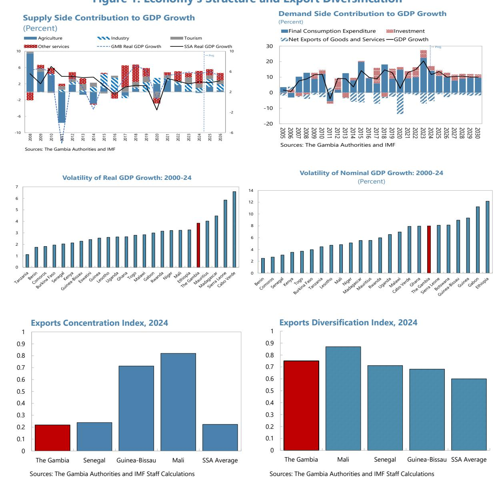

However, the agricultural sector remains a cornerstone of economic activity and employs a significant portion of the population. Tourism also continues to be a major pillar of the economy, contributing significantly to foreign exchange earnings, employment, and economic activity. This heavy reliance makes the economy highly vulnerable to external shocks such as climate change and natural disasters, fluctuating commodity prices, and global travel disruptions and tourism demand. Efforts to diversify into other sectors—such as manufacturing, information and communication technology, and other services—have been limited, underscoring the need for targeted policies and investment to build a more resilient and diversified economic base. These structural weaknesses contribute to substantial output volatility, which in turn undermines overall macroeconomic performance and long-term growth prospects. The standard deviation of nominal and real GDP growth between 2000-2024 is among the highest in the region.

Figure 1. Economy's Structure and Export Diversification

6. The Gambia remains acutely exposed to climate change and environmental risks, with low-lying coastal geography and a heavy reliance on rain-fed agriculture intensifying macroeconomic vulnerabilities. Severe flooding in July-August 2022—the heaviest in decades—affected more than 50,000 people, displaced over 7,000 residents in Banjul Area, and damaged infrastructure and homes, disrupting commerce and heightening public spending needs for recovery and water-management projects. In the 2024 rainy season, erratic rainfall patterns culminated in intense floods that killed at least 11 people, displaced over 5,000, and undermined agricultural output, while prolonged dry spells and drought episodes have reduced crop yields and heightened food insecurity, pressuring household incomes and import bills. These climate shocks have constrained growth in the agriculture and tourism sectors, increased fiscal demands for disaster response and resilience building, and underscore the need for continued external support and investment in climate-resilient infrastructure and early-warning systems to protect livelihoods and long-term economic stability.

7. The Gambia has a young and fast-growing population. Population growth is strong with 2.5 percent per annum. The population is young with one third below the age of 15 and only 6 percent over the age of 65. According to UNICEF estimations, The Gambia is among the top 20 countries with the largest youth share in their respective populations. In addition, the average family size has increased relative to a decade ago, which requires the creation of more jobs to absorb young job seekers.

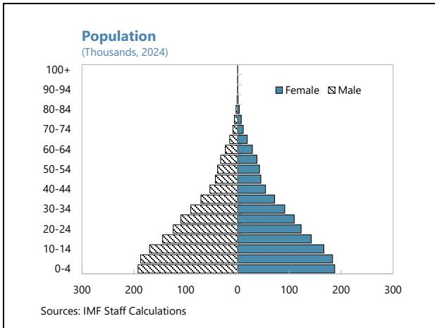

## C. Empirical analysis

## Growth Accounting

8. We conduct a growth accounting exercise to identify the contributions of supply factors to The Gambia's growth: namely labor, physical capital, and total factor productivity. $^{2}$ The analysis covers the period 1995-2024.

9. Growth accounting can be used to assess the extent to which observed output growth has been driven by factor accumulation versus TFP gains. The convention is to assume a (Cobb-Douglas) constant returns to scale aggregate production function, so that:

$$
Y _ {t} = A _ {t} K _ {t} ^ {\alpha} L _ {t} ^ {1 - \alpha}
$$

where Y is aggregate output, A is total factor productivity, K is the physical capital stock, Lis units of labor, and $\alpha$ is the elasticity of output with respect to the physical capital stock.

Expressing the equation in terms of units of labor (denoted in small case letters), and taking logs and their difference give:

$$
l n y _ {t} = l n A _ {t} + \alpha l n K _ {t} + (1 - \alpha) l n L _ {t}
$$

Where growth in output per unit of labor is the sum of growth in total factor productivity (growth in A) and growth in capital-labor ratio weighted by $\alpha$ . Estimates of TFP are sensitive to the value $\alpha$ , which is the elasticity of output with respect to the capital-labor ratio.

To compute the stock of capital (K), we use the perpetual inventory equation:

$$
K _ {t} = (1 - \delta) K _ {t - 1} + I _ {t}
$$

Where $I_{t}$ is investment at time t and $\delta$ its depreciation rate. The initial capital stocks, investments and the depreciation rates are necessary and sufficient to determine the capital stocks at each point in time. The total initial capital stock is set to equal 0.7 times real GDP. The depreciation rate is set to 5 percent per year, in line with the literature on low-income countries that posits depreciation rates between 3 percent and 5 percent per year. $^{3}$ In line with the literature on low-income countries, we assume that the elasticity of capital to output 0.3. Data on real GDP, total investment, and labor come from the World Bank.

10. Overall real GDP growth over 1995-2024 was mostly driven by the accumulation of factors of production, with TFP growth contributing little on average. The accumulation of human capital consistently provided the most important contribution to real GDP growth. Physical capital accumulation's contribution to real growth during the 1990s was low, reflecting relatively low investments compounded by the civil unrest at the time. During the following decade, the contribution of physical capital accumulation picked up, fueled by large public investments, and significantly contributed to real growth. Finally, TFP contributions have been volatile and often negative, underscoring the lack of sustained productivity gains.

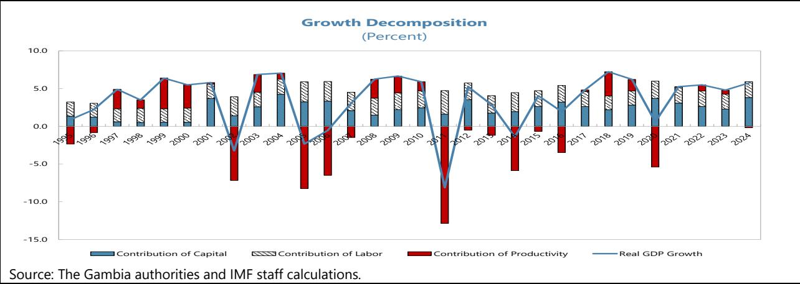

## Vector Autoregression (VAR)

11. This section uses a Vector Autoregression (VAR) model to examine the dynamic interactions between economic growth and several macroeconomic and financial variables in The Gambia. The VAR framework allows all variables to be treated as endogenous and captures their joint evolution over time without imposing strong structural restrictions.

$$
Y _ {i, t} = A (L) Y _ {i, t} + C X _ {i, t} + u _ {i, t}
$$

where $Y_{i,t}$ is a vector of endogenous variables with p lags. We consider the following variables: bank credit to private sector, total remittances, foreign aid, FDI, real GDP, inflation rates, and lending rates as endogenous variables. $X_{i,t}$ is a vector of exogenous variables (real effective exchange rate) and $u_{i,t}$ is a vector of structural error terms.

12. The analysis uses quarterly data covering the period 2003Q1–2024Q4. Real GDP growth is measured as the quarterly growth rate of real GDP. To control for scale effects and reduce potential non-stationarity, FDI, remittances, and credit to the private sector are expressed as ratios to GDP. Where appropriate, variables are transformed into logarithms prior to estimation. All data come from the World Bank and the Central Bank of The Gambia. $^{4}$

13. All impulse responses in our VAR analysis come from a typical estimation where we chose the lag order of two. $^{5}$ The IRFs are generated to trace the effect of a one-standard-deviation shock to each variable on real GDP growth. Confidence intervals are computed using bootstrap methods to assess statistical significance.

## Results

14. Figure 2a presents accumulated impulse responses of real GDP to one-standard-deviation structural shocks, with 95 percent confidence intervals.

Figure 2a. Impulse Response: Accumulated Impulse Responses of Real GDP to Generalized One S.D. Innovations
95% CI using analytic asymptotic S.E.s  
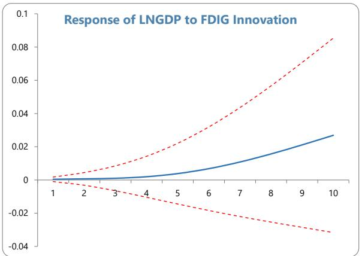

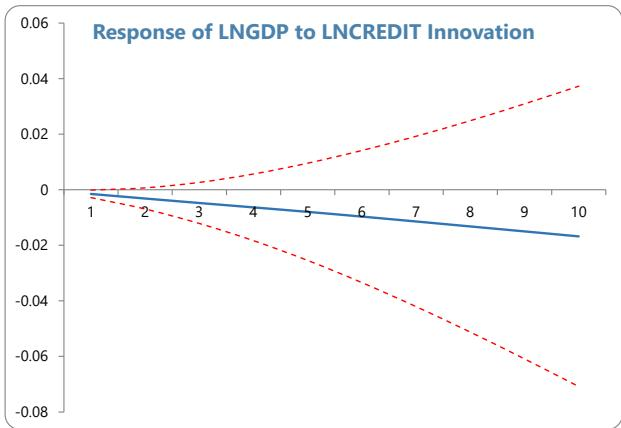

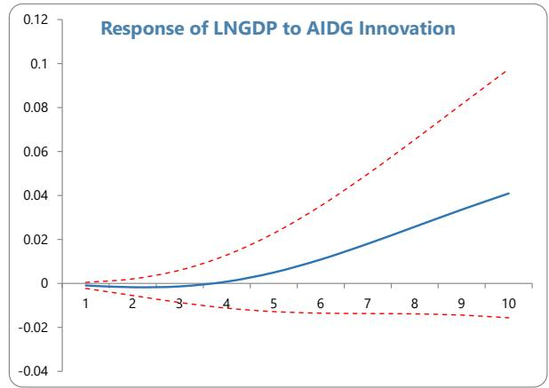  
Source: authors' estimations.

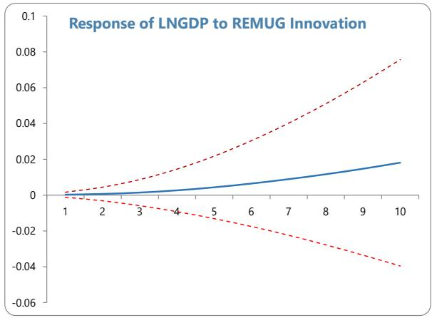

\- Growth Response to FDI Shocks. A positive shock to FDI leads to a gradual increase in real GDP growth. The response is statistically insignificant on impact but becomes positive after approximately four quarters, reaching a peak between six and eight quarters before gradually dissipating. This pattern suggests that FDI affects growth primarily through medium-term investment and productivity channels rather than immediate demand effects.

\- Growth Response to Remittance Shocks. Growth responds positively and immediately to a remittance shock. The effect is strongest within the first two quarters and fades after approximately four to six quarters. The short-lived nature of the response is consistent with remittances supporting growth mainly through consumption smoothing and aggregate demand rather than sustained investment.

\- Growth Response to Credit Shocks. A shock to credit to the private sector generates a positive but delayed response in GDP growth. The effect becomes noticeable after two to four quarters and remains modest throughout the horizon. This finding suggests that while financial intermediation supports growth, its quantitative impact remains limited, reflecting the shallow depth of the financial sector.

Figure 2b. Impulse Response: Accumulated Impulse Responses of Credit to Private Sector to Generalized One S.D. Innovations
95% CI using analytic asymptotic S.E.s - Transmission Channels. Additional impulse responses indicate that remittance shocks are associated with an increase in private sector credit, suggesting that a part of remittance inflows enter the domestic financial system. In contrast, FDI shocks have a weaker and less immediate effect on credit, consistent with the enclave nature of some foreign investment.

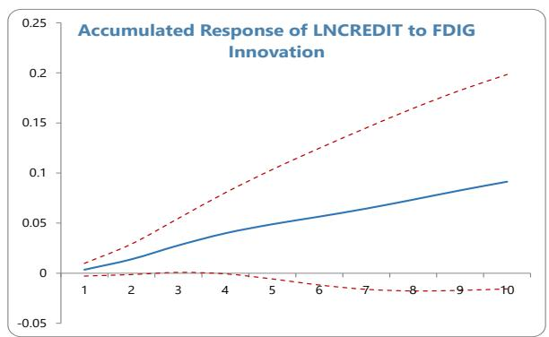

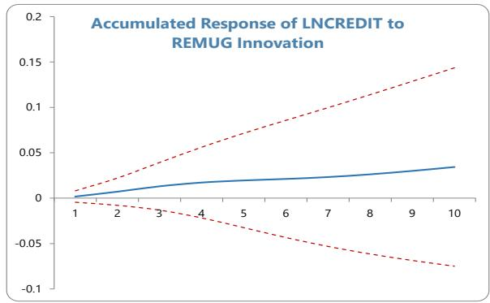

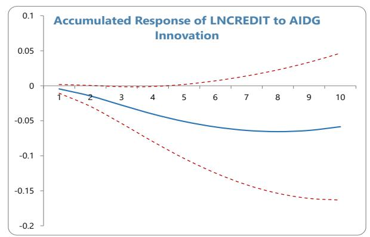  
Source: authors' estimations.

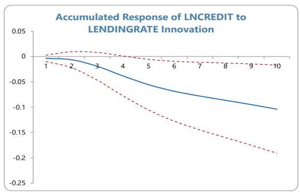

## Event Study Analysis

15. To complement the VAR analysis, we conduct an event study for The Gambia centered on the 2017 regime change. The analysis compares average values of key macroeconomic, governance, fiscal, external, and social indicators across two periods: the pre-transition period (2013–2016) and the post-transition period (2018–2024). The event year 2017 is excluded from both periods to avoid capturing transition dynamics. Data on our variables come from the World Bank's 2026 Economic Development Indicators (See Appendix Table 10). We also report a pre-COVID window (2018–2019) to isolate the transition effect from the pandemic shock of 2020. Statistical significance of the before/after differences is assessed using Welch's two-sample t-test, which accounts for the small and unequal sample sizes across the two periods. It confirms whether observed changes are statistically distinguishable from random variation.

<table><tr><td colspan="7">Table 1. The Gambia: Event Study: Before and After the 2017 Regime Change</td></tr><tr><td>Variable</td><td>Pre(2013–16)</td><td>Post(2018–24)</td><td>Post*(2018–19)</td><td>Difference(Post–Pre)</td><td>t-stat</td><td>p-val</td></tr><tr><td colspan="7">A. Real Sector</td></tr><tr><td>Real GDP growth (%)</td><td>1.87</td><td>5.18</td><td>6.73</td><td>+3.31*</td><td>-2.33</td><td>0.060</td></tr><tr><td>Real GDP per capita (USD)</td><td>621.3</td><td>700.9</td><td>670.5</td><td>+79.6***</td><td>-5.34</td><td>0.001</td></tr><tr><td>GDP deflator (annual %)</td><td>7.17</td><td>7.30</td><td>6.60</td><td>+0.13</td><td>-0.08</td><td>0.940</td></tr><tr><td>Gross investment (% GDP)</td><td>19.16</td><td>27.75</td><td>22.77</td><td>+8.59**</td><td>-3.20</td><td>0.021</td></tr><tr><td colspan="7">B. External Sector</td></tr><tr><td>Current account balance (% GDP)</td><td>-5.74</td><td>-4.64</td><td>-5.06</td><td>+1.10</td><td>-1.08</td><td>0.312</td></tr><tr><td>Trade openness (% GDP)</td><td>46.59</td><td>48.17</td><td>60.41</td><td>+1.58</td><td>-0.29</td><td>0.780</td></tr><tr><td>FDI net inflows (% GDP)</td><td>4.19</td><td>8.65</td><td>4.41</td><td>+4.46**</td><td>-3.14</td><td>0.012</td></tr><tr><td>Remittances (% GDP)</td><td>10.05</td><td>20.63</td><td>13.95</td><td>+10.59***</td><td>-5.23</td><td>0.001</td></tr><tr><td>Debt service to exports (%)</td><td>17.78</td><td>15.35</td><td>12.94</td><td>-2.43</td><td>+0.65</td><td>0.534</td></tr><tr><td colspan="7">C. Fiscal Sector</td></tr><tr><td>Aid received (% GDP)</td><td>7.70</td><td>13.39</td><td>12.26</td><td>+5.70***</td><td>-5.68</td><td>0.001</td></tr><tr><td>Govt final consumption (% GDP)</td><td>8.72</td><td>8.76</td><td>7.53</td><td>+0.04</td><td>-0.09</td><td>0.927</td></tr><tr><td>Govt expenditure growth (%)</td><td>92.12</td><td>97.93</td><td>94.99</td><td>+5.80*</td><td>-2.46</td><td>0.058</td></tr><tr><td>Education spending (% GDP)</td><td>2.06</td><td>2.80</td><td>2.59</td><td>+0.74***</td><td>-5.68</td><td>0.001</td></tr><tr><td>Health spending (% GDP)</td><td>1.12</td><td>1.40</td><td>1.17</td><td>+0.29*</td><td>-2.03</td><td>0.082</td></tr><tr><td colspan="7">D. Governance Indicators</td></tr><tr><td>Government effectiveness</td><td>-0.60</td><td>-0.52</td><td>-0.52</td><td>+0.08**</td><td>-3.18</td><td>0.019</td></tr><tr><td>Corruption control</td><td>-0.90</td><td>-0.32</td><td>-0.38</td><td>+0.58***</td><td>-23.25</td><td>0.000</td></tr><tr><td>Rule of law</td><td>-0.89</td><td>-0.39</td><td>-0.45</td><td>+0.51***</td><td>-13.25</td><td>0.000</td></tr><tr><td>Regulatory quality</td><td>-0.64</td><td>-0.69</td><td>-0.70</td><td>-0.05*</td><td>+2.09</td><td>0.073</td></tr><tr><td>Voice &amp; accountability</td><td>-1.24</td><td>-0.24</td><td>-0.31</td><td>+1.00***</td><td>-29.59</td><td>0.000</td></tr><tr><td>Political stability</td><td>-0.31</td><td>+0.05</td><td>-0.02</td><td>+0.36***</td><td>-5.62</td><td>0.002</td></tr><tr><td colspan="7">E. Social Indicators</td></tr><tr><td>School enrollment (%)</td><td>81.84</td><td>96.34</td><td>93.29</td><td>+14.50***</td><td>-7.30</td><td>0.001</td></tr><tr><td>Population growth (%)</td><td>2.78</td><td>2.34</td><td>2.39</td><td>-0.44***</td><td>+6.45</td><td>0.005</td></tr><tr><td colspan="7">Source: Authors&#x27; estimates.Notes: Pre = average over 2013–2016 (t-4 to t-1). Post = average over 2018–2024 (t+1 to t+7). Post* = average over 2018–2019 (pre-COVID clean window). Difference = Post minus Pre. t-statistics and p-values from Welch&#x27;s two-sample t-test (unequal variances). *** p&lt;0.01, ** p&lt;0.05, * p&lt;0.10. Event year t = 2017 (regime change). Governance indicators are World Bank WGI scores (higher = better governance). Positive difference in governance indicates improvement post-transition.</td></tr></table>

## 16. The results reveal a broad and statistically significant improvement across most indicators following the 2017 transition (Table 1).

\- In the real sector, real GDP growth increased from an average of 1.9 percent in the pre-transition period to 5.2 percent post-transition, with the pre-COVID window showing an even stronger average of 6.7 percent, and real GDP per capita rose significantly by approximately US\$80. Investment as a share of GDP also increased significantly by 8.6 percentage points. Inflation as measured by the GDP deflator remained broadly stable across the two periods, suggesting the improvements were achieved without generating additional price pressures.

\- In the external sector, remittances rose sharply from 10.1 to 20.6 percent of GDP likely reflecting restored diaspora confidence following the political transition, while FDI inflows also increased significantly. Foreign aid received rose from 7.7 to 13.4 percent of GDP, consistent with improved international engagement post-transition.

\- In the fiscal sector, government education and health spending both increased, suggesting improved public service delivery.

\- Governance indicators show the most striking results: voice and accountability improved by 1.0 point, corruption control by 0.58 points, rule of law by 0.51 points, and political stability by 0.36 points (all significant at the 1 percent level) while government effectiveness improved significantly at the 5 percent level. Regulatory quality is the only governance indicator that did not improve, declining marginally post-transition.

## 17. Taken together, these findings paint a coherent picture of post-transition

improvement. The post-2017 period was associated with stronger economic growth, higher investment, increased external inflows, greater spending on education and health, and significant improvements in most governance indicators. Although regulatory quality declined slightly, the overall evidence suggests substantial gains in both economic performance and institutional quality following the transition.

## Quantitative Analysis Using Estimations of Potential Output

18. Potential growth is the rate of increase of potential output, the level of output an economy would sustain at full capacity utilization and full employment. Macroeconomic theory posits that output revolves around an unobserved potential level, thus estimating potential growth provides useful predictor of growth of (actual) output over the medium-term.

19. Numerous methods of assessing potential growth are available, while challenging for developing countries like The Gambia with limited data availability. The measurement of unobservable potential growth relies on a range of assumptions about its relationship to available observable variables (Kilic et al. 2023). Here we show two approaches that are applicable to The Gambia, a growth accounting framework and a range of statistical filters.

## Growth Accounting Framework

20. Using growth accounting framework, we explore five different scenarios of productivity gains to illustrate different real GDP growth paths. In this exercise, we assume labor continues to grow at a constant level of 3 percent per year (average of the past three years), and public and private investment are consistent with the forecasts from the macroeconomic framework.

21. Five productivity growth scenarios and corresponding average real GDP growth forecasts between 2025 and 2030 are summarized in the table below. The chart shows the evolution over time, indicating the growth forecasts ranging from 3.3 percent to 5.8 percent over the next five-year period.

<table><tr><td colspan="3">Real GDP Growth Under Alternative Productivity Growth Scenarios</td></tr><tr><td></td><td>Productivity growth scenario</td><td>Estimated real GDP growth (average 2025-2030)</td></tr><tr><td>Very pessimistic</td><td>-2%/year</td><td>3.6</td></tr><tr><td>Pessimistic</td><td>-1%/year</td><td>4.1</td></tr><tr><td>Neutral</td><td>0%/year</td><td>4.6</td></tr><tr><td>Optimistic</td><td>+1%/year</td><td>5.1</td></tr><tr><td>Very optimistic</td><td>+2%/year</td><td>5.6</td></tr></table>

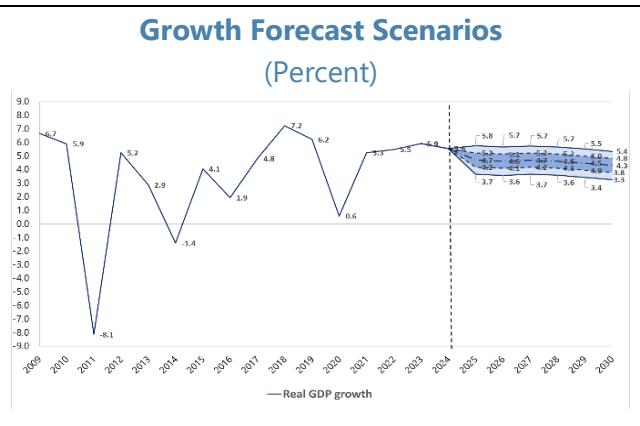

## Statistical Filters

22. Since theory posits that output fluctuates around a potential level over the business cycle, statistical filters can be used to estimate potential output by extracting the trend in real GDP. Similarly, potential growth can be calculated from potential output. There is no single most suitable statistical filter for this analysis, rather it is useful to use several of these filters to provide a range of estimates. Appendix Table 1 presents a range of statistical filters and their main features to illustrate the sensitivity of results to methodological choices. Moreover, results are sensitive to parametrization, Appendix Table 2 documents the standard default parameter choices used across filters.

23. Using the cross-filter average as a summary measure, potential growth is estimated at about 4.7 percent on average over the last five years, though this should be interpreted as a central tendency rather than a precise point estimate. The chart below shows the potential growth estimates from several statistical filters plotted alongside actual real GDP growth. While actual growth is volatile and reflects cyclical shocks, filter-based measures of potential growth are considerably smoother, as they are constructed to extract the underlying trend component of GDP. Across methods, the estimated potential growths tend to co-move over the medium term, suggesting a broadly consistent signal regarding underlying growth dynamics; however, differences in levels and turning points across filters underscore that estimates are method-dependent, particularly in shock-prone environments. This reinforces the importance of relying on multiple methodologies and interpreting the results as a range rather than a single point estimate.

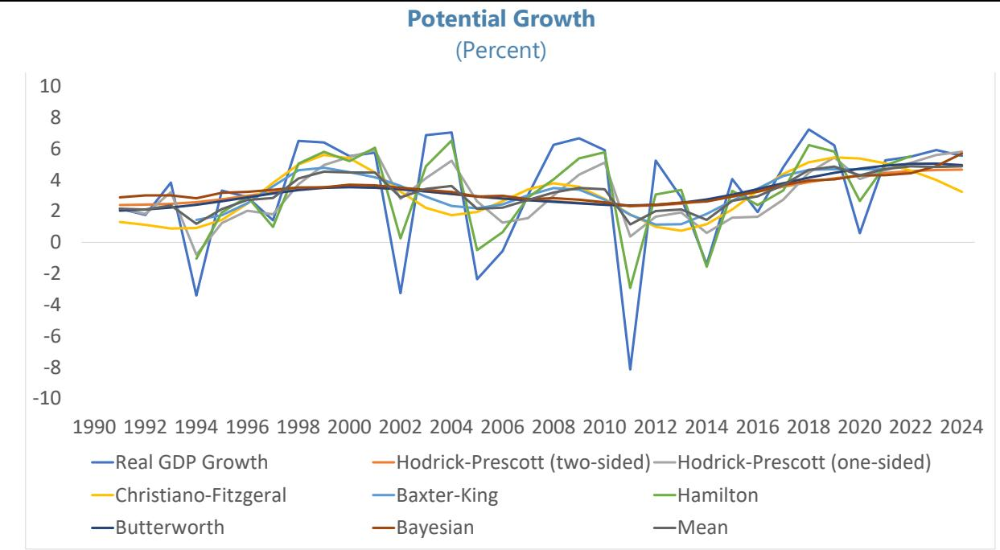

24. The above estimates of potential growth show that the projected 6 percent growth outturn in 2025 would imply growth temporarily above estimated potential, consistent with a cyclical upswing or the impact of favorable transitory factors—such as strong agriculture, construction activity, tourism recovery, and policy-supported demand. This assessment is also consistent with persistently elevated core inflation, which remains high despite a decline in headline inflation driven largely by easing food prices, suggesting underlying demand pressures. Sustaining growth at or above this rate over the medium term would require structural reforms and productivity gains sufficient to raise potential growth above its recent estimated range.

## Panel Data Analysis

25. This section examines the impact of government effectiveness on economic growth in Sub-Saharan Africa (SSA) using panel data techniques. Drawing on data from the Worldwide Governance Indicators and World Development Indicators, the analysis evaluates whether improvements in government effectiveness contribute to higher economic growth. The study employs fixed effects and system Generalized Method of Moments (GMM) estimators to address unobserved heterogeneity and endogeneity.

26. Economic growth in Sub-Saharan Africa (SSA) has shown significant variation over the past few decades, with some countries experiencing sustained expansion while others remain trapped in low-growth equilibria. One of the most debated explanations for this divergence is the role of institutional quality, particularly government effectiveness. Government effectiveness reflects the quality of public services, bureaucratic competence, policy formulation, and implementation credibility. Weak governance structures in many SSA countries have often been associated with corruption, inefficient resource allocation, and poor service delivery, all of which can hinder economic growth. This study aims to empirically investigate the relationship between government effectiveness and economic growth in SSA, using panel data techniques to address issues such as endogeneity and unobserved heterogeneity.

27. The role of institutions in economic development has been widely recognized in the literature. North (1990) argues that institutions reduce uncertainty by providing structure to human interaction, thereby facilitating economic activity. Similarly, Acemoglu, Johnson, and Robinson (2001) demonstrate that institutional quality is a fundamental determinant of long-run economic performance. Empirical studies confirm that countries with stronger institutions experience higher income levels and growth rates (Rodrik, Subramanian, & Trebbi, 2004). Government effectiveness is a key governance indicator that captures the ability of governments to design and implement sound policies. According to Kaufmann, Kraay, and Mastruzzi (2010), improvements in governance indicators, including government effectiveness, are strongly associated with better development outcomes. Empirical evidence suggests that effective governance enhances economic growth by improving public service delivery, increasing policy credibility, and fostering a conducive environment for investment (Mauro, 1995; Easterly & Levine, 1997).

## Model

28. In order to evaluate empirically the role of government effectiveness on economic growth an unbalanced panel data analysis is applied. The growth equation is built in the following linear form:

$$
l n y _ {i, t} = l n y _ {i, t - 1} + x _ {i, t} ^ {\prime} \beta + \rho g o v e r n a c e _ {i, t} + \delta_ {i} + \varepsilon_ {i, t - 1}
$$

where $y_{i,t}$ is real GDP per capita growth for a country (i) at time (t). x is a vector of exogenous variables. Governance is an index. $\beta$ and $\rho$ are parameters to be estimated, $\eta$ is time invariant country-specific error term, and $\delta$ is a time dependent random disturbance term.

## Data

29. The empirical analysis is based on an unbalanced panel dataset for 69 LICs over the period 2001-2024. Macroeconomic data come from and the World Bank's World Development Indicators (2026) and data on governance comes from World Bank Governance. We consider government effectiveness, control of corruption, political stability, Bureaucratic quality, rule of law, and voice and accountability (see Appendix Table 10).

## Results

30. Findings show a positive and statistically significant relationship between government effectiveness and economic growth. System GMM estimates reported in Table 2 reveal that governance plays a significant role in explaining variation in real GDP per capita in our sample.

Government effectiveness, control of corruption, rule of law, bureaucratic quality, and voice and accountability all enter with positive and statistically significant coefficients. Among these dimensions, control of corruption ( $\beta = 0.0418$ , p < 0.01) and bureaucratic quality ( $\beta = 0.0407$ , p < 0.01) exert the strongest effects. The lagged dependent variable remains highly significant across all specifications, indicating substantial persistence over time. Regarding the control variables, aid inflows and trade openness consistently improve real GDP per capita, whereas political stability, investment, FDI, remittances, and inflation do not show statistically significant effects. Overall, these findings underscore the importance of strengthening institutional quality as a pathway to sustainable economic development in SSA.

<table><tr><td colspan="6">Table 2. The Gambia: Summary of GMM Estimates of Governance on GDP Per Capita (SSA)</td></tr><tr><td>Variable</td><td>(1) Govt. effect.</td><td>(2) Corruption</td><td>(3) Rule of law</td><td>(4) Bureau. qual.</td><td>(5) Voice &amp; acc.</td></tr><tr><td colspan="6">Governance indicator</td></tr><tr><td>Govt. effectiveness</td><td>0.0384***(0.0126)</td><td>—</td><td>—</td><td>—</td><td>—</td></tr><tr><td>Corruption</td><td>—</td><td>0.0418***(0.0103)</td><td>—</td><td>—</td><td>—</td></tr><tr><td>Rule of law</td><td>—</td><td>—</td><td>0.0340**(0.0141)</td><td>—</td><td>—</td></tr><tr><td>Bureaucratic quality</td><td>—</td><td>—</td><td>—</td><td>0.0407***(0.0125)</td><td>—</td></tr><tr><td>Voice &amp; accountability</td><td>—</td><td>—</td><td>—</td><td>—</td><td>0.0195**(0.0088)</td></tr><tr><td colspan="6">Notes: *** p&lt;0.01, ** p&lt;0.05, * p&lt;0.10. All regressors are one-period lagged. Robust standard errors in parentheses.Estimator: Blundell-Bond system GMM (xtdpdsys), one-step with robust VCE. AR and Sargan/Hansen tests suppressedunder vce(robust).</td></tr></table>

31. Growth decompositions and the System GMM estimates underscore the importance of government effectiveness for growth in The Gambia. The results suggest that improvements in government effectiveness have contributed positively, albeit modestly, to real GDP per capita growth. Between 2015 and 2024, government effectiveness improved from -0.923 to -0.536, representing a 0.387-point increase (approximately 42 percent relative to its 2015 level). Based on the System GMM estimates, this improvement is associated with an increase in real GDP per capita growth of approximately 0.015 percentage points in the short run. Accounting for growth persistence, the implied long-run effect is approximately 0.68 percentage points. However, given the high persistence in growth dynamics, the long-run multiplier should be interpreted with caution (see Annex I).

## D. Conclusion

32. This paper examines the growth performance of The Gambia, its structural drivers, and the role of governance in shaping long-run economic outcomes. The analysis' findings suggest that The Gambia's medium- to long-term growth prospects depend critically on structural transformation. As contributions from capital and labor are expected to diminish over time, productivity growth will need to become the main engine of expansion. This requires continued strengthening of governance and institutions, alongside complementary reforms in human capital, infrastructure, financial sector development, and economic diversification. In particular:

\- Maintaining macroeconomic stability remains central to The Gambia's growth outlook over the medium term. Fiscal policy should continue to be anchored on gradual consolidation, supported by strengthened domestic revenue mobilization, improved expenditure prioritization, and prudent public debt management to preserve debt sustainability. Monetary policy should remain focused on maintaining price stability while supporting adequate credit provision to the private sector.

\- Raising agricultural productivity is essential to supporting inclusive growth and external stability. Structural reforms should prioritize irrigation development, improved access to inputs, strengthened agricultural extension services, and the adoption of climate-resilient practices. These measures would help boost rural incomes, enhance food security, and reduce reliance on food imports.

\- Accelerating structural reforms to foster private sector-led growth remains a key priority. Improving the business environment through regulatory simplification, strengthened contract enforcement, and enhanced access to finance—particularly for small and medium-sized enterprises—would support investment, job creation, and productivity gains.

\- Promoting economic diversification will help strengthen resilience to external shocks. Policies should support value addition in agriculture, fisheries, and light manufacturing, while improving trade facilitation and compliance with regional and international standards to enhance export competitiveness.

\- Investments in human capital are critical to improving long-term growth prospects. Enhancing the efficiency and targeting of public spending on education, health, and skills development will raise labor productivity and support economic diversification. Greater emphasis on technical and vocational education aligned with labor market needs would help address skills mismatches.

\- Addressing infrastructure gaps is necessary to enhance competitiveness and growth. Priority investments in energy, transport, and digital connectivity should be guided by rigorous project appraisal and aligned with medium-term fiscal and debt sustainability objectives to maximize growth impact.

## References

Acemoglu, D., Johnson, S., & Robinson, J. A. (2001). The colonial origins of comparative development: An empirical investigation. American Economic Review, 91(5), 1369–1401.

Easterly, W., & Levine, R. (1997). Africa's growth tragedy: Policies and ethnic divisions. Quarterly Journal of Economics, 112(4), 1203–1250.

Greene, W. H. (2003). Econometric analysis (5th edition). Prentice Hall.

IMF (2019). Djibouti: 2019 Article IV Consultation-Press Release; Staff Report; and Statement by the Executive Director for Djibouti, IMF Country Report No. 19/314.

IMF (2022). Benin: 2022 Article IV Consultation and Requests for an Extended Arrangement Under the Extended Fund Facility and an Arrangement Under the Extended Credit Facility—Press Release; Staff Report; Staff Statement; And Statement by the Executive Director for Benin, IMF Country Report No. 22/245.

IMF (2023). Republic of Madagascar: 2022 Article IV Consultation, Third Review Under the Extended Credit Facility Arrangement, and Requests for a Waiver of Nonobservance of Performance Criteria and Modification of Performance Criteria—Press Release; Staff Report; and Statement by the Executive Director for Republic of Madagascar, IMF Country Report No. 23/117.

Kaufmann, D., Kraay, A., & Mastruzzi, M. (2010). The Worldwide Governance Indicators: Methodology and analytical issues (World Bank Policy Research Working Paper No. 5430).

Kilic Celik, S., M. A. Kose, F. Ohnsorge, and F. U. Ruch. (2023). "Potential Growth: A Global Database." Policy Research Working Paper 10354, World Bank, Washington, DC.

Mauro, P. (1995). Corruption and growth. Quarterly Journal of Economics, 110(3), 681–712.

North, D. C. (1990). Institutions, institutional change and economic performance. Cambridge University Press.

Rodrik, D., Subramanian, A., & Trebbi, F. (2004). Institutions rule: The primacy of institutions over geography and integration in economic development. Journal of Economic Growth, 9(2), 131–165.

Senhadji, A. S. (1999). Sources of Economic Growth: An Extensive Growth Accounting Exercise., IMF Working Paper No. 99/77. International Monetary Fund

United Nations Development Programme. (2024). Human Development Index (HDI) dataset. Human Development Reports. Retrieved from HDI Data Center.

World Bank. (2026). World Development Indicators. World Bank. Retrieved from World Development Indicators Database.

## Annex I. Short- and Long-run Impact of Governance Indicators

With system GMM specifications reported above, we can calculate both the short-run and long-run impact of governance indicators as follows:

## 1. Short-run Impact

Using Model (1):

$$
\beta_ {G E} = 0. 0 3 8 4
$$

A one-unit increase in Government Effectiveness is associated with an immediate increase of 0.0384 units in the dependent variable. For example, if a country's government effectiveness score rises from -0.5 to 0.5:

$$
\Delta G = 1
$$

then

$$
\Delta y _ {S R} = 0. 0 3 8 4 \times 1 = 0. 0 3 8 4
$$

## 2. Long-run Impact

Because since lagged dependent variable coefficient is very high:

$$
\alpha = 0. 9 7 8 2
$$

the long-run multiplier is:

$$
\frac {\beta}{1 - \alpha}
$$

For Government Effectiveness:

$$
\frac {0 . 0 3 8 4}{1 - 0 . 9 7 8 2} = \frac {0 . 0 3 8 4}{0 . 0 2 1 8} = 1. 7 6 1
$$

Thus:

$$
\text { Long - run   effect   of   Govt.   Effectiveness } = 1. 7 6 1
$$

A permanent one-unit improvement in government effectiveness predicts a long-run increase of approximately 1.76 units in the dependent variable.

<table><tr><td colspan="4">Short and Long-run Effects of All Governance Indicators</td></tr><tr><td>Governance indicator</td><td>β</td><td>α</td><td>Long-run effect β/(1-α)</td></tr><tr><td>Government effectiveness</td><td>0.038</td><td>0.978</td><td>1.761</td></tr><tr><td>Corruption</td><td>0.042</td><td>0.981</td><td>2.155</td></tr><tr><td>Rule of law</td><td>0.034</td><td>0.982</td><td>1.878</td></tr><tr><td>Bureaucratic quality</td><td>0.041</td><td>0.979</td><td>1.947</td></tr><tr><td>Voice &amp; accountability</td><td>0.020</td><td>0.985</td><td>1.336</td></tr><tr><td colspan="4">Source: Authors&#x27; estimates.</td></tr></table>

## Appendix I. Tables

Table 1. The Gambia: Statistical Filters for Potential Output and Growth Estimation

<table><tr><td>Hodrick-Prescott Filter (two sided)</td><td>Most commonly used</td></tr><tr><td>Hodrick-Prescott Filter (one sided)</td><td>Mitigate the end-point problem</td></tr><tr><td>Christiano-Fitzgerald Filter</td><td>Suited to shorter samples and flexible cycle lengths</td></tr><tr><td>Hamilton Filter</td><td>Address spurious dynamics but very sensitive to specification</td></tr><tr><td>Baxter-King Filter</td><td>Reduces end-point problem but cannot provide most recent datapoint</td></tr><tr><td>Butterworth Filter</td><td>Smooths out short-term noise to extract a stable trend, with relatively low computational burden</td></tr><tr><td>Bayesian Filter</td><td>Reduced end-point problem; allows incorporation of priors and economic structure</td></tr></table>

Table 2. The Gambia: Parameterization of Statistical Filters for Potential Output Estimation

<table><tr><td>Statistical filter</td><td>Parametrization</td></tr><tr><td>Hodrick-Prescott filter (two-sided)</td><td>Smoothing parameter λ=100</td></tr><tr><td>Hodrick-Prescott filter (one-sided)</td><td>Smoothing parameter λ=100</td></tr><tr><td>Christiano-Fitzgerald filter</td><td>Low = 2, High = 8</td></tr><tr><td>Hamilton filter</td><td>h=2h = 2h=2, p=1p = 1p=1</td></tr><tr><td>Baxter-King filter</td><td>Low = 2, High = 8, K=3K = 3K=3</td></tr><tr><td>Butterworth filter</td><td>Order = 2, Cutoff = 0.1</td></tr></table>

<table><tr><td colspan="8">Table 3. The Gambia: Summary Statistics</td></tr><tr><td colspan="8">Panel A: full sample (69 countries, 2003–2024). Panel B: Sub-Saharan Africa subsample (37–43 countries). Statistics computed on available observations for each variable.</td></tr><tr><td>Variable</td><td>Obs</td><td>Mean</td><td>Std. Dev.</td><td>Min</td><td colspan="3">Max</td></tr><tr><td>Panel A: Full sample</td><td></td><td></td><td></td><td></td><td colspan="3"></td></tr><tr><td>In (GDP per capita)</td><td>1,754</td><td>7.496</td><td>0.953</td><td>5.493</td><td colspan="3">9.748</td></tr><tr><td>Government effectiveness</td><td>1,771</td><td>-0.611</td><td>0.619</td><td>-2.206</td><td colspan="3">1.101</td></tr><tr><td>Corruption control</td><td>1,771</td><td>-0.673</td><td>0.519</td><td>-1.806</td><td colspan="3">1.240</td></tr><tr><td>Rule of law</td><td>1,771</td><td>-0.711</td><td>0.575</td><td>-2.508</td><td colspan="3">1.029</td></tr><tr><td>Regulatory quality</td><td>1,771</td><td>-0.545</td><td>0.602</td><td>-2.402</td><td colspan="3">1.137</td></tr><tr><td>Voice &amp; accountability</td><td>1,771</td><td>-0.569</td><td>0.642</td><td>-2.231</td><td colspan="3">0.954</td></tr><tr><td>Political stability</td><td>1,771</td><td>-0.703</td><td>0.806</td><td>-3.052</td><td colspan="3">1.284</td></tr><tr><td>In (Investment)</td><td>1,556</td><td>22.738</td><td>2.012</td><td>16.164</td><td colspan="3">29.681</td></tr><tr><td>FDI (% GDP)</td><td>1,761</td><td>3.573</td><td>6.112</td><td>-37.17</td><td colspan="3">103.3</td></tr><tr><td>Remittances (% GDP)</td><td>1,577</td><td>5.239</td><td>6.424</td><td>0.000</td><td colspan="3">50.10</td></tr><tr><td>Aid (% GDP)</td><td>1,689</td><td>5.158</td><td>6.921</td><td>-0.616</td><td colspan="3">81.79</td></tr><tr><td>In (CPI)</td><td>1,701</td><td>4.765</td><td>0.567</td><td>2.731</td><td colspan="3">10.57</td></tr><tr><td>Trade openness (% GDP)</td><td>1,649</td><td>68.76</td><td>37.71</td><td>2.00</td><td colspan="3">347.7</td></tr><tr><td>Panel B: Sub-Saharan Africa subsample</td><td></td><td></td><td></td><td></td><td colspan="3"></td></tr><tr><td>In (GDP per capita)</td><td>978</td><td>7.031</td><td>0.849</td><td>5.493</td><td colspan="3">9.387</td></tr><tr><td>Government effectiveness</td><td>989</td><td>-0.767</td><td>0.599</td><td>-2.206</td><td colspan="3">1.101</td></tr><tr><td>Corruption control</td><td>989</td><td>-0.688</td><td>0.579</td><td>-1.806</td><td colspan="3">1.240</td></tr><tr><td>Rule of law</td><td>989</td><td>-0.760</td><td>0.627</td><td>-2.508</td><td colspan="3">1.029</td></tr><tr><td>Regulatory quality</td><td>989</td><td>-0.696</td><td>0.588</td><td>-2.314</td><td colspan="3">1.137</td></tr><tr><td>Voice &amp; accountability</td><td>989</td><td>-0.643</td><td>0.633</td><td>-1.884</td><td colspan="3">0.954</td></tr><tr><td>Political stability</td><td>989</td><td>-0.694</td><td>0.856</td><td>-3.052</td><td colspan="3">1.284</td></tr><tr><td>In (Investment)</td><td>842</td><td>21.665</td><td>1.435</td><td>16.164</td><td colspan="3">25.182</td></tr><tr><td>FDI (% GDP)</td><td>985</td><td>3.966</td><td>7.374</td><td>-17.29</td><td colspan="3">103.3</td></tr><tr><td>Remittances (% GDP)</td><td>851</td><td>3.777</td><td>5.862</td><td>0.000</td><td colspan="3">50.10</td></tr><tr><td>Aid (% GDP)</td><td>946</td><td>7.734</td><td>7.864</td><td>-0.246</td><td colspan="3">81.79</td></tr><tr><td>In (CPI)</td><td>934</td><td>4.800</td><td>0.630</td><td>2.731</td><td colspan="3">10.57</td></tr><tr><td>Trade openness (% GDP)</td><td>924</td><td>65.90</td><td>37.37</td><td>2.00</td><td colspan="3">347.7</td></tr><tr><td colspan="8">Notes: All governance indicators are World Bank Worldwide Governance Indicators (WGI), ranging from -2.5 to +2.5.In(Investment) and In (CPI) are natural logarithms of their respective levels. Remittances (% GDP) computed as 100 × remittances received / nominal GDP.</td></tr><tr><td colspan="8">Table 4. The Gambia: Correlation Matrix — Full Sample (N = 1,312)</td></tr><tr><td colspan="8">Panel A: Variables (1)-(7)</td></tr><tr><td></td><td>(1)</td><td>(2)</td><td>(3)</td><td>(4)</td><td>(5)</td><td>(6)</td><td>(7)</td></tr><tr><td>(1) In (GDP per capita)</td><td>1.000</td><td></td><td></td><td></td><td></td><td></td><td></td></tr><tr><td>(2) Govt. effectiveness</td><td>0.641*</td><td>1.000</td><td></td><td></td><td></td><td></td><td></td></tr><tr><td>(3) Corruption control</td><td>0.421*</td><td>0.806*</td><td>1.000</td><td></td><td></td><td></td><td></td></tr><tr><td>(4) Rule of law</td><td>0.453*</td><td>0.841*</td><td>0.883*</td><td>1.000</td><td></td><td></td><td></td></tr><tr><td>(5) Regulatory quality</td><td>0.611*</td><td>0.881*</td><td>0.805*</td><td>0.869*</td><td>1.000</td><td></td><td></td></tr><tr><td>(6) Voice &amp; accountability</td><td>0.387*</td><td>0.615*</td><td>0.651*</td><td>0.761*</td><td>0.720*</td><td>1.000</td><td></td></tr><tr><td>(7) Political stability</td><td>0.385*</td><td>0.600*</td><td>0.658*</td><td>0.708*</td><td>0.594*</td><td>0.594*</td><td>1.000</td></tr><tr><td colspan="8"></td></tr><tr><td colspan="8">Panel B: Variables (8)-(13)</td></tr><tr><td></td><td>(8)</td><td>(9)</td><td>(10)</td><td>(11)</td><td>(12)</td><td>(13)</td><td></td></tr><tr><td>(8) In (Investment)</td><td>1.000</td><td></td><td></td><td></td><td></td><td></td><td></td></tr><tr><td>(9) FDI (% GDP)</td><td>-0.061*</td><td>1.000</td><td></td><td></td><td></td><td></td><td></td></tr><tr><td>(10) Remittances (% GDP)</td><td>-0.241*</td><td>0.046</td><td>1.000</td><td></td><td></td><td></td><td></td></tr><tr><td>(11) Aid (% GDP)</td><td>-0.561*</td><td>0.230*</td><td>0.042</td><td>1.000</td><td></td><td></td><td></td></tr><tr><td>(12) In (CPI)</td><td>0.147*</td><td>-0.052*</td><td>0.056*</td><td>-0.086*</td><td>1.000</td><td></td><td></td></tr><tr><td>(13) Trade openness</td><td>-0.090*</td><td>0.243*</td><td>0.049</td><td>-0.094*</td><td>-0.134*</td><td>1.000</td><td></td></tr><tr><td colspan="8">Source: Authors' calculations.</td></tr><tr><td colspan="8">Table 5. The Gambia: Fixed-Effects Estimations: Governance and Economic Growth (Sub-Saharan Africa)</td></tr><tr><td colspan="8">Dependent variable: log of Real GDP per capita, Sample: 2001-2024</td></tr><tr><td>Variables</td><td>(1) Govt. effect.</td><td>(2) Corruption</td><td>(3) Rule of law</td><td>(4) Bureau. qual.</td><td colspan="3">(5) Voice &amp; acc.</td></tr><tr><td>Governance indicator</td><td></td><td></td><td></td><td></td><td colspan="3"></td></tr><tr><td>Govt. effectiveness</td><td>0.02**(0.0093)</td><td>—</td><td>—</td><td>—</td><td colspan="3">—</td></tr><tr><td>Corruption</td><td>—</td><td>0.03***(0.0075)</td><td>—</td><td>—</td><td colspan="3">—</td></tr><tr><td>Rule of law</td><td>—</td><td>—</td><td>0.03**(0.0103)</td><td>—</td><td colspan="3">—</td></tr><tr><td>Bureaucratic quality</td><td>—</td><td>—</td><td>—</td><td>0.03***(0.0081)</td><td colspan="3">—</td></tr><tr><td>Voice &amp; accountability</td><td>—</td><td>—</td><td>—</td><td>—</td><td colspan="3">0.02**(0.0062)</td></tr><tr><td>Control variables</td><td></td><td></td><td></td><td></td><td colspan="3"></td></tr><tr><td>Lagged dependent variable</td><td>0.91***(0.0311)</td><td>0.91***(0.0283)</td><td>0.92***(0.0288)</td><td>0.91***(0.0290)</td><td colspan="3">0.93***(0.0287)</td></tr><tr><td>Political stability</td><td>0.005(0.0037)</td><td>0.004(0.0036)</td><td>0.002(0.0037)</td><td>0.004(0.0037)</td><td colspan="3">0.004(0.0037)</td></tr><tr><td>ln(Investment)</td><td>0.02***(0.0046)</td><td>0.02***(0.0045)</td><td>0.02***(0.0045)</td><td>0.02***(0.0046)</td><td colspan="3">0.02***(0.0046)</td></tr><tr><td>FDI (% GDP)</td><td>-0.0002(0.0003)</td><td>-0.0003(0.0003)</td><td>-0.0002(0.0003)</td><td>-0.0002(0.0003)</td><td colspan="3">-0.0002(0.0003)</td></tr><tr><td>Remittances (% GDP)</td><td>0.002*(0.0008)</td><td>0.002**(0.0008)</td><td>0.002**(0.0008)</td><td>0.002**(0.0008)</td><td colspan="3">0.002**(0.0008)</td></tr><tr><td>Aid (% GDP)</td><td>0.001*(0.0007)</td><td>0.001*(0.0007)</td><td>0.001*(0.0007)</td><td>0.001*(0.0007)</td><td colspan="3">0.001*(0.0007)</td></tr><tr><td>ln(CPI)</td><td>-0.01(0.0085)</td><td>-0.01*(0.0082)</td><td>-0.01*(0.0082)</td><td>-0.01(0.0080)</td><td colspan="3">-0.01*(0.0082)</td></tr><tr><td>Trade openness</td><td>0.0003*(0.0002)</td><td>0.0003**(0.0002)</td><td>0.0003**(0.0002)</td><td>0.0003**(0.0002)</td><td colspan="3">0.0003*(0.0002)</td></tr><tr><td>Constant</td><td>0.29*(0.1767)</td><td>0.27*(0.1576)</td><td>0.24(0.1559)</td><td>0.27*(0.1596)</td><td colspan="3">0.17(0.1574)</td></tr><tr><td>Observations</td><td>673</td><td>673</td><td>673</td><td>673</td><td colspan="3">673</td></tr><tr><td>Countries</td><td>37</td><td>37</td><td>37</td><td>37</td><td colspan="3">37</td></tr><tr><td>Within  $R^2$ </td><td>0.936</td><td>0.937</td><td>0.936</td><td>0.937</td><td colspan="3">0.936</td></tr><tr><td>F-statistic</td><td>887.35</td><td>1201.04</td><td>1013.96</td><td>1090.39</td><td colspan="3">858.59</td></tr><tr><td colspan="8">Notes: *** p&lt;0.01, ** p&lt;0.05, * p&lt;0.10. All regressors are one-period lagged. Standard errors clustered at the country level.Estimator: fixed effects (within) with robust standard errors.</td></tr><tr><td colspan="8">Table 6. The Gambia: Fixed-effects Estimations: Governance and Economic Growth (Full sample)Dependent variable: log of Real GDP per capita, Sample: 2001-2024</td></tr><tr><td>Variable</td><td>(1) Govt. effect.</td><td>(2) Corruption</td><td>(3) Rule of law</td><td>(4) Bureau. qual.</td><td colspan="3">(5) Voice &amp; acc.</td></tr><tr><td colspan="8">Governance indicator</td></tr><tr><td>Govt. effectiveness</td><td>0.0185***(0.0067)</td><td>—</td><td>—</td><td>—</td><td colspan="3">—</td></tr><tr><td>Corruption</td><td>—</td><td>0.0241***(0.0054)</td><td>—</td><td>—</td><td colspan="3">—</td></tr><tr><td>Rule of law</td><td>—</td><td>—</td><td>0.0087(0.0069)</td><td>—</td><td colspan="3">—</td></tr><tr><td>Bureaucratic quality</td><td>—</td><td>—</td><td>—</td><td>0.0146***(0.0053)</td><td colspan="3">—</td></tr><tr><td>Voice &amp; accountability</td><td>—</td><td>—</td><td>—</td><td>—</td><td colspan="3">0.0044(0.0051)</td></tr><tr><td colspan="8">Control variables</td></tr><tr><td>Lagged dependent variable</td><td>0.9284***(0.0142)</td><td>0.9344***(0.0127)</td><td>0.9379***(0.0136)</td><td>0.9341***(0.0134)</td><td colspan="3">0.9391***(0.0135)</td></tr><tr><td>Political stability</td><td>0.0052*(0.0028)</td><td>0.0050*(0.0026)</td><td>0.0055*(0.0029)</td><td>0.0058**(0.0028)</td><td colspan="3">0.0063**(0.0029)</td></tr><tr><td>ln(Investment)</td><td>0.0118***(0.0045)</td><td>0.0128***(0.0044)</td><td>0.0131***(0.0044)</td><td>0.0134***(0.0043)</td><td colspan="3">0.0130***(0.0045)</td></tr><tr><td>FDI (% GDP)</td><td>0.0002(0.0003)</td><td>0.0001(0.0003)</td><td>0.0002(0.0003)</td><td>0.0002(0.0003)</td><td colspan="3">0.0002(0.0003)</td></tr><tr><td>Remittances (% GDP)</td><td>0.0017***(0.0005)</td><td>0.0018***(0.0005)</td><td>0.0017***(0.0005)</td><td>0.0018***(0.0005)</td><td colspan="3">0.0016***(0.0004)</td></tr><tr><td>Aid (% GDP)</td><td>0.0010**(0.0004)</td><td>0.0008**(0.0004)</td><td>0.0010**(0.0004)</td><td>0.0010**(0.0004)</td><td colspan="3">0.0010**(0.0004)</td></tr><tr><td>ln(CPI)</td><td>-0.0123(0.0083)</td><td>-0.0121(0.0081)</td><td>-0.0125(0.0081)</td><td>-0.0121(0.0080)</td><td colspan="3">-0.0126(0.0081)</td></tr><tr><td>Trade openness</td><td>0.0002*(0.0001)</td><td>0.0002**(0.0001)</td><td>0.0002**(0.0001)</td><td>0.0002**(0.0001)</td><td colspan="3">0.0002**(0.0001)</td></tr><tr><td>Constant</td><td>0.3423***(0.0998)</td><td>0.2775***(0.0843)</td><td>0.2382***(0.0850)</td><td>0.2568***(0.0842)</td><td colspan="3">0.2286***(0.0837)</td></tr><tr><td>Observations</td><td>1,312</td><td>1,312</td><td>1,312</td><td>1,312</td><td colspan="3">1,312</td></tr><tr><td>Countries</td><td>69</td><td>69</td><td>69</td><td>69</td><td colspan="3">69</td></tr><tr><td>Within  $R^2$ </td><td>0.961</td><td>0.962</td><td>0.961</td><td>0.961</td><td colspan="3">0.961</td></tr><tr><td>F-statistic</td><td>2730.34</td><td>3420.41</td><td>2865.69</td><td>3045.03</td><td colspan="3">2926.23</td></tr><tr><td colspan="8">Table 7. The Gambia: System GMM Estimations: Governance and Economic Growth (Sub-Saharan Africa)</td></tr><tr><td colspan="8">Dependent variable: log of Real GDP per capita, Sample: 2001-2024</td></tr><tr><td>Variable</td><td>(1) Govt. effect.</td><td>(2) Corruption</td><td>(3) Rule of law</td><td>(4) Bureau. qual.</td><td colspan="3">(5) Voice &amp; acc.</td></tr><tr><td colspan="8">Governance indicator</td></tr><tr><td>Govt. effectiveness</td><td>0.0384***(0.0126)</td><td>—</td><td>—</td><td>—</td><td colspan="3">—</td></tr><tr><td>Corruption</td><td>—</td><td>0.0418***(0.0103)</td><td>—</td><td>—</td><td colspan="3">—</td></tr><tr><td>Rule of law</td><td>—</td><td>—</td><td>0.0340**(0.0141)</td><td>—</td><td colspan="3">—</td></tr><tr><td>Bureaucratic quality</td><td>—</td><td>—</td><td>—</td><td>0.0407***(0.0125)</td><td colspan="3">—</td></tr><tr><td>Voice &amp; accountability</td><td>—</td><td>—</td><td>—</td><td>—</td><td colspan="3">0.0195**(0.0088)</td></tr><tr><td colspan="8">Control variables</td></tr><tr><td>Lagged dependent variable</td><td>0.9782***(0.0250)</td><td>0.9806***(0.0242)</td><td>0.9819***(0.0239)</td><td>0.9791***(0.0252)</td><td colspan="3">0.9854***(0.0250)</td></tr><tr><td>Political stability</td><td>0.0043(0.0063)</td><td>-0.0010(0.0063)</td><td>0.0011(0.0076)</td><td>0.0037(0.0068)</td><td colspan="3">0.0061(0.0078)</td></tr><tr><td>ln(Investment)</td><td>-0.0009(0.0048)</td><td>0.0032(0.0042)</td><td>0.0043(0.0046)</td><td>0.0029(0.0046)</td><td colspan="3">0.0054(0.0054)</td></tr><tr><td>FDI (% GDP)</td><td>-0.0004(0.0006)</td><td>-0.0005(0.0006)</td><td>-0.0005(0.0006)</td><td>-0.0004(0.0006)</td><td colspan="3">-0.0005(0.0006)</td></tr><tr><td>Remittances (% GDP)</td><td>0.0012(0.0013)</td><td>0.0010(0.0014)</td><td>0.0011(0.0014)</td><td>0.0017(0.0014)</td><td colspan="3">0.0009(0.0014)</td></tr><tr><td>Aid (% GDP)</td><td>0.0024***(0.0009)</td><td>0.0024***(0.0008)</td><td>0.0025***(0.0009)</td><td>0.0025***(0.0009)</td><td colspan="3">0.0025***(0.0009)</td></tr><tr><td>ln(CPI)</td><td>-0.0046(0.0115)</td><td>-0.0059(0.0110)</td><td>-0.0047(0.0108)</td><td>-0.0039(0.0109)</td><td colspan="3">-0.0043(0.0112)</td></tr><tr><td>Trade openness</td><td>0.0007**(0.0003)</td><td>0.0007**(0.0003)</td><td>0.0008**(0.0003)</td><td>0.0007**(0.0003)</td><td colspan="3">0.0008**(0.0003)</td></tr><tr><td>Constant</td><td>0.1752(0.1696)</td><td>0.0740(0.1491)</td><td>0.0253(0.1465)</td><td>0.0770(0.1490)</td><td colspan="3">-0.0338(0.1580)</td></tr><tr><td>Observations</td><td>673</td><td>673</td><td>673</td><td>673</td><td colspan="3">673</td></tr><tr><td>Countries</td><td>37</td><td>37</td><td>37</td><td>37</td><td colspan="3">37</td></tr><tr><td>Instruments</td><td>261</td><td>261</td><td>261</td><td>261</td><td colspan="3">261</td></tr><tr><td>Wald  $chi^2$ </td><td>11939.30</td><td>19802.30</td><td>12315.54</td><td>11705.05</td><td colspan="3">9891.58</td></tr><tr><td colspan="8">Table 8. The Gambia: System GMM Estimations: Governance and Economic Growth (Full sample)</td></tr><tr><td colspan="8">Dependent variable: Log of Real GDP per capita, Sample: 2001-2024</td></tr><tr><td>Variable</td><td>(1) Govt. effect.</td><td>(2) Corruption</td><td>(3) Rule of law</td><td>(4) Bureau. qual.</td><td colspan="3">(5) Voice &amp; acc.</td></tr><tr><td colspan="8">Governance indicator</td></tr><tr><td>Govt. effectiveness</td><td>0.0239*(0.0123)</td><td>—</td><td>—</td><td>—</td><td colspan="3">—</td></tr><tr><td>Corruption</td><td>—</td><td>0.0231**(0.0094)</td><td>—</td><td>—</td><td colspan="3">—</td></tr><tr><td>Rule of law</td><td>—</td><td>—</td><td>0.0315**(0.0151)</td><td>—</td><td colspan="3">—</td></tr><tr><td>Bureaucratic quality</td><td>—</td><td>—</td><td>—</td><td>0.0348***(0.0101)</td><td colspan="3">—</td></tr><tr><td>Voice &amp; accountability</td><td>—</td><td>—</td><td>—</td><td>—</td><td colspan="3">0.0412***(0.0134)</td></tr><tr><td colspan="8">Control variables</td></tr><tr><td>Lagged dependent variable</td><td>0.9927***(0.0148)</td><td>0.9953***(0.0149)</td><td>0.9955***(0.0146)</td><td>0.9906***(0.0150)</td><td colspan="3">0.9887***(0.0160)</td></tr><tr><td>Political stability</td><td>0.0179***(0.0061)</td><td>0.0172***(0.0060)</td><td>0.0133*(0.0070)</td><td>0.0170***(0.0062)</td><td colspan="3">0.0121*(0.0068)</td></tr><tr><td>ln(Investment)</td><td>0.0092**(0.0044)</td><td>0.0128***(0.0042)</td><td>0.0122***(0.0044)</td><td>0.0108**(0.0044)</td><td colspan="3">0.0141***(0.0051)</td></tr><tr><td>FDI (% GDP)</td><td>-0.0011(0.0008)</td><td>-0.0012(0.0008)</td><td>-0.0011(0.0008)</td><td>-0.0011(0.0008)</td><td colspan="3">-0.0013(0.0008)</td></tr><tr><td>Remittances (% GDP)</td><td>-0.0001(0.0008)</td><td>-0.0001(0.0009)</td><td>-0.0001(0.0010)</td><td>0.0003(0.0010)</td><td colspan="3">-0.0001(0.0010)</td></tr><tr><td>Aid (% GDP)</td><td>0.0017**(0.0007)</td><td>0.0015**(0.0007)</td><td>0.0016**(0.0007)</td><td>0.0017**(0.0007)</td><td colspan="3">0.0017***(0.0006)</td></tr><tr><td>ln(CPI)</td><td>-0.0191**(0.0077)</td><td>-0.0185**(0.0072)</td><td>-0.0161**(0.0065)</td><td>-0.0146**(0.0068)</td><td colspan="3">-0.0131*(0.0072)</td></tr><tr><td>Trade openness</td><td>0.0005**(0.0002)</td><td>0.0005**(0.0002)</td><td>0.0005**(0.0002)</td><td>0.0005**(0.0002)</td><td colspan="3">0.0004**(0.0002)</td></tr><tr><td>Constant</td><td>-0.0594(0.0848)</td><td>-0.1581***(0.0532)</td><td>-0.1558***(0.0591)</td><td>-0.0949(0.0640)</td><td colspan="3">-0.1564***(0.0554)</td></tr><tr><td>Observations</td><td>1,312</td><td>1,312</td><td>1,312</td><td>1,312</td><td colspan="3">1,312</td></tr><tr><td>Countries</td><td>69</td><td>69</td><td>69</td><td>69</td><td colspan="3">69</td></tr><tr><td>Instruments</td><td>261</td><td>261</td><td>261</td><td>261</td><td colspan="3">261</td></tr><tr><td>Wald  $chi^2$ </td><td>39659.19</td><td>35439.26</td><td>34723.74</td><td>33168.45</td><td colspan="3">38815.81</td></tr></table>

<table><tr><td colspan="5">Table 9. The Gambia: Country SampleFull panel dataset: 77 low-income countries, 2002–2024. The Gambia is the focal country of this analysis. SSA subsample (37–43 countries) used in baseline models; non-SSA countries included in full-sample models only.</td></tr><tr><td colspan="2">Sub-Saharan Africa (43)</td><td>Asia &amp; Pacific (14)</td><td>Middle East &amp; N. Africa (6)</td><td>Latin America &amp; Caribbean (14)</td></tr><tr><td>Angola</td><td>Liberia</td><td>Bangladesh</td><td>Egypt, Arab Rep.</td><td>Bolivia</td></tr><tr><td>Benin</td><td>Madagascar</td><td>Cambodia</td><td>Iran, Islamic Rep.</td><td>Brazil</td></tr><tr><td>Botswana</td><td>Malawi</td><td>China</td><td>Iraq</td><td>Colombia</td></tr><tr><td>Burkina Faso</td><td>Mali</td><td>India</td><td>Jordan</td><td>Dominican Rep.</td></tr><tr><td>Burundi</td><td>Mauritania</td><td>Indonesia</td><td>Morocco</td><td>Ecuador</td></tr><tr><td>Cameroon</td><td>Mauritius</td><td>Malaysia</td><td>Yemen, Rep.</td><td>El Salvador</td></tr><tr><td>Central African Rep.</td><td>Mozambique</td><td>Mongolia</td><td></td><td>Guatemala</td></tr><tr><td>Chad</td><td>Namibia</td><td>Myanmar</td><td></td><td>Haiti</td></tr><tr><td>Comoros</td><td>Niger</td><td>Nepal</td><td></td><td>Honduras</td></tr><tr><td>Congo, Dem. Rep.</td><td>Nigeria</td><td>Pakistan</td><td></td><td>Jamaica</td></tr><tr><td>Congo, Rep.</td><td>Rwanda</td><td>Philippines</td><td></td><td>Mexico</td></tr><tr><td>Cote d'lvoire</td><td>Senegal</td><td>Sri Lanka</td><td></td><td>Nicaragua</td></tr><tr><td>Djibouti</td><td>Sierra Leone</td><td>Thailand</td><td></td><td>Panama</td></tr><tr><td>Eswatini</td><td>Somalia</td><td>Viet Nam</td><td></td><td>Peru</td></tr><tr><td>Ethiopia</td><td>South Africa</td><td></td><td></td><td></td></tr><tr><td>Gabon</td><td>Sudan</td><td></td><td></td><td></td></tr><tr><td>Gambia, The</td><td>Tanzania</td><td></td><td></td><td></td></tr><tr><td>Ghana</td><td>Togo</td><td></td><td></td><td></td></tr><tr><td>Guinea</td><td>Uganda</td><td></td><td></td><td></td></tr><tr><td>Guinea-Bissau</td><td>Zambia</td><td></td><td></td><td></td></tr><tr><td>Kenya</td><td>Zimbabwe</td><td></td><td></td><td></td></tr><tr><td>Lesotho</td><td></td><td></td><td></td><td></td></tr><tr><td colspan="5">Notes: Country inclusion subject to data availability across the estimation period.</td></tr><tr><td colspan="5">Table 10. The Gambia: Variable Definitions and Data Sources (Panel Models)</td></tr><tr><td>Source</td><td>Variable</td><td colspan="3">Definition</td></tr><tr><td colspan="5">Dependent variable</td></tr><tr><td>WB WDI</td><td>In(GDP per capita)</td><td colspan="3">Natural log of real GDP per capita (constant 2015 USD).Dependent variable in all panel models.</td></tr><tr><td colspan="5">Governance: World Bank WGI (range -2.5 to +2.5; higher = better governance)</td></tr><tr><td>WB WGI</td><td>Govt. effectiveness</td><td colspan="3">Quality of public services, civil service, and policy formulation.</td></tr><tr><td>WB WGI</td><td>Corruption control</td><td colspan="3">Extent to which public power is exercised for private gain.</td></tr><tr><td>WB WGI</td><td>Rule of law</td><td colspan="3">Confidence in contract enforcement, property rights, and the courts.</td></tr><tr><td>WB WGI</td><td>Regulatory quality</td><td colspan="3">Government's ability to implement sound policies promoting private sector development.</td></tr><tr><td>WB WGI</td><td>Voice &amp; accountability</td><td colspan="3">Citizens' ability to participate in selecting their government and freedom of expression.</td></tr><tr><td>WB WGI</td><td>Political stability</td><td colspan="3">Likelihood of political instability and politically motivated violence.</td></tr><tr><td colspan="5">Macroeconomic controls</td></tr><tr><td>WB WDI</td><td>In (Investment)</td><td colspan="3">Natural log of gross fixed capital formation (current USD).</td></tr><tr><td>WB WDI</td><td>In (CPI)</td><td colspan="3">Natural log of consumer price index (2010=100). Proxy for inflation in panel models.</td></tr><tr><td>WB WDI</td><td>Trade openness (% GDP)</td><td colspan="3">Sum of exports and imports as a share of GDP.</td></tr><tr><td colspan="5">External and fiscal controls</td></tr><tr><td>WB WDI</td><td>FDI (% GDP)</td><td colspan="3">Net foreign direct investment inflows as a share of GDP.</td></tr><tr><td>WDI/Authors</td><td>Remittances (% GDP)</td><td colspan="3">Remittances received as a share of GDP. Computed as 100 × remittances / nominal GDP.</td></tr><tr><td>WB WDI</td><td>Aid (% GDP)</td><td colspan="3">Net official development assistance received as a share of GDP.</td></tr><tr><td colspan="5">Robustness check (added to FE baseline, SSA only)</td></tr><tr><td>WB WDI</td><td>Education spending (% GDP)</td><td colspan="3">Government expenditure on education as a share of GDP.</td></tr><tr><td>WB WDI</td><td>Health spending (% GDP)</td><td colspan="3">Government expenditure on health as a share of GDP.</td></tr><tr><td colspan="5">Sources: World Bank World Development Indicators (WDI); World Bank Worldwide Governance Indicators (WGI).</td></tr><tr><td>Source</td><td>Variable</td><td colspan="3">Definition</td></tr><tr><td colspan="5">Real sector</td></tr><tr><td>WB WDI</td><td>Real GDP growth (%)</td><td colspan="3">Annual percentage change in real GDP.</td></tr><tr><td>WB WDI</td><td>Real GDP per capita (USD)</td><td colspan="3">Real GDP per capita in constant USD.</td></tr><tr><td>WB WDI</td><td>Investment (% GDP)</td><td colspan="3">Gross fixed capital formation as a share of GDP.</td></tr><tr><td>WB WDI</td><td>GDP deflator (%)</td><td colspan="3">Annual % change in GDP deflator. Used instead of I(CPI) as it is directly expressed as a growth rate.</td></tr><tr><td colspan="5">External sector</td></tr><tr><td>WB WDI</td><td>FDI (% GDP)</td><td colspan="3">Net foreign direct investment inflows as a share of GDP.</td></tr><tr><td>WDI/Authors</td><td>Remittances (% GDP)</td><td colspan="3">Remittances received as a share of GDP.</td></tr><tr><td>WB WDI</td><td>Current account (% GDP)</td><td colspan="3">Current account balance as a share of GDP.</td></tr><tr><td>WB WDI</td><td>Trade openness (% GDP)</td><td colspan="3">Sum of exports and imports as a share of GDP.</td></tr><tr><td>WB WDI</td><td>Debt service/exports (%)</td><td colspan="3">Total debt service as a share of exports of goods and services.</td></tr><tr><td colspan="5">Fiscal sector</td></tr><tr><td>WB WDI</td><td>Aid (% GDP)</td><td colspan="3">Net official development assistance received as a share of GDP.</td></tr><tr><td>WB WDI</td><td>Govt. consumption (% GDP)</td><td colspan="3">Government final consumption expenditure as a share of GDP.</td></tr><tr><td>WB WDI</td><td>Govt. expenditure growth</td><td colspan="3">Annual growth rate of general government expenditure.</td></tr><tr><td>WB WDI</td><td>Education spending (% GDP)</td><td colspan="3">Government expenditure on education as a share of GDP.</td></tr><tr><td>WB WDI</td><td>Health spending (% GDP)</td><td colspan="3">Government expenditure on health as a share of GDP.</td></tr><tr><td colspan="5">Social indicators</td></tr><tr><td>WB WDI</td><td>School enrollment (%)</td><td colspan="3">Gross school enrollment ratio (primary and secondary). Proxy for human capital.</td></tr><tr><td>WB WDI</td><td>Population growth (%)</td><td colspan="3">Annual population growth rate.</td></tr><tr><td colspan="5">Sources: World Bank World Development Indicators (WDI); World Bank Worldwide Governance Indicators (WGI).</td></tr></table>