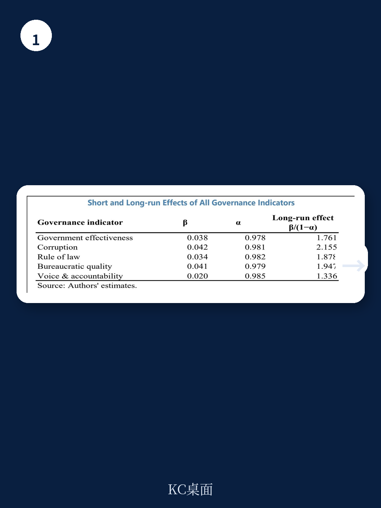
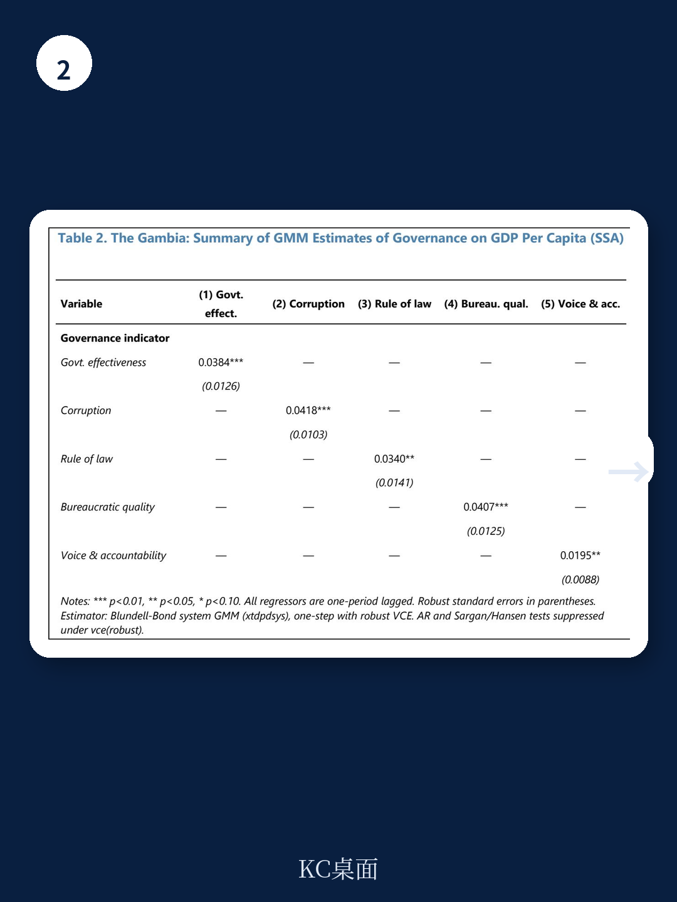

# IMF：货币市场与相关指标观察

2024年，冈比亚人均收入约为940美元，仍不足撒哈拉以南非洲地区平均水平的一半。这份由IMF工作人员完成的国别报告指出，该国过去三十年的宏观环境增长主要依靠劳动力和资本积累驱动，全要素生产率的贡献波动且时常为负。随着人口结构变化和资本积累空间收窄，冈比亚需要加速结构性改革以提升潜在增速。

报告基于1995至2024年的增长核算发现，人力资本积累是冈比亚实际GDP增长最稳定的来源。物理资本积累在2000年代后因公共研究增加而显著上升，但全要素生产率的表现并不理想——在多数年份中，TFP对增长的贡献为负值。这意味着，冈比亚的宏观环境扩张更多是“投入型”而非“效率型”，缺乏持续的生产率改善。

> **KC评论：** 增长核算的结论对许多低收入地区都有参照意义。如果TFP长期为负，说明资源并未流向效率更高的用途，制度、基础设施或市场摩擦可能在影响产出。报告中的资本弹性设定为0.3，折旧率5%，这些参数假设直接影响TFP估算结果，读者在横向比较时需留意。

## 1. 2017年政治转型后宏观指标出现分化

报告通过事件研究法对比了2013至2016年与2018至2024年两个阶段的宏观数据。结果显示，2017年政权更迭后，冈比亚的实际GDP增速、研究占GDP比重、贸易开放度等指标均有改善。但社会指标——如入学率和健康支出——并未出现同等幅度的提升。报告认为，政治转型带来的信心修复和宏观稳定是增长改善的主因，但人力资本等深层结构尚未被充分拉动。

## 2. 外资、侨汇与信贷对增长的作用机制不同

VAR模型的脉冲响应分析揭示了三种外部资金流入对冈比亚宏观环境增长的不同传导路径。侨汇对增长的正面影响最为直接，在冲击后两个季度内达到峰值，但效应在四至六个季度后消退，表明其主要通过消费平滑而非研究驱动。外商直接研究的增长效应则呈现滞后特征，约在四至八个季度后达到最大，与产能建设和技术扩散的节奏一致。信贷对私人部门的增长效应虽然正向，但幅度有限，反映出资金体系深度不足的制约。

## 3. 治理质量与人均收入存在稳健统计关联

报告利用撒哈拉以南非洲国家的面板数据，采用系统GMM方法估计了治理指标对人均GDP的影响。在控制了研究、通胀、贸易开放度、FDI和侨汇等变量后，政府效能、腐败控制、法治和监管质量四个指标均与人均收入水平呈现显著正相关。其中政府效能的系数最大，表明公共服务的执行质量可能是影响长期增长的关键制度变量。

## 4. 潜在增速测算指向结构性改革紧迫性

报告对冈比亚潜在产出的估算显示，未来十年劳动力和资本对增长的贡献将趋于下降。人口结构虽然年轻，但就业吸收能力有限；资本积累受制于储蓄率和研究效率。在此背景下，全要素生产率必须成为增长的新引擎。报告建议的改革方向涵盖农业生产力提升、营商环境改善、融资渠道拓展、人力资本研究和基础设施补短板，但未给出具体的时间表或优先序。

For informational purposes only. Portions may be generated,translated,summarized,or edited with AI assistance based on source materials and may contain omissions or errors. Please verify independently. This is not investment,legal,tax,accounting,or other professional advice.

