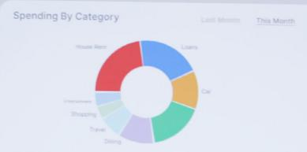

OECD Artificial Intelligence Papers

# Artificial intelligence and personal finance

No. 62

# Disclaimer

This work is issued under the responsibility of the Secretary-General of the OECD and does not necessarily reflect the official views of OECD Member countries.

This document, as well as any data and map included herein, are without prejudice to the status of or sovereignty over any territory, to the delimitation of international frontiers and boundaries and to the name of any territory, city or area.

Photo credits: © Getty Images/ AndreyPopov

© OECD 2026.

## Attribution 4.0 International (CC BY 4.0).

This work is made available under the Creative Commons Attribution 4.0 International licence. By using this work, you accept to be bound by the terms of this licence (https://creativecommons.org/licenses/by/4.0/).

Attribution – you must cite the work.

Translations – you must cite the original work, identify changes to the original and add the following text: In the event of any discrepancy between the original work and the translation, only the text of original work should be considered valid.

Adaptations – you must cite the original work and add the following text: This is an adaptation of an original work by the OECD. The opinions expressed and arguments employed in this adaptation should not be reported as representing the official views of the OECD or of its Member countries.

Third-party material – the licence does not apply to third-party material in the work. If using such material, you are responsible for obtaining permission from the third party and for any claims of infringement.

You must not use the OECD logo, visual identity or cover image without express permission or suggest the OECD endorses your use of the work.

Any dispute arising under this licence shall be settled by arbitration in accordance with the Permanent Court of Arbitration (PCA) Arbitration Rules 2012. The seat of arbitration shall be Paris (France). The number of arbitrators shall be one.

Consumers' increasing use of AI tools and AI-generated content for personal finance brings opportunities in terms of accessibility, personalisation and decision making, but it also increases risks related to bias, hallucinations, commercial influence, data privacy and exclusion, with uncertain benefits on individual long-term financial well-being.

This policy paper explores how AI tools are transforming the way consumers access and use financial information, education and advice in the management of their personal finances, and how AI tools can make financial education more personalised and accessible.

It provides financial literacy policymakers and stakeholders with an overview of current trends, highlighting key opportunities and emerging risks. Drawing on these trends and on the experiences of members of the OECD International Network on Financial Education (OECD/INFE), the paper presents financial literacy competencies that individuals should possess to benefit from these developments, both as consumers and learners, as well as policy considerations to guide the development of effective financial education responses.

This report has been developed by the Capital Markets and Financial Institutions Division of the OECD Directorate for Financial and Enterprise Affairs. It was prepared by Andrea Grifoni under the supervision of Chiara Monticone, Senior Policy Analyst, Miles Larbey, Head of the Financial Consumer Protection, Education and Inclusion Unit, and Serdar Çelik, Head of Division.

Delegates to the OECD International Network on Financial Education and to the OECD Working Party on Financial Consumer Protection, Education and Inclusion, as well as Iota Kaousar Nassr from the Division, Brigitte Acoca, Nils Adriansson and Nicholas McSpedden-Brown in the OECD Science, Technology and Innovation Directorate, and Stuart Elliot in the OECD Directorate for Education and Skills provided input.

# Executive summary

In 2025, over one third of individuals across OECD countries reported using AI tools. Increasingly, these tools are being used to support financial decision making and to learn about personal finance. Consumers turn to AI for assistance with choosing and understanding financial products, budgeting, credit management, investing, and retirement planning. They also rely on AI to access personalised financial education, sometimes asking questions they might not feel comfortable asking a human advisor.

While these developments hold significant potential to support consumers in managing their personal finances, the use of AI tools also introduces important risks. Some risks are inherent to the technology itself, including hallucinations, biases, potential commercial influence, and the blurring of boundaries between personalised financial advice and general information. Other risks arise from how consumers use AI tools, for example, relying on them to reduce cognitive effort, or acting on the advice received from AI tools without fully understanding the nature or limitations of the advice provided. These risks may lead to consumer harm, such as financial decisions that are inconsistent with individuals' needs and preferences, misuse of personal data, and new forms of digital exclusion.

AI is not a substitute for financial literacy. The use of AI tools by consumers calls for specific financial literacy competencies for their safe and informed use. Consumers need to know how to ask appropriate questions, how to critically assess personal data requests and the responses they receive. Low levels of financial, digital and AI literacy could further increase the potential for harm associated with the use of these technologies.

Although these are relatively recent developments, it is already possible to identify some key policy considerations for financial literacy policymakers and stakeholders:

\- Additional evidence is needed to understand how consumers use AI in the management of their personal finances and the implications on consumer outcomes, both positive and negative. The OECD/INFE International Survey of Adult Financial Literacy, Inclusion & Well-Being 2026 (OECD, 2026[1]) will contribute to fill this gap, as it includes questions to measure digital financial literacy as well as the use of AI for financial advice.

\- It is important to continue promoting financial literacy to empower consumers in using AI tools for personal financial management in safe and informed ways, alongside financial consumer protection measures. Possessing adequate financial literacy remains essential for individuals to retain autonomy and agency when using AI to inform financial decision making. Consumers should be able to critically assess the information they receive and decide whether to act upon it.

\- Policymakers and stakeholders should inform consumers about the opportunities and risks of using AI as a source of financial information, education and advice in their financial education initiatives. In doing so, they can build on the financial literacy competencies suggested in this paper.

\- Policymakers and stakeholders can harness AI to create effective, engaging and personalised financial information and education to support consumers in their personal financial decision making. In doing so, they should consider the importance of robust human oversight, anchoring AI tools' responses in vetted content ("grounding"), and governance models to foster the accuracy, quality and pedagogical soundness of AI-generated content.

\- Consumers with low levels of financial literacy, digital and AI literacy or limited access to AI may benefit from specific support, as well as those without access to the digital infrastructure for the use of AI. This would minimise the risks of new forms of exclusion.

## Table of contents

Foreword 3
Executive summary 4
Introduction 7
1 The use of AI to support personal financial decision making 10
1.1. Current trends in the use of AI by consumers to manage their personal finances 10
1.2. Opportunities and risks for consumers in using AI to manage personal finances 11
2 The use of AI to design and deliver financial education 20
2.1. Opportunities 20
2.2. Risks 23
3 Financial literacy competencies for the use of AI in personal finance 26
3.1. Financial literacy competencies for a safe and informed use of AI in the context of personal finance 26
4 Policy considerations 28
References 30
Annex A. The OECD AI Principles 37
Annex B. Glossary 39
Notes 41
TABLES
Table 1. Financial literacy competencies for a safe and informed use of AI in the context of personal finance 27
BOXES
Box 1. Evidence on the use of AI tools in personal finance in selected jurisdictions 11
Box 2. The use of robo-advice and financial literacy 15
Box 3. Trust in AI tools 17
Box 4. Selected examples of information campaigns about the use of AI 19
Box 5. The use of AI to support financial literacy in the classroom 22
Box 6. IOSCO TechSprint “Investor Education in the Age of Artificial Intelligence” 24
Box 7. Ensuring continued visibility of financial education content developed by public authorities 25

## Introduction

The growing availability and potential of AI tools can transform how consumers access, interpret, and act upon complex financial information, and enable more personalised and adaptive financial education that can better meet individual needs.

AI is increasingly used both in finance and education, among other domains, particularly since it became widely available to the public in late 2022 $^{1}$ following the release of consumer-accessible generative AI tools such as ChatGPT (Lorenz, Perset and Berryhill, 2023 $^{[2]}$ ). In 2025, over one-third of individuals across OECD countries used AI tools (OECD, 2026 $^{[3]}$ ).

In the financial sector, AI is used both on the supply and demand side. On the supply side, AI is embedded across a wide range of products and services, from back-office operations to customer-facing applications (OECD, 2024[4]; New Zealand Financial Market Authority, 2024[5]; OSFI-FCAC, 2024[6]). Notable examples include fraud detection, customer service and client onboarding in banking, credit underwriting, insurance underwriting and claims processing, algorithmic trading, and alternative data-based credit scoring (OECD, 2023[7]; 2024[4]; 2021[8]; Financial Stability Board, 2024[9]; European Banking Authority, 2025[10]). AI is also used by financial service providers through the use of alternative data to assess creditworthiness among individuals with limited financial histories and other underserved groups (OECD, 2021[8]; 2025[11]; CAF, 2025[12]). Other uses include the onboarding of new clients and automated support.

On the demand side, consumers increasingly use AI for financial information and advice, and AI tools have the potential to support financial decision making in areas such as budgeting, credit management and investing (OECD, 2024[4]; Empower, 2025[13]; J.D. Power, 2025[14]; TD Bank, 2025[15]; FINRA, 2024[16]; Lloyds Banking Group, 2025[17]; Jia, Eling and Wang, 2025[18]; IPSOS, 2024[19]). AI tools can also provide easier access to personalised financial education. They can extend the reach and accessibility of financial education, make it more personal, notably as a result of adaptive learning and tutoring, thereby directly supporting financial decision making (OECD, 2021[20]; Varsik and Vosberg, 2024[21]; OECD, 2026[22]). It can also offer new tools to financial literacy policymakers and stakeholders to effectively design and deliver financial education.

Together, these developments present significant opportunities to support individual financial decision making but also bring new risks for consumers (Global Financial Innovation Network, 2025[23]). As in other domains, the use of AI raises important questions about the quality of outputs, privacy, data protection, digital security, as well as equity and inclusion (Varsik and Vosberg, 2024[21]). The possible emergence of consumer detriment calls for a policy response ensuring that the use AI contributes to increasing financial well-being and does not exacerbate inequalities.

In the analysis of these phenomena and their effects on consumers and learners, it is important to note that this field is developing rapidly and that opportunities and risks will evolve, as a result of developments in AI tools and changes in the regulation and supervision of the use of AI.

In addition, it is important to recognise that many sources of evidence describing the use of AI by financial consumers are currently produced by or on behalf of financial institutions offering AI services to their customers, and that evidence on the effects of AI on consumers' financial literacy and well-being is still scarce.

## Scope

This paper explores recent developments, presents evidence and highlights the opportunities and risks related to the use of AI in personal finance. In particular:

\- Section 1 focuses on the use of AI by consumers in personal financial decision making, including through AI tools and AI-generated financial information, education and advice.

\- Section 2 focuses on financial education and on the opportunities and risks offered by AI tools in designing and delivering it.

\- Section 3 focuses on financial literacy competencies for the use of AI in personal finance, looking both at competencies for personal financial decision making with the support of AI tools and at competencies for accessing and using AI-generated financial information, education and advice.

## The paper does not address:

\- The use of AI by financial services providers in designing, marketing and selling financial products and services.

\- The provision of “regulated” personal financial advice. Most jurisdictions have regulations in place relating to the provision of personal financial advice, i.e. advice that contains specific recommendations based on an assessment of a consumer’s profile, financial needs and objectives. This paper does not discuss the extent to which regulated financial advice is affected by AI, or any policy and regulatory responses.

• The use of AI by financial fraudsters and scammers (IOSCO, 2024[24]; OECD, 2026[25]).

## Relevant OECD work

The OECD Council adopted the Recommendation on Artificial Intelligence at its Ministerial meeting in May 2019 and updated it in 2024 (OECD, 2024[26]). This Recommendation includes the OECD AI Principles (see Annex A), which are the first intergovernmental standard on AI. They promote innovative, trustworthy AI that respects human rights and democratic values. They are composed of five values-based principles and five recommendations that provide practical and flexible guidance for policymakers and AI actors.

In addition to these Principles, the following OECD standards relating to consumer finance include provisions that are relevant to the use of AI by financial consumers:

\- The G20/OECD High-Level Principles on Financial Consumer Protection (OECD, 2022[27]) (the FCP Principles), which set out the essential elements of a comprehensive and effective financial consumer protection framework, include a cross-cutting theme on digitalisation. This theme highlights the importance of addressing consumer risks stemming from the use of AI in financial markets.

\- The OECD Recommendation on Financial Literacy (OECD, 2020[28]), which presents a single, comprehensive, instrument on financial literacy, does not address AI explicitly but invites Adherents to develop appropriate tools to support learning (including digital tools) and prepare consumers to deal with the financial advice industry, including via robo-advice.

Besides these international standards, work on AI that is relevant from a consumer finance perspective is being undertaken by the following OECD bodies:

\- The OECD Committee on Financial Markets $^{2}$ has focused on supervisory approaches to AI in finance (OECD, 2026 $^{[29]}$ ) as well as on the interplay between AI and Open Finance (OECD, 2026 forthcoming $^{[30]}$ ), including the implications and avenues for the use of agentic AI in financial services.

\- The OECD Working Party on Financial Consumer Protection, Education and Inclusion $^{3}$ includes the impact, opportunities and risks of digitalisation among its strategic priorities and has held regular roundtable discussions on the use of AI in consumer financial products and services. Among other things, the Working Party will take forward work on the application of the FCP Principles to digital assets and digital financial services, including those powered by AI.

\- The OECD International Network on Financial Education (OECD/INFE) $^{4}$ is addressing AI related issues through its work on digital financial literacy, core competencies and financial literacy measurement. The OECD/INFE organised a roundtable on AI and financial education during its Technical Committee meeting in October 2025, which informed the development of this paper. The OECD/INFE also developed the Digital financial literacy core competency framework for adults in ASEAN (OECD, 2026[31]), which contains competencies related to AI in financial decision making.

\- The OECD Committee on Consumer Policy $^{5}$ developed an issues note on the consumer benefits and risks of businesses' integration of AI in consumer transactions and products. It also conducted a mapping of use of AI tools for consumer and product safety policy and enforcement activities. These include AI tools used by consumer authorities to engage with/and educate consumers, as well as AI tools consumers can use, for example for detecting fraudulent websites and unsafe products.

OECD research, analysis, tools and data on AI, across all policy domains, is released via the OECD.AI Policy Observatory. $^{6}$

# 1 The use of AI to support personal financial decision making

This section focuses on the role of AI in supporting personal financial decision making. It starts by providing evidence on the increasing use of AI by consumers for seeking personal financial information, education and advice to manage their personal finances. It then discusses opportunities and risks for consumers.

## 1.1. Current trends in the use of AI by consumers to manage their personal finances

Currently, the following AI tools are available to consumers as a source of financial information and advice and to manage their personal finances:

\- Conversational guidance, i.e. seeking answers and advice from consumer-accessible generative AI tools available online, also known as AI chatbots (such as ChatGPT, Claude, Gemini or CoPilot) or from those offered by financial services providers.

\- AI-powered personal finance apps with direct access to consumers' financial accounts and records through Application Programming Interfaces (as is typically the case in Open Finance), which can for example help consumers categorise expenses, offer budgeting tips based on actual spending patterns and predictive analytics, and suggest credit repayment and investments strategies.

Available evidence on the use of AI by financial consumers, currently limited to a few, mostly high-income, jurisdictions and mostly collected by or on behalf of financial institutions, shows that an increasing number of consumers are using or considering using AI to manage their personal finances or to get financial information and advice (see Box 1). Evidence also indicates that many consumers trust AI when it comes to the provision of financial information (see Box 3) and that some report an improvement in their financial situation due to the use of AI. Importantly, many consumers who are not currently using AI for personal financial management report they would be open to using it in the future (IPSOS, 2024[19]; J.D. Power, 2025[14]; Thinks, 2025[32]).

Looking ahead, the interplay of Open Finance and AI could create increased possibilities for the use of AI by financial consumers through the deployment of agentic AI. Contrary to what happens today with AI integrated within personal finance applications with access to data in “read only” mode (OECD, 2023[33]), agentic AI could initiate actions and autonomously execute financial decisions on a consumer’s behalf, including – depending on configuration and authorisation design – with limited or insufficiently informed consent. $^{7}$

## Box 1. Evidence on the use of AI tools in personal finance in selected jurisdictions

Evidence on the use of AI tools in personal financial management is currently limited to a few, mostly high-income, jurisdictions and is mostly collected by or on behalf of financial institutions. The 2026 OECD/INFE International Survey of Adult Financial Literacy, Inclusion & Well-Being will provide further evidence. Available evidence is presented below.

Canada: Evidence collected in 2024 $^{8}$ indicated that one third of Canadians (33%) were using AI to manage their finances, including over half (55%) of Generation Z people (those born between 1996 and 2002) (IPSOS, 2024 $^{[19]}$ ).

France: The annual Savings and Investment Barometer undertaken by the French Financial Markets Authority (Autorité des Marchés Financiers, AMF) collected in 2025 for the first time information about the use of AI by French consumers (Autorité des Marchés Financiers, 2025[34]). The results indicate that in a context in which consumers increasingly manage their savings and investment independently (i.e. not through advisors), $11\%$ of French adults turned to AI for financial advice.

Korea: evidence collected through an online panel in 2025, $^{9}$ shows that nearly 68% of Korean adults aged 25–59 used publicly available AI tools across ten personal finance domains, ranging from budgeting and savings to insurance and fraud detection (Pak, 2026 $^{[35]}$ ). Some 68% of respondents had used AI for at least one financial task, and close to 59% had done so across two or more domains. The most popular uses were stock investment advice (50%), savings planning (48%), budget management (48%), and tax filing and planning (47%).

United Kingdom: In 2025, evidence collected through an online panel showed that more than half of adults $^{10}$ (56%) reported having AI in the previous 12 months to help manage their money (Lloyds Banking Group, 2025 $^{[17]}$ ). The AI tools used were primarily ChatGPT (60%) followed by the AI tools provided by consumers' financial services providers (32%), Gemini (18%), and dedicated AI-powered personal finance apps (9%). Half of adults using AI to help manage their personal finances expected its use to increase in the following 12 months.

United States: Evidence collected in 2026 by the TIAA Institute and the Global Financial Literacy Excellence Center shows that 19% of consumers in the United States have used an AI tool to get information about a personal finance topic (Yakoboski et al., 2026[36]). Other sources, commissioned by the private sector, indicate higher percentages. One study shows that in $2025^{11}$ nearly half of US citizens (47%) felt more comfortable using artificial intelligence in their financial lives compared to the previous year (Empower, 2025[13]). Another source of evidence $^{12}$ showed that half of consumers (51%) reported using AI to obtain financial information or advice (J.D. Power, 2025[14]). With regards to the frequency of use, 20% of consumers reported having used it on several occasions in the previous three months, and 31% once or twice (J.D. Power, 2025[14]). Around one quarter (27%) replied that they would consider using it, and 20% that they were not interested in the use of AI for financial information or advice. About the type of AI, most respondents reported using publicly-available AI tools (mostly ChatGPT, Gemini, CoPilot, and MetaAI).

## 1.2. Opportunities and risks for consumers in using AI to manage personal finances

The use of AI by financial consumers to manage their personal finances offers a number of opportunities, such as supporting consumers in accessing and using financial products and services, offering access to financial information and advice, and giving access to personalised financial education. On the other hand, technological risks, the presence of bias, over-reliance on AI, and misunderstanding of the nature of AI-powered financial advice can lead to potential consumer harms, particularly for consumers with low financial, digital, and AI literacy.

## 1.2.1. Opportunities

## Supporting consumers in accessing and using financial products and services

The use of AI has the potential to help overcome some of the barriers that prevent consumers from accessing and using digital financial products and services in the formal, regulated financial system. As set out in the G20/OECD High-level Principles on Financial Consumer Protection (OECD, 2022[27]), digitalisation can be leveraged to advance financial inclusion, while being mindful of the risk of financial exclusion (see Principle 3 on Access and Inclusion, and the subsection on risks below).

Consumers with low levels of digital literacy or experiencing language barriers can use AI to help them digest and understand complex financial documents by summarising and simplifying their content or translating them (UK Financial Conduct Authority, 2025[37]; Guo et al., 2024[38]).

AI can also support access to retail financial services through conversational guidance using voice modality, as a result of the use of spoken language. For example, in India, conversational payments were launched in September 2023 in the Unified Payments Interface (UPI), enabling users to engage in a conversation with an AI-powered system to initiate and complete transactions in a safe and secure environment. Moreover, the National Payments Corporation partnered with a government-developed AI-powered language translation app $^{13}$ to enable voice-based payments. The use of the language translation app by financial consumers is also encouraged in India’s National Strategy for Financial Inclusion (Reserve Bank of India, 2025 $^{[39]}$ ).

More broadly, AI-enabled conversational guidance and voice modalities can be particularly beneficial for consumers who face difficulties navigating complex digital interfaces, including older adults. Evidence from an experimental study conducted among seniors in Korea indicates that a mobile banking application incorporating a conversational AI agent improved users' experience and uptake of mobile banking services, notably through the use of voice interaction and simulated lip movement to support comprehension (Kim and Song, 2024[40]).

## Providing access to financial information and advice to support financial planning and decision making

The use of AI can empower consumers to make more informed decisions in the management of their personal finances in an increasingly complex retail financial marketplace. AI can provide consumers with accessible and personalised financial information and advice (OECD, 2026[25]; Dutch Authority for the Financial Markets, 2025[41]).

A growing number of studies, many of which conducted or commissioned by the private sector, have explored the use of AI to support individual financial decision making and the outcomes of AI use on consumers and their financial decisions. In interpreting these results it is important to bear in mind that the outcomes of using AI for personal finance may depend not only on the particular tools used but also on consumer characteristics, including their financial literacy. Overall, the use of AI can support individual financial decision making in the following areas:

\- Saving and investing: AI tools can suggest saving and investment strategies based on publicly available information, as well as users' inputs, including income levels and financial objectives (European Securities and Markets Authority, 2025[42]; Choukhmane et al., 2026[43]; Foltyn and Olsson, 2026[44]) (see also Box 4). For example, in Canada, in 2024, a survey showed that $42\%$ of consumers used AI tools to identify new investment strategies and $40\%$ used it to build savings and create and/or update financial plans (IPSOS, 2024[19]). In Korea, common uses of AI in this domain included asking how to get started with investing (29%) and seeking explanations of earnings reports and economic news (26%) (Pak, 2026[35]). In the United Kingdom, a 2025 survey showed that 53% of consumers used AI tools for savings goal planning (Lloyds Banking Group, 2025[17]). Similarly, according to a 2025 survey in the United States, 45% of consumers sought input from AI on saving strategies, and 36% on investing or stock market advice (J.D. Power, 2025[14]). Research suggests there may be potential benefits for consumers in using AI for decisions related to savings and investments. Academic research shows that following the advice received from AI tools could move consumers closer to the prescriptions of economic theory, such as participation in diversified equity funds, a declining equity share over the lifespan, and sizeable saving buffers (Choukhmane et al., 2026[43]). Other research indicates that retail investors can use AI tools to improve investment decisions (Schneider and Yilmaz, 2025[45]), and receive advice that takes into account important investor characteristics when determining market and risk exposures (Fieberg et al., 2025[46]) and which is better than that received by robo-advisors (Oehler and Horn, 2024[47]). According to a study in the United Kingdom, consumers who regularly used AI to help them manage their personal finances reported self-assessed better investment results, improved credit scores, and greater retirement savings than those who did not use AI (Lloyds Banking Group, 2025[17]). These developments bring the promise of facilitating access to financial advice for those who cannot afford it and offer the opportunity to access guidance to develop wealth-building strategies (World Economic Forum, 2025[48]). However, it is important for consumers to recognise that such AI-generated recommendations entail a number of risks and do not constitute regulated, professional financial advice (see next section on Risks).

\- Budgeting and money management: AI tools integrated in online banking or personal finance apps can automatically sort transactions, identify expenditure patterns and make recommendations based on spending behaviours, such as how to reduce current expenses, or forecast what expenses to expect based on analysed patterns (Ben-David, Mintz and Sade, 2025[49]). Consumers can also seek help in drafting a budget from conversational guidance on tools such as ChatGPT (CFFE, 2024[50]). For example, in Canada, in 2024, $43\%$ of adults reported using AI to create and/or update a household budget (IPSOS, 2024[19]); in the United Kingdom, in 2025, half of adults $(52\%)$ reported using AI tools for budgeting advice and planning (Lloyds Banking Group, 2025[17]); in the United States, in 2025, $60\%$ of adults reported using AI tools to seek input on budgeting (J.D. Power, 2025[14]) and $60\%$ reported being comfortable using AI tools for budgeting (TD Bank, 2025[15]).

\- Credit monitoring and debt management: AI tools can help consumers with debt repayment strategies (UK Financial Conduct Authority, 2022[51]) as well as suggest ways to improve their credit score, where applicable (see also Box 2). For example, in the United States, in 2025, $40\%$ of consumers sought input from AI tools on credit score or credit cards (J.D. Power, 2025[14]).

\- Retirement planning and insurance: AI tools can support consumers in planning for retirement, selecting retirement products, and purchasing insurance. For example, a cross-country study undertaken in the People's Republic of China (hereafter "China"), France, Germany, Japan, the United Kingdom and the United States shows that 68% of customers reported having used AI tools when buying insurance products, before engaging with insurance providers, in order to be more prepared and informed and make more conscious decisions (Jia, Eling and Wang, 2025[18]). Another study undertaken in the United Kingdom shows that 45% of consumers used AI tools for insurance comparison and advice (Lloyds Banking Group, 2025[17]) and that 10% of adults had used AI to calculate the tax owed when withdrawing a lump sum from a pension (Thinks, 2025[32]).

\- Tax planning: consumers can use AI tools to seek advice on tax filing and related terminology as well as on available deductions or welfare support (United States Taxpayer Advocate Service, 2024[52]; Thinks, 2025[32]). For example, in Korea, $28\%$ requested explanations of tax-related terminology, and $22\%$ sought information on how to report tax and the documents required.

\- Complementing personal financial advice received from financial advisers, providing additional information that can potentially help consumers better understand the advice received. For example, in the United States, 61% of adults in 2025 reported they would use AI alongside human financial advisors to achieve better results (Empower, 2025[13]).

Notwithstanding these possible benefits for financial consumers, more evidence is needed on whether the use of AI also translates into higher financial literacy levels, better financial decisions and ultimately better outcomes for consumers (see Box 2).

## Reducing information asymmetries and supporting product choice

AI tools can help consumers gather information and compare options, which can ultimately lead to reducing some of the information asymmetries that put them at a disadvantage with respect to financial services providers (The Economist, 2025[53]; OECD, 2023[33]). The use of AI as a source of information and comparison can also help consumers address common behavioural biases such as status-quo bias, whereby consumers tend to stick to the products they already hold, or choice overload, whereby consumers find that the options available to them are overwhelming and the products difficult to understand (Ahmed et al., 2025[54]).

For example, in France, 11% of consumers used AI to seek information before making an investment: most of them (95%) used AI as a complementary source of information. Around half of those who used AI tools did so to better understand an investment or to learn about a product's characteristics (52% and 51% respectively), and 37% used it to independently find an investment product which could suit their needs (Autorité des Marchés Financiers, 2025[34]). In China, France, Germany, Japan, the United Kingdom and the United States almost half of consumers looking to buy insurance products (46%) asked AI to compare different options (Jia, Eling and Wang, 2025[18]).

In addition, AI tools can also potentially help consumers exercise their rights and seek redress, by assessing whether they have valid grounds for a complaint, drafting claims, and navigating dispute processes (UK Financial Services Ombudsman, 2026[55]).

## Giving access to personalised financial education

In addition to providing access to financial information and advice and making it more digestible (Global Financial Innovation Network, 2025[23]), AI tools can provide consumers with access to personalised financial education. Consumers may be able to access such personalised financial education at teachable moments, when they are making financial decisions (OECD, 2019[56]). In addition, considering that money matters and financial problems may be sensitive or stressful for many consumers, AI tools may offer consumers the possibility to seek information and ask questions in a confidential and anonymous way. Research has shown that consumers may be more willing to disclose information that incurs the risk of negative social judgment to an AI agent than a human agent (Kim et al., 2022[57]).

For example, in Korea, 24% of consumers reported using AI tools as an on-demand tutor on financial terms and concepts (Pak, 2026[35]) and, in the United States, 19% of consumers used an AI tool to get information about a personal finance topic (Yakoboski et al., 2026[36]). In Canada and the United Kingdom, 45% and 52% of adults respectively used AI tools to learn about personal finances (IPSOS, 2024[19]; Lloyds Banking Group, 2025[17]).

The use of AI in the design and delivery of financial education is elaborated further in Section 2.

## Box 2. The use of robo-advice and financial literacy

The use of AI tools by financial consumers is fairly recent and rigorous evaluations of their use to support financial decision making or to access financial education have not yet been undertaken. There are however studies on the use of robo-advice tools. These can be considered as earlier forms of AI which rely on automation and algorithms (OECD, 2017[58]), which are not powered by generative AI and do not include conversational elements.

A randomised controlled trial conducted in the United Kingdom in 2022 examined the effectiveness of robo-advice in supporting consumers with decisions on repaying multiple loans (UK Financial Conduct Authority, 2022[51]). In the study, participants faced multiple real-style loan allocation problems and were randomly assigned into a control group or to one of various robo-advice treatments (free or paid, with or without additional educational explanations). The results show that while the use of robo-advice leads to better financial choices, there is little evidence of learning among users.

In particular:

• Free robo-advice leads to large improvements in repayment choices for those who use it.

\- After the exposure to robo-advice (with or without educational tips), participants do not significantly improve their skills in post-intervention tasks unless the advice is continuously provided.

\- The average willingness to pay for robo-advice exceeds the direct financial gains it provides (such as savings on interest and fees), which might indicate that consumers either underestimate their own ability to manage loan repayment without support, or that they place value on non-financial advantages of the tool such as reducing the cognitive effort and psychological stress associated with making financially significant decisions.

## 1.2.2. Risks

Alongside the many opportunities, the use of AI brings new risks of potential consumer harm, due to several factors linked to the technology behind AI itself, the characteristics of certain consumers, and to the potential misunderstanding of the nature of the results provided by AI.

Some of the risks are related to how AI works:

\- Technological risks, including complexity: AI models underpinning the functioning of AI tools available to consumers are extremely complex; the lack of explainability of AI outputs in advanced models can prevent consumers from understanding how these have been produced (Pérez-Cruz et al., 2025[59]).

\- Hallucinations: AI can “hallucinate”, i.e. produce responses which appear plausible but are in fact false, misleading, or unsupported by the data the AI was trained on or the sources it accessed (Which?, 2025[60]). This can negatively impact financial consumers who act on this false information (OECD, 2023[7]).

\- Presence of bias: AI-generated advice can exhibit different forms of bias and reinforce some of consumers' own biases. For example, in the context of investment advice, AI may display home bias (Fieberg et al., 2025[46]) or amplify the biases of the consumer seeking advice, thereby increasing portfolio risk (Winder, Hildebrand and Hartmann, 2025[61]). In addition, AI might suffer from gender bias: it might perpetuate certain gender stereotypes, for example, by recommending to men but not to women to draft a will (Center for Financial Inclusion, 2023[62]), and might advise women to allocate lower percentages of their investments than men to equity funds (Foltyn and

Olsson, 2026[44]; Choukhmane et al., 2026[43]). AI can also provide advice that contradicts consumers' wishes or ethics, and might not be culturally neutral (Atari et al., 2023[63]).

\- Blurring boundaries between personalised financial advice and general education: the conversational nature and increasing personalisation of AI tools may blur the boundaries between personalised financial advice and education, heightening consumers' susceptibility to behavioural and/or commercial influence.

\- Possible commercial influence: publicly available AI tools can introduce advertising in ways may not be fully visible or understood by consumers, and AI tools offered by financial services providers might include commercial bias and offer advice that is not necessarily in the best interest of their clients. As companies embed advertising and product recommendations into generative AI chatbots, consumers risk receiving biased financial information and advice. Consumers might interact with AI tools with an expectation of neutrality, while the legal reality might be closer to an unregulated commercial intermediary. Beyond advertising, the use of AI can facilitate embedding commercial influence through digital choice environments that can steer consumers toward financial products without their awareness. These environments may prioritise provider profitability over consumer financial well-being.

## Other risks are related to how some consumers may use AI:

\- Cognitive off-loading and over-reliance on AI: consumers might use AI tools to reduce cognitive efforts in financial decisions, might excessively trust information and advice received from AI (see Box 3) even when this goes against available evidence, or they may not verify the information provided (OECD, 2023[7]; Klingbeil, Grützner and Schreck, 2024[64]). Over-reliance on AI may also be related to the complexity and lack of explainability of AI.

\- Misunderstanding the nature of the kind of financial advice received by AI, particularly by consumers who would benefit from receiving personal financial advice from a professional and regulated financial adviser, with its attendant suitability and best interest duty requirements. Currently, responses offered by AI build on the information provided by consumers and may therefore fail to capture the full breadth of an individual's financial situation. By contrast, a trained human advisor is equipped to ask targeted and context-specific questions (such as those relating to household composition or changing personal circumstances) to develop a comprehensive understanding of relevant factors, including those that may lead to increased financial vulnerability. Despite many AI tools providing disclaimers that the information or advice provided does not constitute regulated personal financial advice, consumers may not be aware or not pay sufficient attention to such warnings. If consumers believe that the AI-generated advice they receive is equivalent to regulated professional financial advice, they may act upon it without any critical assessment nor consider alternatives.

## Box 3. Trust in AI tools

The increasing use of AI tools by financial consumers raises the issue of how much trust they place in them. Evidence from selected jurisdictions, collected by or on behalf of the private sector, shows that a significant percentage of consumers trust AI tools with regards to financial information.

Evidence from Canada shows that while 68% of consumers believed AI could not understand how emotions influence financial planning, a majority thought that AI could support informed financial decision making (52%) and/or could make financial planning more accessible to all (51%) (IPSOS, 2024[19]).

In the United Kingdom, trust in AI is one of the main drivers of increasing adoption by financial consumers. Some 78% of consumers who trusted AI reported using it to support financial decision making more than they did the previous year, and 70% of those who trusted AI more than traditional sources, such as banks, used it daily or weekly. Consumers who reported having enough knowledge to make informed decisions about their finances also reported using AI daily or weekly to manage their finances (Lloyds Banking Group, 2025[17]).

In the United States, a study shows that, while on average consumers placed greater trust in financial professionals than in AI for financial information, a significant share trusted AI (FINRA, 2024[16]). Specifically, $57\%$ of consumers reported trusting AI for information on home ownership, $34\%$ trusted AI for stock and bond performance (similar to the $33\%$ who trusted financial professionals), $30\%$ trusted AI for portfolio allocation advice, and $49\%$ of young adults trusted AI for guidance on saving versus debt repayment strategies. Another study indicates that half of consumers reported that AI can help them make better financial decisions $(51\%)$ or that AI will give them financial advice that is fair and unbiased $(50\%)$ , and $43\%$ are confident in the accuracy of the advice or outputs that AI gives them to help them manage their finances (TD Bank, 2025[15]).

The impact of these risks can be compounded by certain consumer characteristics that may limit their ability to adequately use and benefit from AI applications, making them more likely to experience vulnerability (OECD, 2025[65]; OECD, 2026[25]). $^{14}$ In particular, the following characteristics (see Glossary) may influence consumers' ability to benefit from the use of AI:

\- Financial literacy: more financially literate consumers can be expected to be more able to ask pertinent questions to AI tools, to reflect on the results generated and have a critical approach to their use, compared to lower financial literacy consumers. Evidence points to variations in the quality of financial advice generated by AI tools based on consumers' financial literacy (Choukhmane et al., 2026[43]).

\- Digital and AI literacy: consumers with limited digital and AI literacy might not be aware of the risks and limitations of AI-generated information (e.g. hallucinations and biases), and they may not be aware of the use of the personal data they may share with AI tools. In particular, they might not understand that AI tools can use personal data beyond the objective for which it has been shared, to train the model, or to help other users.

These risks can contribute to different forms of potential consumer harm, which include but are not limited to (ESMA, 2024[66]):

\- Financial decisions that are not consistent with individual needs, risk profile and preferences stemming from consumers acting on biased AI-generated advice, whether originating from investment, social or cultural bias.

\- Privacy harms linked to possible mishandling of personal data and of sensitive financial information, especially when consumers allow AI tools to extract personal information from financial accounts, bank statements, contracts, or tax forms. Some consumers seem to understand the risks involved: for example, in the United States, 63% of consumers do not believe that the personal financial data that is used by AI tools is safe and secure (TD Bank, 2025[15]). At the same time, research indicates that consumers are more willing to disclose information that incurs the risk of negative social judgment to an AI tool than a human agent (Kim et al., 2022[57]), increasing the risk of over-sharing.

\- New forms of digital financial exclusion: while AI may support financial inclusion (for instance through voice services, as highlighted above), it may also accelerate the shift to fully digital financial services and may deepen digital financial exclusion (OECD, 2026[25]). This risk may emerge particularly for certain groups of the population, such as those unfamiliar with AI, those with low levels of digital literacy and limited access to digital resources, and potentially those with low confidence in their financial literacy (see Box 2). The possible emergence of digital exclusion can also be a consequence of the digital divide and can affect particularly those without access to mobile banking services.

\- Increased exposure to financial scams and frauds: using AI tools normalises automated interactions and might encourage consumers to share personal data, increasing the risk of falling victim of AI-generated scams and frauds (OECD, 2026[25]).

## Box 4. Selected examples of information campaigns about the use of AI

The use of AI by financial consumers has prompted various international bodies and public authorities to implement dedicated information campaigns to inform the public about the associated risks and suggest ways to protect their money and personal data.

The European Securities and Markets Authority (ESMA) issued a warning in 2025 on the use of AI for investing. The warning acknowledges that the use of AI by retail investors is becoming more and more popular and that while AI tools can provide valuable support, they bring risks and can generate advice that is inaccurate or misleading. The warning invites retail investors to:

\- Seek multiple perspectives, not to rely solely on publicly available AI tools for investment decisions, and consider them as one of many sources of information.

\- Be aware that publicly available AI tools do not offer regulated financial advice and as such do not hold obligations to act in the consumer's best interest, and do not give access to a financial ombudsman or dispute resolution mechanisms.

\- Understand the limitations and potential inaccuracies of the advice generated by AI.

\- Protect their privacy and not to share their personal data (name, gender, contact details or personal financial information).

\- Remember that AI tools cannot accurately predict financial markets.

The International Organization of Securities Commissions (IOSCO) chose AI as one of the themes of the World Investor Week 2025. The message stressed in particular that smart investors:

\- Understand that AI can enhance financial services but also come with associated risks, including model bias, data misuse, and manipulation.

\- Know that AI-powered tools are only as reliable as the data and assumptions behind them, and that they are not a substitute for individual careful research and understanding of one's own financial situation, risk appetite and objectives.

\- Keep abreast of developments in AI in the field of investments and how it can affect recommendations or decisions.

\- Avoid falling into the trap of convenience through automation and take a balanced approach to investing that combines technology, critical assessment and core investment principles.

The Investor and Financial Education Council in Hong Kong (China), raises public awareness on the risks linked to the use of AI by fraudsters and scammers via periodic joint press briefings with the local police, as well as through frequent social media stories to warn the public on latest scam tactics. These issues are also addressed through the IFEC FinEd Hub, a physical space which offers innovative digital experiential learning activities for different audiences, from school children to seniors.

Sources: European Securities and Markets Authority (2025[42]) Using Artificial Intelligence for Investing: What you should consider, https://www.esma.europa.eu/sites/default/files/2025-03/ESMA\_Warning\_on\_the\_use\_of\_AI\_-EN.pdf; IOSCO (2025[67]), World Investor Week - Themes 2025, https://www.worldinvestorweek.org/?p=themes-2025

# 2 The use of AI to design and deliver financial education

This section analyses the opportunities and risks arising from the use of AI in financial education, with a particular focus on its potential to support consumers in making informed financial decisions.

As set out in the OECD/INFE Guidance on Digital Delivery of Financial Education, the use of digital tools can serve multiple complementary objectives, notably improving access to information, education and advice and contributing to the development of skills and confidence, but their use should be mindful of consumers' preferences and characteristics, and not exacerbate risks of digital exclusion, to ensure that digital financial education tools ultimately contribute to greater individual financial well-being (OECD, 2022[68]).

## 2.1. Opportunities

In the broad field of education, AI tools can be used to enhance learning, due to their potential for adaptivity, content enrichment, and the possibility to engage students/learners in a dialogue (Varsik and Vosberg, 2024[21]; Wu, Dang and Li, 2025[69]; OECD, 2022[68]; 2026[22]).

Similarly, the integration of AI into financial education has the potential to extend the reach and accessibility of financial education and enhance the quality of learning through personalisation, adaptive learning and tutoring, thereby directly supporting financial decision making. It also has the potential to offer valuable support to teaching (OECD-Education International, 2023[70]; OECD, 2026[22]). AI can be harnessed by financial literacy policymakers and stakeholders to design financial education content, from the brainstorming phase to the production of pedagogical materials, such as games or presentations for audiences ranging from students in the classroom (see Box 5) to existing and potential investors (see Box 6).

The opportunities presented by the use of AI in the design and delivery of financial education include:

\- Extending the reach of financial education: AI can facilitate the transformation of existing text-based information or pedagogical resources into user-friendly audio or video content. For example, in Italy, the financial market authority (Commissione Nazionale per le Società e la Borsa, CONSOB) used AI to support the development of a book game for children, adapt scripts and micro-videos and prepare trainer support material. In Indonesia, the central bank plans to enhance the LISA chatbot (Layanan Informasi Bank Indonesia, Bank Indonesia Information Service) which currently operates using a rule-based system with responses generated based on predefined keywords and decision trees, with natural-language capabilities. The LISA chatbot is available through WhatsApp (via a dedicated official number), LINE Messenger and Facebook Messenger. In Lithuania, the Centre for Financial Literacy and the Centre for Digital Excellence at the central bank experimented with the creation of a podcast generated by AI, using content from their public website. The use of AI helped to make the information more understandable and to easily turn text into an audio format. In Morocco, the Moroccan Foundation for Financial

Education is developing multilingual voice-to-voice and text-to-text chatbots grounded on vetted financial education content to improve accessibility for users with low literacy and/or disabilities.

\- Translating and simplifying language: AI can also translate and simplify the language of pedagogic resources in an easy and cost-effective fashion. This can help individuals with low general or financial literacy to understand complex information and support financial inclusion efforts. The use of AI can also increase learning opportunities for those with physical impairments (Linsenmayer, 2025[71]).

\- Increasing the accessibility of financial education when consumers are making financial decisions: AI can make financial education easily accessible by offering just-in-time financial education at teachable moments. Consumers faced with a financial decision can instantly turn to AI tools for personalised information, receiving support through their financial decision making journey. For example, the Central Bank of Portugal, has rolled out an AI-powered chatbot available on the Bank Customer Website to support consumers by providing clear, accessible financial information and guidance on banking products and services. The Bank of Italy is piloting an AI-powered chatbot tutor based on the institutional content of the financial education website L'economia per tutti ("The economy for everyone") to give users immediate, contextual explanations. Similarly, the National Bank of Slovakia is developing an AI-powered chatbot to provide visitors to its website with easy access to answers for everyday life situations, and designed to help users compare financial products. In Ireland, the Competition and Consumer Protection Commission (CCPC) is planning a chatbot which will provide qualified explanations on financial queries and answer questions on selected financial products impartially. The CCPC is also developing an AI triage tool to help consumers assess their own financial well-being or life-stage goals and point them to appropriate CCPC's tools.

## • Enhancing the quality of learning:

\- Interactive content, personalisation: the use of AI opens the door to the use of AI-enabled simulations and supports an increased use of gamification, thereby offering immersive and interactive experiences. $^{15}$ Furthermore, content can be easily adapted to learners with different socio-cultural backgrounds, including through the use of different languages. In the field of financial education, AI-enabled simulations can be very promising as they can allow learners to test financial concepts and products in a safe environment, and learn by trial and error. By doing so, AI can help shape consumers' habits and attitudes to finance, increasing their financial knowledge and personal confidence, and strengthen the overall financial decision making process, without the risk of incurring financial losses (OECD, 2018 $[72]$ ). For example, in Slovakia, the central bank is running a pilot programme for primary school children called “A Year with Money”, focused on financial education through experiential learning. Teachers are provided with a clear methodology, including AI prompts and activities in which the AI impersonates fictional characters. Box 7 provides another example of the use of AI to develop interactive financial education teaching resources.

Adaptive learning: AI can engage in personalised conversations, adapting explanations and language to individual learners' needs (OECD, 2026[22]). $^{16}$ This can tailor the instructional activities to the profile of the learner and to how they interact with the instruction. With AI, content pace and difficulty can be adjusted in real-time, thereby catering to the needs of faster or slower learners, or learners with disabilities.

\- Tutoring: through Interactive learner support and immediate feedback, AI can hold interactive conversations with human users, provide access to information and keep learners engaged while they use the learning resource. This ensures continuous available support to learners who might need it.

\- Support to teaching: AI can be harnessed to design exercises, create assessments, evaluate learners' responses and assign grades (OECD, 2026[22]). AI tools can enable the use of real-time data and feedback, offering the opportunity to tailor assessments to learners' needs. This can streamline assessment and enhance learning outcomes. Around one in four teachers (26%) participating in the OECD Talis Survey 2024 indicated that they use AI to assess or grade student work (OECD, 2025[73]). In addition, AI can also be used to support teacher training to enhance teaching practices (Varsik and Vosberg, 2024[21]).

## Box 5. The use of AI to support financial literacy in the classroom

The use of AI can support financial education in the classroom, potentially making a positive contribution to increasing students' financial literacy. The example presented below shows how AI can be effectively harnessed to design and deliver tailored experiential learning, but it also confirms the important role of teachers and human intervention.

In Bulgaria, researchers have run a quasi-experimental intervention conducted with 152 students in a primary school (Doseva, Dehon and Estache, 2025[74]). The experiment shows the potential of using AI for financial education in engaging ways.

In the intervention, the control group received traditional financial education classes delivered by teachers, whereas the treatment group covered the same topics through AI-enhanced and creative activities using simulations, games and storytelling.

Both the treatment and control groups completed pre- and post-class questionnaires, which collected information on familiarity with basic financial concepts but also on access to modern technologies and family background. In addition, the questionnaire also collected information on children's interests such as favourite games, tv shows and characters, as well as career goals. This information was then used to personalise content and boost student engagement.

The information collected from the pre-class questionnaires was fed to an AI model which identified the most common preferences in each class and, following adjustments made by the experiment designers, informed the creation of visual content for the teaching activities.

This content was adapted to each class's interests and featured characters (YouTubers, singers, or fictional characters) that pupils recognised and trusted and who “spoke” to the students through personalised slides. AI was also used to create fake advertisements and an AI chatbot dialogued with pupils on the content of these advertisements and their consequences.

The results of the experiment show a statistically significant improvement in financial literacy for the treatment group compared to the control group, and they also provide useful insights beyond the Bulgarian context. First, AI can be harnessed to develop or refine pedagogical tools to teach financial literacy. Second, an AI-assisted approach can make it possible to cover more ground in terms of topics during the same time allocation used in a traditional approach. Third, the use of AI can be attractive to teachers, if they are properly trained and informed.

## 2.2. Risks

Alongside many opportunities, the impact of AI in the design and delivery of financial education carries risks for both consumers and financial literacy stakeholders. Such risks can have negative consequences in terms of access to learning opportunities, quality of pedagogical resources, and critical thinking.

Some risks are similar to those identified in Section 1, notably technological risks, the possibility of hallucinations and the presence of bias, or cognitive off-loading (Gerlich, 2025[75]; OECD, 2026[22]). Other risks are more specifically linked to financial education, and in particular:

\- Lack of access to AI in educational settings: learners may lack access to AI tools due to insufficient hardware capacity or broadband connectivity. For example, in 2022, across the OECD almost $30\%$ of students in disadvantaged schools had limited access to digital resources, or lacked access completely (Varsik and Vosberg, 2024[21]).

\- Lack of AI skills among trainers: teachers and trainers may lack the knowledge and confidence to use AI tools effectively. This can limit their ability to adapt AI-generated resources to learners' needs, detect errors or bias, and integrate such resources meaningfully into teaching practice (Varsik and Vosberg, 2024[21]).

These risks can result in negative outcomes such as:

\- Exclusion from learning opportunities: the use of AI could reduce access to educational opportunities among the population. For example, evidence from the United Kingdom shows that individuals from advantaged socio-economic backgrounds, men and young adults are more likely to have used AI tools than those from disadvantaged socio-economic backgrounds, women and older adults (Ofcom, 2024[76]). In the United States, around half of adults with a postgraduate degree (46%) reported interacting with AI several times a day, compared with 20% among those with a high school diploma or lower education levels (Pew Research Centre, 2025[77]).

\- Financial education resources that are biased, of poor quality, not aligned with curriculum/standards or not adapted to the needs of learners: AI-generated content may not be factually accurate and may not be aligned with national and international financial education competence frameworks and curricula (European Union/OECD, 2022[78]; 2023[79]). Content might lack pedagogical soundness or cultural relevance, be based on hallucinations and include biases (OECD, 2023[80]), and might not be based on vetted financial education content, such as developed by public authorities (see Box 7).

\- Possible negative impact on critical thinking and pedagogical autonomy: an excessive reliance on AI tools and an off-loading of cognitive work to AI may reduce critical thinking. Programme participants or students successfully performing tasks with the use of AI might not actually learn (see Box 2) (Bai, Liu and Su, 2023[81]; OECD, 2026[22]). Use of AI may also reduce pedagogical autonomy among educators, who should continue to exercise their professional judgment and maintain responsibility for the quality and relevance of what they teach and assess, and to retain a role in the assessment, to be able to provide nuanced feedback (OECD, 2023[80]).

## Box 6. IOSCO TechSprint “Investor Education in the Age of Artificial Intelligence”

In 2026, the International Organization of Securities Commissions (IOSCO) Committee on Retail Investors (Committee 8), together with the United Kingdom Financial Conduct Authority's (FCA) AI Lab, $^{17}$ launched a TechSprint on Investor Education in the Age of AI. $^{18}$ The initiative, which brings together regulators, technology experts, academics, educators and industry professionals, aims to develop practical, scalable solutions to inform and educate retail investors from risks linked to the use of AI.

The TechSprint aims to develop solutions to two key issues:

\- Combating AI-enabled frauds and scams: how technology can help retail investors build skills and knowledge so that they are able to better identify and avoid AI-enabled fraud and scams (including deepfakes on social media), which have materially lowered the barriers to conduct fraud at scale.

\- Navigating capital markets and AI-related risks: how to leverage technology to educate retail investors about using AI as a tool to learn about investing in capital markets more generally, empowering confident choices grounded in accessibility and alignment with multiple regulatory and cultural contexts, while helping them understand key risks, such as AI hallucinations, lack of explainability, and lack of transparency.

Solutions developed through the TechSprint will benefit from the FCA AI Lab's innovation infrastructure, which will help participating teams to test prototypes, as well as from the FCA Digital Sandbox tooling and resources to accelerate development and validate ideas in a controlled setting.

The initiative serves important strategic objectives:

\- Develop practical, interactive investor education tools that explain to investors AI-related opportunities and risks.

\- Enable cross-jurisdictional solutions that can adapt and then be implemented in different regulatory, linguistic and cultural settings.

\- Help retail investors to recognise and protect themselves against AI-enabled scams, deepfakes, impersonation attacks and fraudulent activity on social media and other digital platforms.

\- Promote AI literacy among investors, including hallucinations, the limitations of AI-generated content and the risks of an excessive and acritical reliance on AI tools to support financial decision making.

\- Strengthen the financial literacy of retail investors, and equip them with the knowledge and confidence they require to make informed choices in an increasingly automated and digital marketplace.

\- Foster global collaboration among regulators, technology innovators, market participants and education specialists to advance investor education initiatives also beyond the duration of the TechSprint.

Source: IOSCO (2026[82]), Investor Education in the Age of Artificial Intelligence - IOSCO TechSprint, https://www.iosco.org/v2/training/pdf/IOSCO%20-%20FCA%20TechSprint.pdf

## Box 7. Ensuring continued visibility of financial education content developed by public authorities

Financial literacy policymakers may increasingly need to consider how their financial education resources are being referenced within the responses generated by AI tools. As generative AI becomes a primary entry point for consumers seeking financial information and education, there is a risk that the visibility of public authorities' official financial education materials may be reduced, including diminished referencing of national financial education websites, and that vetted financial education resources may not actually reach consumers.

In response to this challenge, the Competition and Consumer Protection Commission (CCPC) in Ireland and the Central Bank of Mexico have moved from Search Engine Optimisation (SEO) to Answer Engine Optimisation (AEO) in the design of their institutional financial education websites.

In Ireland, the CCPC has launched a new and improved website (CCPC.ie) in 2026, where the consumer education content of the website (“Manage Your Money” and “Consumer Rights”) is structured into Q&A / FAQ formats, ensuring the use of plain and simple language throughout. This was deliberately done to facilitate the referencing of the CCPC website by AI tools, especially Google AI snippets.

Similarly, in the context of Mexico's National Strategy for Financial Education 2025–2030 (Estrategia Nacional de Educación Financiera, ENEF) (Mexican Financial Education Committee, 2024[83]), the Central Bank of Mexico restructured the presentation of financial education content on its website to improve its referencing via AI tools and platforms. Specifically, the Bank redesigned its financial education pages using an Answer Engine Optimisation (AEO) approach, whereby each page is structured to provide a single, clear, and authoritative response to a defined question. Following the implementation of this approach, the Bank observed a measurable increase in references to its materials.

# 3 Financial literacy competencies for the use of AI in personal finance

This section presents financial literacy competencies for the use of AI in personal finance, including competencies for managing personal finances with the support of AI tools and competencies for accessing and using AI-generated financial information, education and advice. Ensuring that consumers have the relevant competencies, i.e. aspects of knowledge, behaviours and attitudes that form the basis of sound financial decisions (OECD, 2016[84]), can reduce risks and maximise the contribution of AI to individual financial well-being.

The competencies presented in this section can support the design, implementation and update of financial education policies that address the use of AI as well as of financial education initiatives and pedagogical tools.

## 3.1. Financial literacy competencies for a safe and informed use of AI in the context of personal finance

The financial literacy competencies presented in this section build on existing competence frameworks:

\- The OECD-EU Financial Competence Framework for Adults in the European Union (European Union/OECD, 2022[78]) includes competencies on the use of digital tools to support financial decision making, the protection of personal data and the need to assess the quality of information used when making financial decisions. Such competencies can be useful in the context of AI, even though the OECD-EU Financial Competence Framework does not mention AI explicitly and does not include all the cases in which AI is being used.

\- The Digital Financial Literacy Core Competency Framework for Adults in ASEAN (OECD, 2026[31]), which includes competencies that make explicit reference to AI and AI-powered tools.

The financial literacy competencies presented in this section also take into account that consumers using AI in the management of their finances would likely benefit from general “AI literacy”, which can be defined as the comprehension, usage and monitoring of AI applications with critical reflection, without the necessity of being able to develop AI models (OECD, 2023[85]) (for further definitions of AI literacy see the glossary). Two elements of AI literacy are particularly relevant in the context of the use of AI by consumers to manage their personal finances: the awareness of opportunities, risks and possible harms linked to the use of AI, and the critical evaluation of these benefits, risks and potential harms.

Building on existing competence frameworks and considering the need for consumers to possess basic levels of AI literacy, Table 1 presents financial literacy competencies for a safe and informed use of AI by financial consumers.

Table 1. Financial literacy competencies for a safe and informed use of AI in the context of personal finance

<table><tr><td>Topic</td><td>Awareness, Knowledge and Understanding</td><td>Skills and Behaviour</td><td>Confidence, Motivation and Attitudes</td></tr><tr><td>Prices,purchases and payments</td><td>Understands how AI-driven advertisements and algorithmic pricing can influence consumer choices</td><td></td><td rowspan="3">Motivated to use tools, including AI-based ones, that support financial decision making and improve one&#x27;s financial behaviourKeeps abreast of developments related to the use of AI to support the management of personal finances</td></tr><tr><td>Budgeting,saving and investing,retirement,credit and insurance</td><td>Aware of reliable and impartial digital tools, including AI-based ones, to support decisions about budgeting, savings, investments, pensions, insurance and credit</td><td>Keeps informed about existing personal financial management tools,including AI-based onesUses reliable and impartial digital tools,including AI-based ones, to support decisions about budgeting, savings,investments, pensions, insurance and creditUses reliable and impartial digital comparison tools, including AI-based ones, to compare prices, interest rates,fees and other characteristic of financial products and services</td></tr><tr><td>Credit</td><td>Aware that the methods used to create credit scores, or to determine access to and price of credit, may use big data, data analytics and AI and may change over time</td><td></td></tr><tr><td>Personal data</td><td>Aware that one&#x27;s own personal digital footprint is used by companies (including through AI-based tools) to create tailor-made online advertsUnderstands that AI tools collect personal information that can be used in other ways (such as to train the AI, to generate answers for other users or to target consumers with commercial offers)</td><td>Able to protect personal data online,including when using AI toolsCritically evaluates personal data requests by AI tools to decide whether it is relevant to provide such informationAnonymises prompts given to AI tools by removing personal data</td><td></td></tr><tr><td>Rights and responsibilities</td><td>Knows the legal right to contest a decision taken by an algorithm [where applicable]</td><td>Able to challenge a decision taken by an algorithm and to navigate a complaint process [where applicable]</td><td></td></tr><tr><td>Financial education,information and advice</td><td>Aware that all sources of information (including AI-generated) should be verified before being usedUnderstands that the information,education and advice produced by AI tools may be incorrect, unreliable and biasedAware of the existence of digital tools, which use AI to provide financial advice</td><td>Able to supply relevant context and ask pertinent questions to AI tools when seeking financial information,education and adviceCritically evaluates and checks responses provided by AI, including using other reliable sources</td><td>Confident in one&#x27;s ability to recognise trustworthy sources of information,education and adviceConfident in critically evaluating and verifying AI generated information,education and adviceConfident in identifying commercial bias in AI-generated information, education and advice</td></tr><tr><td>Financial consumer protection</td><td>Aware that financial information and advice provided by publicly-available AI tools do not constitute regulated financial advice</td><td>Checks whether AI-generated content is linked to product distribution, advertising, affiliate incentives or other commercial interests before acting on it</td><td></td></tr></table>

# Policy considerations

The use of AI tools by financial consumers has enormous potential to support them in managing their personal finances more effectively. In parallel, the use of AI tools for the design and delivery of financial education can greatly expand access, tailor content to individual needs, and create new opportunities to support financial decision making and engage learners.

At the same time, both developments present risks. Consumers may be exposed to inaccurate, biased, or commercially influenced financial information and advice, and may over-rely on automated tools thereby off-loading their critical thinking. Likewise, the use of AI in financial education raises questions related to quality assurance, transparency, data protection, equitable access and impact on learning.

Given that these developments are relatively recent and continuously evolving, further evidence is needed to fully understand the opportunities and risks involved and to assess their long-term implications. While AI tools can improve access to personalised financial information and support specific financial decisions, it remains less clear to what extent they can strengthen individual financial literacy, critical thinking and ultimately long-term financial well-being. The opportunities and risks for consumers might also evolve depending on the implementation of new requirements or the adherence to existing requirements with regard to the provision of AI-generated financial information and advice.

Nevertheless, it is already possible to identify a number of policy considerations for financial literacy policymakers and stakeholders. These considerations should be situated within broader efforts to promote the development and use of AI in line with the OECD AI Principles (OECD, 2024[26]), recognising that both the technology and the associated regulatory framework are evolving rapidly. The OECD/INFE will continue to monitor these developments, to analyse the impact of the use of AI on individual financial well-being, and to advocate for the role of adequate levels of financial literacy in ensuring individual autonomy and agency.

The following paragraphs discuss key policy considerations for financial literacy policymakers and stakeholders:

\- Additional evidence is needed to understand how consumers use AI in the management of their personal finances and what are the implications on financial outcomes. More evidence, especially from neutral and independent sources, would be needed to better understand how consumers use AI for personal financial decision making, how such use varies depending on financial literacy levels, and how it affects the quality of their financial decisions. More evidence would ultimately allow researchers and policymakers to gain more insights on how the use of AI for personal finance translates into long-term consumer outcomes, including the extent to which it may support financial well-being or contribute to consumer detriment. The inclusion of specific questions in this regard could be considered as part of financial literacy surveys, or more focused consumer surveys, which could also be complemented by behavioural studies. The OECD/INFE International Survey of Adult Financial Literacy, Inclusion & Well-Being 2026 (OECD, 2026[1]) will contribute to fill this gap, as it includes questions to measure digital financial literacy as well as the use of AI for financial advice.

\- It is important to continue promoting financial literacy to empower consumers in using AI tools for personal financial management in safe and informed ways, alongside financial consumer protection measures. Possessing adequate financial literacy remains essential for individuals to retain autonomy and agency when using AI to inform financial decision making. The availability of AI tools to help consumers inform their financial decisions should not be seen as a substitute for an appropriate level of financial literacy. Consumers should be aware of the opportunities, risks and limitations of AI, able to ask appropriate questions to AI tools and understand the personal data implication of using AI for personal finance. Importantly, they should possess adequate financial literacy and AI literacy skills to understand the kind of advice they receive, critically assess it, and decide whether to act upon it. At the same time, the implications of AI use should also be addressed through appropriate financial consumer protection frameworks (OECD, 2022[27]), as disclaimers alone may be insufficient to mitigate the risks faced by consumers, particularly those with lower levels of financial literacy.

\- Policymakers and stakeholders should inform consumers about the opportunities and risks of using AI as a source of financial information, education and advice in their financial education initiatives. In doing so, they can build on the financial literacy competencies suggested in this paper. Communication campaigns and other initiatives on the use of AI in personal finance may focus notably on the nature of the financial advice offered by AI tools. In doing so, they should also consider that consumers' level of financial literacy might affect how they use AI tools, as well as the opportunities and risks they face.

\- Policymakers and stakeholders can harness AI to create effective, engaging and personalised financial information and education to support consumers in their personal financial decision making. This may be done for instance through multilingual content or the creation of videos or podcasts from text. The use of AI can also contribute to the design and delivery of financial education in the classroom, keeping in mind that ad hoc support might be needed to empower teachers/educators (OECD, 2023[80]; 2026[22]).

\- In using AI to develop financial information and education, policymakers and stakeholders should consider the importance of human oversight as relevant, anchoring responses in vetted content and governance models to foster the accuracy, quality and pedagogical soundness of AI-generated content. Public authorities have an important role to play in promoting the use of official, vetted and pedagogically sound content to be used as an input for AI-generated financial information or education content, potentially including the use of Answer Engine Optimisation (AEO) in institutional financial education websites. In doing this, however, it is important to keep in mind that human oversight may be best applied to AI-generated financial education resources that are produced and then published as a static resource, while it may be difficult to implement effectively for interactive AI tools and chatbots that generate responses in real time. The design and governance of AI systems, appropriate model settings, guardrails, testing and ongoing monitoring will continue to be important more broadly to ensure the quality and trustworthiness of AI-generated content.

\- Consumers with low levels of financial literacy, digital and AI literacy or limited access to AI may benefit from specific support, considering the risks created by the use of AI. Special consideration might be given to consumers with low levels of financial literacy, digital and AI literacy, and to those without access to the digital infrastructure required for the use of AI. Specific support measures for these groups of the population would ensure that the use of AI does not create new forms of exclusion and that all consumers can make the most of the opportunities offered by AI.

## References

Ahmed, S. et al. (2025), FCA Research Notes: Lessons from Two LLM Pilots on Consumer Guidance, https://www.fca.org.uk/publication/research-notes/research-note-lessons-2-large-language-models-pilots-consumer-guidance.pdf (accessed on 17 December 2025).

Atari, M. et al. (2023), “Which Humans?”, https://coevolution.fas.harvard.edu/publications/which-humans (accessed on 4 December 2025).

Autorité des Marchés Financiers (2025), Baromètre de l'épargne et de l'investissement 2025, https://www.amf-france.org/sites/institutionnel/files/private/2025-12/barometre-amf-2025.pdf (accessed on 18 December 2025).

Bai, L., X. Liu and J. Su (2023), “ChatGPT: The cognitive effects on learning and memory”, Brain-X, Vol. 1/3, p. e30, https://doi.org/10.1002/BRX2.30;ISSUE:ISSUE:DOI.

Ben-David, D., I. Mintz and O. Sade (2025), “Using AI and Behavioral Finance to Cope with Limited Attention and Reduce Overdraft Fees”, https://doi.org/10.1287/mnsc.2022.00304, https://doi.org/10.1287/MNSC.2022.00304.

CAF (2025), Artificial Intelligence (AI) at the service of financial inclusion, https://www.caf.com/en/blog/artificial-intelligence-ai-at-the-service-of-financial-inclusion/ (accessed on 17 December 2025).

Center for Financial Inclusion (2023), Gender Bias in AI: An Experiment with ChatGPT in Financial Inclusion, https://www.centerforfinancialinclusion.org/gender-bias-in-ai-an-experiment-with-chatgpt-in-financial-inclusion/ (accessed on 2 October 2025).

CFFE (2024), A New Generation of Budget: Using AI to Get Ahead | Canadian Foundation for Economic Education, https://cfee.org/a-new-generation-of-budget-using-ai-to-get-ahead/ (accessed on 2 October 2025).

Choukhmane, T. et al. (2026), AI Financial Advice: Supply, Demand, and Life Cycle Implications, Elsevier BV, https://doi.org/10.2139/ssrn.6446286.

Doseva, B., C. Dehon and A. Estache (2025), “Can artificial intelligence help improve the financial literacy of primary schools’ students?”, Working Papers ECARES, https://ideas.repec.org/p/eca/wpaper/2013-394559.html (accessed on 6 October 2025).

Dutch Authority for the Financial Markets (2025), Hyperpersonalisation: a tailored online choice environment, https://www.afm.nl/\~profmedia/files/rapporten/2025/hyperpersonalisation-a-tailored-online-choice-environment.pdf (accessed on 3 March 2026).

Empower (2025), Half of Americans feel more comfortable using AI in their finances now, compared to a year ago, https://www.empower.com/the-currency/money/ai-advantage-research (accessed on 3 September 2025).

ESMA (2024), Leveraging Large Language Models in finance: pathways to responsible adoption, https://www.esma.europa.eu/sites/default/files/2025-06/LLMs\_in\_finance\_ILB\_ESMA\_Turing\_Report.pdf (accessed on 1 September 2025).

European Banking Authority (2025), Rising application of AI in EU banking and payments sector, [10] https://www.eba.europa.eu/sites/default/files/2025-09/146b3558-d026-47bf-a872-f05e93ed30d2/Rising%20application%20of%20AI%20in%20EU%20banking%20and%20payments%20sector.pdf (accessed on 2 March 2026).

European Securities and Markets Authority (2025), Using Artificial Intelligence for Investing: What you should consider, https://www.esma.europa.eu/sites/default/files/2025-03/ESMA\_Warning\_on\_the\_use\_of\_AI\_EN.pdf (accessed on 8 September 2025).

European Union (2024), EU AI Act - Regulation EU 2024/1689, https://eur-lex.europa.eu/legal-content/EN/TXT/?uri=CELEX:32024R1689 (accessed on 10 September 2025).

European Union/OECD (2023), Financial competence framework for children and youth in the European Union, https://doi.org/10.2874/297346. [79]

European Union/OECD (2022), “Financial competence framework for adults in the European Union”, https://www.oecd.org/finance/financial-competence-framework-for-adults-in-the-European-Union.htm (accessed on 28 April 2022).

Fieberg, C. et al. (2025), “Using Large Language Models for Financial Advice”, https://papers.ssrn.com/sol3/papers.cfm?abstract\_id=4850039 (accessed on 17 December 2025).

Financial Stability Board (2024), The Financial Stability Implications of Artificial Intelligence, https://www.fsb.org/uploads/P14112024.pdf (accessed on 11 September 2025).

FINRA (2024), The machines are coming (with personal finance information). Do we trust them?, [16] https://www.finrafoundation.org/sites/finrafoundation/files/the-machines-are-coming.pdf.

Foltyn, R. and J. Olsson (2026), The Worth of a “Wo”: Gender Bias in Financial Advice from LLMs, https://www.foltyn.net/research/FO\_LLM\_gender\_bias.pdf. [44]

Forsström, S. et al. (2025), “The impact of digital technologies on students’ learning: Results from a literature review”, OECD Education Working Papers, No. 335, OECD Publishing, Paris, https://doi.org/10.1787/9997e7b3-en.

Gerlich, M. (2025), “AI Tools in Society: Impacts on Cognitive Offloading and the Future of Critical Thinking”, Societies 2025, Vol. 15,, Vol. 15/1, https://doi.org/10.3390/SOC15010006. [75]

Global Financial Innovation Network (2025), Key insights on the use of consumer-facing AI in global financial services, https://www.thegfin.com/uploads/publications/pdf/1737980082\_The%20GFIN%20Ai%20Report%202025.pdf.

Guo, S. et al. (2024), Can AI Bridge the Literacy Gap? Developing a GPT-4 Summarization Tool for Low Literacy, Eindhoven University of Technology, https://research.tue.nl/en/publications/can-ai-bridge-the-literacy-gap-developing-a-gpt-4-summarization-t (accessed on 2 October 2025).

IOSCO (2026), Investor Education in the Age of Artificial Intelligence - IOSCO TechSprint, https://www.iosco.org/v2/training/pdf/IOSCO%20-%20FCA%20TechSprint.pdf (accessed on 4 March 2026).

IOSCO (2025), World Investor Week - Themes 2025, https://www.worldinvestorweek.org/?p=themes-2025 (accessed on 30 September 2025).

IOSCO (2024), Artificial Intelligence in Capital Markets: Use Cases, Risks, and Challenges, https://www.iosco.org/library/pubdocs/pdf/IOSCOPD788.pdf (accessed on 11 September 2025).

IPSOS (2024), The AI Revolution: As Many As One in Three (33%) Canadians Already Embracing AI for Financial Management, https://www.ipsos.com/sites/default/files/ct/news/documents/2024-07/BMO%20Canada%20Financial%20Progress%20Factum.pdf (accessed on 4 December 2025).

J.D. Power (2025), As More U.S. Consumers Struggle with Rising Prices, Many Turn to Artificial Intelligence for Financial Advice, https://www.jdpower.com/business/resources/more-us-consumers-struggle-rising-prices-many-turn-artificial-intelligence (accessed on 3 September 2025).

Jia, R., M. Eling and T. Wang (2025), Gen AI in the Insurance Customer Journey, https://www.genevaassociation.org/sites/default/files/2025-12/ai\_journey\_report\_final.pdf (accessed on 4 December 2025).

Kim, D. and H. Song (2024), “Designing an age-friendly conversational AI agent for mobile banking: the effects of voice modality and lip movement”, International Journal of Human-Computer Studies, Vol. 187, p. 103262, https://doi.org/10.1016/J.IJHCS.2024.103262.

Kim, T. et al. (2022), “Do You Mind if I Ask You a Personal Question? How AI Service Agents Alter Consumer Self-Disclosure”, Journal of Service Research, Vol. 25/4, pp. 649-666, https://doi.org/10.1177/10946705221120232.

Klingbeil, A., C. Grützner and P. Schreck (2024), “Trust and reliance on AI — An experimental study on the extent and costs of overreliance on AI”, Computers in Human Behavior, Vol. 160, p. 108352, https://doi.org/10.1016/J.CHB.2024.108352.

Linsenmayer, E. (2025), “Leveraging artificial intelligence to support students with special education needs”, OECD Artificial Intelligence Papers, No. 46, OECD Publishing, Paris, https://doi.org/10.1787/1e3dffa9-en. [71]

Lloyds Banking Group (2025), 2025 Consumer Digital Index report, https://www.lloydsbankinggroup.com/assets/pdfs/media/consumer-digital-index/2025/2025-consumer-digital-index.pdf (accessed on 5 December 2025).

Lorenz, P., K. Perset and J. Berryhill (2023), “Initial policy considerations for generative artificial intelligence”, OECD Artificial Intelligence Papers, No. 1, OECD Publishing, Paris, https://doi.org/10.1787/fae2d1e6-en.

Mexican Financial Education Committee (2024), Estrategia Nacional de Educación Financiera 2025-2030, https://www.gob.mx/condusef/articulos/estrategia-nacional-de-educacion-financiera-2025-2030?idiom=es (accessed on 12 May 2026).

New Zealand Financial Market Authority (2024), Understanding Artificial Intelligence in Financial Services, https://www.fma.govt.nz/assets/Research/Understanding-Artificial-Intelligence-in-Financial-Services.pdf. [5]

OECD (2026), Consumer Finance Risk Monitor 2026, https://doi.org/10.1787/61f7dbe0-en. (accessed on 2 March 2026).

OECD (2026), Digital financial literacy core competency framework for adults in ASEAN, OECD Publishing, Paris, https://doi.org/10.1787/be938ace-en. [31]

OECD (2026), OECD Digital Education Outlook 2026: Exploring Effective Uses of Generative AI in Education, OECD Publishing, Paris, https://doi.org/10.1787/062a7394-en. [22]

OECD (2026), OECD ICT Access and Usage Database, https://goingdigital.oecd.org/datakitchen/#/cover/5/ict/indicator/explore/en.

OECD (2026), OECD/INFE Toolkit for Measuring Financial Literacy, Inclusion and Well-Being 2026, OECD Publishing, Paris, https://doi.org/10.1787/92f2d439-en.

OECD (2026), “Supervision of artificial intelligence in finance: Challenges, policies and practices”, OECD Artificial Intelligence Papers, No. 54, OECD Publishing, Paris, https://doi.org/10.1787/92743dc1-en.

OECD (2025), Africa Capital Markets Report 2025, OECD Capital Market Series, OECD Publishing, Paris, https://doi.org/10.1787/7d26e1d3-en. [11]

OECD (2025), “Artificial intelligence and competitive dynamics in downstream markets”, OECD [86] Roundtables on Competition Policy Papers, No. 331, OECD Publishing, Paris, https://doi.org/10.1787/ccf0624a-en.

OECD (2025), Results from TALIS 2024: The State of Teaching, TALIS, OECD Publishing, Paris, https://doi.org/10.1787/90df6235-en. [73]

OECD (2025), Understanding and responding to financial consumer vulnerability, [65] https://www.oecd.org/content/dam/oecd/en/publications/reports/2025/04/understanding-and-responding-to-financial-consumer-vulnerability\_838bba5d/111daec8-en.pdf.

OECD (2025), “Understanding and responding to financial consumer vulnerability”, OECD Business and Finance Policy Papers, No. 83, OECD Publishing, Paris, https://doi.org/10.1787/111daec8-en. [93]

OECD (2024), G20 policy note on financial well-being, OECD Publishing, Paris, [91] https://doi.org/10.1787/7332c99d-en.

OECD (2024), Recommendation of the Council on Artificial Intelligence, https://legalinstruments.oecd.org/en/instruments/OECD-LEGAL-0449 (accessed on 1 September 2025).

OECD (2024), “Regulatory approaches to Artificial Intelligence in finance”, OECD Artificial Intelligence Papers, No. 24, OECD Publishing, Paris, https://doi.org/10.1787/f1498c02-en.

OECD (2023), AI Language Models: technological, socio-economic and policy considerations, https://www.oecd.org/content/dam/oecd/en/publications/reports/2023/04/ai-language-models\_46d9d9b4/13d38f92-en.pdf (accessed on 10 September 2025).

OECD (2023), Generative Artificial Intelligence in finance, https://www.oecd.org/content/dam/oecd/en/publications/reports/2023/12/generative-artificial-intelligence-in-finance\_37bb17c6/ac7149cc-en.pdf (accessed on 9 September 2025).

OECD (2023), OECD Digital Education Outlook 2023: Towards an Effective Digital Education Ecosystem, OECD Publishing, Paris, https://doi.org/10.1787/c74f03de-en.

OECD (2023), OECD Employment Outlook 2023: Artificial Intelligence and the Labour Market, OECD Publishing, Paris, https://doi.org/10.1787/08785bba-en.

OECD (2023), “Open finance policy considerations”, OECD Business and Finance Policy Papers, No. 36, OECD Publishing, Paris, https://doi.org/10.1787/19ef3608-en.

OECD (2022), OECD/INFE Guidance on Digital Delivery of Financial Education, https://www.oecd.org/financial/education/INFE-guidance-on-digital-delivery-of-financial-education.pdf (accessed on 28 April 2022).

OECD (2022), Recommendation of the Council on High-Level Principles on Financial Consumer Protection, https://legalinstruments.oecd.org/en/instruments/OECD-LEGAL-0394 (accessed on 24 April 2023).

OECD (2021), Artificial Intelligence, Machine Learning and Big Data in Finance: Opportunities, Challenges and Implications for Policy Makers, OECD Publishing, Paris, https://doi.org/10.1787/98e761e7-en.

OECD (2021), OECD Digital Education Outlook 2021: Pushing the Frontiers with Artificial Intelligence, Blockchain and Robots, OECD Publishing, Paris, https://doi.org/10.1787/589b283f-en.

OECD (2020), Recommendation of the Council on Financial Literacy, https://legalinstruments.oecd.org/en/instruments/OECD-LEGAL-0461 (accessed on 28 April 2022).

OECD (2019), “Smarter financial education: Key lessons from behavioural insights for financial literacy initiatives”, OECD Business and Finance Policy Papers, No. 64, OECD Publishing, Paris, https://doi.org/10.1787/33d068c7-en.

OECD (2018), G20/OECD INFE Policy Guidance on Digitalisation and Financial Literacy, https://www.oecd.org/finance/G20-OECD-INFE-Policy-Guidance-Digitalisation-Financial-Literacy-2018.pdf (accessed on 28 April 2022).

OECD (2017), Robo-Advice for Pensions, OECD Publishing, Paris, https://doi.org/10.1787/8519321f-en.

OECD (2016), G20/OECD INFE Core Competencies Framework on Financial Literacy for Adults, OECD, http://www.oecd.org/daf/fin/financial-education/Core-Competencies-Framework-Adults.pdf (accessed on 9 January 2018).

OECD (2012), “INFE High-Level Principles for the Evaluation of Financial Education Programmes”, https://www.oecd.org/daf/fin/financial-education/49373959.pdf (accessed on 3 May 2022).

OECD (2026 forthcoming), Artificial intelligence and open finance: synergies, trade-offs and policy implications.

OECD/European Commission (2026), Empowering Learners for the Age of AI: An AI Literacy Framework for Primary and Secondary Education, OECD Publishing, Paris, https://doi.org/10.1787/65cd27d4-en.

OECD-Education International (2023), Opportunities, guidelines and guardrails for effective and equitable use of AI in education, OECD Publishing, https://www.oecd.org//content/dam/oecd/en/about/projects/edu/smart-data-and-digital-technology-in-education/Oppartunities,%20guidelines%20and%20guardrails%20for%20effective%20and%20equitable%20use%20of%20AI%20in%20education.pdf (accessed on 3 September 2025).

Oehler, A. and M. Horn (2024), “Does ChatGPT provide better advice than robo-advisors?”, Finance Research Letters, Vol. 60, p. 104898, https://doi.org/10.1016/j.frl.2023.104898.

Ofcom (2024), Adults' media use and attitudes report, [76] https://www.ofcom.org.uk/siteassets/resources/documents/research-and-data/media-literacy-research/adults/adults-media-use-and-attitudes-2024/adults-media-use-and-attitudes-report-2024.pdf?v=321395&.

OSFI-FCAC (2024), OSFI-FCAC Risk Report - AI Uses and Risks at Federally Regulated Financial Institutions, https://www.osfi-bsif.gc.ca/en/about-osfi/reports-publications/osfi-fcac-risk-report-ai-uses-risks-federally-regulated-financial-institutions#toc-id-2 (accessed on 4 December 2025).

Pak, T. (2026), “How individuals use generative AI for personal financial management”, Journal of Behavioral and Experimental Finance, Vol. 49, p. 101145, https://doi.org/10.1016/j.jbef.2026.101145.

Pérez-Cruz, F. et al. (2025), Managing explanations: how regulators can address AI explainability, https://www.bis.org/fsi/fsipapers24.pdf (accessed on 2 February 2026).

Pew Research Centre (2025), How Americans view AI and its impact on people and society, [77] https://www.pewresearch.org/wp-content/uploads/sites/20/2025/09/PS\_2025.9.15\_AI-and-its-impact\_report.pdf.

Reserve Bank of India (2025), National Strategy for Financial Inclusion 2025-30, [39] https://rbidocs.rbi.org.in/rdocs/PublicationReport/Pdfs/NSFI01122025FC58ED2464D754F9B9AAA14DF525FDB00.PDF (accessed on 3 December 2025).

Schneider, C. and Y. Yilmaz (2025), “Stock portfolio selection based on risk appetite: Evidence from ChatGPT”, Finance Research Letters, Vol. 82, p. 107517, https://doi.org/10.1016/j.frl.2025.107517.

TD Bank (2025), 2025 AI Insights Report: A Turning Point in Digital Banking, https://stories.td.com/us/en/article/2025-ai-insights-report-a-turning-point-in-digital-banking (accessed on 12 October 2025).

The Economist (2025), The end of the rip-off economy, https://www.economist.com/finance-and-economics/2025/10/27/the-end-of-the-rip-off-economy (accessed on 8 December 2025).

Thinks (2025), Understanding Consumer Use of Generative AI, https://www.drcf.org.uk/siteassets/drcf/pdf-files/drcf\_understanding-consumer-use-of-generative-ai.pdf?v=394341 (accessed on 10 September 2025).

UK Financial Conduct Authority (2025), Money Talks: Lessons from Two LLM Pilots on Consumer Guidance The FCA research notes, https://www.fca.org.uk/publication/research-notes/research-note-lessons-2-large-language-models-pilots-consumer-guidance.pdf (accessed on 15 September 2025).

UK Financial Conduct Authority (2022), Robo-Advice for Borrower Repayment Decisions, [51] https://www.fca.org.uk/publication/occasional-papers/occasional-paper-61.pdf (accessed on 15 September 2025).

UK Financial Services Ombudsman (2026), Embracing AI's transformational impact on consumer complaints, https://www.financial-ombudsman.org.uk/data-insight/our-insight/embracing-ais-transformational-impact-consumer-complaints.

United States Taxpayer Advocate Service (2024), Is AI Generated Tax Advice Making the Grade?, https://www.taxpayeradvocate.irs.gov/news/tax-tips/is-ai-generated-tax-advice-making-the-grade/2024/06/ (accessed on 2 October 2025).

Varsik, S. and L. Vosberg (2024), “The potential impact of Artificial Intelligence on equity and inclusion in education”, OECD Artificial Intelligence Papers, No. 23, OECD Publishing, Paris, https://doi.org/10.1787/15df715b-en. [21]

Which? (2025), Can you trust AI? ChatGPT and other AI chatbots put to the test, [60] https://www.which.co.uk/news/article/can-you-trust-ai-chatgpt-and-other-ai-chatbots-put-to-the-test-aetjt5e0RnPB (accessed on 8 December 2025).

Winder, P., C. Hildebrand and J. Hartmann (2025), “Biased echoes: Large language models reinforce investment biases and increase portfolio risks of private investors”, PLOS ONE, Vol. 20/6, p. e0325459, https://doi.org/10.1371/JOURNAL.PONE.0325459.

World Economic Forum (2025), AI could make financial advice more equitable and resilient | World Economic Forum, https://www.weforum.org/stories/2025/06/ai-financial-advice-accessible/ (accessed on 10 October 2025).

Wu, F., Y. Dang and M. Li (2025), “A Systematic Review of Responses, Attitudes, and Utilization Behaviors on Generative AI for Teaching and Learning in Higher Education”, Behavioral Sciences 2025, Vol. 15, Page 467, Vol. 15/4, p. 467, https://doi.org/10.3390/BS15040467.

Yakoboski, P. et al. (2026), “A decade of tracking financial literacy in America”, https://www.tiaa.org/content/dam/tiaa/institute/pdf/insights-report/2026-05/tiaa-gflec-financial-literacy-report-lusardi-yakoboski-sticha-mastry-may-2026.pdf (accessed on 24 June 2026).

# Annex A. The OECD AI Principles

The OECD AI Principles were initially adopted in 2019 and updated in May 2024. They are enshrined in the OECD Recommendation on AI [OECD/LEGAL/0449], the first intergovernmental standard on AI. There are currently 47 Adherents to the Principles. $^{19}$

The Principles are summarised below:

\- Inclusive growth, sustainable development and well-being: stakeholders should proactively engage in responsible stewardship of trustworthy AI in pursuit of beneficial outcomes for people and the planet, such as augmenting human capabilities and enhancing creativity, advancing inclusion of underrepresented populations, reducing economic, social, gender and other inequalities.

\- Respect for the rule of law, human rights and democratic values, including fairness and privacy: AI actors should respect the rule of law, human rights, democratic and human-centred values throughout the AI system lifecycle. To this end, AI actors should implement mechanisms and safeguards, such as capacity for human agency and oversight.

\- Transparency and explainability: AI actors should provide meaningful information to foster understanding of AI-based outcomes. Users must be able to challenge or contest decisions.

\- Robustness, security and safety: AI should function reliably throughout its life cycle and protect against misuse, manipulation, and accidents.

\- Accountability: AI actors developing, deploying, or operating AI should be held responsible for proper functioning and compliance with the above principles.

The Principles are complemented by a set of recommendations:

\- Investing in AI research and development: governments should consider long-term public investment, and encourage private investment, to spur innovation in trustworthy AI and on AI-related social, legal and ethical implications and policy issues. Governments should also consider public investment and encourage private investment in open datasets that are representative and respect privacy and data protection to support an environment for AI research and development that is free of inappropriate bias.

\- Fostering an inclusive AI-enabling ecosystem: governments should foster the development of, and access to, an inclusive, dynamic, sustainable, and interoperable digital ecosystem for trustworthy AI. Such an ecosystem includes, inter alia, data, AI technologies, computational and connectivity infrastructure, and mechanisms for sharing AI knowledge.

\- Shaping an enabling interoperable governance and policy environment for AI: governments should promote an agile policy environment that supports transitioning from the research and development stage to the deployment and operation stage for trustworthy AI systems. To this effect, they should consider using experimentation to provide a controlled environment in which AI systems can be tested, and scaled up, as appropriate.

\- Building human capacity and preparing for labour market transformation: governments should work closely with stakeholders to prepare for the transformation of the world of work and of society. They should empower people to effectively use and interact with AI systems.

\- International co-operation for trustworthy AI: governments, including developing countries and with stakeholders, should actively co-operate to advance these principles and to progress on responsible stewardship of trustworthy AI. Governments should also encourage the development, and their own use, of internationally comparable indicators to measure AI research, development and deployment.

Source: OECD (2024), Recommendation of the Council on Artificial Intelligence, https://legalinstruments.oecd.org/en/instruments/OECD-LEGAL-0449

# Annex B. Glossary

Artificial Intelligence (AI): a machine-based system that, for explicit or implicit objectives, infers, from the input it receives, how to generate outputs such as predictions, content, recommendations, or decisions that can influence physical or virtual environments. Different AI systems vary in their levels of autonomy and adaptiveness after deployment (OECD, 2024[26]).

AI agents: systems that can perceive and act on their environment, often autonomously, to achieve specific goals, and can adapt their behaviour in response to changing inputs or contexts (OECD, 2025[86]).

Agentic AI: systems composed of multiple co-ordinated AI agents that can break down tasks, collaborate, use external tools and pursue goals over extended periods with limited human supervision. These systems are designed to operate in more open-ended, less predictable environments and often require less human supervision than individual AI agents (OECD, 2025[86]).

AI literacy: with regard to AI literacy, two definitions are proposed, one developed by the European Union in the context of its AI Act, and one for primary and secondary school students developed by the OECD and the European Union in the development of an AI literacy framework.

\- AI literacy: skills, knowledge and understanding that allow providers, deployers and affected persons, taking into account their respective rights and obligations in the context of [the AI Act], to make an informed deployment of AI systems, as well as to gain awareness about the opportunities and risks of AI and possible harm it can cause (European Union, 2024[87]).

\- AI literacy (primary and secondary school students): the technical knowledge, durable skills, and future ready attitudes required to thrive in a world influenced by AI. It enables learners to engage, create with, manage, and design AI, while critically evaluating its benefits, risks, and ethical implications (OECD/European Commission, 2026[88]).

Digital literacy: the ability to locate, evaluate, use and create information using digital tools and platforms (Forsström et al., 2025[89]).

Financial education: The process by which financial consumers/investors improve their understanding of financial products, concepts and risks and, through information, instruction and/or objective advice, develop the skills and confidence to become more aware of financial risks and opportunities, to make informed choices, to know where to go for help, and to take other effective actions to improve their financial well-being (OECD, 2012[90]).

Financial literacy: a combination of financial awareness, knowledge, skills, attitude and behaviours necessary to make sound financial decisions and ultimately achieve individual financial well-being (OECD, 2020[28]).

Financial well-being: a state in which individuals are able to smoothly manage their financial needs and obligations, can cope with negative shocks, can pursue aspirations, goals and capture opportunities, and feel satisfied and confident about their financial lives, keeping in mind country specific circumstances (OECD, 2024[91]).

Generative AI (GenAI): AI models that create new outputs (e.g., text, code, audio, images, video), often in response to prompts, based on their training data (OECD, 2023[92]).

Large language model (LLM): AI models that process, analyse, and generate natural language text or speech trained on vast amounts of data using techniques ranging from rule-based approaches to statistical models and deep learning (OECD, 2023[92]).

$^{1}$ For example, ChatGPT was launched in November 2022, Grok in November 2023, Gemini in December 2023 and Mistral Le Chat in February 2024.

2 www.oecd.org/en/topics/policy-issues/financial-markets.html

3 www.oecd.org/en/topics/policy-issues/financial-consumer-protection-education-and-inclusion.html

4 www.oecd.org/en/networks/infe.html

5 www.oecd.org/en/topics/policy-issues/consumer-policy.html

$^{6}$ oecd.ai/en/

$^{7}$ The OECD Committee on Financial Markets is addressing the implications and avenues for the use of agentic AI in financial services.

$^{8}$ Based on a survey of 2 500 adults conducted in June 2024.

$^{9}$ Based on an online survey of 2 750 adults aged 25–59 conducted from 15 July to 1 August 2025.

$^{10}$ Based on an online survey of approximately 5 000 adults conducted in July 2025.

$^{11}$ Based on an online survey of 1 009 consumers conducted in December 2024.

$^{12}$ Based on a survey of 4 000 consumers conducted in July 2025.

13 bhashini.gov.in/

$^{14}$ The OECD report “Understanding and Responding to Financial Consumer Vulnerability” (OECD, 2025 $^{[93]}$ ) presents a conceptual framework for understanding financial consumer vulnerability. It highlights that vulnerability is rooted in a mix of personal traits (consumer characteristics), personal situations (consumer circumstances), how financial markets are structured (market characteristics), and how financial service providers operate (conduct and culture of firms). It also highlights policy considerations and responses to address this issue.

$^{15}$ Examples include Google Virtual Field Trips (artsandculture.google.com/project/expeditions).

$^{16}$ Examples include Carnegie Learning's adaptive learning platform (www.carnegielearning.com/) and Khan Academy's Khanmigo (www.khanmigo.ai/).

17 www.fca.org.uk/firms/innovation/ai-lab

18 www.iosco.org/v2/training/?subsection=tech-sprint

$^{19}$ For more information please visit: www.oecd.org/en/topics/sub-issues/ai-principles.html

# Artificial intelligence and personal finance

## No. 62

Artificial intelligence (AI) is transforming how consumers access and use financial information, education and advice for personal financial decision making. While consumers' increasing use of AI tools and AI-generated content for personal finance brings opportunities in terms of accessibility, personalisation and decision making, it also increases risks related to bias, hallucinations, commercial influence, data privacy and exclusion, with uncertain benefits on long-term financial well-being. This policy paper provides policymakers and stakeholders with an overview of current trends, opportunities and risks in the use of AI in personal finance and in the design and delivery of financial education. It also proposes a set of financial literacy competencies to support the use of AI in personal financial decision making.