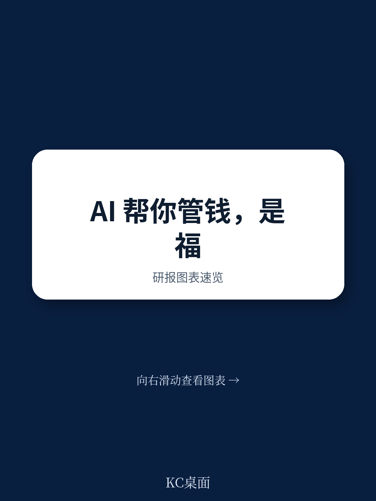

# 经合组织：人工智能与个人资金决策

2025年，经合组织成员国中超过三分之一的成年人报告使用AI工具。这些工具正越来越多地被用于支持资金决策——从选择资金产品、预算管理、信贷管理，到研究和退休规划。消费者还依赖AI获取个性化的资金教育，有时会提出他们不习惯向人类顾问询问的问题。

这份由经合组织资本市场与机构司发布的政策论文，系统梳理了AI在个人资金领域的使用现状、机会与不确定性，并提出了一套针对性的资金素养能力框架。报告的核心判断是：AI不是资金素养的替代品，消费者需要新的能力组合才能安全、知情地使用这些工具。

## 1. 消费者使用AI管理个人财务的现状已可量化

报告引用了多个司法管辖区的调查数据。在加拿大，2025年的一项调查显示，约三分之一的受访者使用AI获取资金信息或建议，其中18至34岁年龄组的使用率更高。在英国，2025年7月的一项在线调查覆盖约5000名成年人，发现AI在个人财务领域的应用正从信息查询向决策支持延伸。

这些工具包括对话式AI助手、嵌入银行应用的AI功能，以及独立的资金教育平台。消费者使用AI的场景覆盖了从“理解资金产品条款”到“比较不同研究选项”的多个环节。报告特别指出，消费者有时会向AI提出他们“需要继续观察意思向人类顾问开口”的问题——这既体现了AI降低心理门槛的价值，也隐含了信息质量无法被有效验证的不确定性。

> **KC评论：** 这里的关键不是使用率本身，而是使用场景的迁移。当消费者从“查信息”转向“要建议”时，AI输出的准确性、个性化和潜在偏见就变成了直接影响财务结果的因素。报告引用的调查样本来自不同国家，但趋势高度一致。

## 2. 机会与不确定性并存，且不确定性具有技术固有属性

报告将AI在个人资金中的不确定性分为两类。第一类源于技术本身：幻觉（hallucinations）、偏见、商业影响，以及个性化资金建议与一般信息之间界限的模糊。第二类源于消费者的使用方式：例如依赖AI来减少认知努力，或在未充分理解建议性质的情况下直接按AI输出行动。

在机会方面，AI可以显著提升资金信息的可及性和个性化程度。对于资金素养较低的群体，AI有可能降低获取专业建议的门槛。但报告同时警告，低水平的资金素养、数字素养和AI素养，可能进一步放大这些技术带来的伤害不确定性。

报告还特别提到一个容易被忽略的问题：目前描述消费者使用AI行为的大部分证据，是由提供AI服务的机构或其委托方生产的。关于AI对消费者资金素养和财务福祉实际影响的独立证据仍然稀缺。

## 3. 资金素养能力框架：消费者需要知道如何提问和如何质疑

报告提出了一套针对AI使用场景的资金素养能力，涵盖三个层面：一是消费者作为AI使用者，需要知道如何提出恰当的问题；二是作为信息接收者，需要能够批判性地评估AI对个人数据的要求以及AI给出的回答；三是作为决策者，需要保留对最终行动的自主判断权。

这些能力并非从零开始构建。报告建立在经合组织已有的资金素养核心能力框架之上，并针对AI的特殊性做了补充。例如，消费者需要理解AI输出的概率性质，需要意识到AI可能受到商业利益影响，以及需要区分“看起来像建议”和“实际上是一般信息”之间的差异。

报告还指出，资金素养教育本身也可以借助AI来提升效果——通过自适应学习、个性化辅导等方式，使教育内容更贴合个体的知识水平和学习节奏。但报告强调，这需要“稳健的人类监督”和“基于经过审核内容的锚定（grounding）”，以确保AI生成内容的教育质量和准确性。

## 4. 政策制定者面临的具体行动方向

报告提出了五个政策考虑方向。第一，需要更多证据来理解消费者如何使用AI以及这些使用对财务结果的影响——经合组织2026年的国际成人资金素养调查将首次纳入数字资金素养和AI使用相关的问题。第二，继续推进资金素养教育，使消费者在使用AI时保持自主性和判断力。第三，在资金教育项目中明确告知消费者使用AI作为信息来源的机会和不确定性。第四，政策制定者和利益相关方可以利用AI创建更有效的资金教育内容，但必须重视人类监督和内容审核。第五，对资金素养、数字素养和AI素养水平较低的群体，以及无法使用AI基础设施的群体，需要提供针对性支持，以降低新型数字排斥的不确定性。

报告没有回避一个现实：这些领域正在快速发展，机会和不确定性都会随着技术进步和监管变化而演变。目前能做的，是建立一个可迭代的观察框架和能力基础。

> **KC评论：** 报告提出的能力框架最有价值的部分，不是“消费者应该学什么”，而是“消费者应该对AI输出保持什么样的怀疑态度”。在资金领域，AI输出的错误可能直接导致金钱损失，而消费者往往缺乏验证这些输出的手段。报告建议的“批判性评估”能力，在实际操作中可能比任何技术知识都更重要。

For informational purposes only. Portions may be generated,translated,summarized,or edited with AI assistance based on source materials and may contain omissions or errors. Please verify independently. This is not investment,legal,tax,accounting,or other professional advice.

