## Corporate Tax Statistics 2026

## Corporate Tax Statistics 2026

This work is issued under the responsibility of the Secretary-General of the OECD, and does not necessarily reflect the official views of OECD Member countries.

This document, as well as any data and map included herein, are without prejudice to the status of or sovereignty over any territory, to the delimitation of international frontiers and boundaries and to the name of any territory, city or area.

The statistical data for Israel are supplied by and under the responsibility of the relevant Israeli authorities. The use of such data by the OECD is without prejudice to the status of the Golan Heights, East Jerusalem and Israeli settlements in the West Bank under the terms of international law.

## Note by the Republic of Türkiye

The information in this document with reference to “Cyprus” relates to the southern part of the Island. There is no single authority representing both Turkish and Greek Cypriot people on the Island. Türkiye recognises the Turkish Republic of Northern Cyprus (TRNC). Until a lasting and equitable solution is found within the context of the United Nations, Türkiye shall preserve its position concerning the “Cyprus issue”.

Note by all the European Union Member States of the OECD and the European Union

The Republic of Cyprus is recognised by all members of the United Nations with the exception of Türkiye. The information in this document relates to the area under the effective control of the Government of the Republic of Cyprus.

Please cite this publication as:

OECD (2026), Corporate Tax Statistics 2026, OECD Publishing, Paris, https://doi.org/10.1787/73af6222-en.

ISBN 978-92-64-91313-4 (print)
ISBN 978-92-64-60844-3 (PDF)
ISBN 978-92-64-90043-1 (HTML)

Corporate Tax Statistics

ISSN 2958-485X (print)

ISSN 2958-4434 (online)

Photo credits: Cover © jean-marc payet/Getty images.

Corrigenda to OECD publications may be found at: https://www.oecd.org/en/publications/support/corrigenda.html.

## Attribution 4.0 International (CC BY 4.0)

This work is made available under the Creative Commons Attribution 4.0 International licence. By using this work, you accept to be bound by the terms of this licence (https://creativecommons.org/licenses/by/4.0/).

Attribution – you must cite the work.

Translations – you must cite the original work, identify changes to the original and add the following text: In the event of any discrepancy between the original work and the translation, only the text of the original work should be considered valid.

Adaptations – you must cite the original work and add the following text: This is an adaptation of an original work by the OECD. The opinions expressed and arguments employed in this adaptation should not be reported as representing the official views of the OECD or of its Member countries.

Third-party material – the licence does not apply to third-party material in the work. If using such material, you are responsible for obtaining permission from the third party and for any claims of infringement.

You must not use the OECD logo, visual identity or cover image without express permission or suggest the OECD endorses your use of the work.

Any dispute arising under this licence shall be settled by arbitration in accordance with the Permanent Court of Arbitration (PCA) Arbitration Rules 2012. The seat of arbitration shall be Paris (France). The number of arbitrators shall be one.

## Foreword

This is the eighth edition of Corporate Tax Statistics, an annual publication that brings together information on corporate taxation and base erosion and profit shifting (BEPS) practices that previously were unavailable to tax policy researchers and policymakers. This includes data on corporate tax rates, revenues, effective tax rates (ETR), tax incentives for research and development (R&D) and innovation, and withholding taxes amongst other data series. Corporate Tax Statistics also includes anonymised and aggregated Country-by-Country Reporting (CbCR) data providing an overview on the global tax and economic activities of thousands of large multinational enterprise groups operating worldwide. Corporate Tax Statistics follows on from the OECD/G20 BEPS Project and its package of fifteen measures adopted in 2015 to address tax avoidance. The project's Action 11 noted that the lack of available and high-quality data on corporate taxation is a major limitation to the measurement and monitoring of the scale of BEPS and the impact of the measures agreed to be implemented under the OECD/G20 BEPS Project.

The report is structured as follows. Chapter 1 presents internationally comparable data on the tax revenues of OECD, Latin American and the Caribbean (LAC), African, and Asian and Pacific jurisdictions. Chapter 2 contains information on the headline tax rate faced by corporations and can be used to compare the standard tax rate on corporations across jurisdictions and over time. Chapter 3 presents information on standard and treaty-based withholding taxes (WHTs) which are levied on businesses when they make payments to other foreign or domestic business entities or individuals, e.g., in the form of dividends, interest, and royalties. Chapter 4 presents “forward-looking” ETRs, which are synthetic tax policy indicators calculated using information about specific tax policy rules to assess the impact of taxation on returns to a hypothetical investment project. Chapter 5 describes several indicators of R&D tax incentives that offer a complementary view to the standard ETRs in Chapter 4 with a focus on tax support provided through expenditure- and income-based R&D tax incentives. Chapter 6 contains information on several BEPS actions, notably Action 3 relating to Controlled Foreign Company rules, Action 4 relating to interest limitation rules, Action 5 relating to intellectual property regimes and Action 13, relating to CbCR. As part of BEPS Action 13, CbCR was introduced to support jurisdictions in combating BEPS. An overview of the anonymised and aggregated CbCR data is provided in Chapter 7, including general data characteristics and some general observations from the CbCR data.

This publication was prepared under the auspices of the Working Party No. 2 on Tax Policy and Statistics of the Inclusive Framework (IF) on BEPS. The authors wish to thank delegates of Working Party No 2 for their time in preparing the statistics for publication. The publication is led by Ruairi Sugrue, under the supervision of Pierce O'Reilly. Chapters 1, 2 and 3 were prepared by Ruairi Sugrue. Chapter 4 was prepared by Clara Gascon, Ana Cinta Gonzalez Cabral and Yunis Griebenow. Chapter 5 was prepared by Ana Cinta Gonzalez Cabral, with input from Silvia Appelt and Fernando Galindo-Rueda. Chapter 6 was prepared by Ruairi Sugrue with input from Jessica De Vries and the Forum for Harmful Tax Practices (FHTP). Chapter 7 was prepared by Ruairi Sugrue and Felix Hugger.

## Table of contents

Foreword 3   
Reader's guide 7   
Abbreviations, acronyms and jurisdiction names 9   
Executive summary 12   
1 Corporate tax revenues 14   
Introduction 14   
Data characteristics 14   
Corporate income tax revenues in 2023 15   
Corporate income tax revenues trends 19   
Notes 21   
2 Statutory corporate income tax rates 22   
Introduction 22   
Data characteristics 22   
Statutory corporate income tax rates in 2026 23   
Corporate income tax rate trends 25   
References 27   
Notes 27   
3 Withholding tax rates and tax treaties 28   
Introduction 28   
Data characteristics 29   
Withholding tax rates in 2026 29   
References 36   
Note 36   
4 Corporate effective tax rates 37   
Introduction 38   
Data characteristics 38   
Forward-looking corporate effective tax rates in 2025 38   
Corporate effective tax rate trends 45   
Note 49

5 Tax incentives for research and development 50
Introduction 51
Data Characteristics 51
Indicators of R&D tax incentives 2025 (or latest available year) 52
R&D tax incentives trends 59
References 64
Note 64
6 BEPS Actions 65
Introduction 65
References 76
Note 76
7 Country-by-country reporting statistics 77
Introduction 77
Data characteristics 78
CbCR statistics for financial year (FY) 2023 79
Insights on BEPS from CbCR data 89
References 92
Notes 92

## FIGURES

Figure 1.1. Corporate income tax revenues as a percentage of GDP, 2023 16
Figure 1.2. Corporate income tax revenues as a percentage of total tax revenues, 2023 18
Figure 1.3. Average corporate income tax revenues as a percentage of total tax and as a percentage of GDP 19
Figure 1.4. Average corporate income tax revenues as a percentage of GDP by income group 20
Figure 1.5. Average corporate income tax revenues as a percentage of total tax revenues by income group 20
Figure 2.1. Statutory corporate income tax rates, 2026 24
Figure 2.2. Average statutory corporate income tax rates by region 25
Figure 2.3. Average statutory corporate income tax rates by income group 26
Figure 2.4. Changing distribution of statutory corporate income tax rates 26
Figure 3.1. Statutory withholding tax rates, 2026 31
Figure 3.2. Average withholding tax rates by income groups, 2026 32
Figure 3.3. Average treaty-based withholding tax rates, 2026 33
Figure 3.4. Number of bilateral treaties, 1990-2026 34
Figure 3.5. Average number of bilateral tax treaties by region 34
Figure 3.6. Average number of bilateral tax treaties by income group 35
Figure 4.1. Effective average tax rates, 2025 40
Figure 4.2. Effective marginal tax rate, 2025 42
Figure 4.3. EATR and EMTR: Variation across jurisdictions and assets, 2025 44
Figure 4.4. Changing distribution of corporate effective average tax rates, 2017-2025 45
Figure 4.5. Changing distribution of EATRs by assets, 2017-2025 46
Figure 4.6. Changing distribution of corporate effective marginal tax rates, 2017-2025 47
Figure 4.7. Changing distribution of EMTRs by assets, 2017-2025 48
Figure 5.1. Direct government funding and expenditure-based tax support for business R&D (BERD), 2024 53
Figure 5.2. The effective average tax rate for R&D including expenditure-based tax incentives, 2025 54
Figure 5.3. The cost of capital for R&D, 2025 55
Figure 5.4. Implied marginal tax subsidy rates on business R&D expenditures, 2025 56
Figure 5.5. EATR for internally generated R&D intangibles, 2025 57
Figure 5.6. The cost of capital for internally generated R&D intangibles, 2025 58
Figure 5.7. Changing distribution of the average EATR for R&D, 2019-2025 59
Figure 5.8. Changing distribution of the average cost of R&D capital, 2019-2025 60
Figure 5.9. Evolution of the implied marginal tax subsidy rates R&D, 2000-2025 61

Figure 5.10. EATR and implied tax subsidies for internally generated R&D intangibles, OECD countries, 2000-2025
62
Figure 5.11. Cost of capital of R&D intangibles, OECD countries, 2000-2025
63
Figure 6.1. Rules neutralising hybrid mismatch arrangements, 2026
68
Figure 6.2. Controlled Foreign Company Rules, 2026
69
Figure 6.3. Interest Limitation Rule types, 2026
70
Figure 6.4. Status of intellectual property regimes in place in 2026
72
Figure 6.5. Reduced rates under non-harmful intellectual property regimes, 2026
73
Figure 6.6. Reduced rates under non-harmful (amended) intellectual property regimes, 2026
73
Figure 6.7. Mandatory disclosure rules, 2026
74
Figure 6.8. Number of jurisdictions implementing mandatory CbCR filing
75
Figure 7.1. The evolution of CbCR coverage
80
Figure 7.2. Distribution of MNEs
81
Figure 7.3. MNEs' contribution to total CIT Revenues, 2023
84
Figure 7.4. Jurisdiction groups' shares of foreign MNEs' activities
86
Figure 7.5. Business activities
87
Figure 7.6. Business activities by income group
88
Figure 7.7. Median profits per employee: distribution within income groups
89
Figure 7.8. Median total revenues per employee: Distribution within income groups
90
Figure 7.9. Median related party revenues shares: Distribution within jurisdiction groups
91

## TABLES

Table 7.1. Content of anonymised and aggregated CbCR statistics 79  
Table 7.2. Sample composition and average values for key financial variables 81

# Reader's guide

## Overview

In developing this 2026 edition of the Corporate Tax Statistics database, the OECD has worked closely with members of the Inclusive Framework (IF) on base erosion and profit shifting (BEPS) and other jurisdictions willing to participate in the collection and compilation of statistics relevant to corporate taxation.

This database is intended to assist in the study of corporate tax policy and expand the quality and range of data available for the analysis of base erosion and profit shifting. The Measuring and Monitoring BEPS, Action 11 - 2015 Final Report highlighted that the lack of quality data on corporate taxation is a major limitation to the measurement and monitoring of the scale of BEPS and the impact of the OECD/G20 BEPS project. While this database is of interest to policy makers from the perspective of BEPS, its scope is much broader. Apart from BEPS, corporate tax systems are important more generally in terms of the revenue that they raise and the incentives for investment and innovation that they create. The Corporate Tax Statistics database brings together a range of information to support the analysis of corporate taxation, in general, and of BEPS, in particular.

The database compiles new data items as well as statistics in various existing data sets held by the OECD. The eighth edition of the database contains the following categories of data:

## Corporate tax revenues:

data are from the OECD's Global Revenue Statistics Database; $^{1}$

\- covers 135 jurisdictions from 1965-2023 (for OECD members) and 1990-2023 (for non-OECD members);

## Statutory CIT rates:

• covers all IF jurisdictions $^{2}$ from 2000-2026;

## Standard withholding tax rates:

• data covering all IF jurisdictions from 2022 – 2026;

## Bilateral tax treaties:

• data covering all IF jurisdictions;

Corporate effective tax rates:

• covers 105 jurisdictions for 2017-2025;

## Tax incentives for R&D:

\- four indicators produced by the OECD Centre for Tax Policy and Administration and the OECD Directorate for Science, Technology and Innovation;

\- covers 55 jurisdictions for 2019-2025 (for preferential tax treatment for R&D, based on effective average tax rates and cost of capital for R&D, including income-based and expenditure-based tax incentives);

\- data are from the OECD R&D Tax Incentive Database $^{4}$ produced by the OECD Directorate for Science, Technology and Innovation;

\- covers 46 jurisdictions for 2000-2024 (for expenditure-based tax and direct government support as a percentage of R&D);

• covers 46 jurisdictions for 2000-2025 (for implied subsidy rates for R&D, based on the B-Index);

## BEPS actions:

• Action 2: Data on hybrid mismatch rules;

• Action 3: Data on controlled foreign company rules;

• Action 4: Data on interest limitation rules;

\- Action 5: IP regimes - data collected for 2018-2026 by the OECD's Forum on Harmful Tax Practices, which covers 65 regimes in 50 jurisdictions for 2026;

• Action 12: Data on mandatory disclosure rules;

\- Action 13: Information on the implementation of the minimum standard on Country-by-Country Reporting

## Anonymised and aggregated CbCR statistics:

\- data are from anonymised and aggregated CbCR statistics prepared by OECD Inclusive Framework members and submitted to the OECD;

• covers up to 60 headquarter jurisdictions and up to 233 affiliate jurisdictions for 2016-2023.

# Abbreviations, acronyms and jurisdiction names

ACE Allowance For Corporate Equity  
BEPS Base Erosion and Profit Shifting  
BERD Business Expenditure On R&D  
CbCR Country-By-Country Reporting  
CFC Controlled Foreign Company  
CIT Corporate Income Tax  
CTPA OECD Centre for Tax Policy and Administration  
DSTI OECD Directorate for Science, Technology and Innovation  
ETR Effective Tax Rate  
EATR Effective Average Tax Rate  
EMTR Effective Marginal Tax Rate  
FDI Foreign Direct Investment  
FHTP Forum On Harmful Tax Practices  
GDP Gross Domestic Product  
GTARD Government Tax Relief for Business R&D  
ICAP International Compliance Assurance Programme  
IF Inclusive Framework On BEPS  
IP Intellectual Property  
ILR Interest Limitation Rule  
LAC Latin American and The Caribbean  
MDR Mandatory Disclosure Rule  
MNE Multinational Enterprise  
NPV Net Present Value  
R&D Research And Development  
RPR Related Party Revenues  
SMEs Small And Medium-Sized Enterprises  
STR Statutory Tax Rate

TREAT CbCR Tax Risk Evaluation and Assessment Tool

UPE Ultimate Parent Entity

UPR Unrelated Party Revenues

VAT Value Added Tax

WHTs    Withholding Taxes

Names and ISO codes of jurisdictions covered

<table><tr><td>ISO Code</td><td>Name</td><td>ISO Code</td><td>Name</td><td>ISO Code</td><td>Name</td></tr><tr><td>ABW</td><td>Aruba</td><td>GLP</td><td>Guadeloupe</td><td>NLD</td><td>Netherlands</td></tr><tr><td>AFG</td><td>Afghanistan</td><td>GMB</td><td>Gambia</td><td>NOR</td><td>Norway</td></tr><tr><td>AGO</td><td>Angola</td><td>GNB</td><td>Guinea-Bissau</td><td>NPL</td><td>Nepal</td></tr><tr><td>AIA</td><td>Anguilla</td><td>GNQ</td><td>Equatorial Guinea</td><td>NRU</td><td>Nauru</td></tr><tr><td>ALB</td><td>Albania</td><td>GRC</td><td>Greece</td><td>NZL</td><td>New Zealand</td></tr><tr><td>AND</td><td>Andorra</td><td>GRD</td><td>Grenada</td><td>OMN</td><td>Oman</td></tr><tr><td>ANT_F</td><td>Former Netherlands Antilles</td><td>GRL</td><td>Greenland</td><td>PAK</td><td>Pakistan</td></tr><tr><td>ARE</td><td>United Arab Emirates</td><td>GTM</td><td>Guatemala</td><td>PAN</td><td>Panama</td></tr><tr><td>ARG</td><td>Argentina</td><td>GUF</td><td>French Guiana</td><td>PER</td><td>Peru</td></tr><tr><td>ARM</td><td>Armenia</td><td>GUM</td><td>Guam</td><td>PHL</td><td>Philippines</td></tr><tr><td>ASM</td><td>American Samoa</td><td>GUY</td><td>Guyana</td><td>PLW</td><td>Palau</td></tr><tr><td>ATG</td><td>Antigua and Barbuda</td><td>HKG</td><td>Hong Kong (China)</td><td>PNG</td><td>Papua New Guinea</td></tr><tr><td>AUS</td><td>Australia</td><td>HND</td><td>Honduras</td><td>POL</td><td>Poland</td></tr><tr><td>AUT</td><td>Austria</td><td>HRV</td><td>Croatia</td><td>PRI</td><td>Puerto Rico</td></tr><tr><td>AZE</td><td>Azerbaijan</td><td>HTI</td><td>Haiti</td><td>PRK</td><td>Democratic People's Republic of Korea</td></tr><tr><td>BDI</td><td>Burundi</td><td>HUN</td><td>Hungary</td><td>PRT</td><td>Portugal</td></tr><tr><td>BEL</td><td>Belgium</td><td>IDN</td><td>Indonesia</td><td>PRY</td><td>Paraguay</td></tr><tr><td>BEN</td><td>Benin</td><td>IMN</td><td>Isle of Man</td><td>PSE</td><td>Palestinian Authority or West Bank and Gaza Strip</td></tr><tr><td>BFA</td><td>Burkina Faso</td><td>IND</td><td>India</td><td>PYF</td><td>French Polynesia</td></tr><tr><td>BGD</td><td>Bangladesh</td><td>IOT</td><td>British Indian Ocean Territory</td><td>QAT</td><td>Qatar</td></tr><tr><td>BGR</td><td>Bulgaria</td><td>IRL</td><td>Ireland</td><td>REU</td><td>Réunion</td></tr><tr><td>BHR</td><td>Bahrain</td><td>IRN</td><td>Iran</td><td>ROU</td><td>Romania</td></tr><tr><td>BHS</td><td>Bahamas</td><td>IRQ</td><td>Iraq</td><td>RUS</td><td>Russia</td></tr><tr><td>BIH</td><td>Bosnia and Herzegovina</td><td>ISL</td><td>Iceland</td><td>RWA</td><td>Rwanda</td></tr><tr><td>BLM</td><td>Saint Barthélemy</td><td>ISR</td><td>Israel</td><td>SAU</td><td>Saudi Arabia</td></tr><tr><td>BLR</td><td>Belarus</td><td>ITA</td><td>Italy</td><td>SDN</td><td>Sudan</td></tr><tr><td>BLZ</td><td>Belize</td><td>JAM</td><td>Jamaica</td><td>SEN</td><td>Senegal</td></tr><tr><td>BMU</td><td>Bermuda</td><td>JEY</td><td>Jersey</td><td>SGP</td><td>Singapore</td></tr><tr><td>BOL</td><td>Bolivia</td><td>JOR</td><td>Jordan</td><td>SHN</td><td>Saint Helena</td></tr><tr><td>BRA</td><td>Brazil</td><td>JPN</td><td>Japan</td><td>SLB</td><td>Solomon Islands</td></tr><tr><td>BRB</td><td>Barbados</td><td>KAZ</td><td>Kazakhstan</td><td>SLE</td><td>Sierra Leone</td></tr><tr><td>BRN</td><td>Brunei Darussalam</td><td>KEN</td><td>Kenya</td><td>SLV</td><td>El Salvador</td></tr><tr><td>BTN</td><td>Bhutan</td><td>KGZ</td><td>Kyrgyzstan</td><td>SMR</td><td>San Marino</td></tr><tr><td>BVT</td><td>Bouvet Island</td><td>KHM</td><td>Cambodia</td><td>SOM</td><td>Somalia</td></tr><tr><td>BWA</td><td>Botswana</td><td>KIR</td><td>Kiribati</td><td>SRB</td><td>Serbia</td></tr><tr><td>CAF</td><td>Central African Republic</td><td>KNA</td><td>Saint Kitts and Nevis</td><td>SSD</td><td>South Sudan</td></tr><tr><td>CAN</td><td>Canada</td><td>KOR</td><td>Korea</td><td>STLS</td><td>Stateless</td></tr><tr><td>CHE</td><td>Switzerland</td><td>KWT</td><td>Kuwait</td><td>STP</td><td>Sao Tome and Principe</td></tr><tr><td>CHL</td><td>Chile</td><td>LAO</td><td>Lao People's Democratic Republic</td><td>SUR</td><td>Suriname</td></tr><tr><td>CHN</td><td>China (People's Republic of)</td><td>LBN</td><td>Lebanon</td><td>SVK</td><td>Slovak Republic</td></tr><tr><td>CIV</td><td>Côte d'lvoire</td><td>LBR</td><td>Liberia</td><td>SVN</td><td>Slovenia</td></tr><tr><td>CMR</td><td>Cameroon</td><td>LBY</td><td>Libya</td><td>SWE</td><td>Sweden</td></tr><tr><td>COD</td><td>Democratic Republic of the Congo</td><td>LCA</td><td>Saint Lucia</td><td>SWZ</td><td>Eswatini</td></tr><tr><td>COG</td><td>Congo</td><td>LIE</td><td>Liechtenstein</td><td>SXM</td><td>Sint Maarten</td></tr><tr><td>COK</td><td>Cook Islands</td><td>LKA</td><td>Sri Lanka</td><td>SYC</td><td>Seychelles</td></tr><tr><td>COL</td><td>Colombia</td><td>LSO</td><td>Lesotho</td><td>SYR</td><td>Syrian Arab Republic</td></tr><tr><td>COM</td><td>Comoros</td><td>LTU</td><td>Lithuania</td><td>TCA</td><td>Turks and Caicos Islands</td></tr><tr><td>CPV</td><td>Cabo Verde</td><td>LUX</td><td>Luxembourg</td><td>TCD</td><td>Chad</td></tr><tr><td>CRI</td><td>Costa Rica</td><td>LVA</td><td>Latvia</td><td>TGO</td><td>Togo</td></tr><tr><td>CUB</td><td>Cuba</td><td>MAC</td><td>Macau (China)</td><td>THA</td><td>Thailand</td></tr><tr><td>CUW</td><td>Curaçao</td><td>MAF</td><td>Saint Martin</td><td>TJK</td><td>Tajikistan</td></tr><tr><td>CYM</td><td>Cayman Islands</td><td>MAR</td><td>Morocco</td><td>TKL</td><td>Tokelau</td></tr><tr><td>CYP</td><td>Cyprus</td><td>MCO</td><td>Monaco</td><td>TKM</td><td>Turkmenistan</td></tr><tr><td>CZE</td><td>Czechia</td><td>MDA</td><td>Moldova</td><td>TLS</td><td>Timor-Leste</td></tr><tr><td>DEU</td><td>Germany</td><td>MDG</td><td>Madagascar</td><td>TON</td><td>Tonga</td></tr><tr><td>DJI</td><td>Djibouti</td><td>MDV</td><td>Maldives</td><td>TTO</td><td>Trinidad and Tobago</td></tr><tr><td>DMA</td><td>Dominica</td><td>MEX</td><td>Mexico</td><td>TUN</td><td>Tunisia</td></tr><tr><td>DNK</td><td>Denmark</td><td>MHL</td><td>Marshall Islands</td><td>TUR</td><td>Türkiye</td></tr><tr><td>DOM</td><td>Dominican Republic</td><td>MKD</td><td>North Macedonia</td><td>TWN</td><td>Chinese Taipei</td></tr><tr><td>DZA</td><td>Algeria</td><td>MLI</td><td>Mali</td><td>TZA</td><td>Tanzania</td></tr><tr><td>ECU</td><td>Ecuador</td><td>MLT</td><td>Malta</td><td>UGA</td><td>Uganda</td></tr><tr><td>EGY</td><td>Egypt</td><td>MMR</td><td>Myanmar</td><td>UKR</td><td>Ukraine</td></tr><tr><td>ERI</td><td>Eritrea</td><td>MNE</td><td>Montenegro</td><td>URY</td><td>Uruguay</td></tr><tr><td>ESP</td><td>Spain</td><td>MNG</td><td>Mongolia</td><td>USA</td><td>United States</td></tr><tr><td>EST</td><td>Estonia</td><td>MNP</td><td>Northern Mariana Islands</td><td>UZB</td><td>Uzbekistan</td></tr><tr><td>ETH</td><td>Ethiopia</td><td>MOZ</td><td>Mozambique</td><td>VCT</td><td>Saint Vincent and the Grenadines</td></tr><tr><td>FIN</td><td>Finland</td><td>MRT</td><td>Mauritania</td><td>VEN</td><td>Venezuela</td></tr><tr><td>FJI</td><td>Fiji</td><td>MSR</td><td>Montserrat</td><td>VGB</td><td>British Virgin Islands</td></tr><tr><td>FLK</td><td>Falkland Islands (Malvinas)</td><td>MTQ</td><td>Martinique</td><td>VIR</td><td>United States Virgin Islands</td></tr><tr><td>FRA</td><td>France</td><td>MUS</td><td>Mauritius</td><td>VNM</td><td>Viet Nam</td></tr><tr><td>FRO</td><td>Faroe Islands</td><td>MWI</td><td>Malawi</td><td>VUT</td><td>Vanuatu</td></tr><tr><td>FSM</td><td>Micronesia</td><td>MYS</td><td>Malaysia</td><td>WLF</td><td>Wallis and Futuna</td></tr><tr><td>GAB</td><td>Gabon</td><td>MYT</td><td>Mayotte</td><td>WSM</td><td>Samoa</td></tr><tr><td>GBR</td><td>United Kingdom</td><td>NAM</td><td>Namibia</td><td>XKV</td><td>Kosovo</td></tr><tr><td>GEO</td><td>Georgia</td><td>NCL</td><td>New Caledonia</td><td>YEM</td><td>Yemen</td></tr><tr><td>GGY</td><td>Bailiwick of Guernsey</td><td>NER</td><td>Niger</td><td>ZAF</td><td>South Africa</td></tr><tr><td>GHA</td><td>Ghana</td><td>NGA</td><td>Nigeria</td><td>ZMB</td><td>Zambia</td></tr><tr><td>GIB</td><td>Gibraltar</td><td>NIC</td><td>Nicaragua</td><td>ZWE</td><td>Zimbabwe</td></tr><tr><td>GIN</td><td>Guinea</td><td>NIU</td><td>Niue</td><td></td><td></td></tr></table>

Notes:  
1. https://www.oecd.org/tax/tax-policy/global-revenue-statistics-database.htm.  
2. Covers 146 IF members as of the 1 January 2026.  
3. https://www.oecd.org/innovation/tax-incentives-RD-innovation/.

# Executive summary

Corporate Tax Statistics is an annual publication intended to assist in the study of corporate tax policy and expand the quality and range of data available for the analysis of base erosion and profit shifting (BEPS). This includes data on corporate tax rates, revenues, effective tax rates, and tax incentives for research and development (R&D) and innovation, withholding tax rates and tax treaties, Intellectual Property (IP) regimes, and BEPS Actions. Corporate Tax Statistics also includes anonymised and aggregated Country-by-Country Reporting (CbCR) data providing an overview on the global tax payments and economic activities of thousands of multinational enterprise groups operating worldwide. The main findings of the report are as follows:

\- The contribution of corporate tax revenues to overall tax revenues remained elevated in 2023 following the increase observed in 2022. In 2023, the share of corporate tax revenues as a percentage of total tax revenues decreased slightly from 17.8% to 17.3% on average across the 135 jurisdictions covered in the database, and the share of these revenues as a percentage of Gross Domestic Product (GDP) decreased slightly from 3.6% to 3.5% on average. However, levels remained elevated relative to 2021 values.

\- Over the longer term, corporate tax revenues as a share of GDP have converged across income groups. In low-income jurisdictions, CIT revenues increased from 0.8% of GDP in 2000 to 3.1% in 2023, approaching the average level in high-income jurisdictions of 3.6%.

\- The share of revenues raised from large MNEs has increased in recent years. Large MNEs are a key source of corporate tax revenue contributing an average of 44.5% of total corporate tax revenues in 2023, up from 42.8% in 2017 across the 60 jurisdictions providing CbCR data.

\- There is continued evidence of stabilisation of corporate tax rates. Statutory corporate income tax rates (STRs) remained stable over the period between 2020 and 2026, arresting the downward trend of the last two decades, though average STRs remain at levels well below historic averages. From 2020 to 2026, the average STR has remained stable with a rate of $21.2\%$ in 2020 and 2026 (with slight yearly variations throughout the period). The average combined (central and sub-central government) STR for all Inclusive Framework jurisdictions covered declined from $28.0\%$ in 2000 to $21.5\%$ in 2019.

\- Tax subsidies for R&D investments remain relatively stable, with a slight increase in subsidies through income-based tax incentives in the last year. The generosity of expenditure-based tax incentives for R&D have stabilised in recent years, with the average subsidy reducing EATRs for R&D by 34.8% in 2025. The uptick in income-based tax support relates to the introduction of some new regimes and increase in generosity of some others, although generosity was curtailed in other countries. R&D tax incentives are often used to promote R&D and innovation activity in the jurisdiction, though some tax incentives may also result from competitive pressures to attract highly mobile intangibles.

\- There remains suggestive evidence of mismatches between the location of profits and observed markers of multinational activity. While some high-level indicators of mismatches show a slight increase in recent years, they remain below earlier peaks and continue to be substantially higher in investment hubs than in other jurisdictions. While this could reflect continuing BEPS behaviour, the report notes that these data may be affected by turbulence in the global economy during high inflation periods in 2023.

\- The 2026 edition of Corporate Tax Statistics contains more data than earlier editions. It now includes anonymised and aggregated CbCR data on the activities of almost 9 400 MNEs worldwide headquartered in 60 jurisdictions, with improved geographical breakdowns for many jurisdictions. The continuing improvement in the dataset allows for a more detailed and robust analysis of how financial variables such as profits, revenues and taxes are distributed across jurisdictions.

# Corporate tax revenues

## Key insights

\- In 2023, the share of corporate income tax (CIT) revenues in total tax revenues was 17.3% on average across the 135 jurisdictions for which corporate tax revenues are available in the database, and the share of these revenues as a percentage of gross domestic product (GDP) was 3.5% on average.

\- The level of CIT revenues relative to total tax revenues and relative to GDP varied by groupings of jurisdictions. In 2023, corporate tax revenues were a larger share of total tax revenues on average in Africa (21.4% in the 38 jurisdictions), Asia and Pacific (19.5% in the 37 jurisdictions) and Latin American and the Caribbean (LAC) (18.7% in the 26 jurisdictions) than the OECD (11.9%). In general, middle and low-income jurisdictions are more strongly reliant on corporate income tax as a share of total taxation.

\- Corporate tax revenues relative to GDP have steadily risen amongst low- and middle-income jurisdictions in recent years from 3.0% in 2016 to 3.6% in 2023 for middle-income jurisdictions and from 1.8% in 2016 to 3.1% in 2023 for low-income jurisdictions.

\- However, there was less variation between groupings in terms of corporate tax revenues as a share of GDP. The average of corporate tax revenues as a share of GDP was the largest in the OECD and LAC, each at 3.8%, followed by Asia and Pacific (3.4%) and Africa (3.3%). This suggests that differences in the share of corporate tax in total revenues are driven more by lower overall tax revenues in some regions, rather than differences in corporate tax collection relative to GDP.

\- In 2023, average CIT revenues relative to total tax revenue and relative to GDP declined slightly compared to 2022, though they remained above pre-pandemic levels and continued to exceed the peaks observed prior to the global financial crisis.

## Introduction

Data on corporate income tax (CIT) revenues can be used for comparison across jurisdictions and to track trends over time. The data in the Corporate Tax Statistics database is drawn from the OECD's Global Revenue Statistics Database and allows for the comparison between individual jurisdictions as well as between average corporate tax revenues across OECD, LAC, African, and Asia and Pacific jurisdictions. $^{1}$

## Data characteristics

The Corporate Tax Statistics database contains four corporate tax revenue indicators:

• the level of CIT revenues in national currency;

• the level of CIT tax revenues in USD;

• CIT revenues as a percentage of total tax revenue;

• CIT revenues as a percentage of GDP.

The OECD's Global Revenue Statistics Database provides detailed, internationally comparable data on tax revenues across jurisdictions. The classification of taxes and the underlying methodology are described in detail in the OECD's $Revenue\ Statistics\ Interpretative\ Guide$ . Coverage, reference years and data availability vary across jurisdictions and data may be subject to revisions and methodological changes over time. As of December 2025, data for CIT revenues are available for 135 jurisdictions covered by the OECD's Global Revenue Statistics Database. Comparisons are also made with the averages of the 38 OECD economies, of the 26 LAC jurisdictions (four of which are also OECD members), of 38 African jurisdictions and of 37 Asia and Pacific jurisdictions (four of which are also OECD members) and across income groups. $^{2}$

## Corporate income tax revenues in 2023

## Corporate income tax revenues as a share of GDP

Corporate tax revenues as a percentage of GDP varied across jurisdictions and was 3.5% on average across the entire sample in 2023. The ratio of corporate tax revenues to GDP was between 2% and 5% for a majority of the 135 jurisdictions covered (Figure 1.1). For 20 jurisdictions, corporate tax revenues accounted for more than 5% of GDP. In contrast, they were less than 2% of GDP in 23 jurisdictions. In 2023, the OECD and LAC averages were similar, at 3.8% of GDP, whereas the Asia and Pacific and African averages were lower at 3.4% and 3.3% respectively.

The variation in the share of CIT in GDP may result from a variety of factors. This includes differences in statutory corporate tax rates, which also vary considerably across jurisdictions (see Chapter 2). In addition, this variation can be explained by institutional and jurisdiction-specific factors, including:

• the degree to which firms in a jurisdiction are incorporated;

• the breadth of the CIT base;

\- the current stage of the economic cycle and the degree of cyclicality of the corporate tax system (for example, from the generosity of loss offset provisions);

\- other instruments that postpone the taxation of earned profits.

Generally, differences in corporate tax revenues as a share of GDP should not be interpreted as being related to base erosion and profit shifting (BEPS) behaviour, since many other factors are likely to be more significant, although profit shifting may have some effects at the margin, and for some specific jurisdictions.

Figure 1.1. Corporate income tax revenues as a percentage of GDP, 2023  
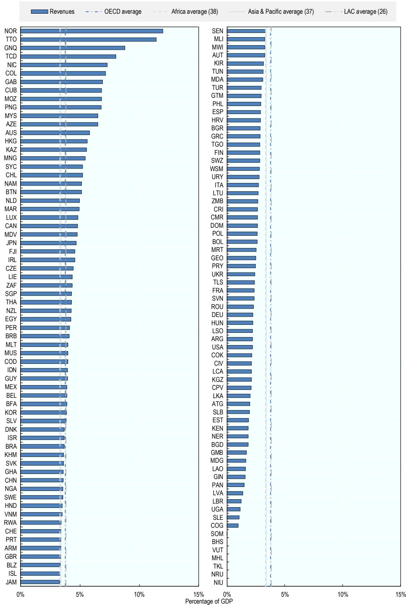  
StatLink https://stat.link/0he1pw

## Corporate income tax revenues as a share of total tax revenues

The average revenue share of corporate tax in total tax revenue in 2023 was 17.3% across all the jurisdictions covered. The average varied across the OECD and the regional groupings (LAC, Asia and Pacific and Africa). In 2023, the OECD average was the lowest, at 11.9%, followed by the LAC average (18.7% in 26 jurisdictions), the Africa average (21.4% in 38 jurisdictions) and the Asia and Pacific average (19.5% in 37 jurisdictions).

The averages mask considerable differences across jurisdictions (Figure 1.2). In 25 jurisdictions of the 135 jurisdictions in the dataset, CIT revenue accounted for more than 25% of total tax revenue. In 10 of the 135, it accounted for more than 40%. In contrast, in 8 jurisdictions CIT raised less than 5% of total tax revenue, however, there was no CIT system in place in 6 of these jurisdictions.

In most jurisdictions, the difference in the level of corporate taxes as a share of total tax revenues reflects differences in the levels of other taxes raised and the tax to GDP ratio rather than differences in CIT itself. This can include for example, the extent of reliance on other types of taxation, such as taxes on personal income and on consumption, or the extent of reliance on tax revenues from the exploitation of natural resources. In addition, the total level of taxation as a share of GDP plays a role. For example, for the 38 African jurisdictions, the relatively high average revenue share of CIT as a percentage of tax revenue compared to the relatively low average of CIT as a percentage of GDP reflects the low amount of total tax raised as a percentage of GDP (average of 16.1%). Total tax revenue as a percentage of GDP is somewhat higher for the 26 LAC jurisdictions (average of 21.3%), the 37 Asia and Pacific jurisdictions (average of 19.6%) and significantly higher for the OECD jurisdictions (average of 33.7%).

Across the jurisdictions in the database, low tax-to-GDP ratios may reflect policy choices as well as challenges associated with domestic resource mobilisation (e.g., administrative capacity and levels of compliance). The fact that CIT-to-GDP ratios are similar across jurisdictions with varying levels of economic development suggests that variation in total tax-to-GDP ratios is driven more strongly by other tax categories (e.g. PIT, SSCs) than by CIT.

Figure 1.2. Corporate income tax revenues as a percentage of total tax revenues, 2023  
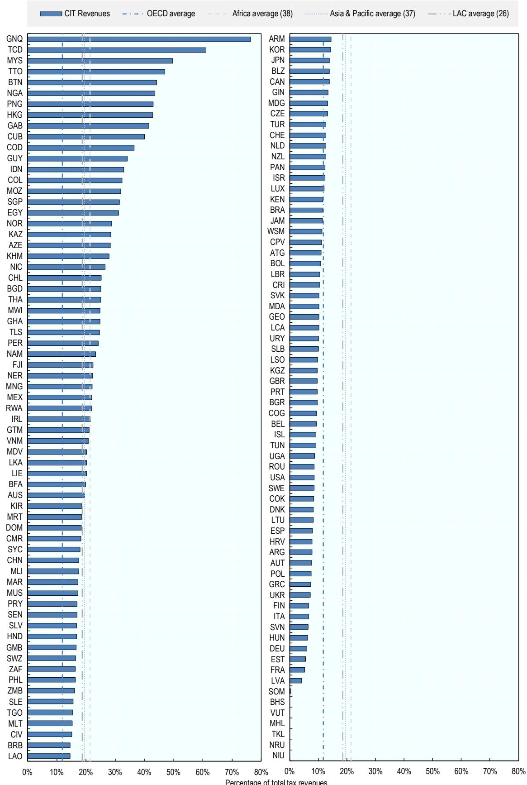  
StatLink https://stat.link/6a9qnk

## Corporate income tax revenues trends

Data from the OECD's Global Revenue Statistics database show an overall increase in average CIT revenues between 2000 and 2023 across the 135 jurisdictions for which data are available. Average CIT revenues as a share of total tax revenues increased from $12.3\%$ in 2000 to $17.3\%$ in 2023, and average CIT revenues as a percentage of GDP increased from $2.5\%$ in 2000 to $3.5\%$ in 2023.

Trends in these two indicators are closely aligned over time (Figure 1.3). Measured both as a percentage of total tax revenues and as a percentage of GDP, average CIT revenues reached a peak in 2008 before declining in 2009 and 2010, reflecting the impact of the global financial and economic crisis. Average CIT revenues recovered briefly in the years after 2010 to a new peak in 2012, however, the average across all 135 jurisdictions declined again from 2013 to 2016.

From 2017 to 2023, average CIT revenues have generally increased, following increases across a wide range of jurisdictions. In 2022, average CIT revenues as a share of total tax revenues and as a share of GDP both increased to levels surpassing the previous peaks of 2008 and 2012. This increase may reflect the recovery in corporate profits and tax revenues following the COVID-19 crisis. In 2023, average CIT revenues in both indicators have declined slightly compared to 2022, though they remain above pre-pandemic levels and continue to exceed the peaks observed prior to the global financial crisis.

Figure 1.3. Average corporate income tax revenues as a percentage of total tax and as a percentage of GDP  
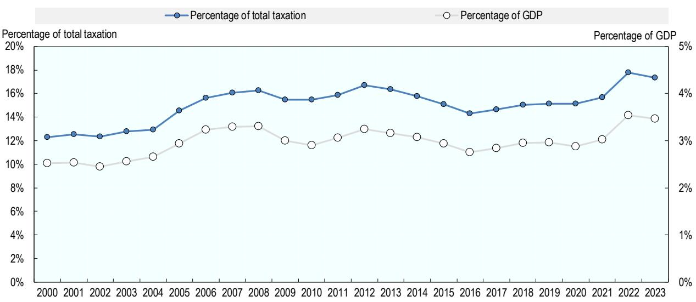  
StatLink https://stat.link/iu75lf

Figure 1.4 shows that trends are also broadly consistent across income groups except for low-income jurisdictions, with a decline around the global financial crisis followed by a recovery and renewed growth in the years leading up to 2022. Contrary to Figure 1.3, both low-income jurisdictions and investment hubs showed increases in 2023. Despite these movements, CIT revenues as a share of GDP are converging to a relatively narrow range across jurisdictions. High-income and middle-income jurisdictions show quite similar levels over time. Low-income jurisdictions display a clearer overall upward trend, while investment hubs exhibited higher levels in the early 2000s followed by a decline and gradual recovery.

Figure 1.4. Average corporate income tax revenues as a percentage of GDP by income group  
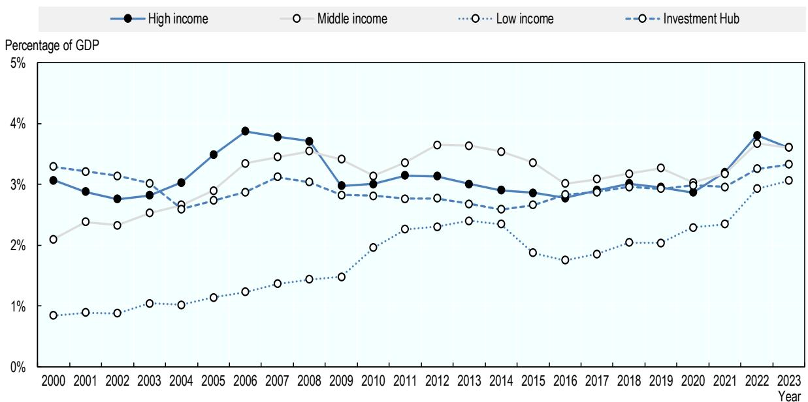  
StatLink https://stat.link/rfl6ky

In contrast to the relatively limited differences observed in Figure 1.4, Figure 1.5 shows more pronounced variation across income groups. Middle-income jurisdictions consistently display the highest reliance on CIT, with shares exceeding 20% in recent years. Low-income jurisdictions show relatively elevated but more volatile shares. High-income jurisdictions, by comparison, show a much lower but more stable share, generally around 10–12%, while investment hubs fall between these groupings following a similar trend to that of high-income jurisdictions.

Figure 1.5. Average corporate income tax revenues as a percentage of total tax revenues by income group  
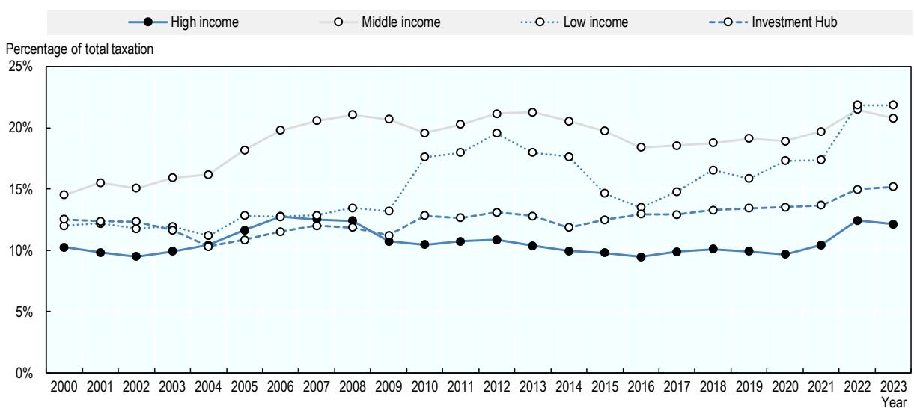  
StatLink https://stat.link/1uxfkn

## Notes

$^{1}$ The latest tax revenue data available across all jurisdictions in the database are for 2023, although there are 2024 data available for some jurisdictions in the Global Revenue Statistics Database.

$^{2}$ Jurisdiction groups (high-, middle- and low-income) are based on the latest World Bank classifications. Investment hubs are defined as jurisdictions with an average total inward Foreign Direct Investment (FDI) position above 150% of gross domestic product (GDP) across the latest 3 years for which data is available.

# Statutory corporate income tax rates

## Key insights

\- Statutory corporate income tax rates (STRs) have remained stable in the period between 2020 and 2026, arresting their long-term decline over the last two decades, though rates remain far below historic averages. The average combined (central and sub-central government) STR for all Inclusive Framework jurisdictions covered declined dramatically from $28.0\%$ in 2000 to $21.5\%$ in 2019. From 2020 to 2026, the average STR has remained stable with a rate of $21.2\%$ in 2020 and 2026.

\- In 2026, 74 jurisdictions had an STR of between 20% and 30% with 25 jurisdictions having an STR of greater than 30%. 33 jurisdictions had an STR of between 10% and 20% and 14 had an STR of less than 10%.

\- In 2026, 11 jurisdictions had no corporate tax regime or an STR of zero. Three jurisdictions, Barbados, Hungary and the United Arab Emirates (all $9\%$ ), had a positive STR of less than $10\%$ .1

\- Comparing STRs between 2000 and 2026, 113 jurisdictions had lower tax rates in 2026, while 18 jurisdictions had the same tax rate, and 15 had higher tax rates.

\- From 2025 to 2026, the STR decreased by 5 p.p. in Honduras and by 1 p.p. in two jurisdictions (Cabo Verde and Portugal) while four jurisdictions recorded increases of 1 p.p. each among the 146 jurisdictions covered (Korea, Lithuania, Morocco and San Marino2).

## Introduction

Data on statutory corporate income tax rates (STRs) provide key information on the headline tax rate applicable to corporate profits and offer an important starting point for analysing corporate tax policy across jurisdictions and over time. Although they do not capture the full complexity of corporate tax systems - including special regimes, targeted rates, and other provisions that affect effective corporate tax rates - statutory rates remain a central indicator of governments' approaches to corporate taxation and are closely monitored by policymakers, businesses, and researchers.

## Data characteristics

The Corporate Tax Statistics database reports STRs for resident corporations at the:

• central government level;

• central government level exclusive of any surtaxes;

• central government level less deductions for subnational taxes;

• sub-central government level;

• combined (central and sub-central) government level.

The standard rate, which is not targeted at any particular industries or income type, is reported. The top marginal rate is reported if a jurisdiction has a progressive corporate tax system. The data presented in this chapter cover combined central and sub-central statutory corporate income tax rates for all members of the Inclusive Framework (IF) on base erosion and profit shifting (BEPS). Further information on the rates and systems for certain jurisdictions are contained in the Corporate Tax Statistics Explanatory Annex. Comparisons are also made with the averages of the 38 OECD economies, of the 36 LAC jurisdictions (four of which are also OECD members), of 27 African jurisdictions and of 36 Asia and Pacific jurisdictions (four of which are also OECD members), and across income groups. $^{3}$

As STRs measure the marginal tax that would be paid on an additional unit of income, in the absence of other provisions in the tax code, they are often used in studies of base erosion and profit shifting (BEPS) to measure the incentive that firms have to shift income between jurisdictions.

Standard STRs provide a snapshot of the corporate tax rate in a jurisdiction. However, jurisdictions may have multiple tax rates with the applicable tax rate depending on the characteristics of the corporation and the income.

\- Some jurisdictions operate preferential tax regimes with lower rates offered to certain corporations or income types.

\- Some jurisdictions tax retained and distributed earnings at different rates. Some distribution based tax systems only tax business profits on distributions. Where a corporation retains all profits and does not pay any dividends in a given period, it will not be subject to any CIT.

• Some jurisdictions impose different tax rates on certain industries.

\- Some jurisdictions have progressive rate structures or different regimes for small and medium sized companies.

\- Some jurisdictions impose different tax rates on non-resident companies than on resident companies.

• Some jurisdictions impose lower tax rates in special or designated economic zones.

\- Some jurisdictions levy other special corporate taxes that are levied on a base other than corporate profits are not included.

• Some jurisdictions may offer refunds of corporate income taxes through imputation systems.

## Statutory corporate income tax rates in 2026

The average STR among the 146 jurisdictions covered in this edition was 21.2%. CIT rates vary widely across all members of the Inclusive Framework on BEPS in 2026 (Figure 2.1). Of the jurisdictions covered, 25 had STRs equal to or above 30%. At the other end of the distribution, 11 jurisdictions had either no corporate income tax regime or an STR of zero in 2026. A further three jurisdictions — Barbados, Hungary and the United Arab Emirates — applied positive STRs below 10% (all at 9%). $^{1}$

Figure 2.1. Statutory corporate income tax rates, 2026  
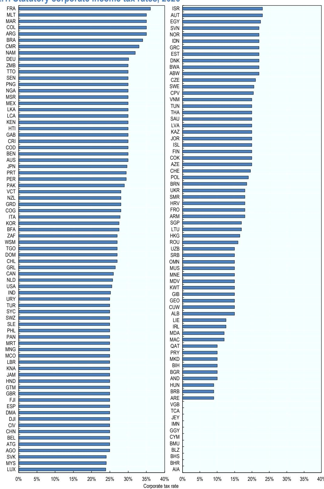

Note: The Kingdom of Saudi Arabia imposes a corporate income tax rate of 20% on a non-Saudi's share of a resident company or a non-resident's income from a permanent establishment in Saudi Arabia or income of a company operating in the natural gas sector. A higher corporate income tax rate is imposed as well on companies operating in the oil sector (i.e., 50% or higher). The Kingdom of Saudi Arabia also levies the Zakat on companies, which is an example of a tax on both income and equity. The Zakat is levied at 2.5% on a Saudi's share of a resident company (also applies to citizens of Gulf Cooperation Council countries with an established business in the Kingdom of Saudi Arabia), but since it is imposed on income and equity, it yields a higher rate in effective terms. The Saudi government considers the corporate Zakat as an equivalent to corporate income tax, levied on a different basis. It is also considered a covered tax for the purposes of the GloBE rules in the GloBE Model Rules and Commentary. (OECD, 2021[1]).

StatLink https://stat.link/mstq82

## Corporate income tax rate trends

Since 2000, average STRs have declined across OECD member states and the three regional groupings jurisdictions considered: African jurisdictions, Asia and Pacific jurisdictions and Latin American and The Caribbean (LAC) jurisdictions (Figure 2.2), as well as across jurisdiction groups. $^{4}$

Figure 2.2. Average statutory corporate income tax rates by region  
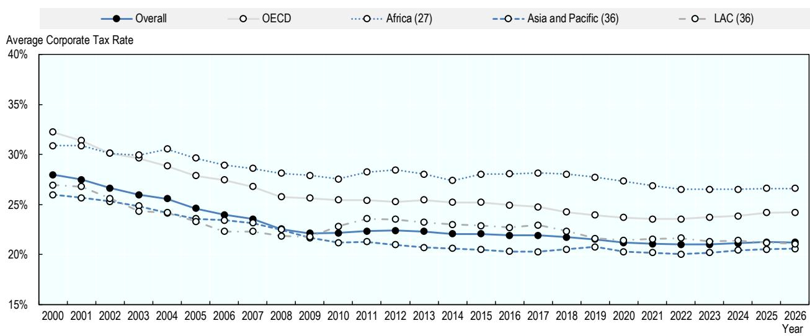

Figure 2.2 shows that the grouping with the most significant decline in the average STR has been OECD members (a decline of 8.2 p.p., from 32.3% in 2000 to 24.2% in 2026) followed by LAC with a decline of 5.8 p.p. in 36 jurisdictions, from 26.9% in 2000 to 21.1% in 2026. While the averages have fallen for each grouping over this period, significant differences between the averages for each group remain: the average STR for Africa was 26.6% in 27 jurisdictions in 2026, compared to 24.2% for OECD members, 21.1% in 36 jurisdictions for LAC and 20.6% for 36 jurisdictions in Asia and Pacific.

Recent years have seen a stabilisation of STRs across most of jurisdiction groups covered. From 2020 to 2026, the average STR across all jurisdictions covered has remained stable at an average rate of 21.2% across the years. Similarly, there have been declines of only 1.1 p.p. in Africa, 0.2 p.p. in Asia and 0.6 p.p. in LAC, while there has been a slight increase of 0.3 p.p. in the OECD. Over the same period (2020-2026), there have been 21 jurisdictions who have increased their STR, while 23 jurisdictions have decreased their rate. In 2026, there were 4 jurisdictions who increased their rate, while 3 jurisdictions decreased their rate.

Figure 2.3 shows that statutory corporate income tax rates have declined across all income groups over the past two decades, with broadly similar downward trends but some notable differences in levels. High- and middle-income jurisdictions both experienced steady reductions from the early 2000s, with rates stable at around 23% in recent years. Low-income jurisdictions started from much higher statutory rates, averaging 40% in 2000, but saw a marked decline over time to 27.4% in 2026. In contrast, investment hubs consistently applied much lower statutory rates and recorded the sharpest proportional decline, before stabilising at 12.0% since 2019.

Figure 2.3. Average statutory corporate income tax rates by income group  
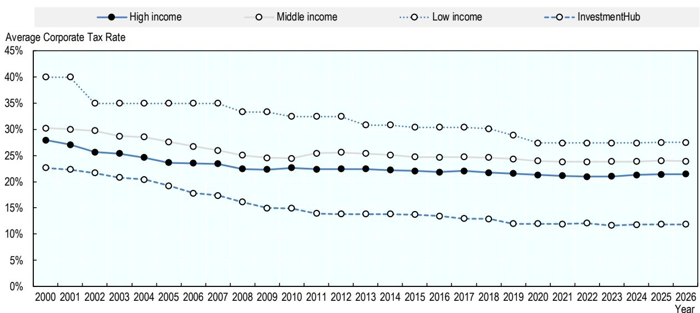  
StatLink https://stat.link/4ve67r

Most of the downward movement in STRs between 2000 and 2026 was to tax rates equal to or greater than 10% and less than 30% (Figure 2.4). The number of jurisdictions with tax rates equal to or greater than 10% and less than 30% almost tripled from 40 jurisdictions to 107 jurisdictions, and the number of jurisdictions with tax rates equal to or greater than 10% and less than 20% more than tripled, from nine to 33 jurisdictions. Of the 146 jurisdictions covered in the 2026 data, 25 had corporate tax rates equal to or above 30% in 2026, with Colombia, Malta, Morocco and France having the highest STRs at 35.0%, 35.0%, 35.0% and 36.1% respectively. $^{5}$

Figure 2.4. Changing distribution of statutory corporate income tax rates  
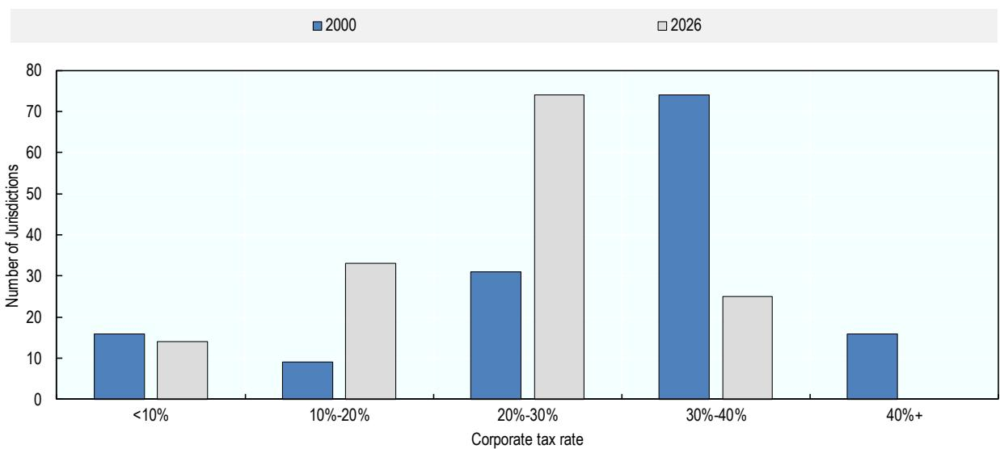  
StatLink https://stat.link/86rxjh

Despite the general downward movement in tax rates during this period, the number of jurisdictions with very low STRs of less than 10% remained fairly stable between 2000 and 2026. There were 16 jurisdictions with STRs of less than 10% in 2000, and 14 below that threshold in 2026.

There has, however, been some movement of jurisdictions into and out of this category, and these movements illustrate how headline STRs do not give a complete picture of the tax burden in a jurisdiction. Between 2005 and 2009, the British Virgin Islands, Guernsey, Jersey $^{6}$ and the Isle of Man all moved from corporate tax rates above 10% to zero corporate tax rates. In all of these cases, however, before changing their standard corporate tax rate to zero, they had operated broadly applicable special regimes that resulted in very low tax rates for qualifying companies. Meanwhile, Andorra and the Maldives instituted corporate tax regimes and moved from zero rates to positive tax rates (10% in Andorra beginning in 2012 and 15% in the Maldives beginning in 2011). However, they also introduced preferential regimes as part of their corporate tax systems that offered lower rates to qualifying companies. $^{7}$

## References

OECD (2021), Tax Challenges Arising from Digitalisation of the Economy – Global Anti-Base Erosion Model Rules (Pillar Two): Inclusive Framework on BEPS, OECD/G20 Base Erosion and Profit Shifting Project, OECD Publishing, Paris, https://doi.org/10.1787/782bac33-en.

## Notes

$^{1}$ Hungary, however, also has a local business tax, which does not use corporate profits as its base. This is not included in Hungary's STR, but it does mean that businesses in Hungary are subject to a higher level of tax than its statutory rate reflects.

$^{2}$ For San Marino, the increase of 1 percentage point is temporary (for a five-year period starting from 2026).

$^{3}$ Jurisdiction groups (high-, middle- and low-income) are based on the latest World Bank classifications. Investment hubs are defined as jurisdictions with an average total inward Foreign Direct Investment (FDI) position above 150% of gross domestic product (GDP) across the latest 3 years for which data is available.

$^{4}$ As the sample of jurisdictions for which tax revenue data are available and the sample of jurisdictions for which statutory corporate tax rate data are available are not identical, the average corporate tax revenue and STR data for the different regional groups should not be directly compared.

$^{5}$ However, Malta offers a refund of up to six-sevenths of corporate income taxes to both resident and non-resident investors through its imputation system. The corporate tax rate in Belize is 40% but as this rate applies only to the petroleum industry, the corporate tax rate in Belize has been included in this database as 0% to ensure consistency of treatment across all jurisdictions. The increase in the corporate tax rate for France was due to an exceptional corporate income tax surcharge that will apply in 2026.

$^{6}$ Jersey's current corporate income tax regime offers bands of 0%, and for certain targeted sectors, 10% and 20%.

$^{7}$ Andorra and the Maldives have recently amended or abolished their preferential regimes that were not compliant with the BEPS Action 5 minimum standard.

# Withholding tax rates and tax treaties

## Key insights

\- Withholding tax rates on cross-border payments vary substantially across jurisdictions and across types of income. In 2026, the average statutory withholding tax rate across the 146 jurisdictions covered was 12.2% for dividends, 12.8% for interest, and 14.5% for royalties, all well below average statutory corporate income tax rates.

\- High statutory withholding tax rates remain relatively common for all three payment types. Twelve jurisdictions applied dividend withholding tax rates of 30% or more, while ten jurisdictions applied interest withholding tax rates at or above 30% and eleven jurisdictions applied royalty withholding tax rates of at least 30% in 2026.

\- At the opposite end of the distribution, a substantial number of jurisdictions apply zero statutory withholding tax rates. In 2026, 37 jurisdictions applied a zero rate on dividends, 34 on interest, and 27 on royalties.

\- Tax treaties substantially reduce withholding tax burdens relative to domestic law. Treaty-based withholding tax rates are significantly lower across all payment types, underscoring the central role of bilateral tax conventions in limiting source-based taxation and shaping effective cross-border tax outcomes.

\- Treaty-based withholding tax rates on technical fees are particularly low. Over 80% of bilateral treaties apply a rate below 5%, reflecting widespread treaty practices that restrict source-based taxation of services income, especially in the absence of a permanent establishment in the source jurisdiction.

\- The global network of bilateral tax treaties has expanded markedly over recent decades, increasing from 1 063 treaties in 1990 to over 5 300 treaties in 2026. However, growth in the number of treaties has slowed in recent years, with only 454 additional treaties concluded between 2017 and 2026.

\- Treaty coverage differs significantly across regions. OECD member countries maintain far denser treaty networks, averaging around 70 treaties per jurisdiction in 2026, compared with fewer than 20 treaties on average in Africa and in Latin America and the Caribbean, with growth in treaty coverage since 1990 strongest among OECD countries.

## Introduction

Withholding taxes (WHTs) are levied on businesses when they make payments to other foreign or domestic business entities or individuals, e.g., in the form of dividends, interest, and royalties. Governments collect these taxes based on statutory or preferential treaty-based tax rates requiring businesses to withhold a fraction of cross-border payments in scope of the WHT. Data on withholding taxes can be used to improve understanding of multinational enterprise (MNE) decisions about investment, repatriation, finance and organisational structures among other tax policy issues. income taxes levied on profits.

Bilateral tax conventions form a central component of the international tax framework by allocating taxing rights between contracting jurisdictions and reducing instances of juridical double taxation. By limiting the extent of source-based taxation on cross-border income flows and by providing greater legal certainty for taxpayers, tax treaties can facilitate international trade, services and investment. In particular, treaty provisions governing withholding taxes establish agreed ceilings on the taxation of certain categories of income, thereby constraining excessive or discriminatory source taxation.

Data on WHT rates support analysis of multinational enterprise (MNE) investment, financing and profit repatriation decisions, as well as broader tax policy considerations. Differences in WHT rates across jurisdictions and across types of payments may influence the cost of capital, the allocation of debt and intangible assets, and the structure of cross-border investments. WHT data can also provide insights into certain base erosion and profit shifting (BEPS) strategies, including treaty shopping. The publication of WHT rates in Corporate Tax Statistics was envisaged in the 2015 BEPS Action 11 Report (OECD, 2015[1]).

## Data characteristics

The Corporate Tax Statistics database reports standard and treaty based WHTs for resident corporations on:

• dividends;

\- interest;

\- royalties;

\- technical fees

The data presented in this chapter cover WHTs for all members of the Inclusive Framework (IF) on base erosion and profit shifting (BEPS). Comparisons are also made with the averages of the 38 OECD economies, of the 27 LAC jurisdictions (four of which are also OECD members), of 36 African jurisdictions and of 36 Asia and Pacific jurisdictions (four of which are also OECD members) as well as income groups. $^{1}$

## Withholding tax rates in 2026

## Standard withholding tax rates

The average statutory withholding tax rate on dividend payments across the 146 jurisdictions covered in this edition was 12.2%. Dividend WHT rates display considerable variation across members of the Inclusive Framework in 2026 (Figure 3.1). Of the jurisdictions covered, 12 applied dividend withholding tax rates of 30% or above. At the other end of the distribution, 37 jurisdictions applied a zero rate on dividend payments, reflecting either the absence of a dividend withholding tax or the application of a full exemption. A further 14 jurisdictions applied positive dividend WHT rates below 10%, indicating relatively low taxation of cross-border dividends.

The average statutory withholding tax rate on interest payments was slightly higher, at 12.8% across the 146 jurisdictions covered. Interest WHT rates also vary widely among Inclusive Framework members. Ten jurisdictions applied interest withholding tax rates of 30% or above in 2026. In contrast, 34 jurisdictions imposed a zero-withholding tax on interest payments, while six jurisdictions applied positive interest WHT rates below 10%, suggesting a significant group of economies with either exempt or lightly taxed cross-border interest payments.

Withholding tax rates on royalty payments are, on average, higher than those applied to dividends and interest. Across the 146 jurisdictions covered, the average statutory royalty withholding tax rate was 14.5%. Royalty WHT rates also show substantial dispersion. Eleven jurisdictions applied royalty withholding tax rates of 30% or more, while 27 jurisdictions applied a zero rate on royalty payments. At the lower end of the positive rate distribution, only four jurisdictions applied royalty withholding tax rates below 10%, indicating that royalty payments are more frequently subject to moderate or high source-based taxation.

Figure 3.1. Statutory withholding tax rates, 2026  
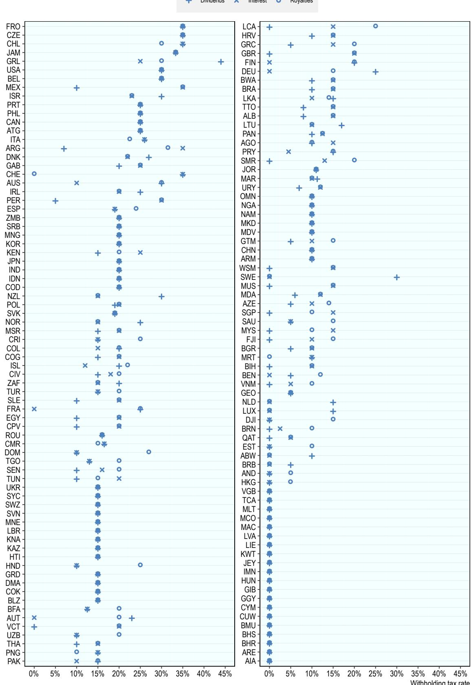  
StatLink https://stat.link/g52ajd

The average statutory withholding tax rates on cross-border payments vary across income groups in 2026 (Figure 3.2). For dividends, high-income jurisdictions applied the highest average rate (15.9%), followed by low-income (13.9%) and middle-income jurisdictions (11.5%), while investment hubs applied much lower rates (5.2%). A different pattern emerges for interest payments, where low-income (16.4%) and middle-income jurisdictions (15.1%) applied higher average rates than high-income jurisdictions (13.3%), with investment hubs again applying very low rates (4.3%).

Withholding taxes on royalties and technical service fees are generally higher, especially in lower-income economies. Low-income jurisdictions recorded the highest average rates on royalties (20.0%) and technical fees (21.2%), followed by middle-income and high-income jurisdictions at progressively lower levels. In contrast, investment hubs consistently applied very low rates across both categories, at 2.8% for royalties and 2.6% for technical fees.

Figure 3.2. Average withholding tax rates by income groups, 2026  
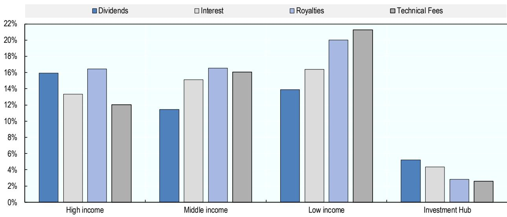  
StatLink https://stat.link/3nsx2z

## Treaty based withholding tax rates

Figure 3.3. Average treaty-based withholding tax rates, 2026  
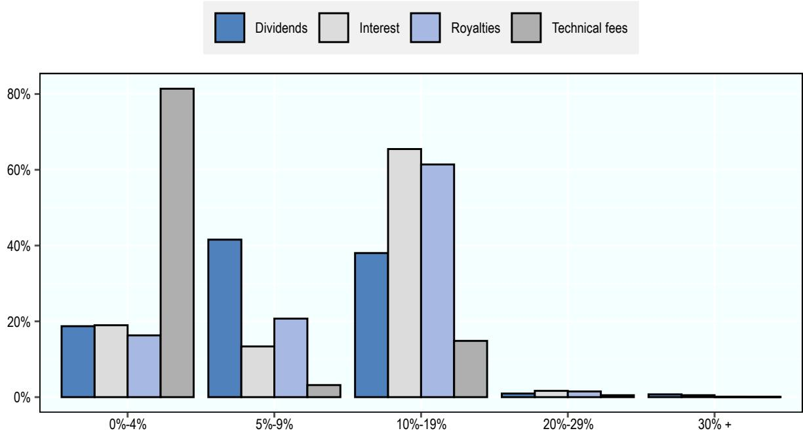  
Note: Data are based on bilateral treaties reported by all IF member jurisdictions. The database refers to bilateral tax treaties only. Multilateral agreements are not accounted for. Other tax-related agreements such as tax information exchange agreements are not counted. Only treaties in effect are counted. For each of the categories of payment flows, existing treaties that do not specify the applicable withholding tax rate, and hence create missing values, are not included in this figure. Where a tax treaty provides for different rates for specified ownership percentages, this entry reflects the highest ownership percentage.

StatLink https://stat.link/jivsct

The global network of bilateral tax treaties has expanded substantially over recent decades. Among the 146 jurisdictions covered in the dataset, the number of treaties increased from 1 063 in 1990 to over 5 300 in 2026 (Figure 3.4). This expansion reflects the continued importance attached by jurisdictions to bilateral tax conventions as instruments for allocating taxing rights, reducing double taxation and providing certainty for cross-border economic activity.

More recent years, however, have been characterised by a moderation in the pace of treaty network expansion. Between 2017 and 2026, only 454 additional treaties were incorporated into the database, indicating a relative levelling-off compared with earlier periods of rapid growth (Figure 3.4). This slower increase in the number of new treaties does not imply an absence of treaty-related developments. Rather, it reflects, in part, a shift from the conclusion of new bilateral agreements towards the modification of existing treaties, including through the widespread adoption of the Multilateral Instrument (MLI) and the negotiation of bilateral protocols amending pre-existing conventions.

Figure 3.4. Number of bilateral treaties, 1990-2026  
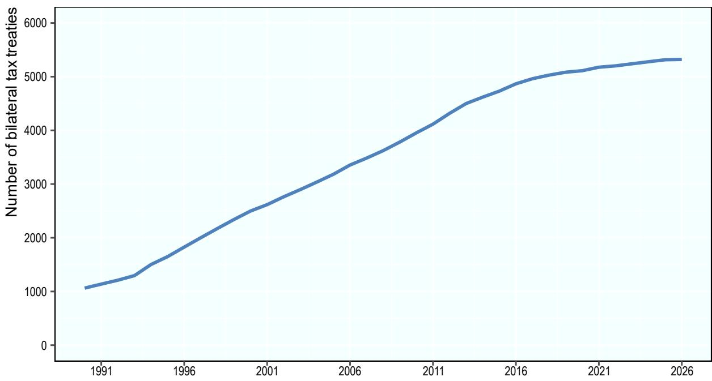  
Note: Data are based on bilateral treaties reported by all IF member jurisdictions and one non-IF jurisdiction. The database refers to bilateral tax treaties only. Multilateral agreements are not accounted for. Other tax-related agreements such as tax information exchange agreements are not counted. Only treaties in effect are counted.  
Source: OECD Bilateral Tax Treaties Database.

StatLink https://stat.link/lfat86

Treaty coverage continues to vary significantly across groups of jurisdictions. As shown in Figure 3.5, OECD countries maintain substantially larger treaty networks on average than jurisdictions in Africa and in LAC. In 2026, OECD members averaged around 70 treaties per jurisdiction, compared with fewer than 20 treaties on average in Africa and around 22 in LAC jurisdictions. Although all regional groupings have experienced sustained growth in their average number of tax treaties over time, the expansion has been most pronounced among OECD countries, further widening differences in treaty network density across regions.

Figure 3.5. Average number of bilateral tax treaties by region  
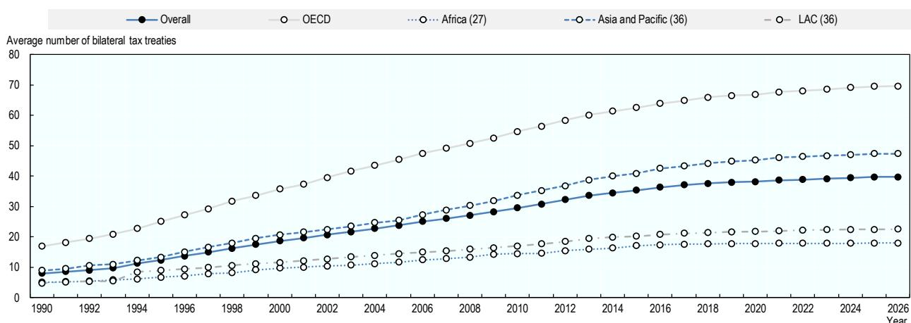  
StatLink https://stat.link/ht19nc

Treaty coverage also differs markedly across income groups. As illustrated in Figure 3.6, high-income jurisdictions maintain considerably denser treaty networks on average than other groups. In 2026, high-income jurisdictions averaged just under 54 treaties per jurisdiction, compared with around 31 among middle-income jurisdictions and fewer than 5 among low-income jurisdictions. Investment hubs show evidence of extensive treaty networks with almost 40 treaties per jurisdiction in 2026.

Figure 3.6. Average number of bilateral tax treaties by income group  
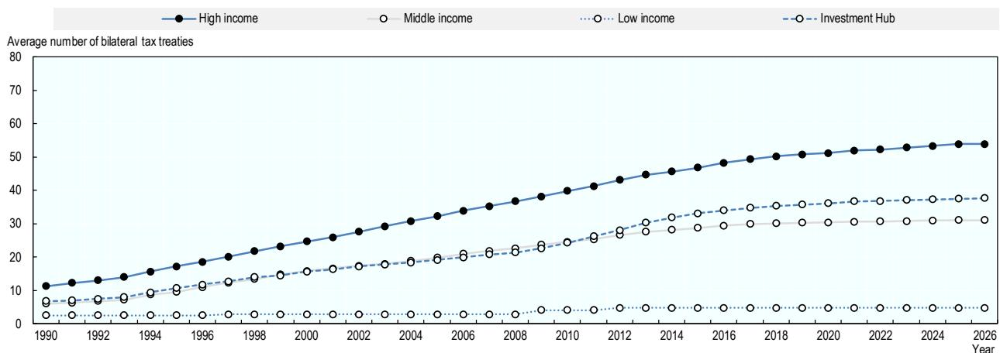  
Note: Data are based on bilateral treaties reported by all IF member jurisdictions. The database refers to bilateral tax treaties only. Multilateral agreements are not accounted for. Other tax-related agreements such as tax information exchange agreements are not counted. Only treaties in effect are counted.  
StatLink https://stat.link/2fto3p

Taken together, these trends underline both the maturity of the global tax treaty network and the evolving nature of treaty activity. While the overall number of treaties continues to increase, recent developments have focused increasingly on updating and adapting existing agreements rather than on the negotiation of entirely new conventions. The data also confirm that treaty-based withholding tax rates are, on average, substantially lower than rates applicable under domestic law, highlighting the continued central role of tax treaties in limiting source-based taxation on cross-border income and shaping effective withholding tax outcomes.

## References

Auerbach, A., M. Devereux and H. Simpson (2008), “Taxing corporate income”, https://www.nber.org/papers/w14494 (accessed on 18 February 2023).

OECD (2015), Measuring and Monitoring BEPS, Action 11 - 2015 Final Report, OECD/G20 Base [1] Erosion and Profit Shifting Project, OECD Publishing, Paris, https://doi.org/10.1787/9789264241343-en.

## Note

$^{1}$ Jurisdiction groups (high-, middle- and low-income) are based on the latest World Bank classifications. Investment hubs are defined as jurisdictions with an average total inward Foreign Direct Investment (FDI) position above 150% of gross domestic product (GDP) across the latest 3 years for which data is available.

## Key insights

\- The average EATR across the 105 jurisdictions covered in the database is 20.5%, which is 1.2 p.p. lower than the average STR (21.7%). The median EATR is 22.2%, which is 1.8 p.p. lower than the median STR (24.0%).

\- Over recent years, EATRs have remained relatively stable on average, with modest declines at the top and bottom of the distribution across countries. Average EATRs were 21.1% in 2019 and 20.5% in 2025, while median EATRs were 22.8% in 2019 and 22.2% in 2025. This may reflect the stabilisation of STRs discussed in Chapter 2, which are a key component of the EATRs.

\- Of the 105 jurisdictions covered for 2025, 90 provide accelerated depreciation, which results in Effective Average Tax Rate (EATRs) on investments in these jurisdictions below their statutory tax rate (STRs). Among those jurisdictions, the average reduction of the STR was 1.6 p.p. In contrast, fiscal depreciation was decelerated in 8 jurisdictions, leading to EATRs above the statutory tax rate.

\- Several Latin American and Caribbean (LAC) jurisdictions have EATRs at the higher end of the range due to the decelerating effect of their tax depreciation rules for acquired software (e.g., Colombia and Brazil).

\- Among all 105 jurisdictions, 6 jurisdictions had an allowance for corporate equity (ACE) leading to an additional reduction in their EATRs of between 0.2 to 4.5 p.p.

\- Disaggregating the results to the asset level shows that fiscal acceleration is strongest for investments in buildings and tangible assets. The average EATR across jurisdictions is 19.3% for buildings and 19.7% for tangible assets, lower than the average composite EATR (20.5%), which also includes acquired software and inventories. For the tangible asset category, which covers air, railroad and water transport vehicles, road transport vehicles, computer hardware, industrial machinery and equipment, most of this effect is driven by more generous tax depreciation rules for air, railroad and water transport vehicles, as well as for industrial machinery.

\- The average EMTR in 2025 across the 105 jurisdictions covered in the database is 20.0%, which is 0.5 p.p. lower than the average EATR (20.5%). The median EMTR is 16.6%.

\- In contrast to EATRs, the EMTRs have declined over recent years, with the average EMTR being 22.4% in 2019 and 20.0% in 2025.

\- 6 jurisdictions have either decreased the generosity of their tax depreciation rules or increased their statutory corporate income tax (CIT) rates, resulting in an increase in their EMTRs in 2025 compared to 2024; the largest increases were observed in Denmark (10.2 p.p.) and Italy (10.1 p.p.).

\- 6 jurisdictions recorded lower EMTRs in 2025, reflecting either more generous tax depreciation rules or reductions in statutory CIT rates; this group includes New Zealand (7.8 p.p.), the United States (6.6 p.p.) and Namibia (2.7 p.p.).

## Introduction

Variations in the definition of corporate tax bases across jurisdictions can have a significant impact on the tax burden associated with a given investment. Differences in fiscal depreciation rules and other structural features of corporate tax systems mean that comparisons based solely on statutory corporate income tax (CIT) rates do not fully capture the incentives created by tax policy. To assess how tax systems affect investment decisions, it is therefore necessary to complement statutory rate analysis with measures that incorporate key elements of the tax base.

This chapter presents data on forward-looking effective tax rates (ETRs) as included in the OECD Corporate Tax Statistics database. These synthetic indicators are calculated using detailed information on tax policy parameters and model the tax treatment of a hypothetical investment; they do not rely on firms' actual tax payments. The ETRs reported here capture the effects of fiscal depreciation rules and selected related provisions, such as allowances for corporate equity, half-year conventions and inventory valuation methods. While fiscal depreciation of certain acquired intangible assets is included, the baseline indicators do not incorporate the effects of expenditure-based R&D tax incentives or intellectual property regimes. Forward-looking ETRs reflecting the effects of R&D tax incentives on R&D investments are presented in the Chapter 5.

## Data characteristics

The Corporate Tax Statistics database contains four forward-looking tax policy indicators reflecting tax rules in 105 jurisdictions, as of 1 July, for the years 2017-2025:

• the effective average tax rate (EATR);

• the effective marginal tax rate (EMTR);

• the cost of capital;

\- the net present value of capital allowances as a share of the initial investment.

All four tax policy indicators are calculated by applying jurisdiction-specific tax rules to a prospective, hypothetical investment project. Calculations are undertaken separately for investments in different asset types and sources of financing (i.e., debt and equity). Composite tax policy indicators are computed by weighting over assets and sources of finance. More disaggregated results are also reported in the Corporate Tax Statistics database. This chapter discusses results for two indicators: the EMTR and the EATR. Detailed information on the key concepts and methodology used to calculate ETRs are contained in the Corporate Tax Statistics Explanatory Annex. $^{1}$

## Forward-looking corporate effective tax rates in 2025

## Effective average tax rates

EATRs reflect the average tax contribution a firm makes on an investment project earning above-zero economic profits. This indicator is used to analyse discrete investment decisions between two or more alternative projects (i.e. decisions along the extensive margin).

Figure 4.1 shows the composite EATR for the full database. In most jurisdictions, EATRs diverge from the statutory CIT rate; if fiscal depreciation is generous compared to true economic depreciation or if there are other significant base narrowing provisions, the EATR (and also the EMTR) will be lower than the statutory tax rate, i.e., tax depreciation is accelerated. On the other hand, if tax depreciation does not cover the full effects of true economic depreciation, it is decelerated, implying that the tax base will be larger and effective taxation higher.

To allow comparison with the statutory tax rate, the share of the EATR (in p.p.) that is due to a deceleration of the tax base is shaded in light blue in Figure 4.1; reductions of the STR due to acceleration are transparent. In addition, the reduction in the EATR due to an ACE is indicated as a dotted area.

Comparing the patterns of tax depreciation across jurisdictions shows that most jurisdictions provide some degree of acceleration, as indicated by the transparent bars. The most significant effects being observed in jurisdictions with an ACE, such as Malta, Poland, Portugal and Türkiye among others, as well as in jurisdictions with larger accelerated depreciation provisions, such as Canada, South Africa, the United Kingdom and the United States. While fewer jurisdictions have decelerating tax depreciation rules, the effect of deceleration can become large in jurisdictions where acquired software is non-depreciable (Botswana) or depreciable at a very low rate (e.g., in Argentina and to a lesser extent also in Mexico, Papua New Guinea and Peru).

Figure 4.1. Effective average tax rates, 2025  
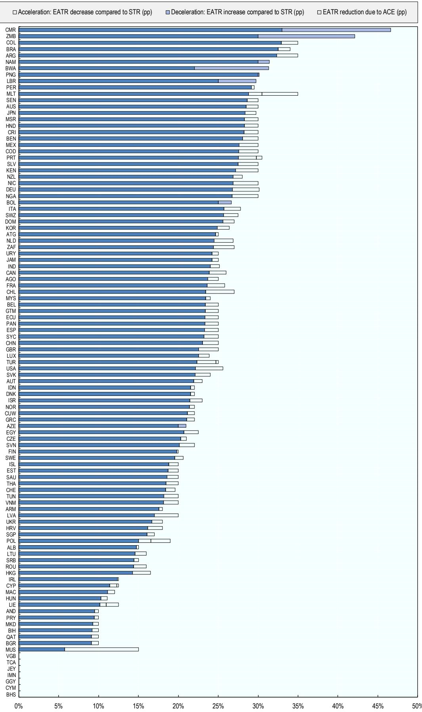

Note: The values of EATRs are calculated assuming a fixed inflation rate at 1% and fixed real interest rate at 3% and setting the pre-tax rate of return from investments at 20%. Additional parameters are outlined in the Effective Tax Rate (ETR) explanatory annex accompanying Corporate Tax Statistics. https://www.oecd.org/tax/tax-policy/explanatory-annex-corporate-tax-statistics.pdf. Note additional details on the modelling of ETRs for Poland and Saudi Arabia.

Poland: The value of ACE in Poland is capped at PLN 250 000 per tax year. The presence of caps or limitations on the use of ACEs are not captured on the ETR modelling. For taxpayers for which the cap is binding, the impact on ETRs of the ACE would be lower.

Saudi Arabia: The Kingdom of Saudi Arabia imposes a corporate income tax rate of 20% on a non-Saudi's share of a resident company or a non-resident's income from a permanent establishment in Saudi Arabia or income of a company operating in the natural gas sector. A higher corporate income tax rate is imposed as well on companies operating in the oil sector (i.e., 50% or higher). The Kingdom of Saudi Arabia also levies the Zakat on companies, which is an example of a tax on both income and equity. The Zakat is levied at 2.5% on a Saudi's share of a resident company (also applies to citizens of Gulf Cooperation Council countries with an established business in the Kingdom of Saudi Arabia), but since it is imposed on income and equity, it yields a higher rate in effective terms. The Saudi government considers the corporate Zakat as an equivalent to corporate income tax, levied on a different basis. It is also considered a covered tax for the purposes of the GloBE rules in the Pillar 2 Blueprint Report (OECD, 2020). For the calculation of the forward-looking ETRs, three different groups of taxpayers are considered: (i) foreign companies as well as domestic and foreign companies in the natural gas sector taxed at 20%, (ii) domestic and foreign companies in the hydrocarbon sector taxed at 50%, (iii) other domestic companies taxed through Zakat at 2.5%. The results for these three groups of taxpayers are weighted using the respective turnover shares as weights, i.e., 18.17% for group (i), 28.72% for group (ii) and 53.11% for group (iii). The composite EATR corresponds to the combination of the unshaded and shaded blue components of each bar.
Source: Corporate Tax Statistics Effective Tax Rates

StatLink https://stat.link/a402yk

## Effective marginal tax rates

EMTRs measure the extent to which taxation increases the pre-tax rate of return required by investors to break even. This indicator is used to analyse how taxes affect the incentive to expand existing investments given a fixed location (i.e. decisions along the intensive margin).

Figure 4.2 shows the ranking based on the composite EMTR. While the effects of tax depreciation and macroeconomic parameters work in the same direction as in the case of the EATR, their impacts on the EMTR will generally be stronger because marginal projects do not earn economic profits. Consequently, jurisdictions with relatively high statutory CIT rates and relatively generous capital allowances, notably Italy, the United Kingdom and the United States, rank lower than in Figure 4.1. On the other hand, jurisdictions with less generous fiscal depreciation rules, including Argentina, Japan, Papua New Guinea and Peru (as well as Botswana, Liberia, and Czechia), are ranked higher based on the EMTR than under the EATR.

Figure 4.2. Effective marginal tax rate, 2025  
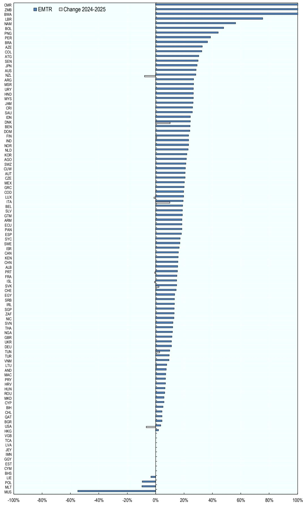

Note: The values of EMTRs are calculated assuming a fixed inflation rate at 1% and fixed real interest rate at 3% and setting the pre-tax rate of return from investments at 20%. The EMTR is computed using the tax exclusive definition. Additional parameters are outlined in the Effective Tax Rate (ETR) explanatory annex accompanying Corporate Tax Statistics. https://www.oecd.org/tax/tax-policy/explanatory-annex-corporate-tax-statistics.pdf.

StatLink https://stat.link/qys4hf

Where investment projects are financed by debt, it is also possible for the EMTR to be negative, which means that the tax system, notably through interest deductibility, reduces the pre-tax rate of return required to break even and thus enables projects that would otherwise not have been economically viable pre-tax to become viable post-tax. Figure 4.2 shows that the composite EMTR, based on a weighted average between equity- and debt-financed projects, is negative in 4 out of 105 jurisdictions; this result is due to the combination of debt finance with comparatively generous tax depreciation rules. For jurisdictions with an ACE, the composite EMTR will generally be lower because of the notional interest deduction available for equity-financed projects.

Comparing EMTRs in 2025 with the previous year shows that changes in the corporate tax provisions covered in the calculations had significant effects on EMTRs in several countries. As shown by Figure 4.2 six jurisdictions have either decreased the generosity of their tax depreciation rules or increased their statutory corporate income tax (CIT) rates, resulting in an increase in their EMTRs in 2025 compared to 2024; the largest increases were observed in Denmark (10.2 p.p.) and Italy (10.1 p.p.). On the other hand, six jurisdictions recorded lower EMTRs in 2025, reflecting either more generous tax depreciation rules or reductions in statutory CIT rates; this group includes New Zealand (7.8 p.p.), the United States (6.6 p.p.) and Namibia (2.7 p.p.).

## Effective tax rates by asset categories

The composite ETRs can be further disaggregated by asset categories; jurisdiction-level EATRs and EMTRs by asset categories are available in the online Corporate Tax Statistics database. Figure 4.3 summarises these data on ETRs by asset category. The upper panel provides more information on the distribution of asset-specific EATRs, comparing them to the distribution of statutory CIT rates. The first vertical line depicts information on the statutory CIT rates; it shows that the mean (i.e., the circle in the middle of the first vertical line) and the median (the light blue triangle) are around 21.7% and 24.0% respectively, while the middle 50% of jurisdictions in the distribution have statutory CIT rates between 18.0% and 27.5%.

The other four vertical lines in the upper panel of Figure 4.3 illustrate the distribution of EATRs across jurisdictions for each of the four asset categories: buildings, tangible assets, inventories and acquired software. Since there is more variation in economic and tax-related characteristics across tangible assets, this category summarises information on investments in several specific types of tangible assets, i.e., air, railroad and water transport vehicles, road transport vehicles, computer hardware, industrial machinery and equipment.

Figure 4.3. EATR and EMTR: Variation across jurisdictions and assets, 2025  
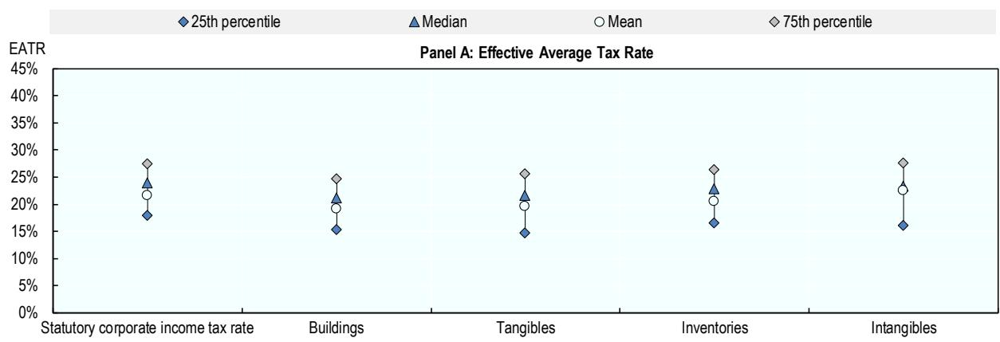

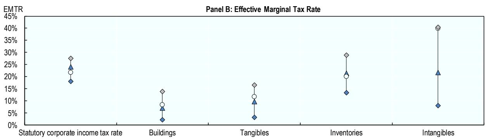  
Note: The values of EMTRs and EATRs are calculated assuming a fixed inflation rate at 1% and fixed real interest rate at 3% and setting the pre-tax rate of return from investments at 20%. The EMTR is computed using the tax exclusive definition. Additional parameters are outlined in the ETR explanatory annex accompanying Corporate Tax Statistics. https://www.oecd.org/tax/tax-policy/explanatory-annex-corporate-tax-statistics.pdf.

StatLink https://stat.link/lgx1qi

Comparing the four broader asset categories with the statutory CIT rate shows that the distribution of EATRs is more condensed for investments in buildings, with the middle 50% of the country distribution ranging between 15.4% and 24.8%. For investments in tangible assets, the middle 50% of jurisdictions have EATRs between around 14.8% and 25.6%. However, the mean EATR (19.7%) on investments in tangible assets is around 2.0 p.p. lower than the median (21.7%), indicating that some jurisdictions have much lower EATRs on this type of investment. For investments in the other two asset categories, the distributions are similar to the statutory tax rate.

The lower panel illustrates the EMTR distribution for each of the four broader asset categories. The following insights emerge from this graph.

\- Investments in buildings and tangible assets benefit more often from accelerated tax depreciation than other investments; as a result, the EMTRs are generally lower.

\- Investments in buildings have EMTRs ranging between 2.1% and 13.8% in half of the covered jurisdictions.

\- Investments in inventories often benefit from lower EMTRs, compared to the statutory tax rate, although to a lesser extent than the first two asset categories.

\- The tax treatment of investments in acquired software is subject to more variation across jurisdictions, which is reflected in the vertical line that ranges from around 8.0% to around 40.3%.

## Corporate effective tax rate trends

## Effective average tax rates

Between 2017 and 2025, average EATRs have tended to decline modestly. Looking at the development of the composite EATR from 2017 and 2025, the unweighted average composite EATR has declined modestly over this period (1.0 p.p.), from 21.5% in 2017 to 20.5% in 2025. The average STR has declined slightly less over the same time period (0.8 p.p.), from 22.0% in 2017 to 21.2% in 2025, implying that changes to the corporate tax base have also contributed to the reduction in EATRs as well as reductions in the headline rates.

The distribution of EATRs has shifted slightly downwards between 2017 and 2025. Figure 4.4 shows the evolution of different points of the EATR distribution over time. The median represents the EATR of the jurisdiction that lies in the middle of the distribution, 50% of jurisdictions have EATRs above this value. The 25th percentile is the value at or below which 25% of observations lie, and the 75th percentile is the value at or below which 75% of observations lie. The median EATR has decreased over the period, with a rate of 22.8% in 2017 and 22.2% in 2025, The top and bottom of the distribution have also reduced from 28.0% and 16.2% in 2017 to 26.7% and 16.1% in 2025.

Changes to the distribution of the EATR can be attributed to the decline over time in statutory CIT rates and to various base reforms. However, from 2021 to 2025 EATRs have remained largely stable with an average value of 20.5% in 2024 and 2025.

Figure 4.4. Changing distribution of corporate effective average tax rates, 2017-2025  
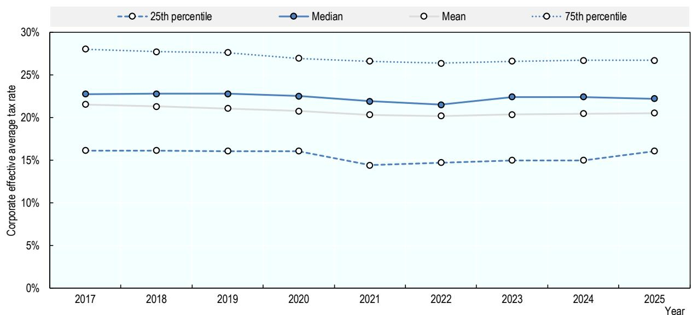  
Note: The values of EATRs are calculated assuming a fixed inflation rate at 1% and fixed real interest rate at 3% and setting the pre-tax rate of return from investments at 20%. Additional parameters are outlined in the ETR explanatory annex accompanying Corporate Tax Statistics. https://www.oecd.org/tax/tax-policy/explanatory-annex-corporate-tax-statistics.pdf.  
StatLink https://stat.link/peavh9

A comparison of Figure 4.4 and Figure 4.5 suggests that changes in EATRs over 2017–2025 have not been uniform across asset types or across the distribution. The aggregate pattern points to a modest decline in EATRs, particularly in the upper part of the distribution, but this masks important differences by asset category.

At the overall level, the 25th percentile shows only limited movement over time, dipping slightly around 2021 before returning close to its initial level by 2025. However, disaggregated results indicate that this relative stability is driven largely by buildings and tangible assets, where the lower end of the distribution remains broadly constant throughout the period. In contrast, intangibles and inventories exhibit more pronounced fluctuations in their lower quartiles, including a noticeable dip around 2021 followed by a recovery by 2025.

More substantial changes are visible at the top of the distribution. For the overall EATR, the 75th percentile declines steadily from 2017 to around 2022, before stabilising thereafter. This downward movement is mirrored for buildings, tangible assets, and intangibles, suggesting a gradual reduction in higher-end tax burdens across several asset types. By contrast, inventories show a less uniform pattern: although there is a drop up to 2023, values rise again towards 2025, indicating some renewed dispersion at the upper end.

The median generally follows a mild downward trajectory across both the aggregate and most asset categories, with a dip around 2021–2022 and a partial rebound afterwards. Despite these fluctuations, the overall evolution of EATRs across asset groups broadly tracks changes in statutory tax rates, with movements in the central and upper parts of the distribution being more pronounced than at the lower end. Overall, the evidence points to a gradual compression of the EATR distribution driven mainly by declines at the top, while developments at the lower end are more heterogeneous and depend on the specific asset type.

Figure 4.5. Changing distribution of EATRs by assets, 2017-2025  
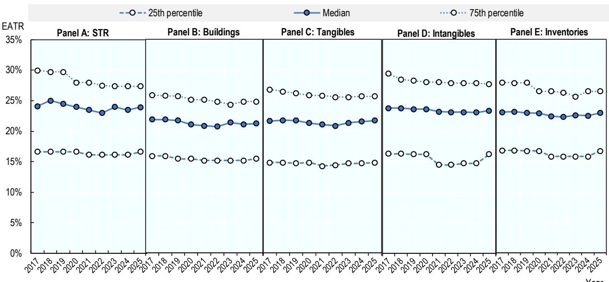  
Note: The values of the EATRs are calculated assuming a fixed inflation rate at 1% and fixed real interest rate at 3% and setting the pre-tax rate of return from investments at 20%. Additional parameters are outlined in the ETR explanatory annex accompanying Corporate Tax Statistics. https://www.oecd.org/tax/tax-policy/explanatory-annex-corporate-tax-statistics.pdf.

StatLink https://stat.link/753scn

## Effective marginal tax rates

Figure 4.6 shows that the distribution of EMTRs saw a general downward trend between 2017 and 2025 with a slight increase from 2024 to 2025. The median EMTR has dropped from 18.4% in 2017 to 16.6% in 2025, while at the top and bottom of the distribution the 75th and 25th percentile dropped from 27.7% and 7.4% respectively in 2017 to 24.3% and 7.4% in 2025. The average EMTRs have fallen from 23.7% in

2017 to 20.0% in 2024, although there was an increase from 18.3% in 2022. This latter increase is mainly due to increases in the EMTR for Italy and the United Kingdom.

Figure 4.6. Changing distribution of corporate effective marginal tax rates, 2017-2025  
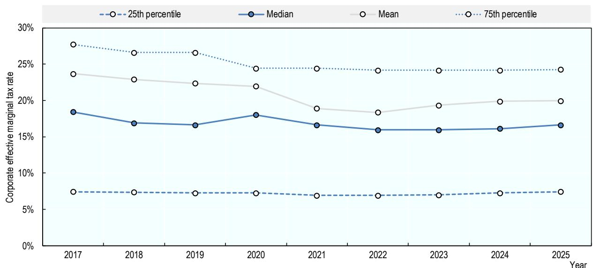  
Note: The values of EMTRs are calculated assuming a fixed inflation rate at 1% and fixed real interest rate at 3% and setting the pre-tax rate of return from investments at 20%. The EMTR is computed using the tax exclusive definition. Additional parameters are outlined in the ETR explanatory annex accompanying Corporate Tax Statistics. https://www.oecd.org/tax/tax-policy/explanatory-annex-corporate-tax-statistics.pdf.

StatLink https://stat.link/n0q16b

Figure 4.7 shows the distribution of EMTRs disaggregated by asset types and over time. The dispersion of EMTRs is particularly marked for acquired intangibles (Panel D), reflecting differences in the fiscal depreciation provisions applicable to acquired software across jurisdictions. Several jurisdictions offer very stringent depreciation rules, and in some cases acquired software is non-depreciable, which can push EMTRs towards or above statutory rates. Notably, the dispersion of EMTRs for tangible assets has tended to decline modestly over time, particularly at the upper end of the distribution.

Figure 4.7. Changing distribution of EMTRs by assets, 2017-2025  
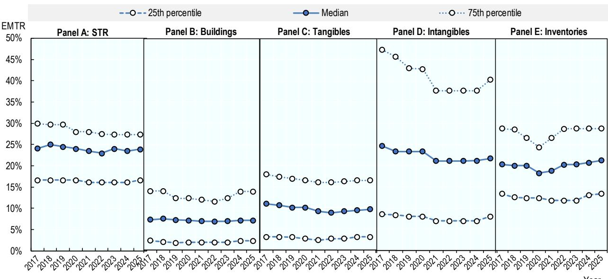  
Note: The values of EMTRs are calculated assuming a fixed inflation rate at 1% and fixed real interest rate at 3% and setting the pre-tax rate of return from investments at 20%. The EMTR is computed using the tax exclusive definition. Additional parameters are outlined in the ETR explanatory annex accompanying Corporate Tax Statistics. https://www.oecd.org/tax/tax-policy/explanatory-annex-corporate-tax-statistics.pdf

StatLink https://stat.link/6ac1fe

When comparing the distribution of disaggregated EMTRs with that of EATRs, the former, as depicted in Figure 4.7, exhibits greater heterogeneity both within and between asset categories. While EATRs remain relatively clustered across assets and close to statutory tax rates, EMTRs vary substantially by asset type. The figure shows that over the period of analysis, the EMTR applicable to investments in buildings and tangible assets, is consistently well below the STR, while EMTRs on inventories are closer to statutory rates. The median EMTR for buildings remains below 10% throughout 2017–2025, and that for tangible assets declines to around or slightly below this level, compared to a median STR of around 25%. This contrast reflects that baseline CIT systems tend to provide generous fiscal depreciation for these asset types, thereby significantly reducing the cost of capital (a key element in the derivation of the EMTR) and reducing the effective tax burden on investments at the intensive margin.

Changes in the distribution of EMTRs by asset type highlight the effects of certain tax reforms. Whereas Figure 4.6 shows a drop in the average EMTR between 2020 and 2021, the disaggregated evidence indicates that this decline was neither uniform across asset groups nor within their respective distributions. Panel C suggests that part of the decrease was driven by a reduction in the tax burden on marginal investments in tangible assets, particularly for jurisdictions at the upper end of the distribution, such as Italy and the United Kingdom, where EMTRs for tangible assets fell markedly. A similarly pronounced, but more broad-based, decline is observed for acquired intangibles, with EMTRs decreasing across the distribution between 2020 and 2021. Over the same period, EMTRs applicable to inventories remained broadly stable. By contrast, the median EMTRs for buildings, intangibles and tangible assets all declined, albeit to varying extents.

## Note

$^{1}$ The tax policy indicators are calculated for two different macroeconomic scenarios. Unless noted, the results reported in this publication refer to composite effective tax rates based on the macroeconomic scenario with 3% real interest rate and 1% inflation.

# Tax incentives for research and development

## Key insights

\- Both income and expenditure-based tax incentives for research and development (R&D) are increasingly used to promote business R&D. Expenditure-based incentives are widely used; with 33 out of the 38 OECD jurisdictions offering tax relief on R&D expenditures in 2025, compared to 19 in 2000. Income-based incentives are slightly less widely offered; with 21 OECD countries providing these incentives, an increase from 4 in 2000.

\- Most jurisdictions use a combination of direct support and tax relief to support business R&D, but the policy mix varies. Over time, there has been a shift towards a more intensive use of expenditure-based R&D tax incentives to deliver financial support for business R&D. Income-based incentives are often used together with expenditure-based incentives. With the exception of Luxembourg, every country with an income-based incentive also has an expenditure-based incentive.

\- The effective average tax rate (EATR) for R&D incorporating expenditure-based tax incentives in 2025 was lowest in Ireland, Poland and Lithuania, providing greater tax incentives for firms to locate R&D investment in these jurisdictions. Across the 55 jurisdictions covered in the baseline scenario, the average EATR was 14.0%, compared with 21.5% under the standard tax treatment. This corresponds to a reduction of 7.5 percentage points, or 34.8%, in the EATR for R&D.

\- The cost of capital for R&D in 2025 incorporating expenditure-based tax incentives was lowest in Portugal, Poland and Peru where these jurisdictions provide greater tax incentives for firms to increase their R&D investment. The average across the 55 jurisdictions covered in the baseline scenario was 0.2%, or 2.9 percentage points below the standard tax treatment.

\- The effective average tax rate (EATR) for R&D incorporating income-based tax incentives in 2025 was lowest in Malta, Viet Nam and Israel. The average across the 55 jurisdictions covered in the baseline scenario was 11.8%, or 7.9 percentage points below the standard tax treatment.

\- The cost of capital for R&D in 2025 incorporating income-based tax incentives was lowest in Malta, India and Israel. The average across the 55 jurisdictions covered in the baseline scenario was 3.8%, or 0.4 percentage points below the standard tax treatment.

\- While the income-based and expenditure-based models are not directly comparable, these indicators highlight that expenditure-based incentives provide a relatively greater impact on the cost of capital compared to income-based incentives.

\- R&D tax incentives have become more generous, on average, over time. This is due to the higher uptake and increased generosity of R&D tax relief provisions. While this trend stabilised between 2013 and 2019, an increase in generosity is again observed from 2020 and maintained through to 2025. The generosity of income-based incentives has increased over time but has remained more stable since 2019.

## Introduction

Governments widely use tax incentives to encourage business investment in research and development (R&D) and innovation. Over recent decades, R&D tax incentives have become a central element of innovation policy in many jurisdictions, complementing direct support measures such as grants and government procurement of R&D services.

Expenditure-based tax incentives provide relief based on eligible R&D expenditures — such as enhanced deductions or tax credits for qualifying outlays — while income-based tax incentives seek to reduce the taxation of income arising from qualifying intangible assets resulting from R&D and related activities. They do so by applying a preferential tax rate to income derived from certain types of R&D-related intangibles. Income-based support may be targeted solely to income from intellectual property (IP) assets or may extend to both IP income and certain other forms of non-IP income under dual category regimes.

This chapter presents internationally comparable indicators on expenditure-based and income-based tax incentives included in the OECD Corporate Tax Statistics database. These indicators, developed by the OECD Centre for Tax Policy and Administration (CTPA) in collaboration with the OECD Directorate for Science, Technology and Innovation (DSTI), capture the implied generosity of R&D tax relief provisions, which vary significantly across jurisdictions in their design, eligibility criteria and treatment of loss-making firms. The income-based indicators cover IP and dual category regimes and provide insights into the design of tax incentives for innovation-related income. Taken together, these measures support the analysis of how tax systems incentivise R&D and innovation across jurisdictions and over time.

## Data characteristics

The Corporate Tax Statistics database incorporates two sets of R&D tax incentives indicators that offer a complementary view of the extent of R&D tax support provided through expenditure-based R&D tax incentives. A third set of indicators focus on income-based R&D tax incentives.

The first set of indicators reflects the cost of expenditure-based tax incentives to the government:

\- Government tax relief for business R&D (GTARD) includes estimates of foregone revenue (and refundable amounts) from national and subnational incentives, where applicable and relevant data are available. This indicator is complemented with figures on direct funding of business R&D to provide a more complete picture of total government support to business R&D investment. Both indicators, compiled by the OECD DSTI, are available for 46 jurisdictions – all OECD jurisdictions and 8 partner economies – for the period 2000-2024.

The second set of indicators are synthetic tax policy indicators that capture the effect of expenditure-based R&D tax incentives on firms' investment costs. These indicators are available for 55 jurisdictions, including all OECD members for the period 2019-2025.

\- The EATR for R&D measures the impact of taxes on R&D investments earning an economic profit.

\- The user cost of capital for R&D measures the return that a firm needs to realise on an R&D investment before tax to offset all costs and taxes that arise from the investment, making zero economic profit.

\- Implied marginal tax subsidy rates for R&D, calculated as 1 minus the B-Index, reflect the design and implied generosity of R&D tax incentives to firms for an extra unit of R&D outlay. The B-Index, available for the period 2000-25, captures the extent to which different tax systems reduce the effective cost of R&D.

The third set of indicators are also synthetic tax policy indicators but they capture the effect of income-based R&D tax incentives on firms' investment costs. These indicators are available for 55 jurisdictions, including all OECD members for the period 2000-2025.

\- The EATR and the user cost of capital for R&D incorporating income-based tax incentives.

The indicators of EATRs and cost of capital for R&D in this chapter extend the corporate ETRs shown in the previous chapter to include internally generated R&D assets, i.e., those that are the result of a firms' own R&D. $^{1}$ These indicators, jointly developed by the OECD CTPA and the OECD DSTI, refer to large businesses who are able to fully utilise their tax benefits. Large companies account for the bulk of the R&D in most OECD countries (OECD, 2025 $^{[1]}$ ; Dernis et al., 2019 $^{[2]}$ ). The B-Index, by contrast, covers a wider range of firm scenarios (SMEs; large firms; profit and loss-making).

## Box 5.1. Three complementary indicators of the generosity of R&D tax support

The cost of capital, the B-Index and the EATR are conceptually linked and rely on the same modelling of R&D tax incentives. As indicators of the cost of R&D for a marginal unit of R&D outlay, the B-Index and cost of capital are used in the economic literature to assess firms' R&D investment decisions at the intensive margin, e.g., how much to invest in R&D.

The B-Index offers a way of comparing the generosity of R&D tax incentives in reducing the upfront investment cost of an R&D investment while abstracting from the financing of the investment. By focussing on the tax component of the cost of capital, the B-index does not require assumptions on the depreciation rate of R&D, which is typically difficult to measure, and directly displays the variation in the tax treatment induced by R&D tax incentives.

The cost of capital complements and extends the B-Index indicator by accounting for additional costs and taxes relevant to the R&D investment. Since the cost of capital can in principle account for a variation in economic depreciation across assets and financing options, it also facilitates the analysis of different types of R&D projects. Finally, the cost of capital is also a stepping-stone in the calculation of the EATR.

The EATR complements previous indicators by capturing the effect of taxation on profitable investments. This makes the EATR the relevant indicator to assess of investment decisions at the extensive margin (where or whether to invest in R&D).

Together, the three indicators offer a complementary set of indicators to assess the impact of taxation on firms' R&D investment decisions.

Source: González Cabral, Appelt and Hanappi. (2021[3])

## Indicators of R&D tax incentives 2025 (or latest available year)

## Expenditure-based tax incentives

## Government support for business R&D

Indicators of government tax relief for business R&D combined with data on direct R&D funding provide a holistic picture of governments' efforts to support business expenditure on R&D (BERD). Together, these indicators facilitate the cross-jurisdiction comparison of the policy mix provided by governments to support R&D and the monitoring of any changes over time.

Figure 5.1. Direct government funding and expenditure-based tax support for business R&D (BERD), 2024  
As a percentage of gross domestic product (GDP)  
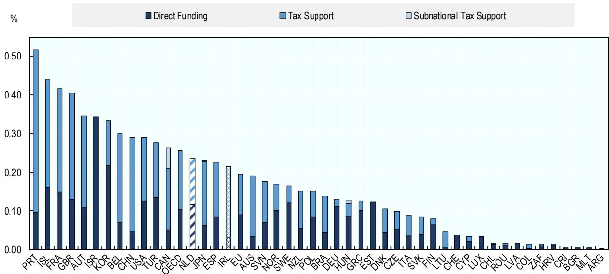  
\* Data on subnational tax support not available  
Data and notes: R&D Tax Incentives Database. Time series data available for 2000-2024.  
Source: OECD (2026), OECD R&D Tax Incentives, June 2026, (accessed in June 2026).

StatLink https://stat.link/v8h2xy

Iceland, Portugal and France provided the largest levels of support in 2024 (Figure 5.1.). Subnational R&D tax incentives accounted for 25% and 21% of total tax support in Canada and Hungary in 2024, while playing a much smaller role in Japan (0.2%). Most jurisdictions integrate both direct and indirect forms of R&D support in their policy mix, but to different degrees. In 2024, 21 OECD jurisdictions offered more than 50% of government support for business R&D through the tax system, and this percentage reached 75% or more in six OECD jurisdictions: Australia, Belgium, Colombia, Ireland, Lithuania and Portugal. Five OECD jurisdictions relied solely on direct support in 2024. These are Costa Rica, Israel, Latvia, Luxembourg and Switzerland.

## Incentives at the extensive margin

Comparing the EATRs for R&D investments across jurisdictions including expenditure-based tax incentives provided by the tax system for the location of profitable R&D investments (Figure 5.2, Panel A). The lowest EATRs for R&D investments carried out by large firms are observed in Ireland, Poland and Lithuania, while the highest EATRs for R&D are observed in Argentina, Costa Rica and Colombia. Estimates of the EATR are typically lower for jurisdictions with lower STRs or more generous provisions affecting the tax base, including both standard tax provisions and those specific to R&D investments.

To assess the preferential tax treatment for R&D investments in relation to other investments, it is useful to calculate the EATR for a comparable investment to which expenditure-based R&D tax incentives do not apply. Where available, expenditure-based R&D tax incentives decrease the effective cost of R&D and reduce firms' EATRs, as shown in Panel A by the fact that the diamonds lie lower than the circles. The extent of the reduction, shown in Figure 5.2 Panel B, is explained by the generosity of the expenditure-based R&D tax incentives in each jurisdiction, which is closely linked to the design of these provisions.

This figure includes only the impact of tax provisions in supporting R&D: modest reductions, as in Sweden or the United States, may reflect a higher reliance on direct forms of government support for R&D.

By taking the difference between the two EATRs, it is possible to gauge the preferential expenditure-based tax treatment offered to R&D in a given jurisdiction, in isolation from baseline tax provisions available to all types of investments. Within each country, Poland offers the most generous preferential tax treatment for R&D investments, followed by Lithuania and Portugal. The absence of bars, as in Costa Rica or Luxembourg, indicates that no preferential expenditure-based tax treatment for R&D is available in the jurisdiction relative to other investment types.

Figure 5.2. The effective average tax rate for R&D including expenditure-based tax incentives, 2025  
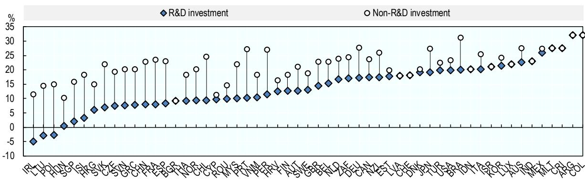  
Panel B

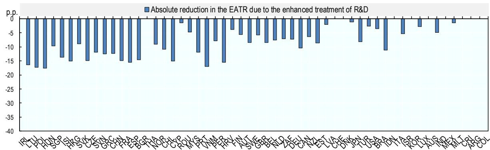  
Note: Results refer to a macroeconomic scenario 3% real interest rate and 1% inflation and refer to an investment financed by retained earnings including the effect of allowances for corporate equity where available. In the non-R&D case, the EATRs lie close to the statutory tax rate (STR) due to the large current component in the R&D investment (see Box 5.1), except when an allowance for corporate equity is available.  
StatLink https://stat.link/sza7ol

## Incentives at the intensive margin

Once established in a given location, firms decide upon the level of investment with reference to tax provisions that affect the intensive margin. The cost of capital for R&D is one relevant indicator of tax incentives at the intensive margin (see Figure 5.3). Across the jurisdictions considered Portugal, Poland and Peru are the jurisdictions providing greater incentives through the tax system to increase the volume of R&D. Among jurisdictions offering R&D tax support, estimates of the cost of capital for R&D are highest in Denmark, Korea and Mexico. Estimates of the cost of capital for R&D capture both the variability in standard tax provisions and those specific to R&D investments. R&D tax incentives reduce the cost of capital, with the extent of the reduction being affected by the generosity of R&D tax incentives. The absolute difference between the cost of capital for an R&D investment and a comparable non-R&D investment provides a within-country indication of the magnitude of R&D tax relief to marginal R&D investments, net of the standard tax treatment available to all investments. This allows the preferential tax treatment for R&D to be isolated. The largest reductions in the cost of capital for R&D investments are observed in Portugal, Poland and Peru, which are among the jurisdictions with the lowest cost of capital estimates.

Figure 5.3. The cost of capital for R&D, 2025  
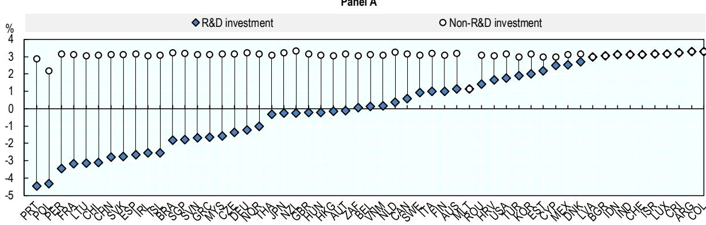

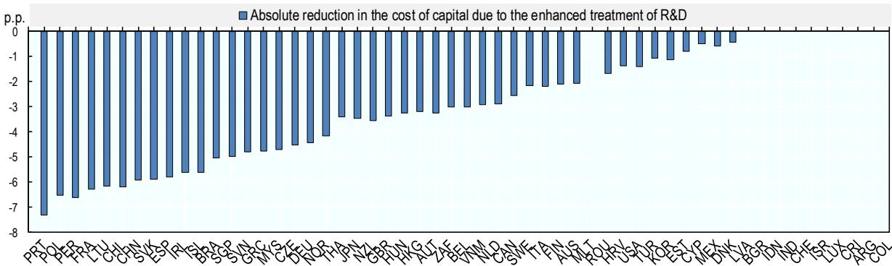  
Note: Results refer to a macroeconomic scenario incorporating a 3% real interest rate and a 1% inflation rate and refer to an investment financed by retained earnings including the effect of allowances for corporate equity where available. In the non-R&D case, the cost of capital lies close to the real interest rate due to the large current component in the R&D investment (see Box 5.1), except when an allowance for corporate equity is available.

StatLink https://stat.link/sxlu3q

## The heterogeneity of implied R&D tax subsidy rates

R&D tax benefits may vary with business characteristics such as firm size and profitability. Implied marginal tax subsidy rates for R&D, based on the B-Index indicator (1-B-Index), provide a synthetic indicator of the expected generosity of the tax system towards an extra unit of a firm's R&D investment (Figure 5.4). The more generous the R&D tax incentive is, the greater the value of the implied tax subsidy. This indicator shows differences in tax benefits between large and SMEs and firms in profit and loss-making positions. In jurisdictions, such as Australia or Canada, that offer enhanced tax relief provisions for SMEs that are not available to large firms, the indicator shows the difference in the implied subsidies offered to each firm type.

Figure 5.4. Implied marginal tax subsidy rates on business R&D expenditures, 2025  
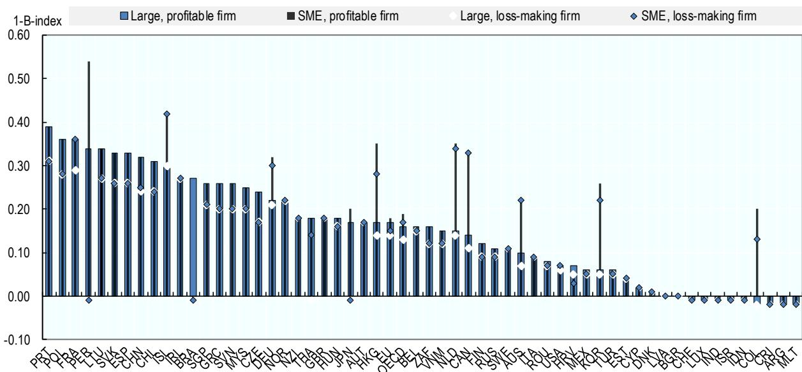  
Note: Data and notes: R&D Tax Incentives Database. Modelling assumes a nominal interest rate of 10%. Source: OECD (2026), OECD R&D Tax Incentives, June 2026, (accessed in June 2026).

StatLink https://stat.link/u8spe4

Refunds and carry-over provisions are common means of promoting R&D in firms that would not otherwise be able to utilise the support provided by the tax system. This may arise when firms do not have sufficient tax liability to offset earned deductions or do not draw a profit. Implied marginal subsidy rates are calculated under two scenarios: profitable firms (which are able to fully utilise the tax support available to them) and loss-making firms (which may not be able to fully utilise the tax support available to them) to reflect the varying impact of these provisions. Refundability provisions such as those available in Austria and Norway align the subsidy for profitable and loss-making firms. Compared to refunds, carry-over provisions, such as those available in Spain or Portugal, imply a lower subsidy for loss-making firms compared to profitable firms as the benefits may only be used in the future. In jurisdictions where no such provisions exist, such as Brazil or Japan, loss-making firms experience a full loss of tax benefits.

## Income-based tax incentives

Income-based tax incentives for R&D and innovation feature in the policy mix of many OECD and IF member countries. In 2025, 21 out of 38 OECD countries offer income-based tax incentives to R&D and innovation, representing a substantial increase from 4 countries in 2000. With the exception of Luxembourg, all of these countries offer income-based tax incentives together with expenditure-based tax incentives outlined in the previous section such as R&D tax credits.

## Incentives at the extensive margin

This section develops EATRs for an investment in an internally generated R&D intangible asset including income-based tax incentives. This indicator provides insights into the role of income-based tax incentives in affecting the location of the intangible profitable R&D investments.

At the sample average, income-based tax incentives reduce the overall tax liability that the firm faces on an R&D investment substantially, with significant variation across countries (see Figure 5.5). EATRs fall from an average of EATR of 19.7% without support to an EATR of 12.1% including income-based tax incentives. Income-based tax incentives imply a reduction in the EATR by 7.6 percentage points on average, or a reduction of 39%.

The EATR for an income-tax-incentive-supported internally generated R&D investment intangible asset ranges from -9% to 31% across the countries considered. In the absence of income-based support the rates would vary from 8% to 31%. Among the countries considered, the lowest EATRs are observed in Malta, Israel and India, while the highest rates are observed in Brazil, Germany and Colombia. Countries with the lowest EATR tend to offer the greatest tax-related incentives to investments in internally generated intangibles.

## Figure 5.5. EATR for internally generated R&D intangibles, 2025

Estimates of the implied tax subsidy from Income-based tax incentives, inframarginal investments (EATR)  
Panel A  
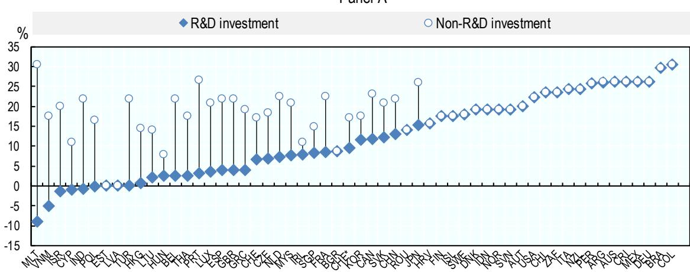

Panel B  
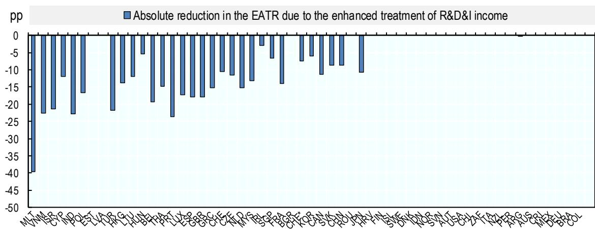  
StatLink https://stat.link/3tk4yz  
Note: The estimates consider an R&D investment with a gestation lag of two years after which the intangible asset starts generating profits. Baseline refers to an equivalent investment that does not benefit from income-based tax support. Preferential tax treatment is obtained by the difference between the cost of capital including income-based support and the baseline. The results assume all IP income qualifies for relief. CHE assumes that the firm has sufficient other income (non-qualifying IP or non-IP income) that is taxed at higher rates so that it is not subject to the 70% maximum relief limitation. CHE\* assume that the maximum relief limitation is binding.

## Incentives at the intensive margin

This section develops the cost of capital for an investment in an internally generated R&D intangible asset, providing insights into the intensive margin of investment decisions. Unlike EATRs, the cost of capital captures how income-based tax incentives affect the scale of marginal R&D investment within a given location. Figure 5.6 shows that such incentives reduce the cost of capital for R&D investments slightly, with R&D projects facing costs of 3.8% compared to 4.2% for non-R&D investments, implying a modest average reduction of 0.4 p.p. Compared to expenditure-based tax incentives, this shows that income-based tax incentives play a much smaller role in incentivising R&D investments at the margin.

There is substantial variation across countries. The largest reductions are observed in Malta, India and Israel, where preferential regimes significantly lower marginal investment costs, while in many jurisdictions the cost of capital is unchanged, indicating no preferential treatment at the margin. Overall, the cost of capital for R&D investments ranges from 0.9% to 5.1%, whereas non-R&D costs are tightly clustered around 4.1 to 4.3%.

Figure 5.6. The cost of capital for internally generated R&D intangibles, 2025  
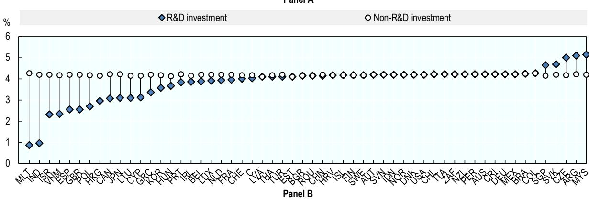

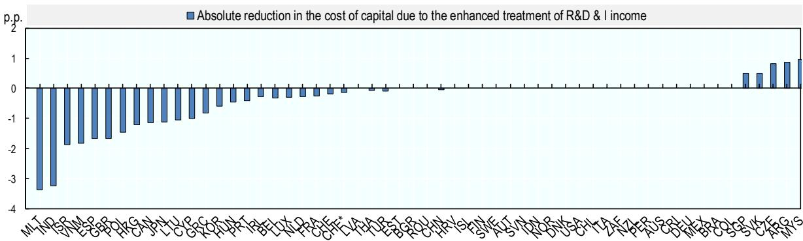  
Note: The estimates consider an R&D investment with a gestation lag of two years after which the intangible asset starts generating profits. Baseline refers to an equivalent investment that does not benefit from income-based tax support. Preferential tax treatment is obtained by the difference between the baseline and the cost of capital including income-based support. The results assume all IP income qualifies for relief. CHE assumes that the firm has sufficient other income (non-qualifying IP or non-IP income) that is taxed at higher rates so that it is not subject to the 70% maximum relief limitation. CHE\* assumes that the maximum relief limitation is binding.
Source: OECD Effective Tax Rates for R&D

## R&D tax incentives trends

## Expenditure-based tax incentives

The EATR for R&D including expenditure-based tax incentives has modestly declined over time and while preferential tax treatment has increased compared to 2019, recent years show signs of stabilisation and even small declines in recent years. Figure 5.7 displays average changes to the EATR over time. Consistent with the trends outlined in the baseline effective average tax rate (EATR) (Chapter 4), the EATR in the absence of R&D tax incentives have tended to modestly decline over the period covered. A similar but more substantial trend is observable for the EATR once expenditure-based R&D tax incentives are included. The EATR for R&D declined from an average of 15.3% in 2019 to 13.8% in 2020 increasing slightly to 14.0% in 2025. Changes over time in the EATR for R&D are due to first time introductions of expenditure-based incentives (Germany and Denmark in 2020, Finland 2021 or Cyprus in 2022) or changes to the generosity of R&D tax incentives (the Slovak Republic in 2020 and 2022, Italy in 2021 or Poland in 2022). In 2025, expenditure-based R&D tax incentives reduce the average EATR by 34.8%, from 21.5% to 14.0%. Over time, preferential tax treatment has increased between 2019 and 2020 and remained relatively stable between 2020 and 2025.

Figure 5.7. Changing distribution of the average EATR for R&D, 2019-2025  
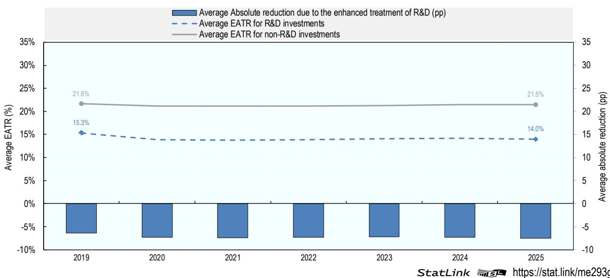

Tax incentives significantly reduce the cost of capital for R&D and while preferential tax treatment has increased since 2019, recent years show a more stable trend. Figure 5.8 compares the evolution of the cost of R&D capital during the period 2019-2025. Similar to the EATR, the cost of capital is affected by changes in the availability of R&D tax incentives and their design. The cost of R&D capital showed a significant decline from an average of 0.6% in 2019 to 0.2% in 2020. Since 2020, implied tax subsidies have remained relatively stable, with slight decreases in 2022 and 2023 followed by a modest increase in 2025. Tax incentives reduced the cost of R&D capital by 92% in 2024 and by 95% in 2025.

Figure 5.8. Changing distribution of the average cost of R&D capital, 2019-2025  
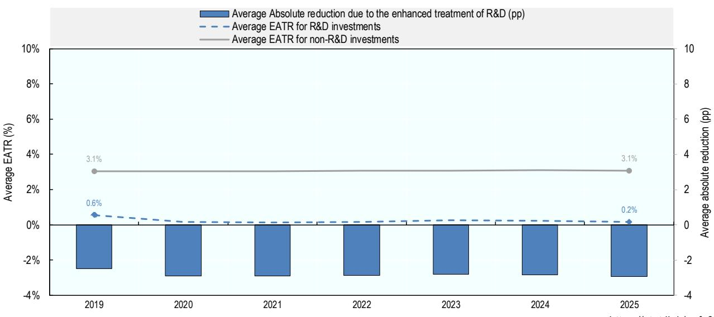

R&D tax incentives are, on average, more generous for SMEs and profit-making firms. Figure 5.9 offers an overview of the evolution of implied marginal tax subsidy rates across four categories of firms over the period 2000-2025: SMEs and large firms, each in profit or loss. The generosity of expenditure-based R&D tax incentives rises over time for all firm types. Although between 2013 and 2019 subsidy rates had stabilised, a marked step increase is observed in 2020.

In the most recent years, the data suggest a temporary dip following the 2020 peak in the generosity of support—particularly between 2021 and 2023—followed by a moderate recovery through 2024 and 2025, rather than a sustained decline. Over the entire period, subsidy rates remain consistently higher for SMEs than for large firms under both profit scenarios, and higher for profit-making firms than for loss-making firms across both size classes. This pattern indicates that jurisdictions systematically provide more generous tax support to SMEs and to firms able to benefit immediately from tax relief.

The evolution of the data depicted in Figure 5.9 also reflects heterogeneity in the magnitude of year-on-year changes. The largest increases in implied marginal tax subsidy rates occurred between 2007-2008, at the time of the financial crisis, (an increase of 2.0 p.p. throughout all four categories) and 2019-2020 (2.4 p.p. on average), at the time of the COVID pandemic.

Figure 5.9. Evolution of the implied marginal tax subsidy rates R&D, 2000-2025  
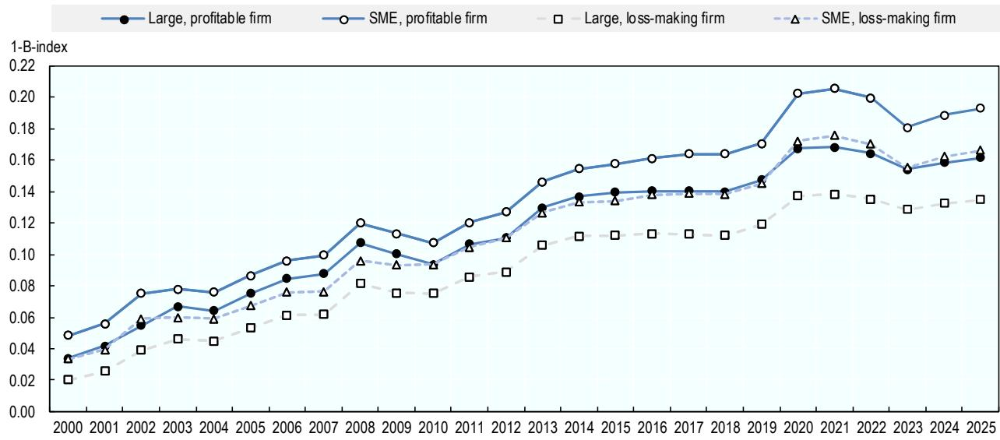  
Note: Data and notes: R&D Tax Incentives Database. Modelling assumes a nominal interest rate of 10%. Source: OECD (2026), OECD R&D Tax Incentives, June 2026, (accessed in June 2026).

StatLink https://stat.link/h8lykj

## Income-based tax incentives

The average taxation of internally generated R&D assets has continuously declined over the past two decades, and increasingly so when income-based tax incentives are taken into account. As shown in Figure 5.10, the average EATR on internally generated R&D intangibles has fallen in the OECD area from $23.5\%$ in 2000 to $12.4\%$ in 2025. The decline stabilises after 2019 and has only been temporarily reversed in three instances; once in 2016 coinciding with the introduction of the BEPS Action 5 minimum standard and in 2022 due to the repeal of an income-based tax incentive in Italy. These trends have to be interpreted in the context of the global fall in STRs, that has led to a reduced taxation of profitable intangible investments even in the absence of income-based tax incentives (Devereux et al., 2002[4]; OECD, 2020[5]). For R&D intangibles that do not benefit from income-based tax incentives, the EATR for OECD countries has fallen from $26.6\%$ in 2000 to $19.8\%$ in 2025, driven by the drop in STRs, new introductions (e.g., Japan in 2025) and increases in generosity (e.g., Greece in 2025). Across all 55 countries in the sample, the EATR has fallen from $26.8\%$ in 2000 to $19.5\%$ in 2025. In principle, lower levels of standard taxation could reduce incentives for governments to introduce income-based tax incentives, as the difference between standard and preferential taxation becomes smaller.

Despite falling EATRs under standard taxation, the extent of tax benefits provided to internally generated R&D intangibles has increased on average over time. The blue bars in Figure 5.10 display the average implicit tax subsidy granted through Income-based tax incentives as measured by the difference between the average EATR for internally generated R&D intangibles under standard taxation and in the presence of income-based tax incentives. The size of the blue bar continues to grow over time even following the introduction of the BEPS Action 5 minimum standard in 2015, but at a slower pace, plateauing after 2019.

Figure 5.10. EATR and implied tax subsidies for internally generated R&D intangibles, OECD countries, 2000-2025  
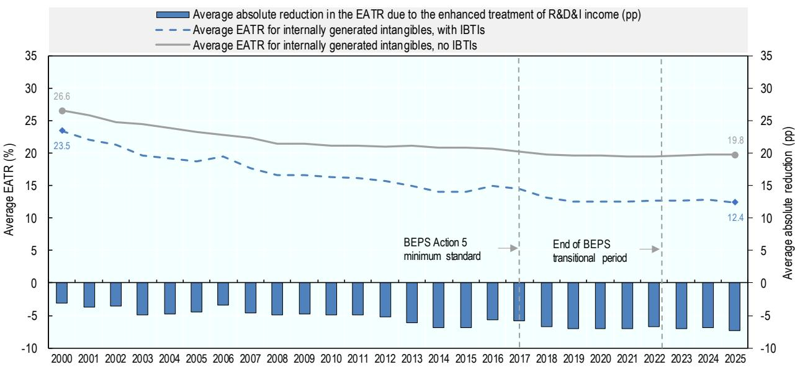  
Note: The chart reports the unweighted average EATR across all 38 OECD countries over time, including those that do not offer income-based tax incentives. It accounts for both IP regimes and dual-category regimes. Where income-based tax incentives are available at the central and subnational government level in a given year, only the central level income-based tax incentives enters the OECD average. If several income-based tax incentives are available in the same year, the most generous one is used in the computation of the OECD average. In Canada, income-based tax incentives are only available at the subnational level in the provinces of Québec and Saskatchewan. The regime in the province of Québec is modelled in this average as Québec represents a larger share of Canada's gross domestic product (about twenty percent) relative to Saskatchewan (approximately four percent). In Switzerland, the canton of Nidwalden had an IP regime since 2011. This regime was amended in compliance with the BEPS Action 5 minimum standard in 2016. From 2020, all cantons in Switzerland have the obligation to introduce an IP regime. Given the federal scope of the new IP regime available since 2020, the estimate for Switzerland is chosen to be that of an investment that takes place in the city of Zurich. The chart includes both IP regimes and dual-category regimes. The estimates consider an R&D investment with a gestation lag of two years after which the intangible asset starts generating profits. Baseline refers to an equivalent investment that does not benefit from income-based tax support. Preferential tax treatment is obtained by the absolute difference between the EATR including income-based support and the baseline.

## StatLink https://stat.link/2gmr8x

Figure 5.11 shows that while income-based tax incentives have substantially reduced EATRs, they have had much more limited impacts on the cost of capital, which has not declined as sharply over recent years. Expenditure-based tax incentives contribute to lowering the cost of capital in a more direct fashion by affecting the cost of investment. The effect of income-based tax incentives in lowering the cost of capital is indirect as they do not affect directly the cost of investing but lower the taxation of future profits. In 2025, income-based tax incentives decreased the cost of capital in OECD countries on average by 0.3 percentage points to an average of 3.9%. The trend over time in the cost of capital for R&D intangible assets has remained relatively stable. Qualifying investments do not enjoy a substantially more preferential treatment compared to other investments.

Figure 5.11. Cost of capital of R&D intangibles, OECD countries, 2000-2025
Estimates of the implicit tax subsidy from income-based tax incentives, marginal investments  
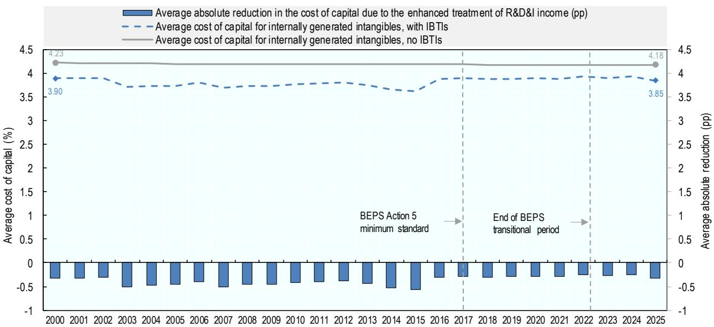

Note: The chart reports the unweighted average cost of capital across all 38 OECD countries over time, including those that do not offer income-based tax incentives. It accounts for both IP regimes and dual-category regimes. Where income-based tax incentives are available at the central and subnational government level in a given year, only the central level income-based tax incentives enters the OECD average. If several income-based tax incentives are available in the same year, the most generous one is used in the computation of the OECD average. In Canada, income-based tax incentives are only available at the subnational level in the provinces of Québec and Saskatchewan. The regime in the province of Québec is modelled in this average as Québec represents a larger share of Canada's gross domestic product (about twenty percent) relative to Saskatchewan (approximately four percent). In Switzerland, the canton of Nidwalden had an IP regime since 2011. This regime was amended in compliance with the BEPS Action 5 minimum standard in 2016. From 2020, all cantons in Switzerland have the obligation to introduce an IP regime. Given the federal scope of the new IP regime available since 2020, the estimate for Switzerland is chosen to be that of an investment that takes place in the city of Zurich. The chart includes both IP regimes and dual-category regimes. The estimates consider an R&D investment with a gestation lag of two years after which the intangible asset starts generating profits. Baseline refers to an equivalent investment that does not benefit from income-based tax support. Preferential tax treatment is obtained by the absolute difference between the cost of capital including income-based support and the baseline.

StatLink https://stat.link/n1cbsk

## References

Appelt, S., F. Galindo-Rueda and A. González Cabral (2019), “Measuring R&D tax support: Findings from the new OECD R&D Tax Incentives Database”, OECD Science, Technology and Industry Working Papers, No. 2019/06, OECD Publishing, Paris, https://doi.org/10.1787/d16e6072-en.

Dernis, H. et al. (2019), “World Corporate Top R&D investors: Shaping the Future of Technologies and of AI. A joint JRC and OECD report.”, Publications Office of the European Union, https://doi.org/10.2760/16575.

Devereux, M. et al. (2002), “Corporate Income Tax Reforms and International Tax Competition”, Economic Policy, Vol. 17/35, https://www.jstor.org/stable/1344772. [4]

González Cabral, A., S. Appelt and T. Hanappi (2021), “Corporate effective tax rates for R&D: The case of expenditure-based R&D tax incentives”, https://www.oecd-ilibrary.org/taxation/corporate-effective-tax-rates-for-r-d\_ff9a104f-en (accessed on 18 February 2023).

González Cabral, A., S. Appelt and T. Hanappi (2021), “Corporate effective tax rates for R&D: The case of expenditure-based R&D tax incentives”, OECD Taxation Working Papers, No. 54, OECD Publishing, Paris, https://doi.org/10.1787/ff9a104f-en.

González Cabral, A. et al. (2023), “Effective tax rates for R&D intangibles”, OECD Taxation Working Papers, No. 63, OECD Publishing, Paris, https://doi.org/10.1787/191dad43-en. [8]

OECD (2025), Main Science, Technology and Indicators database, https://www.oecd.org/en/data/datasets/main-science-and-technology-indicators.html (accessed on 10 November 2025).

OECD (2020), Tax Challenges Arising from Digitalisation – Economic Impact [5]
Assessment: Inclusive Framework on BEPS, OECD/G20 Base Erosion and Profit Shifting Project, OECD Publishing, Paris, https://doi.org/10.1787/0e3cc2d4-en.

## Note

## 6 BEPS Actions

## Key insights

\- In 2026, 46 jurisdictions reported having adopted measures consistent with Action 2 regarding recommendations to neutralise the effects of hybrid mismatch arrangements.

\- Regarding Action 3, the use of Controlled Foreign Corporation (CFC) rules has increased, with 57 jurisdictions indicating that CFC rules were in place in 2026, an increase from the number in 2019 where 49 jurisdictions had such rules in place.

\- Regarding Action 4, the use of Interest Limitation Rules (ILRs) has seen more substantial growth, with 111 rules in place worldwide amongst 89 IF member jurisdictions in 2026, a significant increase from the 67 jurisdictions that had implementing rules in 2019.

\- Regarding Action 5, 46 out of 65 IP regimes were found to be not harmful in 2026, 1 was found to be potentially harmful but not actually harmful and 1 was under review. 6 regimes were in the process of being amended or eliminated since they were not compliant with the base erosion and profit shifting (BEPS) Action 5 minimum standard. 11 of the regimes were abolished by 2026.

\- 33 jurisdictions reported having mandatory disclosure rules in place in accordance with the recommendations of Action 12 in 2026.

\- Regarding Action 13, for the fiscal year 2026, 120 jurisdictions have laws in place requiring mandatory filing of CbCRs.

## Introduction

The OECD/G20 BEPS Project was designed to address tax avoidance and double non-taxation of multinational enterprise (MNE) profits by closing gaps that had emerged in the international tax system in the wake of globalisation. The 15 actions, of which four are “minimum standards” are designed to equip governments with domestic and international rules and instruments to address tax avoidance, ensuring that profits are taxed where economic activities generating the profits are performed and where value is created.

## Data Characteristics

This chapter contains information on the implementation of selected BEPS measures, based on data collected by the OECD and reported in the Corporate Tax Statistics database. The information reflects the rules in place in 2026 across all members of the Inclusive Framework (IF) on base erosion and profit shifting (BEPS) $^{1}$ . The Inclusive Framework is moving forward with the implementation of the BEPS minimum standards and continues to peer review the progress of each Inclusive Framework member.

## Action 2: Hybrid mismatch arrangements

For each jurisdiction, the database reports:

• whether hybrid mismatch rules are in place;

• the types of hybrid financial instrument rules (e.g. denial of deduction, inclusion of income);

\- the existence and scope of hybrid entity rules (including reverse hybrid rules);

• whether imported mismatch rules apply;

• whether dual resident payer rules are implemented;

• whether treaty provisions address hybrid mismatches;

\- whether linking rules are applied to coordinate treatment between jurisdictions;

\- whether branch mismatch rules are implemented (e.g. branch payee mismatch rule, deemed branch payment rule, branch double deduction rule).

## Action 3: Controlled Foreign Company (CFC) Rules

For each jurisdiction, the database reports:

• whether CFC rules are in place;

• the definition and scope of CFC income;

\- whether a substantial economic activity test applies and, if so, its main characteristics;

• whether any exemptions, thresholds or carve-outs apply.

## Action 4: Interest Limitation Rules

For each jurisdiction, the database reports:

• whether an interest limitation rule is in place;

\- the type of rule (e.g. fixed ratio rule, earnings stripping rule, thin capitalisation rule);

• the financial ratio applied;

• whether the rule applies to net or gross interest;

• whether the rule applies to related-party debt, third-party debt, or both;

• whether a de minimis threshold applies;

\- whether exclusions are available (e.g. for certain sectors or entities); whether carry-forward or carry-back provisions apply.

## Action 5: Intellectual Property Regimes

Drawing on information collected by the OECD's Forum on Harmful Tax Practices (FHTP), the database reports for each IP regime:

• the name of the regime;

• the qualifying IP assets;

• the reduced tax rate applicable under the regime;

• the status of the regime as determined by the FHTP.

The information is accurate as of January 2026. Legislative changes enacted in 2026 but effective from 2027 are not reflected.

## Action 12: Mandatory disclosure rules (MDR)

For each jurisdiction, the database reports:

• whether mandatory disclosure rules are in place;

\- the types of taxes covered (e.g. CIT, personal income tax, VAT, capital gains tax);

• the persons required to report (e.g. intermediaries, taxpayers);

\- the categories of reportable transactions, schemes or arrangements;

• the information required to be disclosed to the tax authority.

## Action 13: Country-by-Country Reporting implementation

For each jurisdiction, the database reports:

\- the date from which mandatory headquarters filing became effective;

• the consolidated group revenue threshold for filing;

• the filing deadline applicable to reporting entities.

## BEPS Actions in 2026

## Action 2: Hybrid mismatch arrangements

The 2015 BEPS Action 2 Final report (OECD, 2015[1]) and the Branch Mismatch Arrangements Report (OECD, 2017[2]) sets out recommendations to neutralise the effects of hybrid mismatch arrangements that exploit differences in the tax treatment of instruments or entities between jurisdictions.

As of 2026, Figure 6.1 shows that 46 jurisdictions reported having adopted measures consistent with this Action. These measures range from comprehensive hybrid mismatch rules aligned with the OECD recommendations to more targeted provisions dealing with specific types of hybrid instruments or entities. Twenty-two of these jurisdictions reported that they adopted these measures from 2019 or later, reflecting the continuing efforts of Inclusive Framework members to close the gaps in their international tax rules arising from hybrid mismatches.

Figure 6.1. Rules neutralising hybrid mismatch arrangements, 2026  
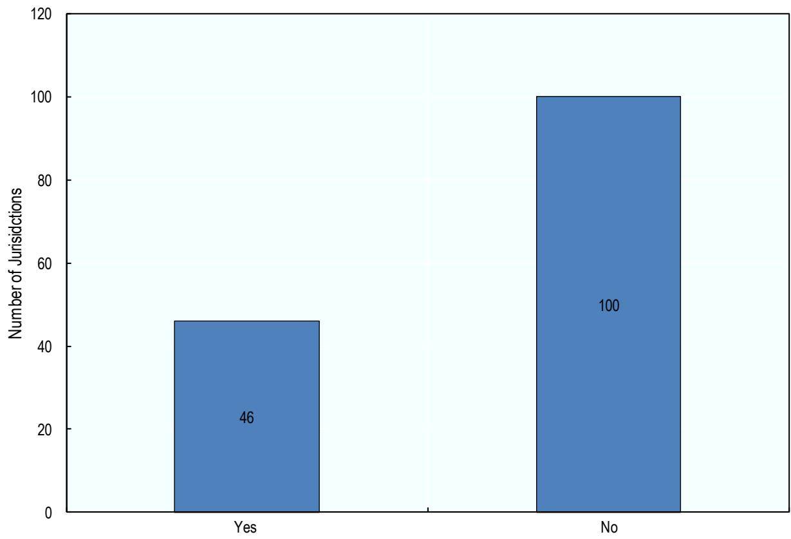  
Source: OECD Implementation of BEPS Actions 2,3,4 and 12 Survey, 2026.  
StatLink https://stat.link/racphf

## Action 3: Controlled Foreign Company (CFC) Rules

The 2015 BEPS Action 3 report sets out recommended approaches to the development of controlled foreign company (CFC) rules to ensure the taxation of certain categories of MNE income in the jurisdiction of the parent company in order to counter certain offshore structures that result in no or indefinite deferral of taxation. Comprehensive and effective CFC rules have the effect of reducing the incentive to shift profits from the residence jurisdiction into a low-tax jurisdiction (Clifford, 2019[3]).

Information on the presence of CFC rules is available for all Inclusive Framework member jurisdictions. Of these, Figure 6.2 shows that 57 jurisdictions indicated that CFC rules were in place in 2026, an increase from the number in 2019 where 49 jurisdictions had these rules in place (OECD, 2020[4]). Implementation of CFC rules is more common in developed countries than in developing countries, with 36 high-income jurisdictions implementing CFC rules in 2026 compared to only 21 middle- and lower-income peers. Indeed, many jurisdictions may not have a strong need to implement CFC rules as they may not be the UPE jurisdiction of a large number of MNEs.

Figure 6.2. Controlled Foreign Company Rules, 2026  
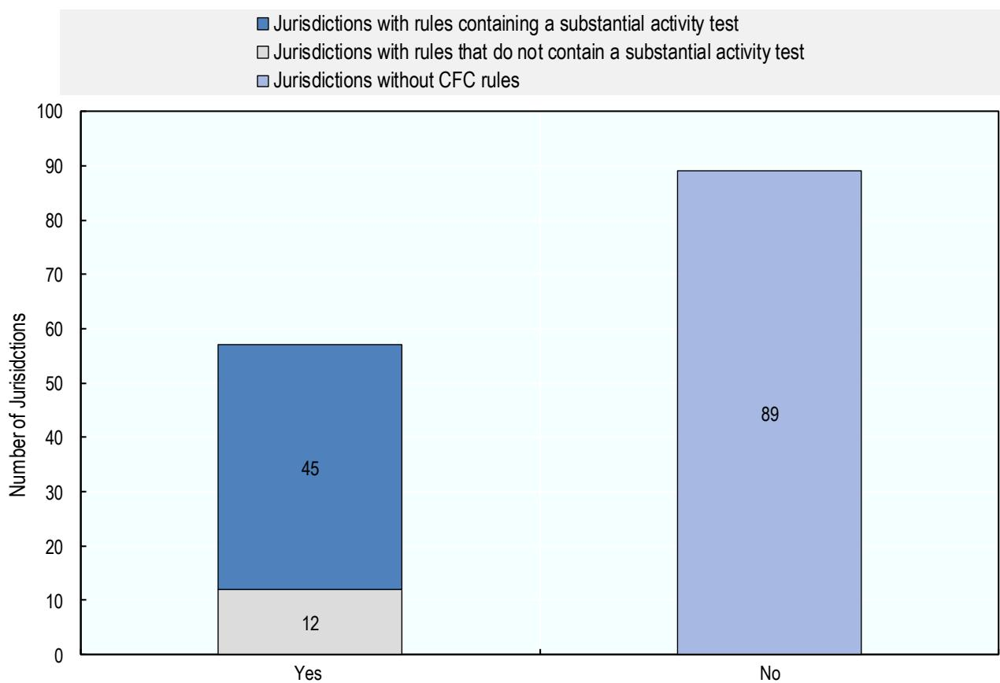  
Source: OECD Implementation of BEPS Actions 2,3,4 and 12 Survey, 2026.  
StatLink https://stat.link/4860ab

## Action 4: Interest Limitation Rules

The OECD/G20 BEPS project identified the deductibility of interest expense as an important area of attention. In particular, profit shifting can arise from arrangements using third party debt (e.g., where one entity or jurisdiction bears an excessive proportion of the group's total net third party interest expense) and intragroup debt (e.g., where a group uses intragroup interest expense to shift taxable income from high tax to low tax countries).

In response, the 2015 BEPS Action 4 report focused on the use of all types of debt giving rise to excessive interest expense or used to finance the production of exempt or deferred income. In particular, the Action 4 final report established rules that linked an entity's net interest deductions to its level of economic activity within the jurisdiction, measured using taxable earnings before interest income, tax, depreciation and amortisation (EBITDA) (OECD, 2015[5]).

Information on the presence of interest limitation rules is available for all Inclusive Framework member jurisdictions. Of these, Figure 6.3 shows that 89 jurisdictions indicated that interest limitation rules were in place in 2026. This is a substantial increase from the 67 jurisdictions reporting rules in place for 2019. Interest limitation rules have a variety of forms, as discussed in (OECD, 2016[6]). Of the 111 interest limitation rules in place in 2026, the most common was thin capitalisation rules (44 jurisdictions), followed by fixed ratio rules (27 jurisdictions).

Figure 6.3. Interest Limitation Rule types, 2026  
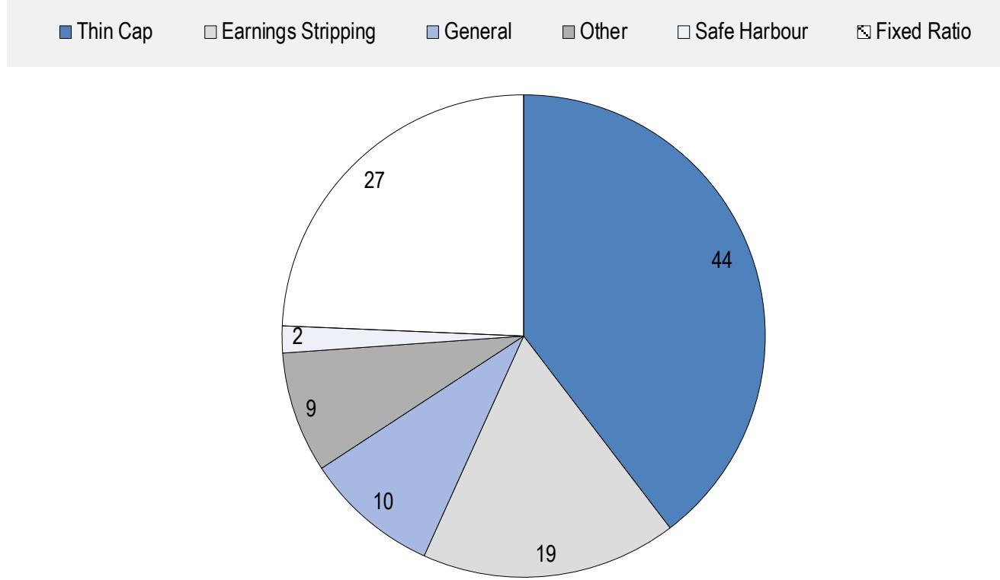  
Note: 111 Interest Limitation Rules are in place in 89 jurisdictions.  
Source: OECD Implementation of BEPS Actions 2,3,4 and 12 Survey, 2026.  
StatLink https://stat.link/rz6df5

Thin capitalisation rules disallow the tax deductibility of intra-firm interest payments if the size of these expenses exceeds a threshold, where the threshold is based on debt-to-equity or debt-to-assets ratios. Thin capitalisation rules most commonly reference a debt-to-equity ratio (though a debt-to-assets ratio is used in some jurisdictions), where the ratio values range from 0.3:1 in Brazil (i.e., interest payments are fully deductible only if the indebtedness of the Brazilian borrowing does not exceed 30% of the borrower's net equity) to 6:1 for banks and insurance companies in the Czech Republic, with ratios of 2:1, 3:1 and 4:1 being most common.

Earnings stripping rules restrict tax deductibility if the ratio of interest to EBITDA exceeds a certain threshold. A financial ratio rule based on interest to EBITDA is known as a fixed ratio rule, and is the approach recommended in the Action 4 report. While OECD guidance recommends the use of EBITDA in the denominator, it also allows for the flexibility to introduce rules based on earnings before interest and taxes (EBIT). There may also be interest limitation rules that make reference to other ratios, such as Denmark's rule that applies the ratio of interest to the tax value of total assets. Among the 45 jurisdictions reporting earnings stripping or fixed ratio rules, the most commonly referenced ratio was interest-to-EBITDA (43 jurisdictions), with ratio values ranging from 20% to 30%, with 30% being the most common ratio (40 jurisdictions).

## Action 5: Intellectual Property Regimes

IP regimes may be used by governments to support research and development (R&D) activities in their jurisdiction. In the past, IP regimes may have been designed in a manner that incentivised firms to locate

IP assets in a jurisdiction regardless of where the underlying R&D activities were undertaken. However, the nexus approach of the BEPS Action 5 minimum standard now requires that tax benefits for IP income are conditional on the extent to which a taxpayer has undertaken the R&D activities that produced the IP asset in the jurisdiction providing the tax benefits.

## What qualifies as an intellectual property regime?

IP regimes can be regimes that exclusively provide benefits to income from IP, but some regimes categorised as IP regimes are “dual category” regimes. These regimes also provide benefits to income from other geographically mobile activities or to a wide range of activities and do not necessarily exclude income from IP.

The Corporate Tax Statistics database shows information both on regimes that narrowly target IP income and on regimes that offer reduced rates to IP income and other types of income. Of the 65 IP regimes contained in the database, 36 were reviewed by the FHTP as IP regimes only and 29 were reviewed as “dual category” regimes (IP and non-IP regimes).

## Status of intellectual property regimes

On the basis of the features of the regime, IP regimes are found to be either: harmful (because they do not meet the nexus approach), not harmful (when the regime does meet the nexus approach and other factors in the review process), potentially harmful (when the regime does not meet the nexus approach and/or other factors in the review process, but an assessment of the economic effects has not yet taken place), or potentially harmful but not actually harmful (when the regime does not meet the nexus approach and/or other factors in the review process, but an assessment of the economic effects has taken place). Regimes may also be in the process of being amended or eliminated (when the regime may not meet the nexus approach and/or other factors in the review process and is being modified or abolished as a result). The peer review process is ongoing, and by 2026 the vast majority of regimes were fully aligned with the Action 5 minimum standard. These are listed with the status “not harmful” or “amended (not harmful)”. Regimes that were already closed to new entrants in 2026 (according to the peer reviews approved by the Inclusive Framework in November 2025) were listed as “abolished” in the database, although continuing benefits may be offered for a defined period of time to companies already benefiting from the regime. In most cases, this grandfathering would end by 31 December 2026. There were eleven IP regimes listed as abolished in 2026.

The Corporate Tax Statistics database contains information on 65 IP regimes that were in place in 50 different jurisdictions in the year 2026 as shown in Figure 6.4. Forty-six regimes in total were found to be not harmful; 26 of these regimes were found to be not harmful after having been amended to align with the Action 5 minimum standard. One regime was found to be potentially harmful but not actually harmful (in Brunei Darussalam). Six regimes are in the process of being amended or eliminated.

Figure 6.4. Status of intellectual property regimes in place in 2026  
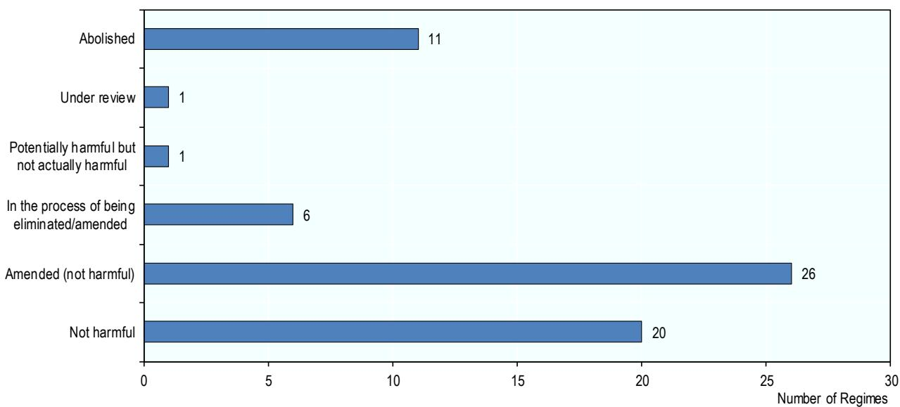  
Source: OECD Forum on Harmful Tax Practices.  
StatLink https://stat.link/3qydcr

## Qualifying assets and reduced tax rates

In the Corporate Tax Statistics database, qualifying assets of IP regimes are grouped into three main categories: patents, software and Category 3. These correspond to the only three categories of assets that may qualify for benefits under the Action 5 minimum standard: 1) patents defined broadly; 2) copyrighted software; and 3) in certain circumstances and only for SMEs, other IP assets that are non-obvious, useful and novel. The Action 5 Report explicitly excludes income from marketing related intangibles (such as trademarks) from benefiting from a tax preference. If a regime does not meet the Action 5 minimum standard, then the assets qualifying for the regime may not fall into the three allowed categories.

Of the 46 regimes found to be not harmful, all 46 regimes cover patents, 34 cover software, and 20 regimes cover assets in the third category (Category 3). All six regimes that are in the process of being eliminated or amended do not have any restrictions on the type of income that qualifies for a reduced rate, although other restrictions may apply, (e.g. to certain industries). The reduction in the rate on IP income varies among the regimes, and some regimes offer different rates depending, for example, on the type of income (e.g., royalties or capital gains income) or size of the company.

Among the 46 regimes found to be not harmful, the tax benefit offered ranges from a full exemption to a reduction of about $40\%$ of the tax rate that would have otherwise applied. The most common reduction is a $50\%$ reduction. The reduced rates range from $0\%$ (in 18 jurisdictions) to $18.75\%$ (Korea's Special taxation for transfer, acquisition, etc. of technology; this IP regime offers reduced rates ranging from $5\%$ to $18.75\%$ ). Five of the six regimes that are in the process of being amended or eliminated offer a full exemption from taxation for IP income.

For each of the 46 non-harmful IP regimes, Figure 6.5 and Figure 6.6 show the lowest reduced rate offered under the regime and the tax rate that would otherwise apply. Figure 6.5 shows those regimes with the status non-harmful, while Figure 6.6 shows the regimes that have been amended to be non-harmful. The tax rate that would otherwise apply is typically the STR, but it may not include certain surtaxes or sub-central government taxes. Similar to the reduced rate, the tax rate that would otherwise apply may also fall into a range, for example, if the standard statutory rate depends on the level of profits. Therefore, the tax rates shown in the figures are illustrative and do not detail the full range of tax reductions offered in each IP regime.

Figure 6.5. Reduced rates under non-harmful intellectual property regimes, 2026  
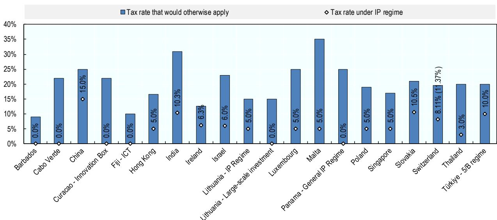  
Source: OECD Forum on Harmful Tax Practices.  
Note: IP income in Switzerland can benefit from a 90% exemption of qualifying IP income from cantonal taxation. However, this exemption is subject to a cap: only 70% of a firm's total profits (IP or non-IP) can be exempt. The canton of Zurich is chosen as the representative canton. The 8.11% in 2026 applies to qualifying IP income and assumes that the firm has sufficient other income (non-qualifying IP or non-IP income) that is taxed at higher rates so that it is not subject to the 70% maximum relief limitation. If the firm had enough qualifying IP income that the 70% maximum relief limitation did apply, the rate applied to IP income in the city of Zurich would increase steadily from 8.11% to 11.37% in 2026 (100% IP Income).

Where multiple rates are available for royalties or capital gains, the rate applicable to royalties has been used.

StatLink https://stat.link/n30sfq

Figure 6.6. Reduced rates under non-harmful (amended) intellectual property regimes, 2026  
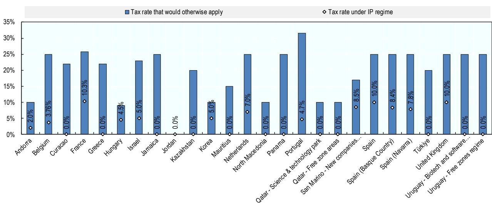  
Source: OECD Forum on Harmful Tax Practices  
Note: Where multiple rates are available for royalties or capital gains, the rate applicable to royalties has been used.  
StatLink https://stat.link/acnuve

## Action 12: Mandatory disclosure rules (MDR)

The 2015 BEPS Action 12 report (OECD, 2015[7]) identified the lack of timely, comprehensive and relevant information on aggressive tax planning strategies as one of the main challenges faced by tax authorities worldwide. The report recommended the design of rules requiring taxpayers and/or advisers to disclose aggressive tax planning arrangements. These mandatory disclosure rules (MDRs) are intended to provide tax administrations with early information about such schemes, enabling them to respond more rapidly to emerging risks and target resources more effectively.

In 2026, Figure 6.7 shows that 33 jurisdictions reported having mandatory disclosure regimes in place with the majority located in the European Union. These regimes vary in scope and design but generally require disclosure of arrangements meeting certain hallmarks of tax risk.

Figure 6.7. Mandatory disclosure rules, 2026  
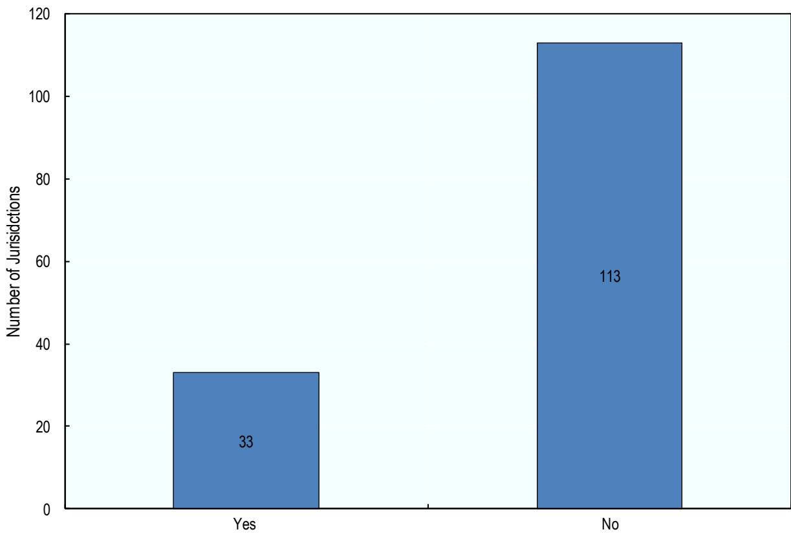  
Source: OECD Implementation of BEPS Actions 2,3,4 and 12 Survey, 2026.  
StatLink https://stat.link/bs3c8a

## Action 13: Country-by-Country Reporting implementation

BEPS Action 13 is part of the transparency pillar of the OECD/G20 BEPS project. In many cases, jurisdictions already have rules in place to deal with BEPS risks posed by MNE groups but may not previously have had access to information to identify cases where these risks arise. BEPS Action 13 helps to address this by providing new information for use by tax administrations in high-level transfer pricing risk assessment and the assessment of other BEPS-related risks.

For the fiscal year 2026, 120 jurisdictions have laws in place requiring mandatory filing of Country-by-Country Reports (CbCRs). (Figure 6.8).

Figure 6.8. Number of jurisdictions implementing mandatory CbCR filing  
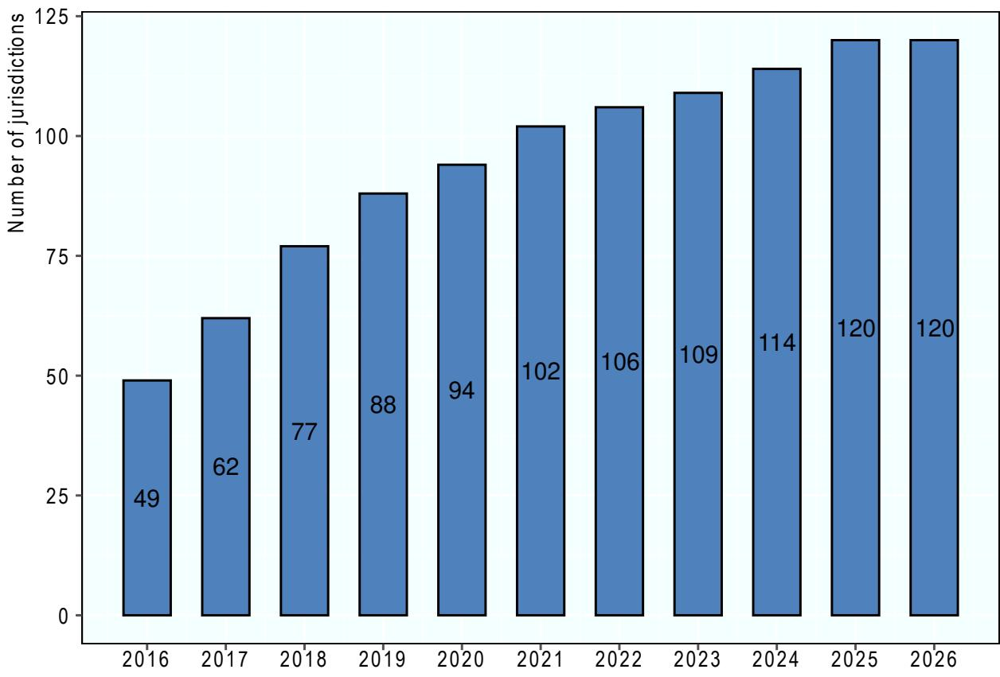  
Source: Action 13 Automatic exchange portal (http://www.oecd.org/en/topics/sub-issues/country-by-country-reporting-for-tax-purposes/country-specific-information-on-country-by-country-reporting-implementation.html#cbcrequirements).  
StatLink https://stat.link/49nmu6

## References

Clifford, S. (2019), “Taxing multinationals beyond borders: Financial and locational responses to CFC rules”, Journal of Public Economics, Vol. 173, pp. 44-71, https://doi.org/10.1016/j.jpubeco.2019.01.010.

OECD (2020), Corporate Tax Statistics, Second Edition, OECD Publishing, Paris, https://doi.org/10.1787/ff4d4ce8-en.

OECD (2017), Neutralising the Effects of Branch Mismatch Arrangements, Action 2: Inclusive Framework on BEPS, OECD/G20 Base Erosion and Profit Shifting Project, OECD Publishing, Paris, https://doi.org/10.1787/9789264278790-en.

OECD (2016), Limiting Base Erosion Involving Interest Deductions and Other Financial Payments, Action 4 - 2016 Update: Inclusive Framework on BEPS, OECD/G20 Base Erosion and Profit Shifting Project, OECD Publishing, Paris, https://doi.org/10.1787/9789264268333-en.

OECD (2015), Limiting Base Erosion Involving Interest Deductions and Other Financial Payments, Action 4 - 2015 Final Report, OECD/G20 Base Erosion and Profit Shifting Project, OECD Publishing, Paris, https://doi.org/10.1787/9789264241176-en.

OECD (2015), Mandatory Disclosure Rules, Action 12 - 2015 Final Report, OECD/G20 Base Erosion and Profit Shifting Project, OECD Publishing, Paris, https://doi.org/10.1787/9789264241442-en.

OECD (2015), Neutralising the Effects of Hybrid Mismatch Arrangements, Action 2 - 2015 Final Report, OECD/G20 Base Erosion and Profit Shifting Project, OECD Publishing, Paris, https://doi.org/10.1787/9789264241138-en.

## Note

# Country-by-country reporting statistics

## Key insights

\- The 2026 edition of Corporate Tax Statistics contains a further year of anonymised and aggregated country-by-country reporting (CbCR) statistics covering fiscal year (FY) 2023.

\- Sixty jurisdictions out of a potential one hundred and nine submitted CbCR statistics to the OECD detailing the financial and business activities of over 9400 multinational enterprises (MNEs), with a further five jurisdictions reporting that they received zero CbCRs.

\- The data suggest modest increases in high-level indicators of base erosion and profit shifting in recent years, though indicators are still below earlier levels. While these indicators could reflect continuing BEPS behaviour, these data may be affected by turbulence in the global economy during high inflation periods during 2023. All these indicators remain far higher in investment hubs relative to other jurisdictions, pointing to the continued existence of BEPS activity.

\- From FY 2023, the data includes a disaggregation by MNE group size, as measured by unrelated party revenues, and by tax jurisdiction.

\- The share of revenues raised from large MNEs has increased in recent years. Large MNEs contributed an average of 44.5% of total corporate tax revenues in 2023 compared to 42.8% in 2017.

\- In FY 2022 and 2023, total profits returned to levels comparable to those recorded in 2019, prior to the COVID-19 pandemic. This supports the view that the substantial rise in total profits reported by the covered MNEs in FY 2021 was largely driven by post-pandemic recovery or by increases in inflation across many IF member jurisdictions.

\- The composition of business activity differs across jurisdiction groups. The most predominant activity in investment hubs is “holding shares” which also includes other equity instruments.

## Introduction

Country-by-country reporting was implemented as part of Action 13 of the OECD/G20 BEPS Project to support jurisdictions in combating base erosion and profit shifting (BEPS). Under BEPS Action 13, all large multinational enterprises (MNEs) are required to share a country-by-country (CbC) report with tax administrations, including aggregate data on the global allocation of income, profit, taxes paid and economic activity for all tax jurisdictions in which it operates.

While the main purpose of CbCRs is to support tax administrations in the high-level detection and assessment of transfer pricing and other BEPS-related risks, data collected from CbCRs can also play a role in supporting the economic and statistical analysis of BEPS activity and of multinational enterprises in general. Under Action 11 of the BEPS Project (OECD, 2015[1]), acknowledging the need for additional sources of data on MNEs, jurisdictions agreed to regularly publish anonymised and aggregated CbCR statistics to support the ongoing economic and statistical analysis of MNE activities and BEPS. This section outlines progress on the implementation of Action 13, as well as the country-by-country reporting statistics published by the OECD under Action 11.

## Data characteristics

Jurisdictions have provided the OECD with anonymised and aggregated tabulations of the country-by country reporting information. Aggregation is performed according to certain sub-group or group characteristics (Box 7.1) and reported according to these different criteria in several tables. Table 7.1 provides an overview of the tables submitted to the OECD as part of CbCR statistics, a brief description of their content and the number of individual jurisdictions that submitted each table for FY 2023.

## Box 7.1. MNE group structure

An MNE group is a collection of enterprises related through ownership or control such that the group is either required to prepare consolidated financial statements for financial reporting purposes under applicable accounting principles or would be so required if equity interests in any of the enterprises were traded on a public securities exchange.

An entity is any separate business unit of an MNE group that is included in the consolidated financial statements of the MNE group for financial reporting purposes.

The UPE directly or indirectly owns a sufficient interest in one or more other entities of the MNE group such that it is required to prepare consolidated Financial Statements.

A sub-group is formed by the combined entities of an MNE group operating in one tax jurisdiction.

The aggregated CbCR data are subject to a number of limitations that need to be borne in mind when carrying out any economic or statistical analysis (see Corporate Tax Statistics Explanatory Annex).

Comparisons of CbCR data over time should also be interpreted with caution, as a number of structural features of the dataset affect its consistency across years. In particular, the set of jurisdictions included in the dataset evolved over time as additional countries begin to submit CbCR statistics, while the population of MNE groups covered has also changed from year to year. Furthermore, differences in the level of disaggregation applied in compiling the data affects the comparability of reported aggregates across jurisdictions and periods. As a result, observed year-on-year changes may reflect, in part, variations in coverage and reporting practices rather than underlying economic developments.

Comparability is especially limited between the 2016 sample and subsequent years (2017–2022). This reflects the transition, in a number of jurisdictions, from voluntary filing of CbCR data in the initial year to mandatory filing in later years, which significantly altered both the scope and composition of the reporting population. In addition, differences in fiscal year coverage across reporting entities introduce further inconsistencies, as data for a given reference year may not correspond to uniform accounting periods. Taken together, these factors imply that caution is warranted when interpreting trends over time, particularly when drawing comparisons involving the 2016 data.

Nonetheless, the data provide important information on MNEs and their activities relative to other data sources:

\- The CbCR data provide global information on MNEs' activities, with more granular information than is available in other data sources such as consolidated financial accounts.1

\- The CbCR data include information on number of CbCRs, number of sub-groups, number of entities, total unrelated and related party revenues (and their sum, total revenues), profit or loss before income tax, income tax paid (on a cash basis), current year income tax accrued, stated capital, accumulated earnings, number of employees, tangible assets other than cash and cash equivalents, and the main business activity (or activities) of each constituent entity.

\- The data ensure inclusion of all global activities of included MNEs.

At a minimum, the data allows for the domestic and foreign activities of MNEs to be separately identified. $^{2}$ Depending on the reporting jurisdiction, it allows for an analysis of MNEs' activities by tax jurisdiction due to a detailed geographical disaggregation. The CbCR data also provide cross-country information on MNEs' business activities (e.g., manufacturing, intellectual property (IP) holding, sales) in different jurisdictions, allowing researchers to relate financial outcomes to these functions for the first time.

Table 7.1. Content of anonymised and aggregated CbCR statistics

<table><tr><td>CbCR table</td><td>Content</td><td>Description</td></tr><tr><td>Table 1A</td><td>Aggregate totals of all variables by jurisdiction</td><td>Reports variable totals and selected ratios for all sub-groups, obtained by aggregating sub-group variables according to their jurisdiction of tax residence (or jurisdiction groups, depending on confidentiality). The tables include three panels aggregating all sub-groups, sub-groups with positive profits and sub-groups with negative profits.</td></tr><tr><td>Table 1B</td><td>Interquartile mean values of all variables by jurisdiction</td><td>Reports interquartile mean figures based on the number of CbCR sub-groups following same structure as Table 1A.</td></tr><tr><td>Table 2</td><td>Aggregate totals by size of the MNE Group</td><td>Reports data disaggregated by MNE group size, as measured by unrelated party revenues, and by tax jurisdiction. The level of disaggregation varies across jurisdictions, depending on confidentiality.</td></tr><tr><td>Table 4</td><td>Aggregate totals of all variables by effective tax rate of MNE groups</td><td>Reports data disaggregated by effective tax rate of the MNE group and by tax jurisdiction. The level of disaggregation varies across jurisdictions, depending on confidentiality.</td></tr><tr><td>Table 5</td><td>Aggregate totals of all variables by effective tax rate of MNE sub-groups</td><td>Reports data disaggregated by the effective tax rate of the MNE sub-group. The level of disaggregation varies across jurisdictions, depending on confidentiality.</td></tr><tr><td>Table 6</td><td>Distribution points of MNE group size</td><td>Reports distribution points of MNE group size, as measured by unrelated party revenues, number of employees and tangible assets. The total size of an MNE group is determined by summing the relevant variables across all of its sub-groups.</td></tr></table>

Note: The collection of Table 2, where the data is aggregated according to the MNEs size, has been introduced from FY 2022. The collection of Table 3, where the data is aggregated according to the MNEs sector has been postponed. The Inclusive Framework will consider whether to expand the dataset to include Table 3 in future years. The ETR of the MNE group and sub-group in Tables 4 and 5 should not be directly compared to the effective tax rates mentioned in the chapter on corporate effective tax rates.

## CbCR statistics for financial year (FY) 2023

While there are 146 members of the Inclusive Framework, 109 have implemented mandatory reporting for the FY 2023. Sixty jurisdictions submitted CbCR statistics to the OECD with a further five jurisdictions reporting that they received zero CbCRs in 2023. The 2026 edition of Corporate Tax Statistics includes CbCR statistics on CbCRs filed in 60 headquarter jurisdictions, covering over 9 400 MNE groups (see Table 7.2).

The number of jurisdictions providing aggregated and anonymised CbCR statistics has increased yearly since their introduction in 2016. Figure 7.1 shows that the total number of jurisdictions that could potentially provide CbCR statistics to the OECD increased from 58 in 2016 to 109 in 2023. This total is calculated as the number of jurisdictions that have implemented mandatory CbCR filing along with those that accepted voluntary filing in the specific year. For example, in 2016, 49 jurisdictions implemented mandatory filing while a further 9 accepted voluntary filing. The number of jurisdictions that provided CbCR statistics increased from 26 to 60 over the same period. Despite the large increase in the number of jurisdictions that could potentially submit CbCR statistics, the number of jurisdictions that did not provide CbCR statistics to the OECD has only increased from 32 to 44 with an additional five jurisdictions reporting that they have received zero CbCRs in 2023. Many jurisdictions receive too few CbCRs to be able to provide the statistics under their confidentiality standards.

Figure 7.1. The evolution of CbCR coverage  
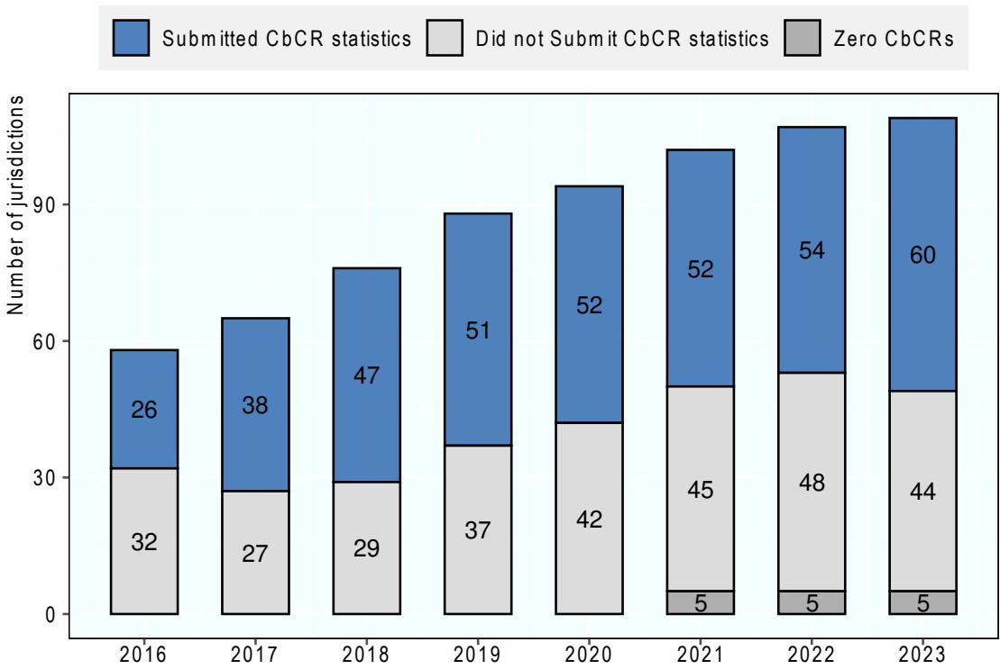  
Source: Anonymised and aggregated CbCR statistics and OECD Country-by-Country Reporting Requirements.  
StatLink https://stat.link/jatl9o

Figure 7.2 shows that the number of MNEs covered in the CbCR statistics has increased over time, from 3 628 in 2016 to 8 985 in 2023. Anonymised and aggregated CbCR data provide an overview of where large MNE groups are headquartered. Table 7.2 shows that, the number of reported MNEs varies considerably among jurisdictions, ranging from a minimum of two in Morocco to 2 098 in the United States. The median number of reported MNEs per jurisdiction is 68. 309 MNEs filed CbCRs as surrogate parent entities (where the jurisdiction of tax residence is different from the UPE's jurisdiction of tax residence in cases where CbCR reporting rules may not be in place in the UPE's jurisdiction of tax residence). Jurisdictions provided detailed statistics for 306 out of the 342 surrogate CbCRs that were filed. $^{3}$

Figure 7.2. Distribution of MNEs  
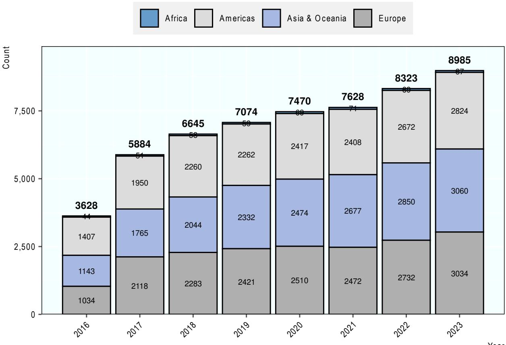  
Source: Anonymised and aggregated CbCR statistics.  
Note: Totals reflect the number of CbCRs for which data are reported by the UPE jurisdiction, excluding filings by Surrogate Parent Entities (SPEs) and reports containing only foreign data.  
StatLink https://stat.link/vtlq20

Table 7.2. Sample composition and average values for key financial variables

<table><tr><td></td><td>Reporting Jurisdiction</td><td>Level of data disaggregation</td><td>Number of CbCRs</td><td>Unrelated party revenues</td><td>Tangible assets (other than cash)</td><td>Income tax accrued</td><td>Number of employees</td></tr><tr><td>1</td><td>Andorra</td><td></td><td>Zero</td><td></td><td></td><td></td><td></td></tr><tr><td>2</td><td>Argentina</td><td>18 individual jurisdictions</td><td>45</td><td>3479</td><td>2855</td><td>111</td><td>4844</td></tr><tr><td>3</td><td>Australia</td><td>74 individual jurisdictions</td><td>183</td><td>4363</td><td>3282</td><td>145</td><td>9822</td></tr><tr><td>4</td><td>Austria</td><td>Continents</td><td>110</td><td>6222</td><td>3499</td><td>133</td><td>13473</td></tr><tr><td>5</td><td>Azerbaijan</td><td>34 individual jurisdictions</td><td>5</td><td>12627</td><td>6950</td><td>235</td><td>17028</td></tr><tr><td>6</td><td>Bahrain</td><td>Continents</td><td>6</td><td>2487</td><td>1892</td><td>45</td><td>13999</td></tr><tr><td>7</td><td>Belgium</td><td>40 individual jurisdictions</td><td>94</td><td>4357</td><td>2760</td><td>125</td><td>9345</td></tr><tr><td>8</td><td>Bermuda</td><td>100 individual jurisdictions</td><td>70</td><td>4584</td><td>3447</td><td>66</td><td>13212</td></tr><tr><td>9</td><td>Bosnia and Herzegovina</td><td></td><td>Zero</td><td></td><td></td><td></td><td></td></tr><tr><td>10</td><td>Brazil</td><td>36 individual jurisdictions</td><td>112</td><td>16703</td><td>9444</td><td>163</td><td>18346</td></tr><tr><td>11</td><td>Bulgaria</td><td>1 individual jurisdiction</td><td>5</td><td>2465</td><td>2869</td><td>28</td><td>7053</td></tr><tr><td>12</td><td>Canada</td><td>9 individual jurisdictions</td><td>290</td><td>6647</td><td>5765</td><td>157</td><td>16663</td></tr><tr><td>13</td><td>Cayman Islands</td><td>136 individual jurisdictions</td><td>137</td><td>9530</td><td>6676</td><td>211</td><td>36591</td></tr><tr><td>14</td><td>Chile</td><td>15 individual jurisdictions</td><td>38</td><td>5703</td><td>4392</td><td>112</td><td>19893</td></tr><tr><td>15</td><td>China</td><td>142 individual jurisdictions</td><td>836</td><td>15642</td><td>13359</td><td>283</td><td>34385</td></tr><tr><td>16</td><td>Cook Islands</td><td></td><td>Zero</td><td></td><td></td><td></td><td></td></tr><tr><td>17</td><td>Costa Rica</td><td>5 individual jurisdictions</td><td>4</td><td>1002</td><td>2150</td><td>15</td><td>4763</td></tr><tr><td>18</td><td>Czechia</td><td>All foreign jurisdictions combined</td><td></td><td></td><td></td><td></td><td></td></tr><tr><td>19</td><td>Denmark</td><td>77 individual jurisdictions</td><td>85</td><td>5654</td><td>2584</td><td>118</td><td>15929</td></tr><tr><td>20</td><td>Estonia</td><td>3 individual jurisdictions</td><td>6</td><td>1295</td><td>933</td><td>7</td><td>4505</td></tr><tr><td>21</td><td>Finland</td><td>Continents</td><td>58</td><td>4581</td><td>1923</td><td>91</td><td>9817</td></tr><tr><td>22</td><td>France</td><td>85 individual jurisdictions</td><td>277</td><td>11003</td><td>6017</td><td>309</td><td>35228</td></tr><tr><td>23</td><td>Germany</td><td>168 individual jurisdictions</td><td>547</td><td>8539</td><td>4388</td><td>153</td><td>20439</td></tr><tr><td>24</td><td>Greece</td><td>71 individual jurisdictions</td><td>17</td><td>11919</td><td>3057</td><td>74</td><td>10618</td></tr><tr><td>25</td><td>Hong Kong, China</td><td>142 individual jurisdictions</td><td>242</td><td>5540</td><td>7379</td><td>114</td><td>18103</td></tr><tr><td>26</td><td>Hungary</td><td>All foreign jurisdictions combined</td><td>12</td><td>6435</td><td>1952</td><td>148</td><td>14257</td></tr><tr><td>27</td><td>India</td><td>73 individual jurisdictions</td><td>145</td><td>5793</td><td>2286</td><td>138</td><td>37540</td></tr><tr><td>28</td><td>Indonesia</td><td>65 individual jurisdictions</td><td>60</td><td>27276</td><td>24838</td><td>710</td><td>75899</td></tr><tr><td>29</td><td>Ireland</td><td>Continents</td><td>71</td><td>7301</td><td>3344</td><td>152</td><td>29404</td></tr><tr><td>30</td><td>Italy</td><td>106 individual jurisdictions</td><td>210</td><td>5237</td><td>2217</td><td>138</td><td>10566</td></tr><tr><td>31</td><td>Japan</td><td>135 individual jurisdictions</td><td>937</td><td>7317</td><td>3519</td><td>146</td><td>19068</td></tr><tr><td>32</td><td>Jersey</td><td>103 individual jurisdictions</td><td>16</td><td>5931</td><td>1876</td><td>32</td><td>9461</td></tr><tr><td>33</td><td>Korea</td><td>Continents</td><td>317</td><td>7263</td><td>5041</td><td>104</td><td>12110</td></tr><tr><td>34</td><td>Latvia</td><td>12 individual jurisdictions</td><td>4</td><td>2220</td><td>1068</td><td>27</td><td>1838</td></tr><tr><td>35</td><td>Lithuania</td><td>10 individual jurisdictions</td><td>9</td><td>1637</td><td>871</td><td>8</td><td>5678</td></tr><tr><td>36</td><td>Luxembourg</td><td>100 individual jurisdictions</td><td>190</td><td>5996</td><td>2865</td><td>50</td><td>13027</td></tr><tr><td>37</td><td>Macau, China</td><td>All foreign jurisdictions combined</td><td>2</td><td>2445</td><td>6365</td><td>19</td><td>14643</td></tr><tr><td>38</td><td>Malaysia</td><td>34 individual jurisdictions</td><td>63</td><td>4421</td><td>5802</td><td>156</td><td>16991</td></tr><tr><td>39</td><td>Mauritius</td><td>Continents</td><td>10</td><td>4853</td><td>2452</td><td>32</td><td>8717</td></tr><tr><td>40</td><td>Mexico</td><td>99 individual jurisdictions</td><td>100</td><td>8855</td><td>4685</td><td>209</td><td>34532</td></tr><tr><td>41</td><td>Monaco</td><td></td><td>Zero</td><td></td><td></td><td></td><td></td></tr><tr><td>42</td><td>Morocco</td><td>All foreign jurisdictions combined</td><td>4</td><td>4191</td><td>4732</td><td>72</td><td>11500</td></tr><tr><td>43</td><td>Netherlands</td><td>29 individual jurisdictions</td><td>199</td><td>7269</td><td>2794</td><td>141</td><td>18865</td></tr><tr><td>44</td><td>New Zealand</td><td>All foreign jurisdictions combined</td><td>25</td><td>3126</td><td>2184</td><td>37</td><td>6510</td></tr><tr><td>45</td><td>Norway</td><td>61 individual jurisdictions</td><td>83</td><td>4422</td><td>4824</td><td>402</td><td>5720</td></tr><tr><td>46</td><td>Panama</td><td>18 individual jurisdictions</td><td>7</td><td>939</td><td>785</td><td>11</td><td>3170</td></tr><tr><td>47</td><td>Peru</td><td>12 individual jurisdictions</td><td>11</td><td>3111</td><td>1848</td><td>60</td><td>14355</td></tr><tr><td>48</td><td>Portugal</td><td>54 individual jurisdictions</td><td>28</td><td>5187</td><td>2109</td><td>67</td><td>13812</td></tr><tr><td>49</td><td>San Marino</td><td></td><td>Zero</td><td></td><td></td><td></td><td></td></tr><tr><td>50</td><td>Saudi Arabia</td><td>101 individual jurisdictions</td><td>45</td><td>15089</td><td>28693</td><td>2663</td><td>12829</td></tr><tr><td>51</td><td>Serbia</td><td>Continents</td><td>2</td><td>3447</td><td>6301</td><td>86</td><td>16684</td></tr><tr><td>52</td><td>Singapore</td><td>40 individual jurisdictions</td><td>80</td><td>8472</td><td>4901</td><td>108</td><td>11837</td></tr><tr><td>53</td><td>Slovenia</td><td>4 individual jurisdictions</td><td>9</td><td>2815</td><td>675</td><td>26</td><td>5141</td></tr><tr><td>54</td><td>South Africa</td><td>29 individual jurisdictions</td><td>53</td><td>5037</td><td>3192</td><td>137</td><td>27759</td></tr><tr><td>55</td><td>Spain</td><td>105 individual jurisdictions</td><td>180</td><td>5478</td><td>3407</td><td>123</td><td>17492</td></tr><tr><td>56</td><td>Sweden</td><td>Continents</td><td>146</td><td>3941</td><td>1837</td><td>91</td><td>13164</td></tr><tr><td>57</td><td>Switzerland</td><td>147 individual jurisdictions</td><td>163</td><td>9641</td><td>4631</td><td>160</td><td>22504</td></tr><tr><td>58</td><td>Thailand</td><td>95 individual jurisdictions</td><td>48</td><td>18105</td><td>20228</td><td>242</td><td>36351</td></tr><tr><td>59</td><td>Türkiye</td><td>26 individual jurisdictions</td><td>48</td><td>10865</td><td>3554</td><td>129</td><td>21293</td></tr><tr><td>60</td><td>Ukraine</td><td>All foreign jurisdictions combined</td><td>5</td><td>3127</td><td>4586</td><td>88</td><td>67028</td></tr><tr><td>61</td><td>United Arab Emirates</td><td>164 individual jurisdictions</td><td>84</td><td>6558</td><td>9893</td><td>45</td><td>22423</td></tr><tr><td>62</td><td>United Kingdom</td><td>215 individual jurisdictions</td><td>460</td><td>7142</td><td>4642</td><td>178</td><td>17159</td></tr><tr><td>63</td><td>United States</td><td>141 individual jurisdictions</td><td>2098</td><td>10937</td><td>4934</td><td>234</td><td>23578</td></tr><tr><td>64</td><td>Surrogate Parent Filings</td><td>172 individual jurisdictions</td><td>306</td><td>10673</td><td>12902</td><td>1629</td><td>27964</td></tr></table>

Note: Currency values (all values except the number of CbCRs and number of employees) are reported in millions of USD. Level of data disaggregation provided depends on data confidentiality standards applicable in each reporting jurisdiction. Average values have not been calculated for Czechia as the number of CbCRs has not been supplied for confidentiality reasons.
Source: 2023 Anonymised and Aggregated CbCR statistics.

Foreign and domestic MNEs account for significant shares of CIT revenues in several jurisdictions. For a selection of countries, Figure 7.3 reports total tax accrued based on CbCR statistics, as a fraction of the total national CIT revenues, taken from the OECD's Global Revenue Statistics Database. The figure allows an examination of the relative importance of foreign and domestic MNE contributions as covered in the 2023 data. $^{4}$

Percentage of total CIT revenues

Figure 7.3. MNEs' contribution to total CIT Revenues, 2023  
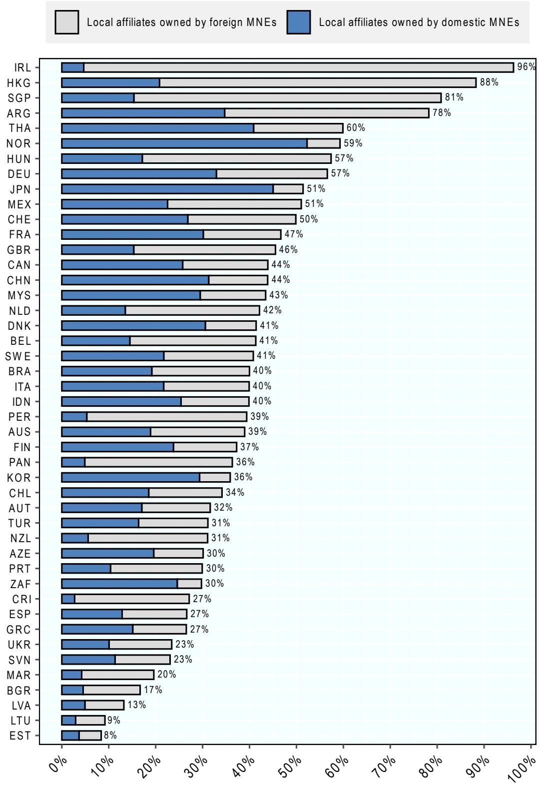

Note: The percentages above are calculated by dividing the amount of total tax accrued reported in CbCR statistics by total CIT revenues as reported in the OECD's Global Revenue Statistics Database. The figure shows total revenues of both domestic and foreign MNEs as a percentage of total CIT revenues, with jurisdictions ranked according to the total contribution of MNEs to CIT revenues. As there might be some timing differences in recording tax payments between tax accrued reported in CbCR data and CIT revenues reported in Global Revenue Statistics, percentages should be considered as indicative. Revenues from foreign MNEs are calculated as the sum of tax accrued reported in the jurisdiction by MNEs headquartered in other jurisdictions. Foreign MNEs' tax revenues should be considered as a lower bound as they can be reported exclusively where the geographical disaggregation is available at the jurisdiction level. Data for missing jurisdictions are not included because these jurisdictions are not covered in the 2023 OECD Global Revenue Statistics data. The US ratio of MNE tax revenues to total tax revenues is not presented in this chart due to a one-time transition tax imposed as part of the 2017 Tax Cuts and Jobs Act, which created a mismatch between the numerator and denominator of this ratio. MNEs generally report this transition tax as part of income taxes accrued and income taxes paid on the CbCR. However, the US Bureau of Economic Analysis does not classify this transition tax as CIT revenue (https://www.bea.gov/help/faq/1293). Therefore, the ratio of income tax accrued in CbCR data to US CIT revenues would be significantly upward biased and not indicative of the amount of CIT revenue contributed by MNEs in 2023. This mismatch is likely to persist for a number of years as taxpayers can elect to pay the tax over several years.

Source: 2023 Anonymised and Aggregated CbCR statistics and the OECD Global Revenue Statistics Database.

StatLink https://stat.link/fonb5l

There is evidence of misalignment between the location where profits are reported and the location where economic activities occur. The data show continuing differences in the distribution across jurisdiction groups of employees, tangible assets, and profits. $^{5}$ Figure 7.4 presents the distribution of MNEs' foreign activities across jurisdiction groups. $^{6}$ For example, high- and middle-income jurisdictions account for a higher share of total employees (respectively 36% and 44%) and total tangible assets (respectively 41% and 30%) than of profits (respectively 30% and 28%). On the other hand, in investment hubs, on average, MNEs report a relatively high share of profits (25%) compared to their share of employees (6%) and tangible assets (15%). High-income jurisdictions, middle-income jurisdictions, and investment hubs account for 44%, 29%, and 14% of tax accrued, respectively. $^{7}$

Figure 7.4. Jurisdiction groups' shares of foreign MNEs' activities  
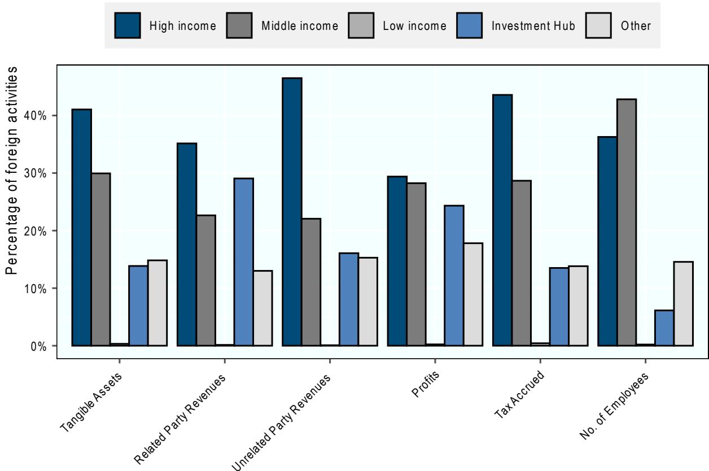  
Note: The profit variable could include intracompany dividends in several instances and therefore be upward biased. The bars represent jurisdiction groups' shares of different variables (e.g., profit in group x/total profits booked in foreign jurisdictions) across all jurisdictions included in the CbCR sample. The percentages are calculated using Table 1A Panel A (all subgroups). "Other" reflects aggregate geographic groupings and Stateless entities.  
Source: 2023 Anonymised and Aggregated CbCR statistics.

StatLink https://stat.link/8ton5v

The composition of business activities also varies across jurisdiction groups, while the overall distribution provides a useful benchmark. Figure 7.5 presents the average share of main business activities across all jurisdictions, showing that sales, manufacturing, services, and provision of services account for the largest proportions of reported activities. Holding shares also represents a notable share, alongside manufacturing or production.

Figure 7.5. Business activities  
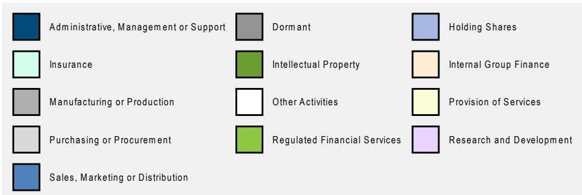

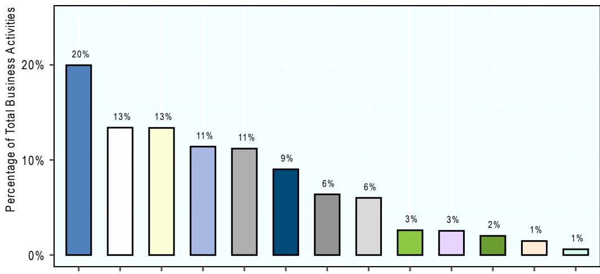  
Source: 2023 Anonymised and Aggregated CbCR statistics. These data are based on the business activities data in Table 1A of the CbCR data.

StatLink https://stat.link/vp7549

Figure 7.6 illustrates how the distribution differs by jurisdiction group. In high-, middle- and low-income jurisdictions, sales, manufacturing and services remain among the most prevalent activities, although their relative importance varies. High- and middle- display very similar overall profiles while services play a more important role in low-income jurisdictions.

In contrast, investment hubs display a markedly different profile, with a substantially higher concentration of entities engaged in holding shares or other equity instruments. This activity represents by far the largest share within this group and is accompanied by relatively lower shares of activities such as manufacturing or sales.

Figure 7.6. Business activities by income group  
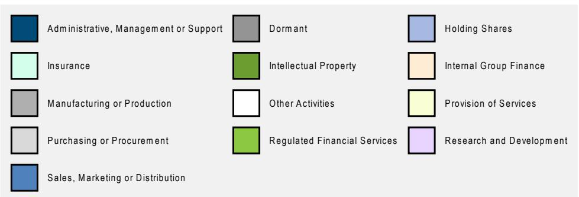

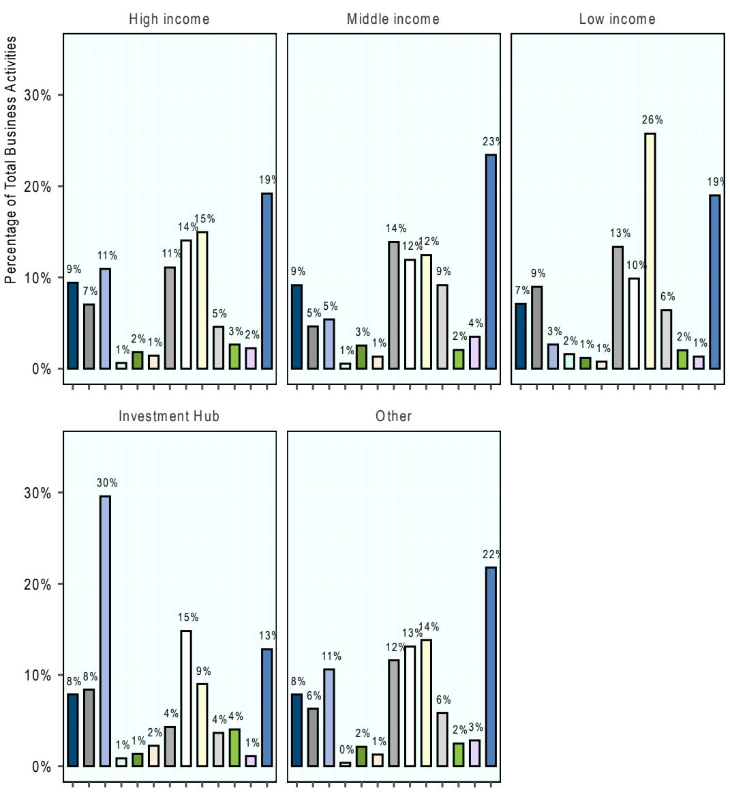

Note: The ratios are calculated by dividing the number of the activities performed in a jurisdiction group by the total number of all activities performed in this jurisdiction group where data is available. For example, 19% of all activities performed in high-income jurisdictions are in the "sales" category. Entities could be attributed to one or more of the following activities: research and development; holding or managing IP; purchasing or procurement; manufacturing or production (manufacturing); sales, marketing or distribution (sales); administrative, management or support services; provision of services to unrelated parties (services); internal group finance; regulated financial services; insurance; holding shares or other equity instruments (holding shares); dormant; other activities. For the United States, other activities also include holding or managing IP; insurance; internal group finance; and research and development.
Source: 2023 Anonymised and Aggregated CbCR statistics.

StatLink https://stat.link/3axqzu

## Insights on BEPS from CbCR data

This release of anonymised and aggregated CbCR data (FY 2023) provides some insights on BEPS. Revenues and profits per employee tend to be higher in investment hubs. Figure 7.7 and Figure 7.8 shows that the ratio of total revenues and profits to the number of employees is higher in investment hubs. In investment hubs, median revenues per employee are USD 1 811 000 while in high-, middle- and low-income jurisdictions median revenues per employee are USD 477 000, USD 211 000 and USD 153 000 respectively. While this may reflect differences in capital intensity or in worker productivity, it is likely also at least partially an indicator of BEPS.

Figure 7.7. Median profits per employee: distribution within income groups  
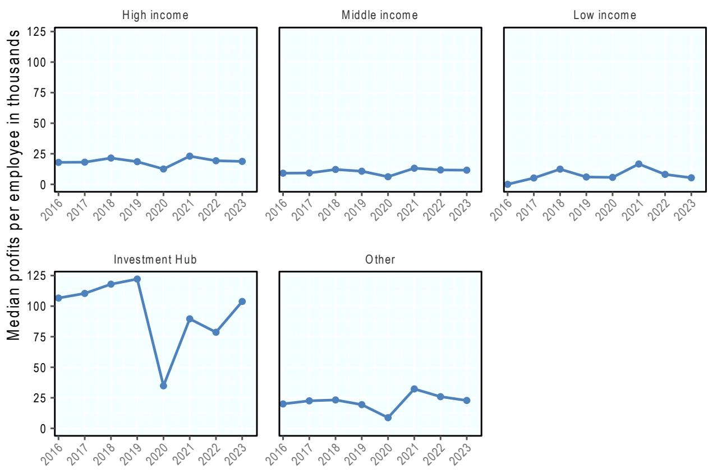  
Note: “Other” reflects aggregate geographic groupings and Stateless entities. Source: Anonymised and Aggregated CbCR statistics.

Figure 7.8. Median total revenues per employee: Distribution within income groups  
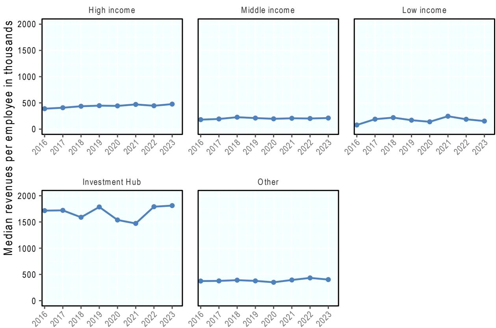  
Note: “Other” reflects aggregate geographic groupings and Stateless entities. Source: Anonymised and Aggregated CbCR statistics.  
StatLink https://stat.link/spick0

On average, the share of related party revenues in total revenues is higher for MNEs in certain jurisdictions. Figure 7.9 plots the distribution of related party revenues as a share of total revenues, by income group. On average, the share of related party revenues in total revenues is higher in investment hubs than in high-, middle- and low-income jurisdictions. In investment hubs, related party revenues account for over 30% of total revenues, whereas the median share of related party revenues in high-, and middle-income jurisdictions is 20% and 14% respectively. The median share of related party revenues in low-income jurisdictions is much lower at just 7%. While high levels of related party revenues may be commercially motivated, they are also a high-level risk assessment factor and could be evidence of tax planning.

Figure 7.9. Median related party revenues shares: Distribution within jurisdiction groups  
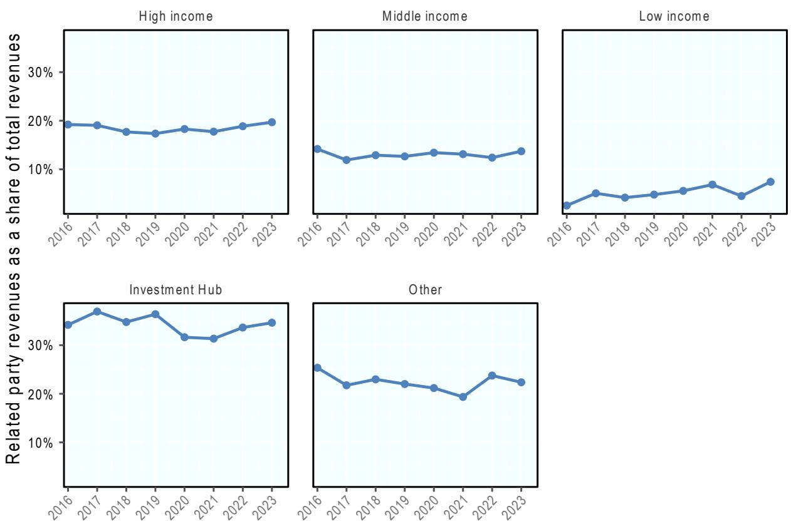  
Note: “Other” reflects aggregate geographic groupings and Stateless entities. Source: Anonymised and Aggregated CbCR statistics.

StatLink https://stat.link/rcx2bz

OECD (2015), Measuring and Monitoring BEPS, Action 11 - 2015 Final Report, OECD/G20 Base Erosion and Profit Shifting Project, OECD Publishing, Paris, https://doi.org/10.1787/9789264241343-en.

## Notes

$^{1}$ In the case of the United States, CbCR data are less granular than Inland Revenue Service (IRS) Form 5471, 8865, and 8858 data.

$^{2}$ With the exception of stateless income, which could relate to either domestic or foreign activities.

$^{3}$ The total number of MNEs covered in the 2023 CbCR statistics is 9400. This includes all headquarter MNEs, MNEs that provide foreign information only and MNEs that have chosen surrogate filing.

$^{4}$ Foreign MNEs' contributions might be understated for two main reasons: first, some jurisdictions provided limited geographical disaggregation; second, the contributions of MNEs with parents headquartered in jurisdictions that did not provide data are missing.

$^{5}$ Profits may be overestimated due to the inclusion of intra-company dividends as described in the CbCR disclaimer available in the Corporate Tax Statistics Explanatory Annex. To evaluate the potential magnitude of included dividends country specific analyses are available at: Netherlands: https://www.oecd.org/content/dam/oecd/en/topics/policy-sub-issues/corporate-taxation/netherlands-cbcr-country-specific-analysis.pdf; Ireland: https://www.oecd.org/content/dam/oecd/en/topics/policy-sub-issues/corporate-taxation/ireland-cbcr-country-specific-analysis.pdf; Italy: https://www.oecd.org/content/dam/oecd/en/topics/policy-sub-issues/corporate-taxation/italy-cbcr-country-specific-analysis.pdf; Sweden: https://www.oecd.org/content/dam/oecd/en/topics/policy-sub-issues/corporate-taxation/sweden-cbcr-country-specific-analysis.pdf; United Kingdom: https://www.oecd.org/content/dam/oecd/en/topics/policy-sub-issues/corporate-taxation/united-kingdom-cbcr-country-specific-analysis.pdf.

$^{6}$ Jurisdiction groups (high-, middle- and low-income) are based on the World Bank classification resulting in 63 high-income jurisdictions, 101 middle-income jurisdictions, and 24 low-income jurisdictions. The 29 investment hubs are defined as those jurisdictions with a total inward Foreign Direct Investment (FDI) position above 150% of gross domestic product (GDP).

## Corporate Tax Statistics 2026

Corporate Tax Statistics is an OECD flagship publication on corporate income tax, providing comprehensive data on corporate taxation, multinational enterprise group (MNE) activity, and base erosion and profit shifting (BEPS) practices. It supports the measurement and monitoring of tax avoidance through a wide range of indicators, including data on corporate income taxes, corporate tax rates, revenues, effective tax rates, and tax incentives for research and development (R&D) and innovation. The publication also includes anonymised and aggregated country-by-country reporting (CbCR) data providing an overview on the global tax and economic activities of thousands of MNEs. The 2026 edition covers anonymised and aggregated CbCR data on the activities of almost 9 400 MNEs headquartered in over 60 jurisdictions and includes improved geographical breakdowns for many jurisdictions. These continuing improvements allow for a more detailed and robust analysis of the distribution of key financial variables, such as profits, revenues and taxes across jurisdictions.