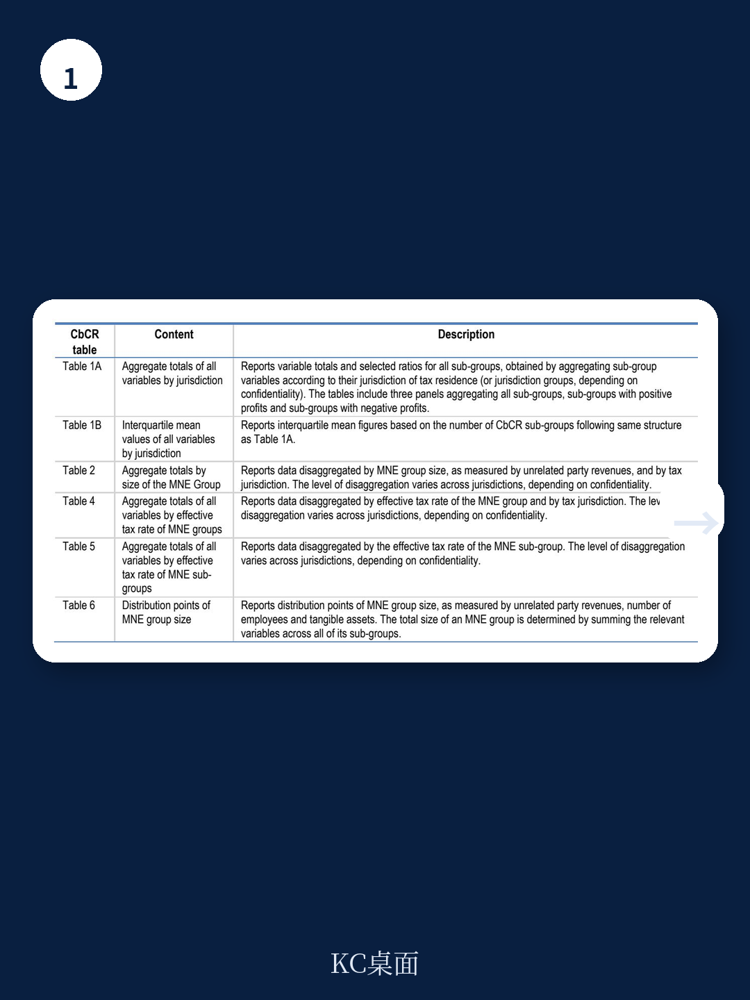
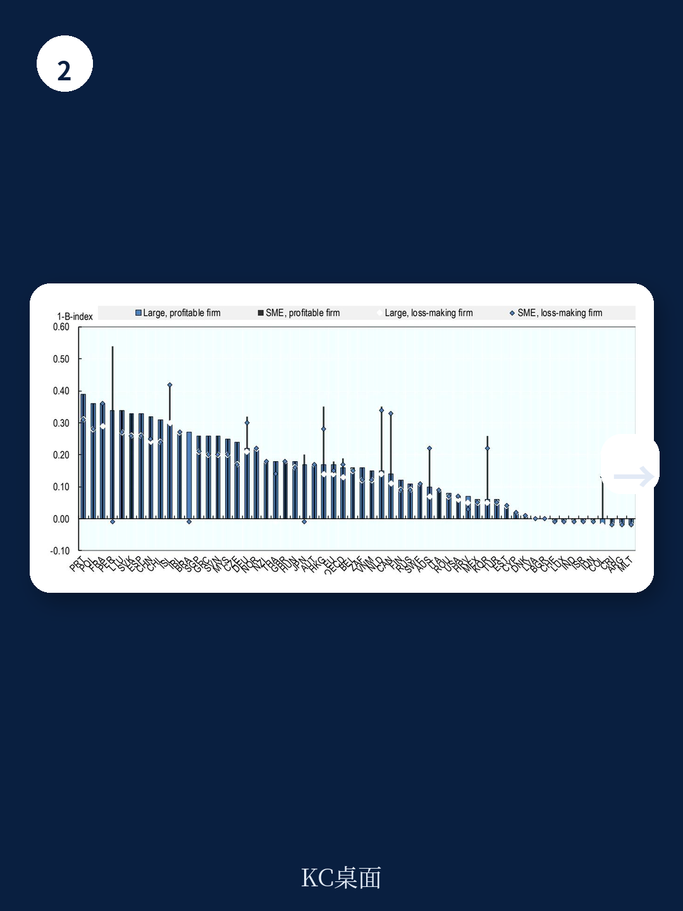

# 经合组织：2026年企业税统计-研究中心与全球利润分布

全球大型跨国企业集团的利润分布仍高度集中。经合组织在2026年版《企业税统计》中，基于来自60多个总部辖区的约9400家跨国企业集团的国别报告数据，呈现了一个持续多年的结构性特征：研究中心辖区的员工人均利润和人均收入，显著高于高收入、中等收入和低收入辖区。这一差距在2023财年的数据中依然清晰可辨。

报告将研究中心定义为“内向外国直接研究存量超过GDP 150%”的辖区。在这些地方，员工人均收入中位数达到181.1万美元，而高收入辖区为47.7万美元，中等收入辖区为21.1万美元，低收入辖区仅为15.3万美元。利润端的差距同样显著。报告谨慎指出，这可能反映资本密集度或劳动生产率的差异，但也“至少部分地是税基侵蚀和利润转移的指标”。

## 1. 关联方收入占比在研究中心明显偏高

国别报告数据还揭示了另一个与利润转移行为高度相关的指标：关联方收入占总收入的比例。在研究中心，这一比例的中位数超过30%，高收入辖区为20%，中等收入辖区为14%，低收入辖区仅为7%。报告明确表示，虽然高水平的关联方收入可能有商业动机，但它也是一个“高不确定性评估因素”，可能构成税务筹划的证据。

这一数据维度为监管者和研究者提供了一个可量化的观察窗口。关联方交易的比例越高，利润通过转让定价等方式被重新配置的空间通常也越大。

> **KC评论：** 人均收入和关联方收入占比这两个指标放在一起看，比单独看税率或利润总额更有意义。研究中心的高人均收入不一定来自更高的运营效率，而可能来自利润集中配置。报告没有直接断言因果关系，但数据指向性已经足够明确。

## 2. 全球最低税实施前的利润分布基线

这份报告发布的时间点值得注意。2026年版覆盖的是2023财年的国别报告数据，此时全球最低税（支柱二）尚未全面落地。因此，这些数据实际上构成了一个“政策实施前”的基线。

报告显示，跨国企业集团在研究中心申报的利润总额，与其在这些辖区的实际宏观环境活动（以员工人数和实物资产衡量）之间，仍存在系统性偏离。这种偏离的规模，正是支柱二试图通过全球最低有效税率来压缩的空间。未来的数据版本将能够直接检验这一政策是否改变了企业的利润申报行为。

## 3. 国别报告数据的覆盖范围仍在扩大

2026年版的一个技术性进步是数据覆盖面的改善。报告提到，更多辖区提供了更细化的地理分解，这使得对关键财务变量（利润、收入、税款）在辖区间分布的描述更加稳健。目前，国别报告数据覆盖了最多60个总部辖区和233个附属辖区，时间跨度为2016至2023年。

对于研究者而言，这一数据库的价值在于它提供了此前无法获得的、基于企业层面汇总的全球宏观环境活动全景。报告也坦承，美国的数据颗粒度低于其国内申报表，且部分辖区未提供数据可能导致外国跨国企业贡献被低估。这些限定条件提醒读者，数据虽在改善，但仍不完整。

## 4. 法定税率继续节奏变化，但有效税率分化加剧

除国别报告数据外，报告还更新了法定税率和前瞻性有效税率。2026年全球平均法定企业所得税率延续了长期节奏变化趋势，但不同资产类型和辖区的有效税率差异依然显著。报告中的前瞻性有效税率模型显示，对研发研究的无形资产，其有效平均税率远低于对机器设备或建筑的研究，这反映了各国通过税收激励引导创新投入的政策意图。

研发税收激励的指标进一步印证了这一趋势。2025年的数据显示，部分OECD国家通过支出型和收入型税收优惠，将研发研究的有效平均税率压至接近零甚至负值。这意味着，税收政策正在系统性地重塑企业的研究决策——资本流向哪里，不仅取决于市场机会，也取决于税制设计。

这份报告的核心价值不在于给出一个简单的结论，而在于提供了一套可交叉验证的数据框架。对于关注跨国企业税务策略和全球税制改革的读者，国别报告数据中的人均利润、关联方收入占比和辖区间分布，是三个值得持续追踪的锚点。

For informational purposes only. Portions may be generated,translated,summarized,or edited with AI assistance based on source materials and may contain omissions or errors. Please verify independently. This is not investment,legal,tax,accounting,or other professional advice.

