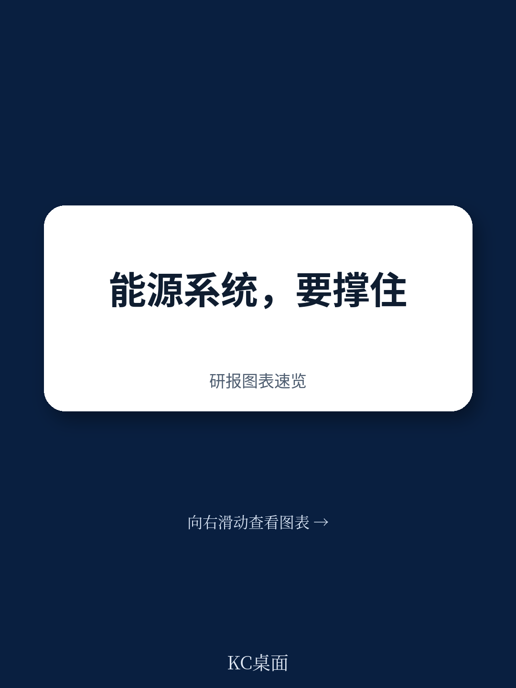
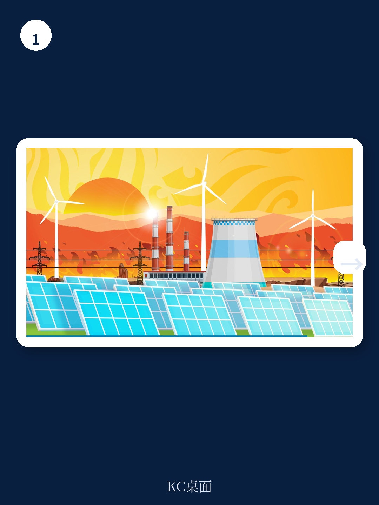
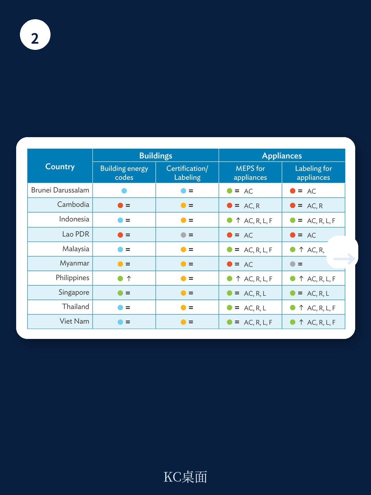

# 亚洲开发银行：能源行业数据与主题变化观察

亚太地区的能源基础设施正在承受日益频繁的极端天气冲击。高温导致停电，洪水和滑坡损毁资产，热带气旋和海平面上升威胁沿海设施。亚洲开发银行这份报告的核心判断是：能源系统的气候适应不是远期规划，而是当前必须推进的工程。报告识别出四个关键障碍，并为政府、能源供应商和消费者分别列出了可操作的行动清单。

## 1. 国家气候战略中能源适应优先级仍然偏低

截至2024年，全球提交的国家自主贡献中，只有41%将能源部门列为适应优先领域。在国家适应计划中，这一比例更低——截至2023年，48份计划中仅有13份（27%）明确纳入能源适应。亚洲开发银行的发展中成员国表现略好：43%的NDC和63%的NAP将能源列为适应优先项。但报告认为，考虑到气候变化对能源系统冲击的规模，这些数字仍远远不够。

> **KC评论：** 能源适应在气候政策中长期被减排议题覆盖。这份报告用NDC和NAP的覆盖率数据说明，政策框架层面的缺口是系统性问题，不是个别国家执行不力。

## 2. 适应资金流向与需求之间存在结构性错配

能源是适应融资需求最大的部门之一，但资金供给严重不足。2023年，多边开发银行在能源、交通及其他建成环境和基础设施领域的适应融资承诺仅为72.5亿美元，占这些部门气候融资总额（764.5亿美元）的不到10%。报告特别指出，私营部门在发展中国家参与适应融资的意愿有限，原因包括前期成本高、长期适应收益被低估、缺乏可靠气候不确定性数据、垄断性市场结构以及政策不确定性。

## 3. 气候信息服务的可及性和准确性制约决策质量

尽管气候和天气数据对能源系统规划越来越关键，开发者和读者仍普遍反映难以获取和解读这些信息。截至2022年，全球气象水文部门向能源行业提供数据服务的比例仍然有限。报告建议，政府应加强主要能源资产附近的观测站网络，能源供应商应开展系统的气候不确定性影响评估并将结果反馈至国家信息系统，消费者则可通过安装能耗监测系统提供需求侧数据。

## 4. 创新适应技术的部署速度落后于技术成熟度

报告认为，许多适应技术已经成熟且宏观环境可行，但在发展中地区的推广仍然缓慢。可变可再生能源技术本可通过能源来源的多样化和去中心化增强系统韧性，但在许多国家渗透率仍然偏低。智能电网和高效冷却解决方案的部署同样不足。原因包括认知不足、技术能力有限、融资成本高、制度框架薄弱以及技术需要本地化适配。

## 5. 各利益相关方的具体行动路径

报告为三类主体分别设计了行动框架。政府层面，需要将能源纳入国家适应战略，组织利益相关方磋商以识别项目全生命周期的具体行动，并通过混合融资和不确定性分担机制撬动私人资本。能源供应商层面，应将气候不确定性评估系统性地嵌入研究规划，通过技术和地理多样化增强韧性，并利用保险作为不确定性转移工具。消费者层面，可以通过在购电协议中加入可靠性条款来推动供应商采取适应措施，同时通过购买高效设备加速创新技术部署。

For informational purposes only. Portions may be generated,translated,summarized,or edited with AI assistance based on source materials and may contain omissions or errors. Please verify independently. This is not investment,legal,tax,accounting,or other professional advice.

