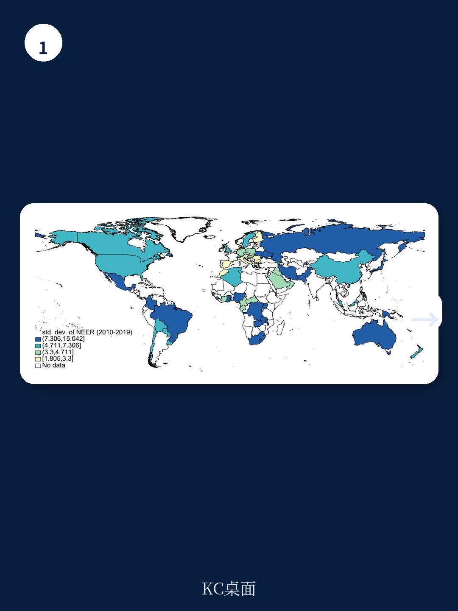
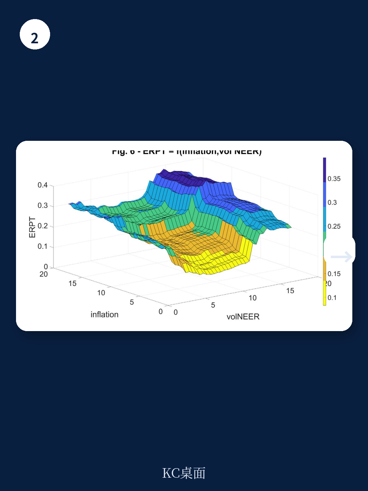

# 国际清算银行：货币市场与相关指标观察

汇率变动对消费者价格的影响程度，即汇率传导效应，在不同国家和时期差异显著。国际清算银行最新工作论文基于98个地区、跨越四十年的数据，采用计量宏观环境学与随机森林方法，系统识别了驱动汇率传导强度的关键因素。报告的核心发现是：宏观环境规模与通胀水平是解释传导效应的最强变量，而贸易开放度的重要性远低于理论预期。

论文首先通过Pesaran-Smith均值组估计量测算了各国各时期的汇率传导系数。结果显示，汇率传导通常较快，但长期呈下降趋势。在发达地区，一年期传导系数从全样本的7.6%降至2010年代的4.4%；新兴市场与发展中地区的传导系数变化较小，维持在17%至20%之间。

> **KC评论：** 发达地区与新兴市场之间传导系数的差距，并非单纯由汇率制度或开放度决定。报告后续的随机森林分析将揭示，宏观环境规模与通胀水平才是更根本的解释变量。

## 1. 随机森林方法识别出通胀水平与宏观环境规模为最强关联因素

论文在第二阶段采用随机森林方法，将第一阶段估计的传导系数与理论文献中提出的潜在驱动因素进行关联分析。这一非参数方法的优势在于能够捕捉高度非线性关系，且无需对参数进行精细调校。

分析结果明确显示，宏观环境规模与通胀水平是影响汇率传导程度的最强因素。宏观环境规模往往与定价到市场的程度相关，大型地区的企业更倾向于根据目的地市场特征定价，从而降低汇率传导。通胀水平则直接影响价格调整频率：高通胀环境下企业更频繁调整价格，汇率变动更快传导至消费者价格。

产品同质性与汇率波动性紧随其后，成为第三和第四重要的因素。产品同质性越高，替代性越强，汇率变动越容易通过竞争渠道传导至价格。

## 2. 通胀低于5%时汇率传导效应显著受限

随机森林方法揭示了一个关键的非线性关系：只要通胀率保持在5%以下，汇率传导效应就相对温和。这一阈值效应无需任何先验假设或函数形式设定，完全由数据驱动得出。

报告认为，这一发现具有明确的政策含义。成功维持价格稳定是限制汇率传导程度的关键前提。对于通胀目标制地区而言，将通胀锚定在低水平不仅有助于稳定物价预期，还能有效降低外部汇率冲击对国内价格的传导。

> **KC评论：** 5%通胀阈值的存在，意味着新兴市场若能将通胀控制在个位数低位，即使汇率波动较大，其对消费者价格的传导也可能低于高通胀环境下的水平。这一机制为货币政策框架设计提供了量化参考。

## 3. 汇率波动性与传导效应呈U型非线性关系

论文另一个重要发现是汇率波动性与传导效应之间的U型关系。当汇率波动性从低水平上升时，传导效应先下降；在中等波动性水平达到最小值；随后随波动性进一步上升而重新增强。

这一发现有助于调和此前文献中关于汇率波动性对传导效应影响的分歧结论。部分研究认为高波动性导致更频繁触及价格调整阈值从而推高传导，另一些研究则发现波动性增加反而降低了传导。报告指出，两种结论可能分别对应U型曲线的不同区间。

对于政策制定者而言，这一U型曲线提供了可参照的基准。若希望稳定国内通胀或更好地隔离外部汇率波动影响，可以对照本国汇率波动性在U型曲线上的位置，评估是否需要通过干预或其他工具调整波动水平。

## 4. 财政健康度与汇率制度对传导效应的影响

论文进一步分析了政策体制与结果对汇率传导的影响。研究发现，当通胀偏离目标幅度较小时，汇率传导程度最低。这与此前通胀阈值效应的发现一致：通胀稳定在目标附近是限制传导的关键。

汇率制度方面，事实上的管理浮动或自由浮动制度下，传导效应最低。这一结果可能反映了浮动汇率制度下市场对汇率变动的吸收能力更强，减少了向价格的传导。

值得关注的是，报告首次提供了财政健康度与汇率传导之间关系的证据。以稳健财政账户衡量的财政政策可信度越高，汇率传导效应越低。这一发现将财政纪律与汇率传导联系起来，拓展了传统分析框架。

论文作者指出，这些发现对后疫情时代尤其具有参考价值。全球通胀意外回升、定价行为变化、财政与货币格局剧烈调整，以及地缘政治碎片化导致的贸易模式变化，都可能改变汇率与消费者价格之间的关系。若地区的宏观或结构性特征发生持续变化，汇率传导机制也可能随之调整。

For informational purposes only. Portions may be generated,translated,summarized,or edited with AI assistance based on source materials and may contain omissions or errors. Please verify independently. This is not investment,legal,tax,accounting,or other professional advice.

