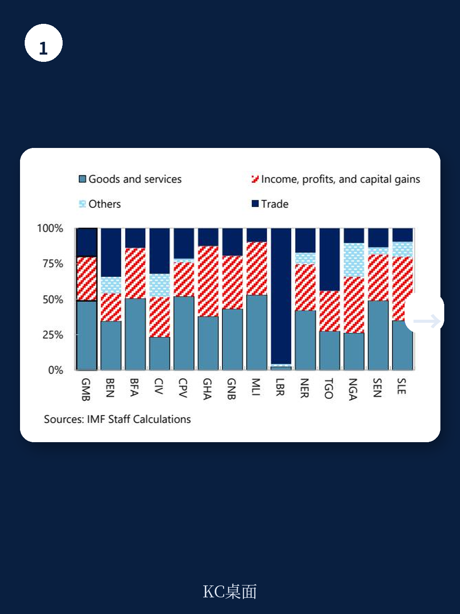
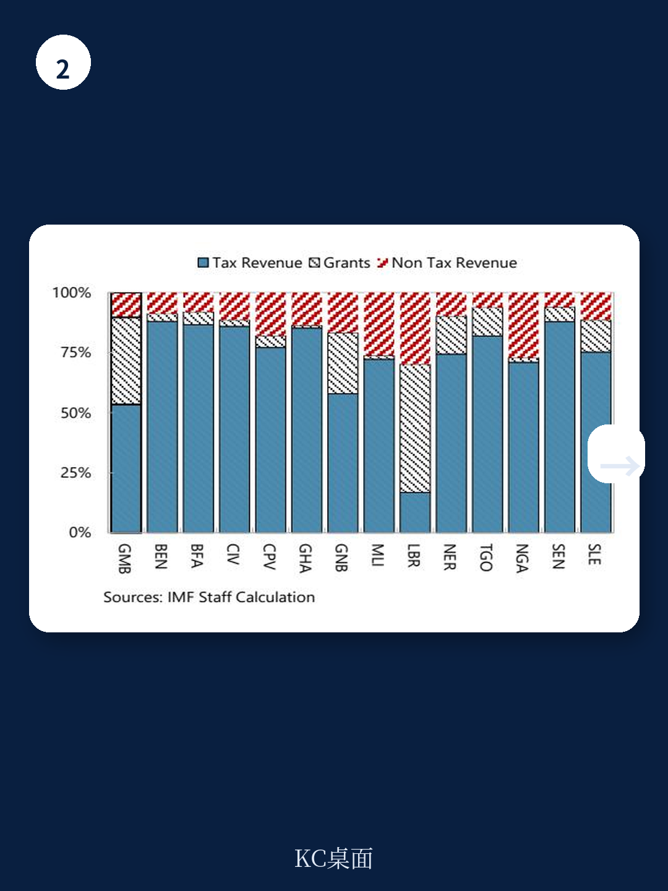

# IMF：行业规则与主题变化观察

冈比亚近年税收收入占GDP比重持续上升，2025年达到约13%，高于西非地区低收入国家平均水平。但这份IMF于2026年7月发布的国别报告指出，这一数字仍低于15%的常见充足性门槛。更关键的是，冈比亚财政收入高度依赖外部赠款和边境税，前者面临全球援助削减的不确定性，后者随着非洲大陆自由贸易区推进将逐步收窄。报告的核心判断是：冈比亚的税收潜力并非被严重低估，其税收缺口约为GDP的2.5个百分点，低于低收入国家平均水平——这意味着靠修补现有漏洞的空间有限，下一步收入增长必须依赖制度质量的系统性提升。

## 1. 税收结构依赖边境税，外部冲击敞口明显

报告数据显示，冈比亚约25%的税收收入来自关税和贸易相关税种，而低收入国家同类收入平均占比为19%。这种结构在短期内便于征管，但暴露了两个不确定性。一是外部援助波动：赠款在冈比亚政府总收入中的占比显著高于区域可比国家，而近期主要捐助国援助削减的规模和时点均不确定，直接冲击预算稳定性。二是贸易自由化不确定性：非洲大陆自由贸易区的逐步推进将削弱边境税基，倒逼税源从边境向内需转移。报告认为，冈比亚需要从税种多元化转向税基和工具的多元化，重点强化国内消费税、所得税和财产税的贡献。

> **KC评论：** 边境税占比高本身不是问题，问题在于冈比亚缺乏替代税基。报告用“税基和工具的多元化”而非简单“税种多元化”，意在提醒读者：新增一个税种不等于建立有效税基，征管能力和合规文化才是瓶颈。

## 2. 税收缺口低于同类国家，制度质量成为天花板

IMF采用随机前沿分析法，基于154个国家1980至2024年的面板数据，估算冈比亚2017至2023年的平均税收潜力为GDP的12.6%，实际税收收入约10.1%，缺口约2.5个百分点。这一缺口显著低于低收入国家平均的4.9个百分点。换言之，冈比亚在现有结构性条件和制度能力下，税收表现已经相对不错。报告引用Baer等人2025年的研究指出，若将低收入国家的公共机构质量提升至新兴市场地区水平，可额外带来约GDP的1.2%的收入。这意味着，冈比亚下一步的税收增长不能仅靠行政修补，而需要改善治理、公共财政管理和整体制度能力。

## 3. 2026-2030年国内资源动员战略已启动，重点在税式支出和数字化

冈比亚政府2025年9月批准的国内资源动员战略，设定了到2030年将税收占GDP比重提升至约15%的目标，对应约3.2个百分点的增量。报告梳理了六个支柱下的具体进展：税式支出框架已初步建立，2025年数据已报送内阁；所得税和增值税立法改革正在进行，重点包括跨境交易征税和反避税条款；财产税改革已获IMF技术援助，涵盖覆盖范围、估值方法和法律框架。在征管端，IMF的Revenue Assessment and Yield Tool评估显示，冈比亚税务局战略计划在合规不确定性管理、数字化和人力资源管理三个类别覆盖完整，但在第三方数据使用、高净值个人专项管理和强制执行策略上仍为部分覆盖。报告估算，若全面实施该战略计划，可带来约GDP的1.3%的收入增长，但更现实的参照是向低收入国家和撒哈拉以南非洲平均水平靠拢，对应约0.7个百分点的增量。

## 4. 征管改革收益存在时滞，中期投入不可回避

报告特别指出，税收征管改革的收入效应往往滞后显现。冈比亚税务局计划中的数字化和系统升级，在初期可能更多体现为成本而非收益。IMF建议将改革视为对中期税收能力的研究，而非短期增收工具。若执行持续，五年后对税收比率的拉动效应可能加速。这一判断对决策者的含义是：不能因初期收入增长不明显而放弃改革节奏，也不能用短期指标衡量制度建设的成败。

> **KC评论：** 报告用“0.7至1.3个百分点”的区间而非单一数字，本身就暗示了不确定性。读者应关注的是改革覆盖的完整度——哪些领域已落地、哪些仍为部分覆盖——而非精确的增收预测。

For informational purposes only. Portions may be generated,translated,summarized,or edited with AI assistance based on source materials and may contain omissions or errors. Please verify independently. This is not investment,legal,tax,accounting,or other professional advice.

