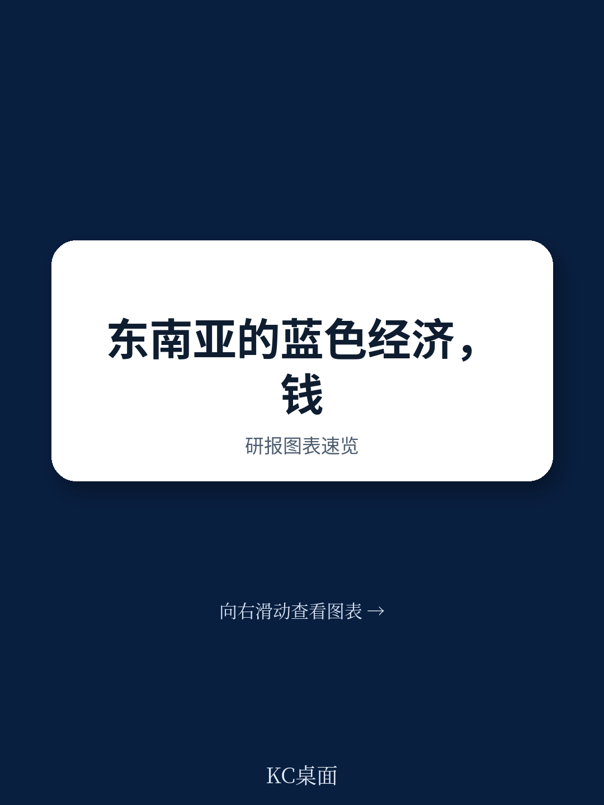
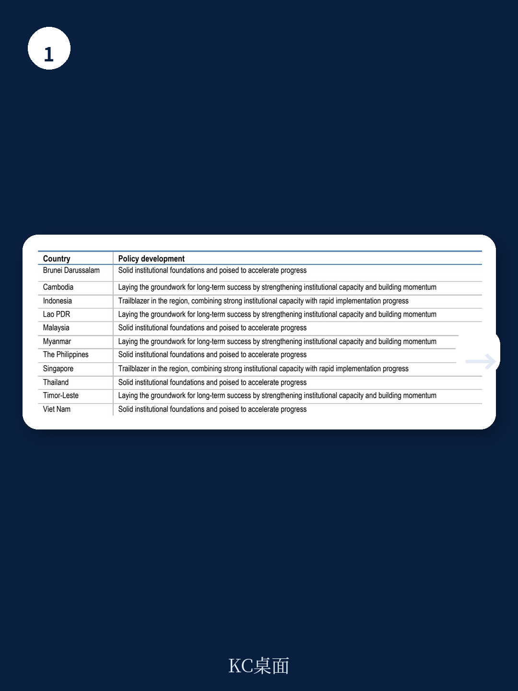
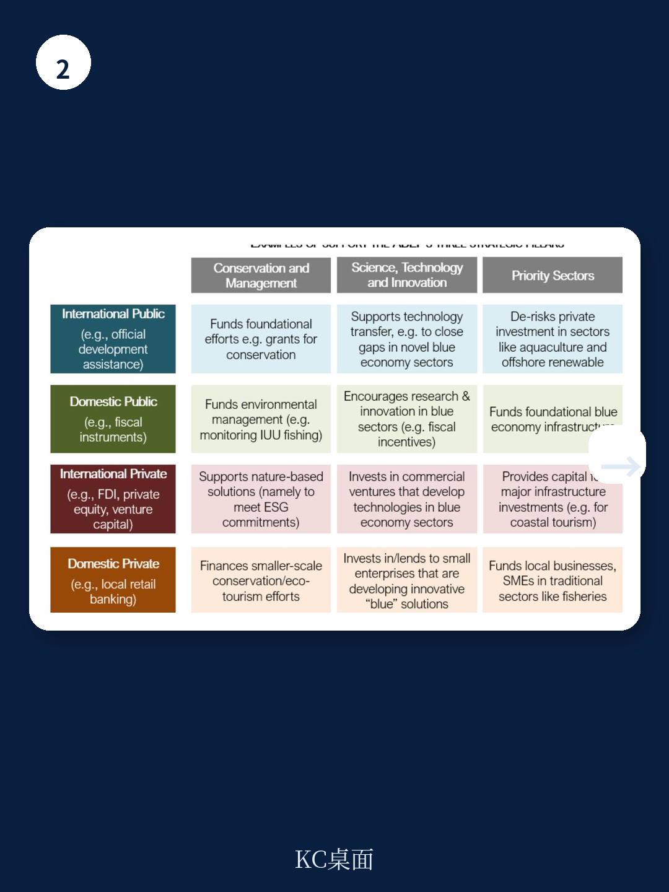

# 经合组织：研究主题与行业变化观察

东南亚已成为全球第四大地区，其蓝色宏观环境——依赖沿海、海洋和淡水资源的全部宏观环境活动——在区域增长中扮演关键角色。但经合组织（OECD）最新发布的报告《Financing Southeast Asia's Blue Economy》指出，到2030年，该区域蓝色宏观环境面临近2.1万亿美元的融资缺口。这一数字并非理论估算，而是基于实现可持续发展目标所需研究与当前资金流之间的实际差距。

报告的核心判断是：东南亚蓝色宏观环境当前过度依赖官方发展援助（ODA），而这一资金来源正面临结构性调整。2022-2023年间，流向东南亚的海洋相关ODA年均约5.5亿美元，仅占区域整体融资组合的极小份额。更关键的是，早期预测显示，DAC成员国对东南亚的海洋相关ODA在2024-2029年间可能持续下降。这意味着，单纯依靠援助无法填补资金缺口，区域必须系统性地转向其他资本来源。

> **KC评论：** 2.1万亿美元缺口是到2030年的累计数字，不是年度需求。报告没有给出年度分解，但读者可以大致推算——如果按7年分摊，每年约3000亿美元。这与当前ODA规模（约5.5亿美元/年）之间的数量级差距，说明了融资结构转型的紧迫性。

## 1. 海洋相关ODA在规模、分配和交付上存在结构性缺陷

报告对2010-2023年间东南亚海洋相关ODA进行了系统梳理，发现三个突出问题。第一，规模不足。海洋相关ODA在区域ODA总量中的占比长期偏低，且未随蓝色宏观环境政策议程的推进而显著增长。第二，分配不均。资金流向与各国的专属宏观环境区面积和海岸线长度并不匹配——一些海洋资源丰富的国家获得的ODA反而较少。第三，交付效率低。报告追踪了承诺额与 disbursement（实际拨付）之间的差距，发现2010-2013年承诺的ODA中，仍有相当比例截至2023年尚未拨付。承诺与交付之间的时滞，削弱了援助的实际效果。

这些发现指向一个更根本的问题：ODA本身的设计逻辑——项目制、短期、依赖捐赠方优先事项——与蓝色宏观环境所需的长期、可预测、大规模研究之间存在结构性错配。

## 2. 替代资本来源存在但获取不均，政策环境是关键瓶颈

报告识别了东南亚蓝色宏观环境可获取的多种替代资本来源：外国直接研究（FDI）、国内私人资本、慈善捐赠、以及绿色、社会、可持续和可持续发展挂钩债券（GSSS债券）。但每种来源都面临特定约束。

FDI方面，东南亚整体FDI流入量可观，但海洋相关领域占比有限。报告使用FDI限制性指数衡量各国对外资的开放程度，发现部分东南亚国家在海洋宏观环境相关行业的FDI限制仍然较高。国内私人资本方面，区域内的资金包容性差异显著——新加坡、马来西亚的资本市场深度远高于柬埔寨、老挝和缅甸。慈善捐赠方面，流向SDG14（海洋可持续发展）的资金在东南亚整体慈善支出中占比极小。

报告特别强调了一个被低估的瓶颈：政策环境。即使资本在宏观层面可用，如果缺乏明确的蓝色宏观环境政策框架、海洋空间规划和项目准备管道，资本也不会自动流入蓝色宏观环境领域。报告发现，东南亚各国在蓝色宏观环境政策发展水平上差异巨大——部分国家已有专门战略，而另一些国家仍处于起步阶段。

## 3. 混合融资和创新工具已有实践，但可复制性仍需验证

报告用较大篇幅分析了混合融资（blended finance）和创新资金工具在东南亚蓝色宏观环境中的应用。混合融资——即使用开发性资金降低不确定性以撬动商业资本——在海洋相关领域的实践有限。报告数据显示，ODA撬动的私人资本中，流向海洋相关活动的比例远低于其他领域。

蓝色债券是另一个被重点讨论的工具。报告以塞舌尔主权蓝色债券和伯利兹债务换自然（debt-for-nature swap）为案例，展示了这些工具如何将债务重组与海洋保护目标挂钩。但报告也谨慎指出，这些案例的成功依赖于特定条件：主权信用评级、国际开发机构的信用增级、以及明确的保护承诺和监督机制。这些条件在东南亚部分国家并不完全具备。

> **KC评论：** 塞舌尔蓝色债券规模仅1500万美元，伯利兹债务换自然涉及3.64亿美元债务重组。这些数字与2.1万亿美元缺口相比只是示范性项目。报告没有回避这一点——它强调的是这些工具作为“学习案例”的价值，而非直接可规模化的解决方案。

## 4. 报告建议：国家层面打基础，区域层面促协调，发展伙伴重效率

报告在第五章提出了三级建议框架。国家层面，核心是建立蓝色宏观环境融资的基础条件：制定清晰的蓝色宏观环境战略、改善公共财政管理质量、加强项目准备能力。区域层面，东盟应利用2023年通过的《东盟蓝色宏观环境框架》推动协调行动，包括统一蓝色宏观环境分类标准、建立区域项目管道和知识共享平台。发展伙伴层面，在ODA预算调整的背景下，应优先追求“附加性”（additionality）——即确保开发性资金投向那些没有公共支持就无法启动的项目或工具，同时主动寻求蓝色宏观环境与气候、生物多样性、减贫等目标的协同效益。

报告特别强调，发展伙伴支持蓝色资金工具时，必须确保这些工具与受援国的优先事项一致，并且能证明其超越传统工具的附加价值。这不是技术细节，而是资源配置的原则性判断。

**一个可复用的观察框架：** 报告对资本类型的分类——按不确定性-回报特征将资本分为开发性资金、商业资本、慈善资本等——为读者提供了一个评估任何蓝色宏观环境项目融资可行性的基础框架。核心问题是：这个项目处于哪个不确定性-回报区间？它适合哪种资本类型？如果商业资本不愿进入，是因为项目本身不可行，还是因为政策环境增加了不必要的不确定性溢价？这个框架同样适用于其他新兴领域的融资分析。

For informational purposes only. Portions may be generated,translated,summarized,or edited with AI assistance based on source materials and may contain omissions or errors. Please verify independently. This is not investment,legal,tax,accounting,or other professional advice.

