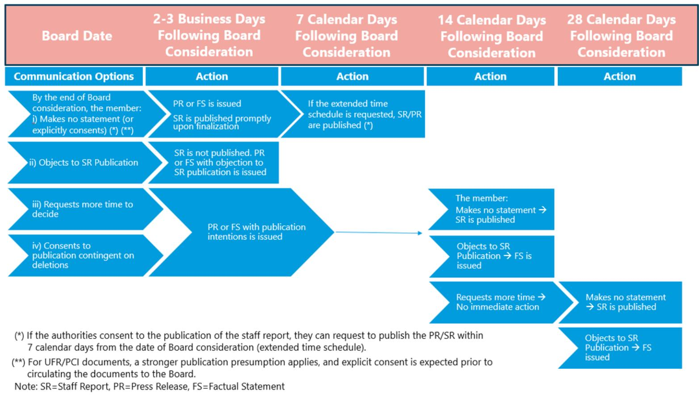
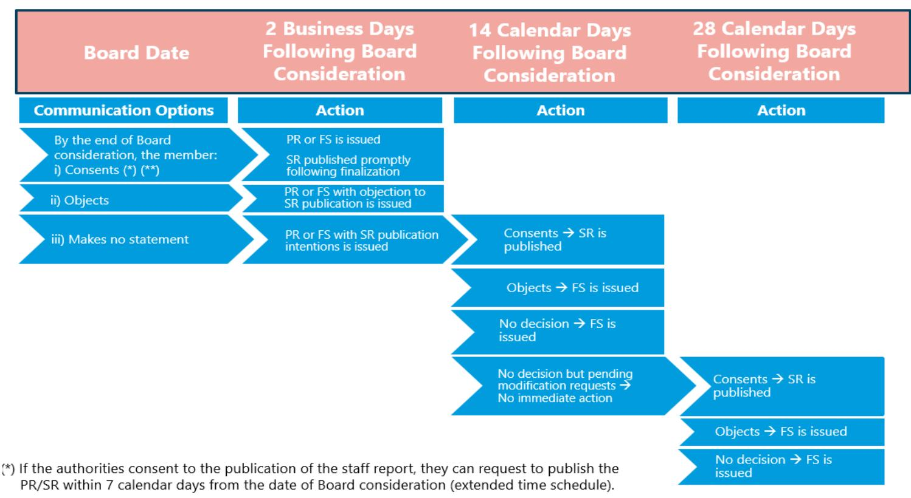
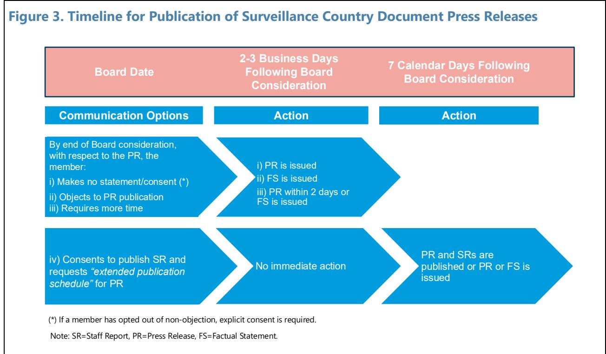
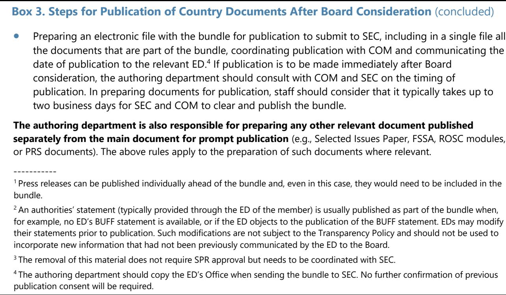
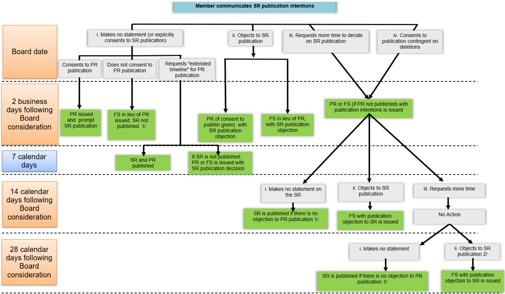
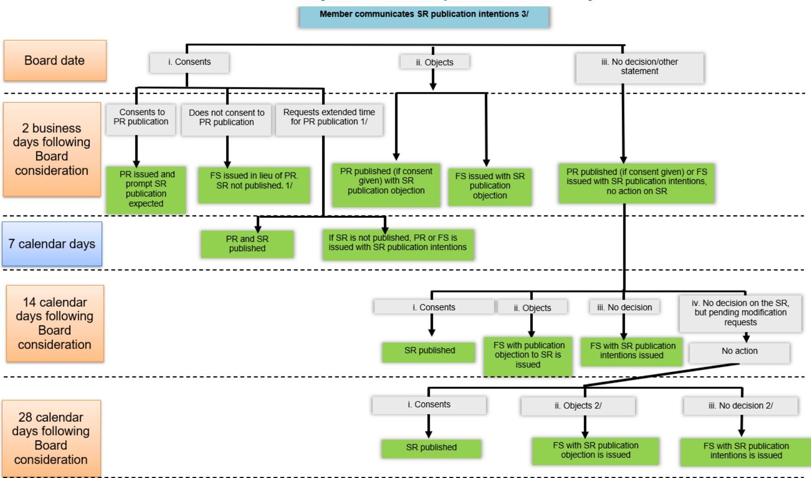
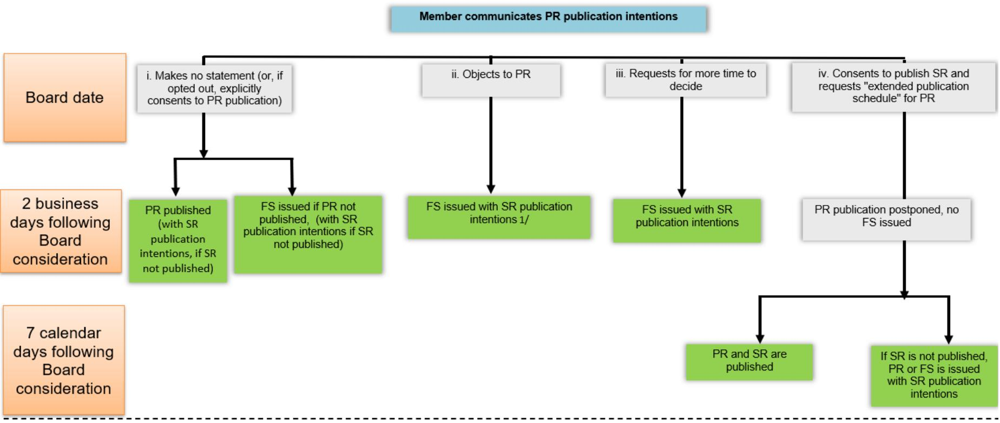
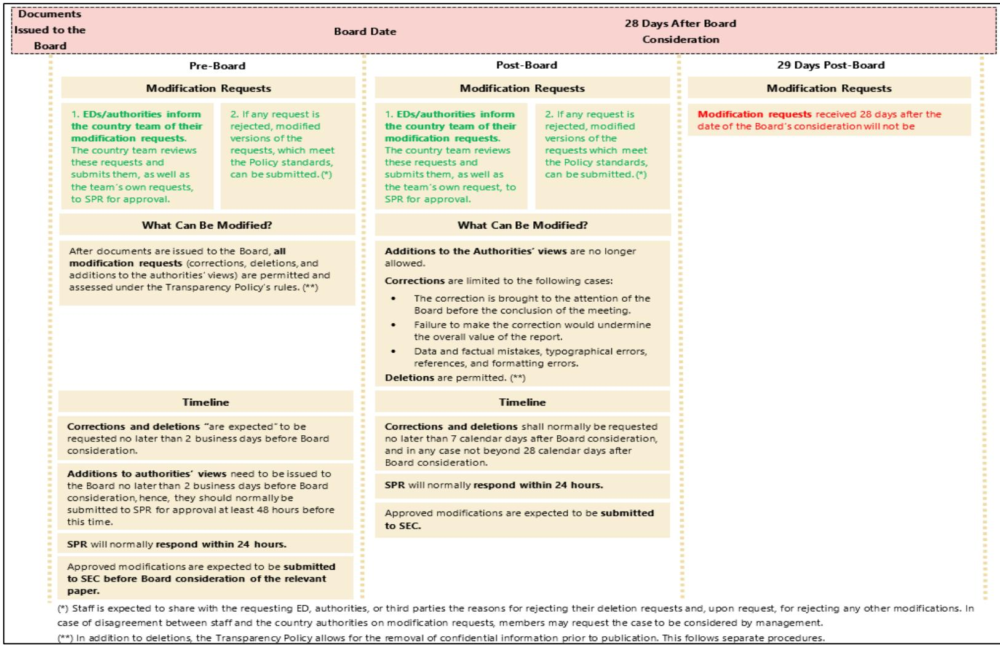

July 2026

## 2026 GUIDANCE NOTE ON THE FUND'S TRANSPARENCY POLICY

IMF staff regularly produces papers proposing new IMF policies, exploring options for reform, or reviewing existing IMF policies and operations. The Report prepared by IMF staff and completed on July 1, 2026, has been released.

The staff report was issued to the Executive Board for information. The report was prepared by IMF staff. The views expressed in this paper are those of the IMF staff and do not necessarily represent the views of the IMF's Executive Board.

The IMF's transparency policy allows for the deletion of market-sensitive information and premature disclosure of the authorities' policy intentions in published staff reports and other documents.

Electronic copies of IMF Policy Papers are available to the public from http://www.imf.org/external/pp/ppindex.aspx

June 30, 2026

# 2026 GUIDANCE NOTE ON THE FUND'S TRANSPARENCY POLICY

Approved By Christian Mumssen (SPR) Prepared by the Strategy, Policy, and Review Department in consultation with the Legal and the Secretary's Departments

CONTENTS
Glossary 3
I. INTRODUCTION 4
II. COUNTRY DOCUMENTS 6
A. Publication Regime 8
B. Consent to Publication 9
C. Publication Timeline for Staff Reports 10
D. Publication Timeline for Press Releases 16
E. Factual Statements in Case of Delayed or Non-Publication of Country Press Releases and Staff Reports 18
F. Modifications of Country Documents and Press Releases 20
G. Handling and Protecting Confidential Information 28
H. Steps for Publication of Country Documents After Board Consideration 31
I. Communicating with Country Authorities about Publication and Modification of Board Documents 32
III. POLICY DOCUMENTS 33
A. Publication Regime 33
B. Publication Timeline for Policy Documents and Press Releases 34
C. Modifications of Policy Documents 34
D. Press Releases for Policy Documents 37
IV. MULTI-COUNTRY DOCUMENTS 37
A. Multilateral Policy Issues Documents 38

B. Country Background Pages 38
C. Cluster Documents 39

V. ADMINISTRATIVE ERRORS, MODIFICATIONS OF PUBLISHED DOCUMENTS, AND DOCUMENTS PREPARED BY OTHER INSTITUTIONS 41
A. Administrative Errors 41
B. Modification of Published Documents 41
C. Documents Prepared by Other Institutions 42

VI. RESOLVING DISPUTES ABOUT THE APPLICATION OF THE RULES TO MODIFY DOCUMENTS 43

BOXES
1. Main Changes to the Transparency Policy in the 2024 Policy Review 5
2. Guidelines to Prepare and Draft Country Documents 6
3. Steps for Publication of Country Documents After Board Consideration 31
4. Treatment of Multi-Country Documents 40

FIGURES
1. Timeline for Publication of Surveillance Country Documents 12
2. Timeline for Publication of Surveillance Country Documents: Opt-Outs of Non-Objection 14
3. Timeline for Publication of Surveillance Country Document Press Releases 17

APPENDICES
I. Indicative List of Board Documents Subject to the Transparency Policy 44
II. Publication Policies for TA Reports, Safeguards Assessments, IMF Assessment Letters, Misreporting, Overdue Financial Obligations, Delayed Article IV Consultations, and FSAP Documents 47
III. A Reference Guide on Publication Expectations and Timing for Board Documents 50
IV. Publication Timeline for Country Documents and Press Releases 53
V. Publication of PRGS, PRSP, JSAN and HIPC Documents 56
VI. Press Releases: Content and Processing 58
VII. Publication of Documents in Languages Other Than English 65
VIII. Factual Statements in Case of Delayed or Non-Publication of Country Press Releases or Staff Reports 66
IX. How to Submit and Process Requests to Modify Country Documents 74
X. Guidelines on the Treatment of Confidential Information 75
XI. Transparency Policy Information Sheet for Country Authorities 80
XII. The Administrative Errors Procedure 83

## Glossary

AFSSR Assessment of Financial Sector Supervision and Regulation
APR Annual Progress Reports
COM Communications Department on the Observance of Standards and Codes
CRS Common Review System
DAR Detailed Assessment Report
DSA Debt Sustainability Analysis
ECF Extended Credit Facility
ED IMF Executive Director
EPE Ex-Post Evaluation
ERA Enterprise Risk Assessment
ESR External Sector Report
FM Fiscal Monitor
FSAP Financial Sector Assessment Program
FSSA Financial System Stability Assessments
GFSR Global Financial Stability Report
GRA General Resources Account
HIPC Heavily Indebted Poor Countries
IEO Independent Evaluation Office
I-PRSP Interim Poverty Reduction Strategy Papers
JSAN Joint Fund/World Bank Staff Advisory Notes
LEG Legal Department
LICs Low-Income Countries
LOI Letter of Intent
LOT Lapse of Time
MEFP Memorandum of Economic and Financial Policies
PCI Policy Coordination Instrument
PFA Post-Financing Assessment
PMB Program Monitoring with Board Involvement
PRA Ex-Post Peer Reviewed Assessment
PRGT Poverty Reduction and Growth Trust
PRSP Poverty Reduction Strategy Paper
PRGS Poverty Reduction Growth Strategy
ROSC Reports on Observance of Standards and Codes
RSF Resilience and Sustainability Facility
SEC Secretary's Department
SIP Selected Issues Paper
SLL Short-term Liquidity Line
SMP Staff-Monitored Program
SRDSF Sovereign Risk and Debt Sustainability Framework
SPR Strategy, Policy and Review Department
TMU Technical Memorandum of Understanding
UFR Use of Fund Resources
WEO World Economic Outlook

## I. INTRODUCTION

1. The Fund has adopted an overarching principle of transparency as set forth in the preamble to the Fund's Transparency Policy Decision ("Decision" or "Policy"). $^{1}$ The preamble states that the Fund will "strive to disclose documents and information on a timely basis unless strong and specific reasons argue against such disclosure." The preamble further emphasizes that in modifying documents covered by the Decision, the Fund will give due regard to protecting the independence and candor of staff analysis, while recognizing the necessity of modifications of such documents under some limited and defined circumstances.

2. To implement this principle, the Transparency Policy establishes a general presumption of publication and sets out the rules to modify Board documents. These documents include: (i) country documents, (ii) Fund policy documents, and (iii) multi-country documents prepared by staff for consideration or information of the IMF Executive Board (the "Board"). $^{2}$ The specific rules set by the Policy for the publication of these documents and their modification balance the different roles the Fund plays in fulfilling its mandate as both trusted advisor and global economic watchdog. As a trusted advisor, the Fund needs to protect the candor, openness, and confidentiality of its conversations with members. To be a credible advisor and economic watchdog, the Fund and its staff need to be (and be seen as) transparent, independent and candid in their advice, and staff analysis needs to be protected from undue pressures.

3. This note provides guidance to staff to implement the Fund's Transparency Policy. It updates, and replaces, the 2014 Transparency Policy Guidance Note to reflect the recent changes to the Transparency Policy Decision adopted in November 2024 (Box 1). This Guidance Note is organized as follows: section II provides guidance on the publication and the modification of country documents, including press releases, prior to publication, and on the treatment of confidential information; section III covers the publication and modification of policy documents prior to their publication; section IV addresses the procedures to modify and publish multi-country documents; section V covers provisions for rectifying administrative errors and modifying published documents. Finally, section VI considers the process for addressing disagreements about the application of the rules to modify Board documents.

## Box 1. Main Changes to the Transparency Policy in the 2024 Policy Review

## Reinforce the Policy's Principles and Ensure Adequate Coverage of the Policy

\- The Decision now includes, as one of the principles of the Policy, the objective of preserving the independence and candor of staff's views.

\- The Policy incorporates the principle that no changes to published documents should be permitted except under very limited circumstances.

\- Documents received from other institutions, required for Board consideration, are published together with the related staff report, unless the authoring institution requests or the Fund's Board decides otherwise; modifications by the authoring institution are only allowed prior to Board consideration.

## Support Faster Communication of the Board's Activities and Publication of Country Documents

## Press Releases

\- Consent for the publication of press releases is deemed to be provided unless, prior to the conclusion of the Board's consideration, the member explicitly objects or indicates that it requires more time to decide.

\- Any country document press release published separately from the staff report shall indicate the member's publication intention for the staff report.

\- Surveillance country document press releases should be issued no later than two business days after Board consideration. The member can request to postpone their publication up to 7 calendar days after Board consideration if it consents to publish the relevant staff report.

## Staff Reports

\- Consent to publication is deemed to be provided through non-objection unless, prior to the conclusion of Board consideration, the member objects to publication, requests additional time, or consents to publication subject to reaching agreement with the Fund on deletions.

\- If the member requests more time to decide on the publication of a country document, consent is deemed provided after 14 calendar days from Board consideration, unless the member objects to publication or requests additional time. In this latter case, consent is deemed provided 28 calendar days after Board consideration, unless the member objects to publication.

\- If a member objects to publication, a factual statement (or the press release) is issued providing notification that the member does not intend to publish the country report.

## Strengthen and Clarify the Rules and Processes to Modify Board Documents Prior to Publication

\- Limited additions to the authorities' views in surveillance country reports are allowed, subject to safeguards. Such additions should be issued to the Board not later than 2 business days before Board consideration of the relevant document.

\- Limited additions and revisions are allowed to the background section of surveillance document press releases to better reflect wording used in the related staff report and associated documents or to include information discussed during Board consideration and not included in the above-referenced documents; these revisions are in addition to the existing modification categories.

\- Requests to modify Board documents should be normally submitted no later than 7 calendar days after Board consideration. Requests received after 28 calendar days from Board consideration will not be considered.

\- The Policy now incorporates the process to remove confidential information from staff reports.

\- The Policy now incorporates the process for rectifying "administrative errors."

## Widen the Application of Procedures for Resolving Disputes About Modification Rules

\- The existing procedures for resolving disagreements between Management and a member (or between staff and the authorities) on the application of deletion rules would apply to disagreements on any type of modification.

## II. COUNTRY DOCUMENTS

This section provides guidance on the publication of country documents (including staff reports and press releases), their modification prior to publication, as well as the use of factual statements by staff. In addition, it offers practical guidance on preparing and submitting these documents for publication.

4. The Transparency Policy covers the publication of country documents prepared for Board meetings or lapse-of-time (LOT) consideration (“Board consideration”) or issued to the Board for information. $^{3}$ These documents pertain to individual countries and include documents (typically staff reports and press releases) related to surveillance, the use of Fund resources (UFR), and the Policy Coordination Instrument (PCI). They also include documents pertaining to regional surveillance discussions on common policies of a currency union and certain reports arising from Fund technical assistance (Appendix I).

5. Some country-related documents routinely circulated to the Board are not Board documents and are not covered by the Policy. These typically include country-related documents prepared by staff for audiences other than the Board. These documents can be published if both the country's authorities and Management consent to their publication or according to their own policies, when existing. $^{4}$ In addition, documents prepared by other institutions and required for consideration by the Board (e.g., Resilience and Sustainability Facility (RSF) Assessment Letters) are subject to different treatment (see section V.C).

6. In drafting country documents, staff should adhere to specific guidelines to safeguard staff independence and avoid undue pressures (Box 2).

## Box 2. Guidelines to Prepare and Draft Country Documents

\- Non-negotiation of documents. It is a paramount principle of the Fund, aimed at safeguarding the candor and independence of staff views, that staff reports must not be negotiated with country authorities or IMF Executive Directors (EDs). $^{1}$

\- No sharing of draft country documents or parts thereof, with the exceptions listed below. To buttress the prohibition on negotiation, staff may not share draft country documents or portions thereof (e.g., material that will appear in annexes) with country authorities or IMF Executive Directors (EDs). $^{2}$ However, the following can be shared:

Draft of the background section of press releases;

\- Selected Issues Papers (SIP) that do not contain staff advice; if they contain policy advice, only the factual parts can be shared; $^{3}$

Debt Sustainability Analysis (DSA) output (charts, tables, mechanical signal, risk and sustainability assessment), but the write-up, including text in the commentary boxes, should not be shared;

Reports on Observance of Standards and Codes (ROSCs) modules, Ex-Post Peer Reviewed Assessment (PRA) and Ex-Post Evaluation (EPE) reports, Financial Sector Assessment Program (FSAP) aide-mémoires and Technical Notes, Detailed Assessment Reports (DARs), and TA reports.

## Box 2. Guidelines to Prepare and Draft Country Documents (concluded)

In addition, staff is expected to share with the authorities:

The wording describing the authorities' views and to confirm their understanding of the authorities' views.

\- Avoid surprises. To ensure there are no surprises for the authorities when they see the country document, staff should ensure that all major issues covered in the staff report and accompanying documents have been discussed with the authorities and that they are aware of staff's positions. This is especially relevant in cases of combined Article IVs and UFR/PCI reports, given the different presumption of publication for these two types of documents (paragraphs 7–9).

\- Inform the authorities of their right of reply. When there are major differences in views, staff should remind the authorities that they can issue a statement to be published alongside the staff report as part of the document bundle. This “right of reply” statement can be the original ED’s BUFF statement, a revised BUFF statement, a separate statement from the authorities. $^{4}$

\- Provide candid and comprehensive assessments. The authorities' publication intentions should not affect the candor and comprehensiveness of staff reports.

\- Accurately characterize counterparts' views. Counterparts' views should be properly characterized and clearly identified and presented as official views of authorities, institutions, or personal views. When reporting third-party views, staff should identify their source (to the extent permitted by confidentiality needs).

\- Avoid politically charged language. While not shying away from candid assessments of relevant political economy issues, staff should avoid formulations that may be considered insulting or divisive in the member country.

\- Do not include in Board documents information provided by the member based on the understanding that it will remain confidential. In case of doubt, staff should clarify with the authorities whether the information is meant to remain confidential within staff/Management, or whether it can be shared with the Board and/or the public. While certain information cannot be withheld from the Board, (e.g., information required to be reported to the Fund under the Articles of Agreement or that staff considers necessary for the Board to make a decision), there are other modalities for sharing confidential information with the Board (see Section II.G).

\- Use internal services for the translation of documents to be transmitted to Management or the Board. To avoid inaccuracies and reputational risks to the Fund, official documents transmitted to Management and the Board should be based on translations by the Fund's internal services. Machine translated documents not certified by the Fund's services cannot be considered official documents and will not be modified to address translation mistakes unless these fall under the Policy's correction and deletion categories.

$^{1}$ Staff reports present the staff's independent and candid views, and staff should use its independent judgment to decide whether specific issues should be part of a staff report.

$^{2}$ For HIPC documents, this excludes the sections of the DSA that are a tripartite exercise between the Fund, the World Bank, and country authorities. Staff should be aware that the World Bank allows its staff to discuss draft HIPC documents with the authorities. This practice does not extend to Fund staff.

$^{3}$ In general, SIPs are not expected to contain policy advice.

$^{4}$ In addition, consistent with the Decision, the Board's internal work procedures (last updated in January 2026) indicate that a member country that has agreed to publication of a staff report may provide a statement regarding the staff report and the Executive Board's assessment. The statement is published together with the staff report and the press release summarizing the Board's assessment.

## A. Publication Regime

## "Voluntary but Presumed" Publication

## 7. The publication of country documents covered by the Transparency Policy is "voluntary but presumed," with the exception of statements on certain Fund decisions.

"voluntary but presumed," with the exception of statements on certain Fund decisions. "Voluntary" means that the publication of country documents is subject to the consent of the member to which the document pertains ("member concerned"). "Presumed" means that the Fund encourages each member to consent to the publication of such documents. These rules also apply to press releases issued in the context of Board consideration of country documents. The exception to this general rule is for statements issued by staff to the Board on Fund decisions about waivers of applicability or nonobservance of performance criteria, which are covered by the Decision, but can be published without the member's consent.

## Stronger Presumption of Publication for Certain Types of Country Documents

8. A stronger presumption of publication applies to all staff reports relating to UFR and PCIs, though their publication remains voluntary. Given the importance of these documents for markets and for public scrutiny and transparency of Fund-supported programs, members that request access to Fund resources or support under the PCI (initial requests, reviews) are expected to indicate, before circulation to the Board, that they explicitly consent to the publication of the related staff reports (including in cases where the UFR/PCI request or review is combined with an Article IV consultation). $^{5}$

9. A member's decision not to consent to publication of UFR or PCI staff reports will affect Management's recommendation to the Board about approval of the member's request.

\- The Managing Director ("Management") will generally not recommend that the Board approve a request for (i) access to resources in the General Resources Account (GRA), the Poverty Reduction and Growth Trust (PRGT), the RST, or under the HIPC Trust, or (ii) assistance through the PCI, unless the member explicitly consents to the publication of the associated staff report. This includes initial requests, completion of a review under an arrangement or a PCI, and augmentations, but does not apply to stand-alone requests for extensions of Fund arrangements or a PCI. $^{6}$

\- The Managing Director will not recommend that the Board approve (i) an arrangement or completion of a review under the PRGT, or (ii) a HIPC decision point or completion point decision, if the member concerned does not explicitly consent to the publication of its Interim

Poverty Reduction Strategy Paper (I-PRSP), Poverty Reduction Strategy Paper (PRSP), PRSP preparation status report, PRSP annual progress report, or Poverty Reduction Growth Strategy (PRGS).

\- If a member requesting UFR or support under the PCI consents to the publication of the staff report and subsequently withdraws its consent after the Board's consideration of the document, staff should inform Management and the relevant ED of the changes in publication consent. In these cases, Management does not generally recommend that the Board approve any subsequent reviews and new requests if previous staff reports regarding access to UFR or support under the PCI remain unpublished.

## B. Consent to Publication

## Consent Through "Non-Objection"

10. A member's consent to publish is typically obtained on a “non-objection” basis. This means that consent to publication of a country document is deemed to be provided by the member concerned unless, prior to the conclusion of the Board meeting at which the document is considered or the date of adoption of a decision on an LOT basis (“Board consideration”), the member notifies the Fund that it:

(i) Objects to the publication of the document;

(ii) Requires additional time to decide whether to publish; or

(iii) Consents to publication subject to reaching agreement with the Fund on deletions to the document.

Members can notify the Fund about (i)-(iii) above through the ED's BUFF statement, an oral or written statement to the Board, or inform staff before the conclusion of the Board's consideration. If the communication is made to staff (e.g., for LOT cases), staff should promptly inform the Secretary's department (SEC) via email (publicationreminder@imf.org). In the absence of any notifications about (i)-(iii) as referred above, consent to publication is deemed to have been provided and staff shall proceed to publish the country document promptly after the date of the Board's consideration. These rules apply to all country documents, including, for example, SIPs, FSSAs, and stand-alone DSAs. $^{7}$

## Opting Out of "Non-Objection"

11. A member may “opt out” of providing consent for publication of country documents through “non-objection.” In this case, consent will not be presumed and explicit consent by the member concerned is required for staff to proceed with the publication of any country documents related to the member. To opt out, the member should notify the Fund (SEC) in writing, via the

Executive Director (ED) of the member, that its country documents and related documents with the authorities' policy intentions should be published only with its explicit consent. SEC will record this choice on the cover memorandum of every country document about the member issued to the Board. The latest list of countries that have opted for explicit consent can be found in the most recent version of the Fund's yearly publication on the "Key Trends in Implementing the Fund's Transparency Policy."

## Consent to Publication of Press Releases for Country Documents

12. As for other country documents, publication of country-related press releases is voluntary, and publication consent is typically provided through non-objection. This means that consent is deemed to be provided by a member unless, prior to the conclusion of the Board's consideration of the matter to which the press release pertains, the member notifies the Fund that it: (i) objects to the publication of the press release; or (ii) requires additional time to decide whether to publish the press release. However, if a member has opted out of providing consent to the publication of its country documents through non-objection, then the publication of a press release will require the member's explicit consent.

## C. Publication Timeline for Staff Reports

13. To support the timely publication of country documents, the Policy defines specific timelines for the publication of staff reports and country press releases. For staff reports, the timeline depends on whether the member provides its publication decision through non-objection or whether the member has opted out of this modality. $^{8}$

Publication Timeline for Members that Provide Consent Through Non-Objection

14. The Policy establishes a timeframe for members to communicate their publication decisions and for the Fund to publish country staff reports (Figure 1, Appendix IV). There are three possible decision points:

\- Before the conclusion of the Board's consideration. If there is no notification from the member before the conclusion of the Board's consideration, publication consent is deemed to have been provided (paragraph 10), and the Fund shall promptly publish the staff report, following the resolution of any modification requests. No further confirmation of consent to publication from the authorities or the relevant ED is required (the authoring department will coordinate the publication process, see Box 3). In addition, for surveillance documents, the member that has consented to the publication of the staff report can request a 7 calendar day publication schedule, which applies to the combined publication of the staff report and the associated press release ("extended time schedule," see paragraph 18). $^{9}$ If, before the conclusion of the Board's consideration the member objects to publication, a factual statement is issued (see section II.E).

\- 14 calendar days after the date of the Board's consideration. If, before the conclusion of the Board's consideration, the member requested additional time or consented to publication subject to agreement on specific deletions (paragraph 10, cases (ii)-(iii)), and no further notification is received within 14 calendar days after the date of Board consideration, publication consent is deemed to have been provided. In this case, the Fund will promptly proceed with the publication of the document, following the resolution of any modification requests. If in the 14 calendar days following Board consideration the member objects to publication, a factual statement is issued (see section II.E). However, during this time, the member may request another time extension to decide about publication. In this case, the next decision point is at 28 calendar days after Board consideration.

\- 28 calendar days after the date of the Board's consideration. If the member that requested another time extension to decide on publication has not explicitly objected to publication within 28 calendar days from Board consideration, the member's consent to publication is deemed to have been provided. The Fund will promptly proceed with the publication of the staff report, following the resolution of any pending modification requests. After 28 calendar days, there are no further time extensions.

15. If, at any time, the member objects to the publication of the document, the Fund will issue a factual statement informing the public of the Board's consideration and the member's publication decision. To support timely communications to the public, such statements will be issued immediately after Board consideration and following the receipt of the publication objection from the member (see section II.E). However, members retain the right to consent to publication at any time and can decide to publish a document they had previously objected to publish. In this latter case, once consent has been received, the Fund will proceed with the publication of the document

(\*\*) For UFR/PCI documents, a stronger publication presumption applies, and explicit consent is expected prior to circulating the documents to the Board.

Figure 1. Timeline for Publication of Surveillance Country Documents  

Publication Timeline for Members That Have Opted Out of Providing Consent Through Non-Objection

16. If a member has opted out from providing publication consent through non-objection, it is expected to explicitly communicate its publication decision (Figure 2, Appendix IV):

(i) No later than 14 calendar days from the date of the Board's consideration; or

(ii) No later than 28 calendar days from the date of the Board's consideration, in the case there were pending modification requests 14 calendar days after the date of the Board's consideration.

If the authorities consent to publication of the staff report, the Fund will promptly proceed with its publication, following the resolution of any pending modification requests. If the authorities object to publication, staff should promptly inform SEC (publicationreminder@imf.org) and the senior reviewer from the Strategy, Policy, and Review Department (SPR), and the Fund will issue a factual statement (see below).

17. In specific circumstances, the Fund will issue factual statements informing the public of the Board's consideration and the members' publication decision. Such statements will be issued if (i) the member has not communicated its publication decision to the Fund within 14 calendar days from the date of the Board's consideration (or within 28 calendar days if there were pending modification requests at 14 days); or as soon as (ii) the member objects to the publication of the staff report (Section II.E). However, members that have not indicated their publication intentions within 28 calendar days may still decide to provide consent to publication at a later date. Moreover, members that had previously objected to publication of a document can subsequently decide to consent to its publication.

Note: SR=Staff Report, PR=Press Release, FS=Factual Statement.

Figure 2. Timeline for Publication of Surveillance Country Documents: Opt-Outs of Non-Objection  

"Extended Time Schedule" To Publish the Staff Report Together with the Press Release

18. For surveillance documents, the member may combine the publication of the staff report with the related press release. In this case, the member should consent to the publication of the staff report before the Board completes its consideration and request the press release to be published within 7 calendar days, to allow time for the finalization of the staff report (see paragraph 23 on the “extended time schedule” for press releases). If the staff report is not published within 7 calendar days, the Fund will issue the press release or a factual statement informing the public of the Board’s action and the members’ publication decision (see section II.E).

## Other Specific Cases

19. The above publication timelines aim to support the expectation under the Policy that most Board documents are published promptly. Country documents are expected to be published promptly, i.e., no later than 14 calendar days after the date of the Board's consideration. $^{10}$ Some documents circulated to the Board only for information may be published immediately after their circulation (e.g., I-PRSPs, PRSPs, ROSCs, and Staff-Monitored Programs (SMPs)). $^{11}$ To manage reputational risks, documents published more than 90 days after the date of the Board's consideration (e.g., because of a previous publication objection) will be published in a low-profile manner to avoid presenting the information as new, and shall not be included under the "What's New" section of the Fund's external website.

Procedures to Publish Country Documents

20. The authoring department is responsible for the publication of country documents and for coordinating with COM to ensure that documents are published in a timely manner. Box 3 provides step-by-step guidance to prepare country documents for publication.

## D. Publication Timeline for Press Releases

21. Press releases are expected to be issued following the Board's consideration of specific country documents, including surveillance, UFR, and PCI documents. The content of these press releases and their publication timelines depend on the nature of the associated discussion or decision. $^{12}$

22. Press releases related to UFR or PCI country documents will normally be issued immediately after and on the day of Board consideration. If a member does not consent to the publication of the press release, the authoring department will issue a brief factual statement in lieu of the press release immediately after the Board's consideration (see Section II.E). If there is no Chair's statement (e.g., for decisions taken on an LOT basis), the press release will only contain a background section.

23. Press releases for surveillance country documents are expected to be published no later than two business days following the Board's consideration of the relevant document or, upon request, within 7 calendar days (Figure 3, Appendix IV). If the member consents to the publication of the staff report, it may request to publish the press release within 7 calendar days following Board consideration to allow time for the finalization of the staff report ("extended time schedule"). The publication of surveillance staff reports requires that the member consents to the publication of the related press release, which includes the Summing Up of the Board discussion. Any press release published separately from the related staff report shall indicate the member's publication intentions for the staff report. $^{13}$ If the press release is not issued after two business days (or 7 calendar days, if the "extended time schedule" was requested) from the date of the Board's consideration of the document to which it pertains, or if the member objects to its publication, the Fund will promptly issue a brief factual statement in lieu (see Section II.E).

24. Press releases for combined Article IV/UFR and Article IV/PCI country documents will normally be issued immediately after and on the day of Board consideration. They contain both the Summing Up, related to the Article IV consultation, and the Chair's statement, related to the UFR or PCI. If the Summing Up is not available immediately after Board consideration, two separate press releases will be issued. One press release will be issued immediately after Board consideration to cover UFR/PCI issues and will contain the Chair's statement. A second press release, covering the Article IV consultation, will follow the publication timeline provided above for surveillance press releases and will contain the Summing Up of the Board discussion.

25. Specific adjustments to the general rules for the publication of press releases apply if the Board considers a document on an LOT basis. These adjustments reflect that no Summing Up or Chair's Statement is prepared in LOT cases (Appendix VI).

26. The authoring department is responsible, in coordination with COM, for ensuring the timely issuance of press releases. Press releases will be translated into languages other than English when feasible. $^{14}$

## E. Factual Statements in Case of Delayed or Non-Publication of Country Press Releases and Staff Reports

27. To support timely communications, the Fund will issue factual statements if press releases or staff reports are not published within their publication timelines. These statements ensure that the public is informed of the Board's activities and the members' publication decisions. The content of these statements varies depending on whether they are issued in lieu of press releases or staff reports (Appendix VIII).

## Factual Statements in Lieu of Press Releases

## 28. For press releases related to surveillance country documents, the Fund will immediately issue a factual statement in lieu of a press release if:

(i) The press release is not issued after two business days (or 7 calendar days, if the member requested an “extended time schedule”) from the date of the Board’s consideration of the document to which it pertains, or

(ii) The member does not consent to the publication of the press release.

Factual statements will be issued for all members, including those that have opted out of providing publication consent through non-objection. The factual statements will state that the Board has considered the matter and will indicate the member's publication intentions with respect to the relevant staff report. These statements will be typically posted on the IMF website in the same way as press releases.

## 29. For press releases related to UFR or PCI country documents, the Fund will issue immediately a factual statement in lieu of the press release if:

(i) The press release is not issued immediately after the Board's consideration, or

(ii) The member does not consent to the publication of the press release.

These factual statements will be typically posted on the IMF website in the same way as press releases. They will describe the Board's decision relating to (a) the member's use of Fund resources (including waivers, HIPC initiative decisions, and consideration of PRSP documents, and PRGSs when relevant) or (b) the approval of, or review under, a PCI. $^{15}$

## Factual Statements in Lieu of Staff Reports

30. For members that provide consent through non-objection, the Fund will issue a factual statement in lieu of the staff report if the member objects to the publication of the report. The authoring department will ensure that such a statement is issued immediately after receiving

the objection to publication. This will occur: (i) after the Board's consideration, if the member objects to the publication of the country document before the conclusion of the Board's consideration; (ii) within 14 calendar days from the relevant Board consideration, if the member requested additional time to decide and objects to the publication of the country document within this time, or (iii) within 28 calendar days from the Board's consideration, if the member that requested further additional time to decide about publication within 14 calendar days from the Board's consideration, and subsequently objects to publication. The factual statement will indicate that the member has not consented to the publication of the staff report and will typically be posted as a dated notice on the external IMF country webpage. The statement will remain on the external website until the report is published. If the objection is received before the conclusion of the Board consideration, the objection can be included in the press release (or the factual statement issued in lieu of the press release).

## 31. For members that have opted out of providing consent through non-objection, the Fund will immediately issue a factual statement in lieu of the staff report if:

(i) After 14 calendar days from the Board's consideration, the member has not consented to the publication of the staff report and there are no pending modification requests, or

(ii) There were pending modification requests after 14 calendar days from the Board's consideration and after 28 days, the member has not communicated any decision about the publication of the staff report, or

(iii) The member has objected to the publication of the staff report.

Factual statements will indicate that the member has not taken a publication decision (cases (i)-(ii) above) or has decided not to publish the staff report (case (iii)). They will be typically posted as a dated notice on the external IMF country webpage and will remain until the report is published.

32. The rules about factual statements in lieu of staff reports also apply to country staff reports not explicitly listed in the Policy and to Short-Term Liquidity Line (SLL) staff reports. However, for SLL reports, the deadlines will be calculated from the effective date of the SLL arrangement. In this case, factual statements will state the fact of the effectiveness of an SLL arrangement and clarify the authorities' publication decision with respect to the staff report. $^{16}$

## Procedures to Issue Factual Statements

33. The authoring department is responsible for preparing factual statements and coordinating with COM to ensure that they are posted in a timely manner. These factual statements follow standard language, and neither consent of, nor consultation with, the country's authorities are required. The specific templates and procedures are detailed in Appendix VIII.

## F. Modifications of Country Documents and Press Releases

34. To protect the integrity of Fund documents, the Policy establishes specific rules for modifying country documents issued to the Board prior to their publication. $^{17}$ In line with the Policy's general principle of non-negotiation of staff reports, staff's views cannot be modified (unless as permitted under the applicable modification rules), and any modifications under the Policy's rules are limited to:

\- Corrections

\- Additions to the authorities' views in surveillance country documents

\- Deletions

In addition, prior to publication, changes can be made to Board documents, including country documents, to remove confidential information shared with staff (section II.G) and specific references to internal documents and processes (section II.H), and to delete specific information related to the Sovereign Risk and Debt Sustainability Framework (paragraph 55). Administrative errors made in submitting documents to the Board can be rectified separately ahead of Board consideration (section V.A).

35. Modifications should be parsimonious and adhere to the rules set forth in the Policy. Staff is responsible for judging whether a modification meets the rules of the Policy, bearing in mind the need to apply the rules for modification in a consistent and evenhanded manner. Primary responsibility for submitting and handling modification requests lies with the authoring department, and SPR's approval is required for all modifications. Modification requests need to be submitted for SPR approval through the Fund's transparency submission portal, currently available under the Common Review System (CRS). Appendix IX provides information for staff and authorities on "How To" process modification requests.

36. To ensure that the Board has correct information for its discussions, corrections and deletions are expected to be requested no later than two business days before the Board's consideration. $^{18}$ In any case, they shall normally be requested no later than 7 calendar days after Board consideration (or 21 days after the document was issued to the Board, whichever is later), although stricter approval criteria apply to correction (but not deletion) requests received after Board consideration (see paragraph 39). Modification requests received after 28 eight calendar days following the date of the Board's consideration will not be considered. All approved modifications should normally be issued to the Board ahead of the Board's consideration of the relevant document. Requests for additions to the authorities' views have shorter timelines (see paragraph 45).

## Rules for Corrections

37. Corrections can be made by staff on their own initiative or at the request of the member concerned or any ED. When approved, they modify the original version of the document and are reflected in the version to be published.

## 38. Corrections should be made only to ensure factual accuracy and are limited to:

\- Typographical errors, which cover grammar, punctuation, spelling issues, and repetitions of single words.

\- Data and factual mistakes. These corrections are permitted only where the underlying facts are determined to be inaccurate provided the information was available at the time the document was submitted to the Board. Staff's projections are considered staff's views and, in line with the Policy's general principle of non-negotiation of staff reports, are not to be modified (unless as permitted under the applicable deletion rules and as described in this paragraph). However, clear inconsistencies in projections within the same report (e.g., ratios to GDP inconsistent with nominal data in the report, inconsistencies between balance of payments, financing and Fund credit tables) can be corrected. Fund credit tables can be modified to correct factual mistakes in reporting information from the Fund's Finance Department. Incorrect references can be also modified. However, updating data to a more recent vintage is not allowed even if the data were available prior to the document's issuance to the Board.

\- Evident ambiguity. Corrections for evident ambiguity are allowed to avoid plausible and specific misinterpretations of a staff statement, and they therefore require that more than one interpretation is possible of the meaning of the statement. In addition, this category is used to address inconsistencies across documents related to a specific country issued to the Board around the same time (e.g., to align information in an Article IV staff report with that in an FSSA report or other related technical documents such as the DSA) or inconsistencies between the presentation in the country document and the published WEO (explicitly referred in the document), as well as to rectify cross-references to technical documents, and correct inadvertent repetition of information (e.g., repeated sentences or charts).

\- Mischaracterization of the authorities' views. These corrections are allowed to modify or clarify the views of the authorities concerned presented in a staff report, including through parsimonious redrafting to improve clarity. Adding new arguments and justifications to existing views, not originally presented, is not allowed under this category of corrections. Introducing new views on main issues and policy recommendations covered in surveillance staff reports on which no view was originally presented, should follow the specific rules set forth for "additions to the authorities' views" (paragraphs 43–46).

39. Corrections made after Board consideration (prior to publication) must fall into one of the above four permissible categories and are, in addition, subject to specific restrictions. Except for corrections of data and factual mistakes, typographical errors, and any formatting issues, such corrections are limited to the following cases:

\- The correction request is brought to the attention of the Board before the conclusion of the Board's consideration of the document (e.g., through oral intervention by staff during the Board meeting); or

\- The failure to make the correction would undermine the overall value of the publication. $^{19}$

40. Corrections should not be used to:

• Facilitate publication;

\- Improve the presentation;

\- Modify the originally intended meaning of a sentence or extend the staff's or the authorities' arguments; or

\- Add information or update data based on new information received after the report has been issued to the Board. $^{20}$

41. Staff should aim to retain as much of the original text as possible, while rectifying the error or removing the ambiguity. Corrections shall normally take the form of substitution of text in existing sentences rather than the addition or deletion of entire sentences. Corrected text will usually contain information that either is mutually exclusive with the information in the original text or rules out certain interpretations that would be incorrect. In correcting ambiguity, the underlying meaning of the text should not be altered.

42. All approved corrections should be submitted to SEC for issuance to the Board. The submission should flag any corrections that, in consultation with SPR, are deemed to have significant implications for the presentation of the staff's analysis and views (see section on procedures to implement modifications). SEC will circulate a memorandum to the Board detailing the corrections, typically ahead of the Board's consideration of the relevant document, except for requests approved just before Board consideration.

## Rules for Additions to the Authorities' Views

43. For country surveillance documents, limited additions to the authorities' views can be requested by the member to which the document pertains. To ensure the correct representation of the authorities' views, such additions are treated as separate and in addition to any correction for mischaracterization of the authorities' views. These additions are only permitted with respect to views on the main issues and policy recommendations covered in the related staff report on which no authorities' views were provided in the report issued to the Board. $^{21}$ When approved, they modify the original version of the document and the version to be published.

44. Additions to the authorities' views must be parsimonious and adhere to specific criteria. Additions introducing new content or information unrelated to the main issues and policy recommendations covered in the staff report are not permissible. Additions can only refer to information available to staff and authorities at the time of the consultation discussions with staff. The length of any additions should be in line with what is normally sufficient to cover the authorities' view on a specific issue. Based on past observations, an indicative limit of 30-40 additional words is applicable to each relevant authorities' views section on a topic area (e.g., fiscal, monetary, financial, structural).

45. To ensure the Board is fully informed before adopting a decision, all additions to the authorities' views need to be issued to the Board no later than two business days before the date of Board consideration. Accordingly, requests for additions to the authorities' views should normally be submitted for approval via the Fund's transparency submission portal at least forty-eight hours ahead of the two business days circulation deadline, to allow for their assessment and timely issuance. The authoring department will coordinate with SEC (SECDO@imf.org) the issuance of the additions to the Board.

46. Staff should strive to minimize the need for additions and ensure that the authorities' views are accurately reflected in country surveillance documents issued to the Board. While the authorities' views are not expected to be comprehensive, surveillance staff reports should include the authorities' views on the main issues and staff's policy recommendations included in the report. Staff should make every effort to ensure accuracy, including by sharing the wording describing the authorities' views with the authorities before the staff report is issued to the Board (Box 2).

## Rules for Deletions

47. Deletions are generally considered at the request of the authorities of the member concerned. More rarely, they may be considered at the request of another member ("third party") in cases where: (i) the text to be modified refers to that other member, (ii) the member concerned consents to the deletion, and (iii) the deletion criteria (described below) are met. Criterion (ii) does

not apply to staff reports for Article IV consultations and regional surveillance discussions. In all cases, the member concerned should be informed of deletion requests from third parties. When approved, deletions modify the version of the document to be published, while the original document is not modified and the Board consideration is based on all information, including the parts deleted prior to publication.

## 48. Deletions should be limited to information that is not already in the public domain that constitutes either:

\- Highly market-sensitive material, typically the Fund's views on the outlook for exchange rates, interest rates, the financial sector, and assessments of sovereign liquidity and solvency. Material is considered highly market-sensitive when all of the following criteria apply:

(i) The material is not already in the public domain;

(ii) The material is market-relevant within the near term;

(iii) The material is sufficiently specific to create a clear risk of triggering a disruptive market reaction if disclosed;

or:

\- Premature disclosure of the authorities' policy intentions. This type of deletion would be expected to be used only in rare cases, when all of the following criteria apply:

(i) The material is not already in the public domain;

(ii) The information consists of operational details of a policy the authorities intend to implement;

(iii) Premature disclosure of the operational details of policy intentions would, in itself, seriously undermine the ability of the member to implement those intentions.

49. Politically sensitive information that does not meet either of the above two sets of criteria for deletions shall not be deleted.

50. In applying the policy on deletions, highly-market sensitive material has been associated with information that is specific, factual or highly detailed. In most cases, this information relates to the outlook for the exchange rates, interest rates, the financial sector, and assessment of sovereign liquidity and solvency. Statements reflecting staff views and analyses, projections and recommendations have not normally been considered to contain specific enough information to meet the threshold for high market sensitivity under the Policy. $^{22}$ As a general matter, deletions should be minimal and targeted as excessive deletion, particularly if involving staff analysis and views, is inconsistent with the general principle of non-negotiation of staff reports and can

undermine the integrity of Fund documents, and the overall assessment and credibility of the Fund. $^{23}$

51. Information relating to any performance criteria or structural benchmarks (UFR), quantitative or reform targets (PCI), quantitative targets or structural benchmarks (PMB, SMP) may not be deleted. The only exception is if the information is such of character that it would have been eligible for communication to the Fund in a side letter, in accordance with the relevant Fund policies. $^{24}$

52. Deletions can be accompanied by minor rephrasing of text where such rephrasing helps minimize the risk of misinterpretation or to retain maximum candor (e.g., to avoid deleting non-sensitive information along with highly market sensitive material). Rephrasing should not add substance that was not in the original text or mislead the reader. In general, a high degree of parsimony and caution should be exercised, and deletions should not be used to eliminate large portions of text, such as boxes and appendices.

53. Primary responsibility for handling deletion requests lies with the authoring department, and the Managing Director's approval of deletions is delegated to the SPR Director. Staff need to obtain explicit Management approval only if there is disagreement between department Directors (e.g., between the authoring department and SPR) or between staff and the country authorities (see section VI). $^{25}$

54. All approved deletions should be submitted to SEC for issuance to the Board. SEC will circulate to the Board a memorandum detailing the deletions. The memorandum is typically issued ahead of the Board's consideration, except for requests approved just before Board consideration (see section on procedures to implement modifications).

Other Changes Required Before Publication

55. Specific information related to the Sovereign Risk and Debt Sustainability Framework (SRDSF) should be deleted from country documents. The authoring department should request the deletions of any references to: (i) the results of the near-term sovereign risk assessment, (ii) the mechanical signal for debt sustainability, (iii) any mention of whether debt is sustainable “with high probability” or “not with high probability,” for Article IV consultations or for Fund arrangements where this qualification is not required for UFR under such arrangements, and (iv) the near-term risk analysis table, chart, and commentary. For details on SRDSF deletions, see the 2022 Modification to the Transparency Policy. These deletions are mandatory and should be submitted through the Fund’s transparency submission portal for SPR approval. While these deletions do not need to be issued to the Board, they should be communicated to SEC.

56. Moreover, the following elements shall be removed from Board documents prior to their publication: (i) references to unpublished documents, (ii) references to certain internal processes that are not disclosed to the public under existing policies, including inquiries regarding possible misreporting and breaches of member's obligations, and (iii) any discussion of a breach of obligation under Article VIII, Section 5 of the Articles of Agreements ("Articles") or misreporting proposed to be treated by the Managing Director as de minimis, and (iv) confidential information provided by a member or a third party. Removal of confidential information requires Management approval (see Section II. G).

## Modifications of Country Press Releases

57. The background section of surveillance press releases issued to the Board can be modified following the Policy's correction and deletion rules. Staff should submit requests for corrections and deletions to press releases through the Fund's transparency submission portal for SPR approval. In addition, limited additions and revisions can be made to better reflect the wording used in the related staff report and associated documents (e.g., staff supplement or statement) or to include information discussed during Board consideration and not included in the above-referenced documents. Requests for these latter changes should be submitted to SEC (see section on procedures to implement modifications). Modifications to the Summing Up to be inserted in the Board assessment section of surveillance press releases are not subject to the modification rules of the Policy and are to be resolved by SEC. $^{26}$

58. For UFR and PCI press releases, the ED for the member concerned will have the opportunity to review the press release and propose minor revisions immediately after Board consideration. These press releases are not covered by the Policy's rules to modify Board documents.

## Procedure to Implement Modifications

## 59. To implement any modifications following SPR approval, the authoring department should take the following steps:

\- Submit to SEC (via the dedicated Submission Module) all approved corrections and additions to the authorities' views (which have a different timeline), and separately all approved deletions, for issuance to the Board. The submissions should include the pages to be modified with all modifications in redline, SPR clearance, and the categorization and justifications of the modifications (these can be obtained from the Fund's transparency submission portal or SPR approval emails). SEC will circulate to the Board for information separate memoranda detailing the approved corrections and deletions, with redlined pages. These memoranda are typically issued to the Board ahead of the Board's consideration of the relevant document, except for requests that cannot be approved on time. $^{27,28}$

\- In submitting corrections, flag to SEC any corrections that, in consultation with SPR, are deemed to have significant implications for the presentation of staff's analysis and views, with an explanation of the implications that will be included in the memorandum to the Board.

\- For additions to the authorities' views, coordinate with SEC the timely issuance of such additions to the Board (i.e., no later than two business days before the date of Board consideration).

\- Submit to SEC (copying SPR) two days ahead of Board consideration any modification requests to the background section of surveillance country press releases that go beyond the Policy's correction and deletion categories (paragraph 56). Post-Board requests to incorporate information shared at the Board meeting or to better align wording to the staff report should be submitted immediately after the Board's consideration. SEC will review and assess these requests to determine whether a revised press release including any approved changes should be issued to the Board for information.

60. The authoring department is expected to share with the requesting ED, authorities, or third parties the reasons for rejecting their deletion requests. In addition, upon request, staff is expected to share the justifications for rejecting correction requests and requests for additions to the authorities' views with the authorities and the ED of the member concerned. Such justifications, when provided by SPR, are available in the Fund's transparency submission portal. The authoring department should share the justifications for rejected deletions as soon as they are finalized and, if requested, share the justifications for rejected correction requests and requests for additions to the authorities' views upon finalization. For statistical, analytical, and information purposes, the

authoring departments should report in the Fund's transparency submission portal (in a module to be activated) the number of correction and deletion requests received and not submitted to SPR for consideration for a specific document along with a file containing the specific requests. This information will be used to provide a complete picture of rejection rates of correction and deletion requests.

61. To strengthen transparency and support the evenhanded application of the Policy, detailed annual reports of all modification requests will be shared with the Board. Such reports will include the justification for the approval or rejection of all modification requests submitted through the Fund's transparency submission portal and assessed by SPR. Staff plans to substitute these reports with digital solutions as soon as possible. In addition, staff will continue to issue to the Board and the public annual reports with aggregated data on "Key Trends in Implementing the Fund's Transparency Policy," including data on modification requests and publication trends of Board documents.

## Resolving Disagreements About the Application of the Rules to Modify Country documents

62. In the case of disagreement between staff and the country authorities on modification requests, members may request the case be considered by Management. The procedures to address such disagreements with respect to country documents are detailed in section VI.

## G. Handling and Protecting Confidential Information

63. Management and staff may not disclose information provided by a member or a third party on a confidential basis, unless the member consents or such information is required to be shared with the Board. $^{29}$ In particular, Management and staff should disclose to the Board any information required to be provided to the Fund under the Articles of Agreement or assessed as necessary for the Board to make decisions in the context of both surveillance and Fund-supported programs. Staff should not reach understandings with the authorities to withhold such information from the Board. Such information includes the authorities' policy positions and plans in areas that are relevant for Fund surveillance or financial assistance but generally excludes detailed information on hypothetical courses of action that have been informally discussed with the authorities. This latter need not to be disclosed to the Board. $^{30}$ When Management assesses that certain confidential information needs to be disclosed to the Board for it to take decisions, the member is expected to consent to the disclosure. In the absence of consent, the appropriate course of action would be for Management not to recommend Board action.

64. Even when information shared with staff on confidential basis is provided to the Board, confidentiality remains vis-à-vis the public. Specifically, the Fund—including the Board, individual EDs, Management, and staff—cannot disclose or publish information provided by a member or a third party on the understanding that it remains confidential, unless the member or the third-party consents.

65. During discussions with members, staff should take steps to identify the information provided on a confidential basis and clarify what, if anything, needs to be disclosed to the Board. Information is deemed to have been provided in confidence if there was an expressed or implied understanding between staff and the other party that such information would not be disclosed without the party's consent. A determination that particular information has been provided in confidence is therefore based on an examination of all the surrounding circumstances, including the nature of the information provided. $^{31}$ Given the difficulty of determining the degree of confidentiality of information provided by country authorities, staff should, in particular: (i) provide country authorities detailed information on how the Fund safeguards confidential information (Appendix X), including, where relevant, possible modalities of sharing confidential information with the Board and (ii) ensure a common understanding of what should remain confidential, including whether the information is meant to remain confidential within staff/Management, and whether it can be shared with the Board but not the public.

66. Confidential information can be shared with the Board through various means. Staff is expected not to include in Board documents information provided by the member on the understanding that it will remain confidential and should consult SEC/SPR on the modalities for sharing confidential information with the Board. Staff can share such information verbally during Board meetings or through a secure platform. However, if staff determine that such information cannot be shared through the available modalities, staff can include such information in Board documents issued for Board consideration, although these cases are rare. $^{32}$

67. The Policy allows for the removal of confidential information from Board documents, including country documents, prior to their publication, upon Management approval. Such information could have been included in Board documents (i) to satisfy disclosure requirements to the Board under the Fund's policies (e.g., Article VIII obligations), (ii) because Management assesses that the information is required to support the Board's assessment and decision-making process or (iii) inadvertently by mistake. In general, any confidential information included in Board documents can be removed if it qualifies for deletion under the Policy's deletion rules, i.e., if it is highly market sensitive or constitutes premature disclosure of policy intentions (paragraph 48). In the rare cases where confidential information does not fall under one of these deletion categories, it can be

removed prior to publication following the specific procedures described below that are aimed at clearly identifying the information to be removed.

68. To remove confidential information included in Board documents, the following requirements apply:

(i) Such information should not be publicly available at the time of the request for removal, and

(ii) Management approval is required.

69. To request Management approval to remove confidential information from Board documents prior to publication, staff will need to issue a memorandum to Management. In coordination with SPR, the authoring department will need to confirm and explain in such memorandum that:

(i) The information to be removed is not in the public domain at the time of the request for removal; $^{33}$

(ii) The authorities have substantiated their claim that the information, at the time it was shared, was provided on a confidential basis and was not intended to be included in the staff report or shared beyond staff and Management or the Board, $^{34}$ and

(iii) If confidential information was inadvertently included in a Board document, that staff included such information in the document by mistake.

The memorandum will be issued to Management at the time staff seeks Management clearance of the relevant document for Board circulation (separately or as part of the cover memorandum for staff reports) and will include SPR's views, prepared in consultation with the SPR transparency team, and LEG's and SEC's views as needed. If confidential information was inadvertently included in a Board document, the memorandum should be issued for Management approval as soon as the issue comes to staff's attention and prior to the publication of the document. In the case of inadvertent disclosure, the authoring department, in coordination with SEC, will inform the Board prior to publication that confidential information inadvertently included in a Board document has been removed.

70. To remove confidential information included in Board documents, the authoring department will coordinate the removal with SEC. The authoring department should inform SEC ahead of Board circulation if any such information is included in the documents to be issued to the

Board, to ensure proper security classification. The authoring department should coordinate with SEC the removal of the confidential information for which removal was approved.

## H. Steps for Publication of Country Documents After Board Consideration

## 71. Several practical steps are needed to finalize Board documents following the Board's consideration. These are summarized in Box 3.

## Box 3. Steps for Publication of Country Documents After Board Consideration

Country staff reports are published in a bundle. The bundle includes the staff report, any related staff supplements or statement circulated to the Board, the ED's statement (provided the ED does not explicitly object), and the press release. All these components are needed to proceed with publication. $^{1}$ The first page of the bundle will reference other relevant documents published separately (e.g., SIPs, FSSA, ROSC modules, or PRS documents). In the case of FSSAs, ROSCs can be published without publishing the FSSA (but the FSSA cannot be published without ROSCs), in which case ROSCs, similarly to other documents issued to the Board for information, can be published immediately after the circulation to the Board.

The authoring department is responsible for preparing the bundle for prompt publication. In addition to any necessary editing to prepare a country document for publication, such as formatting, the authoring department is responsible for the following:

• Ensuring that approved modifications have been incorporated

\- Including in the bundle the ED's statement as issued to the Board, unless the ED explicitly objects to its publication (or requests changes). The country authorities may issue another statement, if they so wish, without the consent of the ED; $^{2}$

\- Ensuring that, following Management approval, any confidential information provided by the member or a third party is removed from the report.

\- Ensuring that the following references and information are removed: $^{3}$

Internal documents. Fund documents that are not in the public domain should not be referenced in published documents, and those that are published should not be referenced under their internal reference number.

Internal processes. References to certain internal processes should not be disclosed to the public under existing policies. This includes for example inquiries regarding possible misreporting and breaches of member's obligations (see Appendix II).

\- Legal texts of arrangements and decisions. The Fund does not publish texts of members' arrangements with the Fund and of proposed or final country-specific decisions. Such text should, therefore, be removed from staff reports before publication.

Deletions of the relevant references to the outcome of the SRDSF for market access countries, as approved by SPR (Paragraph 55);

## I. Communicating with Country Authorities about Publication and Modification of Board Documents

72. Staff should inform the authorities of the publication process and the Policy's rules to modify documents issued to the Board. This may be done during missions and in any case before a document is issued to the Board. Staff should clarify the objectives of the Policy, i.e., to timely disclose Fund's documents and information, protect the integrity of staff assessment in Fund documents and staff independence, safeguard confidential information provided by members and third parties, and protect the Board's decision-making process. Staff should ensure that the authorities have sufficient information to familiarize themselves with the publication process and the related timelines, their role and expected actions in this process, and the constraints on modifying documents once they are issued to the Board (Appendix XI provides an information sheet to be shared with authorities).

## 73. In sharing the key rules of the Policy, staff should ensure that the authorities are in particular aware of:

\- The publication process and that: (i) publication of country documents is encouraged but requires their consent, which is typically obtained through non-objection; (ii) documents are published immediately after Board consideration, unless the member requests otherwise; (iii) there are specific timelines for the members to communicate to the Fund their publication decisions and for staff to issue factual statements; (iv) for UFR and PCI staff reports, the authorities' publication intentions should typically be included in the LOI as Management will generally not recommend approval of a member's financing request or completion of a review unless the member

consents to publication of the related staff report (withdrawal of publication consent after Board consideration will normally affect subsequent approval or reviews); (v) press releases have a faster publication track; and (v) to ensure accurate reflection of the authorities' views, staff is expected to share drafts of the authorities' views sections in surveillance staff report prior to issuing the report to the Board.

\- The limited cases in which country documents can be modified once they are issued to the Board and, specifically, that: (i) modifications are limited to those permitted under the Policy; (ii) modification requests should be submitted as early as possible; (iii) requests for additions to the authorities' views have tighter deadlines; (iv) no modification request will be considered 28 eight calendar days after Board consideration; and (v) the authorities will receive justification for the rejection of any deletion they request and that they may request justifications for any other of their modification requests that was rejected.

## III. POLICY DOCUMENTS

This section provides guidance on the publication of Fund policy documents (also referred as "policy papers") and associated press releases. It covers policy papers considered by the Board in a formal meeting, in an informal session, on an LOT basis, or circulated to the Board for information only. $^{35}$

## A. Publication Regime

74. It is presumed that all policy papers and related press releases will be published following a decision by the Board, with some specific exceptions. The publication presumption does not apply to papers dealing with administrative matters of the Fund—except with respect to administrative matters pertaining to the Fund's income, financing or budget matters that do not involve market sensitive information—and to those documents explicitly not presumed to be published under the Policy (Appendix I). $^{36}$

75. Publication of a policy paper and/or related press release will require a decision of the Board based on staff's recommendations. When making recommendations regarding publication, staff should take into account the overarching principle that the Fund will strive to disclose documents and information. If staff does not recommend publication of a policy paper, it should

provide the Board (in the SEC cover memorandum) with the reasons for such recommendation. $^{37}$ Authoring departments should consult with COM in advance of any Board discussion on cases where policy documents or documents related to the Fund's financial position are not proposed for publication. COM may advise publication and/or action to minimize negative effects of the release of piecemeal and incomplete information.

76. The Board decides on the publication of policy papers and the related press releases. The Board is understood to consent to publication of a policy paper or press release (or both) if no Director objects to staff's proposal for publication either (i) during the Board meeting or before the relevant LOT decision date, or (ii) for a paper prepared for information, by the date set forth in the SEC cover memorandum to the paper. If there is an objection, the Board can decide on publication by a simple majority of votes cast.

## B. Publication Timeline for Policy Documents and Press Releases

77. Staff will strive to publish policy papers and related press releases promptly and, whenever possible, within 7 days of the Board's consideration. Policy papers will normally be published no later than 14 days after Board consideration. $^{38}$ In cases where a policy issue is discussed repeatedly and multiple staff papers are issued to the Board, it is expected that the Fund will normally publish each paper within 7 days of the relevant Board consideration. Only in exceptional circumstances can the publication be deferred until the Board has completed its final deliberations, and in these cases staff will inform Management. If a policy paper is not expected to be published within 7 calendar days of the Board date, a press release will be issued shortly after the Board date following the issuance of the Summing Up (see subsection D on press releases). If there are delays in finalizing the press release, Management may issue a brief statement indicating that the Board has discussed a policy issue and specifying the expected publication date of the paper.

## C. Modifications of Policy Documents

78. Staff may make modifications and changes to policy documents presented to the Board. At any time following the issuance of a policy document to the Board and prior to publication, staff may make necessary modifications, including factual corrections, deletions, and related rephrasing (including of highly market-sensitive material and country-specific references) under the general rules of the Policy and following the procedures established below. These modifications cannot affect policy proposals, and staff's analysis and views. However, Management retains ultimate control over policy proposals. Hence, with Management approval, staff can make changes to the policy proposals, and related staff's views and supporting analysis, presented in policy papers issued for Board consideration, under specifically defined circumstances and following the procedures and public disclosure requirements detailed below.

## Modifications for Corrections and Deletions

## 79. Prior to publication, the following modifications may be made to a policy document issued to the Board, following SPR approval:

\- Corrections, for (i) typographical errors; (ii) data and factual mistakes; (iii) mischaracterization of views expressed by others; and (iv) evident ambiguity. These corrections are to be limited to information available at the time the paper was issued to the Board and include any clarifications of technical terminology.

\- Deletions of highly market-sensitive information and information on authorities' policy intentions, as defined in paragraph 48 above.

\- Deletions of country-specific references when they contain unpublished views of the Fund.

Requests can be made by staff or received from an ED and should be submitted by staff for approval via the Fund's transparency submission portal.

## 80. All other modifications require Management approval on a case-by-case basis, including:

\- Deletion of country-specific references that could unduly single out a member country or group of countries.

• Removal of confidential information (see section II.G).

The authoring department should request Management approval of these other modifications through a memorandum prepared in consultation with the SPR transparency team (copied to SEC), and explain the rationale for the requests. The removal of confidential information follows the procedures for country documents (Section II.G)

81. The Board should be informed of all approved modifications to the version of the policy paper originally issued to the Board. To this end, the authoring department will submit to SEC a redlined version of the modified sections of the paper, the list of all approved modifications, and their justifications (from the Fund's transparency submission portal or SPR approval emails). Whenever possible, corrections and deletions should be circulated before the date of the Board's consideration of the relevant policy paper.

## Changes to Policy Proposals

82. Prior to Board consideration, staff can make changes to the policy proposals and the supporting analysis presented in policy papers issued to the Board. These changes should normally be made through issuing a supplement. In the case of changes that substantially impact the paper, staff may issue a revised paper with the relevant changes. The issuance of a revised paper is expected to be rare and, when presented to the Board, the revised paper should be accompanied by the explanation of the changes (e.g., on the Secretary's cover page). $^{39}$ To ensure transparency vis-a-vis the public, the revised paper would normally identify the main changes from the paper originally issued to the Board, such as new or revised proposals or any proposal which has been dropped, or major changes to the analysis, and briefly explain the reasons for the changes. $^{40}$

83. Following Board discussion and prior to a Board decision, staff can revise a policy paper to make changes to policy proposals and the underlying analysis in light of the Board discussion. Changes to account for the Board's views can only be made if staff has modified their views and staff and Management share those views. These changes should normally be presented to the Board for approval in a supplement. If staff assesses that changes are best presented to the Board in a revised paper, the revised paper should be accompanied (e.g., on the Secretary's cover page) by an explanation of the changes and should indicate that the changes are proposed in light of the Board discussion. To ensure transparency vis-a-vis the public, the revised paper considered by the Board and to be published would normally identify the main changes from the paper originally issued to the Board, such as new or revised proposals or any proposal which has been dropped, or major changes to the analysis, and briefly explain the reasons for the revisions. The issuance of a revised paper is expected to be rare. $^{41}$

84. After the Board has adopted a decision, the policy paper can no longer be revised to reflect changes in the staff's views. This aims at safeguarding the Board's decision, which was adopted on the basis of the staff's analysis and views expressed in the staff paper. However, corrections and deletions can still be made, prior to publication, as long as they meet the criteria set out in the Policy.

## Preparing Policy Documents for Publication

85. The authoring department is responsible for preparing the publication bundle. In addition to any necessary editing to prepare a policy paper for publication, including formatting, the authoring department is responsible for the following:

\- Ensuring that all approved modifications and other changes, including removal of any confidential information, have been incorporated;

\- Removing certain references to internal processes and documents, including references to unpublished documents and Fund departments' processes as appropriate (see section II.H);

\- Making necessary modifications aimed at clarifying any differences between the staff's proposals and the Board's conclusions, as reflected in the Summing Up. In cases where confusion might arise from such differences, the published version of the policy paper is modified to highlight any differences and clearly indicate which staff proposals the Board did not endorse. $^{42}$

## D. Press Releases for Policy Documents

86. A press release can be issued on a stand-alone basis or together with the underlying policy document (see Appendix VI). The press release will be based on the decision adopted by the Board and/or the Chair's Summing Up of the Board discussion or the Chair's Concluding Remarks. It will also include a short, purely factual, background section, putting the issues in context for outside readers. To ensure transparency vis-a-vis the public, the press release should indicate whether substantial changes and additions to policy proposals were made to the document that was originally circulated to the Board. This can be done by either referring to any supplement or, if a revised paper was issued, by providing information about the changes or by referring to the revised paper if changes are reported there. Where a press release will be issued, the authoring department should attach a draft of the press releases' introductory section to the paper circulated to the Board, that is expected to be reviewed by COM before circulation to the Board. The rules for corrections and deletions applicable to country documents will apply to the draft background section circulated to the Board.

## IV. MULTI-COUNTRY DOCUMENTS

This section covers the modification and publication of multi-country documents, and material sections of such documents, whether they are considered in a formal Board meeting or an informal session.

87. Multi-country documents are defined as documents that cover more than one country or do not focus exclusively on Fund policy issues. The procedures described below for multi-country documents can be applied either to individual documents in their entirety or to material sections of such documents. It is possible that part of a report is treated as a policy document while a material section relating to specific countries is treated as country background pages. Such a

differentiated treatment may only be applied if each element is a self-standing material section, i.e., it is a full chapter or appendix; individual paragraphs or boxes cannot be handled separately.

## 88. There are three sub-categories of multi-country documents (Box 4): $^{43}$

\- Multilateral Policy Issues Documents cover multilateral global economic issues. Examples include the World Economic Outlook (WEO), the Global Financial Stability Report (GFSR), the Fiscal Monitor (FM), and the External Sector Report (ESR) (main report).

\- Country Background Pages contain information and data on individual countries, where the coverage of each country is presented separately with no significant cross-country discussion. Country Background Pages are normally issued alongside a multilateral policy issues paper or a policy paper. Examples of such documents are the Individual Economy Assessments of ESRs.

\- Cluster Documents analyze cross-cutting issues affecting a discrete group of countries, with the discussion of individual countries fully integrated into the overall analysis. $^{44}$

## A. Multilateral Policy Issues Documents

89. The guidelines for the publication of Policy Documents apply to Multilateral Policy Issues Documents and related press releases (Sections III.A, III.D). The rules to modify policy documents also apply to Multilateral Policy Issues Documents (Section III.C), with the exception of the WEO, the GFSR, and the FM. Staff may modify these three documents prior to publication in order to, inter alia, take into account views expressed at the relevant Executive Board meeting.

## B. Country Background Pages

90. The publication of a section in a Country Background Pages document that refers to a specific member (the “member concerned”) requires the consent of the member. Consent is normally obtained through non-objection unless the member has opted out of non-objection, in which case explicit consent is required (see Section II.B). If the member concerned objects to the publication of information pertaining to the member, the Managing Director may (i) decide to publish the Country Background Pages without that information, or (ii) recommend to the Executive Board not to publish the Country Background Pages and/or, as the case may be, the associated Multilateral Policy Issues Document or Cluster Document, if the non-publication of the information would substantially undermine the overall analysis and substance of the document. $^{45}$

## 91. Any of the members concerned can request deletions or corrections of information pertaining to the member in accordance with the rules and procedures for country documents (Section II.F).

## 92. The Fund will strive to publish Country Background Pages promptly after the date of Board consideration.

However, if before the end of the Board's consideration, one or more members notify the Fund that they require additional time to decide on publication or consent to publication subject to reaching agreement on deletions, or if any members that have opted out of providing consent through non-objection have not provided explicit publication consent, staff will wait for 14 days before publishing the paper, in the interest of trying to publish a complete document. Following the 14 day period, staff will proceed with the publication of the document. The pages of the members that have not reached agreement with staff on deletions, or have objected to publication, or have opted out of non-objection and have not provided explicit consent will not be published. In the case where one or more members concerned object to publication of information pertaining to them, Management may decide to publish the country Background Pages without the information pertaining to the objecting member(s) or recommend to the Board not to publish the Country Background Pages and/or the associated policy document, if non-publication of individual Country Background Pages substantially undermines the overall analysis and substance of the document.

\- If the paper is published without some of the Country Background Pages, once the member concerned for which no such page was published consents to publication or reaches agreements on deletions, an updated version of the paper with the additional Country Background Pages will be posted on the website. This publication will include an addendum to clarify the changes made compared to the original version. If the member decides not to publish, no further action is required.

\- To ensure clarity about coverage, the document containing the Country Background Pages will always include a list of all countries involved in relevant analytical exercises, even if not all of their Country Background Pages are published.

## C. Cluster Documents

93. Publication of a Cluster Document requires the consent of all the members concerned. Consent is obtained through non-objection, unless the member has opted out of providing consent on such basis, in which case explicit consent is required from the member. The timelines for publication of the staff report follow the guidelines for surveillance country documents, and the publication is normally expected promptly after Board consideration (section II.C).

94. A press release pertaining to a Cluster Document is expected to be published no later than two business days after Board consideration, with the consent of the members concerned. Consent is obtained through non-objection following the same procedures as for single country document press releases (Section II.B), unless one or more members concerned have opted out of providing consent through non-objection; in this latter case their explicit consent is required. If all members concerned consent to the publication of a Cluster Document, one or more members concerned may request the press release to be published within 7 calendar days after the Board's consideration, to allow time for the finalization of the Cluster Document. Any press release published ahead of a Cluster Document will indicate the publication intentions of the members concerned for such document.

95. If Cluster Documents or press releases are not published as per the timeline set for surveillance country documents and press releases, the Fund will issue a factual statement. Such statements will be issued in the circumstances and within the time periods as per the guidelines for factual statements for single country surveillance documents (section II.E). The factual statements will state that the Board's consideration of the Cluster Report took place and clarify the publication intention of the members concerned with respect to that report.

96. Each member concerned has the right to request deletions or corrections in accordance with the criteria and procedures applicable to Country Documents (see Section II.F). If there are serious disagreements among the members concerned regarding requests for deletions, the Managing Director shall propose a solution. If no commonly acceptable solution can be found, the Managing Director or the EDs for the members concerned may refer the matter to the Board (see section VI).

Box 4. Treatment of Multi-Country Documents

<table><tr><td>Category</td><td colspan="2">Multilateral Policy Issues</td><td>Country Background Pages</td><td>Clusters</td></tr><tr><td>Examples</td><td> $WEO/GFSR/FM^2$ </td><td>ESR: Main Report</td><td>ESR: Individual Economy Assessments</td><td>Trade Integration in Latin America and the Caribbean (2017))</td></tr><tr><td rowspan="2">Publication consent</td><td rowspan="2">Executive Board</td><td rowspan="2">Executive Board</td><td colspan="2">Member concerned</td></tr><tr><td>Each member for its own section</td><td>All members covered</td></tr><tr><td>Corrections</td><td>Staff may modify the documents prior to publication, including to take into account views expressed at the relevant Executive Board meeting.</td><td>Correction rules apply as for policy papers</td><td colspan="2">Correction rules apply as per country documents</td></tr><tr><td>Deletions</td><td>Staff may modify the documents prior to publication, including to take into account views expressed at the relevant Executive Board meeting.</td><td>Deletion rules apply as for policy papers</td><td colspan="2">Deletions rules apply as per country  $documents^1$ </td></tr><tr><td colspan="5">1/ For Cluster Documents only, in case of disagreement on deletion requests among countries, Management will make a proposal to the relevant parties based on staff&#x27;s assessment.2/ The final press versions of these documents are issued to the Board for information prior to the publication of the reports</td></tr></table>

2/ The final press versions of these documents are issued to the Board for information prior to the publication of the reports.

# V. ADMINISTRATIVE ERRORS, MODIFICATIONS OF PUBLISHED DOCUMENTS, AND DOCUMENTS PREPARED BY OTHER INSTITUTIONS

This section provides guidance on rectifying administrative errors made in submitting documents to the Board, modifying documents after they have been published, and publishing and modifying documents prepared by other institutions and required for consideration by the Board.

## A. Administrative Errors

97. Errors in submitting documents to the Board that cannot be resolved as corrections or deletions can, in specific cases, be rectified as administrative errors. The use of the administrative errors procedure is limited to the following cases:

\- The document issued to the Board does not correspond to the version approved by Management, or

\- Key elements necessary for the Board's consideration of the document are missing or are incomplete (e.g. DSA tables and charts, External Sector Assessment, structural benchmarks table).

98. Administrative errors should be rectified at least two business days before Board consideration of the relevant document and their rectification follows a specific procedure. The early submission to the Board aims to provide adequate time for the Board to consider the corrected version of the document. $^{46}$ The procedure is expected to be rarely used and is detailed in Appendix XII.

## B. Modification of Published Documents

99. As a general principle, published Board documents may not be modified. Documents considered by the Board are final and correcting and republishing such documents undermines the decision-making role of the Board and may pose transparency and reputational risks to the Fund. However, there may be circumstances where such risks are outweighed by the potential damage of not correcting documents already in the public domain.

100. Modifications of published Board documents are permissible only in the following two exceptional and specific circumstances:

\- The published document does not correspond to the version that was considered by the Board in material ways or does not contain elements considered integral to the publication (e.g., Summing Up, Board decisions), or

\- The published document, or part of it, poses significant legal, reputational, or operational risks for the Fund (e.g., copyright attribution, internal risk analyses).

101. Any request to modify published Board documents is expected to be submitted as soon as possible following publication. The authoring department should submit such requests to SEC and to SPR for approval. Following the approval of any modification requests, the authoring department will be responsible for notifying Management of any approved modifications and the related justifications and coordinating with SEC the documentation to inform the Board of the change, before proceeding with re-publishing the modified document. Documents that are republished will include an addendum to clarify the re-publication and its date. Any other changes, including corrections, deletions, and other modifications otherwise permitted under the Transparency Policy prior to publication are not permitted for published documents. $^{47}$

## C. Documents Prepared by Other Institutions

102. Documents prepared by other institutions and required for Board consideration are not considered Board documents under the Policy and are handled separately (e.g., RSF assessment letters). Such documents will be published together with the related staff reports in the version considered by the Board. The Fund will proceed with the publication of the document unless the authoring institution objects to publication, or the Board has decided against the publication of the specific category of documents.

103. These documents do not require the member's consent to publication, are not subject to the modification rules of the Policy and cannot be modified after Board consideration. Modifications requested by the authoring institution prior to Board consideration will be incorporated in the version to be considered by the Board. The authoring department should address modification requests received from other institutions to SEC and SPR. To protect the decision-making role of the Board, no modifications will be made after Board consideration as the document is considered final.

## VI. RESOLVING DISPUTES ABOUT THE APPLICATION OF THE RULES TO MODIFY DOCUMENTS

104. In case of disagreement between staff and a member on assessing modification requests, the member is entitled to have the requests considered by Management. This applies to disagreements on assessing any type of modification requests, including, inter alia, corrections, deletions, removal of confidential information, and modifications of published documents.

105. In case of a serious disagreement between Management and a member on the member's modification requests, Management or the ED for the member may refer the matter to the Board. Disagreements on any type of modification request can be referred to the Board including, inter alia, disagreements on corrections, deletions, removal of confidential information, and modifications of published documents. Similarly, for staff reports for Article IV consultations and regional surveillance discussions, if the Managing Director approves deletions requested by other members, and the member to whom the document relates (the "primary member") disagrees with the assessment of the Managing Director, the Managing Director, or the ED of the primary member may refer the matter to the Board. $^{48}$

106. Any disagreements arising from modification requests shall be resolved by Management and the Board in accordance with the provisions of the Transparency Policy. In addition, if deletions undermine the overall assessment and credibility of the Fund, the Managing Director shall recommend to the Board that the document not be published.

# Appendix I. Indicative List of Board Documents Subject to the Transparency Policy

The Transparency Policy covers Country Documents, Fund Policy Documents and Multi-Country Documents. When a document is covered by the Policy, both the publication and modification rules of the Policy apply, unless otherwise specified in the decision.

This appendix provides the updated indicative list of documents covered by the Policy. The appendix also provides an indicative sub-list of Board documents covered by the Policy that are not presumed to be published, such as documents dealing with administrative or internal matters of the Fund (the "negative" list). While the presumption of publication does not apply to such documents, they can however be published on a case-by-case basis on approval by the Executive Board.

The lists presented are indicative and are not intended to be exhaustive. Country Documents, Fund Policy Documents, and Multi-Country Documents that may be created in between reviews of the Policy will be subject to the Policy, unless the Executive Board decides otherwise on a case-by-case basis.

Indicative List of Documents Covered by the Decision

## I. Country Documents

## A. Surveillance and Combined Documents

1. Staff Reports for Article IV consultations, Combined Article IV consultations/Use of Fund Resources, Combined Article IV consultations/PCI, Combined Article IV consultations/SMP, Combined Article IV consultations/PMB, and regional surveillance discussions

2. Selected Issues Papers

3. Reports on Observance of Standards and Codes (ROSCs), Financial System Stability Assessment (FSSA) Reports, and Assessment of Financial Sector Supervision and Regulation (AFSSR) Reports

4. Press Releases following Article IV consultations, regional surveillance discussions, and stand-alone Board consideration of FSSA reports

5. Stand-alone Debt Sustainability Analysis (DSA) report $^{1}$

6. Documents prepared for informal Board briefings for countries with excessively delayed Article IV consultations or mandatory financial stability assessments

## B. Use of Fund Resources Documents

7. Joint Fund/World Bank Staff Advisory Notes (JSANs) on Interim Poverty Reduction Strategy Papers (I-PRSPs), Poverty Reduction Strategy Papers (PRSPs), PRSP Preparation Status Reports, RSP Annual Progress Reports (APRs), and Poverty Reduction and Growth Strategy Papers (PRGS)

8. Staff Reports for Use of Fund Resources, Post-Financing Assessments, Ex-Post Peer-Reviewed Assessments (PRAs), and Ex-Post Evaluations of exceptional access arrangements (excluding staff reports dealing solely with a member's overdue financial obligations to the Fund)

9. Press Releases containing a Chair's Statement for Use of Fund Resources

10. Preliminary, decision point, and completion point documents under the Heavily Indebted Poor Countries Initiative

11. Press Releases following Executive Board discussions on Post-Financing Assessment, PRAs or Ex-Post Evaluations of exceptional access arrangements (excluding staff reports dealing solely with a member's overdue financial obligations to the Fund)

12. I-PRSPs, PRSPs, PRSP Preparation Status Reports and APRs and PRGSs.

13. Letters of Intent (LOIs), Written Communications from authorities, and Memoranda of Economic and Financial Policies (MEFPs)

14. Technical Memoranda of Understanding (TMUs)

15. Staff Notes on preliminary evaluation of high and/or exceptional access

16. Overdue Financial Obligations Documents

## C. Staff Monitored Program (SMP) and Program Monitoring with Board Involvement (PMBs) Documents

17. LOIs/MEFPs for SMPs and Program Monitoring with Board Involvement (PMBs)

18. Stand-alone Staff Reports on SMPs and PMBs

19. Press Releases following Executive Board discussions on PMBs

## D. Policy Coordination Instrument (PCI) Documents

20. Program Statements for PCIs

21. Technical Memoranda of Understanding (TMUs)

22. Staff Reports for PCIs

23. Press Releases containing a Chair's Statement for PCIs

## E. Statements on Fund Decisions

24. Statements on Fund decisions on waivers of applicability, or for nonobservance, of performance criteria, and any other matter as may be decided by the Executive Board from time to time

## II. Fund Policy Documents

25. Fund Policy Issues Papers

26. Background papers to Fund Policy Papers

27. Press Releases following Executive Board consideration of policy issues

28. Internal Fund Administrative Documents

29. Stand-alone Enterprise Risk Assessments (ERA)

## III. Multi-Country Documents

30. Multilateral Policy Issues Documents such as the World Economic Outlook, the Global Financial Stability Report, the Fiscal Monitor $^{2}$

31. Other Multilateral Policy Issues Documents such as External Sector Reports and Spillover Reports

32. Press Releases following Executive Board consideration of Multilateral Policy Issues

33. Country Background Pages

34. Press Releases following Executive Board consideration of Country Background Pages

35. Cluster Documents

36. Press Releases following Executive Board consideration of Cluster Documents

## Indicative List of Documents Covered by the Transparency Policy and Not Presumed to be Published ("Negative List")

1. Internal Fund Administrative Documents

2. Documents prepared for informal Board briefings for countries with excessively delayed Article IV consultations or mandatory financial stability assessments

3. Staff Notes on preliminary evaluation of high and/or exceptional access and on preliminary evaluation of exceptionally high uncertainty. $^{4}$

4. Overdue Financial Obligations Documents

5. Stand-alone Enterprise Risk Assessments (ERA)

Appendix II. Publication Policies for TA Reports, Safeguards Assessments, IMF Assessment Letters, Misreporting, Overdue Financial Obligations, Delayed Article IV Consultations, and FSAP Documents

Papers issued to the Board, but for which the Board is not the primary intended audience, are not subject to Board approval for publication purposes. Examples include certain papers issued to the Board for information only (e.g., staff guidance notes). Staff would nevertheless indicate publication intentions in the SEC's cover memorandum, with an expected publication date and an explanation in the case of non-publication. In particular, staff guidance notes are presumed to be published, unless strong and specific reasons argue against publication.

Documents pertaining to certain specific matters have their own publication policies.

\- Technical assistance reports have their own publication regime in which publication is encouraged. $^{1}$

\- Safeguard assessments are considered confidential documents and are not published. Full reports are made available to the central bank and the ED of the member. The Executive Board receives a summary of the assessment and subsequent information on monitoring developments appears in the country's staff report. Confidentiality requirements for Fiscal Safeguards Review reports mirror those of the safeguards assessment reports.

\- IMF Assessment letters. The Fund does not generally publish its assessment letters, although it may do so with the consent of the member and the authoring department. In some instances, assessment letters may be included in documents of the recipient institution that are intended for publication. Upon receiving a request from a recipient institution for an assessment letter, Fund staff should inquire whether the recipient institution intends to publish the assessment letter. When this is the case, staff should notify the recipient institution that the assessment letter cannot be published without explicit consent from the authorities. When finalized, the letter should be sent to the Board with a cover memorandum indicating that the Fund staff has not yet received the authorities' consent to publication. At the same time, it should be transmitted to the recipient institution noting that consent is being sought from the authorities and that the assessment letter may not be published until such consent is explicitly obtained. Staff should then seek the authorities' consent for publication, either directly or through their ED, and promptly inform the recipient institution of the authorities' decision. If the authorities do not agree to publication, Fund staff should notify the recipient institution and request omission of the assessment letter from the published document of that institution. $^{2}$

Overdue financial obligations and misreporting. A separate publication regime applies to staff reports dealing solely with a member's overdue financial obligations to the Fund. $^{3}$

There are publication policies for misreporting in the context of the GRA, PRGT, PCI, and HIPC Trust Instrument and for breaches of Article VIII, Section 5. These generally require that information concerning Board findings of misreporting and breach of obligation under Article VIII, Section 5 be made public. Different policies apply when the misreporting and breach under Article VIII, Section 5 is proposed to be treated as de minimis (see below).

If overdue financial obligations, misreporting, or breach of Article VIII, Section 5 matters are to be discussed in the context of an Article IV, UFR or PCI, an SMP, or PMB, the staff report on these matters should be issued separately, except when the misreporting and any associated breach of Article VIII, Section 5 is proposed to be treated as de minimis.

Misreporting (except de minimis misreporting) under the GRA, PRGT, PCI, breach of obligation under Article VIII, Section 5, and HIPC Trust Instrument misreporting guidelines requires that relevant information be made public in every case by including it in the documents to be published after the Board date, such as a press release containing the Chair's Statement or Summing Up, with prior Board review of the text for publication. $^{4}$

In cases of misreporting proposed to be treated as de minimis and associated breaches of Article VIII, Section 5, the discussion of misreporting and/or breaches of Article VIII, Section 5 should wherever possible be included in a staff report on the member in question that deals with other issues. The discussion should be deleted if such reports are published, under the provision of the Transparency Policy Decision that allows for the removal in published papers of references to certain internal processes that should not be disclosed to the public under existing policies. This includes inquiries regarding possible misreporting and breaches of member's obligations and discussions of misreporting or a breach of obligation under Article VIII, Section 5 that are being treated as de minimis.

The fact of de minimis misreporting under the GRA, PRGT, and PCI would not be required to be published; however, to correct the public record, the Fund would still publicize the granting of a waiver for nonobservance in a low-key fashion in the background section of a press release or other public statement. De minimis misreporting under the HIPC Trust

Instrument is exempt from the requirement that the Fund issue a press release on its decisions regarding the circumstances of a misreporting. $^{4}$

All Board decisions arising from a breach of obligations with regard to Article VIII, Section 5 will give rise to a public announcement with prior review by the Board except where the breach relates to misreporting being treated as de minimis, in which case the finding of a breach would not be published. $^{6}$

\- Delayed Article IV consultations, Management's decision to delay the completion of Article IV consultation discussions and the issuance of a staff report because of lack of adequate data should be made public in the form of a press release, with prior Board review of the text for publication. $^{7}$

\- FSSA-related documents. $^{8}$ Other than the FSSA and ROSCs, other FSAP-related documents are not Board documents and are not covered by the Policy. These documents include, inter alia, the FSAP aide mémoire and technical notes, and Detailed Assessment Reports (DARs) on observance of standards and codes. While the FSAP report cannot be published in its entirety, sections of the report such as the DARs and technical notes can be published provided both the member concerned and Management (or delegated heads of departments), consent. If information from the FSAP is included in an Article IV staff report or Selected Issues Paper, the publication policy for these documents applies. For the FSAP related documents not covered by the Transparency Decision, staff should seek to limit the modifications, on an analogous basis, to those allowed under the Guidelines for Dissemination of Technical Assistance information. Given that deletions may be made to documents that are not covered by the Transparency Policy, a general disclaimer should be added to such documents, indicating that the documents may be subject to deletion of specific information.

# Appendix III. A Reference Guide on Publication Expectations and Timing for Board Documents $^{1}$

<table><tr><td>Document</td><td>Publication Regime1</td></tr><tr><td>Country Documents</td><td></td></tr><tr><td>Article IV, FSSAs, combined Article IV/UFR, combined Article IV/PFA combined Article IV/PCI, combined Article IV/SMP, combined Article IV/PMB, regional surveillance discussions, supplementary information (e.g., supplements, staff statements)Stand-alone reports for PFA, PRA, PMBs, or EPE and combined PFA/PRA/EPE/PMBs (combined Article IV/EPE, combined Article IV/PMBs, and PRA or EPE combined with UFR or PCI)Stand-alone staff reports for UFR, or PCI, and related supplementary information (e.g., supplements, staff statements)Background papers (e.g., Selected Issues Papers) for Article IV consultations, including staff reports and supplementary information for discussion of common policies of currency unions.3 Country papers for the HIPC initiative.4</td><td>Publication is voluntary (i.e. consent of the member concerned is needed) but presumed and prompt publication is expected.2Consent is normally obtained through non-objection.Explicit consent to publication is required from members who have opted out of providing consent to publication through non-objection.For request for access to UFR or support under the PCI, the Managing Director will generally not recommend approval for completion of the review unless the member explicitly consents to the publication of the related staff report.</td></tr><tr><td>Press releases on Article IV consultations, stand-alone FSSAsPress releases for combined AIV/FSSAPress releases on regional surveillancePress releases on PFA, PRA and EPE discussionsPress releases containing a Chair's Statements following UFR, PCI, HIPC, or PRSP discussionsPress releases on combined Article IV/UFR, Article IV/PCIPress releases on combined Article IV/PFA. Article IV/PRA, Article IV/EPEPress release on combined PRA/UFR or PRA/PCIPRSP-related documents (I-PRSPs, PRSP Preparation Status Reports, (full) PRSPs and APRs) in the context of UFR or a PCI.4</td><td>Publication is voluntary but presumed.The Fund will aim to issue press releases as soon as possible after the Board date.Press releases containing the Chair's Statement are normally released within one day.5Press releases for surveillance documents containing the Summing Up should be published no later than two business days after Board discussion, even if the staff report is not ready for publication yet. The member that has consented to publish the staff report can request to publish the press release together with the staff report 7 calendar days after Board consideration ("extended time schedule").5Publication is voluntary but presumed.2The Managing Director will not recommend approval of (i) an arrangement or completion of a review under arrangements under the PRGT, or (ii) a HIPC decision point or completion point decision, or (iii) a member's request for a PCI or the completion of a review under a PCI, if the member concerned does not consent to the publication of the PRSP-related document.Publication may occur immediately after circulation to the Executive Board.</td></tr><tr><td>JSANs4</td><td>Publication is voluntary but presumed. For details see Appendix V.</td></tr><tr><td>LOIs and MEFPs for UFR and PCI6TMUs (i.e., document containing definitions of performance criteria and other program conditions, as well as information critical to their interpretation such as adjusters).</td><td>Publication is voluntary but presumed.2These documents should be published together with the staff report.</td></tr><tr><td>Stand-alone staff reports for SMPs and related supplementary informationLOIs, MEFPs, and TMUs related to SMPsROSCs and ROSC updatesFSSAs and AFSSRs</td><td>Publication is voluntary but presumed.2Publication of SMPs, ROSCs, ROSCs updates, and AFSSRs issued to the Board for information can occur immediately after circulation to the Board. SEC usually indicates a publication time of five business days after Board circulation.Press releases for SMPs should follow the guidance provided in the SMP Operational Guidance Note.</td></tr><tr><td>Statements on Fund decisions on waivers of applicability, or for nonobservance of performance criteria and any other matter as may be decided by the Executive Board from time to time.</td><td>Published as part of the press release containing the Chair's Statement, or as part of the factual statement released when a member does not consent to the publication of the Chair's Statement.Chair's Statement, or as part of the factual statement released when a member does not consent to the publication of the Chair's Statement.Statements on such Fund decisions do not require the members' consent.</td></tr><tr><td>Fund Policy Documents</td><td></td></tr><tr><td>Staff reports on policy issues and related PRs</td><td>Publication is presumed but subject to Board authorization.Publication of the press release containing Summing Up, after issuance of the Summing Up to the Board, is presumed but subject to Board authorization.The staff report and/or press release will normally be published promptly after a Board meeting or an informal session and, whenever possible, within 7 days of the Board'sconsideration. Policy papers will normally be published no later than 14 days after Board consideration and policy papers sent to the Board for information only maybe published immediately after circulation to the Board.In case a policy staff report is not expected to be published within 7 calendar days of the Board consideration, the press release will be issued shortly after the Board consideration.</td></tr><tr><td>Staff reports issued to the Board for information</td><td>May be published immediately after issuance to the Board or as indicated in the SEC's cover memorandum to the report (typically five business days after issuance to the Board).</td></tr><tr><td>Staff Reports on policy issues regarding administrative matters</td><td>Presumption of publication does not apply (except with respect to matters pertaining to the Fund's income, financing or budget matters that do not involve sensitive market information) and is decided by the Executive Board on a case-by-case basis.</td></tr><tr><td>Multi-country Documents</td><td></td></tr><tr><td>Multilateral Policy Issues Documents</td><td>Publication is presumed but subject to Board authorization.The publication regime follows the regime for Fund policy documents</td></tr><tr><td>Country background pages</td><td>Publication is voluntary but presumed.The consent (through non-objection or explicitly for members who opted out) of a member referred to in the Country Background Pages is required to publish a document or section to which the member pertains.</td></tr><tr><td>Cluster Documents</td><td>Publication is presumed but subject to the consent of all the countries involved.</td></tr><tr><td colspan="2"> $^{1}$  Publication may not occur before the Board date of the document unless otherwise indicated. $^{2}$  Publication is expected to occur promptly after the Board date, unless otherwise indicated. 'Prompt publication' is defined as being within 14 calendar days from the Board date or 28 calendar days from issuance of document to the Board, whichever is later. $^{3}$  Referred to as "regional surveillance" in the Decision. $^{4}$  In some cases, publication of ECF, PRSP, JSANs, and HIPC documents may require some coordination with the World Bank. $^{5}$  If a member does not consent to the publication of a press release or a press release containing the Chair's Statement, a brief factual statement will be issued instead. $^{6}$  Though LOIs and MEFPs are considered to be the authorities' documents and legally may be published by the authorities at any time, staff should advise the authorities to refrain from publishing until after the Board has considered them.</td></tr></table>

## Appendix IV. Publication Timeline for Country Documents and Press Releases

## IV.A Publication of Surveillance Country Documents: Consent Through Non-Objection

  
PR = Press Release, FS = Factual Statement, SR = Staff Report.  
1/ SR cannot be published without the publication of the PR.  
2/ After 28 calendar days, no extension on publication is allowed. However, the SR could be published at a later time if consent is provided.

IV.B Publication of Surveillance Country Documents: Opt-Outs of Non-Objection  
  
PR = Press Release, FS = Factual Statement, SR = Staff Report.  
1/ SR cannot be published until consent is provided to the publication of the PR.  
2/ After 28 calendar days, no extension on publication is allowed. However, the SR could be published at a later time if consent is provided.  
3/ For members that opt out of non-objection explicit consent is required to proceed with publication of the PR and the SR.

## IV.C Publication of Surveillance Country Document Press Releases

  
PR = Press Release, FS = Factual Statement, SR = Staff Report.  
1/ SR cannot be published until consent is provided to the publication of the PR.  
Note: Press releases for UFR or combined Article IV/UFR and Article IV/PCI country documents will be issued immediately after or on the same day of the Board consideration.

## Appendix V. Publication of PRGS, PRSP, JSAN and HIPC Documents

PRGSs, PRSPs, and PRSP Annual Progress Reports (APRs) should be published immediately after circulation to the Executive Board, provided that the authorities have not objected to their publication. Interim PRSPs and PRSP Preparation Status Reports are normally issued to the Fund's and/or World Bank's Boards only when either the Bank or the Fund or both need such a document to support a financial operation. If an interim PRSP is prepared in the absence of any lending by either Boards, it may be posted on the Fund website after it has been circulated to both Boards for information by the relevant ED. $^{1}$

JSANs that are scheduled for discussion by one or both of the Fund's and the Bank's Boards may be published only after consideration by the relevant Boards. JSANs circulated to the Board for information may be published only after the stated period within which an ED may request that the document be placed on the agenda of the Board. In cases where modifications are being introduced to the JSAN before publication, the JSAN cannot be posted on the Fund's website until both the Fund's and Bank's Board have been formally informed of these changes.

HIPC documents may be published after each Board has had the opportunity to discuss them. In cases where the Fund Board meets before the Bank Board, a press release including a Chair's Statement may be issued following Fund Board consideration, except in the case of stand-alone HIPC meetings, where a joint Bank-Fund press release will be issued after the Bank Board has met. Where relevant, the Chair's Statement should indicate that some of the Board decisions are contingent on action by the Bank.

Timing of press releases. The timing of issuance of Chair's Statements and press releases on stand-alone HIPC discussions and cases of joint HIPC/PRSP or HIPC/PRGT discussions must take into account the timing of the corresponding discussions by the Bank's Board (see below).

## Specific Procedures

In stand-alone PRGT and stand-alone PRSP (or APR) cases, the Chair's Statement may be released immediately after the Board consideration.

In stand-alone HIPC cases, the Chair's Statement would be embargoed until after the Bank Board has met (although that statement would be transmitted to the Bank within two hours of the Fund Board discussion). After the Bank Board has met, a joint Bank-Fund press release and the Fund Chair's Statement would be issued, cross-referenced through hyperlinks.

In combined HIPC/PRGT or HIPC/PRSP (or APR) cases, if the Bank has not yet considered the HIPC decision at its Board, a press release containing the Chair's Statement would still be released immediately, but it would include only the PRSP-related and PRGT-related aspects of the Executive

Board discussion, and the following reference to HIPC: "A final decision on [Country X's] debt relief under the enhanced HIPC initiative is still pending action [this]/[next] week by the World Bank's Executive Board. A press release will be issued jointly with the Bank following those deliberations." In such cases, the HIPC language from the Chair's Statement should be included in the Fund version of the joint Bank-Fund press release.

Publication of PRSP-related documents may occur immediately after their circulation to the Fund and Bank Boards, whichever is later.

## Appendix VI. Press Releases: Content and Processing

The content of and the process to publish press releases related to country documents depends on whether the document covers a surveillance, UFR/PCI, or combined surveillance/UFR/PCI case. The content and the publication process of press releases related to policy and multi-country documents follow separate rules.

## A. Surveillance Country Documents

For Article IV consultations, regional surveillance discussions (e.g., with currency unions) and stand-alone consideration of FSSA, PFA, PRA, and EPE for exceptional access or combinations of these, the press release comprises an introductory (background) section and the Board's Summing Up. It will also include a Selected Economic Indicators (SEI) table, and up to three summary bullet points (see template).

\- The background section contains factual information on the member's economy (i.e., brief description of recent developments, current policies, and as needed outlook). For stand-alone FSSA reports, it should include factual information on the member's financial system.

\- The Board's Summing Up is included in the press release as the Executive Board Assessment, with the deletion of the first sentence (on the Board agreeing with the staff appraisal). If the consultation is concluded on an LOT basis, the Board Assessment section should follow the staff appraisal verbatim, except for changes to accommodate corrections or deletions permitted by the Fund's transparency policy and for the deletion of the last sentence (on the consultation cycle). If no staff appraisal is available (e.g., some FSSA), only the background section will be issued.

\- If the press release is published separately from the related staff report, it will also indicate a member's publication intentions for the related staff report.

## Special considerations apply to surveillance press releases in specific cases

\- Press releases following a stand-alone EPE meeting will include a short introductory section with justification for exceptional access, and the Summing Up of the discussion focusing on the Board's assessment of the appropriateness of the policy response based on the outturn, and the role of the Fund in managing the crisis.

\- The issuance of press releases following discussions of regional surveillance (i.e., with currency unions) and PRAs and EPEs covering more than one member requires the consents of all members concerned.

## Procedures to process surveillance press releases

\- The background section of the press release, with the SEI table, should be circulated to the Board together with the staff report, whenever possible, and should be sent to COM and SPR for comments before submitting it to SEC for circulation to the Board.

\- If the draft of the background section is not ready at the time the staff report is issued to the Board, it should be issued to the Board as a supplement prior to the Board's consideration of the relevant document.

\- Modifications to the draft introductory section of the press release should follow the guidelines specified in section II.F.

## Template for Press Releases for Article IV Board consultation

The content of the press releases for Article IV consultations depends on whether the press release is issued before or together with the relevant staff report (e.g., on the extended 7-day schedule). If the press release is issued prior to the staff report, it should include the member's publication intentions for the related staff report. If it is published together with the relevant staff report no publication intention regarding the staff report is included.

# IMF Executive Board Concludes [YEAR] Article IV Consultation with [Country]

# FOR IMMEDIATE RELEASE

\- Insert up to 3 succinct bullet points summarizing key news elements of the press release

Washington, DC – [Month dd, yyyy]: The Executive Board of the International Monetary Fund (IMF) concluded the Article IV Consultation for [name of the country] $^{1}$

If the press release is published ahead of the relevant staff report, insert: The authorities [have consented to (footnote option 1)/have not consented to (footnote option 2)/need, at this date, more time to consider (footnote options 3 or 4)] the publication of the Staff Report prepared for this consultation. $^{2}$

Insert background section This section should be no longer than 2-3 paragraphs and should cover the following sequence: (1) Recent economic developments; (2) Current policies, and (3) as needed, outlook and trends.

## Executive Board Assessment $^{3}$

Insert Executive Board Assessment

Insert Selected Economic Indicators (SEI) Table– otherwise delete page.

[For digital posting, please submit to COM the press release with an editable table (no images) inserted in Microsoft Word file to ensure that the data in the SEI table is displayed as prepared.]

$^{1}$ Under Article IV of the IMF's Articles of Agreement, the IMF holds bilateral discussions with its members, usually every year. A staff team visits the country, collects economic and financial information, and discusses with officials the country's economic developments and policies. On return to headquarters, the staff team prepares a report, which forms the basis for discussion by the Executive Board. [Please check with COM for alternative versions of this footnote to be used in case the staff report refers to surveillance discussions with regional/union-level institutions or consultation with a territory/constituent part of a member.]

$^{2}$ Option 1: Under the IMF's Articles of Agreement, publication of documents that pertain to member countries is voluntary and requires the member's consent. The staff report will be shortly published on the www.imf.org/[country] page.

Option 2: Under the IMF's Articles of Agreement, publication of documents that pertain to member countries is voluntary and requires the member's consent.

Option 3: Under the IMF's Articles of Agreement, publication of documents that pertain to member countries is voluntary and requires the member's consent. The authorities have requested additional time to decide on the publication of the staff report. A final decision is expected not later than 28 days from the Board consideration date.

Option 4 (opt-outs): Under the IMF's Articles of Agreement, publication of documents that pertain to member countries is voluntary and requires the member consent. The member authorities have not yet communicated their decision on the publication of the staff report.

$^{3}$ At the conclusion of the discussion, the Managing Director, as Chair of the Board, summarizes the views of Executive Directors, and this summary is transmitted to the country's authorities. An explanation of any qualifiers used in summings up can be found here: http://www.IMF.org/external/np/sec/misc/qualifiers.htm.

Publication intentions and footnotes may be updated after the Board's consideration. When issued to the Board, the draft press release should include all options in square brackets. Any changes to the draft press releases submitted to the Board to reflect information about the publication of staff reports are to be agreed directly with SEC and do not need SPR approval or be processed through the Fund's transparency submission portal. When a press release is published separately from the staff report, it will be subsequently added as it was published to the staff report publication bundle.

For LOT cases, the first sentence of the press release template should read: "On [LOT decision date], the Executive Board of the International Monetary Fund (IMF) concluded the [Article IV consultation/Financial Sector Stability Assessment [with/of] [country] and considered and endorsed the [staff appraisal/assessment] without a meeting."

## B. UFR, HIPC, PRS, and PCI Documents

For the adoption by the Board of a decision regarding a member's UFR or a PCI or a discussion on a member's participation in the HIPC Initiative, or a discussion of a PRSP-related document in the context of a UFR or PCI, or a SLL becoming effective, the press release comprises a brief introductory (background) section and the Chair's statement. In addition, it will typically include a SEI table, and up to three summary bullet points.

\- The background section contains factual information on the member's economy (i.e., brief description of recent developments, current policies, and as needed outlook).

\- The Chair's Statement is a short statement intended to provide the Board's overall policy message and guidance to the member in a few (3-4) key points, following a UFR/HIPC/PRS/PCI Board consideration or an SLL becoming effective. Unlike the Summing Up, the Chair's Statement should not attempt to cover the discussion as a whole or reflect divergent Board views, but rather, be drafted as a statement summarizing the views of the Board.

The press release containing the Chair's Statement, or the factual statement issued in lieu, shall also include, where relevant:

• A summary of HIPC Initiative decisions pertaining to the member;

The Executive Board's views on members' PRS-related documents;

\- References to waivers for nonobservance, or of applicability, of performance criteria, or waivers for quantitative targets, if any. $^{1}$ These references should make clear the nature of the waivers and the basis for the Board decision to approve them.

The Chair's Statement does not replace the Summing Up of the Board discussion. The UFR/HIPC or PCI Summing Up is prepared and circulated internally but not published. They should be brief, forward-looking, and focus on program issues, and may contain dissenting views from Directors.

## Special considerations apply in specific cases

\- In the case of a UFR or PCI request or review concluded on a LOT basis, there is no press release, but a factual statement is issued in lieu of a press release. The factual statement has to include all relevant factual information on the decision made by the Board regarding the country's UFR or PCI, including the nature of the facility, stage in the program (original request, review, etc.), amount disbursed, and any granted waivers. It should also include, where relevant, information such as a summary of HIPC Initiative decisions pertaining to the member.

\- Press releases following a stand-alone PRA meeting will be concise, with a short introductory section and the Summing Up of the discussion focused on the Board's assessment of the country's past policies and lessons for meeting future challenges.

\- Matters related to overdue financial obligations to the Fund should not be mentioned in the part of the Summing Up that would be published as part of the press release unless a press release has been issued following a decision to limit the member's UFR.

## Procedures to process press releases

\- The draft of UFR/PCI press releases is not expected to be included in the relevant staff report circulated for Board consideration.

\- The area department should instead send a draft of the Chair's Statement to SEC and Management (and COM for information) at least four days before the Board's consideration date. The Chair's Statement is intended to be a quick release document. At the end of the Board discussion, the Chair will announce that his/her statement has been prepared for publication, and would only read it to the Board if so, requested by an ED. The ED of the member concerned will have the opportunity to review the statement to propose minor revisions, if any, and to communicate the consent of the members on publication.

## C. Combined Country Documents

For combined cases, in particular Article IV/UFR, Article IV/PCI, PRA/UFR, PRA/PCI, and EPE/UFR, the press release comprises an introductory (background) section, the Chair's statement, the Board's Summing Up, included as the Executive Board assessment and, for surveillance documents, the SEI table.

## Procedures to process press releases for combined documents

The background section of the press release for combined cases should be circulated to the Board together with the staff report. If the draft of the background section is not ready at the time the staff report is issued to the Board, it should be issued to the Board as a supplement prior to the Board's consideration of the relevant document.

## Special considerations apply in specific cases

\- In the case of an Article IV consultation combined with a UFR/PCI Board consideration, only one press release will normally be issued. It will include an introductory (background) section, the Board's Summing Up (related to the Article IV consultation) and the Chair's statement (covering UFR issues). If Article IV Summing Up is not available soon after the Board consultation, two separate press releases can be issued, referencing each other.

\- In the case of an Article IV consultation combined with an FSSA discussion, only one press release will be issued. The press release should include a sentence to inform the FSAP discussion took place and describe the FSAP context. The background section should include a brief paragraph to summarize the FSAP findings.

\- In the case of an Article IV consultation combined with a PFA/PRA/EPE Board consideration, or in the case of any combination of a PFA PRA, and EPE discussion, a single press release will be issued.

\- For an Article IV consultation combined with a PRA Board consideration, the introductory section of the press release will contain 1–2 paragraphs, preferably at the end of the section, providing background to the PRA. The Summing Up will include short references to the PRA discussion, mostly on forward-looking policy lessons.

\- For an Article IV consultation combined with an EPE Board consideration, the introductory section of the press release will contain 1–2 paragraphs, preferably at the end of the section, providing background of the EPE, in particular the justification for exceptional access. The Summing Up will include 1–2 paragraphs on the EPE discussion, mostly on the effectiveness of the Fund's involvement.

\- For combined PRA/UFR or PRA/PCI Board consideration, a single press release covering these matters will be issued.

\- For combined EPE/UFR or EPE/PCI Board consideration, a single press release covering these matters will be issued.

\- For an PRA discussion combined with EPE discussion, the introductory section of the press release will contain the settings of both PRA and EPE, in particular, the justification for exceptional access. The summing up will include Board discussions of both PRA and EPE. Namely, it will include: (a) the Board's assessment of the country's past policies and the lessons for meeting future challenges under PRA; and (b) the Board's assessment of the appropriateness of the policy response based on the outturns, and the role of the Fund in managing crisis under the EPE discussions. If PRA is a “streamlined” PRA update for subsequent assessments, more coverage should be devoted to EPE discussions.

## D. Policy Documents and Multilateral Policy Issue Documents

\- Before Board consideration, the authoring department is responsible for sending to COM drafts of press releases on policy matters and multilateral policy issues documents, comprising introductory paragraphs and the draft Summing Up in order for COM to advise upon consistency and accessibility of the language. The authoring department should submit to SEC the draft introductory section of the press release (reviewed by COM) as an appendix to the staff report for circulation to the Board. If the draft of the background section is not ready at the time the staff report is issued to the Board, it should be issued to the Board as a supplement prior to the Board's consideration of the relevant document.

\- After Board consideration, the authoring department should obtain the final Summing Up from SEC and put together the final press release. The final version of the press release should be sent to COM with mention of a special release time, if appropriate.

\- The press release will be released as soon as the final text is received by COM, and in conjunction with the release of the policy paper if the Board has agreed to release both. The goal is to publish press releases and policy documents within 7 calendar days of the Board discussion.

## E. Multi-Country Documents

\- Content. For cluster documents, the press release comprises an introductory (background) section, which contains the key context of the report, and the Board's Summing Up, included as the Executive Board Assessment. $^{2}$

\- Procedures. The authoring department should submit to SEC the draft introductory section of the press release (reviewed by COM) as an appendix to the staff report for circulation to the Board. If the draft of the background section is not ready at the time the staff report is issued to the Board, it should be issued to the Board as a supplement prior to the Board's consideration of the relevant document.

## Appendix VII. Publication of Documents in Languages Other Than English

The rules approved by the Board on the publication of Board documents concern the publication of documents in English language.

Materials prepared by staff and cleared for publication in English are presumed to be cleared in substance for publication in languages other than English (LOE). Non-English versions of press releases, staff reports, and mission concluding statements can be posted on the Fund's website in one language other than English per document (press releases for policy papers can be posted in more than one language) if the English text has been cleared for publication, and the non-English version is available.

Translations should be accurate versions of the published English documents. To avoid inaccuracies and reputational risks to the Fund, translation should be done in line with the Fund's internal Language Service Policy and the IMF Administrative Manual by the Fund's language services. Attention should be given to ensure that modifications to the documents are correctly reflected in the translated version to be published. Where needed, it should be noted explicitly that the English versions prevail. The authoring departments are expected to make the necessary arrangements for accurate translation. Machine translations should not be used and are not recognized as official translations.

## Specific procedures should be followed for web posting:

\- Authoring departments are responsible for ensuring web-posting of LOE versions, where available, and should keep ED offices informed.

\- For PRSPs that are originally in LOE, when the area department receives a finalized PRSP (or an update) in LOE, it should send COM a link to the authorities' website where the PRSP is uploaded for posting on the PRSP site and arrange for the prompt translation of the document in English.

\- Once the English version of PRSP is circulated to the Board it should be promptly posted on the PRSP site.

For further information on translation of documents for publication, see the internal policies and guidance of the Fund's language services on Translation of Documents for Publication in Languages other than English.

## Appendix VIII. Factual Statements in Case of Delayed or Non-Publication of Country Press Releases or Staff Reports

The Fund will issue factual statements if press releases or staff reports are not published or are published beyond their publication timelines. These statements inform the public of the Board's activities and the members' publication intentions. They include two sections: (a) a description of the purpose of the Board consideration and (b) a statement on the member's publication intentions. These factual statements vary depending on whether they refer to press releases or staff reports.

## Template of Factual Statement in Lieu of Press Releases

When to use: To be used in case:

\- The member objects to the publication of the press release by the end of the Board's consideration, or

\- The press release (for surveillance cases) is not issued within two business days from Board consideration, or

\- The press release is not issued within 7 calendar days from Board consideration, if the member requested publication of the press release and staff report on an “extended schedule,” or

\- The UFR/PCI press release is not issued immediately after Board consideration.

\- The member objects to the publication of the staff report by the end of the Board's consideration and, in addition, either object to the publication of the press release or (for surveillance cases) the press release is not issued within two business days from the date of the Board's consideration.

## Factual Statement Template in Lieu of Press Releases

"On [date], the Executive Board of the International Monetary Fund (IMF) concluded the consideration of the [discussion type (hyperlink here)] for [country name].

and/or [approved a [XX]-month [name of arrangement/ PCI (hyperlink here)] [for an amount equivalent to SDR [XX]] million for [Country]].

and/or [completed the [x-th] review of [Country name]'s economic performance under a program supported by a [XX]-month [name of arrangement/PCI hyperlink here)].

The Board's discussion was based on a staff report prepared by staff of the IMF.

The authorities

\- [have consented to the publication of the staff report and the report is expected to be published shortly on this website."]

\- For surveillance cases only: [have consented to the publication of the staff report and the related press release and these documents are expected to be published shortly on this website."] OR

\- [have not consented to the publication of the staff report."] OR

\- [need additional time to consider the publication of the staff report] and [if the member provides publication consent through non-objection, add: [a final decision is expected within 28 days from the Board consideration date."]

The hyperlinks to use in the above template are available in Attachment VIII.1 and provide a description of the relevant type of discussion and arrangement. For PCIs, the reference to the amount should be omitted.

## Templates of Factual Statements in Lieu of Staff Report

## Template 1—Factual Statement for Staff Reports: Objection to Publish the Staff Report

When to use template 1. To be used when the member objects to the publication of the staff report before or immediately after, or within 28 calendar days from, the date of the Board's consideration. The same statement applies to members that opt out of providing publication consent through non-objection and object to the publication of the staff report within 28 calendar days from the date of the Board's consideration.

## Template 1: Factual Statement in Lieu of Staff Reports

"On [date], the Executive Board of the International Monetary Fund concluded the consideration of the [discussion type (hyperlink here)/document with year] for [country name].

The Board's discussion was based on a staff report prepared by staff of the IMF.

The authorities have not consented to the publication of the staff report. Under the IMF's Articles of Agreement, publication of documents that pertain to member countries is voluntary and requires the member consent.

The hyperlinks to use in the above template are available in Attachment VIII.1 and provide a description of the relevant type of discussion and arrangement.

## Template 2—Factual Statement for Staff Reports: For Members That Have Opted Out of Providing Publication Consent Through Non-Objection and Have Not Communicated a Publication Decision

When to use template 2: To be used only for members that have opted out of providing publication consent through non-objection, and (i) within 14 calendar days from Board consideration, the member has not communicated its decision on the publication of the staff report and there are no pending modification requests, or (ii) there were pending modification requests 14 calendar days from Board consideration and within 28 calendar days from Board consideration, the member has not communicated its decision on the publication of the staff report.

## Template 2: Factual Statement in Lieu of Staff Reports

"On [date], the Executive Board of the International Monetary Fund concluded the consideration of the [discussion type (hyperlink here)/document with year] for [country name].

\- and/or [approved a [XX]-month [name of arrangement/PCI (hyperlink here)] for an amount equivalent to SDR [XX] million for [Country]].

and/or [completed the [xth] review of [Country name]'s economic performance under a program supported by a [XX]-month [name of arrangement/ PCI (hyperlink here)].

The Board's discussion was based on a staff report prepared by staff of the IMF.

The authorities have not yet communicated their decision about the publication of the staff report. Under the IMF's Articles of Agreement, publication of documents that pertain to member countries is voluntary and requires the member's consent.

The hyperlinks to use in the above template are available in Attachment VIII.1 and provide a description of the relevant type of discussion and arrangement. For PCIs, the reference to the amount should be omitted.

## Attachment VIII.1. Hyperlinks for Factual Statements by Type of Document and Arrangement

## Article IV and Regional Surveillance

## Hyperlink: Article IV and Regional Surveillance

Content: Under Article IV of its Articles of Agreement, the IMF has a mandate to exercise surveillance over the economic, financial and exchange rate policies of its members in order to ensure the effective operation of the international monetary system. The IMF's appraisal of such policies involves a comprehensive analysis of the general economic situation and policy strategy of each member country. IMF economists visit the member country, usually once a year, to collect and analyze data and hold discussions with government and central bank officials. Upon its return, the staff submits a report to the IMF's Executive Board for discussion. The Board's views are subsequently summarized and transmitted to the country authorities.

## Financial System Stability Assessment

## Hyperlink: Financial System Stability Assessment (FSSA)

Content: The Financial Sector Assessment Program (FSAP), established in 1999, is a comprehensive and in-depth assessment of a country's financial sector. The key findings of an FSAP are summarized in a report called the Financial System Stability Assessment (FSSA), which is discussed by the IMF Executive Board. In cases where the FSSA is discussed outside the context of an Article IV consultation, at the conclusion of the discussion, the Chairperson of the Board summarizes the views of Executive Directors and this summary is transmitted to the country's authorities.

## Use of Fund Resources

## Stand-By-Arrangement

## Hyperlink: Stand-By Arrangement (SBA)

Content: The Use of Fund Resources (UFR) provides temporary financial assistance to member countries facing balance of payments (BOP) difficulties, helping them restore economic stability and growth. Countries can access such support through different facilities, depending on their income and specific needs. The Stand-By Arrangement (SBA) provides short-term financial assistance to countries facing acute or potential BOP problems. Typically covers a period of 12–24 months, but not more than 36 months.

## Extended Fund Facility

## Hyperlink: Extended Fund Facility (EFF)

Content: The Use of Fund Resources (UFR) provides temporary financial assistance to member countries facing balance of payments (BOP) difficulties, helping them restore economic stability and growth. Countries can access such support through different facilities, depending on their income and specific needs. The Extended Fund Facility (EFF) provides financial assistance to advanced and emerging market economies facing serious medium-term BOP problems because of structural weaknesses. Typically approved for periods of 3 years but may be approved for periods as long as 4 years to implement deep and sustained structural reforms.

## Rapid Financing Instrument

## Hyperlink: Rapid Financing Instrument (RFI)

Content: The Use of Fund Resources (UFR) provides temporary financial assistance to member countries facing balance of payments (BOP) difficulties, helping them restore economic stability and growth. Countries can access such support through different facilities, depending on their income and specific needs. The Rapid Financing Instrument (RFI) provides prompt financial assistance to any Fund member facing urgent BOP need, including in times of crisis (e.g., natural disasters) and it is for single disbursement.

## Flexible Credit Line

## Hyperlink: Flexible Credit Line (FCL)

Content: The Use of Fund Resources (UFR) provides temporary financial assistance to member countries facing balance of payments (BOP) difficulties, helping them restore economic stability and growth. Countries can access such support through different facilities, depending on their income and specific needs. The Flexible Credit Line (FCL) is designed to meet the demand for crisis-prevention and crisis-mitigation lending. The FCL is designed for countries with very strong policy frameworks and sustained policy track record to meet actual or potential BOP needs and boost market confidence during a period of heightened risks. It is a renewable credit line, initially for one or two years.

## Precautionary and Liquidity Line

## Hyperlink: Precautionary and Liquidity Line (PLL)

Content: The Use of Fund Resources (UFR) provides temporary financial assistance to member countries facing balance of payments (BOP) difficulties, helping them restore economic stability and growth. Countries can access such support through different facilities, depending on their income and specific needs. The Precautionary and Liquidity Line (PLL) provides financial support to meet actual or potential balance of payments needs of countries with sound policies that may have some remaining vulnerabilities. It is renewable and initially approved for six months, one year and two years.

## Short-Term Liquidity Line

## Hyperlink: Short-term Liquidity Line (SLL)

Content: The Use of Fund Resources (UFR) provides temporary financial assistance to member countries facing balance of payments (BOP) difficulties, helping them restore economic stability and growth. Countries can access such support through different facilities, depending on their income and specific needs. The Short-term Liquidity Line (SLL) provides a liquidity backstop for members with very strong policy frameworks and fundamentals facing potential, moderate, short-term BOP needs related to capital account pressures that could arise from external developments. It aims to minimize the risk of shocks evolving into deeper crises and spilling over to other countries.

## Extended Credit Facility

## Hyperlink: Extended Credit Facility (ECF)

Content: The Use of Fund Resources (UFR) provides temporary financial assistance to member countries facing balance of payments (BOP) difficulties, helping them restore economic stability and growth. Countries can access such support through different facilities, depending on their income and specific needs. The Extended Credit Facility (ECF) provides medium-term financing to low-income countries with protracted BOP problems, to implement economic programs that make significant progress toward a stable and sustainable macroeconomic position consistent with strong and durable poverty reduction and growth. Typically approved for 3-5 years, with an overall maximum duration of 5 years.

## Stand-By Credit Facility

## Hyperlink: Stand-By Credit Facility (SCF)

Content: The Use of Fund Resources (UFR) provides temporary financial assistance to member countries facing balance of payments (BOP) difficulties, helping them restore economic stability and growth. Countries can access such support through different facilities, depending on their income and specific needs. The Stand-By Credit Facility (SCF) provides financial assistance to low-income countries (LICs) that have reached broadly sustained macroeconomic positions, but may experience episodic, short-term financing and adjustment needs, including caused by shocks. The facility aims to support LICs' economic programs consistent with strong and durable growth and poverty reduction. Duration of this facility is 12–36 months.

## Rapid Credit Facility

## Hyperlink: Rapid Credit Facility (RCF)

Content: The Use of Fund Resources (UFR) provides temporary financial assistance to member countries facing balance of payments (BOP) difficulties, helping them restore economic stability and growth. Countries can access such support through different facilities, depending on their income and specific needs. The Rapid Credit Facility (RCF) provides fast concessional financial assistance to low-income countries (LICs) facing urgent BOP need, tailored to diverse needs of LICs, including in crisis time (e.g., large natural disasters, sudden exogenous shocks) and it is for single disbursement.

## Resilience and Sustainability Facility

## Hyperlink: Resilience and Sustainability Facility (RSF)

Content: The Use of Fund Resources (UFR) provides temporary financial assistance to member countries facing balance of payments (BOP) difficulties, helping them restore economic stability and growth. Countries can access such support through different facilities, depending on their income and specific needs. The Resilience and Sustainability Facility (RSF) is financed from the Resilience Sustainability Trust (RST) fund and it provides affordable longer-term financing to support low-income countries and vulnerable middle-income countries undertaking macro-critical reforms to reduce risks to prospective BOP stability, including those related to climate change and pandemic preparedness. The facility is expected to coincide with the remaining duration of the accompanying upper credit tranche (UCT) program. Minimum duration is 18 months. RSF automatically ends upon the termination, cancellation, or expiry of the concurrent IMF-supported program. It also expires when all amounts available are disbursed.

## Policy Coordination Instrument

## Hyperlink: Policy Coordination Instrument (PCI)

Content: The Policy Coordination Instrument (PCI) is a non-financing instrument open to all IMF member countries. A PCI can be used concurrently with emergency financing under the Rapid Financing Instrument or Rapid Credit Facility or with a financial arrangement under the Stand-By-Arrangement, Stand-By Credit Facility or Resilience and Sustainability Facility. Typically approved for 2–3 years but can be approved for a minimum of six months and up to four years. There is no limit on the number of successor PCIs.

## Staff-Monitored Program

## Hyperlink: Staff-Monitored Program (SMP)

Content: A Staff-Monitored Program (SMP) is an informal agreement between an IMF member country and IMF staff to monitor the member country's economic program. SMPs do not entail endorsement by the IMF Executive Board. They are used to help an IMF member country establish a track record of policy implementation when a country is not yet able to implement an IMF-supported program. SMPs last for a minimum of six months and are not expected to exceed 18 months.

## Staff-Monitored Program with Board Involvement

Hyperlink: Staff-Monitored Program with Board Involvement (PMB)

Content: The Staff-Monitored Program with Board Involvement (PMB) is designed to help countries considering a Staff Monitored Program (SMP) establish a policy track record for an IMF-supported program. PMBs allow for limited Executive Board involvement in opining on the robustness of a member's policies to meet their stated objectives under an SMP and monitoring its implementation. PMBs can benefit countries that are the subject of an ongoing concerted international effort by creditors or donors to provide substantial new financing or debt relief or have significant outstanding IMF credit under emergency financing instruments.

## Ex-Post Evaluation

## Hyperlink: Ex-Post Evaluation (EPE)

Content: In 2002, the IMF Executive Board decided to conduct Ex-Post Evaluations (EPE) of arrangements involving exceptional access to the Fund's General Resource Account. The purpose of these evaluations, which have to be completed within one year of the end of the arrangement, is to provide a critical and frank discussion of whether justifications presented at the outset of the arrangement—including the justification for exceptional access—were consistent with Fund policies and to review performance under the Fund supported program. A staff team prepares a report that is discussed with the country's authorities and presented to the Executive Board for discussion.

## Post Financing Assessments

## Hyperlink: Post Financing Assessments (PFA)

Content: Post Financing Assessments (PFA) provide for closer monitoring of the circumstances and policies of members whose Fund-supported program has expired but that continue to have significant Fund credit outstanding. It is intended to provide an early warning of policies which could call into question a member's continued progress toward external viability and thus could imperil Fund resources, and a mechanism for bringing this to the attention of the country's authorities and the Executive Board and stimulating action to improve the situation. IMF economists visit the member country, usually twice a year, to collect and analyze data and hold discussions with government and central bank officials. Upon its return, the staff submits a report to the IMF's Executive Board for discussion. The Board's views are subsequently summarized and transmitted to the country's authorities.

## Ex-Post Peer Reviewed Assessment

## Hyperlink: Ex-Post Peer Reviewed Assessments (PRAs)

Content: Ex-Post Peer Reviewed Assessments (PRAs) were established by the IMF's Executive Board in 2003 (initially as Ex Post Assessments or EPAs and replaced in 2015 by PRAs) to provide an opportunity for the IMF to step back from the program context in member countries with longer-term program engagement. An IMF country team prepares an assessment on the economic problems facing the country, a critical and frank review of progress during the period of Fund-supported programs, and a forward-looking assessment that takes into account lessons learned and presents a strategy for future engagement. This assessment is discussed with the country's authorities. Lessons from the PRA are integrated to the staff report supporting the request for a successor arrangement, the Board's views on the PRA will be captured in the Summing Up of the Board meeting considering this successor arrangement.

# Appendix IX. How to Submit and Process Requests to Modify Country Documents

## Documents

## Pre-Board

## Modification Requests

1. EDs/authorities inform the country team of their modification requests. The country team reviews these requests and submits them, as well as the team's own requests, to SPR for approval.

2. If any request is rejected, modified versions of the requests, which meet the Policy standards, can be submitted. (\*)

## What Can Be Modified?

## 28 Days After Board

1. EDs/authorities inform the country team of their modification requests. The country team reviews these requests and submits them, as well as the team's own request, to SPR for approval.

## Post-Board

2. If any request is rejected, modified versions of the requests which meet the Policy standards, can be submitted. (\*)

29 Days Post-Board

Modification Requests

## Modification Requests

Modification requests received 28 days after the date of the Board's consideration will not be

After documents are issued to the Board, all modification requests (corrections, deletions, and additions to the authorities' views) are permitted and assessed under the Transparency Policy's rules. (\*\*)

## Timeline

Additions to authorities' views need to be issued to the Board no later than 2 business days before Board consideration, hence, they should normally be submitted to SPR for approval at least 48 hours before this time.

Corrections and deletions "are expected" to be requested no later than 2 business days before Board consideration.

Approved modifications are expected to be submitted to SEC before Board consideration of the relevant paper.

SPR will normally respond within 24 hours.

## What Can Be Modified?

## Additions to the Authorities' views are no longer allowed.

Corrections are limited to the following cases:

• The correction is brought to the attention of the Board before the conclusion of the meeting.

\- Failure to make the correction would undermine the overall value of the report.

• Data and factual mistakes, typographical errors, references, and formatting errors.

Deletions are permitted. (\*\*)

## Timeline

Corrections and deletions shall normally be requested no later than 7 calendar days after Board consideration, and in any case not beyond 28 calendar days after Board consideration.

SPR will normally respond within 24 hours.

Approved modifications are expected to be submitted to SEC.

(\*) Staff is expected to share with the requesting ED, authorities, or third parties the reasons for rejecting their deletion requests and, upon request, for rejecting any other modifications. In case of disagreement between staff and the country authorities on modification requests, members may request the case to be considered by management.
(\*\*) In addition to deletions, the Transparency Policy allows for the removal of confidential information prior to publication. This follows separate procedures.

## Appendix X. Guidelines on the Treatment of Confidential Information $^{1}$

In carrying out its mandate, and in its role as a trusted advisor, the Fund has developed a legal framework to protect confidential information received from its members and other parties as well as generated internally. This legal framework regulates the sharing of confidential information both with the public and within the Fund.

## Rules of Confidentiality Vis-à-Vis the Public

As a general principle, the Board, management and staff may not disclose information that a member or other person has provided in confidence, unless that party consents to disclosure and such disclosure is consistent with Fund rules. A determination that particular information has been provided in confidence is made based on an examination of all the surrounding circumstances, including the nature of the information provided. At issue is whether there was an understanding between staff and the other party that such information would not be disclosed without that other party's consent. This understanding can be expressed or implied. To the extent that there are any doubts as to whether certain information was provided on a confidential basis, the Fund's approach as to whether such information should be treated as confidential has been to give the benefit of the doubt to the member or other party. $^{2}$

The confidentiality principle derives from three broad sets of rules that are part of the Fund's legal framework and aim at preventing unauthorized disclosure of confidential information to the public. These rules apply both to confidential information generated within the Fund and to confidential information provided to the Fund by members and other parties.

\- Article IX, Section 5 of the Fund's Articles of Agreements provides that the archives of the Fund shall be inviolable. Inviolability has been applied to mean that all non-public documents produced by the Fund—whether in the Fund's custody or held by members or third parties—are protected by the Fund's immunities and cannot be published or otherwise produced (including in response to a subpoena) without the Fund's approval. Such approval can be granted either in a general context (for example, pursuant to the Fund's Open Archives Policy, Transparency Policy, or Transmittal Policy) or on a case-by-case basis for situations not covered by a decision of general applicability. Nonpublic documents received by the Fund from members or other parties are also covered by the inviolability of the Archives and would only be published or

released by the Fund in accordance with its policies and with the approval of the author of the document.

\- Article XII, Section 8 of the Articles of Agreement has been applied to require the Fund not to publish documents produced by the Fund containing its views (meaning the EB's views) with regard to a member without the member's consent, except under certain specific circumstances. $^{3}$

\- N-Rules, Code of Conduct, Staff Handbook and GAOs. Under Rules N-6 and N-11 of the Fund's Rules and Regulations, the Staff Handbook, the General Administrative Order No. 35 Rev.2 (GAO 35), and the Code of Conduct for Members of the EB, management, Fund staff, $^{4}$ and EDs are prohibited from making unauthorized disclosures to third parties of confidential $^{5}$ information obtained in the course of their service to the Fund.

## Rules of Confidentiality Within the Fund

Handling confidential information within the Fund is regulated by rules on sharing information with EDs, and rules on confidentiality, information security, information classification and data privacy.

## Confidentiality Rules Vis-à-Vis Executive Directors

While the authorities may provide information to Fund management and staff on the understanding that such information is to be kept confidential, there are circumstances where management and staff cannot undertake to withhold such information from the Executive Board. In any event, it is incumbent upon management and staff to inform the authorities of these circumstances, of which, broadly, there are three. First, the members should not purport to withhold from the Board any information required to be reported to the Fund as a result of members' obligations under the Articles of Agreement. Second, where the Board has established a policy requiring that certain information received from members must be disclosed to the Board, members are understood to be at on notice of the existence of such a policy and are considered to have consented to such disclosure. Third, in the absence of policies mandating disclosure to the Board, disclosure is required if such information is judged to be of nature and it is critical for the Board to be able to exercise its responsibility in a meaningful way. Examples set forth below illustrate how these circumstances may be applicable in the context of the Fund's main activities.

\- In surveillance, members, management, and staff may not on grounds of confidentiality withhold from the Board any information that is required to be reported under Article VIII, Section 5 or that is otherwise judged to be necessary for the conduct of surveillance.

\- For the use of Fund resources, the Board has put in place a policy that requires Fund management and staff to disclose to the Board confidential information provided by a member in the form of a side letter. $^{6}$

\- Technical assistance (TA) reports and other forms of final capacity development (CD) outputs are automatically made available to the Board 30 business days after submission in the Nexus CD Documents folder, unless the CD recipient objects. High-level summaries of strategic final CD outputs are also shared with the Board under the Staff Operational Guidance on Dissemination of Capacity Development Information, following the LOT procedure. These summaries are intended for publication and should not include confidential information.

\- Conversely, in cases where there is no policy mandating disclosure to the Board, but where management is of the view that confidential information still needs to be disclosed (for example, in order for the Board to make an informed decision on a program review or to conduct effective surveillance), the appropriate course of action would be for management not to recommend Board action unless the member consents to disclosure.

## Even in circumstances where information is required to be provided to the Board

confidentiality issues remain. Specifically, neither the Board nor EDs can publish information provided by a member or other person on the understanding that it remains confidential vis-à-vis the public, unless the member or other person consents. $^{7}$ Confidential information is typically provided to the Board via a secure platform that allows access by each ED and individually authorized member country officials. For the most sensitive information, EDs are provided with access via uniquely identifiable encrypted documents that may not be copied or shared. $^{8}$ All such confidential information made available in this manner is encrypted to prevent further distribution to non-designated individuals. EDs are also governed by the Code of Conduct for the Members of the EB requiring them to protect the security of any confidential information provided to, or generated by, the Fund. Authorities are obliged to ensure that the applicable Fund restrictions on access to documents containing confidential information are respected, including limitations on internal access in accordance with their classification, as well as no public disclosure or citation of any confidential information.

## Confidentiality, Information Security, Data Privacy

Confidentiality is closely linked to information security, and its protection requires compliance with the Fund's rules on classification of information and information security. Pursuant to the Staff Handbook, Fund staff have a duty to safeguard non-public information which they create, or to which they have access to in the performance of their official duties, and to comply with all applicable policies concerning information classification and information security as may be issued from time to time. $^{9}$ Information security rules applicable to Fund staff $^{10}$ are currently primarily set out in GAO 35 and in the Information Security Policies. $^{11}$ The Information Security Framework of the Offices of EDs is set out in Decision No. a/14300–(20/106) adopted on 30 October 2020. $^{12}$

For Fund staff, the originator is required to classify documents according to one of the following information security classifications. These classifications determine how widely available that document will be. $^{13}$

FOR OFFICIAL USE ONLY—accessible to all staff and is some cases may be shared with national officials or other authorized individuals or institutions;

• CONFIDENTIAL—accessible on a need-to-know basis; and

• STRICTLY CONFIDENTIAL—accessible on a strict need to know basis.

The authoring department or office of the Fund, in consultation with the Secretary of the Fund, is responsible for the classification of all documents issued to the EB and the Board of Governors and their respective committees if they are in the categories "for official use only" or "confidential." The determination whether a Board document should be classified as "strictly confidential" is made by the Secretary in consultation with the staff/management and, in the case of a country report, with the ED concerned, based on an assessment of whether the information in the paper is deemed to be particularly sensitive. $^{14}$

After a document is classified, Fund management and staff handling it are permitted to make the document available to others only to the extent envisaged under the relevant security classification. They are also required to use the appropriate degree of care to prevent unauthorized access to the document. If a document is not given an information security classification, and it is not clear from the document itself how it should be classified, the staff handling the document should treat it as if it had at least FOR OFFICIAL USE ONLY classification or they should consult the originating department or the communications department on how to classify the document.

Documents that contain information about identified or identifiable individuals, referred to as personal information or personal data, are subject to additional safeguards. Such documents should be classified in accordance with the same information security categories as all other documents. In addition, handling of such documents is also subject to the Fund's personal data privacy rules, which are currently set out in the Personal Information Privacy Guidelines. These rules will be superseded by the Fund's Personal Data Privacy Policy, which becomes effective on May $1^{\text{st}}$ , 2025. The Personal Data Privacy Policy imposes additional restrictions on collection, use, retention and other processing of personal information by Fund management and staff $^{15}$ (e.g., there needs to be a legitimate basis for processing personal information, personal information should be retained only as long as there is a valid business need for it, access to personal information should be restricted based on security classification, etc.). The Personal Data Privacy Policy also establishes certain rights for individuals to access their information and seek redress if that information is mishandled.

# Appendix XI. Transparency Policy Information Sheet for Country Authorities

This is a "primer" of the Fund's Transparency Policy to share and discuss with authorities.

The Fund's Transparency Policy defines the publication rules and the rules to modify documents prepared by staff for consideration by the IMF Executive Board or for information. In line with the Fund's Transparency principle, these rules balance the need to timely disclose documents and information, safeguard confidential information received from members and third parties, and protect the independence of staff and staff analysis. Staff reports are not negotiated, and staff cannot share drafts of country documents or portions thereof with country authorities and Executive Directors ahead of submitting the documents to the IMF Board. However, to ensure accuracy, staff is expected to share the wording describing the authorities' views to be included in Board documents. Staff may also share Debt Sustainability Assessment outputs, Selected Issues Papers without policy recommendations, and background sections of country press releases.

This primer focuses on the rules to publish and modify country documents and press releases.

## A. Publication of Country Documents and Related Press Releases

## Consent to publish

\- Publication of country documents and related press releases is “voluntary but presumed.” “Voluntary” means that the publication of country documents requires the relevant member’s consent. “Presumed” means that the Fund encourages each member to consent to the publication of such documents.

\- Consent to publication is generally provided through non-objection. Consent to publish a country document or a country press release is deemed to have been provided by the member unless, prior to the conclusion of Board consideration (i.e., Board meeting or the date of adoption of a decision in case of Lapse-of-Time (LOT) consideration), the member (i) objects to publication, (ii) requires more time to decide, or (iii) consents to publication subject to reaching agreement with the Fund on deletions to the document. A member can opt out of the non-objection procedure, in which case explicit consent is required to publish its country documents.

\- A stronger presumption of publication applies to all country documents related to the use of Fund resources (UFR) and the Policy Coordination Instrument (PCI). Members are expected to indicate prior to the circulation of the relevant documents to the Board (typically in their Letter of Intent) that they consent to the publication of the related staff reports. Unless the member explicitly consents to publication, management would not generally recommend that the Executive Board approve the member's request.

## Timeline to publish staff reports and press releases when publication consent is provided through non-objection

## Press Releases (PRs)

\- PRs for UFRs and PCIs are expected to be published immediately after Board consideration.

\- PRs for surveillance cases are expected to be published within two business days after the date of the Board's consideration. However, the member that has consented to the publication of the staff report may request that the PR is published within 7 calendar days from Board consideration with the staff report ("extended time schedule").

\- PRs published separately from the related staff report will contain the member's decision about the publication of the staff report.

\- If a PR is not published within the publication timelines, the Fund will issue a factual statement (FS), informing the public that Board consideration took place and of the members' publication decision for the staff report.

## Staff Reports

\- If by the conclusion of Board consideration, the member has consented to the publication of the document (through nonobjection or explicitly), the Fund will promptly publish the staff report, following the resolution of any pending modification requests or agreement on deletions.

\- Members have the option to request, by the end of Board consideration, additional time to decide on the publication of the staff report (see case (ii) above). In this case, consent is deemed to have been provided 14 calendar days from the date of Board consideration and staff will proceed with the publication of the report unless, by that date, the member has explicitly objected to publication or has requested more time to decide whether to publish. In this latter case, consent is deemed provided 28 calendar days from Board consideration and the report will be published, unless the member explicitly objects to publication. No further time extensions are possible beyond 28 days. For surveillance cases, the publication of the staff report requires that the members consent to the publication of the related PR.

\- If the member objects to the publication of the staff report, the Fund will issue an FS informing the public that the Board consideration took place and of the member's publication decision.

\- At any time, the member can decide to publish a document that it previously objected to publish.

Timeline to publish country staff reports and press releases when the member has opted out from providing consent through non-objection

## Press Releases

\- All requirements for the publication of PRs and FSs described above apply, although the publication of PR requires the member's explicit consent.

## Staff Reports

\- Members are expected to communicate their publication decision on staff reports no later than 14 calendar days from the date of Board consideration. If there are pending modification requests, a publication decision is expected no later than 28 calendar days from Board consideration.

\- The Fund will issue an FS if, after 14 calendar days from Board consideration, the member has not communicated its decision on the staff report publication, unless there are pending modification requests. In this case, if after 28 calendar days from Board consideration the member has still not communicated its decision on publication, the Fund will issue an FS stating that Board consideration took place and the member has taken no decision on the staff report publication.

\- If at any time the member objects to the publication of the staff report, the Fund will issue an FS stating that the member has objected to the publication of the staff report.

B. Modification of Country Documents and Protection of Confidential Information

## Modifications

\- There are strict rules for modifying country documents after they have been issued to the Board and before publication. Modifications are only allowed for:

➢ Corrections to rectify (i) typographical errors, (ii) data and factual mistakes, (iii) evident ambiguity, and (iv) mischaracterization of the authorities' views.

Deletions of (i) "highly market-sensitive" material that has a clear risk of triggering a disruptive market reaction in the near term, and (ii) premature disclosure of the authorities' policy intentions that could undermine policy implementation. Politically sensitive information that does not meet either of the above criteria shall not be deleted.

Additions to the authorities' views in surveillance staff reports on main issues or policy recommendations covered in the staff report on which the report includes no views. Such additions are limited to an indicative limit of no more than 30–40 words per section.

\- Requests for corrections and deletions are expected to be submitted no later than two business days before the date of the Board's consideration and normally no later than 7 calendar days from Board consideration. However, correction requests received after Board consideration will only be made if the failure to make the correction would undermine the overall value of the publication. In any case, requests for modifications (corrections and deletions) submitted more than 28 days after Board consideration will not be considered.

\- Additions to the authorities' views need to be issued to the Board at least two business days ahead of the Board's consideration.

\- Modifications to published documents are generally not allowed, with very few exceptions.

## Resolving disagreements

\- In case of disagreement between staff and the member about the application of the rules to modify Board documents, the member may request that their requests be considered by Management. Any disagreements will be resolved in accordance with the provisions of the Transparency Policy.

## Confidential information

\- The authorities should communicate clearly to staff if they wish to keep certain information confidential. The Fund has a comprehensive legal framework for safeguarding confidential information (see 2026 Transparency Policy Guidance Note).

## Appendix XII. The Administrative Errors Procedure $^{1}$

This Appendix provides the procedure to rectify administrative errors that occurred in the process of submitting documents to the Board (section V.1). This procedure is expected to be rarely used.

The rectification of administrative errors is only allowed for the specific cases set forth under the Transparency Policy. Administrative errors include cases when staff circulates to the Board:

(i) A document in which key elements necessary for Board consideration are missing or incomplete (e.g., Debt Sustainability Analysis tables and charts, External Sector Assessment, or structural benchmarks tables);

(ii) A document with an entirely wrong attachment (e.g., LOI for a different country or program review);

(iii) An earlier version of a document (i.e., an early draft) that was not approved by Management, instead of the finalized version that existed at the time of the initial Board circulation, or an entirely wrong document (e.g., a document not pertaining to the specific topic under Board consideration).

Rectifying an administrative error requires reissuing to the Board the specific pages of the original document or, in rare cases, the full document. If the administrative error is limited (e.g., cases (i)-(ii) above) and specific tables, figures, attachments, or a few pages are missing or incomplete or wrong, a supplement to the main document will be issued to the Board indicating that the original page(s) containing the identified errors are replaced. $^{2}$ The rectification of errors like in example (iii) above would require the reissuance of the full document. In all cases, the Board will be informed of the administrative error, which will be identified in the Secretary's cover issued to the Board, as well as its rectification.

The rectification of administrative errors follows specific procedures. As a first step, the authoring department should consult with SPR and SEC (SECDO@imf.org) to determine whether an administrative error has occurred under the rules of the Policy. If SEC, in consultation with SPR, determines that the error qualifies as an administrative error, the authoring departments will:

• Prepare the redlined pages or paper to rectify the error, in consultation with SEC;

\- Notify Management (e.g., via email or memorandum copied to SEC and SPR) explaining the administrative error and providing details on the implications of rectifying the error for the thrust of the document.

\- Inform the ED(s) concerned of the administrative error prior to the issuance of the corrected documents to the Board.

\- Submit to SEC the correct version of the pages or the modified document with rectified errors for circulation to the Board (no redlined version). $^{3}$

Administrative errors should be rectified at least two business days before the date of Board consideration or the deadline to request a Board meeting for LOT cases. This timeline, specified in the Policy, aims to ensure that the Board discussion is based on the correct version of the documents. If the error is discovered too close to the Board meeting date or the LOT object by date, the date of Board consideration will need to be adjusted.