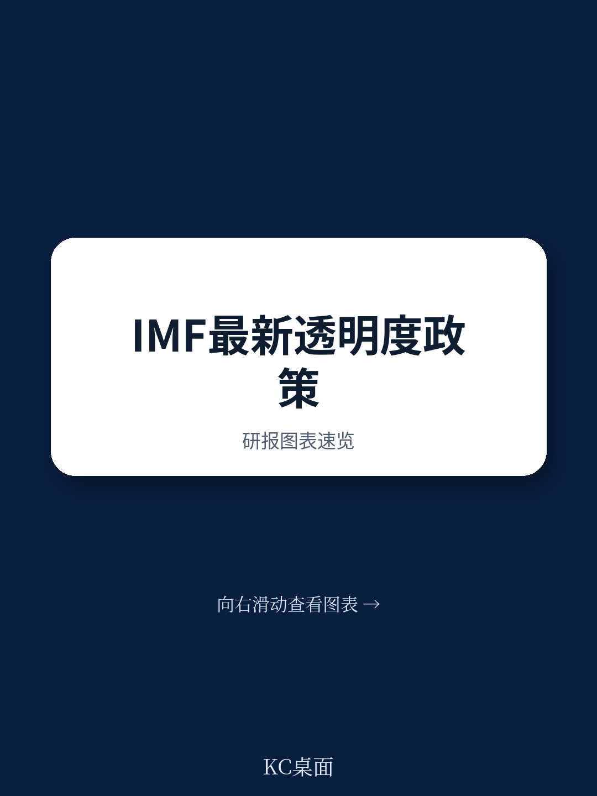
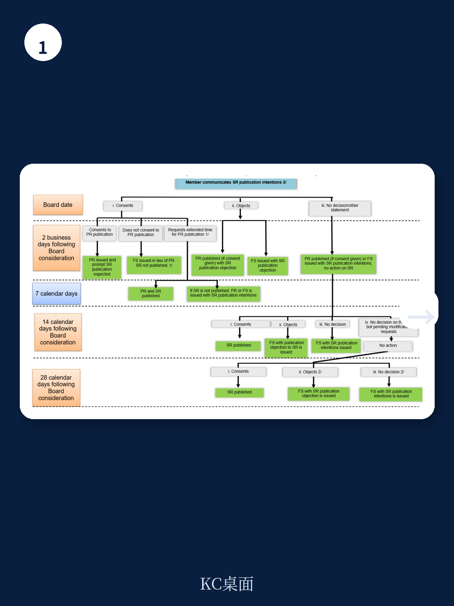
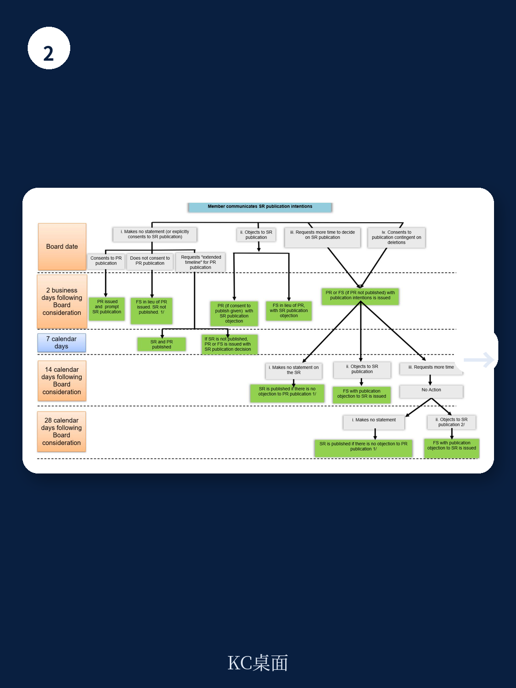

# IMF：行业规则与主题变化观察

国际货币产品组织于2026年7月发布了新版透明度政策指南，取代2014年版本，以反映2024年11月通过的透明度政策决策修订。这份指南的核心变化在于：强化了“自愿但推定出版”原则，明确了成员国对出版的同意义务，并收紧了董事会文件在出版前的修改规则。

报告最值得关注的判断是：IMF正在系统性地缩短国家文件从董事会审议到公开出版的时间窗口，同时严格限制成员国对已提交董事会文件的修改权限。这意味着产品组织在“可信顾问”与“全球宏观环境监督者”双重角色之间，正将天平向后者倾斜。

## 1. 出版同意机制从“明确同意”转向“推定同意”

对于监督类国家文件，成员国不再需要主动表示同意出版。根据新规，若成员国在董事会审议结束前未明确反对出版、未要求更多时间、或未以同意删除为前提同意出版，则视为同意。这一“非反对即同意”机制显著降低了成员国通过沉默或拖延阻止出版的可能性。

对于新闻稿，规则更为明确：除非成员国在董事会审议结束前明确反对或表示需要更多时间决定，否则视为同意出版。监督类国家文件新闻稿应在董事会审议后两个工作日内发布。若成员国同意出版相关工作人员报告，可申请将新闻稿推迟至多7个日历日。

> **KC评论：** 这一变化对市场参与者和政策观察者意味着，IMF成员国未来更难通过“不表态”来延迟不利信息的公开。新闻稿的发布节奏从“可协商”变为“有明确截止日”，这提高了产品组织作为全球监督机构的即时信息披露能力。

## 2. 文件修改窗口大幅收窄，28天后不再受理

新指南对董事会文件出版前的修改设置了严格的时间限制。成员国提交修改请求（包括更正和删除）的常规窗口为董事会审议后7个日历日内。超过28个日历日的请求将不予受理。这一规定直接回应了过去实践中部分成员国利用冗长修改周期拖延出版的问题。

修改类型被严格限定为四类：更正排版错误、数据和事实错误、明显歧义、以及当局观点误述；删除仅限于“高度市场敏感”且可能引发短期市场动荡的信息，以及可能破坏政策实施的当局政策意图提前披露。政治敏感信息若不符合上述标准，不得删除。

值得注意的是，对于监督类工作人员报告，允许在报告中添加当局对主要议题或政策建议的立场，但每节新增字数限制在30-40词以内，且需在董事会审议前至少两个工作日提交。

## 3. 行政错误更正程序首次正式纳入政策框架

新指南附录十二专门设立了行政错误更正程序。该程序适用于三种特定情形：董事会文件中缺失关键要素（如债务可持续性分析表格、外部部门评估、结构性基准表）；附件完全错误（如将另一国家或另一轮审查的意向书附入）；以及提交了未经管理层批准的早期草稿而非最终版本。

更正程序要求：起草部门需先与战略、政策与审查部及秘书部协商确认是否构成行政错误；若确认，需在董事会审议前至少两个工作日完成更正。若错误发现时间过晚，董事会审议日期可能需要调整。这一程序被明确标注为“极少使用”，但其存在本身表明IMF正在为文件流程中的操作失误建立正式补救机制。

## 4. 多国文件与第三方机构文件的出版规则得到明确

新指南将多国文件分为三类：多边政策议题文件、国家背景页和集群文件。对于集群文件（如区域宏观环境展望），若所有相关成员国均同意出版，则视为整体出版；若部分国家反对，则仅出版已同意国家的部分，反对国家部分不出版。

第三方机构文件（如韧性与可持续性机制评估函）需随相关工作人员报告一并出版，除非作者机构要求或产品董事会另有决定。作者机构仅可在董事会审议前对文件进行修改。这一规定填补了此前政策框架中对非IMF编制文件处理方式的空白。

> **KC评论：** 多国文件规则的细化，特别是集群文件的分拆出版机制，解决了过去因个别国家反对而导致整份区域报告无法公开的困境。这对研究区域宏观环境联动性和跨境政策协调的分析者而言，是一个实质性的数据可获得性改善。

## 5. 保密信息处理与争议解决机制同步升级

新指南要求成员国明确告知工作人员哪些信息需保密。产品组织已建立全面的保密信息法律保护框架。若工作人员对信息是否应保密存疑，需与当局澄清该信息是仅供工作人员/管理层内部使用，还是可向董事会或公众披露。但根据《产品组织协定》必须向产品报告的信息，或工作人员认为董事会决策所必需的信息，不得对董事会隐瞒。

争议解决方面，新政策将原有的删除规则争议解决程序扩展至所有类型的修改争议。若成员国与工作人员就修改规则适用产生分歧，成员国可请求管理层介入。这一扩展意味着成员国无法再通过“只对删除有异议”的狭窄渠道挑战修改决定，任何修改类型的争议均可进入正式解决流程。

---

这份指南的实质影响在于：IMF正在通过程序性规则的重构，将透明度从原则性承诺转化为可执行、可追溯的操作标准。对于关注产品组织成员国政策透明度、国际市场信息对称性以及多边机构治理改革的读者，这份文件提供了观察IMF未来运作风格的关键窗口。

For informational purposes only. Portions may be generated,translated,summarized,or edited with AI assistance based on source materials and may contain omissions or errors. Please verify independently. This is not investment,legal,tax,accounting,or other professional advice.

