# Climate Change, Macroeconomic Risks, and Adaptation in the Solomon Islands

Emanuele Massetti and Filippos Tagklis

SIP/2026/069

IMF Selected Issues Papers are prepared by IMF staff as background documentation for periodic consultations with member countries. It is based on the information available at the time it was completed on June 10, 2026. This paper is also published separately as IMF Country Report No 26/167.

2026
JUL

# IMF Selected Issues Paper Asia Pacific Department

# Climate Change, Macroeconomic Risks, and Adaptation in the Solomon Islands Prepared by Emanuele Massetti and Filippos Tagklis (FAD)

Authorized for distribution by Nada Choueiri
July 2026

IMF Selected Issues Papers are prepared by IMF staff as background documentation for periodic consultations with member countries. It is based on the information available at the time it was completed on June 10, 2026. This paper is also published separately as IMF Country Report No 26/167.

ABSTRACT: The Solomon Islands faces growing macroeconomic challenges from climate change. Rising temperatures, changing marine ecosystems, and sea-level rise are expected to affect economic growth, public finances, and key export sectors over the coming decades. This paper combines climate projections and empirical evidence to assess these risks and evaluate adaptation priorities. While fisheries are projected to face declining productivity and coastal areas increasing exposure to inundation, sustainable forestry management could generate economic gains. The findings underscore the need for efficient adaptation policies, strengthened resource management, and robust decision-making frameworks to enhance long-term economic resilience.

RECOMMENDED CITATION: Massetti, Emanuele, and Filippos Tagklis. 2026. "Climate Change, Macroeconomic Risks, and Adaptation in the Solomon Islands." Selected Issues Paper (SIP/26/069), 2026 Article IV Consultation, International Monetary Fund, Washington, DC.

<table><tr><td>JEL Classification Numbers:</td><td>Q54, Q58, O44, E62</td></tr><tr><td>Keywords: [Type Here]</td><td>Climate change; adaptation; Solomon Islands; sea-level rise; fisheries; forestry; macroeconomic impacts; climate resilience; coastal adaptation; sustainable development; Pacific Island Countries.</td></tr><tr><td>Author&#x27;s E-Mail Address:</td><td>ftagklis@imf.org; emassetti@imf.org</td></tr></table>

SELECTED ISSUES PAPERS

# Climate Change, Macroeconomic Risks, and Adaptation in the Solomon Islands

Solomon Islands

Prepared by Emanuele Massetti and Filippos Tagklis $^{1}$

# SOLOMON ISLANDS

SELECTED ISSUES

June 10, 2026

Approved By

Nada Choueiri

Prepared By Emanuele Massetti and Filippos Tagklis

## CONTENTS

## CLIMATE CHANGE, MACROECONOMIC RISKS, AND ADAPTATION IN THE

SOLOMON ISLANDS \_\_\_\_ 2

A. Climate Trends and Projections \_\_\_\_ 2

B. Macroeconomic Impacts 8

C. Effective and Efficient Adaptation Policy \_\_\_\_ 16

## BOXES

1. The Impact of Climate Change on the Forestry Sector \_\_\_\_ 11

2. Estimating the Cost of Sea Level Rise \_\_\_\_ 15

3. Policies to Facilitate Private Adaptation \_\_\_\_ 17

## FIGURES

1. Historical Temperature and Precipitations for Solomon Islands \_\_\_\_ 3

2. Projected Annual Temperature, Total Annual Precipitations for the Solomon Islands 4

3. Projected Changes of Extreme Precipitation and Dry Periods \_\_\_\_ 5

4. Sea-Level Rise Projections Relative to 2000 level (meters)\_\_\_\_6

5. Projected Changes of Exploitable Fish Biomass in the Solomon Islands' Waters \_\_\_\_7

6. Impact of Warming Trends on Real GDP, Solomon Islands (percentage) \_\_\_\_ 9

7. Cumulative Density Functions of Population and Economic Variables, at Different

Distances from the Coastline and Different Elevations 13

8. Cost of Sea-Level Rise (in percentage of GDP), Annual Average 2020-2099 \_\_\_\_ 14

References 19

# CLIMATE CHANGE, MACROECONOMIC RISKS, AND ADAPTATION IN THE SOLOMON ISLANDS $^{1}$

This paper examines the evolving risks and adaptation challenges facing the Solomon Islands due to climate change, with emphasis on rising temperatures, changes in marine ecosystems, and sea level rise. Utilizing recent scientific data, empirical literature, and sectoral models, it assesses the projected economic impacts, including potential aggregate GDP losses, vulnerabilities in the fisheries and forestry sectors, and the costs associated with sea-level rise. The analysis underscores the necessity of robust adaptation strategies and sustainable resource management to mitigate these risks. It argues that effective adaptation requires strategic government action to prioritize resources, implement cost-efficient policies, and address market barriers that limit private adaptive responses. Drawing on macro-fiscal guidance and practical experience, the paper outlines key principles for designing climate adaptation policies—stressing the significance of climate-specific interventions and the use of cost-benefit analysis as a consistent evaluation tool. The findings aim to inform policymakers about targeted adaptation strategies to enhance economic resilience in the Solomon Islands.

## A. Climate Trends and Projections

Drawing on recent scientific data and model-based projections, this section provides an overview of the evolving risks and adaptation challenges posed by a warming climate, changes in marine ecosystems, and sea level rise.

1. Solomon Islands has a warm, humid tropical climate shaped by its position in the western tropical Pacific. Historically, mean temperatures remained fairly stable until the late 20 $^{th}$ century, after which a clear warming trend emerged consistently with broader Pacific patterns. During the 1985–2014 baseline period, which serves as a benchmark for future climate scenarios, average annual temperatures were around 26-27 °C—approximately 0.4–0.6 °C above pre-industrial levels—and are estimated to have risen by an additional \~0.5 °C by 2020 (Figure 1). $^{2}$ This gradual but persistent warming provides the background against which climate-related macroeconomic risks and policy challenges are expected to intensify over time.

2. Solomon Islands experiences high interannual rainfall variability characteristic of the western tropical Pacific. The country has a humid equatorial-to-tropical climate with substantial precipitation throughout the year. Data on historical precipitations show a recent positive trend in annual rainfall and reveal pronounced year-to-year fluctuations linked to El Nino Southern Oscillation-(ENSO) (Figure 1).

Figure 1. Historical Temperature and Precipitations for Solomon Islands  
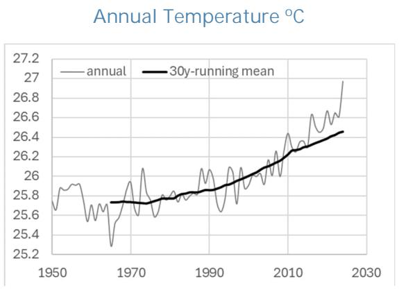

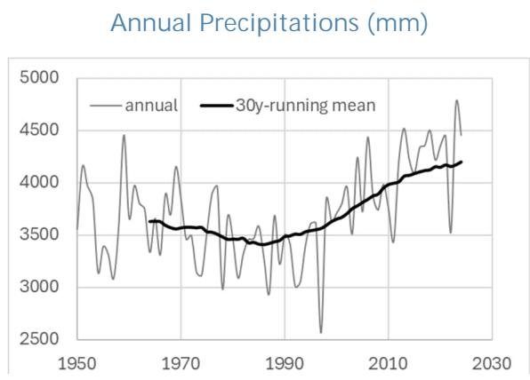  
Notes: The solid gray line displays annual mean temperature. The solid black line displays the 30-year moving average. The first complete 15 years of the moving average are not shown because incomplete. The last 14 years show a linear trend estimated using the last 30 years of annual data (dashed).  
Source: FADCP Climate Dataset (Massetti and Tagklis, 2024), using ERA5 reanalysis data (Hersbach and others 2023).

3. Solomon Islands is projected to experience continued warming through the end of the century, while projections of future rainfall patterns are highly uncertain. Median projections among climate models show temperature increases of 0.9–1.2 °C by 2050 and 12.2 °C by 2085, relative to the 1985–2014 baseline, depending on emissions pathways. In a high-emissions scenario (SSP3-7.0, 90th percentile), warming could reach 3°C by 2085 (Figure 2). Climate models do not project changes of total annual rainfall compared to the 1960-2015 average, suggesting that the recently observed positive trend may be transitory (Figure 2). Natural rainfall variability —rather than changes in long-run averages—suggests that economic impacts are likely to arise primarily through recurrent natural variability shocks. -2.2 °C by 2085, relative to the 1985–2014 baseline, depending on emissions pathways. In a high-emissions scenario (SSP3-7.0, 90th percentile), warming could reach 3°C by 2085.

Figure 2. Projected Annual Temperature, Total Annual Precipitations for the Solomon Islands
Temperature °C    Precipitations (mm)  
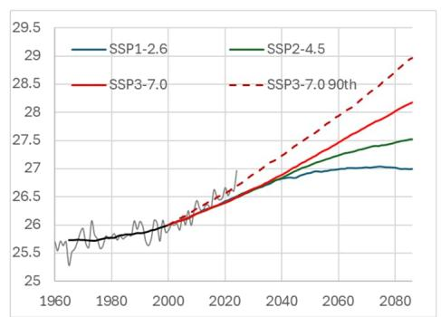

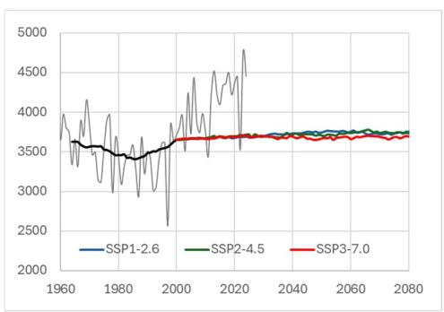  
Notes: The gray line describes historical values based on reanalysis (ERA5 for temperature and precipitation). The black line describes the 30-year moving average around each year. Colored lines represent the median of 30-year moving averages of CMIP6 anomalies added to the observed value (thick black line in the year 1999). SSP3-7.0 (red) is a high emission scenario. SSP1-2.6 scenario (blue) is in line with the Paris goal to keep global mean temperature increase below 2 °C with respect to pre-industrial times. SSP2-4.5 (green) represents continuation of present trends.

4. Indices of within-year climate extremes show that intense precipitation events are the primary climate hazard for Solomon Islands and the main source of recurring macroeconomic risks. The analysis of climate extremes relies on four indicators of extreme heat (TX35), drought conditions (CDD), and intense rainfall (Rx1day and Rx5day) commonly used in the scientific literature. $^{3}$ Since 1960, there are no episodes of widespread extreme heat, and none are projected through the end of the century. $^{4}$ By contrast, short-duration heavy rainfall events, measured by maximum 1-day (Rx1day) and 5-day (Rx5day) totals, have intensified in recent decades. These extremes are often associated with tropical systems, including tropical cyclones and monsoon-related disturbances, and continue to drive recurrent flooding, landslides, and infrastructure damage. Projections indicate a slight increase in Rx1day toward the end of the century (Figure 3, left panel). The drought related index (CDD) remains low and is projected to stay at the same levels (Figure 3, right panel). Overall, the dominance of intense precipitation events—rather than extreme heat or prolonged drought—will continue to shape the country's climate risk profile (Figure 3). These patterns imply that risks are more likely to materialize through repeated flood-related

damage to infrastructure and housing rather than through heat-related shocks, reinforcing the importance of resilient public investment and land-use planning.

Figure 3. Projected Changes of Extreme Precipitation and Dry Periods  
Maximum 1-day Precipitations (mm)  
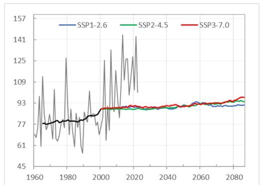

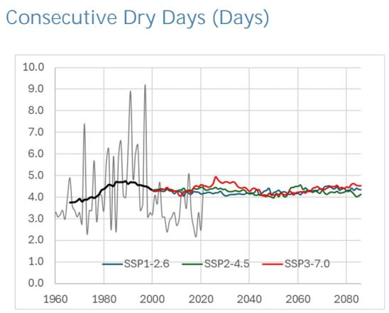  
Changes in Extreme 1-Day Rainfall (Rx1day) Under High Emissions

Medium-term (2041-2060)  
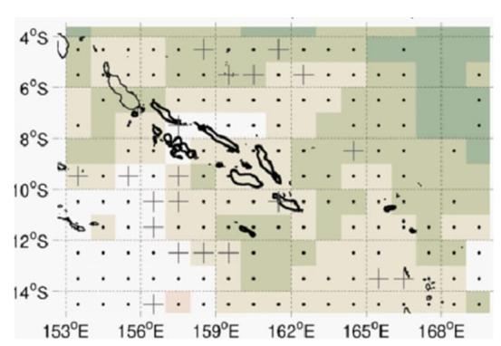

Long-term (2081-2100)  
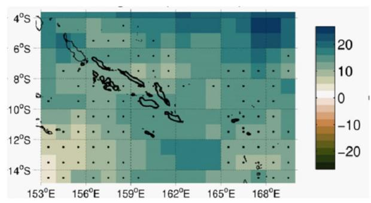

Notes: The top row shows time series of Maximum 1-Day Accumulated Precipitation (left) and the maximum number of Consecutive Dry Days in a year (right). The bottom row displays Maximum of 1-Day Accumulated Precipitation projected changes relative to the 1991-2020 baseline under the SSP3-7.0 scenario from CMIP6 simulations, on a common grid of approximately 100x100 km size. An advanced method for representing ensemble robustness is based on the approach proposed in AR6, categorized into three levels. Robust Signal: Indicates significant changes where at least 80 percent of the models agree on the sign of change. Conflicting Signals: Represented by crosses, indicating significant changes where less than 80 percent of the models agree on the sign of change. No Change or No Robust Signal: Represented by dots, representing areas of low change values and/or low significance, where less than 66 percent of the models exhibit emergent signals.

5. Sea-level rise represents a critical challenge for Solomon Islands, where much of the population, essential infrastructure, and economic activity is in low-elevation coastal zones, including Honiara and other major settlements. In the western tropical Pacific, current projections from the scientific literature (Kopp and others, 2014; see (Figure 4) point to sea-level increases of roughly 0.52 meters under a low-emissions pathway (RCP2.6), 0.62 meters under a moderate pathway (RCP4.5), and up to 0.79 meters under a very high emissions scenario (RCP8.5) by 2100 relative to 2000 levels (Figure 4). Local effects could be greater than the global mean due to coastal erosion, storm-driven surges, and the influence of ENSO events, which can temporarily elevate regional sea levels. Given the concentration of population and economic activity in coastal areas, sea-level rise represents a slow-moving but potentially irreversible source of economic costs and fiscal pressure, with implications for public asset values, distribution of the population, and long-term development planning.

Figure 4. Sea-Level Rise Projections Relative to 2000 Level (Meters)  
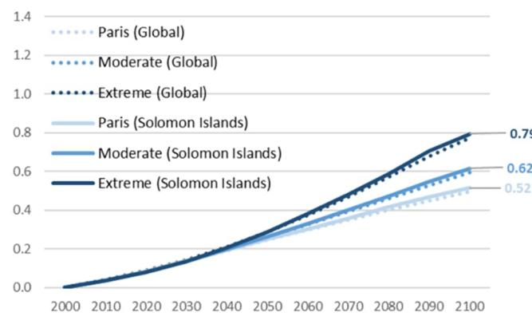  
Notes: Local (solid) and Global (dotted) Sea-Level Rise (SLR) probabilistic projections until 2100 under three emission scenarios (Paris - RCP 2.6; Moderate - RCP 4.5; Extreme - RCP 8.5). Median SLR for each emission scenario. (right) local SLR probabilistic projections using the Moderate (RCP 4.5) emission scenario.  
Source: Sea-level rise projections from the CIAM model database (Diaz, 2016) based on data from Kopp and others (2014).

6. Tropical cyclones pose a recurrent risk for Solomon Islands, primarily through heavy rainfall, flooding, storm surge, and damaging winds. Although the country lies near the northern edge of the South Pacific cyclone belt, historical events—such as Cyclone Namu (1986)—demonstrate the potential for severe economic and infrastructure damage. Observations do not show a clear long-term trend in cyclone frequency in the region, but variability is high and closely linked to ENSO conditions. Climate projections indicate that while cyclone frequency is likely to remain stable or decline slightly, the intensity of the strongest cyclones is expected to increase, with heavier rainfall and higher peak wind speeds (Chand and others, 2022). Combined with sea-level rise, stronger cyclones are expected to magnify storm-surge impacts and coastal flooding.

7. Marine ecosystems around the Solomon Islands, which underpin the country's fisheries sector, are projected to undergo gradual changes. Warmer waters and shifting currents can alter fish migration routes and reduce the productivity of key stocks, while acidification may affect the health of marine food webs, and declining oxygen levels could further stress coastal ecosystems (IPCC, 2019, SROCC). These changes pose a direct risk to the country's fisheries sector, a critical component of the economy contributing around 4 percent of GDP and supporting the livelihoods and food security of a large share of the population. Projections from the Fisheries and Marine Ecosystem Model Intercomparison Project (FishMIP; FAO,2024) suggest exploitable fish biomass in Solomon Islands' waters could decline by 11 percent under both low- (SSP1-2.6) and high-emissions (SSP5-8.5) scenarios by 2050, and by up to 50 percent under high emissions (SSP5-8.5) by 2100 (Figure 5). Inertia in the climate and oceanic systems explains why impacts on fisheries of different emissions scenarios become significantly different only in the second half of the century. Projected declines in marine biomass could therefore have material macroeconomic implications through lower export earnings, reduced fiscal revenues from fisheries, and heightened food security risks, reinforcing the case for adaptive fisheries management and economic diversification.

<table><tr><td>Long-Term Projections (2081-2100)Low-emissions High-emissions</td><td>Averaged Over the Exclusive Economic Zone(EEZ)</td></tr><tr><td>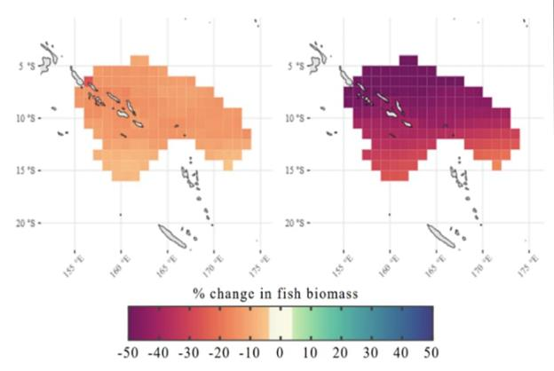</td><td>Change in exploitable fish biomass (%)Scenarios Historical SSP1-2.6 SSP5-8.51950 1950 1960 1970 1980 1990 2000 2010 2020 2030 2040 2050 2060 2070 2080 2090 2100</td></tr><tr><td colspan="2">Notes: The two panels on the left show the long-term (2081-2100) projected changes in exploitable fish biomass under different emissions scenarios and in relation to the reference period (mean between 2005-2014). The panel on the right presents the time series of projected changes averaged over Solomon Islands&#x27; Exclusive Economic Zone (EEZ).Source: Fisheries and Marine Ecosystem Model Intercomparison Project (FishMIP) -https://fishmip.org, FishMIP-data and tools</td></tr></table>

Figure 5. Projected Changes of Exploitable Fish Biomass in the Solomon Islands' Waters  
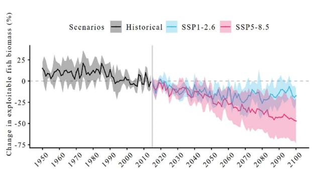

8. Forests in the Solomon Islands are expected to grow faster than in the present due to carbon fertilization and continued favorable climate conditions for biomass growth. CO $_{2}$ fertilization – the phenomenon where elevated atmospheric carbon dioxide enhances photosynthesis (IPCC AR6 WGI, Section 12.3) – leads to faster and more robust tree growth of forests under temperature and precipitations ranges that are projected in the Solomon Islands until the end of the century. By implementing sustainable and efficient forestry practices, the sector's

growth potential can be effectively harnessed to achieve higher productivity, increased timber output, greater value added, and expanded export opportunities (see Section B).

## B. Macroeconomic Impacts

Drawing on recent empirical literature and sectoral modeling, this section summarizes the projected economic impacts of gradual climate change in the Solomon Islands. It quantifies potential losses in aggregate GDP linked to gradual temperature increases, impacts in the fishery and forestry sectors, and the cost of sea-level rise. The section highlights the importance of adaptation measures and sustainable resource management to mitigate these risks.

9. Slow onset warming, changes in productivity of fisheries and the forestry sector, and rising sea levels, are expected to have macroeconomic relevance in the Solomon Islands. This section relies on advanced analytical methods published in the peer reviewed literature to assess the economic effect of gradually rising temperatures, shifts in productivity and distribution of fisheries, impacts of climate change on the forestry sector, and sea level rise. Projecting the macroeconomic effects of climate change is challenging due to uncertainties about future climate patterns, economic impacts, and the adaptation response. However, quantifications of these impacts can shed light on potential vulnerabilities and inform adaptation plans.

## Rising Temperatures

10. Losses from rising temperatures are expected to emerge gradually over the century but their effect can lead to a cumulative deterioration of the macroeconomic outlook. Economic losses are anticipated to result from various sectoral effects, including reduced labor and agricultural productivity as well as increased energy spending on energy for cooling purposes. The long-run response of aggregate GDP growth to changes in temperature trends is estimated using established econometric methods from the peer-reviewed literature data on real GDP per capita growth rates and annual mean temperature from 172 countries from 1960 (Kahn and others, 2021; Centorrino and others, 2025). Since the effects of the observed temperature trend are difficult to quantify and are, at least in part, reflected in historical growth rates, the model focuses on estimating the economic consequences of variations in warming rates. An acceleration in the warming trend is associated with reductions in economic growth below recent levels, whereas a deceleration in the warming rate favorably influences the growth rate. By stabilizing temperatures, the economy is able to resume its steady-state growth rate, as it would have without the influence of the warming trend. $^{5}$ By integrating empirical evidence on the effect of warming trends on GDP with four temperature scenarios from established climate models, $^{6}$ the analysis projects the

aggregate macroeconomic impact of gradual warming on the Solomon Islands. At the end of the century, a moderate acceleration of warming (Figure 6, SSP2-4.5) is projected to reduce GDP by approximately 1 percent compared to baseline projections, while the worst-case warming scenario (Figure 6, SSP3-7.0 90th p.) could result in a reduction of GDP by about 4 percent. In contrast, a scenario consistent with the Paris Agreement's targets (Figure 6, SSP1-2.6), which limits global temperature increase at about +2 °C, may result in slightly higher GDP compared to a scenario in which recent warming trends continue indefinitely. This gradual productivity decline may not be an immediate cause of concern, but it slowly erodes productivity, and it can lead to a long-term gradual deterioration of the macroeconomic outlook, as shown in the Debt Sustainability Assessment for the 2026 Article IV consultation with Solomon Islands.

Figure 6. Impact of Warming Trends on Real GDP, Solomon Islands (Percentage)  
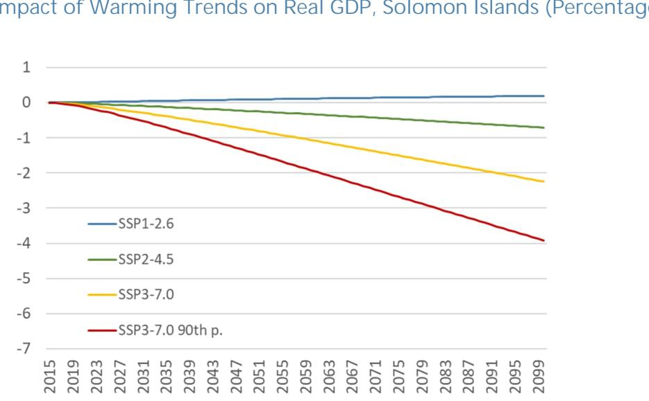

Notes: The impact of the warming trend for each scenario is estimated using Kahn and others (2021) under the assumption that adaptation can offset the warming trend after 30 years. Impacts are measured as percentage deviations of real GDP per capita relative to a reference scenario in which the warming trend follows the historical pattern. Country specific warming trends are calculated for each scenario using the bias-adjusted ensemble median projections of temperature anomalies with respect to 1985-2014 over 30-year time periods centered around each year using CMIP6 data. The SSP1-2.6 scenario is in line with the Paris goal to keep global mean temperature increase below 2 °C with respect to pre-industrial times. SSP2-4.5 represents continuation of present trends. SSP3-7.0 is a high emission scenario. SSP3-7.0 90th p. uses the 90 $^{th}$ percentile of the SSP3-7.0 ensemble instead of the median to provide a high-emission, fast-warming, pessimistic case.

11. Losses can be significantly larger if adaptation is slower than what is assumed in the analysis and could double in case of no adaptation. The projections presented in Figure 6 assume that the economy gradually adapts over an horizon of 30 years to rising temperatures with measures like increased penetration and use of air conditioning, changes in farming practices (e.g., shift to

more heat tolerant crops), and public policy responses, for example to develop extreme heat early warning systems. Slower adaptation leads to higher costs, and no adaptation at all can double the economic cost of rising temperatures (Mohaddes and Raissi, 2025). This calls for policies that facilitate private adaptation (e.g., increased air conditioning penetration, farming innovations) and for the direct intervention of the Government in providing adaptations that have the nature of public goods (e.g., early warning systems, public health), as discussed in Section C.

12. Other challenges to the economy come from changes in climate and in ecosystems that go beyond impacts from gradually rising temperatures. The methodology used to estimate GDP losses at the macroeconomic level intentionally focuses on the impact of gradually rising temperatures to provide more precise estimates. Other dimensions of climate change are not accounted for and the macroeconomic impact of changes in ecosystems and of sea level rise must be separately added to gain a fuller picture of macroeconomic risks.

## Fisheries

13. The projected reduction in productivity of fisheries within the Solomon Islands' Exclusive Economic Zone (EEZ) is expected to have significant economic ramifications. The Fishing sector is responsible for 5 percent of GDP in 2024, and it contributes positively to the balance of payment by generating export revenues equal to 4 percent of GDP. The Nauru Agreement, which governs tuna fisheries among several Pacific nations including the Solomon Islands, plays a key role in shaping these economic outcomes. Its Vessel Day Scheme (VDS) allocates fishing days to member countries to ensure both sustainable fishing level and maximum rent extraction from this renewable resource. As discussed in Section A, biomass potential in the Solomon Islands EEZ is projected to decline by 10.7 percent by 2045 in a moderate scenario, with plausibly negative impacts on value added and fiscal revenues from government sales of fishing permits.

14. A gradual decline in value added and fiscal revenues from the fishing sector highlights the need for economic diversification. The Nauru Agreement reallocates fishing days among member countries based on current fishing efforts, adapting to shifts in fish abundance. This supports regional sustainability but may decrease future allocations and revenues for the Solomon Islands if local fish stocks drop. As fish move into other countries' EEZs, the Solomon Islands has opportunities to strengthen regional collaboration and expand its role as a fish processing hub to offset potential losses.

## Forestry

15. The forestry sector could benefit from climate change thanks to faster tree growth, but only if sustainable forestry practices are widely adopted and implemented. Simulations conducted using a global timber model (see Box 1) indicate that sustainable harvesting of commercial timber can increase in the Oceania region, mostly thanks to $CO_{2}$ fertilization. Benefits may be moderated by other stressors such as heat and drought, but these limiting factors are not expected to play a significant role in the case of the Solomon Islands. Applying these regional results to the forestry sector of the Solomon Islands it is possible to project a 13 percent increase in potential harvest volume by mid-century compared to present levels. As the forestry sector is responsible for 5 percent of GDP in 2024 and 33 percent of goods exports, it is possible to project a positive impact on GDP and on the balance of payments. This result hinges on the critical assumption that commercial timber production is efficiently managed. Inefficient practices lead to sub-optimal timber harvesting and timber rotation practices, jeopardizing the ability to benefit from more favorable environmental conditions. Implementing reforms to reduce illegal logging and to foster efficient management practices are crucial to secure environmental sustainability and the maximization of value added from the forestry sector. Incentives for illegal logging may increase, as faster timber growth may increase the returns from sales of timber products.

## Box 1. The Impact of Climate Change on the Forestry Sector

Favero and others (2021) provides a comprehensive, long-term assessment of how climate change and timber markets interact to affect global and regional forests, timber supply, and carbon storage through the year 2200. By integrating climate scenarios (RCP 2.6 and RCP 8.5), socio-economic pathways, a dynamic global vegetation model, and an economic model of the timber sector, the authors simulate ecological and market responses to climate change. The results show that, under both emission scenarios, global forest productivity and area are projected to increase until around 2150, leading to higher timber supply, lower timber prices, and increased consumer welfare. However, these benefits are unevenly distributed: temperate and boreal regions, such as Canada and Russia, are expected to gain the most, while tropical regions like Brazil may experience losses, especially under high-emission scenarios. Importantly, even without explicit carbon sequestration policies, global forest carbon stocks are projected to rise by 6–10 percent by 2100, with further increases or regional declines possible by 2200 depending on the scenario.

The study highlights that climate change adaptation in the timber sector can incidentally increase forest carbon stocks but also warns of significant uncertainties. After 2150, forest area may decline, particularly under RCP 8.5, and the share of unmanaged forests—which are important for biodiversity—could decrease. The authors note that their projections are sensitive to the choice of climate and vegetation models, and that unmodeled factors such as increased disturbances (e.g., wildfires, pests) or changes in timber demand for energy and construction could alter outcomes. Overall, the paper underscores the importance of considering both ecological and economic feedback over very long-time horizons when evaluating climate change impacts on forests and suggests that near-term mitigation actions can help avoid negative long-term consequences for both timber markets and forest carbon storage.

## Box 1. The Impact of Climate Change on the Forestry Sector (Concluded)

Using model output for the Oceania region, and considering two emissions scenarios and four climate models, we calculate the projected rate of change of model predicted production of industrial timber compared to the prediction in a reference scenario which uses present climate, in 2035, 2045 and 2055. We then calculate the median change across the eight model/scenarios combinations and projected annual changes of sectoral GDP by interpolating linearly rates of change in years without model output.

The figure below shows that commercial timber production is projected to rise even without climate change due to increased global demand and higher prices. Larger gains are expected later in the century from stronger fertilization effects and growing market demand.

Projected Production of Industrial Roundwood in the Solomon Islands (Index, 2025 = 1)

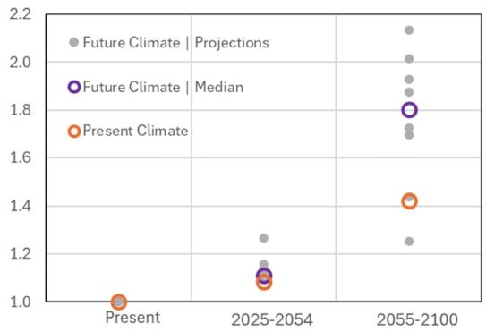  
Source: IMF staff estimates using Favero and others (2021).

## Sea Level Rise

16. Sea level rise is a long-term challenge that can cause large disruptions in a country with large exposure to coastal inundation. Sea level rise does not pose long-term existential risks because the country is sparsely populated and has many high-elevation areas. However, a country-wide analysis of population, built surface and built volume, and nighttime lights – which are often used as a proxy for economic activity – at different distances from the coastline and at different elevations, reveals large exposure to coastal inundation risks (Figure 7). Economic and social activities are predominantly concentrated within a narrow coastal zone, with roughly 60 percent of the population, constructed surface area, built volume, and economic activity (based on nighttime lights) situated within one kilometer of the shoreline. Although the selection of higher elevation sites for much of this coastal development reduces exposure to sea level rise, approximately 3 percent of the population and 10 percent of economic activity—as indicated by nighttime lights—remain vulnerable to a one-meter increase in sea level, a scenario that cannot be disregarded within this century. Using the model Costal Impact and Adaptation Model (CIAM) to estimate economic

impacts, the annual average economic cost $^{7}$ of sea level rise in the Solomon Islands is projected to be approximately 1.5 percent of GDP throughout the century, if no adaptation measures are implemented (see Box 2 for more details on the model CIAM and the methods used for this analysis). This significant cost arises from the permanent loss of land and capital due to inundation, the sudden displacement of communities from coastal areas, and increased damages from more severe storm surges, affecting both property and human lives.

Figure 7. Cumulative Density Functions of Population and Economic Variables, at Different Distances from the Coastline and Different Elevations  
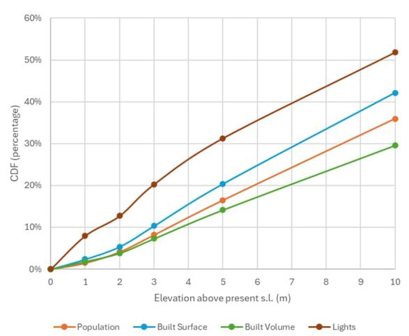

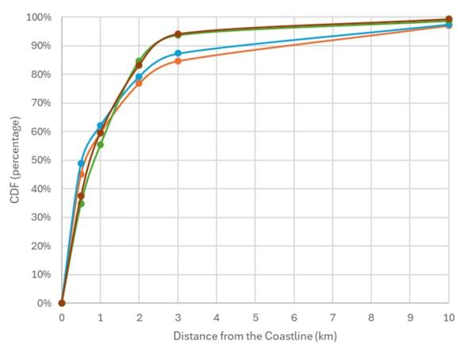  
Source: IMF staff using data from Bondarenko and others (2025) and Woods and others (2024).

17. Adopting a strategy of planned retreat based on relocating people and assets away from vulnerable coastal zones proactively and gradually, is the adaptation strategy with the lowest economic cost across the entire country. This approach could reduce the overall costs of sea level rise by about 80 percent compared to the no-adaptation scenario, lowering the annual cost to around 0.26 percent of GDP, with land loss remaining the main cost (Figure 8). Coastal retreat presents logistical and distributional challenges, as a gradual move from the coastline will deeply affect the fraction of the population affected and the owners of coastal land and capital. $^{8}$ From an economic standpoint, retreating is a viable option because most coastal areas have land at safe elevation in proximity to the areas at threat of inundation, as shown, for example, in the right panel of Figure 9. $^{9}$ A move of the population and economic activity to local undeveloped areas, or an intensification of population density and economic activity in already developed areas, would avoid disruptions of social and economic networks. Generalized coastal protection is not cost effective in the Solomon Islands due to the relatively low density of both capital and population along the coastline compared to protection costs. However, hyper-resolution analysis—at the block or building scale—may reveal that targeted protection could be cost effective in more densely populated centers. The government has a key role in developing coastal risk maps because they are a public good (see Section C) and in defining a clear and consistent set of normative criteria that can complement pure economic considerations. $^{10}$

Figure 8. Cost of Sea-Level Rise (in percentage of GDP), Annual Average 2020-2099  
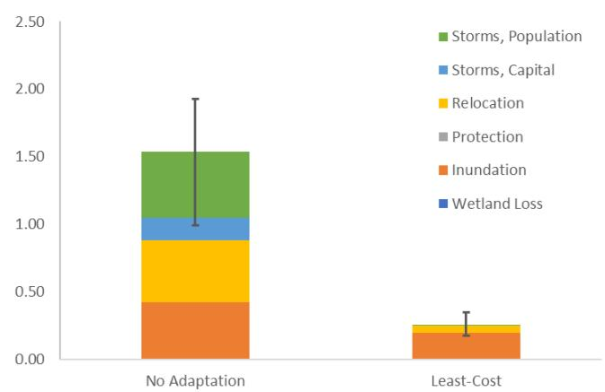  
Notes: Average annual cost. Whiskers on top of each bar indicate the range of total cost using the 5th and 95th percentile of the probabilistic distribution of sea-level rise. Due to the highly non-linear nature of coastal impacts, adaptation costs, and effectiveness of adaptation measures, ranges are not always symmetric around total costs.

Source: IMF Staff using the CIAM model (Diaz, 2016).

## Box 2. Estimating the Cost of Sea Level Rise

Granular analysis employing elevation data from a global grid with 100x100 meter resolution enables the identification of coastal regions that may experience permanent inundation under various scenarios of sea level rise, as depicted in the left panel of the figure below for Guadalcanal Island, where the national capital Honiara is situated. By integrating these spatial layers with population density data, areas of vulnerability to different projections of sea level rise can be determined, as illustrated in the right panel of the figure below for the vicinity of Honiara under a scenario involving a two-meter increase in sea level.

Exposure to Sea Level Rise and Vulnerability of Population

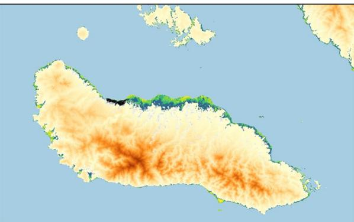

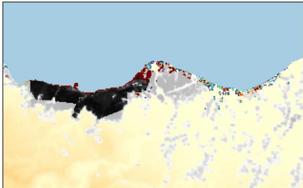

Notes: Left panel: Shades of colors from yellow to dark blue indicate different risk areas, up to 10m above present sea level. Right panel: Shades of gray indicate different levels of population density, with the core of Honiara shown in dark gray. Shades of colors indicate population density in areas that are projected to be permanently inundated with 2 meters of sea level rise.

Source: IMF staff using data from Bondarenko and others (2025) and Woods and others (2024).

Through the aggregation of national-level data on population, built surface area, built volume, and nighttime light intensity—which serves as an indicator of economic activity—at varying distances from the coastline and elevations, a country-specific risk profile can be established, as illustrated in Figure 9.

For a more complex analysis of sea-level rise impacts, IMF staff uses a state-of-the-art model to estimate costs under three scenarios: (i) No Adaptation – reaction to sea-level rise by relocating after coastal areas are inundated, no protection is built and both welfare and capital losses are large; (ii) Protection – proactive protection against sea-level rise along the entire coastline, choosing the cost-effective strength of coastal protections against storms in each coastal segments; (iii) Retreat - proactive retreat from the entire coastline, choosing the cost-effective retreat perimeter against storms in each coastal segment; and (iv) Least-Cost Adaptation – least-cost protection or retreat option in each coastal segment, summed over the entire country.

In estimating costs, the model accounts for market and non-market impacts, such as loss of life during storm-surges that become more dangerous due to higher sea level. The model also monetizes the loss of wetland using studies in the literature and the disutility cost of relocation, which is assumed to be five times larger in the case of no adaptation compared to the case of planned retreat. This analysis does not attempt to capture specific social or cultural losses, given the absence of objective methods to estimate their economic value. As a result, decision-makers should complement it with additional criteria, taking into account the associated fiscal and macroeconomic implications.

To capture geographic and economic heterogeneity, the coastline of the country is divided into 45 segments, varying in length from 0.1 Km to 405.8 Km, with a median length equal to 36.1 Km. For more details see Diaz (2016). Results for the cases of no adaptation and the least cost adaptation strategy – which corresponds to planned relocation in this case – are shown in Figure 10 for a moderate emissions scenario, including the range of total costs due to uncertainty in the response of sea level.

## C. Effective and Efficient Adaptation Policy

Effective and efficient adaptation to climate change requires governments to strategically allocate resources, prioritize cost-effective policies, and address market imperfections that hinder private adaptation. Drawing on macro-fiscal guidance and practical experience, this section outlines general principles for designing adaptation policy, highlights the importance of focusing on climate-specific measures, and underscores the role of consistent evaluation criteria such as cost-benefit analysis.

18. While determining with precision a list of adaptation projects and their cost is extremely difficult, it is possible to build a roadmap from important general principles. IMF Staff has developed guidance to help countries adapt by integrating climate change in macro-fiscal planning (Gonguet and others 2021; Bellon and Massetti, 2022a,b; Aligishiev, Bellon, and Massetti, 2022; Sakrak and others 2022). These principles frame adaptation in terms familiar to economists and in the broader context of sustainable development, with the intent of guiding public investment and enabling efficient private adaptation.

19. With many competing needs, the government must carefully allocate resources across all possible uses, including adaptation to climate change, while considering the distributional effects of its programs. This requires: (i) concentrating government efforts and resources in key areas; and (ii) collecting information on how effective spending is across alternative programs and how spending affects distinct groups in society (Bellon and Massetti, 2022a).

20. National adaptation policy could be enhanced by focusing on strict adaptation measures listed in the National Adaptation Plan of Action (NAPA) that need government support. Many actions listed in the NAPA (Ministry of Environment, Conservation and Meteorology, 2008) address important development goals that increase resilience to weather shocks and climate change as a co-benefit. $^{11}$ As these actions are better served by other plans that explicitly focus on development needs, national adaptation policy would benefit from a narrower focus on pure climate change adaptive measures – i.e., on needs that emerge exclusively due to climate change (Bellon and Massetti, 2022a). This would avoid inefficiencies, inconsistencies, and duplication of efforts. $^{12}$ In particular, the government can prioritize adaptation policies with positive externalities, by removing the market imperfections and policies that hinder efficient private adaptation, and by ensuring a just transition (Box 3). Individuals and firms have strong incentives to adapt because many adaptation benefits tend to be local and private.

<table><tr><td>Box 3. Policies to Facilitate Private Adaptation</td></tr><tr><td>In imperfectly competitive markets, adaptation is inefficient, and governments should intervene mirroring standard prescriptions for public policy from economic theory.</td></tr><tr><td>Some market imperfections pertain to the nature of the adaptation goods themselves. For example, markets invest sub-optimally in adaptations with large positive externalities and public goods, such as information about climate change, emergency preparedness plans, seawalls, basic research in new materials, and technologies to cope with higher temperatures.In many instances, resilience depends on networks, such as a system of dikes, a water network, or a transportation network. As adaptation in each part of a network has impacts on the rest of the network that may not be captured, private adaptation will tend to be underprovided. Government coordination may be needed to internalize all the benefits for society.The extent of needed cooperation for adaptation projects depends on the extent of the externality that is addressed by the project. Building a more resilient storm water drainage system may only require cooperation at the city level. If risks from sea-level rise are localized, each locality may invest in its own system of protection. The central government can provide adaptations with local effects, but that would be equivalent to a transfer of wealth between regions when projects are financed from national resources. As risks grow in scope and complexity, cooperation might be needed at the national or even the international level, for example to manage floods in transnational rivers. In general, the optimal distribution of responsibilities across levels of government also depends on the existing allocation of responsibilities.Other market imperfections affect the broad functioning of the economy and make adaptation to climate change inefficient. For example, a poor business environment and inefficient credit markets hamper opportunities for farmers to invest in new capital to grow crops that are more suitable to the new climate.Moral hazard may cause insufficient investment in adaptation if consumers, firms, and local government expect central government to provide relief. To avoid moral hazard, governments can implement regulations that minimize risk taking. Examples include zoning that prohibits construction in flood zones, building codes, mandatory evacuations, and mandatory insurance.The government may also consider correcting market distortions resulting from their own policies (policy failure). For example, subsidies to inputs can lead to inefficient use. Of particular concern is subsidized water use, which may worsen water scarcity problems due to climate change. Barriers to international trade also prevent efficient climate-change-induced reallocation of capital, land use, and other resources to maximize their productivity. The government may consider removing these distortions as part of a comprehensive plan to improve the efficiency of the economy, while taking into consideration the distributional implications of these measures.</td></tr><tr><td>Source: Massetti and Bellon (2022a)</td></tr></table>

21. Cost-effectiveness consideration can play a prominent role in selecting adaptation projects, and cost-benefit analysis (CBA) could be considered as an alternative to Multicriteria Analysis (MCA) to further streamline decision making. The NAPA identified MCA as the method for prioritization of adaptation needs in Solomon Islands (Ministry of Environment, Conservation and Meteorology, 2008 p. 67). Criteria should include: (i) level or degree of adverse effects of climate change; (ii) poverty reduction to enhance adaptive capacity; (iii) synergy with other multilateral environmental agreements; (iv) cost-effectiveness. Emphasizing the importance of cost-effectiveness can help maximize the impact of public investment in adaptation. CBA can be considered as a valid alternative to, or at least complement of, MCA to provide a standardized welfare metric across all

adaptation and development programs. What to do, when, how, and at what cost ultimately relies on ethical choices that should reflect the preferences of the Solomon Island's government and population. However, CBA, complemented by analysis and correction of distributional impacts, can help decision makers to collect, process, and compare information about the social returns of public investment in adaptation consistently across regions, sectors, and over time (Bellon and Massetti, 2022a).

22. To respond to sea level rise, it is key to start (i) developing coastal risk maps, (ii) establishing a legal framework for coastal adaptation, and (iii) defining criteria for optimal adaptation. While the worst effects of sea level rise are not expected to materialize for several decades, gradual inundation of low-lying coastal areas, saltwater intrusion, coastal erosion, and flooding during storm surges, increasingly affect population and assets in low-lying areas. Assessing risks, establishing a legal framework to determine rights and responsibilities, and choosing criteria to select adaptation measures will help minimize short-term coastal risks and develop a long-term sea-level rise strategy.

\- High-resolution public maps of permanent inundation areas and of coastal flooding under alternative sea level rise scenarios should be developed and used to determine coastal risk perimeters. These perimeters would indicate when the corresponding coastal areas will likely be inundated.

\- A legal framework is needed to control development and discourage moral hazard within these perimeters. Legislation must determine rights and responsibilities of the resident population and of coastal assets owners. Construction of capital and infrastructure with a typical lifetime longer than the expected inundation date at that perimeter should be carefully assessed (e.g., a coastal road with expected lifetime of 40 years in an area that will be inundated in 2050). New coastal assets, like seaports, should be built factoring in projected sea level rise. Enforceable land tenure rights in the proximity of these coastal perimeters should be defined to facilitate the relocation of the population at-risk of coastal inundation.

\- A shared set of workable principles should be established to define and implement optimal adaptation solutions in the near term and refined over time to gradually support budgetary and societal trade-offs of growing complexity. CBA can provide a consistent and implementable decision-making framework, complemented by a set of rules to assess distributional implications.

## References

Albert, Simon, Kirsten Abernethy, Badin Gibbs, Alistair Grinham, Nixon Tooler, and Shankar Aswani. "Cost-effective methods for accurate determination of sea level rise vulnerability: A Solomon Islands example." Weather, Climate, and Society 5, no. 4 (2013): 285-292. Open Access.

Aligishiev, Z., M. Bellon, and E. Massetti. 2022. “Macro-Fiscal Implication of Adaptation to Climate Change.” IMF Staff Climate Note 2022.002, International Monetary Fund, Washington, DC.

Copernicus Climate Change Service, Climate Data Store, (2021): CMIP6 climate projections. Copernicus Climate Change Service (C3S) Climate Data Store (CDS). DOI: 10.24381/cds.c866074c

Bellon, M. and E. Massetti. 2022a. "Economic Principles for Integrating Adaptation to Climate Change into Fiscal Policy." IMF Staff Climate Note 2022.001, International Monetary Fund, Washington, DC.

Bellon, M. and E. Massetti. 2022b. "Planning and Mainstreaming Adaptation to Climate Change in Fiscal Policy." IMF Staff Climate Note 2022.003, International Monetary Fund, Washington, DC.

Bondarenko M., Priyatikanto R., Tejedor-Garavito N., Zhang W., McKeen T., Cunningham A., Woods T., Hilton J., Cihan D., Nosatiuk B., Brinkhoff T., Tatem A., Sorichetta A. (2025). The spatial distribution of population in 2015-2030 at a resolution of 30 arc (approximately 1km at the equator) R2025A version v1. Global Demographic Data Project - Funded by The Bill and Melinda Gates Foundation (INV-045237). WorldPop - School of Geography and Environmental Science, University of Southampton. DOI:10.5258/SOTON/WP00845

Chand, Savin; Webb, Leanne; Grose, Michael; Gooley, Geoff. Tropical cyclones and climate change: Implications for Pacific Island countries. Aspendale: CSIRO; 2022. csiro:EP2021-3604. https://doi.org/10.25919/pbtc-1y82

Diaz, Delavane B. "Estimating global damages from sea level rise with the Coastal Impact and Adaptation Model (CIAM)." Climatic Change 137, no. 1 (2016): 143-156.

FAO, 2024: Projected impacts of climate change on exploitable marine fish biomass: Results from the Fisheries and Marine Ecosystem Model Intercomparison Project (FishMIP). FAO Fisheries and Aquaculture Technical Paper No. 710. Rome, FAO. https://doi.org/10.4060/cc9783en

Favero, Alice, Robert Mendelsohn, Brent Sohngen, and Benjamin Stocker. "Assessing the long-term interactions of climate change and timber markets on forest land and carbon storage." Environmental Research Letters 16, no. 1 (2021): 014051.

Government of Solomon Islands, Ministry of Environment, Climate Change, Disaster Management and Meteorology. 2023. Solomon Islands National Climate Change Policy 2023–2032. Honiara: Government of Solomon Islands.

Harris I, Osborn TJ, Jones P and Lister D (2020). Version 4 of the CRU TS Monthly High-Resolution Gridded Multivariate Climate Dataset. Scientific Data (https://doi.org/10.1038/s41597-020-0453-3).

Hersbach, H., Bell, B., Berrisford, P., Biavati, G., Horányi, A., Muñoz Sabater, J., Nicolas, J., Peubey, C., Radu, R., Rozum, I., Schepers, D., Simmons, A., Soci, C., Dee, D., Thépaut, J-N. (2023): ERA5 hourly data on single levels from 1940 to present. Copernicus Climate Change Service (C3S) Climate Data Store (CDS), DOI: 10.24381/cds.adbb2d47.

IPCC, 2019: IPCC Special Report on the Ocean and Cryosphere in a Changing Climate. [H.-O. Pörtner, D.C. Roberts, V. Masson-Delmotte, and others (eds.)]. Cambridge University Press, Cambridge, UK and New York, NY, USA, 755 pp. https://doi.org/10.1017/9781009157964

Kahn, Matthew E., Kamiar Mohaddes, Ryan NC Ng, M. Hashem Pesaran, Mehdi Raissi, and Jui-Chung Yang (2021). "Long-term macroeconomic effects of climate change: A cross-country analysis." Energy Economics 104: 105624.

Kopp RE, Horton R, Little C, Mitrovica JX, Oppenheimer M, Rasmussen DJ, Strauss BH, Tebaldi, C (2014) Probabilistic 21st and 22nd century sea-level projections at a global network of tide gauge sites. Earth's Future pp 383{406}.

Massetti, E. and F. Tagklis (2024). FADCP Climate Dataset: Temperature and Precipitation. Reference Guide, Fiscal Affairs Department, International Monetary Fund, Washington DC.

Ministry of Environment, Conservation and Meteorology. 2008. Solomon Islands National Adaptation Programme of Action. Honiara: Government of Solomon Islands; United Nations Development Programme.

Mohaddes, K., and M. Raissi. 2025. "Rising Temperatures, Melting Incomes: Country-Specific Macroeconomic Effects of Climate Scenarios." PLOS Climate 4(9): e0000621. https://doi.org/10.1371/journal.pclm.0000621

Samuele Centorrino, Emanuele Massetti, Mehdi Raissi, and Filippos Tagklis. "How to Include the Effects of Rising Temperatures in Long-Term GDP Projections", IMF How To Notes 2025, 009 (2025).

Woods, D., T. McKeen, A. Cunningham, R. Priyatikanto, A. Sorichetta, A.J. Tatem and M. Bondarenko. 2024 "WorldPop high resolution, harmonised annual global geospatial covariates. Version 1.0." University of Southampton: Southampton, UK. DOI:10.5258/SOTON/WP00772