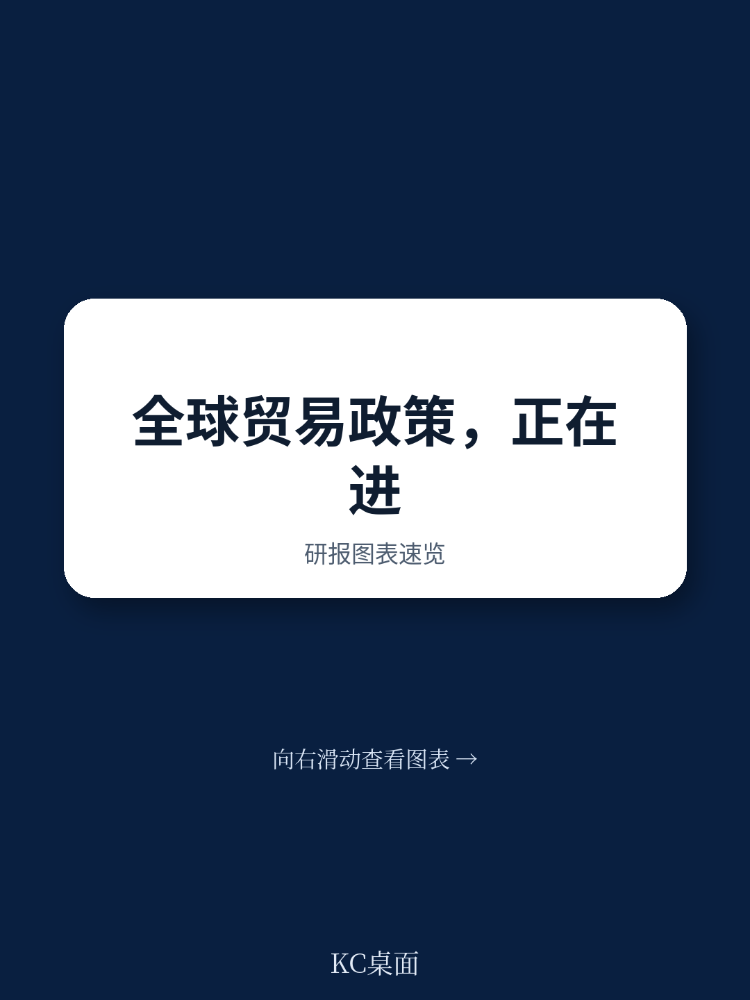
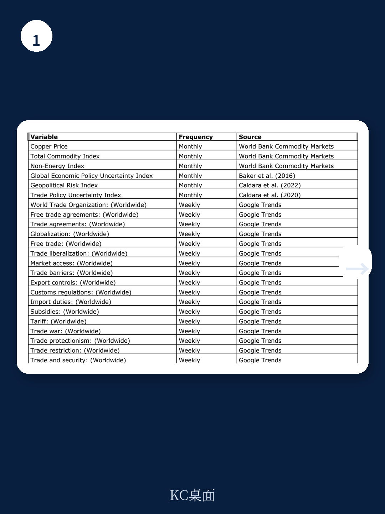
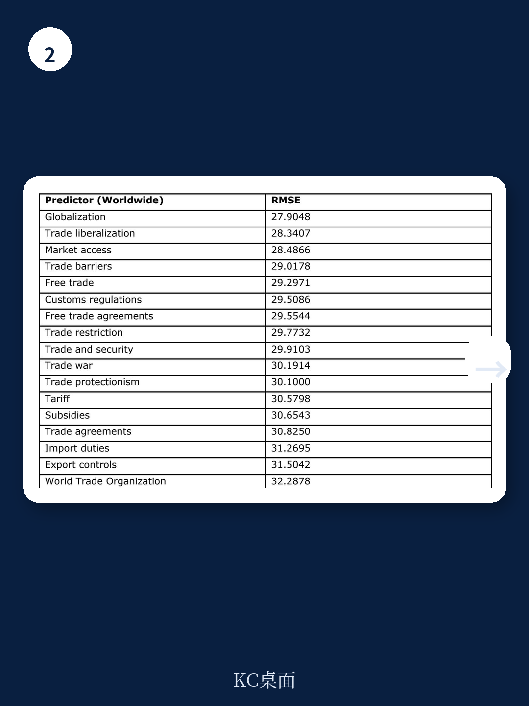

# IMF：行业规则与主题变化观察

全球贸易政策正在经历一场自资金扰动以来最显著的结构性转变。国际货币产品组织（IMF）与世贸组织（WTO）联合发布的工作论文，通过构建“贸易政策活动指数”（TPA Index），首次系统量化了这一变化。该指数基于对197个国家和地区贸易政策措施的动态因子模型分析，发现2019年前后全球贸易政策的使用频率和强度出现了明显跃升，且这一趋势在疫情、地缘冲突和持续贸易摩擦的叠加下持续强化。

报告的核心贡献在于提供了一个可实时监测的全球贸易政策活动指标。与传统的贸易限制指数不同，TPA指数不仅捕捉关税和非关税措施的变动，还整合了贸易救济、补贴、海关程序等多种政策工具，并通过动态因子模型提取其共同趋势。这意味着，过去依赖单一数据源或低频指标的观察方式，正在被更系统、更及时的分析框架所替代。

## 1. 2019年成为全球贸易政策活动的结构性分水岭

TPA指数显示，从2008年全球资金扰动到2018年，全球贸易政策活动基本保持平稳。但2019年之后，指数出现持续且显著的上行趋势。这一结构性转变并非由单一事件驱动，而是多重因素叠加的结果：中美关税升级（2018-2019年）、新冠疫情（2020年）以及乌克兰战争（2022年）分别构成了三个明显的周期性峰值。

报告特别指出，贸易促进类措施与其他类型措施（如限制性措施）往往同步增加。这种“同向运动”反映了各国在面对外部冲击时，同时使用多种政策工具进行调整的普遍行为模式。换言之，贸易政策不再是简单的“开放”或“封闭”二选一，而是成为各国应对外部环境变化的综合性工具箱。

> **KC评论：** 这一发现挑战了“贸易政策变化主要来自关税战”的直观印象。TPA指数的结构性上升表明，即使关税水平没有大幅变动，各国通过补贴、技术标准、政府采购等方式进行的政策干预也在系统性增加。对于跨国企业而言，这意味着需要从“关注关税清单”转向“监测政策活动整体强度”。

## 2. G20与非G20地区呈现不同的政策活动轨迹

报告将地区分为G20和非G20两组进行分析，发现两者在贸易政策活动的长期趋势和短期波动上存在系统性差异。G20地区的TPA指数呈现更持久的上升路径，且其政策活动的高峰与全球性事件（如中美贸易摩擦）高度相关。而非G20地区的政策活动则更多受到区域性冲击或自身宏观环境周期的影响，2018-2019年的中美关税升级并未对其产生显著冲击。

这一差异的实质在于：G20地区既是全球贸易规则的主要制定者，也是贸易政策工具最密集的使用者。它们之间的政策互动——无论是关税报复还是补贴竞赛——会通过贸易和研究渠道传导至全球，而非G20地区更多是政策冲击的接受者，而非发起者。

## 3. 高频数据可实现贸易政策活动的实时预测

报告的另一项重要创新是引入了MIDAS（混频数据抽样）回归模型，利用谷歌趋势等高频数据对TPA指数进行“即时预测”（nowcasting）。研究发现，仅使用1-3个高频预测变量即可显著提升预测精度：当使用3个最佳预测变量时，均方根误差（RMSE）相比简单自回归模型降低了约12.8%。

在17个测试的谷歌趋势关键词中，“全球化”“贸易自由化”“市场准入”等主题的搜索强度对TPA指数的预测效果最佳。这意味着，贸易政策活动并非完全随机，而是与公众和市场的关注度存在可量化的关联。对于政策研究者和市场参与者而言，这一方法提供了一种在官方数据发布前预判政策动向的可行路径。

> **KC评论：** 即时预测的价值不在于精确预测每一次政策调整，而在于为决策者提供一个“预警系统”。当高频指标出现异常波动时，可以触发对特定政策领域或国家组的深度分析。这种“先扫描、后聚焦”的方法，比等待季度或年度数据发布后再反应要有效得多。

## 4. 贸易政策活动指数的构建方法具有可复制性

报告详细说明了TPA指数的构建过程，包括数据来源（WTO贸易监测数据库和全球贸易预警数据库）、变量构造（措施数量和受影响产品数量）、以及针对数据滞后性的调整方法（12个月发现窗口和基于历史模式的校正因子）。这些技术细节使得该指数可以被其他研究机构或政策部门复制和扩展。

特别值得关注的是，报告对两个数据库的互补性进行了系统论证：WTO数据库以官方来源为主，准确性高但覆盖范围较窄；GTA数据库覆盖更广且更新更快，但可能包含未实施的宣布措施。通过动态因子模型提取两者的共同因子，可以在保留各自优势的同时，过滤掉单一数据源的噪声。

这一方法论框架的意义超越了贸易政策本身。任何涉及多源、多维度、多频率数据的政策监测问题——如产业政策、气候政策、数字监管——都可以借鉴类似的思路：先通过因子模型提取共同趋势，再结合高频数据进行即时预测，最后通过结构化分析解释具体波动的原因。
