# Consequences of Growing Up Displaced Evidence from Displaced Children in Colombia

Tatiana Hiller

Andrés Moya

Sandra V. Rozo

POLICY RESEARCH WORKING PAPER 11429

## Abstract

This paper examines how forced displacement shapes child development beyond socioeconomic disadvantage. The paper uses original data on roughly 1,600 Venezuelan refugees, Colombian internally displaced individuals, and nondisplaced children in Medellín, Colombia. The analysis adapts rank-rank regressions from the intergenerational mobility literature to a forced displacement setting, ranking each child's developmental outcomes against household wealth. The paper documents substantial gaps that persist after holding wealth and parental background fixed. It also shows that the cause of displacement shapes the nature of the gaps. Venezuelan refugees displaced by acute material deprivation fall 19 and 13 rank points behind in cognitive and physical development, respectively. Colombian children displaced by armed conflict fall 12 rank points behind in depression and exhibit elevated trauma. Access to regularization and social services is associated with narrower gaps.

# Consequences of Growing Up Displaced: Evidence from Displaced Children in Colombia \*

Tatiana Hiller $^{\dagger}$ Andrés Moya $^{\ddagger}$ Sandra V. Rozo $^{\S}$

Authorized for distribution by Dean Jolliffe, Research Manager, Development Research Group, Development Economics, World Bank Group

JEL Classification: F22, J13, O15

Keywords: Forced Displacement, Children development, Colombia.

## I INTRODUCTION

Forced displacement is one of the defining crises of our time. Driven by armed conflict, political instability, and humanitarian collapse, the global displaced population has more than quintupled in the last fifty years, reaching 123 million people in 2025 (UNHCR, 2024b). Children account for nearly 45 percent of this population, yet they remain largely invisible in both policy and empirical research (UNHCR, 2024a). Displaced children face the trauma of forced migration, family disruption, prolonged legal uncertainty, interrupted schooling, the loss of social networks, and discrimination in host communities, during the years when the returns to human capital investment are highest (Heckman, 2006). These stressors can permanently impair cognitive, physical, and socioemotional trajectories in ways that general poverty alone does not predict. Whether the developmental deficits these children exhibit reflect displacement-specific mechanisms or simply socioeconomic disadvantage carries direct implications for how social protection systems should respond.

We examine three questions. First, we ask whether displaced children exhibit developmental gaps relative to non-displaced peers, and whether the cause of displacement shapes the dimensions in which those gaps appear. Children displaced by armed conflict face trauma exposure and elevated mental health risks, while those fleeing a humanitarian and economic crisis face more acute material deprivation. Second, we ask whether these gaps can be accounted for by socioeconomic status or parental background. We approach this in two steps. We first condition on household wealth (and parental background) to ask whether gaps remain at the same average level of resources. We then adapt the rank-rank regression framework of Chetty et al. (2014) and Jensen and Manning (2025) to ask whether gaps fade across the wealth distribution. In the voluntary migration literature, developmental differences among children of immigrants largely disappear once parental socioeconomic status is held fixed (Abramitzky et al., 2021a; Jensen and Manning, 2025). If the same pattern holds for forcibly displaced children, standard poverty-targeting policies may suffice; if gaps persist at equivalent levels of household wealth, targeted integration and mental health interventions may be necessary. Third, for refugee children, we ask whether access to legal status, health care, education, and social services is associated with narrower gaps.

We examine these questions in Colombia, where forcibly displaced people, including IDPs and refugees, account for 21 percent of the population and 9.6 percent of the world's displaced. The country has experienced decades of protracted internal conflict and currently hosts 8.4 million Internally Displaced Persons (IDPs) legally recognized by the state (Unidad para las Víctimas, 2024). It is also the primary destination for refugees fleeing the Venezuelan crisis. $^{1}$ Since 2015, around three million Venezuelans have crossed into Colombia, fleeing acute food shortages and the collapse of public services (UNHCR, 2024a). The Colombian government responded with one of the most inclusive regularization programs in the developing world, granting roughly two million refugees temporary legal status and access to the social protection system. Colombia is therefore one of the few middle-income countries where IDPs displaced by armed conflict and refugees displaced by humanitarian collapse coexist at scale within the same institutional environment.

The two displaced populations face distinct conditions, both before and after arrival. Venezuelan refugees flee acute material deprivation (Cabra-Ruiz, Rozo and Sviatschi, 2024) and arrive in Medellín without productive or social assets, but typically without direct exposure to armed conflict (Moya and Rozo, 2025). Colombian IDPs are entitled to the same social protection benefits as non-displaced Colombians in principle, but their effective access remains lower, and they carry the burden of conflict exposure, transmitted directly or across generations (Ibáñez and Moya, 2010; Moya and Carter, 2019). These contrasts shape the developmental dimensions in which gaps are likely to appear.

Our analysis draws on the Venezuelan Refugee Panel Survey for Kids (VenReps Kids), a representative survey of children in Medellín that we designed and fielded for this study. Medellín is one of the Colombian cities with the highest concentrations of both Venezuelan refugees and Colombian IDPs. The survey covers Venezuelan refugee, Colombian IDP, and non-displaced Colombian children aged 5 to 10, and includes harmonized measures of cognitive, physical, socioemotional, and mental health development. To our knowledge, it is the first dataset to collect comparable developmental information on these three populations within a single host setting in a developing country.

Our analysis proceeds in three steps, one for each question. First, we document gaps in each developmental domain between displaced and non-displaced children. Second, we ask how much of each gap is accounted for by household wealth and parental background. We begin with unconditional differences, then condition on average household wealth, and then adapt the rank-rank framework of Chetty et al. (2014) and Jensen and Manning (2025) to characterize the relationship between household wealth rank and child developmental rank separately for refugees, IDPs, and non-displaced children. This framework distinguishes two features of the wealth-development relationship: the rank gap between displaced and non-displaced children at equivalent points in the wealth distribution, and the wealth-development gradient within each group, which captures how strongly household resources map into children's outcomes. Third, we ask whether, among refugee children, access to legal residence through regularization and other dimensions of service access is associated with narrower gaps. The main analysis centers on the first survey wave, which is representative and unaffected by differential attrition.

We document three key results. First, displaced children exhibit substantial developmental gaps relative to non-displaced peers, and the developmental domains in which gaps appear depend on the cause of displacement. Venezuelan refugee children show the largest gaps in cognitive development and physical health, scoring 0.34 standard deviations below non-displaced peers on receptive vocabulary and 0.50 standard deviations below on age-standardized Body Mass Index. These patterns are consistent with the material deprivation and limited access to services that characterize deprivation-driven displacement. Colombian IDP children, by contrast, show gaps concentrated in mental health and socioemotional development, scoring 0.25 standard deviations below non-displaced peers on depression, 0.21 on socioemotional functioning, and 0.18 on trauma symptoms, consistent with conflict exposure (Sánchez-Ariza, Cuartas and Moya, 2023). The IDP pattern holds for children directly affected by displacement and for those affected indirectly through their parents, pointing to both direct exposure and intergenerational transmission as plausible channels. The coefficients differ between IDPs and refugees in five of the six outcomes we examine, indicating that the two types of displacement are associated with distinct developmental patterns rather than a single uniform displacement experience.

Second, the gaps cannot be accounted for by socioeconomic disadvantage. Conditioning on parental and grandparental education leaves the gaps essentially unchanged. Further conditioning on household wealth attenuates the refugee gaps in cognitive development and physical health but does not close them, and the IDP gaps in mental health remain largely unchanged. The rank-rank analysis delivers the same message with sharper detail. At equivalent points in the wealth distribution, refugee children rank 18 percentile points below non-displaced peers in cognitive development and 13 points below in physical health, and IDP children rank 10 and 12 points below in cognitive development and depression. Household wealth narrows only the refugee cognitive gap. For IDPs, gaps are flat across the wealth distribution in every domain we examine, and the refugee physical health gap is similarly flat. The developmental disadvantages associated with displacement therefore do not respond to material resources in the way that ordinary socioeconomic gaps do.

Third, access to Colombia's regularization program, which grants refugees the right to work and access to the social protection system, is associated with substantially narrower gaps among refugee children. Undocumented refugee children score 0.77 standard deviations below non-displaced peers in receptive vocabulary, compared with 0.24 standard deviations for regularized refugees, and we observe a similar pattern for physical health. The association extends to other dimensions of service access, including social registry enrollment, education, and health insurance. Regularized refugees nonetheless retain gaps in cognitive development and physical health, indicating that institutional access narrows but does not eliminate the developmental disadvantages associated with displacement.

Our paper contributes to three groups of literature. First, we contribute to the literature on forced migration (Card, 1990; Foged and Peri, 2016; Dustmann, Vasiljeva and Piil Damm, 2019; Steinmayr, 2021; Michalopoulos et al., 2025; Chiovelli et al., 2021; Rozo, 2025; Moya and Rozo, 2025) by providing the first representative, longitudinal dataset on the holistic development of forcibly displaced children in a low- and middle-income host country. Over three-quarters of the world's displaced populations are hosted in settings comparable to ours, yet the existing evidence on displaced youth relies almost entirely on clinical samples, cross-sectional surveys, or data from high-income resettlement countries where selection into arrival may differ systematically from the broader displaced population (Fazel et al., 2012; Draper et al., 2022). We assemble a representative sample of Venezuelan forced migrants and Colombian internally displaced persons aged 5 to 10 in Medellín, combining snowball sampling with satellite imagery of informal settlements and administrative records from NGOs to reach a population for which no census exists. Critically, we measure development across four domains simultaneously, spanning cognitive functioning, socioemotional development, physical health, and mental health outcomes, allowing us to document how displacement-related deficits compound across developmental domains and stages in ways the existing literature, which concentrates disproportionately on a single outcome in isolation, has not addressed (Choudhary et al.,

2023; Bernhardt et al., 2024).

Second, we extend the intergenerational mobility literature to the context of forced displacement (Borjas, 1993; Card, DiNardo and Estes, 2000; Abramitzky et al., 2021a; Jensen and Manning, 2025). A central finding of this literature is that worse outcomes among migrants are largely explained by parental socioeconomic disadvantage rather than by migration status itself. We extend this question to a South-to-South forced displacement outflows, where there is genuine scope for a different conclusion. Unlike voluntary economic migrants, forcibly displaced people are more likely to have suffered trauma, asset losses, chronic poverty, and ongoing rights uncertainty that economic vulnerability by itself does not capture. We adapt the rank-rank regression framework of Chetty et al. (2014) and Jensen and Manning (2025) to ask whether developmental gaps between displaced and non-displaced children persist after accounting for household wealth or whether they can be fully attributed to socioeconomic disadvantage, and we exploit variation in the cause of displacement to assess whether conflict-induced and crisis-induced displacement differ in this respect. By focusing on child development outcomes rather than adult wages, our analysis speaks directly to the timing of policy intervention, given the substantially higher returns to investment in early life (Heckman and Mosso, 2014).

Finally, we contribute to the literature linking forced displacement to mental health outcomes for children in two distinct ways (Pluess, Brown and Panter-Brick, 2025). First, we document evidence for internally displaced persons and displacement in Latin America, which has received far less attention than refugee displacement in developed countries, the Middle East, or sub-Saharan Africa (Chen et al., 2019; Salami et al., 2020; Hazer and Gredebäck, 2023; Popham et al., 2022; McEwen et al., 2023). Second, by comparing Venezuelan forced migrants and Colombian IDPs within the same institutional setting in a middle income country where full mobility is allowed and displaced populations have legal support, we contribute direct evidence on both gaps and document patterns consistent with the intergenerational transmission of conflict-related trauma and its interactions with service access, building on prior evidence of how political violence shapes mental health and economic outcomes in Colombia (Ibáñez and Moya, 2010; Moya and Carter, 2019; Marroquín Rivera et al., 2020; Sánchez-Ariza, Cuartas and Moya, 2023).

## II THE COLOMBIAN DISPLACEMENT CONTEXT

Colombia hosts 9.8 percent of the forcibly displaced populations in the world, encompassing Venezuelan refugees displaced by an extreme economic and humanitarian crisis and internally displaced Colombians uprooted by decades of armed conflict. The Colombian government's policy response toward both groups ranks among the most comprehensive globally (Ibáñez, Moya and Velásquez, 2022; Moya and Rozo, 2025). Below we briefly describe each crisis and refer readers to Appendix A for additional institutional and contextual detail, including the scale and geographic distribution of Venezuelan migration to Colombia, the policy response and resulting rights and service access available to Venezuelan refugees, key differences in access to services such as education between Colombians and Venezuelans, and a brief overview of the geography and historical trends of internal displacement within Colombia.

II.A Refugees in Colombia: humanitarian crisis-driven displacement from Venezuela

Over the past decade, more than 7.7 million Venezuelans have been forced to flee their country due to service collapse and severe material deprivation (Cabra-Ruiz, Rozo and Sviatschi, 2024). The majority sought refuge in Latin American countries, with Colombia becoming the primary destination. By 2023, Colombia hosted approximately 2.8 million Venezuelan refugees, representing 5.8 percent of the country's population relative to the 2018 census (Migración Colombia, 2023). Venezuelan refugees settled primarily in border areas and major cities, including Bogotá, Medellín, Cúcuta, and Barranquilla.

Colombia's policy response expanded considerably in response to the massive inflows of Venezuelan refugees. Regularization programs, initially limited to better-educated refugees, broadened significantly in 2018 and 2021, culminating in the Permiso por Protección Temporal (PPT), which granted legal status to over 1.8 million refugees by 2023 (including anyone who had arrived to Colombia by 2021). Research shows that these programs improved refugees' labor market outcomes, income, and consumption (Ibáñez et al., 2024). Regardless of legal status, Venezuelan refugee children and adolescents are entitled to basic education and emergency healthcare. However, access to graduation credentials, full subsidized health insurance, and eligibility for social programs through Sisbén remains restricted to regularized refugees. $^{2}$

## II.B IDPs in Colombia: conflict-driven displacement from rural areas

Colombia hosts the largest population of internally displaced persons (IDPs) in the world. By 2025, the country had registered more than 8.8 million internally displaced individuals, equivalent to 18 percent of the national population according to the 2018 census (UN-HCR, 2025). Internal displacement has been driven primarily by a protracted armed conflict involving the Colombian government, nonstate armed groups including the FARC and ELN, and organized criminal organizations (de Memoria Histórica et al., 2021). Displacement intensified sharply over the last three decades, reaching a peak in 2003.

Colombia has developed one of the world's most comprehensive legal frameworks for internally displaced persons, combining victim recognition, land restitution, psychosocial support, and financial compensation (Ibáñez, Moya and Velásquez, 2022). $^{3}$ Evidence suggests these reparations programs improved housing, education, and health outcomes for recipients, though effects on labor market integration have been more limited (Guarin, Vélez and Posso, 2023). Despite persistent challenges in implementation capacity and budget constraints, Colombia's policy framework has meaningfully advanced the rights and material conditions of millions displaced by the conflict.

## II.C Contrasting the Two Displaced Populations

The two displaced populations in Colombia differ along three dimensions relevant to children's development. The first is the cause of displacement. Venezuelan refugees were uprooted by economic collapse and the failure of public services, but most arrived without direct exposure to armed conflict (Moya and Rozo, 2025). Colombian IDPs were uprooted by armed conflict, and many carry direct or household exposure to violence into displacement (Sánchez-Ariza, Cuartas and Moya, 2023).

The second is demographic origin. Venezuelan refugees come from a range of socioeconomic backgrounds and predominantly urban settings, reflecting the breadth of Venezuela's collapse. Colombian IDPs originate predominantly from rural areas and have lower average levels of formal education, reflecting the geographic concentration of armed conflict in the Colombian countryside.

The third is institutional standing. Refugees face a clock and a status. Their access to schooling, full health insurance, and Sisbén-targeted programs depends on regularization, and discrimination, language and cultural barriers, and limited administrative capacity further restrict de facto access. IDPs are Colombian citizens with full legal standing and dedicated victims-registry rights, yet their effective access to social protection lags that of non-IDPs.

These contrasts motivate our empirical comparison. If displacement operated through a single channel, the two populations would show similar developmental gaps. If the cause of displacement and service access shapes which developmental domains are affected, the gaps should differ in nature, not only in magnitude.

## III DATA: THE VENREPS-KIDS STUDY

To conduct this study, we collected the Venezuelan Refugee Panel Study for Kids (VenRePs-Kids), a longitudinal household survey designed to measure the developmental trajectory ries of forcibly displaced children in Colombia. The study comprises a representative sample of Venezuelan refugee and Colombian households with children aged 5 to 10 in Medellín, Colombia. Appendix B provides additional detail on the survey timeline, data collection procedures, sampling frame construction, questionnaire design, the geographic distribution of surveyed households, survey modules, and instrument validation.

Location. We conducted the study in Medellín, Colombia's second-largest city and a major urban hub with a long history of both international and internal forced displacement. Medellín hosts the third-largest concentration of Venezuelan migrants in Colombia, representing roughly 6.4 percent of the city's total population (Medellín Cómo Vamos, 2024). It is also among the regions most affected by Colombia's protracted armed conflict, with IDPs comprising about 8 percent of its residents (Unidad para las Víctimas, 2024). This dual role as a host to both Venezuelan forced migrants and Colombian IDPs makes Medellín an exceptional setting for examining the developmental consequences of different types of forced displacement within a shared geographic and institutional environment.

Timeline. The baseline survey was conducted between October and December 2022. Six months later, we implemented a short follow-up to update contact information and ensure sample continuity. Approximately one year after baseline, between October and December 2023, we administered the full survey again to capture changes in children's well-being, integration, and household context.

Design and sampling. The baseline survey is representative of children (ages 5–10) residing in Medellín. The first consists of Colombian-born youth with Colombian parents, of whom 34.3 percent belong to internally displaced households. The second consists of Venezuelan-born youth with Venezuelan parents who migrated to Colombia between 2016 and 2020 during the height of the Venezuelan exodus. The sample was stratified by gender and socioeconomic level, based on Colombia's neighborhood income classification system (strata 1 through 6), and deliberately restricted to strata 1 through 4 to avoid overrepresentation of higher-income households less likely to include refugees in need of support.

Colombian households were sampled using the 2018 National Population Census. Residential blocks were stratified by socioeconomic level and a representative sample of blocks was randomly selected. Within each selected block, households with children aged 5–10 were identified and randomly sampled to ensure representativeness across gender, age, and socioeconomic level. Internal displacement status for Colombian households was subsequently verified by merging survey data with administrative records. The final sample included 1,370 households, from which we collected information on 1,579 children (47 percent Venezuelan).

The sampling frame for Venezuelan households was developed through an extensive listing exercise combining multiple sources, including the 2018 Population Census, NGOs, humanitarian agency databases such as iMMAP, and satellite imagery of informal migrant settlements, to identify areas with high concentrations of Venezuelan migrants. Field teams conducted on-site verification of these settlements and implemented a structured snowball sampling strategy to reach mobile and informal communities not captured in official registries. This multi-source approach was designed to reduce the selection toward more socially connected households that standard snowball methods can introduce. The listing process identified approximately 7,000 Venezuelan families with children in Medellín, from which households were randomly selected to ensure comparability across age, gender, and socioeconomic background.

Eligibility criteria. The study targeted children aged 5–10 residing in Medellín. Colombian participants were eligible if both the child and parents were Colombian nationals. Venezuelan participants were eligible if both the child and parents were Venezuelan nationals who migrated to Colombia between 2016 and 2020 and had not acquired Colombian citizenship. $^{4}$ In households with more than two eligible children, up to two were randomly selected to participate.

Tracking rates. At the follow-up survey conducted one year after baseline, we successfully recontacted 1,355 of the 1,579 baseline participants, representing an overall tracking rate of 85.8 percent. Tracking rates varied by displacement status: 68.8 percent for non-displaced Colombians, 84.5 percent for IDPs, and 60.8 percent for Venezuelan migrants. These differences are consistent with the higher residential mobility and socioeconomic vulnerability typically observed among forcibly displaced populations. Attrition was not random. Households with lower wealth, lower caregiver education, and weaker connections to public services were significantly more likely to exit the sample, and the dominant predictor of attrition among Venezuelan households was lack of regularization status (see Appendix B.8 for more details). Our main analysis, therefore, focuses on the first-wave data, which is representative and unaffected by differential attrition. In secondary analysis, we use the panel to assess whether the baseline gaps persist over time, but interpret those results cautiously given the non-random nature of attrition. Specifically, we report results for the observed sample without imputation and complement them with Lee bounds that account for differential attrition under monotonicity assumptions (Lee, 2005).

Data collection. Data were collected through face-to-face interviews conducted by a team of 35 trained enumerators, including 12 social workers and psychologists, all of whom were residents of Medellín with prior experience in household surveys, anthropometric measurement, and child development assessments. Each interview lasted approximately two hours and involved two enumerators: one interviewed the primary caregiver, typically the mother, while the other engaged directly with the child. The primary caregiver was defined as the person most familiar with the child's daily activities and decision-making. Caregivers received a grocery voucher valued at approximately 10 US dollars as compensation for their participation in each survey round.

Survey modules. The questionnaire comprised seven modules covering household characteristics, sociodemographics, education, health and nutrition including anthropometric measures, time use and child labor, prosocial preferences and migration outlook, and socioemotional and mental health. Prior to fieldwork, enumerators completed standardized training on questionnaire administration and on the use of validated instruments to measure mental health and developmental outcomes.

## III.A Descriptive statistics

Table 1 reports descriptive statistics for children (Panel A), and their households (Panel B) in our sample.

Refugee children face significant educational disadvantages relative to non-displaced peers with refugee children exhibiting substantially larger gaps than IDP children. As illustrated in Panel A, the three groups are balanced on gender and age. However, the groups diverge sharply on years of education. Refugee children (1.65 years) have completed significantly fewer years of education than IDPs (2.0) and non-displaced children (2.07), with both differences being statistically significant. The school enrollment results show wide gaps for refugee children. Non-displaced and IDP children have nearly identical school enrollment rates of 96 percent, while refugee children have a school enrollment rate of just 75 percent. Interestingly, IDP children show no school enrollment disadvantage relative to non-displaced peers despite coming from households with significantly lower parental education, as discussed below. This result is consistent with school enrollment barriers related to legal status and institutional access rather than socioeconomic disadvantage alone.

Household characteristics suggest that the educational disadvantages of refugee children cannot be explained by parental human capital, and are instead consistent with barriers in accessing Colombia's social protection system. Panel B reports that caregiver education differs markedly across groups. IDP caregivers have the lowest average education at 9.2 years, significantly below non-displaced households (10.2 years). Refugee caregivers average 10 years, statistically indistinguishable from non-displaced Colombians. This asymmetry is important. Refugee children fall behind non-displaced peers in school enrollment and years of education despite coming from households with comparable parental human capital, while IDP children maintain similar enrollment rates despite having substantially less-educated caregivers. The two displaced groups also differ fundamentally in their number of years since displacement. IDP households have been displaced for an average of 205 months (over 17 years), while refugee households average 48 months (about 4 years). This implies that most refugee children experienced displacement directly during early childhood, while some IDP children might be second-generation and might not have faced displacement themselves. We examine these patterns in more detail below.

Access to the social protection system, measured by whether the household is registered in Sisben, also reveals significant gaps for refugees. The share of households registered in Sisben is 0.84 among IDPs, slightly above the 0.81 observed for non-displaced households, while only 0.38 of refugee households are registered; all differences are statistically significant. Although 80 percent of refugee households in our sample hold some form of legal status through regularization programs, their low Sisben affiliation suggests that de jure access to services has not translated into de facto integration into Colombia's social protection system. Considering that Sisbén affiliation is the primary gateway to subsidized health insurance and social transfers in Colombia, this gap between formal regularization and actual enrollment in the social protection system may help explain why refugee children face persistent school enrollment disadvantages even when their households have a regularized status.

Table 1. Descriptive Statistics: Children and Household Characteristics, VenRePs-Kids Survey

<table><tr><td></td><td>(1) Non-Displaced</td><td>(2) IDP</td><td>(3) Refugee</td><td>(4) Difference (1)-(2)</td><td>(5) Difference (1)-(3)</td><td>(6) Difference (2)-(3)</td></tr><tr><td colspan="7">A. Children (N=1579)</td></tr><tr><td>Male</td><td>0.52(0.500)</td><td>0.53(0.500)</td><td>0.53(0.499)</td><td>-0.01(0.037)</td><td>-0.01(0.028)</td><td>-0.00(0.035)</td></tr><tr><td>Age</td><td>7.55(1.621)</td><td>7.49(1.657)</td><td>7.37(1.677)</td><td>0.06(0.120)</td><td>0.19**(0.093)</td><td>0.12(0.118)</td></tr><tr><td>Education</td><td>2.07(1.591)</td><td>2.00(1.598)</td><td>1.65(1.496)</td><td>0.07(0.121)</td><td>0.41***(0.089)</td><td>0.34***(0.111)</td></tr><tr><td>Enrollment</td><td>0.96(0.190)</td><td>0.96(0.196)</td><td>0.75(0.435)</td><td>0.00(0.014)</td><td>0.21***(0.020)</td><td>0.21***(0.027)</td></tr><tr><td>Observations</td><td>558</td><td>276</td><td>745</td><td>834</td><td>1303</td><td>1021</td></tr><tr><td colspan="7">B. Households (N=1370)</td></tr><tr><td>Education</td><td>10.16(3.237)</td><td>9.23(3.510)</td><td>9.96(3.053)</td><td>0.93***(0.259)</td><td>0.20(0.188)</td><td>-0.73***(0.240)</td></tr><tr><td>Months since displacement</td><td></td><td>203.92(124.165)</td><td>47.76(14.920)</td><td></td><td></td><td>156.17***(7.957)</td></tr><tr><td>Sisben</td><td>0.81(0.394)</td><td>0.84(0.363)</td><td>0.38(0.486)</td><td>-0.04(0.030)</td><td>0.43***(0.027)</td><td>0.47***(0.034)</td></tr><tr><td>Regularization</td><td></td><td></td><td>0.80(0.402)</td><td></td><td></td><td></td></tr><tr><td>Observations</td><td>501</td><td>246</td><td>623</td><td>747</td><td>1124</td><td>869</td></tr></table>

Notes. All variables are measured in Wave 1 of the VenRePs-Kids survey. Panel A presents descriptive statistics for children, while Panel B reports household-level characteristics. Column (1) corresponds to non-displaced Colombian children, Column (2) to internally displaced persons (IDP), and Column (3) to Venezuelan refugees. Columns (4)-(6) report mean differences between groups: Column (4) shows the difference between non-displaced and IDP children, Column (5) the difference between non-displaced and refugee children, and Column (6) the difference between IDP and refugee children. Positive values indicate that the first group in the comparison has a higher mean, while negative values indicate that the second group has a higher mean. Male is a dummy equal to one for boys. Age is measured in years. Education refers to completed years of schooling of the child. Enrollment is a dummy equal to one if the child is currently enrolled in school. Household education refers to the maximum years of parental education within the household. Months since displacement measures the time elapsed since forced displacement for IDP and refugee households. Sisben indicates whether the household is registered in the Colombian social protection targeting system. Regularization refers to the share of refugee households with regular migration status. Standard deviations are reported in parentheses. Statistical significance of mean differences is denoted by $* p < 0.10$ , $** p < 0.05$ , $*** p < 0.01$ .

Age at displacement. Figure 1 illustrates the distribution of age at displacement for children in our sample. The figure highlights a fundamental difference between the two displaced populations. Nearly all Venezuelan refugee children experienced displacement directly during their own lifetime. In contrast, the IDP distribution reveals a mix of first and second-generation displaced youth. More than half of IDP children experienced displacement directly, but a substantial share were born after the family's displacement event, as indicated by negative values on the horizontal axis. These second-generation IDP children never underwent the displacement shock themselves but grew up in households shaped by conflict, forced migration, and its lasting consequences (Sánchez-Ariza, Cuartas and Moya, 2023). This distinction between direct and indirect exposure to displacement is central to interpreting the developmental gaps we document in the following sections, as it allows us to assess whether the gaps associated with displacement reflect the disruption of the event itself or the persistent disadvantage of growing up in a displaced household.

Figure 1. Distribution of Age at Displacement by Displacement Status  
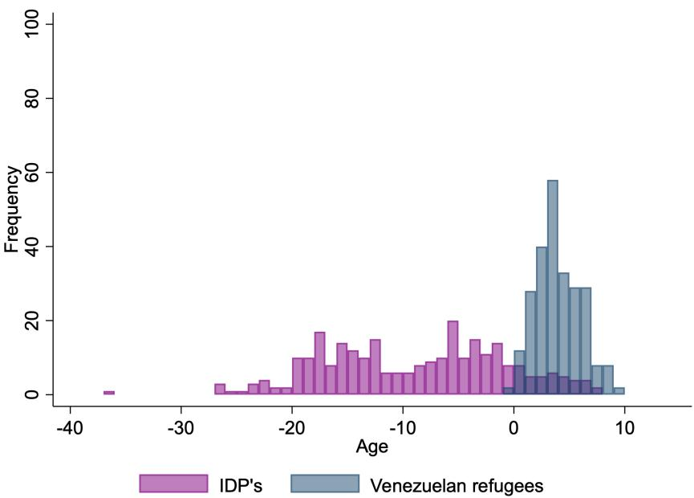  
Notes. The figure displays the distribution of age at displacement for Venezuelan refugees and internally displaced Colombians (IDPs) in the VenRePs-Kids sample, pooling children (ages 5 to 10). Age at displacement is defined as the child's age at the time of the family's most recent displacement event. Positive values indicate the child was alive at the time of displacement and experienced it directly. Negative values indicate the child was born after the family's displacement event and did not experience it directly. For Venezuelan refugees, age at displacement is calculated as the difference between the child's age at the time of the baseline survey (2022) and the year the family migrated to Colombia. For IDPs, age at displacement is calculated as the difference between the child's age at baseline and the year of the family's most recent forced displacement episode as reported by the primary caregiver.

## IV EMPIRICAL STRATEGY

Our empirical analysis proceeds in several steps. First, we estimate developmental gaps between displaced and non-displaced children across cognitive, physical, socioemotional, and mental health outcomes. We begin with unconditional gaps and then add controls for child demographics, parental education, and household wealth to assess how much of the gap is explained by differences in socioeconomic position. Second, we adapt the rank-rank framework of Chetty et al. (2014) and Jensen and Manning (2025) to examine whether displaced children rank below non-displaced children at similar points in the wealth distribution, and whether the wealth–development gradient differs by displacement group. Third, we examine whether these gaps vary with access to legal regularization and other services. We then use the two-wave panel to assess whether gaps persist over time. The main analysis uses the first wave, which is representative and unaffected by differential attrition; Section IV.E presents the longitudinal evidence. $^{5}$

## IV.A Main outcomes

We focus our analysis on six primary outcomes that capture distinct dimensions of child development among children ages 5 to 10.

1. Cognitive development. We measure cognitive development using the Peabody Picture Vocabulary Test (PPVT), an untimed assessment of receptive vocabulary administered directly to children. The test comprises 125 items of increasing difficulty, each presenting four images from which the child identifies the one corresponding to a spoken word. We conducted a preliminary validation with Venezuelan mothers in our sample to verify that vocabulary items carried consistent meanings across Colombian and Venezuelan dialects. Our primary outcome is the percentile rank based on the published test norms.

2. Socioemotional development. We measure socioemotional development using the Strengths and Difficulties Questionnaire (SDQ), a 25-item behavioral screening instrument completed by caregivers. The SDQ covers emotional symptoms, conduct problems, hyperactivity and inattention, peer relationship difficulties, and prosocial behavior. Our primary outcome is the 20-item total difficulties score, which aggregates the

first four domains.

3. Anxiety, depression, and trauma symptoms. We measure mental health using the Trauma Symptom Checklist for Young Children (TSCYC), a standardized caregiver-report instrument designed to assess acute and chronic trauma-related symptoms in children. From this instrument, we use the 9-item Anxiety subscale, the Depression subscale, and the total trauma score as separate outcomes. The full TSCYC is a 90-item measure that captures a broad range of post-traumatic symptoms, including anxiety, depression, anger, dissociation, and trauma-specific responses.

4. Physical development. We assess physical development using body mass index (BMI), calculated as weight in kilograms divided by height in meters squared and standardized using World Health Organization (WHO) reference norms by age and sex. Because the standardized BMI score does not distinguish between deviations above and below the reference mean, we also construct separate indicators for underweight (BMI more than one standard deviation below the WHO reference mean) and overweight (BMI more than one standard deviation above it) to distinguish the direction of nutritional deficits.

All instruments used in the analysis have been validated in Spanish-speaking populations. To facilitate comparison across outcomes measured on different scales, we standardize each measure using the Wave 1 mean and standard deviation in our sample. When relevant, we also construct indicator variables for whether a child exceeds established clinical thresholds. Appendix B.7. reports the psychometric properties of each instrument, including internal consistency and confirmatory factor analysis statistics, separately by displacement group.

## IV.B Developmental gaps among displaced children

We examine the developmental gaps between displaced and non-displaced children using the following specification:

$$
y _ {i} = \alpha_ {0} + \alpha_ {1} \mathrm{IDP} _ {i} + \alpha_ {2} \text { Refugee } _ {i} + \Omega^ {\prime} X _ {i} + \epsilon_ {i},\tag{1}
$$

where $y_{i}$ denotes the standardized outcome of child i, IDP $_{i}$ and Refugee $_{i}$ are indicators for Colombian internally displaced and Venezuelan refugee children, respectively, and the omitted category is non-displaced Colombian children. We begin by estimating equation (1) without controls, so that $\alpha_{1}$ and $\alpha_{2}$ capture unconditional gaps relative to non-displaced peers. We then sequentially augment $X_{i}$ to examine how these gaps change when conditioning on observed characteristics. We first add child age, sex, and parental education, characteristics plausibly predetermined with respect to the child's current developmental outcomes; and then add a household wealth index to assess the extent to which the lower average wealth of displaced families accounts for the observed differences. Standard errors are clustered at the household level throughout to account for correlation between siblings in the same household.

A limitation of the wealth-control specification is that the household wealth index is measured at the time of the survey for all groups and therefore reflects contemporaneous living standards after displacement or migration has already occurred. For both Venezuelan refugee and IDP households, this raises a bad-control concern because current wealth may itself be an outcome of forced migration and displacement rather than a predetermined measure of socioeconomic status. In other words, conditioning on contemporaneous wealth may absorb part of the mechanism through which displacement affects children's development rather than isolate pre-existing differences in household economic position. To mitigate this concern, we complement the wealth-control specification with a measure of grandparents' education, which serves as a proxy for the household's socioeconomic background prior to the Venezuelan economic and humanitarian crisis and is less likely to be directly affected by the migration or displacement shock itself. This alternative control recovers pre-displacement living standards, providing a proxy for household background that is less directly affected by displacement.

## IV.C Developmental rank-rank gradients by displacement status

Conditioning on average wealth answers the question of whether displaced children exhibit worse outcomes than non-displaced children with the same average level of household resources. It does not reveal whether the displacement penalty varies across the wealth distribution—that is, whether wealthier displaced households are better able to buffer their children from the costs of displacement. To address this, we adapt the rank-rank framework of Chetty et al. (2014) and Jensen and Manning (2025) to our setting. We rank each child by their score on each developmental outcome (normalized to the unit interval, with higher values indicating better outcomes) and rank households by wealth index that summarizes material living conditions at the time of the baseline survey. We then estimate:

$$
Y _ {i} = \beta_ {0} + \sum_ {j \in \{\mathrm{IDP}, \mathrm{Ref} \}} \beta_ {1} ^ {j} d _ {i} ^ {j} + \beta_ {2} W _ {i} + \sum_ {j \in \{\mathrm{IDP}, \mathrm{Ref} \}} \beta_ {3} ^ {j} \left(d _ {i} ^ {j} \times W _ {i}\right) + \beta_ {4} ^ {\prime} X _ {i} + \varepsilon_ {i}\tag{2}
$$

where $Y_{i}$ is the percentile rank of child $i$ in the relevant outcome, $d_{i}^{j}$ are displacement group indicators, $W_{i}$ is the household's wealth rank, and $X_{i}$ includes child age, sex, and survey cohort fixed effects. The coefficient $\beta_{1}^{j}$ captures the displacement penalty at the bottom of the wealth distribution (the level shift in the wealth-outcome relationship for each displacement group). The coefficient $\beta_{2}$ measures how strongly wealth predicts outcomes for non-displaced children, and $\beta_{3}^{j}$ measures how much steeper or flatter that gradient is for displaced children.

This specification answers two questions that the conditional-mean comparison cannot. First, do displaced children rank below non-displaced peers even at the same position in the wealth distribution? A significant $\beta_{1}^{j}$ indicates that the gap persists beyond what economic position can explain. Second, does household wealth help displaced children close the remaining gap? If $\beta_{3}^{j} > 0$ , wealthier displaced families partially offset the displacement penalty; if $\beta_{3}^{j} = 0$ , the penalty is constant across the wealth distribution. If both $\beta_{1}^{j}$ and $\beta_{3}^{j}$ are jointly insignificant, the developmental gaps are fully explained by household wealth rather than displacement itself, which is the pattern documented in the voluntary migration literature for children of immigrants in Denmark (Jensen and Manning, 2025).

We implement equation (2) using the wealth index as a continuous variable and check robustness to alternative functional forms using wealth deciles and ventiles (Appendix E). We do not implement the full percentile-dummy approach of Jensen and Manning (2025) given our sample sizes of approximately 1,600 children, for which 100 dummies would be severely over-parameterized. A potential concern is that the post-migration wealth index may itself be a consequence of displacement. We address this concern by replacing it with retrospectively collected wealth reported for Venezuelan households, and find qualitatively unchanged results, suggesting that our estimates are not driven by post-displacement changes in household wealth. $^{6}$

## IV.D Service access and legal status

Venezuelan refugees in Colombia face a distinctive policy environment in which legal residence status governs access to formal labor markets, health insurance, the means-tested social registry (Sisbén), and formal education. We exploit variation in access to these margins to assess whether they are associated with narrower developmental gaps among refugee children. For this purpose, we replace the single refugee indicator in equation (1) with separate indicators for refugees with and without access to a given service dimension:

$$
y _ {i} = \gamma_ {0} + \gamma_ {1} \mathrm{IDP} _ {i} + \gamma_ {2} \text {Refugee} _ {i} \cdot S _ {i} + \gamma_ {3} \text {Refugee} _ {i} \cdot (1 - S _ {i}) + \Omega^ {\prime} X _ {i} + \epsilon_ {i},\tag{3}
$$

where $IDP_{i}$ is an indicator for Colombian internally displaced children, $Refugee_{i}$ is an indicator for Venezuelan refugee children, $S_{i} \in \{0,1\}$ indicates access to the service dimension under consideration, and the omitted category is non-displaced Colombian children. The coefficients $\gamma_{2}$ and $\gamma_{3}$ capture the developmental gap relative to non-displaced peers for refugee children with and without access to the relevant service, respectively. We estimate equation (3) separately for each service dimension: legal residence through regularization programs, enrollment in Sisben, $^{7}$ access to formal education, and health insurance coverage. $^{8}$

Regularization status and service access are not randomly assigned. Refugees who obtained legal residence may differ from those who did not on unobserved dimensions including time since arrival, social networks, and initiative in navigating bureaucratic processes. The estimates from equation (3) therefore capture conditional associations rather than the causal effect of service provision.

## IV.E Persistence over time

We extend equation (1) to the two-wave panel to test whether the baseline gaps narrow over time. We estimate two specifications: a pooled OLS that averages the gap across both waves, and a wave-interaction specification that interacts each displacement indicator with a wave-two indicator to capture changes in the gap between waves. Because attrition between waves is non-random and concentrated among more vulnerable households (Appendix B.8), we estimate each specification under three approaches to missing data: the unbalanced panel without imputation, simple mean imputation for wave-two attriters, and Lee (2005) bounds that bracket the estimates under monotone selection. Comparing results across these approaches allows us to assess the sensitivity of the dynamic estimates to alternative attrition assumptions.

## V RESULTS

## V.A Developmental gaps among displaced children

Figure 2 presents the average standardized developmental score for each population group across the six dimensions of child development. All outcomes are standardized using the pooled mean and standard deviation from wave one. The figure includes 95 percent confidence intervals, and the gaps between bars within each outcome reflect raw mean differences across groups.

Two distinct displacement profiles emerge. Refugee children exhibit steep deficits in cognitive and physical development, scoring 0.54 standard deviations below non-displaced children on the PPVT and approximately 0.56 standard deviations below on BMI, yet they show small and statistically insignificant differences on anxiety, depression, and trauma. Their disadvantage is concentrated in domains tied to material deprivation and limited service access rather than psychological distress, consistent with the acute economic nature of crisis-driven displacement. Internally displaced children present a markedly different profile. For them the largest gaps appear in depression, trauma, and socioemotional functioning, a pattern consistent with the lasting psychological burden of conflict-related displacement.

The gap sizes are large. The cognitive gap between refugee and non-displaced children exceeds half a standard deviation, comparable to the gap between the top and bottom wealth quartiles documented by Rubio-Codina et al. (2015) in Bogotá. Evans and Yuan (2022) report a median effect of just 0.10 standard deviations across 234 education interventions in low- and middle-income countries, placing the refugee cognitive deficit well above typical intervention impacts. The refugee BMI $^{9}$ gap of 0.56 standard deviations is nearly twice the height-for-age deficit that Demirci, Foster and Kirdar (2024) find for

Syrian refugee children relative to native children in Turkey, one of the few comparable estimates in the economics literature. The IDP mental health gaps, while more moderate in absolute magnitude, are notable because they span multiple dimensions simultaneously.

Figure 2. Developmental Outcomes across Displacement Groups — Wave 1  
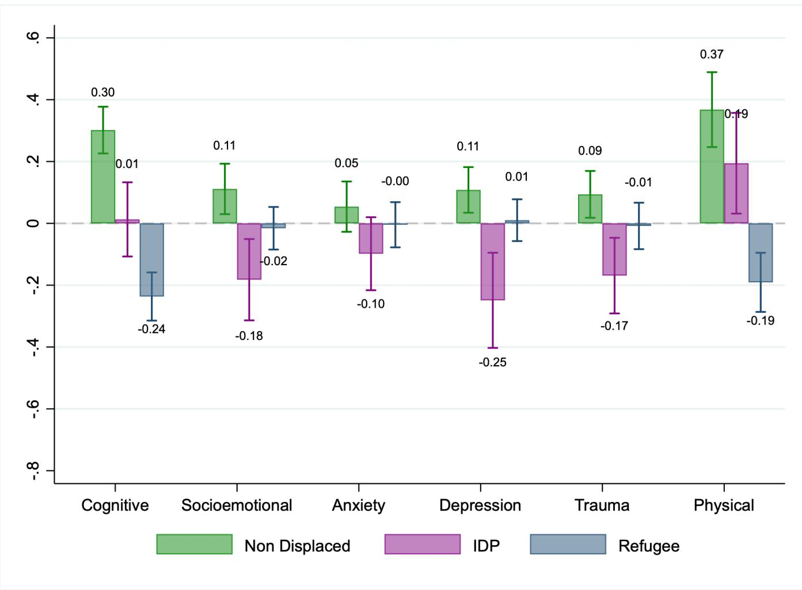  
Notes: The figure presents the average score for each population group (Colombian non-displaced, Colombian IDPs, and Refugees) by dimension of child development. It also includes 95% confidence intervals. To allow for comparability across scales, all outcomes are standardized using the mean and standard deviation from Wave 1. Cognitive development outcomes are measured using the Peabody Vocabulary Percentile Rank (PVPR) Score. Socioemotional development is assessed using the Strengths and Difficulties Questionnaire (SDQ). Anxiety symptoms are measured using the Anxiety subscale of the Trauma Symptom Checklist for Young Children (TSCYC) for children. Depressive symptoms are assessed through the Depression subscale of the TSCYC for children and trauma-related symptoms are captured using the overall TSCYC score. Finally, physical development is measured using the standardized Body Mass Index (BMI).

Table 2 presents the next step of the analysis, where we gradually condition on observed characteristics to assess how the estimated developmental gaps change. For each outcome, we begin by controlling for child age, sex, and parental education, characteristics plausibly predetermined with respect to the child's current developmental outcomes, and then add the post-migration household wealth index to assess the extent to which the lower average wealth of displaced families accounts for the observed differences. Each pair of columns therefore reports results for a single outcome, first with demographic controls and then with the additional wealth control. The bottom row reports the $p$ -value for the test of equality between the IDP and refugee coefficients.

Adding wealth attenuates but does not eliminate the refugee penalties in cognitive and physical development. The cognitive gap declines from 0.52 to 0.34 standard deviations yet remains statistically significant, and the BMI gap barely moves, falling from 0.56 to 0.50 standard deviations. These persistent penalties plausibly reflect disrupted schooling, nutritional stress during transit, and limited access to health and education services; channels tied to material deprivation that the wealth index does not capture. The refugee mental health coefficients, however, become statistically indistinguishable from zero once wealth is included, suggesting that the mental health differences refugees exhibit relative to non-displaced children are largely accounted for by differences in economic circumstances.

The IDP results are reverse. Their mental health penalties prove resilient to the wealth control. The depression coefficient moves from 0.31 to 0.25, trauma from 0.23 to 0.18, and socioemotional from 0.28 to 0.21, all remaining statistically significant. These gaps reflect conflict-related trauma rather than economic deprivation. The IDP cognitive gap, on the other hand, weakens from 0.22 to 0.14 standard deviations and loses conventional significance once wealth is included. Tests of equality between the IDP and refugee coefficients reject on five of six outcomes, confirming that these are statistically distinguishable displacement profiles, not a single displaced category with uniform developmental consequences.

Using grandparental education as an alternative control yields similar patterns. When we replace the wealth index with a proxy for pre-displacement socioeconomic background, the refugee gaps in cognitive and physical development remain large and statistically significant. The cognitive gap declines modestly but persists, while the BMI gap changes little. Refugee differences in mental health outcomes, by contrast, become small and statistically insignificant, as in the wealth-control specification. For IDPs, the results also mirror the wealth specification. Mental health gaps remain sizable and statistically significant, while the cognitive gap attenuates, though less than when controlling for wealth. These results indicate that the main findings are not driven by the use of post-migration wealth as a control. They instead point to differences in the mechanisms associated with each type of displacement: refugee gaps in cognitive and physical outcomes persist beyond socioeconomic background, while IDP mental health gaps are not explained by differences in household background. Appendix ?? reports the corresponding estimates using grandparental education controls.

Table 2. Developmental Gaps across Displacement Types, Wave 1

<table><tr><td rowspan="2"></td><td colspan="2">Peabody</td><td colspan="2">SDQ</td><td colspan="2">Anxiety</td><td colspan="2">Depression</td><td colspan="2">Trauma</td><td colspan="2">BMI</td></tr><tr><td>(1)</td><td>(2)</td><td>(3)</td><td>(4)</td><td>(5)</td><td>(6)</td><td>(7)</td><td>(8)</td><td>(9)</td><td>(10)</td><td>(11)</td><td>(12)</td></tr><tr><td>IDP</td><td>-0.22***(0.074)</td><td>-0.14*(0.077)</td><td>-0.28***(0.084)</td><td>-0.21**(0.085)</td><td>-0.13*(0.077)</td><td>-0.10(0.078)</td><td>-0.32***(0.091)</td><td>-0.25***(0.087)</td><td>-0.24***(0.078)</td><td>-0.18**(0.079)</td><td>-0.17(0.108)</td><td>-0.15(0.110)</td></tr><tr><td>Refugee</td><td>-0.52***(0.056)</td><td>-0.34***(0.068)</td><td>-0.12**(0.057)</td><td>0.03(0.067)</td><td>-0.05(0.059)</td><td>0.02(0.071)</td><td>-0.09*(0.053)</td><td>0.05(0.064)</td><td>-0.10*(0.059)</td><td>0.01(0.069)</td><td>-0.56***(0.083)</td><td>-0.50***(0.100)</td></tr><tr><td>Constant</td><td>-0.44***(0.165)</td><td>-0.36**(0.167)</td><td>0.23(0.153)</td><td>0.31**(0.154)</td><td>-0.33**(0.154)</td><td>-0.30*(0.156)</td><td>-0.29*(0.153)</td><td>-0.21(0.151)</td><td>-0.26(0.160)</td><td>-0.20(0.163)</td><td>0.34(0.213)</td><td>0.36*(0.215)</td></tr><tr><td>Controls</td><td>Yes</td><td>Yes</td><td>Yes</td><td>Yes</td><td>Yes</td><td>Yes</td><td>Yes</td><td>Yes</td><td>Yes</td><td>Yes</td><td>Yes</td><td>Yes</td></tr><tr><td>Wealth index</td><td>No</td><td>Yes</td><td>No</td><td>Yes</td><td>No</td><td>Yes</td><td>No</td><td>Yes</td><td>No</td><td>Yes</td><td>No</td><td>Yes</td></tr><tr><td>Observations</td><td>1449</td><td>1449</td><td>1575</td><td>1574</td><td>1569</td><td>1568</td><td>1569</td><td>1568</td><td>1569</td><td>1568</td><td>1542</td><td>1541</td></tr><tr><td>p-value</td><td>0.000</td><td>0.010</td><td>0.052</td><td>0.003</td><td>0.318</td><td>0.137</td><td>0.011</td><td>0.002</td><td>0.086</td><td>0.020</td><td>0.000</td><td>0.001</td></tr></table>

Notes. Each pair of columns reports OLS estimates from equation (1) for a different developmental outcome. The omitted category is non-displaced children. All specifications include demographic controls (child age, gender, and parental education). Even-numbered columns additionally control for the household post-migration wealth index. Standard errors clustered at the household level are reported in parentheses. The p-value row reports the test of equality between the IDP and refugee coefficients. \*\*\*, \*\*, and \* indicate significance at the 1%, 5%, and 10% levels, respectively.

## V.B Developmental rank-rank gradients by displacement status

The estimates above condition on average household wealth. Yet they cannot tell us whether the displacement penalty is constant across the wealth distribution or whether wealthier displaced families are able to narrow it. To address this, we turn to the rank-rank specification in equation (2), which allows us to trace developmental gaps at every point of the wealth distribution.

Figure 3 plots the mean outcome rank against the post-migration wealth decile for each displacement group. The sample is restricted to common support (wealth index $\leq 5$ ). Appendix E replicates the exercise using ventiles and percentiles; the results are robust across all partitions, though finer divisions yield somewhat less precise estimates given the sample size.

The figure reveals that household wealth facilitates convergence for refugee cognitive outcomes but does little to close the BMI gap for refugees or the mental health gap for IDPs. Panel (a) shows the starkest convergence: refugee children in the lowest wealth decile score roughly 16 percentile ranks below non-displaced peers on cognitive development, but the gap narrows steadily and effectively closes by the eighth decile. Panel (f) delivers the opposite result: refugee children score well below non-displaced peers in BMI across the entire wealth distribution, with no narrowing at higher deciles. For IDPs, the mental health disadvantage is equally resistant. Panels (b) through (e) show that the IDP lines for socioemotional, anxiety, depression, and trauma run below and approximately parallel to the non-displaced and refugee lines, indicating a penalty that does not respond to household wealth.

Table 3 reports the corresponding regression estimates. Two questions organize the discussion. First, do displaced children rank differently from non-displaced peers at the same level of household wealth? If displacement gaps are driven entirely by the lower economic position of displaced families, the displacement indicators $(\beta_{1}^{j})$ should be insignificant once wealth is included. Second, does household wealth help displaced children close the remaining gap, or is the deficit equally large across the wealth distribution? This is captured by the interaction terms $(\beta_{3}^{j})$ .

(a) Cognitive  
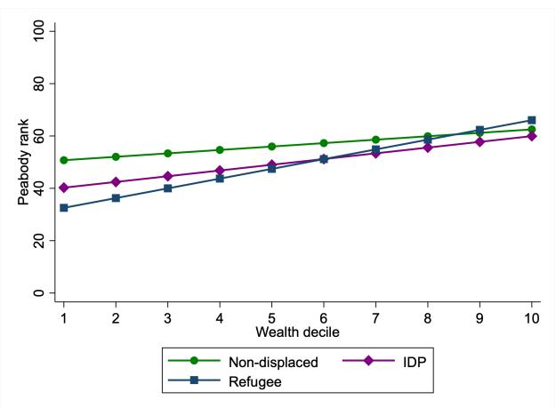

(b) Socioemotional  
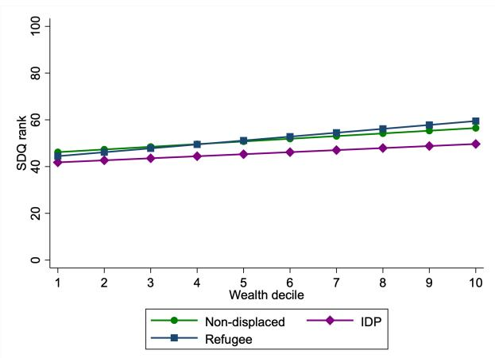

(c) Anxiety  
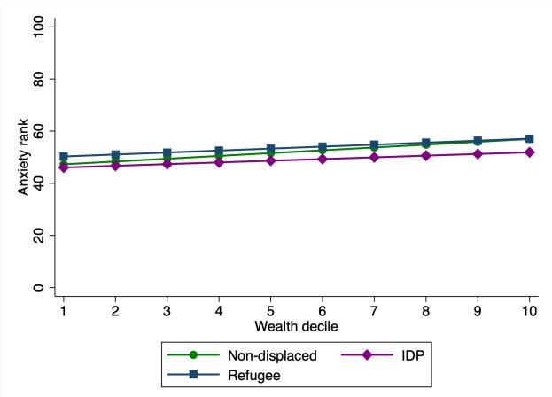

(d) Depression  
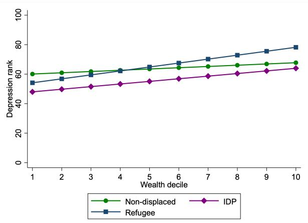

(e) Trauma  
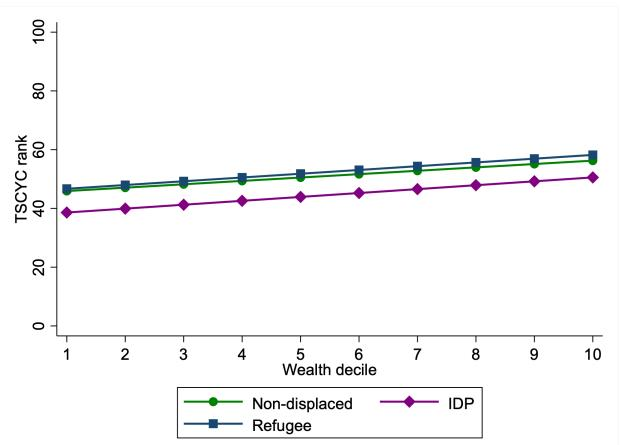

(f) Physical  
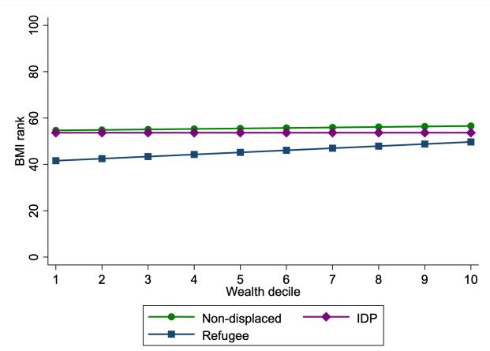  
Notes: Each panel plots the mean outcome rank against the post-migration wealth decile for each displacement group. Lines represent the linear fit from the rank-rank regression treating wealth deciles as a continuous variable. The sample includes children aged 5 to 10. The wealth index is restricted to common support (wealth index $\leq$ 5). Appendix E replicates this exercise using ventiles and percentiles.

On the first question, displacement penalties are present in cognitive and physical development for refugees and in cognitive development and depression for IDPs. Refugee children rank 18.38 percentile points below non-displaced peers in cognitive development and 13.13 points below in physical development. IDP children rank 10.41 points below in cognitive development and 11.77 points below in depression. These gaps remain significant when comparing families at the same level of household wealth, indicating that they are not explained by economic position alone. In the remaining outcomes, the displacement indicators are insignificant, though the IDP coefficients for socioemotional and trauma outcomes are large but imprecise. $^{10}$

On the second question, household wealth facilitates convergence only for refugee cognitive development. The interaction term $\left(\beta_{3}^{\mathrm{Ref}}=0.23\right)$ indicates that wealthier refugee families narrow the cognitive gap with non-displaced peers. A marginally significant interaction for depression $\left(\beta_{3}^{\mathrm{Ref}}=0.17\right)$ points in the same direction but is of limited importance given the absence of a meaningful refugee depression deficit. For all other displacement–outcome combinations, the interaction terms are small and insignificant: the wealth-outcome lines are parallel, meaning the displacement penalty is equally large regardless of where the family sits in the wealth distribution. This is particularly notable for refugee physical development and IDP depression, where the penalties are large but household wealth offers no additional benefit.

As a robustness check, Appendix C.3 replaces the post-migration wealth rank with grandparental education as a proxy for pre-displacement socioeconomic background. The cognitive results are stable: both IDP and refugee children continue to rank below non-displaced peers at comparable levels of grandparental education. The remaining gaps are less precisely estimated than in the wealth-rank specification, especially for refugee physical development and IDP depression. However, the interaction terms are generally small and statistically insignificant, indicating little evidence that differences in pre-displacement household background explain convergence across the distribution. Overall, this exercise supports the main conclusion that cognitive gaps persist beyond socioeconomic background, while the evidence for physical and mental health gaps is stronger in the wealth-rank specification.

Taken together, the results reveal a displacement penalty that differs sharply by its cause. For Venezuelan refugees, displaced by material deprivation and lack of access to food and services, displacement is associated with cognitive and physical development gaps. Household wealth narrows the cognitive gap but leaves the physical one unchanged. For internally displaced children, displaced by armed conflict and violence, displacement is associated with cognitive and depression gaps, and household wealth closes neither. This stands in contrast to Abramitzky et al. (2021b) and Jensen and Manning (2025), who find no migrant gap beyond household vulnerability. The distinction carries direct policy implications: IDP children need tailored mental health support alongside cognitive interventions, while refugee children need nutritional and health services that household economic resources alone cannot provide.

## V.C Service access and legal status

The preceding analysis establishes that displacement penalties persist beyond household wealth. We now ask whether policy-manipulable margins including legal status, social registry inclusion, school enrollment, and health insurance coverage, are associated with narrower gaps among refugee children.

Figure 4 presents average standardized scores by group, dividing Venezuelan refugees along four dimensions of service access. Panel (a) divides refugees by regularization status, panel (b) by Sisbén registration, panel (c) by school enrollment, and panel (d) by health insurance coverage.

Table 3. Wealth Gradients in Developmental Outcomes

<table><tr><td></td><td>(1) Cognitive</td><td>(2) Socioemotional</td><td>(3) Anxiety</td><td>(4) Depression</td><td>(5) Trauma</td><td>(6) Physical</td></tr><tr><td>IDP ( $\beta_{1}^{\text{IDP}}$ )</td><td>-10.41**(5.07)</td><td>-4.19(5.36)</td><td>-2.01(5.83)</td><td>-11.77*(6.61)</td><td>-7.58(5.65)</td><td>-0.42(5.29)</td></tr><tr><td>Refugee ( $\beta_{1}^{\text{Ref}}$ )</td><td>-18.38***(4.14)</td><td>-1.26(4.21)</td><td>3.07(4.79)</td><td>-5.40(5.37)</td><td>1.13(4.82)</td><td>-13.13***(4.16)</td></tr><tr><td>Wealth Index ( $\beta_{2}$ )</td><td>0.14***(0.05)</td><td>0.13**(0.05)</td><td>0.11*(0.06)</td><td>0.11(0.06)</td><td>0.12**(0.06)</td><td>0.02(0.05)</td></tr><tr><td>IDP × Wealth Index ( $\beta_{3}^{\text{IDP}}$ )</td><td>0.08(0.08)</td><td>-0.03(0.09)</td><td>-0.03(0.09)</td><td>0.09(0.11)</td><td>0.02(0.09)</td><td>-0.03(0.08)</td></tr><tr><td>Ref × Wealth Index ( $\beta_{3}^{\text{Ref}}$ )</td><td>0.23***(0.07)</td><td>0.04(0.07)</td><td>-0.03(0.08)</td><td>0.17*(0.09)</td><td>0.00(0.08)</td><td>0.07(0.07)</td></tr><tr><td>Constant ( $\beta_{0}$ )</td><td>49.65***(3.70)</td><td>45.08***(3.75)</td><td>47.05***(4.29)</td><td>58.49***(4.73)</td><td>45.24***(4.29)</td><td>54.44***(3.72)</td></tr><tr><td>Observations</td><td>1453</td><td>1578</td><td>1572</td><td>1572</td><td>1572</td><td>1545</td></tr></table>

Notes: OLS estimates of equation (2). The dependent variable is the percentile rank in the indicated developmental outcome. The wealth index is the post-migration measure restricted to common support (wealth index $\leq 5$ ). All specifications include controls for child age and gender. The reference group is non-displaced Colombian children. Standard errors clustered at the household level are reported in parentheses. \*\*\*, \*\*, and \* indicate significance at the 1%, 5%, and 10% levels, respectively.

Regularization status is strongly associated with the size of the cognitive and physical gaps. Irregular refugee children score 1.05 standard deviations below non-displaced children on cognitive development and 0.77 standard deviations below on BMI. Regularized refugees fare considerably better, with cognitive scores only 0.39 standard deviations below the non-displaced mean and a BMI gap of 0.50 standard deviations. Even regularized refugees, however, retain significant deficits, suggesting that institutional access narrows but does not eliminate the developmental costs of displacement. Both refugee subgroups show small and statistically insignificant differences on anxiety, depression, and trauma regardless of regularization status.

Panels (b) through (d) reinforce the main results. The gap for education access is almost as large as the one of regularization status: non-enrolled refugee children score 1.04 standard deviations below non-displaced peers on cognitive development, consistent with school enrollment being a primary channel for cognitive catch-up. Appendix E reports the corresponding regression estimates from equation (3), largely confirming these descriptive findings. $^{11}$

Importantly, regularization status is not randomly assigned. Refugees who obtained legal status may differ from those who did not on unobserved dimensions including time since arrival, social networks, and proactiveness in seeking services. Hence, the estimates from equation (3) capture conditional associations rather than the causal effect of regularization. Taken together, the evidence suggests that policies expanding institutional access including whether through regularization, social registry inclusion, or school enrollment, may yield the largest developmental returns on the cognitive and physical dimensions where service access gaps are most pronounced.

Figure 4. Developmental Gaps by Service Access, Wave 1  
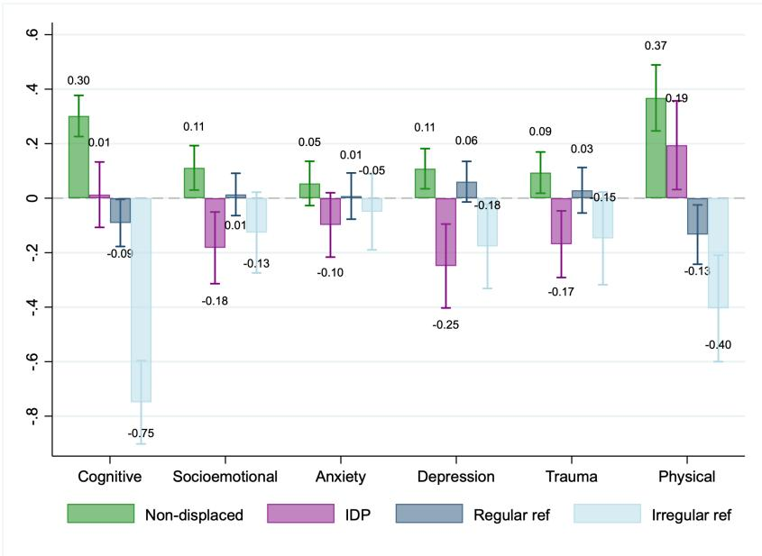  
Notes: Each bar represents the average standardized score for a given population group. Venezuelan refugees are divided by regularization status. Scores are standardized using the pooled mean and standard deviation from Wave 1 of the sample. Error bars denote 95 percent confidence intervals. The sample includes children aged 5 to 10. Appendix D.1 reports the corresponding regression estimates from equation (3).

## V.D Dynamic effects

The persistence analysis should be interpreted with caution because attrition between waves is substantial and differential. About one quarter of baseline children were not reinterviewed in wave two. Attrition rates were 32 percent among Venezuelan households, 25 percent among IDPs, and 17 percent among non-displaced Colombians. Appendix B.8 shows that attrition is correlated with baseline vulnerability, so the wave-two sample no longer preserves the baseline representative design. The estimates in this section are therefore suggestive.

We estimate the pooled OLS and wave-interaction specifications described in Section IV.E under three approaches to missing data: the observed unbalanced panel, simple mean imputation for wave-two attriters, and Lee (2005) bounds. Across the observed and mean-imputation specifications, the wave-interaction coefficients are small and statistically indistinguishable from zero for five of the six outcomes: cognitive development, physical health, socioemotional difficulties, anxiety, and trauma. The exception is IDP depression, where the interaction is positive in both the observed panel and the mean-imputation specification, indicating some narrowing of the depression gap between waves. The Lee bounds are wide for all outcomes and include both convergence and divergence, so they do not provide informative evidence on the direction of change. Full results are reported in Appendix F.

Overall, we find little evidence that developmental gaps close over a one-year horizon. This pattern is consistent with the baseline results. Refugee gaps in cognitive and physical development persist over time, suggesting that interrupted schooling, nutritional stress, and limited access to services do not resolve quickly after settlement. IDP mental health gaps also remain largely stable, consistent with the interpretation that conflict-related trauma is not explained by contemporaneous household resources alone.

## VI CONCLUSION

This paper studies how forced displacement shapes child development beyond what poverty alone would predict. Using original longitudinal data on Venezuelan refugee, Colombian internally displaced, and non-displaced children in Medellín, we find that displacement is associated with significant developmental penalties that persist after accounting for household wealth. These penalties are not uniform. Refugee children, who faced acute material deprivation but not armed conflict, bear the largest cognitive and physical health costs. Internally displaced children, displaced by armed conflict, exhibit elevated mental health burdens consistent with conflict-related trauma. Legal access to the social protection system through regularization is associated with a large reduction in the refugee gaps but does not fully eliminated them. These penalties show no evidence of convergence over our one-year panel.

From a social protection perspective, these findings suggest that displaced children require support that extends well beyond what standard anti-poverty programs can offer. Income transfers and poverty-targeting instruments, while essential, do not address the specific developmental needs that displacement creates. Refugee children need not only legal status but actual enrollment in health insurance, education, and nutritional support. For internally displaced families, the persistence of mental health difficulties despite full legal access and over a decade of settlement suggests that standard social protection frameworks were not designed to address the psychological legacy of armed conflict. Effective policy responses will require integrating targeted mental health services into existing programs for displaced households. More broadly, our results suggest that governments cannot treat displaced populations as a single category. Deprivation-driven and conflict-driven displacement produce distinct developmental profiles, and social protection systems that fail to distinguish between them risk addressing the wrong needs.

Our study has several limitations that future research should aim to solve. Our estimates document conditional associations rather than causal effects of displacement, as displacement is not randomly assigned. Families that were displaced may differ systematically from those that were not on dimensions that our controls cannot capture, including pre-displacement mental health, social capital, and exposure to community violence. The relationship between regularization and narrower gaps is similarly suggestive, as refugees who obtained legal status may differ on unobserved dimensions from those who did not, including time since arrival, social networks, and proactiveness in seeking services. Our panel covers only one year, which is too short to determine whether the gaps we document will diminish with sustained integration. Longer panels that can track developmental trajectories as displaced children age, complementary evidence from other host countries, and research designs that can more cleanly identify the causal mechanisms linking displacement to child development represent important directions for future work.

## Online Appendix Consequences of Growing Up Displaced: Evidence from Displaced Youth in Colombia

A Additional Context on Displacement Crises 39
A.1 Venezuelan migration to Colombia . . . . . . . . . . . . . . . . . . . . . . . . . . . . . . . . . . . . . . . . . . . . . . . . . . . . . . . . . .
A.2 Internal displacement in Colombia . . . . . . . . . . . . . . . . . . . . . . . . . . . . . . . . . . . . . . . . . . . B VenRePs-Kids Survey Details 42
B.1 Timeline ..... 42
B.2 Location and sampling ..... 42
B.3 Eligibility criteria ..... 43
B.4 Sampling frame and design ..... 43
B.5 Survey modules ..... 44
B.6 Descriptive statistics: Venezuelan refugees by regularization status ..... 45
B.7 Psychometric properties of instruments ..... 46
B.8 Attrition analysis ..... 50
C Developmental Gaps — Full Regression Tables 52
C.1 BMI Thresholds - risk of malnutrition and overweight ..... 52
C.2 Developmental Gaps— Regression Tables ..... 59
C.3 Rank-Rank Regressions ..... 61
D Developmental Gaps by Regularization Status and Service Access 63
D.1 Developmental gaps by regularization status ..... 63
D.2 Developmental gaps by access to SISBEN ..... 68
D.3 Developmental gaps by school enrollment ..... 75
D.4 Developmental gaps by health insurance access ..... 82

D.5 Rank-rank regressions by regularization status 89  
E Rank-Rank Relationships: Alternative Binning of the Wealth Distribution 91  
F Dynamic Analysis 93

## A Additional Context on Displacement Crises

## A.1 Venezuelan migration to Colombia

Over the past decade, more than 7.7 million Venezuelans have been forced to flee their country due to service collapse and severe material deprivation (Cabra-Ruiz, Rozo and Sviatschi, 2024). The majority sought refuge in Latin American countries, with Colombia becoming the primary destination, hosting approximately 2.8 million Venezuelan refugees by 2023 (Migración Colombia, 2023).

The geographic distribution of Venezuelan refugees in Colombia, as illustrated by the 2018 population census in Panel (a) of Figure A.1, shows that refugees settled primarily in border areas and major cities, including Bogotá, Medellín, Cúcuta, and Barranquilla. Panel (b) displays the annual influx of Venezuelan refugees to Colombia over the last decade, showing a marked increase in arrivals from 2016, with a peak around 2019.

Figure A.1. Characterizing Venezuelan Migration to Colombia  
(a) Migrant Distribution, 2018 Census  
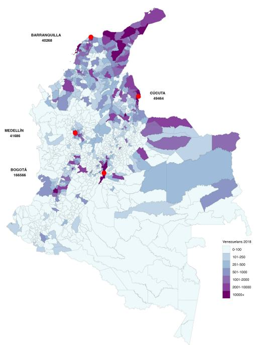

(b) Inflows to Colombia  
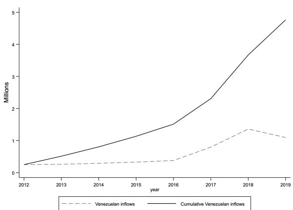

Notes. Panel (a) illustrates the number of Venezuelans per municipality reported in the 2018 Colombian census, an approximation of the overall distribution of refugees in the country in that year. The red circles indicate the four primary destinations for refugees. Panel (b) illustrates the yearly Venezuelan inflows to Colombia and the corresponding cumulative inflows for each year. The figures from Panel (b) come from the Colombian Migration Agency.

## Colombia's policy response to Venezuelan immigration

The Colombian government has implemented one of the most ambitious regularization efforts in the region, offering Venezuelan refugees broad access to labor markets and social services. Initially limited to better-educated refugees, regularization expanded significantly with programs launched in 2018 and 2021, culminating in the Permiso por Protección Temporal (PPT) that granted legal status to over 1.8 million refugees by 2023. Research shows these initiatives have improved refugees' labor market outcomes, income, and consumption (Ibáñez et al., 2024).

In terms of service access, refugee children in Colombia are entitled to basic education and emergency healthcare regardless of legal status. However, full access to graduation credentials, subsidized health insurance, and eligibility for social programs through Sisbén is restricted to regularized refugees. Table A.1 summarizes the legal rights and services available to Venezuelan children in Colombia by regularization status.

Table A.1. Legal Rights and Services for Venezuelan Children in Colombia

<table><tr><td></td><td>Regular</td><td>Irregular</td></tr><tr><td colspan="3">Education</td></tr><tr><td>Food and school bus service</td><td>√</td><td>√</td></tr><tr><td>Primary and secondary</td><td>√</td><td> $\checkmark^a$ </td></tr><tr><td>Promotion across levels</td><td>√</td><td>√</td></tr><tr><td>Bachelor&#x27;s degree upon completion</td><td>√</td><td>No</td></tr><tr><td>Technical or technological education</td><td>√</td><td>No</td></tr><tr><td colspan="3">Health</td></tr><tr><td>Emergency care</td><td>√</td><td>√</td></tr><tr><td>Public health programs</td><td>√</td><td>√</td></tr><tr><td>Vaccines</td><td>√</td><td>√</td></tr><tr><td>Prevention campaigns</td><td>√</td><td>√</td></tr><tr><td>Affiliation subsidized regime</td><td>√</td><td>No</td></tr><tr><td colspan="3">SISBEN</td></tr><tr><td>Registry</td><td>√</td><td>No</td></tr></table>

Notes: (a) Children without a valid ID must register at the local secretary of education prior to enrollment.

## A.2 Internal displacement in Colombia

Colombia hosts the largest population of internally displaced persons (IDPs) in the world. By 2025, the country had registered more than 8.8 million internally displaced individuals, equivalent to 18 percent of the national population according to the 2018 census (UN-HCR, 2025). Figure A.2 displays the evolution of internal displacement events over time, showing the sharp intensification over the last three decades and a peak in 2003.

Figure A.2. Internal Displacement Events in Colombia over Time  
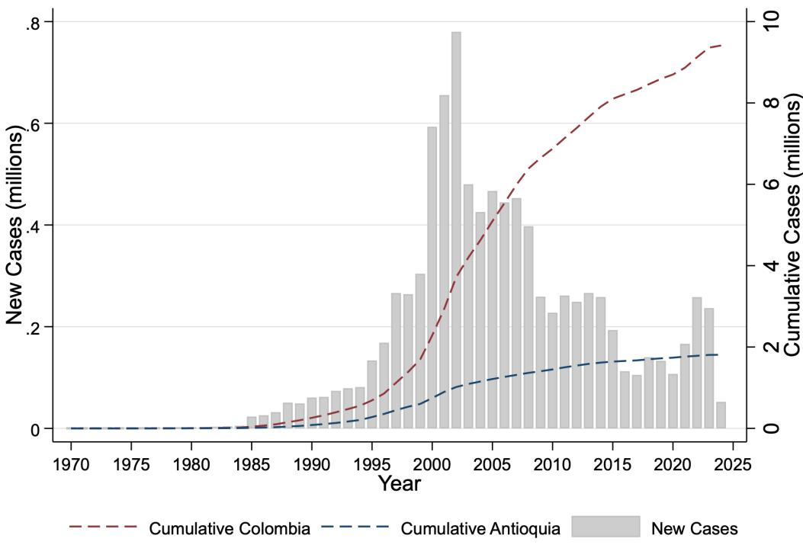  
Source: RUV - Unidad para las Víctimas  
Notes. The figure displays the number of internally displaced persons registered in Colombia's Victims Registry (RUV), an official administrative registry that records individuals affected by the armed conflict and eligible for government assistance, by year of displacement event.

Table A.2 reports the five Colombian departments with the highest number of displacement events. Antioquia, the department where Medellín is located, accounts for the largest share of both displacement events (18.4 percent) and current IDP residence (11.5 percent), underscoring the relevance of our study setting.

Table A.2. Top Five Departments by Internal Displacement

<table><tr><td>Department</td><td>Occurrence</td><td>%</td><td>Residence</td><td>%</td></tr><tr><td>Antioquia</td><td>1,824,913</td><td>18.35%</td><td>1,140,320</td><td>11.47%</td></tr><tr><td>Bolívar</td><td>703,081</td><td>7.07%</td><td>339,588</td><td>3.41%</td></tr><tr><td>Nariño</td><td>589,838</td><td>5.93%</td><td>299,300</td><td>3.01%</td></tr><tr><td>Valle del Cauca</td><td>549,193</td><td>5.52%</td><td>382,717</td><td>3.85%</td></tr><tr><td>Cauca</td><td>513,223</td><td>5.16%</td><td>217,371</td><td>2.18%</td></tr><tr><td>Total Country</td><td></td><td>9,943,287</td><td></td><td></td></tr></table>

Notes. The table reports the number of persons registered in the Victims Registry (RUV) by department. "Occurrence" refers to the department where the displacement event took place. "Residence" refers to the department where the displaced person currently resides. Departments are ordered by the number of displacement events from highest to lowest.

## B VenRePs-Kids Survey Details

## B.1 Timeline

Figure B.1 illustrates the timeline of data collection for the VenRePs-Kids study. The baseline survey was conducted between October and December 2022, a short follow-up to update contact information was implemented six months later, and the full second wave was administered between October and December 2023.

Figure B.1. Timeline of the VenRePs-Kids Study  
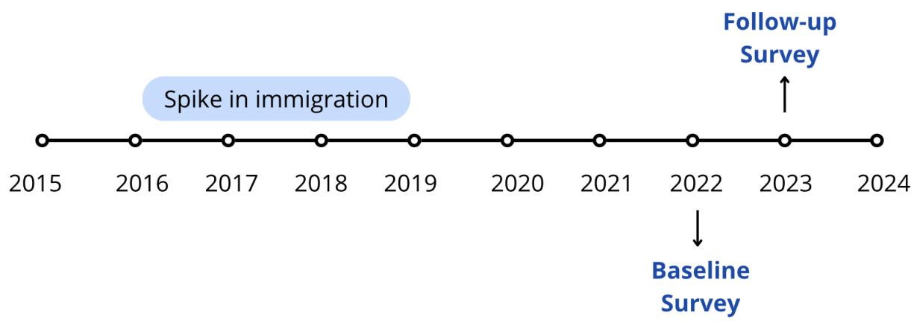  
Notes. The figure displays the timeline of data collection for the VenRePs-Kids study, including the baseline survey (Wave 1, October–December 2022), the interim contact update (April–May 2023), and the follow-up survey (Wave 2, October–December 2023).

## B.2 Location and sampling

The study was conducted in Medellín, Colombia's second-largest city and home to the third-largest Venezuelan refugee population after Bogotá and Cúcuta. Medellín was selected given its large refugee population and notably high survey response rates among refugees, as documented in a nationally representative 2018 survey (Ibáñez et al., 2022). Focusing on a single city also mitigates the challenges of tracking highly mobile populations in longitudinal research. Figure B.1 shows the geographic distribution of the sampled households.

Figure B.2. Timeline of the VenRePs-Kids Study

(a) By Nationality

(b) By Displacement Status  
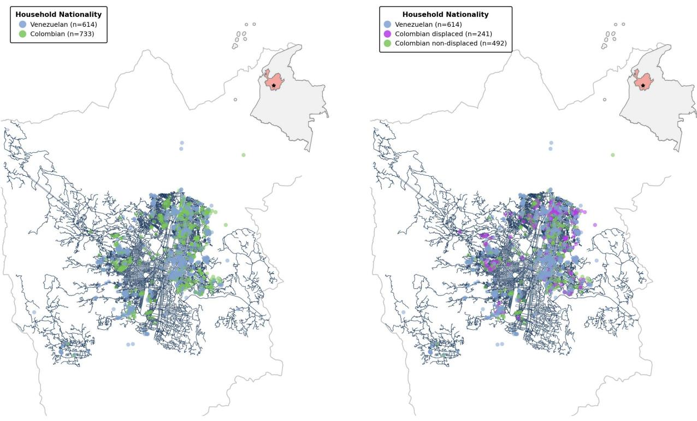  
Notes. The figure depicts the geographic location of all households in the VenRePs-Kids study. Green and blue dots indicate the location of Colombian and Venezuelan households, respectively. The map in the upper right corner illustrates the location of Medellín (blue pin) within the department of Antioquia (highlighted in red).

## B.3 Eligibility criteria

The study targeted children aged 5 to 10 residing in Medellín. Colombian participants were eligible if both the child and parents were Colombian nationals. Venezuelan participants were eligible if both the child and parents were Venezuelan nationals who arrived between 2016 and 2020 and had not naturalized. Children from binational households or recently naturalized households were excluded to focus on the integration experiences of fully displaced populations. Within each household, up to two children were randomly selected when multiple eligible children were present.

## B.4 Sampling frame and design

Colombian households were sampled using the 2018 National Population Census. Residential blocks were stratified by socioeconomic strata (levels 1 through 4), and a representative sample of blocks was randomly selected. Within selected blocks, households with children aged 5 to 10 were identified and randomly sampled to achieve representativeness across gender, age, and socioeconomic strata.

The sampling frame for Venezuelan households was constructed through an extensive listing exercise. We combined multiple sources, including the 2018 Population Census, databases from NGOs and humanitarian agencies (such as iMMAP), and satellite imagery of informal settlements, to identify locations with high concentrations of Venezuelan refugees. Field teams conducted on-site verification of settlements and implemented a structured snowball sampling strategy to reach mobile and informal communities not captured in official registries. This approach led to the construction of a comprehensive list of approximately 7,000 Venezuelan families with children in Medellín. From this listing, households were randomly selected to ensure comparability by age, gender, and socioeconomic background.

To maximize comparability, the study excluded binational households (with one Colombian and one Venezuelan parent) and focused only on households where all members shared the same nationality. Internal displacement status for Colombian households was verified by merging survey data with the Colombian official conflict victims registry (RUV), using household identifiers to match records.

The final sample included 1,370 households, from which we collected information on 1,579 children (47 percent Venezuelan).

## B.5 Survey modules

The primary caregiver was defined as the person spending the most time with the child and making key decisions about their well-being. If the primary caregiver was unavailable, another adult familiar with the child's daily life, typically the household head or partner, completed the relevant modules. The questionnaire consisted of seven modules covering dimensions critical to child development. Table B.1 summarizes the content, respondent, and age group for each module.

Table B.1. VenRePs-Kids Questionnaire Summary

<table><tr><td>Module</td><td>Respondent</td><td>Content Surveyed</td></tr><tr><td>Dwelling characteristics and asset ownership</td><td>Caregiver</td><td>Housing conditions, asset possession, access to public utilities and services.</td></tr><tr><td>Sociodemographics</td><td>Caregiver</td><td>Sociodemographic information about children and parents; migratory status of Venezuelan family members.</td></tr><tr><td>Education and discrimination</td><td>Caregiver</td><td>School enrollment, absenteeism, reasons for school dropout, experiences of discrimination, participation in extracurricular activities.</td></tr><tr><td>Health and nutrition</td><td>Caregiver</td><td>Recent illnesses, hospital admissions, dietary habits, health insurance access, preventative care, anthropometric measurements (height and weight).</td></tr><tr><td>Time use and child labor</td><td>Caregiver and child child</td><td>Daily routines, leisure time activities, involvement in child labor, peer interactions.</td></tr><tr><td>Socioemotional and mental health</td><td>Caregiver and child child</td><td>Socio-emotional well-being and mental health, including trauma (TSCYC), behavioral problems (SDQ), anxiety, depression, and cognitive development (PPVT).</td></tr></table>

B.6 Descriptive statistics: Venezuelan refugees by regularization status  
Table B.2 compares descriptive characteristics of Venezuelan refugee households by regularization status.

Table B.2. Descriptive Statistics: Venezuelan Refugees, Regularized vs Non-Regularized

<table><tr><td></td><td>(1) Non-Displaced</td><td>(2) IDP</td><td>(3) Refugee Regularized</td><td>(4) Refugee Not Regularized</td></tr><tr><td colspan="5">A. Children</td></tr><tr><td>Male</td><td>0.52(0.500)</td><td>0.53(0.500)</td><td>0.53(0.499)</td><td>0.52(0.501)</td></tr><tr><td>Age</td><td>7.55(1.621)</td><td>7.49(1.657)</td><td>7.40(1.672)</td><td>7.25(1.698)</td></tr><tr><td>Education</td><td>2.07(1.591)</td><td>2.00(1.598)</td><td>1.69(1.494)</td><td>1.52(1.504)</td></tr><tr><td>Enrollment</td><td>0.96(0.190)</td><td>0.96(0.196)</td><td>0.82(0.382)</td><td>0.46(0.500)</td></tr><tr><td>Observations</td><td>558</td><td>276</td><td>588</td><td>157</td></tr><tr><td colspan="5">B. Households</td></tr><tr><td>Education (HH)</td><td>10.16(3.237)</td><td>9.23(3.510)</td><td>10.14(2.995)</td><td>9.25(3.185)</td></tr><tr><td>Months since displacement</td><td></td><td>203.92(124.165)</td><td>48.90(14.820)</td><td>44.12(14.775)</td></tr><tr><td>Sisben</td><td>0.81(0.394)</td><td>0.84(0.363)</td><td>0.46(0.499)</td><td>0.06(0.230)</td></tr><tr><td>Observations</td><td>501</td><td>246</td><td>497</td><td>126</td></tr></table>

Notes. This table presents descriptive statistics for children (Panel A) and households (Panel B) across four groups: non-displaced Colombian children (column 1), internally displaced Colombians or IDPs (column 2), regularized Venezuelan refugees (column 3), and non-regularized Venezuelan refugees (column 4). The sample includes children aged 5 to 10 years from the VenRePs-Kids baseline survey (2022). Child-level variables include gender (Male), age in years, years of education completed, and current school enrollment status. Household-level variables include the average years of education of household members (Education HH), months elapsed since the displacement event (Months since displacement), and whether the household is registered in the Sisben social registry. Standard deviations are reported in parentheses. Non-displaced households do not report months since displacement as they have not experienced forced migration. The stark enrollment gap between regularized (82%) and non-regularized (46%) Venezuelan refugees highlights the critical role of legal status in accessing education. Similarly, Sisben registration rates show significant variation, ranging from 81-84% among Colombian groups to only 6% among non-regularized refugees, reflecting barriers to social protection access faced by undocumented migrants.

## B.7 Psychometric properties of instruments

This section reports the psychometric properties of each instrument used in the study, including internal consistency (Cronbach's alpha) and confirmatory factor analysis (CFA) fit indices, separately by displacement group and survey wave.

## Trauma Symptom Checklist for Young Children (TSCYC)

The TSCYC is a 90-item caregiver-report questionnaire measuring posttraumatic symptoms in children aged 5 to 10. Tables B.3–B.6 report psychometric properties for the full sample and by displacement group.

Table B.3. TSCYC Psychometrics: All

<table><tr><td rowspan="2"></td><td colspan="8">Wave 1</td></tr><tr><td>N</td><td>Mean</td><td>SD</td><td>Alpha</td><td>CFA</td><td>CFA Col</td><td>CFA IDP</td><td>CFA Ven</td></tr><tr><td>Total Scale</td><td>1573</td><td>14.69</td><td>2.301</td><td>0.91</td><td>0.06</td><td>0.08</td><td>0.08</td><td>0.07</td></tr><tr><td>Anxiety</td><td>1573</td><td>13.69</td><td>3.686</td><td>0.72</td><td>0.11</td><td>0.10</td><td>0.06</td><td>0.14</td></tr><tr><td>Depression</td><td>1573</td><td>10.59</td><td>2.131</td><td>0.69</td><td>0.05</td><td>0.06</td><td>0.06</td><td>0.06</td></tr><tr><td>Anger</td><td>1573</td><td>11.32</td><td>2.588</td><td>0.72</td><td>0.08</td><td>0.11</td><td>0.10</td><td>0.10</td></tr><tr><td>Dissociation</td><td>1573</td><td>10.47</td><td>2.361</td><td>0.75</td><td>0.09</td><td>0.11</td><td>0.11</td><td>0.09</td></tr><tr><td>Intrusion</td><td>1573</td><td>10.20</td><td>1.940</td><td>0.68</td><td>0.06</td><td>0.10</td><td>0.07</td><td>0.06</td></tr><tr><td>Avoidance</td><td>1573</td><td>9.92</td><td>1.934</td><td>0.71</td><td>0.07</td><td>0.08</td><td>0.11</td><td>0.07</td></tr><tr><td>Arousal</td><td>1573</td><td>12.42</td><td>3.092</td><td>0.68</td><td>0.10</td><td>0.11</td><td>0.09</td><td>0.10</td></tr><tr><td>PTS Total</td><td>1573</td><td>32.54</td><td>5.766</td><td>0.83</td><td>0.07</td><td>0.09</td><td>0.09</td><td>0.08</td></tr><tr><td>Observations</td><td>1579</td><td>.</td><td>.</td><td>.</td><td>.</td><td>.</td><td>.</td><td>.</td></tr></table>

Notes. This table reports psychometric properties for the Trauma Symptom Checklist for Young Children (TSCYC) across all children aged 5 to 10 in the VenRePs-Kids sample at Wave 1 (baseline, 2022), pooling non-displaced, internally displaced (IDP), and Venezuelan refugee children. The TSCYC is a 90-item caregiver-report instrument designed to assess posttraumatic stress and related symptoms in young children. For each subscale, the table reports sample size (N), mean score, standard deviation (SD), and internal consistency (Cronbach's alpha). The CFA column reports the Root Mean Square Error of Approximation (RMSEA) from confirmatory factor analysis for the full sample, while CFA Col, CFA IDP, and CFA Ven report RMSEA values separately for non-displaced Colombian, IDP, and Venezuelan refugee children, respectively. The TSCYC includes clinical subscales (Anxiety, Depression, Anger, Dissociation, Intrusion, Avoidance, Arousal), a Posttraumatic Stress Total score (PTS Total) combining Intrusion, Avoidance, and Arousal, and an overall Total Scale score.

Table B.4. TSCYC Psychometrics: Non-displaced

<table><tr><td rowspan="2"></td><td colspan="5">Wave 1</td></tr><tr><td>N</td><td>Mean</td><td>SD</td><td>Alpha</td><td>CFA Col</td></tr><tr><td>Total Scale</td><td>558</td><td>14.46</td><td>2.117</td><td>0.90</td><td>0.08</td></tr><tr><td>Anxiety</td><td>558</td><td>13.46</td><td>3.584</td><td>0.71</td><td>0.10</td></tr><tr><td>Depression</td><td>558</td><td>10.35</td><td>1.842</td><td>0.66</td><td>0.06</td></tr><tr><td>Anger</td><td>558</td><td>11.21</td><td>2.725</td><td>0.76</td><td>0.11</td></tr><tr><td>Dissociation</td><td>558</td><td>10.17</td><td>1.911</td><td>0.68</td><td>0.11</td></tr><tr><td>Intrusion</td><td>558</td><td>10.11</td><td>1.899</td><td>0.70</td><td>0.10</td></tr><tr><td>Avoidance</td><td>558</td><td>9.80</td><td>1.688</td><td>0.68</td><td>0.08</td></tr><tr><td>Arousal</td><td>558</td><td>12.25</td><td>2.988</td><td>0.65</td><td>0.11</td></tr><tr><td>PTS Total</td><td>558</td><td>32.16</td><td>5.373</td><td>0.81</td><td>0.09</td></tr><tr><td>Observations</td><td>558</td><td>.</td><td>.</td><td>.</td><td>.</td></tr></table>

Notes. This table reports psychometric properties for the Trauma Symptom Checklist for Young Children (TSCYC) among non-displaced Colombian children aged 5 to 10 at Wave 1 (baseline, 2022). The TSCYC is a 90-item caregiver-report instrument designed to assess posttraumatic stress and related symptoms in young children. For each subscale, the table reports sample size (N), mean score, standard deviation (SD), and internal consistency (Cronbach's alpha). The CFA Col column reports the Root Mean Square Error of Approximation (RMSEA) from confirmatory factor analysis for non-displaced children. The number of questions comprising each subscale is indicated in parentheses. The TSCYC includes clinical subscales (Anxiety, Depression, Anger, Dissociation, Intrusion, Avoidance, Arousal), a Posttraumatic Stress Total score (PTS Total, 27 questions) combining Intrusion, Avoidance, and Arousal, and an overall Total Scale score (63 questions). The psychometric performance of the TSCYC in this non-displaced group serves as a reference point for evaluating measurement invariance across displacement contexts.

Table B.5. TSCYC Psychometrics: IDP

<table><tr><td rowspan="2"></td><td colspan="5">Wave 1</td></tr><tr><td>N</td><td>Mean</td><td>SD</td><td>Alpha</td><td>CFA IDP&#x27;s</td></tr><tr><td>Total Scale</td><td>273</td><td>15.07</td><td>2.359</td><td>0.91</td><td>0.08</td></tr><tr><td>Anxiety</td><td>273</td><td>14.05</td><td>3.645</td><td>0.71</td><td>0.06</td></tr><tr><td>Depression</td><td>273</td><td>11.12</td><td>2.763</td><td>0.77</td><td>0.06</td></tr><tr><td>Anger</td><td>273</td><td>11.75</td><td>2.827</td><td>0.75</td><td>0.10</td></tr><tr><td>Dissociation</td><td>273</td><td>10.77</td><td>2.454</td><td>0.75</td><td>0.11</td></tr><tr><td>Intrusion</td><td>273</td><td>10.41</td><td>2.011</td><td>0.67</td><td>0.07</td></tr><tr><td>Avoidance</td><td>273</td><td>10.11</td><td>1.948</td><td>0.62</td><td>0.11</td></tr><tr><td>Arousal</td><td>273</td><td>12.68</td><td>2.999</td><td>0.66</td><td>0.09</td></tr><tr><td>PTS Total</td><td>273</td><td>33.21</td><td>5.640</td><td>0.81</td><td>0.09</td></tr><tr><td>Observations</td><td>276</td><td>.</td><td>.</td><td>.</td><td>.</td></tr></table>

Notes. This table reports psychometric properties for the Trauma Symptom Checklist for Young Children (TSCYC) among internally displaced Colombian children (IDPs) aged 5 to 10 at Wave 1 (baseline, 2022). The TSCYC is a 90-item caregiver-report instrument designed to assess posttraumatic stress and related symptoms in young children. For each subscale, the table reports sample size (N), mean score, standard deviation (SD), and internal consistency (Cronbach's alpha). The CFA IDP's column reports the Root Mean Square Error of Approximation (RMSEA) from confirmatory factor analysis for internally displaced children. The number of questions comprising each subscale is indicated in parentheses. The TSCYC includes clinical subscales (Anxiety, Depression, Anger, Dissociation, Intrusion, Avoidance, Arousal), a Posttraumatic Stress Total score (PTS Total, 27 questions) combining Intrusion, Avoidance, and Arousal, and an overall Total Scale score (63 questions). Evaluating the TSCYC's psychometric properties separately for IDP children allows us to assess whether the instrument functions equivalently across different displacement experiences, particularly for children exposed to armed conflict-related displacement.

Table B.6. TSCYC Psychometrics: Refugee

<table><tr><td rowspan="2"></td><td colspan="5">Wave 1</td></tr><tr><td>N</td><td>Mean</td><td>SD</td><td>Alpha</td><td>CFA Ven</td></tr><tr><td>Total Scale</td><td>742</td><td>14.71</td><td>2.393</td><td>0.92</td><td>0.07</td></tr><tr><td>Anxiety</td><td>742</td><td>13.73</td><td>3.769</td><td>0.72</td><td>0.14</td></tr><tr><td>Depression</td><td>742</td><td>10.58</td><td>2.032</td><td>0.65</td><td>0.06</td></tr><tr><td>Anger</td><td>742</td><td>11.24</td><td>2.368</td><td>0.66</td><td>0.10</td></tr><tr><td>Dissociation</td><td>742</td><td>10.59</td><td>2.600</td><td>0.78</td><td>0.09</td></tr><tr><td>Intrusion</td><td>742</td><td>10.20</td><td>1.942</td><td>0.66</td><td>0.06</td></tr><tr><td>Avoidance</td><td>742</td><td>9.95</td><td>2.093</td><td>0.75</td><td>0.07</td></tr><tr><td>Arousal</td><td>742</td><td>12.44</td><td>3.196</td><td>0.70</td><td>0.10</td></tr><tr><td>PTS Total</td><td>742</td><td>32.59</td><td>6.073</td><td>0.84</td><td>0.08</td></tr><tr><td>Observations</td><td>745</td><td>.</td><td>.</td><td>.</td><td>.</td></tr></table>

Notes. This table reports psychometric properties for the Trauma Symptom Checklist for Young Children (TSCYC) among Venezuelan refugee children aged 5 to 10 at Wave 1 (baseline, 2022). The TSCYC is a 90-item caregiver-report instrument designed to assess posttraumatic stress and related symptoms in young children. For each subscale, the table reports sample size (N), mean score, standard deviation (SD), and internal consistency (Cronbach's alpha). The CFA Ven column reports the Root Mean Square Error of Approximation (RMSEA) from confirmatory factor analysis for Venezuelan refugee children. The number of questions comprising each subscale is indicated in parentheses. The TSCYC includes clinical subscales (Anxiety, Depression, Anger, Dissociation, Intrusion, Avoidance, Arousal), a Posttraumatic Stress Total score (PTS Total, 27 questions) combining Intrusion, Avoidance, and Arousal, and an overall Total Scale score (63 questions). Separate evaluation of psychometric properties for Venezuelan refugee children is particularly important given potential cross-cultural differences in symptom expression and the unique stressors associated with international forced migration, including language barriers, documentation status, and xenophobia.

## Strengths and Difficulties Questionnaire (SDQ)

The SDQ is a 25-item behavioral screening tool completed by caregivers for children. Tables B.7–B.10 report psychometric properties for children, separately by displacement group.

Table B.7. SDQ Psychometrics: All

<table><tr><td rowspan="2"></td><td colspan="8">Wave 1</td></tr><tr><td>N</td><td>Mean</td><td>SD</td><td>Alpha</td><td>CFA</td><td>CFA Col</td><td>CFA IDP</td><td>CFA Ven</td></tr><tr><td>Total Scale</td><td>1579</td><td>11.81</td><td>5.893</td><td>0.74</td><td>0.09</td><td>0.09</td><td>0.09</td><td>0.09</td></tr><tr><td>Emotional</td><td>1579</td><td>2.45</td><td>2.175</td><td>0.59</td><td>0.13</td><td>0.16</td><td>0.13</td><td>0.11</td></tr><tr><td>Conduct</td><td>1579</td><td>2.42</td><td>1.951</td><td>0.56</td><td>0.05</td><td>0.08</td><td>0.06</td><td>0.03</td></tr><tr><td>Hyperactivity</td><td>1579</td><td>4.84</td><td>2.537</td><td>0.60</td><td>0.16</td><td>0.18</td><td>0.15</td><td>0.17</td></tr><tr><td>Problems with peers</td><td>1579</td><td>2.10</td><td>1.871</td><td>0.43</td><td>0.10</td><td>0.10</td><td>0.06</td><td>0.11</td></tr><tr><td>Prosocial</td><td>1579</td><td>8.35</td><td>2.049</td><td>0.71</td><td>0.05</td><td>0.08</td><td>0.05</td><td>0.05</td></tr><tr><td>Observations</td><td>1579</td><td>.</td><td>.</td><td>.</td><td>.</td><td>.</td><td>.</td><td>.</td></tr></table>

Notes. This table reports psychometric properties for the Strengths and Difficulties Questionnaire (SDQ) across all children aged 5 to 10 in the VenRePs-Kids sample at Wave 1 (baseline, 2022), pooling non-displaced, internally displaced (IDP), and Venezuelan refugee children. The SDQ is a 25-item caregiver-report behavioral screening instrument with five subscales: Emotional Symptoms, Conduct Problems, Hyperactivity/Inattention, Problems with Peers, and Prosocial Behavior. For each subscale, the table reports sample size (N), mean score, standard deviation (SD), and internal consistency (Cronbach's alpha). The CFA column reports the Root Mean Square Error of Approximation (RMSEA) from confirmatory factor analysis for the full sample, while CFA Col, CFA IDP, and CFA Ven report RMSEA values separately for non-displaced Colombian, IDP, and Venezuelan refugee children, respectively. A Total Difficulties Score (Total Scale) is calculated by summing Emotional, Conduct, Hyperactivity, and Problems with Peers subscales, excluding Prosocial Behavior.

Table B.8. SDQ Psychometrics: Non-displaced

<table><tr><td rowspan="2"></td><td colspan="5">Wave 1</td></tr><tr><td>N</td><td>Mean</td><td>SD</td><td>Alpha</td><td>CFA Col</td></tr><tr><td>Total Scale</td><td>558</td><td>11.15</td><td>5.786</td><td>0.75</td><td>0.09</td></tr><tr><td>Emotional</td><td>558</td><td>2.24</td><td>2.074</td><td>0.58</td><td>0.16</td></tr><tr><td>Conduct</td><td>558</td><td>2.38</td><td>1.901</td><td>0.53</td><td>0.08</td></tr><tr><td>Hyperactivity</td><td>558</td><td>4.65</td><td>2.552</td><td>0.62</td><td>0.18</td></tr><tr><td>Problems with peers</td><td>558</td><td>1.89</td><td>1.817</td><td>0.45</td><td>0.10</td></tr><tr><td>Prosocial</td><td>558</td><td>8.60</td><td>1.897</td><td>0.70</td><td>0.08</td></tr><tr><td>Observations</td><td>558</td><td>.</td><td>.</td><td>.</td><td>.</td></tr></table>

Notes. This table reports psychometric properties for the Strengths and Difficulties Questionnaire (SDQ) among non-displaced Colombian children aged 5 to 10 at Wave 1 (baseline, 2022). The SDQ is a 25-item caregiver-report behavioral screening instrument with five subscales: Emotional Symptoms, Conduct Problems, Hyperactivity/Inattention, Problems with Peers, and Prosocial Behavior. For each subscale, the table reports sample size (N), mean score, standard deviation (SD), and internal consistency (Cronbach's alpha). The CFA Col column reports the Root Mean Square Error of Approximation (RMSEA) from confirmatory factor analysis for non-displaced children. The number of questions comprising each subscale (5 questions each) is indicated in parentheses. A Total Difficulties Score (Total Scale, 20 questions) is calculated by summing Emotional, Conduct, Hyperactivity, and Problems with Peers subscales, excluding Prosocial Behavior. The SDQ has been widely validated in the Colombian context and serves as a culturally appropriate reference for evaluating behavioral and emotional difficulties across displacement groups.

Table B.9. SDQ Psychometrics: IDP

<table><tr><td rowspan="2"></td><td colspan="5">Wave 1</td></tr><tr><td>N</td><td>Mean</td><td>SD</td><td>Alpha</td><td>CFA IDP&#x27;s</td></tr><tr><td>Total Scale</td><td>276</td><td>12.88</td><td>6.565</td><td>0.79</td><td>0.09</td></tr><tr><td>Emotional</td><td>276</td><td>2.62</td><td>2.445</td><td>0.69</td><td>0.13</td></tr><tr><td>Conduct</td><td>276</td><td>2.96</td><td>2.175</td><td>0.63</td><td>0.06</td></tr><tr><td>Hyperactivity</td><td>276</td><td>5.14</td><td>2.617</td><td>0.64</td><td>0.15</td></tr><tr><td>Problems with peers</td><td>276</td><td>2.17</td><td>1.883</td><td>0.43</td><td>0.06</td></tr><tr><td>Prosocial</td><td>276</td><td>8.09</td><td>2.070</td><td>0.69</td><td>0.05</td></tr><tr><td>Observations</td><td>276</td><td>.</td><td>.</td><td>.</td><td>.</td></tr></table>

Notes. This table reports psychometric properties for the Strengths and Difficulties Questionnaire (SDQ) among internally displaced Colombian children (IDPs) aged 5 to 10 at Wave 1 (baseline, 2022). The SDQ is a 25-item caregiver-report behavioral screening instrument with five subscales: Emotional Symptoms, Conduct Problems, Hyperactivity/Inattention, Problems with Peers, and Prosocial Behavior. For each subscale, the table reports sample size (N), mean score, standard deviation (SD), and internal consistency (Cronbach's alpha). The CFA IDP column reports the Root Mean Square Error of Approximation (RMSEA) from confirmatory factor analysis for internally displaced children. The number of questions comprising each subscale (5 questions each) is indicated in parentheses. A Total Difficulties Score (Total Scale, 20 questions) is calculated by summing Emotional, Conduct, Hyperactivity, and Problems with Peers subscales, excluding Prosocial Behavior. Separate psychometric evaluation for IDP children allows us to assess whether exposure to armed conflict and internal forced migration affects the factor structure or reliability of behavioral and emotional assessments.

Table B.10. SDQ Psychometrics: Refugee

<table><tr><td rowspan="2"></td><td colspan="5">Wave 1</td></tr><tr><td>N</td><td>Mean</td><td>SD</td><td>Alpha</td><td>CFA Ven</td></tr><tr><td>Total Scale</td><td>745</td><td>11.90</td><td>5.648</td><td>0.71</td><td>0.09</td></tr><tr><td>Emotional</td><td>745</td><td>2.54</td><td>2.135</td><td>0.55</td><td>0.11</td></tr><tr><td>Conduct</td><td>745</td><td>2.25</td><td>1.866</td><td>0.52</td><td>0.03</td></tr><tr><td>Hyperactivity</td><td>745</td><td>4.88</td><td>2.487</td><td>0.57</td><td>0.17</td></tr><tr><td>Problems with peers</td><td>745</td><td>2.24</td><td>1.894</td><td>0.40</td><td>0.11</td></tr><tr><td>Prosocial</td><td>745</td><td>8.25</td><td>2.132</td><td>0.71</td><td>0.05</td></tr><tr><td>Observations</td><td>745</td><td>.</td><td>.</td><td>.</td><td>.</td></tr></table>

Notes. This table reports psychometric properties for the Strengths and Difficulties Questionnaire (SDQ) among Venezuelan refugee children aged 5 to 10 at Wave 1 (baseline, 2022). The SDQ is a 25-item caregiver-report behavioral screening instrument with five subscales: Emotional Symptoms, Conduct Problems, Hyperactivity/Inattention, Problems with Peers, and Prosocial Behavior. For each subscale, the table reports sample size (N), mean score, standard deviation (SD), and internal consistency (Cronbach's alpha). The CFA Ven column reports the Root Mean Square Error of Approximation (RMSEA) from confirmatory factor analysis for Venezuelan refugee children. The number of questions comprising each subscale (5 questions each) is indicated in parentheses. A Total Difficulties Score (Total Scale, 20 questions) is calculated by summing Emotional, Conduct, Hyperactivity, and Problems with Peers subscales, excluding Prosocial Behavior. Given that the SDQ was originally developed and validated in European contexts, evaluating its psychometric properties separately for Venezuelan refugee children helps ensure the instrument functions equivalently across national and cultural contexts, accounting for potential differences in how behavioral and emotional difficulties manifest or are interpreted by Venezuelan caregivers.

## B.8 Attrition analysis

At the follow-up survey conducted one year after baseline, we successfully recontacted 2,362 of the 3,164 baseline participants, representing an overall tracking rate of 74.7 percent. Tracking rates varied by displacement status: 82.8 percent for non-displaced Colombians, 74.5 percent for IDPs, and 67.9 percent for Venezuelan refugees. Table B.11 reports the predictors of attrition from a household-level regression.

Table B.11. Predictors of Attrition

<table><tr><td colspan="5">Attrition [=1 if household did not respond to the second wave]</td></tr><tr><td></td><td>(1)Full Sample</td><td>(2)Colombian Non IDP</td><td>(3)Colombian IDP</td><td>(4)Venezuelan</td></tr><tr><td colspan="5">Assets and Ownership</td></tr><tr><td>Owns household [=1]</td><td>-0.05(0.033)</td><td>-0.06(0.039)</td><td>-0.01(0.077)</td><td>-0.12(0.094)</td></tr><tr><td>Wealth Index</td><td>-0.01(0.015)</td><td>-0.04(0.023)</td><td>0.05(0.033)</td><td>0.01(0.027)</td></tr><tr><td>Assets (Max=15)</td><td>0.01(0.009)</td><td>0.03*(0.013)</td><td>-0.01(0.020)</td><td>-0.01(0.015)</td></tr><tr><td colspan="5">Composition</td></tr><tr><td>Household size</td><td>-0.00(0.013)</td><td>0.01(0.022)</td><td>0.05(0.032)</td><td>-0.02(0.018)</td></tr><tr><td>Number of adults</td><td>-0.02(0.019)</td><td>-0.05(0.031)</td><td>-0.09**(0.043)</td><td>-0.00(0.030)</td></tr><tr><td>Number of children</td><td>-0.07**(0.032)</td><td>-0.12**(0.049)</td><td>-0.24***(0.085)</td><td>-0.00(0.044)</td></tr><tr><td colspan="5">Mean Access to Services</td></tr><tr><td>Max years of education</td><td>0.00(0.004)</td><td>-0.00(0.007)</td><td>0.00(0.009)</td><td>-0.00(0.006)</td></tr><tr><td>Children School Enrollment</td><td>-0.07*(0.041)</td><td>-0.11(0.103)</td><td>-0.00(0.151)</td><td>-0.05(0.049)</td></tr><tr><td>Sisben [=1]</td><td>0.03(0.029)</td><td>-0.09(0.053)</td><td>0.06(0.084)</td><td>0.11***(0.040)</td></tr><tr><td>Health Insurance [=1]</td><td>-0.37***(0.039)</td><td>-0.74***(0.040)</td><td>-0.67***(0.051)</td><td>-0.33***(0.045)</td></tr><tr><td>Single parent household [=1]</td><td>0.00(0.025)</td><td>0.06(0.039)</td><td>-0.06(0.067)</td><td>-0.03(0.039)</td></tr><tr><td colspan="5">Regularization</td></tr><tr><td>Venezuelan Household [=1]</td><td>-0.06*(0.034)</td><td></td><td></td><td></td></tr><tr><td>Regular [=1]</td><td></td><td></td><td></td><td>-0.11**(0.054)</td></tr><tr><td>Observations</td><td>1,355</td><td>492</td><td>244</td><td>619</td></tr><tr><td>Joint Significance (p-value)</td><td>0.000</td><td>0.000</td><td>0.000</td><td>0.000</td></tr></table>

Notes. The table reports estimates from a linear probability model where the dependent variable equals one if the household attrited between Wave 1 and Wave 2 of the VenRePs-Kids survey. Attrition is defined as non-response or loss to follow-up in Wave 2. The set of predictors includes baseline household and child characteristics. Standard errors are reported in parentheses. Statistical significance is denoted as follows: $*p < 0.10$ , $**p < 0.05$ , $***p < 0.01$ .

## C Developmental Gaps — Full Regression Tables C.1 BMI Thresholds - risk of malnutrition and overweight

Table C.1. BMI Thresholds for Malnutrition Risk

<table><tr><td></td><td>(1)</td><td>(2)</td><td>(3)</td><td>(4)</td><td>(5)</td></tr><tr><td>IDP</td><td>0.04(0.027)</td><td>0.04(0.027)</td><td>0.03(0.028)</td><td>0.04(0.027)</td><td>0.03(0.028)</td></tr><tr><td>Refugee</td><td>0.09***(0.022)</td><td>0.09***(0.022)</td><td>0.08***(0.026)</td><td>0.09***(0.022)</td><td>0.10***(0.023)</td></tr><tr><td>Constant</td><td>0.13***(0.015)</td><td>0.13***(0.048)</td><td>0.13***(0.049)</td><td>0.09(0.060)</td><td>0.13**(0.055)</td></tr><tr><td>Controls</td><td>No</td><td>Yes</td><td>Yes</td><td>Yes</td><td>Yes</td></tr><tr><td>Wealth index</td><td>No</td><td>No</td><td>Yes</td><td>No</td><td>No</td></tr><tr><td>Parent education</td><td>No</td><td>No</td><td>No</td><td>Yes</td><td>No</td></tr><tr><td>Grandparents&#x27; education</td><td>No</td><td>No</td><td>No</td><td>No</td><td>Yes</td></tr><tr><td>Observations</td><td>1546</td><td>1546</td><td>1545</td><td>1542</td><td>1394</td></tr><tr><td>p-value</td><td>0.049</td><td>0.049</td><td>0.074</td><td>0.054</td><td>0.017</td></tr></table>

Notes. This table presents linear probability model estimates for the risk of malnutrition across displacement groups. The dependent variable is an indicator equal to one if the child's standardized Body Mass Index (BMI), based on the World Health Organization (WHO) growth standards, is below one standard deviation from the reference population mean. The omitted reference category is non-displaced Colombian children. IDP refers to Colombian internally displaced persons displaced by armed conflict. Refugee refers to Venezuelan forced migrants. Columns progressively incorporate additional controls and socioeconomic characteristics. Baseline controls include child age and gender. Wealth index refers to the household wealth index. Parent education corresponds to the maximum years of education among parents, while Grandparents' education corresponds to the maximum years of education among grandparents. Standard errors clustered at the household level are reported in parentheses. $^{*}p < 0.10$ , $^{**}p < 0.05$ , $^{***}p < 0.01$ .

Figure C.1. BMI Bars for Malnutrition Risk  
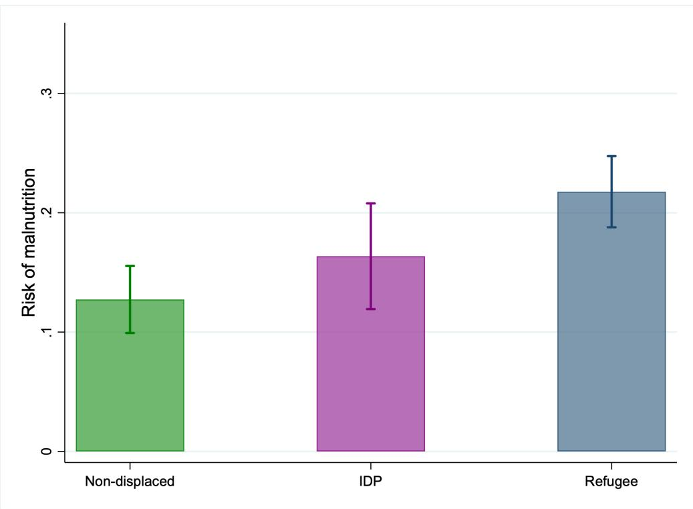  
Notes. The figure displays the prevalence of malnutrition risk across displacement groups. Bars represent the estimated mean probability of being at risk of malnutrition for non-displaced Colombian children, internally displaced persons (IDPs), and Venezuelan refugees, based on the unconditional specification reported in Column (1) of C.1. Malnutrition risk is defined as having a standardized Body Mass Index (BMI), calculated using World Health Organization (WHO) growth standards, below one standard deviation from the reference population mean. The omitted reference category is non-displaced Colombian children.

Table C.2. BMI Thresholds for Malnutrition Risk by Regularization Status

<table><tr><td></td><td>(1)</td><td>(2)</td><td>(3)</td><td>(4)</td><td>(5)</td></tr><tr><td>IDP</td><td>0.04(0.027)</td><td>0.04(0.027)</td><td>0.03(0.028)</td><td>0.04(0.027)</td><td>0.03(0.028)</td></tr><tr><td>Regular ref</td><td>0.08***(0.023)</td><td>0.08***(0.023)</td><td>0.08***(0.027)</td><td>0.09***(0.023)</td><td>0.09***(0.024)</td></tr><tr><td>Irregular ref</td><td>0.11***(0.039)</td><td>0.11***(0.039)</td><td>0.11**(0.042)</td><td>0.12***(0.039)</td><td>0.13***(0.044)</td></tr><tr><td>Constant</td><td>0.13***(0.015)</td><td>0.12***(0.048)</td><td>0.13***(0.049)</td><td>0.08(0.060)</td><td>0.13**(0.055)</td></tr><tr><td>Controls</td><td>No</td><td>Yes</td><td>Yes</td><td>Yes</td><td>Yes</td></tr><tr><td>Wealth index</td><td>No</td><td>No</td><td>Yes</td><td>No</td><td>No</td></tr><tr><td>Parent education</td><td>No</td><td>No</td><td>No</td><td>Yes</td><td>No</td></tr><tr><td>Grandparents&#x27; education</td><td>No</td><td>No</td><td>No</td><td>No</td><td>Yes</td></tr><tr><td>Observations</td><td>1546</td><td>1546</td><td>1545</td><td>1542</td><td>1394</td></tr><tr><td>p-value: IDP = Regular ref</td><td>0.090</td><td>0.090</td><td>0.119</td><td>0.110</td><td>0.037</td></tr><tr><td>p-value: IDP = Irregular ref</td><td>0.075</td><td>0.074</td><td>0.098</td><td>0.060</td><td>0.041</td></tr><tr><td>p-value: Regular ref = Irregular ref</td><td>0.504</td><td>0.503</td><td>0.525</td><td>0.399</td><td>0.445</td></tr></table>

Notes. This table presents linear probability model estimates for the risk of malnutrition across displacement and regularization status groups. The dependent variable is an indicator equal to one if the child's standardized Body Mass Index (BMI), based on the World Health Organization (WHO) growth standards, is below one standard deviation from the reference population mean. The omitted reference category is non-displaced Colombian children. IDP refers to Colombian internally displaced persons displaced by armed conflict. Regular ref refers to Venezuelan refugees with regular migration status, while Irregular ref refers to Venezuelan refugees without regular migration status. Columns progressively incorporate additional controls and socioeconomic characteristics. Baseline controls include child age and gender. Wealth index refers to the household wealth index. Parent education corresponds to the maximum years of education among parents, while Grandparents' education corresponds to the maximum years of education among grandparents. Standard errors clustered at the household level are reported in parentheses. Reported p-values correspond to tests of equality of coefficients across displacement and regularization groups. $^{*}p < 0.10$ , $^{**}p < 0.05$ , $^{***}p < 0.01$ .

Figure C.2. BMI Bars for Malnutrition Risk by Regularization Status  
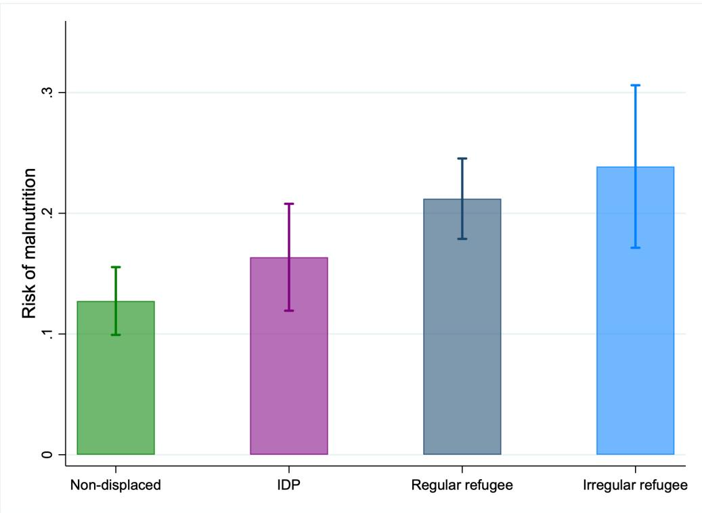  
Notes. The figure displays the prevalence of malnutrition risk across displacement and regularization status groups. Bars represent the estimated mean probability of being at risk of malnutrition for non-displaced Colombian children, internally displaced persons (IDPs), Venezuelan refugees with regular migration status, and Venezuelan refugees with irregular migration status, based on the unconditional specification reported in Column (1) of C.2. Malnutrition risk is defined as having a standardized Body Mass Index (BMI), calculated using World Health Organization (WHO) growth standards, below one standard deviation from the reference population mean. The omitted reference category is non-displaced Colombian children.

Table C.3. BMI Thresholds for Overweight Risk

<table><tr><td></td><td>(1)</td><td>(2)</td><td>(3)</td><td>(4)</td><td>(5)</td></tr><tr><td>IDP</td><td>-0.04(0.034)</td><td>-0.04(0.034)</td><td>-0.04(0.035)</td><td>-0.04(0.035)</td><td>-0.05(0.036)</td></tr><tr><td>Refugee</td><td>-0.16***(0.024)</td><td>-0.16***(0.024)</td><td>-0.16***(0.029)</td><td>-0.16***(0.024)</td><td>-0.16***(0.025)</td></tr><tr><td>Constant</td><td>0.30***(0.020)</td><td>0.27***(0.051)</td><td>0.27***(0.052)</td><td>0.28***(0.064)</td><td>0.30***(0.057)</td></tr><tr><td>Controls</td><td>No</td><td>Yes</td><td>Yes</td><td>Yes</td><td>Yes</td></tr><tr><td>Wealth index</td><td>No</td><td>No</td><td>Yes</td><td>No</td><td>No</td></tr><tr><td>Parent education</td><td>No</td><td>No</td><td>No</td><td>Yes</td><td>No</td></tr><tr><td>Grandparents&#x27; education</td><td>No</td><td>No</td><td>No</td><td>No</td><td>Yes</td></tr><tr><td>Observations</td><td>1546</td><td>1546</td><td>1545</td><td>1542</td><td>1394</td></tr><tr><td>p-value</td><td>0.000</td><td>0.000</td><td>0.000</td><td>0.000</td><td>0.001</td></tr></table>

Notes. This table presents linear probability model estimates for the risk of overweight across displacement groups. The dependent variable is an indicator equal to one if the child's standardized Body Mass Index (BMI), based on the World Health Organization (WHO) growth standards, is above one standard deviation from the reference population mean. The omitted reference category is non-displaced Colombian children. IDP refers to Colombian internally displaced persons displaced by armed conflict. Refugee refers to Venezuelan forced migrants. Columns progressively incorporate additional controls and socioeconomic characteristics. Baseline controls include child age and gender. Wealth index refers to the household wealth index. Parent education corresponds to the maximum years of education among parents, while Grandparents' education corresponds to the maximum years of education among grandparents. Standard errors clustered at the household level are reported in parentheses. p < 0.10, p < 0.05, p < 0.01.

Figure C.3. BMI Bars for Overweight Risk  
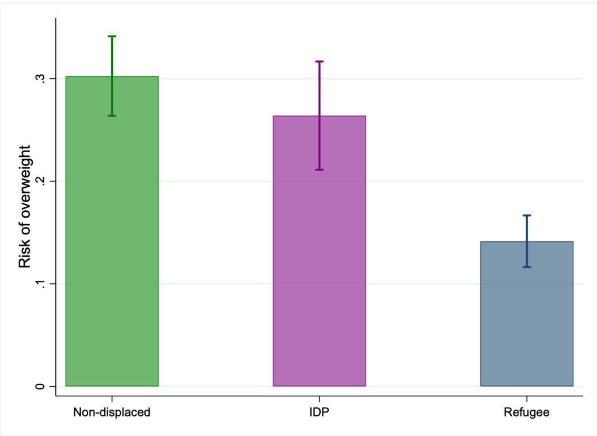  
Notes. The figure displays the prevalence of overweight risk across displacement groups. Bars represent the estimated mean probability of being at risk of overweight for non-displaced Colombian children, internally displaced persons (IDPs), and Venezuelan refugees, based on the unconditional specification reported in Column (1) of Table C.3. Overweight risk is defined as having a standardized Body Mass Index (BMI), calculated using World Health Organization (WHO) growth standards, above one standard deviation from the reference population mean. The omitted reference category is non-displaced Colombian children.

Table C.4. BMI Thresholds for Overweight Risk by Regularization Status

<table><tr><td></td><td>(1)</td><td>(2)</td><td>(3)</td><td>(4)</td><td>(5)</td></tr><tr><td>IDP</td><td>-0.04(0.034)</td><td>-0.04(0.034)</td><td>-0.04(0.035)</td><td>-0.04(0.035)</td><td>-0.05(0.036)</td></tr><tr><td>Regular ref</td><td>-0.15***(0.025)</td><td>-0.15***(0.025)</td><td>-0.16***(0.029)</td><td>-0.15***(0.025)</td><td>-0.15***(0.026)</td></tr><tr><td>Irregular ref</td><td>-0.19***(0.034)</td><td>-0.19***(0.034)</td><td>-0.20***(0.039)</td><td>-0.19***(0.035)</td><td>-0.18***(0.039)</td></tr><tr><td>Constant</td><td>0.30***(0.020)</td><td>0.27***(0.051)</td><td>0.27***(0.052)</td><td>0.29***(0.064)</td><td>0.30***(0.057)</td></tr><tr><td>Controls</td><td>No</td><td>Yes</td><td>Yes</td><td>Yes</td><td>Yes</td></tr><tr><td>Wealth index</td><td>No</td><td>No</td><td>Yes</td><td>No</td><td>No</td></tr><tr><td>Parent education</td><td>No</td><td>No</td><td>No</td><td>Yes</td><td>No</td></tr><tr><td>Grandparents&#x27; education</td><td>No</td><td>No</td><td>No</td><td>No</td><td>Yes</td></tr><tr><td>Observations</td><td>1546</td><td>1546</td><td>1545</td><td>1542</td><td>1394</td></tr><tr><td>p-value: IDP = Regular ref</td><td>0.000</td><td>0.000</td><td>0.000</td><td>0.000</td><td>0.002</td></tr><tr><td>p-value: IDP = Irregular ref</td><td>0.000</td><td>0.000</td><td>0.000</td><td>0.000</td><td>0.003</td></tr><tr><td>p-value: Regular ref = Irregular ref</td><td>0.200</td><td>0.209</td><td>0.197</td><td>0.218</td><td>0.517</td></tr></table>

Notes. This table presents linear probability model estimates for the risk of overweight across displacement and regularization status groups. The dependent variable is an indicator equal to one if the child's standardized Body Mass Index (BMI), based on the World Health Organization (WHO) growth standards, is above one standard deviation from the reference population mean. The omitted reference category is non-displaced Colombian children. IDP refers to Colombian internally displaced persons displaced by armed conflict. Regular ref refers to Venezuelan refugees with regular migration status, while Irregular ref refers to Venezuelan refugees without regular migration status. Columns progressively incorporate additional controls and socioeconomic characteristics. Baseline controls include child age and gender. Wealth index refers to the household wealth index. Parent education corresponds to the maximum years of education among parents, while Grandparents' education corresponds to the maximum years of education among grandparents. Standard errors clustered at the household level are reported in parentheses. Reported p-values correspond to tests of equality of coefficients across displacement and regularization groups. $p < 0.10$ , $p < 0.05$ , $p < 0.01$ .

Figure C.4. BMI Bars for Overweight Risk by Regularization Status  
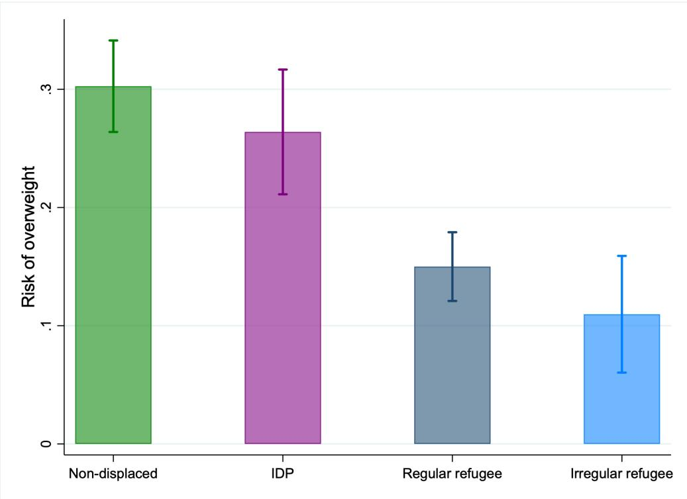  
Notes. The figure displays the prevalence of overweight risk across displacement and regularization status groups. Bars represent the estimated mean probability of being at risk of overweight for non-displaced Colombian children, internally displaced persons (IDPs), Venezuelan refugees with regular migration status, and Venezuelan refugees with irregular migration status, based on the unconditional specification reported in Column (1) of Table C.4. Overweight risk is defined as having a standardized Body Mass Index (BMI), calculated using World Health Organization (WHO) growth standards, above one standard deviation from the reference population mean. The omitted reference category is non-displaced Colombian children.

## C.2 Developmental Gaps—Regression Tables

Table C.5 report the full regression results underlying the developmental gap estimates for children using the unrestricted sample. In these specifications, the number of observations may vary across outcomes depending on the availability of non-missing values for each variable. The corresponding regressions estimated using the restricted sample are presented in Tables C.6. In these tables, the sample is restricted to observations with complete information across all controls and outcomes, ensuring that all specifications are estimated using the same sample of children. Each table presents four specifications. Specification (1) includes child-level controls only (age and gender). Specification (2) additionally incorporates the household wealth index. Specification (3) instead controls for the maximum parental education level within the household, while Specification (4) replaces parental education with the maximum grandparents' education level. All regressions are estimated in levels (level-level).

Table C.5. Developmental Gaps without sample restriction

<table><tr><td rowspan="2"></td><td colspan="5">Peabody</td><td colspan="5">SDQ</td></tr><tr><td>(1)</td><td>(2)</td><td>(3)</td><td>(4)</td><td>(5)</td><td>(6)</td><td>(7)</td><td>(8)</td><td>(9)</td><td>(10)</td></tr><tr><td>IDP</td><td>-0.29***(0.074)</td><td>-0.29***(0.074)</td><td>-0.16**(0.077)</td><td>-0.22***(0.074)</td><td>-0.24***(0.076)</td><td>-0.29***(0.083)</td><td>-0.29***(0.083)</td><td>-0.21**(0.084)</td><td>-0.28***(0.084)</td><td>-0.27***(0.086)</td></tr><tr><td>Refugee</td><td>-0.54***(0.058)</td><td>-0.54***(0.058)</td><td>-0.27***(0.068)</td><td>-0.52***(0.056)</td><td>-0.50***(0.060)</td><td>-0.13**(0.057)</td><td>-0.13**(0.057)</td><td>0.03(0.066)</td><td>-0.12**(0.057)</td><td>-0.11*(0.060)</td></tr><tr><td>Constant</td><td>0.30***(0.039)</td><td>0.43***(0.128)</td><td>0.32**(0.127)</td><td>-0.44***(0.165)</td><td>0.32**(0.147)</td><td>0.11**(0.044)</td><td>0.37***(0.120)</td><td>0.31**(0.120)</td><td>0.23(0.153)</td><td>0.45***(0.132)</td></tr><tr><td>Controls</td><td>No</td><td>Yes</td><td>Yes</td><td>Yes</td><td>Yes</td><td>No</td><td>Yes</td><td>Yes</td><td>Yes</td><td>Yes</td></tr><tr><td>Wealth index</td><td>No</td><td>No</td><td>Yes</td><td>No</td><td>No</td><td>No</td><td>No</td><td>Yes</td><td>No</td><td>No</td></tr><tr><td>Parent education</td><td>No</td><td>No</td><td>No</td><td>Yes</td><td>No</td><td>No</td><td>No</td><td>No</td><td>Yes</td><td>No</td></tr><tr><td>Grandparents&#x27; education</td><td>No</td><td>No</td><td>No</td><td>No</td><td>Yes</td><td>No</td><td>No</td><td>No</td><td>No</td><td>Yes</td></tr><tr><td>Observations</td><td>1453</td><td>1453</td><td>1453</td><td>1449</td><td>1312</td><td>1579</td><td>1579</td><td>1578</td><td>1575</td><td>1425</td></tr><tr><td>p-value</td><td>0.001</td><td>0.001</td><td>0.114</td><td>0.000</td><td>0.001</td><td>0.037</td><td>0.038</td><td>0.003</td><td>0.052</td><td>0.050</td></tr><tr><td rowspan="2"></td><td colspan="5">Anxiety</td><td colspan="5">Depression</td></tr><tr><td>(1)</td><td>(2)</td><td>(3)</td><td>(4)</td><td>(5)</td><td>(6)</td><td>(7)</td><td>(8)</td><td>(9)</td><td>(10)</td></tr><tr><td>IDP</td><td>-0.15**(0.078)</td><td>-0.16**(0.076)</td><td>-0.10(0.077)</td><td>-0.13*(0.077)</td><td>-0.19**(0.079)</td><td>-0.36***(0.092)</td><td>-0.36***(0.092)</td><td>-0.26***(0.087)</td><td>-0.32***(0.091)</td><td>-0.32***(0.094)</td></tr><tr><td>Refugee</td><td>-0.06(0.060)</td><td>-0.06(0.059)</td><td>0.04(0.070)</td><td>-0.05(0.059)</td><td>-0.09(0.063)</td><td>-0.10*(0.054)</td><td>-0.10*(0.054)</td><td>0.07(0.062)</td><td>-0.09*(0.053)</td><td>-0.06(0.056)</td></tr><tr><td>Constant</td><td>0.05(0.043)</td><td>-0.02(0.114)</td><td>-0.07(0.115)</td><td>-0.33**(0.154)</td><td>0.07(0.128)</td><td>0.11***(0.039)</td><td>0.11(0.115)</td><td>0.04(0.117)</td><td>-0.29*(0.153)</td><td>0.28**(0.128)</td></tr><tr><td>Controls</td><td>No</td><td>Yes</td><td>Yes</td><td>Yes</td><td>Yes</td><td>No</td><td>Yes</td><td>Yes</td><td>Yes</td><td>Yes</td></tr><tr><td>Wealth index</td><td>No</td><td>No</td><td>Yes</td><td>No</td><td>No</td><td>No</td><td>No</td><td>Yes</td><td>No</td><td>No</td></tr><tr><td>Parent education</td><td>No</td><td>No</td><td>No</td><td>Yes</td><td>No</td><td>No</td><td>No</td><td>No</td><td>Yes</td><td>No</td></tr><tr><td>Grandparents&#x27; education</td><td>No</td><td>No</td><td>No</td><td>No</td><td>Yes</td><td>No</td><td>No</td><td>No.</td><td>No</td><td>Yes</td></tr><tr><td>Observations</td><td>1573</td><td>1573</td><td>1572</td><td>1569</td><td>1420</td><td>1573</td><td>1573</td><td>1572</td><td>1569</td><td>1420</td></tr><tr><td>p-value</td><td>0.220</td><td>0.225</td><td>0.064</td><td>0.318</td><td>0.231</td><td>0.005</td><td>0.005</td><td>0.001</td><td>0.011</td><td>0.007</td></tr><tr><td rowspan="2"></td><td colspan="5">Trauma</td><td colspan="5">BMI</td></tr><tr><td>(1)</td><td>(2)</td><td>(3)</td><td>(4)</td><td>(5)</td><td>(6)</td><td>(7)</td><td>(8)</td><td>(9)</td><td>(10)</td></tr><tr><td>IDP</td><td>-0.26***(0.078)</td><td>-0.27***(0.077)</td><td>-0.19**(0.078)</td><td>-0.24***(0.078)</td><td>-0.27***(0.079)</td><td>-0.17(0.106)</td><td>-0.17(0.106)</td><td>-0.15(0.110)</td><td>-0.17(0.108)</td><td>-0.16(0.111)</td></tr><tr><td>Refugee</td><td>-0.10*(0.060)</td><td>-0.11*(0.059)</td><td>0.03(0.067)</td><td>-0.10*(0.059)</td><td>-0.11*(0.063)</td><td>-0.56***(0.082)</td><td>-0.56***(0.082)</td><td>-0.51***(0.100)</td><td>-0.56***(0.083)</td><td>-0.57***(0.086)</td></tr><tr><td>Constant</td><td>0.09**(0.041)</td><td>0.11(0.114)</td><td>0.05(0.116)</td><td>-0.26(0.160)</td><td>0.22*(0.129)</td><td>0.37***(0.064)</td><td>0.31*(0.165)</td><td>0.29*(0.165)</td><td>0.34(0.213)</td><td>0.29(0.184)</td></tr><tr><td>Controls</td><td>No</td><td>Yes</td><td>Yes</td><td>Yes</td><td>Yes</td><td>No</td><td>Yes</td><td>Yes</td><td>Yes</td><td>Yes</td></tr><tr><td>Wealth index</td><td>No</td><td>No</td><td>Yes</td><td>No</td><td>No</td><td>No</td><td>No</td><td>Yes</td><td>No</td><td>No</td></tr><tr><td>Parent education</td><td>No</td><td>No</td><td>No</td><td>Yes</td><td>No</td><td>No</td><td>No</td><td>No</td><td>Yes</td><td>No</td></tr><tr><td>Grandparents&#x27; education</td><td>No</td><td>No</td><td>No</td><td>No</td><td>Yes</td><td>No</td><td>No</td><td>No No</td><td>No</td><td>Yes</td></tr><tr><td>Observations</td><td>1573</td><td>1573</td><td>1572</td><td>1569</td><td>1420</td><td>1546</td><td>1546</td><td>1545</td><td>1542</td><td>1394</td></tr><tr><td>p-value</td><td>0.046</td><td>0.048</td><td>0.006</td><td>0.086</td><td>0.056</td><td>0.000</td><td>0.000</td><td>0.001</td><td>0.000</td><td>0.000</td></tr></table>

Notes. This table reports estimates from Model 1, estimated in levels (level-level), for six child development outcomes: Peabody, SDQ, Anxiety, Depression, Trauma, and BMI. The omitted reference category corresponds to non-displaced Colombian children. IDP refers to Colombian internally displaced children, while Refugee refers to Venezuelan refugee children. All specifications include child age and gender controls. Specification (2) additionally incorporates the household wealth index. Specification (3) instead controls for the maximum parental education level within the household, while Specification (4) replaces parental education with the maximum grandparents' education level. Standard errors clustered at the household level are reported in parentheses. The reported p-values correspond to tests of equality between the coefficients for IDP and Refugee children. Statistical significance is denoted as follows: $^{*}p < 0.10$ , $^{**}p < 0.05$ , $^{***}p < 0.01$ .

Table C.6. Developmental Gaps with sample restriction

<table><tr><td rowspan="2"></td><td colspan="5">Peabody</td><td colspan="5">SDQ</td></tr><tr><td>(1)</td><td>(2)</td><td>(3)</td><td>(4)</td><td>(5)</td><td>(6)</td><td>(7)</td><td>(8)</td><td>(9)</td><td>(10)</td></tr><tr><td>IDP</td><td>-0.26***(0.076)</td><td>-0.26***(0.076)</td><td>-0.14*(0.079)</td><td>-0.19**(0.077)</td><td>-0.24***(0.076)</td><td>-0.27***(0.087)</td><td>-0.27***(0.086)</td><td>-0.20**(0.088)</td><td>-0.26***(0.087)</td><td>-0.27***(0.086)</td></tr><tr><td>Refugee</td><td>-0.48***(0.060)</td><td>-0.48***(0.060)</td><td>-0.25***(0.071)</td><td>-0.47***(0.059)</td><td>-0.50***(0.060)</td><td>-0.11*(0.060)</td><td>-0.11*(0.060)</td><td>0.03(0.069)</td><td>-0.11*(0.060)</td><td>-0.11*(0.060)</td></tr><tr><td>Constant</td><td>0.31***(0.041)</td><td>0.46***(0.135)</td><td>0.36***(0.134)</td><td>-0.33*(0.175)</td><td>0.32**(0.147)</td><td>0.11**(0.045)</td><td>0.42***(0.128)</td><td>0.36***(0.128)</td><td>0.31*(0.166)</td><td>0.44***(0.132)</td></tr><tr><td>Controls</td><td>No</td><td>Yes</td><td>Yes</td><td>Yes</td><td>Yes</td><td>No</td><td>Yes</td><td>Yes</td><td>Yes</td><td>Yes</td></tr><tr><td>Wealth index</td><td>No</td><td>No</td><td>Yes</td><td>No</td><td>No</td><td>No</td><td>No</td><td>Yes</td><td>No</td><td>No</td></tr><tr><td>Parent education</td><td>No</td><td>No</td><td>No</td><td>Yes</td><td>No</td><td>No</td><td>No</td><td>No</td><td>Yes</td><td>No</td></tr><tr><td>Grandparents&#x27; education</td><td>No</td><td>No</td><td>No</td><td>No</td><td>Yes</td><td>No</td><td>No</td><td>No</td><td>No</td><td>Yes</td></tr><tr><td>Observations</td><td>1308</td><td>1308</td><td>1308</td><td>1308</td><td>1308</td><td>1421</td><td>1421</td><td>1421</td><td>1421</td><td>1421</td></tr><tr><td>p-value</td><td>0.005</td><td>0.004</td><td>0.170</td><td>0.000</td><td>0.001</td><td>0.056</td><td>0.057</td><td>0.007</td><td>0.075</td><td>0.052</td></tr><tr><td rowspan="2"></td><td colspan="5">Anxiety</td><td colspan="5">Depression</td></tr><tr><td>(1)</td><td>(2)</td><td>(3)</td><td>(4)</td><td>(5)</td><td>(6)</td><td>(7)</td><td>(8)</td><td>(9)</td><td>(10)</td></tr><tr><td>IDP</td><td>-0.18**(0.080)</td><td>-0.18**(0.079)</td><td>-0.13(0.080)</td><td>-0.15*(0.080)</td><td>-0.19**(0.079)</td><td>-0.30***(0.093)</td><td>-0.30***(0.093)</td><td>-0.22**(0.089)</td><td>-0.27***(0.093)</td><td>-0.32***(0.094)</td></tr><tr><td>Refugee</td><td>-0.08(0.064)</td><td>-0.09(0.063)</td><td>0.01(0.073)</td><td>-0.08(0.062)</td><td>-0.09(0.063)</td><td>-0.07(0.056)</td><td>-0.07(0.056)</td><td>0.08(0.064)</td><td>-0.07(0.055)</td><td>-0.06(0.056)</td></tr><tr><td>Constant</td><td>0.07(0.044)</td><td>0.02(0.120)</td><td>-0.04(0.121)</td><td>-0.32*(0.166)</td><td>0.06(0.128)</td><td>0.11***(0.040)</td><td>0.15(0.120)</td><td>0.08(0.123)</td><td>-0.18(0.163)</td><td>0.27**(0.128)</td></tr><tr><td>Controls</td><td>No</td><td>Yes</td><td>Yes</td><td>Yes</td><td>Yes</td><td>No</td><td>Yes</td><td>Yes</td><td>Yes</td><td>Yes</td></tr><tr><td>Wealth index</td><td>No</td><td>No</td><td>Yes</td><td>No</td><td>No</td><td>No</td><td>No</td><td>Yes</td><td>No</td><td>No</td></tr><tr><td>Parent education</td><td>No</td><td>No</td><td>No</td><td>Yes</td><td>No</td><td>No</td><td>No</td><td>No</td><td>Yes</td><td>No</td></tr><tr><td>Grandparents&#x27; education</td><td>No</td><td>No</td><td>No</td><td>No</td><td>Yes</td><td>No</td><td>No</td><td>No</td><td></td><td>Yes</td></tr><tr><td>Observations</td><td>1416</td><td>1416</td><td>1416</td><td>1416</td><td>1416</td><td>1416</td><td>1416</td><td>1416</td><td>1416</td><td>1416</td></tr><tr><td>p-value</td><td>0.249</td><td>0.257</td><td>0.089</td><td>0.407</td><td>0.217</td><td>0.013</td><td>0.014</td><td>0.002</td><td>0.027</td><td>0.007</td></tr><tr><td rowspan="2"></td><td colspan="5">Trauma</td><td colspan="5">BMI</td></tr><tr><td>(1)</td><td>(2)</td><td>(3)</td><td>(4)</td><td>(5)</td><td>(6)</td><td>(7)</td><td>(8)</td><td>(9)</td><td>(10)</td></tr><tr><td>IDP</td><td>-0.25***(0.081)</td><td>-0.26***(0.079)</td><td>-0.19**(0.081)</td><td>-0.23***(0.081)</td><td>-0.27***(0.079)</td><td>-0.16(0.109)</td><td>-0.16(0.110)</td><td>-0.13(0.113)</td><td>-0.16(0.112)</td><td>-0.16(0.111)</td></tr><tr><td>Refugee</td><td>-0.10(0.063)</td><td>-0.11*(0.062)</td><td>0.01(0.069)</td><td>-0.11*(0.062)</td><td>-0.10*(0.063)</td><td>-0.57***(0.086)</td><td>-0.57***(0.087)</td><td>-0.53***(0.104)</td><td>-0.57***(0.087)</td><td>-0.57***(0.086)</td></tr><tr><td>Constant</td><td>0.10**(0.042)</td><td>0.14(0.120)</td><td>0.08(0.122)</td><td>-0.19(0.173)</td><td>0.21(0.129)</td><td>0.37***(0.066)</td><td>0.28(0.174)</td><td>0.26(0.176)</td><td>0.35(0.231)</td><td>0.29(0.184)</td></tr><tr><td>Controls</td><td>No</td><td>Yes</td><td>Yes</td><td>Yes</td><td>Yes</td><td>No</td><td>Yes</td><td>Yes</td><td>Yes</td><td>Yes</td></tr><tr><td>Wealth index</td><td>No</td><td>No</td><td>Yes</td><td>No</td><td>No</td><td>No</td><td>No</td><td>Yes</td><td>No</td><td>No</td></tr><tr><td>Parent education</td><td>No</td><td>No</td><td>No</td><td>Yes</td><td>No</td><td>No</td><td>No</td><td>No</td><td>Yes</td><td>No</td></tr><tr><td>Grandparents&#x27; education</td><td>No</td><td>No</td><td>No</td><td>No</td><td>Yes</td><td>No</td><td>No</td><td>No No</td><td>No</td><td>Yes</td></tr><tr><td>Observations</td><td>1416</td><td>1416</td><td>1416</td><td>1416</td><td>1416</td><td>1390</td><td>1390</td><td>1390</td><td>1390</td><td>1390</td></tr><tr><td>p-value</td><td>0.071</td><td>0.074</td><td>0.013</td><td>0.141</td><td>0.052</td><td>0.000</td><td>0.000</td><td>0.000</td><td>0.000</td><td>0.000</td></tr></table>

Notes. This table reports estimates from Model 1, estimated in levels (level-level), for six child development outcomes: Peabody, SDQ, Anxiety, Depression, Trauma, and BMI, using the full sample without imposing sample restrictions. The omitted reference category corresponds to non-displaced Colombian children. IDP refers to Colombian internally displaced children, while Refugee refers to Venezuelan refugee children. All specifications include child age and gender controls. Specification (2) additionally incorporates the household wealth index. Specification (3) instead controls for the maximum parental education level within the household, while Specification (4) replaces parental education with the maximum grandparents' education level. Standard errors clustered at the household level are reported in parentheses. The reported p-values correspond to tests of equality between the coefficients for IDP and Refugee children. Statistical significance is denoted as follows: \*p < 0.10, \*\*p < 0.05, \*\*\*p < 0.01.

## C.3 Rank-Rank Regressions

Table C.7 presents the rank-rank regression results for each developmental outcome based on estimating equation 2. Each column displays a different outcome. The specification includes displacement group indicators, the maximum educational attainment of grandparents, and the interaction between displacement status and grandparental education. Grandparental education is defined as the highest grade completed by any grandparent of the child. Because this measure is typically determined before migration or displacement occurs, it provides a proxy for socioeconomic status prior to displacement. This specification allows the association between household background and developmental outcomes to vary across displacement groups.

Table C.7. Intergenerational Gradients in Developmental Outcomes

<table><tr><td></td><td>(1) Cognitive</td><td>(2) Socioemotional</td><td>(3) Anxiety</td><td>(4) Depression</td><td>(5) Trauma</td><td>(6) Physical</td></tr><tr><td>IDP</td><td>-9.28**(4.287)</td><td>-6.89(4.516)</td><td>1.66(4.744)</td><td>-7.10(5.138)</td><td>-3.09(4.483)</td><td>-0.15(4.441)</td></tr><tr><td>Refugee</td><td>-14.25***(3.771)</td><td>-3.89(3.598)</td><td>1.13(4.136)</td><td>-2.25(4.389)</td><td>-1.92(3.900)</td><td>-5.73(3.758)</td></tr><tr><td>GP&#x27;s education</td><td>0.09**(0.047)</td><td>-0.02(0.046)</td><td>0.04(0.051)</td><td>-0.02(0.054)</td><td>0.03(0.049)</td><td>0.05(0.047)</td></tr><tr><td>IDP × GP&#x27;s education</td><td>0.05(0.081)</td><td>-0.01(0.083)</td><td>-0.17*(0.089)</td><td>-0.04(0.102)</td><td>-0.12(0.083)</td><td>-0.04(0.083)</td></tr><tr><td>Ref × GP&#x27;s education</td><td>-0.01(0.064)</td><td>0.01(0.061)</td><td>-0.07(0.069)</td><td>-0.01(0.076)</td><td>-0.03(0.066)</td><td>-0.12*(0.062)</td></tr><tr><td>Constant</td><td>54.63***(2.747)</td><td>54.56***(2.574)</td><td>52.86***(2.871)</td><td>66.53***(2.937)</td><td>52.30***(2.684)</td><td>53.60***(2.839)</td></tr><tr><td>Observations</td><td>1312</td><td>1425</td><td>1420</td><td>1420</td><td>1420</td><td>1394</td></tr></table>

Standard errors in parentheses

$$
^ {*} p <   0. 1 0, ^ {* *} p <   0. 0 5, ^ {* * *} p <   0. 0 1
$$

Notes. This table presents rank-rank regression estimates examining the relationship between grandparental education and child developmental outcomes across displacement groups. The dependent variables are child percentile ranks (0-100) within the full sample distribution for each outcome: Cognitive (PPVT), Socioemotional (SDQ Total Difficulties), Anxiety (TSCYC Anxiety subscale), Depression (TSCYC Depression subscale), Trauma (TSCYC PTS Total), and Physical (BMI). GP's education refers to the maximum years of education among grandparents. The omitted reference category is non-displaced Colombian children. IDP refers to Colombian internally displaced persons displaced by armed conflict. Refugee refers to Venezuelan forced migrants. The interaction terms (IDP × GP's education and Ref × GP's education) capture differential intergenerational mobility slopes for displaced groups relative to non-displaced children. A positive interaction indicates steeper mobility (stronger association between grandparental education and child outcomes), while a negative interaction indicates flatter mobility (weaker intergenerational transmission). Standard errors clustered at the household level are reported in parentheses. $*p < 0.10$ , $**p < 0.05$ , $***p < 0.01$ .

## D Developmental Gaps by Regularization Status and Service Access

## D.1 Developmental gaps by regularization status

Tables D.1–D.6 report developmental gaps separately for Venezuelan refugee children with and without legal residence in levels (level-level). These estimates isolate whether access to regularization is associated with narrower disadvantages. Each table presents four specifications. Specification (1) includes only displacement group indicators. Specification (2) adds child-level controls (age and gender) as well as the maximum parental education reported within the household. Specification (3) further incorporates the household wealth index. Specification (4) follows. Specification (3) but restricts the wealth index to values less than or equal to 5, effectively truncating the upper tail of the distribution.

Table D.1. Developmental Gaps by Regularization - Peabody (PPVT)

<table><tr><td></td><td>(1)</td><td>(2)</td><td>(3)</td><td>(4)</td></tr><tr><td>IDP</td><td>-0.29***(0.074)</td><td>-0.23***(0.074)</td><td>-0.15**(0.077)</td><td>-0.13(0.078)</td></tr><tr><td>Regular ref</td><td>-0.39***(0.061)</td><td>-0.40***(0.059)</td><td>-0.24***(0.069)</td><td>-0.22***(0.070)</td></tr><tr><td>Irregular ref</td><td>-1.05***(0.092)</td><td>-0.96***(0.090)</td><td>-0.77***(0.100)</td><td>-0.74***(0.101)</td></tr><tr><td>Constant</td><td>0.30***(0.039)</td><td>-0.35**(0.164)</td><td>-0.28*(0.165)</td><td>-0.30*(0.168)</td></tr><tr><td>Controls</td><td>No</td><td>Yes</td><td>Yes</td><td>Yes</td></tr><tr><td>Wealth index</td><td>No</td><td>No</td><td>Yes</td><td>No</td></tr><tr><td>Wealth index ≤ 5</td><td>No</td><td>No</td><td>No</td><td>Yes</td></tr><tr><td>p-value: IDP = Regular ref</td><td>0.182</td><td>0.028</td><td>0.267</td><td>0.225</td></tr><tr><td>p-value: IDP = Irregular ref</td><td>0.000</td><td>0.000</td><td>0.000</td><td>0.000</td></tr><tr><td>p-value: Regular ref = Irregular ref</td><td>0.000</td><td>0.000</td><td>0.000</td><td>0.000</td></tr><tr><td>Observations</td><td>1453</td><td>1449</td><td>1449</td><td>1417</td></tr></table>

Hypothesis tests are two-sided.  
Standard errors in parentheses.

$$
^ {*} p <   0. 1 0, ^ {* *} p <   0. \dot {0} 5, ^ {* * *} p <   0. 0 1
$$

Notes. The dependent variable is the Peabody Picture Vocabulary Test (PPVT) score, a measure of receptive vocabulary standardized using the pooled mean and standard deviation from Wave 1 of the VenRePs-Kids survey. The omitted reference category is non-displaced Colombian children. IDP refers to Colombian internally displaced persons displaced by armed conflict. Regular ref refers to Venezuelan refugee children with legal residence status (regularized). Irregular ref refers to Venezuelan refugee children without legal residence status (non-regularized). Column (1) includes only displacement group indicators. Columns (2)–(4) include controls for child gender, child age, and maximum education level within the household. Column (3) additionally controls for the post-migration household wealth index. Column (4) restricts the wealth index to households with a score of five or below, effectively truncating the upper tail of the wealth distribution. Standard errors clustered at the household level are reported in parentheses. The p-value rows report tests of equality between coefficients: IDP = Regular ref, IDP = Irregular ref, and Regular ref = Irregular ref. All hypothesis tests are two-sided. \*p < 0.10, \*\*p < 0.05, \*\*\*p < 0.01.

Table D.2. Developmental Gaps by Regularization - SDQ

<table><tr><td></td><td>(1)</td><td>(2)</td><td>(3)</td><td>(4)</td></tr><tr><td>IDP</td><td>-0.29***(0.083)</td><td>-0.28***(0.084)</td><td>-0.21**(0.085)</td><td>-0.22**(0.088)</td></tr><tr><td>Regular ref</td><td>-0.10(0.061)</td><td>-0.09(0.060)</td><td>0.06(0.069)</td><td>0.05(0.070)</td></tr><tr><td>Irregular ref</td><td>-0.24***(0.092)</td><td>-0.25***(0.092)</td><td>-0.07(0.100)</td><td>-0.07(0.101)</td></tr><tr><td>Constant</td><td>0.11**(0.044)</td><td>0.25(0.155)</td><td>0.32**(0.156)</td><td>0.31**(0.158)</td></tr><tr><td>Controls</td><td>No</td><td>Yes</td><td>Yes</td><td>Yes</td></tr><tr><td>Wealth index</td><td>No</td><td>No</td><td>Yes</td><td>No</td></tr><tr><td>Wealth index ≤ 5</td><td>No</td><td>No</td><td>No</td><td>Yes</td></tr><tr><td>p-value: IDP = Regular ref</td><td>0.017</td><td>0.023</td><td>0.002</td><td>0.002</td></tr><tr><td>p-value: IDP = Irregular ref</td><td>0.602</td><td>0.740</td><td>0.196</td><td>0.181</td></tr><tr><td>p-value: Regular ref = Irregular ref</td><td>0.124</td><td>0.091</td><td>0.164</td><td>0.171</td></tr><tr><td>Observations</td><td>1579</td><td>1575</td><td>1574</td><td>1537</td></tr></table>

Hypothesis tests are two-sided.  
Standard errors in parentheses.  
\* $p < {0.10}, *  * p < {0.05}, *  *  * p < {0.01}$

Notes. The dependent variable is the Strengths and Difficulties Questionnaire (SDQ) total difficulties score, aggregating emotional symptoms, conduct problems, hyperactivity, and peer difficulties. Higher values indicate greater socioemotional difficulties. All outcomes are standardized using the pooled mean and standard deviation from Wave 1 of the VenRePs-Kids survey. The omitted reference category is non-displaced Colombian children. IDP refers to Colombian internally displaced persons displaced by armed conflict. Regular ref refers to Venezuelan refugee children with legal residence status (regularized). Irregular ref refers to Venezuelan refugee children without legal residence status (non-regularized). Column (1) includes only displacement group indicators. Columns (2)-(4) include controls for child gender, child age, and maximum education level within the household. Column (3) additionally controls for the post-migration household wealth index. Column (4) restricts the wealth index to households with a score of five or below. Standard errors clustered at the household level are reported in parentheses. The p-value rows report tests of equality between coefficients: IDP = Regular ref, IDP = Irregular ref, and Regular ref = Irregular ref. All hypothesis tests are two-sided. \*p < 0.10, \*\*p < 0.05, \*\*\*p < 0.01.

Table D.3. Developmental Gaps by Regularization - Anxiety

<table><tr><td></td><td>(1)</td><td>(2)</td><td>(3)</td><td>(4)</td></tr><tr><td>IDP</td><td>-0.15**(0.078)</td><td>-0.13*(0.077)</td><td>-0.10(0.078)</td><td>-0.10(0.082)</td></tr><tr><td>Regular ref</td><td>-0.05(0.065)</td><td>-0.05(0.064)</td><td>0.02(0.074)</td><td>0.02(0.076)</td></tr><tr><td>Irregular ref</td><td>-0.10(0.089)</td><td>-0.07(0.091)</td><td>0.02(0.100)</td><td>0.02(0.102)</td></tr><tr><td>Constant</td><td>0.05(0.043)</td><td>-0.32**(0.155)</td><td>-0.30*(0.157)</td><td>-0.32**(0.161)</td></tr><tr><td>Controls</td><td>No</td><td>Yes</td><td>Yes</td><td>Yes</td></tr><tr><td>Wealth index</td><td>No</td><td>No</td><td>Yes</td><td>No</td></tr><tr><td>Wealth index ≤ 5</td><td>No</td><td>No</td><td>No</td><td>Yes</td></tr><tr><td>p-value: IDP = Regular ref</td><td>0.187</td><td>0.322</td><td>0.154</td><td>0.161</td></tr><tr><td>p-value: IDP = Irregular ref</td><td>0.632</td><td>0.533</td><td>0.262</td><td>0.259</td></tr><tr><td>p-value: Regular ref = Irregular ref</td><td>0.531</td><td>0.860</td><td>0.984</td><td>0.996</td></tr><tr><td>Observations</td><td>1573</td><td>1569</td><td>1568</td><td>1531</td></tr></table>

Hypothesis tests are two-sided.  
Standard errors in parentheses.  
\* $p < {0.10}, *  * p < {0.05}, *  *  * p < {0.01}$  
Notes. The dependent variable is the Anxiety subscale of the Trauma Symptom Checklist for Young Children (TSCYC), a caregiver-reported measure of anxiety symptoms. Higher values indicate greater anxiety symptoms. All outcomes are standardized using the pooled mean and standard deviation from Wave 1 of the VenRePs-Kids survey. The omitted reference category is non-displaced Colombian children. IDP refers to Colombian internally displaced persons displaced by armed conflict. Regular ref refers to Venezuelan refugee children with legal residence status (regularized). Irregular ref refers to Venezuelan refugee children without legal residence status (non-regularized). Column (1) includes only displacement group indicators. Columns (2)-(4) include controls for child gender, child age, and maximum education level within the household. Column (3) additionally controls for the post-migration household wealth index. Column (4) restricts the wealth index to households with a score of five or below. Standard errors clustered at the household level are reported in parentheses. The p-value rows report tests of equality between coefficients: IDP = Regular ref, IDP = Irregular ref, and Regular ref = Irregular ref. All hypothesis tests are two-sided. \*p < 0.10, \*\*p < 0.05, \*\*\*p < 0.01.

Table D.4. Developmental Gaps by Regularization - Depression

<table><tr><td></td><td>(1)</td><td>(2)</td><td>(3)</td><td>(4)</td></tr><tr><td>IDP</td><td>-0.36***(0.092)</td><td>-0.33***(0.091)</td><td>-0.25***(0.087)</td><td>-0.26***(0.090)</td></tr><tr><td>Regular ref</td><td>-0.05(0.057)</td><td>-0.05(0.056)</td><td>0.08(0.066)</td><td>0.08(0.067)</td></tr><tr><td>Irregular ref</td><td>-0.29***(0.093)</td><td>-0.26***(0.095)</td><td>-0.10(0.103)</td><td>-0.10(0.104)</td></tr><tr><td>Constant</td><td>0.11***(0.039)</td><td>-0.26*(0.155)</td><td>-0.18(0.154)</td><td>-0.17(0.156)</td></tr><tr><td>Controls</td><td>No</td><td>Yes</td><td>Yes</td><td>Yes</td></tr><tr><td>Wealth index</td><td>No</td><td>No</td><td>Yes</td><td>No</td></tr><tr><td>Wealth index ≤ 5</td><td>No</td><td>No</td><td>No</td><td>Yes</td></tr><tr><td>p-value: IDP = Regular ref</td><td>0.001</td><td>0.003</td><td>0.001</td><td>0.001</td></tr><tr><td>p-value: IDP = Irregular ref</td><td>0.547</td><td>0.557</td><td>0.231</td><td>0.196</td></tr><tr><td>p-value: Regular ref = Irregular ref</td><td>0.012</td><td>0.032</td><td>0.057</td><td>0.064</td></tr><tr><td>Observations</td><td>1573</td><td>1569</td><td>1568</td><td>1531</td></tr></table>

Hypothesis tests are two-sided.  
Standard errors in parentheses.  
\* $p < {0.10}, *  * p < {0.05}, *  *  * p < {0.01}$

Notes. The dependent variable is the Depression subscale of the Trauma Symptom Checklist for Young Children (TSCYC), a caregiver-reported measure of depressive symptoms. Higher values indicate greater depressive symptoms. All outcomes are standardized using the pooled mean and standard deviation from Wave 1 of the VenRePs-Kids survey. The omitted reference category is non-displaced Colombian children. IDP refers to Colombian internally displaced persons displaced by armed conflict. Regular ref refers to Venezuelan refugee children with legal residence status (regularized). Irregular ref refers to Venezuelan refugee children without legal residence status (non-regularized). Column (1) includes only displacement group indicators. Columns (2)-(4) include controls for child gender, child age, and maximum education level within the household. Column (3) additionally controls for the post-migration household wealth index. Column (4) restricts the wealth index to households with a score of five or below. Standard errors clustered at the household level are reported in parentheses. The p-value rows report tests of equality between coefficients: IDP = Regular ref, IDP = Irregular ref, and Regular ref = Irregular ref. All hypothesis tests are two-sided. \*p < 0.10, \*\*p < 0.05, \*\*\*p < 0.01.

Table D.5. Developmental Gaps by Regularization - Trauma

<table><tr><td></td><td>(1)</td><td>(2)</td><td>(3)</td><td>(4)</td></tr><tr><td>IDP</td><td>-0.26***(0.078)</td><td>-0.24***(0.078)</td><td>-0.18**(0.079)</td><td>-0.17**(0.082)</td></tr><tr><td>Regular ref</td><td>-0.06(0.064)</td><td>-0.07(0.063)</td><td>0.04(0.072)</td><td>0.05(0.073)</td></tr><tr><td>Irregular ref</td><td>-0.24**(0.106)</td><td>-0.22**(0.107)</td><td>-0.09(0.115)</td><td>-0.07(0.115)</td></tr><tr><td>Constant</td><td>0.09**(0.041)</td><td>-0.23(0.162)</td><td>-0.18(0.165)</td><td>-0.19(0.168)</td></tr><tr><td>Controls</td><td>No</td><td>Yes</td><td>Yes</td><td>Yes</td></tr><tr><td>Wealth index</td><td>No</td><td>No</td><td>Yes</td><td>No</td></tr><tr><td>Wealth index ≤ 5</td><td>No</td><td>No</td><td>No</td><td>Yes</td></tr><tr><td>p-value: IDP = Regular ref</td><td>0.018</td><td>0.043</td><td>0.011</td><td>0.012</td></tr><tr><td>p-value: IDP = Irregular ref</td><td>0.856</td><td>0.861</td><td>0.468</td><td>0.423</td></tr><tr><td>p-value: Regular ref = Irregular ref</td><td>0.106</td><td>0.178</td><td>0.240</td><td>0.278</td></tr><tr><td>Observations</td><td>1573</td><td>1569</td><td>1568</td><td>1531</td></tr></table>

Hypothesis tests are two-sided.  
Standard errors in parentheses.  
\* $p < {0.10}, *  * p < {0.05}, *  *  * p < {0.01}$

Notes. The dependent variable is the Posttraumatic Stress Total score (PTS Total) from the Trauma Symptom Checklist for Young Children (TSCYC), a caregiver-reported measure of posttraumatic stress symptoms combining intrusion, avoidance, and arousal subscales. Higher values indicate greater trauma symptoms. All outcomes are standardized using the pooled mean and standard deviation from Wave 1 of the VenRePs-Kids survey. The omitted reference category is non-displaced Colombian children. IDP refers to Colombian internally displaced persons displaced by armed conflict. Regular ref refers to Venezuelan refugee children with legal residence status (regularized). Irregular ref refers to Venezuelan refugee children without legal residence status (non-regularized). Column (1) includes only displacement group indicators. Columns (2)-(4) include controls for child gender, child age, and maximum education level within the household. Column (3) additionally controls for the post-migration household wealth index. Column (4) restricts the wealth index to households with a score of five or below. Standard errors clustered at the household level are reported in parentheses. The p-value rows report tests of equality between coefficients: IDP = Regular ref, IDP = Irregular ref, and Regular ref = Irregular ref. All hypothesis tests are two-sided. \*p < 0.10, \*\*p < 0.05, \*\*\*p < 0.01.

Table D.6. Developmental Gaps by Regularization - BMI

<table><tr><td></td><td>(1)</td><td>(2)</td><td>(3)</td><td>(4)</td></tr><tr><td>IDP</td><td>-0.17(0.106)</td><td>-0.18*(0.108)</td><td>-0.16(0.110)</td><td>-0.12(0.114)</td></tr><tr><td>Regular ref</td><td>-0.50***(0.087)</td><td>-0.51***(0.087)</td><td>-0.46***(0.103)</td><td>-0.43***(0.104)</td></tr><tr><td>Irregular ref</td><td>-0.77***(0.122)</td><td>-0.78***(0.126)</td><td>-0.72***(0.140)</td><td>-0.68***(0.141)</td></tr><tr><td>Constant</td><td>0.37***(0.064)</td><td>0.38*(0.213)</td><td>0.40*(0.215)</td><td>0.40*(0.217)</td></tr><tr><td>Controls</td><td>No</td><td>Yes</td><td>Yes</td><td>Yes</td></tr><tr><td>Wealth index</td><td>No</td><td>No</td><td>Yes</td><td>No</td></tr><tr><td>Wealth index ≤ 5</td><td>No</td><td>No</td><td>No</td><td>Yes</td></tr><tr><td>p-value: IDP = Regular ref</td><td>0.001</td><td>0.001</td><td>0.006</td><td>0.004</td></tr><tr><td>p-value: IDP = Irregular ref</td><td>0.000</td><td>0.000</td><td>0.000</td><td>0.000</td></tr><tr><td>p-value: Regular ref = Irregular ref</td><td>0.024</td><td>0.025</td><td>0.030</td><td>0.041</td></tr><tr><td>Observations</td><td>1546</td><td>1542</td><td>1541</td><td>1507</td></tr></table>

Hypothesis tests are two-sided.  
Standard errors in parentheses.  
\* $p < {0.10}, *  * p < {0.05}, *  *  * p < {0.01}$  
Notes. The dependent variable is Body Mass Index (BMI), calculated as weight in kilograms divided by height in meters squared, following the standard definition of the World Health Organization (WHO). BMI is used as an indicator of nutritional status and overall physical health. All outcomes are standardized using the pooled mean and standard deviation from Wave 1 of the VenRePs-Kids survey. The omitted reference category is non-displaced Colombian children. IDP refers to Colombian internally displaced persons due to armed conflict. Regular ref refers to Venezuelan refugee children with legal residence status (regularized), while Irregular ref refers to Venezuelan refugee children without legal residence status (non-regularized). Column (1) includes only displacement group indicators. Columns (2)–(4) include controls for child gender, child age, and the maximum education level within the household. Column (3) additionally controls for the post-migration household wealth index. Column (4) restricts the sample to households with a wealth index of five or below, effectively truncating the upper tail of the wealth distribution. Standard errors clustered at the household level are reported in parentheses. The p-value rows report tests of equality between coefficients: IDP = Regular ref, IDP = Irregular ref, and Regular ref = Irregular ref. All hypothesis tests are two-sided. \*p < 0.10, \*\*p < 0.05, \*\*\*p < 0.01.

## D.2 Developmental gaps by access to SISBEN

Figure D.1 displays developmental gaps stratified by access to Sisbén status. Tables D.7–D.12 report full regression results estimated in levels (level-level). This analysis tests whether gaps are concentrated among children out of access to Sisbén, or whether even with access children exhibit developmental disadvantages.

Figure D.1. Developmental Gaps by Sisbén Access  
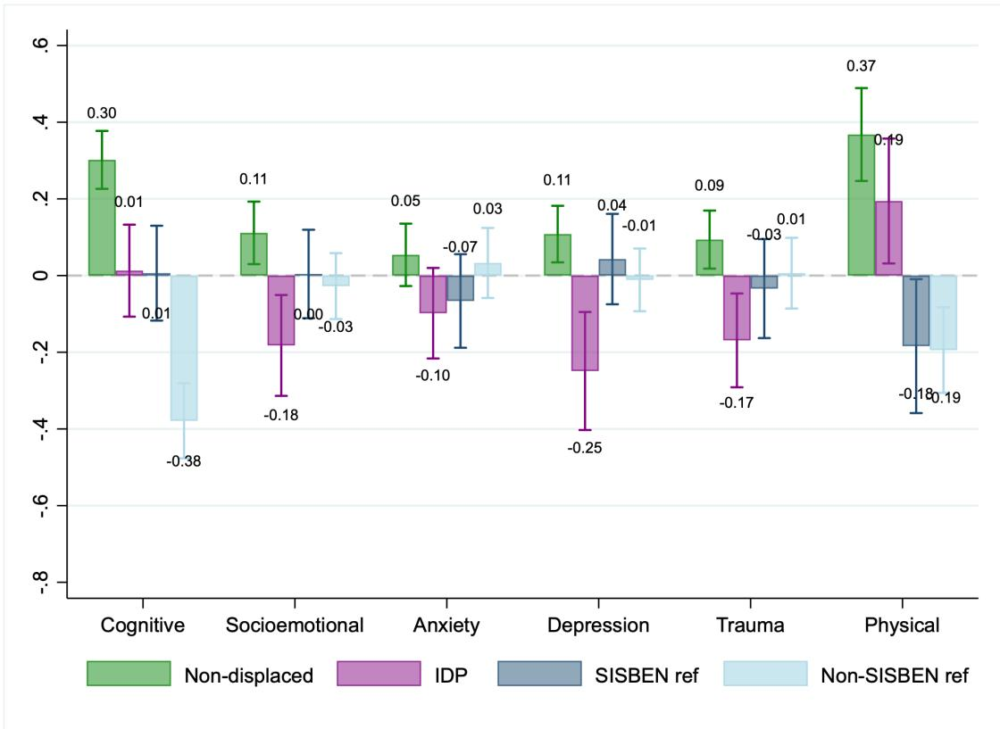

Notes. The figure displays standardized developmental gaps for children by Sisbén access status. Bars represent differences in mean outcomes between displaced and non-displaced children within each access group. Outcomes include cognitive (PPVT), socioemotional (SDQ), anxiety, depression, trauma (TSCYC), and physical health (BMI), all standardized using the pooled mean and standard deviation from Wave 1 of the VenRePs-Kids survey.

Sisbén access is used as a proxy for social assistance eligibility in Colombia. The figure compares children with and without access to Sisbén within displacement status groups. Differences are interpreted as unconditional gaps and do not include additional covariate adjustments.

Table D.7. Developmental gaps by SISBEN - (PPVT) Peabody

<table><tr><td></td><td>(1)</td><td>(2)</td><td>(3)</td><td>(4)</td></tr><tr><td>IDP</td><td>-0.29***(0.074)</td><td>-0.22***(0.074)</td><td>-0.15*(0.077)</td><td>-0.12(0.078)</td></tr><tr><td>SISBEN ref</td><td>-0.30***(0.078)</td><td>-0.34***(0.075)</td><td>-0.17**(0.082)</td><td>-0.15*(0.082)</td></tr><tr><td>Non-SISBEN ref</td><td>-0.68***(0.066)</td><td>-0.63***(0.065)</td><td>-0.45***(0.077)</td><td>-0.42***(0.077)</td></tr><tr><td>Constant</td><td>0.30***(0.039)</td><td>-0.36**(0.165)</td><td>-0.29*(0.167)</td><td>-0.30*(0.170)</td></tr><tr><td>Controls</td><td>No</td><td>Yes</td><td>Yes</td><td>Yes</td></tr><tr><td>Wealth index</td><td>No</td><td>No</td><td>Yes</td><td>No</td></tr><tr><td>Wealth index ≤ 5</td><td>No</td><td>No</td><td>No</td><td>Yes</td></tr><tr><td>p-value: IDP = SISBEN ref</td><td>0.943</td><td>0.222</td><td>0.810</td><td>0.721</td></tr><tr><td>p-value: IDP = Non-SISBEN ref</td><td>0.000</td><td>0.000</td><td>0.000</td><td>0.000</td></tr><tr><td>p-value: SISBEN ref = Non-SISBEN ref</td><td>0.000</td><td>0.001</td><td>0.001</td><td>0.001</td></tr><tr><td>Observations</td><td>1452</td><td>1448</td><td>1448</td><td>1416</td></tr></table>

Hypothesis tests are two-sided.  
Standard errors in parentheses.  
\* $p < {0.10}, *  * p < {0.05}, *  *  * p < {0.01}$

Notes. The dependent variable is the Peabody Picture Vocabulary Test (PPVT) score, a measure of receptive vocabulary standardized using the pooled mean and standard deviation from Wave 1 of the VenRePs-Kids survey. The omitted reference category is non-displaced Colombian children. IDP refers to Colombian internally displaced persons displaced by armed conflict. SISBEN ref refers to Venezuelan refugee children with access to Sisbén. Non-SISBEN ref refers to Venezuelan refugee children without access to Sisbén. Column (1) includes only displacement group indicators. Columns (2)-(4) include controls for child gender, child age, and maximum education level within the household. Column (3) additionally controls for the post-migration household wealth index. Column (4) restricts the wealth index to households with a score of five or below. Standard errors clustered at the household level are reported in parentheses. The p-value rows report tests of equality between coefficients: IDP = SISBEN ref, IDP = Non-SISBEN ref, and SISBEN ref = Non-SISBEN ref. All hypothesis tests are two-sided. \*p < 0.10, \*\*p < 0.05, \*\*\*p < 0.01.

Table D.8. Developmental gaps by SISBEN - SDQ

<table><tr><td></td><td>(1)</td><td>(2)</td><td>(3)</td><td>(4)</td></tr><tr><td>IDP</td><td>-0.29***(0.083)</td><td>-0.28***(0.084)</td><td>-0.21**(0.085)</td><td>-0.21**(0.088)</td></tr><tr><td>SISBEN ref</td><td>-0.11(0.078)</td><td>-0.11(0.078)</td><td>0.04(0.085)</td><td>0.04(0.085)</td></tr><tr><td>Non-SISBEN ref</td><td>-0.14**(0.063)</td><td>-0.13**(0.063)</td><td>0.03(0.072)</td><td>0.03(0.074)</td></tr><tr><td>Constant</td><td>0.11**(0.044)</td><td>0.23(0.155)</td><td>0.31**(0.156)</td><td>0.30*(0.159)</td></tr><tr><td>Controls</td><td>No</td><td>Yes</td><td>Yes</td><td>Yes</td></tr><tr><td>Wealth index</td><td>No</td><td>No</td><td>Yes</td><td>No</td></tr><tr><td>Wealth index ≤ 5</td><td>No</td><td>No</td><td>No</td><td>Yes</td></tr><tr><td>p-value: IDP = SISBEN ref</td><td>0.052</td><td>0.083</td><td>0.013</td><td>0.012</td></tr><tr><td>p-value: IDP = Non-SISBEN ref</td><td>0.065</td><td>0.075</td><td>0.006</td><td>0.005</td></tr><tr><td>p-value: SISBEN ref = Non-SISBEN ref</td><td>0.688</td><td>0.799</td><td>0.900</td><td>0.903</td></tr><tr><td>Observations</td><td>1578</td><td>1574</td><td>1573</td><td>1536</td></tr></table>

Hypothesis tests are two-sided.  
Standard errors in parentheses.  
\* $p < {0.10}, *  * p < {0.05}, *  *  * p < {0.01}$

Notes. The dependent variable is the Strengths and Difficulties Questionnaire (SDQ) total difficulties score, aggregating emotional symptoms, conduct problems, hyperactivity, and peer difficulties. Higher values indicate greater socioemotional difficulties. All outcomes are standardized using the pooled mean and standard deviation from Wave 1 of the VenRePs-Kids survey. The omitted reference category is non-displaced Colombian children. IDP refers to Colombian internally displaced persons displaced by armed conflict. SISBEN ref refers to Venezuelan refugee children with access to Sisbén. Non-SISBEN ref refers to Venezuelan refugee children without access to Sisbén. Column (1) includes only displacement group indicators. Columns (2)-(4) include controls for child gender, child age, and maximum education level within the household. Column (3) additionally controls for the post-migration household wealth index. Column (4) restricts the wealth index to households with a score of five or below. Standard errors clustered at the household level are reported in parentheses. The p-value rows report tests of equality between coefficients: IDP = SISBEN ref, IDP = Non-SISBEN ref, and SISBEN ref = Non-SISBEN ref. All hypothesis tests are two-sided. \*p < 0.10, \*\*p < 0.05, \*\*\*p < 0.01.

Table D.9. Developmental gaps by SISBEN - Anxiety

<table><tr><td></td><td>(1)</td><td>(2)</td><td>(3)</td><td>(4)</td></tr><tr><td>IDP</td><td>-0.15**(0.078)</td><td>-0.13*(0.077)</td><td>-0.09(0.078)</td><td>-0.10(0.082)</td></tr><tr><td>SISBEN ref</td><td>-0.12(0.082)</td><td>-0.13(0.080)</td><td>-0.05(0.089)</td><td>-0.06(0.090)</td></tr><tr><td>Non-SISBEN ref</td><td>-0.02(0.067)</td><td>-0.00(0.068)</td><td>0.08(0.078)</td><td>0.07(0.080)</td></tr><tr><td>Constant</td><td>0.05(0.043)</td><td>-0.36**(0.157)</td><td>-0.33**(0.159)</td><td>-0.35**(0.162)</td></tr><tr><td>Controls</td><td>No</td><td>Yes</td><td>Yes</td><td>Yes</td></tr><tr><td>Wealth index</td><td>No</td><td>No</td><td>Yes</td><td>No</td></tr><tr><td>Wealth index ≤ 5</td><td>No</td><td>No</td><td>No</td><td>Yes</td></tr><tr><td>p-value: IDP = SISBEN ref</td><td>0.735</td><td>0.988</td><td>0.688</td><td>0.700</td></tr><tr><td>p-value: IDP = Non-SISBEN ref</td><td>0.111</td><td>0.136</td><td>0.049</td><td>0.051</td></tr><tr><td>p-value: SISBEN ref = Non-SISBEN ref</td><td>0.250</td><td>0.156</td><td>0.139</td><td>0.133</td></tr><tr><td>Observations</td><td>1572</td><td>1568</td><td>1567</td><td>1530</td></tr></table>

Hypothesis tests are two-sided.  
Standard errors in parentheses.  
\* $p < {0.10}, *  * p < {0.05}, *  *  * p < {0.01}$

Notes. The dependent variable is the Anxiety subscale of the Trauma Symptom Checklist for Young Children (TSCYC), a caregiver-reported measure of anxiety symptoms. Higher values indicate greater anxiety symptoms. All outcomes are standardized using the pooled mean and standard deviation from Wave 1 of the VenRePs-Kids survey. The omitted reference category is non-displaced Colombian children. IDP refers to Colombian internally displaced persons displaced by armed conflict. SISBEN ref refers to Venezuelan refugee children with access to Sisbén. Non-SISBEN ref refers to Venezuelan refugee children without access to Sisbén. Column (1) includes only displacement group indicators. Columns (2)-(4) include controls for child gender, child age, and maximum education level within the household. Column (3) additionally controls for the post-migration household wealth index. Column (4) restricts the wealth index to households with a score of five or below. Standard errors clustered at the household level are reported in parentheses. The p-value rows report tests of equality between coefficients: IDP = SISBEN ref, IDP = Non-SISBEN ref, and SISBEN ref = Non-SISBEN ref. All hypothesis tests are two-sided. $^{*}p < 0.10$ , $^{**}p < 0.05$ , $^{***}p < 0.01$ .

Table D.10. Developmental gaps by SISBEN - Depression

<table><tr><td></td><td>(1)</td><td>(2)</td><td>(3)</td><td>(4)</td></tr><tr><td>IDP</td><td>-0.36***(0.092)</td><td>-0.32***(0.091)</td><td>-0.25***(0.087)</td><td>-0.26***(0.090)</td></tr><tr><td>SISBEN ref</td><td>-0.07(0.079)</td><td>-0.08(0.078)</td><td>0.06(0.086)</td><td>0.06(0.086)</td></tr><tr><td>Non-SISBEN ref</td><td>-0.12**(0.058)</td><td>-0.10*(0.059)</td><td>0.04(0.068)</td><td>0.04(0.069)</td></tr><tr><td>Constant</td><td>0.11***(0.039)</td><td>-0.28*(0.156)</td><td>-0.20(0.155)</td><td>-0.19(0.158)</td></tr><tr><td>Controls</td><td>No</td><td>Yes</td><td>Yes</td><td>Yes</td></tr><tr><td>Wealth index</td><td>No</td><td>No</td><td>Yes</td><td>No</td></tr><tr><td>Wealth index ≤ 5</td><td>No</td><td>No</td><td>No</td><td>Yes</td></tr><tr><td>p-value: IDP = SISBEN ref</td><td>0.007</td><td>0.023</td><td>0.007</td><td>0.006</td></tr><tr><td>p-value: IDP = Non-SISBEN ref</td><td>0.012</td><td>0.018</td><td>0.004</td><td>0.003</td></tr><tr><td>p-value: SISBEN ref = Non-SISBEN ref</td><td>0.509</td><td>0.753</td><td>0.827</td><td>0.843</td></tr><tr><td>Observations</td><td>1572</td><td>1568</td><td>1567</td><td>1530</td></tr></table>

Hypothesis tests are two-sided.  
Standard errors in parentheses.

$$
^ {*} p <   0. 1 0, ^ {* *} p <   0. \dot {0} 5, ^ {* * *} p <   0. 0 1
$$

Notes. The dependent variable is the Depression subscale of the Trauma Symptom Checklist for Young Children (TSCYC), a caregiver-reported measure of depressive symptoms. Higher values indicate greater depressive symptoms. All outcomes are standardized using the pooled mean and standard deviation from Wave 1 of the VenRePs-Kids survey. The omitted reference category is non-displaced Colombian children. IDP refers to Colombian internally displaced persons displaced by armed conflict. SISBEN ref refers to Venezuelan refugee children with access to Sisbén. Non-SISBEN ref refers to Venezuelan refugee children without access to Sisbén. Column (1) includes only displacement group indicators. Columns (2)-(4) include controls for child gender, child age, and maximum education level within the household. Column (3) additionally controls for the post-migration household wealth index. Column (4) restricts the wealth index to households with a score of five or below. Standard errors clustered at the household level are reported in parentheses. The p-value rows report tests of equality between coefficients: IDP = SISBEN ref, IDP = Non-SISBEN ref, and SISBEN ref = Non-SISBEN ref. All hypothesis tests are two-sided. $^{*}p < 0.10$ , $^{**}p < 0.05$ , $^{***}p < 0.01$ .

Table D.11. Developmental gaps by SISBEN - Trauma

<table><tr><td></td><td>(1)</td><td>(2)</td><td>(3)</td><td>(4)</td></tr><tr><td>IDP</td><td>-0.26***(0.078)</td><td>-0.23***(0.078)</td><td>-0.18**(0.079)</td><td>-0.17**(0.082)</td></tr><tr><td>SISBEN ref</td><td>-0.13(0.088)</td><td>-0.14(0.086)</td><td>-0.03(0.093)</td><td>-0.02(0.093)</td></tr><tr><td>Non-SISBEN ref</td><td>-0.09(0.067)</td><td>-0.07(0.067)</td><td>0.04(0.076)</td><td>0.06(0.077)</td></tr><tr><td>Constant</td><td>0.09**(0.041)</td><td>-0.27*(0.165)</td><td>-0.22(0.167)</td><td>-0.23(0.170)</td></tr><tr><td>Controls</td><td>No</td><td>Yes</td><td>Yes</td><td>Yes</td></tr><tr><td>Wealth index</td><td>No</td><td>No</td><td>Yes</td><td>No</td></tr><tr><td>Wealth index ≤ 5</td><td>No</td><td>No</td><td>No</td><td>Yes</td></tr><tr><td>p-value: IDP = SISBEN ref</td><td>0.191</td><td>0.353</td><td>0.166</td><td>0.175</td></tr><tr><td>p-value: IDP = Non-SISBEN ref</td><td>0.041</td><td>0.057</td><td>0.012</td><td>0.011</td></tr><tr><td>p-value: SISBEN ref = Non-SISBEN ref</td><td>0.670</td><td>0.500</td><td>0.455</td><td>0.425</td></tr><tr><td>Observations</td><td>1572</td><td>1568</td><td>1567</td><td>1530</td></tr></table>

Hypothesis tests are two-sided.  
Standard errors in parentheses.

$$
^ {*} p <   0. 1 0, ^ {* *} p <   0. \dot {0} 5, ^ {* * *} p <   0. 0 1
$$

Notes. The dependent variable is the Posttraumatic Stress Total score (PTS Total) from the Trauma Symptom Checklist for Young Children (TSCYC), a caregiver-reported measure of posttraumatic stress symptoms combining intrusion, avoidance, and arousal subscales. Higher values indicate greater trauma symptoms. All outcomes are standardized using the pooled mean and standard deviation from Wave 1 of the VenRePs-Kids survey. The omitted reference category is non-displaced Colombian children. IDP refers to Colombian internally displaced persons displaced by armed conflict. SISBEN ref refers to Venezuelan refugee children with access to Sisbén. Non-SISBEN ref refers to Venezuelan refugee children without access to Sisbén. Column (1) includes only displacement group indicators. Columns (2)-(4) include controls for child gender, child age, and maximum education level within the household. Column (3) additionally controls for the post-migration household wealth index. Column (4) restricts the wealth index to households with a score of five or below. Standard errors clustered at the household level are reported in parentheses. The p-value rows report tests of equality between coefficients: IDP = SISBEN ref, IDP = Non-SISBEN ref, and SISBEN ref = Non-SISBEN ref. All hypothesis tests are two-sided. \*p < 0.10, \*\*p < 0.05, \*\*\*p < 0.01.

Table D.12. Developmental gaps by SISBEN - BMI

<table><tr><td></td><td>(1)</td><td>(2)</td><td>(3)</td><td>(4)</td></tr><tr><td>IDP</td><td>-0.17(0.106)</td><td>-0.18(0.108)</td><td>-0.15(0.110)</td><td>-0.11(0.114)</td></tr><tr><td>SISBEN ref</td><td>-0.55***(0.115)</td><td>-0.55***(0.115)</td><td>-0.50***(0.128)</td><td>-0.47***(0.129)</td></tr><tr><td>Non-SISBEN ref</td><td>-0.56***(0.087)</td><td>-0.57***(0.089)</td><td>-0.51***(0.104)</td><td>-0.48***(0.106)</td></tr><tr><td>Constant</td><td>0.37***(0.064)</td><td>0.34(0.215)</td><td>0.37*(0.217)</td><td>0.36*(0.220)</td></tr><tr><td>Controls</td><td>No</td><td>Yes</td><td>Yes</td><td>Yes</td></tr><tr><td>Wealth index</td><td>No</td><td>No</td><td>Yes</td><td>No</td></tr><tr><td>Wealth index ≤ 5</td><td>No</td><td>No</td><td>No</td><td>Yes</td></tr><tr><td>p-value: IDP = SISBEN ref</td><td>0.003</td><td>0.004</td><td>0.010</td><td>0.007</td></tr><tr><td>p-value: IDP = Non-SISBEN ref</td><td>0.000</td><td>0.000</td><td>0.001</td><td>0.001</td></tr><tr><td>p-value: SISBEN ref = Non-SISBEN ref</td><td>0.927</td><td>0.876</td><td>0.907</td><td>0.966</td></tr><tr><td>Observations</td><td>1545</td><td>1541</td><td>1540</td><td>1506</td></tr></table>

Hypothesis tests are two-sided.  
Standard errors in parentheses.  
\* $p < {0.10}, *  * p < {0.05}, *  *  * p < {0.01}$

Notes. The dependent variable is Body Mass Index (BMI), calculated as weight in kilograms divided by height in meters squared, following the standard definition of the World Health Organization (WHO). BMI is used as an indicator of nutritional status and overall physical health. All outcomes are standardized using the pooled mean and standard deviation from Wave 1 of the VenRePs-Kids survey. The omitted reference category is non-displaced Colombian children. IDP refers to Colombian internally displaced persons due to armed conflict. SISBEN ref refers to Venezuelan refugee children with access to Sisbén, while Non-SISBEN ref refers to Venezuelan refugee children without access to Sisbén. Column (1) includes only displacement group indicators. Columns (2)-(4) include controls for child gender, child age, and the maximum education level within the household. Column (3) additionally controls for the post-migration household wealth index. Column (4) restricts the sample to households with a wealth index of five or below, effectively truncating the upper tail of the wealth distribution. Standard errors clustered at the household level are reported in parentheses. The p-value rows report tests of equality between coefficients: IDP = SISBEN ref, IDP = Non-SISBEN ref, and SISBEN ref = Non-SISBEN ref. All hypothesis tests are two-sided. \*p < 0.10, \*\*p < 0.05, \*\*\*p < 0.01.

## D.3 Developmental gaps by school enrollment

Figure D.2 displays developmental gaps stratified by school enrollment status. Tables D.13–D.18 report full regression results estimated in levels (level-level). This analysis tests whether gaps are concentrated among children out of school, or whether even enrolled children exhibit developmental disadvantages.

Figure D.2. Developmental Gaps by School Enrollment  
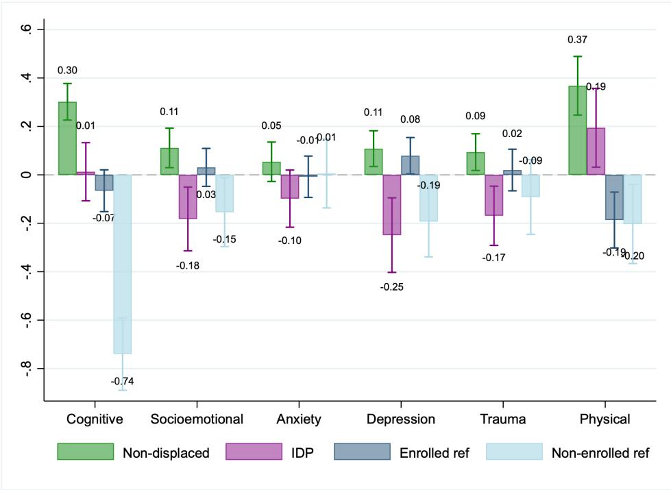

Notes. The figure displays standardized developmental gaps for children by school enrollment status. Bars represent differences in mean outcomes between displaced and non-displaced children within each enrollment group. Outcomes include cognitive (PPVT), socioemotional (SDQ), anxiety, depression, trauma (TSCYC), and physical health (BMI), all standardized using the pooled mean and standard deviation from Wave 1 of the VenRePs-Kids survey.

School enrollment status distinguishes between children who are currently enrolled in formal education and those who are not. Differences are interpreted as unconditional gaps and do not include additional covariate adjustments.

Table D.13. Developmental Gaps by School Enrollment - Peabody (PPVT)

<table><tr><td></td><td>(1)</td><td>(2)</td><td>(3)</td><td>(4)</td></tr><tr><td>IDP</td><td>-0.29***(0.074)</td><td>-0.23***(0.074)</td><td>-0.16**(0.077)</td><td>-0.13*(0.078)</td></tr><tr><td>Enrolled ref</td><td>-0.37***(0.061)</td><td>-0.37***(0.059)</td><td>-0.22***(0.068)</td><td>-0.20***(0.069)</td></tr><tr><td>Non-enrolled ref</td><td>-1.04***(0.090)</td><td>-0.97***(0.088)</td><td>-0.78***(0.098)</td><td>-0.76***(0.099)</td></tr><tr><td>Constant</td><td>0.30***(0.039)</td><td>-0.23(0.164)</td><td>-0.17(0.164)</td><td>-0.19(0.167)</td></tr><tr><td>Controls</td><td>No</td><td>Yes</td><td>Yes</td><td>Yes</td></tr><tr><td>Wealth index</td><td>No</td><td>No</td><td>Yes</td><td>No</td></tr><tr><td>Wealth index ≤ 5</td><td>No</td><td>No</td><td>No</td><td>Yes</td></tr><tr><td>p-value: IDP = Enrolled ref</td><td>0.315</td><td>0.070</td><td>0.445</td><td>0.382</td></tr><tr><td>p-value: IDP = Non-enrolled ref</td><td>0.000</td><td>0.000</td><td>0.000</td><td>0.000</td></tr><tr><td>p-value: Enrolled ref = Non-enrolled ref</td><td>0.000</td><td>0.000</td><td>0.000</td><td>0.000</td></tr><tr><td>Observations</td><td>1453</td><td>1449</td><td>1449</td><td>1417</td></tr></table>

Hypothesis tests are two-sided.  
Standard errors in parentheses.

$$
^ {*} p <   0. 1 0, ^ {* *} p <   0. \dot {0} 5, ^ {* * *} p <   0. 0 1
$$

Notes. The dependent variable is the Peabody Picture Vocabulary Test (PPVT) score, a measure of receptive vocabulary standardized using the pooled mean and standard deviation from Wave 1 of the VenRePs-Kids survey. The omitted reference category is non-displaced Colombian children. IDP refers to Colombian internally displaced persons displaced by armed conflict. Enrolled ref refers to Venezuelan refugee children currently enrolled in school. Non-enrolled ref refers to Venezuelan refugee children not enrolled in school. Column (1) includes only displacement group indicators. Columns (2)-(4) include controls for child gender, child age, and maximum education level within the household. Column (3) additionally controls for the post-migration household wealth index. Column (4) restricts the wealth index to households with a score of five or below. Standard errors clustered at the household level are reported in parentheses. The p-value rows report tests of equality between coefficients: IDP = Enrolled ref, IDP = Non-enrolled ref, and Enrolled ref = Non-enrolled ref. All hypothesis tests are two-sided. \*p < 0.10, \*\*p < 0.05, \*\*\*p < 0.01.

Table D.14. Developmental Gaps by School Enrollment - SDQ

<table><tr><td></td><td>(1)</td><td>(2)</td><td>(3)</td><td>(4)</td></tr><tr><td>IDP</td><td>-0.29***(0.083)</td><td>-0.28***(0.084)</td><td>-0.21**(0.085)</td><td>-0.22**(0.088)</td></tr><tr><td>Enrolled ref</td><td>-0.08(0.061)</td><td>-0.08(0.060)</td><td>0.06(0.070)</td><td>0.06(0.071)</td></tr><tr><td>Non-enrolled ref</td><td>-0.27***(0.087)</td><td>-0.26***(0.088)</td><td>-0.09(0.095)</td><td>-0.09(0.096)</td></tr><tr><td>Constant</td><td>0.11**(0.044)</td><td>0.29*(0.158)</td><td>0.35**(0.159)</td><td>0.34**(0.162)</td></tr><tr><td>Controls</td><td>No</td><td>Yes</td><td>Yes</td><td>Yes</td></tr><tr><td>Wealth index</td><td>No</td><td>No</td><td>Yes</td><td>No</td></tr><tr><td>Wealth index ≤ 5</td><td>No</td><td>No</td><td>No</td><td>Yes</td></tr><tr><td>p-value: IDP = Enrolled ref</td><td>0.010</td><td>0.015</td><td>0.001</td><td>0.001</td></tr><tr><td>p-value: IDP = Non-enrolled ref</td><td>0.785</td><td>0.841</td><td>0.227</td><td>0.207</td></tr><tr><td>p-value: Enrolled ref = Non-enrolled ref</td><td>0.030</td><td>0.035</td><td>0.079</td><td>0.084</td></tr><tr><td>Observations</td><td>1579</td><td>1575</td><td>1574</td><td>1537</td></tr></table>

Hypothesis tests are two-sided.  
Standard errors in parentheses.

$$
^ {*} p <   0. 1 0, ^ {* *} p <   0. \dot {0} 5, ^ {* * *} p <   0. 0 1
$$

Notes. The dependent variable is the Strengths and Difficulties Questionnaire (SDQ) total difficulties score, aggregating emotional symptoms, conduct problems, hyperactivity, and peer difficulties. Higher values indicate greater socioemotional difficulties. All outcomes are standardized using the pooled mean and standard deviation from Wave 1 of the VenRePs-Kids survey. The omitted reference category is non-displaced Colombian children. IDP refers to Colombian internally displaced persons displaced by armed conflict. Enrolled ref refers to Venezuelan refugee children currently enrolled in school. Non-enrolled ref refers to Venezuelan refugee children not enrolled in school. Column (1) includes only displacement group indicators. Columns (2)-(4) include controls for child gender, child age, and maximum education level within the household. Column (3) additionally controls for the post-migration household wealth index. Column (4) restricts the wealth index to households with a score of five or below. Standard errors clustered at the household level are reported in parentheses. The p-value rows report tests of equality between coefficients: IDP = Enrolled ref, IDP = Non-enrolled ref, and Enrolled ref = Non-enrolled ref. All hypothesis tests are two-sided. \*p < 0.10, \*\*p < 0.05, \*\*\*p < 0.01.

Table D.15. Developmental Gaps by School Enrollment - Anxiety

<table><tr><td></td><td>(1)</td><td>(2)</td><td>(3)</td><td>(4)</td></tr><tr><td>IDP</td><td>-0.15**(0.078)</td><td>-0.13*(0.077)</td><td>-0.09(0.078)</td><td>-0.10(0.082)</td></tr><tr><td>Enrolled ref</td><td>-0.06(0.065)</td><td>-0.06(0.064)</td><td>0.01(0.075)</td><td>0.01(0.076)</td></tr><tr><td>Non-enrolled ref</td><td>-0.05(0.089)</td><td>-0.02(0.090)</td><td>0.07(0.099)</td><td>0.07(0.100)</td></tr><tr><td>Constant</td><td>0.05(0.043)</td><td>-0.34**(0.157)</td><td>-0.32**(0.159)</td><td>-0.34**(0.163)</td></tr><tr><td>Controls</td><td>No</td><td>Yes</td><td>Yes</td><td>Yes</td></tr><tr><td>Wealth index</td><td>No</td><td>No</td><td>Yes</td><td>No</td></tr><tr><td>Wealth index ≤ 5</td><td>No</td><td>No</td><td>No</td><td>Yes</td></tr><tr><td>p-value: IDP = Enrolled ref</td><td>0.260</td><td>0.413</td><td>0.208</td><td>0.219</td></tr><tr><td>p-value: IDP = Non-enrolled ref</td><td>0.303</td><td>0.298</td><td>0.120</td><td>0.117</td></tr><tr><td>p-value: Enrolled ref = Non-enrolled ref</td><td>0.884</td><td>0.674</td><td>0.543</td><td>0.516</td></tr><tr><td>Observations</td><td>1573</td><td>1569</td><td>1568</td><td>1531</td></tr></table>

Hypothesis tests are two-sided.  
Standard errors in parentheses.  
\* $p < {0.10}, *  * p < {0.05}, *  *  * p < {0.01}$

Notes. The dependent variable is the Anxiety subscale of the Trauma Symptom Checklist for Young Children (TSCYC), a caregiver-reported measure of anxiety symptoms. Higher values indicate greater anxiety symptoms. All outcomes are standardized using the pooled mean and standard deviation from Wave 1 of the VenRePs-Kids survey. The omitted reference category is non-displaced Colombian children. IDP refers to Colombian internally displaced persons displaced by armed conflict. Enrolled ref refers to Venezuelan refugee children currently enrolled in school. Non-enrolled ref refers to Venezuelan refugee children not enrolled in school. Column (1) includes only displacement group indicators. Columns (2)-(4) include controls for child gender, child age, and maximum education level within the household. Column (3) additionally controls for the post-migration household wealth index. Column (4) restricts the wealth index to households with a score of five or below. Standard errors clustered at the household level are reported in parentheses. The p-value rows report tests of equality between coefficients: IDP = Enrolled ref, IDP = Non-enrolled ref, and Enrolled ref = Non-enrolled ref. All hypothesis tests are two-sided. $^{*}p < 0.10$ , $^{**}p < 0.05$ , $^{***}p < 0.01$ .

Table D.16. Developmental Gaps by School Enrollment - Depression

<table><tr><td></td><td>(1)</td><td>(2)</td><td>(3)</td><td>(4)</td></tr><tr><td>IDP</td><td>-0.36***(0.092)</td><td>-0.33***(0.091)</td><td>-0.26***(0.087)</td><td>-0.26***(0.090)</td></tr><tr><td>Enrolled ref</td><td>-0.03(0.057)</td><td>-0.03(0.057)</td><td>0.09(0.067)</td><td>0.09(0.067)</td></tr><tr><td>Non-enrolled ref</td><td>-0.30***(0.089)</td><td>-0.27***(0.091)</td><td>-0.12(0.098)</td><td>-0.12(0.099)</td></tr><tr><td>Constant</td><td>0.11***(0.039)</td><td>-0.21(0.159)</td><td>-0.14(0.157)</td><td>-0.12(0.160)</td></tr><tr><td>Controls</td><td>No</td><td>Yes</td><td>Yes</td><td>Yes</td></tr><tr><td>Wealth index</td><td>No</td><td>No</td><td>Yes</td><td>No</td></tr><tr><td>Wealth index ≤ 5</td><td>No</td><td>No</td><td>No</td><td>Yes</td></tr><tr><td>p-value: IDP = Enrolled ref</td><td>0.001</td><td>0.002</td><td>0.000</td><td>0.000</td></tr><tr><td>p-value: IDP = Non-enrolled ref</td><td>0.628</td><td>0.644</td><td>0.276</td><td>0.236</td></tr><tr><td>p-value: Enrolled ref = Non-enrolled ref</td><td>0.003</td><td>0.010</td><td>0.020</td><td>0.023</td></tr><tr><td>Observations</td><td>1573</td><td>1569</td><td>1568</td><td>1531</td></tr></table>

Hypothesis tests are two-sided.  
Standard errors in parentheses.

$$
^ {*} p <   0. 1 0, ^ {* *} p <   0. \dot {0} 5, ^ {* * *} p <   0. 0 1
$$

Notes. The dependent variable is the Depression subscale of the Trauma Symptom Checklist for Young Children (TSCYC), a caregiver-reported measure of depressive symptoms. Higher values indicate greater depressive symptoms. All outcomes are standardized using the pooled mean and standard deviation from Wave 1 of the VenRePs-Kids survey. The omitted reference category is non-displaced Colombian children. IDP refers to Colombian internally displaced persons displaced by armed conflict. Enrolled ref refers to Venezuelan refugee children currently enrolled in school. Non-enrolled ref refers to Venezuelan refugee children not enrolled in school. Column (1) includes only displacement group indicators. Columns (2)-(4) include controls for child gender, child age, and maximum education level within the household. Column (3) additionally controls for the post-migration household wealth index. Column (4) restricts the wealth index to households with a score of five or below. Standard errors clustered at the household level are reported in parentheses. The p-value rows report tests of equality between coefficients: IDP = Enrolled ref, IDP = Non-enrolled ref, and Enrolled ref = Non-enrolled ref. All hypothesis tests are two-sided. \*p < 0.10, \*\*p < 0.05, \*\*\*p < 0.01.

Table D.17. Developmental Gaps by School Enrollment - Trauma

<table><tr><td></td><td>(1)</td><td>(2)</td><td>(3)</td><td>(4)</td></tr><tr><td>IDP</td><td>-0.26***(0.078)</td><td>-0.24***(0.078)</td><td>-0.18**(0.079)</td><td>-0.17**(0.082)</td></tr><tr><td>Enrolled ref</td><td>-0.07(0.065)</td><td>-0.07(0.064)</td><td>0.03(0.073)</td><td>0.04(0.074)</td></tr><tr><td>Non-enrolled ref</td><td>-0.19*(0.097)</td><td>-0.17*(0.098)</td><td>-0.04(0.104)</td><td>-0.02(0.105)</td></tr><tr><td>Constant</td><td>0.09**(0.041)</td><td>-0.23(0.165)</td><td>-0.18(0.168)</td><td>-0.19(0.171)</td></tr><tr><td>Controls</td><td>No</td><td>Yes</td><td>Yes</td><td>Yes</td></tr><tr><td>Wealth index</td><td>No</td><td>No</td><td>Yes</td><td>No</td></tr><tr><td>Wealth index ≤ 5</td><td>No</td><td>No</td><td>No</td><td>Yes</td></tr><tr><td>p-value: IDP = Enrolled ref</td><td>0.025</td><td>0.056</td><td>0.017</td><td>0.019</td></tr><tr><td>p-value: IDP = Non-enrolled ref</td><td>0.486</td><td>0.537</td><td>0.220</td><td>0.187</td></tr><tr><td>p-value: Enrolled ref = Non-enrolled ref</td><td>0.273</td><td>0.363</td><td>0.482</td><td>0.561</td></tr><tr><td>Observations</td><td>1573</td><td>1569</td><td>1568</td><td>1531</td></tr></table>

Hypothesis tests are two-sided.  
Standard errors in parentheses.

$$
^ {*} p <   0. 1 0, ^ {* *} p <   0. \dot {0} 5, ^ {* * *} p <   0. 0 1
$$

Notes. The dependent variable is the Posttraumatic Stress Total score (PTS Total) from the Trauma Symptom Checklist for Young Children (TSCYC), a caregiver-reported measure of posttraumatic stress symptoms combining intrusion, avoidance, and arousal subscales. Higher values indicate greater trauma symptoms. All outcomes are standardized using the pooled mean and standard deviation from Wave 1 of the VenRePs-Kids survey. The omitted reference category is non-displaced Colombian children. IDP refers to Colombian internally displaced persons displaced by armed conflict. Enrolled ref refers to Venezuelan refugee children currently enrolled in school. Non-enrolled ref refers to Venezuelan refugee children not enrolled in school. Column (1) includes only displacement group indicators. Columns (2)-(4) include controls for child gender, child age, and maximum education level within the household. Column (3) additionally controls for the post-migration household wealth index. Column (4) restricts the wealth index to households with a score of five or below. Standard errors clustered at the household level are reported in parentheses. The p-value rows report tests of equality between coefficients: IDP = Enrolled ref, IDP = Non-enrolled ref, and Enrolled ref = Non-enrolled ref. All hypothesis tests are two-sided. \*p < 0.10, \*\*p < 0.05, \*\*\*p < 0.01.

Table D.18. Developmental Gaps by School Enrollment - BMI

<table><tr><td></td><td>(1)</td><td>(2)</td><td>(3)</td><td>(4)</td></tr><tr><td>IDP</td><td>-0.17(0.106)</td><td>-0.18(0.108)</td><td>-0.15(0.110)</td><td>-0.11(0.114)</td></tr><tr><td>Enrolled ref</td><td>-0.55***(0.089)</td><td>-0.56***(0.089)</td><td>-0.50***(0.104)</td><td>-0.48***(0.105)</td></tr><tr><td>Non-enrolled ref</td><td>-0.57***(0.108)</td><td>-0.57***(0.112)</td><td>-0.50***(0.130)</td><td>-0.46***(0.132)</td></tr><tr><td>Constant</td><td>0.37***(0.064)</td><td>0.34(0.217)</td><td>0.36*(0.218)</td><td>0.36(0.221)</td></tr><tr><td>Controls</td><td>No</td><td>Yes</td><td>Yes</td><td>Yes</td></tr><tr><td>Wealth index</td><td>No</td><td>No</td><td>Yes</td><td>No</td></tr><tr><td>Wealth index ≤ 5</td><td>No</td><td>No</td><td>No</td><td>Yes</td></tr><tr><td>p-value: IDP = Enrolled ref</td><td>0.000</td><td>0.000</td><td>0.001</td><td>0.001</td></tr><tr><td>p-value: IDP = Non-enrolled ref</td><td>0.001</td><td>0.001</td><td>0.007</td><td>0.007</td></tr><tr><td>p-value: Enrolled ref = Non-enrolled ref</td><td>0.880</td><td>0.928</td><td>0.982</td><td>0.861</td></tr><tr><td>Observations</td><td>1546</td><td>1542</td><td>1541</td><td>1507</td></tr></table>

Hypothesis tests are two-sided.  
Standard errors in parentheses.  
\* $p < {0.10}, *  * p < {0.05}, *  *  * p < {0.01}$  
Notes. The dependent variable is Body Mass Index (BMI), calculated as weight in kilograms divided by height in meters squared, following the standard definition of the World Health Organization (WHO). BMI is used as an indicator of nutritional status and overall physical health. All outcomes are standardized using the pooled mean and standard deviation from Wave 1 of the VenRePs-Kids survey. The omitted reference category is non-displaced Colombian children. IDP refers to Colombian internally displaced persons due to armed conflict. Enrolled ref refers to Venezuelan refugee children currently enrolled in school, while Non-enrolled ref refers to Venezuelan refugee children not enrolled in school. Column (1) includes only displacement group indicators. Columns (2)–(4) include controls for child gender, child age, and the maximum education level within the household. Column (3) additionally controls for the post-migration household wealth index. Column (4) restricts the sample to households with a wealth index of five or below, effectively truncating the upper tail of the wealth distribution. Standard errors clustered at the household level are reported in parentheses. The p-value rows report tests of equality between coefficients: IDP = Enrolled ref, IDP = Non-enrolled ref, and Enrolled ref = Non-enrolled ref. All hypothesis tests are two-sided. \*p < 0.10, \*\*p < 0.05, \*\*\*p < 0.01.

## D.4 Developmental gaps by health insurance access

Figure D.3 displays developmental gaps stratified by health insurance coverage. Tables D.19–D.24 report full regression results, estimated in levels (level-level). This analysis tests whether health insurance access is associated with narrower developmental gaps, particularly in physical health measures like BMI.

Figure D.3. Developmental Gaps by Health Insurance Access  
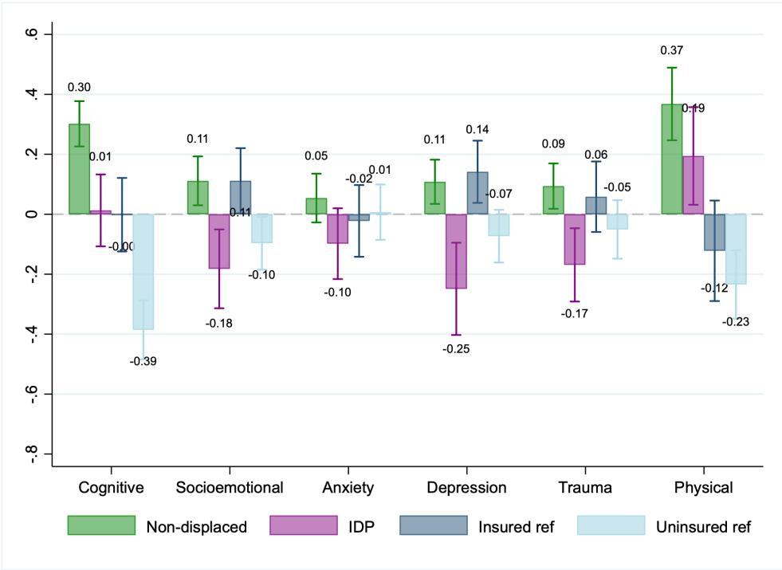

Notes. The figure displays standardized developmental gaps for children by health insurance coverage status. Bars represent differences in mean outcomes between displaced and non-displaced children within each insurance group. Health insurance access distinguishes between children who are covered by any form of health insurance and those without coverage. Outcomes include cognitive (PPVT), socioemotional (SDQ), anxiety, depression, trauma (TSCYC), and physical health (BMI), all standardized using the pooled mean and standard deviation from Wave 1 of the VenRePs-Kids survey. Differences are interpreted as unconditional gaps and do not adjust for covariates.

Table D.19. Developmental Gaps by Health Insurance - Peabody (PPVT)

<table><tr><td></td><td>(1)</td><td>(2)</td><td>(3)</td><td>(4)</td></tr><tr><td>IDP</td><td>-0.29***(0.074)</td><td>-0.22***(0.074)</td><td>-0.15*(0.077)</td><td>-0.12(0.078)</td></tr><tr><td>Insured refugee</td><td>-0.30***(0.078)</td><td>-0.33***(0.075)</td><td>-0.18**(0.080)</td><td>-0.16**(0.080)</td></tr><tr><td>Uninsured refugee</td><td>-0.69***(0.066)</td><td>-0.64***(0.064)</td><td>-0.46***(0.078)</td><td>-0.44***(0.079)</td></tr><tr><td>Constant</td><td>0.30***(0.039)</td><td>-0.39**(0.163)</td><td>-0.32**(0.165)</td><td>-0.34**(0.168)</td></tr><tr><td>Controls</td><td>No</td><td>Yes</td><td>Yes</td><td>Yes</td></tr><tr><td>Wealth index</td><td>No</td><td>No</td><td>Yes</td><td>No</td></tr><tr><td>Wealth index ≤ 5</td><td>No</td><td>No</td><td>No</td><td>Yes</td></tr><tr><td>p-value: IDP = Insured refugee</td><td>0.875</td><td>0.259</td><td>0.756</td><td>0.661</td></tr><tr><td>p-value: IDP = Uninsured refugee</td><td>0.000</td><td>0.000</td><td>0.000</td><td>0.000</td></tr><tr><td>p-value: Insured refugee = Uninsured refugee</td><td>0.000</td><td>0.000</td><td>0.000</td><td>0.001</td></tr><tr><td>Observations</td><td>1453</td><td>1449</td><td>1449</td><td>1417</td></tr></table>

Hypothesis tests are two-sided.  
Standard errors in parentheses.  
\* $p < {0.10}, *  * p < {0.05}, *  *  * p < {0.01}$

Notes. The dependent variable is the Peabody Picture Vocabulary Test (PPVT) score, a measure of receptive vocabulary standardized using the pooled mean and standard deviation from Wave 1 of the VenRePs-Kids survey. The omitted reference category is non-displaced Colombian children. IDP refers to Colombian internally displaced persons displaced by armed conflict. Health insurance ref refers to Venezuelan refugee children with access to health insurance. No health insurance ref refers to Venezuelan refugee children without access to health insurance. Column (1) includes only displacement group indicators. Columns (2)-(4) include controls for child gender, child age, and maximum education level within the household. Column (3) additionally controls for the post-migration household wealth index. Column (4) restricts the wealth index to households with a score of five or below. Standard errors clustered at the household level are reported in parentheses. The p-value rows report tests of equality between coefficients: IDP = Health insurance ref, IDP = No health insurance ref, and Health insurance ref = No health insurance ref. All hypothesis tests are two-sided. \*p < 0.10, \*\*p < 0.05, \*\*\*p < 0.01.

Table D.20. Developmental Gaps by Health Insurance - SDQ

<table><tr><td></td><td>(1)</td><td>(2)</td><td>(3)</td><td>(4)</td></tr><tr><td>IDP</td><td>-0.29***(0.083)</td><td>-0.28***(0.084)</td><td>-0.21**(0.085)</td><td>-0.22**(0.088)</td></tr><tr><td>Insured refugee</td><td>0.00(0.072)</td><td>-0.01(0.072)</td><td>0.13(0.079)</td><td>0.12(0.080)</td></tr><tr><td>Uninsured refugee</td><td>-0.21***(0.065)</td><td>-0.20***(0.064)</td><td>-0.04(0.074)</td><td>-0.04(0.075)</td></tr><tr><td>Constant</td><td>0.11**(0.044)</td><td>0.26*(0.154)</td><td>0.33**(0.155)</td><td>0.32**(0.157)</td></tr><tr><td>Controls</td><td>No</td><td>Yes</td><td>Yes</td><td>Yes</td></tr><tr><td>Wealth index</td><td>No</td><td>No</td><td>Yes</td><td>No</td></tr><tr><td>Wealth index ≤ 5</td><td>No</td><td>No</td><td>No</td><td>Yes</td></tr><tr><td>p-value: IDP = Insured refugee</td><td>0.001</td><td>0.003</td><td>0.000</td><td>0.000</td></tr><tr><td>p-value: IDP = Uninsured refugee</td><td>0.314</td><td>0.329</td><td>0.046</td><td>0.042</td></tr><tr><td>p-value: Insured refugee = Uninsured refugee</td><td>0.005</td><td>0.009</td><td>0.024</td><td>0.026</td></tr><tr><td>Observations</td><td>1579</td><td>1575</td><td>1574</td><td>1537</td></tr></table>

Hypothesis tests are two-sided.  
Standard errors in parentheses.  
\* $p < {0.10}, *  * p < {0.05}, *  *  * p < {0.01}$

Notes. The dependent variable is the Strengths and Difficulties Questionnaire (SDQ) total difficulties score, aggregating emotional symptoms, conduct problems, hyperactivity, and peer difficulties. Higher values indicate greater socioemotional difficulties. All outcomes are standardized using the pooled mean and standard deviation from Wave 1 of the VenRePs-Kids survey. The omitted reference category is non-displaced Colombian children. IDP refers to Colombian internally displaced persons displaced by armed conflict. Health insurance ref refers to Venezuelan refugee children with access to health insurance. No health insurance ref refers to Venezuelan refugee children without access to health insurance. Column (1) includes only displacement group indicators. Columns (2)-(4) include controls for child gender, child age, and maximum education level within the household. Column (3) additionally controls for the post-migration household wealth index. Column (4) restricts the wealth index to households with a score of five or below. Standard errors clustered at the household level are reported in parentheses. The p-value rows report tests of equality between coefficients: IDP = Health insurance ref, IDP = No health insurance ref, and Health insurance ref = No health insurance ref. All hypothesis tests are two-sided. \*p < 0.10, \*\*p < 0.05, \*\*\*p < 0.01.

Table D.21. Developmental Gaps by Health Insurance - Anxiety

<table><tr><td></td><td>(1)</td><td>(2)</td><td>(3)</td><td>(4)</td></tr><tr><td>IDP</td><td>-0.15**(0.078)</td><td>-0.13*(0.077)</td><td>-0.09(0.078)</td><td>-0.10(0.081)</td></tr><tr><td>Insured refugee</td><td>-0.08(0.078)</td><td>-0.08(0.078)</td><td>-0.01(0.087)</td><td>-0.02(0.088)</td></tr><tr><td>Uninsured refugee</td><td>-0.05(0.068)</td><td>-0.03(0.067)</td><td>0.05(0.078)</td><td>0.05(0.080)</td></tr><tr><td>Constant</td><td>0.05(0.043)</td><td>-0.33**(0.154)</td><td>-0.30*(0.156)</td><td>-0.33**(0.159)</td></tr><tr><td>Controls</td><td>No</td><td>Yes</td><td>Yes</td><td>Yes</td></tr><tr><td>Wealth index</td><td>No</td><td>No</td><td>Yes</td><td>No</td></tr><tr><td>Wealth index ≤ 5</td><td>No</td><td>No</td><td>No</td><td>Yes</td></tr><tr><td>p-value: IDP = Insured refugee</td><td>0.407</td><td>0.604</td><td>0.379</td><td>0.394</td></tr><tr><td>p-value: IDP = Uninsured refugee</td><td>0.207</td><td>0.257</td><td>0.097</td><td>0.098</td></tr><tr><td>p-value: Insured refugee = Uninsured refugee</td><td>0.725</td><td>0.583</td><td>0.477</td><td>0.460</td></tr><tr><td>Observations</td><td>1573</td><td>1569</td><td>1568</td><td>1531</td></tr></table>

Hypothesis tests are two-sided.  
Standard errors in parentheses.  
\* $p < {0.10}, *  * p < {0.05}, *  *  * p < {0.01}$

Notes. The dependent variable is the Anxiety subscale of the Trauma Symptom Checklist for Young Children (TSCYC), a caregiver-reported measure of anxiety symptoms. Higher values indicate greater anxiety symptoms. All outcomes are standardized using the pooled mean and standard deviation from Wave 1 of the VenRePs-Kids survey. The omitted reference category is non-displaced Colombian children. IDP refers to Colombian internally displaced persons displaced by armed conflict. Health insurance ref refers to Venezuelan refugee children with access to health insurance. No health insurance ref refers to Venezuelan refugee children without access to health insurance. Column (1) includes only displacement group indicators. Columns (2)-(4) include controls for child gender, child age, and maximum education level within the household. Column (3) additionally controls for the post-migration household wealth index. Column (4) restricts the wealth index to households with a score of five or below. Standard errors clustered at the household level are reported in parentheses. The p-value rows report tests of equality between coefficients: IDP = Health insurance ref, IDP = No health insurance ref, and Health insurance ref = No health insurance ref. All hypothesis tests are two-sided. \*p < 0.10, \*\*p < 0.05, \*\*\*p < 0.01.

Table D.22. Developmental Gaps by Health Insurance - Depression

<table><tr><td></td><td>(1)</td><td>(2)</td><td>(3)</td><td>(4)</td></tr><tr><td>IDP</td><td>-0.36***(0.092)</td><td>-0.33***(0.091)</td><td>-0.25***(0.087)</td><td>-0.26***(0.090)</td></tr><tr><td>Insured refugee</td><td>0.03(0.069)</td><td>0.03(0.069)</td><td>0.15*(0.078)</td><td>0.15*(0.078)</td></tr><tr><td>Uninsured refugee</td><td>-0.18***(0.062)</td><td>-0.17***(0.061)</td><td>-0.03(0.071)</td><td>-0.02(0.071)</td></tr><tr><td>Constant</td><td>0.11***(0.039)</td><td>-0.26*(0.153)</td><td>-0.19(0.152)</td><td>-0.17(0.154)</td></tr><tr><td>Controls</td><td>No</td><td>Yes</td><td>Yes</td><td>Yes</td></tr><tr><td>Wealth index</td><td>No</td><td>No</td><td>Yes</td><td>No</td></tr><tr><td>Wealth index ≤ 5</td><td>No</td><td>No</td><td>No</td><td>Yes</td></tr><tr><td>p-value: IDP = Insured refugee</td><td>0.000</td><td>0.001</td><td>0.000</td><td>0.000</td></tr><tr><td>p-value: IDP = Uninsured refugee</td><td>0.070</td><td>0.101</td><td>0.026</td><td>0.021</td></tr><tr><td>p-value: Insured refugee = Uninsured refugee</td><td>0.004</td><td>0.008</td><td>0.018</td><td>0.021</td></tr><tr><td>Observations</td><td>1573</td><td>1569</td><td>1568</td><td>1531</td></tr></table>

Hypothesis tests are two-sided.  
Standard errors in parentheses.  
\* $p < {0.10}, *  * p < {0.05}, *  *  * p < {0.01}$

Notes. The dependent variable is the Depression subscale of the Trauma Symptom Checklist for Young Children (TSCYC), a caregiver-reported measure of depressive symptoms. Higher values indicate greater depressive symptoms. All outcomes are standardized using the pooled mean and standard deviation from Wave 1 of the VenRePs-Kids survey. The omitted reference category is non-displaced Colombian children. IDP refers to Colombian internally displaced persons displaced by armed conflict. Health insurance ref refers to Venezuelan refugee children with access to health insurance. No health insurance ref refers to Venezuelan refugee children without access to health insurance. Column (1) includes only displacement group indicators. Columns (2)-(4) include controls for child gender, child age, and maximum education level within the household. Column (3) additionally controls for the post-migration household wealth index. Column (4) restricts the wealth index to households with a score of five or below. Standard errors clustered at the household level are reported in parentheses. The p-value rows report tests of equality between coefficients: IDP = Health insurance ref, IDP = No health insurance ref, and Health insurance ref = No health insurance ref. All hypothesis tests are two-sided. \*p < 0.10, \*\*p < 0.05, \*\*\*p < 0.01.

Table D.23. Developmental Gaps by Health Insurance -Trauma

<table><tr><td></td><td>(1)</td><td>(2)</td><td>(3)</td><td>(4)</td></tr><tr><td>IDP</td><td>-0.26***(0.078)</td><td>-0.24***(0.078)</td><td>-0.18**(0.079)</td><td>-0.17**(0.082)</td></tr><tr><td>Insured refugee</td><td>-0.04(0.079)</td><td>-0.04(0.078)</td><td>0.06(0.084)</td><td>0.06(0.085)</td></tr><tr><td>Uninsured refugee</td><td>-0.14**(0.070)</td><td>-0.13*(0.069)</td><td>-0.02(0.079)</td><td>-0.00(0.080)</td></tr><tr><td>Constant</td><td>0.09**(0.041)</td><td>-0.24(0.160)</td><td>-0.19(0.163)</td><td>-0.20(0.166)</td></tr><tr><td>Controls</td><td>No</td><td>Yes</td><td>Yes</td><td>Yes</td></tr><tr><td>Wealth index</td><td>No</td><td>No</td><td>Yes</td><td>No</td></tr><tr><td>Wealth index ≤ 5</td><td>No</td><td>No</td><td>No</td><td>Yes</td></tr><tr><td>p-value: IDP = Insured refugee</td><td>0.017</td><td>0.041</td><td>0.015</td><td>0.018</td></tr><tr><td>p-value: IDP = Uninsured refugee</td><td>0.179</td><td>0.243</td><td>0.074</td><td>0.066</td></tr><tr><td>p-value: Insured refugee = Uninsured refugee</td><td>0.210</td><td>0.274</td><td>0.375</td><td>0.439</td></tr><tr><td>Observations</td><td>1573</td><td>1569</td><td>1568</td><td>1531</td></tr></table>

Hypothesis tests are two-sided.  
Standard errors in parentheses.  
\* $p < {0.10}, *  * p < {0.05}, *  *  * p < {0.01}$

Notes. The dependent variable is the Posttraumatic Stress Total score (PTS Total) from the Trauma Symptom Checklist for Young Children (TSCYC), a caregiver-reported measure of posttraumatic stress symptoms combining intrusion, avoidance, and arousal subscales. Higher values indicate greater trauma symptoms. All outcomes are standardized using the pooled mean and standard deviation from Wave 1 of the VenRePs-Kids survey. The omitted reference category is non-displaced Colombian children. IDP refers to Colombian internally displaced persons displaced by armed conflict. Health insurance ref refers to Venezuelan refugee children with access to health insurance. No health insurance ref refers to Venezuelan refugee children without access to health insurance. Column (1) includes only displacement group indicators. Columns (2)-(4) include controls for child gender, child age, and maximum education level within the household. Column (3) additionally controls for the post-migration household wealth index. Column (4) restricts the wealth index to households with a score of five or below. Standard errors clustered at the household level are reported in parentheses. The p-value rows report tests of equality between coefficients: IDP = Health insurance ref, IDP = No health insurance ref, and Health insurance ref = No health insurance ref. All hypothesis tests are two-sided. \*p < 0.10, \*\*p < 0.05, \*\*\*p < 0.01.

Table D.24. Developmental Gaps by Health Insurance - BMI

<table><tr><td></td><td>(1)</td><td>(2)</td><td>(3)</td><td>(4)</td></tr><tr><td>IDP</td><td>-0.17(0.106)</td><td>-0.18(0.108)</td><td>-0.15(0.110)</td><td>-0.11(0.114)</td></tr><tr><td>Insured refugee</td><td>-0.49***(0.109)</td><td>-0.50***(0.109)</td><td>-0.45***(0.122)</td><td>-0.43***(0.123)</td></tr><tr><td>Uninsured refugee</td><td>-0.60***(0.088)</td><td>-0.60***(0.090)</td><td>-0.55***(0.106)</td><td>-0.51***(0.107)</td></tr><tr><td>Constant</td><td>0.37***(0.064)</td><td>0.35*(0.215)</td><td>0.38*(0.216)</td><td>0.37*(0.219)</td></tr><tr><td>Controls</td><td>No</td><td>Yes</td><td>Yes</td><td>Yes</td></tr><tr><td>Wealth index</td><td>No</td><td>No</td><td>Yes</td><td>No</td></tr><tr><td>Wealth index ≤ 5</td><td>No</td><td>No</td><td>No</td><td>Yes</td></tr><tr><td>p-value: IDP = Insured refugee</td><td>0.010</td><td>0.010</td><td>0.022</td><td>0.015</td></tr><tr><td>p-value: IDP = Uninsured refugee</td><td>0.000</td><td>0.000</td><td>0.000</td><td>0.000</td></tr><tr><td>p-value: Insured refugee = Uninsured refugee</td><td>0.293</td><td>0.322</td><td>0.362</td><td>0.423</td></tr><tr><td>Observations</td><td>1546</td><td>1542</td><td>1541</td><td>1507</td></tr></table>

Hypothesis tests are two-sided.  
Standard errors in parentheses.

$$
^ {*} p <   0. 1 0, ^ {* *} p <   0. \dot {0} 5, ^ {* * *} p <   0. 0 1
$$

Notes. The dependent variable is Body Mass Index (BMI), calculated as weight in kilograms divided by height in meters squared, following the standard definition of the World Health Organization (WHO). BMI is used as an indicator of nutritional status and overall physical health. All outcomes are standardized using the pooled mean and standard deviation from Wave 1 of the VenRePs-Kids survey. The omitted reference category is non-displaced Colombian children. IDP refers to Colombian internally displaced persons due to armed conflict. Health insurance ref refers to Venezuelan refugee children with access to health insurance, while No health insurance ref refers to Venezuelan refugee children without access to health insurance. Column (1) includes only displacement group indicators. Columns (2)–(4) include controls for child gender, child age, and the maximum education level within the household. Column (3) additionally controls for the post-migration household wealth index. Column (4) restricts the sample to households with a wealth index of five or below, effectively truncating the upper tail of the wealth distribution. Standard errors clustered at the household level are reported in parentheses. The p-value rows report tests of equality between coefficients: IDP = Health insurance ref, IDP = No health insurance ref, and Health insurance ref = No health insurance ref. All hypothesis tests are two-sided. \*p < 0.10, \*\*p < 0.05, \*\*\*p < 0.01.

## D.5 Rank-rank regressions by regularization status

Table D.25 reports rank-rank regressions separately for Venezuelan refugee children with and without legal residence, testing whether the intergenerational wealth-outcome association differs by regularization status.

Table D.25. Developmental Gradients by Regularization

<table><tr><td></td><td>(1) Cognitive</td><td>(2) Socioemotional</td><td>(3) Anxiety</td><td>(4) Depression</td><td>(5) Trauma</td><td>(6) Physical</td></tr><tr><td>IDP</td><td>-10.41**(5.075)</td><td>-4.19(5.367)</td><td>-2.01(5.835)</td><td>-11.77*(6.618)</td><td>-7.58(5.658)</td><td>-0.42(5.296)</td></tr><tr><td>Regular ref</td><td>-13.70***(4.325)</td><td>0.53(4.381)</td><td>5.74(4.996)</td><td>-1.79(5.582)</td><td>3.36(4.989)</td><td>-11.01**(4.327)</td></tr><tr><td>Irregular ref</td><td>-26.82***(4.825)</td><td>-6.59(5.265)</td><td>-4.78(5.805)</td><td>-14.28**(6.976)</td><td>-4.63(6.183)</td><td>-18.07***(5.052)</td></tr><tr><td>Wealth Index</td><td>0.14***(0.052)</td><td>0.13**(0.053)</td><td>0.11*(0.059)</td><td>0.11(0.065)</td><td>0.12**(0.059)</td><td>0.02(0.052)</td></tr><tr><td>IDP × Wealth Index</td><td>0.08(0.082)</td><td>-0.03(0.087)</td><td>-0.03(0.091)</td><td>0.09(0.105)</td><td>0.02(0.089)</td><td>-0.03(0.085)</td></tr><tr><td>Regular ref × Wealth Index</td><td>0.19**(0.074)</td><td>0.01(0.073)</td><td>-0.09(0.084)</td><td>0.11(0.092)</td><td>-0.03(0.082)</td><td>0.04(0.074)</td></tr><tr><td>Irregular ref × Wealth Index</td><td>0.13(0.123)</td><td>0.19(0.131)</td><td>0.17(0.132)</td><td>0.28*(0.164)</td><td>0.10(0.142)</td><td>0.11(0.122)</td></tr><tr><td>Constant</td><td>49.65***(3.704)</td><td>45.08***(3.757)</td><td>47.05***(4.289)</td><td>58.49***(4.728)</td><td>45.24***(4.295)</td><td>54.44***(3.720)</td></tr><tr><td>Observations</td><td>1453</td><td>1578</td><td>1572</td><td>1572</td><td>1572</td><td>1545</td></tr></table>

Notes. Each column reports estimates from a rank-rank regression of children's developmental outcomes on household wealth rank. The dependent variables are percentile ranks (0–100) of each outcome within the sample: cognitive (PPVT), socioemotional (SDQ), anxiety, depression, trauma (TSCYC), and physical health (BMI). The key independent variable is the household wealth index rank, also expressed in percentiles. The omitted reference category is non-displaced Colombian children. IDP refers to Colombian internally displaced persons displaced by armed conflict. Regular ref refers to Venezuelan refugee children with legal residence status (regularized). Irregular ref refers to Venezuelan refugee children without legal residence status (non-regularized). The coefficients on wealth index capture the gradient between household socioeconomic status and child outcomes for the reference group. Interaction terms between displacement status and wealth index allow this gradient to vary across groups. Therefore, the total wealth gradient for each group is given by the sum of the baseline wealth coefficient and the corresponding interaction term. All specifications include controls for child gender, child age, and maximum education level within the household, as well as the post-migration household wealth index. Standard errors clustered at the household level are reported in parentheses. All hypothesis tests are two-sided. \*p < 0.10, \*\*p < 0.05, \*\*\*p < 0.01.

Standard errors in parentheses
\* p < 0.10, \*\* p < 0.05, \*\*\* p < 0.01

## E Rank-Rank Relationships: Alternative Binning of the Wealth Distribution Deciles analysis of rank-rank relationships

Tables E.1 decompose the rank-rank relationships into decile bins, examining how the association between household wealth and child development varies across the distribution. All regressions are estimated in a rank-rank specification.

Table E.1. Rank-Rank by Wealth Deciles

<table><tr><td></td><td>(1) Cognitive</td><td>(2) Socioemotional</td><td>(3) Anxiety</td><td>(4) Depression</td><td>(5) Trauma</td><td>(6) Physical</td></tr><tr><td>IDP</td><td>-12.56***(4.477)</td><td>-10.45*(6.016)</td><td>-4.75(3.733)</td><td>-14.62**(6.918)</td><td>-12.03***(3.565)</td><td>-0.87(7.248)</td></tr><tr><td>Refugee</td><td>-22.55***(2.928)</td><td>-5.69(3.943)</td><td>3.61(4.756)</td><td>-10.45(7.252)</td><td>-0.42(4.240)</td><td>-14.05***(3.719)</td></tr><tr><td>Wealth index</td><td>0.11**(0.042)</td><td>0.04(0.058)</td><td>0.07*(0.033)</td><td>0.04(0.103)</td><td>0.05(0.040)</td><td>0.04(0.056)</td></tr><tr><td>IDP × Wealth index</td><td>0.11(0.069)</td><td>0.07(0.094)</td><td>0.02(0.058)</td><td>0.14(0.105)</td><td>0.09(0.059)</td><td>-0.02(0.110)</td></tr><tr><td>Refugee × Wealth index</td><td>0.32***(0.070)</td><td>0.09(0.065)</td><td>-0.09(0.129)</td><td>0.27**(0.114)</td><td>-0.02(0.106)</td><td>0.11(0.076)</td></tr><tr><td>Constant</td><td>52.00***(2.426)</td><td>50.66***(3.625)</td><td>49.53***(2.467)</td><td>62.30***(6.795)</td><td>49.48***(2.578)</td><td>53.47***(3.308)</td></tr><tr><td>Decile observations</td><td>30.00</td><td>30.00</td><td>30.00</td><td>30.00</td><td>30.00</td><td>30.00</td></tr></table>

Notes. Each column reports estimates from a rank-rank regression of children's developmental outcome ranks (0–100) on household wealth rank, allowing for heterogeneity across wealth deciles. Outcomes include cognitive (PPVT), socioemotional (SDQ), anxiety, depression, trauma (TSCYC), and physical health (BMI). Both outcomes and the wealth index are expressed in percentile ranks. The omitted reference category is non-displaced Colombian children. IDP refers to Colombian internally displaced persons displaced by armed conflict. Refugee refers to Venezuelan refugee children. The coefficient on the wealth index captures the gradient for the reference group, while interaction terms allow this gradient to vary across groups.

Regressions are estimated on decile-level averages, where each observation corresponds to a wealth decile within group. "Decile observations" refers to the number of decile-group cells used in estimation. Standard errors are reported in parentheses. All hypothesis tests are two-sided. $*p<0.10$ , $**p<0.05$ , $***p<0.01$ .

## Ventiles analysis of rank-rank relationships

Table E.2 provide finer-grained analysis using ventile (twenty-percentile) bins to examine heterogeneity in the wealth-outcome association across the distribution. All regressions are estimated in a rank-rank specification.

Table E.2. Rank-Rank by Wealth Ventiles

<table><tr><td></td><td>(1) Cognitive</td><td>(2) Socioemotional</td><td>(3) Anxiety</td><td>(4) Depression</td><td>(5) Trauma</td><td>(6) Physical</td></tr><tr><td>IDP</td><td>-10.18(6.583)</td><td>-8.56(7.616)</td><td>-4.56(3.986)</td><td>-14.50**(6.490)</td><td>-12.11***(4.251)</td><td>3.89(9.008)</td></tr><tr><td>Refugee</td><td>-17.30***(5.389)</td><td>-9.32(5.847)</td><td>1.21(4.254)</td><td>-11.69*(6.348)</td><td>-4.16(5.253)</td><td>-7.61(7.213)</td></tr><tr><td>Wealth index</td><td>0.18**(0.075)</td><td>0.01(0.076)</td><td>0.06(0.042)</td><td>0.04(0.082)</td><td>0.04(0.051)</td><td>0.12(0.106)</td></tr><tr><td>IDP x Wealth index</td><td>0.07(0.097)</td><td>0.03(0.117)</td><td>0.02(0.060)</td><td>0.15(0.102)</td><td>0.11(0.067)</td><td>-0.08(0.135)</td></tr><tr><td>Refugee x Wealth index</td><td>0.23**(0.091)</td><td>0.18*(0.105)</td><td>-0.01(0.103)</td><td>0.31**(0.116)</td><td>0.10(0.132)</td><td>0.01(0.114)</td></tr><tr><td>Constant</td><td>47.50***(4.992)</td><td>52.37***(5.247)</td><td>49.78***(2.826)</td><td>61.99***(5.090)</td><td>49.69***(3.390)</td><td>47.55***(7.071)</td></tr><tr><td>Ventile observations</td><td>59.00</td><td>60.00</td><td>60.00</td><td>60.00</td><td>60.00</td><td>59.00</td></tr></table>

Standard errors in parentheses

$$
^ {*} p <   0. 1 0, ^ {* *} p <   0. 0 5, ^ {* * *} p <   0. 0 1
$$

Notes. Each column reports estimates from a rank-rank regression of children's developmental outcome ranks (0–100) on household wealth rank, allowing for finer heterogeneity across the wealth distribution using ventile (twenty-percentile) bins. Outcomes include cognitive (PPVT), socioemotional (SDQ), anxiety, depression, trauma (TSCYC), and physical health (BMI). Both outcomes and the wealth index are expressed in percentile ranks. The omitted reference category is non-displaced Colombian children. IDP refers to Colombian internally displaced persons displaced by armed conflict. Refugee refers to Venezuelan refugee children. The coefficient on the wealth index captures the gradient for the reference group, while interaction terms allow this gradient to vary across groups. Regressions are estimated on ventile-level averages, where each observation corresponds to a wealth ventile within group. Standard errors are reported in parentheses. All hypothesis tests are two-sided. $*p < 0.10$ , $**p < 0.05$ , $***p < 0.01$ .

## F Dynamic Analysis

Table F.1. Developmental Gaps, Pooled - Peabody (PPVT)

<table><tr><td rowspan="2"></td><td colspan="2">Observed</td><td colspan="2">Mean imputation</td><td colspan="2">Lower Bound</td><td colspan="2">Upper Bound</td></tr><tr><td>(1)</td><td>(2)</td><td>(3)</td><td>(4)</td><td>(5)</td><td>(6)</td><td>(7)</td><td>(8)</td></tr><tr><td>IDP</td><td>-0.30***(0.070)</td><td>-0.27***(0.069)</td><td>-0.28***(0.070)</td><td>-0.25***(0.069)</td><td>-0.43***(0.070)</td><td>-0.42***(0.070)</td><td>-0.15**(0.061)</td><td>-0.13**(0.060)</td></tr><tr><td>Refugee</td><td>-0.54***(0.055)</td><td>-0.56***(0.053)</td><td>-0.56***(0.053)</td><td>-0.58***(0.052)</td><td>-0.62***(0.055)</td><td>-0.63***(0.055)</td><td>-0.35***(0.048)</td><td>-0.37***(0.047)</td></tr><tr><td>Constant</td><td>0.30***(0.038)</td><td>-0.09(0.140)</td><td>0.31***(0.037)</td><td>-0.10(0.142)</td><td>0.36***(0.040)</td><td>0.21(0.142)</td><td>0.19***(0.036)</td><td>-0.21*(0.121)</td></tr><tr><td>Controls</td><td>No</td><td>Yes</td><td>No</td><td>Yes</td><td>No</td><td>Yes</td><td>No</td><td>Yes</td></tr><tr><td>Observations</td><td>2442</td><td>2438</td><td>2935</td><td>2930</td><td>2977</td><td>2972</td><td>2977</td><td>2972</td></tr></table>

Notes. The dependent variable is the Peabody Picture Vocabulary Test (PPVT) score, a measure of receptive vocabulary standardized using the pooled mean and standard deviation from Wave 1 of the VenRePs-Kids survey. Higher values indicate greater vocabulary knowledge. All regressions are estimated in levels (level-level). The omitted reference category is non-displaced Colombian children. IDP refers to Colombian internally displaced persons displaced by armed conflict. Refugee refers to Venezuelan refugee children.  
Columns (1) and (2) report results for the observed sample without attrition adjustment, estimated without and with controls, respectively. Columns (3) and (4) address attrition using simple mean imputation. Columns (5)-(8) report Lee (2009) bounds, presenting lower and upper bound estimates under alternative assumptions about selective attrition.  
Control variables include child gender, child age, and maximum education level within the household. Standard errors clustered at the household level are reported in parentheses. All hypothesis tests are two-sided. $^{*}p < 0.10$ , $^{**}p < 0.05$ , $^{***}p < 0.01$ .

Table F.2. Developmental Gaps, Pooled - SDQ

<table><tr><td rowspan="2"></td><td colspan="2">Observed</td><td colspan="2">Mean imputation</td><td colspan="2">Lower Bound</td><td colspan="2">Upper Bound</td></tr><tr><td>(1)</td><td>(2)</td><td>(3)</td><td>(4)</td><td>(5)</td><td>(6)</td><td>(7)</td><td>(8)</td></tr><tr><td>IDP</td><td>-0.28***(0.075)</td><td>-0.28***(0.075)</td><td>-0.30***(0.077)</td><td>-0.30***(0.077)</td><td>-0.44***(0.088)</td><td>-0.45***(0.087)</td><td>-0.09(0.071)</td><td>-0.08(0.072)</td></tr><tr><td>Refugee</td><td>-0.13***(0.051)</td><td>-0.14***(0.051)</td><td>-0.15***(0.051)</td><td>-0.16***(0.051)</td><td>-0.30***(0.064)</td><td>-0.29***(0.064)</td><td>0.01(0.051)</td><td>0.00(0.051)</td></tr><tr><td>Constant</td><td>0.11***(0.041)</td><td>0.23*(0.127)</td><td>0.13***(0.041)</td><td>0.24*(0.129)</td><td>0.22***(0.047)</td><td>0.62***(0.166)</td><td>0.01(0.042)</td><td>-0.07(0.124)</td></tr><tr><td>Controls</td><td>No</td><td>Yes</td><td>No</td><td>Yes</td><td>No</td><td>Yes</td><td>No</td><td>Yes</td></tr><tr><td>Observations</td><td>2615</td><td>2611</td><td>3150</td><td>3145</td><td>3150</td><td>3145</td><td>3150</td><td>3145</td></tr></table>

Notes. The dependent variable is the Strengths and Difficulties Questionnaire (SDQ) total difficulties score, aggregating emotional symptoms, conduct problems, hyperactivity, and peer difficulties. Higher values indicate greater socioemotional difficulties. All outcomes are standardized using the pooled mean and standard deviation from Wave 1 of the VenRePs-Kids survey. The omitted reference category is non-displaced Colombian children. IDP refers to Colombian internally displaced persons displaced by armed conflict. Refugee refers to Venezuelan refugee children.  
Columns (1) and (2) report results for the observed sample without attrition adjustment, estimated without and with controls, respectively. Columns (3) and (4) address attrition using simple mean imputation. Columns (5)–(8) report Lee (2009) bounds, presenting lower and upper bound estimates under alternative assumptions about selective attrition.  
Control variables include child gender, child age, and maximum education level within the household. Standard errors clustered at the household level are reported in parentheses. All hypothesis tests are two-sided. $^{*}p < 0.10$ , $^{**}p < 0.05$ , $^{***}p < 0.01$ .

Table F.3. Developmental Gaps, Pooled - Anxiety

<table><tr><td rowspan="2"></td><td colspan="2">Observed</td><td colspan="2">Mean imputation</td><td colspan="2">Lower Bound</td><td colspan="2">Upper Bound</td></tr><tr><td>(1)</td><td>(2)</td><td>(3)</td><td>(4)</td><td>(5)</td><td>(6)</td><td>(7)</td><td>(8)</td></tr><tr><td>IDP</td><td>-0.14*(0.070)</td><td>-0.13*(0.069)</td><td>-0.10(0.069)</td><td>-0.09(0.067)</td><td>-0.26***(0.086)</td><td>-0.27***(0.084)</td><td>-0.02(0.064)</td><td>-0.01(0.062)</td></tr><tr><td>Refugee</td><td>-0.03(0.051)</td><td>-0.03(0.051)</td><td>-0.06(0.052)</td><td>-0.06(0.051)</td><td>-0.28***(0.072)</td><td>-0.28***(0.071)</td><td>0.07(0.046)</td><td>0.07(0.046)</td></tr><tr><td>Constant</td><td>0.04(0.041)</td><td>-0.29**(0.124)</td><td>0.04(0.040)</td><td>-0.34***(0.127)</td><td>0.18***(0.050)</td><td>0.26(0.180)</td><td>-0.03(0.040)</td><td>-0.39***(0.112)</td></tr><tr><td>Controls</td><td>No</td><td>Yes</td><td>No</td><td>Yes</td><td>No</td><td>Yes</td><td>No</td><td>Yes</td></tr><tr><td>Observations</td><td>2603</td><td>2599</td><td>3134</td><td>3129</td><td>3138</td><td>3133</td><td>3138</td><td>3133</td></tr></table>

Notes. The dependent variable is the Anxiety subscale of the Trauma Symptom Checklist for Young Children (TSCYC), a caregiver-reported measure of anxiety symptoms. Higher values indicate greater anxiety symptoms. All outcomes are standardized using the pooled mean and standard deviation from Wave 1 of the VenRePs-Kids survey. The omitted reference category is non-displaced Colombian children. IDP refers to Colombian internally displaced persons displaced by armed conflict. Refugee refers to Venezuelan refugee children.  
Columns (1) and (2) report results for the observed sample without attrition adjustment, estimated without and with controls, respectively. Columns (3) and (4) address attrition using simple mean imputation. Columns (5)-(8) report Lee (2009) bounds, presenting lower and upper bound estimates under alternative assumptions about selective attrition.  
Control variables include child gender, child age, and maximum education level within the household. Standard errors clustered at the household level are reported in parentheses. All hypothesis tests are two-sided. $^{*}p < 0.10$ , $^{**}p < 0.05$ , $^{***}p < 0.01$ .

Table F.4. Developmental Gaps, Pooled - Depression

<table><tr><td rowspan="2"></td><td colspan="2">Observed</td><td colspan="2">Mean imputation</td><td colspan="2">Lower Bound</td><td colspan="2">Upper Bound</td></tr><tr><td>(1)</td><td>(2)</td><td>(3)</td><td>(4)</td><td>(5)</td><td>(6)</td><td>(7)</td><td>(8)</td></tr><tr><td>IDP</td><td>-0.27***(0.081)</td><td>-0.26***(0.080)</td><td>-0.22***(0.080)</td><td>-0.21***(0.079)</td><td>-0.83***(0.144)</td><td>-0.85***(0.143)</td><td>-0.17**(0.069)</td><td>-0.17**(0.069)</td></tr><tr><td>Refugee</td><td>-0.06(0.050)</td><td>-0.07(0.050)</td><td>-0.07(0.051)</td><td>-0.08(0.051)</td><td>-0.28***(0.097)</td><td>-0.28***(0.097)</td><td>0.00(0.043)</td><td>-0.01(0.043)</td></tr><tr><td>Constant</td><td>0.07**(0.038)</td><td>-0.06(0.120)</td><td>0.07*(0.037)</td><td>-0.09(0.125)</td><td>0.28***(0.065)</td><td>0.72***(0.260)</td><td>0.03(0.036)</td><td>-0.15(0.100)</td></tr><tr><td>Controls</td><td>No</td><td>Yes</td><td>No</td><td>Yes</td><td>No</td><td>Yes</td><td>No</td><td>Yes</td></tr><tr><td>Observations</td><td>2603</td><td>2599</td><td>3134</td><td>3129</td><td>3138</td><td>3133</td><td>3138</td><td>3133</td></tr></table>

Notes. The dependent variable is the Depression subscale of the Trauma Symptom Checklist for Young Children (TSCYC), a caregiver-reported measure of depressive symptoms. Higher values indicate greater depressive symptoms. All outcomes are standardized using the pooled mean and standard deviation from Wave 1 of the VenRePs-Kids survey. The omitted reference category is non-displaced Colombian children. IDP refers to Colombian internally displaced persons displaced by armed conflict. Refugee refers to Venezuelan refugee children.  
Columns (1) and (2) report results for the observed sample without attrition adjustment, estimated without and with controls, respectively. Columns (3) and (4) address attrition using simple mean imputation. Columns (5)–(8) report Lee (2009) bounds, presenting lower and upper bound estimates under alternative assumptions about selective attrition.  
Control variables include child gender, child age, and maximum education level within the household. Standard errors clustered at the household level are reported in parentheses. All hypothesis tests are two-sided. $^{*}p < 0.10$ , $^{**}p < 0.05$ , $^{***}p < 0.01$ .

Table F.5. Developmental Gaps, Pooled - Trauma

<table><tr><td rowspan="2"></td><td colspan="2">Observed</td><td colspan="2">Mean imputation</td><td colspan="2">Lower Bound</td><td colspan="2">Upper Bound</td></tr><tr><td>(1)</td><td>(2)</td><td>(3)</td><td>(4)</td><td>(5)</td><td>(6)</td><td>(7)</td><td>(8)</td></tr><tr><td>IDP</td><td>-0.24***(0.075)</td><td>-0.23***(0.073)</td><td>-0.21***(0.073)</td><td>-0.20***(0.071)</td><td>-0.48***(0.097)</td><td>-0.49***(0.097)</td><td>-0.12*(0.066)</td><td>-0.11*(0.065)</td></tr><tr><td>Refugee</td><td>-0.04(0.053)</td><td>-0.05(0.053)</td><td>-0.07(0.055)</td><td>-0.08(0.054)</td><td>-0.56***(0.085)</td><td>-0.55***(0.084)</td><td>0.05(0.047)</td><td>0.04(0.047)</td></tr><tr><td>Constant</td><td>0.06(0.041)</td><td>-0.13(0.121)</td><td>0.07*(0.039)</td><td>-0.14(0.130)</td><td>0.35***(0.055)</td><td>0.50**(0.214)</td><td>-0.00(0.039)</td><td>-0.25**(0.107)</td></tr><tr><td>Controls</td><td>No</td><td>Yes</td><td>No</td><td>Yes</td><td>No</td><td>Yes</td><td>No</td><td>Yes</td></tr><tr><td>Observations</td><td>2609</td><td>2605</td><td>3140</td><td>3135</td><td>3144</td><td>3139</td><td>3144</td><td>3139</td></tr></table>

Notes. The dependent variable is the Posttraumatic Stress Total score (PTS Total) from the Trauma Symptom Checklist for Young Children (TSCYC), a caregiver-reported measure of posttraumatic stress symptoms combining intrusion, avoidance, and arousal subscales. Higher values indicate greater trauma symptoms. All outcomes are standardized using the pooled mean and standard deviation from Wave 1 of the VenRePs-Kids survey. The omitted reference category is non-displaced Colombian children. IDP refers to Colombian internally displaced persons displaced by armed conflict. Refugee refers to Venezuelan refugee children.  
Columns (1) and (2) report results for the observed sample without attrition adjustment, estimated without and with controls, respectively. Columns (3) and (4) address attrition using simple mean imputation. Columns (5)–(8) report Lee (2009) bounds, presenting lower and upper bound estimates under alternative assumptions about selective attrition.  
Control variables include child gender, child age, and maximum education level within the household. Standard errors clustered at the household level are reported in parentheses. All hypothesis tests are two-sided. $^{*}p < 0.10$ , $^{**}p < 0.05$ , $^{***}p < 0.01$ .

Table F.6. Developmental Gaps, Pooled - BMI

<table><tr><td rowspan="2"></td><td colspan="2">Observed</td><td colspan="2">Mean imputation</td><td colspan="2">Lower Bound</td><td colspan="2">Upper Bound</td></tr><tr><td>(1)</td><td>(2)</td><td>(3)</td><td>(4)</td><td>(5)</td><td>(6)</td><td>(7)</td><td>(8)</td></tr><tr><td>IDP</td><td>-0.21*(0.109)</td><td>-0.21*(0.110)</td><td>-0.21**(0.105)</td><td>-0.22**(0.105)</td><td>-0.41***(0.149)</td><td>-0.44***(0.148)</td><td>-0.16(0.121)</td><td>-0.14(0.122)</td></tr><tr><td>Refugee</td><td>-0.50***(0.077)</td><td>-0.50***(0.077)</td><td>-0.52***(0.076)</td><td>-0.52***(0.076)</td><td>-1.11***(0.131)</td><td>-1.10***(0.131)</td><td>0.09(0.109)</td><td>0.09(0.109)</td></tr><tr><td>Constant</td><td>0.35***(0.061)</td><td>0.35*(0.187)</td><td>0.36***(0.061)</td><td>0.38**(0.186)</td><td>0.67***(0.086)</td><td>1.24***(0.328)</td><td>0.06(0.076)</td><td>-0.52*(0.279)</td></tr><tr><td>Controls</td><td>No</td><td>Yes</td><td>No</td><td>Yes</td><td>No</td><td>Yes</td><td>No</td><td>Yes</td></tr><tr><td>Observations</td><td>2564</td><td>2560</td><td>3090</td><td>3085</td><td>3099</td><td>3094</td><td>3099</td><td>3094</td></tr></table>

Notes. The dependent variable is Body Mass Index (BMI), calculated as weight in kilograms divided by height in meters squared, following the standard definition of the World Health Organization (WHO). BMI is used as an indicator of nutritional status and overall physical health. All outcomes are standardized using the pooled mean and standard deviation from Wave 1 of the VenRePs-Kids survey. The omitted reference category is non-displaced Colombian children. IDP refers to Colombian internally displaced persons displaced by armed conflict. Refugee refers to Venezuelan refugee children.  
Columns (1) and (2) report results for the observed sample without attrition adjustment, estimated without and with controls, respectively. Columns (3) and (4) address attrition using simple mean imputation. Columns (5)-(8) report Lee (2009) bounds, presenting lower and upper bound estimates under alternative assumptions about selective attrition.  
Control variables include child gender, child age, and maximum education level within the household. Standard errors clustered at the household level are reported in parentheses. All hypothesis tests are two-sided. $^{*}p < 0.10$ , $^{**}p < 0.05$ , $^{***}p < 0.01$ .

Table F.7. Developmental Gaps Over Time - Peabody (PPVT)

<table><tr><td rowspan="2"></td><td colspan="2">Observed</td><td colspan="2">Mean imputation</td><td colspan="2">Lower Bound</td><td colspan="2">Upper Bound</td></tr><tr><td>(1)</td><td>(2)</td><td>(3)</td><td>(4)</td><td>(5)</td><td>(6)</td><td>(7)</td><td>(8)</td></tr><tr><td>IDP</td><td>-0.29***(0.074)</td><td>-0.24***(0.074)</td><td>-0.29***(0.074)</td><td>-0.24***(0.074)</td><td>-0.29***(0.074)</td><td>-0.26***(0.074)</td><td>-0.29***(0.074)</td><td>-0.24***(0.073)</td></tr><tr><td>Refugee</td><td>-0.54***(0.058)</td><td>-0.52***(0.056)</td><td>-0.54***(0.058)</td><td>-0.53***(0.056)</td><td>-0.54***(0.058)</td><td>-0.53***(0.057)</td><td>-0.54***(0.058)</td><td>-0.52***(0.056)</td></tr><tr><td>Post</td><td>-0.02(0.040)</td><td>0.09**(0.044)</td><td>-0.02(0.031)</td><td>0.07**(0.034)</td><td>-0.61***(0.058)</td><td>-0.56***(0.062)</td><td>0.24***(0.041)</td><td>0.32***(0.043)</td></tr><tr><td>IDP × Post</td><td>-0.02(0.085)</td><td>-0.07(0.087)</td><td>0.03(0.054)</td><td>-0.02(0.057)</td><td>-0.27**(0.106)</td><td>-0.30***(0.108)</td><td>0.26***(0.080)</td><td>0.22***(0.081)</td></tr><tr><td>Ref × Post</td><td>0.01(0.063)</td><td>-0.08(0.064)</td><td>-0.04(0.041)</td><td>-0.10**(0.043)</td><td>-0.16**(0.076)</td><td>-0.19**(0.078)</td><td>0.37***(0.065)</td><td>0.31***(0.066)</td></tr><tr><td>Constant</td><td>0.30***(0.039)</td><td>-0.11(0.142)</td><td>0.30***(0.039)</td><td>-0.12(0.143)</td><td>0.30***(0.039)</td><td>0.13(0.143)</td><td>0.30***(0.039)</td><td>-0.12(0.124)</td></tr><tr><td>Controls</td><td>No</td><td>Yes</td><td>No</td><td>Yes</td><td>No</td><td>Yes</td><td>No</td><td>Yes</td></tr><tr><td>Observations</td><td>2442</td><td>2438</td><td>2935</td><td>2930</td><td>2977</td><td>2972</td><td>2977</td><td>2972</td></tr></table>

Notes. The dependent variable is the Peabody Picture Vocabulary Test (PPVT) score, a measure of receptive vocabulary standardized using the pooled mean and standard deviation from Wave 1 of the VenRePs-Kids survey. Higher values indicate greater vocabulary knowledge. All regressions are estimated in levels (level-level). The omitted reference category is non-displaced Colombian children. IDP refers to Colombian internally displaced persons displaced by armed conflict. Refugee refers to Venezuelan refugee children.

Control variables include child gender, child age, and maximum education level within the household. Standard errors clustered at the household level are reported in parentheses. All hypothesis tests are two-sided. $^{*}p < 0.10$ , $^{**}p < 0.05$ , $^{***}p < 0.01$ .

Table F.8. Developmental Gaps Over Time - SDQ

<table><tr><td rowspan="2"></td><td colspan="2">Observed</td><td colspan="2">Mean imputation</td><td colspan="2">Lower Bound</td><td colspan="2">Upper Bound</td></tr><tr><td>(1)</td><td>(2)</td><td>(3)</td><td>(4)</td><td>(5)</td><td>(6)</td><td>(7)</td><td>(8)</td></tr><tr><td>IDP</td><td>-0.29***(0.083)</td><td>-0.28***(0.083)</td><td>-0.29***(0.083)</td><td>-0.28***(0.083)</td><td>-0.29***(0.083)</td><td>-0.31***(0.083)</td><td>-0.29***(0.083)</td><td>-0.27***(0.084)</td></tr><tr><td>Refugee</td><td>-0.13**(0.057)</td><td>-0.13**(0.057)</td><td>-0.13**(0.057)</td><td>-0.13**(0.057)</td><td>-0.13**(0.057)</td><td>-0.14**(0.057)</td><td>-0.13**(0.057)</td><td>-0.12**(0.057)</td></tr><tr><td>Post</td><td>-0.01(0.053)</td><td>0.02(0.055)</td><td>0.01(0.041)</td><td>0.03(0.042)</td><td>-0.95***(0.087)</td><td>-0.95***(0.089)</td><td>0.45***(0.058)</td><td>0.49***(0.060)</td></tr><tr><td>IDP × Post</td><td>0.04(0.104)</td><td>0.02(0.104)</td><td>-0.01(0.068)</td><td>-0.02(0.068)</td><td>-0.29**(0.145)</td><td>-0.28*(0.145)</td><td>0.41***(0.117)</td><td>0.39***(0.117)</td></tr><tr><td>Ref × Post</td><td>-0.01(0.073)</td><td>-0.03(0.073)</td><td>-0.06(0.052)</td><td>-0.06(0.052)</td><td>-0.34***(0.114)</td><td>-0.32***(0.114)</td><td>0.27***(0.081)</td><td>0.24***(0.080)</td></tr><tr><td>Constant</td><td>0.11**(0.044)</td><td>0.22*(0.129)</td><td>0.11**(0.044)</td><td>0.22*(0.130)</td><td>0.11**(0.044)</td><td>0.51***(0.167)</td><td>0.11**(0.044)</td><td>0.03(0.125)</td></tr><tr><td>Controls</td><td>No</td><td>Yes</td><td>No</td><td>Yes</td><td>No</td><td>Yes</td><td>No</td><td>Yes</td></tr><tr><td>Observations</td><td>2615</td><td>2611</td><td>3150</td><td>3145</td><td>3150</td><td>3145</td><td>3150</td><td>3145</td></tr></table>

Notes. The dependent variable is the Strengths and Difficulties Questionnaire (SDQ) total difficulties score, aggregating emotional symptoms, conduct problems, hyperactivity, and peer difficulties. Higher values indicate greater socioemotional difficulties. All outcomes are standardized using the pooled mean and standard deviation from Wave 1 of the VenRePs-Kids survey. The omitted reference category is non-displaced Colombian children. IDP refers to Colombian internally displaced persons displaced by armed conflict. Refugee refers to Venezuelan refugee children.

Control variables include child gender, child age, and maximum education level within the household. Standard errors clustered at the household level are reported in parentheses. All hypothesis tests are two-sided. $^{*}p < 0.10$ , $^{**}p < 0.05$ , $^{***}p < 0.01$ .

Table F.9. Developmental Gaps Over Time - Anxiety

<table><tr><td rowspan="2"></td><td colspan="2">Observed</td><td colspan="2">Mean imputation</td><td colspan="2">Lower Bound</td><td colspan="2">Upper Bound</td></tr><tr><td>(1)</td><td>(2)</td><td>(3)</td><td>(4)</td><td>(5)</td><td>(6)</td><td>(7)</td><td>(8)</td></tr><tr><td>IDP</td><td>-0.15**(0.078)</td><td>-0.14*(0.076)</td><td>-0.15**(0.078)</td><td>-0.14*(0.076)</td><td>-0.15**(0.078)</td><td>-0.17**(0.077)</td><td>-0.15**(0.078)</td><td>-0.14*(0.077)</td></tr><tr><td>Refugee</td><td>-0.06(0.060)</td><td>-0.05(0.059)</td><td>-0.06(0.060)</td><td>-0.05(0.059)</td><td>-0.06(0.060)</td><td>-0.07(0.060)</td><td>-0.06(0.060)</td><td>-0.05(0.059)</td></tr><tr><td>Post</td><td>-0.04(0.055)</td><td>-0.04(0.057)</td><td>-0.02(0.042)</td><td>-0.01(0.044)</td><td>-1.10***(0.095)</td><td>-1.12***(0.098)</td><td>0.25***(0.053)</td><td>0.27***(0.054)</td></tr><tr><td>IDP × Post</td><td>0.03(0.111)</td><td>0.04(0.110)</td><td>0.11(0.076)</td><td>0.10(0.076)</td><td>-0.21(0.159)</td><td>-0.19(0.160)</td><td>0.26***(0.097)</td><td>0.25**(0.097)</td></tr><tr><td>Ref × Post</td><td>0.08(0.079)</td><td>0.06(0.080)</td><td>0.01(0.057)</td><td>-0.01(0.058)</td><td>-0.45***(0.131)</td><td>-0.42***(0.132)</td><td>0.26***(0.074)</td><td>0.24***(0.075)</td></tr><tr><td>Constant</td><td>0.05(0.043)</td><td>-0.28**(0.125)</td><td>0.05(0.043)</td><td>-0.33***(0.128)</td><td>0.05(0.043)</td><td>0.13(0.179)</td><td>0.05(0.043)</td><td>-0.30***(0.114)</td></tr><tr><td>Controls</td><td>No</td><td>Yes</td><td>No</td><td>Yes</td><td>No</td><td>Yes</td><td>No</td><td>Yes</td></tr><tr><td>Observations</td><td>2603</td><td>2599</td><td>3134</td><td>3129</td><td>3138</td><td>3133</td><td>3138</td><td>3133</td></tr></table>

Table F.10. Developmental Gaps Over Time - Depression

<table><tr><td rowspan="2"></td><td colspan="2">Observed</td><td colspan="2">Mean imputation</td><td colspan="2">Lower Bound</td><td colspan="2">Upper Bound</td></tr><tr><td>(1)</td><td>(2)</td><td>(3)</td><td>(4)</td><td>(5)</td><td>(6)</td><td>(7)</td><td>(8)</td></tr><tr><td>IDP</td><td>-0.36***(0.092)</td><td>-0.34***(0.092)</td><td>-0.36***(0.092)</td><td>-0.34***(0.091)</td><td>-0.36***(0.092)</td><td>-0.39***(0.093)</td><td>-0.36***(0.092)</td><td>-0.34***(0.092)</td></tr><tr><td>Refugee</td><td>-0.10*(0.054)</td><td>-0.10*(0.053)</td><td>-0.10*(0.054)</td><td>-0.10*(0.053)</td><td>-0.10*(0.054)</td><td>-0.12**(0.054)</td><td>-0.10*(0.054)</td><td>-0.10*(0.053)</td></tr><tr><td>Post</td><td>-0.08(0.055)</td><td>-0.04(0.057)</td><td>-0.10**(0.041)</td><td>-0.06(0.043)</td><td>-1.81***(0.141)</td><td>-1.82***(0.145)</td><td>0.09*(0.048)</td><td>0.12**(0.050)</td></tr><tr><td>IDP × Post</td><td>0.21*(0.111)</td><td>0.20*(0.112)</td><td>0.28***(0.080)</td><td>0.26***(0.081)</td><td>-0.95***(0.281)</td><td>-0.93***(0.282)</td><td>0.37***(0.096)</td><td>0.35***(0.096)</td></tr><tr><td>Ref × Post</td><td>0.10(0.074)</td><td>0.07(0.075)</td><td>0.05(0.050)</td><td>0.04(0.051)</td><td>-0.37**(0.181)</td><td>-0.34*(0.183)</td><td>0.21***(0.064)</td><td>0.18***(0.064)</td></tr><tr><td>Constant</td><td>0.11***(0.039)</td><td>-0.03(0.121)</td><td>0.11***(0.039)</td><td>-0.05(0.126)</td><td>0.11***(0.039)</td><td>0.55**(0.258)</td><td>0.11***(0.039)</td><td>-0.07(0.102)</td></tr><tr><td>Controls</td><td>No</td><td>Yes</td><td>No</td><td>Yes</td><td>No</td><td>Yes</td><td>No</td><td>Yes</td></tr><tr><td>Observations</td><td>2603</td><td>2599</td><td>3134</td><td>3129</td><td>3138</td><td>3133</td><td>3138</td><td>3133</td></tr></table>

Notes. The dependent variable is the Depression subscale of the Trauma Symptom Checklist for Young Children (TSCYC), a caregiver-reported measure of depressive symptoms. Higher values indicate greater depressive symptoms. All outcomes are standardized using the pooled mean and standard deviation from Wave 1 of the VenRePs-Kids survey. The omitted reference category is non-displaced Colombian children. IDP refers to Colombian internally displaced persons displaced by armed conflict. Refugee refers to Venezuelan refugee children.

The variable Post is an indicator equal to one for the second survey wave. Each displacement indicator is interacted with Wave 2 to capture whether the developmental gap for that group narrows or widens between waves relative to the reference group. Columns (1) and (2) report results for the observed sample without attrition adjustment, estimated without and with controls, respectively. Columns (3) and (4) address attrition using simple mean imputation. Columns (5)-(8) report Lee (2009) bounds, presenting lower and upper bound estimates under alternative assumptions about selective attrition.

Control variables include child gender, child age, and maximum education level within the household. Standard errors clustered at the household level are reported in parentheses. All hypothesis tests are two-sided. $^{*}p < 0.10$ , $^{**}p < 0.05$ , $^{***}p < 0.01$ .

Table F.11. Developmental Gaps Over Time - Trauma

<table><tr><td rowspan="2"></td><td colspan="2">Observed</td><td colspan="2">Mean imputation</td><td colspan="2">Lower Bound</td><td colspan="2">Upper Bound</td></tr><tr><td>(1)</td><td>(2)</td><td>(3)</td><td>(4)</td><td>(5)</td><td>(6)</td><td>(7)</td><td>(8)</td></tr><tr><td>IDP</td><td>-0.26***(0.078)</td><td>-0.25***(0.077)</td><td>-0.26***(0.078)</td><td>-0.25***(0.077)</td><td>-0.26***(0.078)</td><td>-0.28***(0.078)</td><td>-0.26***(0.078)</td><td>-0.25***(0.078)</td></tr><tr><td>Refugee</td><td>-0.10*(0.060)</td><td>-0.10*(0.059)</td><td>-0.10*(0.060)</td><td>-0.10*(0.059)</td><td>-0.10*(0.060)</td><td>-0.11*(0.059)</td><td>-0.10*(0.060)</td><td>-0.10*(0.059)</td></tr><tr><td>Post</td><td>-0.08(0.051)</td><td>-0.05(0.054)</td><td>-0.07*(0.038)</td><td>-0.04(0.040)</td><td>-1.22***(0.098)</td><td>-1.23***(0.102)</td><td>0.19***(0.048)</td><td>0.22***(0.050)</td></tr><tr><td>IDP × Post</td><td>0.06(0.106)</td><td>0.06(0.107)</td><td>0.11(0.071)</td><td>0.09(0.072)</td><td>-0.43**(0.177)</td><td>-0.41**(0.178)</td><td>0.29***(0.093)</td><td>0.28***(0.093)</td></tr><tr><td>Ref × Post</td><td>0.14*(0.075)</td><td>0.12(0.075)</td><td>0.07(0.051)</td><td>0.05(0.052)</td><td>-0.91***(0.152)</td><td>-0.89***(0.153)</td><td>0.30***(0.070)</td><td>0.27***(0.070)</td></tr><tr><td>Constant</td><td>0.09**(0.041)</td><td>-0.09(0.122)</td><td>0.09**(0.041)</td><td>-0.12(0.131)</td><td>0.09**(0.041)</td><td>0.23(0.213)</td><td>0.09**(0.041)</td><td>-0.15(0.108)</td></tr><tr><td>Controls</td><td>No</td><td>Yes</td><td>No</td><td>Yes</td><td>No</td><td>Yes</td><td>No</td><td>Yes</td></tr><tr><td>Observations</td><td>2609</td><td>2605</td><td>3140</td><td>3135</td><td>3144</td><td>3139</td><td>3144</td><td>3139</td></tr></table>

Notes. The dependent variable is the Posttraumatic Stress Total score (PTS Total) from the Trauma Symptom Checklist for Young Children (TSCYC), a caregiver-reported measure of posttraumatic stress symptoms combining intrusion, avoidance, and arousal subscales. Higher values indicate greater trauma symptoms. All outcomes are standardized using the pooled mean and standard deviation from Wave 1 of the VenRePs-Kids survey. The omitted reference category is non-displaced Colombian children. IDP refers to Colombian internally displaced persons displaced by armed conflict. Refugee refers to Venezuelan refugee children.

Table F.12. Developmental Gaps Over Time - BMI

<table><tr><td rowspan="2"></td><td colspan="2">Observed</td><td colspan="2">Mean imputation</td><td colspan="2">Lower Bound</td><td colspan="2">Upper Bound</td></tr><tr><td>(1)</td><td>(2)</td><td>(3)</td><td>(4)</td><td>(5)</td><td>(6)</td><td>(7)</td><td>(8)</td></tr><tr><td>IDP</td><td>-0.17(0.106)</td><td>-0.18*(0.107)</td><td>-0.17(0.106)</td><td>-0.18*(0.107)</td><td>-0.17(0.106)</td><td>-0.23**(0.108)</td><td>-0.17(0.106)</td><td>-0.13(0.109)</td></tr><tr><td>Refugee</td><td>-0.56***(0.082)</td><td>-0.56***(0.083)</td><td>-0.56***(0.082)</td><td>-0.56***(0.082)</td><td>-0.56***(0.082)</td><td>-0.58***(0.083)</td><td>-0.56***(0.082)</td><td>-0.54***(0.083)</td></tr><tr><td>Post</td><td>-0.01(0.056)</td><td>-0.02(0.060)</td><td>0.01(0.039)</td><td>-0.01(0.043)</td><td>-2.00***(0.164)</td><td>-2.06***(0.168)</td><td>1.36***(0.117)</td><td>1.39***(0.122)</td></tr><tr><td>IDP × Post</td><td>-0.10(0.131)</td><td>-0.09(0.132)</td><td>-0.08(0.076)</td><td>-0.07(0.077)</td><td>-0.47*(0.260)</td><td>-0.42(0.260)</td><td>0.02(0.182)</td><td>-0.02(0.184)</td></tr><tr><td>Ref × Post</td><td>0.14*(0.078)</td><td>0.15*(0.079)</td><td>0.08(0.050)</td><td>0.09*(0.051)</td><td>-1.10***(0.232)</td><td>-1.03***(0.234)</td><td>1.30***(0.187)</td><td>1.26***(0.188)</td></tr><tr><td>Constant</td><td>0.37***(0.064)</td><td>0.39**(0.190)</td><td>0.37***(0.064)</td><td>0.40**(0.189)</td><td>0.37***(0.064)</td><td>0.92***(0.329)</td><td>0.37***(0.064)</td><td>-0.18(0.277)</td></tr><tr><td>Controls</td><td>No</td><td>Yes</td><td>No</td><td>Yes</td><td>No</td><td>Yes</td><td>No</td><td>Yes</td></tr><tr><td>Observations</td><td>2564</td><td>2560</td><td>3090</td><td>3085</td><td>3099</td><td>3094</td><td>3099</td><td>3094</td></tr></table>

Notes. The dependent variable is Body Mass Index (BMI), calculated as weight in kilograms divided by height in meters squared, following the standard definition of the World Health Organization (WHO). BMI is used as an indicator of nutritional status and overall physical health. All outcomes are standardized using the pooled mean and standard deviation from Wave 1 of the VenRePs-Kids survey. The omitted reference category is non-displaced Colombian children. IDP refers to Colombian internally displaced persons displaced by armed conflict. Refugee refers to Venezuelan refugee children.

The variable Post is an indicator equal to one for the second survey wave. Each displacement indicator is interacted with Wave 2 to capture whether the developmental gap for that group narrows or widens between waves relative to the reference group. Columns (1) and (2) report results for the observed sample without attrition adjustment, estimated without and with controls, respectively. Columns (3) and (4) address attrition using simple mean imputation. Columns (5)-(8) report Lee (2009) bounds, presenting lower and upper bound estimates under alternative assumptions about selective attrition.

Control variables include child gender, child age, and maximum education level within the household. Standard errors clustered at the household level are reported in parentheses. All hypothesis tests are two-sided. $^{*}p < 0.10$ , $^{**}p < 0.05$ , $^{***}p < 0.01$ .

## References

Abramitzky, Ran, Leah Boustan, Elisa Jácome and Santiago Pérez. 2021a. “Intergenerational Mobility of Immigrants in the United States over Two Centuries.” American Economic Review 111(2):580–608.

Abramitzky, Ran, Leah Boustan, Elisa Jácome and Santiago Pérez. 2021b. “Intergenerational mobility of immigrants in the United States over two centuries.” American Economic Review 111(2):580–608.

Bernhardt, Katharina, Saskia Le Beherec, Jana R. Uppendahl et al. 2024. “Young children’s development after forced displacement: a systematic review.” Child and Adolescent Psychiatry and Mental Health 18:20.

Borjas, George J. 1993. “The Intergenerational Mobility of Immigrants.” Journal of Labor Economics 11(1):113–135.

Cabra-Ruiz, Nicolás, Sandra V Rozo and María Micaela Sviatschi. 2024. Forced Displacement, the Perpetuation of Autocratic Leaders, and Development in Origin Countries. Technical report National Bureau of Economic Research.

Card, David. 1990. “The Impact of the Mariel Boatlift on the Miami Labor Market.” Industrial and Labor Relations Review 43(2):245–257.

Card, David, John DiNardo and Eugenia Estes. 2000. The More Things Change: Immigrants and the Children of Immigrants in the 1940s, the 1970s, and the 1990s. In Issues in the Economics of Immigration, ed. George J. Borjas. University of Chicago Press pp. 227–270.

Chen, Alexandra, Catherine Panter-Brick, Kristin Hadfield et al. 2019. “Minds under siege: cognitive signatures of poverty and trauma in refugee and non-refugee adolescents.” Child Development 90(6):1856–1865.

Chetty, Raj, Nathaniel Hendren, Patrick Kline and Emmanuel Saez. 2014. “Where Is the Land of Opportunity? The Geography of Intergenerational Mobility in the United States.” Quarterly Journal of Economics 129(4):1553–1623.

Chiovelli, Giorgio, Stelios Michalopoulos, Elias Papaioannou and Sandra Sequeira. 2021. "Forced displacement and human capital: Evidence from separated siblings." National Bureau of Economic Research Working Paper Series (w29589).

Choudhary, Priya, Bijaya K. Padhi, Anil K. Mital et al. 2023. “Prevalence of stunting among under-five children in refugee and internally displaced communities: a systematic review and meta-analysis.” Frontiers in Public Health 11:1278343.

de Memoria Histórica, Grupo et al. 2021. “¡ Basta ya! Colombia: Memorias de guerra y dignidad.”

Demirci, Murat, Andrew D. Foster and Murat G. Kirdar. 2024. “Child Growth and Refugee Status: Evidence from Syrian Migrants in Turkey.” Journal of Demographic Economics 90(3):486–520.

Draper, Catherine E., Lisa M. Barnett, Caylee J. Cook et al. 2022. “Publishing child development research from around the world: An unfair playing field resulting in most of the world’s child population under-represented in research.” Infant and Child Development p. e2375.

Dustmann, Christian, Kristine Vasiljeva and Anna Piil Damm. 2019. “Refugee Migration and Electoral Outcomes.” The Review of Economic Studies 86(5):2035–2091.

Evans, David K. and Fei Yuan. 2022. “How Big Are Effect Sizes in International Education Studies?” Educational Evaluation and Policy Analysis 44(3):532–540.

Fazel, Mina, Ruth V. Reed, Catherine Panter-Brick and Alan Stein. 2012. “Mental health of displaced and refugee children resettled in high-income countries: risk and protective factors.” The Lancet 379(9812):266–282.

Foged, Mette and Giovanni Peri. 2016. “Immigrants’ Effect on Native Workers: New Analysis on Longitudinal Data.” American Economic Journal: Applied Economics 8(2):1–34.

Guarin, Arlen, Juliana Londono Vélez and Christian Posso. 2023. Reparations as Development?: Evidence from Victims of the Colombian Armed Conflict. Banco de la Republica Colombia.

Hazer, Livia and Gustaf Gredebäck. 2023. “The effects of war, displacement, and trauma on child development.” Humanities and Social Sciences Communications 10:909.

Heckman, James J. 2006. “Skill Formation and the Economics of Investing in Disadvantaged Children.” Science 312(5782):1900–1902.

Heckman, James J. and Stefano Mosso. 2014. “The Economics of Human Development and Social Mobility.” Annual Review of Economics 6(1):689–733.

Ibáñez, Ana María and Andrés Moya. 2010. “Vulnerability of victims of civil conflicts: empirical evidence for the displaced population in Colombia.” World Development 38(4):647–663.

Ibáñez, Ana María, Andrés Moya and Andrea Velásquez. 2022. “Promoting recovery and resilience for internally displaced persons: lessons from Colombia.” Oxford Review of Economic Policy 38(3):595–624.

Ibáñez, Ana María, Andrés Moya, María Adelaida Ortega, Sandra V Rozo and Maria José Urbina. 2022. “Life out of the Shadows.”

Ibáñez, Ana María, Andrés Moya, María Adelaida Ortega, Sandra V Rozo and Maria José Urbina. 2024. “Life out of the Shadows.”

Jensen, Mathias Fjællegaard and Alan Manning. 2025. “Background Matters, but Not Whether Parents Are Immigrants: Outcomes of Children Born in Denmark.” American Economic Journal: Applied Economics 17(3):347–379.

Lee, David S. 2005. “Training, wages, and sample selection: Estimating sharp bounds on treatment effects.”

Marroquín Rivera, Arturo, Carlos Javier Rincón Rodríguez, Andrea Padilla-Muñoz and Carlos Gómez-Restrepo. 2020. “Mental health in adolescents displaced by the armed conflict: findings from the Colombian national mental health survey.” Child and Adolescent Psychiatry and Mental Health 14:23.

McEwen, Fiona S., Claudinei E. Biazoli, Cassandra M. Popham et al. 2023. “Prevalence and predictors of mental health problems in refugee children living in informal settlements in Lebanon.” Nature Mental Health 1:135–144.

Medellín Cómo Vamos. 2024. “Integración socioeconómica de la población migrante venezolana en Medellín.” Informe de política. Proyecto realizado en alianza con Cuso International, Fundación Santo Domingo y las iniciativas Bogotá, Cali y Barranquilla Cómo Vamos.
URL: https://www.medellincomovamos.org

Michalopoulos, Stelios, Elie Murard, Elias Papaioannou and Seyhun Orcan Sakalli. 2025. Uprootedness, human capital, and skill transferability. Technical report National Bureau of Economic Research.

Migración Colombia. 2023. “Distribución de Migrantes Venezolanas(os) agosto 2023.”
Migración Colombia.
URL: https://www.migracioncolombia.gov.co/infografias-migracion-colombia/distribucion-demigrantes-agosto-2023

Moya, Andrés and Michael R. Carter. 2019. “Violence and the formation of hopelessness: evidence from internally displaced persons in Colombia.” World Development 113:100–115.

Moya, Andrés and Sandra V. Rozo. 2025. Refugees and Social Protection. In Handbook of Social Protection, ed. Rema Hanna and Benjamin Olken. MIT Press.

Pluess, Michael, Felicity L. Brown and Catherine Panter-Brick. 2025. “Supporting the mental health of forcibly displaced children.” Nature Reviews Psychology 4:370–387.

Popham, Cassandra M., Fiona S. McEwen, Elie Karam et al. 2022. “The dynamic nature of refugee children’s resilience: a cohort study of Syrian refugees in Lebanon.” Epidemiology and Psychiatric Sciences 31:e41.

Rozo, Sandra V. 2025. “Refugees and Other Forcibly Displaced Populations.” VoxDevLit 14(1).

Rubio-Codina, Marta, Orazio Attanasio, Costas Meghir, Natalia Varela and Sally Grantham-McGregor. 2015. “The Socioeconomic Gradient of Child Development: Cross-Sectional Evidence from Children 6–42 Months in Bogota.” Journal of Human Resources 50(2):464–483.

Salami, Bukola, Stella Iwuagwu, Oluwakemi Amodu et al. 2020. “The health of internally displaced children in sub-Saharan Africa: a scoping review.” BMJ Global Health 5(8):e002584.

Sánchez-Ariza, Juliana, Jorge Cuartas and Andrés Moya. 2023. The mental health of caregivers and young children in conflict-affected settings. In AEA Papers and Proceedings. Vol. 113 American Economic Association 2014 Broadway, Suite 305, Nashville, TN 37203 pp. 336–341.

Steinmayr, Andreas. 2021. “Contact versus Exposure: Refugee Presence and Voting for the Far Right.” Review of Economics and Statistics 103(2):310–327.

UNHCR. 2024a. Global Trends: Forced Displacement in 2023. Technical report United Nations High Commissioner for Refugees.
URL: https://www.unhcr.org/global-trends

UNHCR. 2024b. “Global Trends Report.” https://www.unhcr.org/us/global-trends. Accessed: 2026-04-26.

UNHCR. 2025. “It Is Time to Act Together: Durable Solutions for Internally Displaced Persons – February 2025.” https://www.unhcr.org/sites/default/files/2025-05/IDSF%20-%20Feb%202025.pdf. Accessed: YYYY-MM-DD.

Unidad para las Víctimas. 2024. "Registro Único de Víctimas."