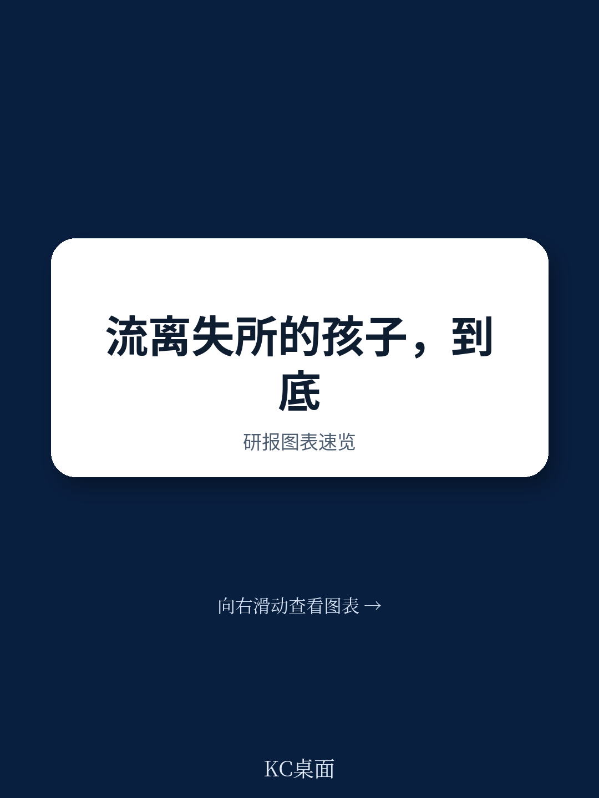
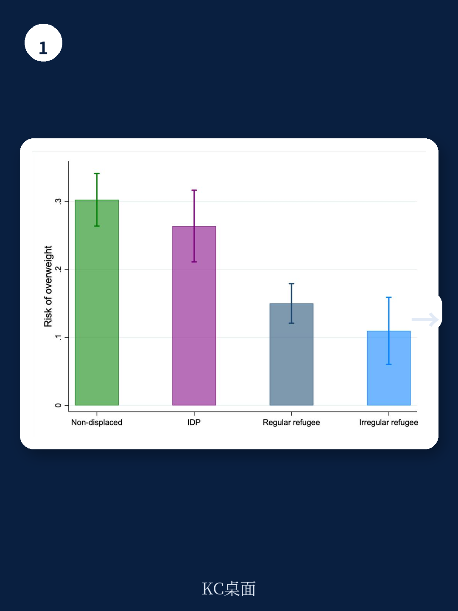
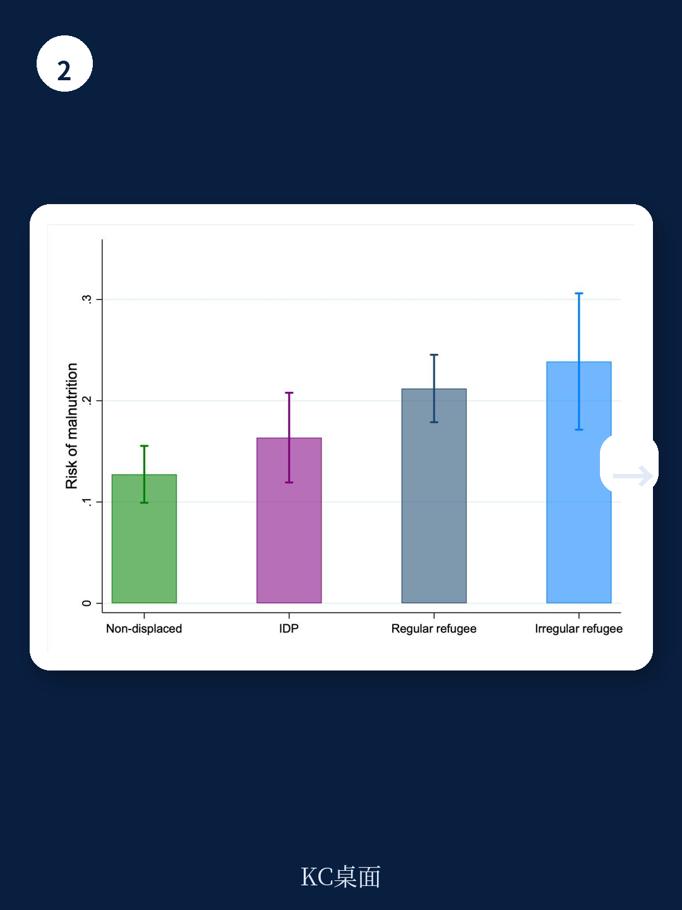

# 世界银行：研究主题与行业变化观察

全球流离失所人口已超过1.23亿，儿童占比近45%。但一个关键问题始终缺乏实证回答：这些儿童的发展落后，究竟是贫困的副产品，还是流离失所本身造成的独立损伤？世界银行最新工作论文利用哥伦比亚麦德林约1600名儿童的一手数据，给出了一个具有政策含义的答案——两种流离失所类型对应不同的发展缺口，且这些缺口在控制家庭财富后仍然存在。

研究团队设计了“委内瑞拉难民儿童追踪调查”，覆盖5至10岁的委内瑞拉难民儿童、哥伦比亚国内流离失所儿童以及未流离失所的同龄儿童，统一测量认知、身体、社会情感和心理健康四个维度。这是首个在同一发展中国家接收地、对三类儿童进行可比发展评估的数据集。

## 1. 流离失所原因决定发展缺口的维度

数据揭示了一个清晰的模式：委内瑞拉难民儿童在认知和身体发展上落后最严重，其接受性词汇得分比非流离失所儿童低0.34个标准差，年龄标准化身体质量指数低0.50个标准差。这与他们逃离的极端物质匮乏直接相关——委内瑞拉难民在抵达麦德林时几乎不携带生产性或社会性资产。

哥伦比亚国内流离失所儿童则呈现另一幅图景。他们的抑郁得分比非流离失所儿童低0.25个标准差，社会情感功能低0.21个标准差，创伤症状低0.18个标准差。这些缺口集中在心理健康和社会情感领域，与武装冲突的直接暴露和代际创伤传递一致。研究还发现，即使是通过父母间接受到影响的儿童也表现出类似模式，指向创伤的代际传递渠道。

在六个发展结果中，两类流离失所儿童在五个指标上的系数存在显著差异。这意味着流离失所不是一个同质化的经历，政策干预必须针对具体的发展维度设计。

> **KC评论：** 这个区分对政策制定者很关键。如果只看到“流离失所儿童需要帮助”这个笼统结论，可能同时错过两类儿童最紧迫的需求——难民儿童需要营养和早期认知刺激，而国内流离失所儿童更需要心理健康支持。

## 2. 家庭财富无法解释的发展差距

研究团队采用了两个递进的分析策略。首先，在控制父母和祖父母教育水平后，所有缺口几乎不变。进一步控制家庭财富后，难民儿童的认知和身体缺口有所缩小但未消失，国内流离失所儿童的心理健康缺口基本不受影响。

其次，研究借鉴了代际流动性文献中的“排名-排名回归”框架，将每个儿童的发展结果按家庭财富排名进行排序。在财富分布相同的位置上，难民儿童的认知发展排名比非流离失所儿童低18个百分点，身体发展低13个百分点；国内流离失所儿童的认知发展低10个百分点，抑郁得分低12个百分点。

更值得注意的发现是：家庭财富仅能缩小难民儿童的认知缺口。对于国内流离失所儿童，所有发展缺口在整个财富分布上都是平坦的——即使家庭更富裕，他们的发展落后也没有减轻。难民儿童的身体健康缺口同样不受财富影响。

这意味着流离失所带来的发展劣势，其作用机制与普通社会宏观环境差距不同。单纯依靠扶贫或现金转移，可能无法解决这些儿童的发展问题。

## 3. 合法身份与公共服务可及性的关联效应

哥伦比亚针对委内瑞拉难民的“临时保护许可”项目，是发展中国家最包容的合法化政策之一，已向约180万难民授予合法身份和社保系统准入。研究利用这一制度差异，比较了有合法身份和无合法身份难民儿童的发展结果。

数据差异显著：无合法身份的难民儿童在词汇测试中比非流离失所儿童低0.77个标准差，而有合法身份的难民儿童仅低0.24个标准差。身体发展领域呈现类似模式。社保登记、教育和医疗保险等公共服务可及性也与更小的缺口相关。

但研究同时指出，即使获得合法身份，难民儿童在认知和身体发展上仍存在缺口。合法化和公共服务准入缩小了差距，但未能消除流离失所本身带来的发展损伤。

这一发现为政策提供了两个方向：短期应优先推动合法化和公共服务覆盖，长期则需要针对流离失所经历本身设计干预措施，特别是对国内流离失所儿童的心理健康支持和对难民儿童早期发展的补偿性研究。

哥伦比亚同时容纳了武装冲突驱动的国内流离失所者和人道主义仍在调整驱动的难民，这一独特背景使得研究能够分离出不同流离失所类型对儿童发展的差异化影响。研究团队开发的排名-排名回归框架，也为其他中低收入接收国评估流离失所儿童发展状况提供了可复用的分析工具。

For informational purposes only. Portions may be generated,translated,summarized,or edited with AI assistance based on source materials and may contain omissions or errors. Please verify independently. This is not investment,legal,tax,accounting,or other professional advice.

