# Labor Market Effects of Public Employment Guarantee

Yasmine Elkhateeb

Nelly Elmallakh

Luca Flabbi

Roberta Gatti

Mohamed Saleh

POLICY RESEARCH WORKING PAPER 11431

## Abstract

Public employment guarantee schemes, which channeled graduates into lifetime positions in the civil service and state-owned enterprises, were central to state-led industrialization across the postcolonial world, yet they have remained far less studied than temporary workfare programs. This paper provides the first causal estimates of their labor market effects, exploiting the Arab Republic of Egypt's archetypal public employment guarantee, which from the early 1960s guaranteed public sector jobs to secondary and university graduates without competitive examination. The paper measures district-level exposure by secondary school supply on the eve of the reform (1959/60) and links it to individual-level census microdata from 1986, 1996, and 2006. Using an event-study design with continuous treatment intensity, the analysis compares cohorts that differed in age at the time of the public employment guarantee's introduction across districts with differing pre-reform school supply. The findings show that the public employment guarantee reallocated urban male wage employment away from the private sector and toward state-owned enterprises, with no comparable shift in rural districts, where state-owned enterprises were largely absent. The reallocation was concentrated in manufacturing and high-skilled white-collar occupations, consistent with the policy channeling educated workers into sectors that were central to the state's industrialization drive. The paper finds little evidence that the public employment guarantee raised educational attainment, indicating that it primarily redirected an already growing pool of educated workers rather than expanding the supply of schooling.

# Labor Market Effects of Public Employment Guarantee\*

Yasmine Elkhateeb $^{\dagger}$ Nelly Elmallakh $^{\ddagger}$ Luca Flabbi $^{\S}$ Roberta Gatti $^{\ddagger}$ Mohamed Saleh $^{\P}$

Authorized for distribution by Indermit Gill, Chief Economist & Senior Vice President, Development Economics, World Bank Group

JEL classification: J45, J24, O15, J21, O14.

Keywords: employment, guarantee, public sector, education, Middle East.

## 1 Introduction

Governments have long used public employment as an instrument of redistribution and political incorporation. Two broad types exist. The first is workfare and public works programs, which offer episodic short-term employment to the poor or unemployed. These programs range from employment guarantees such as India's Mahatma Gandhi National Rural Employment Guarantee Act (MGNREGA) (Imbert and Papp, 2015; Muralidharan et al., 2023) to crisis-response and safety-net programs such as Argentina's Jefes Plan (Galasso and Ravallion, 2004) and Ethiopia's Productive Safety Net Program (Berhane et al., 2014). $^{1}$ The second type, Public Employment Guarantee (PEG) schemes, by contrast, channel eligible workers into lifetime positions in the civil service and state-owned enterprises (SOEs), as in China's “iron rice bowl” for urban workers (Cai et al., 2008), and employment guarantees for graduates meeting certain educational credentials in postcolonial East Africa (Simson, 2020) and the Middle East (Assaad and Barsoum, 2019).

While a substantial empirical literature has studied the labor market effects of workfare schemes, PEG schemes are far less studied. This is an important omission because the two types serve distinct political and economic functions. Workfare provides short-term income support that, among others, buys social peace among the poor. To the contrary, PEG creates a state-dependent middle class whose livelihood and status are tied to regime survival—the core mechanism of the “authoritarian bargain” social contract that characterized many post-independence polities (Desai et al., 2009; Yousef, 2004). The labor market implications differ accordingly. Workfare raises the reservation wage without removing workers permanently from the private sector. PEG permanently absorbs workers into the state sector, with ambiguous net effects: it crowds out private-sector careers but may also build bureaucratic capacity and staff state-led development programs. Despite decades of reliance on public hiring to absorb educated youth across much of the developing world, we know relatively little about how these permanent guarantees shaped labor markets.

This paper provides the first causal evidence on the labor market effects of PEG schemes on sectoral allocation, occupational sorting, and educational attainment, by exploiting the Arab Republic of Egypt's archetypal PEG that was introduced in the early 1960s. Before the PEG, recruitment into public employment was organized through competitive examinations, both written and oral. Beginning in 1961, however, a series of legal reforms entitled all secondary and university graduates, including both general and vocational secondary school tracks, to public sector jobs without competitive examination. This policy coincided with the expansion of the state's administrative apparatus and state-owned enterprises (World Bank, 2014) and with the expansion of mass education (Saleh, 2016). It remained in force until it was de facto suspended in the early 1980s, amid rising cohort sizes and constrained budgets, raising concerns about queuing, meritocracy, and skill mismatch (Assaad, 1997).

We compile and harmonize newly assembled data to construct a district-level measure of potential exposure to PEG, measured by secondary school supply at the district level in 1959/60, which we merge with individual-level population census microdata from 1986, 1996, and 2006. Our identification strategy is an event study that compares the evolution of labor market outcomes between older and younger cohorts born in districts with different supply of secondary schools on the eve of PEG. We study three outcomes: (i) sectoral sorting of wage labor across the public sector (SOEs and government) and the private sector, (ii) occupational sorting across blue- and white-collar jobs, and (iii) educational attainment (secondary and university degree completion). Our analysis focuses on men, since low female labor force participation in Egypt (Gatti et al., 2025) and systematic, sector- and district-varying under-enumeration of female employment in the censuses preclude reliable causal estimates for women; we discuss these data constraints in detail in Section 3.2.

Our findings indicate that the PEG caused a substantial reallocation of urban male wage employment away from the private sector and toward state-owned enterprises: a one-standard-deviation increase in pre-reform secondary school supply raised the probability of SOE employment by up to 1.3 percentage points for the most-exposed cohorts, with an offsetting decline in private-sector employment. We find no comparable shift in rural districts. Because SOEs were overwhelmingly concentrated in urban areas under Egypt's state-led industrialization strategy, the PEG's sectoral channel could only operate where SOEs existed, and we therefore treat the rural sample as a built-in placebo: the absence of any SOE shift precisely where the mechanism was inactive corroborates that our urban estimates reflect the guarantee rather than a coincident shock. Within urban labor markets, exposed cohorts were less likely to work in agriculture and more likely to work in manufacturing, and were sorted into high-skilled white-collar occupations, especially as professionals, technicians, and associate professionals. By contrast, we find little evidence that the PEG raised educational attainment: schooling was rising steadily across cohorts regardless, and the guarantee appears to have redirected this already growing pool of educated workers into the state sector rather than expanding the supply of schooling.

Our paper contributes to several strands of the literature. First, it contributes to the literature on the labor market effects of public employment schemes. A substantial body of empirical work studies India's MGNREGA, the world's largest public workfare program, and documents sizable impacts on workers' labor supply, wages, and welfare. Exploiting the program's phased rollout, Azam (2012) shows that MGNREGA increased labor force participation—particularly among women—and raised female casual wages, while Imbert and Papp (2015) find that public employment crowded out private work but raised private-sector wages, generating welfare gains that often exceeded direct program earnings. Consistent with these findings, Muralidharan et al. (2023) exploit a large-scale randomized improvement in program implementation and document substantial income gains and poverty reduction, driven primarily by higher private-sector wages and employment rather than direct program income.

In contrast, evidence on firm-side responses points to potential costs of employment guarantees for private firms. Using establishment-level data and staggered rollout for identification, Agarwal et al. (2021) find that MGNREGA reduced firms' permanent workforce by about 10 percent, inducing greater mechanization and lowering profits and productivity, consistent with partial crowding out of private-sector labor. However, exploiting discontinuities in rollout timing, Zimmermann (2024) finds little evidence of private job displacement in the program's first year, instead documenting reallocations from paid employment to family work, suggesting that employment guarantees may operate primarily as a safety net. Evidence from employment guarantee schemes outside the MGNREGA context is relatively scarce. Studying a major wage increase in Maharashtra's state-specific Employment Guarantee Scheme, Ravallion et al. (1993) show that higher statutory wages reduced employment through increased job rationing, weakening the guarantee. In a different institutional context, Pastore (2015) documents that Italy's European Youth Guarantee was limited by weak public employment services, resulting in low participation and few actual job placements.

All these programs, however, are workfare schemes offering temporary employment. The labor market effects of permanent PEG schemes—which were central to state capacity building in postcolonial settings and to industrial development under state planning—remain largely understudied. In China, the state assigned urban workers to lifetime employment in SOEs through the danwei (work unit) system as part of a broader project of state industrialization, until the massive restructuring of the late 1990s. Scholars have described the restructuring reform and its implications for the labor market (Cai et al., 2008), and estimated its causal effect on precautionary savings (He et al., 2018), but not on the original labor allocation induced by the guarantee itself. Simson (2020) documented how manpower planning policies and explicit employment guarantees in postcolonial East Africa—Kenya and Tanzania—channeled graduates into the public sector as part of post-independence state building, but again without causal identification of labor market effects. Across the MENA region, the PEG in Egypt (the focus of this paper) has been documented descriptively (Assaad and Barsoum, 2019; Assaad, 1997). Similar guarantees or quasi-guarantees emerged elsewhere in the region, albeit with distinct institutional designs. In Morocco, a program offered temporary public sector placements to young graduates as a bridge to private employment; in practice, these positions frequently became permanent after two years of civil service (Said, 1996). In Syria, guaranteed public jobs were historically extended to graduates of post-secondary intermediate institutes, a key pipeline into state-owned enterprises; after 2001, the guarantee for higher institute graduates was terminated, pushing them toward private sector absorption (Huitfeldt and Kabbani, 2007). In contrast to Egypt and Syria—where eligibility hinged primarily on reaching minimum educational thresholds—Jordan used public employment as a mechanism of political incorporation, allocating secure positions to Bedouin tribes and other groups central to regime stability (Assaad and Barsoum, 2019). In the Gulf Cooperation Council (GCC), Kuwait formalized a universalistic variant: the Government Sector Employment Law No. 18/1960 guaranteed qualified Kuwaiti citizens access to public employment and advanced “Kuwaitization,” the progressive substitution of expatriate labor with nationals. A dedicated “Complementary Fund Budget” (CFB) was established to provide financial incentives for government departments to hire new Kuwaiti applicants, channeling university graduates and secondary or intermediate school leavers (after completing training programs) into a wide range of government roles (Al-Enezi, 2002). Despite the prevalence and political significance of these schemes, our paper provides the first causal estimates of their labor market effects.

Second, our paper contributes to the literature on the labor market consequences of a large public sector. A growing body of empirical work documents that extensive public employment can crowd out private-sector activity. In MENA countries, the large footprint of SOEs has been linked to talent misallocation and weaker productivity, as public employment draws workers away from the private sector (Gatti et al., 2024). Cross-country evidence from OECD economies between 1960 and 2000 similarly points to substantial crowding-out effects: Algan et al. (2002) estimate that the creation of 100 public jobs eliminated roughly 150 private-sector jobs, lowering labor force participation and increasing unemployment. Extending this analysis to a broader set of countries, Behar and Mok (2019) use a panel of 194 advanced and developing economies over 1988–2011 and find evidence of full or near-full crowding-out of private employment by the public sector, with similar patterns across income groups. Consistent with these findings, both theoretical and empirical evidence emphasizes that crowding-out is more pronounced when public production is highly substitutable for private production and when public-sector jobs offer relatively attractive wages or non-wage benefits (Algan et al., 2002). Country-level evidence further corroborates the crowding-out effects of public employment on private employment in Greece (Demekas and Kontolemis, 2000), Italy (Caponi, 2017), Germany, Japan, and the United States (Malley and Moutos, 1998), while a smaller subset finds limited crowding-in in specific contexts, such as Germany and Spain (Becker et al., 2021; Jofre-Monseny et al., 2020). Our contribution is to document the origins of this crowding-out in MENA: we show that it was not merely a byproduct of an oversized public sector but was actively engineered through an explicit policy instrument—the education-based public employment guarantee. At the same time, interpreting the welfare implications of such crowding-out requires caution, since public employment in these settings was not simply displacing an established private sector but was simultaneously building industrial and bureaucratic capacity where little had previously existed.

Finally, our paper contributes to the literature on nationalization policies and the expansion of SOEs in developing countries. A related strand of literature examines how state ownership and nationalization of private firms shape labor markets in developing economies, even if much of the historical evidence remains descriptive rather than causal. Historical episodes of formal nationalization illustrate how state control of private industry restructures labor allocation and industrial performance. Quantitative analysis of nationalization in oil-producing countries, such as the República Bolivariana de Venezuela in the 1970s, finds significant declines in productivity and shifts in workforce composition following expropriation of foreign-owned assets (Melek, 2020). Studies of Pakistan's nationalization program under Zulfikar Ali Bhutto in the 1970s similarly show a reconfiguration of the industrial base under state ownership, with long-run implications for private investment and labor allocation as capital and entrepreneurs shifted to small-scale and informal sectors (Chengappa, 2002). An extreme case is Cuba's 1968 Revolutionary Offensive, in which virtually all remaining private small businesses were nationalized and employment consolidated under state planning, illustrating how deep nationalization can reshape employment structures and labor mobilization in a developing economy (Mesa-Lago, 1972). Together, this literature suggests that ownership transitions toward the state can significantly reshape employment patterns, productivity, and labor allocation, providing a useful backdrop for interpreting our findings on increased SOE and manufacturing employment during nationalization episodes. $^{2}$

The rest of this paper is organized as follows: Section 2 provides background information on the public sector employment guarantee scheme in Egypt. Section 3 presents the data. Section 4 discusses the empirical strategy. Section 5 presents the main results, while Section 6 presents some robustness checks. Finally, Section 7 discusses the mechanisms and Section 8 concludes.

## 2 Egypt's Public Employment Guarantee Scheme

Employment in the public sector in 1950s Egypt was subject to a public competition examination. Law 210 of 1951 and Law 113 of 1958 determined the procedure for recruitment for state civil servants and in joint stock companies and public institutions, respectively. $^{3}$ In order to be appointed, individuals must have successfully passed the examination prescribed for the position, which often consisted of both written exams and oral interviews. $^{4}$ Moreover, the public competition examination for joint stock companies and public institutions was advertised in newspapers.

Starting from 1961, gradual reforms were implemented, paving the way for a full-fledged implementation of the public employment guarantee scheme in Egypt. First, Law 8 of 1961 introduced a temporary two-year exemption—starting from the law’s date of entry into force—from the public competition examination requirement, allowing entities to fill existing vacancies for public sector appointments without an examination. In 1962, under Presidential Decree No. 425, new budget lines were created in the state budget to fund sixth-grade civil service positions allocated to graduates of non-STEM faculties at universities and al-Azhar. $^{5}$ Between 1963 and 1966, the recruitment guarantee was extended to graduates of non-STEM higher institutes (Law 156 of 1963), $^{6}$ then to all university graduates (Law no. 14 of 1964), $^{7}$ and finally to secondary graduates from both general and vocational tracks (Law 26 of 1966). $^{8}$ In 1973, Law 14 of 1964 was made permanent, according to which graduates of universities, al-Azhar, and higher institutes, as well as holders of general or vocational secondary qualifications may be appointed to vacant positions in ministries, public services, local administration units, public bodies, and public institutions without taking the public competition examination. $^{9}$

The public employment guarantee scheme placed an increasingly heavy burden on the public sector from its introduction for secondary school graduates in the late 1960s through to the early 1980s. Egypt was a net oil exporter until the early 2000s, and declining oil prices over this period sharply reduced government revenues, while and mounting fiscal pressures further strained government finances (Assaad, 1997). While the public employment guarantee was never “formally” abolished, some measures were gradually implemented to suspend it and reduce hiring. In 1978, public enterprises were allowed to opt out of the centralized scheme. According to Law 48 of 1978, the board of directors of public companies was allowed to set the rules for the announcement of vacant positions and the procedures for their appointment, giving freedom to the board to determine whether positions are to be filled with or without an examination. $^{10}$ The public employment guarantee was then de facto suspended through gradual delay in hiring that could extend for years. Indeed, by law, university graduates needed to wait at least two years, while secondary school and technical institute graduates needed to wait three years after graduation before being able to apply to the Ministry of Manpower for a government job (Assaad, 1997). The waiting time was designed to allow male graduates to complete their military service. By 1987, this waiting period had been extended to 5 and 6 years, respectively (Assaad, 1997). Queuing for public jobs has resulted in waiting time up to 13 years (Assaad, 1997).

Finally, Law 18 of 2016, which serves as the current Civil Service Law, came into effect that year replacing the previous Civil Service Law of 1978. The new law regulated employment for all state and government employees, including those in ministries, public bodies, and local administration units, and was aimed to modernize the public sector by introducing principles of competitiveness, merit, and aptitude in hiring and promotion. Article 12 outlined the appointment requirements, stating that vacant positions must be publicly advertised through a centralized announcement on the website of the Egyptian government portal, specifying the criteria for filling these positions. Importantly, the same article stipulated that appointments may only be granted to candidates who successfully pass the examination, with selection based on their final exam rankings. $^{11}$ The reintroduction of the examination clearly indicates that Egypt has progressively moved away from the previously guaranteed employment scheme. A timeline summarizing the public employment guarantee's implementation is reported in Figure 1.

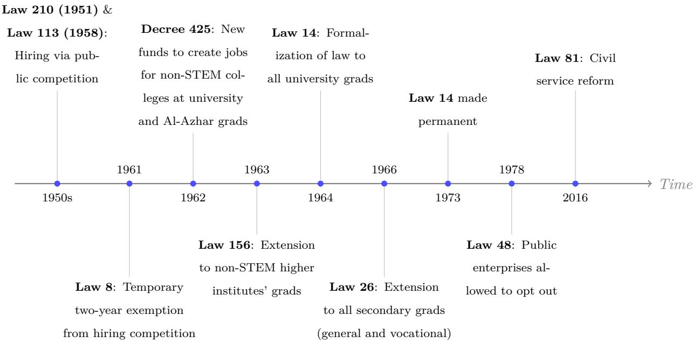  
Fig. 1. Timeline of the Public Employment Guarantee's Implementation

## 3 Data

We examine the effects of Egypt's PEG scheme on educational and labor market outcomes, using two datasets. The first dataset measures the main treatment variable—exposure to PEG—by the number of secondary schools per 1,000 children in secondary school age at the district level in 1959/1960, on the eve of introducing the PEG. The second, main, dataset is a repeated cross-sectional dataset at the individual level from Egypt's 10-percent population census samples in 1986, 1996, and 2006, from which we measure the educational and labor market outcomes. We describe below each dataset.

## 3.1 Data on Treatment: Secondary Schools Data

We measure district-level exposure to the PEG scheme by the number of secondary schools per 1,000 secondary school-age children in 1959/1960. Because the PEG converted a secondary diploma into a guaranteed public sector job, the local supply of secondary schools on the eve of the reform was the binding constraint on the probability that an individual could take up the guarantee. Districts with greater pre-existing secondary school infrastructure could produce more secondary (and, subsequently, university) graduates, and thus had a larger pool of individuals eligible for public sector employment once the scheme was extended to general and vocational secondary tracks in 1966. Our treatment variable therefore captures this pre-reform, district-level probability of eligibility.

We construct district-level measures of secondary school supply by digitizing two historical sources: the 1959/1960 School Census (Statistique Scolaire, 1959) and the 1949/1950 and 1950/1951 Statistical Yearbook (Annuaire Statistique, 1953). The 1959/1960 School Census reports the number of schools by level at the province level, including pre-schools, primary schools, general and vocational preparatory schools, and general and vocational secondary schools. $^{12}$ To disaggregate to the district level, we use the 1949/1950 and 1950/1951 Statistical Yearbook, which reports the district-level number of schools in 1951/1952, distinguishing between elementary schools (awwaliya)—converted into primary schools under Law 143 of 1951—and non-elementary schools, a residual category that includes pre-primary schools, pre-existing (pre-1951) primary schools (ibtida'iya), and secondary schools. $^{13}$ We impute district-level secondary school counts in 1959/1960 by multiplying each district's share of non-elementary schools within its province in 1951/1952 by the province-level number of secondary schools in 1959/1960, assuming that the within-province distribution of non-elementary schools remained stable between 1951/1952 and 1959/1960 and applied similarly across school levels. Our treatment variable is then defined as the imputed number of secondary schools—general and vocational—per 1,000 children aged 15–19 in each district, with the age distribution drawn from the 1960 population census.

Figure 2 shows the distribution of the treatment variable across districts. The figure shows substantial spatial variation in treatment intensity. At the same time, the treatment intensity is not geographically concentrated, with pockets of high exposure across Greater Cairo, the Nile Delta and Valley, and the Suez Canal districts. Appendix Figures A.1 and A.2 show the distribution of the treatment variable for the urban and rural samples.

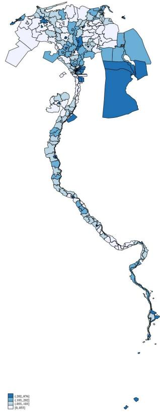  
Fig. 2. Number of Secondary Schools per 1,000 Children Aged 15-19 years old

Notes: This map shows the number of secondary schools per 1,000 children aged 15-19 years old—our treatment intensity measure—across Egyptian districts.

Source: Authors' calculations based on Egypt's 1959/1960 School Census, the 1949/1950 and 1950/1951 Statistical Yearbook, and the 1960 Population Census. The map uses the 2006 Population Census district-level shape files. We exclude the five frontier provinces (accounting for less than $2\%$ of the population in 2006) from the map, because we do not observe them in the 1959/1960 School Census.

## 3.2 Data on Outcomes: Population Census Data

To measure education and employment outcomes, we combine the historical school data with harmonized data from 10-percent individual-level samples of the Egyptian Population Censuses of 1986, 1996, and 2006, obtained through the Integrated Public Use Microdata Series (IPUMS) International (Ruggles et al., 2024). The pooled census samples provide individual-level information on demographic characteristics, schooling attainment, and labor market outcomes, along with information on district of birth and district of current residence. These geographic identifiers allow us to match individuals with secondary school availability (per secondary school-age individuals between 15-19 years old) at the district of birth.

We measure cohort of birth using five-year bins of years of birth, rather than individual years of birth, to address age heaping in the census data—the tendency of respondents to round their reported age to the nearest multiple of five. $^{14}$ We restrict our sample to males aged 30–60 in each census year, born in 1963 or earlier. We exclude the 1966 birth cohort bin (born 1964–1968) and later cohorts because these individuals reached secondary school age in the early 1980s, around the time of the PEG's abolition, meaning their educational choices and early labor market trajectories were potentially shaped by the dismantling of the guarantee rather than its introduction. Therefore, the birth year upper bound of 1963 binds only in 1996 and 2006, and the observed birth cohort range differs across census years: 1926–1956 in 1986, 1936–1963 in 1996, and 1946–1963 in 2006.

We restrict the analytical sample to men for both substantive and measurement reasons. Substantively, female labor force participation in Egypt is among the lowest in the world—fewer than one in five women participate in the labor market (Gatti et al., 2025). In our sample, female participation rates range from 3.4% for the oldest urban cohort to 30% for the youngest, and from 1.6% to 12% across rural cohorts (Figure E.1); while these rates rise gradually across birth cohorts in both settings, they remain extremely low overall. Women who do participate are therefore a highly selected minority, making it difficult to interpret estimated effects on the female sample as informative about the broader female population, and any causal interpretation would additionally require addressing two layers of selection—into employment and into wage employment—which we do not tackle here. Measurement-wise, female employment is systematically under-enumerated in the Egyptian censuses, with the degree of under-enumeration varying across districts and sectors in ways correlated with the dimensions our identification strategy exploits. $^{15}$ Male employment, by contrast, is enumerated near-universally and the residual measurement error is plausibly sector-neutral. For completeness, we report descriptive statistics and event-study estimates for women in Appendix E, but do not interpret them as causal.

Throughout the analysis, we estimate separate regressions for men whose district of residence at the time of the census is classified as urban versus rural, following the census classification. $^{16}$ We organize the analysis sequentially across labor market margins: labor force participation, employment conditional on participation, wage work conditional on employment, and sectoral, industrial, and occupational sorting conditional on wage work. Because the PEG was a credential-based policy that channeled qualifying graduates into specific destinations—state-owned enterprises and government—the policy-relevant margin is sectoral sorting within wage employment, which we report as our headline outcome. The upstream margins (LFP, employment, and wage-versus-self employment) are reported in Appendix C for completeness.

Since administrative boundaries in Egypt changed considerably between 1951/1952 and 2006, we match the district-level secondary school data in 1959/1960 to districts of birth in the 1986, 1996, and 2006 population censuses using the 1947 census district boundaries. $^{17}$ This ensures consistency between the historical school information and the later census outcomes, and allows us to track cohorts across censuses using a stable geographic unit. All district-level variables are therefore expressed using the 1947 census harmonized districts.

## 3.3 Data on Controls: The 1952–1961 Land Reform

Throughout the empirical analysis, we control for the share of land that was subject to the land reform in 1952–1961, which may have affected labor market outcomes especially for rural-born workers. According to this reform, large landholdings in each district that were above 100 feddans (1 feddan ≈ 1 acre) were expropriated by the state and redistributed to landless farmers in small 0–5 feddan plots. We measure the land reform in each individual's district of birth by the proportion of land expropriated and placed under the management of the Agrarian Reform Authority out of the total cultivable land—both state and private—in the district. $^{18}$

## 3.4 Descriptive Statistics

Table 1 reports descriptive statistics for men in our sample, pooled across the 1986, 1996, and 2006 census rounds, separately by whether the district of current residence—not birth—is classified as urban or rural. The average age is 45 in both settings. Secondary school completion is substantially more common among urban men (43%) than rural men (19%). Employment rates are higher in rural districts (95%) than urban districts (90%), reflecting the near universality of agricultural work in rural areas. Conditional on employment, wage work is more prevalent in urban districts (77%) than in rural districts (67%).

Within wage employment, public-sector roles—including positions in government and state-owned enterprises (SOEs)—are more prevalent in urban districts than in rural districts. Among male wage workers, 42% in urban districts are employed in the government and 20% in SOEs, compared with 39% and 8%, respectively, in rural districts. Conversely, private-sector wage employment is more common in rural districts (53%) than in urban districts (39%).

Sectorally, manufacturing and services constitute 83% of male wage employment in urban districts, compared to 54% in rural districts, reflecting the greater role of agricultural wage work in rural labor markets. The number of secondary schools per 1,000 secondary school-age children is much higher in the urban sample at 0.228 schools than in the rural sample (0.081). Unsurprisingly, the share of land reform area is substantially higher in the rural sample (4.5%) compared to the urban sample (1.6%).

Table 1
Summary Statistics - Full Sample

<table><tr><td rowspan="2"></td><td colspan="3">Urban Sample</td><td colspan="3">Rural Sample</td><td>Diff.</td></tr><tr><td>N</td><td>Mean</td><td>Sd.</td><td>N</td><td>Mean</td><td>Sd.</td><td>b</td></tr><tr><td colspan="8">Socio-demographic</td></tr><tr><td>Age</td><td>1,130,488</td><td>44.656</td><td>8.511</td><td>1,057,863</td><td>44.996</td><td>8.402</td><td>0.340***</td></tr><tr><td>Secondary or above</td><td>1,130,434</td><td>0.429</td><td>0.495</td><td>1,057,852</td><td>0.185</td><td>0.388</td><td>-0.244***</td></tr><tr><td colspan="8">Activity status</td></tr><tr><td>Employed</td><td>1,130,305</td><td>0.898</td><td>0.302</td><td>1,057,620</td><td>0.942</td><td>0.235</td><td>0.043***</td></tr><tr><td>Unemployed</td><td>1,130,305</td><td>0.017</td><td>0.130</td><td>1,057,620</td><td>0.008</td><td>0.091</td><td>-0.009***</td></tr><tr><td>Out of labor force</td><td>1,130,305</td><td>0.084</td><td>0.278</td><td>1,057,620</td><td>0.050</td><td>0.218</td><td>-0.034***</td></tr><tr><td colspan="8">Status in employment</td></tr><tr><td>Wage worker</td><td>1,015,024</td><td>0.767</td><td>0.423</td><td>991,658</td><td>0.669</td><td>0.471</td><td>-0.098***</td></tr><tr><td>Self-employed</td><td>1,015,024</td><td>0.233</td><td>0.423</td><td>991,658</td><td>0.331</td><td>0.471</td><td>0.098***</td></tr><tr><td colspan="8">Sector of emp. (if wage worker)</td></tr><tr><td>State-owned enterprises</td><td>778,083</td><td>0.195</td><td>0.396</td><td>662,874</td><td>0.075</td><td>0.264</td><td>-0.119***</td></tr><tr><td>Private sector</td><td>778,083</td><td>0.387</td><td>0.487</td><td>662,874</td><td>0.533</td><td>0.499</td><td>0.146***</td></tr><tr><td>Government</td><td>778,083</td><td>0.418</td><td>0.493</td><td>662,874</td><td>0.391</td><td>0.488</td><td>-0.027***</td></tr><tr><td colspan="8">Industry of emp. (if wage worker)</td></tr><tr><td>Agricultural</td><td>762,686</td><td>0.058</td><td>0.233</td><td>654,196</td><td>0.385</td><td>0.487</td><td>0.327***</td></tr><tr><td>Manufacturing</td><td>762,686</td><td>0.222</td><td>0.416</td><td>654,196</td><td>0.091</td><td>0.287</td><td>-0.131***</td></tr><tr><td>Mining &amp; extraction</td><td>762,686</td><td>0.007</td><td>0.085</td><td>654,196</td><td>0.004</td><td>0.065</td><td>-0.003***</td></tr><tr><td>Electricity, gas, water</td><td>762,686</td><td>0.026</td><td>0.160</td><td>654,196</td><td>0.018</td><td>0.134</td><td>-0.008***</td></tr><tr><td>Construction</td><td>762,686</td><td>0.080</td><td>0.271</td><td>654,196</td><td>0.053</td><td>0.224</td><td>-0.027***</td></tr><tr><td>Services</td><td>762,686</td><td>0.607</td><td>0.488</td><td>654,196</td><td>0.449</td><td>0.497</td><td>-0.158***</td></tr><tr><td colspan="8">Occupation (if wage worker)</td></tr><tr><td>High-skilled white-collar</td><td>766,314</td><td>0.377</td><td>0.485</td><td>653,277</td><td>0.198</td><td>0.399</td><td>-0.178***</td></tr><tr><td>Low-skilled white-collar</td><td>766,314</td><td>0.204</td><td>0.403</td><td>653,277</td><td>0.170</td><td>0.376</td><td>-0.033***</td></tr><tr><td>High-skilled blue-collar</td><td>766,314</td><td>0.242</td><td>0.428</td><td>653,277</td><td>0.471</td><td>0.499</td><td>0.229***</td></tr><tr><td>Low-skilled blue-collar</td><td>766,314</td><td>0.178</td><td>0.382</td><td>653,277</td><td>0.160</td><td>0.367</td><td>-0.017***</td></tr><tr><td colspan="8">School supply</td></tr><tr><td>N. of schools in 1959 per 1000 individuals</td><td>1,130,488</td><td>0.226</td><td>0.201</td><td>1,057,863</td><td>0.081</td><td>0.085</td><td>-0.145***</td></tr><tr><td colspan="8">Land reform</td></tr><tr><td>Share of mobilized land</td><td>1,130,488</td><td>0.016</td><td>0.038</td><td>1,057,863</td><td>0.045</td><td>0.056</td><td>0.030***</td></tr></table>

Note: This table reports the mean and standard deviation of the main variables used in the analysis based on a sample of males aged 30-60 (born 1926-1961) in urban and rural districts. Columns (1) to (3) is for the urban sample, columns (4) to (6) is for the rural sample. Column (7) reports the t-test for the difference in means across urban and rural samples. Source: Authors' calculations based on IPUMS Egypt census data (1986, 1996, 2006) and administrative school statistics (1959).

## 4 Empirical Strategy

We employ a difference-in-differences (DID) empirical specification that exploits two sources of variation. The first is variation across districts of birth in exposure to PEG measured by secondary school supply prior to the reform (1959/1960) (see Section 3.1). The second source of variation is across cohorts of birth, by comparing older cohorts—who were past secondary school completion age at the time of the PEG—to younger cohorts—who were of secondary school completion age or younger when PEG was introduced.

Our headline specification estimates effects for male wage workers, motivated by the policy's design: the PEG operated by channeling graduates with secondary or higher credentials into guaranteed positions in SOEs and government. The relevant treatment margin is therefore the sectoral, industrial, and occupational allocation of wage labor among educated men, not entry into the labor force. We report upstream margins (LFP, employment, wage versus self-employment) in Appendix C, and women's results in Appendix E. $^{19}$ We estimate the specification separately for men whose district of residence at the time of the census is classified as urban versus rural. Because state-owned enterprises were overwhelmingly concentrated in urban districts under Egypt's state-led industrialization strategy, the PEG's sectoral, industrial, and occupational channels could only operate where SOEs existed. We therefore treat the rural sample as a built-in placebo on the reallocation outcomes. We will return to this interpretation in Section 5.

Specifically, we implement an event-study design by estimating the following equation using Ordinary Least Squares (OLS):

$$
Y_{i,c,d,t} = \sum_{\substack{c = 1926\\ c\neq 1941}}^{c = 1961}\beta_{c}\cdot \text{cohort}_{c}\times \mathrm{T}_{d} + \sum_{\substack{c = 1926\\ c\neq 1941}}^{c = 1961}\theta_{c}\cdot \text{cohort}_{c}\times \mathrm{L}_{d} + \gamma_{c} + \delta_{d} + \sigma_{t} + \lambda_{a} + \epsilon_{i,c,d,t}\tag{1}
$$

where $Y_{icdt}$ is the outcome for individual i, born in birth cohort c and district d, and observed in census year t. The treatment variable, $T_{d}$ , is the number of secondary schools per 1,000 secondary school-age children (15–19 years of age) in district of birth d in 1959/1960. The control variable, $L_{d}$ , refers to the share of redistributed land in 1952–1961 in district d. The variable, cohort $_{c}$ , refers to a full set of dummy variables indicating five-year bins of years of birth.

We include cohort 5-year bin fixed effects $(\gamma_{c})$ , district-of-birth fixed effects $(\delta_{d})$ , census-year fixed effects $(\sigma_{t})$ , and age fixed effects $(\lambda_{a})$ . These fixed effects absorb all time-invariant district characteristics, common shocks affecting all individuals within a birth cohort bin, and common shocks at the census-year level. Age fixed effects flexibly control for life-cycle differences in outcomes associated with age at the time of observation, net of cohort bin and census-year effects. The error term $\epsilon_{i,c,d,t}$ is clustered at the district of birth level to account for arbitrary correlation in unobserved shocks among individuals born in the same district (138 clusters).

The main parameters of interest are $\beta_{c}$ , coefficients of the interaction terms between birth cohort bin indicators (cohort $_{c}$ ) and the treatment variable ( $T_{d}$ ). These coefficients trace the evolution of outcomes across birth cohort bins as a function of pre-reform exposure. For older cohorts who were past secondary school age completion at the time of the reform, these coefficients test for differential pre-treatment trends across districts with varying secondary school supply prior to the reform. For younger cohorts, the coefficients capture the post-treatment effects of exposure to the PEG on labor market outcomes.

To assign treatment status, we exploit the timeline of Egypt's PEG (Figure 1). The PEG was introduced progressively between 1961 and 1966. The early reform phase (1961–1964)—including the 1961 temporary exemption from hiring competition and the subsequent creation of budget lines to recruit non-STEM college and al-Azhar graduates—laid the groundwork for the full guarantee, which was extended to all secondary school graduates from both general and vocational tracks in 1966. We define the 1946 birth cohort (born 1944–1948) as the first treated cohort group. For labor market outcomes, this cohort was aged 18–22 in 1966—just past the secondary school completion age—and thus the first cohort whose post-school labor market experience coincided with the full PEG. For educational outcomes (see Section 7), the same cohort was aged 13–17 in 1961, when the first phase of the guarantee was introduced, potentially shaping their enrollment decisions at the point when they would choose whether to pursue secondary school (enrollment age 15). The treated cohorts therefore consist of those born in 1946 or later, and the control cohorts of those born in 1941 or earlier. The omitted cohort is the 1941 birth cohort (born 1939–1943), who were aged 23–27 in 1966.

Because the 1941 cohort was aged 18–22 when the early reform measures were introduced in 1961, it may have been partially treated with respect to labor market outcomes. If so, using it as the omitted cohort would attenuate the post-treatment $\beta_{c}$ coefficients toward zero and bias the pre-treatment coefficients downward, potentially generating spurious evidence against parallel trends. However, if the pre-treatment coefficients are not statistically different from zero—as we find in Section 6—this suggests that any partial treatment of the 1941 cohort is empirically negligible. We nonetheless verify robustness to using the 1936 cohort (born 1934–1938) as the omitted cohort in Section 6.

The identifying assumptions underlying equation (1) are parallel trends, no anticipation, and Stable Unit of Treatment Value Assumption (SUTVA) which requires no spillover effects across districts. We organize our evidence around each assumption in turn.

Parallel Trends and No Anticipation Because our treatment, secondary school supply in 1959/1960, is continuous, the parallel trends assumption takes a stronger form than in the binary case: counterfactual trends must be similar across districts at any level of treatment intensity, not merely between treated and untreated districts (Callaway et al., 2024). This condition is relevant here because all districts have some secondary school supply, so identification comes from comparing districts with higher versus lower exposure rather than treated versus never-treated units. Under no anticipation, labor market outcomes should not respond to future treatment intensity.

We assess the credibility of the strong parallel-trends and no-anticipation assumptions using two complementary strategies, supplemented by additional robustness checks. First, we examine the pre-treatment coefficients estimated from equation (1). Finding statistically insignificant coefficients that are close to zero provides initial evidence in support of the parallel trends assumption. Testing whether the pre-treatment coefficients for the cohorts immediately preceding the first treated cohort are statistically different from zero relative to the omitted 1941 cohort provides evidence in support of the no-anticipation assumption.

Second, we examine the relationship between secondary school supply and labor market outcomes non-parametrically. To do so, we present a non-parametric binned scatter plot of the change in sectoral employment across SOEs, government, and the private sector between the first treated birth cohort (1946) and the reference cohort (1941) against the district-level secondary school supply distribution (Figure D.2). The figure provides descriptive evidence that the dose-response relationship for the first treated cohort is linear. We then re-estimate equation (1) using discretized groupings of secondary school supply, namely a binary indicator (above/below median) and quartile indicators (Figures D.3 and D.4). This reveals whether effects vary smoothly across dose levels or are driven by specific dose contrasts.

The strong parallel-trends assumption could be violated by time-varying, district-specific policies that are correlated with secondary school supply and independently affect labor market outcomes. Three potential confounders warrant attention. First, we control in equation (1) for the 1952–1961 agrarian reform by interacting the district-level share of redistributed land with birth cohort indicators. Second, districts with greater pre-reform school supply may have experienced faster post-reform expansion of secondary schooling, in which case the estimates could reflect returns to expanded capacity rather than the PEG. We thus control for secondary school growth between 1959/1960 and 1969/1970 (Figure D.7). Third, the 1967 and 1973 Arab-Israeli Wars may have affected public sector labor demand in ways that confound our estimates. If wartime mobilization (1967 to 1973), or post-1973 reconstruction, differentially expanded public employment across districts or birth cohorts, this could bias our event-study estimates. However, this concern is unlikely to threaten identification: military conscription was compulsory and universal for men of eligible age, so exposure to military service did not vary systematically with district-level school supply. Because conscription was mandatory rather than voluntary, it would not induce selective sorting of workers between the public and private sectors along the dimension we exploit. If anything, universal conscription acts as a common shock, which our cohort fixed effects absorb. Our results are robust to the agrarian-reform and school-growth controls.

No Spillovers (SUTVA) Identification requires that individuals in districts with low secondary school supply are not affected by the PEG through general equilibrium channels such as labor market competition from neighboring high-supply districts. To probe this, we re-estimate our specification replacing each district's own treatment intensity with the mean pre-reform secondary school supply of neighboring districts whose centroids fall within 100 km (Figure D.6). Under no spillovers, a district's labor market outcomes should not respond to its neighbors' school supply, so these coefficients should be small and statistically insignificant.

Migration of school-age children across districts bears directly on this assumption, since it would break the mapping between a child's district of birth, by which treatment is assigned, and the district where schooling is actually received. On the one hand, if children were schooled outside their district of birth, treatment intensity would be mis-measured, attenuating our estimates. On the other hand, if the families that relocated were those that valued education most, sorting toward high-supply districts would bias our estimates upward by loading the effect of school supply with unobserved family characteristics. The empirical evidence on internal migration in Egypt makes both scenarios unlikely. Egypt has one of the lowest internal migration rates in the world: in a five-year aggregate crude migration intensity comparison of 61 countries, Egypt ranks second lowest after India, at roughly $6\%$ against a global mean of $21\%$ (Bernard and Bell, 2018). $^{20}$ Migration rates among children and school-age populations are particularly low, peaking only around age 25 at slightly under 0.7% per year, and are driven primarily by employment and family formation rather than educational considerations (Krafft et al., 2019). Because cross-district movement of school-age children was rare, district of birth arguably tracks district of schooling.

## 5 Main Results

Sector of Employment In this section, we present the main results on the impact of Egypt's PEG on labor market outcomes among male wage workers. We begin by examining the effect of the PEG on the sectoral allocation of wage employment across three sectors: state-owned enterprises (SOEs), private sector, and government. The latter is defined as employment in general government bodies such as ministries, agencies, and public administration. Figure 3 reports the event-study estimates for the urban sample.

The estimates indicate no association between secondary school supply and sectoral allocation among older, pre-PEG, cohorts born in 1926–1938, compared to the omitted 1941 cohort (1939–1943). This provides a first piece of evidence in support of the parallel-trends and no-anticipation assumptions. After the PEG introduction, we observe among younger, PEG-treated, cohorts born in districts with more secondary school supply, a gradual increase in employment in SOEs accompanied by a contemporaneous decline in private-sector employment. A one-standard-deviation increase in secondary school availability (0.20 schools per 1,000 individuals) is associated with an increase in the probability of SOEs employment of 0.37, 0.72, 0.90, and 1.34 percentage points for the 1946, 1951, 1956, and 1961 cohorts, respectively. $^{21}$ For private-sector employment, the same one-standard-deviation increase is associated with a decrease of 0.77, 0.74, 1.41, and 1.94 percentage points for the 1946, 1951, 1956, and 1961 cohorts, respectively. This pattern is consistent with the PEG inducing a reallocation of urban male wage employment away from the private sector and toward state-owned enterprises. We observe no effect of PEG on government employment, which reveals that PEG absorbed workers in SOEs rather than in the government sector.

By contrast, Figure 4 shows no PEG-consistent shift in rural districts. Panel (a), SOEs, shows null coefficients both pre- and post-treatment, with no trace of the monotone post-treatment increase observed in the urban sample. Panel (b), private sector, exhibits a long-run secular trend—large negative pre-treatment coefficients give way to small positive post-treatment coefficients, with the 1961 cohort significantly positive—running through both pre- and post-treatment cohorts and moving in the opposite direction from what PEG-induced absorption would have produced. Panel (c), government, shows no systematic pattern. The absence of any meaningful sectoral shifts in rural districts is consistent with SOEs being overwhelmingly concentrated in urban districts (Section 4) and unable to absorb additional wage workers where they were largely absent. We therefore interpret the rural sample as a placebo on the SOE absorption channel and focus the remainder of this section on urban male wage workers. Rural industrial and occupational results are reported in Appendix B.

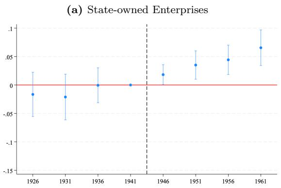

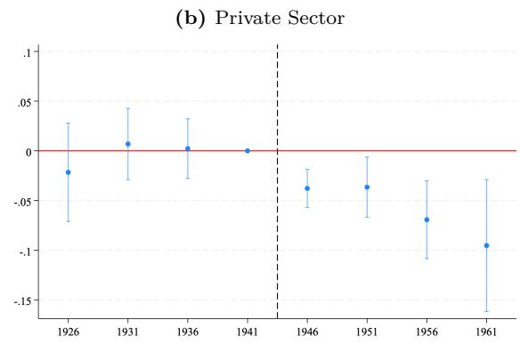

(c) Government  
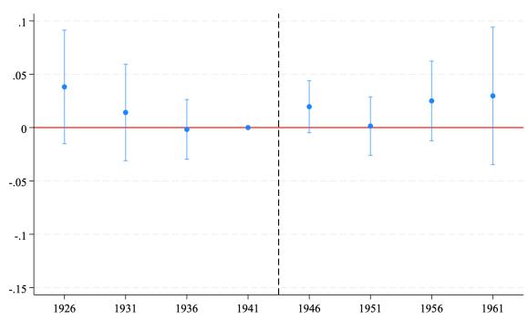  
Fig. 3. Public Employment Guarantee and Sector of Employment – Urban Male Wage Workers

Notes: These figures plot the estimated effect of exposure to the PEG on the probability of employment in each sector among male wage workers in urban districts, by birth cohort. The sample is restricted to males aged 30 to 60 years, born in 1963 or earlier, in 1986, 1996, and 2006, residing in an urban district at the time of the census. The dependent variable in each panel is a binary indicator equal to 1 if the wage worker is employed in the specified sector and 0 otherwise. The estimates are obtained from equation (1), a specification that interacts birth cohort dummies with a continuous measure of treatment intensity: the number of secondary schools per 1,000 school-aged individuals (aged 15–19 in 1960) in the district of birth in 1959/1960. The omitted cohort is 1941. Controls include the share of cultivated land redistributed between 1952 and 1961 by the land reform, interacted with birth cohort, as well as fixed effects for birth cohort, district of birth, census year, and age. Standard errors are clustered at the district of birth level. Vertical bars represent 95% confidence intervals. Source: Authors' calculations based on IPUMS Egypt census data (1986, 1996, 2006) and administrative school statistics (1959/1960).

Industry of Employment Next, we examine the impact of the PEG on the industry of employment among urban male wage workers. Figure 5 reports event-study estimates by industry. Among the PEG-treated cohorts (born 1946 or later), men born in districts with higher pre-reform secondary school supply are significantly less likely to be employed in agriculture and significantly more likely to be employed in manufacturing than men born in low-supply districts, relative to the same differential for the omitted 1941 cohort. The pre-PEG cohorts display no such differential, consistent with parallel trends. This pattern is consistent with the PEG disproportionately channeling secondary and university graduates into sectors where SOEs and public investment were concentrated, particularly manufacturing. Together with the sector-of-employment results in Figure 3, the estimates indicate that the PEG reshaped urban labor markets not only across ownership types—from private firms to SOEs—but also across industries, shifting employment away from agriculture, fishing, and forestry, and

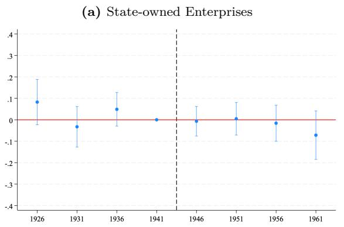

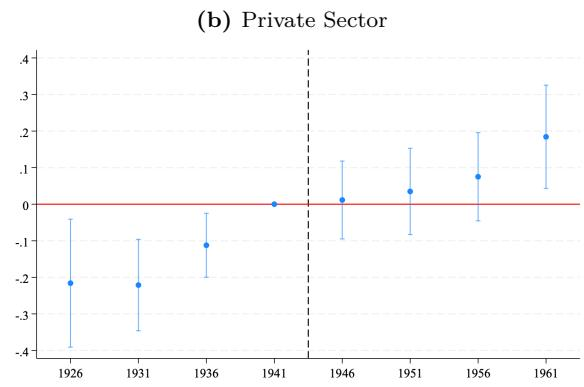

(c) Government  
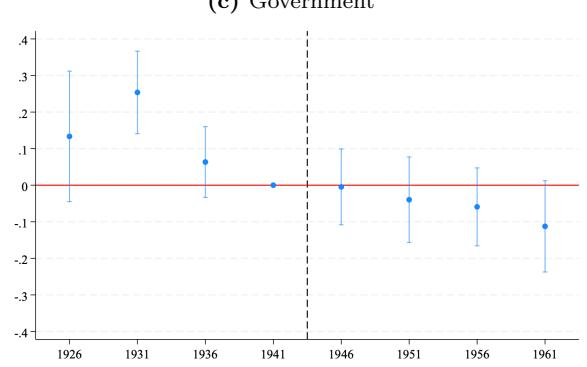  
Fig. 4. Public Employment Guarantee and Sector of Employment – Rural Male Wage Workers

Notes: These figures plot the estimated effect of exposure to the PEG on the probability of employment in each sector among male wage workers in rural districts, by birth cohort. The sample is restricted to males aged 30 to 60 years, born in 1963 or earlier, in 1986, 1996, and 2006, residing in a rural district at the time of the census. The dependent variable in each panel is a binary indicator equal to 1 if the wage worker is employed in the specified sector and 0 otherwise. The estimates are obtained from equation (1), a specification that interacts birth cohort dummies with a continuous measure of treatment intensity: the number of secondary schools per 1,000 school-aged individuals (aged 15–19 in 1960) in the district of birth in 1959/1960. The omitted cohort is 1941. Controls include the share of cultivated land redistributed between 1952 and 1961 by the land reform, interacted with birth cohort, as well as fixed effects for birth cohort, district of birth, census year, and age. Standard errors are clustered at the district of birth level. Vertical bars represent 95% confidence intervals. Source: Authors' calculations based on IPUMS Egypt census data (1986, 1996, 2006) and administrative school statistics (1959/1960).

toward industry. $^{22}$

Occupation of Employment Turning to occupational outcomes, Figure 6 shows that secondary school supply predicts a substantially higher probability of white-collar employment among the post-PEG cohorts, with no comparable gradient among the pre-PEG cohorts. $^{23}$ Disaggregating into high- and low-skilled categories, $^{24}$ Figure 7 shows that this is driven entirely by high-skilled white-collar occupations. Figure 8 examines occupational outcomes at finer disaggregation: the increase is concentrated in professionals, technicians, and associate professionals. This is consistent with the PEG sorting an existing pool of secondary- and university-educated wage workers into higher-skilled white-collar occupations that required secondary schooling or university degree. We examine the educational-attainment response separately in Section 7. $^{25}$

To explore these dynamics further, we exploit more detailed occupational categories available only in the 1986 census, which allow us to disaggregate high-skilled white-collar occupations beyond what is reported in Figure 8. Figure C.6 in Appendix C presents this analysis. The same gradient appears in specific occupations such as engineering technicians—including civil engineering technicians and electrical and electronics engineering technicians—which fall under the broader “technicians and associate professionals” category in Figure 8. $^{26}$ Together, these results indicate that the PEG contributed to occupational upgrading in urban labor markets.

Additional Outcomes In Appendix C, we examine the upstream labor-supply margins: labor force participation, employment, and wage versus self-employment. Consistent with the policy's design as a sectoral sorting instrument—and with the near-universality of male labor supply in Egypt (urban male LFP and employment rates are 92% and 90% respectively; Table 1)—we find limited movement on these margins (Figures C.2 and C.3). Urban LFP coefficients are economically small relative to the 92% base rate, with absolute magnitudes within roughly 2–3 percentage points across all cohorts, and the pre-treatment coefficients are not uniformly null: the 1936 cohort coefficient is significantly negative but of the same modest order as the post-treatment estimates. We interpret this as evidence that PEG's effects materialize through sectoral, industrial, and occupational reallocation within urban male wage employment, not through entry into the labor force, and that any residual

(a) Agricultural, Fishing, and Forestry  
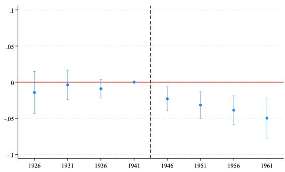  
(c) Mining and Extraction

(b) Manufacturing  
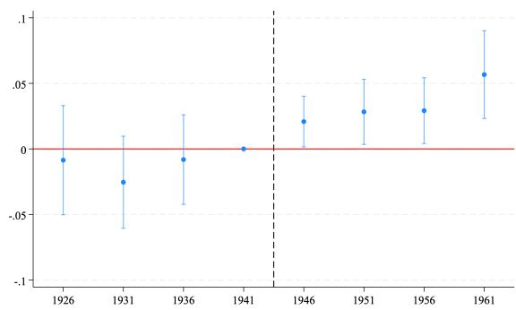  
(d) Electricity, Gas, Water, and Waste Management

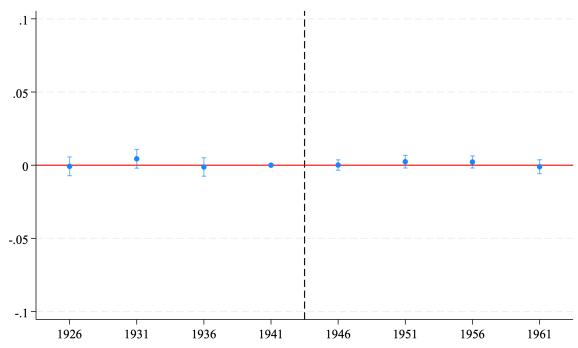  
(e) Construction

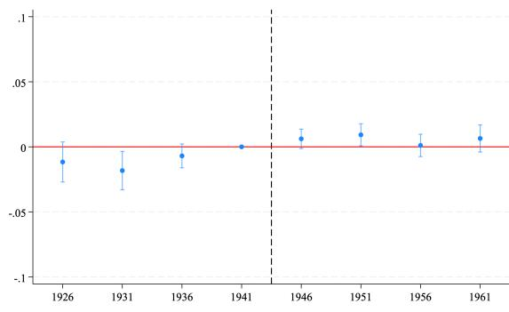

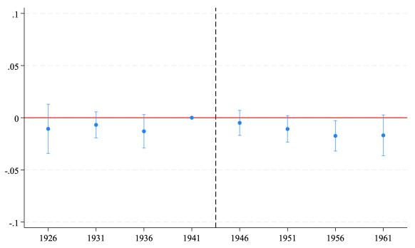

(f) Services  
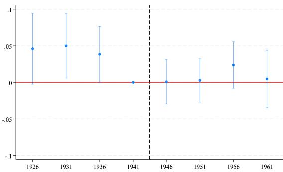  
Fig. 5. Public Employment Guarantee and Industry of Employment – Urban Male Wage Workers

Notes: These figures plot the estimated effect of exposure to the PEG on the probability of employment in each industry among wage workers in urban districts, by birth cohort. The sample is restricted to males aged 30 to 60 years, born in 1963 or earlier, in 1986, 1996, and 2006. The dependent variable in each panel is a binary indicator equal to 1 if the wage worker is employed in the specified industry and 0 otherwise. The estimates are obtained from a specification that interacts birth cohort dummies with a continuous measure of treatment intensity: the number of secondary schools per 1,000 school-aged individuals (aged 15–19 in 1960) in the district of birth in 1959/1960. The omitted cohort is 1941. Controls include the share of cultivated land redistributed between 1952 and 1961 by the land reform, interacted with birth cohort, as well as fixed effects for birth cohort, district of birth, census year, and age. Standard errors are clustered at the district of birth level. Vertical bars represent 95% confidence intervals.

Source: Authors' calculations based on IPUMS Egypt census data (1986, 1996, 2006) and administrative school statistics (1959/1960).

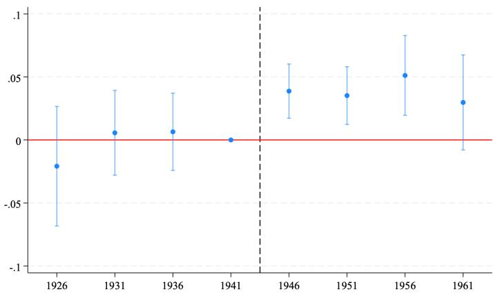  
Fig. 6. Public Employment Guarantee and Occupation of Employment (White-Collar vs. Blue-Collar) – Urban Male Wage Workers

Notes: These figures plot the estimated effect of exposure to the PEG on the probability of working in a white-collar job (as opposed to a blue-collar job) among wage workers in urban districts, by birth cohort. The sample is restricted to males aged 30 to 60 years, born in 1963 or earlier, in 1986, 1996, and 2006. The dependent variable is a binary indicator equal to 1 if the individual is employed white-collar occupation and 0 if he is employed in blue-collar occupation. White-collar occupations comprise ISCO-88 Major Groups 1–5 (legislators, senior officials, and managers; professionals; technicians and associate professionals; clerks; service workers and shop and market sales). Blue-collar occupations comprise Major Groups 6–9 (skilled agricultural and fishery workers; crafts and related trades workers; plant and machine operators and assemblers; elementary occupations). The estimates are obtained from a specification that interacts birth cohort dummies with a continuous measure of treatment intensity: the number of secondary schools per 1,000 school-aged individuals (aged 15–19 in 1960) in the district of birth in 1959. The omitted cohort is 1941. Controls include the share of cultivated land redistributed between 1952 and 1961 by the land reform, interacted with birth cohort, as well as fixed effects for birth cohort, district of birth, census year, and age. Standard errors are clustered at the district of birth level. Vertical bars represent 95% confidence intervals.

Source: Authors' calculations based on IPUMS Egypt census data (1986, 1996, 2006) and administrative school statistics (1959/1960).

(a) High-Skilled White-Collar  
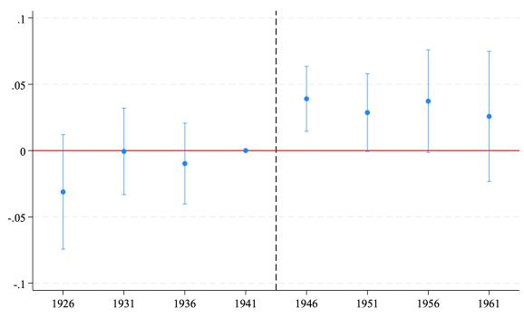

(b) Low-Skilled White-Collar  
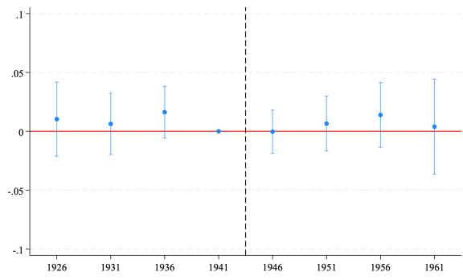  
(d) Low-Skilled Blue-Collar

(c) High-Skilled Blue-Collar  
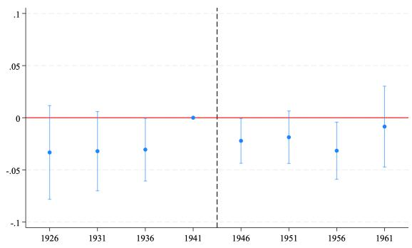

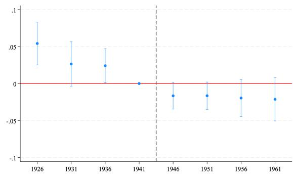  
Fig. 7. Public Employment Guarantee and Occupation of Employment (White-Collar vs. Blue-Collar by Skill Level) – Male Wage Workers in Urban Districts

Notes: These figures plot the estimated effect of exposure to the PEG on the probability of working as a white-collar worker among wage workers in urban districts, by birth cohort. The sample is restricted to males aged 30 to 60 years, born in 1963 or earlier, in 1986, 1996, and 2006, who are wage workers. The dependent variable is a binary indicator equal to 1 if the individual is employed in the corresponding occupation and 0 otherwise. High-skilled white-collar comprises ISCO-88 Major Groups 1–3 (legislators, senior officials, and managers; professionals; technicians and associate professionals). Low-skilled white-collar comprises Major Groups 4–5 (clerks; service workers and shop and market sales). High-skilled blue-collar comprises Major Groups 6–8 (skilled agricultural and fishery workers; crafts and related trades workers; plant and machine operators and assemblers). Low-skilled blue-collar consists of Major Group 9 (elementary occupations). The estimates are obtained from a specification that interacts birth cohort dummies with a continuous measure of treatment intensity: the number of secondary schools per 1,000 school-aged individuals (aged 15–19 in 1960) in the district of birth in 1959/1960. The omitted cohort is 1941. Controls include the share of cultivated land redistributed between 1952 and 1961 by the land reform, interacted with birth cohort, as well as fixed effects for birth cohort, district of birth, census year, and age. Standard errors are clustered at the district of birth level. Vertical bars represent 95% confidence intervals. Source: Authors' calculations based on IPUMS Egypt census data (1986, 1996, 2006) and administrative school statistics (1959/1960).

(a) Legislators, Senior Officials and Managers  
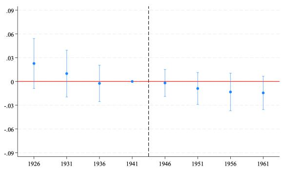

(b) Professionals  
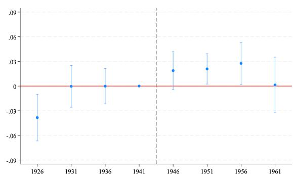  
(d) Clerks

(c) Technicians and Associate Professionals  
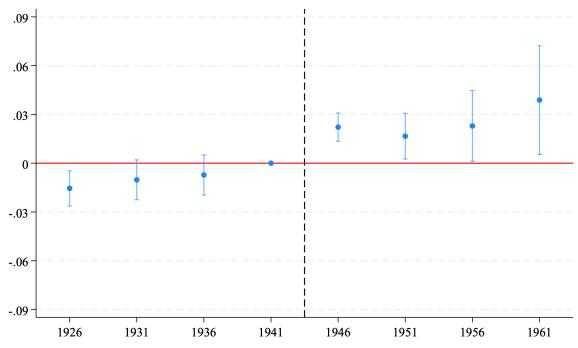  
(e) Service Workers and Shop and Market Sales

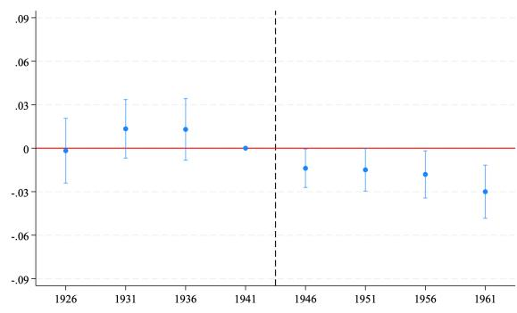

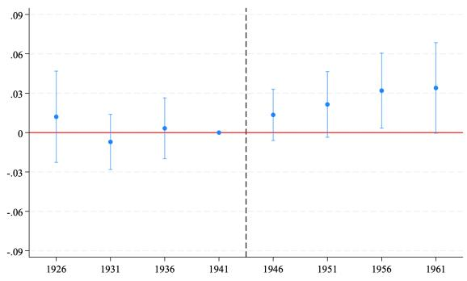

(f) Skilled Agricultural and Fishery Workers  
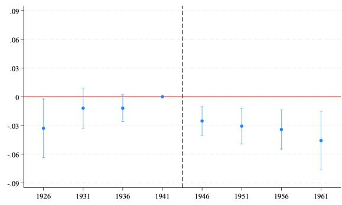

(g) Crafts and Related Trades Workers  
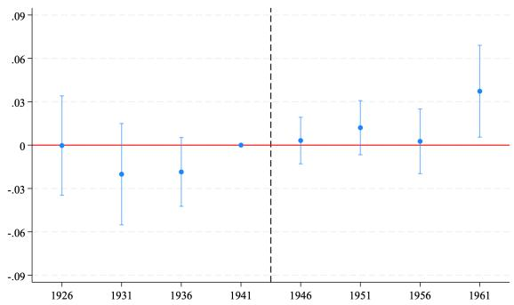

(h) Plant and Machine Operators and Assemblers  
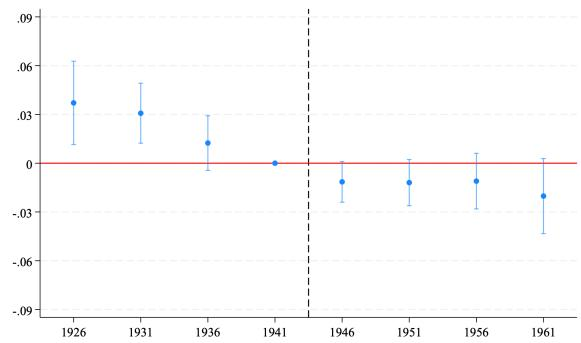

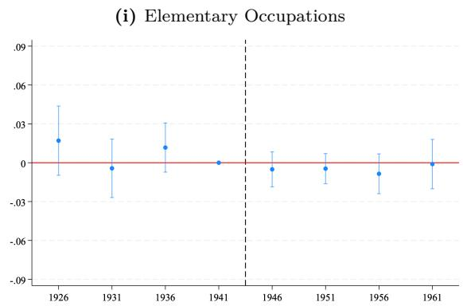  
Fig. 8. Public Employment Guarantee and Disaggregated Occupation of Employment – Male Wage Workers in Urban Districts

Notes: These figures plot the estimated effect of exposure to the PEG on the probability of working as a wage worker in each occupational category in urban districts, by birth cohort. The sample is restricted to males aged 30 to 60 years, born in 1963 or earlier, in 1986, 1996, and 2006. Panels (a)–(i) correspond to ISCO-88 Major Groups 1–9, respectively. The estimates are obtained from a specification that interacts birth cohort dummies with a continuous measure of treatment intensity: the number of secondary schools per 1,000 school-aged individuals (aged 15–19 in 1960) in the district of birth in 1959/1960. The omitted cohort is 1941. Controls include the share of cultivated land redistributed between 1952 and 1961 by the land reform, interacted with birth cohort, as well as fixed effects for birth cohort, district of birth, census year, and age. Standard errors are clustered at the district of birth level. Vertical bars represent 95% confidence intervals.

Source: Authors' calculations based on IPUMS Egypt census data (1986, 1996, 2006) and administrative school statistics (1959/1960).

extensive-margin movement is too small to compete with the sectoral shifts documented above.

The one upstream margin that does move is rural wage employment conditional on being employed (Figure C.4). In high-school-supply rural districts, PEG-treated cohorts are less likely to be wage workers and more likely to be self-employed, compared to the 1941 cohort, with the shift concentrated in agriculture (Figure C.5). Because the PEG could not directly absorb workers in rural districts—where SOEs were largely absent—this pattern is not a PEG sectoral effect. It is more consistent with school supply also capturing broader human-capital infrastructure: cohorts with more local schooling are less likely to take up agricultural wage labor and more likely to operate own-account plots, which became more widely available after the 1952–1961 land reform. $^{27}$ This interpretation reinforces the placebo logic invoked for Figure 4: in rural districts, where PEG's SOE channel was inactive, school supply still influences labor allocation, but through ordinary human-capital channels rather than guaranteed public-sector absorption.

For completeness, Appendix E reports event-study estimates for women: labor force participation (Figure E.2), wage employment conditional on being employed (Figure E.3), and sectoral allocation in urban and rural districts (Figures E.4 and E.5). For the reasons discussed in Section 3.2, these estimates are descriptive: they do not address selection into employment or into wage employment, and several outcomes exhibit clear pre-treatment trends. They should not be interpreted as causal effects of the PEG on women's labor market outcomes.

## 6 Robustness Checks

This section reports robustness checks organized around the three identifying assumptions discussed in Section 4: no anticipation, parallel trends, and SUTVA (no spillovers).

No Anticipation: Alternative Reference Cohort As discussed in Section 4, individuals in the omitted 1941 cohort—who were between 18 and 22 years old in 1961—may have been partially exposed to the PEG through the gradual implementation of the reforms beginning in that year. If so, using it as the reference would bias post-treatment $\beta_{c}$ coefficients toward zero and pre-treatment coefficients downward. We re-estimate equation (1) with the 1936 cohort (born 1934–1938) as the omitted cohort and the 1941 cohort treated as a partially exposed group. Results from this alternative specification, reported in Figure D.1 in Appendix D, yield qualitatively similar patterns, with the PEG inducing a reallocation of wage employment away from the private sector and toward state-owned enterprises in urban districts. $^{28}$ Taken together, these results indicate that our main findings are not sensitive to the choice of the omitted cohort.

Parallel Trends: Functional Form and Treatment Construction The strong parallel-trends assumption requires that counterfactual trends are similar at any level of school supply, not merely across treated and untreated districts (Section 4). We probe this from three angles.

Linearity. Figure D.2 plots the average change in sectoral employment between the 1946 and 1941 cohorts against the mean pre-reform secondary school supply within each quartile of the treatment distribution. Across all three sectors, the relationship between treatment intensity and the outcome change is approximately linear. Districts at the highest quartile of pre-reform school supply witnessed the smallest decline in SOE employment and the smallest increase in private sector employment relative to districts in the lowest quartile, consistent with the PEG progressively absorbing secondary graduates into public sector positions as treatment intensity increases. This monotone gradient across quartiles supports the use of a continuous treatment variable in our difference-in-differences specification.

Discretization. Replacing the continuous treatment with a binary above/below-median indicator preserves the SOE-versus-private-sector reallocation: cohorts born in above-median districts are more likely to be employed in SOEs after the reform (Figure D.3). Estimating the same specification with quartile indicators relative to the bottom quartile shows the largest effects in the top quartile (Figure D.4).

Alternative Disaggregation. We reconstruct the treatment variable using an alternative disaggregation procedure. Rather than using the 1951/1952 district-level distribution of non-elementary schools to allocate province-level secondary school totals across districts, we instead use the 1959/1960 within-province distribution of secondary schools to disaggregate the 1951/1952 district-level counts of non-elementary schools. The results are qualitatively similar to our baseline findings (Figure D.5).

Parallel Trends: Post-PEG School Expansion Districts with higher pre-reform school supply may also have expanded faster after the reform, in which case the estimates would reflect post-reform schooling capacity rather than the PEG (Section 4). We add an interaction of secondary-school growth between 1959/1960 and 1969/1970 with birth-cohort indicators to equation (1); the estimates are unchanged (Figure D.7).

No Spillovers (SUTVA) Identification requires that low-supply districts are not affected by PEG exposure in high-supply neighbors through general-equilibrium channels such as labor-market competition (Section 4). As a placebo test, we replace each district's treatment with the mean pre-reform school supply of districts whose centroids fall within 100 km of it (Figure D.6). Under no spillovers, neighbors' supply should not predict a district's labor-market outcomes. $^{29}$ The estimated coefficients are statistically insignificant or point in the opposite direction to the main estimates. This suggests that the identifying variation is genuinely local, and that neighboring districts' school supply do not proxy for own-district PEG exposure.

## 7 Mechanisms

This section discusses potential mechanisms underlying the main findings reported in Section 5, focusing on labor supply and labor demand responses to the introduction of Egypt's PEG.

## 7.1 Labor Supply Response

On the labor supply side, we focus on how the PEG influenced educational choices and human capital accumulation, as well as patterns of internal labor mobility.

Education and Human Capital Accumulation. We begin by examining the impact of the PEG on educational attainment. Our primary outcome is a binary indicator equal to 1 if the individual has completed at least secondary education and 0 otherwise. $^{30}$ Figure 9 reports results for men in urban and rural districts. In urban districts, the PEG had a positive effect on secondary and higher-degree completion for treated cohorts, although the effect is statistically significant only for the 1946 cohort. In rural districts, the results are less clear, partly due to the presence of pre-trends.

(a) Urban  
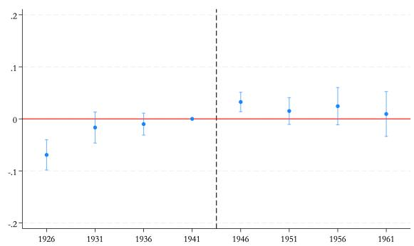

(b) Rural  
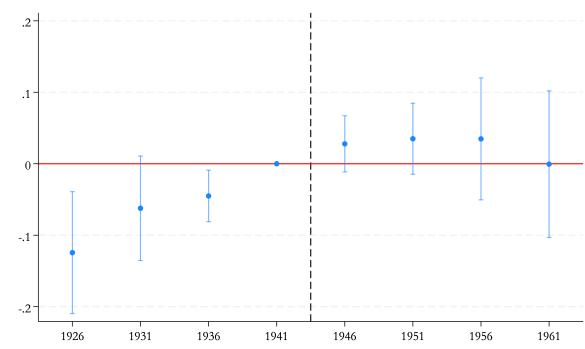  
Fig. 9. Public Employment Guarantee and Male Secondary or Above Educational Attainment

Notes: These figures plot the estimated effect of exposure to the PEG on the probability of at least completing secondary education by birth cohort, separately for urban districts in (a) and rural districts in (b). The sample is restricted to males aged 23 to 60 years, born in 1963 or earlier, in 1986, 1996, and 2006. The dependent variable is a binary indicator equal to 1 if an individual has completed at least secondary education. The estimates are obtained from a specification that interacts birth cohort dummies with a continuous measure of treatment intensity: the number of secondary schools per 1,000 school-aged individuals (aged 15–19 in 1960) in the district of birth in 1959/1960. The omitted cohort is 1941. Controls include the share of cultivated land redistributed between 1952 and 1961 by the land reform, interacted with birth cohort, as well as fixed effects for birth cohort, district of birth, census year, and age. Standard errors are clustered at the district of birth level. Vertical bars represent 95% confidence intervals.

Source: Authors' calculations based on IPUMS Egypt census data (1986, 1996, 2006) and administrative school statistics (1959/1960).

The limited positive effect in urban districts indicates that the PEG may have only modestly influenced the incentive to complete secondary education and above, where returns were more closely tied to public sector employment. Urban cohorts faced comparatively better opportunities to respond, owing to greater access to secondary schools and the concentration of public jobs in urban districts. That the effect is significant only for the 1946 cohort indicates that the response was limited and cohort specific. In Appendix C, Figure C.1 reports analogous results using years of schooling as the outcome, which reveals similar trends. Overall, the evidence indicates that education was increasing steadily over time. Although educational attainment continued to rise following the PEG, these patterns primarily reflect ongoing secular trends rather than a direct effect of the PEG.

Furthermore, Figure 10 disaggregates educational attainment into secondary, post-secondary, and university degrees, conditional on having completed at least secondary education. The estimates point to a shift from secondary school completion to university degree completion, following the PEG.

(a) Secondary  
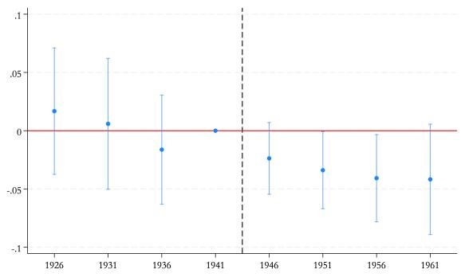

(b) Post-Secondary  
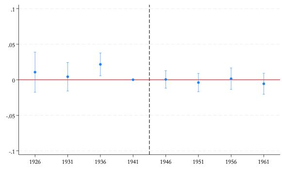

(c) University  
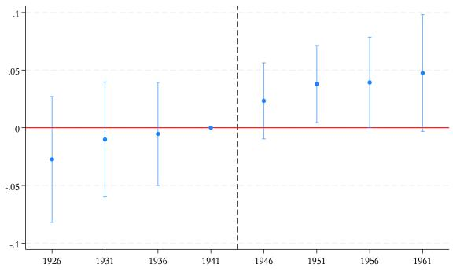  
Fig. 10. Public Employment Guarantee and Educational Attainment by Level – Urban Males Who Completed at Least Secondary

Notes: These figures plot the estimated effect of exposure to the PEG on the probability of completing each level of education, by birth cohort. The sample is restricted to males aged 23 to 60 years, born in 1963 or earlier, in 1986, 1996, and 2006 who have at least completed secondary education, in urban districts. The dependent variable is a binary indicator equal to 1 if an individual has completed secondary education in (a), post-secondary in (b), and university in (c). The estimates are obtained from a specification that interacts birth cohort dummies with a continuous measure of treatment intensity: the number of secondary schools per 1,000 school-aged individuals (aged 15–19 in 1960) in the district of birth in 1959/1960. The omitted cohort is 1941. Controls include the share of cultivated land redistributed between 1952 and 1961 by the land reform, interacted with birth cohort, as well as fixed effects for birth cohort, district of birth, census year, and age. Standard errors are clustered at the district of birth level. Vertical bars represent 95% confidence intervals.

Source: Authors' calculations based on IPUMS Egypt census data (1986, 1996, 2006) and administrative school statistics (1959/1960).

Internal Migration. The effects of the PEG are concentrated among urban male wage workers, as documented in Section 5, raising the possibility that rural-urban migration may have contributed to these effects. To explore this channel, we restrict the analysis to urban male wage workers and examine heterogeneity by place of birth, among individuals born in urban districts (Figure 11) versus those born in rural districts (Figure 12). We define district of birth based on harmonized district boundaries from the 1947 census. An individual is classified as rural-born if their birth district appears in the 1961 Agricultural Census dataset — which, by construction, only includes districts with agricultural land — and as urban-born otherwise, since urban districts are absent from the 1961 Agricultural Census precisely because they do not contain agricultural land. $^{31}$ This distinction allows us to capture rural-urban migration: individuals residing in an urban district at the time of the census who were born in a rural district may have migrated in response to the PEG, representing a potential mobility channel through which the reform affected urban male wage labor markets.

The results indicate that the estimated effects on SOE employment are driven almost entirely by urban-born individuals residing in urban districts at the time of the census. As shown in Figure 11, PEG-treated urban-born cohorts born in districts with higher secondary school supply experienced an increase in employment in SOEs alongside a decline in private-sector employment. In contrast, among rural-born individuals residing in urban districts, we observe a decline in private-sector employment with corresponding reallocation toward the government sector, not SOEs. Taken together, these findings suggest that the labor market impacts of the PEG are primarily driven by individuals born and residing in urban districts rather than by rural-to-urban migrants.

(a) State-owned Enterprises  
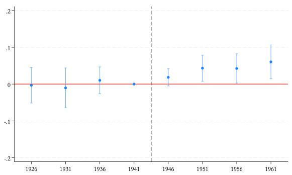

(b) Private Sector  
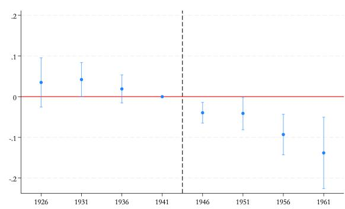

(c) Government  
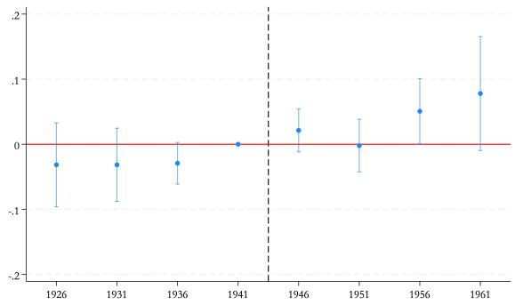  
Fig. 11. Public Employment Guarantee and Sector of Employment - Urban-Born Male Wage Workers in Urban Districts

Notes: These figures plot the estimated effect of exposure to the PEG on the probability of employment in each sector among urban wage workers, by birth cohort. The sample is restricted to males aged 30 to 60 years, born in 1963 or earlier, in 1986, 1996, and 2006, who were born in an urban district and reside in an urban district. The dependent variable in each panel is a binary indicator equal to 1 if the wage worker is employed in the specified sector and 0 otherwise. The estimates are obtained from a specification that interacts birth cohort dummies with a continuous measure of treatment intensity: the number of secondary schools per 1,000 school-aged individuals (aged 15–19 in 1960) in the district of birth in 1959. The omitted cohort is 1941. Controls include the share of cultivated land redistributed between 1952 and 1961 by the land reform, interacted with birth cohort, as well as fixed effects for birth cohort, district of birth, census year, and age. Standard errors are clustered at the district of birth level. Vertical bars represent 95% confidence intervals.

Source: Authors' calculations based on IPUMS Egypt census data (1986, 1996, 2006) and administrative school statistics (1959/1969).

Fig. 12. Public Employment Guarantee and Sector of Employment - Rural-Born Male Wage Workers in Urban Districts  
(a) State-owned enterprises  
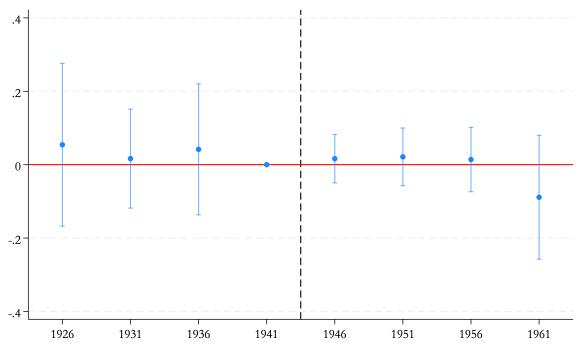

(b) Private sector  
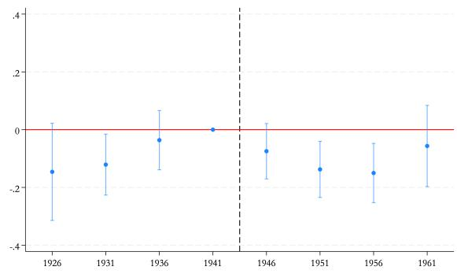  
(c) Government

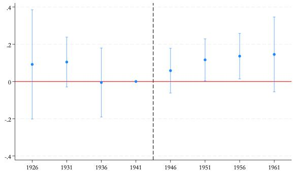

Notes: These figures plot the estimated effect of exposure to the PEG on the probability of employment in each sector among urban wage workers, by birth cohort. The sample is restricted to males aged 30 to 60 years, born in 1963 or earlier, in 1986, 1996, and 2006, who were born in a rural district and reside in an urban district. The dependent variable in each panel is a binary indicator equal to 1 if the wage worker is employed in the specified sector and 0 otherwise. The estimates are obtained from a specification that interacts birth cohort dummies with a continuous measure of treatment intensity: the number of secondary schools per 1,000 school-aged individuals (aged 15–19 in 1960) in the district of birth in 1959/1960. The omitted cohort is 1941. Controls include the share of cultivated land redistributed between 1952 and 1961 by the land reform, interacted with birth cohort, as well as fixed effects for birth cohort, district of birth, census year, and age. Standard errors are clustered at the district of birth level. Vertical bars represent 95% confidence intervals.

Source: Authors' calculations based on IPUMS Egypt census data (1986, 1996, 2006) and administrative school statistics (1959/1960).

## 7.2 Labor Demand Response (In Progress)

While the previous section focuses on labor supply response to the PEG, this section will examine potential labor demand-side mechanisms through which the PEG may have affected employment outcomes. In particular, we will explore whether the observed reallocation of employment toward SOEs and manufacturing reflects changes in the structure of firms and employment opportunities in the public sector.

One potential channel is an expansion in the number of SOEs, particularly in manufacturing, during the period surrounding the implementation of the PEG. Egypt's development strategy in the 1960s emphasized state-led industrialization, and the PEG may have interacted with this strategy by increasing labor demand in publicly owned firms. To explore this possibility, we will examine evidence from the Industrial Census on the number and distribution of public and private establishments over time.

A second, closely related channel operates through the nationalization of existing private firms. Rather than reflecting the creation of new SOEs, the increase in public sector employment may have been driven by the transfer of ownership from private to public. Using establishment-level data from the Industrial Census, we will assess changes in the composition of public and private establishments to shed light on whether the expansion of SOE employment coincided with a contraction of private ownership at the firm level.

Finally, it is possible that the observed employment effects reflect neither the entry of new SOEs nor the nationalization of private firms, but instead an expansion of employment within existing public enterprises. Under this scenario, the PEG may have relaxed hiring constraints or increased budgetary allocations to SOEs, allowing them to absorb additional workers without a corresponding increase in the number of establishments. We will therefore examine changes in employment levels within public enterprises to distinguish between extensive-margin adjustments (firm creation or nationalization) and intensive-margin adjustments (workforce expansion within existing SOEs).

## 8 Concluding Remarks

This paper examines the long-run labor market consequences of Egypt's public employment guarantee (PEG), a defining feature of its post-1952 political economy. By linking pre-PEG secondary school capacity—measured using newly assembled historical data on secondary school availability—to individual-level census microdata, the analysis provides causal evidence on how the PEG reshaped employment patterns for urban male wage workers. The findings point to substantial structural effects: the PEG induced a large reallocation of labor away from the private sector and toward state-owned enterprises (SOEs), consistent with public sector crowding-out. This reallocation was not uniform across the economy. It was concentrated in manufacturing, in line with the state's industrialization strategy, and was accompanied by occupational upgrading, with treated cohorts moving into high-skilled white-collar positions.

On the supply side, we find only modest effects on educational attainment itself, indicating that the policy primarily redirected an already growing pool of educated workers rather than expanding it through additional schooling. We cannot, however, rule out skill acquisition through on-the-job training within state-owned enterprises, which is not captured by census-based education measures. On the demand side, the PEG generated a large, non-market-based demand for educated labor, which was met by absorbing graduates into SOEs that were central to the state's development strategy. The resulting effects are concentrated among urban-born individuals, indicating that the policy reshaped urban labor markets rather than encouraging large-scale rural-to-urban migration for public employment.

More broadly, the results show that public employment guarantees can have lasting effects on sectoral composition, occupational allocation, and the structure of labor markets. By documenting how Egypt's PEG operated through both labor supply and labor demand channels, the analysis clarifies the mechanisms linking state-led employment policies to industrial strategy. The findings highlight the central role of employment guarantees in shaping development trajectories and the trade-offs they entail between social protection, private sector development, and structural transformation.

From a policy perspective, the evidence illustrates the double-edged nature of employment guarantees. On the one hand, the PEG absorbed educated youth, which likely eased social pressures and contributed to occupational upgrading. On the other habd, it may have distorted labor market incentives by crowding out private-sector employment, with potential long-run consequences for economic dynamism and productivity. The eventual fiscal unsustainability of the scheme—manifested in long queues and its de facto suspension—underscores the constraints facing expansive public employment commitments as instruments of development policy.

Agarwal, S., Alok, S., Chopra, Y., Tantri, P., 2021. Government employment guarantee, labor supply, and firms' reaction: Evidence from the largest public workfare program in the world. Journal of Financial and Quantitative Analysis 56, 409–442.

Al-Enezi, A.K., 2002. Kuwait's employment policy: Its formulation, implications, and challenges. International Journal of Public Administration 25, 885–900.

Algan, Y., Cahuc, P., Zylberberg, A., 2002. Public employment and labour market performance. Economic Policy 17, 7–66.

Annuaire Statistique, 1953. Years covered 1949–1950 et 1950–1951. Cairo: Imprimerie Nationale.

Assaad, R., 1997. The effects of public sector hiring and compensation policies on the Egyptian labor market. The World Bank Economic Review 11, 85–118.

Assaad, R., Barsoum, G., 2019. Public employment in the Middle East and North Africa. IZA World of Labor.

Azam, M., 2012. The impact of Indian job guarantee scheme on labor market outcomes: Evidence from a natural experiment. Technical Report. IZA Discussion Papers.

Becker, S.O., Heblich, S., Sturm, D.M., 2021. The impact of public employment: Evidence from Bonn. Journal of Urban Economics 122, 103291.

Behar, A., Mok, J., 2019. Does public-sector employment fully crowd out private-sector employment? Review of Development Economics 23, 1891–1925.

Berhane, G., Gilligan, D.O., Hoddinott, J., Kumar, N., Taffesse, A.S., 2014. Can Social Protection Work in Africa? The Impact of Ethiopia's Productive Safety Net Programme. Economic Development and Cultural Change 63, 1–26.

Bernard, A., Bell, M., 2018. Internal migration and education: A cross-national comparison. arXiv preprint arXiv:1812.08913.

Cai, F., Park, A., Zhao, Y., 2008. The Chinese Labor Market in the Reform Era, in: Brandt, L., Rawski, T.G. (Eds.), China’s Great Economic Transformation. Cambridge University Press, pp. 167–214.

Callaway, B., Goodman-Bacon, A., Sant'Anna, P.H.C., 2024. Difference-in-Differences with a Continuous Treatment. NBER Working Paper 32117. National Bureau of Economic Research. URL: https://www.nber.org/papers/w32117, doi:10.3386/w32117.

Caponi, V., 2017. Public employment policies and regional unemployment differences. Regional Science and Urban Economics 63, 1–12.

Chengappa, B.M., 2002. Pakistan: impact of Islamic socialism. Strategic Analysis 26, 27–47.

Chernykh, L., 2011. Profit or politics? Understanding renationalizations in Russia. Journal of corporate Finance 17, 1237–1253.

Demekas, D.G., Kontolemis, Z.G., 2000. Government employment and wages and labour market performance. Oxford Bulletin of Economics and Statistics 62, 391–415.

Desai, R.M., Olofsgård, A., Yousef, T.M., 2009. The Logic of Authoritarian Bargains. Economics & Politics 21, 93–125.

Galasso, E., Ravallion, M., 2004. Social Protection in a Crisis: Argentina's Plan Jefes y Jefas. The World Bank Economic Review 18, 367–399.

Gatti, R., Özden, Ç., Torres, J., Baghdadi, L., Sergenti, E.J., Islam, A.M., Gaddis, I., Mele, G., Chun, S., Parro, F., et al., 2025. Menaap economic update, october 2025: Jobs and women: Untapped talent, unrealized growth

Gatti, R., Torres, J., Elmallakh, N., Mele, G., Faurès, D., Mousa, M.E., Suvanov, I., 2024. Mena economic update, october 2024: Growth in the middle east and north africa.

Guriev, S., Kolotilin, A., Sonin, K., 2011. Determinants of nationalization in the oil sector: A theory and evidence from panel data. The Journal of Law, Economics, & Organization 27, 301–323.

He, H., Huang, F., Liu, Z., Zhu, D., 2018. Breaking the “Iron Rice Bowl:” Evidence of Precautionary Savings from the Chinese State-Owned Enterprises Reform. Journal of Monetary Economics 94, 94–113.

Huitfeldt, H., Kabbani, N., 2007. Returns to Education and the Transition from School to Work in Syria. American University of Beirut.

Imbert, C., Papp, J., 2015. Labor market effects of social programs: Evidence from india's employment guarantee. American Economic Journal: Applied Economics 7, 233–263.

Jofre-Monseny, J., Silva, J.I., Vázquez-Grenno, J., 2020. Local labor market effects of public employment. Regional Science and Urban Economics 82, 103406.

Krafft, C., Cortes-Mendoza, A., Thao, S., 2019. Internal migration and education: findings from egypt.

Malley, J., Moutos, T., 1998. Government employment and unemployment: With one hand giveth, the other taketh.

Melek, N.C., 2020. Productivity, Nationalization, and the Role of “News”: Lessons from the 1970s. Macroeconomic Dynamics 24, 1264–1298.

Mesa-Lago, C., 1972. Revolutionary change in Cuba. University of Pittsburgh Pre.

Minnesota Population Center, 2013. Integrated Public Use Microdata Series, International: Version 6.2. University of Minnesota, Minneapolis.

Moshrif, R., 2025. Long-term Land Inequality and Post-Colonial Land Reform in Egypt (1896-2020). Technical Report. HAL.

Muralidharan, K., Niehaus, P., Sukhtankar, S., 2023. General equilibrium effects of (improving) public employment programs: Experimental evidence from India. Econometrica 91, 1261–1295.

Pastore, F., 2015. The European Youth Guarantee: labor market context, conditions and opportunities in Italy. IZA Journal of European Labor Studies 4, 11.

Ravallion, M., 2019. Guaranteed Employment or Guaranteed Income? World Development 115, 209–221.

Ravallion, M., Datt, G., Chaudhuri, S., 1993. Does Maharashtra's Employment Guarantee Scheme guarantee employment? Effects of the 1988 wage increase. Economic Development and Cultural Change 41, 251–275.

Ruggles, S., Cleveland, L., Lovaton, R., Sarkar, S., Sobek, M., Burk, D., Ehrlich, D., Heimann, Q., Lee, J., 2024. Integrated public use microdata series, international: Version 7.5. URL: https://doi.org/10.18128/D020.V7.5. dataset.

Said, M., 1996. Public Sector Employment & Labor Markets in Arab Countries: Recent Developments & Policy Implications. Economic Research Forum Working Papers No. 9630.

Saleh, M., 2016. Public mass modern education, religion, and human capital in twentieth-century Egypt. The Journal of Economic History 76, 697–735.

Simson, R., 2020. The Rise and Fall of the Bureaucratic Bourgeoisie: Public Sector Employees and Economic Privilege in Postcolonial Kenya and Tanzania. Journal of International Development 32, 607–635.

Statistique Scolaire, 1959. Cairo: Imprimerie Nationale. Years covered: 1906/07, 1907/08, 1912/13, 1921/22, 1924/25, 1927/28, 1930/31, 1933/34, 1936/37, 1939/40, 1942/43, 1945/46, 1948/49, 1959/60, 1969/70.

Subbarao, K., del Ninno, C., Andrews, C., Rodríguez-Alas, C., 2013. Public Works as a Safety Net: Design, Evidence, and Implementation. Washington, DC: World Bank.

World Bank, 2014. Arab Republic of Egypt. More Jobs, Better Jobs: A Priority for Egypt. Washington DC: World Bank.

Yousef, T.M., 2004. Development, growth and policy reform in the middle east and north africa since 1950. Journal of Economic Perspectives 18, 91–116.

Zimmermann, L.V., 2024. Why guarantee employment? Evidence from a large Indian public-works program. Economic Development and Cultural Change 72, 2031–2067.

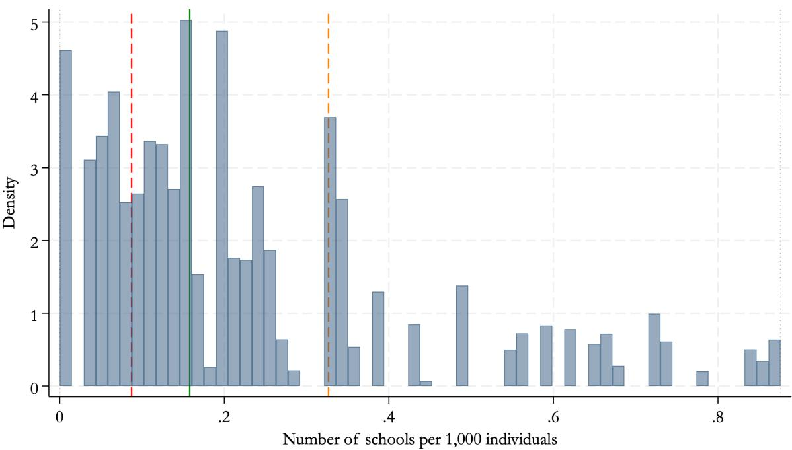  
Min = 0, P25 = .09, P50 = .16, P75 = .33, Max = .88

Fig. A.1. Distribution of Secondary School Availability in 1959/1960, Urban Male Sample

Notes: The figure plots the distribution of secondary schools per 1,000 children aged 15-19 years old (treatment intensity measure) in 1959. The variable is measured at the district level and assigned to all individuals born in the same district. The distribution is plotted using the individual-level benchmark estimation sample of urban males.

Source: Authors' elaboration based on Egypt's 1959/1960 School Census, the 1949/1950 and 1950/1951 Statistical Yearbook, and the 1960 population census.

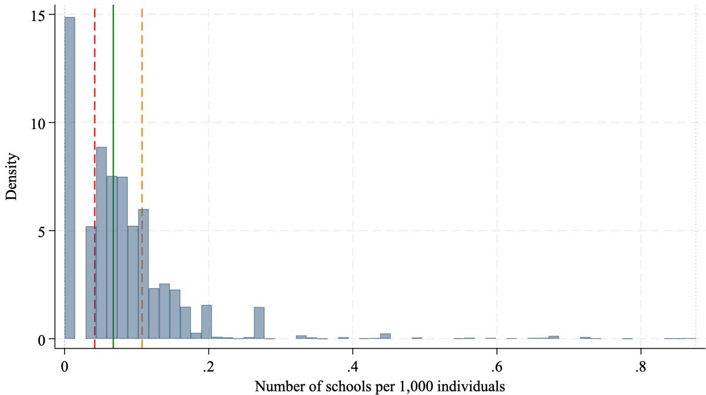  
Min = 0, P25 = .04, P50 = .07, P75 = .11, Max = .88

Fig. A.2. Distribution of Secondary School Availability in 1959/1960, Rural Male Sample

Notes: The figure plots the distribution of secondary schools per 1,000 children aged 15-19 years old (treatment intensity measure) in 1959. The variable is measured at the district level and assigned to all individuals born in the same district. The distribution is plotted using the individual-level benchmark estimation sample of rural males.

Source: Authors' elaboration based on Egypt's 1959/1960 School Census, the 1949/1950 and 1950/1951 Statistical Yearbook, and the 1960 population census.

## Appendix B Rural Sample Results

In Appendix B, we present our benchmark results for the rural male sample. Results on the industry of employment are presented in B.1 and on occupational outcomes in figures B.2, B.3 and B.4

(a) Agriculture  
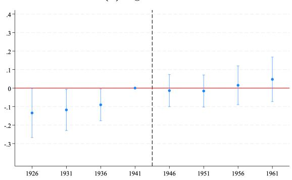  
(c) Mining and Extraction

(b) Manufacturing  
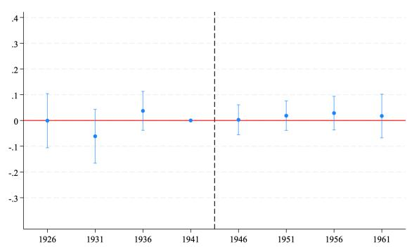  
(d) Electricity, Gas, Water, and Waste Management

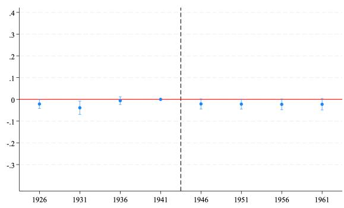  
(e) Construction

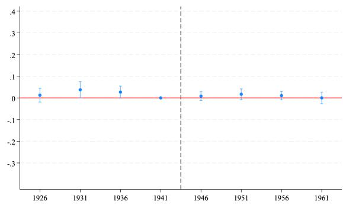

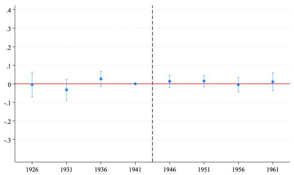

(f) Services  
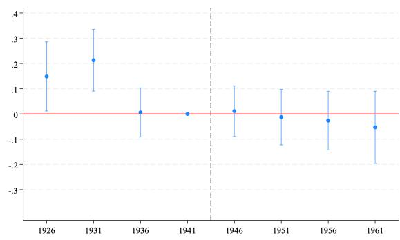  
Fig. B.1. Public Employment Guarantee and Industry of Employment – Rural Male Wage Workers

Notes: These figures plot the estimated effect of exposure to the PEG on the probability of employment in each industry among wage workers in rural districts, by birth cohort. The sample is restricted to males aged 30 to 60 years, born in 1963 or earlier, in 1986, 1996, and 2006. The dependent variable in each panel is a binary indicator equal to 1 if the wage worker is employed in the specified industry and 0 otherwise. The estimates are obtained from a specification that interacts birth cohort dummies with a continuous measure of treatment intensity: the number of secondary schools per 1,000 school-aged individuals (aged 15–19 in 1960) in the district of birth in 1959/1960. The omitted cohort is 1941. Controls include the share of cultivated land redistributed between 1952 and 1961 by the land reform, interacted with birth cohort, as well as fixed effects for birth cohort, district of birth, census year, and age. Standard errors are clustered at the district of birth level. Vertical bars represent 95% confidence intervals.

Source: Authors' calculations based on IPUMS Egypt census data (1986, 1996, 2006) and administrative school statistics (1959/1960).

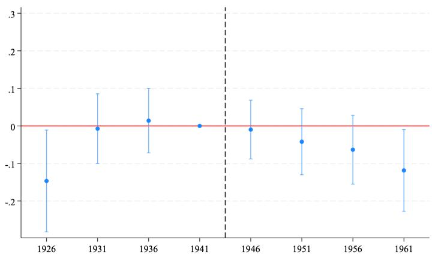  
Fig. B.2. Public Employment Guarantee and White-Collar Employment – Rural Male Wage Workers

Notes: These figures plot the estimated effect of exposure to the PEG on the probability of working in a white-collar job (as opposed to a blue-collar job) among wage workers in rural districts, by birth cohort. The sample is restricted to males aged 30 to 60 years, born in 1963 or earlier, in 1986, 1996, and 2006. The dependent variable is a binary indicator equal to 1 if the individual is employed white-collar occupation and 0 if he is employed in blue-collar occupation. The estimates are obtained from a specification that interacts birth cohort dummies with a continuous measure of treatment intensity: the number of secondary schools per 1,000 school-aged individuals (aged 15–19 in 1960) in the district of birth in 1959/1960. The omitted cohort is 1941. Controls include the share of cultivated land redistributed between 1952 and 1961 by the land reform, interacted with birth cohort, as well as fixed effects for birth cohort, district of birth, census year, and age. Standard errors are clustered at the district of birth level. Vertical bars represent 95% confidence intervals.

Source: Authors' calculations based on IPUMS Egypt census data (1986, 1996, 2006) and administrative school statistics (1959/1960).

(a) High-Skilled White Collar  
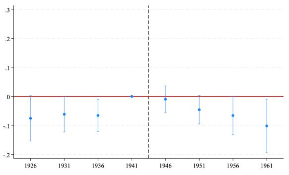  
(c) High-Skilled Blue Collar

(b) Low-Skilled White Collar  
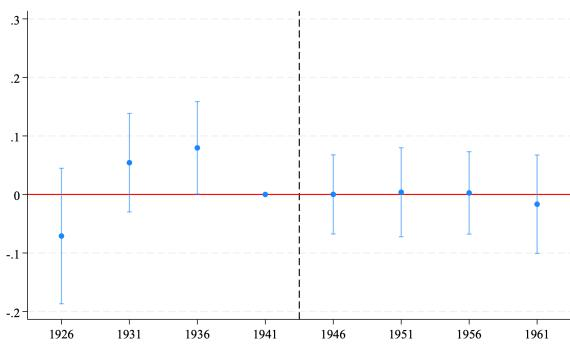  
(d) Low-Skilled Blue Collar

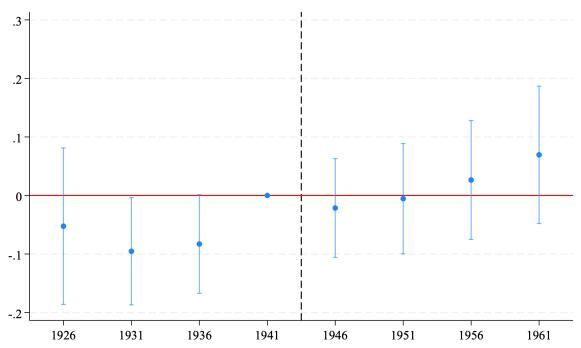

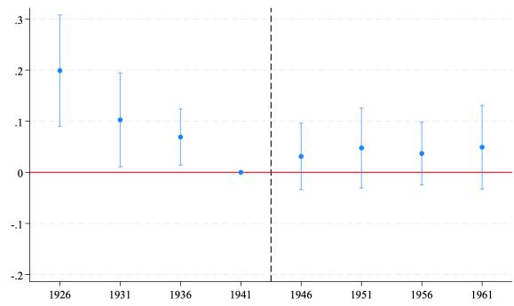  
Fig. B.3. Public Employment Guarantee and Occupation of Employment – Rural Male Wage Workers

Notes: These figures plot the estimated effect of exposure to the PEG on the probability of working in each occupational category among wage workers in rural districts, by birth cohort. The sample is restricted to males aged 30 to 60 years, born in 1963 or earlier, in 1986, 1996, and 2006, who are wage workers. The dependent variable is a binary indicator equal to 1 if the individual is employed in the specified occupation and 0 otherwise. The estimates are obtained from a specification that interacts birth cohort dummies with a continuous measure of treatment intensity: the number of secondary schools per 1,000 school-aged individuals (aged 15–19 in 1960) in the district of birth in 1959/1960. The omitted cohort is 1941. Controls include the share of cultivated land redistributed between 1952 and 1961 by the land reform, interacted with birth cohort, as well as fixed effects for birth cohort, district of birth, census year, and age. Standard errors are clustered at the district of birth level. Vertical bars represent 95% confidence intervals.

Source: Authors' calculations based on IPUMS Egypt census data (1986, 1996, 2006) and administrative school statistics (1959/1960).

(a) Legislators, senior officials, and managers  
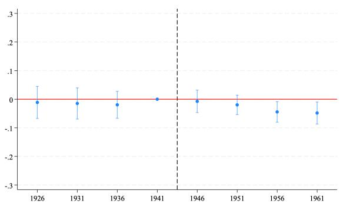  
(c) Technicians and associate professionals

(b) Professionals  
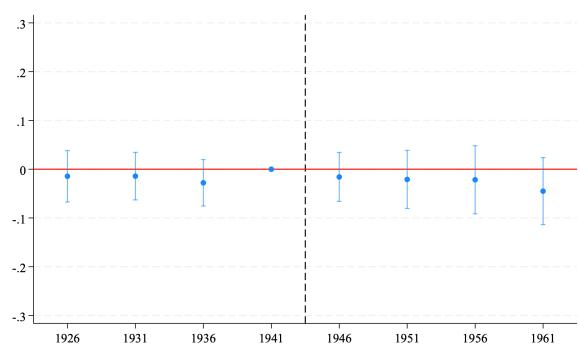  
(d) Clerks

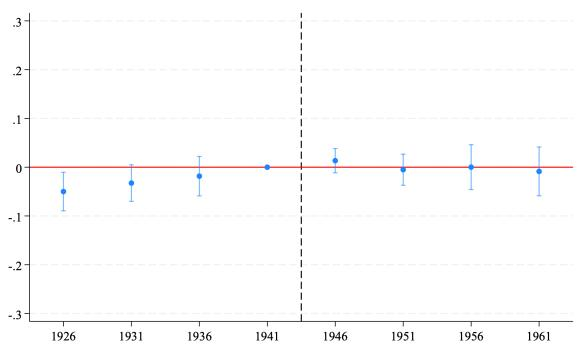

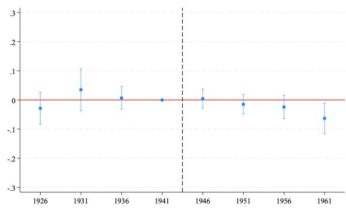

(e) Service workers and shop and market sales  
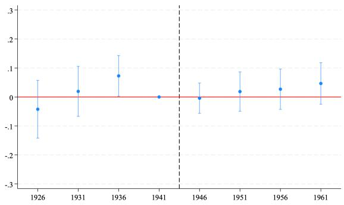

(f) Skilled agricultural and fishery workers  
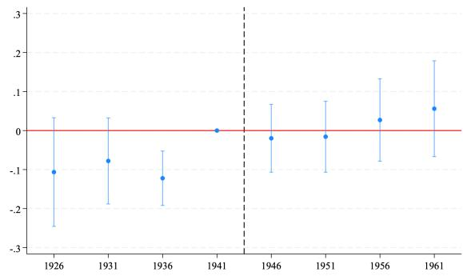

(g) Crafts and related trades workers  
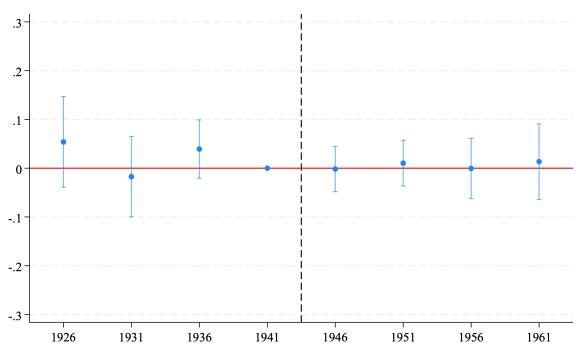

(h) Plant and machine operators and assemblers  
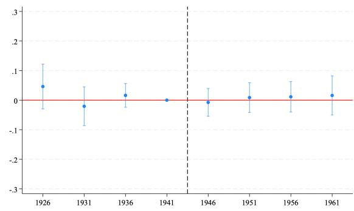

(i) Elementary occupations  
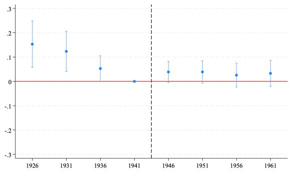  
Fig. B.4. Public Employment Guarantee and Disaggregated Occupation – Rural Male Wage Workers

Notes: These figures plot the estimated effect of exposure to the PEG on the probability of working as a wage worker in each occupational category in rural districts, by birth cohort. The sample is restricted to males aged 30 to 60 years, born in 1963 or earlier, in 1986, 1996, and 2006. The dependent variable is a binary indicator equal to 1 if the individual is employed in the specified occupation and 0 otherwise. The estimates are obtained from a specification that interacts birth cohort dummies with a continuous measure of treatment intensity: the number of secondary schools per 1,000 school-aged individuals (aged 15–19 in 1960) in the district of birth in 1959/1960. The omitted cohort is 1941. Controls include the share of cultivated land redistributed between 1952 and 1961 by the land reform, interacted with birth cohort, as well as fixed effects for birth cohort, district of birth, census year, and age. Standard errors are clustered at the district of birth level. Vertical bars represent 95% confidence intervals.

Source: Authors' calculations based on IPUMS Egypt census data (1986, 1996, 2006) and administrative school statistics (1959/1960).

## Appendix C Additional Results

In Appendix C, we present some complementary results on education and employment outcomes. In Figure C.1, we examine the impact of the PEG on years of schooling as an alternative measure. We then investigate the impact on labor force participation, employment status, and wage-work in Figures C.2, C.3, and C.4, respectively, for both urban and rural districts. We further disaggregate wage and self-employment across agriculture, manufacturing, and services in rural districts to further investigate the decline in rural wage work in Figure C.5. Finally, in Figure C.6, we investigate the impact of the PEG on more detailed occupational categories available only in the 1986 census.

(a) Urban  
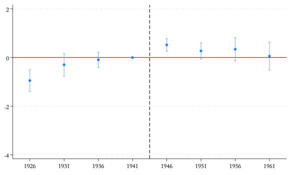

(b) Rural  
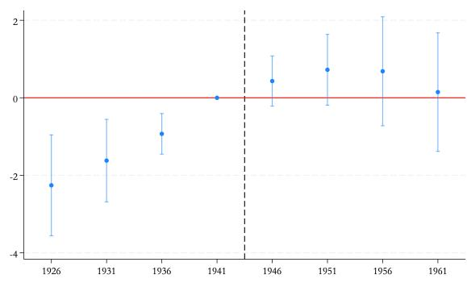  
Fig. C.1. Public Employment Guarantee and Male Years of Education

Notes: These figures plot the estimated effect of exposure to the PEG on years of education by birth cohort, separately for urban districts in (a) and rural districts in (b). The sample is restricted to males aged 23 to 60 years, born in 1963 or earlier, in 1986, 1996, and 2006. The dependent variable is a continuous measure capturing the number of years of education completed. The estimates are obtained from a specification that interacts birth cohort dummies with a continuous measure of treatment intensity: the number of secondary schools per 1,000 school-aged individuals (aged 15-19 in 1960) in the district of birth in 1959/1960. The omitted cohort is 1941. Controls include the share of cultivated land redistributed between 1952 and 1961 by the land reform, interacted with birth cohort, as well as fixed effects for birth cohort, district of birth, census year, and age. Standard errors are clustered at the district of birth level. Vertical bars represent $95\%$ confidence intervals. Source: Authors' calculations based on IPUMS Egypt census data (1986, 1996, 2006) and administrative school statistics (1959/1960).

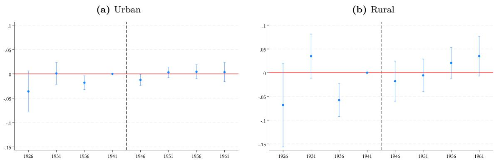  
Fig. C.2. Public Employment Guarantee and Male Labor Force Participation

Notes: These figures plot the estimated effect of exposure to the PEG on the probability of being in the labor force by birth cohort, separately for urban districts in (a) and rural districts in (b). The sample is restricted to males aged 30 to 60 years, born in 1963 or earlier, in 1986, 1996, and 2006. The dependent variable is a binary indicator equal to 1 if the individual is in the labor force and 0 if he is out of labor force. The estimates are obtained from a specification that interacts birth cohort dummies with a continuous measure of treatment intensity: the number of secondary schools per 1,000 school-aged individuals (aged 15-19 in 1960) in the district of birth in 1959/1960. The omitted cohort is 1941. Controls include the share of cultivated land redistributed between 1952 and 1961 by the land reform, interacted with birth cohort, as well as fixed effects for birth cohort, district of birth, census year, and age. Standard errors are clustered at the district of birth level. Vertical bars represent $95\%$ confidence intervals.

Source: Authors' calculations based on IPUMS Egypt census data (1986, 1996, 2006) and administrative school statistics (1959/1960).

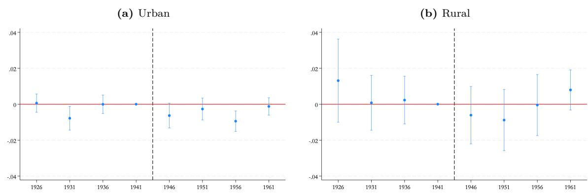  
Fig. C.3. Public Employment Guarantee and Male Employment

Notes: These figures plot the estimated effect of exposure to the PEG on the probability of being employed—conditional on being in the labor force—by birth cohort, separately for urban districts in (a) and rural districts in (b). The sample is restricted to males aged 30 to 60 years, born in 1963 or earlier, in 1986, 1996, and 2006, who are in the labor force. The dependent variable is a binary indicator equal to 1 if the individual is employed and 0 if he is unemployed. The estimates are obtained from a specification that interacts birth cohort dummies with a continuous measure of treatment intensity: the number of secondary schools per 1,000 school-aged individuals (aged 15-19 in 1960) in the district of birth in 1959/1960. The omitted cohort is 1941. Controls include the share of cultivated land redistributed between 1952 and 1961 by the land reform, interacted with birth cohort, as well as fixed effects for birth cohort, district of birth, census year, and age. Standard errors are clustered at the district of birth level. Vertical bars represent $95\%$ confidence intervals. Source: Authors' calculations based on IPUMS Egypt census data (1986, 1996, 2006) and administrative school statistics (1959/1960).

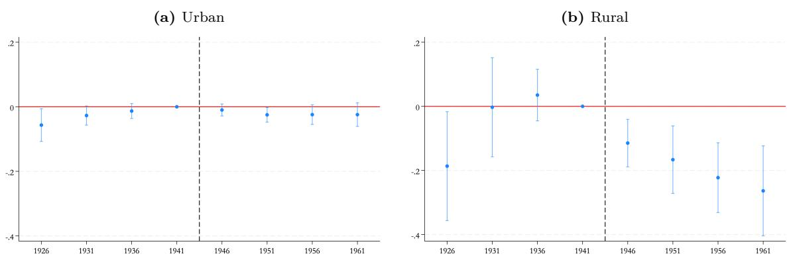  
Fig. C.4. Public Employment Guarantee and Male Wage Employment

Notes: These figures plot the estimated effect of exposure to the PEG on the probability of being a wage worker (as opposed to self-employed)—conditional on being employed—by birth cohort, separately for urban districts in (a) and rural districts in (b). The sample is restricted to males aged 30 to 60 years, born in 1963 or earlier, in 1986, 1996, and 2006, who are employed, excluding unpaid family workers. The dependent variable is a binary indicator equal to 1 if the employed individual is a wage worker and 0 if he is self-employed. The estimates are obtained from a specification that interacts birth cohort dummies with a continuous measure of treatment intensity: the number of secondary schools per 1,000 school-aged individuals (aged 15–19 in 1960) in the district of birth in 1959/1960. The omitted cohort is 1941. Controls include the share of cultivated land redistributed between 1952 and 1961 by the land reform, interacted with birth cohort, as well as fixed effects for birth cohort, district of birth, census year, and age. Standard errors are clustered at the district of birth level. Vertical bars represent 95% confidence intervals.

Source: Authors' calculations based on IPUMS Egypt census data (1986, 1996, 2006) and administrative school statistics (1959/1960).

(a) Wage Worker Agriculture  
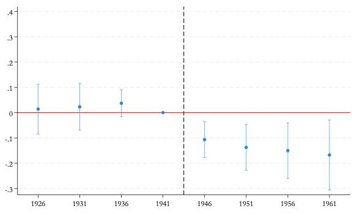  
(c) Wage Worker Manufacturing

(b) Self-employed Agriculture  
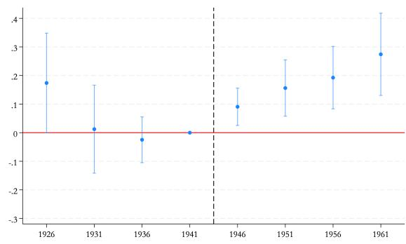  
(d) Self-employed Manufacturing

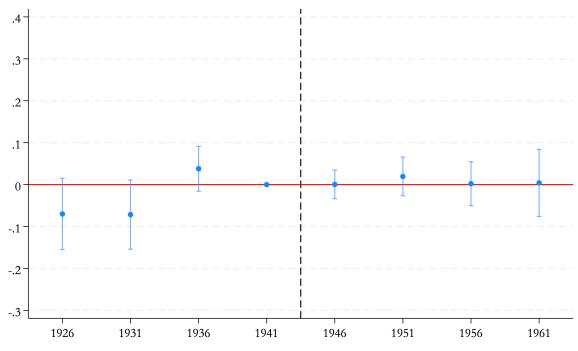  
(e) Wage Worker Services

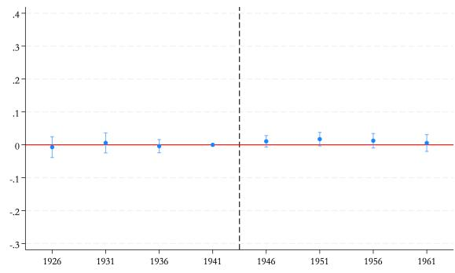

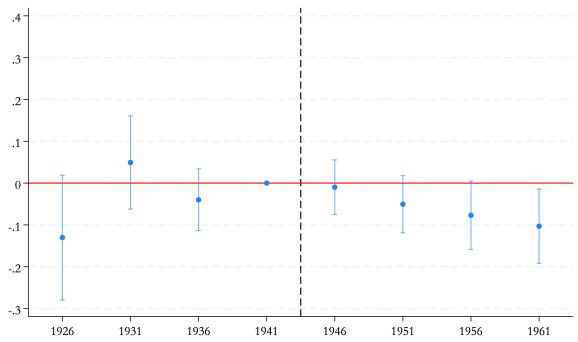

(f) Self-employed Services  
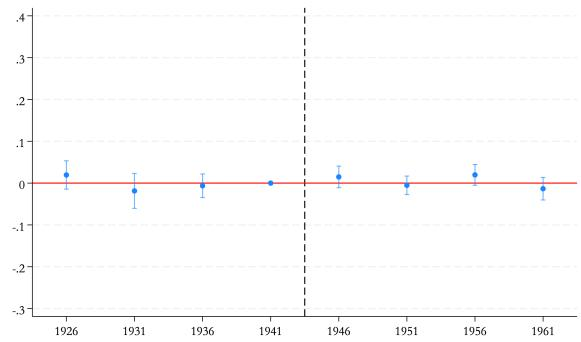  
Fig. C.5. Public Employment Guarantee and Industry of Employment — Rural Male Wage Workers

Notes: These figures plot the estimated effect of exposure to the PEG on the probability of employment as wage workers in each industry in rural districts, by birth cohort. The sample is restricted to males aged 30 to 60 years in 1986, 1996, and 2006. The dependent variable in each panel is a binary indicator equal to 1 if the individual is employed in the specified industry and 0 otherwise. The estimates are obtained from a specification that interacts birth cohort dummies with a continuous measure of treatment intensity: the number of secondary schools per 1,000 school-aged individuals (aged 15–19 in 1960) in the district of birth in 1959/1960. The omitted cohort is 1941. Controls include the share of cultivated land redistributed between 1952 and 1961 by the land reform, interacted with birth cohort, as well as fixed effects for birth cohort, district of birth, census year, and age. Standard errors are clustered at the district of birth level. Vertical bars represent 95% confidence intervals. Source: Authors' calculations based on IPUMS Egypt census data (1986, 1996, 2006) and administrative school statistics (1959/1960).

(a) Teachers  
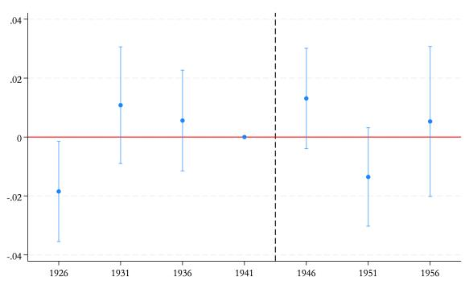  
(c) Government Executive Officials

(b) Accountants  
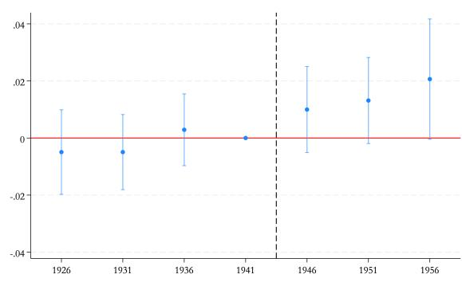  
(d) Government Administrators

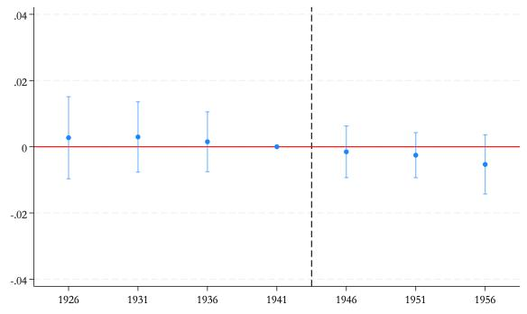  
(e) Bookkeepers and Cashiers

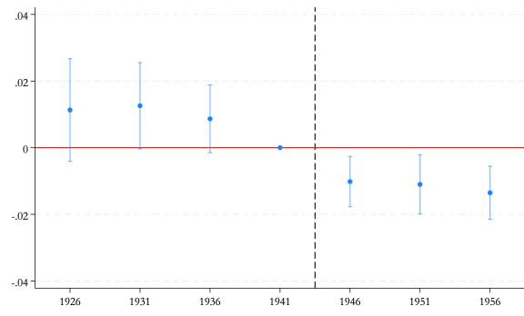

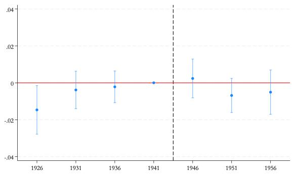

(f) Engineers  
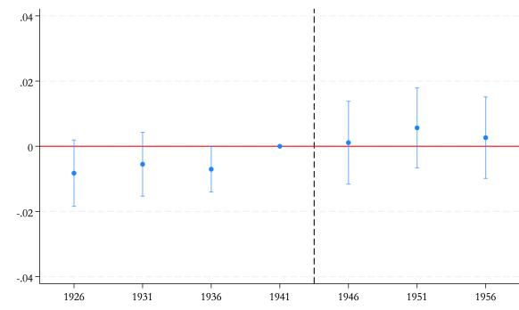

(g) Engineering Technicians  
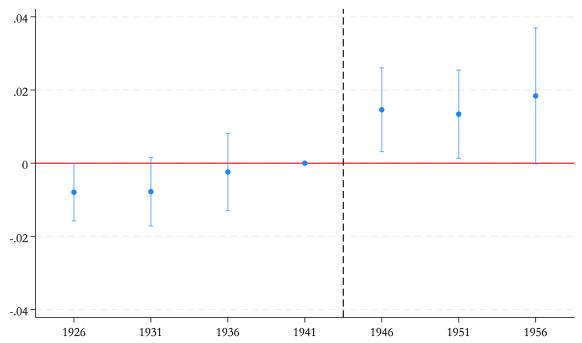

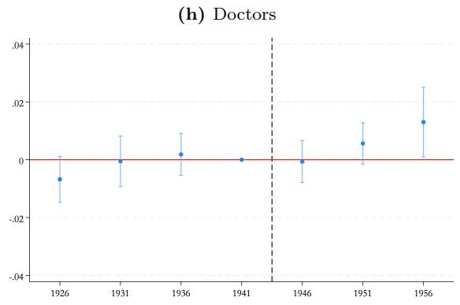

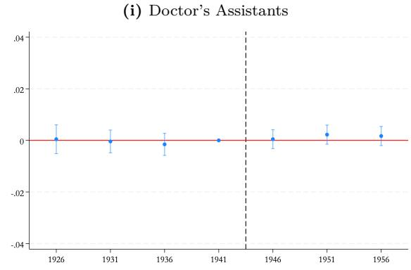  
Fig. C.6. Public Employment Guarantee and Specific Occupations – Urban Male Wage Workers (1986 Census)

Notes: These figures plot the estimated effect of exposure to the PEG on the probability of working as a wage worker in specific occupational category in urban districts, by birth cohort. The sample is restricted to males aged 30 to 60 years in 1986. The dependent variable is a binary indicator equal to 1 if the individual is employed in the specified occupation and 0 otherwise. The estimates are obtained from a specification that interacts birth cohort dummies with a continuous measure of treatment intensity: the number of secondary schools per 1,000 school-aged individuals (aged 15–19 in 1960) in the district of birth in 1959/1960. The omitted cohort is 1941. Controls include the share of cultivated land redistributed between 1952 and 1961 by the land reform, interacted with birth cohort, as well as fixed effects for birth cohort, district of birth, census year, and age. Standard errors are clustered at the district of birth level. Vertical bars represent 95% confidence intervals.

Source: Authors' calculations based on IPUMS Egypt census data (1986) and administrative school statistics (1959/1960).

## Appendix D Robustness Checks

In Appendix D, we present the robustness checks results. In Figure D.1, we alternatively designate the 1941 birth cohort as the first treated cohort group. In Figure D.2, we use an alternative treatment measure. We replace the continuous treatment variable with a binary indicator based on the distribution of per capita secondary school availability. Specifically, districts with above-median exposure are compared to those with below-median exposure in Figure D.3, while quartiles are used in Figure D.4.

## D.1 1936 as the Omitted Cohort

Fig. D.1. Public Employment Guarantee and Sector of Employment – Urban Male Wage Workers

(a) State-owned Enterprises  
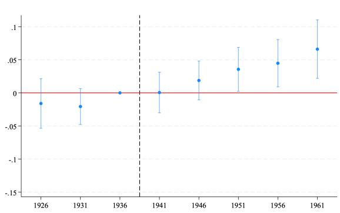

(b) Private Sector  
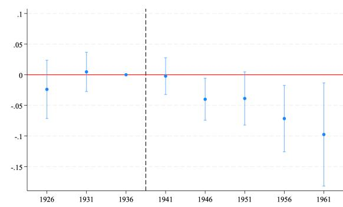  
(c) Government

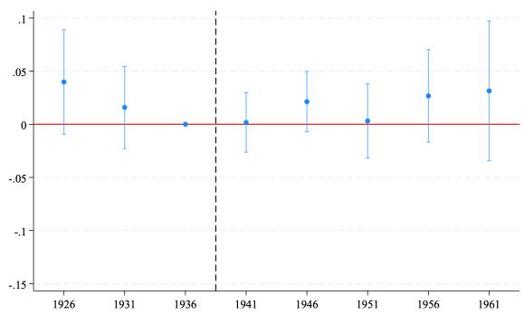

Notes: These figures plot the estimated effect of exposure to the PEG on the probability of employment in each sector among wage workers in urban districts, by birth cohort. The sample is restricted to males aged 30 to 60 years, born in 1963 or earlier, in 1986, 1996, and 2006. The dependent variable in each panel is a binary indicator equal to 1 if the wage worker is employed in the specified sector and 0 otherwise. The estimates are obtained from a specification that interacts birth cohort dummies with a continuous measure of treatment intensity: the number of secondary schools per 1,000 school-aged individuals (aged 15–19 in 1960) in the district of birth in 1959. The omitted cohort is 1936. Controls include the share of cultivated land redistributed between 1952 and 1961 by the land reform, interacted with birth cohort, as well as fixed effects for birth cohort, district of birth, census year, and age. Standard errors are clustered at the district of birth level. Vertical bars represent 95% confidence intervals.

Source: Authors' calculations based on IPUMS Egypt census data (1986, 1996, 2006) and administrative school statistics (1959/1960).

## D.2 Alternative Treatment Measures

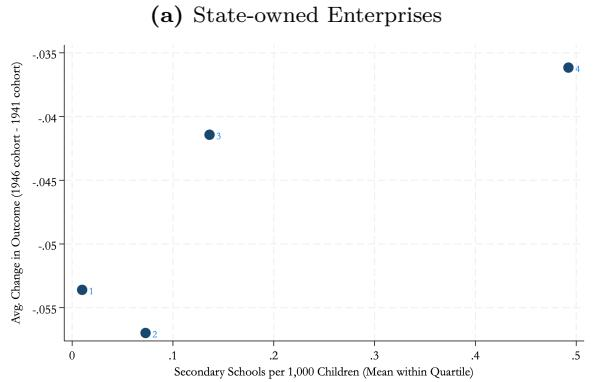

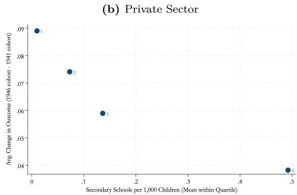

(c) Government  
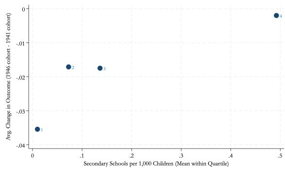  
Fig. D.2. Binned Scatter: Secondary School Supply and Average Change in Sectoral Employment between 1946 and 1941 Birth Cohorts

Notes: These figures plot the average change in sector of employment between the 1946 and 1941 birth cohorts on the y-axis against the mean secondary school supply within each quartile of the 1959/1960 district-level school supply distribution on the x-axis.

Source: Authors' calculations based on IPUMS Egypt census data (1986, 1996, 2006) and administrative school statistics (1959/1960).

(a) State-owned Enterprises  
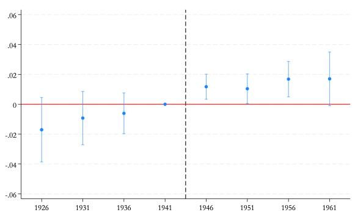

(b) Private Sector  
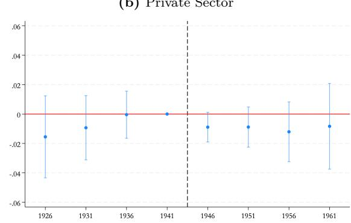

(c) Government  
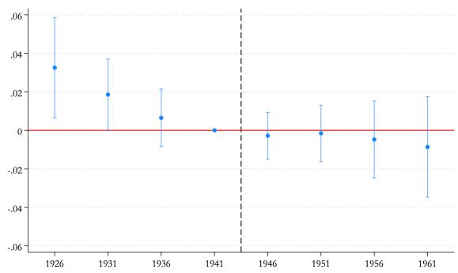  
Fig. D.3. Public Employment Guarantee and Sector of Employment – Urban Male Wage Workers – Binary Treatment

Notes: These figures plot the estimated effect of exposure to the PEG on the probability of employment in each sector among wage workers in urban districts, by birth cohort. The sample is restricted to males aged 30 to 60 years, born in 1963 or earlier, in 1986, 1996, and 2006. The dependent variable in each panel is a binary indicator equal to 1 if the wage worker is employed in the specified sector and 0 otherwise. The estimates are obtained from a specification that interacts birth cohort dummies with a binary treatment variable equal to 1 if the number of secondary schools per 1,000 school-aged individuals (aged 15–19 in 1960) in the district of birth in 1959 is above the median, and 0 if it is below. The omitted cohort is 1941. Controls include the share of cultivated land redistributed between 1952 and 1961 by the land reform, interacted with birth cohort, as well as fixed effects for birth cohort, district of birth, census year, and age. Standard errors are clustered at the district of birth level. Vertical bars represent 95% confidence intervals.

Source: Authors' calculations based on IPUMS Egypt census data (1986, 1996, 2006) and administrative school statistics (1959/1960).

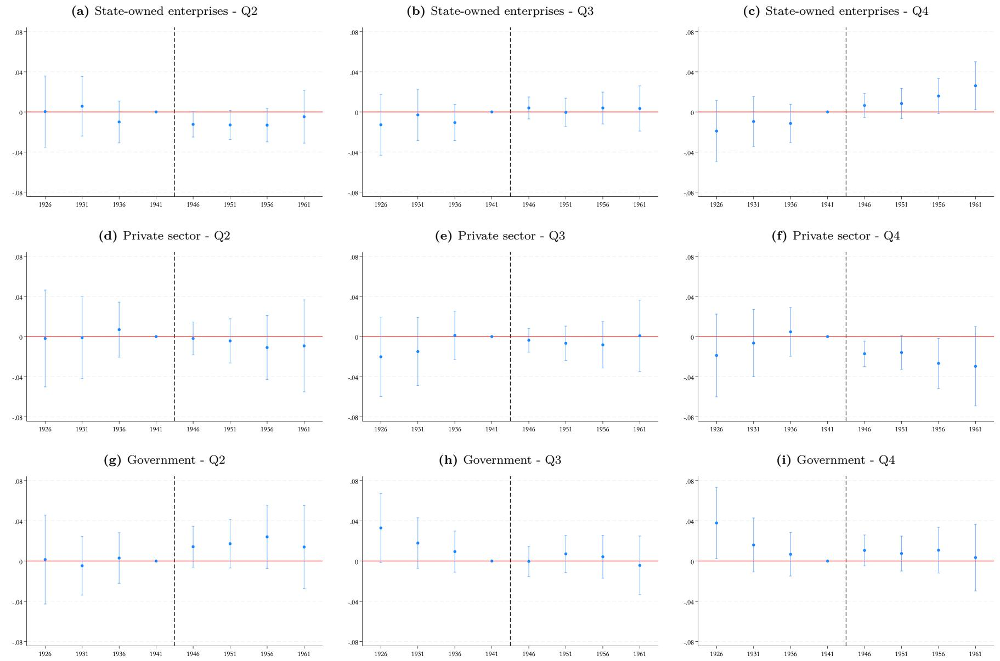  
Fig. D.4. Public Employment Guarantee and Male Wage Workers Sector of Employment in Urban Districts - Quartiles of Secondary Schools

Notes: These figures plot the estimated effect of exposure to the PEG on the probability of employment in each sector among wage workers in urban districts, by birth cohort. The sample is restricted to males aged 30 to 60 years in 1986, 1996, and 2006. The dependent variable in each panel is a binary indicator equal to 1 if the wage worker is employed in the specified sector and 0 otherwise. The estimates come from a specification that interacts birth-cohort dummies with a categorical treatment variable indicating quartiles of the number of secondary schools per 1,000 school-aged individuals (aged 15–19 in 1960) in 1959. Quartile 1 is the omitted category. Controls include the share of cultivated land redistributed between 1952 and 1961 by the

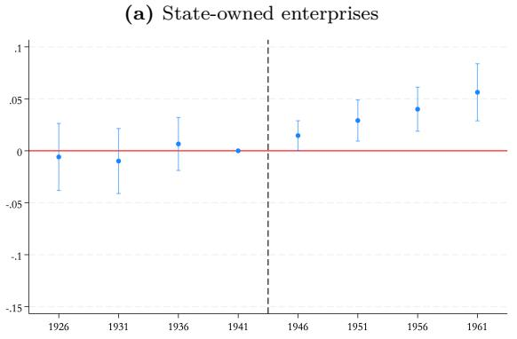

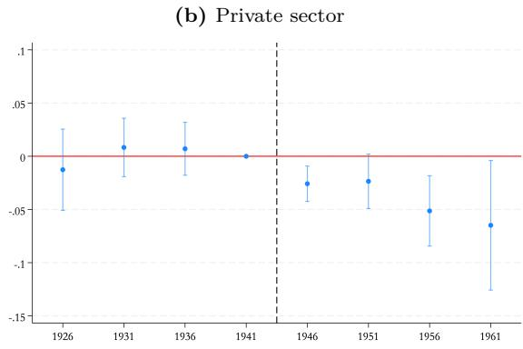

(c) Government  
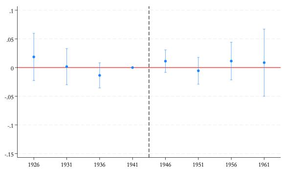  
Fig. D.5. Public Employment Guarantee Exposure and Male Wage Workers Sector of Employment in Urban Districts - 1951 District-Level Secondary School

Notes: These figures plot the estimated effect of exposure to the PEG on the probability of employment in each sector among wage workers in urban districts, by birth cohort. The sample is restricted to males aged 30 to 60 years, born in 1963 or earlier, in 1986, 1996, and 2006, who are wage workers. The dependent variable in each panel is a binary indicator equal to 1 if the wage worker is employed in the specified sector and 0 otherwise. The estimates are obtained from a specification that interacts birth cohort dummies with a continuous measure of treatment intensity: the number of secondary schools per 1,000 school-aged individuals (aged 15–19 in 1960) in the district of birth in 1951. The omitted cohort is 1941. Controls include the share of cultivated land redistributed between 1952 and 1961 by the land reform, interacted with birth cohort, as well as fixed effects for birth cohort, district of birth, census year, and age. Standard errors are clustered at the district of birth level. Vertical bars represent 95% confidence intervals.

Source: Authors' calculations based on IPUMS Egypt census data (1986, 1996, 2006) and administrative school statistics (1959/1960).

## D.3 Spillover Effects

Fig. D.6. Public Employment Guarantee Exposure and Male Wage Workers Sector of Employment in Urban Districts - Treatment in Neighboring Districts  
(a) State-owned enterprises  
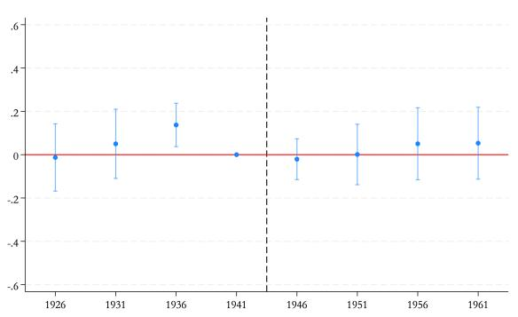

(b) Private sector  
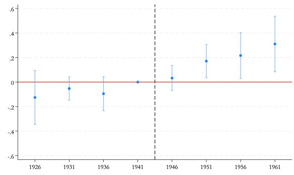  
(c) Government

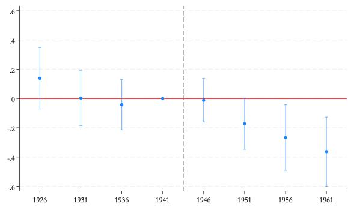

Notes: These figures plot the estimated effect of exposure to the PEG on the probability of employment in each sector among wage workers in urban districts, by birth cohort, replacing each district's treatment variable with the pre-reform mean secondary school supply of neighboring district whose centroid falls within 100 km. The sample is restricted to males aged 30 to 60 years, born in 1963 or earlier, in 1986, 1996, and 2006, who are wage workers. The dependent variable in each panel is a binary indicator equal to 1 if the wage worker is employed in the specified sector and 0 otherwise. The estimates are obtained from a specification that interacts birth cohort dummies with a continuous measure of treatment intensity: the number of secondary schools per 1,000 school-aged individuals (aged 15–19 in 1960) in the province of birth in 1959. The omitted cohort is 1941. Controls include the share of cultivated land redistributed between 1952 and 1961 by the land reform, interacted with birth cohort, as well as fixed effects for birth cohort, district of birth, census year, and age. Standard errors are clustered at the district of birth level. Vertical bars represent 95% confidence intervals.

Source: Authors' calculations based on IPUMS Egypt census data (1986, 1996, 2006) and administrative school statistics (1959/1960).

## D.4 Controlling for Secondary School Growth

Fig. D.7. Public Employment Guarantee Exposure and Male Wage Workers Sector of Employment in Urban Districts - Controlling for Secondary School Growth  
(a) State-owned Enterprises  
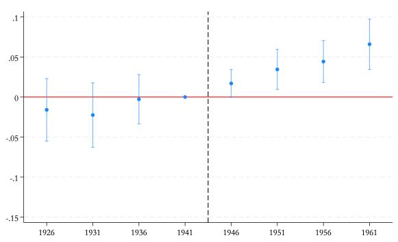

(b) Private Sector  
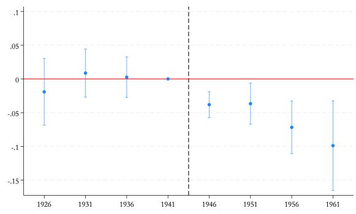  
(c) Government

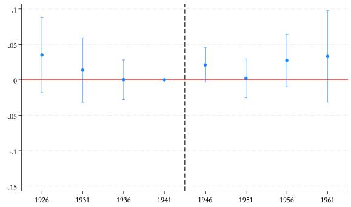

Notes: These figures plot the estimated effect of exposure to the PEG on the probability of employment in each sector among wage workers in urban districts, by birth cohort. The sample is restricted to males aged 30 to 60 years, born in 1963 or earlier, in 1986, 1996, and 2006, who are wage workers. The dependent variable in each panel is a binary indicator equal to 1 if the wage worker is employed in the specified sector and 0 otherwise. The estimates are obtained from a specification that interacts birth cohort dummies with a continuous measure of treatment intensity: the mean number of secondary schools per 1,000 school-aged individuals (aged 15–19 in 1960) in the neighboring districts in 1959. The omitted cohort is 1941. Controls include the share of cultivated land redistributed between 1952 and 1961 by the land reform, interacted with birth cohort, secondary school growth 1959/1960 and 1969/1970, as well as fixed effects for birth cohort, district of birth, census year, and age. Standard errors are clustered at the district of birth level. Vertical bars represent 95% confidence intervals. Source: Authors' calculations based on IPUMS Egypt census data (1986, 1996, 2006) and administrative school statistics (1959/1960).

## Appendix E Female Sample Results

Fig. E.1. Female Labor Force Participation  
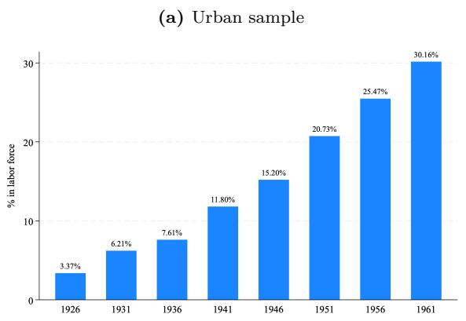

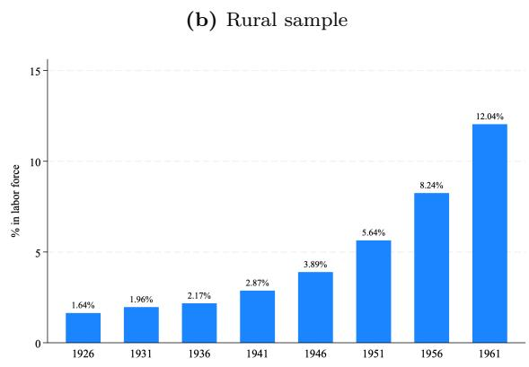  
Notes: These figures plot the female labor force participation rate by birth cohort in urban districts (a) and rural districts (b)  
Source: Authors' calculations based on IPUMS Egypt census data (1986, 1996, 2006).

Fig. E.2. Public Employment Guarantee and Female Labor Force Participation  
(a) Urban  
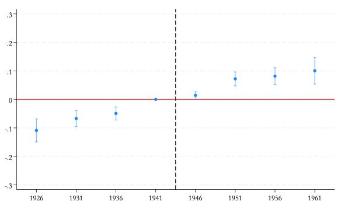

(b) Rural  
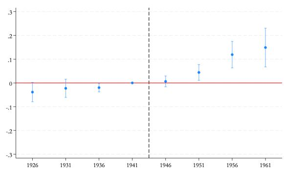

Notes: These figures plot the estimated effect of exposure to the PEG on the probability of being in the labor force by birth cohort, separately for urban districts in (a) and rural districts in (b). The sample is restricted to females aged 30 to 60 years, born in 1963 or earlier, in 1986, 1996, and 2006. The dependent variable is a binary indicator equal to 1 if the individual is in the labor force and 0 if he is out of labor force. The estimates are obtained from a specification that interacts birth cohort dummies with a continuous measure of treatment intensity: the number of secondary schools per 1,000 school-aged individuals (aged 15-19 in 1960) in the district of birth in 1959. The omitted cohort is 1941. Controls include the share of cultivated land redistributed between 1952 and 1961 by the land reform, interacted with birth cohort, as well as fixed effects for birth cohort, district of birth, census year, and age. Standard errors are clustered at the district of birth level. Vertical bars represent $95\%$ confidence intervals.

Source: Authors' calculations based on IPUMS Egypt census data (1986, 1996, 2006) and administrative school statistics (1959/1960).

Fig. E.3. Public Employment Guarantee and Female Wage Employment Among the Employed  
(a) Urban  
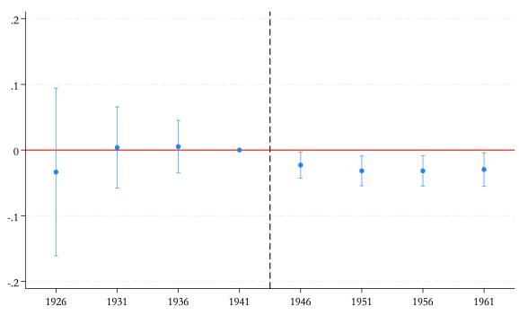

(b) Rural  
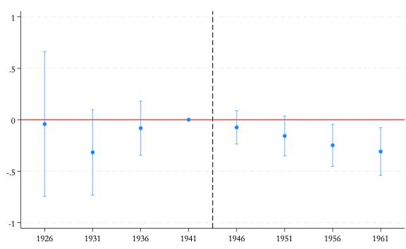

Notes: These figures plot the estimated effect of exposure to the PEG on the probability of being a wage worker (as opposed to self-employed) by birth cohort, separately for urban districts in (a) and rural districts in (b). The sample is restricted to females aged 30 to 60 years, born in 1963 or earlier, in 1986, 1996, and 2006, who are employed, excluding unpaid family workers. The dependent variable is a binary indicator equal to 1 if the employed individual is a wage worker and 0 if he is self-employed. The estimates are obtained from a specification that interacts birth cohort dummies with a continuous measure of treatment intensity: the number of secondary schools per 1,000 school-aged individuals (aged 15–19 in 1960) in the district of birth in 1959. The omitted cohort is 1941. Controls include the share of cultivated land redistributed between 1952 and 1961 by the land reform, interacted with birth cohort, as well as fixed effects for birth cohort, district of birth, census year, and age. Standard errors are clustered at the district of birth level. Vertical bars represent 95% confidence intervals. Source: Authors' calculations based on IPUMS Egypt census data (1986, 1996, 2006) and administrative school statistics (1959/1960).

Fig. E.4. Public Employment Guarantee and Female Wage Workers Sector of Employment in Urban Districts  
(a) State-owned enterprises  
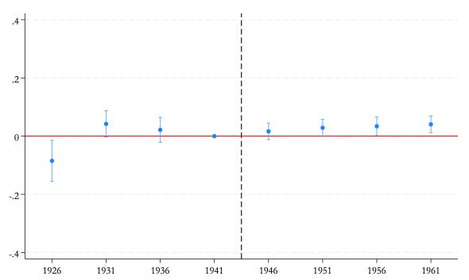

(b) Private sector  
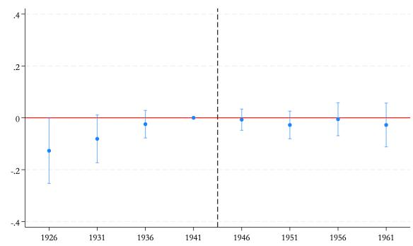  
(c) Government

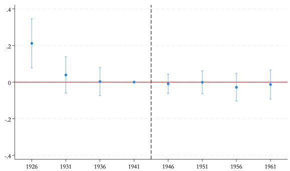  
Notes: These figures plot the estimated effect of exposure to the PEG on the probability of employment in each sector among wage workers in urban districts, by birth cohort. The sample is restricted to females aged 30 to 60 years, born in 1963 or earlier, in 1986, 1996, and 2006. The dependent variable in each panel is a binary indicator equal to 1 if the wage worker is employed in the specified sector and 0 otherwise. The estimates are obtained from equation (1), a specification that interacts birth cohort dummies with a continuous measure of treatment intensity: the number of secondary schools per 1,000 school-aged individuals (aged 15–19 in 1960) in the district of birth in 1959. The omitted cohort is 1941. Controls include the share of cultivated land redistributed between 1952 and 1961 by the land reform, interacted with birth cohort, as well as fixed effects for birth cohort, district of birth, census year, and age. Standard errors are clustered at the district of birth level. Vertical bars represent 95% confidence intervals.

Source: Authors' calculations based on IPUMS Egypt census data (1986, 1996, 2006) and administrative school statistics (1959/1960).

Fig. E.5. Public Employment Guarantee and Female Wage Workers Sector of Employment in Rural Districts  
(a) State-owned enterprises  
(b) Private sector  
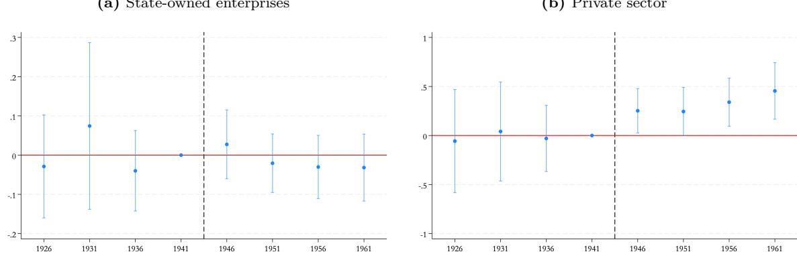

(c) Government  
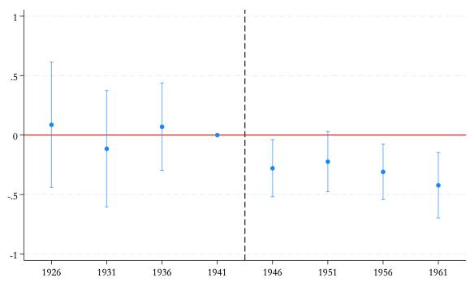

Notes: These figures plot the estimated effect of exposure to the PEG on the probability of employment in each sector among wage workers in rural districts, by birth cohort. The sample is restricted to males aged 30 to 60 years, born in 1963 or earlier, in 1986, 1996, and 2006. The dependent variable in each panel is a binary indicator equal to 1 if the wage worker is employed in the specified sector and 0 otherwise. The estimates are obtained from equation (1), a specification that interacts birth cohort dummies with a continuous measure of treatment intensity: the number of secondary schools per 1,000 school-aged individuals (aged 15–19 in 1960) in the district of birth in 1959. The omitted cohort is 1941. Controls include the share of cultivated land redistributed between 1952 and 1961 by the land reform, interacted with birth cohort, as well as fixed effects for birth cohort, district of birth, census year, and age. Standard errors are clustered at the district of birth level. Vertical bars represent 95% confidence intervals.

Source: Authors' calculations based on IPUMS Egypt census data (1986, 1996, 2006) and administrative school statistics (1959/1960).