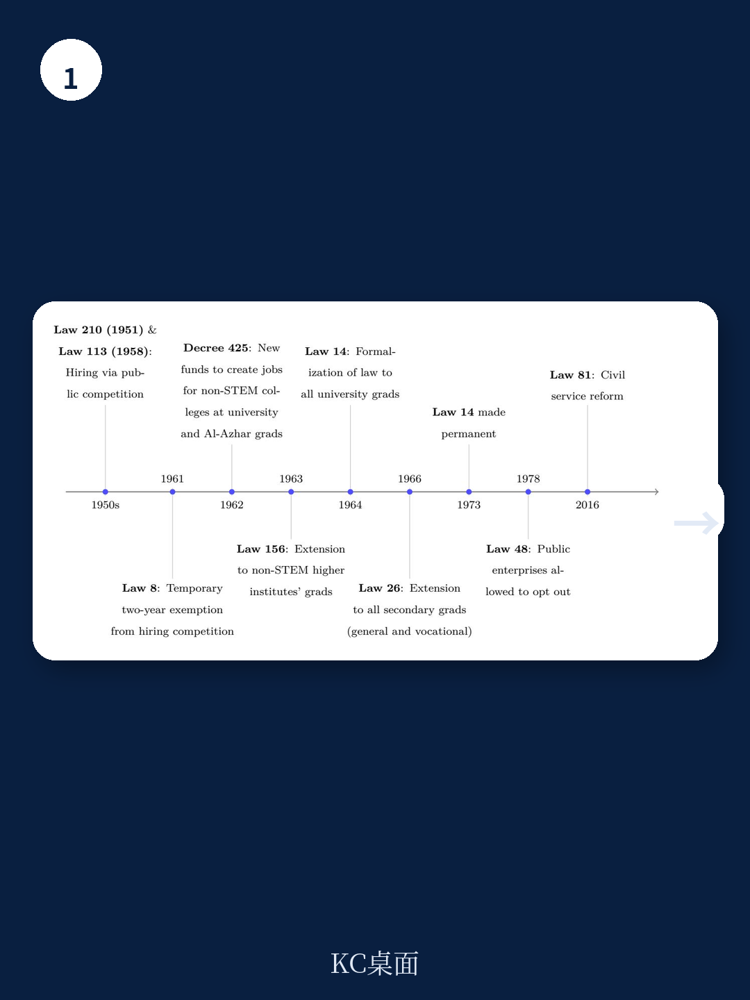
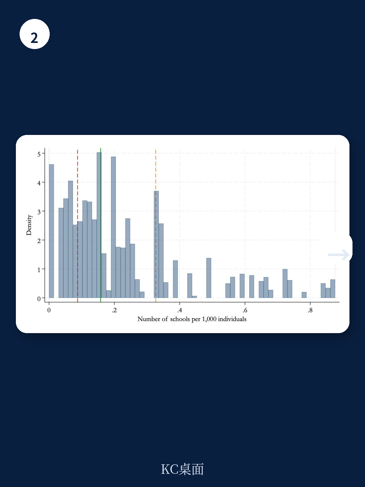

# 世界银行：埃及公共就业保障的劳动力市场效应

1960年代初，埃及实施了一项具有典型意义的公共就业保障政策：所有中学和大学毕业生无需竞争性考试即可获得公共部门终身职位。这项政策持续了近二十年，直到1980年代初因财政不确定性和队列规模膨胀而事实上暂停。世界银行研究团队利用1959/60学年地区级中学供给差异作为政策暴露强度的工具变量，结合1986、1996、2006年人口普查微观数据，首次为这类永久性就业保障的劳动力市场效应提供了因果估计。

研究聚焦于男性样本，原因在于埃及女性劳动参与率长期偏低，且普查中女性就业的系统性漏报在不同地区和部门之间存在差异，难以获得可靠的因果估计。这一数据约束在报告中有详细讨论。

## 1. 城市男性工资就业从私营部门向国有企业的再分配

研究发现，公共就业保障显著改变了城市男性的部门分布。以1959/60年每千名学龄人口拥有的中学数量衡量政策暴露强度，一个标准差的暴露增加使受影响最深的队列在国有企业就业的概率提高约1.3个百分点，同时私营部门就业出现对应幅度的下降。这一再分配效应集中在制造业和高技能白领职业，与当时国家主导的工业化战略方向一致。

农村地区则没有观察到类似的部门转移。原因在于国有企业在埃及的分布高度集中于城市，农村几乎不存在国有企业这一就业渠道。研究团队将农村样本视为内置的安慰剂检验：在政策机制无法运作的地区，国有企业就业没有发生变化，这反过来支持了城市估计反映的是就业保障本身而非其他同期冲击的判断。

## 2. 政策并未显著提升受教育程度，而是重新配置了已有的受教育劳动力

一个常见的政策预期是，就业保障会激励家庭增加教育研究。但世界银行的分析显示，在政策实施前后，受教育程度的上升趋势在不同队列之间是平稳的，没有出现因政策暴露强度不同而产生的明显分化。报告认为，公共就业保障主要起到了重新配置作用——将已经不断扩大的受教育劳动力引导至国有部门，而非扩大教育供给本身。

> **KC评论：** 这一发现值得关注。它意味着就业保障政策与教育扩张是两个相对独立的进程。政策的效果更多体现在劳动力市场的部门分配上，而非人力资本积累的增量上。对于评估类似政策的发展效应，区分“配置效应”和“激励效应”是一个有用的分析框架。

## 3. 政策效应的职业集中度与工业化战略的关联

在职业维度上，受影响队列更可能从事专业技术人员、技术员和助理专业人员等高端白领岗位，同时农业就业比例下降。这种职业集中模式与埃及国有企业在制造业领域的布局高度吻合。研究指出，公共就业保障并非简单地扩大公共部门规模，而是将特定教育水平的劳动力定向配置到国家工业化战略的核心部门。

这一机制与同期其他发展中国家的实践形成对照。印度的全国农村就业保障计划（MGNREGA）提供的是短期工作机会，研究显示它提高了农村工资水平但并未永久性地将劳动力从私营部门抽离。而埃及的永久性就业保障则创造了依赖国家部门的中间阶层，其劳动力市场含义与工作福利计划有本质区别。

## 4. 对理解发展中地区公共部门就业效应的启示

世界银行的这项研究为理解公共部门就业对劳动力市场的长期影响提供了历史证据。报告显示，教育资格与公共部门就业的自动挂钩，可以在短期内快速扩大国有部门的人才储备，但也可能形成对私营部门劳动力供给的挤出。这种挤出效应在国有企业密集的城市地区尤为明显。

研究同时提醒，对福利含义的解释需要谨慎。在1960年代的埃及，公共就业保障并非在取代一个已经成熟的私营部门，而是在同时建设工业化和行政能力。报告没有对政策的整体福利效果做出单一判断，而是强调了不同维度效应的并存：部门再分配、职业集中、以及教育激励的缺失。
