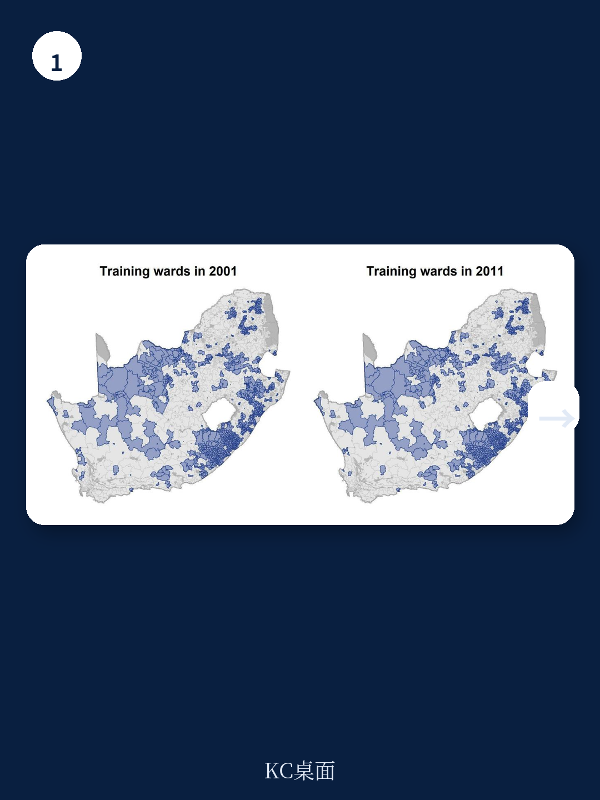
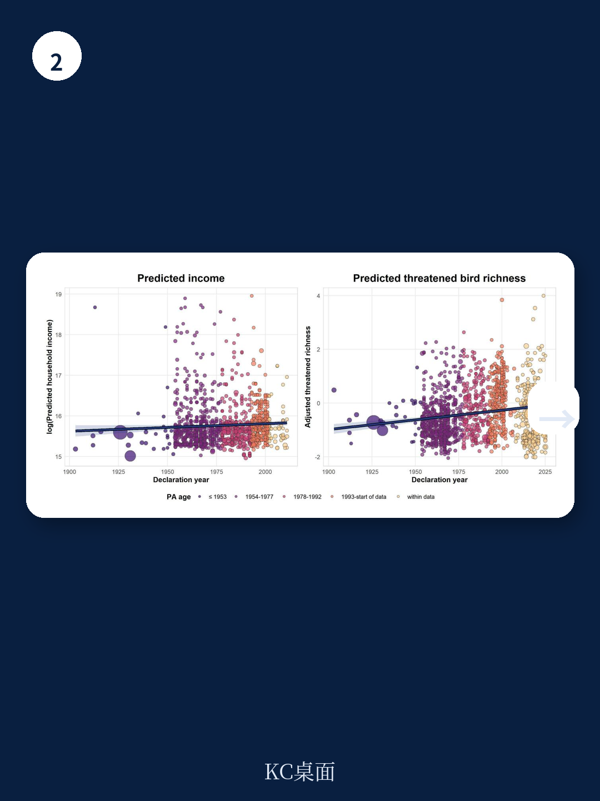

# 世界银行：南非保护区对收入鸟类与旅游的长期影响

南非保护区网络覆盖约11%的国土面积，但关于其长期宏观环境与生态效益的因果证据长期稀缺。世界银行发展研究组近期发布的工作论文，利用机器学习反事实方法，首次将保护区对家庭收入、鸟类生物多样性和旅游消费者剩余的影响纳入统一框架进行估算。报告的核心发现是：南非的保护区在长达数十年的时间尺度上，同时产生了正向的宏观环境与生态效益，且这种回报需要耐心积累，而非短期可见。

传统研究普遍依赖双重差分法，比较保护区设立前后与非保护区之间的变化。但这种方法只能捕捉新设保护区的短期效应，而南非许多重要保护区——如克鲁格国家公园——早在1926年就已建立。报告指出，仅依赖短期效应可能严重低估保护区的真实价值。

## 1. 老保护区带来显著收入增长，新保护区效应不显著

报告使用2001年和2011年南非人口普查中4277个选区的家庭收入数据，通过XGBoost算法训练一个仅基于保护区设立前地理特征（如1925年铁路网络、1921年宏观环境集聚区、气候、农业适宜性、地形起伏度）的预测模型，生成无保护区状态下的反事实收入水平。模型在未处理选区的样本外R²达到0.34，与同类空间机器学习应用表现一致。

结果显示，选区内保护区面积每增加1%，家庭收入约提升0.2%；选区周边15公里缓冲区内的保护区面积每增加1%，收入提升约0.1%。这一效应在国家级公园和其他类型保护区中均显著为正。但按保护区年龄分组后，模式出现明显分化：老保护区（设立时间较早）的收入增益显著，而新保护区（2002年后设立）的效应在统计上不显著。

> **KC评论：** 报告的机器学习和传统双重差分法在新保护区上估计结果一致，但老保护区的效应远大于新保护区。这意味着，如果研究者只观察近十年设立的保护区的短期数据，很容易得出“保护区对宏观环境没有帮助”的结论，而忽略了长期积累的溢出效应。

## 2. 保护区网络对濒危鸟类保护呈现互补性

在生物多样性维度，报告分析了南非292,955个观测点上的鸟类数据，按世界自然保护联盟受威胁等级分组，并将无危物种进一步分为城市回避型和城市适应型。结果显示，不同规模的保护区在保护不同类别受威胁鸟类上扮演互补角色。

具体而言，最大的保护区（面积四分位数最高组）显著增加了极危和濒危鸟类的调整物种丰富度，同时减少了城市适应型鸟类的数量，表明大型保护区更有效地维持了依赖完整自然栖息地的鸟类群落。而小型保护区则在保护近危物种上表现出一定作用。报告认为，南非整个保护区网络的组合价值高于单一类型保护区的加总。

## 3. 国家公园每年产生77亿兰特旅游消费者剩余

报告运用结构性旅行成本模型，基于2010至2019年间南非国家公园的游客数据，估算国内外游客为访问国家公园愿意支付的超过实际门票费用的价值。模型区分国内与国际游客的旅行成本弹性，并纳入公园固定效应和出发地-财年固定效应。

估算结果显示，南非国家公园系统每年产生约77亿兰特（2023年币值）的旅游消费者剩余。其中国内游客贡献约四分之一。旅行成本弹性估计表明，旅行成本每增加1%，国内游客访问量减少约1.4%，国际游客减少约2.1%。这一消费者剩余是保护区直接且预期的福利产出，但此前很少被纳入保护区效益的量化评估。

## 4. 保护与发展的权衡可能被高估

报告的核心政策含义在于：在南非的样本中，野生动物保护与宏观环境发展之间的权衡可能远小于普遍假设。老保护区同时带来了更高的家庭收入和更好的濒危物种保护效果，而新保护区虽然短期效应不显著，但报告认为这恰恰说明保护区的宏观环境回报需要数十年才能充分显现。

报告也回应了潜在的选择性偏差质疑：早期规划者是否将保护区设在了本身宏观环境潜力更高的区域？通过比较基于保护区设立前特征的反事实预测，报告发现老保护区并未被放置在更有利的位置，这支持了其长期效应主要来自保护区自身动态过程的判断。

对于其他生物多样性丰富的发展中地区，这一研究提供了一个可复用的观察框架：评估保护区效益时，时间尺度是关键变量。仅关注短期数据可能低估长期收益，而长期评估需要依赖历史地理特征构建可靠的反事实。

For informational purposes only. Portions may be generated,translated,summarized,or edited with AI assistance based on source materials and may contain omissions or errors. Please verify independently. This is not investment,legal,tax,accounting,or other professional advice.

