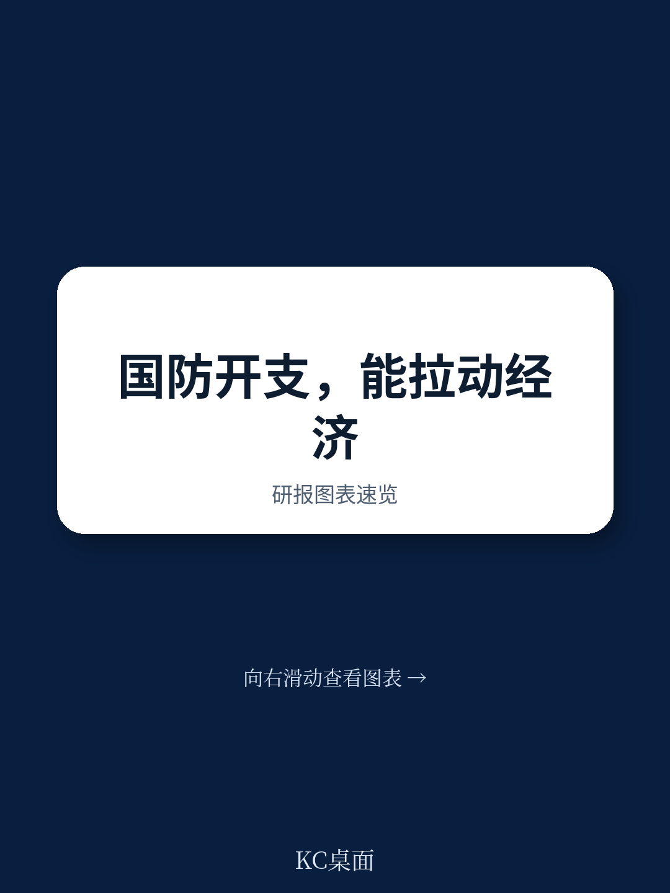
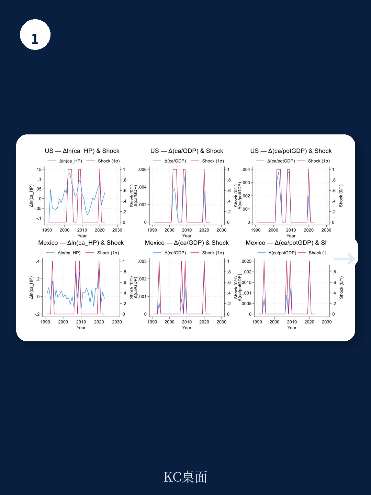
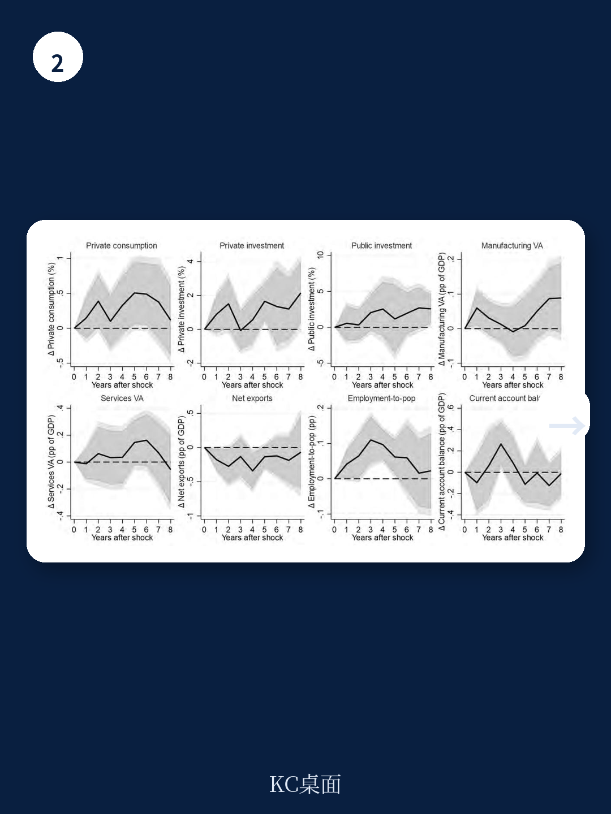

# 亚洲开发银行：技术应用与行业运营观察

亚洲开发银行最新工作论文对1990至2023年间新兴市场与发展中地区的国防支出宏观效应进行了系统估计。研究覆盖全球样本并聚焦亚太地区，发现国防支出冲击在新兴地区产生温和但持久的正向产出响应，乘数在8年后达到约0.7%至1%，而发达地区的效应则偏弱甚至为负。这一差异并非源于支出规模本身，而是取决于地区所处的初始条件——包括财政空间、收入能力、资金发展水平、制度质量以及冲突暴露程度。

研究采用联合国政府职能分类数据，通过局部投影方法识别经周期调整的国防支出冲击，将超出历史均值一个标准差以上的大幅增长定义为外生冲击。这一识别策略旨在捕捉政策层面的主动调整，而非宏观环境自动稳定器带来的被动变化。

## 1. 亚太地区国防支出增速显著高于其他新兴区域

报告引用斯德哥尔摩国际和平研究所数据指出，2023年全球军事支出达到创纪录的2.4万亿美元，其中亚太新兴地区贡献了超过三分之一的增量。中国一国支出达2960亿美元，占区域国防支出的近40%。越南和菲律宾在过去十年间国防预算增幅超过50%，印尼和马来西亚的国防负担也逐步升至GDP的1.2%至1.5%。

这一趋势与其他新兴区域形成鲜明对比。拉丁美洲自1990年代以来军事支出占GDP比重维持在1.3%左右，撒哈拉以南非洲则从2000年的2.3%降至2022年的1.6%。亚太地区因此成为国防预算上升最快、最持久的区域，反映了地缘政治不确定性上升与国内政治优先级的共同作用。

> **KC评论：** 研究将亚太地区作为重点分析对象，并非因为该地区国防支出规模最大，而是因为其增速和持续性在新兴地区中构成一个结构性例外。这为检验国防支出乘数是否存在区域异质性提供了自然实验窗口。

## 2. 功能分解显示核心军事支出与国防研发驱动正向效应

研究将国防支出拆分为核心军事支出、民防、国防相关研发以及对外军事援助四个功能类别。结果显示，只有核心军事支出和国防研发对产出产生显著正向贡献，民防与对外援助的效应在统计上不显著。

这一分解结果有助于理解乘数来源。核心军事支出通过直接采购与人员开支形成需求拉动，而国防研发可能通过技术溢出间接影响生产率。但报告同时指出，国防研发的溢出效应远低于民用基础设施或教育研究，其长期增长贡献存在上限。

在区域层面，南亚地区国防支出乘数显著高于东亚。研究认为，这一差异与采购结构的劳动密集度有关——南亚的国防支出更偏向人员与日常运营，而东亚的采购更集中于资本密集型装备，后者对本地就业和供应链的拉动作用相对有限。

## 3. 乘数大小高度依赖冲突环境与制度条件

状态依赖分析是本文的核心贡献之一。研究系统检验了财政空间、贸易开放度、资金发展、收入能力、制度质量以及冲突暴露程度对乘数的影响。结果显示，在高冲突环境中，国防支出乘数显著更大且更持久；而在低冲突环境中，乘数效应迅速衰减甚至转为负值。

这一发现具有政策含义：国防支出能否产生宏观刺激，不仅取决于支出本身，更取决于支出发生的安全环境。在和平时期，国防支出更可能挤占生产性公共研究；而在冲突或高威胁环境下，安全需求本身构成一种公共品，其边际社会回报可能高于其他支出类别。

报告还发现，区域国防支出冲击的跨境溢出效应整体偏弱，短期内存在微弱正向溢出，但中长期转为负值。这意味着一个国家的国防扩编很难通过贸易或研究渠道带动邻国增长，反而可能在中期产生资源竞争或安全困境效应。

## 4. 研究为支出结构评估提供可复用的分析框架

本文提供了一个可迁移的分析框架：将支出乘数拆解为功能类别、区域特征与状态依赖三个维度，分别检验其作用方向与条件边界。这一框架同样适用于基础设施、教育或卫生支出的乘数评估——不同支出类别在不同制度与安全环境下的乘数差异，可能比支出总量本身更具政策参考价值。

报告在稳健性检验中覆盖了样本选择、变量定义、估计窗口与模型设定等多个维度，确认核心结论在多种规格下保持稳定。研究同时指出，国防支出不应被视为宏观宏观环境稳定的一般性工具，资源向基础设施、健康或教育领域的配置可能带来更大且更具包容性的长期收益。
