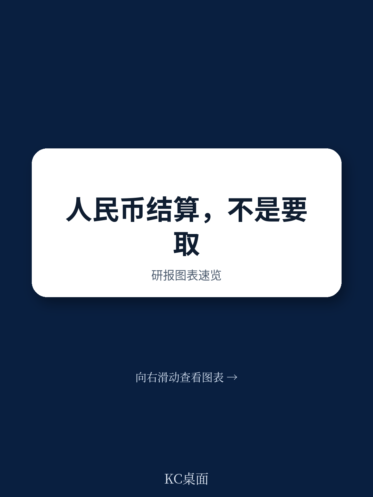
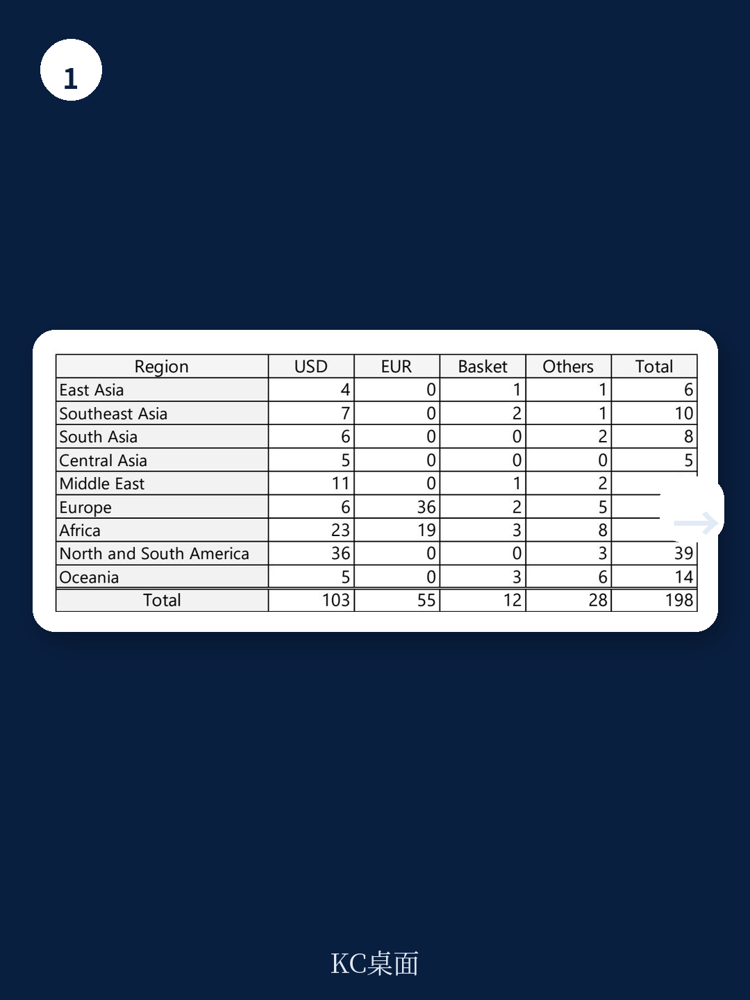
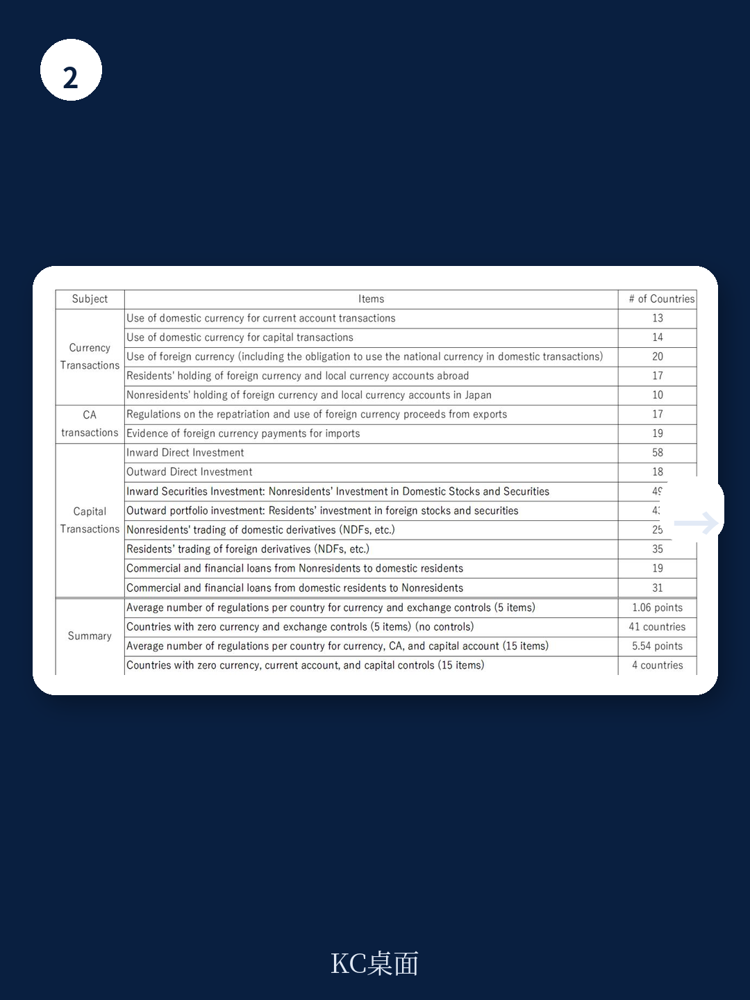

# 亚洲开发银行：货币市场与相关指标观察

一份来自亚洲开发银行研究所的工作论文，基于70个地区2016至2023年的贸易计价数据，系统检验了人民币在国际贸易中计价结算扩张的条件。核心发现是：人民币计价并非对美元的直接替代，而是在美元主导框架下，通过贸易依赖、制度安排和政策工具共同推动的渐进过程。

报告使用IMF发布的贸易计价货币份额数据，覆盖132个国家的出口和进口计价信息。作者将人民币计价份额作为被解释变量，引入了一系列此前研究未系统量化的新变量，包括汇率制度类型、资本与外汇管制程度、人民币清算行和货币互换协议的存在、中国与对象国之间的政治制度联系强度，以及中国高层官员互访频率等。

分析样本覆盖2016至2023年，这一时段恰好跨越了中美贸易摩擦升级、新冠疫情、以及俄乌冲突后的资金制裁常态化。报告认为，这些外部冲击并未根本改变美元的主导地位，但确实改变了部分地区在计价货币选择上的边际行为。

> **KC评论：** 这篇论文的价值不在于预测人民币何时取代美元，而在于拆解了“什么条件下人民币计价会增长”。它把讨论从“会不会替代”拉回到“在哪些场景、哪些制度安排下会逐步渗透”。

## 1. 贸易依赖度是人民币计价扩张的基础条件

报告发现，对中国的出口依赖度是解释人民币计价份额最稳定的变量之一。与中国的双边贸易规模越大，人民币在双边贸易中的计价比例越高。这一关系在进口端比出口端更为显著，说明中国作为买方在推动人民币计价方面拥有更强议价能力。

但贸易依赖度本身并不充分。报告指出，许多对华贸易依赖度高的地区，其人民币计价比例仍然较低。这意味着存在其他结构性障碍，限制了贸易关系向计价货币选择的传导。

## 2. 汇率制度与资本管制构成制度性约束

报告引入了一个此前较少被量化的变量：对象国的汇率制度类型。实证结果显示，实行盯住美元汇率制度的地区，其人民币计价比例显著更低。这一结果符合直觉——当一国货币与美元挂钩时，企业缺乏使用其他货币进行计价结算的激励。

资本账户开放程度的影响则呈现非对称性。报告发现，资本账户完全开放的地区，人民币计价比例反而较低；而保留一定资本管制、同时深度参与中国主导的资金和物流网络的地区，人民币计价比例更高。作者将这一现象解释为：在资本管制环境下，人民币互换协议和清算行等制度安排能够更有效地降低交易成本，从而促进人民币使用。

## 3. 政策工具的效果存在条件依赖

报告检验了中国央行推动的两类主要政策工具：双边本币互换协议和海外人民币清算行。结果显示，清算行的设立对人民币计价有显著正向影响，而互换协议的效果则不够稳定。

作者认为，清算行提供了实际的结算基础设施，降低了人民币交易的操作门槛；而互换协议更多是流动性支持工具，其效果取决于对象国是否有实际的人民币使用需求。这一区分对理解政策工具的传导机制有直接意义——基础设施比流动性承诺更重要。

报告还引入了一个新颖的变量：中国高层官员对对象国的访问频率。结果显示，高层互访与人民币计价比例正相关，尤其是在政治制度差异较大的地区之间。这一发现暗示，政治关系在降低制度摩擦、推动双边资金合作方面发挥了作用。

## 4. 人民币国际化是互补而非替代过程

报告的核心判断落在对人民币国际化性质的界定上。作者认为，当前人民币计价扩张不是对美元主导地位的挑战，而是在美元框架内的补充性发展。这一判断基于两个实证观察：第一，人民币计价份额在样本期内虽有增长，但绝对水平仍然很低；第二，人民币计价增长最明显的地区，往往是那些同时保持美元挂钩汇率制度、但对华贸易和研究联系深化的国家。

这意味着，人民币国际化的路径不是“去美元化”，而是“在美元体系边缘逐步渗透”。对于企业决策者和政策制定者而言，这一结论的启示是：人民币的使用增长不会改变全球贸易计价的基本格局，但会在特定区域、特定交易类型和特定制度安排下形成可观察的增量。

> **KC评论：** 报告对“互补而非替代”的论证，实际上回答了市场一个常见误区：人民币国际化是否意味着美元体系削弱。从数据看，两者并非零和关系。理解这一点，有助于更准确地评估跨境贸易和研究中的货币选择不确定性。

## 5. 一个可复用的观察框架

报告提供了一个分析货币国际化进程的可迁移框架：将影响因素分为三类——结构性因素（贸易依赖度、商品类型）、制度性因素（汇率制度、资本管制、政治距离）和政策性因素（清算行、互换协议、高层互访）。三类因素的交互作用决定了计价货币选择的边际变化。

这一框架对观察其他新兴货币的国际化进程同样适用。例如，印度卢比、巴西雷亚尔等货币在区域贸易中的使用扩张，也可以从贸易依赖度、汇率制度安排和政策工具三个维度进行拆解。报告的方法论贡献在于，它把货币国际化从一个宏观叙事拆解为可检验的变量关系，而不是停留在“替代还是共存”的二元讨论。

For informational purposes only. Portions may be generated,translated,summarized,or edited with AI assistance based on source materials and may contain omissions or errors. Please verify independently. This is not investment,legal,tax,accounting,or other professional advice.

