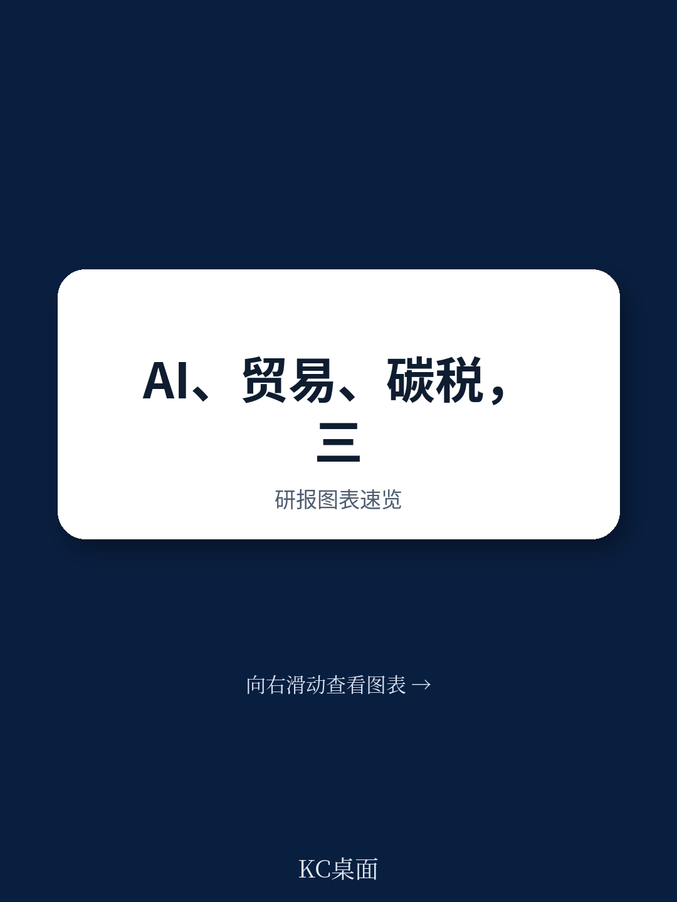
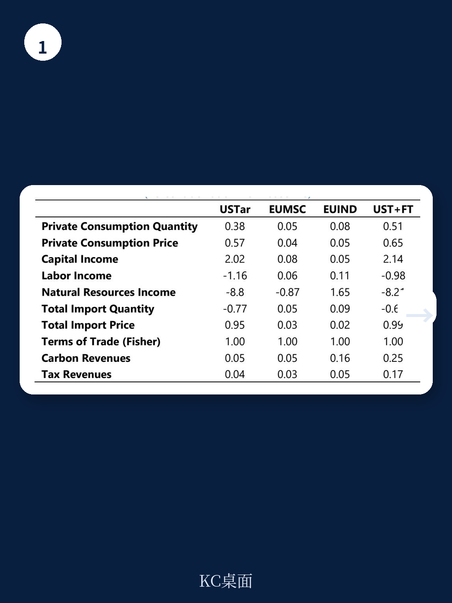

# IMF：行业规则与主题变化观察

爱尔兰作为小型开放地区，正同时面对贸易政策调整、人工智能扩散和能源转型三重结构性力量。IMF最新发布的国别报告（SIP/2026/070）通过可计算一般均衡模型，量化了这三股力量对爱尔兰产出、出口、就业和碳排放的长期影响。核心发现是：贸易政策变化主要带来贸易流向的重新配置，对总体宏观环境影响有限；AI驱动的生产率提升能够显著拉动增长，尤其在知识密集型部门，但会引发大规模的部门间劳动力再分配；碳定价可以在控制AI扩张带来的排放增量方面发挥关键作用，但需要与增长目标进行权衡。

## 1. 关税与贸易协定主要改变贸易流向而非总量

报告模拟了四种贸易情景：美国2025年底实施的关税、欧盟与南方共同市场及印度的双边自贸协定，以及三者叠加。结果显示，这些贸易政策冲击对爱尔兰总体GDP和出口总量的影响相当温和。在“美国关税+欧盟双自贸协定”的叠加情景下，爱尔兰实际GDP变动幅度在正负0.5%以内，出口价格和数量的调整也主要体现为结构性转移而非总量调整。

更值得关注的不是总量，而是贸易伙伴结构和部门构成的重新配置。美国关税导致爱尔兰对美出口下降，部分被对欧盟内部和自贸协定伙伴的出口增长所抵消。部门层面，医药化工和计算机电子等爱尔兰优势出口部门受到的影响最为显著，但调整幅度仍属可控。

> **KC评论：** 这份模拟的关键假设是贸易政策变化仅通过关税渠道传导，未包含非关税壁垒或研究转移效应。对于高度嵌入全球价值链的爱尔兰来说，实际调整可能比模型显示的更为复杂，但方向性判断——贸易政策更多改变流向而非总量——在静态框架下是稳健的。

## 2. AI生产率提升带来显著增长，但伴随劳动力再分配不确定性

报告设定了低、中、高三档AI驱动的全要素生产率提升情景，并假设所有地区同时发生生产率变化，因此爱尔兰的相对表现取决于其部门结构与AI受益程度的匹配度。在高AI情景下，爱尔兰实际GDP增长可达10%以上，出口增长更为显著。

增长分布高度不均。知识密集型服务业——包括资金、保险、商务服务——是最大受益者，产出和出口增幅远超传统制造业。与此同时，部分劳动密集型制造业和低技能服务业的产出相对调整。劳动力从调整部门向扩张部门的再分配规模可观：在高AI情景下，知识密集型服务业劳动力需求增长超过10%，而部分传统制造业和低技能服务业的就业下降幅度也在类似量级。

报告特别指出，这种劳动力再分配对收入分配的影响需要政策管理。AI带来的生产率收益主要流向资本和高技能劳动力，低技能劳动力的相对收入可能承压。

## 3. 碳定价可以抵消AI带来的排放增量

AI驱动的宏观环境增长会推高能源需求和碳排放。报告模拟了在低、中、高三档AI情景下，通过额外碳定价将爱尔兰碳排放控制在基准水平所需的政策力度。结果显示，在高AI情景下，需要将碳价从基准的约72美元/吨CO2提升至约150美元/吨，才能完全抵消AI增长带来的排放增量。

碳定价的传导机制包括两个层面：一是提高化石能源使用成本，促使电力结构向可再生能源倾斜；二是改变相对价格，引导生产结构向低碳活动转移。在AI叠加碳定价的情景中，爱尔兰可再生能源发电占比从基准水平显著提升，同时GDP增长仍保持正值，但增速低于无碳定价的AI情景。

报告还模拟了在无AI冲击的情况下，通过碳定价实现20%减排目标的情景。这一情景下的碳价水平与AI情景下的碳价处于可比区间，说明碳定价工具在两种场景下都具有可操作性。

> **KC评论：** 报告没有模拟AI自身带来的额外电力需求（如数据中心），只考虑了宏观环境增长的间接效应。如果计入AI基础设施的直接能耗，碳定价需要达到的水平可能更高。这一点在政策设计中需要额外关注。

## 4. 三重力量叠加下的政策权衡

将贸易、AI和碳定价放在同一框架中审视，最核心的发现是：AI带来的增长潜力最大，但伴随的劳动力再分配和碳排放不确定性也最大；碳定价可以有效管理排放，但会部分抵消AI的增长红利；贸易政策的影响相对次要，更多体现为结构调整而非总量冲击。

对于爱尔兰这样的开放地区，政策选择的关键不在于单一力量的应对，而在于如何设计组合政策。报告的分析框架提供了一个可复用的观察方式：先识别每种力量对产出、就业和排放的独立影响，再考察它们之间的交互效应，最后评估政策工具的覆盖范围和力度是否足以管理这些交互带来的外部性。

报告也坦诚指出了模型的局限性：静态框架无法捕捉动态调整路径；AI建模为外生生产率冲击，未考虑资本积累和技能形成的内生过程；碳定价是单一政策工具，未纳入补贴、法规等现实政策组合。这些限制意味着模拟结果应被视为方向性参考，而非精确预测。
