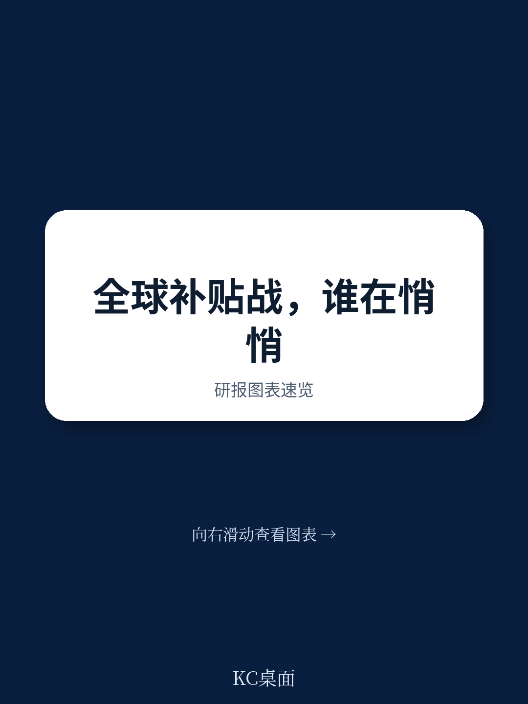
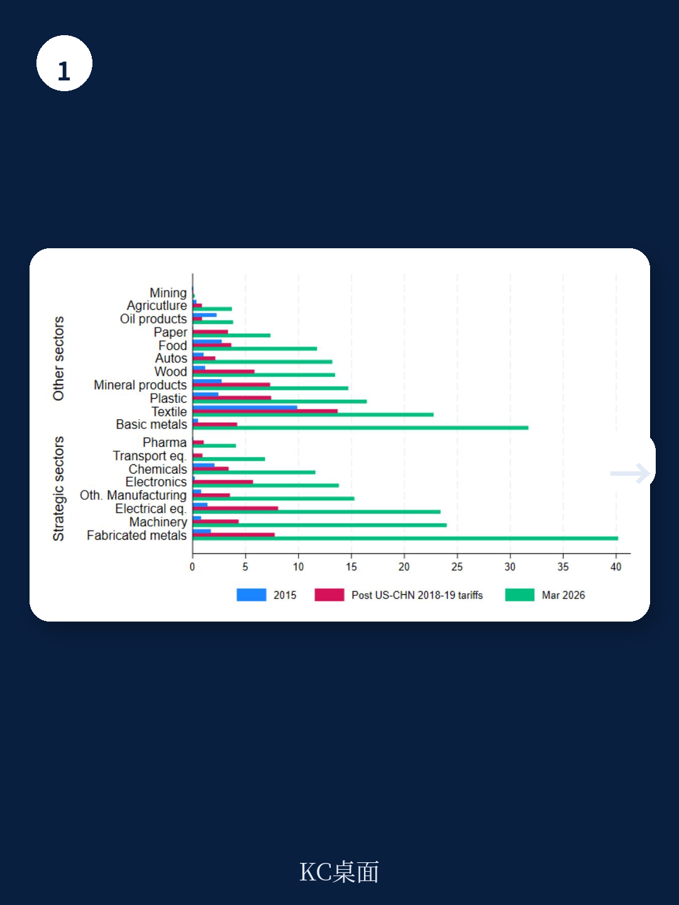
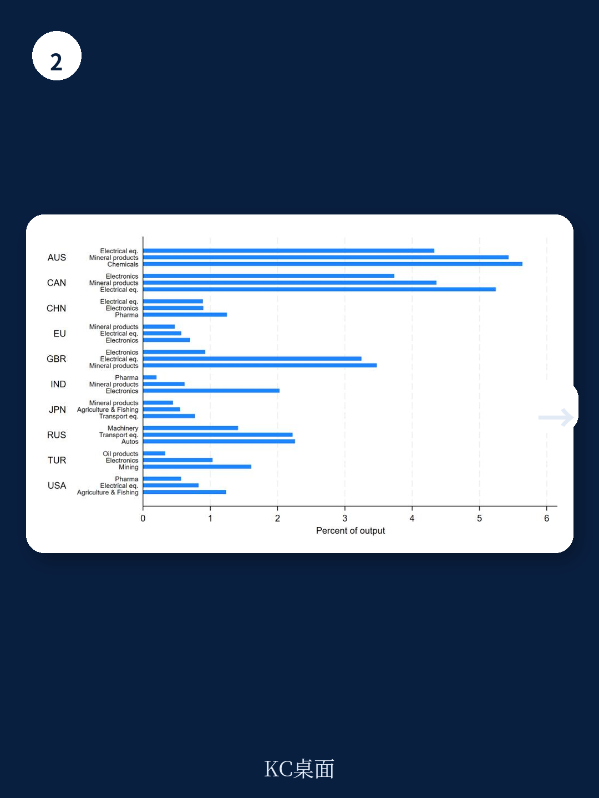

# IMF：行业规则与主题变化观察

中国在战略行业的补贴力度与贸易效应，已显著超过美国和欧盟。IMF最新工作论文通过构建多国多部门一般均衡模型，首次系统量化了2015至2023年间全球工业补贴对贸易流动和福利的影响。报告的核心发现是：中国对战略行业的补贴使其出口增长约12%，而美国和欧盟的同类补贴仅带来约2%的出口提升。这种不对称不仅源于补贴规模差异，更关键的是补贴行业选择与规模宏观环境效应的叠加。

## 1. 中国补贴集中于战略行业，欧美更多流向非战略领域

报告基于全球贸易预警数据库和新型工业政策观测站数据，采用交叉验证方法估算了各国分行业补贴率。2015至2023年间，中国对战略行业的补贴率增长超过非战略行业的三倍。到2023年，全球战略行业补贴率从2015年的约0.5%升至1.8%，这一增长主要由中国驱动。相比之下，美国和欧盟的补贴更多流向农业和矿产品等非战略领域。

中国在战略产品全球出口中的份额已超过欧盟和美国，三者合计占全球战略产品出口的一半以上。报告特别指出，中国在电子、制药等行业的补贴集中度远高于其他主要地区。

> **KC评论：** 补贴的行业选择比补贴总额更能解释贸易效应差异。中国将补贴集中在规模宏观环境效应强的电子等行业，而欧美补贴分散在规模效应弱的农业等领域，导致同样的补贴支出产生截然不同的贸易结果。

## 2. 规模宏观环境效应放大补贴对出口的影响

报告的一个重要理论贡献是区分了补贴的直接价格效应和通过规模宏观环境产生的生产率效应。模拟结果显示，中国电子行业出口增长约20%，而农业和纺织等非战略行业出口下降。这种行业间资源再分配的核心驱动力是规模宏观环境：补贴引导就业向战略行业集中，产出扩大带来单位成本下降，进一步强化了价格竞争力。

在包含所有国家补贴的情景下，中国战略产品占全球出口份额升至约29%，而欧盟和美国在电子行业的出口下降最高达7%。报告强调，如果没有规模宏观环境效应，补贴对贸易格局的影响将大幅减弱。

## 3. 关税部分抵消补贴效应，但无法逆转行业分工

报告将2018至2019年以及2025年以来的中美关税变化纳入模型。结果显示，关税确实部分抵消了中国补贴带来的出口增长，但并未根本改变补贴驱动的行业专业化方向。中国在战略行业的净出口仍保持增长，只是增速节奏变化。

关税的福利成本更为显著。报告测算表明，补贴与关税叠加后，全球福利出现净损失。补贴本身如果精准针对市场失灵，理论上可以提升效率，但关税作为回应性措施，其扭曲效应超过了补贴可能带来的收益。

## 4. 补贴的跨境溢出效应不可忽视

报告揭示了补贴的三种跨境影响机制：直接降低竞争对手在补贴国市场的出口、削弱竞争对手在第三方市场的竞争力、以及通过投入品价格影响全球供应链。中国对电子行业的补贴不仅挤压了欧美在本土市场的份额，还降低了它们在东南亚等第三方市场的竞争力。

这种溢出效应在战略行业尤为明显。报告指出，由于战略行业通常具有更强的规模宏观环境和更集中的全球市场结构，补贴的谨慎外部性比非战略行业更大。

## 5. 补贴数据的局限性与模型假设

报告坦诚承认其补贴估算方法的局限性。全球贸易预警数据库未覆盖2009年之前的遗留补贴，且可能将同一政策的不同组成部分记录为多个独立措施。此外，模型假设补贴不改变总体贸易平衡，且政府支出通过一次性转移支付融资，这些假设在现实中未必成立。

报告还指出，其分析聚焦于长期均衡效应，未考虑短期调整成本和政策不确定性对研究决策的影响。这些因素可能使实际贸易调整过程比模型预测更为缓慢和曲折。

For informational purposes only. Portions may be generated,translated,summarized,or edited with AI assistance based on source materials and may contain omissions or errors. Please verify independently. This is not investment,legal,tax,accounting,or other professional advice.

