# TECHNICAL ASSISTANCE REPORT

## MONGOLIA

Nowcasting and Near-Term Forecasting System at the Bank of Mongolia

APRIL 2026

PREPARED BY

Martin Fukač

Authoring Departments
Caucasus, Central Asia and Mongolia
Capacity Development Center (CCAMTAC)

Institute for Capacity Development (ICD)

©2026 International Monetary Fund

JEL Classification Numbers: C53, E37, E47, E58

Keywords:

The contents of this document constitute technical advice provided by the staff of the International Monetary Fund to the authorities of Bank of Mongolia (the "CD recipient") in response to their request for technical assistance. Unless the CD recipient specifically objects to such disclosure, this document (in whole or in part) or summaries thereof may be disclosed by the IMF to the IMF Executive Director for Mongolia to other IMF Executive Directors and members of their staff, as well as to other agencies or instrumentalities of the CD recipient, and upon their request, to World Bank staff, and other technical assistance providers and donors with legitimate interest, members of the Steering Committee of CCAMTAC (see Staff Operational Guidance on the Dissemination of Capacity Development Information). Publication or Disclosure of this report (in whole or in part) to parties outside the IMF other than agencies or instrumentalities of the CD recipient, World Bank staff, other technical assistance providers and donors with legitimate interest, members of the Steering Committee of CCAMTAC shall require the explicit consent of the CD recipient and the IMF's ICD department.

The analysis and policy considerations expressed in this publication are those of the authors

## Acknowledgments

## MEMBERS

  
Armenia

  
Azerbaijan

  
Tajikistan  
Georgia  
Mongolia

  
Turkmenistan

  
Kazakhstan

  
Uzbekistan  
Kyrgyz Republic

## DEVELOPMENT PARTNERS

  
Switzerland

  
Russia

  
China

  
Ministry of Strategy and Finance
Republic of Korea

  
United States of America

  
European Union

  
Asian Development Bank

  
Poland

## Contents

Acknowledgments....3   
Abbreviations....6   
Preface....8   
Executive Summary....9   
Recommendations....10   
I. Background....11   
A. Macroeconomic and Monetary Policy Context....11   
B. Project Beneficiary....11   
C. Project Objectives, Deliverables and Timeline....11   
D. Integration with Broader Forecasting and Policy Analysis System....12   
E. NNTF System Design Principles....12   
II. System Components....13   
A. Analytical Software Platform....13   
B. Database System and Data Management....13   
C. Data....13   
D. Target Variables....13   
E. Model Portfolio....15   
F. Dynamic Model Forecast Averaging....15   
G. Forecast Quality Monitor....17   
H. Human Resources and Their Organization....18   
III. System Architecture and Initial Setup....19   
A. Organization....19   
B. Object-Oriented Approach....19   
C. Deployment....19   
D. Initial Setup....20   
IV. System Validation....23   
A. System vs. Benchmark Performance....23   
B. Potential Additional Accuracy Gains....25   
V. Selected Operational Issues....29   
A. Incorporating Expert Judgement and Off-Model Information....29   
B. Formulating Economic Narratives....30   
C. Dealing with Data Revisions....33   
D. Integrating NNTF and QPM....34   
VI. System Deployment....35   
VII. Next Steps....36

VIII. Authorities’ Views......37
Annexes
A. Annex List of Delivered TA Missions......38
B. Annex List of Target Variables and Their Selected Predictors......39

## Abbreviations

<table><tr><td>AIC</td><td>Akaike Information Criterion</td></tr><tr><td>AR</td><td>Autoregression</td></tr><tr><td>ARIMA</td><td>Autoregressive Integrated Moving Average</td></tr><tr><td>AS-ARIMA(X)</td><td>Automated Stepwise ARIMA with Exogenous Variables</td></tr><tr><td>BIC</td><td>Bayesian Information Criterion</td></tr><tr><td>BoM</td><td>Bank of Mongolia</td></tr><tr><td>BRIDGE</td><td>Bridge regression nesting LASSO and RIDGE estimators</td></tr><tr><td>BVAR</td><td>Bayesian Vector Autoregression</td></tr><tr><td>CCAMTAC</td><td>Caucasus, Central Asia and Mongolia Capacity Development Center</td></tr><tr><td>CPI</td><td>Consumer Price Index</td></tr><tr><td>EAPD</td><td>Economic Analysis and Policy Division, Bank of Mongolia</td></tr><tr><td>FPAS</td><td>Forecasting and Policy Analysis System</td></tr><tr><td>GARCH</td><td>Generalized Autoregressive Conditional Heteroskedasticity model</td></tr><tr><td>GDP</td><td>Gross Domestic Product</td></tr><tr><td>GDP-P</td><td>Production-Based Gross Domestic Product</td></tr><tr><td>GDP-E</td><td>Expenditure-Based Gross Domestic Product</td></tr><tr><td>GFCF</td><td>Gross Fixed Capital Formation</td></tr><tr><td>ICD</td><td>Institute for Capacity Development</td></tr><tr><td>IMF</td><td>International Monetary Fund</td></tr><tr><td>JVI</td><td>Joint Vienna Institute</td></tr><tr><td>LASSO</td><td>Least Absolute Shrinkage and Selection Operator regression</td></tr><tr><td>LBVAR</td><td>Large Bayesian Vector Autoregression</td></tr><tr><td>MA</td><td>Moving Average</td></tr><tr><td>MIDAS</td><td>Mixed Data Sampling</td></tr><tr><td>MCD</td><td>Middle Eastern and Central Asia Department, IMF</td></tr><tr><td>MPC</td><td>Monetary Policy Committee</td></tr><tr><td>MPD</td><td>Monetary Policy Department, Bank of Mongolia</td></tr><tr><td>NNTF</td><td>Nowcasting and Near-Term Forecasting</td></tr><tr><td>NSO</td><td>National Statistics Office Mongolia</td></tr><tr><td>NTF</td><td>Near-Term Forecasting</td></tr><tr><td>QPM</td><td>Quarterly Projection Model</td></tr><tr><td>RIDGE</td><td>Regularized Linear Regressions</td></tr><tr><td>RMSE</td><td>Root Mean Squared Error</td></tr><tr><td>RMSFE</td><td>Root Mean Squared Forecast Error</td></tr><tr><td>SARIMA</td><td>Seasonal ARIMA</td></tr><tr><td>STI</td><td>Singapore Training Institute</td></tr><tr><td>TA</td><td>Technical Assistance</td></tr></table>

U-MIDAS

Unrestricted Mixed Data Sampling

VAR

Vector Autoregression

WA

Weighted Average

## Preface

The Caucasus, Central Asia, and Mongolia Capacity Development Center (CCAMTAC) of the International Monetary Fund (IMF), in collaboration with the IMF's Institute for Capacity Development (ICD), supported the Bank of Mongolia's (BoM) efforts in strengthening its economic surveillance capacities through enhancing and expanding its nowcasting and near-term economic forecasting (NNTF) apparatus. The apparatus is one of the key components of the central bank's broader forecasting and policy analysis system that constitutes the analytical technology supporting evidence-based advice and the formulation of prudent, forward-looking monetary policy aimed at supporting living standards by maintaining price stability in Mongolia. This technical assistance (TA) project commenced in July 2022 and concluded in October 2025.

The project outcomes are a result of teamwork. The project team consisted of the CCAMTAC team: Mr. Martin Fukač (Resident Adviser, CCAMTAC; project manager and activity lead); and the Economic Analysis and Policy Division (EAPD) team — the primary TA recipient: Ms. Khulan Bayarsaikhan (Economist), Mr. Tsend-Ayush Bold-Erdene (Division Chief), Mr. Chinzorig Chuluunbaatar (Economist), Mr. Khanbold Gombodorj (Economist), and Mr. Enkhbayar Jambaldorj (Former Economist).

This project would not have been possible without the support of Mr. Byadran Lkhagvasuren (Governor, BoM) and Mr. Dominique Desruelle (Former Director ICD). The project team further gratefully acknowledges the generous support of CCAMTAC's donor community and the International Monetary Fund. The authors further wish to extend heartfelt appreciation to Mr. Bayardavaa Bayarsaikhan (Director General of the Monetary Policy Department, MPD) for constant support and guidance, and to the staff of the MPD for their constructive feedback and contributions at various stages of the project. Gratitude is also extended to Ms. Angana Banerji (Former Mongolia Mission Chief, MCD), Mr. Andrew Berg (Deputy Director, ICD), Mr. Alexander Borodin (TA Review Team, ICD), Mr. Paul Cashin (Former Division Chief, ICD), Mr. Natan Epstein (Division Chief, ICD), Mr. Norbert Funke (Director, CCAMTAC), Mr. Thomas Harjes (Deputy Director, JVI), Mr. Yaroslav Hul (ICD), Mr. Tigran Poghosyan (IMF Resident Representative to Mongolia, MCD), Ms. Laure Redifer (Former ICD), Mr. Kai Song (ICD), Mr. SeokHyun Yoon (Former IMF Resident Representative to Mongolia, MCD), and Mr. Felipe Zanna (Deputy Division Chief, ICD) and numerous other colleagues for their support and expert guidance.

The project execution greatly benefited from the administrative, budget, logistics, and other coordination support from Ms. Irina Kouropatkina (ICD), Ms. Elisa Manarinjara (ICD), Ms. Aiymkan Talaibek kyzy (CCAMTAC), Ms. Grace Tiberi (ICD), Ms. Riham Yousif (ICD), Ms. Imel Yu (ICD), and Mr. Yerassyl Shayakhmetov (CCAMTAC).

## Executive Summary

This technical assistance (TA) report documents the development and implementation of a nowcasting and near-term forecasting (NNTF) system for the Bank of Mongolia (BoM). The system strengthens BoM's capacity for timely macroeconomic surveillance and supports the conduct of monetary policy by providing a more systematic and reliable assessment of near-term economic developments. In comparative terms, the NNTF framework ranks among the most advanced systems implemented with IMF support across the CCAMTAC region.

The NNTF system provides real-time monitoring of incoming data and supports early identification of deviations from baseline projections, improving the information set available for policy discussions. Validation exercises show that the system delivers materially stronger forecast performance than historical staff forecasts, especially at the nowcasting and one-quarter-ahead horizons, with forecast errors reduced by up to 25 percent for key indicators such as consumer prices and major GDP components.

Beyond technical gains, the introduction of the NNTF system has enhanced how near-term analysis is used in the policy process. Compared with the previous framework, the upgraded system supports a more structured incorporation of judgment, clearer economic narratives accompanying numerical forecasts, and a more disciplined treatment of data revisions—elements that are essential for timely, transparent, and well-informed monetary policy decisions.

Looking ahead, sustained operational use, continued staff engagement, and targeted system refinement will be important to preserve these gains and to ensure that near-term analysis feeds reliably into medium-term policy assessments under the broader forecasting and policy analysis system.

## Recommendations

<table><tr><td colspan="3">Institutionalization</td></tr><tr><td>1.</td><td>Institutionalize regular use of the NNTF system in MPD forecasting rounds.</td><td>Short term / MPD</td></tr><tr><td colspan="3">Maintenance and Further Development</td></tr><tr><td>2.</td><td>Establish a structured internal feedback mechanism on forecast performance.</td><td>Short term / EAPD</td></tr><tr><td>3.</td><td>Focus technical refinements on selected high-priority variables.</td><td>Short term / EAPD</td></tr><tr><td>4.</td><td>Expand automation of routine reporting where feasible.</td><td>Short term / EAPD</td></tr><tr><td colspan="3">Human Resources</td></tr><tr><td>5.</td><td>Formalize internal training and onboarding for NNTF users.</td><td>Short term / MPD</td></tr></table>

## I. Background

## A. Macroeconomic and Monetary Policy Context

1. Mongolia is a small, open, commodity-exporting economy, with coal and copper accounting for a large share of exports, fiscal revenues, and economic activity. As a result, macroeconomic performance is highly sensitive to commodity price cycles and external demand conditions. In addition, the agricultural sector—employing a significant share of the population—is vulnerable to adverse weather conditions, contributing to volatility in output and consumer prices.

2. The Law on the Central Bank establishes price stability as the primary objective of monetary policy. In practice, monetary policy is conducted under an inflation-targeting framework, with a medium-term inflation target of 6 percent $\pm2$ percentage points. The Monetary Policy Committee (MPC) determines the policy rate, while liquidity conditions are managed through open market operations.

3. The exchange rate follows de jure floating regime. In practice, the exchange rate regime functions as a crawl-like arrangement, allowing flexibility while smoothing volatility through interventions.

4. These structural features underscore the importance of timely and reliable near-term economic monitoring tools to support policy decisions.

## B. Project Beneficiary

5. The Economic Analysis and Policy Division (EAPD) of the Monetary Policy Department (MPD) is the primary beneficiary of the TA project. The core team comprises: Mr. Tsend-Ayush Bold-Erdene (Division Chief), Mr. Enkhbayar Jambaldorj (Economist, senior NNTF operator), Ms. Khulan Bayarsaikhan (Economist, junior NNTF operator), Mr. Chinzorig Chuluunbaatar (Economist, second NNTF operator), Mr. Khanbold Gombodorj (Economist).

6. The division's core functions include monitoring current economic developments, assessing risks to price and macroeconomic stability, and contributing to the formulation of monetary policy advice. EAPD staff produce near-term forecasts of key macroeconomic variables, which serve as inputs into the Bank's medium-term projection models and policy scenario analysis.

7. Strengthening near-term forecasting capacity is therefore directly aligned with EAPD's operational mandate and supports the effectiveness of the Bank's inflation-targeting framework.

## C. Project Objectives, Deliverables and Timeline

8. The primary objective of the TA project was to strengthen the Bank of Mongolia's near-term forecasting capacity through the development of a comprehensive NNTF system. Specific objectives included improving forecast accuracy, broadening sectoral coverage, strengthening automation, and enhancing the sustainability of analytical tools.

9. The project emphasized three complementary pillars. The first pillar focused on the technical design and implementation of the NNTF system, including model development, forecast-combination techniques, and system architecture. The second pillar emphasized capacity development, with targeted training aimed at enabling staff to operate, maintain, and further develop the system independently. The third pillar focused on operational integration, including communication of results and alignment with the broader forecasting and policy analysis framework.

10. TA was delivered through a sequence of missions between June 2021 and October 2025, combining hands-on system development with training and validation exercises. A complete list of missions is provided in Annex A.

## D. Integration with Broader Forecasting and Policy Analysis System

11. The NNTF system is an integral component of the Bank's broader forecasting and policy analysis system (FPAS). It addresses information gaps arising from publication lags in key macroeconomic statistics, particularly national accounts and balance-of-payments data, by synthesizing signals from high-frequency indicators.

12. Near-term forecasts generated by the system provide initial conditions for medium-term projection models, including semi-structural quarterly models used in policy analysis. The accuracy of these initial conditions is critical, as forecast errors at short horizons can propagate into medium-term projections and affect policy conclusions.

13. Beyond its original role in supporting medium-term projections, the NNTF system provides a stand-alone platform for real-time macroeconomic monitoring. It supports sectoral analysis, enhances cross-sectoral consistency, and strengthens the flow of structured information to policymakers.

## E. NNTF System Design Principles

14. The design of the NNTF system reflects institutional constraints and operational needs within EAPD. Staff rotation, evolving analytical priorities, and limited programming expertise necessitate a framework that is robust yet easy to operate.

## 15. Three design principles guided system development:

Scalability ensures that the system can accommodate expanding data coverage, additional target variables, and a growing user base without fundamental restructuring.

Flexibility allows new models, variables, and methodological approaches to be incorporated with minimal disruption. Models can be activated or deactivated as analytical needs evolve.

Trainability ensures that staff can operate the system reliably following structured training and limited hands-on practice. This reduces dependence on a small number of technical specialists and supports institutional sustainability.

16. An object-oriented architecture underpins these principles and supports long-term maintainability.

## II. System Components

## A. Analytical Software Platform

17. Selection of the analytical software platform was guided by long-term sustainability, availability of documentation and peer support, ease of use, cost effectiveness, and academic adoption. Following assessment of alternatives, the Bank retained its existing platform, which meets operational requirements and supports further system development.

## B. Database System and Data Management

18. The NNTF system is supported by an internal macroeconomic database accessible via the Bank's intranet. The database is structured to mirror relational principles while maintaining accessibility through an Excel-based interface. Data are updated according to a release calendar, with sectoral experts responsible for verification and quality control.

## C. Data

19. Macroeconomic and financial statistics in Mongolia are broadly adequate for surveillance and policy analysis. However, publication lags—particularly for national accounts and balance-of-payments data—continue to constrain real-time assessment, underscoring the importance of near-term monitoring tools.

20. The EAPD's core database comprises approximately 300 active time series and provides access to a broader set of supplementary indicators. Data are sourced from internal systems, the National Statistics Office of Mongolia, and international sources, covering daily to annual frequencies.

## D. Target Variables

21. The NNTF system covers three core macroeconomic sectors: the real sector, the external sector, and the monetary sector. Within each sector, the system monitors a selected set of target variables, defined as key macroeconomic indicators used to assess near-term economic conditions. Where data properties permit, these variables are forecast to support short-term analysis. Target variable selection reflects sector-specific analytical relevance and data characteristics. Table 1 summarizes the target variables by sector and the corresponding initial model portfolio. Annex B provides additional information on the explanatory variables used in multivariate specifications.

22. In the real sector, the NNTF system covers both expenditure-based and production-based measures of GDP. Production-side indicators include manufacturing, electricity, trade, transportation, communication, other services, and non-mining/non-agriculture activities. Mining activity is monitored but not forecast within the NNTF framework; projections are obtained from mining companies and other quantitative sources. Private aggregate demand is tracked through household consumption and gross fixed capital formation. Price developments are monitored using headline CPI inflation and selected subcomponents, including food items, imported goods, other domestic goods, and services.

23. In the monetary sector, the system produces forecasts for business and household credit growth of depository institutions. In the external sector, the system supports monitoring of goods imports,

disaggregated into consumer, capital, and industrial goods. Exports, which are closely linked to mining production, are monitored outside the NNTF framework.

Table 1 List of target variables and initial model portfolio

<table><tr><td rowspan="2">Target variable</td><td rowspan="2">Frequency</td><td colspan="4">Univariate models</td><td colspan="8">Multivariate models</td><td></td></tr><tr><td>AR(1)</td><td>ARIMA</td><td>SARIMA</td><td>GARCH</td><td>BRIDGE</td><td>STAT-VAR (2)</td><td>RIDGE</td><td>LASSO</td><td>MIDAS</td><td>MIDAS (pc)</td><td>UMIDAS</td><td>UMIDAS (pc)</td><td>BVAR</td></tr><tr><td>Consumer prices</td><td>m</td><td>+</td><td></td><td>+</td><td>+</td><td>+</td><td>+</td><td></td><td></td><td></td><td></td><td>+</td><td></td><td></td></tr><tr><td>Consumer prices, subcomponents</td><td></td><td>+</td><td></td><td>+</td><td>+</td><td>+</td><td>+</td><td></td><td></td><td></td><td></td><td>+</td><td></td><td></td></tr><tr><td>Beef</td><td></td><td>+</td><td></td><td>+</td><td>+</td><td>+</td><td>+</td><td></td><td></td><td></td><td></td><td>+</td><td></td><td></td></tr><tr><td>Mutton</td><td></td><td>+</td><td></td><td>+</td><td>+</td><td>+</td><td>+</td><td></td><td></td><td></td><td></td><td>+</td><td></td><td></td></tr><tr><td>Other Meat</td><td></td><td>+</td><td></td><td>+</td><td>+</td><td>+</td><td>+</td><td></td><td></td><td></td><td></td><td>+</td><td></td><td></td></tr><tr><td>Milk</td><td></td><td>+</td><td></td><td>+</td><td>+</td><td>+</td><td>+</td><td></td><td></td><td></td><td></td><td>+</td><td></td><td></td></tr><tr><td>Flour</td><td></td><td>+</td><td></td><td>+</td><td>+</td><td>+</td><td>+</td><td></td><td></td><td></td><td></td><td>+</td><td></td><td></td></tr><tr><td>Vegetable</td><td></td><td>+</td><td></td><td>+</td><td>+</td><td>+</td><td>+</td><td></td><td></td><td></td><td></td><td>+</td><td></td><td></td></tr><tr><td>Other Food</td><td></td><td>+</td><td></td><td>+</td><td>+</td><td>+</td><td>+</td><td></td><td></td><td></td><td></td><td>+</td><td></td><td></td></tr><tr><td>Imported Food</td><td></td><td>+</td><td></td><td>+</td><td>+</td><td>+</td><td>+</td><td></td><td></td><td></td><td></td><td>+</td><td></td><td></td></tr><tr><td>Imported Goods</td><td></td><td>+</td><td></td><td>+</td><td>+</td><td>+</td><td>+</td><td></td><td></td><td></td><td></td><td>+</td><td></td><td></td></tr><tr><td>Domestic Goods</td><td></td><td>+</td><td></td><td>+</td><td>+</td><td>+</td><td>+</td><td></td><td></td><td></td><td></td><td>+</td><td></td><td></td></tr><tr><td>Service</td><td></td><td>+</td><td></td><td>+</td><td>+</td><td>+</td><td>+</td><td></td><td></td><td></td><td></td><td>+</td><td></td><td></td></tr><tr><td>GDP production side</td><td>q</td><td></td><td></td><td></td><td></td><td></td><td></td><td></td><td></td><td></td><td></td><td></td><td></td><td></td></tr><tr><td>Manufacture</td><td></td><td>+</td><td>+</td><td></td><td></td><td>+</td><td>+</td><td></td><td></td><td></td><td></td><td>+</td><td></td><td></td></tr><tr><td>Electricity</td><td></td><td>+</td><td>+</td><td></td><td></td><td>+</td><td>+</td><td></td><td></td><td></td><td></td><td>+</td><td></td><td></td></tr><tr><td>Trade</td><td></td><td>+</td><td>+</td><td></td><td></td><td>+</td><td>+</td><td></td><td></td><td></td><td></td><td>+</td><td></td><td></td></tr><tr><td>Communication</td><td></td><td>+</td><td>+</td><td></td><td></td><td>+</td><td>+</td><td></td><td></td><td></td><td></td><td>+</td><td></td><td></td></tr><tr><td>Other service</td><td></td><td>+</td><td>+</td><td></td><td></td><td>+</td><td>+</td><td></td><td></td><td></td><td></td><td>+</td><td></td><td></td></tr><tr><td>Net tax</td><td></td><td>+</td><td>+</td><td></td><td></td><td>+</td><td>+</td><td></td><td></td><td></td><td></td><td>+</td><td></td><td></td></tr><tr><td>GDP expenditure side</td><td>q</td><td></td><td></td><td></td><td></td><td></td><td></td><td></td><td></td><td></td><td></td><td></td><td></td><td></td></tr><tr><td>Household consumption</td><td></td><td>+</td><td>+</td><td></td><td></td><td>+</td><td>+</td><td>+</td><td>+</td><td></td><td></td><td>+</td><td></td><td>+</td></tr><tr><td>Gross fixed capital formation</td><td></td><td>+</td><td>+</td><td></td><td></td><td>+</td><td>+</td><td>+</td><td>+</td><td></td><td></td><td>+</td><td></td><td>+</td></tr><tr><td>Credit</td><td>q</td><td></td><td></td><td></td><td></td><td></td><td></td><td></td><td></td><td></td><td></td><td></td><td></td><td></td></tr><tr><td>Business credit</td><td></td><td>+</td><td>+</td><td></td><td></td><td>+</td><td>+</td><td></td><td></td><td></td><td></td><td>+</td><td></td><td></td></tr><tr><td>Consumer credit</td><td></td><td>+</td><td>+</td><td></td><td></td><td>+</td><td>+</td><td></td><td></td><td></td><td></td><td>+</td><td></td><td></td></tr><tr><td>Imports of goods</td><td>q</td><td></td><td></td><td></td><td></td><td></td><td></td><td></td><td></td><td></td><td></td><td></td><td></td><td></td></tr><tr><td>Consumer goods</td><td></td><td>+</td><td></td><td></td><td></td><td>+</td><td>+</td><td></td><td></td><td>+</td><td>+</td><td>+</td><td>+</td><td>+</td></tr><tr><td>Non-durable goods</td><td></td><td>+</td><td></td><td></td><td></td><td>+</td><td>+</td><td></td><td></td><td>+</td><td>+</td><td>+</td><td>+</td><td>+</td></tr><tr><td>Passenger cars</td><td></td><td>+</td><td></td><td></td><td></td><td>+</td><td>+</td><td></td><td></td><td>+</td><td>+</td><td>+</td><td>+</td><td>+</td></tr><tr><td>Durable goods excluding Passenger cars</td><td></td><td>+</td><td></td><td></td><td></td><td>+</td><td>+</td><td></td><td></td><td>+</td><td>+</td><td>+</td><td>+</td><td>+</td></tr><tr><td>Capital goods</td><td></td><td>+</td><td></td><td></td><td></td><td>+</td><td>+</td><td></td><td></td><td>+</td><td>+</td><td>+</td><td>+</td><td>+</td></tr><tr><td>Construction materials</td><td></td><td>+</td><td></td><td></td><td></td><td>+</td><td>+</td><td></td><td></td><td>+</td><td>+</td><td>+</td><td>+</td><td>+</td></tr><tr><td>Equipments</td><td></td><td>+</td><td></td><td></td><td></td><td>+</td><td>+</td><td></td><td></td><td>+</td><td>+</td><td>+</td><td>+</td><td>+</td></tr><tr><td>Vehicles</td><td></td><td>+</td><td></td><td></td><td></td><td>+</td><td>+</td><td></td><td></td><td>+</td><td>+</td><td>+</td><td>+</td><td>+</td></tr><tr><td>Industrial products</td><td></td><td>+</td><td></td><td></td><td></td><td>+</td><td>+</td><td></td><td></td><td>+</td><td>+</td><td>+</td><td>+</td><td>+</td></tr></table>

Note: (AR(1)) autoregressive model of order 1; (ARIMA) autoregressive integrate moving averages models, optimal orders are selected automatically; (SARIMA) seasonal ARIMA, optimal orders are selected automatically; (GARCH) generalized autoregressive conditional heteroscedasticity, optimal orders are selected automatically; (VAR(2)) vector autoregressive model of order 2; (BVAR) Bayesian vector autoregressions of order 2; (RIDGE) regularized linear regressions; (LASSO) regularized linear regressions models with least absolute shrinkage and selection operator; BRIDGE regression models, nesting LASSO and RIDGE regressions; (MIDAS(pc)) mixed data sampling regressions, with or without the use of principal components; (U-MIDAS(pc)) unrestricted mixed data sampling regressions, with or without the use of principal components.

24. All target variables are monitored and reported as annual percentage changes. Data are modeled at a quarterly frequency, except for the consumer price index, which is modeled monthly. Higher-frequency

data are converted to quarterly frequency using either quarterly averages or end-of-quarter values, depending on the characteristics of the variable. Models are estimated and evaluated using data samples starting as early as 2000Q1 and extending through 2024Q2. Sample lengths vary across target variables and model specifications, reflecting data availability.

## E. Model Portfolio

25. The initial model portfolio comprises a range of linear and non-linear time-series models, including univariate, multivariate, and mixed-frequency approaches. No prior is imposed on the relative performance of individual models. Instead, the portfolio is designed to capture a broad set of perspectives and allow models to compete. This diversification reduces reliance on any single specification and increases the likelihood of identifying emerging trend changes over the near-term forecast horizon.

26. The initial model portfolio is referred to as the baseline portfolio. Each model is implemented as a modular object within the NNTF system, allowing for integration, modification, or temporary deactivation. When deployed in a new domain, a standard baseline set of univariate and multivariate models is implemented and calibrated. Additional models are incorporated as warranted by analytical needs and data availability.

27. The initial model portfolio is referred to as the baseline portfolio. Within the NNTF system, each model is implemented as a modular object, allowing for seamless integration, modification, or temporary deactivation for maintenance purposes. When the NNTF system is deployed in a new domain (e.g. new sector), a standard baseline set of univariate and multivariate time-series models is first implemented and calibrated. Additional models are incorporated subsequently, as warranted by analytical needs and data availability for that particular domain.

28. Table 1 summarizes the composition of the baseline portfolio. The specific mix of models varies across sectors and includes univariate models (AR, ARIMA, SARIMA, GARCH), multivariate models (VAR, BVAR, elastic nets, ridge and LASSO regressions), and mixed-frequency models (bridge regressions, MIDAS, U-MIDAS). This diversified portfolio supports robustness by capturing a range of linear and non-linear dynamics across macroeconomic sectors.

29. As with any empirical forecasting framework, the NNTF tools are constrained by historical regularities observed in the estimation sample. Forecasts may therefore fail to capture genuinely novel developments. Users are expected to apply professional judgment when forming baseline projections for policy purposes. This limitation is partially mitigated through the incorporation of off-model information, as discussed in the section on Operational Issues.

## F. Dynamic Model Forecast Averaging

30. The forecast combination method plays a pivotal role in enhancing the NNTF's forecast numerical precision and reducing statistical uncertainty. This approach aggregates predictions from multiple models to create a more robust and balanced forecast, mitigating the risks of relying on a single model. Both simple arithmetic averaging and dynamic forecast averaging were tested. While computationally more demanding, dynamic model forecast averaging performs better in back-testing and is therefore adopted as the baseline approach.

31. Dynamic weighting algorithms assign weights to individual models based on their historical performance over the nowcasting horizon and the 1-, 2-, and 3-quarter-ahead forecast horizons. Weights are updated as new information becomes available, allowing the combination to adapt to changing economic conditions and underlying drivers, including demand- or supply-side developments, internal or external shocks, and temporary or permanent effects. By integrating multiple, observationally equivalent model-based perspectives, the framework enhances robustness and limits model-specific risks through continuous weight reallocation.

32. Dynamic model weights, $w_{i,h,t}$ , are computed as a function of past forecast performance, summarized by a moving average of forecast errors, $e_{i,h,t}$ , and a set of control parameters:

$$
w _ {i, h, t} = \frac {\boldsymbol {e} _ {i , h , t} ^ {- v}}{\sum_ {i} \boldsymbol {e} _ {i , h , t} ^ {- v}}
$$

$$
e _ {i, h, t} = \sqrt {\frac {1}{k} \sum_ {s = 0} ^ {k} \left[ E _ {t - s - h} (y _ {i , t - s}) - y _ {t - s} \right] ^ {2}}
$$

where $w_{i,h,t}$ is the relative weight of model i at forecast horizon h and time t. The index i represents the model number, where $i = 1, \ldots, m$ and m is the total number of forecasting models in the portfolio. The forecast horizon includes the nowcast and the near-term horizon of up to three quarters ahead, i.e., h = 0, 1, 2, 3. $e_{i,h,t}$ is the average root-mean-square forecast error (RMSFE) of model i at forecast horizon h and time t, calculated over a rolling window of length k. In the baseline parametrization, v is the weighting penalty parameter. As the value of v increases, the weight assigned to models with higher errors decreases exponentially. The weighting penalty (v) and the length of the moving-average window (k) parameters are the dynamic weight control parameters or hyper parameters. $E_{t-s-h}(y_{i,t-s})$ denotes the forecast of the variable $y_{i,t-s}$ at time t - s for horizon h, using model i and given the information available at time t - s - h, where s = 0, ..., k.

33. RMSFE is a standard metric for evaluating forecast accuracy, summarizing average forecast errors in the same units as the predicted variable. It provides a consistent basis for assessing relative model performance across indicators and forecast horizons and for constructing robust forecast combinations.

34. For each forecast horizon h, the combined forecast is computed as either a simple or dynamically weighted average of individual model forecasts:

$$
A E _ {t} (y _ {t + h}) = \frac {1}{m} \sum_ {i = 1} ^ {m} E _ {t} (y _ {i, t + h})
$$

$$
D E _ {t} (y _ {t + h}) = \sum_ {i = 1} ^ {m} w _ {i, h, t} E _ {t} (y _ {i, t + h}),
$$

where $AE_{t}(y_{t+h})$ denotes the simple arithmetic average forecast and $DE_{t}(y_{t+h})$ the dynamically weighted forecast.

35. Forecast performance is sensitive to the calibration of hyperparameters. In practice, these parameters may be adjusted to reflect variable-specific characteristics. For example, RMSFE is computed over a four-quarter window, but shorter windows may be used for selected indicators to increase sensitivity to recent developments. Excessively short or long windows, however, may introduce instability or reduce responsiveness, underscoring the need for careful calibration.

36. Additional penalty terms may be applied to moderate the influence of forecast errors or model complexity, thereby limiting overfitting and improving out-of-sample performance. Extreme parameter values can distort weights and undermine forecast reliability; calibration therefore aims to balance robustness and adaptability. The optimization of hyperparameters with respect to forecasting performance is discussed further in the section on System Validation.

37. The NNTF system's reliance on reduced-form time-series models and forecast averaging improves forecast precision, but it entails a trade-off by limiting the direct economic interpretability of near-term projections. As a result, their usefulness for policy-relevant analysis, staff recommendations, and policy decision-making is inherently constrained. The section on Operational Issues outlines four approaches to mitigate this limitation when communicating results to policymakers.

## G. Forecast Quality Monitor

38. To support system maintenance, a Forecast Quality Monitor was developed as a standardized reporting tool. The monitor tracks forecast errors and selected diagnostic indicators at both the individual-model and model-portfolio levels. These indicators are benchmarked against predefined thresholds. Breaches trigger automated alerts, signaling that a model may require review due to persistently elevated forecast errors.

39. Systematic recording of forecast errors and monitoring of their evolution are essential for maintaining and improving the performance of the NNTF system, particularly through the refinement of forecast averaging. Individual model forecasts are stored at each data update, and forecast errors—across models and forecast horizons—are computed and archived. Model weights are subsequently recalculated to reflect the latest performance metrics. Figure 1 illustrates a typical Forecast Quality Monitor dashboard. Similar dashboards are maintained for all target variables.

Figure 1 Illustration of Forecast Quality Monitor  
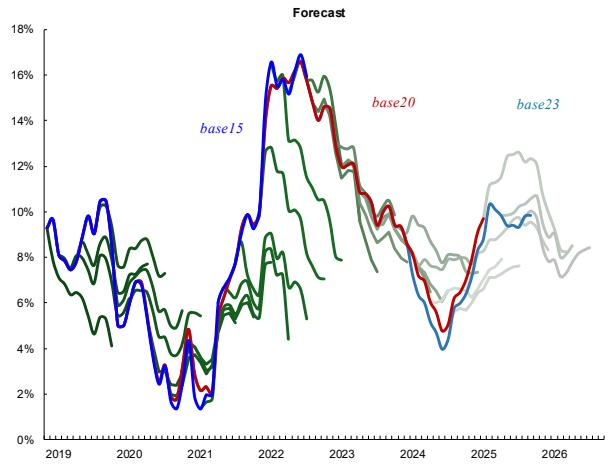

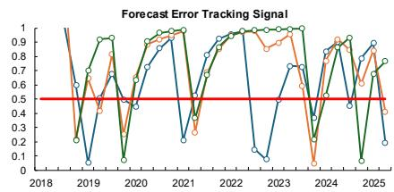

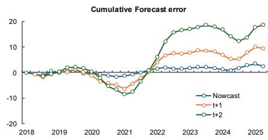

Summary of forecast performance (sample average)

<table><tr><td colspan="2">Forecast horizon (quarters)</td><td>Nowcast</td><td>t+1</td><td>t+2</td><td>t+3</td><td>t+4</td></tr><tr><td>(1)</td><td>Mean Forecast Error</td><td>0.1%</td><td>0.3%</td><td>0.7%</td><td>0.9%</td><td>0.9%</td></tr><tr><td>(2)</td><td>Standart Deviation of Forecast Error</td><td>0.7%</td><td>1.6%</td><td>2.5%</td><td>3.2%</td><td>4.1%</td></tr><tr><td>(3)</td><td>Forecast Bias Indicator, abs(1)/(2)</td><td>12.2%</td><td>20.7%</td><td>27.0%</td><td>26.8%</td><td>22.2%</td></tr><tr><td>(4)</td><td>Mean Absolute Forecast Error</td><td>0.5%</td><td>1.2%</td><td>1.8%</td><td>2.3%</td><td>2.7%</td></tr><tr><td>(5)</td><td>Root Mean Squared Error (RMSE)</td><td>0.7%</td><td>1.6%</td><td>2.5%</td><td>3.3%</td><td>4.2%</td></tr><tr><td>(6)</td><td>RMSE, Random Walk</td><td>1.4%</td><td>2.4%</td><td>3.7%</td><td>5.5%</td><td>7.0%</td></tr><tr><td>(7)</td><td>RMSE ratio, Staff vs. Random Walk (5)/(6)</td><td>47.9%</td><td>64.3%</td><td>68.1%</td><td>59.4%</td><td>59.4%</td></tr></table>

## H. Human Resources and Their Organization

40. Human resource requirements for operating, maintaining, and developing the NNTF system depend primarily on the scope of coverage. In its initial configuration, the EAPD system supports five sectoral experts covering consumer prices, economic activity (GDP-P and GDP-E), the balance of payments, and the monetary sector.

41. Resources required to operationalize the NNTF system are divided into five system users and two technical specialists. System users are economists responsible for applying the framework in the policy advisory process. Users update databases, generate nowcasts and near-term forecasts, incorporate off-model judgment where appropriate, prepare forecast narratives, and brief policymakers. They also monitor forecast quality and report issues to the technical team. Users may contribute to system development by proposing new models that enhance sectoral analysis.

42. Technical specialists are responsible for system maintenance and continuous development. Responsibilities include system deployment support, user training, resolution of technical issues, framework optimization, and development of new models and features.

43. Overall, the team's capacity is strong for operating, maintaining, and further developing the NNTF system. Going forward, the authorities are reminded of the importance of effective human resource management and of continuously investing in their staff to ensure that the system remains sustainable and continues to serve the institution well. The main risk arises from the loss of expertise due to staff turnover. Management efforts should focus on preserving institutional knowledge through staff retention, cooperation with universities, and skill-broadening rotation. Rotation is more feasible among system users, while pairing senior developers with junior staff supports specialized technical knowledge transfer. Human resource policies should prioritize the retention of specialized technical skills critical to system maintenance and development, as these skills are more costly to build and replace than user-level capabilities.

# III. System Architecture and Initial Setup

## A. Organization

44. The NNTF system architecture is organized into three main components: a calibration block, an operational block, and a performance-monitoring block. The calibration block is used exclusively during system setup and optimization. At this stage, data is prepared and empirical evidence is assessed to inform variable selection for multivariate models. Models are estimated using training samples, and their performance is evaluated through pseudo-real-time forecasting exercises. The results of these exercises provide quantitative inputs for the initial calibration of dynamic forecast-averaging weights.

45. The operational block comprises a set of routines executed by system users to generate numerical forecasts on a regular basis. It also includes basic reporting tools that produce tabular and graphical forecast summaries. Forecast tracking relative to central projections and assessment of the marginal contribution of new information are currently supported through Excel-based templates. Further automation of routine reporting would reduce operational burden and allow users to focus on analytical and research tasks.

46. The performance-monitoring block records historical forecasts and compares them with realized outcomes. Forecast errors are archived, tracked, and used to update model weights within the dynamic averaging framework. These errors also serve diagnostic purposes, supporting ongoing monitoring of average forecast quality and the condition of individual models. A traffic-light system based on forecast-tracking signals enables technical staff to identify persistent deterioration in model performance and intervene when necessary.

## B. Object-Oriented Approach

47. The NNTF system adopts an object-oriented design in which each forecasting model—univariate or multivariate, linear or non-linear—is implemented as a discrete object within the framework. This architecture treats models as modular building blocks, allowing new specifications to be integrated without disrupting the existing structure. Each model and its associated properties are stored in dedicated code or text files following a standardized naming convention, ensuring traceability and facilitating maintenance. By encapsulating model attributes and methods within objects, the design enhances flexibility, scalability, and long-term maintainability, allowing the model portfolio to evolve as analytical needs and data availability change.

## C. Deployment

48. System deployment involves installation of the NNTF framework and execution of basic functionality tests. The process begins with establishing a standardized folder structure for system codes, forecasting models, tabular outputs, and archived quantitative results stored as CSV files. Once the structure is in place, system codes are transferred to the designated directories. Provided that the required software environment is already installed, deployment is typically straightforward.

49. Prior to code transfer, the deployment process includes validation of the operating environment to ensure compatibility with required software versions, libraries, and hardware specifications. These checks help prevent runtime errors and support stable system operation.

50. An initial data-integrity check is conducted before running the framework. Input datasets are validated for completeness and formatting consistency to ensure that the system executes correctly and produces reliable outputs from the outset.

51. Prospective system users observe the deployment process and receive an overview of the framework's structure and core functionality. This introductory exposure ensures that users understand the system architecture and basic operational workflow before using the framework for forecasting purposes.

## D. Initial Setup

52. The initial system set-up involves configuring the framework for a new sector and preparing the analytical environment for forecasting. Figure 2 summarizes the workflow for the initial NNTF setup. The process begins with identifying target variables and collecting relevant macroeconomic and sectoral data from internal databases and official external sources. These data are imported into the Monetary Policy Department's Time Series Storage System, which serves as the central repository for macroeconomic and financial indicators. Data verification and consistency checks are then performed to ensure completeness and accuracy.

53. Following verification, seasonal adjustment is applied to remove recurring intra-year patterns. This step is particularly important in Mongolia, where high-frequency indicators exhibit pronounced seasonality related to weather conditions, agricultural cycles, and consumption behavior. Seasonal adjustment is conducted using the X-13 ARIMA-SEATS methodology implemented in EViews. While the procedure is automated, expert review remains necessary to address residual seasonality and ensure appropriate specification.

54. Short-term forecast extensions are subsequently generated using an automated ARIMA procedure. These extensions fill temporary data gaps, provide estimates for recent periods where official data are unavailable, and supply consistent inputs for mixed-frequency models linking higher-frequency indicators to quarterly aggregates. After this step, series are transformed to stationary form by differencing or logarithmic transformations. All data are then harmonized and converted to quarterly frequency for use in short-term forecasting models.

55. Selection of explanatory variables, including lag structures, is a core component of the setup process. To support this step, the NNTF system applies a fully automated three-stage AS-ARIMA(X) procedure. First, correlations between the target variable and all candidate variables are computed. Second, an ARIMA model is estimated for the dependent variable to determine optimal autoregressive and moving-average orders. Third, candidate exogenous variables are added sequentially to form ARIMA-X specifications. Variables are retained only if they improve model fit, satisfy basic economic sign restrictions, and are statistically significant. These criteria allow systematic screening of a large number of candidate series. Final model selection remains with the sector expert, who may also designate certain variables as mandatory. Annex B lists the explanatory variables identified as strong predictors for the target variables.

## Figure 2

## Data collection

## Step 1

Prices & Costs

Real Sector

Labor Market

External Sector

Monetary & Credit

Financial Markets

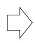

Sentiment & Surveys

National Accounts

High Frequency Proxies

Other

## Step 2

Archive to Data base

## Model building

## Step 1

Choose models

Step 2

Estimate each model

## Tasks in Setting Up and Fine-Tuning the NNTF System

## Data preparation

## Step 1

Seasonal adjustment

Step 2

Auto ARIMA

Step 3

Frequency conversion

Step 4

Stationarity test

## Forecast evaluation

## Step 1

Error analysis for each model

Step 2

Model weight

Step 3

Weighted average forecast

## Variable selection

## Step 1

Estimate correlation

Step 2

AS-ARIMAX

## Step 3

Final variables selection

## PRODUCTION:

## NNTF & Report

## Step 1

Analysis of each individual model

## Step 2

Weighting matrix

## Step 3

Analysis of weighted average forecast

## Step 4

Final forecast

56. Models are evaluated using out-of-sample forecast errors from a common evaluation start date. This evaluation supports construction of weighted average forecasts, with better-performing models receiving higher weights. Models with persistently weak performance are excluded from the portfolio. Forecast averaging generally reduces errors relative to individual models and mitigates risks associated with model instability. A key limitation of this approach is reduced transparency with respect to the contribution of individual explanatory variables, an issue discussed further in the section on Operational Issues.

57. Once the system is configured, calibrated, and its initial performance validated, it is moved to production. The full setup and validation process typically requires several hours, depending on the number of target variables, data availability and quality, and computational constraints.

58. The NNTF system currently supports daily updates, allowing forecasts to be refreshed whenever new information becomes available. This capability enables continuous monitoring of forecast revisions and evolving economic conditions. Ongoing fine-tuning is therefore required to maintain system performance. New models are developed in a manner consistent with the system architecture and can be integrated without disrupting existing components.

## IV. System Validation

59. The forecasting performance of the NNTF system is assessed through back-testing designed to mimic a pseudo-real-time forecasting environment. This chapter summarizes baseline and complementary validation results and documents the main sources of forecast-accuracy gains. Consumer prices (headline CPI) and aggregate private demand (household consumption in constant prices) are used as illustrative examples to demonstrate the validation and optimization methods.

## A. System vs. Benchmark Performance

60. This section reports baseline validation results. To approximate performance under operational conditions, NNTF forecasts are benchmarked against historical staff forecasts used by the Bank of Mongolia (BoM) in policy advisory work. Back-testing on quarterly data over 2018–2023 provides quantitative evidence that the NNTF system constitutes a robust engine for mechanical near-term forecasting. Subject to the caveats discussed below, the system generally outperforms the benchmark staff forecasts. Results are summarized in Table 2.

61. In the pseudo-real-time experiment, the NNTF system yields average RMSE improvements of 30.7, 23.7, 14.4, and 4.1 percent for the nowcast and the 1-, 2-, and 3-quarter-ahead horizons, respectively (Table 2, last row). Improvements are not uniform across all target variables and subcomponents (highlighted cells in gray identify cases where the system does not outperform the benchmark). Accuracy gains are concentrated at short horizons—nowcasting and one-quarter-ahead—consistent with the empirical regularity that mechanical forecasts and model averaging tend to deliver the largest benefits at the near end of the horizon.

62. The largest nowcast gains (exceeding 50 percent) are observed for flour prices (51.2 percent), domestic goods prices (60.6 percent), services prices (52.4 percent), and communication sector value added (50.5 percent) within GDP-P. Gains between 40 and 50 percent are observed for electricity (41.9 percent), construction (46.0 percent), trade (40.6 percent), and private consumption (42.8 percent). Electricity sector forecasts outperform the benchmark across all horizons, which may reflect differences in the treatment of information and judgment in historical staff forecasts.

63. Accuracy gains decline with the forecast horizon. At two and three quarters ahead, improvements are generally modest (typically below 15 percent), with a small number of exceptions (including selected food price items and some activity indicators).

64. The system underperforms the benchmark for a subset of series (Table 2). In nowcasting, the largest deteriorations occur for mutton prices (22.4 percent) and industrial goods imports (25.4 percent). For industrial goods imports, relative underperformance persists at longer horizons (20.2 and 39.7 percent at two and three quarters ahead). Additional series with notable deteriorations include flour (three quarters ahead), domestic goods (two and three quarters ahead), communication (three quarters ahead), and construction goods imports (three quarters ahead). These cases warrant further diagnostic work, including assessment of whether omitted episodic factors (e.g., climatic shocks) could improve predictive accuracy.

Table 2: Average RMSEs of the NNTF System Relative to the Staff Forecasts (in percent)

<table><tr><td rowspan="2"></td><td colspan="4">Forecast horizon (quarters)</td></tr><tr><td>0</td><td>1</td><td>2</td><td>3</td></tr><tr><td>(1) Consumer price index</td><td>-37.5</td><td>-17.4</td><td>-14.0</td><td>-9.5</td></tr><tr><td>(2) Consumer price index, bottom up</td><td>-26.0</td><td>-15.5</td><td>-7.8</td><td>1.2</td></tr><tr><td>Mutton</td><td>22.4</td><td>-10.5</td><td>-4.1</td><td>-1.3</td></tr><tr><td>Beef</td><td>3.9</td><td>-21.5</td><td>-25.9</td><td>-22.8</td></tr><tr><td>Other meat</td><td>-15.3</td><td>0.4</td><td>-7.5</td><td>-17.7</td></tr><tr><td>Milk</td><td>-35.3</td><td>-26.9</td><td>-19.1</td><td>-16.1</td></tr><tr><td>Flour</td><td>-51.2</td><td>-20.4</td><td>0.1</td><td>22.0</td></tr><tr><td>Vegetables</td><td>-7.4</td><td>-6.5</td><td>-9.0</td><td>-8.9</td></tr><tr><td>Imported goods</td><td>-26.8</td><td>-23.2</td><td>-25.7</td><td>-16.6</td></tr><tr><td>Domestic goods</td><td>-60.6</td><td>-4.5</td><td>47.8</td><td>99.5</td></tr><tr><td>Services</td><td>-52.4</td><td>-24.4</td><td>-21.0</td><td>-16.9</td></tr><tr><td>(3) Gross domestic product, production</td><td>-34.4</td><td>-25.4</td><td>-15.5</td><td>-8.1</td></tr><tr><td>Agriculture</td><td>-32.8</td><td>-23.4</td><td>-15.8</td><td>-16.2</td></tr><tr><td>Manufacturing</td><td>-7.6</td><td>-0.4</td><td>2.6</td><td>-12.6</td></tr><tr><td>Electricity</td><td>-41.9</td><td>-40.9</td><td>-45.2</td><td>-47.4</td></tr><tr><td>Construction</td><td>-46.0</td><td>-39.8</td><td>-19.8</td><td>-13.1</td></tr><tr><td>Trade</td><td>-40.6</td><td>-21.2</td><td>-15.3</td><td>-5.3</td></tr><tr><td>Transportation</td><td>-39.0</td><td>-32.3</td><td>-29.6</td><td>1.0</td></tr><tr><td>Communication</td><td>-50.5</td><td>-26.4</td><td>-17.5</td><td>22.0</td></tr><tr><td>Other service</td><td>-14.0</td><td>-18.1</td><td>-16.2</td><td>-0.4</td></tr><tr><td>Net tax</td><td>-37.0</td><td>-26.0</td><td>17.1</td><td>-1.0</td></tr><tr><td>(4) Gross domestic product, expenditure</td><td>-34.0</td><td>-30.0</td><td>-21.0</td><td>-2.8</td></tr><tr><td>Household consumption</td><td>-42.8</td><td>-35.9</td><td>-27.1</td><td>-19.1</td></tr><tr><td>Gross fixed capital formation</td><td>-25.2</td><td>-24.1</td><td>-14.9</td><td>13.5</td></tr><tr><td>(5) Imports of goods</td><td>-21.9</td><td>-30.2</td><td>-13.9</td><td>-1.4</td></tr><tr><td>Consumer goods</td><td>-36.9</td><td>-33.0</td><td>-24.4</td><td>-3.9</td></tr><tr><td>Nondurables</td><td>-27.6</td><td>-26.1</td><td>0.4</td><td>-11.4</td></tr><tr><td>Durables, passenger cars</td><td>-25.3</td><td>-41.1</td><td>-38.2</td><td>-16.0</td></tr><tr><td>Durable, other</td><td>-27.2</td><td>-31.0</td><td>-26.2</td><td>-12.4</td></tr><tr><td>Industrial goods</td><td>25.4</td><td>7.8</td><td>20.2</td><td>39.7</td></tr><tr><td>Capital goods</td><td>-39.5</td><td>-26.8</td><td>3.5</td><td>16.5</td></tr><tr><td>Construction</td><td>-8.4</td><td>-47.2</td><td>2.3</td><td>15.0</td></tr><tr><td>Equipment</td><td>-21.6</td><td>-39.8</td><td>-39.4</td><td>-27.9</td></tr><tr><td>Vehicles and vehicle parts, trucks</td><td>-35.6</td><td>-35.0</td><td>-23.0</td><td>-12.6</td></tr><tr><td>Total average [(1)+(2)+(3)+(4)+(5)]/5</td><td>-30.7</td><td>-23.7</td><td>-14.4</td><td>-4.1</td></tr></table>

Note: The table displays the relative percentage difference between the RMSE of Staff forecasts and the RMSE of the NNTF system across nowcasting (0) and near-term forecast horizons (1–3 quarters). Negative values indicate percentage improvements of the NNTF system compared to the Staff forecasts, measured by their RMSE ratio. Positive values (highlighted with a shaded background) indicate a percentage deterioration in the NNTF system's forecasts relative to the Staff forecasts, measured by their RMSE ratio. The RMSE are calculated for annual percentage changes of the target variables. The annual growth rates for the gross domestic product and imports of goods are in domestic currency and constant prices. Because of varying data availability, the RMSE for the gross domestic product forecasts are calculated on the 2018Q1-2023Q3 sample; for the consumer price index on the 2018Q4-2023Q3 sample; and for the imports of goods on the 2018Q1-2024Q2 sample.

Figure 3 Historical Staff Forecast for Headline Consumer Prices  
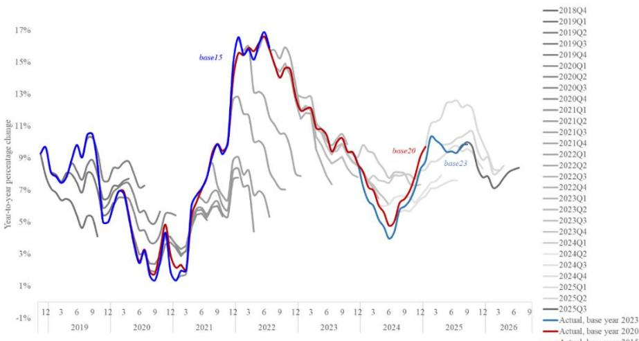

65. While historical staff forecasts provide a useful benchmark, the comparison should be interpreted with caution. A fully level comparison is difficult in pseudo-real-time testing because the information set available to staff at the time forecasts were produced cannot be replicated exactly. Key macroeconomic datasets (notably national accounts) are subject to revisions, and staff forecasts may incorporate contemporaneous institutional knowledge (e.g., anticipated policy changes or known events) that is not readily encoded in back-testing exercises.

66. Conversely, NNTF models are estimated and tested using the latest available data vintages. Although revisions are controlled for where feasible and transparent (notably CPI base and basket changes), reliance on the most recent vintages may mechanically favor the NNTF system, since forecasts and evaluation are conducted against the same vintage.

67. Overall, the back-testing results are interpreted as supportive evidence of the NNTF system's forecasting performance prior to operational use. The system generally performs at least as well as historical approaches and provides a useful complement to BoM's near-term forecasting and surveillance process.

## B. Potential Additional Accuracy Gains

68. There remains scope for additional gains in forecast accuracy. The EAPD development team explored several avenues for further improvement. Dynamic forecast averaging was tested and subsequently deployed across all sectors. Given the substantial computational demands, multi-dimensional optimization of the NNTF system was implemented only in an experimental setting and for a limited set of variables.

## Dynamic Forecast Averaging

69. Forecast averaging delivers substantial gains in forecast accuracy relative to individual models. Dynamic forecast averaging provides an additional improvement—about 15 percent on average—relative to simple arithmetic averaging. Time-varying weights also provide operational diagnostics by making relative model contributions transparent over time (Figure 4).

## Multi-Dimensional Optimization

70. Additional tests assessed whether forecast accuracy could be further improved by optimizing elements of the dynamic weighting scheme. The search considered alternative loss criteria (e.g., RMSFE variants), evaluation-window length, penalty terms, and horizon definitions. Results were mixed, and average gains were generally modest relative to the associated computational costs.

71. Figure 5 summarizes sensitivity results across key parameter dimensions. The current configuration is optimized for forecasting production-based GDP. Control parameters were calibrated using a dedicated training sample (2013Q1–2017Q4) and evaluated through a subsequent pseudo-real-time forecasting sequence.

72. After calibration, additional—though variable-dependent—improvements in average forecast accuracy are observed for selected indicators. Optimization routines were applied initially to consumer prices, GDP-P, private consumption, and imports of consumption goods. Results are summarized in Table 3. Relative to arithmetic averaging, optimized parametrization improves forecast accuracy by 18.3 percent for the nowcast and 10.3 percent at the three-quarter-ahead horizon on average across the selected subsample.

Table 3: Optimize vs Arithmetic Forecast Averaging (relative forecast performance, in percent)

<table><tr><td rowspan="2"></td><td colspan="4">Forecast horizon (quarters)</td></tr><tr><td>0</td><td>1</td><td>2</td><td>3</td></tr><tr><td>Consumer price index, subcomp. average</td><td>-40.6</td><td>-24.2</td><td>-17.4</td><td>-12.0</td></tr><tr><td>Gross domestic product, prod., subcomp. average</td><td>-5.4</td><td>-5.1</td><td>-5.1</td><td>-4.8</td></tr><tr><td>Private consumption</td><td>-18.7</td><td>-18.6</td><td>-20.2</td><td>-20.5</td></tr><tr><td>Imports of consumption goods</td><td>-8.5</td><td>-5.9</td><td>-6.1</td><td>-3.7</td></tr><tr><td>Subsample Average</td><td>-18.3</td><td>-13.5</td><td>-12.2</td><td>-10.3</td></tr></table>

73. A key implication of these tests is that there is no uniform parametrization that performs best across variables and horizons. While multidimensional optimization can yield incremental gains, it is operationally demanding under current computational constraints and would impose additional burden on sector experts whose primary responsibility is macroeconomic surveillance. A pragmatic approach is therefore to adopt a robust baseline parametrization for dynamic averaging (in this application, v = 1 and k = 1) and to reserve further optimization for selected high-priority series where expected benefits justify costs.

74. Overall, although multi-dimensional optimization was applied only selectively and evaluated in a testing environment, the observed accuracy gains indicate potential benefits for further system refinement by EAPD technical staff.

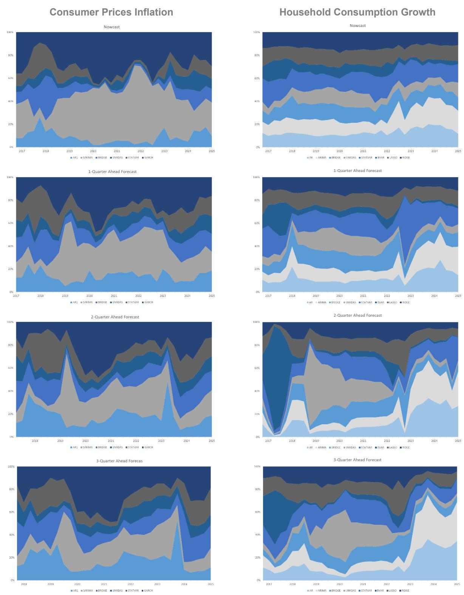

Figure 4: Evolution of Dynamic Model Weights  
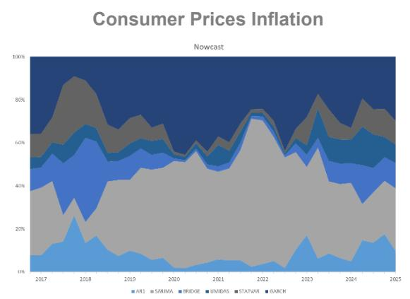

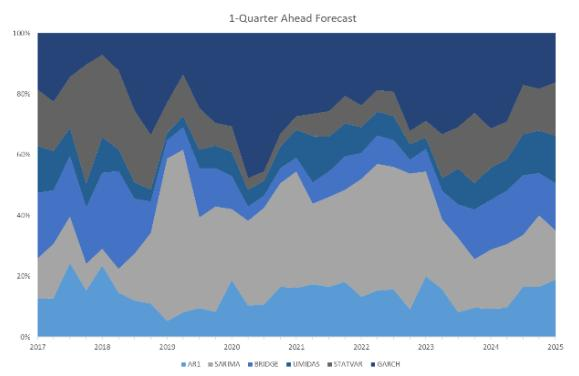

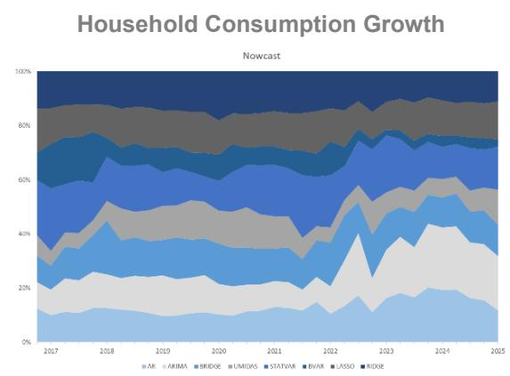

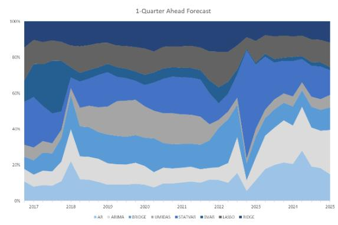

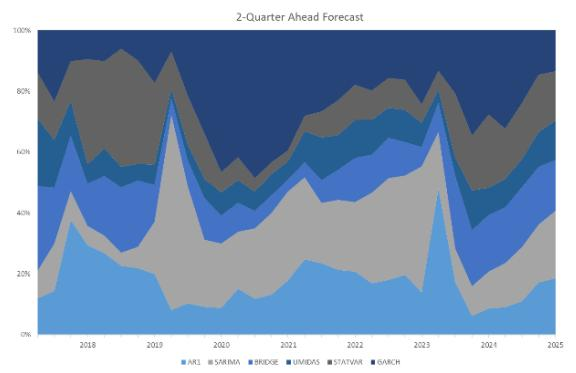

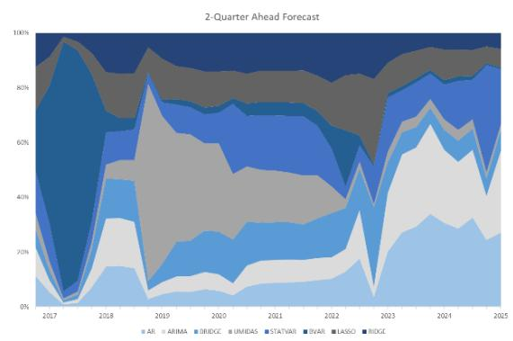

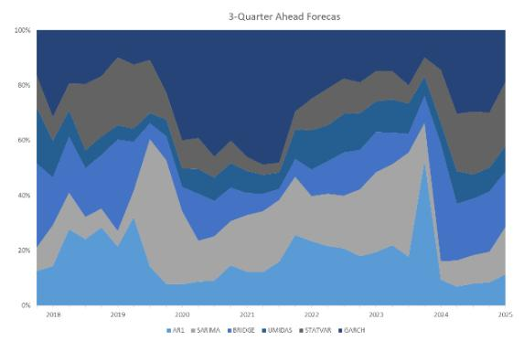

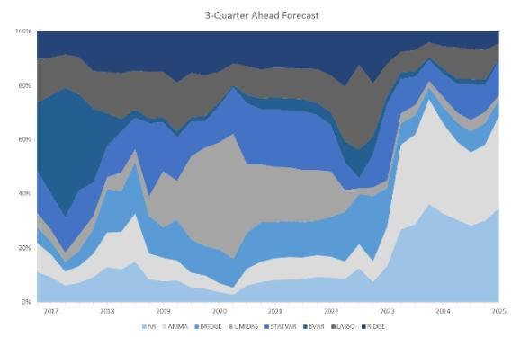

## Figure 5 Search for Optimal Dynamic Averaging Hyperparameters

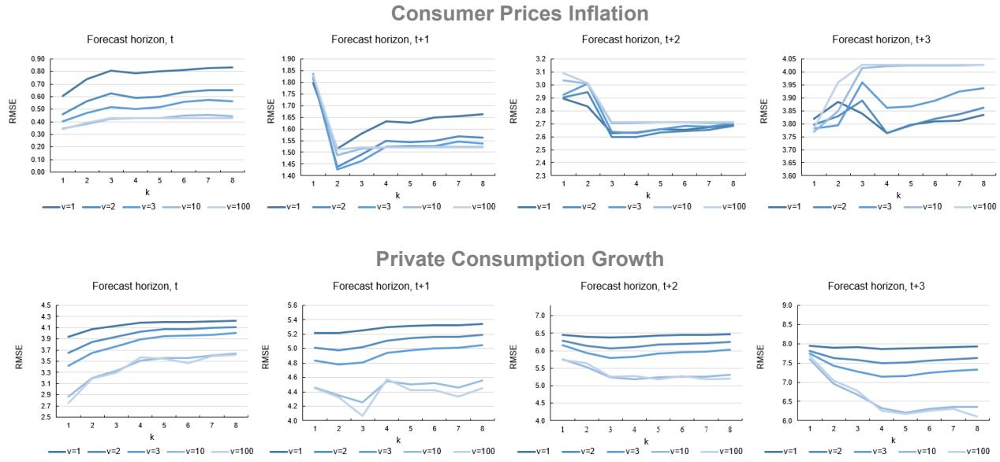

## V. Operational Enhancements

75. This chapter discusses a set of operational enhancements that strengthen the effective use of the nowcasting and near-term forecasting (NNTF) system in a policy environment. In contrast to the previous system—which lacked structured mechanisms in these areas—the current framework incorporates expert judgment and off-model information, supports the development of clear economic narratives alongside numerical forecasts, and provides a systematic approach to handling data revisions. These improvements, developed under the project, are critical for ensuring that the NNTF system remains policy-relevant, transparent, analytically robust, and well integrated with the production of medium-term economic outlook through the QPM and the broader FPAS.

## A. Incorporating Expert Judgement and Off-Model Information

76. The ability to incorporate expert judgment and off-model information is an essential feature of forecasting frameworks used in policy institutions. While statistical models provide a disciplined and internally consistent baseline, expert judgment plays a critical role in capturing developments that are not fully reflected in historical data or stable statistical relationships. This is particularly important in the presence of structural changes, one-off events, or sudden shocks that can be identified and assessed by sectoral experts.

77. In the Mongolian context, the need for judgmental intervention is especially pronounced in sectors subject to large and unpredictable shocks. Agriculture is a prominent example. As documented in the validation results (Table 2), meat prices are difficult to forecast using purely statistical approaches in certain years. The livestock sector is predominantly pastoral and therefore highly vulnerable to weather conditions and animal diseases. These factors often generate abrupt supply shocks that require expert interpretation and cannot be reliably inferred from historical patterns alone.

78. There is no single, universally accepted method for integrating expert judgment into the forecasting process. In practice, analysts combine model-based results with qualitative and institutional information to ensure coherence with recent developments and economic intuition. When model outputs appear implausible or inconsistent with newly available information—such as announced administered price changes, the expected effects of a harsh and prolonged winter on livestock conditions, discretionary fiscal measures, or quasi-fiscal operations—judgmental adjustments are introduced.

79. These adjustments are designed to capture both direct and indirect effects of shocks. For example, adverse weather conditions or livestock diseases may directly raise meat prices but also generate second-round effects through higher prices in related sectors, such as restaurant services. Similarly, wage increases, administered price adjustments, oil price fluctuations, concessional lending programs, or changes in export and import quotas are recurrent sources of shocks in Mongolia and are typically incorporated through expert judgment.

80. In operational terms, such judgmental interventions are usually implemented outside the core NNTF system. Analysts simulate alternative scenarios using complementary tools, such as structural vector autoregressive models or the core quarterly projection model, and then reconcile these results with the NNTF baseline.

Figure 6 Search for Optimal Dynamic Averaging Hyperparameters  
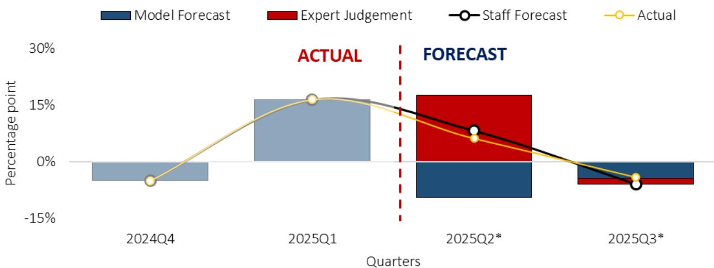  
Note: (\*, quarters) forecasting horizon

81. Figure 6 illustrates the role of expert judgment in improving forecast accuracy. In the 2025Q1 forecasting round, the NNTF system projected a year-on-year decline in mutton prices of 9.4 percent in the second quarter. Sector experts assessed this outcome as unlikely given prevailing livestock conditions and weather developments. The figure shows the model-based forecast (blue bars), the judgmental adjustments reflecting sector-specific information (red segments), and the final staff forecast (black-outlined points). Actual outcomes are shown by the yellow line. The inclusion of expert judgment led to a substantial reduction in forecast error for the second quarter of 2025.

82. As emphasized earlier, there is no prescribed or mechanical rule for incorporating off-model information. In practice, forecasters often construct multiple plausible scenarios for a given sector to reflect uncertainty and alternative developments. The key requirement is that judgmental adjustments are applied in a disciplined and transparent manner.

83. All judgment-based interventions are systematically documented during each forecasting round. Documentation includes the rationale for the adjustment, the affected variables, the assumed direct and indirect effects, and the underlying assumptions. This practice supports accountability, facilitates institutional learning, and allows ex-post evaluation of forecast performance. By combining model-based forecasts with expert judgment in a structured way, the NNTF framework enhances the policy relevance of near-term projections while preserving analytical rigor.

## B. Formulating Economic Narratives

84. Numerically precise forecasts alone are insufficient for effective policy decision-making. Policymakers require a clear explanation of the drivers underlying the projections and the sources of forecast revisions. For this reason, NNTF outputs are accompanied by an explicit and coherent economic narrative.

85. Formulating such narratives requires an approach distinct from that used in fully structural or theoretical modeling frameworks. This reflects two key characteristics of the NNTF system. First, the system relies primarily on reduced-form statistical time-series models, which do not provide an explicit structural interpretation of economic relationships. Second, the NNTF produces combined forecasts that average

across a portfolio of models, prioritizing precision and robustness rather than the internal structure of any individual model.

86. To address these limitations, the NNTF framework is complemented by a set of methodologies designed to support narrative development. Users are trained in their application. These methodologies include: (i) bottom-up forecast aggregation; (ii) tracking and evaluation of the marginal contribution of new information; and (iii) structural decompositions using stand-alone models that complement the NNTF system.

## Bottom-Up Forecast Aggregation

87. Each forecasting round begins with a reconciliation exercise that reviews past projections and evaluates forecast performance. Analysts examine forecast errors, identify changes in the economic environment, and assess the validity of previous assumptions. This process helps detect systematic biases and informs adjustments to the current forecasting round.

88. Following this review, experts prepare disaggregated forecasts at the sectoral level. For consumer prices, this includes major CPI components such as food, imported goods, services, domestic goods, and other items. Sector-specific drivers and assumptions are analyzed, and the component-level forecasts are subsequently aggregated using a bottom-up approach.

89. This approach ensures that the aggregate CPI projection reflects the underlying dynamics of its components and that the associated narrative clearly explains the sources of inflationary pressures. As illustrated in Figure 7, sectoral contributions to quarterly CPI forecasts indicate that food and imported goods are expected to be the dominant inflation drivers in early 2025, while services and domestic goods are projected to moderate inflation in later quarters. Beyond improving analytical precision, bottom-up aggregation provides a coherent structure for explaining macroeconomic developments through sector-specific channels

Figure 7 Search for Optimal Dynamic Averaging Hyperparameters  
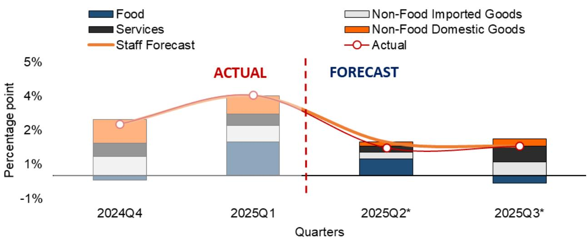

## Tracking and Evaluating the Marginal Contribution of New Information

90. Marginal contribution analysis plays an important role in understanding forecast revisions across successive forecasting rounds. This approach quantifies the impact of newly released data on near-term projections and helps identify which indicators drive forecast changes.

91. As illustrated in Table 4, each data release is evaluated by comparing the realized outcome with the model's prior expectation and assessing its contribution to revisions in the non-mining, non-agricultural GDP forecast. For example, the March 2025 releases of the consumer price index and central government tax revenue resulted in modest upward revisions to the first-quarter GDP projection, while credit growth data contributed more substantially to upward revisions in subsequent quarters. The cumulative effect of all updates led to a 0.7 percentage point increase in the GDP forecast for 2025.

92. This framework provides an evidence-based basis for distinguishing between data-driven forecast revisions and broader judgmental adjustments. By making the sources of forecast changes explicit, it enhances transparency, improves forecast discipline, and strengthens the analytical narrative accompanying each projection round.

Table 4 Marginal Contribution Analysis of Data Releases (in percent)  
Non-mining, non-agricultural GDP

<table><tr><td rowspan="2">Date</td><td rowspan="2">Data release</td><td rowspan="2">Ref. period</td><td rowspan="2">Actual</td><td rowspan="2">Forecast</td><td rowspan="2">Diff.</td><td colspan="4">2025</td><td rowspan="2">2025</td><td rowspan="2">Change</td></tr><tr><td>Q1</td><td>Q2</td><td>Q3</td><td>Q4</td></tr><tr><td></td><td>Base, as of 1 Feb 2025</td><td></td><td></td><td></td><td></td><td>10.0%</td><td>6.8%</td><td>7.6%</td><td>6.8%</td><td>7.8%</td><td>-</td></tr><tr><td>10-Mar-25</td><td>Consumer Price Index</td><td>Feb</td><td>11.1%</td><td>10.4%</td><td>0.7%</td><td>10.1%</td><td>6.9%</td><td>7.7%</td><td>7.0%</td><td>7.9%</td><td>0.1%</td></tr><tr><td>18-Mar-25</td><td>Central government tax revenue</td><td>Feb</td><td>11.2%</td><td>3.5%</td><td>7.8%</td><td>10.5%</td><td>7.2%</td><td>7.9%</td><td>7.2%</td><td>8.2%</td><td>0.3%</td></tr><tr><td>22-Mar-25</td><td>Total loans</td><td>Feb</td><td>37.8%</td><td>35.3%</td><td>2.5%</td><td>10.8%</td><td>7.6%</td><td>8.2%</td><td>7.4%</td><td>8.5%</td><td>0.3%</td></tr><tr><td>...</td><td>...</td><td></td><td></td><td></td><td></td><td></td><td></td><td></td><td></td><td></td><td></td></tr><tr><td>...</td><td>...</td><td></td><td></td><td></td><td></td><td></td><td></td><td></td><td></td><td></td><td></td></tr><tr><td>31-Mar-25</td><td colspan="9">FINAL ESTIMATE</td><td>8.5%</td><td>0.7%</td></tr></table>

## Structural Decompositions

93. Structural decomposition analysis further supports narrative development by linking statistical forecasts to underlying economic mechanisms. As illustrated in Figure 8, a stand-alone structural vector autoregressive model from the broader analytical toolkit is used to decompose imported goods inflation into its main drivers.

94. The decomposition highlights the roles of exchange rate movements, external demand conditions, and global price developments in shaping import price dynamics and, by extension, aggregate inflation. While these models are not used as primary forecasting tools within the NNTF system, they provide valuable insights that complement reduced-form forecasts and support coherent economic interpretation.

95. Although bottom-up aggregation delivers detailed sectoral insights, aggregate models are also assessed to ensure overall consistency. These models play an important role in narrative formulation for two reasons. First, they provide a cross-check on the coherence of the aggregate outlook. Second, in some cases they yield lower forecast errors than bottom-up projections (as shown in Table 2 for headline versus bottom-up CPI inflation). When this occurs, experts may adjust their forecasts accordingly, as the primary objective remains forecast accuracy. By combining disaggregated analysis, structural interpretation, and aggregate consistency checks, the NNTF framework supports narratives that are both granular and internally consistent.

Figure 8 Structural decomposition of Imported goods consumer price index  

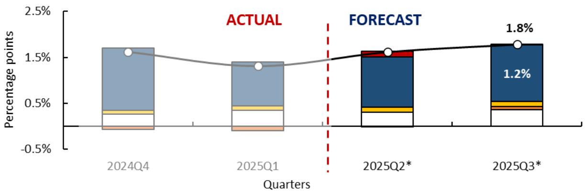

## Communication

96. The effectiveness of the NNTF system ultimately depends on how its results are communicated. Internally, the EAPD presents forecasts and supporting narratives to senior management and the Monetary Policy Committee through concise reports and graphical summaries that help policymakers understand near-term trends, changes relative to expectations, and their underlying drivers. Externally, the same analytical content is translated into simplified narratives and visual materials for public communication. Simplicity and clarity are crucial for securing stakeholder buy-in and building institutional credibility.

97. Through this structured communication process, the NNTF framework not only generates accurate numerical forecasts but also delivers coherent, transparent, and policy-relevant economic narratives that link data, models, and expert judgment.

## C. Dealing with Data Revisions

98. Data revisions are an unavoidable feature of forecasting in policy institutions. Revisions affect forecasts by altering data inputs, estimated model parameters, and, in some cases, model weights within forecast-combination frameworks. Understanding the nature and implications of revisions is therefore essential for maintaining forecast reliability and credibility.

99. In Mongolia, GDP production-side data are released quarterly and are subject to two main types of revision. First, the annual benchmark revision released in August introduces base effects that affect growth rates in the first quarter of the current year. Second, subsequent revisions to source data lead to updates in historical series, requiring corresponding adjustments to model estimates and forecasts.

100. Figure 9 illustrates the impact of data revisions on sectoral growth estimates for 2025. As shown in Figure 9, revisions to 2024 data were sizable and necessitated significant changes to the near-term forecast path.

101. Organizationally, sector experts are responsible for identifying and explaining the sources of forecast changes arising from data revisions. They also adjust model specifications and recalibrate forecasting frameworks as needed to reflect updated data vintages. System developers support this process by ensuring that revised datasets are consistently incorporated into the NNTF system and that combined forecasting weights are updated accordingly.

Figure 9 Trade sector's forecast changes because of data revision  
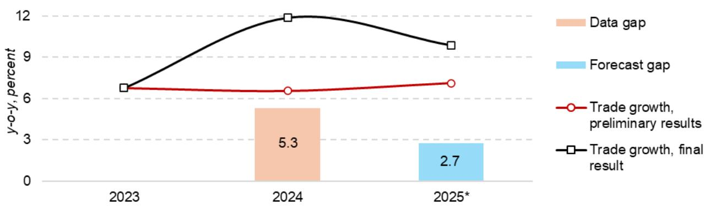

## D. Integrating NNTF and QPM

102. Within the BoM's FPAS, the new NNTF framework is intended to operate in a manner consistent with the previous NNTF system that the Bank had been using, providing quantitative short-term inputs to initiate the medium-term quarterly projection model. Specifically, the NNTF system delivers nowcasts and forecasts up to two quarters ahead for inflation and economic activity—including key subcomponents—which are used to set the initial conditions of the QPM baseline. This design reflects accumulated experience that reduced-form time-series models provide more precise and timely guidance on near-term trends than the structural QPM itself. Building on these established practices, the upgraded NNTF system fully replaces the previous NNTF tools in providing current economic situation assessments and being integrated into the broader FPAS through structured data workflows, revision tracking, and interpretation processes developed as part of the project. The new NNTF system strengthens the consistency of short-term forecasts handoffs, the analysis of changes in initial conditions, and the assessment of their implications for the medium-term outlook, the implied monetary policy path, and emerging forecast risks.

## VI. System Deployment

103. Following validation, the NNTF system was deployed and integrated into the MPD forecasting and policy advisory process. The original NTF tools were retired.

104. Sectoral experts received targeted training to support effective use of the system. Core team members participated in IMF-led courses on nowcasting, macroeconometric forecasting and analysis, and macroeconomic diagnostics delivered through regional training centers and online platforms. This was complemented by on-the-job training focused on applying the NNTF framework in sector-specific analytical work. Knowledge acquisition was assessed through written and practical evaluations, with results indicating a substantial strengthening of technical skills.

105. The deployment of the NNTF system represents an important step in strengthening MPD's capacity for near-term economic monitoring and forecasting and in supporting the broader analytical framework of the Bank of Mongolia.

106. Overall, the quality of the documentation has eased system deployment and provides a strong foundation for continuity going forward, helping to mitigate risks associated with natural attrition of core staff and the loss of institutional expertise. To this end, the EAPD invested substantial effort in developing comprehensive formal documentation for the NNTF system, covering the underlying modeling philosophy, system infrastructure (including the design of EViews and supporting codes), and methodological framework. In addition, well-structured and extensively tested operational, step-by-step manuals were produced to guide system installation, calibration, and day-to-day use. These manuals were tested multiple times and confirmed to facilitate straightforward implementation by new users.

## VII. Next Steps

107. The deployment of the NNTF system has strengthened the Bank of Mongolia's capacity for timely macroeconomic surveillance and near-term forecasting. In comparative terms, the new system ranks among the most advanced and sophisticated NNTF systems implemented with IMF support across the CCAMTAC region. To preserve and enhance these gains, continued operational use, targeted system refinement, and proactive risk management will be essential.

108. By strengthening how forecasts are produced, interpreted, and communicated, these operational enhancements materially support the BoM's conduct of monetary policy. The systematic incorporation of expert judgment allows policymakers to appropriately account for country-specific information and real-time developments that are not yet reflected in the data. Clear economic narratives alongside numerical forecasts help translate technical results into policy-relevant insights, improving internal decision-making and external communication. Finally, a more structured treatment of data revisions enhances confidence in the short-term outlook and reduces the risk of policy signals being distorted by temporary data noise. Together, these enhancements allow the NNTF system to better inform near-term policy assessments and to feed more reliably into the medium-term analysis underpinning monetary policy decisions.

## Priority for the Next Steps

109. Institutionalize regular use: The NNTF system should be embedded as a routine input into the Monetary Policy Department's (MPD) monitoring and forecasting cycle. Consistent use across sectors will deepen staff familiarity, improve interpretation of model outputs, and ensure that the system continues to evolve in line with policy needs.

110. Maintain a structured feedback loop: A formal mechanism should be established within EAPD to collect user feedback on forecast performance, usability, and reporting needs. Regular feedback will support incremental improvements, early identification of weaknesses, and prioritization of development efforts.

111. Focus on targeted system refinement: Rather than broad-based optimization, further technical development should concentrate on selected high-priority variables where diagnostics indicate persistent forecast errors or sensitivity to episodic shocks. This targeted approach balances potential accuracy gains with operational and computational constraints.

112. Strengthen internal training and knowledge transfer: A formal internal training program should be institutionalized, including onboarding requirements for new staff and periodic refresher training for experienced users. Continued engagement with external partners on training (CCAMTAC, ICD-HQ, STI, JVI) will help sustain technical capacity and exposure to best practices.

113. Enhance automation where feasible: Further automation of routine reporting and forecast tracking would reduce operational burden on sector experts and allow greater focus on analysis and policy interpretation.

## VIII. Authorities' Views

The authorities emphasized that the modernized NNTF framework has improved forecast accuracy and strengthened real-time support for policy decision-making. They noted that, while the current system represents a meaningful advance, it should be viewed as an evolving framework requiring continuous development and enhancement.

The authorities expressed appreciation for the technical assistance provided over the course of the multi-year project and for the institutional capacity built during its implementation. They underscored the value of close cooperation with the IMF and CCAMTAC in developing analytical tools tailored to the Bank of Mongolia's operational needs.

Looking ahead, the authorities highlighted ongoing efforts to strengthen statistical capacity, including the introduction of big-data systems. These initiatives are expected to provide a stronger foundation for further expansion of the NNTF framework across all stages of the forecasting process, from data acquisition and model development to system integration, evaluation, reporting, and communication.

Finally, the authorities noted that recent global shocks underscore the importance of preparedness for unexpected developments. They emphasized that strengthening scenario and shock-analysis capabilities would be an important direction for future system enhancements.

## Annex A. List of Delivered TA Missions

<table><tr><td>MISSION DATES</td><td>MISSION&#x27;S OBJECTIVES</td></tr><tr><td>March 6-10, 2023</td><td>Scoping. Review of the existing nowcasting and near-term forecasting (NNTF) processes, tools, data, human and IT resources with the aim to identify opportunities for improving the system&#x27;s accuracy in forecasting (non-mining) GDP growth and (unregulated) CPI inflation.</td></tr><tr><td>October 16-27, 2023</td><td>Initial development of the NNTF system, including setting up model portfolios and adapting the framework for Mongolian data. Introduced dynamic model averaging and tested forecasting performance. System expanded beyond non-mining GDP growth and CPI inflation.</td></tr><tr><td>April 15-26, 2024</td><td>Enhance internal communication of NNTF outputs for Monetary Policy Committee (MPC) briefings. Developed presentation templates for numerical results and economic narratives. Established a data release calendar and expanded the database for high-frequency indicators</td></tr><tr><td>September 13-27, 2024</td><td>Consolidate and optimize the NNTF system. Improve communication strategies and strengthen junior staff skills. Reviewed forecasting blocks for imports and refined database integration. Documented system results and assigned responsibilities for final reporting. Enhanced NNTF inputs into monetary policy review rounds.</td></tr><tr><td>October 29, 2024</td><td>On-line workshop on Bayesian vector autoregressions.</td></tr><tr><td>March 24 – April 5, 2025</td><td>Refine presentation templates for MPC briefings and train sectoral experts. Improve communication of risks and interest rate strategy. Assessed high-frequency data for enhancing near-term monitoring.</td></tr><tr><td>October 13 – 24, 2025</td><td>Final mission to conclude the project. Assisted in drafting system documentation, resolving operational issues, and formally launching the NNTF system into full operation. Institutional acceptance of the system and closure of the TA project.</td></tr></table>

## Annex B. List of Target Variables and Their Selected Predictors

<table><tr><td>Target variable</td><td>Explanatory variables</td></tr><tr><td colspan="2">Consumer prices</td></tr><tr><td>Consumer Price Index, headline</td><td>China CPIExchange rate (MNT/RMB)Household income</td></tr><tr><td>Beef</td><td>Monthly electricity production indexBusiness loan</td></tr><tr><td>Mutton</td><td>Monthly beef priceHousehold incomeLivestock loss rate</td></tr><tr><td>Other Meat</td><td>Monthly beef priceHousehold incomeLivestock loss rate</td></tr><tr><td>Milk</td><td>Monthly beef priceHousehold income</td></tr><tr><td>Flour</td><td>Household income</td></tr><tr><td>Vegetable</td><td>China CPI</td></tr><tr><td>Other Food</td><td>USA CPIHousehold incomeChina CPI</td></tr><tr><td>Imported Food</td><td>Exchange rate (MNT/RMB)Household income</td></tr><tr><td>Imported Good</td><td>China CPIConsumer loanUnit price of imported fuel</td></tr><tr><td>Domestic Good</td><td>USA CPIBusiness Loan</td></tr><tr><td>Service</td><td>Unit price of imported fuelHousehold income</td></tr><tr><td colspan="2">GDP production side</td></tr><tr><td>Manufacture</td><td>Monthly manufacture production index</td></tr><tr><td>Electricity</td><td>Monthly electricity production index</td></tr><tr><td>Trade</td><td>Total loanGoods import</td></tr><tr><td>Communication</td><td>Household incomeNominal effective exchange rate</td></tr><tr><td>Other service</td><td>Current expenditureConsumer loan</td></tr><tr><td>Net tax</td><td>Monthly tax revenueConsumer loan</td></tr><tr><td colspan="2">GDP expenditure side</td></tr><tr><td>Household consumption</td><td>Consumer loanWageTax revenueTotal import</td></tr><tr><td>Gross fixed capital formation</td><td>Machinery importChina GDPConsumer loan</td></tr><tr><td colspan="2">Credit</td></tr><tr><td>Business credit</td><td>Non-mining, non-agricultural sector growthPolicy rateTotal nonperforming loan</td></tr><tr><td>Consumer credit</td><td>Nominal wageTotal importPolicy rateTotal nonperforming loan</td></tr><tr><td colspan="2">Goods import</td></tr><tr><td>Consumer goods</td><td>Nominal Effective Exchange RateLending rateUS CPIGovernment expenditureImport price indexTotal new loan</td></tr><tr><td>Nondurable goods</td><td>Exchange rate (RMB/USD)Deposit rateRussia CPIConsumer loanImport Price IndexReal wage</td></tr><tr><td>Passenger cars</td><td>Exchange rate indexConsumer loanUS CPIIron ore export volumeService imports</td></tr><tr><td>Durable goods ex. passenger cars</td><td>Consumer loanRussian CPIDeposit rateExchange rate (MNT/USD)Export price indexReal Non-Mining GDP</td></tr><tr><td>Capital Goods</td><td>Export price indexEurozone CPIIron ore exportLending rateHousehold consumptionImport deflator</td></tr><tr><td>Construction materials</td><td>Consumer loanExchange rate (MNT/USD)</td></tr><tr><td rowspan="3"></td><td>Copper export volume</td></tr><tr><td>Deposit rate</td></tr><tr><td>Tax revenue</td></tr><tr><td rowspan="6">Equipment</td><td>Consumer Loan</td></tr><tr><td>US CPI</td></tr><tr><td>Export price index</td></tr><tr><td>OT Imported Payment of Service</td></tr><tr><td>Trade (GDP)</td></tr><tr><td>Government expenditure deflator</td></tr><tr><td rowspan="5">Vehicles</td><td>Iron ore export</td></tr><tr><td>Main commodities export volume</td></tr><tr><td>China CPI</td></tr><tr><td>Export price index</td></tr><tr><td>Real non-mining GDP</td></tr><tr><td rowspan="5">Industrial products</td><td>Deposit rate</td></tr><tr><td>Exchange rate index</td></tr><tr><td>Industrial production index</td></tr><tr><td>OT Imported Payment of Operation</td></tr><tr><td>Tax revenues</td></tr></table>