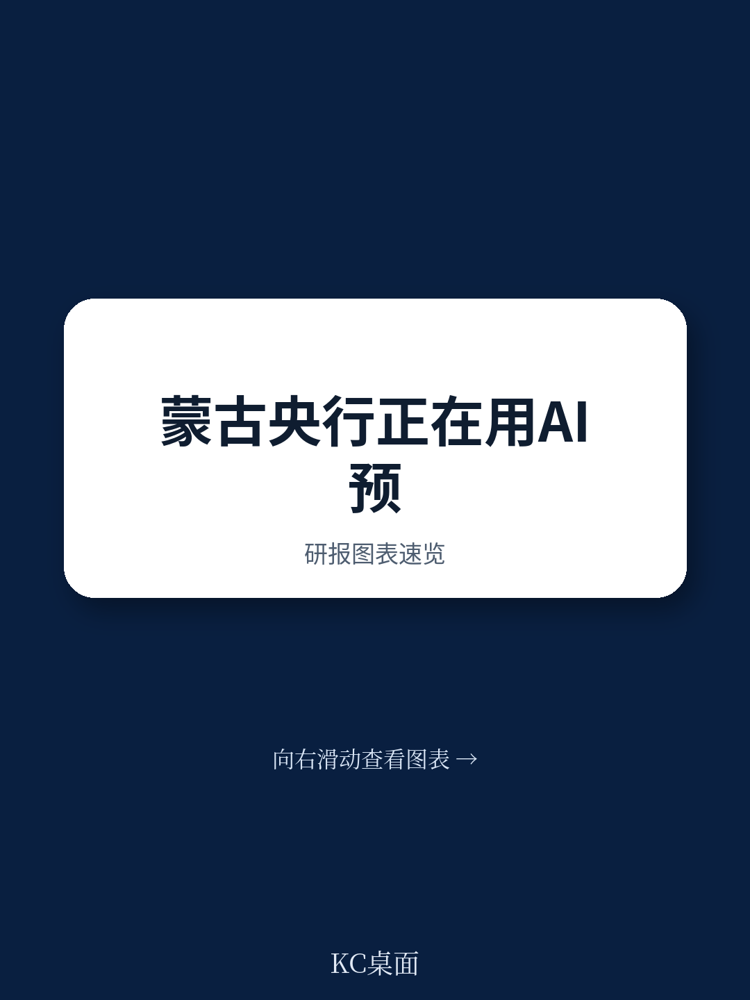
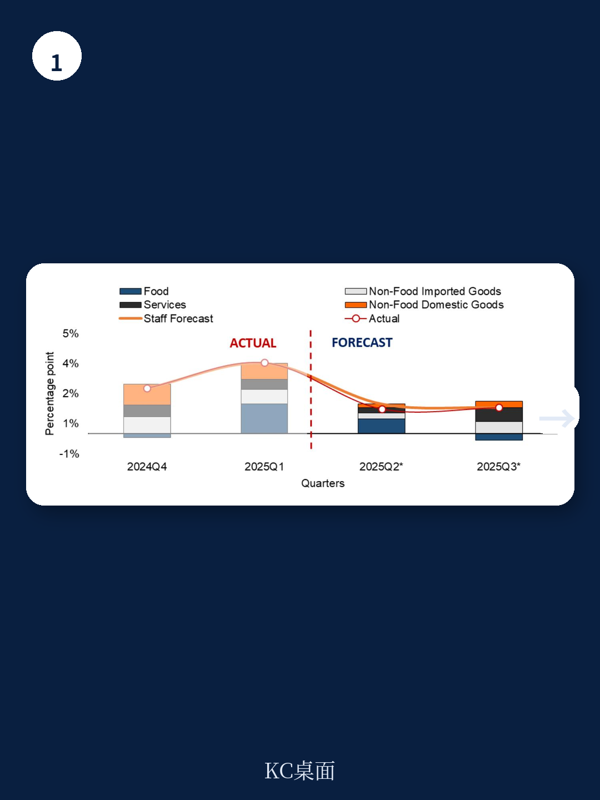
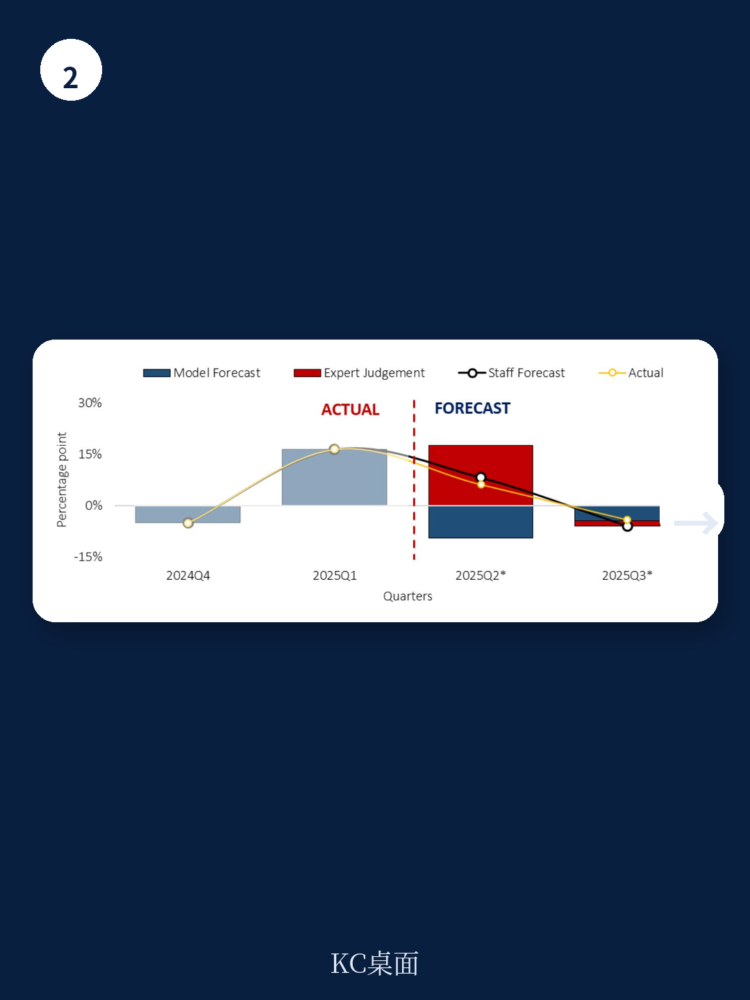

# IMF：蒙古央行短期预测系统建设与验证

国际货币产品组织（IMF）2026年4月发布的技术援助报告，详细记录了为蒙古央行（BoM）开发并部署的现时预测与短期预测系统（NNTF）。该系统的核心价值在于：在验证测试中，其对关键指标的预测误差较历史人工预测降低了最高25%，尤其在现时预测和未来一个季度的预测窗口上表现突出。这一结果并非来自单一模型的改进，而是系统性地整合了模型组合、动态加权和结构化判断流程。

对于蒙古这样的小型开放地区——煤炭与铜矿主导出口，农业部门易受天气冲击，汇率制度实际为爬行钉住——及时且可靠的短期宏观环境监测工具直接关系到通胀目标制的执行质量。报告认为，这套NNTF框架在IMF支持的中亚和高加索地区同类系统中，属于最先进的层级。

## 1. 系统设计围绕机构可持续性展开

报告明确指出了蒙古央行内部面临的约束：人员轮岗频繁、分析重点不断变化、编程专长有限。因此，NNTF系统的设计原则并非追求理论上的最优模型，而是强调可扩展性、灵活性和可培训性。

系统采用面向对象的架构，允许在不进行根本性重构的前提下，增加新的数据覆盖范围、目标变量和用户。模型可以根据分析需求的变化被激活或停用。更重要的是，经过结构化培训和有限的实操练习，工作人员能够可靠地操作系统，这降低了对少数技术专家的依赖，为机构的长期可持续性提供了保障。

> **KC评论：** 许多新兴市场央行在引入量化工具时，往往高估了自身的维护能力。这份报告的设计思路值得关注：它把“人”的可持续性放在了与模型精度同等重要的位置，而不是追求一个黑箱式的“最优解”。

## 2. 验证测试显示系统性预测改进

报告提供了具体的验证结果。与央行此前的历史人工预测相比，NNTF系统在现时预测和未来一个季度的预测上，预测误差（RMSE）显著降低。对于消费者价格指数和主要GDP构成项，误差降幅最高可达25%。

这种改进并非来自某一个“冠军模型”。系统运行了一个包含多种模型的组合——包括自回归移动平均模型（ARIMA）、贝叶斯向量自回归（BVAR）、混合数据抽样模型（MIDAS）以及桥接回归（BRIDGE）等。关键在于，系统采用动态模型平均技术，根据各模型近期的预测表现实时调整其权重。这意味着，系统能够自动适应宏观环境结构的变化，而不是依赖一个固定的、可能过时的模型。

## 3. 结构化判断与叙事流程提升政策沟通质量

技术精度的提升只是系统价值的一部分。报告强调，NNTF系统的引入改变了短期分析在政策流程中的使用方式。

系统支持更结构化的专家判断纳入机制。工作人员可以将模型外的信息（如政策变动、突发事件）以量化形式融入预测，而不是进行模糊的“手动调整”。同时，系统要求围绕数值预测形成清晰的宏观环境叙事，解释驱动预测变化的关键因素。这种“数字+故事”的产出格式，直接服务于货币政策委员会（MPC）的简报需求，提升了政策沟通的透明度和可追溯性。

报告还专门讨论了如何处理数据修订问题——这在依赖高频数据的短期预测中是一个常见但棘手的挑战。系统通过记录不同版本的数据和预测，为分析数据修订对预测的影响提供了基础。

## 4. 系统与中期预测框架形成互补

NNTF系统并非孤立运行。它是蒙古央行更广泛的预测与政策分析系统（FPAS）的一个组成部分。短期预测为中期结构性季度模型提供初始条件。报告指出，短期预测误差会向中期传导并影响政策结论，因此提升短期预测的准确性具有乘数效应。

此外，系统还提供了一个独立的实时宏观宏观环境监测平台，支持部门分析，并增强了跨部门的一致性。这有助于在政策讨论中，将短期波动与中期趋势更清晰地联系起来。

报告在最后提出了五项短期建议，包括将NNTF系统制度化地纳入货币政策部的预测周期、建立内部预测表现反馈机制、以及针对高优先级变量进行技术优化。这些建议的核心指向同一个目标：将系统从“开发完成”推向“日常运行”。

For informational purposes only. Portions may be generated,translated,summarized,or edited with AI assistance based on source materials and may contain omissions or errors. Please verify independently. This is not investment,legal,tax,accounting,or other professional advice.

