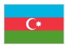
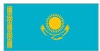
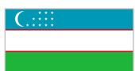
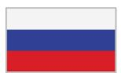

# TECHNICAL ASSISTANCE REPORT

REPUBLIC OF AZERBAIJAN

Report on Government Finance Statistics and Public Sector Debt Statistics (November 24–28, 2025) and (February 23–27, 2026)

JULY 2026

PREPARED BY

Roderick O'Mahony (Expert)

Keywords:

JEL Classification Numbers:

H60, H83

Government finance statistics; public sector accounting

The contents of this document constitute technical advice provided by the staff of the International Monetary Fund to the authorities of Azerbaijan (the "CD recipient") in response to their request for technical assistance. Unless the CD recipient specifically objects to such disclosure, this document (in whole or in part) or summaries thereof may be disclosed by the IMF to the IMF Executive Director for Azerbaijan, to other IMF Executive Directors and members of their staff, as well as to other agencies or instrumentalities of the CD recipient, and upon their request, to World Bank staff, and other technical assistance providers and donors with legitimate interest, members of the Steering Committee of CCAMTAC (see Staff Operational Guidance on the Dissemination of Capacity Development Information). Publication or Disclosure of this report (in whole or in part) to parties outside the IMF other than agencies or instrumentalities of the CD recipient, World Bank staff, other technical assistance providers and donors with legitimate interest, members of the Steering Committee of CCAMTAC shall require the explicit consent of the CD recipient and the IMF's Statistics department.

The analysis and policy considerations expressed in this publication are those of the IMF Statistics Department.

International Monetary Fund, IMF Publications
P.O. Box 92780, Washington, DC 20090, U.S.A.
T. +(1) 202.623.7430 • F. +(1) 202.623.7201
publications@IMF.org
IMF.org/pubs

## Acknowledgments

## MEMBERS

  
Armenia

  
Azerbaijan

  
Tajikistan  
Georgia  
Mongolia

  
Turkmenistan

  
Kazakhstan

  
Kyrgyz Republic  
Uzbekistan

## DEVELOPMENT PARTNERS

  
Switzerland

  
Russia

  
China

  
Ministry of Strategy and Finance
Republic of Korea

  
United States of America

  
European Union

  
Asian Development Bank

  
Poland

## Contents

Acknowledgments....3   
Abbreviations and Acronyms....5   
Summary of Mission Outcomes and Priority Recommendations....6   
Detailed Technical Assessment and Recommendations....8   
A. Improving Quality of GFS....8   
B. Initiating Dissemination of PSDS....9   
C. Other Issues....10   
D. Officials Met During the Mission....11

## Abbreviations and Acronyms

<table><tr><td>AM</td><td>Azerbaijani Manat</td></tr><tr><td>BCG</td><td>Budgetary Central Government</td></tr><tr><td>CBA</td><td>Central Bank of the Republic of Azerbaijan</td></tr><tr><td>CCAMTAC</td><td>Caucasus, Central Asia, and Mongolia Regional Capacity Development Center</td></tr><tr><td>CG</td><td>Central Government</td></tr><tr><td>COFOG</td><td>Classification of Functions of Government</td></tr><tr><td>PDFLMA</td><td>Public Debt and Financial Liabilities Management Agency</td></tr><tr><td>EBF</td><td>Extrabudgetary Fund</td></tr><tr><td>GFS</td><td>Government Finance Statistics</td></tr><tr><td>GFSM 2014</td><td>Government Finance Statistics Manual 2014</td></tr><tr><td>IFRS</td><td>International Financial Reporting Standards</td></tr><tr><td>IPSAS</td><td>International Public Sector Accounting Standards</td></tr><tr><td>KRF</td><td>Karabakh Revival Fund</td></tr><tr><td>LEPL</td><td>Legal Entities of Public Law</td></tr><tr><td>MCD</td><td>Middle East and Central Asia Department</td></tr><tr><td>MOF</td><td>Ministry of Finance</td></tr><tr><td>MTEF</td><td>Medium-Term Expenditure Framework</td></tr><tr><td>PSDS</td><td>Public Sector Debt Statistics</td></tr><tr><td>QPSD</td><td>Quarterly Public Sector Debt (IMF-World Bank Database)</td></tr><tr><td>ROA</td><td>Republic of Azerbaijan</td></tr><tr><td>SB</td><td>State Budget</td></tr><tr><td>SOFAZ</td><td>State Oil Fund of the Republic of Azerbaijan</td></tr><tr><td>SSA</td><td>Social Services Agency</td></tr><tr><td>SAMHI</td><td>State Agency Mandatory Health Insurance</td></tr><tr><td>SSPF</td><td>State Social Protection Fund</td></tr><tr><td>TA</td><td>Technical Assistance</td></tr><tr><td>TD</td><td>Treasury Department</td></tr></table>

## Summary of Mission Outcomes and Priority Recommendations

1. In response to a request from the Ministry of Finance (MOF) of the Republic of Azerbaijan (ROA), and with the support of the IMF's Middle East and Central Asia Department (MCD), the Caucasus, Central Asia, and Mongolia Regional Capacity Development Center (CCAMTAC) conducted a hybrid Technical Assistance (TA) mission during November 2025 and February 2026 to assist the authorities in developing capacity to compile and disseminate quarterly and annual fiscal statistics that support policy-making and IMF surveillance. The mission consisted of (i) the remote segment which took place remotely via Zoom during November 24–28, 2025, and (ii) the in-person segment, which took place in Baku, Azerbaijan, during February 23–27, 2026.

2. The main objectives of the mission were to: (i) provide an outline of GFS concepts specifically targeted for source data providers; (ii) assist the Medium-Term Expenditure Framework (MTEF) Development Center staff in compiling annual GFS for the General Government (GG) for 2024; (iii) extend work on developing quarterly GFS and PSDS that support Fund surveillance; and (iv) review progress since the last TA mission in 2025. The mission also focused on further strengthening the capability and confidence of the compilers of fiscal statistics and the source data providers in addressing issues in the relevant data and the compilation processes, identifying areas for further improvement, assisting compilers in assigning appropriate COFOG codes and promoting collaboration among agencies involved in the fiscal statistics compilation.

3. The mission noted that the annual GFS dataset for 2024 was submitted to the IMF in late 2025 and that the dataset for 2025 can be submitted by July 2026. The mission welcomed the improvement in timeliness for the annual datasets and continued to stress the importance of having timely data available for users. The mission noted that quarterly data was available for budgetary central government (BCG), the State Oil Fund of the Republic of Azerbaijan (SOFAZ) and the Karabakh Revival Fund (KRF) for Q1 and Q2 2025. The mission encouraged the authorities to commence disseminating quarterly GFS as soon as possible once the figures have been finalized for BCG.

4. The mission met with officials from the Public Debt and Financial Liabilities Management Agency (PDFLMA) who agreed to submit quarterly debt data. Officials from the PDFLMA noted that the BCG also included debt expenditure relating to public sector bodies where government undertook to pay loans. These transactions are included in total loan payment (both principal and interest) in BCG figures. To address this anomaly, the mission suggested that the PDFLMA simply report debt figures to the QPSD and analyze its alignment with the BCG data. Both teams agreed to examine this workaround.

5. To support progress in the above work areas, the mission recommended a detailed one-year action plan with the following priority recommendations to improve GFS and PSDS:

## Recommendations

<table><tr><td>Target Date</td><td>Priority Recommendation</td><td>Responsible Institution</td></tr><tr><td>May 2026</td><td>Submit quarterly GFS dataset for Q1 and Q2 2025 for BCG to IMF</td><td>MTEF</td></tr><tr><td>May 2026</td><td>Submit quarterly debt data to QPSD IMF/WB database</td><td>PDFLMA</td></tr><tr><td>July 2026</td><td>Submit annual dataset for 2025 to IMF</td><td>MTEF</td></tr></table>

Further details on the priority recommendations and the related actions/milestones can be found in the action plan under Detailed Technical Assessment and Recommendations.

# Detailed Technical Assessment and Recommendations

<table><tr><td>Priority</td><td>Action/Milestone</td><td>Target Completion Date</td></tr><tr><td colspan="3">Outcome: Further development of GFS data in Azerbaijan</td></tr><tr><td colspan="3">Outcome: Data is compiled and disseminated using the coverage and scope of the latest manual/guide.</td></tr><tr><td colspan="3">Outcome: Data are compiled and disseminated using the classification of the latest manual/guide</td></tr><tr><td>H</td><td>Increase capacity and efficiency of the GFS team.</td><td>Ongoing</td></tr><tr><td>M</td><td>Explore and use supplementary data sources for GFS and PSDS</td><td>Ongoing</td></tr><tr><td>H</td><td>Develop time series on quarterly BCG debt in conjunction with PDFLMA.</td><td>End May 2026</td></tr><tr><td>H</td><td>Finalize Q1 and Q2 2025 data for BCG, SOFAZ and KRF</td><td>End May 2026</td></tr><tr><td>H</td><td>Finalize and transmit the 2025 annual GFS questionnaire to IMF STA.</td><td>End July 2026</td></tr><tr><td>H</td><td>Provide GFS training to data providers to improve quality of GFS input.</td><td>End November 2026</td></tr><tr><td>H</td><td>Update COFOG Classification in new edition of Functional Classification</td><td>End December 2026</td></tr><tr><td>H</td><td>Develop updated PSIT to take account of LEPLs and other EBFs.</td><td>End December 2026</td></tr></table>

## A. Improving Quality of GFS

## Background

6. Azerbaijan is a regular provider of annual GFS for GG and its subsectors to the IMF's GFS database. GFS are compiled using an Excel file which contains the source data, bridging sheets, and output tables. The IMF's annual GFS database (managed by STA's Government Finance Division) contains Azerbaijan's time series data for 2008–2024 for GG and its subsectors (central government, social security funds, state government and local government). Staff of the MTEF Development Centre are currently compiling GFS for 2025 and will submit data for 2025 before the end of July 2026.

7. The source data for GFS is a mixture of IFRS and IPSAS-based annual financial statements which are sufficiently comprehensive and detailed to compile annual GFS. The GFS team in the MTEF Development Center continues to have a good working knowledge of the source data as well as the framework, principles, concepts, and classification system of GFS. It also has access to qualitative information from the sources, which enables them to understand and explain fiscal events underlying the reported numbers.

8. Data provided to the IMF Area Department for surveillance should be consistent with the data submitted to Parliament and those published in the IMF GFS database. Nevertheless, when taking into account the methodological requirements of the Government Finance Statistics Manual 2014 (GFSM 2014) and the prevailing national legal framework, notable discrepancies remain between the GFS reports submitted to the IMF and the annual budget execution reports presented to Parliament. As emphasized in previous technical assistance missions, multiple and parallel data dissemination streams continue to operate within the Ministry of Finance, which undermines data consistency and transparency. In particular, the State Treasury Agency prepares the annual budget execution report on a cash basis, thereby limiting alignment with GFS reporting standards. In this context, the mission reiterated its recommendation that the authorities—specifically the staff of the MTEF Development Center—systematically utilize available accrual-based data as the primary source for IMF reporting. Furthermore, it was advised that such accrual-based information be shared with the IMF’s Area Department to enhance the quality and consistency of fiscal surveillance.

9. As part of the remote mission, the team reviewed the significant discrepancies that arose from the GFS source annual data for 2024 at individual entity level and reduced them significantly to near zero in all cases. A common issue the mission noted was the continued misclassification of net acquisition of non-financial assets by the receiving entities, which were transferred from BCG. These should be classified as other ‘change in volume in assets and liabilities’, and source data providers must be familiar with the understanding of the above the line and below the line items.

10. The mission also examined quarterly data for Q1 and Q2 2025 for BCG, SOFAZ and KRF. While the KRF compilation exercise produced an essentially balanced set of accounts, significant discrepancies were found for BCG and SOFAZ. The mission recommended to staff that they examine the financial assets side of the accounts for BCG (specifically Currency and Deposits, for example assets held in the Central Bank of Azerbaijan (CBA)). For example, if the non-financial accounts showed a surplus or deficit, data users would expect to see some movement in the currency and deposit assets.

## Recommendations:

Submit GFS dataset for 2025 by end July 2026 to the IMF's Statistics Department.

Consult (on an ongoing basis) with STA, including the CCAMTAC GFS-PSDS resident advisor, on specific source data and compilation issues as they arise.

Review existing quarterly data for BCG and SOFAZ for Q1 and Q2 2025 to further reduce the statistical discrepancy and submit the data to the IMF.

\- Continue developing quarterly data for other entities such as LEPLs to improve coverage to Central Government (CG) level.

## B. Initiating Dissemination of PSDS

## Background

11. The quarterly debt securities and loans for BCG statistics are readily available for dissemination from PDFLMA. However, final agreement is required as to which agency should take responsibility for publishing the data and submit it to the joint IMF/WB Quarterly Public Sector Debt (QPSD) database pending the approval of the MOF management.

12. The main issue to address is that there is a difference in the total debt payments that is shown for PDFLMA and that of the MOF. The difference can be explained by the inclusion of loans of public corporations that the MOF agrees to finance although some of the loans are repaid in full by the

Public Corporations, while others will be repaid by Government once it becomes clear that the Public Corporations are unable to pay (which then move onto the Government's balance sheet). The matter is further complicated by the fact that the GFS team are legally required not to split total debt figures between interest payments and transaction in liabilities for public corporations and normal BCG debt operations.

13. The PDFLMA agreed to submit the quarterly debt figures for BCG to the IMF/WB QPSD. The mission further requested that the PDFLMA also provide a breakdown to include long-term debt liabilities that have less than one year to maturity (initially long-term debt but reclassified as short-term debt on a remaining maturity basis). The GFS team agreed to consider appropriate methods to reconcile the difference between the totals provided by each agency.

Recommendations:

The PDFLMA to contact the World Bank to initiate reporting to the QPSD database.

■ Establish a PSDS working group to discuss and report on debt issues to the GFS working group.

## C. Other Issues

14. Further progress in the compilation of sound fiscal statistics continues to depend on the political support and effective building capacities. The Director of MTEF Development Center confirmed interest in further development of GFS, focusing on expanding sector coverage. The mission continued to emphasize that the pace of future developments depends purely on capacity and recommended that the MOF senior staff ensure adequate resources be allocated to the MTEF Development Center. The authorities were encouraged to continue engaging with the CCAMTAC GFS-PSDS resident advisor on the necessary follow-up actions. The Director of MTEF also expressed an interest in hosting a training course for data providers of GFS as part of any subsequent TA.

15. Besides the staff capacity and training issues, consideration should be given to collecting comprehensive source data needed to develop GFS data for entities to be included in the Central Government (CG) sector (e.g., Legal entities of Public Law or LEPLs). It is important to develop an updated Public Sector Institutional Table (PSIT) to ensure consistent classification of public sector entities by the various data compiling and source data providing agencies. In addition, to strengthen the institutional foundation for collaboration among compilers and users of fiscal and debt data for policy making, a technical working group comprising MTEF Development Center, Budget Department, Treasury Agency (TA) and PDFLMA should be established with support from the MOF and management from other government departments.

16. The authorities requested the assistance of the mission to recommend the appropriate COFOG code for several Departments. The mission met with senior officials in the Departments of Finance of Social Sector, Finance of Military Institutions and Law Enforcement Bodies, and Accounting Policy to agree appropriate COFOG codes. In addition, the mission also assisted staff from the MTEF in this regard. The process of aligning the national functional classification with the COFOG is ongoing and is currently being prepared by the authorities. The finalized classification codes will be shared with the mission team and CCAMTAC GFS-PSDS resident advisor once they have been formally approved. The mission encouraged the authorities to reach out to the CCAMTAC GFS-PSDS resident advisor with any subsequent queries as required.

17. It should be noted that the authorities are also interested in developing a new Chart of Accounts system which will result in several significant improvements in GFS reporting. A request for TA, in coordination with PFM, may emerge soon.

18. The mission also provided basic GFS training to members of the State Employment Agency. This was done to facilitate new members on the reporting team.

## D. Officials Met During the Mission

<table><tr><td>Name</td><td>Institution</td></tr><tr><td>Ilham Karimov</td><td>Director of the MTEF Development Centre</td></tr><tr><td>Elnare Kazimova</td><td>Head of the Finance Statistics and Budget Classification Division</td></tr><tr><td>Gunel Aliyeva</td><td>Leading advisor, MTEF Development Centre</td></tr><tr><td>Anar Mehdiyev</td><td>Advisor, MTEF Development Centre</td></tr><tr><td>Firuze Abdullayeva</td><td>Head of the Accounting Policy Department</td></tr><tr><td>Ramiz Garayev</td><td>Deputy Head of the Accounting Policy Department</td></tr><tr><td>Zakir Hajiyev</td><td>Deputy Head of the Social Sector Finance Department</td></tr><tr><td>Nargiz Habibova</td><td>Deputy Head of the Social Sector Finance Department</td></tr><tr><td>Etibar Karimov</td><td>Head of the Department of Finance of Military Institutions and Law Enforcement Bodies</td></tr><tr><td>Sabuhi Jafarov</td><td>Head of the Reporting, Analysis and Risk Management Department, Public Debt and Financial Liabilities Management Agency</td></tr><tr><td>Jala Ahmadova</td><td>Chief advisor, Reporting, Analysis and Risk Management Department, Public Debt and Financial Liabilities Management Agency</td></tr><tr><td>Shams Gasimzadeh</td><td>Head of the Finance Department, State Employment Agency</td></tr><tr><td>Nurlan Tahmazli</td><td>Head of the Accounting Division, State Employment Agency</td></tr><tr><td>Rashad Farzalizadeh</td><td>Head of the Investment and Revenue Division, State Employment Agency</td></tr><tr><td>Naila Dlatova</td><td>Chief specialist - Finance Department, State Employment Agency</td></tr></table>