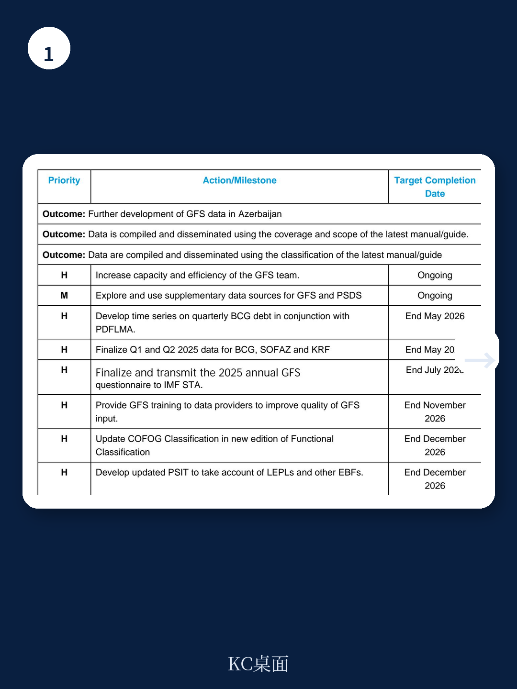
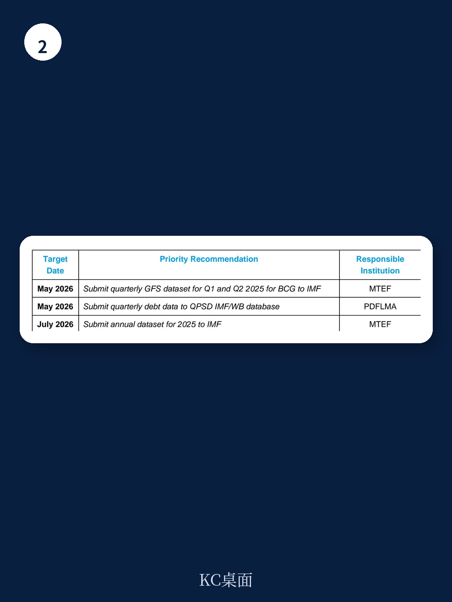

# IMF：公共部门资金与相关数据观察

2025年11月和2026年2月，IMF通过高加索、中亚和蒙古区域能力发展中心（CCAMTAC）分两阶段对阿塞拜疆财政部开展了技术援助，核心目标是帮助该国建立按季度和年度编制并发布政府财政统计（GFS）与公共部门债务统计（PSDS）的能力。报告显示，阿塞拜疆已能定期向IMF提交年度GFS数据，但季度数据的覆盖范围、一致性和发布节奏仍有明显缺口，尤其是预算中央政府的季度数据尚未正式发布，公共部门债务数据的责任归属和统计口径也待厘清。

这份报告的价值不在于提出宏大改革方案，而在于揭示了一个中等收入资源型国家在从年度现金制报告向季度权责发生制统计过渡时，所面临的制度摩擦、数据源协调和机构间责任划分等具体操作难题。

## 1. 年度数据已改善，但季度数据发布仍滞后

阿塞拜疆自2008年起向IMF的GFS数据库提交年度数据，涵盖广义政府及其子部门。2024年年度数据已于2025年底提交，2025年数据预计在2026年7月底前完成报送。报告认为，数据及时性有所提升。

但季度数据的进展明显落后。截至2026年2月，仅有2025年第一、第二季度预算中央政府、国家石油产品（SOFAZ）和卡拉巴赫复兴产品（KRF）的数据可用。IMF团队建议当局尽快完成预算中央政府的季度数据核实并启动发布。报告特别指出，预算中央政府和SOFAZ的季度账户存在显著统计差异，需要从资金资产端——尤其是存放在阿塞拜疆中央银行的货币和存款科目——入手排查。

> **KC评论：** 季度数据是IMF进行宏观监督的基础频率。阿塞拜疆的季度GFS迟迟未能发布，意味着外部观察者无法及时追踪其财政状况的季节性变化和突发冲击。报告建议从“货币和存款”科目入手排查差异，是因为非资金账户的盈余或赤字必然对应资金资产的变动，这是GFS框架中“上下线”逻辑的基本校验。

## 2. 预算执行报告与GFS报告之间存在系统性差异

报告揭示了一个制度性问题：阿塞拜疆财政部内部存在多条并行的数据发布渠道。国家国库局按现金制编制年度预算执行报告并提交议会，而MTEF发展中心按权责发生制编制GFS报告提交IMF。两种口径在方法论和覆盖范围上存在差异，导致同一财政年度的数据不一致。

IMF团队重申了此前技术援助的建议：MTEF发展中心应系统性地以权责发生制数据作为向IMF报告的主要来源，并将该数据同时提供给IMF的地区部门，以提高财政监督的质量和一致性。此外，接收单位对非资金资产净购置的分类错误仍是一个常见问题——从预算中央政府转移过来的资产应记为“资产和负债的其他数量变化”，而非经常性交易。

## 3. 公共部门债务统计的责任归属与口径协调

公共部门债务统计的启动面临两个具体障碍。第一，哪个机构负责向IMF/世界银行的季度公共部门债务数据库提交数据尚未最终确定。公共债务和资金负债管理局（PDFLMA）已同意提交季度债务数据，但仍需财政部管理层批准。

第二，PDFLMA与财政部报告的债务总额存在差异。原因在于，财政部将部分公共企业的贷款纳入预算中央政府的债务支出，其中一些贷款由公共企业全额偿还，另一些则在公共企业无力偿还时转入政府资产负债表。更复杂的是，GFS团队在法律上被要求不得将债务总额拆分为利息支付和负债交易两部分。IMF团队建议PDFLMA先直接向QPSD数据库报告债务数据，再分析其与预算中央政府数据的一致性。

## 4. 机构能力与制度基础仍需持续建设

报告指出，未来进展的速度完全取决于能力建设。MTEF发展中心主任已确认有兴趣进一步扩展GFS的部门覆盖范围，但需要财政部高层确保足够的资源分配。具体措施包括：为数据提供方开展GFS培训、更新公共部门机构表以纳入公法法人和其它预算外产品、以及建立由MTEF发展中心、预算司、国库局和PDFLMA组成的技术工作组。

此外，阿塞拜疆当局正在开发新的会计科目表系统，预计将显著改善GFS报告质量。当局可能在近期提出新的技术援助请求，以协调公共财政管理改革与统计能力建设。

For informational purposes only. Portions may be generated,translated,summarized,or edited with AI assistance based on source materials and may contain omissions or errors. Please verify independently. This is not investment,legal,tax,accounting,or other professional advice.

