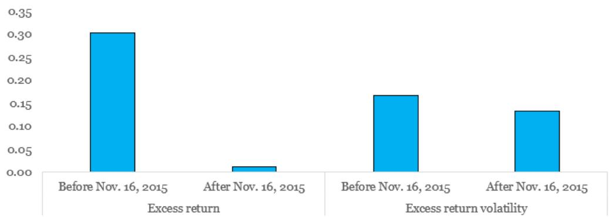
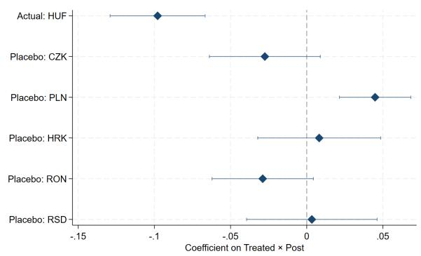
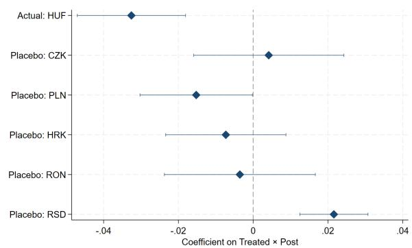
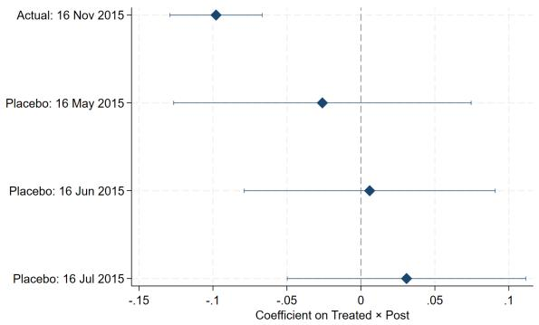
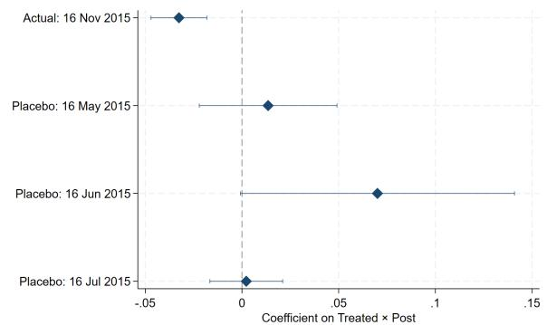

# Settlement Risk and Currency Markets

Seungduck Lee, Angelo Ranaldo, and Tomohiro Tsuruga
WP/26/156

IMF Working Papers describe research in progress by the authors and are published to elicit comments and to encourage debate. The views expressed in IMF Working Papers are those of the authors and do not necessarily represent the views of the IMF, its Executive Board, or IMF management.

2026
JUL

# IMF Working Paper Monetary and Capital Markets Department

Settlement Risk and Currency Markets
Prepared by Seungduck Lee, Angelo Ranaldo, and Tomohiro Tsuruga\*

Authorized for distribution by Mahvash Qureshi
July 2026

IMF Working Papers describe research in progress by the author(s) and are published to elicit comments and to encourage debate. The views expressed in IMF Working Papers are those of the author(s) and do not necessarily represent the views of the IMF, its Executive Board, or IMF management.

ABSTRACT: Settlement risk is a central friction in currency markets. We provide causal evidence on its pricing by exploiting Hungary's 2015 adoption of CLS, which introduced payment-versus-payment settlement, sharply reducing settlement risk. Using a difference-in-differences design, we find that currency excess returns decline by about ten basis points after CLS adoption, consistent with lower compensation for bearing settlement risk, while exchange rate volatility also falls. Deviations from triangular arbitrage conditions narrow, indicating a reduction in the effective cost of arbitrage and improved market efficiency. Additional evidence based on U.S.-specific holidays supports a mechanism operating through time-zone exposure. Our findings show that settlement risk is a priced friction and a source of limits to arbitrage in currency markets.

RECOMMENDED CITATION: Lee, Seungduck, Angelo Ranaldo, and Tomohiro Tsuruga (2026) “Settlement Risk and Currency Markets” IMF Working Paper WP/26/156, International Monetary Fund, Washington DC.

JEL Classification Numbers:

F31; G14; G15

Keywords:

Foreign exchange; Settlement risk; Market microstructure; Payment-versus-payment; Limit to arbitrage

Authors' E-Mail Addresses:

SLee14@imf.org, angelo.ranaldo@unibas.ch, TTsuruga@imf.org

WORKING PAPERS

# Settlement Risk and Currency Markets

Prepared by Seungduck Lee, Angelo Ranaldo, and Tomohiro Tsuruga

## Contents

1. Introduction .... 1
2. Settlement risk, returns, and volatility .... 3
2.1 Data and measurement .... 4
2.2 Difference-in-differences (DiD) design .... 5
2.3 Estimation results .... 6
2.4 Placebo evidence .... 8
3. Identification with U.S.-specific holidays .... 9
3.1 Settlement risk around U.S.-specific holidays .... 9
3.2 U.S.-specific holidays and intraday data .... 11
3.3 Difference-in-difference-in-differences (DiDiD) design .... 12
3.4 Estimation results .... 12
4. Settlement risk and triangular arbitrage .... 13
4.1 Triangular arbitrage .... 13
4.2 Estimation results .... 15
5. Conclusion .... 18
References .... 19
Appendix .... 22
FIGURES
Figure 1. Hungarian Forint Around CLS Entry: Excess Returns and Volatility .... 4
Figure 2. Placebo Tests: Alternative Treated Currencies and Event Dates .... 10
TABLES
Table 1. Difference-in-Differences Estimates: Excess Returns and Volatility .... 8
Table 2. DiDiD Estimates Around U.S. Holidays: Excess Returns and Volatility .... 14
Table 3. Difference-in-Differences Estimates: Triangular Deviation .... 17
Table A1. Three-Month Pre-Event Differential Linear Trend Tests .... 22
Table A2. Donut-Hole Robustness: Excess Returns and Volatility .... 22
Table A3. Placebo-Treated Currency Tests .... 23
Table A4. Placebo Event-Date Tests .... 23
Table A5. Randomization Inference for Baseline DiD Estimates .... 24
Table A6. Triangular Deviations: Means by Treatment and Period .... 24
Table A7. Triangular Deviations: Pre-period Distributional Benchmarks .... 24

## 1 Introduction

Settlement risk is a fundamental friction in financial markets and is particularly important in foreign exchange (FX) markets, where transactions involve the exchange of two currencies across time zones and payment systems. Since the collapse of Bankhaus Herstatt in 1974, which led to substantial losses for counterparties, a wide range of regulatory and infrastructure initiatives have sought to mitigate this risk. Nevertheless, settlement failures continue to occur. $^{1}$ Settlement risk materializes when one counterparty delivers the currency it has sold while the other fails to deliver—this risk is exacerbated by lengthy settlement cycles and time-zone differences. Given the large notional amounts in FX markets, with daily turnover of approximately \$9.6 trillion (Bank for International Settlement, 2025), even small settlement exposures can translate into economically significant costs and undermine financial stability.

Despite its importance, it remains unclear whether and how settlement risk is reflected in exchange rate dynamics. If market participants require compensation for bearing settlement exposure, exchange rates should embed a settlement risk premium. Even a premium of a few basis points would imply aggregate transaction costs of several billion dollars per day. Beyond pricing, settlement risk may also affect market stability and efficiency. By increasing counterparty exposure and liquidity risk, settlement uncertainty can constrain intermediaries' risk-bearing capacity and require precautionary funding, reducing their ability to absorb demand imbalances and leading to higher exchange rate volatility. It may also raise the effective cost of arbitrage across currencies, weakening no-arbitrage relationships.

Reducing settlement risk, however, is not costless. Alternative approaches—such as shortening settlement cycles or modifying trading infrastructure—may lower exposure but increase liquidity demands, reduce netting efficiency, or introduce operational costs (Rochet and Tirole, 1996; Capponi and Chang, 2025), and compress the time dealers have to source securities for delivery (Mattille, 2026). As a result, the equilibrium pricing of settlement risk depends not only on its presence but also on how it is mitigated. This makes it challenging to isolate the effect of settlement risk on asset prices.

We provide causal evidence on the role of settlement risk in currency pricing by exploiting Hungary's adoption of the Continuous Linked Settlement (CLS) system in November 2015.

CLS introduces payment-versus-payment (PvP) settlement, ensuring that both legs of an FX transaction are settled simultaneously, and thereby eliminating principal risk arising from the timing gap between the deliveries of the two currencies in an exchange. Importantly, CLS reduces settlement risk while preserving settlement cycles and multilateral netting arrangements. This feature allows us to isolate the effect of settlement risk from confounding changes in liquidity demand or market structure, providing a quasi-natural experiment to assess how settlement risk affects exchange rate dynamics and market efficiency. $^{2}$

We conduct three complementary empirical analyses. First, we examine the impact of CLS adoption on currency excess returns and their volatility using a difference-in-differences (DiD) design that compares Hungary with neighboring central and eastern European (CEE) currencies.

Second, we exploit variation in settlement risk induced by U.S.-specific holidays. On these days, trading in CEE currencies is more likely to involve counterparties operating within similar time zones such as those in Europe, reducing settlement risk. Using a difference-in-difference-in-differences (DiDiD) framework, we assess whether Hungary's entry into CLS altered exchange rate dynamics on these days.

Third, we study whether settlement risk affects the enforcement of no-arbitrage conditions by examining deviations from triangular parity across currencies. If settlement risk differs across currency pairs and counterparties, it can act as a limit to arbitrage, leading to persistent deviations from parity conditions. We test whether the introduction of CLS reduces such deviations.

Our results show that settlement risk is priced and has economically meaningful effects on FX markets. Currency excess returns decline by about ten basis points following CLS adoption, consistent with a reduction in compensation for bearing settlement risk. Exchange rate volatility also falls, indicating improved risk-bearing capacity of intermediaries and a relaxation of balance sheet constraints. Evidence based on U.S.-specific holidays further supports a mechanism operating through time-zone exposure. In addition, deviations from triangular arbitrage conditions narrow, suggesting that settlement risk can raise arbitrage costs and limit market integration.

These findings establish settlement risk as both a priced friction in currency markets and a source of limits to arbitrage. By isolating the payment-versus-payment (PvP) channel, our analysis provides a benchmark for evaluating alternative approaches to settlement design. More broadly, the paper contributes to the literature on financial market frictions by showing how settlement infrastructure shapes asset prices and market efficiency, and to the literature on limits to arbitrage in FX markets by identifying settlement risk as a distinct source of deviations from no-arbitrage conditions.

Our paper relates to two strands of the literature. First, a literature on settlement arrangements shows that institutional features such as netting and centralized clearing affect prices and risk (Bernstein et al., 2019; Mcsherry et al., 2017; Hattori, 2023), but focuses primarily on equity and bond markets rather than currency markets. Second, a growing literature documents deviations from no-arbitrage conditions in FX markets and attributes them to financial frictions such as funding constraints and intermediary balance sheet limitations (e.g., Du et al., 2018; Huang et al., 2025), without identifying settlement risk as a source of these frictions. We bridge these strands by providing causal evidence that settlement risk is both priced and a source of limits to arbitrage in currency markets. $^{3}$

The remainder of the paper is organized as follows. Section 2 presents the empirical strategy and main results. Section 3 examines the role of time-zone variation using holiday effects. Section 4 studies implications for triangular arbitrage. Section 5 concludes.

## 2 Settlement risk, returns, and volatility

This section estimates the causal effect of a discrete reduction in FX settlement risk on currency excess returns and exchange rate volatility. Our identification exploits Hungary's transition to payment-versus-payment (PvP) settlement for the Hungarian forint (HUF) through CLS in November 2015.

Settlement risk arises when one leg of an FX transaction is delivered while the counterparty fails to deliver the other leg. CLS, a multicurrency settlement system, mitigates this risk by ensuring that both legs of a transaction settle simultaneously through PvP arrangements, thereby sharply reducing settlement exposure.

If market participants price settlement exposure, a reduction in settlement risk should lower currency excess returns. When settlement risk is elevated, market participants with greater unsettled exposures must reserve balance sheet capacity and precautionary funding to survive potential counterparty default. This constraints their ability to absorb order flow shocks, thereby amplifying exchange rate volatility. Eliminating such exposure through PvP settlement should therefore reduce volatility. Figure 1 shows that both excess returns and excess return volatility for the Hungarian forint decline around the CLS entry date. However, because the figure captures only unconditional patterns and settlement risk can be affected by various other factors, the economic significance of the treatment effect is better assessed using the difference-in-differences estimates.

Figure 1: Hungarian Forint Around CLS Entry: Excess Returns and Volatility  
  
Notes: The figure plots daily excess returns and excess return volatility of the Hungarian forint in percent, one month before and after November 16,2015. Volatility is measured as the square root of daily realized volatility computed from intraday data. For more details about the construction of the data and the measurement methodology, see Section 2.1.

We estimate these effects using a difference-in-differences design that compares HUF with a set of neighboring Central and Eastern European (CEE) currencies that did not experience the same settlement infrastructure change.

## 2.1 Data and measurement

Our sample covers six CEE currencies against the U.S. dollar and the euro—HRK, CZK, HUF, PLN, RON, and RSD—from 2015 to 2016. We use Bloomberg bid and ask quotes, timestamped in London time, available at both daily and 30-minute frequencies. Midquotes are computed as the average of bid and ask prices.

We construct two main outcome variables. First, excess returns are measured as the daily log change in the exchange rate relative to the change implied by the overnight interest-rate differential, expressed in basis points. Second, exchange rate volatility is measured using realized volatility, computed from 30-minute intraday returns. $^{4}$ We also construct bid–ask spreads as a proxy for market liquidity and use it as a control variable. In addition, we collect overnight interest rates for each country from Bloomberg. $^{5}$

## 2.2 Difference-in-differences (DiD) design

We define the event date as November 16, 2015, the first day on which HUF became eligible for CLS payment-versus-payment (PvP) settlement (CLS Group, 2015). Following CLS entry, a non-negligible share of HUF transactions was settled through PvP. According to the Magyar Nemzeti Bank (MNB), between November 16, 2015 and March 31, 2016, the daily gross turnover of HUF transactions settled in CLS averaged about 336.6 million U.S. dollars and peaked at 850.9 million U.S. dollars. While this remained a fraction of total market turnover, the participation of major banks at the core of the interdealer network and the availability of PvP settlement likely reduced frictions arising from settlement risk in HUF transactions. $^{6}$ We therefore treat November 16, 2015 as the event date in our empirical design.

The treated unit is the Hungarian forint (HUF). HUF's inclusion in CLS was motivated by the fact that a large share of HUF trading takes place internationally and by the aspiration to improve market stability—considerations shared by other small open economies in CEE. $^{7}$ The control group consists of five geographically and economically proximate CEE currencies that did not join CLS during the sample period: Croatia (HRK), the Czech Republic (CZK), Poland (PLN), Romania (RON), and Serbia (RSD). These currencies share exposure to broad regional developments and global FX conditions. Under the identifying assumption that, absent treatment, HUF and the control currencies would have followed similar shortrun dynamics, this comparison provides a suitable counterfactual. $^{8}$ We define the set of currencies as $CEE = \{HRK, CZK, HUF, PLN, RON, RSD\}$ .

Our baseline specification uses a symmetric window of one month before and after the event. We also consider a three-month window to assess robustness. The choice of window length balances two competing considerations: shorter windows reduce exposure to confounding macroeconomic developments but may limit statistical power, whereas longer windows improve precision at the cost of potentially capturing unrelated shocks. $^{9}$

We estimate the following difference-in-differences specification:

$$
Y _ {c, c ^ {\prime}, t} = \beta P o s t _ {t} + \delta (T r e a t e d _ {c, c ^ {\prime}} \times P o s t _ {t}) + \theta B A S _ {c, c ^ {\prime}, t} + \mu_ {c, c ^ {\prime}} + \Gamma_ {c, m, y} + \varepsilon_ {c, c ^ {\prime}, t},\tag{1}
$$

where $Y_{c,c',t}$ denotes the outcome of interest for the currency pair $(c,c')$ at time t, with $c \in CEE$ and $c' = USD$ . The indicator $Post_{t}$ equals one after November 16, 2015, and zero otherwise, capturing common shifts affecting all currencies over time. $Treated_{c,c'}$ equals one for the HUF/USD pair and zero for the control currencies. The coefficient of interest, $\delta$ , measures the differential change in HUF after CLS adoption relative to the control group and identifies the causal effect of reduced settlement risk under the parallel trends assumption. To control for the effects of potential changes in market liquidity, bid-ask spreads $(BAS_{c,c',t})$ of the currency pair $(c,c')$ at time t are included, following Bernstein et al. (2019) and Hattori (2023). All specifications include currency-pair fixed effects $\mu_{c,c'}$ and currency–month-year fixed effects $\Gamma_{c,m,y}$ . In some specifications, we additionally include date fixed effects to absorb common shocks at the daily level. Focusing on short symmetric windows around the CLS entry limits exposure to unrelated macroeconomic developments, while robustness to longer windows ensures the persistence of the effect.

## 2.3 Estimation results

Table 1 reports the DiD estimates of the impact of Hungary's participation in CLS on FX market conditions, focusing on excess returns (columns (1)-(4)) and their volatility (columns (5)-(8)). All specifications include currency fixed effects and currency-month-year fixed effects, and columns (2), (4), (6), and (8) additionally include date fixed effects. Following Roth et al. (2023), standard errors are clustered at the currency level, which matches the level of treatment assignment and allows for serial correlation and heteroskedasticity within currency series. As our regression specifications include date effect, there is little concern about error correlations across currencies within the same time period. $^{10}$

Across all specifications, the estimated Treated × Post coefficient for excess returns is negative and statistically significant. In the one-month window (columns (1)–(2)), the point estimates are close to -0.10 and significant at the 1% level, implying a reduction of about 10 basis points in daily excess returns following CLS adoption. Given that the average pre-event excess return for HUF is approximately 28 basis points, this decline is economically meaningful. Expanding the window to three months (columns (3)–(4)) yields very similar estimates, indicating that the effect is persistent and not driven solely by observations close to the event date. $^{[11]}$ The inclusion of date fixed effects does not materially affect the estimated treatment effect, reinforcing that identification does not rely on common time-series variation.

Columns (5)-(8) report the corresponding estimates for excess return volatility. The Treated $\times$ Post coefficient is again negative and statistically significant, with estimates centered around $-0.032$ across event windows and fixed-effect variants. This indicates that exchange rate volatility declines following CLS adoption. In specifications without date fixed effects (columns (5) and (7)), the post dummy is also negative and highly significant (around $-0.039$ ), suggesting a common reduction in volatility across currencies, beyond which HUF exhibits an additional decline captured by the interaction term.

Taken together, these findings indicate that settlement risk is priced and that its reduction lowers compensation for bearing this risk. They also suggest that reduced settlement risk improves the risk-bearing capacity of intermediaries, leading to more stable exchange rate dynamics. More broadly, the joint decline in excess returns and volatility is consistent with a reduction in compensation for, and exposure to, settlement-related frictions after CLS entry. $^{12}$

Table 1: Difference-in-Differences Estimates: Excess Returns and Volatility

<table><tr><td rowspan="2"></td><td colspan="4">Excess Returns</td><td colspan="4">Excess Return Volatility</td></tr><tr><td>(1) ±1 month</td><td>(2) ±1 month</td><td>(3) ±3 month</td><td>(4) ±3 month</td><td>(5) ±1 month</td><td>(6) ±1 month</td><td>(7) ±3 month</td><td>(8) ±3 month</td></tr><tr><td>Treated × Post</td><td></td><td></td><td></td><td></td><td></td><td></td><td></td><td></td></tr><tr><td></td><td>-0.0988*** (0.0103)</td><td>-0.1002*** (0.0106)</td><td>-0.1005*** (0.0115)</td><td>-0.0979*** (0.0121)</td><td>-0.0321*** (0.0049)</td><td>-0.0326*** (0.0055)</td><td>-0.0320*** (0.0051)</td><td>-0.0326*** (0.0056)</td></tr><tr><td>Post</td><td></td><td></td><td></td><td></td><td></td><td></td><td></td><td></td></tr><tr><td></td><td>-0.0307** (0.0111)</td><td></td><td>-0.0323** (0.0100)</td><td></td><td>-0.0397*** (0.0047)</td><td></td><td>-0.0393*** (0.0052)</td><td></td></tr><tr><td>Bid-Ask Spread</td><td></td><td></td><td></td><td></td><td></td><td></td><td></td><td></td></tr><tr><td></td><td>-26.52 (28.64)</td><td>-51.53 (28.07)</td><td>-56.41 (63.36)</td><td>-11.61 (20.76)</td><td>-2.022 (2.41)</td><td>0.509 (3.44)</td><td>1.732 (2.23)</td><td>2.396 (2.28)</td></tr><tr><td>Constant</td><td></td><td></td><td></td><td></td><td></td><td></td><td></td><td></td></tr><tr><td></td><td>0.183*** (0.0430)</td><td>0.203*** (0.0395)</td><td>0.112 (0.0965)</td><td>0.0282 (0.0316)</td><td>0.175*** (0.00394)</td><td>0.149*** (0.00686)</td><td>0.167*** (0.00543)</td><td>0.146*** (0.00487)</td></tr><tr><td>Fixed Effects</td><td></td><td></td><td></td><td></td><td></td><td></td><td></td><td></td></tr><tr><td>Date FE</td><td>No</td><td>Yes</td><td>No</td><td>Yes</td><td>No</td><td>Yes</td><td>No</td><td>Yes</td></tr><tr><td>Currency-Month-Year FE</td><td>Yes</td><td>Yes</td><td>Yes</td><td>Yes</td><td>Yes</td><td>Yes</td><td>Yes</td><td>Yes</td></tr><tr><td>Observations</td><td>258</td><td>258</td><td>786</td><td>786</td><td>257</td><td>257</td><td>780</td><td>780</td></tr><tr><td>Clusters (Currency)</td><td>6</td><td>6</td><td>6</td><td>6</td><td>6</td><td>6</td><td>6</td><td>6</td></tr><tr><td>R-squared</td><td>0.091</td><td>0.924</td><td>0.043</td><td>0.897</td><td>0.127</td><td>0.936</td><td>0.127</td><td>0.894</td></tr></table>

Notes: The table reports difference-in-differences estimates using high-dimensional fixed effects. All regressions use currency-level clustered standard errors, which match the level of treatment assignment. In some specifications, the Treated and Post main effects are omitted where they are absorbed by the included fixed effects. \*\*\* $p < 0.01$ , \*\* $p < 0.05$ , \* $p < 0.1$ .

In the next subsection, we assess whether these effects are specific to Hungary and to the timing of CLS adoption.

## 2.4 Placebo evidence

We further assess the robustness of our results using two placebo exercises. First, we reassign treatment to alternative currencies in the sample (placebo-treated-currency tests). Second, we assign placebo intervention dates in the pre-treatment period (placebo-event-date tests).

Figure 2 shows that these placebo tests do not reproduce the baseline effects estimated for HUF. When treatment is reassigned to other currencies, the estimated effects are generally statistically insignificant or carry the opposite sign. Similarly, assigning the intervention to earlier placebo dates yields estimates that are insignificant and substantially smaller than those obtained for the actual event date of November 16, 2015.

These placebo patterns indicate that the post-event decline in excess returns and volatility is specific both to HUF and to the timing of CLS adoption, rather than reflecting common regional dynamics or spurious time variation. Together, these results provide additional support for a causal interpretation of our baseline DiD estimates (Appendix Tables A3 and A4).

To further address concerns regarding the small number of clusters, we complement the placebo exercises with randomization inference (RI). $^{13}$ Specifically, we expand the placebo distribution by reassigning treatment across all six currencies and all dates during the 90-day pre-event period (August 15 to November 15, 2015), with each placebo estimation using a sliding window that matches the baseline sample width ( $\pm30$ days for the 1-month and $\pm90$ days for the 3-month specifications). Appendix Table A5 shows that the studentized t-statistics fall in the extreme tails of the empirical distribution, with RI p-values ranging from 0.025 to 0.066 for excess returns and 0.079 to 0.095 for volatility, supporting the robustness of the baseline estimates.

## 3 Identification with U.S.-specific holidays

## 3.1 Settlement risk around U.S.-specific holidays

Settlement risk depends not only on the currencies being exchanged but also on the location of counterparties and the resulting overlap of payment-system operating hours. This implies that settlement risk, and hence the associated risk premium, may vary across calendar days and within the trading day.

U.S.-specific holidays provide a useful setting to study this mechanism. On such days, trading in CEE currencies is more likely to be conducted by non-U.S. located counterparties, particularly participants located in Europe. $^{14}$ Because these counterparties operate in more closely aligned time zones (Breedon and Ranaldo, 2013), settlement risk may be lower than on regular trading days, potentially reducing the associated risk premium. However, this effect is not automatic. If transactions that would normally occur between participants located in Europe and the United States are instead replaced by trades involving participants located in Asia-Pacific, settlement risk may remain elevated. In addition, reduced participation by institutions located in the U.S. may affect market liquidity, which could influence exchange rate dynamics independently of settlement risk.

We therefore examine whether Hungary's entry into CLS altered exchange rate behavior

Figure 2: Placebo Tests: Alternative Treated Currencies and Event Dates  
  
(a) Treated-currency placebo: Excess Returns

  
(b) Treated-currency placebo: Excess Return Volatility

  
(c) Event-date placebo: Excess Returns

  
(d) Event-date placebo: Excess Return Volatility

Notes: Panels (a) and (b) compare the benchmark HUF estimate with placebo-treated-currency estimates obtained by assigning treatment to alternative currencies in the sample. Panels (c) and (d) compare the actual event date with placebo intervention dates in the pretreatment period. Markers report DID coefficients for the interaction between the treated-unit indicator and the post-event dummy, and horizontal lines indicate 95% confidence intervals. Excess returns are shown in the left column and excess return volatility in the right column.

around U.S.-specific holidays. If settlement risk is an important driver of exchange rate dynamics, the holiday-related variation in settlement risk should be attenuated after the introduction of PvP settlement.

## 3.2 U.S.-specific holidays and intraday data

To isolate variation in settlement risk, we focus on holidays that are specific to the United States. In our sample, these include: (i) Martin Luther King Jr. Day (January 19, 2015; January 18, 2016), (ii) Presidents' Day (February 16, 2015; February 15, 2016), (iii) Independence Day (July 3, 2015; July 4, 2016), and (iv) Labor Day (September 7, 2015; September 5, 2016). $^{15}$ Hereafter, we refer to these four dates as U.S.-specific holidays.

Time-of-day effects are important because of time-zone differences. A U.S. holiday begins in the afternoon of the same calendar date in Europe and ends late in the morning of the following day in Europe. To capture this overlap, we use 30-minute intraday data and focus on observations between 8:00 AM and 1:00 PM EST (corresponding to 12:00 PM–5:00 PM or 1:00 PM–6:00 PM GMT, depending on daylight saving time). We define these intervals as the U.S.-holiday trading window.

This intraday window is precisely when the absence of U.S. counterparties alters the geography of trading and the associated settlement exposures. As a result, variation across holiday and non-holiday periods captures changes in exposure duration and the distribution of counterparty risk, which in turn affect intermediaries' balance sheet usage and funding needs.

We consider event windows of $\pm1$ , $\pm2$ , and $\pm3$ business days around each holiday, and use the exchange rates of four CEE currencies—CZK, HUF, PLN, and RON—against the U.S. dollar. $^{16}$ The sample spans January 1, 2015 to November 15, 2016. $^{17}$ Because the identifying variation comes from U.S.-specific holidays, the relevant mechanism operates through the temporary absence or reduced activity of U.S.-based dealers and counterparties in CEE currency markets.

## 3.3 Difference-in-difference-in-differences (DiDiD) design

We estimate a triple-difference specification that exploits variation across (i) treated versus control currencies, (ii) pre- versus post-CLS periods, and (iii) holiday versus non-holiday days within each event window. This design allows us to test whether the effect of CLS is concentrated on non-holiday trading days—when settlement-risk exposure is directly affected—relative to U.S. holidays.

The regression specification is:

$$
\begin{array}{r c l} Y _ {c, c ^ {\prime}, h, \tau , t, y} & = & \beta_ {1} (T r e a t e d _ {c, c ^ {\prime}} \times N o n - H o l i d a y _ {h, \tau}) \\ & + & \beta_ {2} (T r e a t e d _ {c, c ^ {\prime}} \times P o s t _ {h} \times N o n - H o l i d a y _ {h, \tau}) \\ & + & \beta_ {3} (T r e a t e d _ {c, c ^ {\prime}} \times P o s t _ {h} \times H o l i d a y _ {h, \tau}) \\ & + & \theta B A S _ {c, c ^ {\prime}, t} + \mu_ {c, c ^ {\prime}} + \lambda_ {t} + \eta_ {h} + \rho_ {\tau} + \kappa_ {y} + \epsilon_ {c, c ^ {\prime}, h, \tau , t, y}, \end{array}\tag{2}
$$

where $Y_{c,c',h,\tau,t,y}$ denotes the outcome variable (excess returns or excess return volatility) for currency pair $(c,c')$ with $c\in\{CZK,HUF,PLN,RON\}$ , $c'=USD$ , on date t in year y, measured within the event window around holiday h. $Treated_{c,c'}$ equals one for HUF and zero otherwise. $Holiday_{h,\tau}$ identifies observations on the holiday $(\tau=0)$ within the event window, while $Post_{h}$ indicates whether holiday h occurs after Hungary's CLS adoption. The specification controls for the bid-ask spread $(BAS_{c,c',t})$ and includes currency-pair fixed effects $(\mu_{c,c'})$ , time-of-day fixed effects $(\lambda_{t})$ , holiday fixed effects $(\eta_{h})$ , event-time fixed effects $(\rho_{\tau})$ , and year fixed effects $(\kappa_{y})$ . Standard errors are clustered at the holiday-event level, yielding eight clusters corresponding to four U.S.-specific holidays observed in each of the two sample years.

## 3.4 Estimation results

Table 2 reports the DiDiD estimates. Our main interest is whether the difference between the estimated coefficients on non-holiday and holiday $\hat{\beta}_{2}-\hat{\beta}_{3}$ is negative. A negative estimate would indicate that the CLS adoption largely affects settlement risk on non-holiday days—when U.S. counterparties are active and settlement risk is present—than on U.S. holidays, when the settlement environment is largely unchanged.

$$
\mathrm{DiDiD} = \hat {\beta} _ {2} - \hat {\beta} _ {3},\tag{3}
$$

which measures how the treatment effect differs between non-holiday and holiday observations.

Across specifications, the DiDiD estimates for excess returns are negative and statistically significant. This indicates that the reduction in excess returns following CLS adoption is larger on non-holiday days than on the holiday itself. Notably, the estimated coefficient $\hat{\beta}_{2}$ is negative and significant across all specifications, suggesting that CLS adoption has substantially reduced the settlement risk during non-U.S. holidays. The effect is strongest in narrower event windows and attenuates as the window expands, consistent with greater noise as observations further from the holiday are included.

For excess return volatility, the results are more pronounced. The DiDiD estimates are consistently negative and statistically significant across all event windows, indicating that exchange rate volatility declines more on non-holiday days than on the holiday after CLS adoption. $^{18}$

Taken together, these findings support the interpretation that settlement risk varies with time-zone exposure and that CLS reduces this variation. In particular, the results suggest that PvP settlement compresses differences in settlement risk across trading environments, leading to more stable exchange rate dynamics outside the holiday period. Identification relies on within-event-window contrasts after accounting for intraday seasonality and common time variation, with all specifications including currency, time-of-day (30-minute bin), event-time (relative-day), and year fixed effects.

## 4 Settlement risk and triangular arbitrage

## 4.1 Triangular arbitrage

Settlement risk can act as a limit to arbitrage in FX markets because it creates counterparty exposure that differs across transactions. This exposure depends on the location of counterparties, the timing of settlement across time zones, and the settlement arrangements used for each leg of a trade. When trades are not settled simultaneously, intermediaries remain exposed over the settlement window, tying up balance sheet capacity and potentially requiring precautionary funding. As a result, otherwise equivalent strategies may involve different effective costs, reflecting differences in risk, capital usage, and funding needs.

A natural setting to study these effects is triangular arbitrage. Under frictionless conditions, the exchange rate between two currencies should be consistent with the rate implied by a third currency. For example, the HUF/USD exchange rate can be replicated by combining HUF/EUR and EUR/USD transactions. However, this parity condition may fail when the different legs of the strategy are subject to different settlement risks. If trades involve counterparties in different time zones or operate under different settlement systems, the associated exposures and funding requirements may differ across legs. In such cases, the synthetic exchange rate (HUF/EUR × EUR/USD) may deviate from the direct exchange rate (HUF/USD), reflecting limits to arbitrage arising from settlement frictions.

Table 2: DiDiD Estimates Around U.S. Holidays: Excess Returns and Volatility

<table><tr><td rowspan="2"></td><td colspan="3">Excess Returns</td><td colspan="3">Excess Return Volatility</td></tr><tr><td>(1)</td><td>(2)</td><td>(3)</td><td>(4)</td><td>(5)</td><td>(6)</td></tr><tr><td>Panel A. DiDiD estimate (Post×Treated×Non-holiday) - (Post×Treated×Holiday) ( $\beta_2 - \beta_3$ )</td><td>-0.771*(0.370)</td><td>-0.850*(0.387)</td><td>-0.726*(0.355)</td><td>-0.134***(0.033)</td><td>-0.098***(0.021)</td><td>-0.100***(0.027)</td></tr><tr><td colspan="7">Panel B. Key interaction terms</td></tr><tr><td>Treated × Non-holiday ( $\beta_1$ )</td><td>0.366(0.244)</td><td>0.355(0.300)</td><td>0.322(0.285)</td><td>0.100**(0.038)</td><td>0.077**(0.029)</td><td>0.074**(0.029)</td></tr><tr><td>Post × Treated × Non-holiday ( $\beta_2$ )</td><td>-0.381**(0.149)</td><td>-0.259*(0.111)</td><td>-0.223**(0.092)</td><td>-0.088**(0.028)</td><td>-0.044**(0.014)</td><td>-0.036**(0.013)</td></tr><tr><td>Post × Treated × Holiday ( $\beta_3$ )</td><td>0.390(0.307)</td><td>0.590*(0.307)</td><td>0.504(0.296)</td><td>0.046***(0.012)</td><td>0.054***(0.013)</td><td>0.064***(0.018)</td></tr><tr><td>Bid-ask spread</td><td>-2.575**(0.862)</td><td>-2.189**(0.916)</td><td>-1.763**(0.684)</td><td>-0.179(0.127)</td><td>0.056(0.092)</td><td>0.197**(0.068)</td></tr><tr><td colspan="7">Panel C. Specification details</td></tr><tr><td>Event window</td><td>[-1,1]</td><td>[-2,2]</td><td>[-3,3]</td><td>[-1,1]</td><td>[-2,2]</td><td>[-3,3]</td></tr><tr><td>Currency FE</td><td>Yes</td><td>Yes</td><td>Yes</td><td>Yes</td><td>Yes</td><td>Yes</td></tr><tr><td>Time-of-day FE</td><td>Yes</td><td>Yes</td><td>Yes</td><td>Yes</td><td>Yes</td><td>Yes</td></tr><tr><td>Event FE (holiday)</td><td>Yes</td><td>Yes</td><td>Yes</td><td>Yes</td><td>Yes</td><td>Yes</td></tr><tr><td>Event-time FE (relative day)</td><td>Yes</td><td>Yes</td><td>Yes</td><td>Yes</td><td>Yes</td><td>Yes</td></tr><tr><td>Year FE</td><td>Yes</td><td>Yes</td><td>Yes</td><td>Yes</td><td>Yes</td><td>Yes</td></tr><tr><td>Bid-ask spread control</td><td>Yes</td><td>Yes</td><td>Yes</td><td>Yes</td><td>Yes</td><td>Yes</td></tr><tr><td>Observations</td><td>960</td><td>1,600</td><td>2,240</td><td>960</td><td>1,600</td><td>2,240</td></tr><tr><td>Within  $R^2$ </td><td>0.0495</td><td>0.0309</td><td>0.0195</td><td>0.0853</td><td>0.0372</td><td>0.0358</td></tr></table>

Notes: Standard errors in parentheses are clustered by the event level, with 8 clusters. $*p < 0.10$ , $**p < 0.05$ , $***p < 0.01$ . The treated currency is HUF; controls are CZK, PLN, and RON. The sample is restricted to 08:00–13:00 EST, and “holiday” denotes the event day. All specifications include bid-ask spreads as a control.

Triangular deviations can therefore be interpreted as a measure of the effective cost of arbitrage under intermediary constraints. Beyond transaction costs, these deviations reflect the shadow cost of balance sheet usage, counterparty exposure, and precautionary funding associated with unsettled positions. When settlement risk increases the size or duration of exposures, intermediaries must allocate capital and manage risk limits—such as value-at-risk (VaR) constraints—thereby rising the marginal cost of arbitrage. This interpretation is consistent with models in which constrained intermediaries determine asset prices and arbitrage activity (Huang et al., 2025).

We examine exchange rates of the seven CEE currencies against the U.S. dollar $(S_{c,USD}, c \in \text{CEE})$ , replicated by (i) the exchange rates of the CEE currency against the euro $(S_{c,EUR}, c \in \text{CEE})$ and (ii) the exchange rate of the euro against the U.S. dollar $(S_{EUR,USD})$ . The triangular deviation of a currency c vis-à-vis the U.S. dollar is defined as follows:

$$
{D _ {c, U S D, t}} = {\left| \log (S _ {c, U S D, t}) - \log (\tilde {S} _ {c, U S D, t}) \right| \times 1 0, 0 0 0,}\tag{4}
$$

where $\tilde{S}_{c,USD,t}=S_{c,EUR,t}/S_{EUR,USD,t}$ is the synthetic exchange rate implied by the euro cross rate. We apply a DiD specification analogous to that in Section 2, adapted to the triangular deviation outcome.

## 4.2 Estimation results

Table 3 reports DiD estimates of the effect of CLS participation on triangular deviations, measured in basis points as defined in Equation (4). The coefficient on the interaction term Treated×Post, δ, captures the change in triangular deviations for HUF relative to the control CEE currencies after Hungary's entry into CLS. All specifications include currency fixed effects and control for contemporaneous liquidity conditions using the daily bid-ask spread. Standard errors are clustered at the currency level.

The main finding is that CLS eligibility is associated with a statistically significant reduction in triangular deviations in the parsimonious specifications. In the one-month window, the estimated Treated×Post coefficient is -0.0195 basis points in column (1) and is virtually unchanged when adding date fixed effects in column (2), remaining significant at the 1 percent level. In the three-month window, the interaction term is also negative and statistically significant, with estimates of -0.0145 basis points in column (4) and -0.0123 basis points in column (5), both significant at the 5 percent level. The close correspondence between columns (1) and (2) and between columns (4) and (5) suggests that the results are not driven by common time shocks; rather, they reflect a differential post-CLS tightening of triangular parity for HUF relative to the control group.

To gauge economic magnitude, we benchmark the estimated effects against pre-period levels within each event-window sample (Appendix Tables A6 and A7). Scaling the preferred estimates in Table 3 by the treated pre-period mean, CLS entry implies a sizable reduction in triangular deviations: about 27 percent in the one-month window (columns (1)–(2)) and about 17–20 percent in the three-month window (columns (4)–(5)). $^{19}$ Because triangular deviations are highly right-skewed, mean-based benchmarks may understate the effect for a typical observation. We therefore also compare the estimates to robust pre-period distributional moments, namely the median and interquartile range, reported in Appendix Table A2. Under these benchmarks, the estimated effects still represent a material tightening relative to the central mass of the distribution. $^{20}$ The inclusion of bid–ask spread controls does not overturn the main treatment result: the negative Treated×Post coefficient remains robust in columns (1), (2), (4), and (5), reinforcing the interpretation that CLS eligibility is associated with an improvement in triangular parity beyond contemporaneous liquidity conditions.

Finally, the fixed-effects structure clarifies what variation identifies the estimates. Columns (2) and (5) absorb date fixed effects, so the treatment effect is identified from within-date cross-currency differentials in deviations between HUF and the control currencies before versus after CLS adoption. This helps address concerns that global events or broad risk-off episodes might drive changes in deviations. At the same time, inference should be interpreted with caution given the small number of currency clusters. $^{21}$

Taken together, the evidence in columns (1), (2), (4), and (5) indicates that CLS introduction is associated with a statistically and economically meaningful reduction in triangular deviations. Interpreting these deviations as a measure of arbitrage frictions, the results suggest that settlement risk raises the effective cost of arbitrage by increasing counterparty exposure, tying up balance sheet capacity, and requiring precautionary funding. These effects tighten intermediaries' risk constraints—such as value-at-risk limits—and reduce their ability to deploy capital to arbitrage trades. By reducing these exposures through PvP settlement, CLS relaxes intermediary constraints, lowers the shadow cost of arbitrage, and leads to tighter no-arbitrage relationships in FX markets.

Table 3: Difference-in-Differences Estimates: Triangular Deviation

<table><tr><td rowspan="2"></td><td colspan="3">±1 month</td><td colspan="3">±3 months</td></tr><tr><td>(1)</td><td>(2)</td><td>(3)</td><td>(4)</td><td>(5)</td><td>(6)</td></tr><tr><td colspan="7">Treated × Post</td></tr><tr><td></td><td>-0.01950***(0.00458)</td><td>-0.01954***(0.00491)</td><td>-0.00182(0.00911)</td><td>-0.01452**(0.00411)</td><td>-0.01227**(0.00394)</td><td>-0.00011(0.00874)</td></tr><tr><td colspan="7">Post</td></tr><tr><td></td><td>0.00214(0.00451)</td><td></td><td></td><td>0.01389**(0.00472)</td><td></td><td></td></tr><tr><td colspan="7">Bid–Ask spread</td></tr><tr><td></td><td>-4.211**(1.620)</td><td>-4.549**(1.627)</td><td>-4.298*(1.933)</td><td>33.843(35.811)</td><td>42.313(34.277)</td><td>37.877(37.180)</td></tr><tr><td colspan="7">Constant</td></tr><tr><td></td><td>0.05227***(0.00249)</td><td>0.05381***(0.00224)</td><td>0.05219***(0.00259)</td><td>0.00345(0.05029)</td><td>-0.00110(0.04661)</td><td>0.00404(0.05063)</td></tr><tr><td colspan="7">Fixed Effects</td></tr><tr><td>Currency FE</td><td>Yes</td><td>Yes</td><td>Yes</td><td>Yes</td><td>Yes</td><td>Yes</td></tr><tr><td>Date FE</td><td>No</td><td>Yes</td><td>Yes</td><td>No</td><td>Yes</td><td>Yes</td></tr><tr><td>Currency–Month–Year FE</td><td>No</td><td>No</td><td>Yes</td><td>No</td><td>No</td><td>Yes</td></tr><tr><td>Observations</td><td>301</td><td>301</td><td>301</td><td>901</td><td>901</td><td>901</td></tr><tr><td>Clusters (Currency)</td><td>7</td><td>7</td><td>7</td><td>7</td><td>7</td><td>7</td></tr><tr><td> $R^2$ </td><td>0.474</td><td>0.547</td><td>0.585</td><td>0.122</td><td>0.304</td><td>0.363</td></tr></table>

Notes: The dependent variable is the triangular deviation measured in basis points (bps), $D_{c,USD,t} = 10,000 \times \left| \log(S_{c,USD,t}) - \log(\tilde{S}_{c,USD,t}) \right|$ . The treated currency is HUF; controls are BGN, CZK, HRK, PLN, RON, and RSD. Standard errors are clustered at the currency level and reported in parentheses. In specifications with currency fixed effects, the main effect of treated is omitted due to collinearity; with date fixed effects, the main effect of post is also omitted. $^{*}p < 0.10$ , $^{**}p < 0.05$ , $^{***}p < 0.01$ .

## 5 Conclusion

We show that exchange rates embed a premium that varies with settlement risk and that exchange rate dynamics become less volatile when this risk is reduced. Evidence from U.S.-specific holidays further indicates that settlement risk premia varied with time-zone exposure prior to Hungary's CLS entry.

More broadly, our results show that settlement risk can restrict arbitrage activities. By increasing counterparty exposure and liquidity risk, settlement uncertainty raises precautionary funding needs and constraints intermediaries' risk-bearing capacity, leading to higher exchange rate volatility and increases the effective cost of arbitrage across currencies. Consistent with this mechanism, we find that triangular deviations—a measure of arbitrage frictions—decline significantly after CLS adoption, indicating tighter no-arbitrage relationships.

Taken together, these findings establish settlement risk as a priced friction and a source of limits to arbitrage in FX markets. From a policy perspective, this evidence highlights that settlement infrastructure is not merely a back-office concern, but a core determinant of market resilience, pricing, and arbitrage efficiency. By reducing counterparty exposure, payment-versus-payment settlement alleviates intermediary constraints, lowers the shadow cost of arbitrage, and improves the integration and stability of currency markets.

More generally, our analysis underscores the role of settlement infrastructure in shaping asset prices, market efficiency, and liquidity provision. An important direction for future research is to examine whether similar effects arise for other CLS-eligible currencies or alternative payment-versus-payment arrangements. Another promising avenue is to study how settlement design interacts with intermediary frictions more broadly, including balance sheet constraints, inventory management, and information asymmetries.

## References

Avdjiev, S., Du, W., Koch, C., and Shin, H. S. (2019). The dollar, bank leverage, and deviations from covered interest parity. American Economic Review: Insights, 1(2):193–208.

Bank for International Settlement (2025). Triennial Central Bank Survey. 2025, Bank for Internaitonal Settlements.

Bernstein, A., Hughson, E., and Weidenmier, M. (2019). Counterparty risk and the establishment of the new york stock exchange clearinghouse. Journal of Political Economy, 127(2):689–729.

Breedon, F. and Ranaldo, A. (2013). Intraday patterns in fx returns and order flow. Journal of Money, Credit and Banking, 45(5):953–965.

Capponi, A. and Chang, J.-W. (2025). Settlement speed and financial stability. Finance and Economics Discussion Series 2025-101, Board of Governors of the Federal Reserve System.

Cenedese, G., Corte, P. D., and Wang, T. (2019). Currency mispricing and dealer balance sheets. Bank of England working papers 779, Bank of England.

Chaboud, A. P., Chiquoine, B., Hjalmarsson, E., and Vega, C. (2014). Rise of the machines: Algorithmic trading in the foreign exchange market. The Journal of Finance, 69(5):2045–2084.

CLS Group (2015). CLS adds Hungarian forint to settlement system. Press Release, CLS Group.

Du, W., Tepper, A., and Verdelhan, A. (2018). Deviations from covered interest rate parity. The Journal of Finance, 73(3):915–957.

Hattori, T. (2023). The premium and settlement of CCPs during the financial crisis: Evidence from the JGB market. Journal of International Money and Finance, 132:102774.

Huang, W., Ranaldo, A., Schrimpf, A., and Somogyi, F. (2025). Constrained liquidity provision in currency markets. Journal of Financial Economics, 167:104028.

Ito, T., Yamada, K., Takayasu, M., and Takayasu, H. (2012). Free lunch! arbitrage opportunities in the foreign exchange markets. NBER Working Papers 18541, National Bureau of Economic Research, Inc.

Ito, T., Yamada, K., Takayasu, M., and Takayasu, H. (2020). Execution risk and arbitrage opportunities in the foreign exchange markets. NBER Working Papers 26706, National Bureau of Economic Research, Inc.

Kloks, P., Mattille, E., and Ranaldo, A. (2024). Hunting for dollars. Swiss Finance Institute Research Paper Series 24-52, Swiss Finance Institute.

Liu, C. and Sun, Y. (2019). A simple and trustworthy asymptotic t test in difference-in-differences regressions. Journal of Econometrics, 210(2):327–362.

MacKinnon, J. G. and Webb, M. D. (2020). Randomization inference for difference-in-differences with few treated clusters. Journal of Econometrics, 218(2):435–450.

Mattille, E. (2026). Hiding in plain sight: Preferred habitat effects in short-term rates. Working paper.

Mcsherry, B., Wilson, B. K., and Mcandrews, J. J. (2017). Net settlement and counterparty risk: Evidence from the formation of the new york stock exchange clearing house in 1892. Journal of Money, Credit and Banking, 49(6):1273–1298.

Pinnington, J. and Shamloo, M. (2016). Limits to arbitrage and deviations from covered interest rate parity. Discussion Papers 16-4, Bank of Canada.

Ranaldo, A. and Santucci de Magistris, P. (2022). Liquidity in the global currency market. Journal of Financial Economics, 146(3):859–883.

Rime, D., Schrimpf, A., and Syrstad, O. (2017). Segmented money markets and covered interest parity arbitrage. BIS Working Papers 651, Bank for International Settlements.

Rochet, J.-C. and Tirole, J. (1996). Controlling risk in payment systems. Journal of Money, Credit and Banking, 28(4):832–862.

Roth, J., Sant'Anna, P. H., Bilinski, A., and Poe, J. (2023). What's trending in difference-in-differences? a synthesis of the recent econometrics literature. Journal of Econometrics, 235(2):2218–2244.

Sun, Y. and Yan, K. X. (2019). Inference on difference-in-differences average treatment effects: A fixed-b approach. Journal of Econometrics, 211(2):560–588.

Sushko, V., Borio, C., McCauley, R. N., and McGuire, P. (2016). The failure of covered interest parity: Fx hedging demand and costly balance sheets. BIS Working Papers 590, Bank for International Settlements.

## Appendix

Table A1: Three-Month Pre-Event Differential Linear Trend Tests

<table><tr><td>Dependent Variable</td><td>Coefficient</td><td>Std. Err.</td><td>95% CI</td><td>p-value</td><td>Obs.</td><td>Dates</td><td>Clusters</td></tr><tr><td>Excess Returns</td><td>-0.0015</td><td>0.0009</td><td>[-0.0038, 0.0007]</td><td>0.140</td><td>390</td><td>65</td><td>6</td></tr><tr><td>Excess Return Volatility</td><td>0.0000</td><td>0.0003</td><td>[-0.0007, 0.0007]</td><td>0.993</td><td>388</td><td>65</td><td>6</td></tr></table>

Notes: The table reports differential linear pre-trend tests for HUF relative to the comparison currencies using observations from the three-month pre-event window. The coefficient of interest is the interaction between the HUF treatment indicator and a linear day trend in regressions with currency, date, and currency-month-year fixed effects. Standard errors are clustered at the currency level. The estimation sample contains six currencies in total, including HUF.

Table A2: Donut-Hole Robustness: Excess Returns and Volatility

<table><tr><td rowspan="2"></td><td colspan="2">±1 Month Window</td><td colspan="2">±3 Month Window</td></tr><tr><td>Baseline(1)</td><td>Donut ±3d(2)</td><td>Baseline(3)</td><td>Donut ±3d(4)</td></tr><tr><td colspan="5">Panel A: Excess Returns</td></tr><tr><td colspan="5">Treated × Post</td></tr><tr><td></td><td>-0.1002***(0.0106)[0.000]</td><td>-0.0957***(0.0172)[0.003]</td><td>-0.0979***(0.0121)[0.000]</td><td>-0.0878***(0.0176)[0.004]</td></tr><tr><td>Observations</td><td>258</td><td>216</td><td>786</td><td>744</td></tr><tr><td>Clusters (Currency)</td><td>6</td><td>6</td><td>6</td><td>6</td></tr><tr><td colspan="5">Panel B: Excess Return Volatility</td></tr><tr><td colspan="5">Treated × Post</td></tr><tr><td></td><td>-0.0326***(0.0055)[0.002]</td><td>-0.0395***(0.0029)[0.000]</td><td>-0.0326***(0.0056)[0.002]</td><td>-0.0390***(0.0028)[0.000]</td></tr><tr><td>Observations</td><td>257</td><td>215</td><td>780</td><td>738</td></tr><tr><td>Clusters (Currency)</td><td>6</td><td>6</td><td>6</td><td>6</td></tr><tr><td colspan="5">Fixed Effects</td></tr><tr><td>Date FE</td><td>Yes</td><td>Yes</td><td>Yes</td><td>Yes</td></tr><tr><td>Currency–Month–Year FE</td><td>Yes</td><td>Yes</td><td>Yes</td><td>Yes</td></tr><tr><td>Control: Bid–Ask Spread</td><td>Yes</td><td>Yes</td><td>Yes</td><td>Yes</td></tr></table>

Notes: The table reports difference-in-differences estimates from donut-hole specifications that exclude observations within $\pm3$ trading days of the CLS accession date (November 16, 2015) to assess robustness to potential anticipatory behavior around the event. “Baseline” columns reproduce the specification with date fixed effects from Table 1. Panel A reports results for excess returns; Panel B for intraday excess return volatility. All regressions include date and currency-month-year fixed effects and control for the bid-ask spread. Standard errors clustered at the currency level are reported in parentheses; p-values in brackets. In all specifications, the Treated and Post main effects are absorbed by the included fixed effects. \*\*\* p < 0.01, \*\* p < 0.05, \* p < 0.1.

Table A3: Placebo-Treated Currency Tests

<table><tr><td>Specification</td><td>Coefficient</td><td>Std. Err.</td><td>95% CI</td><td>Observations</td></tr><tr><td colspan="5">Panel A. Excess Returns</td></tr><tr><td>Actual: HUF</td><td>-0.0979***</td><td>0.0121</td><td>[-0.1291, -0.0667]</td><td>786</td></tr><tr><td>Placebo: CZK</td><td>-0.0275</td><td>0.0131</td><td>[-0.0639, 0.0089]</td><td>655</td></tr><tr><td>Placebo: PLN</td><td>0.0449***</td><td>0.0084</td><td>[0.0214, 0.0683]</td><td>655</td></tr><tr><td>Placebo: HRK</td><td>0.0082</td><td>0.0145</td><td>[-0.0322, 0.0485]</td><td>655</td></tr><tr><td>Placebo: RON</td><td>-0.0289*</td><td>0.0120</td><td>[-0.0622, 0.0044]</td><td>655</td></tr><tr><td>Placebo: RSD</td><td>0.0034</td><td>0.0154</td><td>[-0.0395, 0.0462]</td><td>655</td></tr><tr><td colspan="5">Panel B. Excess Return Volatility</td></tr><tr><td>Actual: HUF</td><td>-0.0326***</td><td>0.0056</td><td>[-0.0471, -0.0181]</td><td>780</td></tr><tr><td>Placebo: CZK</td><td>0.0042</td><td>0.0072</td><td>[-0.0159, 0.0242]</td><td>650</td></tr><tr><td>Placebo: PLN</td><td>-0.0152**</td><td>0.0054</td><td>[-0.0303, -0.0002]</td><td>650</td></tr><tr><td>Placebo: HRK</td><td>-0.0073</td><td>0.0058</td><td>[-0.0234, 0.0088]</td><td>650</td></tr><tr><td>Placebo: RON</td><td>-0.0036</td><td>0.0073</td><td>[-0.0238, 0.0166]</td><td>650</td></tr><tr><td>Placebo: RSD</td><td>0.0216***</td><td>0.0033</td><td>[0.0125, 0.0307]</td><td>650</td></tr></table>

Notes: This table reports placebo-treated currency tests based on the three-month event window around 16 November 2015. In the benchmark specification, the treated unit is HUF. In the placebo specifications, treatment is reassigned to each alternative currency in turn (CZK, PLN, HRK, RON, and RSD), and HUF is excluded from the estimation sample so that the placebo control group contains only untreated currencies. Panel A uses the daily excess returns; Panel B uses the excess return volatility. The reported coefficient is the DID interaction term between the treated-currency indicator and the post-event dummy. All regressions include currency, date, and country-month-year fixed effects. Standard errors are clustered at the currency level. \*\*\* p < 0.01, \*\* p < 0.05, \* p < 0.10.

Table A4: Placebo Event-Date Tests

<table><tr><td>Specification</td><td>Coefficient</td><td>Std. Err.</td><td>95% CI</td><td>Observations</td></tr><tr><td colspan="5">Panel A. Excess Returns</td></tr><tr><td>Actual: 16 Nov 2015</td><td>-0.0979***</td><td>0.0121</td><td>[-0.1291, -0.0667]</td><td>786</td></tr><tr><td>Placebo 1: 16 May 2015</td><td>-0.0261</td><td>0.0391</td><td>[-0.1266, 0.0745]</td><td>780</td></tr><tr><td>Placebo 2: 16 Jun 2015</td><td>0.0059</td><td>0.0330</td><td>[-0.0789, 0.0908]</td><td>792</td></tr><tr><td>Placebo 3: 16 Jul 2015</td><td>0.0309</td><td>0.0314</td><td>[-0.0498, 0.1115]</td><td>786</td></tr><tr><td colspan="5">Panel B. Excess Return Volatility</td></tr><tr><td>Actual: 16 Nov 2015</td><td>-0.0326***</td><td>0.0056</td><td>[-0.0471, -0.0181]</td><td>780</td></tr><tr><td>Placebo 1: 16 May 2015</td><td>0.0135</td><td>0.0139</td><td>[-0.0221, 0.0491]</td><td>766</td></tr><tr><td>Placebo 2: 16 Jun 2015</td><td>0.0701*</td><td>0.0276</td><td>[-0.0008, 0.1409]</td><td>779</td></tr><tr><td>Placebo 3: 16 Jul 2015</td><td>0.0022</td><td>0.0073</td><td>[-0.0166, 0.0211]</td><td>780</td></tr></table>

Notes: The table reports placebo event-date tests for HUF using three-month windows around alternative intervention dates. Panel A uses daily excess returns; Panel B uses excess return volatility. The reported coefficient is the DID interaction term between the HUF indicator and the post-event dummy. All regressions include currency, date, and country-month-year fixed effects, with standard errors clustered at the currency level. The actual event date is 16 November 2015; placebo dates are 16 May, 16 June, and 16 July 2015. \*\*\* $p < 0.01$ , \*\* $p < 0.05$ , \* $p < 0.1$ .

Table A5: Randomization Inference for Baseline DiD Estimates

<table><tr><td>Specification</td><td>DID Coefficient</td><td>Std. Err.</td><td>t-statistic</td><td>RI p-value (|b|)</td><td>RI p-value (|t|)</td><td>Assignments</td></tr><tr><td colspan="7">Panel A. Excess Returns</td></tr><tr><td>(1) 1-month, no date FE</td><td>-0.0988</td><td>0.0103</td><td>-9.6163</td><td>0.2836</td><td>0.0246**</td><td>528</td></tr><tr><td>(2) 1-month, date FE</td><td>-0.1002</td><td>0.0106</td><td>-9.4962</td><td>0.2779</td><td>0.0359**</td><td>528</td></tr><tr><td>(3) 3-month, no date FE</td><td>-0.1005</td><td>0.0115</td><td>-8.7375</td><td>0.2665</td><td>0.0662*</td><td>528</td></tr><tr><td>(4) 3-month, date FE</td><td>-0.0979</td><td>0.0121</td><td>-8.0673</td><td>0.2741</td><td>0.0510*</td><td>528</td></tr><tr><td colspan="7">Panel B. Excess Return Volatility</td></tr><tr><td>(5) 1-month, no date FE</td><td>-0.0321</td><td>0.0049</td><td>-6.5928</td><td>0.0964*</td><td>0.0813*</td><td>528</td></tr><tr><td>(6) 1-month, date FE</td><td>-0.0326</td><td>0.0055</td><td>-5.9614</td><td>0.0851*</td><td>0.0794*</td><td>528</td></tr><tr><td>(7) 3-month, no date FE</td><td>-0.0320</td><td>0.0051</td><td>-6.2167</td><td>0.0756*</td><td>0.0926*</td><td>528</td></tr><tr><td>(8) 3-month, date FE</td><td>-0.0326</td><td>0.0056</td><td>-5.7812</td><td>0.0813*</td><td>0.0945*</td><td>528</td></tr></table>

Notes: This table reports the results of space-time placebo tests for the four baseline difference-in-differences specifications. We construct an extended placebo distribution by reassigning treatment across all six currencies and dates during the 90-day pre-event period (August 15 to November 15, 2015), which yields 528 distinct placebo assignments. For each placebo assignment, estimation is performed using a sliding window that matches the baseline specification's sample width ( $\pm30$ days for 1-month specifications and $\pm90$ days for 3-month specifications). The numbering of the specifications corresponds to those used in Table 1. All regressions include currency and country-month-year fixed effects, with standard errors clustered at the currency level. The reported RI p-values indicate the proportion of the reference distribution—comprising all placebo assignments and the actual estimate—for which the absolute DID coefficient ( $|b|$ ) or absolute t-statistic ( $|t|$ ) is at least as large as the actual estimate for HUF on November 15, 2015. We rely primarily on the studentized t-statistic ( $|t|$ ) to account for potential heteroskedasticity across different currencies and time periods. \*\*\* p < 0.01, \*\* p < 0.05, \* p < 0.1.

Table A6: Triangular Deviations: Means by Treatment and Period

<table><tr><td></td><td>Pre mean (bp)</td><td>Post mean (bp)</td><td>Change (bp)</td><td> $N_{\text{pre}}$ </td><td> $N_{\text{post}}$ </td></tr><tr><td colspan="6">Panel A. CLS = ±1 month window</td></tr><tr><td>Control (Other CEE)</td><td>0.0425</td><td>0.0447</td><td>0.0022</td><td>126</td><td>132</td></tr><tr><td>Treated (HUF)</td><td>0.0714</td><td>0.0546</td><td>-0.0168</td><td>21</td><td>22</td></tr><tr><td>Unconditional DiD</td><td></td><td>-0.0190</td><td></td><td></td><td></td></tr><tr><td colspan="6">Panel B. CLS = ± 3 months window</td></tr><tr><td>Control (Other CEE)</td><td>0.0448</td><td>0.0603</td><td>0.0155</td><td>374</td><td>396</td></tr><tr><td>Treated (HUF)</td><td>0.0742</td><td>0.0692</td><td>-0.0050</td><td>65</td><td>66</td></tr><tr><td>Unconditional DiD</td><td></td><td>-0.0205</td><td></td><td></td><td></td></tr></table>

Notes: Pre/post means of triangular deviations (bp) are computed within each window sample. The unconditional DiD is $(\bar{D}_{1,1}-\bar{D}_{1,0})-(\bar{D}_{0,1}-\bar{D}_{0,0})$ .

Table A7: Triangular Deviations: Pre-period Distributional Benchmarks

<table><tr><td></td><td>N</td><td>Mean</td><td>SD</td><td>p25</td><td>Median</td><td>p75</td><td>IQR</td><td>Min-Max</td></tr><tr><td colspan="9">Panel A. CLS = 1 month window (pre period only)</td></tr><tr><td>All</td><td>147</td><td>0.0466</td><td>0.0346</td><td>0.0243</td><td>0.0436</td><td>0.0615</td><td>0.0372</td><td>0.0021-0.2959</td></tr><tr><td>Control (Other CEE)</td><td>126</td><td>0.0425</td><td>0.0272</td><td>0.0227</td><td>0.0397</td><td>0.0629</td><td>0.0401</td><td>0.0021-0.1220</td></tr><tr><td>Treated (HUF)</td><td>21</td><td>0.0714</td><td>0.0583</td><td>0.0500</td><td>0.0541</td><td>0.0596</td><td>0.0096</td><td>0.0445-0.2959</td></tr><tr><td colspan="9">Panel B. CLS = 3 months window (pre period only)</td></tr><tr><td>All</td><td>439</td><td>0.0491</td><td>0.0470</td><td>0.0267</td><td>0.0440</td><td>0.0622</td><td>0.0355</td><td>0.0019-0.5057</td></tr><tr><td>Control (Other CEE)</td><td>374</td><td>0.0448</td><td>0.0373</td><td>0.0227</td><td>0.0404</td><td>0.0630</td><td>0.0402</td><td>0.0019-0.4270</td></tr><tr><td>Treated (HUF)</td><td>65</td><td>0.0742</td><td>0.0794</td><td>0.0499</td><td>0.0548</td><td>0.0592</td><td>0.0093</td><td>0.0388-0.5057</td></tr></table>

Notes: The table summarizes the distribution of triangular deviations (bp) in the pre period within each event window sample. IQR is defined as p75–p25.

