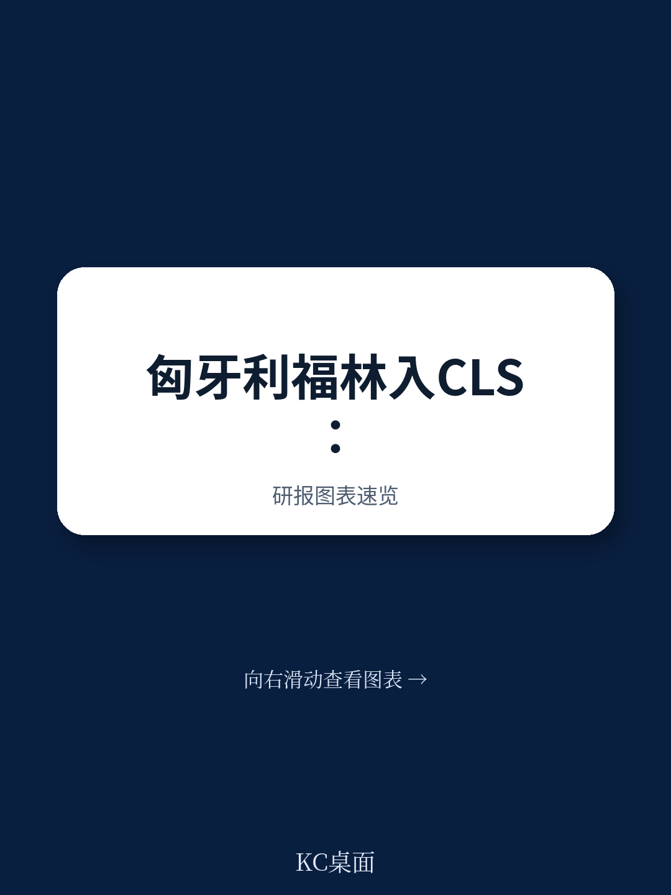
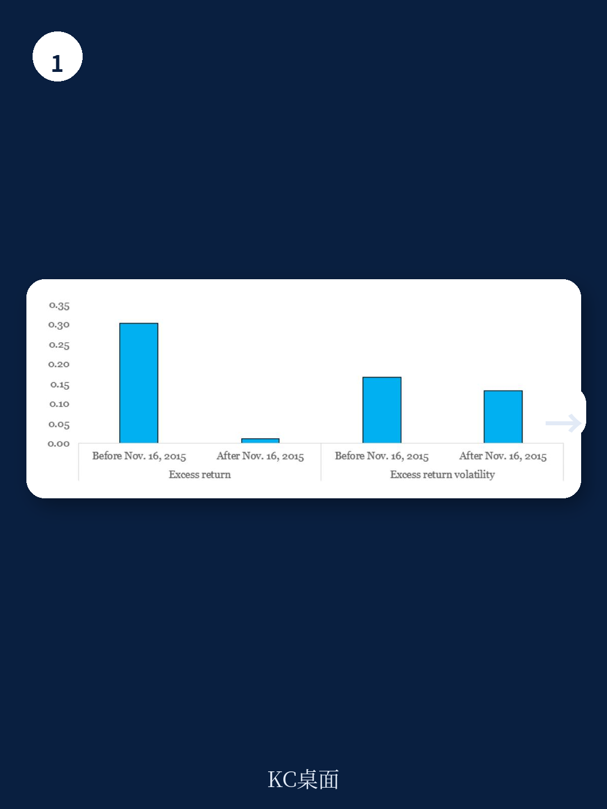
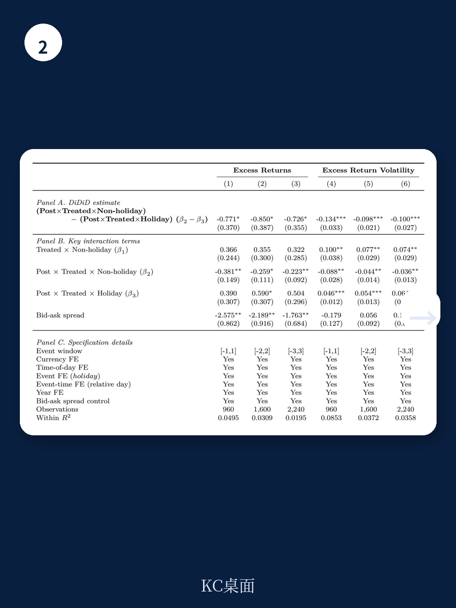

# IMF：货币市场与相关指标观察

2015年11月16日，匈牙利福林（HUF）正式接入持续联系结算系统（CLS），成为中东欧地区首个通过支付对支付（PvP）机制完成外汇结算的货币。IMF三位研究员利用这一准自然实验，首次提供了结算不确定性在汇率定价中被定价的因果证据。

研究采用双重差分法，将匈牙利福林与克罗地亚库纳、捷克克朗、波兰兹罗提、罗马尼亚列伊和塞尔维亚第纳尔五组未接入CLS的中东欧货币进行对比。结果显示，CLS接入后，匈牙利福林的日超额收益下降约10个基点，超额收益波动率同步降低约3.2个百分点。这一变化并非由流动性改善或宏观环境差异驱动——控制买卖价差后，结论依然稳健。

> **KC评论：** 10个基点的超额收益下降，在日均交易量约9.6万亿美元的全球外汇市场中，意味着结算不确定性溢价本身是一个可观测、可定价的摩擦成本。报告通过时间-空间双重安慰剂检验，排除了其他中东欧货币同期发生类似变化的可能性。

## 1. 结算不确定性通过时区敞口机制影响汇率

研究进一步利用美国特定假日作为识别策略。在美国假日期间，中东欧货币的交易对手更多集中于欧洲时区，结算不确定性自然降低。三重差分估计显示，匈牙利福林在接入CLS后，美国假日与非假日之间的超额收益和波动率差异显著缩小。

这一发现支持了结算不确定性通过“时区敞口”影响汇率定价的机制。当交易双方处于不同时区时，结算时间差更长，对手方违约不确定性敞口更大。CLS的PvP机制消除了这一时间差，从而降低了市场参与者要求的不确定性补偿。

## 2. 三角套利偏差收窄，市场效率提升

结算不确定性不仅影响汇率定价，还构成套利摩擦。研究构建了基于欧元-美元-中东欧货币的三角套利偏差指标，检验CLS接入是否降低了套利成本。

结果显示，匈牙利福林相关的三角套利偏差在CLS接入后下降约1.9个基点（一个月窗口），而对照组货币的偏差基本未变。这意味着结算不确定性是限制套利的一个独立来源——当PvP结算消除本金不确定性后，套利者面临的摩擦成本下降，市场定价效率提升。

## 3. 结算基础设施变化对市场微观结构的影响

报告还提供了匈牙利央行数据：从2015年11月16日至2016年3月31日，每日通过CLS结算的匈牙利福林交易量平均约3.37亿美元，峰值达8.51亿美元。虽然这仅占市场总交易量的一部分，但参与结算的主要银行处于银行间交易网络的核心位置，其结算不确定性的降低可能通过交易网络传导至更广泛的市场定价。

这一发现对理解外汇市场微观结构有直接意义。结算不确定性并非仅存在于新兴市场货币——任何涉及跨时区、跨支付系统的交易都面临类似摩擦。CLS目前覆盖18种货币，但大量新兴市场货币仍未接入PvP结算系统。

> **KC评论：** 报告没有讨论未接入CLS的货币是否面临更高的结算不确定性溢价，但这一逻辑链条是清晰的。对于交易量较小、时区跨度大的货币对，结算不确定性可能构成比流动性更显著的定价因子。

For informational purposes only. Portions may be generated,translated,summarized,or edited with AI assistance based on source materials and may contain omissions or errors. Please verify independently. This is not investment,legal,tax,accounting,or other professional advice.

