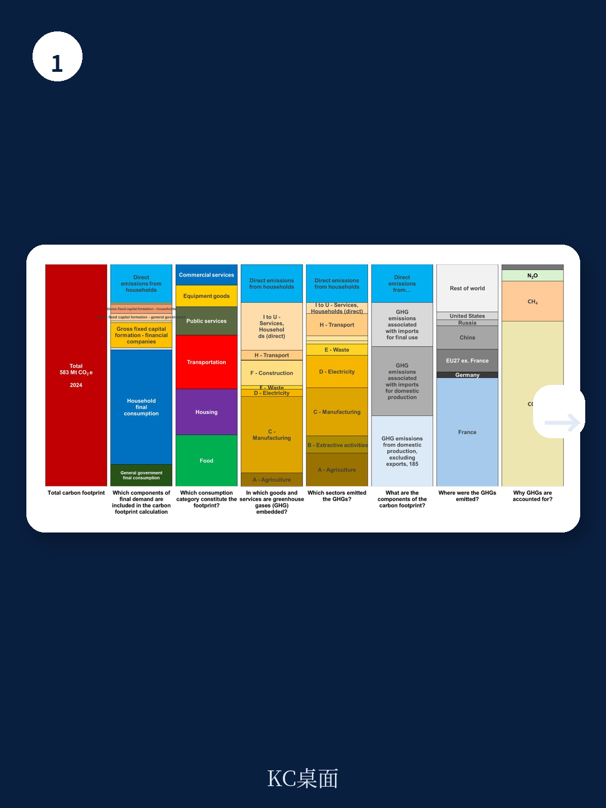
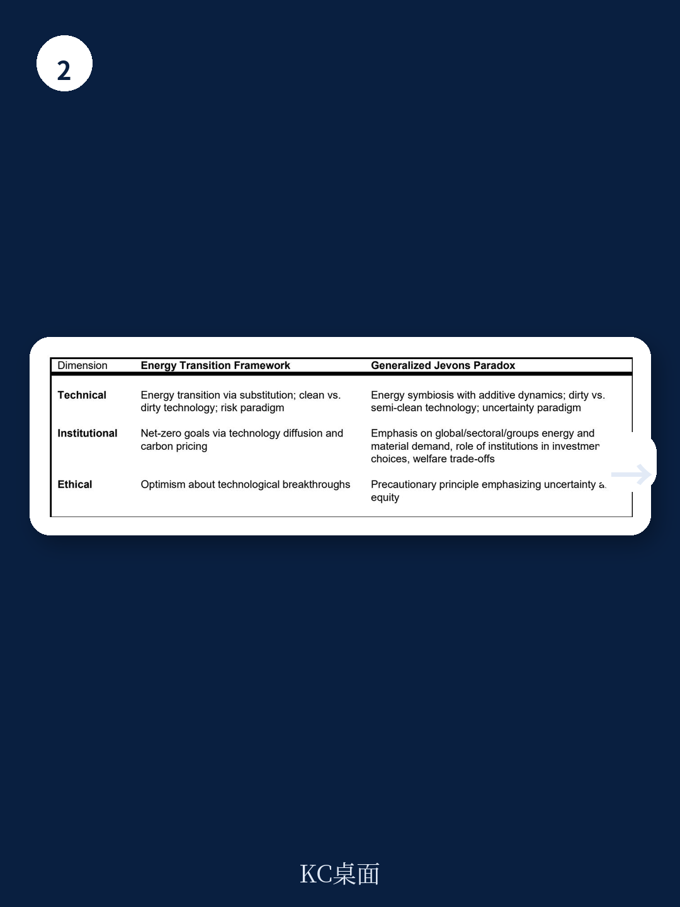

# IMF：能源行业数据与主题变化观察

全球碳排放强度持续下降，但排放总量仍在上升——这一看似矛盾的组合，正是IMF最新工作论文《广义杰文斯悖论与能源的未来》试图解释的核心现象。该论文由William Oman、Etienne Espagne和Jean-Baptiste Fressoz撰写，于2026年7月发布，属于IMF货币与资本市场部门的研究系列。

论文提出了一个关键判断：全球能源与材料流动历史上遵循的是“加法”而非“替代”逻辑。这意味着，清洁能源占比上升并不必然导致化石燃料绝对消费量下降。自2012年以来，全球化石燃料消费总量与排放总量仍在增长，即便可再生能源在电力结构中的份额持续扩大。

这一现象被作者命名为“广义杰文斯悖论”（Generalized Jevons Paradox,GJP）。它不同于传统的杰文斯悖论——后者仅关注效率提升带来的需求反弹——而是将市场力量、地缘宏观环境格局、贸易安排和资金因素纳入分析框架，解释为何全球能源与材料消费呈现结构性粘性。

## 1. 全球能源材料呈现“加法”而非“替代”历史模式

论文通过长期历史数据指出，20世纪和21世纪的技术创新并未导致任何主要能源或材料的绝对消费下降。唯一例外的三种材料是羊毛、石棉和汞。其他所有能源载体和工业材料——从煤炭、石油、天然气到钢铁、水泥、塑料——的全球消费总量均呈上升趋势。

这意味着，所谓“能源转型”在历史尺度上更准确地应被描述为“能源叠加”。新技术的引入并未淘汰旧技术，而是在既有体系之上增加了新的能源和材料需求层。例如，可再生能源基础设施的建设本身需要大量钢铁、水泥和化工产品，而这些产品的生产目前仍高度依赖化石燃料。

报告特别指出，这种加法逻辑在重工业、运输、食品消费和生物燃料生产等领域尤为明显。这些部门的下游材料消费与化石燃料深度绑定，短期内看不到可规模化的零排放替代方案。

> **KC评论：** 读者容易忽略的一点是，报告并非否定可再生能源的增长，而是提醒：清洁电力占比上升与化石燃料绝对消费量下降是两个不同的问题。后者需要全球材料需求总量的结构性调整，而不仅仅是技术替代。

## 2. 资源利用效率与总资源消耗呈正相关

论文的第二个核心实证发现是：在全球尺度上，资源利用效率与总资源消耗之间存在显著的正相关关系。这一关系在能源、水资源和农业氮肥使用等多个领域均得到验证。

作者使用了多种统计方法（OLS回归、中位数分位数回归、Theil-Sen估计量）检验这一关系，结果一致。这意味着，效率提升并未带来资源消耗总量的下降，反而伴随了总量的增长。这一发现挑战了主流能源转型框架的核心假设——即技术进步和效率改善会自动推动脱碳。

报告谨慎指出，这一实证关系不应被解读为宏观环境“定律”，而是一个需要被解释的历史模式。其背后机制包括：效率提升降低了单位服务的成本，刺激了更多消费；全球供应链的扩展使得生产与消费的地理分离，掩盖了实际资源消耗；以及资金和地缘政治因素持续支持化石燃料基础设施的扩张。

## 3. 广义杰文斯悖论的三类驱动因素

论文将GJP的驱动因素归纳为三类：市场与地缘宏观环境力量、贸易安排、以及资金因素。

市场与地缘宏观环境力量方面，化石燃料行业拥有成熟的基础设施、既有的政治影响力和持续的补贴支持。报告引用IMF 2025年数据指出，全球化石燃料补贴规模仍然庞大，这直接影响了研究决策和价格信号。

贸易安排方面，全球价值链使得碳排放和材料消耗在国家和部门之间高度转移。报告以法国、英国和挪威为例，展示了这些国家消费端的温室气体足迹远高于其生产端排放，因为大量高碳商品依赖进口。这意味着，单个国家的“脱碳”可能只是将排放转移到了其他国家。

资金因素方面，报告指出，即便在可再生能源研究快速增长的同时，全球资金体系仍在为化石燃料项目提供大量融资。这种双重研究格局进一步固化了化石燃料在全球生产结构中的位置。

## 4. 对能源转型框架的警示意义

论文的核心政策含义是：以技术替代和碳定价为核心的能源转型框架，可能高估了其实现净零排放的能力。报告认为，在航空、航运、钢铁、水泥、塑料、化肥、农业和建筑等关键部门，短期内不存在可规模化的零排放替代技术。

GJP并不否认技术替代和效率提升的减排作用，但强调这些措施不足以将排放降至零。报告呼吁引入需求侧政策框架，以更好地在部门和国家之间配置能源与材料流动。这涉及复杂的分配问题与政治宏观环境学考量。

论文最后提出了三个未来研究方向：材料在供应链脆弱性中的具体作用、材料流动的政治宏观环境学、以及脱碳情景下的多维福利分析。这些方向指向一个核心问题：如何在维持宏观环境功能的同时，实现能源与材料消费总量的结构性调整。

---

For informational purposes only. Portions may be generated,translated,summarized,or edited with AI assistance based on source materials and may contain omissions or errors. Please verify independently. This is not investment,legal,tax,accounting,or other professional advice.

