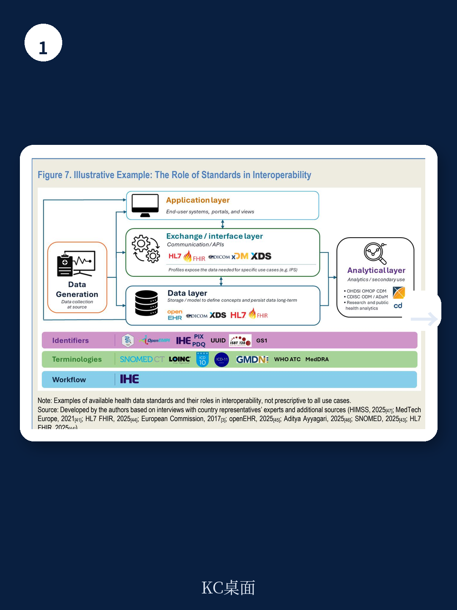
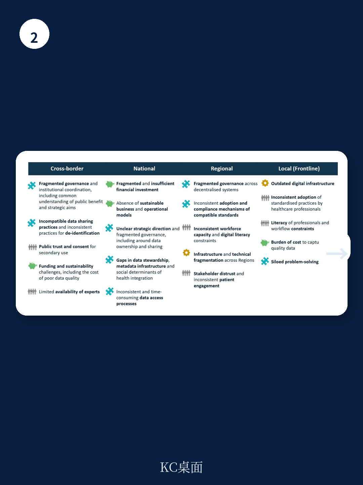

# 经合组织：医疗数据互操作性价值评估

医疗数据互操作性——不同系统、设备和机构之间安全交换、解读和使用数据的能力——在经合组织国家中仍是一个长期未充分实现的目标。该机构最新发布的健康工作论文基于41次专家访谈、22国调查反馈和专题研讨会，系统评估了这一领域的现状与障碍。报告的核心判断是：实现互操作性的价值虽然可观，但技术层面的进展并未解决法律和运营层面的根本瓶颈，真正的挑战在于人、治理和领导力。

报告估算，加拿大、芬兰和英国等国的实证显示，有效的数据互操作性每年可释放相当于卫生支出2.7%至6.6%的宏观环境价值。这些价值来自服务交付优化、错误减少、更及时的治疗、更快的研发以及预防性干预。然而，当前各国面临的结构性障碍同样显著：81.5%的医生认为互操作性不足对患者安全构成潜在不确定性，患者因重复提供信息而对医疗系统的信任度下降15%，诊断错误占医疗成本的约17.5%，其中相当比例与数据互操作不畅相关。

> **KC评论：** 2.7%至6.6%这一区间值得注意。它不是一个精确数字，而是基于不同国家、不同测算方法得出的范围。报告引用这一区间的用意在于说明：互操作性的宏观环境回报足够大，足以支撑系统性投入，但具体数值取决于各国的基线水平和实施路径。

## 1. 技术标准已有进展，但治理和信任仍是主要短板

调查显示，所有受访国家都在使用健康数据标准，41%的国家完全依赖国际标准。报告识别出28种现行标准，涵盖词汇、内容结构、通信、隐私安全和标识符等领域。然而，标准的采用并不等于互操作性的实现。受访者提及最多的障碍包括：不一致的数据共享实践和去标识化做法（70.59%）、区域间基础设施和技术碎片化（66.67%），以及碎片化的治理和机构协调（60.78%）。

报告指出，过去的工作过度集中在技术和语义层面，而法律和运营障碍未得到同等重视。仅有23%的受访国家有立法强制要求基于标准进行健康数据交换。32%的国家已实施国家层面的健康数据标准采用战略或路线图，50%设有专门负责标准采用和使用的国家机构，55%通过国家流程或立法影响供应商对互操作性要求的合规。

## 2. 跨境数据交换正在推进，但覆盖范围有限

45%的受访国家参与了双边国际合作，75%已建立可信健康数据网络。欧盟的欧洲健康数据空间是跨境数据交换的典型制度框架，芬兰的《健康和社会数据二次使用法案》则为数据再利用提供了立法基础。美国的《21世纪治愈法案》则从防止数据封锁的角度推动互操作性。

但报告也指出，跨境数据交换仍处于早期阶段。不同国家的个人标识符体系、数据保护法规和临床术语差异，使得跨境数据流动在操作层面面临大量协调工作。例如，欧洲跨境电子处方项目虽然被用户认为改善了药品可及性，但其覆盖的病种和参与国家仍有限。

## 3. 从“以机构为中心”到“以患者为中心”的系统转型

报告提出了一个值得关注的框架性判断：互操作性的实现需要从满足单个机构需求的信息系统实施，转向以患者为中心的集成数字健康生态系统。在这一系统中，数据能够跟随患者跨越不同护理环节，并在保护措施下为公共利益进行更及时的再利用。

这一转型涉及四个层面：人、流程、政策和技术。报告认为，当前最需要优先推进的是“人”的层面——包括利益相关者的教育、参与和赋权。法国和丹麦通过透明的公民参与和数据使用实践来增强公众信任，澳大利亚则研究于以人为中心的国家标准制定和采用。这些案例表明，技术工具只有在获得信任和治理支撑时才能发挥预期作用。

> **KC评论：** 报告将“人”置于互操作性转型的首位，这一排序本身就是一个判断。它意味着：即使技术标准全部到位，如果医生、患者和政策制定者之间缺乏信任和共同理解，系统仍然无法有效运转。这也是为什么报告强调“共享思维模式”先于“技能集”和“工具集”。

## 4. 可复用的观察框架：互操作性塔

报告提出了一个名为“互操作性塔”的分析框架，将健康数据交换分为四个层级：本地医疗机构、区域（次国家级）组织、国家实践和跨境协作。在每个层级上，都需要评估人、流程、政策和技术四个维度的成熟度。

这一框架的价值在于，它不是一个抽象的理论模型，而是基于26项政策推动因素的具体评估工具。例如，在本地层级，关键推动因素包括医疗工作者的数字素养和数据录入质量；在国家层级，则涉及立法框架、国家数据集目录和供应商合规机制。这种分层评估有助于决策者识别自身系统的薄弱环节，而不是笼统地追求“全面互操作性”。

报告也坦承，当前的分析主要关注推动互操作性的制度和技术条件，尚未系统评估个人健康数据在适当保护下的实际使用情况。这将是后续研究需要填补的空白。

For informational purposes only. Portions may be generated,translated,summarized,or edited with AI assistance based on source materials and may contain omissions or errors. Please verify independently. This is not investment,legal,tax,accounting,or other professional advice.

