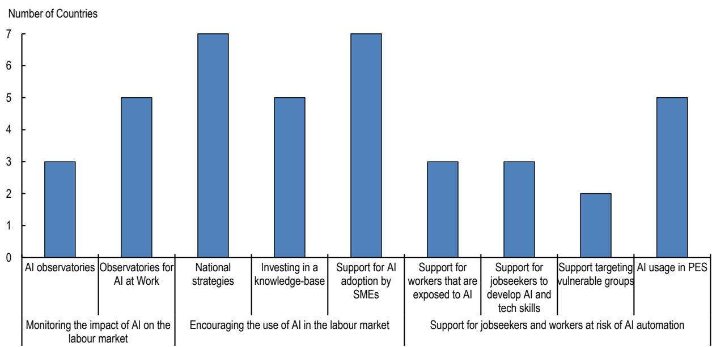
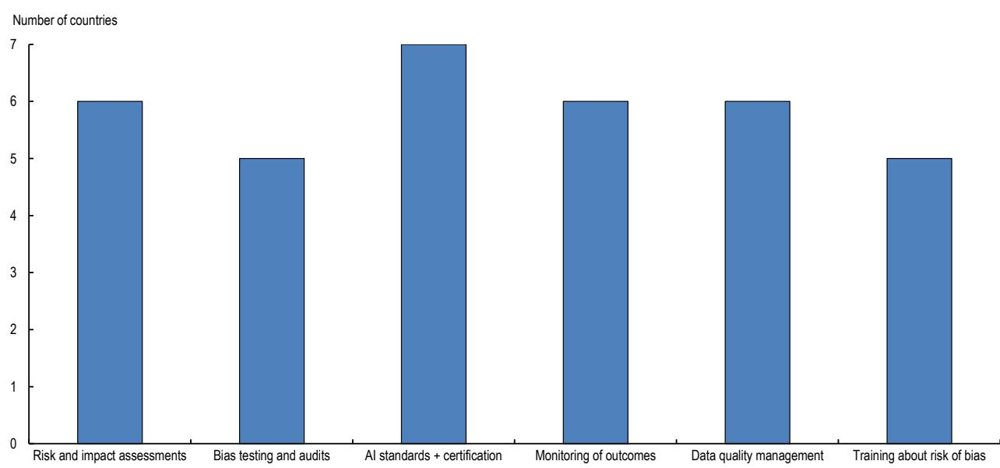

# RECENT POLICY DEVELOPMENTS ON AI IN THE LABOUR MARKET

OECD ARTIFICIAL
INTELLIGENCE PAPERS
July 2026 No. 63

OECD Artificial Intelligence Papers

# Recent policy developments on AI in the labour market

## Disclaimers

This work is issued under the responsibility of the Secretary-General of the OECD and does not necessarily reflect the official views of OECD Member countries.

This document, as well as any data and map included herein, are without prejudice to the status of or sovereignty over any territory, to the delimitation of international frontiers and boundaries and to the name of any territory, city or area.

Cover image: © Kjpargeter/Shutterstock.com

© OECD 2026

## Attribution 4.0 International (CC BY 4.0)

This work is made available under the Creative Commons Attribution 4.0 International licence. By using this work, you accept to be bound by the terms of this licence (https://creativecommons.org/licenses/by/4.0).

Attribution – you must cite the work.

Translations – you must cite the original work, identify changes to the original and add the following text: In the event of any discrepancy between the original work and the translation, only the text of original work should be considered valid.

Adaptations – you must cite the original work and add the following text: This is an adaptation of an original work by the OECD. The opinions expressed and arguments employed in this adaptation should not be reported as representing the official views of the OECD or of its Member countries.

Third-party material – the licence does not apply to third-party material in the work. If using such material, you are responsible for obtaining permission from the third party and for any claims of infringement.

You must not use the OECD logo, visual identity or cover image without express permission or suggest the OECD endorses your use of the work.

Any dispute arising under this licence shall be settled by arbitration in accordance with the Permanent Court of Arbitration (PCA) Arbitration Rules 2012. The seat of arbitration shall be Paris (France). The number of arbitrators shall be one.

# Recent policy developments on AI in the labour market

Artificial intelligence (AI) is increasingly shaping labour markets, bringing both significant opportunities and risks for workers, firms and societies, and making it a growing policy priority. This publication reviews recent policy measures related to AI in the labour market in G7 countries, the European Union and selected Latin American economies across six policy areas: automation, productivity, skills and opportunities; privacy and data protection; non-discrimination; occupational safety and health; transparency, explainability and accountability; and social dialogue. Across most policy areas, AI-related issues are primarily addressed through existing labour market policy frameworks, rather than through stand-alone AI policies. Policies explicitly targeted at AI in the labour market are most developed for AI skills and adoption, while measures and guidance are still emerging in other policy areas, particularly privacy, transparency and accountability.

Keywords: Artificial Intelligence, Employment.
JEL Codes: J2, J5, J7, J8, M1, M5.

L'intelligence artificielle (IA) imprime de plus en plus fortement sa marque sur les marchés du travail, apportant des possibilités, mais aussi des risques, pour les travailleurs, les entreprises et les sociétés, et s'impose de ce fait comme une priorité pour les pouvoirs publics. La présente publication passe en revue les récentes mesures de politique publique en rapport avec l'IA sur le marché du travail que les pays du G7, l'Union européenne et quelques économies d'Amérique latine ont prises dernièrement dans six domaines, à savoir : l'automatisation, la productivité, les compétences et l'inclusivité ; la protection de la vie privée et des données ; la non-discrimination ; la sécurité et la santé au travail ; la transparence, l'explicabilité et la responsabilité ; le dialogue social. Dans la plupart de ces domaines, les questions touchant à l'IA sont traitées principalement dans le périmètre des cadres d'action applicables au marché du travail préexistants au lieu de faire l'objet de mesures spécifiques. Les dispositifs les plus aboutis visant explicitement l'IA sur le marché du travail ont trait aux compétences requises et à l'adoption de l'IA ; dans d'autres domaines, en particulier la protection de la vie privée, la transparence et la responsabilité, la définition de mesures reste à un stade plus précoce.

Künstliche Intelligenz (KI) prägt die Arbeitsmärkte zunehmend und bringt sowohl wichtige Chancen als auch Risiken für Arbeitnehmer, Unternehmen und die Gesellschaft insgesamt mit sich, und wird damit zu einer wachsenden politischen Priorität. Diese Veröffentlichung gibt einen Überblick über jüngste politische Maßnahmen im Zusammenhang mit KI auf den Arbeitsmärkten in den G7-Ländern, der Europäischen Union sowie ausgewählten lateinamerikanischen Volkswirtschaften in sechs Politikfeldern: Automatisierung, Produktivität, Kompetenzen und Inklusion; Privatsphäre und Datenschutz; Nichtdiskriminierung; Sicherheit und Gesundheitsschutz am Arbeitsplatz; Transparenz, Erklärbarkeit und Rechenschaftspflicht sowie Sozialdialog. In den meisten dieser Politikfelder werden KI-bezogene Themen statt durch eigenständige, KI-spezifische Strategien vorwiegend im Rahmen bestehender arbeitsmarktpolitischer Instrumente behandelt. Politische Maßnahmen, die sich ausdrücklich auf KI im Arbeitsmarkt beziehen, sind in den Bereichen Kompetenzen und Einführung von KI am weitesten fortgeschritten, während sich Maßnahmen und Leitlinien in anderen Bereichen – insbesondere hinsichtlich Datenschutz, Transparenz und Rechenschaftspflicht – noch in der Entwicklung befinden.

# Acknowledgements

This publication contributes to the OECD's Artificial Intelligence in Work, Innovation, Productivity and Skills (AI-WIPS) programme, which provides policymakers with new evidence and analysis to keep abreast of the fast-evolving changes in AI capabilities and diffusion and their implications for the world of work. The programme aims to help ensure that adoption of AI in the world of work is effective, beneficial to all, people-centred and accepted by the population at large. AI-WIPS is supported by the German Federal Ministry of Labour and Social Affairs (BMAS) and will complement the work of the German AI Observatory in the Ministry's Policy Lab Digital, Work & Society. For more information, visit https://oecd.ai/work-innovation-productivity-skills and https://denkfabrik-bmas.de/.

This work was carried out by Annikka Lemmens under the supervision of Angelica Salvi Del Pero in the OECD Directorate for Employment, Labour and Social Affairs. The report benefited from comments by colleagues in the Directorate for Employment, Labour and Social Affairs, including Glenda Quintini and Stijn Broecke from the Skills and Future Readiness Division, Sandrine Cazes from the Jobs and Income Division, as well as colleagues Giuseppe Bianco, Celine Caira, Sergi Gálvez Duran, Christina Michelakaki, Christian Reimsbach-Kounatze, and Limor Shmerling Magazanik in the Directorate for Science, Technology and Innovation.

The report also benefited from inputs provided by delegates to the OECD Employment, Labour and Social Affairs Committee (ELSAC) and by representatives of Business at OECD (BIAC) and the Trade Union Advisory Committee to the OECD (TUAC).

Federal Ministry

of Labour and Social Affairs

## Table of contents

Résumé 4
Abstract 5
Acknowledgements 6
Executive summary 9
Synthèse 11
Zusammenfassung 13
1 Introduction 15
2 Automation, productivity, skills and opportunities 16
Monitoring the impact of AI on the labour market 17
Encouraging the use of AI 18
Skills development 20
Other types of support and AI in employment services 21
3 Privacy and data protection 23
Privacy and data protection frameworks 23
Assessments and certification 27
Security measures and privacy safeguards 27
Promoting compliance 28
4 Non-discrimination in the labour market 30
AI tools to prevent discrimination and promote accessibility 31
Non-discrimination frameworks 31
Assessments, audits, data quality management, certification and training 32
Promoting compliance 35
5 Occupational Safety and Health 36
Promoting the development of AI tools for OSH 36
Monitoring the impact of AI on OSH 37
OSH framework 37
Risk assessments, certification, and raising awareness 38
Promoting compliance 38

## 8

6 Transparency, explainability and accountability 39  
Transparency, explainability, accountability frameworks 39  
Human oversight, pathways for redress, and traceability 41  
Promoting compliance 43  

7 Social dialogue 44  
Promoting social dialogue 44  
Ensuring social partners' AI expertise 48  

8 Policy directions 50  

References 51  

Notes 63

## FIGURES

Figure 1. G7 countries use a range of policy measures to monitor AI's impacts, promote adoption, and support workers 17  
Figure 2. All G7 countries recommend or require measures to address bias and discrimination 30

## TABLES

Table 1. Common principles guiding the use of data in the workplace 25
Table 2. The involvement of workers in OSH is recommended or required in all jurisdictions, but their input is not always needed for the introduction of new technologies 47

# Executive summary

As artificial intelligence (AI) technologies become increasingly embedded in the workplace and labour markets, ensuring their trustworthy and responsible use so as to foster their benefits while addressing possible risks, is a policy priority for many countries. This paper provides a comparative review of policy measures recently adopted in G7 countries and at the EU level, as well as in some Latin American countries (Chile, Colombia, Costa Rica, and Mexico) combining information gathered through desk research, information collected through a dedicated questionnaire to G7 countries and the EU, and exploratory work using AI prompt engineering.

The review covers six broad policy areas that, in line with the OECD AI Principles, are identified as priority for the use of AI in the labour market in OECD work as well as by the G7 Action plan for a human-centred development and use of safe, secure and trustworthy AI in the World of Work. These areas are: (1) automation, productivity, skills and opportunities; (2) privacy and data protection; (3) non-discrimination; (4) occupational safety and health; (5) transparency, explainability and accountability; and (6) social dialogue.

The review finds that all surveyed countries promote AI adoption through broad national strategies, often complemented by research and experimental initiatives, including regulatory sandboxes, to build knowledge and test new approaches. Nearly all surveyed countries provide targeted support for small and medium-sized enterprises (SMEs), for example through financial incentives and training opportunities delivered at the national or regional level. Several countries have established observatories dedicated to AI in the workplace, providing targeted insights into emerging challenges and helping to identify trends at an early stage. To assist workers displaced by AI, countries tend to rely on standard employment support policies and social protection not targeted on AI. Relatively few measures are directed at workers who remain in employment but are at high risk of AI-related disruption, although some promising examples are emerging. All surveyed countries provide reskilling and upskilling programmes, sometimes developed in partnership with private sector actors. Most programmes focus on technical skills, not on general AI literacy. Governments are also increasingly using AI in public employment services to personalise assistance and improve job matching.

In the areas of privacy, data protection, non-discrimination and occupational safety and health, countries covered in this publication are, first of all, making use of existing frameworks to ensure that the adoption and use of AI in the labour market takes place in a trustworthy way. Many provide additional guidance and tools to clarify how these frameworks apply in practice, for example through workshops, guidelines or self-check instruments that help employers understand their obligations. In addition, some countries and jurisdictions are introducing new laws to address these issues. Across these areas, risk assessments are recommended or required by all countries surveyed, while certifications, audits and security measures are also widely recommended or required.

Surveyed countries are also advancing policies to promote transparency, explainability and accountability when AI systems are used in the workplace. In most surveyed countries, employers are required or encouraged to share information about the use of AI with workers, in others also with job applicants, and in a few cases, there are explicit rules for platform workers. Human oversight and traceability are other important accountability measures that are highlighted in the majority of frameworks that, in several countries, are supported by designated roles for oversight, clear pathways for contesting decisions, and documentation or logging requirements to enable review.

Surveyed countries promote social dialogue on AI in the labour market mainly through collaboration with social partners in shaping national policies, consultation and representation mechanisms at company level (especially on Occupational Safety and Health), and the negotiation of collective bargaining agreements. Relatively few countries are investing in building AI expertise among social partners.

Looking ahead, some policy areas could benefit from further development. For example, the implications of data protection and privacy frameworks for workers and for AI systems in the labour market are not always clearly defined or explained to employers. Transparency, explainability and accountability often remain at the level of broad principles in AI strategies. More detailed and practical guidance could help employers and workers apply these principles in practice, for instance through sector-specific examples, case studies or self-assessment tools. Social dialogue and collective bargaining can help address practical challenges linked to the use of AI in the labour market and support compliance. With time, countries will also benefit from evaluating existing policy measures and assessing whether existing government guidance is used effectively and succeeds in improving workplace outcomes.

À l'heure où les technologies d'intelligence artificielle (IA) tendent à se faire de plus en plus présentes sur les lieux de travail et sur les marchés du travail, veiller à ce qu'elles soient employées de manière responsable et digne de confiance afin d'en maximiser les avantages et d'en maîtriser les risques éventuels devient une priorité stratégique pour de nombreux pays. Le présent document contient une étude comparative des mesures prises dernièrement par les pays du G7 et par l'Union européenne, ainsi que par quelques pays d'Amérique latine (Chili, Colombie, Costa Rica et Mexique), à partir d'informations réunies dans le cadre de recherches documentaires, de renseignements recueillis à l'aide d'un questionnaire spécifique adressé aux pays du G7 et à l'UE et de travaux exploratoires ayant fait appel à l'ingénierie des requêtes.

L'étude porte sur six grands aspects intéressant l'action des pouvoirs publics et considérés comme prioritaires dans le cadre des travaux que l'OCDE consacre à l'utilisation de l'IA sur le marché du travail, conformément à ses Principes sur l'IA ainsi qu'au Plan d'action du G7 en faveur d'une IA centrée sur l'humain, sûre et digne de confiance dans le monde du travail. Ces aspects sont les suivants : 1) automatisation, productivité, compétences et inclusivité ; 2) protection de la vie privée et des données ; 3) non-discrimination ; 4) sécurité et santé au travail ; 5) transparence, explicabilité et responsabilité ; 6) dialogue social.

Il ressort de cette étude que tous les pays étudiés soutiennent l'adoption de l'IA au moyen de vastes stratégies nationales souvent complétées par des travaux de recherche et des initiatives expérimentales, notamment des bacs à sable réglementaires, pour réunir de nouvelles connaissances et tester de nouvelles approches. Pratiquement tous les pays étudiés ont apporté une aide ciblée aux petites et moyennes entreprises (PME), sous forme, par exemple, d'incitations financières et de formations proposées à l'échelon national ou régional. Plusieurs pays ont créé un observatoire de l'IA sur le lieu de travail, qui apporte des éclairages précis sur les nouveaux enjeux qui se profilent et aide à déceler les nouvelles tendances dès un stade précoce. Pour accompagner les travailleurs que l'IA remplace, les pays tendent à faire appel à des mesures classiques de soutien à l'emploi et de protection sociale qui ne sont pas spécifiques à l'IA. Il existe relativement peu de dispositifs à l'intention des travailleurs qui ont conservé leur emploi, mais demeurent fortement exposés aux perturbations causées par l'IA, même si quelques exemples prometteurs commencent à venir au jour. Tous les pays étudiés disposent de programmes de reconversion et de perfectionnement des compétences, définis parfois en partenariat avec des acteurs du secteur privé. La plupart de ces programmes s'articulent autour de compétences techniques et non sur la maîtrise de l'IA de manière générale. Les pouvoirs publics font par ailleurs un usage croissant de l'IA dans le cadre des services publics de l'emploi afin de personnaliser l'accompagnement et d'améliorer l'adéquation entre l'offre et la demande d'emploi.

S'agissant de la protection de la vie privée et des données, de la non-discrimination et de la sécurité et santé au travail, pour faire en sorte que l'adoption et l'utilisation de l'IA sur le marché du travail se déroulent d'une manière qui inspire confiance, les pays étudiés dans la présente publication ont recours, en premier lieu, aux cadres existants. Beaucoup fournissent des directives et des outils supplémentaires afin de préciser comment appliquer ces cadres en pratique, par exemple à l'occasion d'ateliers ou sous forme de lignes directrices et d'instruments d'autoévaluation aidant les employeurs à comprendre quelles sont leurs obligations. Quelques pays et territoires adoptent en outre de nouvelles lois pour s'occuper de ces questions. Tous les pays considérés recommandent ou exigent la réalisation d'évaluations des risques, et la plupart en fait autant avec les certifications, audits et mesures de sécurité à l'égard de tous les aspects énumérés plus haut, t.

Les pays étudiés prennent en outre des mesures afin de promouvoir la transparence, l'explicabilité et la responsabilité des systèmes d'IA utilisés dans la sphère professionnelle. La majorité d'entre eux obligent ou encouragent les employeurs à communiquer des informations sur l'utilisation de l'IA à leur personnel, ainsi qu'aux candidats à l'embauche pour certains, et une petite minorité a défini des règles explicites en ce qui concerne les travailleurs des plateformes. La supervision humaine et la traçabilité sont d'autres mesures importantes de responsabilité prévues dans la majorité des cadres qui, dans plusieurs pays, s'accompagnent de la désignation d'instances de supervision, de la définition de voies de recours claires contre les décisions et de l'obligation de produire documentation ou journaux pour permettre un réexamen de systèmes d'IA.

Les pays étudiés soutiennent le dialogue social au sujet de l'IA sur le marché travail principalement par la collaboration avec les partenaires sociaux aux fins de la formulation de politiques nationales, par les mécanismes de consultation et de représentation au sein des entreprises (principalement dans le domaine de la sécurité et de la santé au travail) et par la négociation d'accords collectifs. Ils sont relativement peu nombreux à consacrer des moyens au renforcement de l'expertise en IA chez ces partenaires.

Certains domaines d'action mériteraient de se voir consacrer davantage de moyens dans le futur. L'incidence des cadres de protection des données et de la vie privée sur les travailleurs et sur les systèmes d'IA sur le marché du travail, par exemple, n'est pas toujours clairement définie ou expliquée aux employeurs. La transparence, l'explicabilité et la responsabilité demeurent souvent de grands principes inscrits dans les stratégies en matière d'IA. Des indications plus détaillées et concrètes aideraient les employeurs et les travailleurs à les mettre en pratique et pourraient entre autres prendre la forme d'exemple, d'études de cas ou d'outils d'autoévaluation spécifiques à chaque secteur. Le dialogue social et la négociation collective peuvent contribuer à surmonter les obstacles pratiques auxquels se heurte l'utilisation de l'IA sur le marché du travail et favoriser la mise en conformité. Avec le temps, les pays trouveront également intérêt à évaluer les mesures en place et à déterminer si les orientations données par les pouvoirs publics sont suivies d'effet et permettent bien d'améliorer la situation sur les lieux de travail.

# Zusammenfassung

Da Technologien der künstlichen Intelligenz (KI) zunehmend am Arbeitsplatz und in den Arbeitsmärkten verankert werden, stellt die Gewährleistung ihrer vertrauenswürdigen und verantwortungsvollen Nutzung mit dem Ziel, die Vorteile der KI zu fördern und gleichzeitig mögliche Risiken anzugehen, für viele Länder eine politische Priorität dar. Dieser Artikel bietet einen vergleichenden Überblick über die politischen Maßnahmen, die kürzlich in den G7-Ländern und auf EU-Ebene sowie in einigen lateinamerikanischen Ländern (Chile, Kolumbien, Costa Rica und Mexiko) ergriffen wurden, und verknüpft Informationen, die durch Schreibtischforschung, einen speziellen Fragebogen für G7-Länder und für die EU sowie durch exploratorische Forschung mithilfe von KI-Prompt-Engineering gesammelt wurden.

In dem Bericht werden sechs große Politikbereiche abgedeckt, die – im Einklang mit den KI-Grundsätzen der OECD – in OECD-Arbeiten sowie im G7-Aktionsplan für eine menschenorientierte Entwicklung und die Nutzung sicherer und vertrauenswürdiger KI in der Arbeitswelt als vorrangig für den Einsatz von KI auf dem Arbeitsmarkt eingestuft werden. Diese Bereiche sind: (1) Automatisierung, Produktivität, Qualifikationen und Inklusivität, (2) Privatsphäre und Datenschutz, (3) Nichtdiskriminierung, (4) Sicherheit und Gesundheitsschutz am Arbeitsplatz, (5) Transparenz, Erklärbarkeit und Rechenschaftspflicht und (6) sozialer Dialog.

Die Überprüfung ergab, dass alle Länder die Einführung von KI durch breit angelegte nationale Strategien fördern, die häufig durch Forschungs- und experimentelle Initiativen, auch in Reallaboren, ergänzt werden, um Wissen aufzubauen und neue Ansätze zu testen. Nahezu alle Länder bieten gezielte Unterstützung für kleine und mittlere Unternehmen (KMU), zum Beispiel durch finanzielle Anreize und Ausbildungsmöglichkeiten auf nationaler oder regionaler Ebene. Mehrere Länder haben Beobachtungsstellen eingerichtet, die sich mit KI am Arbeitsplatz befassen, indem sie gezielte Einblicke in neue Herausforderungen bieten und dabei helfen, Trends frühzeitig zu erkennen. Zur Unterstützung von durch KI von ihrem Arbeitsplatz verdrängten Arbeitnehmern wenden die meisten Länder tendenziell standardisierte Strategien zur Beschäftigungsförderung und zum Sozialschutz an, die nicht speziell auf KI ausgerichtet sind. Relativ wenige Maßnahmen richten sich an Arbeitnehmer, die weiterhin erwerbstätig sind, aber einem hohen Risiko KI-bedingter Störungen ausgesetzt sind, obwohl auch hier einige erfolgsversprechende Maßnahmen zu erkennen sind. Alle untersuchten Länder bieten Umschulungs- und Weiterbildungsprogramme an, die manchmal in Zusammenarbeit mit privatwirtschaftlichen Akteuren entwickelt wurden. Bei den meisten Programmen stehen technische Fähigkeiten, nicht allgemeine KI-Kenntnisse im Vordergrund. Auch in öffentlichen Arbeitsvermittlungen nutzen die Staaten zunehmend KI, um die Unterstützung zu personalisieren und das Jobmatching zu verbessern.

In den Bereichen Privatsphäre, Datenschutz, Nichtdiskriminierung und Sicherheit und Gesundheitsschutz am Arbeitsplatz nutzen die in dieser Veröffentlichung behandelten Länder zunächst einmal bestehende Rahmenwerke, um sicherzustellen, dass die Einführung und Nutzung von KI auf dem Arbeitsmarkt auf vertrauenswürdige Weise erfolgt. Viele bieten zusätzliche Leitlinien und Instrumente, um darzulegen, wie diese Rahmenwerke in der Praxis angewandt werden, beispielsweise durch Workshops, Leitlinien oder Instrumente zur Selbstkontrolle, die Arbeitgeber dabei unterstützen, ihre Verpflichtungen zu verstehen. Darüber hinaus führen einige Länder und Gerichtsbarkeiten neue Gesetze ein, um diese Probleme anzugehen. In diesen Bereichen werden Risikobewertungen von allen untersuchten Ländern empfohlen oder verlangt, während Zertifizierungen, Audits und Sicherheitsmaßnahmen ebenfalls allgemein empfohlen oder verlangt werden.

Außerdem treiben die Länder Maßnahmen zur Förderung von Transparenz, Erklärbarkeit und Rechenschaftspflicht voran, wenn KI-Systeme am Arbeitsplatz eingesetzt werden. In den meisten untersuchten Ländern sind die Arbeitgeber verpflichtet oder angehalten, Informationen über den Einsatz von KI mit Arbeitnehmern – in einigen Ländern auch mit Bewerbern – auszutauschen, und in einigen wenigen Fällen gibt es ausdrückliche Regelungen für Plattformarbeiter. Menschliche Aufsicht und Rückverfolgbarkeit sind weitere wichtige Maßnahmen zur Rechenschaftspflicht, die in den meisten Rahmenwerken hervorgehoben werden und in mehreren Ländern durch festgelegte Aufsichtsfunktionen, klare Wege für die Anfechtung von Entscheidungen und Dokumentations- oder Protokollierungsanforderungen zur Ermöglichung einer Überprüfung unterstützt werden.

Die Länder fördern den sozialen Dialog über KI auf dem Arbeitsmarkt vor allem durch die Zusammenarbeit mit den Sozialpartnern bei der Gestaltung der nationalen Politik, durch Konsultations- und Vertretungsmechanismen auf Unternehmensebene (insbesondere im Bereich Sicherheit und Gesundheitsschutz am Arbeitsplatz) und durch die Aushandlung von Tarifverträgen. Relativ wenige Länder investieren in den Aufbau von KI-Fachwissen von Sozialpartnern.

Mit Blick auf die Zukunft könnten einige Politikbereiche durchaus von weiteren Maßnahmen profitieren. So werden beispielsweise die Auswirkungen von Rahmenwerken zum Datenschutz und zum Schutz der Privatsphäre für Arbeitnehmer und für KI-Systeme auf dem Arbeitsmarkt nicht immer klar definiert oder den Arbeitgebern erklärt. Transparenz, Erklärbarkeit und Rechenschaftspflicht gehen in KI-Strategien häufig nicht über die Ebene allgemeiner Grundsätze hinaus. Ausführlichere und praxisbezogenere Leitlinien könnten Arbeitgeber und Arbeitnehmer dabei unterstützen, diese Grundsätze in der Praxis anzuwenden, beispielsweise durch die Darstellung von sektorspezifischen Beispielen, Fallstudien oder Instrumenten zur Selbstbewertung. Der soziale Dialog und Tarifverhandlungen können dazu beitragen, praktische Herausforderungen im Zusammenhang mit dem Einsatz von KI auf dem Arbeitsmarkt anzugehen und die Einhaltung der Vorschriften zu unterstützen. Mit der Zeit werden die Länder auch von der Evaluierung bestehender politischer Maßnahmen und von Bewertungen profitieren, in denen geprüft wird, ob die bestehenden staatlichen Leitlinien effektiv genutzt werden und erfolgreich zur Verbesserung der Arbeitsergebnisse beitragen.

## 1 Introduction

Artificial intelligence (AI) is a transformative technology with the potential to reshape the labour market. AI is diffusing rapidly in the workplace. OECD data show that the share of businesses with at least ten employees using AI grew from just over 5% in 2020 to around 14% in 2024 across OECD countries (OECD, 2025[1]). Early AI development centred on general computational tasks, including pattern recognition, prediction and problem solving. Its use has since expanded to domain-specific applications in workplaces, such as recruitment, customer service, workforce scheduling and training. Recent OECD analysis reports that generative AI already shows the main characteristics of a general-purpose technology, namely pervasiveness, continuous improvement over time and the capacity to generate further innovation, suggesting that it could support broader productivity gains across many sectors and occupations. The emergence of generative AI has further broadened its reach, arguably making it a general-purpose technology with potential implications for many sectors and occupations (Calvino, Haerle and Liu, 2025[2]).

The OECD estimates that 27% of employment in OECD countries is in occupations with a high risk of automation from all automating technologies (OECD, 2023[3]). Some of these occupations will transform to perform other functions, some will decline and others will be created, rapidly changing the tasks of many workers, and the skills that are in demand in the labour market. The adoption of AI in the labour market is also bringing benefits in terms of performance and job quality: four in five workers say AI improves their performance, and many note that it increases their enjoyment at work (Lane, Williams and Broecke, 2023[4]). In a recent OECD survey, a majority of managers (60%) report that algorithmic management has improved the quality of their decision making (Milanez, Lemmens and Ruggiu, 2025[5]). At the same time, some workers express worries about job displacement, downward pressure on wages, and increased work intensity, as well as issues related to fairness, transparency and data collection and use. In the survey of algorithmic management, 27% of managers report difficulties in understanding the decisions or recommendations made by algorithmic management software.

Managing this change requires future-ready and resilient labour markets to help workers and employers benefit from the opportunities created by AI, including by addressing the associated risks and ensuring that the benefits of AI reach both large and small firms and workers across different regions, sectors, skill levels and socio-demographic groups. This publication presents a compendium of recent policy responses that countries have taken in response to the introduction of AI in the labour market, drawing on examples from G7 countries, as well as from the EU, Costa Rica, Mexico, Colombia and Chile. The aim is not to be exhaustive, but rather to illustrate the range of policy responses that have been developed to date.

The paper is organised around six policy areas that have been identified as important for promoting a trustworthy use of AI in the labour market, in line with the OECD AI principles and the G7 Action Plan for a human-centred development and use of safe, secure and trustworthy AI in the World of Work (OECD, 2023[3]; G7, 2024[6]; OECD, 2024[7]). The data collection for this paper combines several sources: desk research and analysis of existing data, information collected through a dedicated questionnaire to G7 countries and the EU, and exploratory work using AI prompt engineering to complement this data.

# 2 Automation, productivity, skills and opportunities

AI is a transformative technology with the potential to create and reshape jobs, increase efficiency and productivity in the workplace. For example, recent OECD analysis suggests that over a ten-year horizon AI could raise annual labour productivity growth by 0.4 to 1.3 percentage points (p.p.) in the United States and the United Kingdom (Filippucci et al., 2025[8]). Productivity gains from adopting AI are not automatic but depend for example investments in skills, organisational change and managerial capabilities, alongside supportive innovation systems, adequate digital infrastructure, and institutional readiness (Calvino, Costa and Haerle, 2026[9]; OECD, 2023[10]).

However, not every economy – nor every person or firm within each economy – is equally well placed to benefit from these opportunities. Projected gains in other G7 economies are smaller, ranging from 0.2 in Japan to 0.8 in Italy for example, reflecting differences in sectoral specialisation and the expected pace of diffusion. Small and medium-sized enterprises (SMEs), often face barriers in adopting AI, including unsuitability to the SME's work (57.3%); concerns about copyright, legal or regulatory issues (54.1%) and about what happens to the information fed into generative AI models (52.5%); and lack of skills among employees (49.8%) (OECD, 2025[11]). These challenges lead to different AI adoption rates between companies: 40% of firms in the OECD with 250 or more employees were using AI in 2024, 20% of firms of between 50 to 249 employees and only 12% of firms with between 10 and 49 employees used AI (OECD, 2025[1]). Additionally, the tasks of many workers, and the skills required in demand in the labour market, are going to be transformed. 27% of jobs in the OECD are considered as at high risk of automation from AI and other technologies in the coming decade (OECD, 2023[3]). Certain workers may be more impacted than others, depending on their occupation, skill level, or socio-economic status. For instance, women are overrepresented in clerical occupations, which are at higher risk of automation by AI (OECD, 2024[12]).

At the same time, AI has the potential to help people with disabilities operate on the labour market. For instance, Touzet (2023[13]) interviewed over 70 stakeholders and identified 142 examples of AI-powered solutions to support people with disability, and employers in the OECD AI Surveys of the finance and manufacturing sectors were more than 4 times as likely to say that AI would help workers with disabilities as to say that it would harm them (Lane, Williams and Broecke, 2023[4]).

The data collected for this publication shows that all nine countries covered in this section (G7 countries, Costa Rica and Mexico) promote the adoption of AI through national strategies, and nearly all complement these with targeted measures to support uptake by SMEs. Five of the nine countries established observatories to track the impact of AI on the labour market.

Countries support jobseekers and individuals who lost their jobs due to AI automation through the general assistance offered to the unemployed, but several surveyed countries also provide targeted support to workers most exposed to automation risks and offer programmes to help jobseekers acquire AI- and technology-related skills to better navigate the changing labour market. Public employment services use AI as a way to support jobseekers through improved job matching and more tailored services in six of the surveyed countries. These efforts are summarised in Figure 1 (for G7 countries only to ensure comparability across sections).

Figure 1. G7 countries use a range of policy measures to monitor AI's impacts, promote adoption, and support workers  
  
Note: Countries covered in this graph are Canada, France, Germany, Italy, Japan, the UK, and the US. International initiatives are not counted.

## Monitoring the impact of AI on the labour market

All countries covered in this research have institutions that, occasionally or regularly, monitor the impact of AI on the labour market. In most countries this is done by statistical organisations, ministries, and labour research bodies such as Statistics Canada; Directorate for Research, Studies and Statistics (DARES) and the Economic, Social and Environmental Council for France; the Federal Ministry of Labour and Social Affairs and the Institute for Employment Research (IAB) in Germany; the National Institute for Public Policy Analysis (INAPP) and the National Council for Economy and Labour in Italy; the Japan Institute for Labour Policy and Training (JILPT) and the Economic and Social Research Institute (ESRI) in Japan; the Observatorio Laboral and National Institute of Statistics and Geography (INEGI) in Mexico; the Bureau of Labor Statistics in the United States and Eurofound and the Joint Research Centre (JRC) at the EU level.

Several countries have also established observatories that focus on AI and digital systems in the labour market more specifically. These bodies conduct applied research, track workplace-level developments, and are often able to provide direct input into labour market policy. The United States, for example, have announced the establishment of an AI Workforce Hub, which will address skills and capacity needs and monitor and address impacts on the labour market (Government of the USA, 2025[14]). In France, LaborIA is a government-supported public research-action initiative that brings together researchers and public authorities, and engages with social partners, to experiment with and assess the use of AI in the workplace (LaborIA, 2026[15]). France has another Observatory on AI and employment, which partnered with France's public employment service, to monitor how jobseekers engage with AI (France Travail, 2025[16]). Additionally, as an outcome of the AI Action Summit held in Paris on 10-11 February 2025, France launched the International Network of AI Observatories on Work In Germany, the Directorate "Digital, Work & Society" at the Federal Ministry of Labour and Social Affairs focusses on understanding and shaping the transformation of work through AI and digitalisation, specifically through their Observatory on Artificial Intelligence in Work and Society (BMAS, 2025[17]; BMAS, 2025[18]). In 2025 Italy established an Observatory on the Adoption of Artificial Intelligence Systems in the World of Work (Government of Italy, 2025[19]). In the United Kingdom, the ESRC Centre for Digital Futures at Work (Digit) conducts interdisciplinary research on how digital technologies are reshaping work, employment and labour markets (ESRC, 2025[20]). Observatories or institutions to monitor AI more generally also look at labour market issues. Costa Rica, for example, announced the creation of a National Centre of Excellence in AI, which is expected to contribute to policy and governance including in the labour domain (Government of Costa Rica, 2024[21]).

Monitoring how AI is used in the workplace remains difficult in practice, as the analysis of direct usage data raise technical, confidentiality and privacy constraints and monitoring has to rely on indirect indicators such as vacancy text analytics, enterprise surveys, procurement records or compute-usage statistics (OECD, 2023[3]; OECD, 2025[22]).

Furthermore, some countries have dedicated units to study how skills needs are changing due to the advent of digital and AI technologies. In Canada, the Future Skills Centre aims to help Canadians prepare for the skills needed in a changing labour market (Government of Canada, 2024[23]). In the United Kingdom, the Unit for Future Skills used to improve evidence on current and future labour market and skills needs, providing data to government, stakeholders, and the public, this function is now fulfilled by Skills England (UK Government, 2025[24]).

## Encouraging the use of AI

All countries covered in this section have adopted AI strategies, plans and laws to promote the adoption of AI in the labour market, often as part of broader innovation and competitiveness agendas. At EU level, governments also encourage AI adoption through the Co-ordinated Plan on AI, which aims to mobilise investment, improve compute and data infrastructure, and provide a shared framework for supporting AI uptake across sectors (OECD, 2025[25]).

Countries are also supporting research and experimentation to increase AI adoption. Canada's AI for Productivity Challenge promotes AI adoption in the clean technology, agriculture and manufacturing sectors by supporting collaboration among experts in AI innovation hubs and digital sandboxes (Government of Canada, 2025[26]). The EU launched sectorial AI testing and experimentation facilities, with EUR 220 million invested in testing AI solutions (European Commission, 2025[27]). Germany established the AI Regional Competence Centres for Work Research, where science, industry and social partners develop, test and transfer AI knowledge to shape the future of work in specific regions (BMFTR, 2023[28]). The German initiative New Quality of Work (INQA) also supports 11 AI experimental spaces, focussed on human-centred AI in companies (BMAS, 2025[29]). Italy's “Transizione 4.0” offers tax credits for R&D and technological innovation, which cover AI among other fields (Italian Government, 2025[30]). Japan is pursuing breakthrough innovations through the Moonshot R&D Program, launched by the Cabinet Office in 2018 (Japanese Cabinet Office, n.d.[31]). One of its goals is to create self-learning robots to help address labour shortages linked to an ageing population. The countries reviewed in this report are also supporting policy experimentation through sandboxes for AI, for example, in Germany, Japan and at the EU-level (Yo, 2023[32]; European Commission, 2022[33]; Government of Germany, 2025[34]).

Investing in the translation of AI research into wider AI adoption in the economy, and therefore the workplace, is another important type of policy action. Phase two of Canada's Pan-Canadian AI Strategy allocated CAD 60 million to help translate AI research into commercial applications and grow business capacity to adopt AI (Government of Canada, 2022[35]). In Germany, the “Gemeinsam wird es KI” competition provides financial and developmental support to develop ideas using AI into actual tools (Government of Germany, 2025[36]). At the European level, the Horizon Europe and Digital Europe programmes invest more than EUR 1 billion per year in AI, funding and scaling innovative ideas and solutions (European Commission, 2025[37]).

Countries have also created national knowledge-sharing platforms and toolkits to support the adoption of AI in private companies and the public administration. Canada's Future Skills Centre community of practice facilitates collaboration and the exchange of best practices on future skills, including those linked to AI (Research Impact Canada, 2023[38]). Germany's “Future Centres” have an online platform which shares resources and practices on AI, while the “Netzwerk KI in der Arbeits- und Sozialverwaltung” fosters knowledge exchange on AI in public employment and social administration (German Government, 2025[39]; BMAS, 2021[40]). The United Kingdom established the AI Standards Hub to share knowledge, build capacity, and promote strategic research on AI standards (The Alan Turing Institute, 2024[41]). In France, in accordance with the Strategy for the use of Artificial Intelligence in human resources management in the State civil service (Government of France, 2024[42]), public administrations offer public workers free access to dedicated training on AI. In Latin America, the fAlr LAC initiative has created hubs in Mexico, Colombia, Costa Rica and Uruguay that showcase enabling conditions for responsible AI adoption. At the European level, the Digital Skills and Jobs platform provides an overview of initiatives, trainings, funding opportunities and resources, and the European Apply AI Alliance holds events, public consultations and online forum exchanges (European union, 2025[43]; European Commission, 2025[44]).

A large share of policy support is directed at SMEs, to help bridge the gap with larger firms in AI adoption. Grants, tax credits and targeted funding schemes provide important financial support. For example, the United Kingdom's pilot programme AI Upskilling Fund matches funds that SMEs spend in providing AI skills training for their employees (UK government, 2024[45]). The Canada Digital Adoption Program provides grants, loans and advisory services to help SMEs integrate digital tools and the AI Compute Access Fund offers financial assistance for accessing the computing power needed to scale AI projects (Government of Canada, 2024[46]; Government of Canada, 2025[47]). Germany's KMU-innovativ funding supports research, including AI, in SMEs (German Government, 2025[48]). In Japan, SMEs can use various subsidies for business restructuring and new business entry to adopt AI (Subsidy and Grant Adoption Support, 2025[49]). France launched Dare AI to accelerate uptake among SMEs and mid-sized companies, with the ambition of training 15 million professionals (Government of France, 2025[50]).

Other programmes support SMEs in building skills among their employees and provide access to expertise and practical tools. In Costa Rica, the disruptIA programme provides 86 hours of technical training for SMEs (CAMTIC, 2024[51]). Through LaborIA, France also provides a guide and self-diagnostic tool for deploying AI at work (LaborIA, 2026[15]). The French IA Booster provides a self-diagnostic tool (AutodiagIA), to check if a company is ready to adopt AI (Government of France, 2025[52]). In Germany, the AI Trainers of the Mittelstand Digital Centres deliver workshops, company visits, and lectures to help SMEs identify opportunities and apply AI in practice (German Government, 2025[53]). Support is often administered at the regional level, as for example in Germany through the Regional Future Centres, which provide SMEs with tailored advice on digital and organisational change, including the human-centred use of AI (BMFTR, 2023[28]). At the European level, the AI Innovation Package (2024) supports AI start-ups and invests in strengthening the generative AI talent pool (European Commission, 2024[54]). Other EU-wide instruments such as the European Digital Innovation Hubs (EDIHs) help firms, particularly SMEs, access expertise, testbeds and financial support for AI adoption (OECD, 2025[25]). In Latin America, the IAméricas initiative promotes the adoption of responsible AI tools and standards among SMEs and start-ups in Chile, Colombia, Mexico, Ecuador and Uruguay, providing training, best practices and AI tools.

Public-private partnerships can complement government action in promoting the adoption of AI in the labour market. Examples include Canada's Scale AI, which co-invests public and private funds to strengthen value chains (Scale AI, 2025[55]). In Chile, the Ethical, Responsible, and Transparent Algorithms project works with the IDB and created the GobLab UAI to promote the responsible development and implementation of algorithms, automated decision making systems, and AI (GobLab, 2023[56]). In the

United States the government is looking to streamline regulations, in consultation with businesses and the public at large, to promote innovation (Government of the USA, 2025[14]).

Besides direct assistance to adopt AI, bridging the digital divide is essential to ensure that workers and firms can benefit from AI in the future. In Costa Rica, the Trans-fórmate programme offers free digital transformation training to SMEs (CCPYMES, 2025[57]). In Mexico, the Digital Education programme, launched by the Ministry of Economy with Kyndryl, helps women, youth, indigenous communities and MSMEs learn about and use digital tools and processes. These initiatives strengthen digital capabilities, laying the foundation for more advanced AI use in the future (Government of Mexico, 2024[58]).

## Skills development

Upskilling and reskilling initiatives are a key element of strategies used by the reviewed countries to support displaced workers and prepare jobseekers for the future of work, as also highlighted in Box 1. For example, Canada's Recovery and Opportunity Initiative provides funding for community-based projects for reskilling communities impacted by mass layoffs (Government of Canada, 2025[59]). The US AI Action Plan also calls for rapid funding of retraining initiatives for individuals impacted by AI-related job displacement (Government of the USA, 2025[14]).

## Box 1. Recent OECD evidence of policy measures for AI skills development

An increasing number of OECD countries are implementing strategies and policies to support upskilling and reskilling for AI adoption. In a survey of 21 OECD countries, 14 governments indicated having launched publicly funded programmes (OECD, 2024[60]). Nine programmes aimed to developing AI professionals and seven focussed on building general AI literacy. Among the G7 countries, France and Japan indicated providing general AI literacy training, Germany supports both general AI literacy and professional skills, while the United Kingdom and the United States focus on developing professionals (OECD, 2025[61]).

To encourage participation in AI training, governments mainly rely on financial incentives such as subsidies or tax deductions, and make limited use of non-financial approaches – such as career guidance, public-private partnerships and train-the-trainer initiatives – which remain underutilised even though they can help reach a broader and more diverse audience (OECD, 2024[60]). Germany combines financial incentives with information, advice and guidance for employees, whereas France, Japan and the United Kingdom rely predominantly on financial support.

Often, initiatives for jobseekers focus on equipping people with specialist AI and digital skills. In Canada, Palette Skills – Upskill Canada offers short, industry-led training programmes that help participants transition into high-demand roles in the tech sector (Government of Canada, n.d.[62]). In the United States, federal grants are available to help organisations create and expand programmes that teach workers the skills needed for AI jobs (US Department of Labor, 2025[63]). In addition, America’s AI Action Plan includes a priority set of actions to expand AI literacy and skills development, and rapidly retrain and help workers thrive in an AI-driven economy – also reinforced in the recently launched America’s Talent Strategy (US Department of Labor, 2025[64]; Government of the USA, 2025[14]). Despite the fact that the majority of workers will need only general AI literacy skills to use and interact with AI systems, there is relatively little training that has a direct focus on AI literacy (OECD, 2025[61]).

In several countries, upskilling initiatives related to AI are delivered through public-private partnerships, which bring together government bodies, private companies, and other stakeholders to develop and implement training programmes helping ensure that the training content is aligned with industry needs (OECD, 2024[60]). In France, public authorities and Cisco launched a Global AI Hub and Upskilling Drive to offer training in AI and digital technologies (Cisco, 2025[65]). In Japan, the Japan Reskilling Consortium, involves more than 250 organisations – including national and local governments, firms, and educational institutions – to support reskilling in digital fields (Japan Reskilling Consortium, 2024[66]). In the United Kingdom, the government is partnering with major technology companies to offer AI training to up to 7.5 million workers (UK Government, 2025[67]).

While most of the previously mentioned upskilling programmes focus on individuals who are already out of work, some countries have introduced initiatives targeted at workers who are still employed but face a high risk of job disruption due to AI and technological change, aiming to provide proactive support before displacement occurs. In France, the Transitions Collectives scheme, launched in 2021, supports the reconversion of workers whose jobs are threatened by economic or technological changes by providing access to training and career transition pathways (Government of France, 2024[68]). In Italy, the Fund for the Digital Republic supports the development of digital skills among unemployed individuals and workers in jobs at high risk of automation (Fondo per la Repubblica Digitale, 2023[69]).

Some upskilling and reskilling initiatives place particular emphasis on reaching groups that are underrepresented in the digital economy or face greater barriers to employment. Box 2 presents In Canada, for example, a reskilling initiative supports women working in the insurance sector who are at risk of job disruption due to the AI and automation (Future Skills Centre, 2025[70]).

## Box 2. Supporting women in the digital transformation of the insurance sector

In Canada, the project “Facing the challenge of digital transformation in the insurance sector: women at work project” aims to support female workers who are employed but face high risks of automation (Future Skills Centre, 2025[70]). The insurance sector is rapidly implementing new technologies, and in Québec’s Chaudière-Appalaches region women account for 65% of the 11 000 workers in the sector. Many of them are working in positions particularly exposed to task automation, such as insurance technicians, customer service representatives and administrative assistants.

With funding from the Future Skills Centre, a consortium led by Université Laval analysed the nature and extent of digital transformation in these at-risk jobs, as well as the needs of both workers and employers in the insurance sector. The project is developing approaches to reskilling, upskilling and career support, and creating training pathways to help women transition into more future-facing jobs.

## Other types of support and AI in employment services

Besides being able to access upskilling and reskilling programmes, workers who lose their jobs due to automation by AI are covered by standard employment support measures, such as unemployment benefits, and/or job search assistance. Some targeted initiatives are also available. At the EU level, for instance, the European Globalisation Adjustment Fund for Displaced Workers (EGF) offers financial assistance to workers affected by major restructuring events, including automation and digitalisation since 2021 (European Commission, 2021[71]).

Lastly, more and more countries are integrating AI into their public employment services (PES) to improve the efficiency and personalisation of support for jobseekers (Brioscú et al., 2024[72]). For example, in France, France Travail uses several different AI tools (ChatFT, MatchFT and QualiFT) to assist employment counsellors in tailoring guidance to individual users, aiming to optimise job-seeking pathways (France Travail, 2025[73]). In Japan, the government is piloting the use of AI to support Hello Work users by responding to inquiries and facilitating job matching (Government of Japan, 2020[74]). Mexico's national employment portal also leverages AI to improve the relevance of job recommendations, using information on a jobseeker's education, experience, location, and preferences (Government of Mexico, 2022[75]). The United Kingdom tested a prototype AI system to streamline employment support, starting from September 2025. Germany's PES uses machine learning to turn vacancy information received by employers into standardised job vacancy proposals, and Canada's use AI to detect any illegalities in vacancy postings. These efforts illustrate how governments are using AI to improve access to quality employment opportunities and to better match workers with available jobs (Brioscú et al., 2024[72]). At the European level, the PES Network fosters co-operation and mutual learning among public employment services, with a growing focus on digital transformation and, increasingly, the use of AI.

The integration of AI into recruitment and workplace management can significantly increase the volume and granularity of data collected on workers and job applicants (Milanez, Lemmens and Ruggiu, 2025[5]). Employers collect such data for a variety of reasons. Gathering data on OSH can help prevent workplace accidents, for example, as AI tools can monitor workers' movements, posture, heart rate, body temperature and fatigue levels, supporting the detection of health risks and the prevention of injuries (ILO, 2025[76]). At the same time, increases in the volume and variety of data collected may raise concerns about monitoring practices, profiling, and the protection of privacy, particularly where safeguards are insufficient. In the OECD AI surveys of AI use in finance and manufacturing, $56\%$ of workers reported feeling that too much of their data was being collected (Lane, Williams and Broecke, 2023[4]).

The information collected for this publication shows that the main policy actions put in place by countries to protect workers' and jobseekers' personal information include applying existing privacy frameworks to AI use in the labour market, introducing new AI-specific rules and guidelines, and clarifying how existing laws apply in employment contexts. Countries often require or recommend that data collection be limited to legitimate purposes and minimised in scope. In some countries, workers' consent is explicitly required for processing their data, while in other countries consent is not considered a valid legal basis for data processing in the workplace, instead employers have to use another legal basis. Several frameworks grant workers rights to access and rectify the data collected about them, while it is rarer that employees can ask for erasure of their data, or are able to object to its use. Countries also often recommend or require the use of impact assessments, establishment of complaint procedures, and the appointment of data protection officers. The rest of this section provides further detail on these approaches.

## Privacy and data protection frameworks

In most surveyed countries, existing privacy and data protection frameworks apply to personal data used by AI in the labour market. In Canada, the Personal Information Protection and Electronic Documents Act (PIPEDA) governs the collection, use, and disclosure of personal information in the course of commercial activities, including in federally regulated industries. In the EU, the General Data Protection Regulation (GDPR) sets the main rules, while national laws fill in certain details. Article 88 of the GDPR permits Member States to enact laws or collective agreements providing specific data protection rules for the employment context. Collective agreements, in particular, are a key legal source for regulating data protection in employment. In the United Kingdom, Parliament enacted the Data (Use and Access) Act 2025 (DUAA), which amends UK GDPR and the Data Protection Act 2018, with changes phased in between June 2025 and June 2026 (ICO, 2025[77]). Costa Rica's privacy framework is based on Law No. 8968 (2011). In Mexico, the Federal Law on the Protection of Personal Data Held by Private Parties (LFPDPPP) applies to data held by private entities, including employers. In Japan, handling of personal or other related information is governed by the Act on the Protection of Personal Information (APPI). While these frameworks in principle extend to employment contexts, each often contains specific limitations, exemptions, or safeguards for employment relationships. In Colombia, Law 1581 of 2012 establishes a comprehensive data protection regime applicable to both public and private entities and is overseen by the Superintendencia de Industria y Comercio (SIC). Building on this framework, legislation of 2024 set out expectations for AI-related data processing, including accountability, privacy by design, data minimisation and risk assessments, although challenges remain in translating these principles into consistent organisational practices (SIC, 2024[78]).

Several countries and regions have also developed frameworks that explicitly cover privacy and data protection in the use of AI, including in employment, or are in the process of updating them. At EU level, the Platform Work Directive (2024) set new standards which also apply in the case of AI use for platform work. In Canada, the federal Directive on Automated Decision-Making governs the use of algorithms in the public service, complemented by a Voluntary Code of Conduct on generative AI for private companies. The French Data Protection Authority (CNIL) conducted a consultation with sector stakeholders in 2025, including developers, employers, trade unions, professional federations, and public and scientific institutions, to develop sector-specific recommendations aimed at providing legal certainty for the parties concerned (CNIL, 2025[79]). The German Federal commissioner for data protection and freedom of information BfDI launched a public consultation on AI models in 2025 (BfDI, 2025[80]). The United States' AI Action Plan highlights the strategic value of data while reaffirming civil liberties, privacy and confidentiality protections (Government of the USA, 2025[14]). Costa Rica is considering reforms to align its privacy law more closely with the European GDPR and has two draft AI bills under discussion: Bill No. 22.388, proposing an integral reform of the existing Law 8968, and Bill No. 23.097, establishing a standalone Data Protection Law.

Data protection authorities in various countries have issued guidance to clarify how existing privacy regulations apply to personal data processing in employment contexts. For example, in Germany, the BfDI maintains an FAQ on employee data protection to answer questions about topics such as the use of AI in recruitment (BfDI, 2025[81]). In France, the CNIL's Recruitment Guide (2023[82]) clarifies when classification or evaluation software can be used in large-scale hiring processes. Italy's Guidelines on AI in the World of Work cover privacy (Government of Italy, 2025[83]). In Italy, the Code of Conduct for Labour Agencies interprets GDPR obligations for PES.

Other guidance focusses on how to adopt and use AI in a trustworthy manner, and what kind of AI systems do or do not safeguard privacy. At EU level, the Commission has issued guidelines on automated decision making and the European Data Protection Board adopted an opinion on AI models (European Commission, 2018[84]; European Data Protection Board, 2024[85]). The BfDI in Germany encourages employers to train staff to avoid indiscriminate use of personal data in everyday AI-enabled tools, and they follow the principles of data protection law (BfDI, 2023[86]). In Canada, the Office of the Privacy Commissioner (OPC) published Protecting Employee Privacy in the Modern Workplace (OPC, 2023[87]), which calls for safeguards against intrusive technologies and encourages action at provincial level. In the United Kingdom, the Information Commissioner's Office (ICO) issued guidance on monitoring at work (2025[88]) and in 2024 the government issued a Responsible AI in Recruitment guide to outline good practices for procuring and deploying AI systems in HR, covering sourcing, screening, interviewing and selection of job applicants (UK Government, 2024[89]). In Japan, the Ministry of Economy, Trade and Industry together with the Ministry of Internal Affairs and Communications released AI Guidelines for Business which include concrete examples for employment situations (Government of Japan, 2025[90]).

Alongside national frameworks, several international initiatives address privacy in the context of AI and work. The Global Privacy Assembly adopted a Resolution on AI and Employment in 2023, sponsored by the United Kingdom, Germany, Italy, Switzerland, France, Uruguay, Mexico, Canada, Europe, China and Morocco (Global Privacy Assembly, 2023[91]). While the resolutions by the GPA are non-binding, sponsors represent data-protection and privacy authorities who are members of the forum which includes 130 jurisdictions. The 2023 Resolution calls for safeguards to prevent disproportionate surveillance and to uphold workers' dignity when personal data are processed through AI systems.

Although privacy frameworks differ across jurisdictions, many share common principles, recommendations, or requirements for the use of AI in the labour market. Table 1 summarises these commonalities, and the rest of this subsection discusses them in more detail.

Table 1. Common principles guiding the use of data in the workplace

<table><tr><td></td><td>Law or Guidance</td><td>Consent as a basis for processing of employees&#x27; personal data</td><td>Legitimate purposes, proportionality and data minimisation</td></tr><tr><td>Canada</td><td>PIPEDA</td><td>Yes</td><td>Yes</td></tr><tr><td>Costa Rica</td><td>Law 8968; Draft Bill No. 22.388; Draft Bill No. 23.097</td><td>Yes, default basis</td><td>Yes</td></tr><tr><td>EU-level</td><td>GDPR</td><td>Rarely a valid base</td><td>Yes</td></tr><tr><td>France</td><td>EU level</td><td>Rarely a valid base</td><td>Yes</td></tr><tr><td>Germany</td><td>EU level and BDSG</td><td>Rarely a valid base</td><td>Yes</td></tr><tr><td>Italy</td><td>EU level and Codice Privacy</td><td>Rarely a valid base</td><td>Yes</td></tr><tr><td>Japan</td><td>APPI and Employment Security Act (only jobseekers)</td><td>Yes, generally necessary for acquisition of sensitive personal information</td><td>Yes</td></tr><tr><td>Mexico</td><td>LFPDPPP</td><td>Yes, default basis</td><td>Yes</td></tr><tr><td>United Kingdom</td><td>UK GDPR and DUAA</td><td>Rarely a valid base</td><td>Yes</td></tr><tr><td>United States</td><td>No laws at the federal level</td><td></td><td></td></tr></table>

One of the most widely recognised legal bases for processing personal data is consent, though its role in employment contexts varies across jurisdictions. In Canada, PIPEDA requires meaningful consent for the collection, use and disclosure of employee data, except where processing is necessary to establish, manage or terminate the employment relationship (with prior notice), or where the data was produced in the course of work and is used consistently with that purpose (OPC, 2025[92]). Consent is meaningful when people understand what they are consenting to. The EU GDPR (Article 6) also recognises consent as one of the bases for data processing, but the European Data Protection Working Party 29 stressed that consent is rarely valid in the workplace due to the power imbalance between employer and employee (European Commission, 2017[93]). Countries such as Germany (BDSG §26) and Italy (Codice Privacy) have formalised this stricter approach, requiring employers to rely instead on legal obligation, contract necessity or legitimate interests to process employee data, with consent only valid in exceptional, genuinely voluntary cases. Germany's BDSG for instance specifies that “consent may be freely given in particular if it is associated with a legal or economic advantage for the employee, or if the employer and employee are pursuing the same interests.” In Mexico, the LFPDPPP establishes consent (explicit or implicit) as the default basis, with exceptions such as processing needed to fulfil obligations under a legal relationship. Explicit consent is also required for the processing of sensitive data or employee monitoring (Diaz, Alcocer and Huitron, 2025[94]). In Costa Rica, Law 8968 recognises only express written consent as a lawful basis, subject to narrow exceptions, although a draft reform proposes to expand the available bases (Personal Data Protection Bill, file 23.097). In Japan, the APPI requires prior consent for the collection of “special care-required” personal information, such as health data, except where specific legal exceptions apply, while most routine employment data can be acquired without needing explicit consent.

Legitimate purposes, proportionality and data minimisation are other widely recognised principles that regulate the use of personal data, and may apply in the workplace. They require that data be collected and used only for specified purposes and limited to the minimum necessary to achieve those purposes. In Canada, these are reflected in PIPEDA (Section 4.4), and guidance from the Office of the Privacy Commissioner underlines that employers should use or disclose employee information only for its original purpose (OPC, 2025[92]). In Japan, data collection and use about employees and job seekers is restricted to what is needed to achieve specified purposes by the APPI, Article 17 to 21, and the Employment Security Act, Article 5-5 (only for jobseekers). In the European Union and the United Kingdom, purpose limitation and data minimisation outlined in the GDPR Article 5 apply to all personal data, including in the workplace. The European Data Protection Working Party 29 emphasised the principle of proportionality (European Commission, 2017[93]). The UK's 2025 Data Use and Access Act expands upon the GDPR by adding “recognised legitimate interests” as a legitimate purpose. For instance, data collected for one employment purpose (e.g. HR onboarding) can now be reused for compatible secondary administrative purposes (Donn, 2025[95]). In Mexico, the LFPDPPP (Article 5) requires data controllers, including employers processing employee information, to respect “principles of legality, purpose, loyalty, consent, quality, proportionality, information and responsibility in the processing of personal data”. Costa Rica's current law stipulates that only information that is truthful, necessary and relevant should be collected. Costa Rica's draft Personal Data Protection Bill, file 23.097, which covers employee data as well as other personal data, also highlights data minimisation as essential to mitigate risks.

The principles of legitimate purpose, proportionality and data minimisation are of particular importance for surveillance, monitoring and the handling of sensitive data. Countries increasingly stipulate that electronic monitoring and biometric tools $^{1}$ should only be used under certain conditions. For instance, in Canada, the OPC stresses that electronic monitoring and AI systems in the workplace should only be deployed for “fair and appropriate” purposes directly linked to managing the employment relationship (OPC, 2023 $^{[87]}$ ). The EU AI Act prohibits the use of AI to infer emotions in workplaces (except for safety or medical reasons), while the EU Platform Work Directive bans automated systems from collecting off-duty data, private conversations, emotional states or protected characteristics. Several European countries add further safeguards. In France, CNIL has sanctioned employers for disproportionate monitoring and requires prior authorisation to use biometric systems (CNIL, 2025 $^{[96]}$ ). In Germany, courts have restricted tools like keyloggers to exceptional cases (Zimmermann and Kalhoff, 2017 $^{[97]}$ ). In Italy, the Data Protection Authority has ruled that the use of biometric data in the workplace is only permitted if specifically provided by workers’ rights legislation (GPDP, 2025 $^{[98]}$ ). In addition, Italy’s Article 4 of the Statuto dei Lavoratori restricts remote monitoring unless a collective agreement is in place, or the Labour Inspectorate (INL) has granted prior authorisation.

Privacy frameworks often grant data subjects, including workers and jobseekers, certain rights over their personal data. These typically include the rights of access, rectification, erasure/cancellation, and objection/opposition, sometimes called ARCO rights, which allow individuals to access their personal data, request corrections, and in some jurisdictions request deletion, restriction of processing or object to its use. For instance, the LFPDPPP in Mexico and the GDPR in the EU and the United Kingdom provide workers and jobseekers with these rights (Articles 15-21), including the right to erasure, though this only applies in specific circumstances as set out in Article 17. Under the GDPR, employees may exercise the right to object when the basis for processing was the employer's legitimate interests; if they do so, the employer must demonstrate a compelling interest to continue processing (Whincup, 2017[99]). In the United Kingdom, the 2025 Data Use and Access Act narrows the scope of the access rights accorded by the GDPR by stating that organisations – and therefore employers – are only required to make “reasonable and proportionate” searches when responding to subject access requests. In Costa Rica, Law 8968 of 2011 provides rights to access, rectification and erasure, but does not grant any data subjects the right to object or opt out (or to avoid automated decision making. See section 6). Draft reform bill 22.388 seeks to expand the ARCO rights. In Canada, PIPEDA grants workers rights of access and rectification and requires organisations to destroy or erase personal information when it is no longer needed, but it does not provide an explicit right to erasure or a right to object.

## Assessments and certification

Impact assessments are often recommended or required to prevent and mitigate risks linked to privacy and data protection, as well as other risks associated with the use of AI in the workplace and algorithmic management. In Canada, organisations subject to PIPEDA are not legally required to undertake a privacy impact assessment (PIA), but the OPC recommends their use to identify and mitigate risks to privacy and other human rights for all organisations (OPC, 2025[92]). PIAs are, however, mandatory for federal public sector institutions where “a program or activity may have an impact on the personal information of individuals”. The OPC has also issued a guide to the privacy impact assessment process (OPC, 2025[100]). In Costa Rica, PIAs are not legally required, but the National AI Strategy calls for their use as part of a broader framework to identify, evaluate and classify risks (Government of Costa Rica, 2024[21]). In the European Union, Article 35 of the GDPR requires data protection impact assessments (DPIAs) when processing is likely to present a high risk to individuals’ rights and freedoms. The European Data Protection Board has issued guidance on their use (European Commission, 2017[101]), and the EU has developed tools such as the ALTAI self-assessment list to help organisations evaluate the trustworthiness of AI systems (European Commission, 2020[102]). The UK GDPR makes DPIAs mandatory, and the UK Government has published a portfolio of AI assurance techniques that includes impact assessments alongside bias audits, compliance audits, certification and performance testing (Government of the UK, 2023[103]). In the United States, the NIST AI Risk Management Framework, which provides voluntary standards for companies to follow, recommends documenting privacy risks as a risk mapping exercise, while the associated NIST AI RMF Playbook provides guidance on how to measure such risks in practice (NIST, 2024[104]).

Another type of measure that is generally not required, but sometimes recommended, is obtaining certification. Certification and trustmark schemes provide a way for organisations to demonstrate compliance with data-protection obligations by undergoing assessment against defined criteria by accredited bodies, helping to signal robust privacy practices to users, business partners and regulators (OECD, 2023[105]). For example, in Europe, the Europrivacy scheme, the voluntary PrivacyMark system in Japan, and in Mexico, the LFPDPPP allows for approved self-regulatory schemes that can include voluntary certification (Europrivacy, 2026[106]; JIPDEC, 2025[107]).

## Security measures and privacy safeguards

To protect personal data (including data used by AI) against unauthorised access, loss, or misuse, countries encourage or require employers to adopt security measures, with possible penalties for breaches. For instance, in Canada, the PIPEDA (schedule 1, principle 7) requires organisations to implement physical, organisational and technological safeguards appropriate to the sensitivity of the data. Guidance from the Privacy Commissioner emphasises that employers should have clear policies on the collection, use and disclosure of employee information, including monitoring practices, and update them when new or revised programmes are introduced (OPC, 2025[92]). In the EU, GDPR Article 32 requires controllers and processors to implement appropriate technical and organisational measures. In Japan, businesses must implement necessary and appropriate safeguards to prevent leakage, loss or damage of personal information, for example through access controls and employee training (APPI Article 23). The AI Guidelines for Business reiterate that businesses using or developing AI should observe the APPI (Government of Japan, 2025[90]). In Mexico, the LFPDPPP (Article 19) also requires private entities to establish administrative, technical and physical measures to protect data, with fines for non-compliance.

Privacy-enhancing technologies (PETs) constitute a key technical approach for operationalising the principle of privacy by design. PETs encompass a range of methods aimed at minimising the collection and processing personal data, including techniques such as anonymisation, pseudonymisation, de-identification, and aggregation (OECD, 2023[108]). PETs are also promising to enable the protection of privacy, intellectual property, and other sensitive information as reflected in AI models (OECD, 2025[109]). In the United States the NIST AI Risk Management Framework encourages the use of PETs and methods such as de-identification and aggregation to protect data (NIST, 2024[104]). In the European Union, the principle of privacy by design is supported through ENISA's overview on available techniques (ENISA, 2022[110]). Furthermore, while not a data protection law itself, the AI Act, Article 10 requires sensitive data to be subject to protections like pseudonymisation.

The EU and UK GDPR introduce further obligations such as appointing a Data Protection Officer (Article 39) and maintaining records of processing activities (Article 30). PIPEDA in Canada also requires organisations to designate a person accountable for compliance (“privacy officer”), as does the LFPDPPP in Mexico. Another common safeguard is the establishment of complaint procedures, giving individuals accessible channels to raise concerns about data handling. For instance, Canada’s PIPEDA obliges organisations to investigate complaints, as does Mexico’s LFPDPPP. The EU and UK GDPR (Article 77) grant individuals the right to lodge complaints with data protection authorities, and Japan’s APPI (Article 40) requires companies to set up internal systems to respond to complaints.

## Promoting compliance

To check whether employers comply with privacy and data protection rules when using AI, data protection authorities play an important role. For example, at EU level, the GDPR sets out conditions for administrative fines from data protection authorities (Article 83). Nationally, authorities in European countries apply, specify and enforce the GDPR. France (see Box 3). In Italy, the data protection authority (Garante per la protezione dei dati personali) takes a proactive approach as well, including the issuing of binding codes of conduct and soft law in areas such as AI and biometrics, for instance when it temporarily suspended the use of ChatGPT in Italy (Garante privacy, 2025[111]; McCallum, 2023[112]). In the United Kingdom, the 2025 DUAA strengthens the ICO's mandate to enforce compliance, enabling it to issue statutory codes of practice and fines up to GBP 17.5 million or $4\%$ of global turnover. The UK's ICO has an AI strategy, which includes a focus on automated decision making and AI use in recruitment (ICO, 2024[113]). In Mexico, following the closure of the National Institute for Transparency, Access to Information, and Personal Data Protection (INAI) in December 2024, oversight of personal data protection has shifted to the Secretariat of Anti-Corruption and Good Governance (Government of Mexico, 2025[114]). In Costa Rica, the draft reform of the data protection law (Personal Data Protection Bill, file 23.097) foresees granting PRODHAB stronger enforcement powers and greater autonomy. The EU also has the Support Pool of Experts, which helps national data protection authorities build enforcement capacity (EDPB, 2025[115]).

## Box 3. Commission Nationale de l'Informatique et des Libertés – CNIL

In France, the Loi Informatique et Libertés grants the CNIL strong guidance and oversight powers, including the ability to issue guidelines and recommendations (e.g. on HR processing, video surveillance, AI systems) that, while non-binding, strongly shape practice. CNIL also conducts on-site, online, and document-based inspections, as well as hearings, including among private employers, and can require access to the organisation's information system.

CNIL has taken a particularly proactive stance on AI. It has created a dedicated AI and algorithms audit team and runs a regulatory sandbox to test compliance of innovative projects. In its 2024 annual report, CNIL noted a sharp rise in corrective measures, with sanctions doubling compared to 2023. It also announced a reorganisation to respond to the spread of generative AI and the implementation of new European data regulations, and created a Directorate for the Exercise of Rights and Complaints to handle the growing number of referrals. (CNIL, 2020[116]; CNIL, 2024[117]).

# 4 Non-discrimination in the labour market

AI systems can help identify and address inequalities in the workplace by providing quantitative insights and supporting fairer decision making. For example, in the OECD AI surveys, 57% of workers in manufacturing and finance managed by AI reported that AI had improved fairness in managerial decision making (Lane, Williams and Broecke, 2023[4]). However, if AI models are poorly designed and/or trained on selective, incomplete, or biased datasets, they could embed and amplify existing labour market disparities (Salvi Del Pero, Wyckoff and Vourc'h, 2022[118]).

All countries surveyed for this section (G7 countries, Chile, Colombia, Costa Rica, and Mexico) apply their existing non-discrimination frameworks to the use of AI in the labour market. Certain countries offer specific guidance for employment context and the majority of countries also support the development of AI tools designed to reduce biases in recruitment or to improve accessibility in the workplace. In addition, all countries recommend or require employers to adopt a mix of safeguards such as risk and impact assessments, bias testing and auditing, outcome monitoring, data quality management, and employee training on the risks of bias and discrimination. All countries promote the use of standards or certification schemes to help ensure representative training datasets and fair algorithms. Figure 2 summarises the prevalence of these types of safeguards in G7 countries.

Figure 2. All G7 countries recommend or require measures to address bias and discrimination  
  
Note: Countries covered are Canada, France, Germany, Italy, Japan, the United Kingdom, and the United States. Countries are counted as recommending or requiring these measures, if that is done at the highest national level.

## AI tools to prevent discrimination and promote accessibility

Several countries support the development of AI-based hiring tools to prevent and mitigate risks of discrimination in recruitment. In Canada, CivicAction developed the HireNext Tool to help employers create more accessible and inclusive job postings (CivicAction, 2023[119]). At the EU level, the Horizon Europe projects such as FINDHR and BIAS focus on developing anti-discrimination methods, algorithms, bias identification and mitigation tools, and training for fairer AI recruitment practices (FINDHR, 2026[120]; BIAS, 2026[121]). In the United Kingdom, the Fairness Innovation Challenge offers funding of up to GBP 400 000 for projects that generate new solutions to reduce bias and discrimination in AI systems (Innovate UK, 2023[122]). Furthermore, as discussed in the section on automation, productivity and opportunities, public employment services (PES) in several countries are experimenting with AI tools to improve matching processes while aiming to identify and address potential biases to ensure fairer outcomes.

AI tools are also being developed to promote accessibility in the workplace. For example, the EU-funded “AI for Diversity and Inclusion” (AI4DI) project, located in Italy, uses natural language processing to build sentiment analysis tools with the aim of creating a new training approach for managers and HR staff on the importance of diversity and inclusion within companies (AI4DI, 2026[123]). In Canada, the Accessible Technology Program, which concluded in 2024, supported the development of innovative technologies to improve workplace accessibility, including tools that can help persons with disabilities participate more fully in employment (Government of Canada, 2025[124]).

Countries are also providing guidance to prevent discrimination through the use of AI. In Latin America, the fAlr LAC initiative – through hubs in Mexico, Colombia, Costa Rica, and Uruguay – offers resources and instruments to help implement ethical, non-discriminatory AI. In Europe, the FINDHR project not only builds technical solutions but also provides information toolkits for policymakers, HR professionals, and software developers to support fair and inclusive digital hiring (FINDHR, 2026[120]). In Germany, the KIDD project (AI in Service of Diversity) developed handbooks and webinars to support the diversity-sensitive deployment of AI in workplaces and AutoCheck provided tools and training to anti-discrimination agencies to evaluate automated decision-making systems (KIDD, 2020[125]; Algorithm Watch, 2026[126]).

## Non-discrimination frameworks

As with privacy, most countries address risks of bias and discrimination in AI and automated decision making through existing equality and anti-discrimination frameworks, while also developing specific laws and guidance for the use of AI in the labour market.

In the European Union, the AI Act explicitly identifies the mitigation of discrimination and bias in the development, deployment, and use of “high-risk AI systems” as one of its goals (European Parliament, 2025[127]). The GDPR provides safeguards as well: Article 9 prohibits the processing of special categories of personal data, including information on racial or ethnic origin, political opinions, religious beliefs, trade union membership, and health, except in narrowly defined circumstances. Recital 71 and Article 22 set additional limits on automated decision making, prohibiting such decisions when based on sensitive data unless specific safeguards are in place. More information about automated decision making and Article 22 can be found in the section on transparency, explainability and accountability.

EU member states have complemented EU equality and anti-discrimination frameworks with national-level guidance for AI in the labour market. For instance, in Germany, the Anti-Discrimination Agency published the guide Fair in den Job (2019), and the Ministry of Labour and Social Affairs issued guidelines for the responsible and non-discriminatory use of AI in labour and administration (Government of Germany, 2019[128]; BMAS, 2022[129]). In France, the CNIL issued a Recruitment Guide (2023) clarifying the permissible use of classification and evaluation software in recruitment contexts, and an HR portal which provides a central webpage HR personnel can use to find answer to questions about data management (CNIL, 2023[82]; CNIL, 2025[130]). In Italy, draft guidelines for AI adoption in public administration and Guidelines on AI in the World of Work were both under public consultation in 2025, both of which include specific recommendations for actions companies or the public administration can take to improve non-discrimination (Government of Italy, 2025[83]; AGID, 2024[131]). The United Kingdom regulates bias in AI largely through UK GDPR, complemented by detailed guidance issued by the ICO on promoting fairness and avoiding bias, and discrimination in the use of AI, explaining how to apply GDPR in practice, which includes examples from employment contexts (ICO, 2026[132]). The UK Government's Responsible AI in Recruitment guide (2024[89]) sets out good practices for procuring and deploying AI technologies in hiring and it highlights key assurance mechanisms to support fairness. For public bodies, the Equality and Human Rights Commission (2024[133]) issued guidance on AI and equality, including equality impact advice and checklists. Japan has issued several non-binding but important frameworks. The government's Social Principles of Human-Centric AI (2019) calls for ensuring fairness and transparency in decision making, appropriate accountability for the results, and trust in the technology, so that people are not subject to undue discrimination or unfair treatment in AI deployment (Japanese Cabinet Office, 2019[134]). The Ministry of Economy, Trade and Industry (METI) and the Ministry of Internal Affairs (MIC) also published the AI Guidelines for Business, including fairness as one of the guiding principles (Government of Japan, 2025[90]). In Canada, initiatives include the federal Directive on Automated Decision-Making, which aims to ensure that decision making processes in the public administration are fair and unbiased. Complementary measures in the private sector include the Voluntary Code of Conduct on the Responsible Development and Management of Advanced Generative AI Systems, launched in 2023, which commits signatories to mitigate risks such as bias and discrimination (Government of Canada, 2023[135]).

In Latin America, several countries have relatively recent or draft laws to embed AI and algorithmic decision making in their non-discrimination frameworks. In Chile, the Law on the Regulation of Platform Work (Law No. 21.431, 2022) explicitly prohibits discrimination through algorithmic decision making in areas such as the allocation of work, bonuses and remuneration. A draft Law on the Regulation of Artificial Intelligence also includes commitments to diversity, non-discrimination and equity across the AI life cycle. In Costa Rica, Draft Law No. 23.771 (Regulation of AI Systems) requires inclusive and representative data practices and regular reviews of algorithms to identify and correct bias.

## Assessments, audits, data quality management, certification and training

As for privacy and data protection, impact assessments are a common measure used to evaluate AI systems, with bias and discrimination among the key dimensions to be assessed. General requirements and recommendations for these assessments apply equally to the case of AI systems that are used in the workplace, with some countries giving this context particular attention. The EU and the United Kingdom require data protection impact assessments, with the UK ICO specifically mentioning their use as a tool to address the risk of discrimination as well as their utility for data protection (ICO, 2026[132]). In Canada, the federal Directive on Automated Decision-Making requires federal public-sector institutions to use Algorithmic Impact Assessments (AIA), while Accessibility Standards Canada recommends ongoing impact assessments and ethics oversight for all organisations (Government of Canada, 2024[136]). Both the EU AI Act and Chile's draft law on AI (16821-19) include requirements for impact assessments for high-risk AI systems such as those used in the area of hiring and worker management need to be evaluated. The Chilean GobLab-UAI launched an Algorithmic Impact Assessment tool that public services can pilot to address risks of discrimination and other risks (ChileCompra, 2024[137]). In Costa Rica, the National AI Strategy (2024[21]) calls for risk assessments to identify bias and discrimination, and Draft Bill No. 23.771 (Regulation of AI Systems) requires them as well. Japan's Governance Guidelines for the Implementation of AI Principles (2022) similarly emphasise risk analysis and evaluation of AI systems (METI, 2022[138]).

Bias audits are another tool increasingly used to promote a trustworthy use of AI in the workplace. In Costa Rica, the National AI Strategy calls for regular bias audits and accountability mechanisms (Government of Costa Rica, 2024[21]). In the United Kingdom, the Introduction to AI Assurance published by the government includes bias audits in the recommended toolkit for organisations using AI (UK Government, 2024[139]). At EU level, the European Data Protection Board has issued an AI Auditing Checklist (2024), which includes bias testing as well as examples of moments and sources of bias (Galdon Clavell, 2023[140]). Italy's Guidelines for the implementation of AI in the world of work include this measure as well (Government of Italy, 2025[83]). Japan's AI Guidelines for Business recommend independent evaluations of AI systems (Government of Japan, 2025[90]).

Another way to safeguard fairness is through the ongoing monitoring of the outcomes of AI systems once they are in use, with updates made where problems are detected. In the United States, the Equal Employment Opportunity Commission (EEOC) analyses large datasets to detect systemic disparities at the country-level (EEOC, 2026[141]). In Canada, the Directive on Automated Decision-Making requires federal public institutions to monitor automated decision systems on a scheduled basis to safeguard against unfair outcomes and verify compliance with human rights obligations. In the United Kingdom, ICO guidance specifies that organisations should monitor performance of AI systems across groups after deployment, with a frequency proportionate to the potential impact on individuals (ICO, 2026[142]). In the EU, the AI Act (Article 72) requires providers of high-risk AI systems to set up post-market monitoring to collect and analyse performance data throughout their lifetime, although this duty applies only to providers and not to deployers such as employers (unless they develop their own AI tools). Continuous monitoring is also recommended by many EU members, for instance in the Italian Guidelines on the use of AI at work (Government of Italy, 2025[83]).

Several countries recommend or require data quality management as a measure to promote fairness for AI systems used in the workplace. For example, in Canada, the Voluntary Code of Conduct calls for assessing and curating training datasets to manage data quality, while the Directive on Automated Decision-Making (Section 6.3.5) requires validating that data are relevant, accurate and up to date (Government of Canada, 2023[135]). Similarly, in Costa Rica, the draft AI law requires the use of representative and diverse datasets. Japan's AI Guidelines for Business recommend monitoring data quality and ensuring training datasets are properly representative (Government of Japan, 2025[90]). In the United Kingdom, the ICO explains pre-processing, in-processing and post-processing techniques to address biased or imbalanced data (ICO, 2026[132]). At the EU level, the AI Act (Article 10) requires that high-risk AI systems are trained, validated and tested with data that are relevant, representative, error-free and as complete as possible. National guidance in Italy (public-sector guidelines and workplace guidance) and France (CNIL) emphasise the importance of verifying quality, reliability and potential biases contained in datasets (AGID, 2024[131]; Government of Italy, 2025[83]; CNIL, 2024[143]). In Germany, initiatives such as the KITQAR project on Quality Standards for Test and Training Data (see Box 4) and BSI's “Quality Criteria for AI Training Data in AI Lifecycle (QUAIDAL)” provide operational guidance on managing data quality (Government of Germany, 2025[144]).

## Box 4. Germany: Quality Standards for Test and Training Data

In Germany, the Quality Standards for Test and Training Data project (KITQAR), funded by the Federal Ministry of Labour and Social Affairs (BMAS), develops standards and practical support to help companies strengthen the quality of their AI training data. Because biased or incomplete datasets are a common source of algorithmic discrimination, the project aims to make data quality measurable and testable in workplace applications of AI. In this way, KITQAR seeks to translate ethical principles into everyday practice.

One concrete output is a glossary that sets out definitions of the different dimensions of data quality, such as accuracy, objectivity, and compliance, with references to relevant legislation where applicable. KITQAR also provides e-learning courses, workshops and working aids to help companies test, evaluate and improve their data.

Source: (Brandner, 2026[145]; KITQAR, 2024[146]).

Standardisation and certification are often used to reduce bias and promote fairness in AI. The International Organization for Standardization (ISO) and the International Electrotechnical Commission (IEC) co-ordinate global standard-setting, and their joint technical committee developed standards on methods to identify and mitigate bias across the AI lifecycle, such as ISO/IEC TR 24027:2021 (ISO, 2021[147]). Accessibility Standards Canada is developing a national standard on “Accessible and Equitable Artificial Intelligence Systems” (Government of Canada, 2025[148]). The United Kingdom has created an AI Standards Hub to promote the use of international standards and support multi-stakeholder involvement, while also contributing to the ISO/IEC portfolio (The Alan Turing Institute, 2024[41]). Following the adoption of the EU AI Act, European standardisation organisations are drafting harmonised standards for high-risk AI systems, which includes AI systems used by employers, which will grant a legal presumption of conformity to systems developed in line with them (Soler Garrido et al., 2024[149]). Japan’s AI Guidelines for Business note that standards for management and auditing organisations are under discussion internationally and that it is expected that trends will be monitored (Government of Japan, 2025[90]). Costa Rica’s National AI Strategy calls for the adoption of international standards as a way to reduce discriminatory outcomes (Government of Costa Rica, 2024[21]).

Many countries reviewed in this report also recommend training measures to raise awareness among managers and employees about potential risks of bias in AI systems and way to prevent or mitigate it. For instance, the EU AI Act (Article 4) requires providers and deployers to ensure an adequate level of AI literacy among staff using or operating AI systems, proportionate to their roles and the context of use. In Canada, the Directive on Automated Decision-Making requires providing training to employees involved in developing, using or managing automated decision systems in the public administration, while the 2024 Accessible Canada technical guide recommends training across the AI lifecycle with a focus on accessibility and disability equity for all organisations (Government of Canada, 2025[148]). Japan's AI Guidelines for Business likewise recommend that employees receive training to understand AI's characteristics and limitations so that outputs, such as evaluations, judgments, recommendations or predictions, are not accepted uncritically (Government of Japan, 2025[90]).

## Promoting compliance

All countries surveyed for this section have institutions responsible for monitoring compliance with discrimination regulation. The examples below highlight countries where these bodies have given heightened attention to the role of AI and algorithmic decision making in the labour market. In Canada, provincial human rights commissions began collaborating in 2021 on the implications of AI for equality and non-discrimination (Canadian Human Rights Commission, 2021[150]). In France, the Défenseur des droits has made AI one of its areas of focus and published an overview in 2024 of its actions to address algorithmic discrimination, which include issuing recommendations and statements that call for accessible recourse for people affected by discrimination linked to AI systems, and for clear and comprehensive information to protect against discriminatory outcomes (Défenseur des droits, 2024[151]). In Italy, the National Labour Inspectorate announced that its 2025 inspection activity would include monitoring possible algorithmic discrimination arising in platform work (INSIC, 2025[152]). In the United Kingdom, the ICO identified bias in AI and automated decision making as one of its regulatory priorities, and is co-operating with the Equality and Human Rights Commission on this topic (ICO, 2024[113]; EHRC, 2024[153]). At EU level, Equinet, the European network of equality bodies, provides training and resources on AI and issued a guide on how equality bodies can use new powers under the AI Act, such as access to technical documentation and testing rights (EQUINET, 2024[154]; EQUINET, 2025[155]). The European Union and Council of Europe also launched a joint multi-country project with equality bodies in Belgium, Finland and Portugal to strengthen their capacity to address discrimination linked to AI in public administrations (Council of Europe, 2024[156]).

## 5 Occupational Safety and Health

AI is increasingly being used to improve occupational safety and health (OSH). It can help prevent work-related injuries and diseases by automating hazardous tasks or by using safety devices that track fatigue and other risk factors. For example, in the manufacturing sector 80% of employers that adopted AI systems to improve health and safety said they observed a positive effect (Lane, Williams and Broecke, 2023[4]). AI tools can also broaden the skills of employees or compensate for disabilities, thereby supporting the participation of older persons and persons with disabilities in the workplace. At the same time, the integration of AI can introduce new risks for occupational safety and health or alter existing ones, including risks to mental health (OECD, 2024[157]).

The data collected show that countries reviewed in this section (G7 countries, Costa Rica, Colombia) are using a mix of approaches to address the OSH implications of AI. All countries continue to apply existing OSH frameworks when AI is introduced in the workplace, and several are supporting the development of AI tools that directly improve workplace safety or that support inspectorates in detecting risks and incidents. G7 countries' research centres and institutes are monitoring the impact of AI and algorithmic management on OSH, whereas in the surveyed Latin American countries this topic is not covered yet. In addition, all surveyed countries recommend or require employers to carry out risk and impact assessments.

## Promoting the development of AI tools for OSH

Several countries are supporting, through grants, dedicated research funding and partnerships, the development of AI applications that aim to improve OSH. In the United States, the National Institute for Occupational Safety and Health (NIOSH) provides funding for projects that apply AI to predict accidents, automate safety protocols, and improve ergonomics. NIOSH also supports research into AI-driven exoskeletons and the use of machine learning to analyse safety data (NIOSH, 2025[158]). In the United Kingdom, the government launched a GBP 1.5 million programme in 2024 to develop AI tools to promote occupational health, including digital health hubs, expanded remote services, and support for workers with Long COVID (UK Government, 2024[159]). Additionally, the Health and Safety Executive (HSE) supports work that uses a regulatory sandbox approach to test emerging “SafetyTech” innovations in construction, providing clarity to innovators on regulatory expectations and supporting their safe adoption by SMEs and larger firms (Discovering Safety, 2025[160]). In France, the National Agency for Working Conditions (ANACT) finances initiatives that use AI to improve working conditions (ANACT, 2025[161]). Italy’s National Institute for Insurance against Accidents at Work (INAIL) provides funding for OSH-related innovation, including AI (Prefina, 2025[162]). The Italian Institute for Technology is developing AI-based exoskeletons to reduce health and safety risks in the workplaces and AI-assisted rehabilitation/care technologies (Italian Institute of Technology, 2025[163]).

Some countries are also piloting or applying AI tools to analyse workplace incidents and detect risks. For example, in Italy, INAIL has introduced AI-powered chatbots and machine-learning models to manage user requests and process incident reports, and has supported the development of RECKONition, a natural language processing system for accident prevention (ANSA, 2024[164]; Agnello et al., 2021[165]). In Germany, the Federal Ministry of Labour and Social Affairs funded the development of an AI system at the BG BAU, the German accident insurance institution for the construction sector, which analyses accident reports, past violations, training records and company data to help target inspections more effectively. As a result, the rate of visits uncovering violations has increased by 29% to 64%. (Denkfabrik, 2025[166]). In the United Kingdom, the Discovering Safety programme, delivered by the HSE, develops AI-based methods to aggregate and analyse global safety data to generate new insights for preventing accidents (Discovering Safety, 2021[167]).

The EU grants awards for the development and deployment of AI tools that improve OSH. For instance, the EU Good Practice Awards highlight initiatives that deliver demonstrable improvements in OSH and take a holistic approach to OSH management. Recent awardees include digital systems for OSH monitoring, prevention and alerting in waste management, and a digital app for workers' safety and incident reporting in electronic manufacturing (EU-OSHA, 2025[168]).

## Monitoring the impact of AI on OSH

Many surveyed countries are publishing and supporting research on the ramifications of AI for occupational safety and health. In Canada, the Centre for Occupational Health and Safety examines the risks of introducing new technologies, including AI (CCOHS, 2022[169]). In France, institutional prevention actors such as the National Institute for Research and Safety (INRS) and the National Agency for the Improvement of Working Conditions (Anact) report on AI-related risks. This work provides input for public policies developed by the Ministry of Labour, particularly in the framework of the Plan santé au travail (INRS, 2023[170]). In Germany, the Institute for Occupational Safety and Health of the German Social Accident Insurance (IFA) monitors emerging risks through its Risk Observatory, and the Federal Institute for Occupational Safety and Health (BAuA) tracks developments in AI and digitalisation from an OSH perspective. In Italy, INAIL monitors accident and injury trends, provides advice to SMEs, and funds companies that invest in safety, including digital and AI-based measures. In Japan, the National Institute of Occupational Safety and Health (JNIOSH) has a dedicated group on technology and innovation that also covers the OSH implications of AI. In the United Kingdom, the HSE monitors AI use through horizon scanning, identifying developments of regulatory and practical interest both nationally and worldwide. In the United States, the NIOSH has undertaken research on AI and the future of work, as far back as 2021. At EU level, EU-OSHA carries out foresight and overview studies to anticipate risks linked to digitalisation, stress and psychosocial hazards. Its OSH Pulse survey also captures data on digitalisation and mental health (EU-OSHA, 2025[171]), and projects such as ALMA-AI specifically examine the impact of algorithmic management on OSH. By contrast, in several Latin American countries, government institutions monitor OSH but have not yet published dedicated research on AI. For instance, in Costa Rica, the Ministry of Labour and Social Security conducts a national survey on psychosocial factors at work, covering issues such as workload, autonomy and mental health, but without an explicit focus on AI. In Colombia, the Instituto Nacional de Salud (INS) has OSH as part of its mandate, including occupational health and environmental protection, and houses the Observatorio Nacional de Salud (National Health Observatory).

## OSH framework

As in other areas, AI in the workplace is primarily covered by existing regulatory frameworks, typically labour law and occupational safety and health regulation, in which employers are typically required to ensure that workplace tools – including AI ones – do not endanger workers (OECD, 2023[3]).

The number of AI-specific initiatives in OSH is limited compared to other policy areas covered in this report. There are standards that relate to AI as well as to OSH, such as the US NIST AI Risk Management Framework, which includes considerations for worker well-being (NIST, 2024[104]). At EU level, the AI Act explicitly includes risks to workers' health and safety in its definition of high-risk systems, creating obligations for employers deploying such AI systems. France also established a statutory "right to disconnect", which, while not directly linked to AI, reflects growing policy concern with limiting the mental health impacts of digitalisation and could become relevant in relation to, for example, algorithmic management and monitoring technologies, that can be used when working remotely (Government of France, 2021[172]). These initiatives show that governments are starting to incorporate the mental-health dimension of technological change into OSH regulation, although AI-specific measures remain rare.

## Risk assessments, certification, and raising awareness

Risk assessments are a core element of occupational safety and health frameworks, and all countries covered in this report either recommended or require them when new technologies are introduced. Risks assessments for OSH are compulsory in Canada, France, Germany, Italy, the United Kingdom and Colombia. In Costa Rica, Japan and the United States employers do have to investigate hazards and risks but this does not necessarily need to take the form of a risk assessment. In the United Kingdom, guidance by the HSE mentions AI explicitly, writing that employers are expected to carry out risk assessments where AI is used and to put in place appropriate controls to reduce risks. Several governments provide guidance on how to perform risk assessments, such as the Consejo de Salud Ocupacional in Costa Rica (Government of Costa Rica, 2024[173]), and the AI Reliability Evaluation Guidelines in Plant Safety in Japan, which sets out technical reliability criteria for AI systems in industrial contexts (Government of Japan, 2021[174]). More general certification schemes also exist, such as the testing and certification of AI applications offered by the Institute for Occupational Safety and Health in Germany (IFA, 2026[175]).

Countries surveyed in this publication are putting effort into raising awareness about the need to comply with existing OSH obligations when introducing new technologies in the workplace. For instance, in France, the Directorate General for Labour has underlined the importance of this fact, drawing on local initiatives led by the Regional Directorates for the Economy, Employment, Labour and Solidarity (Dreets) and the ANACT network (Courmont, 2025[176]). In Italy the Campaign Safe and healthy work in the digital age (2023-2025), in co-operation with the EU, highlights the OSH implications of digitalisation and AI. In Costa Rica, Occupational Health Week 2025 included activities to raise awareness of OSH in relation to digitalisation and AI.

## Promoting compliance

Labour inspectorates are preparing for the growing use of AI in the labour market primarily by modernising their systems and by training their staff. For example, in France, the AI Commission highlights the need to strengthen labour inspection services, including by training inspectors and occupational safety agents (Government of France, AI Commission, 2024[177]). The Director General of Labour has further underlined the importance of awareness-raising, equipping inspectors with new tools, and clarifying their role under forthcoming EU AI rules (Government of France, AI Commission, 2024[177]). In Germany, the Federal Institute for Occupational Safety and Health (BAuA) has launched initiatives to build AI competencies among its staff and to expand outreach capacity. In Italy, the labour inspectorate is considering using AI tools to improve its own processes (Ispettorato Nazionale del Lavoro, 2025[178]).

# 6 Transparency, explainability and accountability

Clear accountability is essential for ensuring a trustworthy use of AI in the workplace. It enables workers and employers to know who is responsible if something goes wrong and ensures that risks are addressed pre-emptively, rather than only after harm occurs. Transparency and explainability give information on when and how AI systems are used, and on what basis decisions are made, and are prerequisites for accountability. Accountability also underpins other dimensions discussed above, such as non-discrimination and occupational safety and health. For this reason, provisions on transparency, explainability and accountability of AI systems used in the workplace often overlap with those discussed in other sections. For example, risk assessments, audits and complaint mechanisms can help strengthen accountability, while privacy notices and consent requirements reinforce transparency.

AI systems can support transparency in decision making for example by producing structured audit trails, decision logs and reviewable explanations (Cobbe, Lee and Singh, 2021[179]). In practice, however, employers, workers and jobseekers still face challenges in understanding AI-based decision-making processes, in being aware when AI is used, and in accessing effective redress when mistakes occur. Evidence shows some concerns among managers and employees about both their ability to understand how AI systems reach decisions and the absence of clear channels for redress. For instance, an OECD study found that $27\%$ of managers pointed to the lack of explainability of algorithmic management tools as a concern (Milanez, Lemmens and Ruggiu, 2025[5]).

The data collected for this publication show that countries are developing frameworks on transparency, explainability and accountability for AI and algorithmic management systems, often through national strategies, regulations and guidelines. Employers are required or encouraged to disclose their use of AI tools in ways that workers and jobseekers can understand. In some cases, these requirements explicitly extend to job applicants and digital platform workers, or apply to both fully automated and human-assisted decision making. All countries encourage or require a combination of accountability measures, including risk and impact assessments, audits, complaint mechanisms, human oversight, clear pathways for redress and traceability mechanisms. A few countries are also investing in tools to support the implementation of transparency, explainability and accountability for AI in the workplace.

## Transparency, explainability, accountability frameworks

All countries surveyed for this publication have made efforts to promote transparency, explainability and accountability in the use of AI. This can take the form of broad principles that are not necessarily limited to the labour market. The EU's Ethics Guidelines for Trustworthy AI (2019) identify transparency, traceability and accountability as key requirements (European Commission, 2019[180]), as do the Guidelines for the Implementation of AI Principles in Japan (Government of Japan, 2022[181]). Costa Rica's National AI Strategy (Government of Costa Rica, 2024[21]) and Chile's Política Nacional de Inteligencia Artificial (Government of Chile, 2021[182]) both highlight transparency and explainability as guiding principles. In the United States, the 2025 AI Action Plan prioritises advancements in AI interpretability, and the NIST AI Risk

Management Framework underscores that AI should be “accountable and transparent, explainable and interpretable” (Government of the USA, 2025[14]; NIST, 2024[104]).

Some of the surveyed countries have produced regulation and recommendations, going beyond broad principles. The EU AI Act requires that, for high-risk AI systems, employers inform affected workers and their representatives before deployment in Article 26(7), and it sets requirements for accountability in Article 26 (see the next subsection). The Commission's AI Pact further promotes early, voluntary commitments by companies, including pledges on transparency, and human oversight (European Commission, 2024[183]). EU Member States have complemented this with national rules and guidance; for example, Germany requires employers to inform works councils about plans to use AI and both France and Germany provided guidance on how to introduce AI systems in the workplace (LaborIA, 2025[184]; BMAS, 2025[185]). The Pledge for a Trustworthy AI in the World of Work encourages multinational companies to make voluntary commitments to this end as well (Government of France, 2025[186]).

Outside the EU, several other frameworks establish workplace-related expectations as well. For instance, in Canada, voluntary measures such as the Code of Conduct on Generative AI and its implementation guide promote transparency, explainability and accountability for use of AI in the workplace (Government of Canada, 2023[135]). The Directive on Automated Decision making does the same for the federal public service. The United States revised its policies on the acquisition of AI by Federal Agencies in April 2025 to promote accountability (Executive Office of the US President, 2025[187]). Japan's AI Guidelines for Business state that businesses – including employers – are expected to provide information in a timely and appropriate manner to relevant stakeholders about the use of AI systems, including explanations of how outputs are derived, the intended use, the scope of use, risks, and limitations of the AI system (Government of Japan, 2025[90]). The guidelines also set expectations for developers and providers, who are encouraged to additionally disclose information on data collection methods, model characteristics, and system capabilities. Chile's draft law 16821-19 on AI systems establishes that high-risk AI must be designed and used with sufficient transparency and explainability, also ensuring that humans interacting with it are clearly informed about the system's capabilities and limitations. This places obligations not only on employers deploying AI, but also on developers to ensure that transparency is built into the design of the AI systems. Costa Rica embeds transparency and explainability in Draft Bill No. 23.771 (Regulation of AI Systems) and Draft Bill No. 23.919 (AI Governance and Oversight), including requirements to disclose information about how AI operates and interacts with humans.

These frameworks differ in whether employers are expected to notify and provide options for redress to job applicants and potential applicants, who might, otherwise, struggle to identify avenues to seek accountability, transparency and explainability. In the United Kingdom, the government's guidance on Responsible AI in Recruitment specifies that the use of AI systems in recruitment should be clearly signposted to applicants and potential applicants prior to the launch of the system (UK Government, 2024[89]). The EU AI Act in Article 26(7) establishes transparency requirements for workers specifically, while Article 86 extend explainability rights to any person affected by use of high-risk AI systems in decision making. Public employment services also disclose the use of AI to jobseekers. For instance, France Travail commits to informing jobseekers when they interact with AI systems and to explaining algorithmic outputs both in general terms and in relation to individual results (France Travail, 2025[188]). In Germany, the federal government published guidelines that stress the need for transparency in automated job-matching, profiling, and case management tools within Jobcenters, in order to make such processes understandable to jobseekers (BMAS, 2022[129]). In Canada and the United States there is no binding regulation at the federal level that covers jobseekers. There are, however, measures introduced at the provincial level in Canada. For example, in Ontario, Canada, job postings will have to disclose when AI is used to screen, assess, or select applicants as of January 2026 (Legislative Assembly of Ontario, 2024[189]).

Another important distinction across frameworks is whether they apply only to decisions made solely through automated processing, or whether they also extend to cases where AI assists human decision making. Rules about fully automated decision making are often more stringent, but apply to fewer AI systems. For example, the EU AI Act applies to all AI systems, regardless of whether they fully or partly automate decisions. On the other hand, the EU's GDPR gives data subjects – including workers – the right not to be subject to a decision based solely on automated processing, including profiling, where such decisions have legal effects or similarly significant consequences (Article 22). Fully automated processing is only allowed in limited cases, when it is necessary for a contract, based on consent, or provided by law. In all cases transparency and explainability must be ensured, as individuals must receive meaningful information about the logic involved and the significance and envisaged consequences of the processing. The United Kingdom and Chile have adopted a similar provisions in their data protection frameworks, although the UK's Data Use and Access Act 2025 amends the UK GDPR to create a more permissive environment for fully automated decision making whereby, with stringent safeguards in place, decisions based solely on automated processing that have legal or similarly significant effects for individuals are permitted (UK Government, 2025[190]). Safeguards include informing individuals about decisions, enabling individuals to obtain human intervention, and giving the opportunity to contest the outcome. In Italy, employers must inform workers about the use of automated system that significantly influences employment conditions, whether they are used for hiring, assigning tasks, monitoring performance, or terminating employment (Government of Italy, 2022[191]). Guidance confirms that these duties apply even where a human ultimately makes the final decision. Similarly, Canada's Directive on Automated Decision-Making for the federal public administration applies to “any technology that either assists or replaces the judgment of human decision-makers,” thus encompassing both fully and partially automated processes.

Some countries are introducing specific policy measures to promote transparency, explainability and accountability when AI systems are used in platform work where work is typically organised and managed through algorithms. One of the first initiatives was the Bologna Charter on Digital Labour (2018[192]) in Italy, which invited platforms to commit to informing workers about assigned tools, possible remote monitoring, and how reputational ratings are calculated. Chile modified their labour law to explicitly cover digital platform workers in 2022 (Law 21.431). The EU Platform Work Directive, adopted in 2024, requires platforms to disclose the use of automated systems for monitoring and decision making and to provide workers with clear explanations and access to a human contact, and negotiate with workers' representatives before introducing significant changes to such systems.

## Human oversight, pathways for redress, and traceability

One important way in which countries improve accountability when AI systems are used in the labour market is by asking for human oversight. For example, the EU AI Act requires high-risk AI systems to be designed in a way that allows for effective human oversight, and that this human oversight aims to prevent or minimise risks to health, safety or fundamental rights (Article 14). Chile's proposed AI law (16821-19) similarly requires that high-risk AI systems be designed and developed to allow for oversight by natural persons. The EU Platform Work Directive is even more stringent and requires that decisions to restrict, suspend or terminate the contractual relationship or the account of a person performing platform work, or any other decision of equivalent detriment, be taken by a human being. In Costa Rica, human oversight is one of the guiding principles in the draft AI Bill 23919 and in the National AI Strategy 2024-2027, which calls for mandatory human oversight as part of a broader governance framework (Government of Costa Rica, 2024[21]). Canada's Directive on Automated Decision-Making also requires that automated decision systems allow for human involvement, and that all final decisions are made by a human. In the United States, the NIST AI Risk Management Framework advises that organisations establish policies and procedures defining the roles and responsibilities for human oversight of AI systems, and its Playbook provides concrete actions such as ensuring that these oversight processes are clearly defined, assessed and documented (NIST, 2024[104]).

In some cases, human oversight is defined as the appointment of persons explicitly responsible for decisions. For instance, with the EU Platform Work Directive, digital labour platforms are required to designate staff with the competence, authority and protection needed to evaluate and, if necessary, override automated decisions. In Japan, the AI Guidelines for Business recommend organisations to appoint a person responsible for executing accountability (Government of Japan, 2025[90]). Similarly, Costa Rica's draft AI bill 23919 and National AI Strategy emphasise that accountability should rest with clearly designated persons across the AI lifecycle (Government of Costa Rica, 2024[21]).

Having clear pathways for redress is another important element of accountability. In many of the countries reviewed in this report, workers and jobseekers should have clear pathways to complain, request review, or otherwise raise concerns for AI-based decisions, and employers should make these options clear and respond in a timely manner. For example, in Canada, the Directive on Automated Decision-Making requires that individuals affected by automated decision making are informed of recourse options to challenge administrative decisions, and that these options are timely, effective and easy to access. In Chile, the law on platform work requires companies to set up an official channel where workers can present complaints or requests regarding pay, work assignment or evaluations, which must always be attended to by a person if the worker so requires. Similarly, the EU Platform Work Directive grants workers the right to request review of automated decisions, with platforms obliged to provide a substantiated written reply within two weeks, rectify or compensate if rights are infringed, and take steps to prevent recurrence. In Italy, the Transparency Decree includes obligations on informing workers about correction processes for automated decision making or monitoring systems, while the national guidance for AI at Work recommends creating reporting channels, including anonymous ones, to raise problems or request clarification (Government of Italy, 2025[83]). The UK's recruitment guidance highlights the need for contestability pathways for those using and affected by the AI systems, including both workers and job applicants (UK Government, 2024[89]).

Countries are also emphasising traceability measures to strengthen accountability. For example, in Canada, the Directive on Automated Decision-Making requires organisations to document both decisions and the results of algorithmic impact assessments, thereby improving accountability in government use of AI. Under the EU AI Act, deployers of high-risk AI systems must retain automatically generated logs for at least six months so that system behaviour can be reviewed afterwards (Article 12). Chile's draft AI law similarly establishes logging requirements, though limited to security-related information and events, which high-risk systems must be able to record in line with recognised technical standards. In Japan, the AI Guidelines for Business recommend forward and backward traceability of the origin of data and decisions wherever technically feasible, and to document and store the information for a prescribed period (Government of Japan, 2025[90]). The American NIST AI Risk Management Framework highlights the value of documentation across the AI lifecycle, noting that it can support transparency, improve human review and bolster accountability, and it encourages organisations to keep records of risks, impact assessments and other key elements (NIST, 2024[104]). Lastly, certain countries are investing in practical tools to strengthen transparency, explainability and accountability in workplace AI. For example, in Germany, the AI Cockpit project explores how employees can be given the right information, in the right form, to accurately assess and monitor AI systems. To this end it helps develop software tools that make system functions understandable for workers and enable them to review, approve or stop AI-supported decisions, thereby strengthening transparency and human control (Ki Cockpit, n.d.[193]). It also examines concrete mechanisms for human control, such as different levels of autonomy or the option of a “stop” button, and develops interfaces that make relevant explanatory variables visible to workers. The project’s results are feeding into open-source software solutions and guidance on for example implementing the “human oversight” requirements of the EU AI Act. In the United Kingdom, the AI Management Essentials (AIME) is a self-assessment tool that distils principles from international AI governance frameworks to help firms benchmark their AI management systems (UK Government, 2024[194]). AIME highlights strengths and weaknesses in current practices and will be finalised in 2025 following a public consultation.

## Promoting compliance

All countries covered have institutions responsible for ensuring compliance with transparency, explainability and accountability rules for AI. Some compliance bodies have explicitly identified transparency, explainability and accountability as priorities in their strategy. The United Kingdom's Information Commissioner's Office (ICO), for example, has made these issues central to its AI and biometrics strategy, with a focus on automated decision making, recruitment, transparency and explainability and ensuring.

The mandates and enforcement powers of these bodies differ across countries. For instance, at EU level, the AI Act foresees significant penalties for breaches of its obligations. In Italy, the data protection authority has fined companies for failing to comply with GDPR rules on automated decision making (GDPR Hub, 2021[195]). Similarly, Costa Rica's draft AI Bill 23.771 includes the creation of a dedicated AI regulatory authority with supervisory powers and the ability to impose fines or other sanctions.

In some cases, transparency requirements encompass obligations on information-sharing with compliance bodies. For example, in Japan, the Act on Promotion of Research and Development, and Utilisation of Artificial Intelligence-related Technology allows the central co-ordinating body for AI policy, the Artificial Intelligence Strategic Headquarters, to request information and co-operation from government agencies, public bodies, and other organisations, including private entities (Article 25). Chile's law on digital platform workers in Article 152 also stipulates that “digital service platform companies must, upon request, provide access to the algorithm's programming, complete and sufficient explanations of how it makes its decisions, the data with which it was trained, and any other factors relevant to full compliance with the law.”

## 7 Social dialogue

Social dialogue, including workers' voice mechanisms and consultation with social partners, helps ensure that employees, employers and their representatives can help shape the implementation of AI in workplaces, adapting it to the specific needs of each employer, and raise possible concerns. Collective bargaining can provide binding agreements about how AI is used. Evidence from the finance and manufacturing sectors shows that companies that consulted workers or their representatives were 18.5 p.p. more likely to report improved performance from AI than those that did not (Lane, Williams and Broecke, 2023[4]). OECD evidence also shows that workers' representation may mitigate the impact of AI on some risks relating to working conditions (OECD, 2023[3]). At the same time, the rapid spread of increasingly complex AI technologies, including generative AI, risks intensifying information asymmetries in labour relations, putting pressure on social dialogue (OECD, 2024[157]). Social dialogue and collective bargaining are cross-cutting instruments that can contribute to policy objectives in all of the areas covered in this publication.

The information collected for this publication indicates that social dialogue on AI adoption in the labour market takes many forms including: consultations on national measures, consultations at the company levels, and collective agreements. Social partners are also investing in building their own expertise on AI. The remainder of the section provides more information on these policies.

## Promoting social dialogue

G7 countries have used different channels to embed social dialogue in the adoption and use of AI, including national strategies, advisory processes on labour market priorities, and consultations on draft guidelines. For instance, Canada's AI Strategy for the Federal Public Service 2025-2027 commits the Government of Canada to early and meaningful public and stakeholder engagement on AI initiatives of significant public interest (Government of Canada, 2025[196]). Focusing on workers more specifically, the Canadian “Union-Led Advisory Table” advised on ministerial priorities in the labour market from 2022 to 2024, including helping mid-career workers in at-risk sectors participate in training and supporting workers in industries facing disruption (Government of Canada, 2025[197]). In the United Kingdom, the government's Plan to Make Work Pay proposes stronger worker consultation in the deployment of new technologies (The Labour Party, 2024[198]). In Italy, the most representative trade unions will contribute to the development of the national AI strategy and participate in the National Observatory on AI in the Workplace. Italy also launched public consultations on draft guidelines for the use of AI in the workplace, inviting feedback from all Italian citizens, and from SMEs, self-employed workers, trade unions, and experts in AI in particular (Government of Italy, 2025[83]). In France, in line with the European agreement on the digital transformation of state and federal administrations adopted in October 2022 by the European Social dialogue committee for central government administration, the Ministry of Public Action and Accounts (DGAFP) has been implementing dedicated working groups to further explore the use of AI in state HR management.

At the EU level, social dialogue is promoted through a range of initiatives. One example is an EU-funded LUCK project that compiles practices such as company-level and sectoral agreements, protocols, joint declarations and strategies addressing the challenges posed by AI and algorithmic management in the financial sector (FISAC-CGIL, Uni Europa Finance, EBF, 2023[199]). The database includes, for instance, a 2024 joint declaration on the employment aspects of AI in the banking sector (see Box 5).

## Box 5. Joint Declaration on Employment Aspects of AI in the European Banking Sector

In May 2024, the European Social Partners in the banking sector adopted a Joint Declaration on the employment aspects of artificial intelligence, reflecting the increasing use of AI in the industry. The declaration sets out principles for a human-centred approach and establishes a framework to manage the digital transformation in a way that benefits banks, employees, customers and other stakeholders.

The declaration highlights the role of social dialogue and collective bargaining in shaping the introduction and monitoring of AI in the workplace. It calls for consultation with workers on job transitions and training needs, the protection of privacy and data, regular occupational safety and health risk assessments, limits on surveillance, and human oversight in algorithmic decision making.

Source: (EBF, ESBG, EACB, Uni Europa Finance, 2024[200]).

The European commission itself also often uses public consultations, as done for instance in June 2025 to gather feedback on classifying high-risk AI systems and related obligations and responsibilities, with results to inform its upcoming guidelines (European Commission, 2025[201]). The World Employment Confederation Europe stated in a position paper that social dialogue can help alleviate concerns surrounding AI, build trust among workers and employers and help enforce the existing legal European framework (WEC Europe, 2025[202]). Sectoral social partners have also adopted joint positions on AI; for example, Ceemet and industriAll Europe agreed conclusions on AI in the metal, engineering and technology (MET) industries (see Box 6).

## Box 6. Ceemet and IndustriAll

In 2023, the European social partners for the MET industries (Ceemet and industriAll Europe) agreed published joint conclusions on AI. The text emphasises a human-centric approach and early-stage social dialogue when introducing AI at work. It highlights AI's potential benefits for working conditions, job quality and occupational safety and health, while also noting risks such as weakened autonomy and deskilling. It stresses that workplace data use should be lawful, fair and transparent, that workers should be able to understand and intervene in AI-enabled processes, and that transparent mechanisms should exist to challenge or reverse AI-based decisions. It further underlines the need for continuous re- and up-skilling.

In June of 2025, Ceemet reaffirmed the importance of social dialogue and skills development, highlighting AI's potential to improve health and safety at work. They also and called for legal certainty and consistent implementation under existing EU frameworks, including the AI Act and the GDPR, with reference to the official EU definition of AI.

Source: (Ceemet & IndustriAll Europe, 2023[203]; Ceemet, 2025[204]).

Some G7 countries encourage or require consultation with social partners when AI is introduced in the workplace. For instance, in the United Kingdom the Advisory, Conciliation and Arbitration Service (Acas) has advised that employers should adopt clear policies on the use of AI and consult employees and their representatives before its introduction, noting that assigning certain roles to start working with AI could imply changes to terms and conditions of employment (Acas, 2025[205]).

France's Labour Code (Article L. 2312-8) requires mandatory consultation with employee representatives (comité social et économique, CSE) at the company level before introducing any technology that could significantly affect working conditions. In 2024, the Nanterre Court of Justice clarified that the consultation requirement applies equally to AI systems that are in a “pilot phase”, meaning that trial deployments also cannot proceed without prior involvement of the CSE (Martin, 2025[206]). Additionally, French institutions such as ANACT are proactive in involving workers in the development and use of AI. For example, the DIAL-IA project (2023-2025) brought together unions, employer organisations, companies, administrations, experts and researchers, and produced a joint statement on technological social dialogue and a web-based resource for staff representatives (IRES, 2025[207]).

In certain countries, employers explicitly involve workers' representatives on issues concerning occupational safety and health (see section 5). For example, in Germany the Works Constitution Act gives works councils rights to participate in occupational health and safety and in decisions concerning the introduction and use of new technologies (German Federal Office of Justice, 2024[208]). Box 7 provides more information on social dialogue in OSH.

## Box 7. Social dialogue in occupational health and safety

Workers often have first-hand knowledge of where risks for occupational health and safety arise and how they can be prevented, and may be able to identify features of algorithms that cause stress, anxiety, frustration, low morale or potentially feelings of dehumanisation (Todolí-Signes, 2021[209]). Consulting and informing workers and their representatives about how these systems function can therefore help reduce risks and improve their design.

All the countries covered in this publication recommend worker involvement, and many legally require it, particularly when new technologies are introduced. In most countries, this involvement takes place through joint OSH committees with worker and employer representation. The absence of an explicit reference to new technologies in some frameworks does not mean committees do not address them, but it is notable that certain jurisdictions highlight new technologies as a specific concern. Requirements differ by company size, as smaller workplaces are often exempt from establishing formal committees. In most countries, consultation takes place through a dedicated committee; in some cases, like in the United Kingdom, employers may consult workers or workers' representatives directly if no committee is in place, and in the United States OSHA guidance encourages participation but does not prescribe a formal structure (HSE, 2014[210]; OSHA, n.d.[211]). Table 2 provides an overview of the different approaches.

Table 2. The involvement of workers in OSH is recommended or required in all jurisdictions, but their input is not always needed for the introduction of new technologies

<table><tr><td>Jurisdiction</td><td>OSH consultation</td><td>Specifically for new tech/AI</td><td>Law / guidance</td></tr><tr><td>Canada (federal)</td><td>Mandatory</td><td>Recommended</td><td>Canada Labour Code, Part II; CCOHS guidance</td></tr><tr><td>Colombia</td><td>Mandatory</td><td>No</td><td>Resolution 2013/1986 (COPASST joint OSH committees)</td></tr><tr><td>Costa Rica</td><td>Mandatory</td><td>No</td><td>Decreto Ejecutivo 39408-MTSS (2015)</td></tr><tr><td>France</td><td>Mandatory</td><td>Yes</td><td>Code du travail (CSE: L2312-8; CSSCT in larger firms)</td></tr><tr><td>Germany</td><td>Mandatory</td><td>Yes</td><td>Betriebsverfassungsgesetz (BetrVG) §§87(1)7, 90</td></tr><tr><td>Italy</td><td>Mandatory</td><td>Yes</td><td>D.Lgs. 81/2008 (RLS consultation, Art. 50; transposes EU Directive 89/391)</td></tr><tr><td>Japan</td><td>Mandatory</td><td>No</td><td>Industrial Safety and Health Act (Safety &amp; Health Committees, Arts. 17-19)</td></tr><tr><td>United Kingdom</td><td>Mandatory</td><td>Recommended</td><td>SRSC Regulations 1977; HSCe Regulations 1996; HSE guidance</td></tr><tr><td>United States (federal)</td><td>Recommended</td><td>No</td><td>OSHA guidance (worker participation in safety programmes)</td></tr><tr><td>EU (as a whole)</td><td>Mandatory</td><td>Yes</td><td>Framework Directive 89/391/EEC (Arts. 6(3)(c), 11)</td></tr></table>

In Germany, works councils are also involved in broader workplace issues related to the deployment of AI. To support their work, the Initiative New Quality of Work (INQA) humAIn Work Lab has developed practical guidance on co-determination and AI, including answers to frequently asked questions (INQA, 2023[212]). INQA also funded research projects such as Building Competences on AI (KomKI), which developed and tested a digital training programme to help company management, employees and works councils build skills for dealing with AI (INQA, 2023[213]).

In some G7 countries, social dialogue frameworks do not cover the introduction of AI or new technologies in general, but they do apply specifically to surveillance and monitoring tools. This narrower focus is nonetheless highly relevant for the workplace and for algorithmic management in particular. For example, in Italy the Workers' Statute (Article 4) limits the use of audiovisual and other monitoring equipment to defined purposes, such as workplace safety or protection of company assets, and requires a collective agreement with trade union representatives before such technologies can be installed. In the United Kingdom, the Plan to Make Work Pay proposes to make the introduction of surveillance technologies subject to mandatory consultation and negotiation with trade union or employee representatives (The Labour Party, 2024[198]).

Some countries make additional efforts to ensure that platform workers are represented in social dialogue. For example, in France, the Employment Platforms Social Relations Authority (ARPE), established in 2021, is tasked with organising and maintaining dialogue between digital labour platforms and the independent workers who contract with them (Government of France, 2021[214]). In Canada, the Labour Program has also consulted platform workers and stakeholders, for instance on protections for gig workers, although AI was not specifically addressed (Government of Canada, 2023[215]). In Italy, collective agreements have become an important tool for addressing digitalisation and AI, including agreements that cover self-employed / digital platform workers (See for example the collective agreement in Box 8).

A number of recent collective agreements contain specific clauses on the use of (generative) AI. Consistent with findings reported in the OECD Employment Outlook 2023, collective agreements that explicitly address AI still remain relatively limited, reflecting broader patterns in bargaining on digital technologies and non-monetary aspects of work (OECD, 2023[3]), although new examples are emerging. In Canada, for example, a collective agreement between Pattison Media and Unifor stipulates that the company may not use generative AI to recreate a union member's voice or likeness without their written consent, nor after their employment ends, while reserving the right to use any authorised GenAI-created material indefinitely (Pattison Media and Unifor, 2024[216]). The collective agreement between the Alliance of Canadian Cinema, Television and Radio Artists ("ACTRA"), the Canadian Media Producers Association and the Quebec Media Production Association from 2024 sets conditions for the use of AI generated performers, and requires producers to notify and negotiate with ACTRA if such digital performers replace human roles, while also mandating performer consent when a real person's recognisable features are used (FIA, 2025[217]).

## Box 8. Italy: National collective agreement covering self-employed workers engaged in e-grocery

In February 2024, Assogrocery, the Italian employers' association for the e-grocery sector, and the trade unions NIdiL CGIL, Felsa CISL and UILTemp concluded a national collective agreement covering self-employed workers engaged in online grocery delivery (Assogrocery, 2024[218]). The agreement extends collective bargaining to self-employed workers in a sector where self-employment is increasingly common due to the growing use of digital platforms.

The collective agreement stipulates regular joint meetings between employers and trade unions at both national and company level on technological innovation, its impact on employment and the evolution of job profiles. The agreement also establishes binding transparency rules for algorithmic management, requiring companies to inform workers and unions about how automated systems influence time slot allocation, task assignment, performance evaluation and contract termination, and to respond to requests for clarification. Furthermore, it provides a framework for collective bargaining on working conditions, pay supplements and work organisation.

## Ensuring social partners' AI expertise

For social dialogue on AI to be effective, all parties involved need to have sufficient knowledge of the technology and its implications. Qualitative evidence from an OECD questionnaire conducted in 2022 shows that social partners see the lack of AI-related knowledge, capacities and resources as an important challenge in launching actions in response to the AI transition (Krämer and Cazes, 2022[219]). In their position paper, WEC Europe also stated that capacity building and best practice sharing among social partners will be key to ensuring inclusive and AI integration in the workplace (WEC Europe, 2025[202]).

G7 countries are taking steps to strengthen AI expertise among social partners. For instance, in France, ANACT has organised workshops on AI at work for social dialogue stakeholders, using an interactive “AI Game” developed by the European Trade Union Institute to raise awareness of ethical issues (Anact, 2025[220]). In Germany, the AI Studios initiative provides workers, representatives and social partners with practical insights into how AI is applied in the workplace. The AI studios use demonstrators and workshops to explain technologies, discuss implications, and present concrete examples from different sectors, with the aim of enabling participants to contribute more effectively to decisions on workplace AI use and use the technology responsibly (Fraunhofer IAO, 2024[221]). At the EU level, initiatives such as the aforementioned LUCK project as well as databases developed by trade union organisations – including the PSI Digital Bargaining Hub and UNI Global Union's Database of AI and Algorithmic Management in Collective Bargaining Agreements – support social partners by compiling examples of AI-related agreements and clauses, helping them identify issues, anticipate changes and draw on successful practices (Global Deal, 2024[222]).

Another approach to reducing information asymmetries and strengthening the capacity of social partners to engage in meaningful dialogue on AI is a right to consultation of technical experts. Examples include Germany's amendment to the Works Constitution Act in 2021 (Works Council Modernisation Act), which facilitates access of works councils to external experts if the introduction or application of AI is under discussion. In France, the Labour Code (Article L.2315-94) also stipulates that the comité social et économique (CSE) in companies with more than 50 employees has the right to call on an external expert when new technologies or major projects are introduced that may affect working conditions or occupational health and safety.

## 8 Policy directions

All countries covered in this review have taken policy action to promote a trustworthy use of the AI in the labour market, at least for some of the dimensions of trustworthiness identified by the OECD AI principles and the G7 Action Plan for a human-centred development and use of safe, secure and trustworthy AI in the World of Work (OECD, 2024[7]; G7, 2024[6]). The policy actions discussed in the publication are not exhaustive, but provide a first overview of the range of approaches currently being implemented. The types and focus of these policies vary across countries and some countries stand out for their approach or emphasis on certain topics. France and Germany have placed strong emphasis on social dialogue, experimenting with new ways to build knowledge among social partners. Canada and the United Kingdom have developed a range of programmes for skill development for jobseekers and workers most exposed to automation. Italy has introduced measures on transparency and explainability, including through the 2022 transparency decree and a 2018 charter on platform work. The United States and Japan place particular focus on increasing AI adoption. In Latin America, some notable efforts focus on modernising legal frameworks, with draft AI laws under discussion in Costa Rica and Chile.

Generally speaking, occupational safety and health (OSH) and non-discrimination in the labour market are relatively well covered by existing (legal) frameworks although it will be important to monitor whether adaptation to AI-specific issues might be needed. Some countries are supplementing these frameworks by providing guidance on how they apply specifically to the case of AI use in the labour market. Additionally, certain countries are supporting the development of AI tools to counter discrimination in recruitment or to reduce workplace accidents. Several countries are also monitoring the impact of AI in the labour market or setting up dedicated observatories, reflecting growing awareness of the importance of this topic. Additionally, all countries have policy initiatives focussing on skills development, although most focus on specialised AI skills rather than general AI literacy.

In other areas there seem to be more scope for further action. In data protection and privacy, general laws usually apply, but their implications for workers are not always clear, and the ways in which they apply to AI systems can be complicated to understand. General requirements and recommendations for transparency, explainability and accountability in AI systems vary in the extent to which they apply to workers, job applicants and platform workers. New AI laws and guidance are being drafted, but they do not always set out detailed requirements on transparency, explainability and accountability, instead referring to them mainly as guiding principles. Employers, workers and their representatives may benefit from more concrete and practical tools, such as examples, sector-specific guidance, or case studies, to understand how transparency and accountability should work in practice.

Across the different policy areas, social dialogue can contribute to the trustworthy use of AI in the labour market. Through social dialogue and collective bargaining, social partners can help translate new policy measures into workplace practices, support compliance, and identify and mitigate practical challenges that may arise when AI systems are used.

More generally, going forward, it will be important for countries to assess whether measures to promote trustworthy AI in the labour market are being implemented and how effective these measures are.

## References

Acas (2025), 1 in 4 workers worry that AI will lead to job losses, https://www.acas.org.uk. [205]
AGID (2024), “Bozza di linee guida per l’adozione di IA nella pubblica amministrazione”. [131]
Agnello, P. et al. (2021), RECKONition: a NLP-based system for Industrial Accidents at Work Prevention, https://doi.org/10.48550/arXiv.2104.14150. [165]
AI4DI (2026), AI for Diversity and Inclusion - raising awareness in the workplace, https://ai4di.com/. [123]
Algorithm Watch (2026), Was tun, wenn Algorithmen diskriminieren? Ein Ratgeber von AutoCheck, https://algorithmwatch.org/de/autocheck-ratgeber-diskriminierung/. [126]
ANACT (2025), Appel à projets « Numérique, intelligence artificielle et conditions de travail », https://www.anact.fr. [161]
Anact (2025), Atelier : l’IA au travail, acteurs du dialogue social préparez-vous à la négocier, https://www.anact.fr. [220]
ANSA (2024), Inail, IA per prevenire rischi infortuni, https://www.ansa.it. [164]
Assogrocery (2024), National Collective Agreement. [218]
BfDI (2025), BfDI launches public consultation on AI models, https://www.bfdi.bund.de. [80]
BfDI (2025), FAQ Beschäftigtendatenschutz, https://www.bfdi.bund.de/. [81]
BfDI (2023), Stellungnahme des Bundesbeauftragten für den Datenschutz und die Informationsfreiheit zur öffentlichen Anhörung des Ausschuss für Digitales des Deutschen Bundestages, https://www.bfdi.bund.de. [86]
BIAS (2026), Project Overview, https://www.biasproject.eu/project-overview/. [121]
BMAS (2025), Das KI-Observatorium, https://www.ki-observatorium.de/. [17]
BMAS (2025), Denkfabrik Digitale Arbeitsgesellschaft, https://www.denkfabrik-bmas.de/. [18]
BMAS (2025), INQA-Experimentierräume, https://www.bmas.de. [29]
BMAS (2025), Künstliche Intelligenz erfolgreich einführen, https://www.publikationen-bundesregierung.de. [185]

BMAS (2022), Selbstverpflichtende Leitlinien für den KI-Einsatz in der behördlichen Praxis der Arbeits- und Sozialverwaltung, https://www.publikationen-bundesregierung.de.

BMAS (2021), Netzwerk Künstliche Intelligenz in der Arbeits- und Sozialverwaltung, https://www.denkfabrik-bmas.de.

BMFTR (2023), Zukunft der Arbeit: Regionale Kompetenzzentren der Arbeitsforschung | Stichtag: 01. Juli 2019, https://www.zukunft-der-wertschoepfung.de.

Brandner, L. (2026), Wie lässt sich die Qualität von KI-Trainingsdaten bewerten? (KITQAR), [145] https://uni-tuebingen.de.

Brioscú, A. et al. (2024), “A new dawn for public employment services: Service delivery in the age of artificial intelligence”, OECD Artificial Intelligence Papers, No. 19, OECD Publishing, Paris, https://doi.org/10.1787/5dc3eb8e-en.

Calvino, F., H. Costa and D. Haerle (2026), “Digital technology diffusion in the age of AI: Cross-country evidence from microdata”, OECD Science, Technology and Industry Working Papers, No. 2026/01, OECD Publishing, Paris, https://doi.org/10.1787/ebc2debe-en.

Calvino, F., D. Haerle and S. Liu (2025), “Is generative AI a General Purpose Technology?: Implications for productivity and policy”, OECD Artificial Intelligence Papers, No. 40, OECD Publishing, Paris, https://doi.org/10.1787/704e2d12-en.

CAMTIC (2024), MICITT e INA lanzan ‘disruptIA’ para potenciar pymes y pypas con Inteligencia Artificial, https://www.camtic.org/.

Canadian Human Rights Commission (2021), Commissions working together on human rights and the use of artificial intelligence, https://www.chrc-ccdp.gc.ca. [150]

CCOHS (2022), Introducing New Technology at the Workplace, [169] https://www.ccohs.ca/oshanswers/safety\_haz/new\_technology.html.

CCPYMES (2025), Programa Trans-fórmate abrió la convocatoria para que 200 PYMES se capaciten en herramientas tecnológicas para potenciar su negocio, https://ccpymescr.org/. [57]

Ceemet (2025), Position paper on Artificial Intelligence at the workplace, https://ceemet.org/. [204]

Ceemet & IndustriAll Europe (2023), Artificial Intelligence in the MET industries, https://news.industriall-europe.eu/.

ChileCompra (2024), GobLab UAI presentó nueva herramienta para una IA responsable y ética, [137] https://www.chilecompra.cl.

Cisco (2025), Cisco Expands Commitment to France with Strategic Initiatives and Global AI Hub, [65] https://newsroom.cisco.com/.

CivicAction (2023), HireNext, https://civicaction.ca.

CNIL (2025), IA : la CNIL finalise ses recommandations sur le développement des systèmes d'IA et annonce ses futurs travaux, https://www.cnil.fr. [79]

CNIL (2025), IA et RGPD : la CNIL publie ses nouvelles recommandations pour accompagner [96] une innovation responsable, https://www.cnil.fr.

CNIL (2025), La gestion des ressources humaines, https://www.cnil.fr. [130]
CNIL (2024), Protéger les données de chacun pour sécuriser l'avenir numérique de tous, https://www.cnil.fr. [117]
CNIL (2024), Sécurité : Intelligence artificielle - Conception et apprentissage, https://www.cnil.fr. [143]
CNIL (2023), Le guide du recrutement, https://www.cnil.fr. [82]
CNIL (2020), How does the CNIL conduct its investigations?, https://www.cnil.fr. [116]
Cobbe, J., M. Lee and J. Singh (2021), "Reviewable Automated Decision-Making", Proceedings of the 2021 ACM Conference on Fairness, Accountability, and Transparency, pp. 598-609, https://doi.org/10.1145/3442188.3445921. [179]
Council of Europe (2024), Launch of the first EU/CoE joint multi-country project on AI and Discrimination, https://www.coe.int/. [156]
Courmont, A. (2025), Les enjeux de l'IA dans le monde du travail : entretien avec Pierre Ramain, Directeur général du travail, https://www.lamy-liaisons.fr. [176]
Défenseur des droits (2024), Lutter contre les discriminations produites par les algorithmes et l'IA, https://www.defenseurdesdroits.fr/. [151]
Denkfabrik (2025), Verwaltung modern und digital: BG BAU setzt eine neue KI-Anwendung zur Vermeidung von Arbeitsunfällen in der Bauwirtschaft ein, https://www.denkfabrik-bmas.de/projekte/ki-in-der-verwaltung/verwaltung-modern-und-digital-bg-bau-setzt-eine-neue-ki-anwendung-zur-vermeidung-von-arbeitsunfaellen-in-der-bauwirtschaft-ein. [166]
Diaz, A., G. Alcocer and C. Huitron (2025), Data Protection Laws and Regulations Mexico 2025, https://iclq.com/practice-areas/data-protection-laws-and-regulations/mexico. [94]
Discovering Safety (2025), Creating the first Industrial Safetytech Regulatory Sandbox for the UK construction sector, http://www.discoveringsafety.com. [160]
Discovering Safety (2021), Leading Indicators, https://www.discoveringsafety.com. [167]
Donn, P. (2025), DUA Act and Legitimate Interests, https://dpnetwork.org.uk. [95]
EBF, ESBG, EACB, Uni Europa Finance (2024), Joint Declaration on Employment Aspects of Artificial Intelligence, https://www.ebf.eu. [200]
EDPB (2025), Support Pool of Experts (SPE) Programme, https://www.edpb.europa.eu/. [115]
EEOC (2026), Data and Analytics - Overview, https://www.eeoc.gov/data. [141]
EHRC (2024), An update on our approach to regulating artificial intelligence, https://www.equalityhumanrights.com. [153]
EHRC (2024), New guidance on AI and equality available to public sector bodies, https://www.equalityhumanrights.com. [133]
ENISA (2022), Promoting Data Protection by Design: Exploring Techniques, https://www.enisa.europa.eu. [110]

EQUINET (2025), How to use the Artificial Intelligence Act to investigate AI bias and discrimination: A guide for Equality Bodies, https://equineteurope.org.

EQUINET (2024), Artificial Intelligence and Equality, https://equineteurope.org.

ESRC (2025), Digital Futures at Work, https://digit-research.org/.

EU-OSHA (2025), Healthy workplaces EU-OSHA, https://healthy-workplaces.osha.europa.eu/en/get-involved/good-practice-awards.

EU-OSHA (2025), OSH Pulse 2025 - Occupational safety and health in the era of climate and digital change.

European Commission (2025), Apply AI Alliance, https://digital-strategy.ec.europa.eu/en/policies/apply-ai-alliance.

European Commission (2025), Commission launches public consultation on high-risk AI systems, https://digital-strategy.ec.europa.eu.

European Commission (2025), European research development and deployment of AI, https://digital-strategy.ec.europa.eu/.

European Commission (2025), Sectorial AI Testing and Experimentation Facilities under the Digital Europe Programme, https://digital-strategy.ec.europa.eu/.

European Commission (2024), AI Pact, https://digital-strategy.ec.europa.eu/en/policies/ai-pact.

European Commission (2024), Commission launches AI innovation package to support Artificial Intelligence startups and SMEs, https://ec.europa.eu/commission/presscorner/detail/en/ip\_24\_383.

European Commission (2022), First regulatory sandbox on Artificial Intelligence presented, https://digital-strategy.ec.europa.eu.

European Commission (2021), European Globalisation Adjustment Fund for Displaced Workers (EGF), https://employment-social-affairs.ec.europa.eu.

European Commission (2020), Assessment List for Trustworthy Artificial Intelligence (ALTAI) for self-assessment, https://digital-strategy.ec.europa.eu/.

European Commission (2019), Ethics Guidelines for Trustworthy AI.

European Commission (2018), Guidelines on Automated individual decision-making and Profiling for the purposes of Regulation 2016/679 (wp251rev.01), https://ec.europa.eu/newsroom/article29/items/612053/en.

European Commission (2017), Guidelines on Data Protection Impact Assessment (DPIA), https://ec.europa.eu/newsroom/article29/items/611236 (accessed on January 2026).

European Commission (2017), Opinion 2/2017 on data processing at work - wp249, https://ec.europa.eu/newsroom/article29/items/610169/en.

European Data Protection Board (2024), Opinion 28/2024 on certain data protection aspects related to the processing of personal data in the context of AI models, https://www.edpb.europa.eu.

European Parliament (2025), Algorithmic discrimination under the AI Act and the GDPR, European Parliament, https://www.europarl.europa.eu.

European union (2025), Artificial Intelligence, https://digital-skills-jobs.europa.eu/en/artificial-intelligence.

Europrivacy (2026), About & Policies.

Executive Office of the US President (2025), Memorandum for the Heads of Executive Departments and Agencies, https://www.whitehouse.gov/.

FIA (2025), ACTRA seeks to uplift terms and conditions for performers in film, television and digital media, https://fia-actors.com/.

Filippucci, F. et al. (2025), "Macroeconomic productivity gains from Artificial Intelligence in G7 economies", OECD Artificial Intelligence Papers, No. 41, OECD Publishing, Paris, https://doi.org/10.1787/a5319ab5-en.

FINDHR (2026), Fairness and Intersectional Non-Discrimination in Human Recommendation, https://findhr.eu/about-findhr/.

FISAC-CGIL, Uni Europa Finance, EBF (2023), LUCK project, https://luck-project.fisac-cgil.it/about.

Fondo per la Repubblica Digitale (2023), , https://www.fondorepubblicadigitale.it.

France Travail (2025), "Charter of France Travail for the ethical usage of AI".

France Travail (2025), France Travail présente à VivaTech 2025 ses nouveautés en matière d'IA, https://www.francetravail.org.

France Travail (2025), Observatoire IA & Futur de l'emploi : Plus de trois demandeurs d'emploi sur quatre ont déjà utilisé l'Intelligence Artificielle dans leur recherche d'emploi, https://www.francetravail.org (accessed on September 2025).

Fraunhofer IAO (2024), Opening of AI Studios Stuttgart: Hands-on workshop experiences, https://www.iao.fraunhofer.de.

Future Skills Centre (2025), Female Workers Facing the Challenge of Digital Transformation: A Case Study in the Insurance Sector, https://fsc-ccf.ca/projects/women-insurance/.

G7 (2024), G7 Action Plan for a human-centered development and use of safe, secure and trustworthy AI in the World of Work.

Galdon Clavell, G. (2023), AI Auditing - Checklist for AI Auditing, https://www.edpb.europa.eu.

Garante privacy (2025), Lavoro – no alle impronte digitali per la rilevazione presenze, https://www.dottrinalavoro.it.

GDPR Hub (2021), "Garante per la protezione dei dati personali (Italy) - 9685994".

German Federal Office of Justice (2024), Works Constitution Act, https://www.gesetze-im-internet.de/englisch\_betryg/englisch\_betryg.html (accessed on 29 August 2025).

German Government (2025), KI-Trainer, https://www.mittelstand-digital.de/MD/Navigation/DE/Praxis/KI-Trainer/ki-trainer.html.

German Government (2025), KMU-innovativ: Informations- und Kommunikationstechnologie, https://www.softwaresysteme.dlr-pt.de/de/kmu-innovativ-ikt.php.

German Government (2025), Künstliche Intelligenz, https://zukunftszentren.de.

Global Deal (2024), Social Dialogue and the use of artificial intelligence in the workplace, https://oecd.ai.

Global Privacy Assembly (2023), Resolution on Artificial Intelligence and Employment, https://globalprivacyassembly.com/.

GobLab (2023), Algoritmos Éticos, Responsables y Transparentes, https://goblab.uai.cl.

Government of the UK (2023), Portfolio of AI assurance techniques, https://www.gov.uk/.

Government of Canada (2025), "Accessible and Equitable Artificial Intelligence Systems", https://accessible.canada.ca.

Government of Canada (2025), Accessible Technology Program, https://ised-isde.canada.ca.

Government of Canada (2025), AI for Productivity Challenge program, https://nrc.canada.ca.

Government of Canada (2025), "AI Strategy for the Federal Public Service 2025-2027: Priority areas", https://www.canada.ca.

Government of Canada (2025), Canada Retraining and Opportunities Initiative - Funding program, https://www.canada.ca.

Government of Canada (2025), Government of Canada opens applications for the AI Compute Access Fund, https://www.canada.ca/.

Government of Canada (2025), Union-Led Advisory Table, https://www.canada.ca/.

Government of Canada (2024), Accessible and Equitable Artificial Intelligence Systems, https://accessible.canada.ca/.

Government of Canada (2024), Future Skills Centre, https://www.canada.ca (accessed on 2025).

Government of Canada (2024), Question Period Note: Canada Digital Adoption Program, https://search.open.canada.ca.

Government of Canada (2023), Voluntary Code of Conduct on the Responsible Development and Management of Advanced Generative AI Systems.

Government of Canada (2023), What we heard: Developing greater labour protections for gig workers, https://www.canada.ca.

Government of Canada (2022), Government of Canada launches second phase of the Pan-Canadian Artificial Intelligence Strategy, https://www.canada.ca.

Government of Canada (n.d.), About palette skills, https://paletteskills.org/about/about-palette-skills.

Government of Chile (2021), Política Nacional de Inteligencia Artificial. [182]
Government of Costa Rica (2024), Guía para la elaboración del Programa de Salud Ocupacional. [173]
Government of Costa Rica (2024), National Strategy of Artificial Intelligence 2024-2027, https://www.camtic.org. [21]
Government of France (2025), Autodiag IA : évaluez la capacité de votre entreprise à conduire des projets d'intelligence artificielle, https://www.francenum.gouv.fr. [52]
Government of France (2025), Osez l'IA : un plan pour diffuser l'IA dans toutes les entreprises, https://www.economie.gouv.fr. [50]
Government of France (2025), Semaine pour l'action sur l'intelligence artificielle : conférence internationale au ministère du Travail, https://travail-emploi.gouv.fr. [186]
Government of France (2024), Les transitions collectives (Transco), http://travail-emploi.gouv.fr. [68]
Government of France (2024), Stratégie d'usage de l'intelligence artificielle en matière de gestion des ressources humaines dans la fonction publique de l'État. [42]
Government of France (2021), Autorité des relations sociales des plateformes d'emploi. [214]
Government of France (2021), Droit à la deconnexion, https://www.legifrance.gouv.fr. [172]
Government of France, AI Commission (2024), Strategy IA: notre ambition pour la France. [177]
Government of Germany (2025), BSI stellt methodischen Leitfaden zur Datenqualität in KI-Systemen vor, https://www.bsi.bund.de. [144]
Government of Germany (2025), Gemeinsam wird es KI!, https://www.civic-innovation.de/start. [36]
Government of Germany (2025), Regulatory Sandboxes – Testing Environments for Innovation and Regulation, https://www.bundeswirtschaftsministerium.de. [34]
Government of Germany (2019), Fair in den Job! Leitfaden für diskriminierungs freie Einstellungsverfahren, https://www.antidiskriminierungsstelle.de/. [128]
Government of Italy (2025), Linee guida per l'implementazione dell'intelligenza artificiale nel mondo del lavoro, https://partecipa.gov.it/. [83]
Government of Italy (2025), Nasce l'Osservatorio nazionale sull'Intelligenza Artificiale nel mondo del lavoro, https://www.lavoro.gov.it. [19]
Government of Italy (2022), Decreto Legislativo 27 giugno 2022, n. 104, https://www.normattiva.it/. [191]
Government of Japan (2025), AI Guidelines for Business (Version 1.1), https://www.meti.go.jp. [90]
Government of Japan (2022), Governance Guidelines for Implementation of AI Principles. [181]
Government of Japan (2021), AI Reliability Evaluation Guidelines in Plant Safety. [174]
Government of Japan (2020), An internal project team will be established to consider the use of AI at Hello Work., https://www.mhlw.go.jp. [74]

Government of Mexico (2025), Following INAI's closure: Changes in Transparency and Access to Information in Mexico, https://directoriolegislativo.org.

Government of Mexico (2024), Secretaría de Economía y Kyndryl México lanzan programa de habilidades digitales para mipymes, https://www.gob.mx/.

Government of Mexico (2022), El Portal del Empleo cuenta con soluciones digitales inteligentes para encontrar trabajo, https://www.gob.mx.

Government of the USA (2025), Winning the Race America's AI Action Plan, https://www.whitehouse.gov.

GPDP (2025), Provvedimento del 27 marzo 2025, https://www.garanteprivacy.it/web/guest/home/docweb/-/docweb-display/docweb/10138981.

HSE (2014), Consulting workers on health and safety - Safety Representatives and Safety Committees Regulations 1977 (as amended) and Health and Safety (Consultation with Employees) Regulations 1996 (as amended). Approved Codes of Practice and guidance, https://www.hse.gov.uk/pubns/books/l146.htm.

ICO (2026), Annex A: Fairness in the AI lifecycle, https://ico.org.uk.

ICO (2026), What about fairness, bias and discrimination?, https://ico.org.uk.

ICO (2025), Employment practices and data protection: monitoring workers, https://ico.org.uk.

ICO (2025), The Data Use and Access Act 2025 (DUAA) - what does it mean for organisations?, https://ico.org.uk/.

ICO (2024), Our plan of action, https://ico.org.uk.

IFA (2026), Kompetenzzentrum Künstliche Intelligenz und Big Data (KKI), https://www.dguv.de/ifa/fachinfos/kuenstliche-intelligenz/index.jsp (accessed on December 2025).

ILO (2025), Revolutionizing health and safety, ILO, Geneva, https://doi.org/10.54394/knze0733.

Innovate UK (2023), Fairness Innovation Challenge - addressing bias and discrimination in AI, https://iuk-business-connect.org.uk.

INQA (2023), humAIn work lab: menschenzentrierte KI-Systeme für die Arbeitswelt, https://www.inqa.de.

INQA (2023), KomKI entwickelte Qualifizierungsbausteine für KMU, https://www.inqa.de.

INRS (2023), La rencontre de l'intelligence artificielle et de la santé et sécurité au travail, https://www.inrs.fr/media.html?refINRS=NO%2037.

INSIC (2025), Priorità e obiettivi dell'attività di vigilanza dell'INL 2025, https://www.insic.it.

IRES (2025), Qu'est-ce que Dial IA?, https://dial-ia.fr/.

ISO (2021), ISO/IEC TR 24027:2021, https://www.iso.org/standard/77607.html (accessed on June 2026).

Ispettorato Nazionale del Lavoro (2025), Piano Integrato di attività e organizzazione.

Italian Government (2025), PNRR – Transizione 4.0, https://www.mimit.gov.it/index.php/it/pnrr/progetti-pnrr/pnrr-transizione-4-0.

Italian Institute of Technology (2025), Robotics, https://www.iit.it/robotics (accessed on September 2025).

Japan Reskilling Consortium (2024), AI Human Resources Development White Paper, https://japan-reskilling-consortium.jp.

Japanese Cabinet Office (2019), Social Principles of Human-Centric AI (tentative translation), https://www8.cao.go.jp/.

Japanese Cabinet Office (n.d.), About Moonshot Research and Development Program, https://www8.cao.go.jp/cstp/english/moonshot/system\_en.html (accessed on January 2026).

JIPDEC (2025), About the PrivacyMark Promotion Center, https://privacymark.org/.

Ki Cockpit (n.d.), Das Projekt, https://www.kicockpit.eu/das-projekt (accessed on September 2025).

KIDD (2020), KIDD – Künstliche Intelligenz im Dienste der Diversität, https://kidd-prozess.de/.

KITQAR (2024), Entwicklung von Qualitätsstandards für KI-Test- und Trainingsdaten, https://www.kitqar.de/de (accessed on June 2026).

Krämer, C. and S. Cazes (2022), “Shaping the transition: Artificial intelligence and social dialogue”, OECD Social, Employment and Migration Working Papers, No. 279, OECD Publishing, Paris, https://doi.org/10.1787/f097c48a-en.

LaborIA (2026), Front Page Laboria, https://labo.societenumerique.gouv.fr/en/ (accessed on September 2025).

LaborIA (2025), Guide du déploiement de l’IA au travail à destination des dirigeants de TPE/PME, https://www.laboria.ai/wp-content/uploads/2025/03/LaborIA-Explorer-Guide-du-deploiement-de-l’IA-au-travail\_Mars-2025.pdf.

Lane, M., M. Williams and S. Broecke (2023), “The impact of AI on the workplace: Main findings from the OECD AI surveys of employers and workers”, OECD Social, Employment and Migration Working Papers, No. 288, OECD Publishing, Paris, https://doi.org/10.1787/ea0a0fe1-en.

Legislative Assembly of Ontario (2024), Bill 149, Working for Workers Four Act.

Martin, C. (2025), Nanterre Court of Justice Issues First Decision About Introduction of AI in the Workplace in France.

McCallum, S. (2023), ChatGPT banned in Italy over privacy concerns, https://www.bbc.com/news/technology-65139406.

METI (2022), Governance Guidelines for Implementation of AI Principles Ver. 1.1, https://www.meti.go.jp/shingikai/mono\_info\_service/ai\_shakai\_jisso/pdf/20220128\_2.pdf.

Milanez, A., A. Lemmens and C. Ruggiu (2025), “Algorithmic management in the workplace: New evidence from an OECD employer survey”, OECD Artificial Intelligence Papers, No. 31, OECD Publishing, Paris, https://doi.org/10.1787/287c13c4-en.

Municipality of Bologna (2018), Charter of fundamental rights of digital labour in the urban context, https://digitalplatformobservatory.org/initiative/charter-of-fundamental-rights-of-digital-labour-in-the-urban-context/.

NIOSH (2025), Research Grant Funding, https://www.cdc.gov/niosh/extramural-programs/php/funding/research-grants.html (accessed on September 2025).

NIST (2024), AI Risk Management Framework, https://www.nist.gov/itl/ai-risk-management-framework (accessed on September 2025). [104]

OECD (2025), Bridging the AI skills gap: Is training keeping up?, OECD Publishing, Paris, https://doi.org/10.1787/66d0702e-en.

OECD (2025), Businesses using artificial intelligence (AI), https://goingdigital.oecd.org/datakitchen/#/cover/5/ict/indicator/explore/en (accessed on September 2025).

OECD (2025), Generative AI and the SME Workforce: New Survey Evidence, OECD Publishing, [11] Paris, https://doi.org/10.1787/2d08b99d-en.

OECD (2025), OECD.AI Policy Navigator, https://oecd.ai/en/dashboards.

OECD (2025), Progress in Implementing the European Union Coordinated Plan on Artificial Intelligence (Volume 1): Member States' Actions, OECD Publishing, Paris, https://doi.org/10.1787/533c355d-en. [25]

OECD (2025), “Sharing trustworthy AI models with privacy-enhancing technologies”, OECD Artificial Intelligence Papers, No. 38, OECD Publishing, Paris, https://doi.org/10.1787/a266160b-en.

OECD (2024), Algorithm and Eve: How AI will impact women at work, OECD Publishing, Paris, [12] https://doi.org/10.1787/a1603510-en.

OECD (2024), Recommendation of the Council on Artificial Intelligence, https://legalinstruments.oecd.org/en/instruments/oecd-legal-0449 (accessed on 2025).

OECD (2024), Training Supply for the Green and AI Transitions: Equipping Workers with the Right Skills, Getting Skills Right, OECD Publishing, Paris, https://doi.org/10.1787/7600d16d-en. [60]

OECD (2024), “Using AI in the workplace: Opportunities, risks and policy responses”, OECD Artificial Intelligence Papers, No. 11, OECD Publishing, Paris, https://doi.org/10.1787/73d417f9-en.

OECD (2023), “Emerging privacy-enhancing technologies: Current regulatory and policy approaches”, OECD Digital Economy Papers, No. 351, OECD Publishing, Paris, https://doi.org/10.1787/bf121be4-en.

OECD (2023), OECD Employment Outlook 2023: Artificial Intelligence and the Labour Market, OECD Publishing, Paris, https://doi.org/10.1787/08785bba-en. [3]

OECD (2023), OECD Privacy Guidelines Implementation Guidance: Foreword and Chapter on Accountability, https://one.oecd.org/document/DSTI/CDEP/DGP(2022)8/FINAL/en/pdf. [105]

OECD (2023), OECD Science, Technology and Innovation Outlook 2023: Enabling Transitions in Times of Disruption, OECD Publishing, Paris, https://doi.org/10.1787/0b55736e-en.

OPC (2025), OPC's Guide to the Privacy Impact Assessment Process, https://www.priv.gc.ca.

OPC (2025), Privacy in the Workplace, https://www.priv.gc.ca/.

OPC (2023), Protecting Employee Privacy in the Modern Workplace, https://www.priv.gc.ca.

OSHA (n.d.), Recommended Practices for Safety and Health Programs, https://www.osha.gov/safety-management/worker-participation (accessed on January 2026).

Pattison Media and Unifor (2024), Collective Agreement, https://negotech.service.canada.ca/eng/agreements/03/0396613a.pdf.

Prefina (2025), Bando ISI INAIL: Incentivi per Sicurezza e Innovazione delle Imprese, https://www.prefina.it/bando-isi-inail/ (accessed on September 2025).

Research Impact Canada (2023), "FSC Community of Practice", https://researchimpact.ca/about-us/future-skills-cop/.

Salvi Del Pero, A., P. Wyckoff and A. Vourc'h (2022), "Using Artificial Intelligence in the workplace: What are the main ethical risks?", OECD Social, Employment and Migration Working Papers, No. 273, OECD Publishing, Paris, https://doi.org/10.1787/840a2d9f-en.

Scale AI (2025), Who we are, http://scaleai.ca/about-us/.

SIC (2024), Circular Externa 2 de la Superintendencia de Industria y Comercio "Lineamientos sobre el Tratamiento de Datos personales en Sistemas de Inteligencia Artificial".

Soler Garrido, J. et al. (2024), Harmonised Standards for the European AI Act, https://ideas.repec.org/p/ipt/iptwpa/jrc139430.html.

Subsidy and Grant Adoption Support (2025), 4 Recommended Subsidies for Small and Medium-Sized Enterprises to Implement AI, https://hojokin-joseikin.com.

The Alan Turing Institute (2024), AI Standards Hub, https://aistandardshub.org/.

The Labour Party (2024), Labour's plan to make work pay - Delivering a new deal for working people, https://labour.org.uk.

Todolí-Signes, A. (2021), "Making algorithms safe for workers: occupational risks associated with work managed by artificial intelligence", Transfer: European Review of Labour and Research, Vol. 27/4, pp. 433-452, https://doi.org/10.1177/10242589211035040.

Touzet, C. (2023), "Using AI to support people with disability in the labour market: Opportunities and challenges", OECD Artificial Intelligence Papers, No. 7, OECD Publishing, Paris, https://doi.org/10.1787/008b32b7-en.

UK Government (2025), Guidance Data (Use and Access) Act factsheet: UK GDPR and DPA, https://www.gov.uk.

UK Government (2025), Tech giants join government to kick off plans to boost British worker AI skills, https://www.gov.uk.

UK Government (2025), Unit for Future Skills, https://www.gov.uk. [24]
UK Government (2024), £1.5 Million investment to improve in-work health services, https://www.gov.uk/. [159]
UK Government (2024), AI Management Essentials tool, https://www.gov.uk. [194]
UK Government (2024), Introduction to AI assurance, https://www.gov.uk/. [139]
UK Government (2024), Responsible AI in Recruitment guide, https://www.gov.uk. [89]
UK government (2024), AI Upskilling fund: (closed to applications), https://www.gov.uk/government/publications/flexible-ai-upskilling-fund. [45]
US Department of Labor (2025), America's Talent Strategy: Building the Workforce for the Golden Age, https://www.dol.gov. [64]
US Department of Labor (2025), US Department of Labor awards \$86 million to 14 states for investment in skills training programs for critical in-demand, emerging industries, https://www.dol.gov. [63]
WEC Europe (2025), Artificial Intelligence and algorithmic management, https://wecglobal.org/uploads/2025/09/WEC-Europe-position-paper-on-AI-at-Work.pdf. [202]
Whincup, D. (2017), Practical Guide to the GDPR - Part 6, https://www.employmentlawworldview.com. [99]
Yo, O. (2023), Japan's Regulatory Sandbox, https://www.cas.go.jp. [32]
Zimmermann, A. and L. Kalhoff (2017), Germany: Employee Monitoring by Keylogger Permitted only in Exceptional Cases, https://blogs.orrick.com. [97] $^{1}$ Electronic monitoring refers for example to the use of digital tools to track workers' activities or performance, for example through keylogging (recording all keys struck on a keyboard), screen capture, internet or email monitoring, or location tracking. Biometric tools draw on inputs such as fingerprints, iris, voice, face, or even walking style.