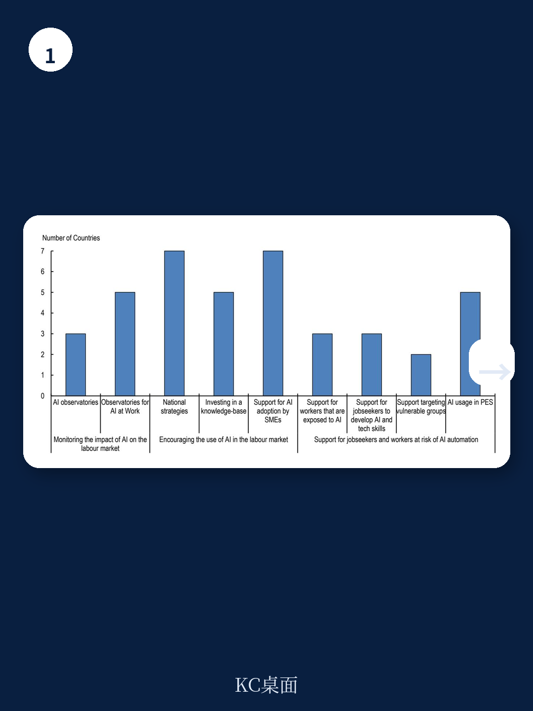
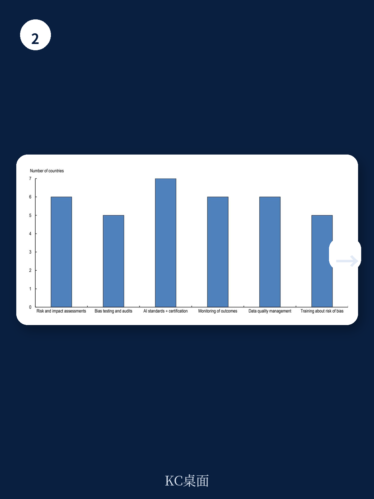

# 经合组织：行业规则与主题变化观察

经合组织在2026年7月发布的报告中，系统梳理了G7国家、欧盟及部分拉美地区在劳动力市场应用人工智能方面的政策进展。报告覆盖六个政策领域：自动化与技能、隐私与数据保护、非歧视、职业安全健康、透明度与问责、以及社会对话。核心发现是：多数国家并未为AI单独设立劳动力市场政策，而是将AI相关问题纳入现有劳动法规框架。真正有针对性措施的领域集中在AI技能培训和推广，而在隐私、透明度和问责方面，政策仍处于早期形成阶段。

## 1. 技能培训是政策最密集的领域，但偏重技术能力

所有被调查国家都提供再培训和技能提升项目，部分与私营部门合作开发。报告指出，大多数项目聚焦于技术技能，而非通用AI素养。这意味着工人对AI如何影响自身工作、如何与AI系统协作的理解，并未被纳入主流培训目标。此外，针对因AI而失业的工人，各国主要依赖标准就业支持政策和社会保护，而非专门设计的AI转型支持。报告特别提到，对于仍在职但面临AI冲击不确定性较高的工人，针对性措施仍然稀缺，尽管出现了一些有希望的案例。

> **KC评论：** 报告揭示了一个容易被忽视的缺口：政策资源集中在帮助人“学会用AI工具”，而非帮助人“理解AI如何改变工作逻辑”。后者可能对长期就业韧性更为关键。

## 2. 隐私与数据保护：现有法律框架为主，新立法正在出现

在隐私和数据保护方面，各国首先依赖现有框架来确保AI在劳动力市场的可信使用。许多国家提供额外指南和工具，例如工作坊、指导手册或自查工具，帮助雇主理解其义务。报告特别指出，数据保护和隐私框架对工人及AI系统的具体影响，并不总是被清晰界定或向雇主充分解释。部分国家正在引入新法律来专门应对这些问题，但整体而言，这一领域的政策成熟度低于技能领域。

## 3. 透明度与问责：原则多、实操指南少

在AI系统用于工作场所时，大多数被调查国家要求或鼓励雇主向工人披露AI使用信息，部分国家还要求向求职者披露，少数国家对平台工人有明确规则。报告认为，透明度、可解释性和问责制在多数AI战略中仍停留在宽泛原则层面。缺乏行业特定的案例研究、自我评估工具或实操指南，使得雇主和工人难以将这些原则落地。人工监督和可追溯性是被多数框架强调的重要问责措施，部分国家通过设立专门的监督角色、清晰的决策异议路径以及文档或日志记录要求来支持这些措施。

## 4. 社会对话：集体谈判发挥作用，但AI专业知识建设不足

各国主要通过与社会伙伴合作制定国家政策、公司层面的咨询和代表机制（尤其是职业安全健康方面）以及集体谈判协议来推动AI相关社会对话。报告发现，相对较少国家研究于提升社会伙伴的AI专业知识。这意味着工会和雇主组织在谈判AI相关条款时，可能缺乏足够的技术理解来评估影响或提出有效方案。报告认为，社会对话和集体谈判可以帮助解决AI在劳动力市场使用中的实际挑战，并支持合规，但前提是各方具备相应的知识基础。

这份报告提供了一个清晰的观察框架：评估一个国家AI劳动力市场政策的成熟度，可以看三个维度——是否有专门针对AI的法规而非仅依赖旧框架、技能培训是否涵盖AI素养而非仅技术操作、以及社会对话中是否建立了AI专业知识基础。目前，多数国家在这三个维度上仍有明显提升空间。
