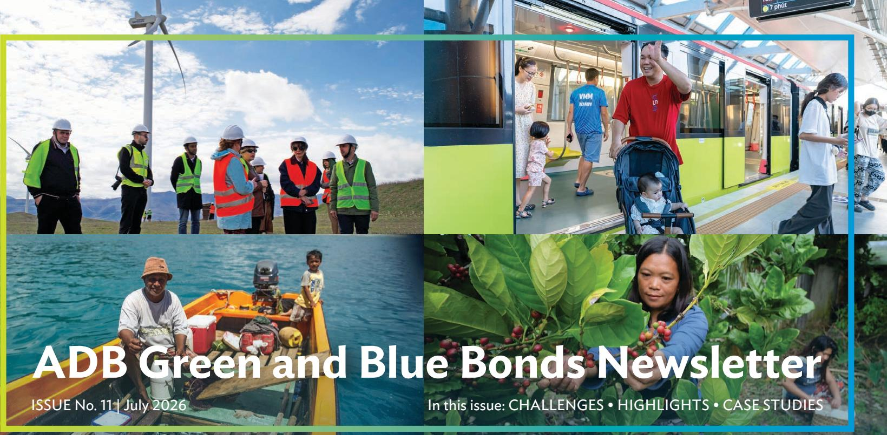

ADB Green and Blue Bonds Newsletter

ISSUE No. 11 | July 2026

In this issue: CHALLENGES • HIGHLIGHTS • CASE STUDIES

"We greatly value the strong and consistent support of our investors for our green and blue bond program, enabling us to mobilize more than \$15 billion over the past decade. This enduring partnership provides additional resources as we scale up investments to strengthen climate resilience, reduce disaster risks, and address environmental degradation."

—Tobias Hoschka, ADB Treasurer

“ADB’s blue and green bonds facilitate private capital towards the region’s most pressing climate, nature, and environmental needs. From our green bond for glacier awareness to our wider portfolio supporting themes such as clean energy, ocean health, and climate-resilient and nature-positive infrastructure, these instruments enable ADB to translate finance into investable solutions and drive resilient, sustainable growth across Asia and the Pacific.”

—Yevgeniy Zhukov, ADB Director General for Climate Change and Sustainable Development

## Growing the Market for Green and Blue Investment

Discussions on global climate and nature finance are entering a decisive phase as economies transition from commitment to implementation under their post-2025 climate and biodiversity frameworks. In Asia and the Pacific, the stakes are most critical. The region remains as a major driver for global growth and among the world's most vulnerable to climate impacts, highlighting the need for long-term capital flows supporting climate and nature-positive investments.

In 2025, global climate records continued to break, with the year confirmed as one of the 3 warmest years ever recorded. According to the World Meteorological Organization, global average surface temperatures in 2025 reached 1.4°C above the 1850–1900 average,

ADB's Commitment to Nature-Positive Finance  
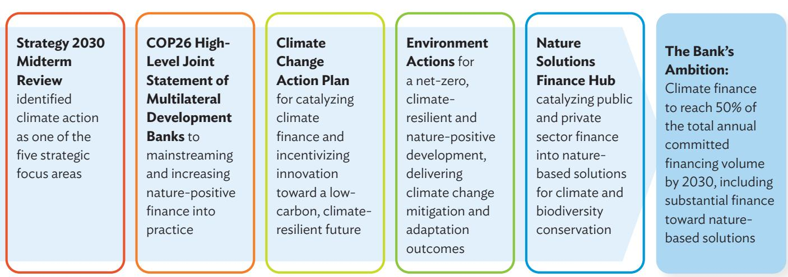  
COP26 = 26th UN Climate Change Conference of the Parties.
Source: Asian Development Bank (ADB).

marking the years 2023 to 2025 as the warmest 3-year period on record. $^{1}$ This global trend is mirrored across Asia and the Pacific where extreme heat and weather events persisted through 2025. In Southeast Asia and South Asia, heat waves were earlier than usual and lasted longer, causing school closure, severe health risks, and widespread disruptions across multiple countries. $^{2}$ Based on Asian Development Bank (ADB) estimates, climate change could trigger a 17% decline in gross domestic product across Asia and the Pacific by 2070, potentially reaching 41% by the end of the century. $^{3}$ This underscores the escalating economic risks associated with worsening climate, and the necessity of scaling climate finance, especially for adaptation.

Building on the New Collective Quantified Goal to deliver \$300 billion in annual climate finance for developing countries, the 30th United Nations Climate Change Conference of the Parties (COP30) in Belém, Brazil adopted the Global Mutirão Decision. $^{4}$ This landmark agreement commits to mobilizing \$1.3 trillion in climate finance annually by 2035 and launches a 2-year work program to strengthen climate finance implementation.

The financing gap for nature continues to widen. While the 16th Conference of the Parties for the Convention on Biological Diversity (CBD COP16) successfully established the Cali Fund, a Bloomberg report released ahead of the 2024 summit estimated that \$942 billion is needed annually to halt and reverse the ongoing decline in biodiversity. $^{5}$ To help address this issue, ADB is scaling up the Nature Solutions Finance Hub (NSFH). With the approval of the Natural Capital Fund, funded by the Global Environment Facility (GEF), ADB expects significant progress in nature finance throughout 2025, aligning with the Environment Action Plan launched in November 2024.

To facilitate market expansion for blue finance, ADB has partnered with other leading institutions: International Capital Market Association, United Nations Global Compact, United Nations Environment Programme Finance Initiative, and International Finance Corporation. This collaboration led to ADB's issuance of the guidance document, Bonds to Finance the Sustainable Blue Economy: A Practitioner's Guide. The guide builds on existing market standards that underpin the global sustainable bond markets and provides market consistency and transparency in financing the blue economy.

ADB continues to seek innovative financial solutions, and issuing thematic bonds is one way to broaden its investment base and grow local bond markets. In 2024, during CBD COP16 in Cali, Colombia, ADB issued its first biodiversity and nature theme bond for \$100 million. The bond will finance nature-based solutions, including biodiversity protection, nature mainstreaming, and livelihood support.

## Expanding Climate Finance Pathways Through the Glaciers to Farms Program

At COP30 in Belém, the Asian Development Bank and the Green Climate Fund (GCF) formalized the Glaciers to Farms (G2F) Regional Program. The program mobilizes \$3.5 billion in total financing—including \$250 million in grants and concessional finance from the GCF—to support climate-resilient development in Central and West Asia.

The G2F Program supports governments in addressing accelerating climate risks across agriculture, water, health, and social protection sectors in one of the world's fastest-warming regions. It does so by strengthening the capacity of key ministries for climate-informed public investment planning, advancing the development of bankable adaptation projects, and piloting innovative financing instruments such as outcome-based resilience bonds.

The program also strengthens the enabling environment for climate finance through targeted mentoring for financial institutions and agricultural enterprises, including micro, small, and medium-sized enterprises. It also promotes regional cooperation through a knowledge platform and the Glaciers Community of Practice to address shared risks such as glacier melt and water scarcity.

## Building Momentum to Scale Climate Finance

ADB continues to demonstrate long-term commitment and leadership in climate action, with an updated target for its climate finance to reach 50% of its total annual committed financing volume by 2030. At COP30, ADB and other multilateral development banks (MDBs) issued a joint statement reaffirming their collective commitment to work as a system and help client economies build resilient, economically sound development pathways in the face of intensified climate shocks and ecosystem degradation. $^{6}$

ADB's Climate Change Action Plan 2023–2030 (CCAP) continues to guide the expansion of the institution's climate operations. This growth is driven by robust climate finance mobilization, deeper integration of climate across operations, enhanced collaboration across ADB, and strengthened strategic external partnerships.

In 2025, ADB committed \$13.5 billion in climate finance from its resources—about 51% of its total committed financing. This included \$8.8 billion for mitigation and \$4.5 billion for adaptation, and marked a significant increase from the \$11.1 billion in climate finance achieved in 2024. Of the \$13.5 billion, private sector operations contributed \$1.6 billion. From 2019 to 2025, ADB committed \$55.4 billion in cumulative climate finance from its resources. Furthermore, in line with its

2021 commitment. Since 2023, all projects that ADB approved were assessed and confirmed as aligned with the Paris Agreement.

Complementing the CCAP, ADB is implementing its Disaster Risk Management Action Plan 2024–2030 and Environmental Action Plan 2024–2030. Together, these action plans strengthen direction and provide an integrated platform to address the triple planetary crisis of biodiversity loss, climate change, and pollution in a coherent, coordinated manner.

## Blue Bonds

In 2021, ADB expanded its green bond framework to include blue bonds for ocean health investments, setting a new replicable market standard for blue financing. $^{7}$ The Green and Blue Bond Framework is underpinned by ADB's Ocean Finance Framework, which aligns with the International Capital Market Association's Green Bond Principles and the Sustainable Blue Economy Finance Principles, of which ADB is a signatory. ADB's inclusion criteria for eligible investments have been independently verified by the Center for International Climate and Environmental Research – Oslo Shades of Green (CICERO), which assigned the new green and blue bond framework as CICERO Medium Green. $^{8}$

The expansion supports ADB's Action Plan for Healthy Oceans and Sustainable Blue Economies, which has three priorities:

• to conserve and restore critical marine habitats and species,

• to reduce marine pollution, and

• to build blue economies.

Based on this framework, ADB has issued about \$612 million of blue bonds denominated in Australian dollar, New Zealand dollar, and Swedish krona.

## Green Bonds

ADB continues to help finance climate change mitigation and adaptation projects, raising about \$15 billion since the launch of its green bond program in 2015. ADB's green bond issuances have been diverse, with transactions printed across currencies that include the Australian dollar, Brazilian real, Canadian dollar, euro, Georgian lari, Ghanaian cedi, Hong Kong dollar, Indian rupee, Kazakhstan tenge, Mexican peso, Nigerian naira, Norwegian krone, Peruvian sol, pound sterling, South African rand, Swedish krona, Turkish lira, Ukrainian hryvnia, and US dollar.

## Eligible Project Selection Criteria

Green bonds have proven to be an effective tool for promoting ADB's strategic priorities on climate change, as outlined in the Operational Plan for Strategy 2030. These priorities include climate change mitigation, climate and disaster resilience, and environmental sustainability.

Climate change mitigation projects include those in the following sectors:

\- renewable energy (i.e., solar, wind, geothermal, and small hydropower with capacity below 20 megawatts),

• energy efficiency, and

• sustainable transport (excluding roads).

Climate change adaptation projects include those in the following sectors:

• energy infrastructure resilience,

• water supply and other urban infrastructure and services,

• sustainable transport, and

agriculture.

Eligible blue bonds are funded, in whole or in part, by ADB projects that contribute to ocean health. The distance from the project to the ocean is considered as a secondary screening criterion, as appropriate. Examples of blue bond projects typically include, but are not limited to, the following sectors:

## Ecosystem and Natural Resources Management

\- Ecosystem management and natural resources restoration

• Sustainable fisheries management

• Sustainable aquaculture

## Pollution Control

• Solid waste management

• Resource efficiency and circular economy

• Nonpoint source pollution

• Wastewater management

## Sustainable Coastal and Marine Development

\- Ports and shipping

• Marine renewable energy

Eligible projects for green and blue bond financing are continually identified by ADB energy, climate change, and environmental specialists. For green bonds, this process follows the joint MDB approach to tracking and reporting climate change mitigation and adaptation finance, along with additional selection criteria for “green” projects that deliver environmentally sustainable growth. For blue bonds, eligible projects consider the selection criteria, including the project’s classification to identify “blue” projects. These criteria are defined by ADB’s Green and Blue Bond Framework.

## Use of Proceeds

Net proceeds from green and blue bonds are allocated within ADB's treasury to special subportfolios linked to ADB's lending operations for eligible projects. While the green and blue bonds are outstanding, the balances of these subportfolios are reduced at the end of each quarter with respect to eligible projects. Pending such disbursements, the subportfolios are invested in liquid instruments, in accordance with ADB's liquidity policy.

ADB Green Bond Commitment by Country, as of 31 December 2025

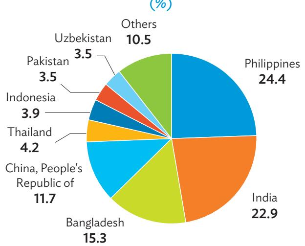  
Source: Asian Development Bank estimates.  
ADB Green Bond Commitment by Sector, as of 31 December 2025
(%)

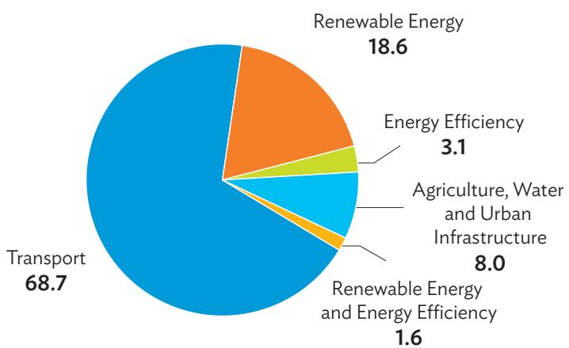  
Source: Asian Development Bank estimates.  
ADB Blue Bond Commitment by Country, as of 31 December 2025

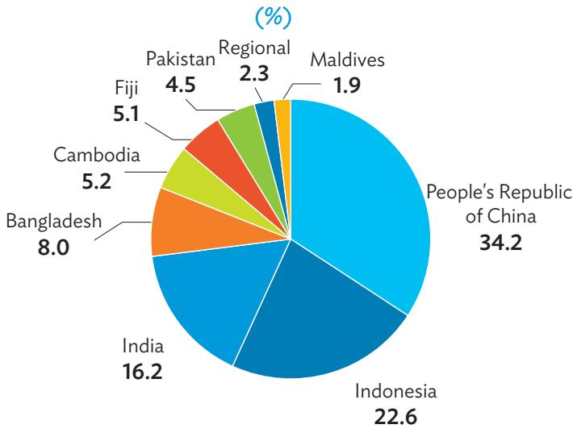  
Source: Asian Development Bank estimates.

ADB Blue Bond Commitment by Objective, as of 31 December 2025
(%)  
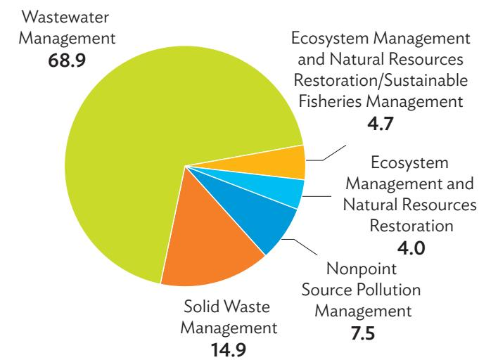  
Source: Asian Development Bank estimates.

Outstanding Green Bond Issuances as of 31 December 2025

<table><tr><td>Format</td><td>Issue Date</td><td>Maturity Date</td><td>Issue Size</td></tr><tr><td>Global</td><td>16 August 2016a</td><td>14 August 2026</td><td>$600,000,000</td></tr><tr><td>Private Placement</td><td>30 March 2017</td><td>30 March 2027</td><td>$50,000,000</td></tr><tr><td>Global</td><td>10 August 2017</td><td>10 August 2027</td><td>$500,000,000</td></tr><tr><td>Private Placement</td><td>15 November 2017</td><td>15 November 2027</td><td>A$25,000,000</td></tr><tr><td>Private Placement</td><td>26 January 2018</td><td>26 January 2028</td><td>SKr250,000,000</td></tr><tr><td>Global</td><td>26 September 2018</td><td>26 September 2028</td><td>$750,000,000</td></tr><tr><td>Private Placement</td><td>8 July 2019b</td><td>8 July 2026</td><td>SKr4,900,000,000</td></tr><tr><td>Public Offering</td><td>18 September 2019c</td><td>18 March 2030</td><td>A$220,000,000</td></tr><tr><td>Public Offering</td><td>18 October 2019</td><td>15 September 2026</td><td>£250,000,000</td></tr><tr><td>Public Offering</td><td>24 October 2019</td><td>24 October 2029</td><td>€750,000,000</td></tr><tr><td>Private Placement</td><td>30 January 2020</td><td>30 January 2053</td><td>€40,000,000</td></tr><tr><td>Private Placement</td><td>22 July 2020</td><td>22 July 2030</td><td>$50,000,000</td></tr><tr><td>Private Placement</td><td>13 October 2020</td><td>13 October 2028</td><td>SKr500,000,000</td></tr><tr><td>Private Placement</td><td>21 January 2021d</td><td>21 January 2028</td><td>SKr1,500,000,000</td></tr><tr><td>Private Placement</td><td>2 February 2021</td><td>2 February 2051</td><td>€35,000,000</td></tr><tr><td>Private Placement</td><td>5 February 2021</td><td>5 February 2026</td><td>BRL400,000,000</td></tr><tr><td>Public Offering</td><td>10 February 2021</td><td>10 February 2026</td><td>Can$1,250,000,000</td></tr><tr><td>Private Placement</td><td>18 February 2021</td><td>18 February 2061</td><td>$50,000,000</td></tr><tr><td>Private Placement</td><td>23 February 2021</td><td>23 February 2051</td><td>€40,000,000</td></tr><tr><td>Private Placement</td><td>24 February 2021</td><td>24 February 2061</td><td>€50,000,000</td></tr><tr><td>Private Placement</td><td>4 March 2021</td><td>4 March 2051</td><td>€35,000,000</td></tr><tr><td>Public Offering</td><td>16 June 2023</td><td>16 June 2028</td><td>SKr1,000,000,000</td></tr><tr><td>Public Offering</td><td>10 January 2024</td><td>10 January 2031</td><td>€1,250,000,000</td></tr><tr><td>Private Placement</td><td>1 February 2024</td><td>1 February 2034</td><td>S/40,000,000</td></tr><tr><td>Public Offering</td><td>8 February 2024e</td><td>8 February 2028</td><td>₹20,000,000,000</td></tr><tr><td>Private Placement</td><td>13 May 2024</td><td>13 May 2026</td><td>HK$200,000,000</td></tr><tr><td>Private Placement</td><td>16 May 2024</td><td>16 May 2028</td><td>SKr1,100,000,000</td></tr><tr><td>Public Offering</td><td>5 June 2024</td><td>5 June 2029</td><td>€500,000,000</td></tr><tr><td>Private Placement</td><td>5 September 2024</td><td>5 January 2026</td><td>₹32,000,000,000</td></tr><tr><td>Public Offering</td><td>17 January 2025</td><td>21 January 2027</td><td>T7,644,657,000</td></tr><tr><td>Private Placement</td><td>13 February 2025</td><td>13 February 2030</td><td>TL5,000,000,000</td></tr><tr><td>Private Placement</td><td>24 February 2025</td><td>24 February 2027</td><td>GHS160,000,000</td></tr><tr><td>Private Placement</td><td>26 February 2025</td><td>26 February 2026</td><td>HK$200,000,000</td></tr><tr><td>Private Placement</td><td>16 April 2025</td><td>16 April 2026</td><td>₹32,000,000,000</td></tr><tr><td>Private Placement</td><td>25 April 2025</td><td>25 April 2028</td><td>TL1,000,000,000</td></tr><tr><td>Public Offering</td><td>11 July 2025</td><td>11 July 2028</td><td>€1,000,000,000</td></tr><tr><td>Private Placement</td><td>28 July 2025</td><td>28 July 2026</td><td>HK$100,000,000</td></tr><tr><td>Private Placement</td><td>12 September 2025</td><td>12 September 2028</td><td>HK$780,000,000</td></tr><tr><td>Private Placement</td><td>14 October 2025</td><td>14 October 2031</td><td>A$78,000,000</td></tr><tr><td>Public Offering</td><td>20 October 2025</td><td>20 October 2028</td><td>Can$750,000,000</td></tr><tr><td>Private Placement</td><td>23 October 2025</td><td>23 October 2026</td><td>HK$150,000,000</td></tr></table>

A\$ = Australian dollar, Can\$ = Canadian dollar, € = euro, GHS = Ghanaian cedi, HK\$ = Hong Kong dollar, ₱ = Nigerian naira, R\$ = Brazilian real, ₹ = Indian rupee, S/ = Peruvian sol, £ = pound sterling, SKr = Swedish krona, T = Kazakhstan tenge, TL = Turkish lira, \$ = United States dollar.  
$^{a}$ Reopened on 23 June 2021.  
$^{b}$ Reopened on 30 August 2019, 19 November 2019, 5 February 2020, 15 February 2020, and 16 October 2020.  
$^{c}$ Reopened on 30 January 2020.  
$^{d}$ Reopened on 1 February 2021.  
$^{e}$ Reopened on 21 February 2024.  
Source: Asian Development Bank.

Outstanding Blue Bond Issuances as of 31 December 2025

<table><tr><td>Format</td><td>Issue Date</td><td>Maturity Date</td><td>Issue Size</td></tr><tr><td>Private Placement</td><td>10 September 2021</td><td>10 September 2036</td><td>A$208,000,000</td></tr><tr><td>Private Placement</td><td>10 September 2021</td><td>10 September 2031</td><td>NZ$217,000,000</td></tr><tr><td>Private Placement</td><td>22 November 2023</td><td>22 November 2048</td><td>A$40,000,000</td></tr><tr><td>Private Placement</td><td>18 September 2024</td><td>18 September 2029</td><td>SKr1,000,000,000</td></tr><tr><td>Public Offering</td><td>15 October 2025</td><td>15 October 2030</td><td>SKr1,750,000,000</td></tr></table>

A\$ = Australian dollar, NZ\$ = New Zealand dollar, SKr = Swedish krona.  
Source: Asian Development Bank.

Total Outstanding Green Bonds at End-2025

\$10.0 billion

Total Outstanding Blue Bonds at End-2025

\$612 million

## Green Bond Project Case Study: \$190 Million ADB Loan Package for India—Indore Metro Rail Project

ADB will extend a \$190 million loan to support the Indore Metro Rail Project, a transformative initiative to enhance urban mobility, reduce pollution, and promote inclusive growth in Indore, the largest city in Madhya Pradesh, India.

The metro line is expected to significantly reduce greenhouse gas emissions—by an estimated 12,414 tons of carbon dioxide equivalent annually—and improve air quality in one of India’s fastest-growing urban centers.

The initiative includes multimodal integration with existing bus and feeder services, improving access to educational institutions and markets. Commercial spaces at select stations will be allocated to women entrepreneurs and self-help groups, while safety audits and ridership data will guide future improvements.

A multimodal integration study will also be conducted to optimize connectivity between metro, airport, railway, and bus systems. ADB's support includes planning that benefits women and girls, with internship and training programs to build capacity among women in the transport sector, as well as collaboration with existing transit-oriented development (TOD) technical assistance to enhance Indore's TOD planning and policy framework.

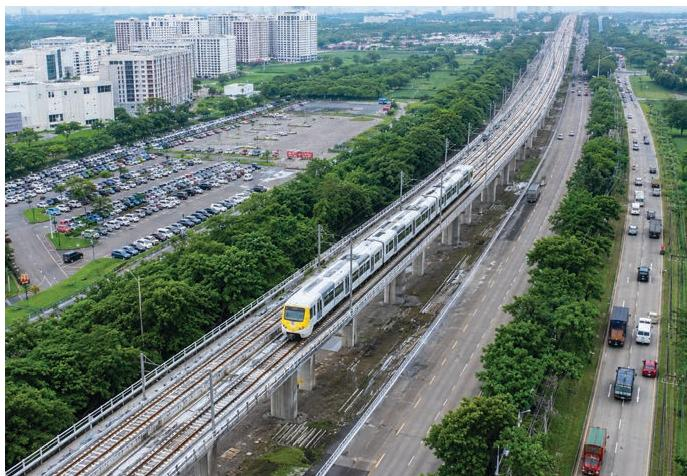  
Modern urban mobility system development. The project will construct a new metro line and stations in Indore, India, with connectivity to the airport (photo courtesy of the Madhya Pradesh Metro Rail Corporation Limited).

## Green Bond Project Case Study: \$140 Million ADB Loan Package for Pakistan—Sindh Coastal Resilience Sector Project

In 2025, ADB approved a \$140 million concessional loan for the Sindh Coastal Resilience Sector Project, as part of a broader financing package to support climate resilience in Pakistan's coastal districts.

The project aims to protect vulnerable communities in Pakistan's Sindh Province by strengthening resilience through an integrated investment package. This combines climate-resilient water resources infrastructure and nature-based solutions to safeguard livelihoods, enhance food and water security, and protect ecosystems.

The project also empowers local communities, particularly women, to participate in the design, implementation, and maintenance of resilience investments, ensuring that solutions are locally grounded and sustainable. It provides a model for inclusive resilience building that can be replicated in other deltaic and coastal contexts.

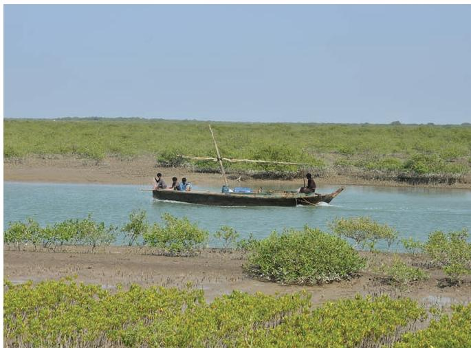  
Climate-resilient infrastructure. The project will enhance livelihood opportunities and support the sustainable development of coastal areas in the Sindh province of Pakistan.

# ADB Green Bond Eligible Projects by Sector Target Impacts and Committed and Allocated Amounts

A. Renewable Energy and Energy Efficiency (as of 31 December 2025)

<table><tr><td colspan="8">Project Name (Number/Year Loan Approved) and Description linked to the project page for more information</td><td colspan="5">Target  $Results^b$ </td><td rowspan="2">Sustainable Development Goals</td></tr><tr><td> $A/M^a$ </td><td>RE or EE</td><td>Share of Clean Energy Component</td><td> $Project Life (Years)^b$ </td><td>Annual Energy Savings ( $MWh$ )b</td><td>Annual Energy Produced ( $MWh$ )b</td><td>Renewable Capacity Added ( $MW$ )b</td><td>Annual GHG Emission Avoided ( $ton\ of\ CO_2equivalent$ )b</td><td>Total Project Cost ($ million)</td><td>Loan Approval ( $$ million$ )c</td><td>Eligibility for Green Bonds ( $$ million$ )d</td><td>Allocated Amount ( $$ million$ )e</td><td>Reflow Amount ( $$ million$ )f</td></tr><tr><td colspan="8">Indonesia: Java-Bali Electricity Distribution Performance Improvement (2619/FY2010/FY2016). Reduce distribution system losses and, with an energy-efficient lighting program, reduce demand-side energy consumption.</td><td colspan="5">·Deferral of new distribution network investment by $100 million. ·Overall distribution loss reduced to 7.0% from 8.4% in 2008. ·System average interruption frequency index reduced to 3.0 times per year per customer from 6.8 in 2008. ·Fully disbursed.</td><td></td></tr><tr><td>M</td><td>EE</td><td>80.0%</td><td>40</td><td>400,000</td><td>NA</td><td>NA</td><td>330,000</td><td>120.00</td><td>50.00</td><td>40.00</td><td>16.70</td><td>(11.32)</td><td></td></tr><tr><td colspan="8">China, People's Republic of: Integrated Renewable Biomass Energy Development Sector (2632/FY2010/FY2019). Improve performance of biogas subsector through the demonstration of an integrated renewable biomass energy system in poor rural areas of Heilongjiang, Henan, Jiangxi, and Shandong provinces in the People's Republic of China.</td><td colspan="5">·About 90% of the wastes of subproject farms collected and treated via the biogas plant project. ·About 70 million cubic meters of biogas produced every year for rural energy use. ·About 41,000 households, including 8,000 poor households, benefited from improved access to clean energy. ·About 27,000 farmers increased their incomes through expanded contract farming. ·GHG emissions reduced by about 1 million tons of  $CO_2 equivalent$ . ·Fully disbursed.</td><td></td></tr><tr><td>M</td><td>RE</td><td>100.0%</td><td>15</td><td>27,222</td><td>92,000</td><td>...</td><td>1,000,000</td><td>152.54</td><td>66.08</td><td>66.08</td><td>36.30</td><td>(22.67)</td><td></td></tr><tr><td colspan="8">Papua New Guinea: Town Electrification Investment Program, Tranche 1 (2713/FY2010/FY2021). Increase generation and use of renewable energy in provincial areas.</td><td colspan="5">·Six additional small hydropower plants installed in target provincial areas by the end of 2016. ·Power outages reduced by 20% in target provincial urban areas by the end of 2016. ·Fuel costs for PNG Power Limited power generation reduced by 60% in target provincial areas by the end of 2016. ·Fully disbursed.</td><td></td></tr><tr><td>M</td><td>RE</td><td>100.0%</td><td>30</td><td>NA</td><td>35,600</td><td>6.0</td><td>35,000</td><td>71.60</td><td>37.70</td><td>37.70</td><td>35.60</td><td>(12.21)</td><td></td></tr><tr><td colspan="8">India: Gujarat Solar Power Transmission (2778/FY2011/FY2017). Develop the infrastructure to transmit power from the solar power generation plants to be located in the 2,500-ha Charanka Solar Park in Patan district of Gujarat; the solar park will host more than 500 MW of both solar photovoltaic and concentrated solar power plants.</td><td colspan="5">·Up to 500 MW of power can be evacuated from the Charanka Solar Park over the transmission link to the Gujarat and national grid, commencing in 2014 (2010 baseline: 0 MW). ·Fully disbursed.</td><td></td></tr><tr><td>M</td><td>RE</td><td>100.0%</td><td>40</td><td>NA</td><td>NA</td><td>NA</td><td>NA</td><td>133.69</td><td>65.60</td><td>65.60</td><td>49.14</td><td>(31.74)</td><td></td></tr><tr><td colspan="8">China, People's Republic of: Agricultural and Municipal Waste-to-Energy Project (7368/2899/2900/FY2012/FY2016). Increase power generation from municipal solid waste, a form of renewable energy resource.</td><td colspan="5">·70% of municipal solid waste in the PRC properly treated—with 30.0% incinerated in cities—by 2020 (2010 baseline: 63.5% properly treated, with 14.7% incinerated in cities). ·3-GW capacity of municipal WTE plants installed in the PRC by 2020 (2010 baseline: about 500 MW). ·About 7,300 tons of additional waste per day treated by 2018. ·Fully disbursed.</td><td></td></tr><tr><td>M</td><td>RE</td><td>100.0%</td><td>40</td><td>NA</td><td>496,000</td><td>84.0</td><td>255,200</td><td>200.00</td><td>100.00</td><td>100.00</td><td>80.00</td><td>(71.18)</td><td></td></tr><tr><td colspan="14">Project Name (Number/Year Loan Approved) and Description linked to the project page for more information</td></tr><tr><td colspan="14">Target  $Results^b$ </td></tr><tr><td> $A/M^a$ </td><td>RE or EE</td><td>Share of Clean Energy Component</td><td> $Project Life (Years)^b$ </td><td>Annual Energy Savings ( $MWh$ )b</td><td>Annual Energy Produced ( $MWh$ )b</td><td>Renewable Capacity Added ( $MW$ )b</td><td>Annual GHG Emission Avoided (ton of  $CO_2 equivalent$ )b</td><td>Total Project Cost ($ million)</td><td>Loan Approval ( $$ million$ )c</td><td>Eligibility for Green Bonds ( $$ million$ )d</td><td>Allocated Amount ( $$ million$ )e</td><td>Reflow Amount ( $$ million$ )f</td><td>Sustainable Development Goals</td></tr><tr><td colspan="8">Regional: Southeast Asia Energy Efficiency Project (Cofely Southeast Asia Pte) (7371/2919/FY2012/FY2020). Support the investment program to expand and upgrade energy efficiency services in Cambodia, Indonesia, the Lao People's Democratic Republic, Malaysia, the Philippines, Thailand, and Viet Nam by removing financial constraints and information barriers that inhibit the development of an energy efficiency market.</td><td colspan="5">Annual energy savings of at least 150,000 MWh equivalent from energy efficiency projects by 2019.Average annual  $CO_2 equivalent$  emissions of 90,000 tons avoided by 2019.Average annual net savings of $10 million from energy efficiency projects by 2019.</td><td></td></tr><tr><td>M</td><td>EE</td><td>100.0%</td><td>20</td><td>150,000</td><td>NA</td><td>NA</td><td>90,000</td><td>200.00</td><td>20.00</td><td>20.00</td><td>16.03</td><td>(10.21)</td><td></td></tr><tr><td colspan="8">China, People's Republic of: Dynagreen Waste-to-Energy Project (7377/2960/FY2012/FY2015). Increase power generation from municipal solid waste, a form of renewable energy.</td><td colspan="5">Average of 2.8 million tons of municipal solid waste treated per year by 2018.About 610 GWh of clean energy produced annually by WTE plants by 2018.About 450,000 tons of  $CO_2 equivalent$  emissions avoided per year by 2018.Up to 700 local workers employed by nine WTE plants during operation.Fully disbursed.</td><td></td></tr><tr><td>M</td><td>RE</td><td>100.0%</td><td>40</td><td>NA</td><td>610,000</td><td>120.0</td><td>450,000</td><td>378.50</td><td>100.00</td><td>100.00</td><td>108.63</td><td>(77.77)</td><td></td></tr><tr><td colspan="8">China, People's Republic of: Qinghai Delingha Concentrated Solar Power Thermal Project (3075/FY2013/FY2020). Increase solar power generation using concentrated solar power technology; increase share of renewable energy in the total primary energy consumption.</td><td colspan="5">50-MW Qinghai Delingha plant operated reliably and designed output delivered (baseline: 0 MW in 2013).197 GWh of clean electricity generated annually, thereby avoiding 154,446 tons of  $CO_2 equivalent$  emissions per year by 2017 (baseline: 0 GWh in 2013).Fully disbursed.</td><td></td></tr><tr><td>M</td><td>RE</td><td>100.0%</td><td>25</td><td>NA</td><td>197,000</td><td>50.0</td><td>154,446</td><td>322.26</td><td>150.00</td><td>150.00</td><td>119.18</td><td>(46.27)</td><td></td></tr><tr><td colspan="8">Indonesia: Sarulla Geothermal Power Generation Project (7397/3089/FY2013/FY2018). Increase use of geothermal resources for power generation.</td><td colspan="5">Annual electricity production of 2,529 GWh from 2018 onward.Net reduction of 1.3 million tons of  $CO_2 equivalent$  emissions per year from 2018 onward.Employment equivalent to 100 full-time skilled or semiskilled jobs provided during operations by 2020.</td><td></td></tr><tr><td>M</td><td>RE</td><td>100.0%</td><td>30</td><td>NA</td><td>2,529,000</td><td>320.0</td><td>1,300,000</td><td>1,239.30</td><td>250.00</td><td>250.00</td><td>250.00</td><td>(129.08)</td><td></td></tr><tr><td colspan="8">Cook Islands: Renewable Energy Sector Project (3193/FY2014/FY2023). Increase solar power generation capacity by 3 MWp.</td><td colspan="5">Core subprojects: 780-kW installed capacity of solar photovoltaic power system connected to the existing power grid in Mangaia, Mauke, and Mitiaro islands by the end of 2016.Noncore subprojects: 2,400-kW installed capacity of solar photovoltaic power system connected to the existing power grid in Atiu, Aitutaki, and Rarotonga islands by the end of 2017.Energy efficiency policy implementation plan developed by the end of 2017.</td><td></td></tr><tr><td>M</td><td>RE</td><td>100.0%</td><td>25</td><td>NA</td><td>4,870</td><td>3.0</td><td>2,930</td><td>24.28</td><td>11.19</td><td>11.19</td><td>8.08</td><td>(3.14)</td><td></td></tr><tr><td colspan="8">Thailand: Chaiyaphum Wind Farm Company Limited (Subyai Wind Power Project) (7435/3219/FY2014/FY2016). Increase wind power generation capacity by 81 MW.</td><td colspan="5">At least 120,000 MWh of wind power delivered to the offtaker per year (2016-2026).At least 65,000 tons of  $CO_2 equivalent$  emissions avoided per year (2016-2026).81 MW of wind power capacity commissioned by the first quarter of 2016.More than 250 people (45 full-time equivalent [FTE]) employed during construction.</td><td></td></tr><tr><td>M</td><td>RE</td><td>100.0%</td><td>20</td><td>NA</td><td>128,950</td><td>81.0</td><td>65,000</td><td>not disclosed</td><td>53.00</td><td>53.00</td><td>51.25</td><td>(33.98)</td><td></td></tr><tr><td colspan="8">Project Name (Number/Year Loan Approved) and Description linked to the project page for more information</td><td colspan="5">Target  $Results^b$ </td><td rowspan="2">Sustainable Development Goals</td></tr><tr><td> $A/M^a$ </td><td>RE or EE</td><td>Share of Clean Energy Component</td><td> $Project\ Life (Years)^b$ </td><td>Annual Energy Savings ( $MWh$ )b</td><td>Annual Energy Produced ( $MWh$ )b</td><td>Renewable Capacity Added ( $MW$ )b</td><td>Annual GHG Emission Avoided ( $ton\ of\ CO_2 equivalent$ )b</td><td>Total Project Cost ($ million)</td><td>Loan Approval ( $$ million$ )c</td><td>Eligibility for Green Bonds ( $$ million$ )d</td><td>Allocated Amount ( $$ million$ )e</td><td>Reflow Amount ( $$ million$ )f</td></tr><tr><td colspan="8">Philippines: 150-MW Burgos Wind Farm Project (7442/3246/FY2015/FY2015). Increase wind power generation capacity by 150 MW.</td><td colspan="5">Average of 370 GWh of wind power delivered to the grid per year from 2015 (2012 baseline: 75 GWh per year).150 MW of wind power capacity commissioned by the first quarter of 2015.</td><td></td></tr><tr><td>M</td><td>RE</td><td>100.0%</td><td>20</td><td>NA</td><td>370,000</td><td>150.0</td><td>160,114</td><td>20.00</td><td>20.00</td><td>20.00</td><td>19.60</td><td>(18.63)</td><td></td></tr><tr><td colspan="8">Philippines: Tiwi and Makban Geothermal Power Green Bonds Project (7551/3266/FY2015/FY2016). Refinance capital expenditure (including acquisition and plant rehabilitation) and ongoing operation and maintenance in Tiwi and Makban, two major geothermal power generation complexes in Luzon.</td><td colspan="5">Full subscription of up to 10.7 billion peso-denominated Tiwi-Makban green project bonds in the third quarter of 2015 (2015 baseline: NA).Climate bond certificate application issued by the fourth quarter of 2015 (2015 baseline: NA).ADB knowledge product disseminated to the public by 2016 (2015 baseline: NA).Risk-sharing agreement with at least one coguarantor implemented by the third quarter of 2015 (2015 baseline: NA).</td><td></td></tr><tr><td>M</td><td>RE</td><td>100.0%</td><td>NA</td><td>NA</td><td>NA</td><td>NA</td><td>NA</td><td>688.62</td><td>40.64</td><td>40.64</td><td>38.47</td><td>(24.55)</td><td></td></tr><tr><td colspan="8">India: Mytrah Energy (India) Limited (Mytrah Wind and Solar Development Project) (7474-7479/3379-3384/FY2016/FY2017). Finance transaction comprising 476 MW of wind projects in four special purpose vehicles in Rajasthan, Madhya Pradesh, Andhra Pradesh, and Karnataka; and 100 MW of solar projects in two special purpose vehicles in Telangana and Punjab.</td><td colspan="5">241 MW of wind farm project commissioned by 2016.234 MW of additional wind capacity commissioned by 2017.100 MW of solar capacity commissioned by 2016.1,200 GWh generated annually.1,185,165 tons of  $CO_2$  equivalent emissions avoided annually.At least 64 FTE local jobs and 415 contractual jobs created for operations.</td><td></td></tr><tr><td>M</td><td>RE</td><td>100.0%</td><td>20 (wind)25 (solar)</td><td>NA</td><td>1,200,000</td><td>576.2</td><td>1,185,165</td><td>669.50</td><td>175.00</td><td>98.00</td><td>95.31</td><td>(72.33)</td><td></td></tr><tr><td colspan="8">India: Demand-Side Energy Efficiency Sector Project (3436/FY2016/FY2021). Provide a loan to Energy Efficiency Services Limited (EESL) to support demand-side energy efficiency investments in several states in India, covering high-priority areas under EESL's energy services company through the use of more efficient light-emitting diode (LED) municipal street lighting equipped with remote operating technology, more efficient domestic lighting by replacing incandescent lights with LEDs, and more energy-efficient agricultural water pumps.</td><td colspan="5">Efficiency of street lighting in one or more municipalities in eligible states (including Goa, Maharashtra, Rajasthan, and Telangana) enhanced; 1.5 million streetlights replaced with LED lamps.Efficiency of bulbs, tube lights, and electric fans in households and institutions in utility service areas in eligible states enhanced (including Andhra Pradesh, Maharashtra, Rajasthan, and Uttar Pradesh); 42 million LED lamps, ceiling fans, and LED tube lights installed.Efficiency of agricultural water pumps in utility service areas in eligible states improved (including Andhra Pradesh, Karnataka, Maharashtra, and Rajasthan); 225,000 inefficient agricultural water pumps replaced with more efficient models.Electricity consumption in subproject areas reduced by 3,800 GWh per year.Additional aggregate GHG emissions reduced by 3 million tons of  $CO_2$  equivalent per year.Fully disbursed.</td><td></td></tr><tr><td>M</td><td>EE</td><td>100.0%</td><td>11 (LED)10 (pumps)</td><td>3,800,000</td><td>NA</td><td>NA</td><td>3,000,000</td><td>400.00</td><td>200.00</td><td>200.00</td><td>142.11</td><td>(49.76)</td><td></td></tr><tr><td colspan="14">Project Name (Number/Year Loan Approved) and Description linked to the project page for more information</td></tr><tr><td colspan="14">Target  $Results^b$ </td></tr><tr><td> $A/M^a$ </td><td>RE or EE</td><td>Share of Clean Energy Component</td><td>Project Life ( $Years^b$ )</td><td>Annual Energy Savings ( $MWh^b$ )</td><td>Annual Energy Produced ( $MWh^b$ )</td><td>Renewable Capacity Added ( $MW^b$ )</td><td>Annual GHG Emission Avoided (ton of  $CO_2 equivalent^b$ )</td><td>Total Project Cost ($ million)</td><td>Loan Approval ( $$ million)^c$ </td><td>Eligibility for Green Bonds ( $$ million)^d$ </td><td>Allocated Amount ( $$ million)^e$ </td><td>Reflow Amount ( $$ million)^f$ </td><td>Sustainable Development Goals</td></tr><tr><td colspan="8">Pakistan: Triconboston Wind Power (Triconboston Consulting Corporation (Private) Limited)(7487/3448/FY2016/FY2018). Construct, commission, and operate three 50-MW wind power projects located in Thatta District, Sindh Province, south of Pakistan.</td><td colspan="5">150 MW of wind capacity commissioned.520 GWh of wind power generated annually.380,000 tons of  $CO_2 equivalent$  emissions avoided annually.At least 35 FTE local jobs created during operations.</td><td>7 Agricultural Land Greenhouse</td></tr><tr><td>M</td><td>RE</td><td>100.0%</td><td>20</td><td>NA</td><td>520,000</td><td>150.0</td><td>380,000</td><td>360.00</td><td>75.00</td><td>75.00</td><td>66.00</td><td>(43.03)</td><td></td></tr><tr><td colspan="8">Pakistan: Access to Clean Energy Investment Program (3476/FY2016/FY2025). Expand access to renewable energy, notably microhydropower plants in rural off-grid areas and decentralized solar plants for education and primary health care facilities in Khyber Pakhtunkhwa and Punjab; provide women and girls with increased opportunities to obtain energy services and benefits; enhance institutional capacity to foster sustainability; and promote public sector energy efficiency in Punjab.</td><td colspan="5">By 2021:Power generation capacity from clean energy sources increased by 182 MW.At least 26,587 sites have renewable-energy-based power plants installed.500 primary health care facilities (used by women for delivery or antenatal care) equipped with solar plants.By 2019:Energy audits conducted on 100% of identified public sector buildings, and a model net-zero energy building constructed.Fully disbursed.</td><td>7 Agricultural Land Greenhouse</td></tr><tr><td>M</td><td>RE and EE</td><td>76.0%</td><td>25</td><td>NA</td><td>149,300</td><td>182.0</td><td>74,800</td><td>376.45</td><td>325.00</td><td>247.00</td><td>187.12</td><td>(34.66)</td><td></td></tr><tr><td colspan="8">Indonesia: Muara Laboh Geothermal Power Project (PT Supreme Energy Muara Laboh) (3487/FY2016/FY2020). Develop geothermal steam resources through production and injection facilities in the Liki Pinangawan Muaralaboh concession area; and construct, operate, and maintain a single power generation unit with a total capacity of about 80 MW.</td><td colspan="5">80 MW of electricity generation capacity installed.630 GWh of electricity generated and delivered to offtaker per year.471,240 tons of  $CO_2 equivalent$  emissions avoided annually.At least 190 jobs provided during operations.</td><td>7 Agricultural Land Greenhouse</td></tr><tr><td>M</td><td>RE</td><td>100.0%</td><td>30</td><td>NA</td><td>630,000</td><td>80.0</td><td>471,240</td><td>590.90</td><td>70.00</td><td>70.00</td><td>70.00</td><td>(25.38)</td><td></td></tr><tr><td colspan="8">Cambodia: Cambodia Solar Power Project (Sunseap Asset [Cambodia] Co. Ltd.) (7498/3495/FY2016/FY2017). Support a build-own-operate, public-private partnership transaction for a 10-MW solar power plant to be located in Bavet City in Svay Rieng Province, about 150 km from the capital Phnom Penh.The project is the first utility-scale solar power plant in Cambodia, and the first competitively tendered renewable energy independent power producer project in the country.</td><td colspan="5">10 MW of solar power capacity commissioned by July 2017.5.5-km transmission line connecting the plant to the substation completed by June 2017.More than 14 GWh of power dispatched to Electricité du Cambodge per year by 2018.An average of 9,500 tons of  $CO_2 equivalent$  emissions avoided annually during the first 10 years of operations.At least 10 FTE jobs provided during operations by 2018.Fully disbursed.</td><td></td></tr><tr><td>M</td><td>RE</td><td>100.0%</td><td>25</td><td>NA</td><td>14,000</td><td>10.0</td><td>9,500</td><td>not disclosed</td><td>3.60</td><td>3.60</td><td>3.25</td><td>(3.84)</td><td></td></tr><tr><td colspan="8">India: ReNew Clean Energy Project (ReNew Power Ventures Private Limited) (7495/3488,7504-7509/3514-3519/FY2016/FY2020). Provide funding to seven special purpose vehicles established by ReNew to develop 709 MW of solar and wind projects in the states of Andhra Pradesh, Gujarat, Jharkhand, Karnataka, Madhya Pradesh, and Telangana.</td><td colspan="5">398 MW of solar capacity commissioned by 2018.311 MW of wind capacity commissioned by 2017.1,400 GWh generated annually.1.2 million tons of  $CO_2 equivalent$  emissions avoided annually.At least 200 jobs provided during operations.Fully disbursed.</td><td>7 Agricultural Land Greenhouse</td></tr><tr><td>M</td><td>RE</td><td>100.0%</td><td>20 (wind)25 (solar)</td><td>NA</td><td>1,400,000</td><td>709.0</td><td>1,200,000</td><td>778.20</td><td>194.60</td><td>61.23</td><td>62.05</td><td>(65.30)</td><td></td></tr><tr><td colspan="8">Project Name (Number/Year Loan Approved) and Description linked to the project page for more information</td><td colspan="5">Target  $Results^b$ </td><td></td></tr><tr><td> $A/M^a$ </td><td>RE or EE</td><td>Share of Clean Energy Component</td><td> $Project\ Life (Years)^b$ </td><td>Annual Energy Savings ( $MWh)^b$ </td><td>Annual Energy Produced ( $MWh)^b$ </td><td>Renewable Capacity Added ( $MW)^b$ </td><td>Annual GHG Emission Avoided (ton of  $CO_2 equivalent)^b$ </td><td>Total Project Cost ($ million)</td><td>Loan Approval ( $$ million)^c$ </td><td>Eligibility for Green Bonds ( $$ million)^d$ </td><td>Allocated Amount ( $$ million)^e$ </td><td>Reflow Amount ( $$ million)^f$ </td><td>Sustainable Development Goals</td></tr><tr><td colspan="8">India: Solar Transmission Sector Project (3521/FY2017/FY2020). Develop high-voltage transmission systems to evacuate the electricity generated by new megasolar parks to the interstate grid, and improve the reliability of the national grid system.</td><td colspan="5">201-km transmission systems (765 kV and 400 kV) constructed to help evacuate 2,500 MW of power from solar parks in Bhadla, Rajasthan.95-km transmission systems (400 kV) constructed to help evacuate 700 MW of power from solar parks in Banaskantha, Gujarat.195-km transmission systems (400 kV) constructed to help evacuate 1,000 MW of power from solar parks in Tumkur, Karnataka.High Voltage Direct Current terminals (500 kV) between Rihand and Dadri rehabilitated to provide an efficient power supply with a capacity of 1,500 MW.Fully disbursed.</td><td>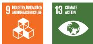</td></tr><tr><td>M</td><td>RE</td><td>100.0%</td><td>40</td><td>...</td><td>...</td><td>...</td><td>...</td><td>450.00</td><td>175.00</td><td>175.00</td><td>175.00</td><td>(57.24)</td><td></td></tr><tr><td colspan="8">Armenia: Electric Networks of Armenia (ENA) Distribution Network (7514/3540/FY2017/FY2020). Improve the quality of the distribution network and services of ENA's multisite operations across the country; reduce electricity losses and operational expenses; improve technical maintenance and safety conditions; modernize the metering system; rehabilitate, reinforce, and augment the distribution network; connect new customers; and introduce international standards of management and an automated control system.</td><td colspan="5">400 km of distribution lines upgraded to 10/0.4-kV overhead lines.900 10/0.4-kV transformers upgraded.550 substations upgraded.250,000 automatic metering devices for end consumers installed.</td><td>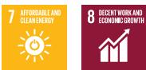</td></tr><tr><td>M</td><td>EE</td><td>100.0%</td><td>40</td><td>26,500</td><td>NA</td><td>NA</td><td>11,400</td><td>201.24</td><td>80.00</td><td>80.00</td><td>80.01</td><td>(60.44)</td><td></td></tr><tr><td colspan="8">Papua New Guinea: Town Electrification Investment Program, Tranche 2 (3544-3545/FY2017/FY2022). Rehabilitate two hydropower plants—Yonki Toe of Dam Hydropower Plant and Warangoi Hydropower Plant—which are currently operating below their full capacities; construct Ramazon run-of-river small hydropower plant with a capacity of 3 MW.</td><td colspan="5">Three aging hydropower plants rehabilitated by PNG Power Limited to return them to their rated capacity of 28 MW.Hydropower grid of 3 MW constructed and connected to PNG Power Limited.Efficient project management services rendered by the project management unit.Fully disbursed.</td><td></td></tr><tr><td>M</td><td>RE</td><td>100.0%</td><td>25</td><td>NA</td><td>84,000</td><td>3.0</td><td>70,000</td><td>76.60</td><td>60.90</td><td>60.90</td><td>36.98</td><td>(10.02)</td><td></td></tr><tr><td colspan="8">Samoa: Solar Power Development (Jarcon PTY Limited and Sun Pacific Energy Limited) (7515/3553/FY2017/FY2017). Increase supply of clean, carbon-negative solar energy generated through an independent power producer.</td><td colspan="5">4-MW solar power system commissioned by the end of 2017.Up to 20 construction jobs and five permanent jobs for operation and maintenance of the project created.Fully disbursed.</td><td>7 AFFORDABLE AND CLEAN ENERGY</td></tr><tr><td>M</td><td>RE</td><td>100.0%</td><td>25</td><td>NA</td><td>5,500</td><td>4.0</td><td>1,644</td><td>7.00</td><td>2.00</td><td>2.00</td><td>2.00</td><td>(1.66)</td><td></td></tr><tr><td colspan="8">Sri Lanka: Rooftop Solar Power Generation Project (3571/FY2017/FY2021). Install rooftop solar power generation systems, develop rooftop solar market infrastructure and a bankable subproject pipeline, and build capacity and increase awareness of stakeholders in Sri Lanka.</td><td colspan="5">About 6,400 rooftop solar subprojects financed utilizing a $50 million loan and $9.8 million leveraged from the private sector.10 private financial institutions for handling debt funding of rooftop solar systems by commercial and domestic sectors selected.Pipeline of bankable subprojects for 50 MW of capacity developed.Project technical guidelines and standards to be followed by borrowers, vendors, and accredited engineers established.Technical verification during pre- and post-installation conducted.An analytical report on identified technical shortcomings and failures prepared.A comprehensive database of all installations, including online technical performance information of selected rooftop solar photovoltaic systems, established and maintained.Fully disbursed.</td><td>7 AFFORDABLE AND CLEAN ENERGY</td></tr><tr><td>M</td><td>RE</td><td>100.0%</td><td>25</td><td>NA</td><td>75,600</td><td>50.0</td><td>55,600</td><td>59.80</td><td>50.00</td><td>50.00</td><td>50.00</td><td>(8.94)</td><td></td></tr></table>

<table><tr><td colspan="9">Project Name (Number/Year Loan Approved) and Description linked to the project page for more information</td><td colspan="5">Target  $Results^b$ </td><td rowspan="2">Sustainable Development Goals</td><td></td><td></td></tr><tr><td> $A/M^a$ </td><td>RE or EE</td><td>Share of Clean Energy Component</td><td> $Project\ Life$ (Years) $^b$ </td><td>Annual Energy Savings ( $MWh$ ) $^b$ </td><td>Annual Energy Produced ( $MWh$ ) $^b$ </td><td>Renewable Capacity Added ( $MW$ ) $^b$ </td><td>Annual GHG Emission Avoided (ton of  $CO_2$  equivalent) $^b$ </td><td>Total Project Cost ($ million)</td><td>Loan Approval ( $$ million$ ) $^c$ </td><td>Eligibility for Green Bonds ( $$ million$ ) $^d$ </td><td>Allocated Amount ( $$ million$ ) $^e$ </td><td>Reflow Amount ( $$ million$ ) $^f$ </td><td></td><td></td><td></td></tr><tr><td colspan="8">Thailand: Southern Thailand Waste-to-Energy (WTE) Project (Chana Green Company Limited) (7524/3581/FY2017/FY2020). Construct and operate a 25-MW biomass WTE power project in Chana, Songhla Province, Southern Thailand, which will convert about 825 tons of agricultural waste per day into renewable electricity generation.</td><td colspan="5">25 MW of renewable electricity generation capacity installed.300 jobs generated during construction.</td><td></td><td></td><td></td><td></td></tr><tr><td>M</td><td>RE</td><td>100.0%</td><td>40</td><td>NA</td><td>166,000</td><td>25.0</td><td>72,874</td><td>not disclosed</td><td>33.60</td><td>33.60</td><td>35.34</td><td>(16.36)</td><td></td><td></td><td></td><td></td></tr><tr><td colspan="8">Sri Lanka: Wind Power Generation Project (3585/FY2017/FY2025). Support wind power generation development, involving construction of a 100-MW wind farm, including wind park internal infrastructure, internal cabling, access roads, and other arrangements; installation of a renewable energy dispatch control center to forecast, control, and manage intermittent wind power generation; improvement of power system reactive power management; and provision of project engineering design review and supervision support in Mannar Island of the Northern Province.</td><td colspan="5">100-MW wind power park constructed.Wind park internal infrastructure, including 31 km of 33-kV underground cables and access roads, developed.Renewable energy dispatch control center to forecast, control, and manage intermittent 100-MW wind power generation established.100-MVA reactive reactors at Anuradhapura grid substation (North Central Province) installed.50-MVA reactive reactor at Mannar grid substation (Northern Province) installed.Engineering oversight of wind turbine installation, commissioning and testing, and technical certification delivered over the construction period.</td><td>7</td><td>OTHERABLE AND CLEAN ENERGY</td><td>13</td><td>CONDUITATION</td></tr><tr><td>A and M</td><td>RE</td><td>100.0%</td><td>20</td><td>NA</td><td>345,600</td><td>100.0</td><td>265,700</td><td>256.70</td><td>200.00</td><td>200.00</td><td>143.17</td><td>(30.56)</td><td></td><td></td><td></td><td></td></tr><tr><td colspan="8">Indonesia: Eastern Indonesia Renewable Energy, Phase 1 (PT Energi Bayu Jeneponto) (7533/3606/FY2017/FY2018). Support the construction, operation, and maintenance of a portfolio of renewable energy projects by the Equis Group of East Indonesia; Phase 1 is a 72-MW wind power plant in Jeneponto, South Sulawesi.</td><td colspan="5">72 MW of wind capacity installed.At least 500 jobs (10% of them filled by women) provided during construction.</td><td>7</td><td>OTHERABLE AND CLEAN ENERGY</td><td></td><td></td></tr><tr><td>M</td><td>RE</td><td>100.0%</td><td>20</td><td>NA</td><td>234,000</td><td>72.0</td><td>159,000</td><td>not disclosed</td><td>56.35</td><td>56.35</td><td>56.33</td><td>(26.81)</td><td></td><td></td><td></td><td></td></tr><tr><td colspan="8">Viet Nam: Municipal Waste-to-Energy Project (China Everbright International Limited) (7534/3607/FY2017/FY2021). Support the construction and operation of a series of waste-to-energy plants with advanced clean technologies, including flue gas emission control to meet European Union standards, in multiple municipalities; each plant incinerates municipal solid waste, recovers waste heat for power generation, and supplies electricity to the local grid.</td><td colspan="5">110 MW of installed power capacity from municipal WTE plants commissioned by 2022.7,500 tons per day of municipal solid waste treatment capacity from municipal WTE plants commissioned by 2022.About 1,500 jobs (at least 75 of them filled by women) provided during construction by 2022.</td><td></td><td></td><td></td><td></td></tr><tr><td>M</td><td>RE</td><td>100.0%</td><td>40</td><td>NA</td><td>790,000</td><td>110.0</td><td>787,300</td><td>not disclosed</td><td>100.00</td><td>100.00</td><td>21.00</td><td>(21.43)</td><td></td><td></td><td></td><td></td></tr><tr><td colspan="8">India: Ostro Kutch Wind Private Limited (Kutch Wind Project) (7539/3622/FY2017/FY2025). Install 125 V-110 Vestas turbines of 2-MW wind capacity each. Ostro Kutch has signed four power purchase agreements with PTC India Limited for the sale of 250-MW wind power produced by the project. Facilitating the delivery of the country&#x27;s first wind energy auction, the project demonstrates the commercial viability of competitively bid wind projects and encourages long-term private sector financing in this sector. The project will also help reduce the country&#x27;s dependence on fossil fuels and promote renewable energy development.</td><td colspan="5">250 MW of wind power capacity installed.762 GWh of electricity generated and delivered to offtaker per year.</td><td></td><td></td><td></td><td></td></tr><tr><td>M</td><td>RE</td><td>100.0%</td><td>20</td><td>NA</td><td>762,000</td><td>250.0</td><td>669,036</td><td>not disclosed</td><td>100.00</td><td>100.00</td><td>94.74</td><td>(36.67)</td><td></td><td></td><td></td><td></td></tr></table>

<table><tr><td colspan="9">Project Name (Number/Year Loan Approved) and Description linked to the project page for more information</td><td colspan="5">Target  $Results^b$ </td><td rowspan="2">Sustainable Development Goals</td></tr><tr><td> $A/M^a$ </td><td>RE or EE</td><td>Share of Clean Energy Component</td><td> $Project Life (Years)^b$ </td><td>Annual Energy Savings ( $MWh$ )b</td><td>Annual Energy Produced ( $MWh$ )b</td><td>Renewable Capacity Added ( $MW$ )b</td><td>Annual GHG Emission Avoided (ton of  $CO_2 equivalent$ )b</td><td>Total Project Cost ($ million)</td><td>Loan Approval ( $$ million$ )c</td><td>Eligibility for Green Bonds ( $$ million$ )d</td><td>Allocated Amount ( $$ million$ )e</td><td>Reflow Amount ( $$ million$ )f</td><td></td></tr><tr><td colspan="8">China, People's Republic of: Geothermal District Heating Project (Sinopec Green Energy Geothermal Development) (7540/3638/FY2017/FY2019). Support the construction, acquisition, rehabilitation, and operation of a series of urban district heating system based on geothermal energy.</td><td colspan="5">At least 20 municipalities or counties connected by Sinopec Green Energy to geothermal-based district heating by 2021.At least 2,000 jobs provided during construction by 2021.</td><td>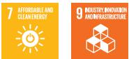</td><td></td></tr><tr><td>M</td><td>RE</td><td>100.0%</td><td>30</td><td>14,293</td><td>...</td><td>...</td><td>7,000,000</td><td>not disclosed</td><td>200.00</td><td>200.00</td><td>8.97</td><td>(9.15)</td><td>11</td><td>SUSTAINABLE CENS AND COMMUNITED</td></tr><tr><td colspan="8">Mongolia: Upscaling Renewable Energy Sector Project (3708/FY2018/FY2025). Develop 41-MW of renewable energy, the first of its kind, and distributed renewable energy system with a variety of renewable energy technologies supplying clean electricity and heat in geographically scattered load centers in the less-developed region of Western Mongolia. Once completed, the project will generate 99 GWh of clean electricity yearly, thereby enabling the country to reduce its  $CO_2$  emissions by 87,968 tons per year.</td><td colspan="5">Core subprojects: 10 MW of distributed renewable energy capacity installed in the western grid system, and 15.5 MW of renewable energy capacity with battery storage installed in the Altai-Uliastai grid system by 2021.Noncore subprojects: 15 MW of distributed renewable energy capacity installed in Altai-Uliastai grid system by 2022.500 kW of shallow-ground heat pumps installed in five selected aimag (province) centers by 2023.</td><td>7</td><td>AUTOMABLE AND CLEAN ENERGY</td></tr><tr><td>M</td><td>RE</td><td>100.0%</td><td>20 (wind)25 (solar)</td><td>NA</td><td>99,000</td><td>41.0</td><td>87,968</td><td>66.22</td><td>40.00</td><td>40.00</td><td>18.55</td><td>(1.45)</td><td></td><td></td></tr><tr><td colspan="8">Indonesia: Rantau Dedap Geothermal Power Project, Phase 2 (3647/FY2018/FY2021). Construct, operate, and maintain the project, with a design gross capacity of 98.4 MW and net capacity of 90.9 MW, in South Sumatra Province. It is located about 225 km southwest of Palembang across the administrative areas of Muara Enim Regency, Lahat Regency, and Pagar Alam City.</td><td colspan="5">90.9 MW of electricity generation capacity installed.At least 1,000 jobs provided during construction.</td><td>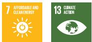</td><td></td></tr><tr><td>M</td><td>RE</td><td>100.0%</td><td>30</td><td>NA</td><td>702,500</td><td>90.9</td><td>403,000</td><td>709.00</td><td>177.50</td><td>177.50</td><td>175.32</td><td>(54.44)</td><td></td><td></td></tr><tr><td colspan="8">Indonesia: Eastern Indonesia Renewable Energy Project, Phase 2 (7550/3653-3656/FY2018/FY2018).Construct, operate, and maintain projects by Equis Group in Eastern Indonesia. Phase 2 consists of a 21-MW solar power plant and associated infrastructure in Likupang, North Sulawesi; and three 7-MW solar power plants and associated infrastructure in Pringgabaya, Selong, and Sengkol in Lombok, West Nusa Tenggara. Equis Group will develop and implement phase 2 under four 20-year build-own-operate power purchase agreements.</td><td colspan="5">42 MW of solar electricity generation capacity installed.About 800 jobs (at least 30 of them filled by women) provided during construction.One capacity-building training on renewable energy and entrepreneurial skills targeting women entrepreneurs conducted annually for the first 4 years.</td><td>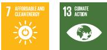</td><td></td></tr><tr><td>M</td><td>RE</td><td>100.0%</td><td>25</td><td>NA</td><td>61,000</td><td>42.0</td><td>41,400</td><td>53.56</td><td>12.49</td><td>12.49</td><td>12.49</td><td>(5.93)</td><td></td><td></td></tr><tr><td colspan="8">Kazakhstan: Baikonyr Solar Power Project (7556/3658/FY2018/FY2019). Support the design, construction, commissioning, operation, and maintenance of a 50-MWp ground-mounted solar power plant (along with associated infrastructure) and its integration into the grid. The main project components will include about 150,822 photovoltaic panels, 14 central inverter stations, and a substation. The project is located in southern Kazakhstan, about 30 km east of Kyzylorda, and will cover 150 ha.</td><td colspan="5">Solar power generation capacity increased by 50 MWp (nominal power).At least 150 jobs provided during construction.At least 30 jobs (5% of them filled by women) provided during operations.</td><td>7</td><td>AUTOMABLE AND CLEAN ENERGY</td></tr><tr><td>M</td><td>RE</td><td>100.0%</td><td>25</td><td>NA</td><td>73,000</td><td>50.0</td><td>40,800</td><td>72.00</td><td>12.00</td><td>12.00</td><td>10.23</td><td>(6.99)</td><td></td><td></td></tr><tr><td colspan="8">Viet Nam: Floating Solar Energy Project (7571/3723/FY2018/FY2019). Install 47.5-MW floating solar photovoltaic panels on the reservoir of the existing Da Mi Hydropower Plant; additional facilities include a floating central inverter, a grounded substation, and a new 3.5-km, 110-kV transmission line to connect with the national grid.</td><td colspan="5">47.5 MW of electricity generation photovoltaic capacity installed.Total transmission line increased by 3.5 km.At least 40 jobs provided during construction.At least 10 jobs provided during operations.</td><td>7</td><td>AUTOMABLE AND CLEAN ENERGY</td></tr><tr><td>M</td><td>RE</td><td>100.0%</td><td>25</td><td>NA</td><td>63,138</td><td>47.5</td><td>30,302</td><td>62.00</td><td>17.60</td><td>17.60</td><td>17.60</td><td>(11.37)</td><td></td><td></td></tr><tr><td colspan="8">China, People's Republic of: Eco-Industrial Park Waste-to-Energy Project (7576/3750/FY2018/FY2019).Support the construction and operation of a portfolio of waste-to-energy (WTE) plants using clean, state-of-the-art technology, including advanced flue gas emission control systems that can meet stringent environmental standards. Each WTE will help meet the need of municipalities to treat waste and supply electricity to the local grid, with potential to supply power and steam to treat various waste types within the park.</td><td colspan="5">60 MW of electricity generation capacity from WTE plants installed.Municipal solid waste treatment capacity increased to 3,000 tons per day.At least 40 jobs provided during construction.Technical training provided to at least 50 female staff.At least 150 new jobs (31 of them filled by women) provided during operations.</td><td rowspan="2">6 CLEAN WATER AND SANITATION</td><td rowspan="2">7 AUTOMATICABLE CLEAN ENERGY</td></tr><tr><td>M</td><td>RE</td><td>100.0%</td><td>40</td><td>NA</td><td>275,000</td><td>60.0</td><td>737,154</td><td>400.00</td><td>100.00</td><td>100.00</td><td>54.94</td><td>(29.88)</td></tr><tr><td colspan="8">Thailand: Thailand Green Bond Project (7579/3753 and 7579/3754/FY2018/FY2018).Issue corporate bonds for the construction and refinancing of 16 utility-scale solar power plants in Thailand; total installed capacity of the 16 plants is 98.5 MW, of which nine plants totaling 67.7 MW are completed and operational, while seven plants totaling 30.8 MW are under construction. B. Grimm will issue corporate bonds to which ADB will subscribe.</td><td colspan="5">30.8 MW in additional solar capacity for seven plants installed in Thailand by B. Grimm.Assurance report issued for green bond compliance, and climate bond certificate application submitted and approved by 2019.Five additional FTE local staff employed during operations by 2020.Fully disbursed.</td><td rowspan="2">7 AUTOMATICABLE CLEAN ENERGY</td><td rowspan="2"></td></tr><tr><td>M</td><td>RE</td><td>100.0%</td><td>25</td><td>NA</td><td>45,000</td><td>30.8</td><td>20,115</td><td>154.68</td><td>154.68</td><td>154.68</td><td>152.46</td><td>(42.10)</td></tr><tr><td colspan="8">Vanuatu: Energy Access Project (3572/FY2017/FY2022). Install hydropower generation to replace diesel generation in Malekula, and extend the distribution grid in both Malekula and Espiritu Santo.</td><td colspan="5">Hydropower of 400 kW generated by February 2023.In Espiritu Santo and Malekula, 1,050 new customers connected by October 2023, including subsidized connections to 100 households headed by women.In Espiritu Santo and Malekula, 21-km transmission line and 79-km distribution line constructed by October 2023.10 training workshops conducted by October 2019 for newly connected households, including power safety household utility budget and business skills training (with 40% women participation).Training activities, including gender awareness training, conducted for project management unit staff and government management.Fully disbursed.</td><td rowspan="2"></td><td rowspan="2"></td></tr><tr><td>M</td><td>RE</td><td>100.0%</td><td>30</td><td>NA</td><td>2,800</td><td>0.4</td><td>600</td><td>15.10</td><td>2.50</td><td>2.50</td><td>2.42</td><td>(0.06)</td></tr><tr><td colspan="8">Nepal: Power Transmission and Distribution Efficiency Enhancement Project (3542/FY2017/FY2025).Enhance the distribution capacity and improve reliability and quality of electricity supply in the Kathmandu Valley by reducing distribution system overload and technical and commercial losses, and strengthen associated transmission lines through the Nepal Electricity Authority.</td><td colspan="5">Two new 220/132-kV (160 MVA each) and one 132/11-kV (45 MVA) substations installed to complete the New Khimti-Kathmandu transmission link.Three new 132/11-kV (45 MVA each) substations established in Kathmandu Valley.Of 11-kV feeders, 300 km constructed and/or reinforced.Of 0.4-kV distribution lines, 600 km constructed and/or reinforced.1,000 new distribution transformers installed, with added capacity of 200 MVA.90,000 smart meters and associated communication facilities deployed and installed.</td><td rowspan="2">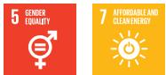</td><td rowspan="2"></td></tr><tr><td>M</td><td>EE</td><td>100.0%</td><td>30</td><td>6,500</td><td>NA</td><td>NA</td><td>54,400</td><td>189.00</td><td>150.00</td><td>150.00</td><td>119.93</td><td>(5.41)</td></tr><tr><td colspan="8">Kazakhstan: Total Eren Access M-KAT Solar Power Project (3770/FY2019/FY2025). Design, construct, and operate a 135-MW ground-mounted solar power plant, along with associated infrastructure and grid integration for further electricity sale at a fixed tariff; the total annual output from the project is expected to be 207 GWh.</td><td colspan="6">Solar power generation capacity increased by 135 MW.At least 200 jobs (5% of them filled by women) provided during construction.</td><td>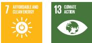</td></tr><tr><td>M</td><td>RE</td><td>100.0%</td><td>25</td><td>NA</td><td>207,000</td><td>135.0</td><td>120,500</td><td>165.52</td><td>41.38</td><td>41.38</td><td>28.26</td><td>(17.64)</td><td></td><td></td></tr><tr><td colspan="8">Mongolia: Sermsang Khushig Khundii Solar Project (3772/FY2019/FY2020). Construct and operate a 15-MW solar power plant and associated infrastructure in Khushig Valley, which is expected to generate a total of 22.3 GWh of clean electricity annually to be utilized by the new international airport and by Ulaanbaatar City.</td><td colspan="6">15 MW of renewable electricity generation capacity installed.14-km transmission lines installed or upgraded.Policy and strategy for gender-inclusive employment within Sermsang Power Corporation Public Company Limited (SSP) and Tenuun Gerel Construction LLC (TGC) developed and implemented.At least 52 person-years of jobs provided during construction.At least 13 jobs provided during operations (two of them filled by women: one technical and one management).</td><td>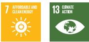</td></tr><tr><td>M</td><td>RE</td><td>100.0%</td><td>25</td><td>NA</td><td>22,300</td><td>15.0</td><td>24,400</td><td>18.70</td><td>9.60</td><td>9.60</td><td>9.60</td><td>(5.98)</td><td></td><td></td></tr><tr><td colspan="8">Regional: Pacific Renewable Energy Program (3784/FY2019/NA). Provide an umbrella facility to deliver financing support, including loans, guarantees, and letters of credit, to overcome the constraints to private sector investment in renewable power projects in Pacific island countries.</td><td colspan="6">Five investments in renewable energy generation projects supported, with at least two projects categorized as having some gender elements.Program's loans and guarantees obligations reached $50 million.Fully disbursed.</td><td>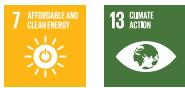</td></tr><tr><td>M</td><td>RE</td><td>80.0%</td><td>25-30</td><td>NA</td><td>NA</td><td>NA</td><td>NA</td><td>100.00</td><td>50.00</td><td>50.00</td><td>-</td><td>-</td><td></td><td></td></tr><tr><td colspan="8">Cambodia: National Solar Park (3789/FY2019/FY2024). Support the expanded deployment of solar photovoltaic power plants in Cambodia and address the country's need to (i) expand low-cost power generation; (ii) diversify the power generation mix with an increase in the percentage of clean energy, in line with its greenhouse gas emission reduction targets; and (iii) expand the use of competitive tenders and other global best practices in the energy sector.</td><td colspan="6">Solar park and transmission interconnection constructed.Capacity of Electricité du Cambodge in solar power plant construction and operation, project design and supervision, grid integration, and competitive procurement strengthened.Fully disbursed.</td><td>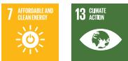</td></tr><tr><td>A and M</td><td>RE</td><td>84.7%</td><td>&gt;25</td><td>NA</td><td>NA</td><td>NA</td><td>NA</td><td>26.71</td><td>7.64</td><td>7.64</td><td>7.10</td><td>(0.07)</td><td></td><td></td></tr><tr><td colspan="8">Solomon Islands: Tina River Hydropower (3828/FY2019/NA). Design, construct, and operate a 15-MW hydropower plant on the Tina River, which will supply electricity to Honiara, the capital of Solomon Islands. The project, which is estimated to generate 68% of Honiara's electricity needs, will reduce the cost of power supply generation by replacing diesel power with hydropower. It will also reduce greenhouse gas (GHG) emissions.</td><td colspan="6">15 MW of hydropower plant commissioned by the special project company.20 km of access road constructed.23 km of 33-kV transmission line erected.</td><td>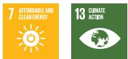</td></tr><tr><td>A and M</td><td>RE</td><td>80.0%</td><td>30</td><td>NA</td><td>76,900</td><td>15.0</td><td>49,500</td><td>222.57</td><td>18.00</td><td>18.00</td><td>-</td><td>-</td><td></td><td></td></tr></table>

<table><tr><td colspan="8">Project Name (Number/Year Loan Approved) and Description linked to the project page for more information</td><td colspan="5">Target  $Results^b$ </td><td></td></tr><tr><td> $A/M^a$ </td><td>RE or EE</td><td>Share of Clean Energy Component</td><td> $Project Life (Years)^b$ </td><td>Annual Energy Savings ( $MWh)^b$ </td><td>Annual Energy Produced ( $MWh)^b$ </td><td>Renewable Capacity Added ( $MW)^b$ </td><td>Annual GHG Emission Avoided ( $ton\ of\ CO_2 equivalent)^b$ </td><td>Total Project Cost ($ million)</td><td>Loan Approval ( $$ million)^c$ </td><td>Eligibility for Green Bonds ( $$ million)^d$ </td><td>Allocated Amount ( $$ million)^e$ </td><td>Reflow Amount ( $$ million)^f$ </td><td>Sustainable Development Goals</td></tr><tr><td colspan="8">Viet Nam: Gulf Solar Power Project (3852/FY2019/FY2020). Construct and operate a 50-MW solar power plant and associated transmission line in the Thanh Thanh Cong Industrial Zone of Tay Ninh Province.</td><td colspan="5">50 MW of solar photovoltaic electricity generation capacity installed.At least 14 jobs provided during operations, with sex-disaggregated data collected.</td><td>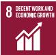</td></tr><tr><td>M</td><td>RE</td><td>100.0%</td><td>25</td><td>NA</td><td>62,000</td><td>50.0</td><td>29,760</td><td>51.50</td><td>11.30</td><td>11.30</td><td>11.30</td><td>(3.57)</td><td>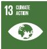</td></tr><tr><td colspan="8">Viet Nam: B. Grimm Viet Nam Solar Power Project (Phu Yen Project) (3902/FY2020/FY2025). Operate a 257-MW solar photovoltaic power plant and its associated facilities in Phu Yen Province.</td><td colspan="5">Total installed solar photovoltaic electricity generation capacity of the project increased to 257 MW by 2019—the solar plant achieved commercial operations in June 2019 (2018 baseline: 0).Transmission lines (220 kV) installed or upgraded increased to 12.2 km by 2019 (2018 baseline: 0).</td><td>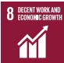</td></tr><tr><td>M</td><td>RE</td><td>100.0%</td><td>...</td><td>...</td><td>...</td><td>257.0</td><td>123,000</td><td>186.00</td><td>27.90</td><td>27.90</td><td>28.11</td><td>(6.89)</td><td>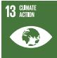</td></tr><tr><td colspan="8">India: Gujarat Solar Power Project (3904/FY2020/FY2025). Construct a 200-MW solar photovoltaic-based power plant in the state of Gujarat in India.</td><td colspan="5">Electricity delivered to offtaker increased to 439 gigawatt-hours (GWh) per year by 2022.At least 22 jobs provided during operation—of which four are for women—by 2022.200 MW of electricity-generating capacity installed by 2021.At least 400 jobs provided during construction—of which 30% are for women—by 2021.</td><td rowspan="2">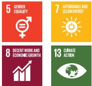</td></tr><tr><td>M</td><td>RE</td><td>100.0%</td><td>...</td><td>...</td><td>439,000</td><td>200.0</td><td>385,000</td><td>152.40</td><td>65.50</td><td>65.50</td><td>66.18</td><td>(19.72)</td></tr><tr><td colspan="8">Thailand: Green Loan for Renewable Energy and Electric Vehicle Charging Network (EVCN) (7644/3966/FY2020/FY2021). Support Thailand&#x27;s renewable energy sector, increase awareness about green loans, and support the transition from a conventional automotive industry to an electric vehicle industry in Thailand by establishing a comprehensive EVCN across Thailand&#x27;s major cities.</td><td colspan="5">Loan to Energy Absolute is certified as a climate loan by 2020 (2019 baseline: NA).Comprehensive electric vehicle charging network comprising at least 2,800 charging outlets established by 2022 (2019 baseline: 1,000).Pre- and post-issuance reports for climate loan certification are submitted to the Climate Bonds Initiative by 2020.Electricity delivery of the Nakornsawan Solar Power Project and the Hanuman Wind Power Project to offtaker continued at similar level until 2022 (2019 baseline: 620 GWh/year).</td><td rowspan="2">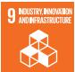</td></tr><tr><td>M</td><td>RE</td><td>100.0%</td><td>...</td><td>...</td><td>...</td><td>...</td><td>53,250</td><td>47.62</td><td>47.62</td><td>44.44</td><td>49.60</td><td>(27.11)</td></tr><tr><td colspan="8">Uzbekistan: Navoi Solar Power Project (7647/3986/FY2020/FY2022). Construct a 100-MW, grid-connected solar power plant in Navoi District, Uzbekistan.</td><td colspan="5">Renewable electricity delivered by the project to the offtaker increased to at least 258.2 GWh per year by 2023.Number of jobs provided during operation totaled at least 22—of which three are for women—by 2023.Total installed electricity generation capacity of project increased to 100 MW by 2022.Number of jobs provided during construction totaled at least 900—of which 15 are for  $women^b$ —by 2022.</td><td rowspan="2">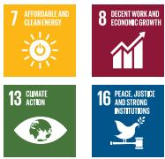</td></tr><tr><td>M</td><td>RE</td><td>100.0%</td><td>...</td><td>...</td><td>258,200</td><td>100.0</td><td>157,502</td><td>21.00</td><td>13.00</td><td>13.00</td><td>9.51</td><td>(2.88)</td></tr></table>

<table><tr><td colspan="8">Project Name (Number/Year Loan Approved) and Description linked to the project page for more information</td><td colspan="5">Target Resultsb</td><td></td><td></td><td></td><td></td></tr><tr><td>A/Ma</td><td>RE or EE</td><td>Share of Clean Energy Component</td><td>Project Life (Years)b</td><td>Annual Energy Savings (MWh)b</td><td>Annual Energy Produced (MWh)b</td><td>Renewable Capacity Added (MW)b</td><td>Annual GHG Emission Avoided (ton of CO2 equivalent)b</td><td>Total Project Cost ($ million)</td><td>Loan Approval ($ million)c</td><td>Eligibility for Green Bonds ($ million)d</td><td>Allocated Amount ($ million)e</td><td>Reflow Amount ($ million)f</td><td>Sustainable Development Goals</td><td></td><td></td><td></td></tr><tr><td rowspan="3" colspan="8">Maldives: Preparing Outer Islands for Sustainable Energy Development Project, Additional Financing (3995/FY2020/FY2025). Install equipment for solar diesel hybrid grids on about 160 islands. The project will replace inefficient diesel-based power generation grids with hybrid systems of both renewable energy and diesel.</td><td rowspan="3" colspan="7">Gradual reduction in diesel consumption to 0.1–0.3 liters/kWh on outer islands by 2024 (2012 baseline: 0.45–0.70 liters/kWh consumed on outer islands).Electricity tariffs on average improved to cover closer to 100% of costs by 2024 (2011 baseline: Present retail tariffs on average cover less than 50% of costs).24.5 MW of solar photovoltaic capacity installed by the project and the private sector, 9.5 MWh of energy storage designed and installed, 20 MW of diesel generator sets replaced, and distribution grids in 160 islands upgraded by 2023 (2018 baseline: 10.5 MW of solar photovoltaic, 5.0 MWh of energy storage, and 12.0 MW of diesel generator sets).Solar–photovoltaic-based ice-making machines installed in four outer islands by 2023.Disaster-resilient distribution system installed in one island by 2023.One renewable-energy-operated ferry for transport developed by 2023.Road map for transition to renewable energy including procurement, project management, technical and financial management, and safeguard support; and renewable energy pilot projects identified in the road map implemented by 2023.</td><td>5 GENDER EQUALITY</td><td>7 AFFORDABLE AND CLEAN ENERGY</td></tr><tr><td>9 INDUSTRY INNOVATION AND INFRASTRUCTURE</td><td>12 RESPONSIBLE CONSUMPTION AND PRODUCTION</td><td></td><td></td></tr><tr><td>13 CRIATE ACTION</td><td></td><td></td><td></td></tr><tr><td>A and M</td><td>RE and EE</td><td>100.0%</td><td>...</td><td>...</td><td>...</td><td>24.5</td><td>4,501</td><td>11.00</td><td>7.74</td><td>7.74</td><td>6.71</td><td>(0.08)</td><td></td><td></td><td></td><td></td></tr><tr><td rowspan="3" colspan="8">India: Meghalaya Power Distribution Sector Improvement Project (3996/FY2020/FY2025). Strengthen and modernize the power distribution network, reduce technical and commercial losses, and improve the power quality of the distribution network in Meghalaya State.</td><td rowspan="3" colspan="7">23 new 33/11 kV substations commissioned by 2025.45 existing 33/11 kV substations upgraded and modernized by 2025.1,440 km of new 33-kV and 11-kV distribution lines installed, and 774 km of existing distribution lines upgraded by 2025.136 auto-reclosers and 597 fault passage indicators installed in the networks by 2025Distribution network connecting 100% of households in three selected villages to minigrid system renovated by 2025.Smart meters installed in 180,000 households by 2024.Online meter reading, billing, and collection system installed for 75,000 households by 2024.One new meter-testing laboratory installed and commissioned by 2024.</td><td>1 NO POVERTY</td><td>5 GENDER EQUALITY</td></tr><tr><td>7 AFFORDABLE AND CLEAN ENERGY</td><td>9 INDUSTRY INNOVATION AND INFRASTRUCTURE</td><td></td><td></td></tr><tr><td>13 CRIATE ACTION</td><td></td><td></td><td></td></tr><tr><td>A and M</td><td>EE</td><td>89.2%</td><td>...</td><td>...</td><td>...</td><td>...</td><td>162,022</td><td>168.00</td><td>132.80</td><td>118.40</td><td>74.90</td><td>(6.89)</td><td></td><td></td><td></td><td></td></tr></table>

<table><tr><td colspan="9">Project Name (Number/Year Loan Approved) and Description linked to the project page for more information</td><td colspan="5">Target  $Results^b$ </td><td></td><td></td></tr><tr><td> $A/M^a$ </td><td>RE or EE</td><td>Share of Clean Energy Component</td><td> $Project Life (Years)^b$ </td><td>Annual Energy Savings ( $MWh$ )b</td><td>Annual Energy Produced ( $MWh$ )b</td><td>Renewable Capacity Added ( $MW$ )b</td><td>Annual GHG Emission Avoided ( $ton\ of\ CO_2$  equivalent)b</td><td>Total Project Cost ($ million)</td><td>Loan Approval ( $$ million$ )c</td><td>Eligibility for Green Bonds ( $$ million$ )d</td><td>Allocated Amount ( $$ million$ )e</td><td>Reflow Amount ( $$ million$ )f</td><td colspan="2">Sustainable Development Goals</td><td></td></tr><tr><td rowspan="4" colspan="8">China, People&#x27;s Republic of: Air Quality Improvement in the Greater Beijing-Tianjin-Hebei (BTH) Region—Green Financing Scale up Project (4023/FY2020/FY2023). Address emerging challenges in air quality improvement and GHG emission reduction in both the greater BTH and Yangtze River Delta regions through energy efficiency, cleaner transport systems development, renewable energy development, and cooling systems retrofit.</td><td rowspan="4" colspan="5">By 2027:At least 449 tons of nitrogen oxide, 67 tons of sulfur dioxide, and 44 tons of particulate matter emissions avoided annually.At least 0.8 million tons of  $CO_2$  equivalent, including hydrofluorocarbons (HFCs), reduced annually.By 2026:At least one fast electric vehicle charging system demonstrated.At least four cooling systems renovated for HFC emission reduction.At least two renewable energy systems with high conversion efficiency developed in the targeted region.Fully disbursed.</td><td>1 NO POVERTY</td><td>5 CONDER EQUALITY</td><td></td></tr><tr><td>7 AFFORDABLE AND CLEAN ENERGY</td><td>8 DECENT WORK AND ECONOMIC GROWTH</td><td></td></tr><tr><td>9 INDUSTRY FINANCIAL AND INFRASTRUCTURE</td><td>10 REDUCED AND RESOURCES</td><td></td></tr><tr><td>12 RESPONSIBLE CONSUMPTION AND PRODUCTION</td><td>13 CREAT SYSTEM</td><td></td></tr><tr><td>M</td><td>RE and EE</td><td>90.0%</td><td>...</td><td>...</td><td>...</td><td>...</td><td>800,000</td><td>650.78</td><td>150.00</td><td>135.00</td><td>74.20</td><td>(6.49)</td><td></td><td></td><td></td></tr><tr><td colspan="8">India: Bengaluru Smart Energy Efficient Power Distribution Project (4028/FY2020/FY2025). Convert overhead distribution lines to underground cables and install automated ring main units adapted with a distribution automation system (DAS) in urban Bengaluru City.</td><td colspan="5">7,200 km of 11-kV and 1.1-kV overhead distribution lines converted to underground cables—with 2,800 km of optical fiber cables—by 2025.1,700 automated ring main units installed adapted with a distribution automation system by 2025.Operation and maintenance manual for underground cables, reflecting international good practices, developed by 2025.Environmental and social management system developed and adopted by the management of Bengaluru Electricity Supply Company Limited, and at least three relevant staff trained to implement the system by 2025.</td><td>7 AFFORDABLE AND CLEAN ENERGY</td><td>11 CUSTAINABLE POWER AND COMMUNITIES</td><td></td></tr><tr><td>A and M</td><td>EE</td><td>26.3%</td><td>...</td><td>losses down to 9.1%</td><td>...</td><td>...</td><td>113,653</td><td>277.30</td><td>100.00</td><td>26.30</td><td>26.20</td><td>(3.08)</td><td></td><td></td><td></td></tr><tr><td colspan="8">Bangladesh: Bangladesh Power System Enhancement and Efficiency Improvement Project, Additional Financing (4039-4040/FY2020/FY2025). Further improve distribution network in rural areas of Bangladesh over the original project.</td><td colspan="6">About 1,100,000 new connections, including 1,025,000 rural households, connected to electricity network and benefiting at least 875,000 women by 2026.Average system interruption duration index for Dhaka Electric Supply Company Limited-operated areas of Dhaka city decreased by at least 25% by 2026.Average system interruption duration index for Bangladesh Rural Electrification Board decreased by at least 22% by 2026.Transmission losses reduced to 2.5% by 2026.Rural distribution losses reduced to 9.0% by 2026.Tariffs reviewed annually and reset to increasingly cover costs of transmission and distribution utilities in accordance with the approved regulations.About 174 km of 400-kV transmission lines and associated facilities constructed by 2025.Distribution automation system in Dhaka city installed by 2025.More than 38,000 km of 33-kV and 11-kV distribution lines and associated facilities rehabilitated by 2025.</td><td>7 AFFORDABLE AND CLEAN ENERGY</td><td>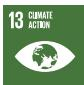</td></tr></table>

<table><tr><td colspan="9">Project Name (Number/Year Loan Approved) and Description linked to the project page for more information</td><td colspan="5">Target Resultsb</td><td rowspan="2">Sustainable Development Goals</td><td></td><td></td><td></td><td></td><td></td><td></td><td></td></tr><tr><td>A/Ma</td><td>RE or EE</td><td>Share of Clean Energy Component</td><td>Project Life (Years)b</td><td>Annual Energy Savings (MWh)b</td><td>Annual Energy Produced (MWh)b</td><td>Renewable Capacity Added (MW)b</td><td>Annual GHG Emission Avoided (ton of CO2 equivalent)b</td><td>Total Project Cost ($ million)</td><td>Loan Approval ($ million)c</td><td>Eligibility for Green Bonds ($ million)d</td><td>Allocated Amount ($ million)e</td><td>Reflow Amount ($ million)f</td><td></td><td></td><td></td><td></td><td></td><td></td><td></td><td></td></tr><tr><td></td><td></td><td></td><td></td><td></td><td></td><td></td><td></td><td colspan="5">• More than 15,990 km of 33-kV and 11-kV distribution lines and associated facilities designed with elders, women, children, and differently abled (EWCD) considerations by 2025.</td><td></td><td></td><td></td><td></td><td></td><td></td><td></td><td></td><td></td></tr><tr><td>M</td><td>EE</td><td>3.9%</td><td>...</td><td>reduce transmission losses from 3% to 2.5%, and distribution losses from 12.5% to 9%</td><td>...</td><td>...</td><td>68,727</td><td>313.50</td><td>200.00</td><td>7.80</td><td>3.11</td><td>(0.07)</td><td></td><td></td><td></td><td></td><td></td><td></td><td></td><td></td><td></td></tr><tr><td colspan="8">Nepal: Electricity Grid Modernization Project (4014/FY2020/FY2025). Finance high-priority electricity grid modernization investments in both transmission and distribution systems in Nepal.</td><td colspan="12">• By March 2026, 34 existing grid substations throughout the country automated.• By March 2026, 25 km of new 220-kV and 88 km of 132-kV transmission lines constructed.• New automated 220-kV grid substations totaling 400 MVA in Lapang and Rahughat; and 132 kV totaling 361.5 MVA installed in Borang, Dandakhet, Keraun, Lapang, Madichaur, Pangtang, and Rahughat by March 2026.• Existing 144 km of transmission lines (132 kV and 66 kV) upgraded with more efficient high-temperature low-sag conductors in Province 1, Province 2, and Bagmati Province by March 2026.• Distribution command and control center in Kathmandu commissioned with at least 30% female staff by March 2026.• New smart meters for 350,000 customers in Kathmandu Valley installed by March 2026.• Distribution system consisting of 30 km of 33-kV distribution lines in Morang district and four automated substations of 32 MVA 33/11 kV in various parts of the country commissioned, benefiting 134,000 households with improved supply by March 2026.</td><td>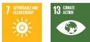</td><td></td></tr><tr><td>A and M</td><td>EE</td><td>58.1%</td><td>...</td><td>system losses reduced to 15%</td><td>...</td><td>...</td><td>34,716</td><td>195.00</td><td>156.00</td><td>90.70</td><td>41.08</td><td>(0.98)</td><td></td><td></td><td></td><td></td><td></td><td></td><td></td><td></td><td></td></tr><tr><td colspan="8">India: Bengaluru Smart Energy Efficient Power Distribution Project (4024/FY2020/FY2021). Convert overhead distribution lines to underground cables and install automated ring main units adapted with a distribution automation system (DAS) in urban Bengaluru City.</td><td colspan="6">• 7,200 km of 11-kV and 1.1-kV overhead distribution lines converted to underground cables—with 2,800 km of optical fiber cables—by 2025.• 1,700 automated ring main units installed adapted with a distribution automation system by 2025.• Operation and maintenance manual for underground cables, reflecting international good practices, developed by 2025.• Environmental and social management system developed and adopted by the management of Bengaluru Electricity Supply Company Limited, and at least three relevant staff trained to implement the system by 2025.</td><td>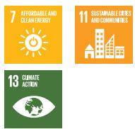</td><td></td><td></td><td></td><td></td><td></td><td></td><td></td></tr><tr><td>A and M</td><td>EE</td><td>26.3%</td><td>...</td><td>...</td><td>...</td><td>...</td><td>113,653</td><td>277.30</td><td>90.00</td><td>23.70</td><td>0.01</td><td>(0.14)</td><td></td><td></td><td></td><td></td><td></td><td></td><td></td><td></td><td></td></tr></table>

<table><tr><td colspan="14">Project Name (Number/Year Loan Approved) and Description linked to the project page for more information</td></tr><tr><td colspan="14">Target  $Results^b$ </td></tr><tr><td> $A/M^a$ </td><td>RE or EE</td><td>Share of Clean Energy Component</td><td>Project Life (Years) $^b$ </td><td>Annual Energy Savings ( $MWh$ ) $^b$ </td><td>Annual Energy Produced ( $MWh$ ) $^b$ </td><td>Renewable Capacity Added ( $MW$ ) $^b$ </td><td>Annual GHG Emission Avoided (ton of  $CO_2$  equivalent) $^b$ </td><td>Total Project Cost ($ million)</td><td>Loan Approval ( $million)^c$ </td><td>Eligibility for Green Bonds ( $million)^d$ </td><td>Allocated Amount ( $million)^e$ </td><td>Reflow Amount ( $million)^f$ </td><td>Sustainable Development Goals</td></tr><tr><td colspan="8">Cambodia: Prime Road National Solar Park Project (4048/FY2021/FY2023). Support the Prime Road Alternative (Cambodia) Co. Ltd to develop and operate a 60-MW, alternating current, solar photovoltaic power plant in Kampong Chhnang Province.</td><td colspan="5">By 2023, annual amount of emission reductions achieved: 110,700 tons of carbon dioxide (2020 baseline: 0).</td><td></td></tr><tr><td>M</td><td>RE</td><td>100.0%</td><td>...</td><td>...</td><td>135,000</td><td>60</td><td>110,700</td><td>41.20</td><td>4.80</td><td>4.80</td><td>4.70</td><td>(1.33)</td><td>9 INDUSTRIAN REUNDED CONSTRUCTION</td></tr><tr><td colspan="8">Azerbaijan: ALAT Solar Power (Masdar Azerbaijan Energy Ltd. Liability Co.) (4182/FY2022/NA). Construct a 230-MW solar photovoltaic power plant near Alat settlement.</td><td colspan="5">By 2024, 230-MW solar power capacity installed (2021 baseline: 0).</td><td rowspan="2"></td></tr><tr><td>M</td><td>RE</td><td>100.0%</td><td>...</td><td>...</td><td>558,000</td><td>230</td><td>255,400</td><td>not disclosed</td><td>35.70</td><td>35.70</td><td>-</td><td>-</td></tr><tr><td colspan="8">Uzbekistan: Zarafshan Wind Power Project (4197/FY2022/NA). Provide long-term financing for a 500-MW, grid-connected wind power project. It will consist of 111 wind turbines, each with 4.7-MW capacity.</td><td colspan="5">By 2026, an annual emission of at least 892,137  $tCO_2$  avoided (2021 baseline: 0). By 2025, at least 500 MW of wind power plant constructed and commissioned (2021 baseline: 0).</td><td rowspan="2">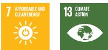</td></tr><tr><td>M</td><td>RE</td><td>100.0%</td><td>...</td><td>...</td><td>...</td><td>500</td><td>892,137</td><td>not disclosed</td><td>65.00</td><td>65.00</td><td>-</td><td>-</td></tr><tr><td colspan="8">Lao People&#x27;s Democratic Republic: Monsoon Wind Power Project (4243/FY2022/NA). Construct a wind power project with a contracted capacity of 600 MW in Lao People&#x27;s Democratic Republic (Lao PDR) that will export and sell electricity into neighboring Viet Nam.</td><td colspan="5">By 2026: Wind energy generation capacity increased to 600 MW (2022 baseline: 0). 500-kV transmission line with a length of 22 km within the Lao PDR to Viet Nam border established (2022 baseline: 0).</td><td rowspan="2"></td></tr><tr><td>M</td><td>RE</td><td>100.0%</td><td>25</td><td>NA</td><td>1,519,000</td><td>600</td><td>748,867</td><td>946.50</td><td>100.00</td><td>100.00</td><td>-</td><td>-</td></tr><tr><td colspan="8">Viet Nam: AC Energy Wind Project (4240/FY2022/NA). Construct an 88-MW wind farm in Ninh Thuan Province.</td><td colspan="5">By 2023: Electricity delivered to the offtaker increased to 240.28 GWh per year (2020 baseline: 0). $^b$  Annual greenhouse gas emissions of 118,458  $tCO_2$ e avoided (2020 baseline: 0). By 2023 unless otherwise stated: Total installed wind electricity generation capacity of the project increased to 88 MW by September 2021 (2020 baseline: 0). 220-kV transmission line installed increased by 3 km by September 2021 (2020 baseline: 0).</td><td rowspan="2">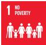 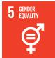</td></tr><tr><td>M</td><td>RE</td><td>100.0%</td><td>...</td><td>...</td><td>240,280</td><td>88</td><td>118,458</td><td>not disclosed</td><td>35.00</td><td>35.00</td><td>-</td><td>-</td></tr><tr><td colspan="8">Bhutan: Renewable Energy for Climate Resilience Project (4231/FY2022/FY2025). Construct one solar photovoltaic power plant located in central-west Bhutan with a minimum total capacity of 17.38 MWp.</td><td colspan="5">By 2026: 25 GWh of solar power generated annually (2020 baseline: 0 GWh). By 2025: One solar photovoltaic power plant with a total capacity of 17.38 MWp of power commissioned in central-west Bhutan, and connected to the grid (2020 baseline: 0 MW).</td><td rowspan="2">1 NO POVERTY 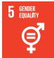</td></tr><tr><td>A</td><td>RE</td><td>100.0%</td><td>...</td><td>...</td><td>25,000</td><td>17.38</td><td>0</td><td>19.25</td><td>8.26</td><td>8.26</td><td>5.20</td><td>-</td></tr></table>

<table><tr><td colspan="9">Project Name (Number/Year Loan Approved) and Description linked to the project page for more information</td><td colspan="5">Target  $Results^b$ </td><td></td></tr><tr><td> $A/M^a$ </td><td>RE or EE</td><td>Share of Clean Energy Component</td><td> $Project\ Life$ (Years) $^b$ </td><td>Annual Energy Savings(MWh) $^b$ </td><td>Annual Energy Produced(MWh) $^b$ </td><td>Renewable Capacity Added(MW) $^b$ </td><td>Annual GHG Emission Avoided(ton of CO2equivalent) $^b$ </td><td>Total Project Cost($ million)</td><td>Loan Approval($ million) $^c$ </td><td>Eligibility for Green Bonds($ million) $^d$ </td><td>Allocated Amount($ million) $^e$ </td><td>Reflow Amount($ million) $^f$ </td><td colspan="2">Sustainable Development Goals</td></tr><tr><td colspan="8">Uzbekistan: Jizzakh Solar Power Project (4303/FY2023/NA). Construct a 220-MW grid-connected solar power plant and associated infrastructure in the Jizzakh region.</td><td colspan="5">By 2026:Electricity delivered to offtaker increased by 573 GWh per year (2022 baseline: 0).Emissions of carbon dioxide reduced by 319,505 tons per year (2022 baseline: 0)(OP 3.1).Total installed solar electricity generation capacity of the project increased by 220 MW (2022 baseline: 0) (OP 3.1.4).15-km feeder line and 220-kV substation constructed to connect the solar plant to the grid (2022 baseline: 0).</td><td>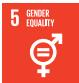</td><td>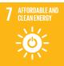</td></tr><tr><td>M</td><td>RE</td><td>100.0%</td><td>...</td><td>...</td><td>573,000</td><td>220</td><td>319,505</td><td>206.50</td><td>32.60</td><td>32.60</td><td>-</td><td>-</td><td></td><td></td></tr><tr><td colspan="8">Uzbekistan: Sherabad Solar Power Project (4301/FY2023/NA). Construct a 457-MW grid-connected solar power plant and associated infrastructure in the Sherabad region.</td><td colspan="5">By 2026:Total installed solar electricity generation capacity increased by 457 MW (2022 baseline: 0) (OP 3.1.4).51-km transmission line and 220-kV substation constructed to connect the solar plant to the grid (2022 baseline: 0).At least one set of dedicated facilities for women per adequate number of women employees constructed at Sherabad plant (2022 baseline: 0) (OP 2.4.1).</td><td>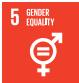</td><td>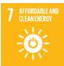</td></tr><tr><td>M</td><td>RE</td><td>100.0%</td><td>...</td><td>...</td><td>1,063,000</td><td>457</td><td>592,850</td><td>431.20</td><td>55.45</td><td>55.45</td><td>-</td><td>-</td><td></td><td></td></tr><tr><td colspan="8">Uzbekistan: Bash Wind Power Project (4293/FY2023/NA). Construct a 500-MW grid-connected wind power project in the Bukhara region.</td><td colspan="5">By 2025:Electricity generated from renewable energy sources increased to 1,658 GWh per year (2022 baseline: 0).Annual emissions of 924,881 tons of carbon dioxide avoided (2022 baseline: 0)(OP 3.1).Total installed wind electricity generation capacity increased to 500 MW (2022 baseline: 0) (OP 3.1.4).</td><td></td><td>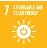</td></tr><tr><td>M</td><td>RE</td><td>100.0%</td><td>...</td><td>...</td><td>1,658,000</td><td>500</td><td>924,881</td><td>690.10</td><td>50.00</td><td>50.00</td><td>-</td><td>-</td><td></td><td></td></tr><tr><td colspan="8">Uzbekistan: Dzhankeldy Wind Power Project (4294/FY2023/NA). Construct a 500-MW grid-connected wind power project in the Bukhara region.</td><td colspan="5">By 2025:Electricity generated from sources increased to 1,577 GWh per year (2022 baseline: 0).Annual emissions of 879,907 tons of carbon dioxide reduced (2022 baseline: 0)(OP 3.1).Total installed wind electricity generation capacity increased to 500 MW (2022 baseline: 0) (OP 3.1.4).</td><td colspan="2">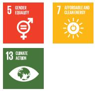</td></tr><tr><td>M</td><td>RE</td><td>100.0%</td><td>...</td><td>...</td><td>1,577,000</td><td>500</td><td>879,907</td><td>656.50</td><td>50.00</td><td>50.00</td><td>-</td><td>-</td><td></td><td></td></tr><tr><td colspan="8">Project Name (Number/Year Loan Approved) and Description linked to the project page for more information</td><td colspan="5">Target  $Results^b$ </td><td rowspan="2">Sustainable Development Goals</td><td></td></tr><tr><td> $A/M^a$ </td><td>RE or EE</td><td>Share of Clean Energy Component</td><td> $Project\ Life (Years)^b$ </td><td>Annual Energy Savings ( $MWh$ )b</td><td>Annual Energy Produced ( $MWh$ )b</td><td>Renewable Capacity Added ( $MW$ )b</td><td>Annual GHG Emission Avoided (ton of  $CO_2$  equivalent)b</td><td>Total Project Cost ($ million)</td><td>Loan Approval ( $$ million$ )c</td><td>Eligibility for Green Bonds ( $$ million$ )d</td><td>Allocated Amount ( $$ million$ )e</td><td>Reflow Amount ( $$ million$ )f</td><td></td></tr><tr><td colspan="8">Uzbekistan: Samarkand Solar Power Project (4302/FY2023/NA). Construct a 220-MW grid-connected solar power plant and associated infrastructure in the Samarkand region.</td><td colspan="5">By 2026:Electricity delivered to the offtaker increased by 554 GWh per year (2022 baseline: 0).Annual emissions of 309,054 tons of carbon dioxide reduced (2022 baseline: 0) (OP 3.1).Total installed solar electricity generation capacity of the project increased to 220 MW (2022 baseline: 0) (OP 3.1.4).4.5-km feeder line and 220-kV substation constructed to connect the solar plant to the grid (2022 baseline: 0).</td><td>5 GREENER TOLERANCE7 CUSTAINABLE AND CLEAN ENERGY13 CHINA'S GREENER TOLERANCE</td><td></td></tr><tr><td>M</td><td>RE</td><td>100.0%</td><td>...</td><td>...</td><td>554,000</td><td>220</td><td>309,054</td><td>202.20</td><td>31.43</td><td>31.43</td><td>-</td><td>-</td><td></td><td></td></tr><tr><td colspan="8">Viet Nam: GreenYellow Smart Solutions Rooftop Solar Project (4329/FY2023/NA). Construct 45 rooftop solar photovoltaic systems on the premises of large commercial and industrial consumers throughout Viet Nam, with a total installed capacity of 32.3 MW.</td><td colspan="5">By 2025:Electricity delivered to offtakers increased to 31.5 GWh per year (2019 baseline: 0).Total installed capacity of a portfolio of 45 solar photovoltaic rooftop systems increased to 32.3 MWp by 2023 (2019 baseline: 0) (OP 3.1.4; OP 4.1.2).</td><td></td><td></td></tr><tr><td>M</td><td>RE</td><td>100.0%</td><td>...</td><td>...</td><td>31,500</td><td>32.3</td><td>...</td><td>not disclosed</td><td>3.30</td><td>3.30</td><td>-</td><td>-</td><td></td><td></td></tr><tr><td colspan="8">Maldives: Accelerating Sustainable System Development Using Renewable Energy Project (4344/FY2023/NA). Improve energy security and the sustainable transition of the power sector. It will help 20 outer islands attain higher levels of renewable energy penetration through capital-intensive investments in energy storage and associated technologies to ensure island grids are ready for higher renewable energy penetration.</td><td colspan="6">By 2029:Annual diesel consumption of at least 20 outer islands reduced by at least 45%, totaling a saving of 8.6 million liters per year (2021 baseline: 2.1 million diesel savings based on current 10%-12% renewable penetration) (OP 3.1).Share of clean energy sources in power generation mix in at least 20 outer islands increased to 43% (2021 baseline: 12%-15%) (OP 3.1).Carbon dioxide emissions of 22,047 tons per year avoided because of switching from diesel-based generation to renewable-energy-based generation (2021 baseline: 5,800 avoided  $CO_2$  tons per year based on current 10%-12% renewable penetration) (OP 3.1).By 2028:At least 20 MW of solar photovoltaic systems from floating and terrestrial installations commissioned through the private sector (2019 baseline: 0) (OP 3.1.3, OP 5.1.1).At least 44 MWh of energy storage and energy management system installed (2018 baseline: NA) (OP 3.1.3).Distribution grids upgraded in 20 outer islands (2018 baseline: NA) (OP 3.1.3, OP 5.1.1).</td><td>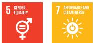</td></tr><tr><td>M</td><td>RE</td><td>100.0%</td><td>...</td><td>...</td><td>...</td><td>20</td><td>22,047</td><td>100.47</td><td>8.50</td><td>8.50</td><td>-</td><td>-</td><td></td><td></td></tr><tr><td colspan="8">Philippines: Buskowitz Rooftop Solar Project (4367/FY2023/NA). Construct a portfolio of rooftop photovoltaic power systems of up to 70 MW on commercial and industrial buildings in the Philippines.</td><td colspan="5">By 2027: Viability and sustainability of rooftop solar operation in the Philippines demonstrated.Average annual electricity delivered to offtakers increased to 88.08 GWh per year (2022 baseline: 0).Average annual greenhouse gas emissions of 54,347  $tCO_2$  per year avoided (2022 baseline: 0) (OP 3.1).Total installed electricity capacity of a portfolio of rooftop solar power systems increased to 70 MW (2022 baseline: 0) (OP 3.1.4; OP 4.1.2).</td><td></td><td></td></tr><tr><td>M</td><td>RE</td><td>100.0%</td><td>...</td><td>...</td><td>88,080</td><td>70</td><td>54,347</td><td>not disclosed</td><td>12.00</td><td>12.00</td><td>-</td><td>-</td><td></td><td></td></tr><tr><td colspan="9">Project Name (Number/Year Loan Approved) and Description linked to the project page for more information</td><td colspan="5">Target  $Results^b$ </td><td rowspan="2">Sustainable Development Goals</td></tr><tr><td> $A/M^a$ </td><td>RE or EE</td><td>Share of Clean Energy Component</td><td> $Project\ Life (Years)^b$ </td><td>Annual Energy Savings ( $MWh)^b$ </td><td>Annual Energy Produced ( $MWh)^b$ </td><td>Renewable Capacity Added ( $MW)^b$ </td><td>Annual GHG Emission Avoided ( $ton\ of\ CO_2 equivalent)^b$ </td><td>Total Project Cost ($ million)</td><td>Loan Approval ( $million)^c$ </td><td>Eligibility for Green Bonds ( $million)^d$ </td><td>Allocated Amount ( $million)^e$ </td><td>Reflow Amount ( $million)^f$ </td><td></td></tr><tr><td colspan="8">Uzbekistan: Bukhara Solar and Battery Energy Storage Project (4380/FY2023/NA). Construct a 250-MW solar photovoltaic power system along with a 63-MW/126-MWh of battery storage and a 220-kV substation in the Bukhara region.</td><td colspan="6">By 2025:Electricity delivered to the offtaker increased by 555 GWh per year (2022 baseline: 0).Annual emissions of 309,604 tons of carbon dioxide reduced (2022 baseline: 0) (OP 3.1).Total installed solar electricity generation capacity increased by 250 MW (2022 baseline: 0) (OP 3.1.4).At least 63-MW storage capacity of battery energy storage system installed (2022 baseline: 0) (OP 3.1.5).A 220-kV substation constructed and operated (2022 baseline: 0).Length of transmission line increased by 0.3 kilometers (2022 baseline: 0).</td><td>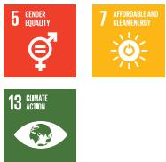</td></tr><tr><td>M</td><td>RE</td><td>100.0%</td><td>...</td><td>...</td><td>555,000</td><td>250</td><td>309,604</td><td>315.70</td><td>63.60</td><td>63.60</td><td>-</td><td>-</td><td></td><td></td></tr><tr><td colspan="8">Bangladesh: Paramount Solar Power Project (4394/FY2023/NA). Construct a 100-MW grid-connected solar photovoltaic power plant in Pabna.</td><td colspan="6">By 2025:Electricity delivered to the offtaker is at least 193.5 GWh per year (FY2023 baseline: 0).Annual greenhouse gas emissions of 93,654 t $CO_2$  avoided (FY2023 baseline: 0) (OP 3.1).Total installed electricity generation capacity of the solar power plant is 100 MW by FY2024 (FY2023 baseline: 0) (OP 3.1.4).21.5 kilometers of 132-kV transmission line installed by FY2024 (FY2023 baseline: 0).One 132-kV substation constructed by FY2024 (FY2023 baseline: 0).</td><td>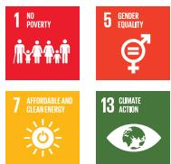</td></tr><tr><td>M</td><td>RE</td><td>100.0%</td><td>...</td><td>...</td><td>193,500</td><td>100</td><td>93,654</td><td>174.00</td><td>50.00</td><td>50.00</td><td>-</td><td>-</td><td></td><td></td></tr><tr><td colspan="8">India: SAEL Gujarat Solar Power Project (4400/FY2023/NA). Construct a 400-MW solar-photovoltaic power project at Ultra Mega Renewable Energy Power Park in Gujarat.</td><td colspan="6">By FY2026:Renewable electricity delivered to the offtaker increased by 953 GWh per year (FY2023 baseline: 0).Annual emission of 783,855 tons of carbon dioxide reduced (FY2023 baseline: 0) (OP 3.1).Total installed solar electricity generation capacity of the project increased to 400 MW (2022 baseline: 0) (OP 3.1.4).</td><td>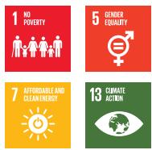</td></tr><tr><td>M</td><td>RE</td><td>100.0%</td><td>...</td><td>...</td><td>953,000</td><td>400</td><td>783,855</td><td>303.37</td><td>147.04</td><td>147.04</td><td>-</td><td>-</td><td></td><td></td></tr><tr><td colspan="8">Philippines: ACEN Sustainability-Linked Facility (4370/FY2023/NA). Finance solar photovoltaic projects in the Philippines.</td><td colspan="6">By 2029:Additional electricity delivered to the offtaker is at least 450 GWh per year (2022 baseline: 0).Annual greenhouse gas emissions of 277,650 t $CO_2$  avoided (2022 baseline: 0).Additional installed renewable energy capacity is at least 300 MW (2022 baseline: 0).</td><td></td></tr><tr><td>M</td><td>RE</td><td>100.0%</td><td>...</td><td>...</td><td>450,000</td><td>300</td><td>277,650</td><td>not disclosed</td><td>100.00</td><td>100.00</td><td>-</td><td>-</td><td></td><td></td></tr><tr><td colspan="8">Bangladesh: FPEBL Rooftop Solar Power Project (4458/FY2024/NA). Construct and operate a portfolio of rooftop solar projects installed on commercial and industrial buildings of leading corporates in Dhaka, with a total capacity of up to 50 MWp.</td><td colspan="5">By 2027: ·Electricity from solar power delivered to offtakers increased to at least 60.0 GWh per year (FY2023 baseline: 0). ·Greenhouse gas emissions of at least 29,000  $tCO_2$  avoided annually (FY2023 baseline: 0). ·Total installed solar electricity capacity increased to 50 MWp.</td><td>5 GENDER EQUALITY</td><td>7 AFFORDABLE AND CLEAN ENERGY</td></tr><tr><td>M</td><td>RE</td><td>100.0%</td><td>...</td><td>...</td><td>60,000</td><td>50</td><td>29,000</td><td>28.27</td><td>5.04</td><td>5.04</td><td>-</td><td>-</td><td></td><td></td></tr><tr><td colspan="8">India: Engie Solar Power Project (4445/FY2024/NA). Construct and operate a 400 MW solar photovoltaic power project in Gujarat.</td><td colspan="5">By 2026: ·Renewable electricity delivered to the offtaker increased by 805,681 MWh per year (FY2023 baseline: 0). ·Annual emission of 662,441  $tCO_2$  reduced (FY2023 baseline: 0). ·Total installed solar electricity generation capacity of the project increased to 400 MW (FY2023 baseline: 0).</td><td>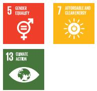</td><td></td></tr><tr><td>M</td><td>RE</td><td>100.0%</td><td>25</td><td>...</td><td>805,681</td><td>400</td><td>662,441</td><td>221.30</td><td>88.50</td><td>88.50</td><td>-</td><td>-</td><td></td><td></td></tr><tr><td colspan="8">Thailand: Gulf Solar and Solar with Battery Energy Storage Systems Project (4446/FY2024/NA). Construct eight ground-mounted solar photovoltaic plants with contracted capacity of 393 MW and four ground-mounted solar photovoltaic plants with battery energy storage that has contracted capacity of 256 MW and 396 MWh of energy storage.</td><td colspan="5">Additional renewable energy capacity of 649 MW installed.</td><td></td><td></td></tr><tr><td>M</td><td>RE</td><td>100.0%</td><td>25</td><td>...</td><td>1,465,000</td><td>649</td><td>605,466</td><td>not disclosed</td><td>278.58</td><td>278.58</td><td>-</td><td>-</td><td></td><td></td></tr><tr><td colspan="8">Bhutan: Distributed Solar for Public Infrastructure Project (4491/FY2024/FY2025). Construct up to 35 MW capacity of solar power systems on rooftops of public infrastructure across the country.</td><td colspan="5">By 2030: ·Solar power generation increased by 49 GWh per year (2024 baseline: 0.74 GWh). ·Emissions avoided by 39,735  $tCO_2$  per year (2024 baseline: 0). ·At least 100 critical public buildings with improved climate-resilient energy supply (2024 baseline: 0). By 2029: ·At least 35 MW of incremental capacity installed and operated in public infrastructure (2024 baseline: 0).</td><td>5 GENDER EQUALITY</td><td>7 AFFORDABLE AND CLEAN ENERGY</td></tr><tr><td>M</td><td>RE</td><td>100.0%</td><td>25</td><td>...</td><td>49,000</td><td>35</td><td>39,735</td><td>34.00</td><td>30.00</td><td>30.00</td><td>1.66</td><td>-</td><td></td><td></td></tr></table>

<table><tr><td colspan="14">Project Name (Number/Year Loan Approved) and Description linked to the project page for more information</td></tr><tr><td colspan="14">Target  $Results^b$ </td></tr><tr><td> $A/M^a$ </td><td>RE or EE</td><td>Share of Clean Energy Component</td><td>Project Life (Years) $^b$ </td><td>Annual Energy Savings ( $MWh$ ) $^b$ </td><td>Annual Energy Produced ( $MWh$ ) $^b$ </td><td>Renewable Capacity Added ( $MW$ ) $^b$ </td><td>Annual GHG Emission Avoided (ton of  $CO_2$  equivalent) $^b$ </td><td>Total Project Cost ($ million)</td><td>Loan Approval ( $million$ ) $^c$ </td><td>Eligibility for Green Bonds ( $million$ ) $^d$ </td><td>Allocated Amount ( $million$ ) $^e$ </td><td>Reflow Amount ( $million$ ) $^f$ </td><td>Sustainable Development Goals</td></tr><tr><td colspan="8">Solomon Islands: Renewable Energy Development Project (4478/FY2024/NA). Improve energy security by increasing the share of clean energy in the country&#x27;s energy mix, which is dominated by fossil fuel generation; and contribute to sector reforms to achieve better governance and create a public-private partnership enabling environment for developing renewable energy.</td><td colspan="6">By 2030:At least 3 GWh of additional solar power generated annually (2024 baseline: 3 GWh).At least 5,600 t $CO_2$ e emissions avoided per year (2024 baseline: 0 t $CO_2$ e).By 2029:A 1-MWp grid-connected solar photovoltaic power plant installed at Guadalcanal (2024 baseline: 1 MW).Hybrid solar photovoltaic power plant (1.5-MWp solar photovoltaic and 1 MW/4 MWh battery energy storage system) installed in Malaita (2024 baseline: 0).First utility-scale energy storage system (9 MW/24 MWh) installed and integrated into Honiara grid (2024 baseline: NA).</td></tr><tr><td>M</td><td>RE</td><td>100.0%</td><td>25 (solar)15 (battery energy storage system)</td><td>...</td><td>3,000</td><td>2.5</td><td>5,600</td><td>42.00</td><td>10.00</td><td>10.00</td><td>-</td><td>-</td><td></td></tr><tr><td colspan="8">Azerbaijan: Bilasuvar Solar Power Project (4537/FY2024/NA). Construct and operate a 445-MW solar photovoltaic power plant in Bilasuvar.</td><td colspan="6">Solar power generation increased by 893.401 GWh per year.Emissions avoided by 426,152 t $CO_2$ per year.445 MW of incremental capacity installed.</td></tr><tr><td>M</td><td>RE</td><td>100.0%</td><td>30</td><td>...</td><td>893,401</td><td>445</td><td>426,152</td><td>not disclosed</td><td>50.00</td><td>50.00</td><td>-</td><td>-</td><td></td></tr><tr><td colspan="8">Azerbaijan: Banka Solar Power Project (4536/FY2024/NA). Construct and operate a 315-MW solar photovoltaic power plant in Banka.</td><td colspan="6">By 2028:Electricity delivered to the offtaker is at least 634,207 MWh per year once the plant is fully operational (2023 baseline: 0).Annual emissions of 302,972 t $CO_2$ reduced once the plant is fully operational (2023 baseline: 0).By 2027:Total installed photovoltaic solar electricity generation capacity in Banka increased to 315 MW by 2027 (2023 baseline: 0).</td></tr><tr><td>M</td><td>RE</td><td>100.0%</td><td>30</td><td>...</td><td>634,000</td><td>315</td><td>302,972</td><td>not disclosed</td><td>35.00</td><td>35.00</td><td>-</td><td>-</td><td></td></tr><tr><td colspan="8">Bangladesh: Muktagacha Solar Power Project (4529/FY2024/NA). Construct a 20-MW grid-connected solar photovoltaic power plant and associated infrastructure in Muktagacha.</td><td colspan="5">By 2027:Electricity delivered to the offtaker increased to at least 37.9 GWh per year (2023 baseline: 0).Annual greenhouse gas emissions avoided are at least 18,344 t $CO_2$ (2023 baseline: 0).Total installed electricity generation capacity of the solar power plant increased to 20 MW (2023 baseline: 0).At least 8 kilometers of 33-kV transmission lines installed (2023 baseline: 0).</td><td>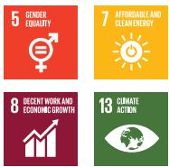</td></tr><tr><td>M</td><td>RE</td><td>100.0%</td><td>20</td><td>...</td><td>37,900</td><td>20</td><td>18,344</td><td>24.30</td><td>15.50</td><td>15.50</td><td>-</td><td>-</td><td></td></tr></table>

<table><tr><td colspan="9">Project Name (Number/Year Loan Approved) and Description linked to the project page for more information</td><td colspan="5">Target  $Results^b$ </td><td rowspan="2">Sustainable Development Goals</td></tr><tr><td> $A/M^a$ </td><td>RE or EE</td><td>Share of Clean Energy Component</td><td> $Project\ Life (Years)^b$ </td><td>Annual Energy Savings ( $MWh)^b$ </td><td>Annual Energy Produced ( $MWh)^b$ </td><td>Renewable Capacity Added ( $MW)^b$ </td><td>Annual GHG Emission Avoided ( $ton\ of\ CO_2equivalent)^b$ </td><td>Total Project Cost ($ million)</td><td>Loan Approval ( $$million)^c$ </td><td>Eligibility for Green Bonds ( $$million)^d$ </td><td>Allocated Amount ( $$million)^e$ </td><td>Reflow Amount ( $$million)^f$ </td><td></td></tr><tr><td colspan="8">Uzbekistan: Nukus 2 Wind and Battery Energy Storage Project (4611/FY2025/NA). Construct a 200-MW wind power plant, a 100-MWh battery energy storage system, and a 44-km overhead transmission line; and expand the 220-kV switchyard and the Beruniy substation.</td><td colspan="6">By 2027:Electricity delivered to the offtaker increased by 727,980 MWh per year (2024 baseline: 0).Annual emissions of 406,170 t $CO_2$ e reduced (2024 baseline: 0).By 2026:Total installed wind electricity generation capacity of the project increased by 200 MW (2024 baseline: 0).100-MWh battery energy storage system installed (2024 baseline: 0).Length of overhead transmission line increased by 44 kilometers (2024 baseline: 0).A 220-kV switchyard and substation expanded (2024 baseline: NA).</td><td></td></tr><tr><td>M</td><td>RE</td><td>100.0%</td><td>25</td><td>...</td><td>727,980</td><td>200</td><td>406,170</td><td>87.50</td><td>40.00</td><td>40.00</td><td>-</td><td>-</td><td></td><td></td></tr><tr><td colspan="8">Samoa: Sun Pacific Solar Expansion Project (4618/FY2025/NA). Upgrade the Sun Pacific Energy Ltd.&#x27;s existing solar power plant from a total capacity of 4.2 MW to 6.0 MW, increasing energy generation from an estimated 6.2 GWh/year to approximately 9.6 GWh/year.</td><td colspan="5">By 2027:Annual renewable electricity delivered to the offtaker increased to 9.6 GWh (FY2024 baseline: 6.2 GWh).Annual greenhouse gas emissions reduced by an additional 1,944 t $CO_2$ (FY2024 baseline: 3,893 t $CO_2$ ).Total installed solar electricity generation capacity of the existing solar project increased to 6.0 MW (FY2024 baseline: 4.2 MW).</td><td>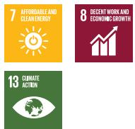</td><td></td></tr><tr><td>M</td><td>RE</td><td>100.0%</td><td>25</td><td>...</td><td>9,600</td><td>6</td><td>1,944</td><td>2.80</td><td>2.80</td><td>2.80</td><td>-</td><td>-</td><td></td><td></td></tr><tr><td colspan="8">India: Serentica 1 Power Project (4825/FY2025/NA). Develop a wind-solar hybrid project in Koppal, Karnataka, comprising 189.27 MW of ground-mounted solar photovoltaic capacity and 204 MW of wind capacity.</td><td colspan="5">By FY2027:Electricity delivered by the project to the offtaker increased to at least 1,073 GWh per year (FY2024 baseline: 0).Greenhouse gas emissions of at least 881,607 tons of carbon dioxide equivalent avoided annually (FY2024 baseline: 0).By FY2026:Total installed solar power generation capacity increased to 189.27 MW (FY2024 baseline: 0).Total installed wind power generation capacity increased to 204 MW (FY2024 baseline: 0).</td><td>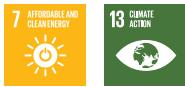</td><td></td></tr><tr><td>M</td><td>RE</td><td>100.0%</td><td>25</td><td>...</td><td>1,073,000</td><td>393.27</td><td>881,607</td><td>168.00</td><td>84.00</td><td>84.00</td><td>-</td><td>-</td><td></td><td></td></tr></table>

<table><tr><td colspan="9">Project Name (Number/Year Loan Approved) and Description linked to the project page for more information</td><td colspan="4">Target  $Results^b$ </td><td></td></tr><tr><td> $A/M^a$ </td><td>RE or EE</td><td>Share of Clean Energy Component</td><td> $Project Life (Years)^b$ </td><td>Annual Energy Savings ( $MWh)^b$ </td><td>Annual Energy Produced ( $MWh)^b$ </td><td>Renewable Capacity Added ( $MW)^b$ </td><td>Annual GHG Emission Avoided (ton of  $CO_2 equivalent)^b$ </td><td>Total Project Cost ($ million)</td><td>Loan Approval ( $$ million)^c$ </td><td>Eligibility for Green Bonds ( $$ million)^d$ </td><td>Allocated Amount ( $$ million)^e$ </td><td>Reflow Amount ( $$ million)^f$ </td><td>Sustainable Development Goals</td></tr><tr><td colspan="8">Thailand: GRE Solar and Energy Storage Project (4705/4706/FY2025/NA). Construct three projects: two solar-plus-battery energy storage systems (BESS) with a total contracted capacity of 126 MW and 151 MWh of energy storage, and a solar power plant with a contracted capacity of 68 MW.</td><td colspan="5">· Two solar plus battery energy storage system projects with a total contracted capacity of 126 MW and energy storage of 151 MWh. · One solar project with a contracted capacity of 68 MW.</td><td></td></tr><tr><td>M</td><td>RE</td><td>100.0%</td><td>25</td><td>...</td><td>480,000</td><td>194</td><td>191,550</td><td>not disclosed</td><td>75.00</td><td>75.00</td><td>-</td><td>-</td><td></td></tr><tr><td colspan="9">Total eligibility for green bonds and total allocated for renewable energy and energy efficiency</td><td>5,699.16</td><td>3,169.76</td><td>(1,326.86)</td><td></td><td></td></tr></table>

ADB = Asian Development Bank, $CO_{2}$ = carbon dioxide, EE = energy efficiency, FTE = full-time equivalent, FY = fiscal year, GHG = greenhouse gas, GW = gigawatt, GWh = gigawatt-hour, ha = hectare, km = kilometer, kV = kilovolt, kW = kilowatt, LED = light-emitting diode, MVA = megavolt-ampere, MW = megawatt, MWh = megawatt-hour, MWp = megawatt-peak, NA = not applicable, OP = operational priority, PNG = Papua New Guinea, PRC = People's Republic of China, RE = renewable energy, $tCO_{2}e$ = ton of carbon dioxide equivalent, WTE = waste-to-energy.  
a Column indicates whether the project aims to adapt to climate change (A) or to mitigate climate change (M).  
b “...” means not measured or not reported for this project and “NA” means not applicable. Expected impacts or results are based on ex ante estimates. GHG emission reductions presented in this report used the multilateral development banks’ harmonized approach to GHG accounting.  
c This is the share of the total project cost financed by ADB and funded by regular ordinary capital resources.  
$^{d}$ This is the amount eligible for green bond funding on commitment date.  
This represents the amount of green bond proceeds allocated for disbursements under the project. A zero (“0”) entry means no disbursements as of 31 December 2025.  
f This represents the amount of reflows. A zero (“0”) entry means no reflows as of 31 December 2025.  
g These are estimated figures.  
h Total project cost cannot be disclosed due to nondisclosure agreement.  
Source: Asian Development Bank.

## ADB Green Bond Eligible Projects by Sector Target Impacts and Committed and Allocated Amounts

B. Sustainable Transport (as of 31 December 2025)

<table><tr><td rowspan="2">Project Name (Number/Year Loan Approved) and Description linked to the project page for more information</td><td colspan="7">Target  $Results^b$ </td><td rowspan="2">Sustainable Development Goals</td></tr><tr><td>A/ $M^a$ </td><td>Total Project Cost ($ million)</td><td>Loan Approval ($ million) $^c$ </td><td>Eligibility for Green Bonds ($ million) $^d$ </td><td>Allocated Amount ($ million) $^e$ </td><td>Reflow Amount ($ million) $^f$ </td><td>Year of Last Disbursement</td></tr><tr><td rowspan="2">Turkmenistan: North-South Railway (2737/FY2011/FY2017). Increase accessibility and regional trade, and contribute to economic growth and the development of an integrated and efficient railway system in the region.</td><td colspan="7">· Total national transit tonnage increased to 6 million tons (2008 baseline: 3 million tons). · About 1.6 million tons of minerals transported via the project railway in 2015. · Performance tracking system developed for periodic inspection, supervision, and testing. · CO2 emissions reduced to 26,800 tons by 2020 (2008 baseline: estimated at 37,000 tons). · Fully disbursed.</td><td></td></tr><tr><td>M</td><td>166.70</td><td>125.00</td><td>125.00</td><td>44.43</td><td>(54.67)</td><td>2017</td><td></td></tr><tr><td rowspan="2">Viet Nam: Ha Noi Metro Rail System (Line 3: Nhon-Ha Noi Station Section) (2741/FY2011/FY2025). Facilitate public transport connectivity; greatly enhance access in five districts of Ha Noi; and become an integral part of an improved public transport system, which aims to achieve increased public modal share through low-carbon transport that reduces GHG emissions.</td><td colspan="7">· Peak loading of 785,000 passenger-km per day and 5,800 passengers per hour per direction on Line 3 by 2020. · Weighted average travel time per passenger along the project corridor reduced by 25% by 2020 (2011 baseline: 52 minutes).</td><td></td></tr><tr><td>M</td><td>856.00</td><td>293.00</td><td>293.00</td><td>170.90</td><td>(32.62)</td><td>2025</td><td></td></tr><tr><td rowspan="2">China, People's Republic of (PRC): Railway Energy Efficiency and Safety Enhancement Investment Program, Tranche 3 (2765/FY2011/FY2019). Improve energy efficiency, environmental protection, and safety in railways in the PRC.</td><td colspan="7">· Energy efficiency, environmental protection, and safety enhancement equipment installed. · Safety audit of a nominated railway administration completed. · Capacity-building program provided. · Fully disbursed.</td><td></td></tr><tr><td>M</td><td>300.00</td><td>250.00</td><td>250.00</td><td>227.06</td><td>(70.41)</td><td>2019</td><td></td></tr><tr><td rowspan="2">India: Railway Sector Investment Program, Tranche 1 (2793/FY2011/FY2018). Improve transport system and support greater mobility through an efficient, safe, reliable, and environment-friendly railway system.</td><td colspan="7">· Physical infrastructure expanded and efficiency of infrastructure use enhanced. · Operational efficiency improved. · Implementation support provided to the Ministry of Railways for mitigation and carbon credit activities. · Fully disbursed.</td><td></td></tr><tr><td>M</td><td>150.00</td><td>150.00</td><td>150.00</td><td>123.67</td><td>(49.32)</td><td>2018</td><td></td></tr><tr><td rowspan="2">Bangladesh: Greater Dhaka Sustainable Urban Transport Project (2862/FY2012/FY2022). Provide a holistic solution for integrated urban mobility through energy-efficient, sustainable urban transport system in Gazipur City Corporation, which forms part of north Greater Dhaka.</td><td colspan="7">· Annual average of 40,000 tons of CO2 equivalent emissions reduced (versus without-project scenario). · Annual level of air pollutants (PM $_{10}$ ) decreased by 20% (2006 baseline: 76.72 μg/m $^3$ ). · Gazipur City Corporation walkability index rating improved from 39 (2010 baseline) to 60 out of 100. · Residents' positive perception of public transport and urban life quality improved by 50% from 2012 baseline. · BRT achieved daily ridership of 100,000 passengers (at least 30% women) in the first year of operations. · Modal share of public transport increased from 40% (2011 baseline) to 50%. · Fully disbursed.</td><td></td></tr><tr><td>M</td><td>255.00</td><td>100.00</td><td>100.00</td><td>97.50</td><td>(23.77)</td><td>2022</td><td></td></tr><tr><td rowspan="2">China, People's Republic of: Hubei-Yichang Sustainable Urban Transport Project (3014/FY2013/FY2019). Improve overall traffic flow, and reduce congestion and associated emissions as well as noise level along the main corridor in the city center by (i) building bus rapid transit (BRT) corridors, including depots; (ii) improving provision for pedestrian and bicycle facilities; (iii) establishing parking management plan; and (iv) implementing other traffic demand management measures.</td><td colspan="7">By 2018:Bus traffic speed increased from 15 kph (2011) to 25 kph on BRT corridors.Passenger travel time reduced from 20 minutes on average (2011) to 10 minutes.Freight travel time between inland ports and logistics centers reduced by 20% from 2011.Pass-dam transshipment freight travel time to logistics centers reduced from 2 hours (2011) to 1 hour.Fully disbursed.</td><td></td></tr><tr><td>M</td><td>515.10</td><td>150.00</td><td>107.60</td><td>107.55</td><td>(34.32)</td><td>2019</td><td></td></tr><tr><td rowspan="2">India: Jaipur Metro Rail Line 1, Phase B Project (3062/FY2013/FY2021). Provide mass rapid transit (MRT) capacity for the city's major mobility corridors, aiming to reverse the rising shift to private cars and achieve a vision of an improved public transport system in Jaipur—optimizing general mobility, enhancing quality of life, and making the city more pleasant to live and work in.</td><td colspan="7">Average daily number of passengers using Line 1 (Phase B) reached 126,000 in the first year of operations (2018-2019).Underground rail infrastructure of 2.3 km and two stations completed by 2018.Fully disbursed.</td><td></td></tr><tr><td>M</td><td>259.00</td><td>176.00</td><td>176.00</td><td>119.26</td><td>(42.46)</td><td>2021</td><td></td></tr><tr><td rowspan="2">China, People's Republic of: Railway Energy Efficiency and Safety Enhancement Investment Program, Tranche 4 (3082/FY2013/FY2019). Provide significant environmental and safety benefits by introducing environmental protection and railway safety enhancement equipment, such as anti-seismic bridge bearings, enhanced railway fasteners, heavy duty switches, and signaling system facilities.</td><td colspan="7">Transport capacity expanded in the southwestern PRC to 470 billion ton-km for freight and 150 billion passenger-km for passengers in 2020.Cost of travel reduced from 35 fen per km in 2008 to 15 fen per km in 2020.Accidents per billion traffic reduced by 20% from 2008 to 2020.Fully disbursed.</td><td></td></tr><tr><td>M</td><td>547.60</td><td>180.00</td><td>180.00</td><td>176.17</td><td>(54.44)</td><td>2019</td><td></td></tr><tr><td rowspan="2">Bangladesh: Railway Sector Investment Program, Tranche 3 (3097/FY2013/FY2016). Improve railway transport capacity in the mainline network of Bangladesh Railway.</td><td colspan="7">Number of daily passenger trains increased by 10 (2011 baseline: 289).Number of annual passengers increased by 10% (2011 baseline: 66 million).Fully disbursed.</td><td></td></tr><tr><td>M</td><td>100.00</td><td>100.00</td><td>100.00</td><td>72.39</td><td>(30.23)</td><td>2016</td><td></td></tr><tr><td rowspan="2">China, People's Republic of: Railway Energy Efficiency and Safety Enhancement Investment Program, Tranche 5 (3109/FY2014/FY2019). Support the development of a sustainable, energy-efficient, safe, reliable, affordable, and environment-friendly railway system in the PRC through the procurement and installation of a railway electrification system, a railway electric power supply system, track safety operation and maintenance equipment, enhanced railway fasteners, anti-seismic bridge bearings, railway telecommunication system, and a railway signaling system.</td><td colspan="7">Transport capacity expanded in the southwestern PRC to 470 billion ton-km for freight trains and 150 billion passenger-km for passenger trains in 2020.Energy consumption by PRC railways per unit of revenue reduced by 23% from 2009 to 2020.Fully disbursed.</td><td></td></tr><tr><td>M</td><td>580.15</td><td>170.00</td><td>170.00</td><td>152.32</td><td>(42.78)</td><td>2019</td><td></td></tr><tr><td rowspan="2">Bangladesh: SASEC Railway Connectivity-Akhaura-Laksam Double Track (3169/FY2014/FY2023). Increase the capacity of the Dhaka-Chattogram corridor by (i) completing the double tracking on the entire corridor, which accounts for more than 40% of all passenger journeys by railway in Bangladesh; and (ii) upgrading and reconstructing the existing track.</td><td colspan="7">Number of daily passenger trains from Dhaka to Chattogram increased to 17 (2013 baseline: 14 trains per day and direction).Journey time of trains between Akhaura and Laksam reduced by 20% (2013 baseline: 77 minutes).Annual GHG reduced 145,000 metric tons.Fully disbursed.</td><td></td></tr><tr><td>M</td><td>805.00</td><td>400.00</td><td>400.00</td><td>258.70</td><td>(75.86)</td><td>2023</td><td></td></tr><tr><td rowspan="2">Bangladesh: Railway Rolling Stock Project (3301/FY2015/FY2022). Increase railway transport capacity in the main line network of Bangladesh Railway.</td><td colspan="7">Number of daily passenger trains increased by 10 (2011 baseline: 289). Number of annual passengers increased by 10% (2011 baseline: 66 million). Fully disbursed.</td><td rowspan="2"></td></tr><tr><td>M</td><td>294.00</td><td>200.00</td><td>200.00</td><td>163.91</td><td>(48.23)</td><td>2022</td></tr><tr><td rowspan="2">Viet Nam: Ha Noi Metro Line System Project (Line 3: Nhon-Ha noi Station Section), Additional Financing (3363/FY2015/NA). Facilitate public transport connectivity; significantly enhance access in five districts of Ha Noi; and become an integral part of an improved public transport system that aims to achieve increased public modal share through low-carbon transport that reduces GHG emissions.</td><td colspan="7">Peak loading of 785,000 passenger-km per day and 5,800 passengers per hour per direction on Line 3 by 2020. Weighted average travel time per passenger along the project corridor reduced by 25% by 2020 (2011 baseline: 52 minutes).</td><td rowspan="2"></td></tr><tr><td>M</td><td>385.20</td><td>59.00</td><td>59.00</td><td>0.00</td><td>(0.27)</td><td>-</td></tr><tr><td rowspan="2">Bangladesh: Railway Sector Investment Program, Tranche 4, Additional Financing (3376/FY2016/FY2016). Improve efficiency and safety of railway transport in Bangladesh.</td><td colspan="7">Number of daily passenger trains from Tongi to Bhairab Bazar increased by 25% (2011 baseline: 44). Number of annual passengers increased by 10% (2011 baseline: 66 million). Fully disbursed.</td><td rowspan="2"></td></tr><tr><td>M</td><td>52.47</td><td>50.00</td><td>50.00</td><td>22.63</td><td>(7.81)</td><td>2016</td></tr><tr><td rowspan="2">Bangladesh: SASEC Chittagong-Cox's Bazar Railway Project, Phase 1, Tranche 1 (3438/FY2016/FY2020). Support the construction of a new 102-km Dohazari-Cox's Bazar railway corridor in southeastern Bangladesh, and strengthen the capacity of the railway sector in project management and implementation to improve the national and subregional railway network.</td><td colspan="7">By 2024: 10 passenger trains operating daily between Chittagong and Cox's Bazar (2016 baseline: 0). 2.9 million annual passengers transported between Chittagong and Cox's Bazar (2016 baseline: 0). Cox's Bazar district connected to the national and subregional railway network (2016 baseline: not connected). Annual GHG emissions reduced by 46,647 metric tons.</td><td rowspan="2"></td></tr><tr><td>M</td><td>2,013.00</td><td>210.00</td><td>210.00</td><td>195.12</td><td>(51.98)</td><td>2020</td></tr><tr><td rowspan="2">Pakistan: Karachi Bus Rapid Transit Project—Project Design Advance (6008/FY2016/FY2020). Provide a holistic solution for an integrated urban mobility through a BRT.</td><td colspan="7">Public transport in Karachi improved, benefiting a population of 1 million. Consulting services financed and a procurement-ready project prepared through the project design advance. Fully disbursed.</td><td rowspan="2"></td></tr><tr><td>M</td><td>200.00</td><td>9.70</td><td>9.70</td><td>8.33</td><td>-</td><td>2020</td></tr><tr><td rowspan="2">Pakistan: Peshawar Sustainable Bus Rapid Transit Corridor Project (3543/FY2017/FY2023). Provide urban mass transit (a BRT) to improve mobility and urban public space.</td><td colspan="7">Public transport in Peshawar improved, directly benefiting a population of at least 0.5 million. A procurement-ready project prepared through the project design advance. Consulting services covered for engineering, procurement, and construction management; operational design and business model; and project management, coordination, and capacity building. Annual GHG emissions reduced by 31,000 metric tons. Fully disbursed.</td><td rowspan="2">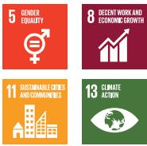</td></tr><tr><td>M</td><td>587.00</td><td>335.00</td><td>335.00</td><td>319.77</td><td>(79.24)</td><td>2023</td></tr><tr><td rowspan="2">China, People's Republic of: Mountain Railway Safety Enhancement Project (3556/FY2017/FY2023). Help the Government of the PRC build a safer, more reliable, and more efficient rail transport system in the mountainous southwest region of the PRC.</td><td colspan="7">Railway signaling, communication, and power supply system developed, including signaling and communication equipment to improve train operation safety (e.g., centralized train dispatching and monitoring, automatic block signaling, interlocking devices, and train control systems); procurement of electric power supply and bridge bearings for the safety of railway bridges covered.Tunnel safety operation and monitoring system installed, including cover lighting, ventilation, firefighting and fire control systems, and emergency rescue and disaster management systems.Fully disbursed.</td><td rowspan="2">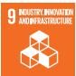</td></tr><tr><td>M</td><td>860.00</td><td>180.00</td><td>180.00</td><td>180.20</td><td>(202.73)</td><td>2023</td></tr><tr><td rowspan="2">China, People's Republic of: Shandong Spring City Green Modern Trolley Bus Demonstration Project (3583/FY2017/FY2024). Improve the urban transport environment in Jinan, Shandong Province by reducing emissions and congestion in the city through the development of a modern trolley bus network.</td><td colspan="7">111.2 km of prioritized high-quality BRT lanes served by electric trolley buses over 39 routes, 93 new and 65 upgraded median stations with real-time passenger information systems, 8 upgraded and 8 new bus depots, and 36 new traction substations and power lines.Fully disbursed.</td><td rowspan="2">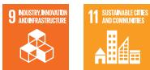</td></tr><tr><td>M</td><td>422.00</td><td>150.00</td><td>150.00</td><td>150.00</td><td>(27.33)</td><td>2024</td></tr><tr><td rowspan="2">Bangladesh: Railway Rolling Stock Operations Improvement (3645-3646/FY2018/FY2025). Improve the operational efficiency of Bangladesh Railway through the procurement of modern rolling stock, preparation of investment projects to enhance its rolling stock maintenance capacity, and support for the ongoing railway reform.</td><td colspan="7">By 2021:40 broad-gauge locomotives procured (2016 baseline: NA); 75 meter-gauge and 50 broad-gauge luggage vans procured (2016 baseline: NA); 400 meter-gauge and 300 broad-gauge bogie covered wagons procured (2016 baseline: NA); 80 meter-gauge and 120 broad-gauge bogie open wagons procured (2016 baseline: NA).Detailed designs of four maintenance facilities for locomotives and diesel electric multiple units completed.By 2022:Vehicle-km per coaching vehicle-day on line increased by 10% (2016 baseline: 469 vehicle-km for broad-gauge passenger carriages, 194 vehicle-km for other broad-gauge coaching vehicles, 262 vehicle-km for meter-gauge passenger carriages, and 89 vehicle-km for other meter-gauge coaching vehicles).Vehicle-km per freight wagon day on line increased by 10% (2016 baseline: 58.7 vehicle-km for broad-gauge freightwagons, and 10.1 vehicle-km for meter-gauge freight wagons).Passenger-km increased by 10% (2016 baseline: 9,167 million passenger-km).Ton-km increased by 10% (2016 baseline: 675 million ton-km).Operating ratio without public service obligation improved by 15% (2016 baseline: 246%).Fuel consumption of APU-equipped diesel locomotives reduced by 10% (2016 baseline: 350 liters per locomotive per day without APU).Fully disbursed.</td><td rowspan="2"></td></tr><tr><td>A and M</td><td>453.37</td><td>360.00</td><td>360.00</td><td>242.10</td><td>(31.96)</td><td>2025</td></tr><tr><td rowspan="2">Thailand: Bangkok Mass Rapid Transit (3669, 3672/FY2019/FY2022). Construct the monorail system of the MRT Pink Line and Yellow Line projects in Bangkok, wherein the Mass Rapid Transit Authority of Thailand will be responsible for the provision of the land and the right of way, while the private sector will invest in all civil works, monitoring and evaluation systems, and rolling stocks including operation and maintenance services.</td><td colspan="7">Annual average of 50,000 tons of  $CO_2$  equivalent of GHG emissions avoided by 2025 (2017 baseline: 0).</td><td rowspan="2"></td></tr><tr><td>A and M</td><td>2,960.00</td><td>318.00</td><td>318.00</td><td>275.19</td><td>(49.38)</td><td>2022</td></tr><tr><td rowspan="2">India: Mumbai Metro Rail Systems Project (3775/FY2019/FY2025). Support the implementation of 58 km of metro lines through (i) the manufacture of energy-efficient rolling stock carriages; (ii) installation of signaling, train control, and platform access systems; and (iii) establishment of a Mumbai metro operations organization.</td><td colspan="7">By 2023: Peak-hour, peak-direction traffic on metro rail system increased to 21,500 (2018 baseline: 0). Traffic accidents on the metro rail system reduced by 95% compared to the existing suburban railway system (2018 baseline: 3,000 fatalities per year). Annual GHG reduced by 166,507 metric tons.</td><td> </td></tr><tr><td>M</td><td>1,675.00</td><td>926.00</td><td>926.00</td><td>478.01</td><td>(68.05)</td><td>2025</td><td></td></tr><tr><td rowspan="3">Uzbekistan: Railway Efficiency Improvement Project (3785/FY2019/FY2024). Improve the efficiency of Uzbekistan's railway operations, combining investments where it faces operational bottlenecks (e.g., electric locomotives), and provide strategic support to improve business practices.</td><td colspan="7">By 2026: Average speed of train operations increased by at least 4% both for freight and passenger trains (2018 baseline: 30.0 kph for freight trains and 62.5 kph for passenger trains). 900,000 tons of CO2 equivalent emissions mitigated per year (2018 baseline: 0). Fully disbursed.</td><td> </td></tr><tr><td rowspan="2">M</td><td rowspan="2">218.30</td><td rowspan="2">170.00</td><td rowspan="2">170.00</td><td rowspan="2">169.93</td><td rowspan="2">(31.05)</td><td rowspan="2">2024</td><td> </td></tr><tr><td> </td></tr><tr><td rowspan="2">Philippines: Malolos-Clark Railway Project (52083-001/3796/FY2019/FY2025). Support the construction of two sections (totaling 53.1 km) of the North-South Commuter Railway, a 163-km suburban railway network connecting the regional center of Clark in Central Luzon with Metro Manila and Calamba, Laguna.</td><td colspan="7">By 2025: Journey from Blumentritt to Clark by public transport reduced to less than 1 hour (2019 baseline: at least 2–3 hours by bus). 171,000 passengers transported by rail between Manila and Clark daily (2019 baseline: 0). Annual GHG emissions reduced by 60,000 metric tons.</td><td rowspan="2"></td></tr><tr><td>A and M</td><td>6,139.00</td><td>2,750.00</td><td>2,750.00</td><td>1,300.86</td><td>(131.43)</td><td>2025</td></tr><tr><td rowspan="2">China, People's Republic of: Multimodal Passenger Hub and Railway Maintenance Project (3797/FY2019/FY2025). Construct a demonstration multimodal hub on a new railway line in Xichang City, Sichuan Province; improve maintenance systems by introducing modern maintenance equipment; and enhance institutional capacity for railway maintenance.</td><td colspan="7">By 2027: Passenger volume through Xichang increased to 2.85 million per year (2017 baseline: 1.77 million per year). Number of passenger trains stopping in Xichang increased to 70 (2017 baseline: 20). Maintenance personnel requirement per km of track reduced by 50% (2017 baseline: track tamping requires 1 person per hour for every 50 meters of track).</td><td rowspan="2"></td></tr><tr><td>M</td><td>425.81</td><td>120.00</td><td>120.00</td><td>90.71</td><td>(4.95)</td><td>2025</td></tr><tr><td rowspan="2">India: Chhattisgarh Road Connectivity Project (3795/FY2019/FY2025). Rehabilitate and upgrade at least 850 km of state highways and major district roads in Chhattisgarh to improve connectivity and access to basic services and livelihood opportunities, and provide support to the executing agency in road maintenance and safety.</td><td colspan="7">Rehabilitate or upgrade two state highways and 23 major district roads, with a total length of at least 850 km in Chhattisgarh. Fully disbursed.</td><td rowspan="2"></td></tr><tr><td>A</td><td>521.69</td><td>350.00</td><td>30.31</td><td>22.82</td><td>(4.15)</td><td>2025</td></tr></table>

<table><tr><td rowspan="2">Project Name (Number/Year Loan Approved) and Description linked to the project page for more information</td><td colspan="7">Target  $Results^b$ </td><td colspan="2" rowspan="2">Sustainable Development Goals</td></tr><tr><td> $A/M^a$ </td><td>Total Project Cost ($ million)</td><td>Loan Approval (\$ million) $^c$ </td><td>Eligibility for Green Bonds (\$ million) $^d$ </td><td>Allocated Amount (\$ million) $^e$ </td><td>Reflow Amount (\$ million) $^f$ </td><td>Year of Last Disbursement</td></tr><tr><td rowspan="4">Pakistan: Karachi Bus Rapid Transit Red Line Project (3799/FY2019/FY2025). Increase the use of quality public transport in Karachi by delivering the 26.6-km BRT Red Line corridor and associated facilities.</td><td colspan="7" rowspan="3">By 2023:Modern BRT buses operating at a maximum 6-minute headway over a 100 km-long network (2018 baseline: 0).Daily, 320,000 passengers using BRT in 2022, 15% of whom are women (first year of operation) and 20% in 2024 (2018 baseline: 0).Average bus commercial speed on the BRT corridor increased to 25.0 km/h (2018 baseline: 12.2 km/h).At least 77,979 tons of GHG emissions avoided annually by the BRT system using compressed natural gas hybrid buses (2018 baseline: 0).</td><td></td><td></td></tr><tr><td></td><td></td></tr><tr><td></td><td></td></tr><tr><td>A and M</td><td>323.00</td><td>235.00</td><td>115.00</td><td>27.67</td><td>(0.36)</td><td>2025</td><td></td><td></td></tr><tr><td rowspan="2">Bangladesh: SASEC Chittagong-Cox's Bazar Railway Project, Phase 1, Tranche 2 (3780/FY2019/FY2023). Construct 102 km of the Dohazari-Cox's Bazar section of the Chittagong-Cox's Bazar railway corridor in southeastern Bangladesh, and strengthen the capacity of the railway sector in project management and implementation.</td><td colspan="7">By 2024:10 passenger trains operating daily between Chittagong and Cox's Bazar (2016 baseline: 0).2.9 million annual passengers transported between Chittagong and Cox's Bazar (2016 baseline: 0).Cox's Bazar district connected to the national and subregional railway network (2016 baseline: not connected).Fully disbursed.</td><td></td><td></td></tr><tr><td>A and M</td><td>2,013.00</td><td>400.00</td><td>400.00</td><td>374.07</td><td>(40.12)</td><td>2023</td><td></td><td></td></tr><tr><td rowspan="2">Sri Lanka: Railway Efficiency Improvement Project (3806/FY2019/FY2025). Modernize the country's railway network by improving the operational efficiency, maintenance capacity, safety management, skills development, and implementation capacity of Sri Lanka Railways.</td><td colspan="7">By 2025:Average delay per passenger reduced by 10% (2018 baseline: 15.8 minutes per passenger).Total railway accidents on the network decreased by 4% (2017 baseline: 213 accidents).</td><td></td><td></td></tr><tr><td>A and M</td><td>192.00</td><td>160.00</td><td>160.00</td><td>72.17</td><td>-</td><td>2025</td><td></td><td></td></tr><tr><td rowspan="3">China, People's Republic of: Guizhou Gui'an New District New Urbanization Smart Transport System Development Project (3807/FY2019/FY2025). Support Gui'an New District (Gui'an) in developing an Intelligent Transport System and sustainable transport infrastructure.</td><td colspan="7">By 2026:Public transport modal share increased to 50% (2018 baseline: 10%).Energy-efficient buses operating over an 800-km network (2018 baseline: 415 km).Annual road crashes reduced by 20% (2018 baseline: 1,430 crashes).</td><td></td><td></td></tr><tr><td rowspan="2">M</td><td rowspan="2">495.81</td><td rowspan="2">199.46</td><td rowspan="2">108.59</td><td rowspan="2">43.24</td><td rowspan="2">(3.21)</td><td rowspan="2">2025</td><td></td><td></td></tr><tr><td></td><td></td></tr><tr><td rowspan="2">Nepal: SASEC Mugling-Pokhara Highway Improvement, Phase 1 Project (3846/FY2019/FY2025). Improve the capacity, reliability, and safety of road links between Pokhara (Nepal's second largest city) and Mugling (a central junction of the strategic road network), which further links to Kathmandu (the administrative and economic capital), and to Bharatpur (Nepal's fourth largest city and a gateway to the East-West Highway and international markets).</td><td colspan="7">By 2026:Average travel time on the project road reduced by 33% (2019 baseline: 1.87 minutes per km).Average daily vehicle-km along the project road increased by 33% (2019 baseline: 756,200 vehicle-km).Total road fatalities per 100,000 vehicle-km traveled along the project reduced by 20% (2019 baseline: to be determined).</td><td>[WTBW]</td><td></td></tr><tr><td>A</td><td>254.00</td><td>195.00</td><td>17.70</td><td>8.04</td><td>-</td><td>2025</td><td></td><td></td></tr><tr><td rowspan="2">India: Public-Private Partnership in Madhya Pradesh Road Sector Project (3849/FY2019/FY2025). Improve transport connectivity in Madhya Pradesh by rehabilitating and upgrading about 1,600 km of newly declared state highways and single-lane major district roads to two-lane widths.</td><td colspan="7">By 2025:Vehicle-km on project roads increased to 9.0 million (2018 baseline: 6.5 million vehicle-km).Average travel time on the project roads reduced by 20% (2018 baseline: 2.2 minutes per km).Vehicle operating cost (economic) on the project roads reduced by 20% for cars and trucks (2018 baseline: ₹6.8 per km for cars and ₹20.9 per km for medium trucks).Reported serious and fatal accidents on the project roads reduced by 20% (2018 baseline: 111 in a year).</td><td colspan="2" rowspan="2">1 NO POVERTY5 GENER QUADITY(###v)8 RELENT WORK AND ECONOMIC INVENTION9 INDUSTRIED INVENTION AND PRODUCTION(PDCS)10 REHANCED REQUALIFIES12 RESPONSIBLE CONSUMPTION AND PRODUCTION13 CLIMATE ACTION</td></tr><tr><td>A</td><td>904.00</td><td>490.00</td><td>82.20</td><td>64.01</td><td>(8.38)</td><td colspan="2">2025</td></tr><tr><td rowspan="2">Sri Lanka: Second Integrated Road Investment Program, Tranche 2 (3851/FY2019/FY2021). Finance the second slice of projects of the time-slice multitranche financing facility (approved on 29 September 2017), which will (i) upgrade and maintain about 3,400 km of rural access roads to all-weather standard; (ii) rehabilitate and maintain to a good condition about 340 km of national roads in Eastern, Northern, Uva, and Western Provinces; and (iii) improve the capacity of road agencies in safeguards, road safety, maintenance, research, and road design and construction.</td><td colspan="7">By 2027:Travel time on rural project roads reduced by 20% (2016 baseline: travel time of each project).Travel time on national project roads reduced by 10% (2016 baseline: travel time of each project).Average daily vehicle-km increased to 4.6 million (2016 baseline: 3.5 million vehicle-km).Fully disbursed.</td><td colspan="2" rowspan="2"> </td></tr><tr><td>A</td><td>171.80</td><td>150.00</td><td>7.10</td><td>7.08</td><td>(0.95)</td><td colspan="2">2021</td></tr><tr><td rowspan="2">Georgia: East-West Highway (Shorapani-Argveta Section) Improvement Project (3861/FY2019/FY2025). Finance the construction of about 14.7 km of access-controlled, dual two-lane carriageway, partly on new alignment, on the East-West Highway between Shorapani and Arvgeta, which is part of Corridor 2 of the Central Asia Regional Economic Cooperation Program.</td><td colspan="7">By 2026:Average travel time between Chumateleti and Arvgeta reduced to 45 minutes (2018 baseline: 71 minutes).Annual average number of fatalities between Chumateleti and Arvgeta over 5 years fell to 9.0 or fewer (2014–2018 average baseline: 12.4).</td><td colspan="2" rowspan="2">1 NO POVERTY5 GENER QUADITY9 INDUSTRIED INVENTION AND PRODUCTION10 REDUCED REQUALIFIES12 RESPONSIBLE CONSUMPTION AND PRODUCTION13 CLIMATE ACTION</td></tr><tr><td>A</td><td>367.40</td><td>278.00</td><td>0.63</td><td>0.44</td><td>(0.02)</td><td colspan="2">2025</td></tr><tr><td rowspan="2">China, People's Republic of: Jilin Yanji Low-Carbon Climate-Resilient Healthy City Project (3876/FY2019/FY2025). Provide multiple cross-benefits from an integrated solution delivered to improve the urban livability of Yanji City (a medium-sized city), which is timely and essential to lessen migration to the coastal mega-urban regions and to provide a demonstration project for replication in the PRC.</td><td colspan="7">By 2028:GHG emissions in Yanji City from transport sector reduced by 60,000 tons of CO2 equivalent per year (2017 baseline: 0).Modal share of public transport increased by 8% (2017 baseline: 44%).Flood risk in the urban catchment area of Chaoyang River reduced to 1-in-50 years (2017 baseline: 1-in-20 years).Annual conservation of 4.8 million tons of drinking water achieved (2017 baseline: 0).</td><td colspan="2"> </td></tr><tr><td>A and M</td><td>259.79</td><td>130.00</td><td>49.00</td><td>34.19</td><td>(1.90)</td><td>2025</td><td colspan="2">6 CLEAN WATER AND SANITATION [IMAGE] 10 REDUCED RESOURCES [IMAGE]  12 RESPONSIBLE CONSUMPTION AND PRODUCTION [IMAGE] </td></tr><tr><td rowspan="2">Bangladesh: SASEC Dhaka-Northwest Corridor Road Project, Phase 2, Tranche 2 (3883/FY2019/FY2024). Improve the road connectivity of the Dhaka-Northwest international trade corridor. This is a time-slice multitranche financing facility, with the project outputs to be achieved when all of the phased tranches have been completed.</td><td colspan="7">By 2028:Use of project roads (average daily vehicle-km in the first full year of operations) reaches 8.31 million vehicle-km (2016 baseline: 4.20 million vehicle-km).Fully disbursed.</td><td colspan="2" rowspan="2"></td></tr><tr><td>A</td><td>497.97</td><td>398.38</td><td>26.10</td><td>25.29</td><td>(2.75)</td><td colspan="2">2024</td></tr><tr><td rowspan="2">Bangladesh: Dhaka Mass Rapid Transit Development Project Readiness Financing (Line 5: Southern Route) (6023/FY2019/FY2025). Support the preparation and high project readiness of the ensuing loan. The Dhaka Mass Rapid Transit Line 5 (Southern Route) will be constructed between Gabtoli and Dasherkandi stations, which has a length of about 17.4 km.</td><td colspan="7">Project preparation and design activities financed.</td><td colspan="2"> </td></tr><tr><td>M</td><td>44.58</td><td>33.26</td><td>33.26</td><td>20.36</td><td>(1.16)</td><td>2025</td><td colspan="2"></td></tr><tr><td rowspan="2">Georgia: Livable Cities Investment Program (6024/FY2019/FY2025). Adopt multiple strategies, new initiatives, and innovative funding mechanisms at both national and regional levels through an integrated urban investment planning. Tbilisi, the capital city of Georgia with about half of the country's urban population concentrated in it, contributes 70% of the national gross domestic product. In 2015, ADB undertook a national urban assessment that identified the need for a balanced regional development to unlock the potential for inclusive economic growth through urban development.</td><td colspan="7">Project preparation and design activities financed.</td><td colspan="2" rowspan="2"></td></tr><tr><td>A and M</td><td>18.27</td><td>15.00</td><td>0.23</td><td>0.09</td><td>(0.01)</td><td colspan="2">2025</td></tr><tr><td rowspan="2">India: Delhi-Meerut Regional Rapid Transit System Investment Project (3964/4404/FY2020/FY2025). Finance the first of three prioritized corridors of the planned regional rapid transit system network in India's National Capital Region. The 82-km corridor will provide safe, reliable, and high-capacity commuter transit services between various locations along the corridor.</td><td colspan="7">By 2028:Travel time between Delhi and Meerut by train reduced to 1 hour (2020 baseline: 3-4 hours).258,035 tons of CO2 reduced per year (2020 baseline: 0).</td><td colspan="2" rowspan="2"></td></tr><tr><td>A and M</td><td>3,949.70</td><td>750.00</td><td>750.00</td><td>729.30</td><td>(64.88)</td><td colspan="2">2025</td></tr><tr><td rowspan="2">India: Maharashtra State Road Improvement Project (3911/FY2020/FY2025). Upgrade and maintain about 450 km of state roads forming part of the core road network in Maharashtra, which will enhance transport accessibility and efficiency, and improve the sustainability of the road network.</td><td colspan="7">By 2025: · Average daily vehicle-km traveled on project roads in the first full year of operation increased to 3.5 million average vehicle-km per day (2019 baseline: 2.9 million average vehicle-km per day). · Average travel time on project roads reduced by at least 15% for motorized transport (2019 baseline: 1.8 minutes per km for motorized transport). · Average number of fatalities per year in road accidents on the project roads reduced by at least 5% (2019 baseline: 29 fatalities). · Fully disbursed.</td><td colspan="2"> </td></tr><tr><td>A</td><td>255.99</td><td>177.00</td><td>12.76</td><td>10.76</td><td>(1.50)</td><td>2025</td><td colspan="2"></td></tr><tr><td rowspan="2">China, People's Republic of: Xiangtan Low-Carbon Transformation Sector Development Program (3987/FY2020/FY2025). Enhance the ongoing efforts of the Xiangtan Municipal Government to transform Xiangtan from a carbon-intensive, heavily polluting city to a low-carbon, resilient, smart, and livable city, while pursuing continuous growth. Demonstrate infrastructure transformation through the integration of transport, building, energy, and climate resilience solutions, complemented by information and knowledge systems.</td><td colspan="7">By 2026: · At least 337 kt $CO_2$ e reduced per year (2019 baseline: NA). · Public transport and nonmotorized transport users increased by 10% (2019 baseline: 32% walking, 2% cycling, and 19% bus).</td><td colspan="2"> </td></tr><tr><td>A and M</td><td>395.88</td><td>150.00</td><td>78.99</td><td>27.01</td><td>(1.57)</td><td>2025</td><td colspan="2"> 11 SUSTAINABLE CPE AND COMMENTS </td></tr><tr><td rowspan="2">Uzbekistan: Central Asia Regional Economic Cooperation Corridor 2 (Pap-Namangan-Andijan) Railway Electrification Project, Additional Financing (4000/FY2020/FY2025). Provide additional financing for the Central Asia Regional Economic Cooperation (CAREC) Corridor 2 (Pap-Namangan-Andijan) Railway Electrification Project, for Modernization of Electrified Line Angren-Pap-Kokand-Andjian Railway Line.</td><td colspan="7">By 2025: · Travel time for passengers from Namangan to Tashkent reduced to 3 hours (2016 baseline: 5 hours by car). · Average running speed for freight trains in the Fergana Valley increased to 80 km/h (2016 baseline: 60 km/h). ·  $CO_2$  emissions reduced by 24,870 tons per year (2016 baseline: none).</td><td colspan="2"> </td></tr><tr><td>A and M</td><td>164.00</td><td>121.00</td><td>121.00</td><td>88.37</td><td>(5.36)</td><td>2025</td><td colspan="2"></td></tr><tr><td rowspan="2">China, People's Republic of: Shaanxi Green Intelligent Transport and Logistics Management Demonstration Project (4035/FY2020/FY2025). Assist Shaanxi Province in reducing GHG emissions by improving operations, facilities, and safety in the transport and logistics sector.</td><td colspan="7">By 2027: · Growth rates of logistics industry in Shaanxi Province and Xi'an City are more than 20 basis points higher than the gross domestic product growth rate (2019 baseline: 8.26%). ·  $CO_2$  net carbon footprint reduced by 69,000 tons per year (2020 baseline: 0).</td><td colspan="2"> </td></tr><tr><td>A and M</td><td>804.08</td><td>200.00</td><td>133.66</td><td>32.40</td><td>(2.80)</td><td>2025</td><td colspan="2">7 ACCORDANCE &amp; COCONDUCTOR AND PRODUCTION [7B77]</td></tr><tr><td rowspan="3">India: Bengaluru Metro Rail Project (4036/FY2020/FY2025). Construct two new metro corridors totaling 56 km in Bengaluru City.</td><td colspan="7">Annual GHG emissions reduced by 40,454 metric tons.</td><td colspan="2"> </td></tr><tr><td colspan="7">By 2026:Travel time by public transport along the corridor decreased by 50% in morning peak time of weekday (2019 baseline: Central Silk Board to K R Puram, 75 minutes; K R Puram to Hebbal, 55 minutes; and Hebbal to airport, 60 minutes).Average daily ridership of public transport along 2A and 2B alignments reaches 1 million, with growth equivalent to twofold population growth in Bengaluru City (2019 baseline: 300,000 Bengaluru Metropolitan Transport Corporation ridership).</td><td colspan="2" rowspan="2"></td></tr><tr><td>A and M</td><td>1,845.00</td><td>500.00</td><td>500.00</td><td>411.74</td><td>(33.02)</td><td colspan="2">2025</td></tr><tr><td rowspan="3">Philippines: Epifanio de los Santos Avenue Greenways Project (4043/FY2020/NA). Build or improve a total of 5 km of covered elevated walkways around the four metro rail transit stations (Balintawak, Cubao, Guadalupe, and Taft mass transit stations) along Epifanio de los Santos Avenue, a major artery in Metro Manila.</td><td colspan="7">Annual GHG emissions reduced by 886 metric tons.</td><td colspan="2" rowspan="3"></td></tr><tr><td colspan="8">By 2024:Pedestrian traffic increased by 5% at key walkway intersections, disaggregated by sex, age, and person with disability (2019 baseline: Balintawak 35,000; Cubao 148,900; Guadalupe 40,000; and Taft 130,000).</td></tr><tr><td>M</td><td>179.30</td><td>123.00</td><td>123.00</td><td>0.00</td><td>(0.62)</td><td colspan="2">-</td></tr><tr><td rowspan="3">Kyrgyz Republic: Urban Transport Electrification Project (4149/FY2021/FY2025). Jumpstart a long-term transition toward a transport sector that has zero tailpipe emission in the Kyrgyz Republic. The project comprises four interlinked outputs:(i) zero tailpipe-emission bus fleet in Bishkek municipality upgraded, (ii) bus depot infrastructure upgraded, (iii) pilot green mobility corridor established, and (iv) Bishkek bus operation sustainability improved.</td><td colspan="7">By 2025:Annual energy savings of 94,000 gigajoules by Bishkek municipality-owned public bus fleet (2021 baseline: 0).Annual air pollutant emissions of the Bishkek municipality-owned public bus fleet reduced by 1.8 tons for  $PM_{2.5}$  and 98 tons for nitrogen oxide, compared with no-project scenario (2021 baseline: 0).Annual greenhouse gas emissions of the Bishkek municipality-owned public bus fleet reduced by 10.8 kt $CO_2$ e, compared with the no-project scenario (2021 baseline: 0).</td><td colspan="2"> </td></tr><tr><td colspan="7">By 2024:120 modern battery electric buses with energy usage of 1.1 kWh/km or less deployed (2021 baseline: 0).At least 35 chargers of 100 kW and 35 chargers of 300 kW installed (2021 baseline: NA).Substation infrastructure for up to two bus depots upgraded (2021 baseline: NA).</td><td colspan="2" rowspan="2"> </td></tr><tr><td>M</td><td>59.55</td><td>25.00</td><td>25.00</td><td>33.18</td><td>(9.17)</td><td colspan="2">2025</td></tr><tr><td rowspan="3">Uzbekistan: Central Asia Regional Economic Cooperation Corridor 2 (Bukhara-Miskin-Urgench-Khiva) Railway Electrification Project (4170/FY2021/FY2025). Add electrification, signaling and telecommunication, and traction power management systems to the recently built railway line between Bukhara, Miskin, Urgench, and Khiva-a total of 465 km.</td><td colspan="7">By 2027:Travel time for passenger trains between Bukhara and Khiva reduced to 3.0 hours (2021 baseline: 5.2 hours by diesel train).Travel time for freight trains between Bukhara and Urgench reduced to 8.0 hours (2021 baseline: 13.0 hours by diesel train).Annual freight traffic on the Bukhara-Khiva line increased to 11.8 million tons (2021 baseline: 9.2 million tons).Annual passenger traffic on the Bukhara-Khiva line increased to 1,080,000 rides (2021 baseline: 280,000). $CO_2$  emissions reduced by 81,000 tons per year (2021 baseline: NA).</td><td colspan="2"> </td></tr><tr><td colspan="7">By 2026:465-km railway line between Bukhara-Khiva electrified (2021 baseline: 0).</td><td colspan="2">7#AMRUELLAN OF CHANDER</td></tr><tr><td>A and M</td><td>445.65</td><td>162.00</td><td>162.00</td><td>89.09</td><td>(4.75)</td><td>2025</td><td colspan="2">10#REMOVED FORUMERS </td></tr></table>

<table><tr><td rowspan="2">Project Name (Number/Year Loan Approved) and Description linked to the project page for more information</td><td colspan="7">Target  $Results^b$ </td><td rowspan="2">Sustainable Development Goals</td></tr><tr><td>A/ $M^a$ </td><td>Total Project Cost ($ million)</td><td>Loan Approval ($ million) $^c$ </td><td>Eligibility for Green Bonds ($ million) $^d$ </td><td>Allocated Amount ($ million) $^e$ </td><td>Reflow Amount ($ million) $^f$ </td><td>Year of Last Disbursement</td></tr><tr><td rowspan="4">Philippines: South Commuter Railway Project, Tranche 1 (4188/FY2022/FY2025). Construct the 54.6 km Blumentritt-Calamba section of the North-South Commuter Railway connecting Metro Manila and Calamba, located in Laguna Province about 50 km south of Manila.</td><td colspan="7">Annual GHG emissions reduced by 284,425 metric tons.</td><td rowspan="4"></td></tr><tr><td colspan="7">By 2029:Travel time from Blumentritt, Metro Manila to Calamba, Laguna by public transport reduced to between 45 minutes and 1 hour (2022 baseline: At least 1.0-2.0 hours by bus or 2.5 hours by train).269,000 passengers transported by rail between Blumentritt and Calamba daily (2022 baseline: 0).</td></tr><tr><td colspan="7">By 2028:New railway line commissioned.54.6 km of railway line between Blumentritt in Metro Manila and Calamba in Laguna constructed and commissioned (2022 baseline: 0 km).18 stations and essential depot buildings constructed, integrating design features that are friendly to and safe for older people, women, children, and people with disabilities (2022 baseline: 0 stations).</td></tr><tr><td>M</td><td>5,517.20</td><td>1,750.00</td><td>1,750.00</td><td>818.36</td><td>(59.10)</td><td>2025</td></tr><tr><td rowspan="4">India: Connecting Economic Clusters for Inclusive Growth in Maharashtra (4242/FY2022/FY2025). Support the further development of the state's strategic core road network by (i) connecting underdeveloped rural communities with city centers and nearby industrial zones; (ii) providing direct and indirect opportunities to the primarily agrarian population; (iii) improving road connectivity of border districts, such as Nanded, to neighboring states; (iv) improving industrial value chains for small-scale industry by reducing transportation costs; and (v) improving disaster risk and climate change resilience in flood-prone areas.</td><td colspan="7">Annual GHG emissions reduced by 105,050 metric tons.</td><td rowspan="4"></td></tr><tr><td colspan="7">By 2028:Transport efficiency, safety, and access to markets and basic social services in Maharashtra improved and sustained.Average travel time on project roads reduced by at least 30% (2022 baseline: 2.03 minutes per km for motorized transport).Average travel time for farmers to transport produce from Nanded to markets reduced by at least 30% (2022 baseline: 2.07 minutes per km for motorized transport).People in project areas who reported ease in access to health and education facilities increased by at least 5% (2022 baseline: 68% for health facilities and 58% for education facilities).State highways and major district roads of the core road network upgraded and maintained.At least 319 km of state highways and 149 km of major district roads upgraded with climate- and disaster-resilient features, as well as features that respond to the needs of the older people, women, children, and people with disabilities (2022 baseline: 0).At least 5 km of major district roads constructed with climate- and disaster-resilient features, as well as features that respond to the needs of older people, women, children, and people with disabilities (2022 baseline: 0).GESI promoted in highway works, schools, and health and social services.</td></tr><tr><td colspan="7">By 2026:Automated traffic survey and traffic direction systems implemented at 10 project road locations (2022 baseline: NA).</td></tr><tr><td>A</td><td>505.00</td><td>350.00</td><td>95.15</td><td>83.73</td><td>(4.35)</td><td>2025</td></tr><tr><td rowspan="4">India: Chennai Metro Rail Investment Project (MFF) (4273/FY2022/FY2025). Expand the existing metro rail network in Chennai, the capital city of Tamil Nadu on the southeast coast of India. It will contribute to the development of three new metro lines (3, 4, and 5) that will connect the central area of Chennai to major destinations in the south and west of the city.</td><td colspan="7">Annual GHG emissions reduced by 28,294 metric tons.</td><td>1 NO POVERTY </td></tr><tr><td colspan="7">By 2031: · Average daily ridership of the overall Chennai metro rail system increased to 1.4 million passengers per day, disaggregated by sex (2020 baseline: 113,000 passengers per day). · At least 70% metro passengers perceived the metro service as reliable, efficient, and safe; disaggregated by sex (2022 baseline: NA). · At least 20% of metro passengers at three new major metro stations used interchange facilities during peak hours, disaggregated by sex (2022 baseline: NA).</td><td rowspan="3">9 INDUSTRY INNOVEMENT AND INFRASTRUCTURE 11 SUSTAINABLE CITIES AND COMMUNITIES 13 CLIMATE ACTION</td></tr><tr><td colspan="7">By 2030: · At least 20 km of metro infrastructure with climate-resilient features constructed for Lines 3 and 4 (2022 baseline: NA). · 18 metro stations that are responsive to older people, women, children, differently abled, and transgender, and that have climate-resilient features constructed for Lines 3 and 4 (2022 baseline: NA). · System components comprising electrical and mechanical parts, traction and power supply, and telecommunication installed for Lines 3 and 5 (2022 baseline: NA).</td></tr><tr><td>A and M</td><td>3,645.00</td><td>780.00</td><td>780.00</td><td>304.85</td><td>(18.80)</td><td>2025</td></tr><tr><td rowspan="3">Papua New Guinea: Civil Aviation Development Investment Project II (4276/4277/FY2022/FY2025). Upgrade five national airports for better safety and security, improve the power supply at Port Moresby International Airport, and enhance air navigation and weather services.</td><td colspan="7">By 2028: · Project airports comply with Civil Aviation Safety Authority safety (CASA) and security requirements (2020 baseline: 11). · Passengers carried to and from the seven project national airports to increase to 409,365 (2018 baseline: 289,111).</td><td rowspan="3"></td></tr><tr><td colspan="7">By 2027: · Pavement strengthened (improved load carrying capacity) and new terminal building with gender-inclusive design features provided at Aropa, Gurney, Kiunga, and Wewak airports (2020 baseline: 0). · Asphalt overlay at Hoskins airport (2020 baseline: 0). · Runway extended to 1,800 m at Wewak airport (2020 baseline: 1,600 m). · Jackson airport powerhouse and high-voltage system upgraded (2020 baseline: NA). · Two new control towers constructed, and air traffic management system upgraded (2020 baseline: 1). · Three weather stations upgraded (2020 baseline: NA). · Air traffic management system upgraded (2020 baseline: NA). · Four rural airstrips improved to all-weather operations (2020 baseline: NA).</td></tr><tr><td>A</td><td>171.50</td><td>162.90</td><td>13.50</td><td>1.73</td><td>(0.06)</td><td>2025</td></tr><tr><td rowspan="3">Bangladesh: Greater Dhaka Sustainable Urban Transport Project, Additional Financing (4284/FY2022/FY2024).Develop a sustainable urban transport system in Gazipur City Corporation, which forms part of north Greater Dhaka, through the delivery of a 20-km bus rapid transit (BRT) corridor.</td><td colspan="7">Annual GHG emissions reduced by 40 metric tons.</td><td rowspan="3"></td></tr><tr><td colspan="7">By 2024: BRT corridor development benefits a population of 1 million residents. Positive perception of public transport and urban life quality improves by 50% (2012 baseline: 0). BRT achieves 100,000 passengers/day ridership (at least 30% women) in the first year of operation (2012 baseline: 0). Modal share of public transport increases from 40% to 50% (2011 baseline: 40%). 20.5 km BRT route, mixed traffic lanes, nonmotorized transport lanes, sidewalks, and terminal and depot in Gazipur completed by 2023 in accordance with the design and international quality standards, including safety design features for women, children, and people with disabilities (2012 baseline: 0). 90% flood-free days along the corridor by 2023 (2012 baseline: 0). 20-m stretch in 62 access roads improved for nonmotorized transport by 2023 (2012 baseline: 0). 95% of the days have streetlights in the evening along the corridor by 2023 (2012 baseline: 0). Traffic accidents within the corridor per year are reduced by 20% by 2023 (2012 baseline: 53). Average travel time by bus from Gazipur to airport decreased by 50% by 2023 (2011 baseline: 80 minutes). Municipal infrastructure (10 local markets, 24.10 km drains, and 66 local roads) improved by 2019 (2012 baseline: 0).</td></tr><tr><td>A</td><td>132.75</td><td>100.00</td><td>60.18</td><td>29.29</td><td>(1.45)</td><td>2024</td></tr><tr><td rowspan="2">India: Nhavae Sheva Container Terminal Financing Project (4290/FY2023/NA). Upgrade the operating container terminal at the Jawaharlal Nehru Port located in Navi Mumbai, Maharashtra on a public-private partnership basis under a 30-year concession. The project includes upgrading and strengthening the existing berths and yard and installing additional equipment such as quay cranes and electric rail mounted quay cranes.</td><td colspan="7">By 2028: Annual volume of containerized cargo throughput increased to 1.4 million TEUs (2022 baseline: 0.44 million TEUs). Average berth stay of vessels reduced to 0.94 days (2022 baseline: 1.25 days). Monthly Gross Berth Output increased to 28 moves per hour (2022 baseline: 22 moves per hour). Greenhouse gas emission of 4,977 tons per year reduced (2022 baseline: NA) (OP 3.1). By 2026: Annual cargo logistics handling capacity increased to 1.8 million TEUs per year (2022 baseline: 1.5 million TEUs) (OP 7.1.1). Jawaharlal Nehru Port Container Terminal's 400-meter berth, 200-meter berth, and associated equipment upgraded (2022 baseline: NA) (OP 7.1.1). Shore power supply facility installed (2022 baseline: NA) (OP 3.3.1). 5 electric quay cranes installed (2022 baseline: 2). By 2028: 30% of electricity utilized in the terminal is from renewable sources (2022 baseline: 0) (OP 3.3.2).</td><td rowspan="2"></td></tr><tr><td>M</td><td>187.10</td><td>64.10</td><td>40.00</td><td>0.00</td><td>-</td><td>-</td></tr><tr><td rowspan="3">Bangladesh: Flood Reconstruction Emergency Assistance Project (4305/FY2023/FY2025). Assist the Government of Bangladesh's rehabilitation and reconstruction efforts in the districts affected by the devastating floods that occurred in May to June 2022.</td><td colspan="7">By 2027:At least 79,233 hectares have reduced flood risk (2022 baseline: 0) (OP 3.2.1).Yield rate of boro rice production in Sylhet Division increased by 5% (FY2020 baseline: 1.711 t/ha) (OP 5.2.3, OP 5.3.1, OP 5.3.2).At least 90% of households in project intervention area provided with stable, safe, and clean water supply throughout the year (2023 baseline: 60%) (OP 1.3, OP 2.4.1).At least 10,000 ha of land improved through climate-resilient irrigation infrastructure and water delivery services (2022 baseline: 0) (OP 5.3.1).</td><td>1 SD PROVEITGHEHINDIA GHEHINDIA GHEHINDIA GHEHINDIA GHEHINDIA GHEHINDIA GHEHINDIA GHEHINDIA GHEHINDIA GHEHINDIA GHEHINDIA GHEHINDIA GHEHINDIA GHEHINDIA GHEHINDIA GHEHINDIA GHEHINDIA GHEHINDIA GHEHINDIA GHEHINDIA GHEHINDIA</td></tr><tr><td colspan="7">By 2026:757 km of rural roads with associated culverts and bridges rehabilitated and reconstructed with climate resilience and safety features (2022 baseline: 0) (OP 3.2.5, OP 5.1.1).34 km of rail track with associated culverts and bridges rehabilitated and reconstructed with climate resilience and safety features (2022 baseline: 0) (OP 3.2.5, OP 5.1.1).80 km of river embankment with 3.8 km flood prevention walls and 15 flood fuses rehabilitated and reconstructed with climate-resilient design (2022 baseline: 0) (OP 3.2.5).14 km of submersible embankment and 4 irrigation regulators and sluices rehabilitated and reconstructed (2022 baseline: 0) (OP 3.2.5).11,900 tube wells rehabilitated and reconstructed with flood-resilient design (e.g., raised platform and submersible pump) (2022 baseline: 0) (OP 1.3, OP 2.4.1, OP 2.5.2).</td><td rowspan="2">[17GG] </td></tr><tr><td>A and M</td><td>289.17</td><td>230.00</td><td>148.21</td><td>62.05</td><td>-</td><td>2025</td></tr><tr><td rowspan="2">Georgia: Tegeta Green Vehicles Bond Project (7781/FY2023/NA). Finance the inventory of green electric light vehicles and road and nonroad vehicles, and the expansion of the electric vehicle charging network in Georgia, thereby promoting the adoption of electric vehicles with zero emissions in the country.</td><td colspan="7">By 2025:Annual amount of greenhouse gas emissions savings from use of electric vehicles is at least 1,636 tCO2e per year (2022 baseline: 0) (OP 3.1).Annual number of vehicle users using the electric charging network increased to 300 (2022 baseline: 50) (OP 4.1).Total initial inventory of sold new electric vehicles funded by the green bond proceeds increased to at least 100 (2022 baseline: 0) (OP 3.1.3, OP 4.3.1).Total number of charging points for electric vehicles increased to at least 100 (2022 baseline: 30) (OP 3.1.3, OP 4.3.1).</td><td rowspan="2"></td></tr><tr><td>M</td><td>7.69</td><td>7.69</td><td>7.69</td><td>0.00</td><td>-</td><td>-</td></tr><tr><td rowspan="2">India: Visakhapatnam-Chennai Industrial Corridor Development Program, Tranche 2 (4312/FY2023/FY2025). Foster industrial agglomeration with holistic infrastructure support, investment promotion, and skills development. Strengthen climate and disaster resilience and integrate industrial and urban planning for more competitive and livable cities.</td><td colspan="7">By 2024: ·45 km of internal roads improved, with gender-responsive design features, and 47 km of storm water drains constructed in industrial clusters (2015 baseline: 0). ·Four MLD common effluent treatment plants constructed in industrial clusters (2015 baseline: 0). ·123 km of pipelines, 27 MLD water treatment plants, and 9,100 million liters of storage tanks constructed in industrial clusters (2015 baseline: 0). ·93.6 km of state highways widened, with gender-responsive design features (2015 baseline: 0). ·One 400 by 220 kV, five 220 by 132 kV, and four 132 by 33 kV new substations with a capacity of about 3,170 MVA and related transmission network comprising about 240 km of overhead and 41 km of underground transmission and distribution lines of 400, 220, and 132 kV installed for industrial clusters (2015 baseline: 0). ·365 km of new drinking water pipelines constructed or rehabilitated and 64,800 water meters installed in Visakhapatnam (2015 baseline: 0). ·Climate change resilience plan for Visakhapatnam prepared and adopted for integrated water management solution (2015 baseline: NA).</td><td rowspan="2">1 DO PROVEY 5 GENDER EQUALITY 9 INDUSTRY INNATIONAL AND INFRASTRUCTURE 10 REPROVED INEQUALITIES 11 SUSTAINABLE OTHER CONSTRUCTION AND PRODUCTION 12 RESPONSIBLE CONSTRUCTION AND PRODUCTION 13 CLIMATE ACTION</td></tr><tr><td>A</td><td>214.80</td><td>141.12</td><td>44.46</td><td>3.15</td><td>(0.15)</td><td>2025</td></tr><tr><td rowspan="3">Nepal: South Asia Subregional Economic Cooperation Highway Enhancement Project (Kakarbhitta-Laukahi) (4316/FY2023/FY2025). Upgrade to a two-lane dual carriageway to accommodate the increasing traffic demand, with improved geometry, pavement, drainage, road safety, and climate- and disaster-resilient features.</td><td colspan="7">By 2029: ·Total border crossing traffic on the project road increased by 20% (2022 baseline: average daily traffic of 1,200 vehicles per day). ·Average daily vehicle-km along the project road increased by 33% (2022 baseline: 2,226,946 vehicle-km). ·Average travel time on the project road reduced by 33% (2022 baseline: 1.45 minutes per km). ·Total road fatalities along the project road reduced by 20% (2022 baseline: 64 cases per 100,000 vehicle-km).</td><td rowspan="5"></td></tr><tr><td colspan="7">By 2028: ·National highway network upgraded and maintained. ·At least 95 km of road from Kakarbhitta to Laukahi upgraded to four lanes and designed to 100 km per hour standard, with GESI-responsive, disaster-resilient, and climate change adaptation features (2022 baseline: NA) (OP 1.3.1, OP 3.2.5, OP 5.1.1, OP 7.1.1). ·Road safety with GESI-responsive design features installed, including at least 20 locations with traffic signal lights, 20 km of footpaths with streetlights, 6 overhead pedestrian crossings, 45 road zebra crossings, and 90 bus stops (2022 baseline: 0) (OP 1.3.1, OP 2.4.1, OP 3.2.5, OP 5.1.1, OP 7.1.1).</td></tr><tr><td>A and M</td><td>362.47</td><td>300.00</td><td>115.46</td><td>30.19</td><td>-</td><td>2025</td></tr><tr><td rowspan="2">Bangladesh: South Asia Economic Cooperation Chittagong-Cox's Bazar Railway Project, Phase 1, Tranche 3 (4321/FY2023/FY2025). Construct the new 102-km Dohazari-Cox's Bazar section of the Chattogram-Cox's Bazar railway corridor in Southeastern Bangladesh.</td><td colspan="7">By 2024: ·10 passenger trains operating daily between Chittagong and Cox's Bazar (2016 baseline: 0). ·2.9 million annual passengers transported between Chittagong and Cox's Bazar (2016 baseline: 0). ·Cox's Bazar district connected to the national and subregional railway network (2016 baseline: not connected).</td></tr><tr><td>A and M</td><td>2,013.00</td><td>400.00</td><td>400.00</td><td>215.40</td><td>-</td><td>2025</td></tr><tr><td rowspan="3">India: Enhancing Connectivity and Sustainability in Bihar Roads Project (4322/FY2023/FY2025). Widen and upgrade about 265 km of state highways to improve transport connectivity and safety, including the six poorest rural districts in the state of Bihar.</td><td colspan="7">By 2029:Annual average daily traffic on project roads increased to 1,435.1 million vehicle-km (2021 baseline: 710.6 million vehicle-km).Average travel time on the project roads reduced by 20% (2021 baseline: 2.08 minutes per km).Reported serious and fatal crashes on the project roads reduced by 20% (2021 baseline: 64 per year).</td><td rowspan="3"></td></tr><tr><td colspan="7">By 2028:At least 265 km of state highways widened to two lanes and upgraded with climate- and disaster-resilient design and road safety features (2021 baseline: 0) (OP 1.3.1, OP 2.4.1, OP 3.2.5, OP 5.1.1).EWCD-friendly features installed in at least 50 locations (2021 baseline: 0) (OP 2.4.1).</td></tr><tr><td>A</td><td>451.60</td><td>295.00</td><td>74.15</td><td>36.25</td><td>(1.49)</td><td>2025</td></tr><tr><td rowspan="3">Philippines: Davao Public Transport Modernization Project (4324/FY2023/FY2025). Establish a modern public bus transport system in Davao City, with modern electric buses and Euro-5 standard diesel buses, standardized operations and reliable timetables, an intelligent transport system to support bus operation, designated bus stops with shelters and lighting, and designated bus lanes in selected road sections.</td><td colspan="7">By 2030:A modern urban bus system operates more than about 670 km in length with a minimum of 5-minute headway (2021 baseline: No urban bus system) (OP 1.3.1, OP 4.1.2).At least 800,000 passengers per day (with 45% being women) are carried by a reliable, efficient, and environment-friendly bus system (2017 baseline: 789,000 jeepney passengers, with 45% being women) (OP 1.3, OP 2.1.4, OP 4.1).Bus system operates with greenhouse gas emissions of less than 430 CO2 equivalent tons per day (2017 baseline: estimated 724 CO2 equivalent tons per day) (OP 3.1).</td><td rowspan="3"></td></tr><tr><td colspan="7">By 2025:About 1,000 bus stops, 3 terminals, 5 depots, sidewalks, and pedestrian crossing facilities—with gender-responsive and socially inclusive design features—constructed (2021 baseline: 0) (OP 1.3.1, OP 2.4.1, OP 4.1.2).Bus fleets, with at least 350 electric buses, procured and delivered (2021 baseline: 0) (OP 1.3.1).</td></tr><tr><td>M</td><td>1,710.78</td><td>1,014.69</td><td>871.80</td><td>30.20</td><td>(3.21)</td><td>2025</td></tr><tr><td rowspan="2">Bangladesh: Improving Urban Governance and Infrastructure Program (4328/FY2023/FY2025). Improve urban governance and services in 88 pourashavas (municipalities) from 2024 to 2028, benefiting 7.6 million people. The program will strengthen institutional capacity for inclusive municipal governance and improve municipal infrastructure in terms of quality, access, resilience, and gender responsiveness.</td><td colspan="7">By 2028:At least 900 km of stormwater drainage rehabilitated or reconstructed in at least 63 pourashavas (2022 baseline: 0 km) (DLI 8) (OP 4.1.2).At least 1,500 km of roads rehabilitated or reconstructed to meet standards of gender responsiveness, resilience, safety, and accessibility in at least 63 pourashavas (2022 baseline: 0) (DLI 9) (OP 2.4.1, OP 3.2.5, OP 4.1.2).At least seven climate-resilient and GESI-inclusive public facilities remodeled or developed (2022 baseline: NA) (DLI 10) (OP 2.5.2, OP 3.2.5, OP 4.1.2).</td><td rowspan="2"></td></tr><tr><td>A and M</td><td>689.29</td><td>300.00</td><td>180.34</td><td>63.40</td><td>-</td><td>2025</td></tr><tr><td rowspan="2">Thailand: Energy Absolute Public Bus Electrification Project (4339/FY2023/NA). Procure up to 1,500 electric buses (e-buses) to be used for public bus transportation services in Bangkok.</td><td colspan="7">By 2024: · At least 1,500 new e-buses are produced and procured (2022 baseline: 0) (OP 3.1.3, OP 4.3.1).</td><td rowspan="2">1 NO POVERTY 5 CHINESE EQUITY 9 INDUSTRY FINANCIAL AND COMMUNITIES 11 SUSTAINABLE CITIES AND COMMUNITIES 183X4]</td></tr><tr><td>M</td><td>187.50</td><td>62.50</td><td>62.50</td><td>0.00</td><td>-</td><td>-</td></tr><tr><td rowspan="3">Mongolia: Regional Road Development and Maintenance Project, Phase 3 (4342/FY2023/FY2025). Provide paved road connections incorporating climate adaptation and mitigation principles to ensure all-weather access between aimag capitals in Western Mongolia: Altai, Gobi-Altai to Uliastai, Zavkhan and Khovd, Khovd to Ulaangom, Uvs.</td><td colspan="7">By 2030: · Average vehicle travel time from Uliastai to Altai reduced by at least 40% (2023 baseline: 280 minutes). · Average vehicle travel time from Myangad to Naranbulag-Ulaangom road junction reduced by at least 37% (2023 baseline: 210 minutes). · At least 75% of project road sections achieved a 3-star or higher road-safety rating for all road user groups on upgraded project roads (2023 baseline: NA).</td><td rowspan="3">1 NO POVERTY 3 GOOD HEALTH AND WELL-BEING 5 CHINESE EQUITY 9 INDUSTRY FINANCIAL AND INFRASTRUCTURE 10 REDUCER REQUALIS 11 SUSTAINABLE CITIES AND COMMUNITIES 13 CHINESE EQUITY 13 CHINESE EQUITY 13 CHINESE EQUITY 13 CHINESE EQUITY 13 CHINESE EQUITY 13 CHINESE EQUITY 13 CHINESE EQUITY 13 CHINESE EQUITY 13 CHINESE EQUITY 13 CHINESE EQUITY 13 CHINESE EQUITY 13 CHINESE EQUITY</td></tr><tr><td colspan="7">By 2029: · 163-km Khovd-Ulaangom road section upgraded, including rest stops with EWCD-friendly features, incorporating climate-resilient measures (2023 baseline: 0 km) (OP 1.3.1, OP 2.1.4, OP 2.4.1, OP 2.5.2, OP 3.2.5, OP 5.1.1, OP 7.1.1). · 100-km Uliastai–Altai road section upgraded, including rest stops with EWCD-friendly features, $^b$  incorporating climate-resilient measures (2023 baseline: 0 km) (OP 1.3.1, OP 2.1.4, OP 2.4.1, OP 2.5.2, OP 3.2.5, OP 5.1.1, OP 7.1.1).</td></tr><tr><td>A</td><td>158.00</td><td>150.00</td><td>38.50</td><td>1.58</td><td>-</td><td>2025</td></tr><tr><td rowspan="3">India: Nagpur Metro Urban Mobility Project (4469/FY2024/FY2025). Develop four new metro rail extension corridors comprising 43.8 km route length to improve transport connectivity and further encourage a shift to low-carbon transport in Nagpur.</td><td colspan="7">By 2028: · Travel time between Maharashtra Industrial Development Corporation-Kanhan River reduced by 1 hour compared to road travel (2023 baseline: 2 hours). · Average annual emission reduction of 12,478.29 tCO $_2$ e estimated (2023 baseline: NA). · At least 75% of riders (including 75% female riders) reported positive experience of the Maha Metro operations in terms of safety, security, reliability, efficiency, punctuality, affordability, and accessibility (2024 baseline: NA). · Ridership after phase 2 completion comprises 150,000 passengers per day (2023 baseline: 70,000 passengers per day). · Travel time for education and employment of women and girls living in metro catchment area reduced by 10% (2024 baseline: to be conducted in year 1).</td><td rowspan="3">5 CHINESE EQUITY 11 SUSTAINABLE CITIES AND COMMUNITIES 13 CHINESE EQUITY 13 CHINESE EQUITY 13 CHINESE EQUITY 13 CHINESE EQUITY 13 CHINESE EQUITY 13 CHINESE EQUITY 13 CHINESE EQUITY 13 CHINESE EQUITY 13 CHINESE EQUITY 13 CHINESS</td></tr><tr><td colspan="7">By 2028: · 43.8 km of standard-gauge electrified metro rail corridor constructed. · 32 metro stations with safe, inclusive, universally accessible, and climate- and disaster-resilient features constructed and operational.</td></tr><tr><td>M</td><td>912.81</td><td>200.00</td><td>200.00</td><td>10.00</td><td>(0.09)</td><td>2025</td></tr><tr><td rowspan="3">India: Indore Metro Rail Project (4642/FY2025/NA). Construct a new metro line with a total underground length of 8.62 km, 7 stations, and multimodal facilities to integrate the metro system with existing bus and feeder services.</td><td colspan="7">By 2031:Annual average daily ridership on Ring Line is 385,261 passengers, disaggregated by sex (2024 baseline: NA).At least 60% metro passengers perceive the metro service as reliable, efficient, and safe; disaggregated by sex (2024 baseline: NA).</td><td></td></tr><tr><td colspan="7">By 2030:At least 8.62 kilometers of metro infrastructure with climate-resilient features constructed (2024 baseline: NA).At least 7 underground stations with inclusive and climate-resilient features constructed (2024 baseline: NA).At least one station operates with 80% women, PWDs, and transgenders employed by Madhya Pradesh Metro Rail Corporation Limited, including station controllers, customer care operators at ticket counters, and housekeeping and security staff (2024 baseline: NA).At least 7 bus stops and lay-bys for motorized tricycles and taxis with inclusive and climate-resilient features constructed and integrated with metro stations (2024 baseline: NA).A multimodal integration study conducted and working plans at Indore's airport, railway, and bus interchange stations completed (2024 baseline: NA).</td><td rowspan="2">[1]</td></tr><tr><td>M</td><td>584.10</td><td>190.60</td><td>190.60</td><td>0.00</td><td>-</td><td>-</td></tr><tr><td rowspan="3">People's Republic of China: Hubei Xianning Low-Carbon and Climate-Resilient Urban Development Project (4738/FY2025/NA). Enhance the livability, accessibility, and sustainability of Xianning City and Chibi City in Hubei Province by promoting an efficient, smart, safe, and resilient transportation system and urban services.</td><td colspan="7">By 2032:At least 1 million persons (with at least 40% being women) benefit from improved urban and transport infrastructure (e.g., new bus stops and electric bus provision, electric vehicle charging infrastructure, water supply, nonmotorized transport infrastructure, low-emission zones) (2024 baseline: 0) (DR3).At least 700,000 urban population, (with about 360,000 being women) experience reduced flood risk (2024 baseline: 0).</td><td rowspan="3"></td></tr><tr><td colspan="7">By 2031:At least 60 km of nonmotorized transport lanes rehabilitated or newly built, with their on-road sections achieving a 3-star or higher safety rating for cyclists and pedestrians (2024 baseline: NA).At least 30-km storm water drainage rehabilitated (2025 baseline: NA).One low-emission zone in Chibi established (2024 baseline:0).Four bus interchange facilities rehabilitated and/or built and 20 park-and-ride facilities built, including electric-vehicle-charging facilities and safe and accessible design features (2024 baseline: NA).At least 35 electric buses procured and operational and 40 bus stops built and in use, with friendly features for the elders, women, children, and people with disabilities, and with smart information boards (2024 baseline: 0).At least one electric bus or electric ferry maintenance contract issued using performance-based maintenance contracting (2024 baseline: 0).</td></tr><tr><td>M</td><td>336.12</td><td>150.00</td><td>144.88</td><td>0.00</td><td>-</td><td>-</td></tr><tr><td rowspan="2">Mongolia: Ulaanbaatar Transport Improvement Project 1 (4719/FY2025/NA). Enhance urban mobility in Ulaanbaatar by increasing public transport usage through quality improvement along a selected corridor.</td><td colspan="7">By 2031:Average total travel time (including waiting and on-bus) for BRT users on project routes reduced by 10 minutes per passenger trip during afternoon peak (2024 baseline: 23.4 minutes).Average weekday ridership on the BRT system reaches at least 200,000 passengers (2025 baseline: 0).Average travel time by public transport along selected origin-destination routes connecting low-income residential areas to major destinations (e.g., employment centers, educational institutions, and health care facilities) reduced by at least 13 minutes (2024 baseline: 106 minutes).BRT Bus Regularity Index reached at least 0.5 (2025 baseline: NA).By 2030:At least 12.9 km of BRT corridor and 19 BRT stations constructed (2025 baseline: 0 km).At least 13 km of upgraded or new bicycle lanes built (2025 baseline: 0).Off-corridor improvements completed, including at least 350 off-corridor stops upgraded with signage and access and at least 10 staging areas constructed (2025 baseline: 0).</td><td rowspan="2"></td></tr><tr><td>M</td><td>74.70</td><td>60.00</td><td>60.00</td><td>0.00</td><td>-</td><td>-</td></tr><tr><td rowspan="2">Bangladesh: South Asia Subregional Economic Cooperation: Chattogram-Dohazari Railway Project (4665/4666/FY2025/NA). Upgrade the existing 41-km track from Chattogram to Dohazari, build a new bypass line of 2.5 km, and purchase 30 locomotives. The upgrade will include heightening the elevation of rail track, strengthening the drainage system, computerizing the blocking signaling system, and dual-gauging the track.</td><td colspan="7">By 2030:16 passenger trains operate daily between Chattogram and Cox's Bazar (2024 baseline: 8 passenger trains).9 million passengers transported annually between Chattogram and Cox's Bazar (2024 baseline: 3 million).Travel time from Dhaka to Cox's Bazar reduced to 7 hours (2024 baseline: 8.5 hours).Operation stop because of flooding reduced to 0 day per year (2024 baseline: 2.5 days per year).By 2029:About 35 km of railway upgraded and 2.5 km of new bypass line newly built (2024 baseline: 0).3 stations upgraded with features friendly to older people, women, children, and people with disabilities, and with spaces for private sector commercial activities (2024 baseline: 0).30 locomotives with energy-saving features delivered and commissioned (2024 baseline: 0).Effective locomotive operation ratio improved to 80% (2023 baseline: 65%).</td><td rowspan="2"></td></tr><tr><td>M</td><td>991.46</td><td>688.00</td><td>688.00</td><td>0.00</td><td>-</td><td>-</td></tr><tr><td colspan="4">Total eligibility for green bonds and allocated for sustainable transport</td><td>16,791.25</td><td>8,958.24</td><td>(1,520.67)</td><td></td><td></td></tr></table>

BRT = bus rapid transit; $CO_{2}$ = carbon dioxide; DLI = disbursement-linked indicator; DR = development result; EWCD = elders, women, children, and differently abled; FY = fiscal year; GESI = gender equality and social inclusion; GHG = greenhouse gas; km = kilometer; kph = kilometer per hour; $ktCO_{2}e$ = kilotons of $CO_{2}$ equivalent; kV = kilovolt; kW = kilowatt; kWh = kilowatt-hour; MLD = millions of liters per day; MRT = mass rapid transit; MVA = megavolt-ampere; NA = not applicable; OP = operational priority; $PM_{2.5}$ = particulate matter < 2.5 micrometers in diameter; $PM_{10}$ = particulate matter ≤ 10 micrometers in diameter; PRC = People's Republic of China; ₹ = Indian rupee; SASEC = South Asia Subregional Economic Cooperation; $\mu g/m^{3}$ = the concentration of an air pollutant (e.g., ozone) in micrograms (one-millionth of a gram) per cubic meter air; t/ha = ton per hectare; TEU = twenty-foot equivalent unit.  
a Column indicates whether the project aims to adapt to climate change (A) or to mitigate climate change (M).  
$^{b}$ Expected impacts or results are based on ex ante estimates. GHG emission reductions presented in this report used the international financial institutions' harmonized approach to GHG accounting.  
c This is the share of the total project cost financed by ADB and funded by regular ordinary capital resources.  
$^{d}$ This is the amount eligible for green bond funding on commitment date.  
This represents the amount of green bond proceeds allocated for disbursements under the project. A zero (“0”) entry means no disbursements as of 31 December 2025.  
f This represents the amount of reflows. A zero (“0”) entry means no reflows as of 31 December 2025.  
Source: Asian Development Bank.

# ADB Green Bond Eligible Projects by Sector Target Impacts and Committed and Allocated Amounts

C. Agriculture, Water, and Other Urban Infrastructure (as of 31 December 2025)

<table><tr><td rowspan="2">Project Name (Number/Year Loan Approved) and Description linked to the project page for more information</td><td colspan="7">Target  $Results^b$ </td><td rowspan="2">Sustainable Development Goals</td></tr><tr><td> $A/M^a$ </td><td>Total Project Cost ($ million)</td><td>Loan Approval ($ million) $^c$ </td><td>Eligibility for Green Bonds ($ million) $^d$ </td><td>Allocated Amount ($ million) $^e$ </td><td>Reflow Amount ($ million) $^f$ </td><td>Year of Last Disbursement</td></tr><tr><td rowspan="2">China, People's Republic of: Qinghai Rural Water Resources Management (2738/FY2011/FY2019). Increase water use efficiency, convert existing lift irrigation to gravity irrigation, improve agricultural extension services, and empower farmer associations for irrigated agricultural service and management.</td><td colspan="7">Spring wheat yield increased from 4.6 tons per ha in 2009 to 5.7 tons per ha by 2016, and winter wheat yield increased from 5.8 tons per ha in 2009 to 7.2 tons per ha by 2016.High-value crops diversified on additional 3,000 ha by 2016.Irrigation water use efficiency increased from 35% in 2009 to 56% by 2016.13,903 ha of irrigable land served by rehabilitated or newly constructed irrigation systems by 2016.Crops diversified with 30% of commercial crops, and training provided by 2016.Gravity irrigation cover increased from 26% to 89% of the irrigated areas in project counties.Average operation and maintenance cost, including electricity, reduced from CNY0.168 per  $m^3$  for lift irrigation to CNY0.033 per  $m^3$  for gravity irrigation.Fully disbursed.</td><td rowspan="2"></td></tr><tr><td>A and M</td><td>223.60</td><td>60.00</td><td>45.32</td><td>36.71</td><td>(20.49)</td><td>2019</td></tr><tr><td rowspan="2">China, People's Republic of: Fujian Farmland Sustainable Utilization and Demonstration Project (3450/FY2016/FY2024). Improve rural farmland infrastructure and demonstrate sustainable farming practices in 13 project counties of Fujian Province to reduce land and environmental degradation. Sustainable farming systems simultaneously maintain agricultural productivity; enhance the natural environment; promote more efficient use of key inputs, including water, crop nutrients, pesticides, energy, land, and labor; and contribute to better ecosystem services.</td><td colspan="7">By end of 2022:At least 200,000 mu of sloping land rehabilitated and/or established.At least 63,700 mu of valley-floor cropland rehabilitated and/or established.At least 250,000 mu of farmland with irrigation systems established.At least 63,700 mu of valley-floor cropland with irrigation and drainage facilities improved.At least 1,000 km of farm access roads built.At least 25 km of dykes and/or embankment protection established.Community participation in detailed design and implementation of project activities completed, including 50% women participants.Employment of local people (58,200) provided during construction, including at least 35% women.Four participating enterprises equipped with soil-nutrient-based testing equipment.Balanced fertilizer application rates adopted on at least 63,700 mu of valley-floor cropland.Organic fertilizer adopted on at least 250,000 mu of farmland.Integrated pest management practices adopted on at least 80,000 mu of tea and tea oil gardens, and pomelo orchards.Eight participating enterprises equipped with product quality testing equipment.Participating private enterprises provide employment to local people (3,200), including at least 35% women.70 farmer institutions (including farmers' cooperatives and agricultural infrastructure maintenance units) collaborate with participating enterprises.Fully disbursed.</td><td rowspan="2"></td></tr><tr><td>A and M</td><td>191.42</td><td>100.00</td><td>46.90</td><td>36.82</td><td>(7.60)</td><td>2024</td></tr><tr><td rowspan="2">Cambodia: Climate-Friendly Agribusiness Value Chains Sector Project (3661/FY2019/FY2025).Support the Government of Cambodia's Agricultural Sector Strategic Development Plan, 2014-2018 and its Industrial Development Policy, 2015-2025 by improving the competitiveness of agribusiness value chains in Kampong Cham and Tboung Khmum provinces along the Greater Mekong Subregion southern economic corridor, and in Kampot and Takeo provinces along the south coastal economic corridor.Boost the climate resilience of critical agricultural infrastructure and help commercialize rice, maize, cassava, and mango production. The project will help increase crop productivity and diversification; improve the capacity for storage, processing, and quality and safety testing; and promote the use of solar energy and bioenergy. It will strengthen the technical and institutional capacity for climate-smart agriculture and create an enabling policy environment for climate-friendly agribusinesses. This will in turn promote long-term environmental sustainability and enhance the profitability for farmers and agribusinesses.</td><td colspan="7">By 2024:27 irrigations covering 15,000 ha and water management systems for 25,000 households (with at least 50,000 women) rehabilitated and made climate-resilient.800 on-farm rainwater harvesting ponds commissioned.At least 250 km of farm roads upgraded to climate-resilient standards to improve connectivity of farms to cooperatives and markets.80 agricultural cooperatives have integrated adaptation measures in post-harvest infrastructure investments.Crop product quality and safety testing infrastructure in the National Agricultural Laboratory upgraded to test 1,500 samples and generate service income of more than $75,000.An additional 12,000 biodigesters and 6,000 compost huts made operational, benefiting at least 80,000 persons, including at least 50% women, due to better household air quality (2017 baseline beneficiaries: 11,468 persons, including 5,721 women).Three additional climate-resilient varieties of rice and maize released.27 farmer water user committees or farmer water user groups made operational and 500 of their members (30% of whom are women) developed capacity to operate and maintain their irrigation schemes.</td><td rowspan="2"></td></tr><tr><td>A and M</td><td>141.04</td><td>90.00</td><td>4.12</td><td>2.77</td><td>-</td><td>2025</td></tr><tr><td rowspan="2">Armenia: High-Efficiency Horticulture and Integrated Supply Chain Project (3642/FY2019/FY2018).Support the development of 30 ha of climate-controlled greenhouses equipped with drip irrigation systems in Yerevan to produce tomatoes and bell peppers. These products will be exported to the Russian Federation and the United Arab Emirates, leveraging Spayka's existing supply chain and client network.</td><td colspan="7">By 2020:Greenhouse cultivation area with drip irrigation reached 105 ha, of which 30 ha is financed by the project.At least $300,000 in total payments to the Government of Armenia provided during construction and early operations.At least $3 million in total domestic purchases made during construction and early operations.100% of female greenhouse workers trained in good agriculture practices and techniques, and provided with safety training.</td><td rowspan="2"></td></tr><tr><td>A</td><td>36.80</td><td>32.00</td><td>18.80</td><td>18.80</td><td>(1.27)</td><td>2018</td></tr><tr><td rowspan="3">India: Tamil Nadu Urban Flagship Investment Program, Tranche 2 (3862/FY2019/FY2025). Develop climate-resilient water supply, sewerage, and drainage infrastructure in at least 10 cities in strategic industrial corridors in Tamil Nadu.</td><td colspan="7">By December 2025:One existing sewage treatment plant, with a capacity of 15.0 MLD, rehabilitated (Tiruppur); and two new sewage treatment plants (Ambur and Tiruppur), with a total capacity of 72.7 MLD, added.New sewage collection pipelines (1,328 km) commissioned and connected to 152,593 households in four ULBs (Ambur, Tiruchirappalli, Tiruppur, and Vellore), including 100% poor households and households headed by women in the coverage area.Addition of 25 sewage pump stations and 44 lift stations in four ULBs (Ambur, Tiruchirappalli, Tiruppur, and Vellore), with a capacity of 3,690 kW.</td><td></td></tr><tr><td colspan="7">By December 2025:New water distribution pipelines (1,260 km) commissioned within 66 new district metered areas; and metered connections provided to 188,900 households in Tiruppur and Madurai (100% households, including poor households and households headed by women in coverage area).Three new pump stations (Tiruppur and Madurai) installed, with a combined capacity of 7,225 kW; and 196 km of new transmission mains maximizing gravity flow in Madurai and 230 km of feeder mains constructed.66 new reservoirs (Tiruppur and Madurai) constructed, with a combined capacity of 92 ML.Two new intakes and two new water treatment plants, with a combined capacity of 321 MLD, installed in Tiruppur and Madurai.</td><td></td></tr><tr><td>A and M</td><td>593.00</td><td>206.00</td><td>96.75</td><td>68.31</td><td>(8.25)</td><td>2025</td><td></td></tr><tr><td rowspan="2">Mongolia: Ulaanbaatar Green Affordable Housing and Resilient Urban Renewal Sector Project (3694-3695/FY2019/FY2025). Deliver sustainable and comprehensive solutions to transform the substandard, climate-vulnerable, and heavily polluting ger areas of Ulaanbaatar City into affordable, low-carbon, climate-resilient, and livable eco-districts; and leverage private sector investments to (i) deliver 10,000 affordable green housing units and (ii) redevelop 100 ha of ger areas into eco-districts.</td><td colspan="7">By 2026:1,500 social housing units constructed.13.7 km of road, 5.5 km of water supply pipes, 6.1 km of sewerage network, 5.5 km of district heating pipes, and 450 low-consumption street lights constructed.15 ha of public space and green areas, and 36,000 m2 of public facilities constructed.72,000 m2 of photovoltaic solar panels installed.All constructed buildings equipped with energy-efficient insulation, utility metering, and heating regulation systems.In targeted areas, 2,000 m2 of greenhouses built.Smart monitoring system and sensors for building performance and renewable energy control installed, including energy storage pilot of 0.5-MW capacity.100,000 person-months of employment opportunities during project construction created, of which 30% are filled by women.From at least 20 developer subloans approved and released by the Eco-District and Affordable Housing Fund (EDAF):(i) 5,500 affordable housing and 3,000 market-rate housing units built;(ii) 204,000 m2 of commercial facilities, shops, and parking; and 22 km of pedestrian and bike lanes built;(iii) 79,000 m2 of greenhouses installed; and(iv) 100% of constructed buildings equipped with energy-efficient insulation, utility metering, and heating regulation systems.</td><td></td></tr><tr><td>A and M</td><td>570.10</td><td>80.00</td><td>80.00</td><td>32.39</td><td>(2.18)</td><td>2025</td><td></td></tr><tr><td rowspan="2">Mongolia: Vegetable Production and Irrigated Agriculture Project (3895/3896/FY2020/FY2025). Support the modernization of Government of the Mongolia-owned irrigation networks serving about 7,000 ha of land through diversification from traditional low-value grain crops into high-value vegetables and building of farmers' capacity for climate-smart production and better water and irrigation management.</td><td colspan="7">By 2026:Irrigation and drainage infrastructure upgraded and modernized to service at least 7,000 ha of farmland (2019 baseline: 1,117 ha).All project soums (districts) ensure operation and maintenance of project-supported irrigation schemes (2019 baseline: 0).Pilot irrigation asset management systems commissioned in one project soum in the western region, and one soum each in the central and eastern regions (2019 baseline: 0).</td><td>1# #H#Y 2# ### ####</td></tr><tr><td>A and M</td><td>46.25</td><td>29.30</td><td>29.30</td><td>12.17</td><td>(0.32)</td><td>2025</td><td>5# #### ####</td></tr></table>

<table><tr><td rowspan="2">Project Name (Number/Year Loan Approved) and Description linked to the project page for more information</td><td colspan="7">Target  $Results^b$ </td><td rowspan="2">Sustainable Development Goals</td></tr><tr><td> $A/M^a$ </td><td>Total Project Cost ($ million)</td><td>Loan Approval (\$ million) $^c$ </td><td>Eligibility for Green Bonds (\$ million) $^d$ </td><td>Allocated Amount (\$ million) $^e$ </td><td>Reflow Amount (\$ million) $^f$ </td><td>Year of Last Disbursement</td></tr><tr><td rowspan="2">Kyrgyz Republic: Landslide Risk Management Sector Project (4085/FY2021/FY2025). Reduce the risk to communities and infrastructure from landslide events by (i) implementing landslide mitigation engineering measures, (ii) improving landslide monitoring systems, and (iii) strengthening capacity for landslide risk management.</td><td colspan="7">By 2029:Risk of landslide decreased for about 4,700 people, at least 50% of whom are women (2020 baseline: 0).Risk of landslides decreased for about 650 ha of land, 65 km of linear infrastructure, and 14 community buildings (2020 baseline: 0).By 2028:About 3.0 million  $m^3$  of slope unloaded and reshaped for landslide risk reduction, including 100 ha of revegetated slopes (2020 baseline: 0).About 40 km of drainage conduits installed on slopes for landslide risk reduction (2020 baseline: 0).By 2026:On-site landslide monitoring systems installed in about 20 at-risk sites (2020 baseline: 0).One integrated information technology (IT) system for real-time on-site and InSAR landslide monitoring operational (2020 baseline: 0).</td><td rowspan="2"></td></tr><tr><td>A</td><td>39.00</td><td>11.50</td><td>5.75</td><td>0.95</td><td>-</td><td>2025</td></tr><tr><td rowspan="2">India: Smartchem Climate-Smart High Efficiency Crop Nutrition Project (4191/FY2022/NA). Support farmers in adopting enhanced-efficiency specialty fertilizers, such as slow- and controlled-release fertilizers and water-soluble fertilizers, which will aid increased food production toward increased farmer income and food security in India. Higher efficiency in nutrient delivery will result in increased agricultural productivity, reduced water and soil contamination, and improved resilience to climate change.</td><td colspan="7">Average capacity utilization rate of enhanced-efficiency fertilizer production increased.Smallholder farmers, including women, trained in modern farming, climate-resilient agricultural practices, and financial literacy.</td><td rowspan="2"></td></tr><tr><td>A</td><td>32.53</td><td>30.00</td><td>26.10</td><td>-</td><td>-</td><td>-</td></tr><tr><td rowspan="2">Nepal: Nuts and Fruits in Hilly Areas Project (4211/FY2022/FY2025). Increase agricultural income of about 40,000 farm households in 100 municipalities in hilly areas of five provinces: Province 1, Bagmati, Gandaki, Karnali, and Sudurpashchim. This will be mainly achieved through the development of about 10,000 ha of climate-resilient fruit and nut orchards providing value-addition to the nuts and fruits produced by at least 30,000 farm households.</td><td colspan="7">By 2030:Agricultural income of beneficiary farmer households increased by at least 10% (OP 1.3) (2021 baseline: NA).At least 50 municipalities providing agro-climatic data to at least 50% of farmer household beneficiaries (2021 baseline: NA).By 2029:At least 40 private nursery partnerships established (2021 baseline: 0).At least 10 private nurseries supported for disease-free sapling management (2021 baseline: 0).At least 10,000 ha of new fruit and nut orchards established, with at least 30% women and 20% disadvantaged group household representation (2021 baseline: 0).At least 1,000 ha of climate-smart vegetable and other nutritious crop production areas established, with at least 30% women and 20% disadvantaged group household representation (2021 baseline: 0).At least 30,000 households supported for fruit and nut production and marketing, with at least 30% women and 20% disadvantaged group household representation (2021 baseline: 0).At least 10,000 households supported for vegetable production and marketing with at least 30% women and 20% disadvantaged group household representation (2021 baseline: 0).At least 40% of project areas improved through drip irrigation infrastructure, with at least 40% of land managed by women or disadvantaged group representatives (2021 baseline: 0).At least 20,000 farmers reporting increased awareness of "packages of practice," at least 40% of whom are women or from disadvantaged groups (2021 baseline: 0).</td><td rowspan="2"></td></tr><tr><td>A and M</td><td>93.45</td><td>60.00</td><td>56.10</td><td>1.25</td><td>-</td><td>2025</td></tr><tr><td rowspan="4">Bangladesh: Coastal Towns Climate Resilience Project (4237/4238/FY2022/FY2025). Support selected coastal towns in pursuing sustainable development and enhancing the quality of life of all residents. It will also help in strengthening rural resilience, as these small towns often act as service centers for surrounding rural areas.</td><td colspan="7" rowspan="3">By 2030: Capacity of cyclone shelters that are responsive to the needs of older people, women, children, and people with disabilities increased for 10,000 persons with enhanced safety features and spaces for 5,000 women (2022 baseline: 0). At least 75% of households in project areas reported reduced inundation for less than 3 days (2022 baseline: 43%). 25 EWCD-friendly cyclone shelters constructed with an early warning system. 9.7 km of emergency access roads to cyclone shelters upgraded or constructed. 200 km of stormwater drainage constructed or rehabilitated. Nature-based solutions piloted in at least three towns. Three integrated waste management subprojects completed. 238 km of roads with stormwater drainage, bridges, and culverts rehabilitated or constructed.</td><td></td></tr><tr><td></td></tr><tr><td rowspan="2"></td></tr><tr><td>A</td><td>310.00</td><td>246.00</td><td>223.20</td><td>35.92</td><td>(0.84)</td><td>2025</td></tr><tr><td rowspan="2">Mongolia: Aimags and Soums Green Regional Development Investment Program, Tranche 1 (4306/4307/FY2023/FY2025). Apply a transformative model to promote green territorial development and urban-rural linkages, whereby livable human settlements—aimag (province) and soum (subunit of an aimag) centers—become anchors of green agribusinesses that promote sustainable, resilient, and high-carbon sequestration rangeland management.</td><td colspan="7">By 2034: 3.036 million tons of carbon dioxide equivalent per year avoided through soil carbon sequestration; and methane, nitrous oxide, and carbon dioxide emissions reduced (2021 baseline: 0) (OP 3.1). 28.8 million ha of rangeland restored and more sustainably managed (2021 baseline: 0) (OP 3.3.3). Climate and disaster resilience of 550,000 people strengthened (2021 baseline: 0) (OP 3.2, 3.3, 4.1). Number of livestock heads in targeted areas decreased by 2.5% per year (2021 baseline: 2.5% per year growth). Wastewater treatment efficiency in targeted aimag and soum centers improved to 90% (2021 baseline: 50% in targeted aimag centers and 0% in targeted soum centers) (OP 4.3). By 2033: 35 km of urban roads built and 215.9 km of connection roads improved; water supply capacity increased by 3,000 cubic meters per hour; 25 km of water supply pipes laid; 35 km of sewerage network laid; 16 km of district heating pipes laid; 135 km of power lines built; 20 km of drainage built; 173.5 km of optical cable laid; 10.2 MW from solar panels installed; 10-km flood protection infrastructure built; and 1,230 ha of solid waste dump site cleared (2021 baseline: 0) (OP 4.1.2). Existing open dump site cleaned and closed, and municipal and agrobusiness solid waste segregated and safely disposed of at new landfills (which includes recycling facilities for livestock and agricultural waste) in 12 aimag and soum centers (2021 baseline: 0) (OP 4.1.1). Pilot for ger area streets upgrading implemented and replicated (2021 baseline: 0) (OP 3.1.3, 4.1.2). 150 ha of agro-industrial parks developed and 12 agribusiness incubators operating in targeted locations, with at least 40% of workspaces allocated to women-led and/or women-owned businesses (2021 baseline: 0) (OP 5.2.3). 12 domestic WWTPs with a total capacity of 30,000 m $^3$ /d meet Mongolian standards; and 12 agro-industrial park WWTPs with a total capacity of 12,500 m $^3$ /d constructed and/or upgraded (2021 baseline: 0) (OP 4.1.2, 4.3.1).</td><td rowspan="2"></td></tr><tr><td>A and M</td><td>735.00</td><td>90.00</td><td>22.00</td><td>0.33</td><td>-</td><td>2025</td></tr></table>

<table><tr><td rowspan="2">Project Name (Number/Year Loan Approved) and Description linked to the project page for more information</td><td colspan="7">Target  $Results^b$ </td></tr><tr><td>A/ $M^a$ </td><td>Total Project Cost ($ million)</td><td>Loan Approval (\$ million) $^c$ </td><td>Eligibility for Green Bonds (\$ million) $^d$ </td><td>Allocated Amount (\$ million) $^e$ </td><td>Reflow Amount (\$ million) $^f$ </td><td>Year of Last Disbursement</td></tr><tr><td rowspan="3">Philippines: Integrated Flood Resilience and Adaptation Project, Phase 1 (4345/FY2023/FY2025). Reduce climate risks and enable climate adaptation in three major river basins (the Abra River basin in Luzon, and the Ranao [Agus] and Tagum-Libuganon river basins in Mindanao), with a focus on addressing flood risk.</td><td colspan="7">By 2030: ·31,100 people protected from 1-in-50-year flood event and 18,900 people protected from erosion risk (2023 baseline: 0) (OP 1.3.1). ·3,800 ha of agricultural land protected from 1-in-50-year flood event and 1,600 ha protected from erosion risks (2023 baseline: 0) (OP 3.2.1, OP 5.1.1). ·Flood inundation within three river basins under 1-in-50-year flood event reduced to 13,730 ha (2021 baseline: 17,682 ha) (OP 3.2.1, OP 5.3). ·150 barangays in the three river basins have reduced flood and climate risks (2023 baseline: 0) (OP 2.5.1).</td></tr><tr><td colspan="7">By 2029: ·Department of Public Works and Highways&#x27; capacity-building program for flood risk management planning established and strengthened, with 20 trainers trained (at least 30% female) (2023 baseline: 0) (OP 2.3.1, OP 3.2.4). ·Two X-band radar rainfall gauges installed and operationalized (2023 baseline: 0) (OP 3.2.5, OP 6.1.1). ·Key monitoring stations established, and river discharge monitoring conducted periodically and during flood events in the three river basins (2023 baseline: 0) (OP 3.2.5, OP 6.1.1). ·Early flood warning information improved, with improved hydro-met and flood monitoring data and analysis within the three river basins (2023 baseline: 0) (OP 3.2.4). ·Asset management information system for flood risk management with supporting inventories of assets for the three river basins developed and operationalized (2023 baseline: 0) (OP 3.2.5). ·Structural flood protection and mitigation infrastructure in the three river basins rehabilitated, upgraded, or constructed at 51 sites, with nature-based approaches adopted (2023 baseline: 0) (OP 2.5.1, OP 3.2.1, OP 3.2.5, OP 3.3.4).</td></tr><tr><td>A</td><td>408.76</td><td>303.24</td><td>303.24</td><td>18.33</td><td>(0.60)</td><td>2025</td></tr><tr><td rowspan="3">Bangladesh: Climate and Disaster Resilient Small-Scale Water Resources Management Project (4346/FY2023/FY2025). Renew the emphasis on flood and drought risk management, drainage improvement, and irrigation systems modernization; enhance the climate and disaster resilience of small-scale water resource (SSWR) infrastructures and services; and improve agricultural productivity and profitability through effective, participatory, and sustainable SSWR management in the selected project locations. The project will provide beneficiary-managed infrastructure, facilities, and equipment covering a benefit area of more than 220,000 ha to address key issues facing the agriculture and fisheries sectors.</td><td colspan="7">By 2030: ·Average cropping intensity for average rainfall year in project areas increased to 187% (2022 baseline: 167%) (OP 5.3). ·Average crop yields increased to at least 5.26 t/ha for the high-yielding variety boro rice, 4.03 t/ha for the high-yielding variety aman rice, 2.86 t/ha for wheat, and 14.4 t/ha for potato (2022 baseline: 5.12 t/ha for boro, 3.85 t/ha for aman, 2.82 t/ha for wheat, and 13.7 t/ha for potato) (OP 5.3). ·220,000 ha benefit the area, with 87,000 ha (40%) having reduced flood risk (2022 baselines: 0 ha) (OP 3.2). ·230,000 households (60% of total beneficiary households) report improved access to water for agricultural and aquaculture purposes (2022 baseline: 0 households) (OP 2.1, 2.4, 2.5, 3.1, 5.3). ·57,000 households (15% of total beneficiary households) report improved physical access to markets (2022 baseline: 0 households) (OP 2.5, 5.2, 5.3).</td></tr><tr><td colspan="7">By 2029: ·Climate- and disaster-resilient SSWR infrastructure constructed for 150 new subprojects covering 86,000 ha (2023 baseline: 0 subprojects) (OP 1.3, 3.2, 5.1, 5.3). ·230 existing SSWR subprojects covering 130,000 ha enhanced and are climate- and disaster-resilient (2022 baseline: 0 subprojects) (OP 1.3, 3.2, 5.1, 5.3).</td></tr><tr><td>A</td><td>225.00</td><td>106.00</td><td>89.70</td><td>3.70</td><td>(0.02)</td><td>2025</td></tr></table>

<table><tr><td rowspan="2">Project Name (Number/Year Loan Approved) and Description linked to the project page for more information</td><td colspan="7">Target  $Results^b$ </td><td rowspan="2">Sustainable Development Goals</td><td></td></tr><tr><td>A/Ma</td><td>Total Project Cost ($ million)</td><td>Loan Approval ($ million)c</td><td>Eligibility for Green Bonds ($ million)d</td><td>Allocated Amount ($ million)e</td><td>Reflow Amount ($ million)f</td><td>Year of Last Disbursement</td><td></td></tr><tr><td rowspan="2">China, People&#x27;s Republic of: Shanxi Changzhi Low-Carbon Climate-Resilient Circular Economy Transformation Project (4353/FY2023/FY2025). Support low-carbon, environmentally sustainable solutions to catalyze a green and inclusive transformation in Changzhi municipality in Shanxi Province.</td><td colspan="7">By 2030:Annual carbon emissions in Changzhi reduced by at least 50,000 tons of carbon dioxide (2022 baseline: 0) (OP 3.1).At least 1.4 million people in project areas benefit from reduced climate risk, including reduced flood risk, water scarcity, and urban heat—benefiting at least 48% women (2022 baseline: 0) (OP 1.3, OP 3.2).Treated wastewater reuse rate in Changzhi Municipality increased by 7.2 Mt per year (2022 baseline: 36.2 Mt per year).At least 80 electric buses procured and operated with adequate charging terminals and managed by newly equipped control center (2022 baseline: 0) (OP 3.1.3, OP 4.1.2).At least 11 km of ecological river rehabilitation and flood risk management work—with green embankments and rehabilitated wetlands serving as floodplains—constructed and maintained (2022 baseline: 0) (OP 3.2.1).Wastewater treatment plants with at least 13,000 tons per day capacity and 33 km associated sewer pipes constructed and operational (2022 baseline: 0) (OP 3.2.5, OP 3.3.1, OP 4.1.2).Wastewater reclamation facilities that treat at least 19,600 tons per day—with 50 km of distribution pipes—constructed and operational (2022 baseline: 0) (OP 3.3.1, OP 4.1.2).At least three domestic solid waste material recovery, recycling, and transfer facilities with at least 160 tons per day capacity constructed and operational (2022 baseline: 0) (OP 3.3.1, OP 4.1.2).</td><td rowspan="2"></td><td></td></tr><tr><td>A and M</td><td>665.10</td><td>300.00</td><td>250.66</td><td>0.25</td><td>(0.45)</td><td>2025</td><td></td></tr><tr><td rowspan="2">India: Climate Resilient Brahmaputra Integrated Flood and Riverbank Erosion Risk Management Project in Assam (4352/FY2023/FY2025). Focus on the main stem of the Brahmaputra River and apply a holistic, integrated, and risk-informed approach to strengthen flood and riverbank erosion risk management (FRERM) and its long-term planning in Assam.</td><td colspan="7">By 2031:9,000 ha of agricultural land and 4,000 ha of residential land protected from riverbank erosion (2022 baseline: 50,000 ha total) (OP 3.2.1, 5.1).170,000 ha of agricultural land and 60,000 ha of residential land reliably protected from inundation damage (2022 baseline: 48,000 ha; 20,000 ha) (OP 3.2.1, 5.1, 5.3).By 2029:Additional 60 km of riverbank protection constructed (2022 baseline: 260 km) (OP 1.2, 3.2.1, 5.1.1).14 km of systematic adaptation and/or emergency works installed (2022 baseline: 0 km) (OP 1.2, 5.1.1).Additional 32 km of pro-siltation porcupine screens installed in secondary river channels (2022 baseline: 8 km) (OP 1.2, 3.2.1, 5.1.1).4 km of climate-resilient flood embankment constructed, rehabilitated, or widened to protect against a 100-year flood (2022 baseline: 0 km) (OP 1.2, 3.2.1, 5.1.1).Four new regulators and one fish pass constructed (2022 baseline: 18, 0) (OP 1.2, 5.1.1).10 km of nature-based solutions piloted (2022 baseline: 0 km) (OP 3.3).80 ha of wetlands (beels) revived (pilot works) (2022 baseline: 0 ha) (OP 3.3.4).650 ha of charland in the river corridor recovered for development (2022 baseline: 0 ha) (OP 2.1, 5.1.1).</td><td rowspan="2"></td><td></td></tr><tr><td>A</td><td>255.00</td><td>200.00</td><td>163.12</td><td>65.24</td><td>(0.87)</td><td>2025</td><td></td></tr></table>

<table><tr><td rowspan="2">Project Name (Number/Year Loan Approved) and Description linked to the project page for more information</td><td colspan="7">Target  $Results^b$ </td><td rowspan="2">Sustainable Development Goals</td></tr><tr><td> $A/M^a$ </td><td>Total Project Cost ($ million)</td><td>Loan Approval ($ million) $^c$ </td><td>Eligibility for Green Bonds ($ million) $^d$ </td><td>Allocated Amount ($ million) $^e$ </td><td>Reflow Amount ($ million) $^f$ </td><td>Year of Last Disbursement</td></tr><tr><td rowspan="3">Indonesia: Flood Management in North Java Project (4410/FY2023/FY2025). Strengthen the climate resilience of the people and the economy in the Cimanuk-Cisanggarung and the Seluna river basin territories.</td><td colspan="7">By 2029:·Area affected by 1-in-25-year flood risk adjusted for climate change reduced by 31,700 ha, of which 18,000 ha is agricultural land (2023 baseline: 63,600 ha, of which 36,300 ha is agricultural land) (OP 3.2.1, OP 5.3.1).·485,000 people protected from 1-in-25-year flood risk due to climate change, of which 200,000 are poor and vulnerable (2023 baseline: 657,000 people, of which 275,000 are poor and vulnerable, exposed to 1-in-25-year flood risk) (OP 3.2, OP 1.3).</td><td rowspan="3"></td></tr><tr><td colspan="7">By 2028:·Hydrometeorological monitoring network expanded based on rationalization plans (2023 baseline: 0) (OP 3.2.4).·Flood forecasting early warning and flood evaluation system incorporating earth observation services developed, calibrated, and made operational (2023 baseline: 0) (OP 3.2.4).·22 river subprojects upgraded with climate-resilient flood infrastructure (2023 baseline: 0) (OP 3.2.5).·Water detention capacity augmented to 959,000 cubic meters with nature-based solutions (2023 baseline: 0) (OP 3.3.3).·13 sediment-management infrastructure items constructed (2023 baseline: 0) (OP 3.2.5).</td></tr><tr><td>A</td><td>320.92</td><td>240.00</td><td>240.00</td><td>43.32</td><td>(0.38)</td><td>2025</td></tr><tr><td rowspan="2">Pakistan: Khyber Pakhtunkhwa Food Security Support Project (4412/FY2023/FY2024). Address climate vulnerabilities, food security, and livelihoods of rural farm households in the most flood-damaged districts of the Khyber Pakhtunkhwa Province.</td><td colspan="7">·Provide high-yielding, climate-resilient, and certified seeds and fertilizer to more than 400,000 smallholder farmers in the project districts.·Provide vegetable production packages and tunnel cropping and farming equipment to diversify the production base of 42,000 additional smallholder farmers.·Establish a unified sex-disaggregated digital database of farmers in the province for more targeted extension services delivery, information availability, and financial services.·Integrate remote sensing technology in monitoring crop stress for early warning by agriculture extension within the Khyber Pakhtunkhwa Agriculture Department.·Install an ICT-based pest surveillance system for early warning and timely management of climate-induced pest attacks.</td><td rowspan="2"></td></tr><tr><td>A</td><td>88.00</td><td>80.00</td><td>43.45</td><td>8.12</td><td>-</td><td>2024</td></tr><tr><td rowspan="2">Nepal: Climate-Resilient Landscapes and Livelihoods Project (4495/FY2024/NA): Improve climate resilience, water resources management, and livelihoods of communities in Karnali and Sudurpashchim provinces.</td><td colspan="7">By 2031:·200,000 ha of project area protected from climate-induced, water-related hazard risks (2024 baseline: 0 ha).·68,000 farmers (50% of them women) benefited from climate-resilient irrigation infrastructures (2024 baseline: 0 farmers).·At least 850 community forest user groups adopted or strengthened climate-resilient sustainable forest management plan and community forest operating procedures (2024 baseline: 0)</td><td rowspan="2"></td></tr><tr><td colspan="7">By 2030:·200 community drinking water supply systems developed for enhanced household water security (2024 baseline: 0).·160 irrigation systems constructed on a combined area of 3,000 ha for production of tree and vegetable crops, ensuring water security and climate resilience (2024 baseline: 0 system, 0 ha).·60 nurseries constructed to support 5,900 ha of forest enrichment, rejuvenation of barren land, and agroforestry to improve landscape resilience (2024 baseline: 0 nursery, 0 ha).·15 km of flood protection bioengineering and infrastructure and 60 ha of landslide stabilization bioengineering completed (2024 baseline: 0 km, 0 ha).</td></tr><tr><td rowspan="2">Project Name (Number/Year Loan Approved) and Description linked to the project page for more information</td><td colspan="7">Target Resultsb</td><td rowspan="2">Sustainable Development Goals</td></tr><tr><td>A/Ma</td><td>Total Project Cost ($ million)</td><td>Loan Approval ($ million)c</td><td>Eligibility for Green Bonds ($ million)d</td><td>Allocated Amount ($ million)e</td><td>Reflow Amount ($ million)f</td><td>Year of Last Disbursement</td></tr><tr><td></td><td colspan="7">By 2030:Ecotourism infrastructure developed—57 km of hiking trail, 50 safe-water schemes, 24 public toilets, and 24 public rest places—to create opportunity for diversified and resilient livelihoods (2024 baseline: NA).50 nature-based small and medium-sized enterprises, including 20% businesses led by women, financed (including buyback arrangement and embedded services to growers, and with GESI-responsive standard operating procedures) to promote diversified and resilient livelihoods (2024 baseline: 0).</td><td></td></tr><tr><td></td><td>A</td><td>37.00</td><td>10.00</td><td>10.00</td><td>-</td><td>-</td><td>-</td><td></td></tr><tr><td rowspan="3">Bhutan: Climate-Resilient Omchhu River Basin Project (4634/FY2025/NA). Reduce the recurrent flood risk from the Omchhu River exacerbated by the unpredictable erosion of its riverbanks, landslides from its upstream hilly slopes, and worsening climate impacts.</td><td colspan="7">By 2032:Annual emergency flood protection maintenance costs reduced by 5% (2024 baseline: Nu14 million).Annual in-river gravel removal maintenance costs reduced by 12% (2024 baseline: Nu3.2 million).</td><td rowspan="3"></td></tr><tr><td colspan="7">By 2031:At least 5.5 kilometers of new riverbank and flood embankment protection works retrofitted with climate-resilient features (2024 baseline: 0 kilometer).At least 6 access ramps for maintenance purposes installed (2024 baseline: 0).At least 12 check dams for grade stabilization and sediment trapping built (2024 baseline: 0).At least one disaster preparedness facility for storage of equipment (e.g., excavators) and supplies (e.g., rocks) for emergencies built and equipped (2024 baseline: 0).Nature-based and/or bioengineering solutions for at least 20 landslide stabilization sites piloted (2024 baseline: 0).Forecasting and early warning system for flood and landslide enhanced (2024 baseline: NA).Flood risk mapping for the basin completed (2024 baseline: 0).Landslide risk mapping for the basin completed (2024 baseline: 0).Seismic hazard assessment for the Phuentsholing area completed (2024 baseline: 0).Gender-responsive, multihazard risk assessment (flood, landslide, debris flow, earthquake, heat wave, forest fire) and maps are used in the disaster risk management plan update (2024 baseline: 0).</td></tr><tr><td>A</td><td>55.00</td><td>30.00</td><td>30.00</td><td>-</td><td>-</td><td>-</td></tr><tr><td rowspan="3">Kyrgyz Republic: Climate Change and Disaster-Resilient Water Resources Sector Project-Additional Financing (4646/FY2025/NA). Expand the project scope by (i) modernizing irrigation infrastructure,(ii) integrating automation systems, (iii) adopting advanced water management technologies,(iv) introducing nature-based solutions and watershed management planning, (v) enhancing early warning systems and precipitation monitoring, and (vi) strengthening institutional capacity for sustainable operations.</td><td colspan="7">By 2032:Average gross margin of agricultural production increased to $2,165 per ha across target areas of at least 45,000 ha affected by climate hazards (2017 baseline: about $1,900/ha).Average productivity of water withdrawn increased to 0.85 kg/m3 for wheat, 0.95 kg/m3 for corn, and 2.40 kg/m3 for strawberries across target areas of at least 45,000 ha through climate-adaptive irrigation water infrastructure and agriculture (2017 baselines: 0.60 kg/m3 for wheat and 0.60 kg/m3 for corn; 2025 baseline: 1.70 kg/m3 for strawberries).Annual number of households and area of agricultural land protected and rehabilitated from disaster impacts by the Northern and Southern ERC works increased to 66,000 households and 46,000 ha (2015–2017 annual average baselines: 20,700 households and 10,700 ha).</td><td rowspan="3"></td></tr><tr><td colspan="7">By 2031:About 148 cross-regulating structures with associated offtakes and flow-measuring devices modernized in the canals (primary main and secondary off-farm inter-farm) (2018 baseline: NA)Unlined inter-farm and on-farm canals increased to about 650 km (2018 baseline: 500 km) and lined lower-level canals (inter-farm and on-farm) increased to about 150 km (2018 baseline: 100 km).About 40 climate-proofed mudflow crossing structures constructed or modernized (2018 baseline: NA).67 km of main canals and 15 km of inter-farm canals with associated structures improved and modernized (2025 baseline: 0 km).</td></tr><tr><td>A</td><td>53.44</td><td>20.00</td><td>20.00</td><td>-</td><td>-</td><td>-</td></tr><tr><td rowspan="2">Project Name (Number/Year Loan Approved) and Description linked to the project page for more information</td><td colspan="7">Target  $Results^b$ </td><td rowspan="2">Sustainable Development Goals</td></tr><tr><td> $A/M^a$ </td><td>Total Project Cost ($ million)</td><td>Loan Approval ($ million) $^c$ </td><td>Eligibility for Green Bonds ($ million) $^d$ </td><td>Allocated Amount ($ million) $^e$ </td><td>Reflow Amount ($ million) $^f$ </td><td>Year of Last Disbursement</td></tr><tr><td rowspan="3">Pakistan: Sindh Coastal Resilience Sector Project (4745/FY2025/NA). Support the development of a prosperous and resilient coastal region by strengthening the underlying physical and nonphysical elements that support the protection of communities in coastal areas, improve their health and food security, and enable sustainable development.</td><td colspan="7">By 2032:· About 500,000 people (about 45% of whom are poor and 50% are women) benefited from reduced risks from climate-related hazards (2025 baseline: NA).· About 1,600 km of linear infrastructure and 150,000 ha of agricultural land benefited from reduced risks from climate-related hazards (2025 baseline: NA).· Proportion of female beneficiaries reporting ability to recover from shocks increased to 50% (2025 baseline: 30%).· About 150,000 tCO $_2$ e/year emissions reduced by project mangrove, inland forest, and other nature-based solution interventions (2025 baseline: NA).· At least two project investments planned and designed with updated modeling systems (2025 baseline: NA).</td><td rowspan="3">1 NO POVERTY 5 ENHINDER EQUALITY 6 CLEAN WATER AND SANITATION 9 INDUSTRY INNOVATION AND INFRASTRUCTURE 11 SUSTAINABLE CITIES AND COMMUNITIES 13 CLIMATE ACTION 15 LIFE ON LAND</td></tr><tr><td colspan="7">By 2031:· About 900 km of drainage infrastructure, other water conveyance channels, and flood protection bunds upgraded or constructed with enhanced resilience specifications (2025 baseline: NA).· About 35 climate-resilient outfall and other regulating structures upgraded or built (2025 baseline: NA).· About 250 community-led resilience interventions for flood risk and water resources management implemented in target villages (2025 baseline: NA).· About 22,000 ha of forest (e.g., mangroves, inland, wetland) restored or afforested (2025 baseline: NA).· About 100 ha of community-led, nature-based resilience interventions implemented in target villages (2025 baseline: NA).</td></tr><tr><td>A</td><td>194.00</td><td>140.00</td><td>140.00</td><td>-</td><td>-</td><td>-</td></tr><tr><td colspan="4">Total eligibility for green bonds and allocated for water, urban infrastructure, and others</td><td>1,944.51</td><td>385.39</td><td>(43.27)</td><td></td><td></td></tr></table>

ADB = Asian Development Bank; CNY = Chinese yuan; EWCD = elders, women, children, and differently abled; FY = fiscal year; ha = hectare; ICT = information and communication technology; InSAR = interferometric synthetic aperture radar; kg/m $^{3}$ = kilogram per cubic meter; km = kilometer; kW = kilowatt; m $^{2}$ = square meter; m $^{3}$ = cubic meter; ML = million liters; MLD = million liters per day; Mt = million tons; MW = megawatt; NA = not applicable; Nu = Bhutan ngultrum; OP = operational priority; SSWR = small-scale water resources; t = ton; t/ha = ton per hectare; tCO $_{2}$ e = ton of carbon dioxide equivalent; ULB = urban local body; WWTP = wastewater treatment plant.

Notes:

1. Ger areas are Mongolia's traditional tent communities.

2. A mu is a traditional unit of land measurement in the People's Republic of China (1 mu = 1/15 ha).

a Column indicates whether the project aims to adapt to climate change (A) or to mitigate climate change (M).

b Expected impacts or results are based on ex ante estimates.

c This is the share of the total project cost financed by ADB and funded by regular ordinary capital resources.

$^{d}$ This is the amount eligible for green bond funding on commitment date.

This represents the amount of green bond proceeds allocated for disbursements under the project. A zero (“0”) entry means no disbursements as of 31 December 2025.

f This represents the amount of reflows. A zero (“0”) entry means no reflows as of 31 December 2025.

Source: Asian Development Bank.

## ADB Blue Bond Eligible Projects Target Impacts and Committed and Allocated Amounts (as of 31 December 2025)

<table><tr><td rowspan="2">Project Name (Number/Year Loan Approved) and Description linked to the project page for more information</td><td colspan="8">Target  $Results^a$ </td><td rowspan="2">Sustainable Development Goals</td></tr><tr><td>Ocean Finance Framework - Primary Focus Area</td><td>Ocean Finance Framework - Primary Objective</td><td>Total Project Cost ($ million)</td><td>Loan Approval ( $million^b$ )</td><td>Eligibility for Blue Bonds ( $million^c$ )</td><td>Allocated Amount ( $million^e$ )</td><td>Reflow Amount ( $million^f$ )</td><td>Year of Last Disbursement</td></tr><tr><td rowspan="4">Cambodia: Fourth Greater Mekong Subregion (GMS) Corridor Towns Development Project (3686/FY2018/FY2025). Improve urban services and enhance regional economic connectivity in the provincial capital towns of Kampong Cham, Kratie, and Stung Treng along the GMS Corridor in Cambodia.</td><td colspan="8" rowspan="2">By 2026:31% of the town population in Kampong Cham, Kratie, and Stung Treng (41,400 residents) serviced by new wastewater collection and treatment facilities (2017 baseline: 0 residents).90% of the town population in Kampong Cham, Kratie, and Stung Treng (120,400 residents) served by improved solid waste management (2017 baseline: 48,000 residents).</td><td> </td></tr><tr><td rowspan="3"></td></tr><tr><td colspan="8">By 2024:Three new lagoon-based wastewater treatment plants with 13,750  $m^3$ /day capacity constructed (2017 baseline: 0).At least 420-km combined trunk and wastewater collection pipeline constructed (2017 baseline: 0).At least 9,000 households and commercial buildings connected to the wastewater treatment system (including 1,500 households headed by women) (2017 baseline: 0).Three controlled landfills with a capacity of 1,624,500  $m^3$  constructed and operational (2017 baseline: 0).</td></tr><tr><td>Pollution control</td><td>Wastewater management</td><td>88.50</td><td>78.50</td><td>62.00</td><td>39.07</td><td>-</td><td>2025</td></tr><tr><td rowspan="4">Regional: Second Greater Mekong Subregion (GMS) Tourism Infrastructure for Inclusive Growth Project (3701/FY2018/FY2024). Transform secondary GMS central and southern corridor towns into economically inclusive, competitive tourism destinations by improving transport infrastructure, urban environmental services, and capacity to sustainably manage tourism growth. Boost trade in services and deepen regional cooperation and integration in the GMS and Association of Southeast Asian Nations (ASEAN).</td><td colspan="8" rowspan="3">By 2024:30  $m^3$  per day of wastewater treatment capacity constructed (2017 baseline: 0).Solid waste management services improved for 5,700 households (2017 baseline: 2,596 households).</td><td> </td></tr><tr><td> </td></tr><tr><td rowspan="2"> </td></tr><tr><td>Pollution control</td><td>Wastewater management</td><td>79.69</td><td>30.00</td><td>8.00</td><td>7.49</td><td>(0.08)</td><td>2024</td></tr><tr><td rowspan="4">China, People's Republic of: Yangtze River Green Ecological Corridor Comprehensive Agriculture Development Project (3740/FY2018/FY2025). Strengthen rural livelihoods—especially the rural poor communities that rely most on natural resources as their primary source of income—to modernize their agriculture production systems and minimize environmental degradation and nonpoint source (NPS) pollution. The proposed project will be implemented in five provinces and one municipality in the upper and middle reaches of the Yangtze River Basin, notably Yunnan, Sichuan, Guizhou, Chongqing, Hunan, and Hubei.</td><td colspan="8" rowspan="3">By mid-2024:At least 600  $m^3$  farming waste collection facilities commissioned (2018 baseline: 0  $m^3$ ).At least 21,400  $m^3$  for animal and 20,308  $m^3$  for household waste treatment facilities commissioned (2018 baseline: 0  $m^3$ ).At least 31 sets of watershed pollution monitoring equipment commissioned (2018 baseline: 0).</td><td> </td></tr><tr><td> </td></tr><tr><td rowspan="2"> </td></tr><tr><td>Pollution control</td><td>Nonpoint source pollution management</td><td>506.80</td><td>300.00</td><td>150.00</td><td>147.82</td><td>(29.91)</td><td>2025</td></tr><tr><td rowspan="3">China, People's Republic of: Henan Dengzhou Integrated River Restoration (3865/FY2019/FY2025). Implement integrated water resources management (IWRM) focusing on upstream downstream linkages and urban-rural integration for the restoration of the Tuan River. Improve water security and environmental sustainability in Dengzhou City.</td><td colspan="8">By end of 2026:• Water quality at the outlet of Dengzhou City's Zhao River in Tuan River Basin meets Class III standard $^f$ (2018 baseline: Class V).</td><td> </td></tr><tr><td colspan="8">By end of 2025:• Wastewater treatment plants with 33,500  $m^3$ /day capacity and 25.82 km of wastewater collection networks constructed (2018 baseline: 0).• Advanced dry and wet solid waste separation unit serving 20 t/day installed in Rangdong Township (2018 baseline: 0).</td><td rowspan="2"> </td></tr><tr><td>Pollution control</td><td>Wastewater management</td><td>423.12</td><td>200.00</td><td>143.00</td><td>54.08</td><td>(4.95)</td><td>2025</td></tr><tr><td rowspan="3">China, People's Republic of: Anhui Huangshan Xin'an River Ecological Protection and Green Development Project (3888/FY2019/FY2025). Improve the economic and environmental conditions in the upstream of Xin'an River.</td><td colspan="8">By 2028:• 95% of urban population provided with access to wastewater treatment service (2019 baseline: 90%).• Water quality at the Xin'an River interprovincial section meets the eco-compensation phosphorus index $^g$ of &lt;=1 (2019 baseline: 1).</td><td> </td></tr><tr><td colspan="8">By 2026:• 85 decentralized wastewater treatment systems with a minimum capacity of 2  $m^3$  per day installed and 14,700 connections to wastewater sewer systems for rural households installed (2019 baseline: 0).</td><td rowspan="2"> </td></tr><tr><td>Pollution control</td><td>Wastewater management</td><td>211.03</td><td>100.00</td><td>55.00</td><td>43.59</td><td>(2.51)</td><td>2025</td></tr><tr><td rowspan="2">Maldives: Greater Malé Waste-to-Energy (WTE) Project (3954/FY2020/FY2025). Establish a sustainable regional solid waste management system for the Greater Malé region and its neighboring outer islands by (i) developing treatment (proven WTE technology), recycling, and disposal infrastructure; (ii) strengthening institutional capacities for sustainable solid waste services delivery and environmental monitoring; and (iii) improving public awareness on WTE and reduce-reuse-recycle (3R).</td><td colspan="8">By 2027:• At least 80% of combustible municipal and commercial solid waste in the project area treated, with residuals safely disposed or recycled (2020 baseline: 0).• 500 tons per day WTE plant with 15-year O&amp;M contract, designed with disaster- and climate-resilient measures, established and operational (2020 baseline: 0).• Landfill for safe disposal of WTE air pollution control residues and nonmarketable bottom ashes—of at least 500,000  $m^3$  capacity with disaster- and climate-resilient measures—operational (2020 baseline: 0).</td><td rowspan="2">[6 CLEAN WATER AND SANITATION] [11 SUSTAINABLE CITIES AND COMMUNITIES] [12 RESPONSIBLE CONSUMPTION AND PRODUCTION] [14 LIFE BELOW WATER] [15 LIFE ON LAND]</td></tr><tr><td>Pollution control</td><td>Solid waste management</td><td>151.13</td><td>38.21</td><td>38.21</td><td>20.62</td><td>(0.25)</td><td>2025</td></tr><tr><td rowspan="3">Bangladesh: Khulna Sewerage System Development Project (3978-3979/FY2020/FY2025). Develop a new sewerage system in Khulna, covering commercial and densely populated areas with about 850,000 population by 2027.</td><td colspan="8">By 2028:Service coverage of sewage collection and treatment through the centralized sewerage system reached 50% of households (about 120,000 households) in the urban area of Khulna city (2019 baseline: NA).Service coverage of fecal sludge treatment plant increased to 15% of households (about 30,000 households) in the urban area of Khulna City (2019 baseline: 2% or about 4,000 households).</td><td rowspan="3"></td></tr><tr><td colspan="8">By 2027:Two sewage treatment plants with a combined capacity of 80,000 m3/day—partly run by a 1.3-MW solar power system, with climate-resilient and gender-responsive features, and compliant with national effluent standards—commissioned (2019 baseline: 0).269-km sewer network with climate-resilient features constructed and connected to 27,000 properties, including free sewer connections to 100% of poor and vulnerable households (2019 baseline: 0).Five sewage pumping stations and three manhole pumping stations commissioned (2019 baseline: 0).Fecal sludge treatment plant with 160 m3/day capacity commissioned (2019 baseline: 0).</td></tr><tr><td>Pollution control</td><td>Wastewater management</td><td>275.00</td><td>160.00</td><td>160.00</td><td>94.88</td><td>(3.77)</td><td>2025</td></tr><tr><td rowspan="2">Regional: Indorama Ventures Regional Blue Loan Project (4008/FY2020/FY2021). Support Indorama Ventures group, a global integrated polyethylene terephthalate (PET) manufacturer, in expanding their PET recycling capacity in India, Indonesia, the Philippines, and Thailand. Promote a circular economy for recycled PET (rPET) with industry best practices in ADB's developing member countries.</td><td colspan="8">Quantity of plastic for recycling in India, Indonesia, the Philippines, and Thailand increased; employment generated; and greenhouse gas emissions avoided.Additional PET or sodium polystyrene sulfonate (SPS) resins or pellets produced from rPET in India, Indonesia, the Philippines, and Thailand.Direct employment in the funded recycling plants generated.Blue and green loan status achieved.</td><td rowspan="2"></td></tr><tr><td>Pollution control</td><td>Solid waste management</td><td>300.00</td><td>50.00</td><td>38.00</td><td>38.00</td><td>(14.82)</td><td>2021</td></tr><tr><td rowspan="3">China, People's Republic of: Henan Xichuan Integrated Ecological Protection and Environmental Improvement Project (4070/FY2021/FY2025).Promote environmental improvements and green development in ecologically sensitive rural areas by (i) building the capacity of the Xichuan County Government in environmental planning and management; (ii) promoting soil and water conservation through the use of high-level technology, including remote sensing, smart drip irrigation, and landscape-based rainfall runoff harvesting; and (iii) improving rural waste management and integrated urban-rural water supply systems.</td><td colspan="8">By the end of 2028:8,600 households in 25 rural villages connected to wastewater treatment (2020 baseline: 0).</td><td>[IMAGE] </td></tr><tr><td colspan="8">By the end of 2027:A total of 280-km sewer pipelines and 32 rural sewage treatment facilities with 3,077 m3/day capacity constructed, serving 380,000 people (2020 baseline: 0).Solid waste treatment facility of 100 tons/day capacity (30 tons/day kitchen waste, and 70 tons/day municipal sludge) constructed, serving 360,000 people (2020 baseline: 0).</td><td> </td></tr><tr><td>Pollution control</td><td>Wastewater management</td><td>466.76</td><td>200.00</td><td>18.29</td><td>6.30</td><td>(0.34)</td><td>2025</td><td></td></tr></table>

By 2027:

<table><tr><td>Pollution control</td><td>Wastewater management</td><td>470.50</td><td>251.00</td><td>81.00</td><td>64.16</td><td>(5.34)</td><td>2025</td></tr></table>

## Project Name (Number/Year Loan Approved) and Description linked to the project page for more information

India: Integrated Urban Flood Management for the Chennai–Kosasthalaiyar Basin Project (4113/FY2021/FY2025). Strengthen climate and disaster resilience in the Chennai–Kosasthalaiyar River basin. The project will reduce the exposure of 1.9 million people to seasonal flooding by (i) improving climate-resilient urban flood protection infrastructure, (ii) enhancing urban flood preparedness of the Greater Chennai Corporation (the civic body that governs the city of Chennai) and of the project communities, and (iii) establishing measures for sustaining the operation and maintenance of the stormwater drainage system in the Greater Chennai Corporation.

Pakistan: Khyber Pakhtunkhwa Cities Improvement Project (KPCIP) (4160/FY2021/FY2025). Improve the livability of five cities (Abbottabad, Kohat, Mardan, Mingora, and Peshawar) by (i) expanding physical investments in urban water, sewerage, solid waste disposal, and green infrastructure; (ii) providing institutional support to improve service delivery and the performance of municipal companies; and (iii) promoting gender-friendly municipal services through empowerment and capacity development.

China, People's Republic of: Jiangxi Ganzhou Rural Vitalization and Comprehensive Environment Improvement (4136/FY2021/FY2025). Advance rural vitalization and ecological protection in Ganzhou Municipality in Jiangxi Province by (i) enhancing the regional and local ecological and environmental management capacities, (ii) promoting rural transformation and the region's transition to green development, (iii) developing the rural environmental infrastructure to address degradation from economic development, and (iv) improving ecosystem protection of the area to improve livability.

Target Results $^{a}$

Allocated

Reflow

Amount

(\$ million) $^{f}$

Year of Last

Disbursement

\- 588 km of new stormwater drains constructed (2021 baseline: 0).

• 175 km of stormwater drains upgraded (2021 baseline: 0).

• 11-km stretches in four primary channels (Ambattur, Korattur, Kadappakkam, and Ariyallur) rehabilitated (2021 baseline: 0).

\- One stormwater pumping station of 200 kW upgraded, and one new stormwater pumping station of 200 kW commissioned (2021 baseline: 0).

• 23,000 catchpits with rainwater harvesting structures constructed (2021 baseline: 0).

By 2027:

\- Cumulative sewage treatment capacity of 30,000 m $^{3}$ daily achieved with the construction of two new sewage treatment plants (2021 baseline: 0).

• 156 km of new sewerage pipes installed (2021 baseline: 0 km).

\- Solid waste treatment capacity of at least 2,000 tons daily achieved with the construction of modern solid waste management facilities (2021 baseline: 0 facilities).

Pollution control

Wastewater

650.00

380.00

90.00

35.84

2025

## By June 2029:

• 187,956 people benefit from new or improved sewage, sanitation, and solid waste management services (2021 baseline: 0).

By 2028:

• 15 new rural wastewater systems in towns installed (2021 baseline: 0).

\- 100 km of ecological river embankment facilities constructed or rehabilitated (2021 baseline: 0).

Wastewater

management

453.91

200.00

127.00

33.02

(2.12)

2025

Sustainable

Development Goals

5 GENDER EQUALITY

13 CUMATE ACTION

6 CLEAN WATER AND SANITATION

6 CLEAN WATER AND SANITATION

<table><tr><td rowspan="2">Project Name (Number/Year Loan Approved) and Description linked to the project page for more information</td><td colspan="8">Target  $Results^a$ </td><td rowspan="2">Sustainable Development Goals</td></tr><tr><td>Ocean Finance Framework - Primary Focus Area</td><td>Ocean Finance Framework - Primary Objective</td><td>Total Project Cost ($ million)</td><td>Loan Approval ( $million^b$ )</td><td>Eligibility for Blue Bonds ( $million^c$ )</td><td>Allocated Amount ( $million^e$ )</td><td>Reflow Amount ( $million^f$ )</td><td>Year of Last Disbursement</td></tr><tr><td rowspan="3">China, People's Republic of: Fujian Xianyou Mulan River Basin Integrated Ecological Improvement and Environmental Management Project (4204/FY2022/FY2025). Develop an integrated solution to flood control, ecological restoration, and water quality improvement of Mulan River—taking into consideration climate change and environmental management—to help achieve the Government of the PRC's goal of fostering green, sustainable, resilient, and inclusive growth for rural development.</td><td colspan="8">By 2029:At least 1,179,000 people (48% women and 20% low-income) benefited from strengthened environmental protection, climate resilience, and environmental awareness-raising (2021 baseline: 0).Pollutants (chemical oxygen demand, suspended solids, total nitrogen, ammonia nitrogen, total phosphorus) in Mulan River reduced by at least 10% (2021 baseline: 100%).Domestic sewage collection facilities for at least 39,000 urban households (including 120,000 people, 57,600 of whom are women) established and connected to public sewer network in Xianyou County (2021 baseline: 0).Domestic sewage collection facilities for at least 22,000 households (including 72,000 people, 35,000 of whom are women) established and connected to public sewer network in Fengting Town (2021 baseline: 0).</td><td>[1] </td></tr><tr><td rowspan="2">Pollution control</td><td rowspan="2">Wastewater management</td><td rowspan="2">577.35</td><td rowspan="2">200.00</td><td rowspan="2">110.00</td><td rowspan="2">43.58</td><td rowspan="2">(1.74)</td><td rowspan="2">2025</td><td>[6] [10]  </td></tr><tr><td></td></tr><tr><td rowspan="3">Cambodia: Sustainable Coastal and Marine Fisheries (4270/FY2022/FY2025). Increase the climate resilience and sustainability of coastal and marine fisheries in Cambodia—targeting its four coastal provinces (Kampot, Kep, Koh Kong, and Preah Sihanouk)—by reversing the sharp decline in fisheries, promoting sustainable mariculture, and enhancing fish landing sites to improve seafood safety.</td><td colspan="8">By 2030:Nearshore catch per unit effort increased by (i) 40% for small vessels (2022 baseline: small vessels 1.6 kg/hr); and (ii) 30% for small-medium trawlers (2022 baseline: 37.0 kg/hr).Rate of loss of mangrove area converted reduced to 0% per year (2022 baseline: 3% per year).Fish biomass increased by 30%.</td><td rowspan="3"></td></tr><tr><td colspan="8">By 2029:7,800 additional fishery productivity enhancing structures deployed (2022 baseline: 240).Fortnightly surveys for 27 landing sites conducted for 3 years (2022 baseline: 0); 30 research trawls completed (2022 baseline: 0); and 24 applied research grants provided, with at least 10 awarded to women (2022 baseline: 0).Water quality monitoring, algal bloom monitoring, and biotoxicity early warning systems established and made operational (2022 baseline: 0).</td></tr><tr><td>Ecosystem and natural resources management</td><td>Ecosystem management and natural resources restoration / Sustainable fisheries management</td><td>104.00</td><td>41.00</td><td>41.00</td><td>3.32</td><td>(0.02)</td><td>2025</td></tr><tr><td rowspan="2">Indonesia: Blue Loan to Alba Recycling (4317/FY2023/NA). Support the development, construction, and operation of a polyethylene terephthalate (PET) recycling facility in Central Java.</td><td colspan="8">Capacity for the production of recycled PET flakes and pellets expanded in Indonesia.Local employment generated and gender equality enhanced.Local economy supported and gender equality enhanced.</td><td rowspan="2"></td></tr><tr><td>Pollution control</td><td>Solid waste management</td><td>44.20</td><td>22.10</td><td>22.10</td><td>-</td><td>-</td><td>-</td></tr><tr><td rowspan="2">Project Name (Number/Year Loan Approved) and Description linked to the project page for more information</td><td colspan="8">Target Resultsa</td><td rowspan="2">Sustainable Development Goals</td></tr><tr><td>Ocean Finance Framework - Primary Focus Area</td><td>Ocean Finance Framework - Primary Objective</td><td>Total Project Cost ($ million)</td><td>Loan Approval ($ million)b</td><td>Eligibility for Blue Bonds ($ million)c</td><td>Allocated Amount ($ million)e</td><td>Reflow Amount ($ million)f</td><td>Year of Last Disbursement</td></tr><tr><td rowspan="2">Indonesia: Integrated Fishing Ports and International Fish Markets, Phase 2 – Preparation Project (6052/FY2023/FY2025). Assist the Government of Indonesia in preparing the ensuing Integrated Fishing Ports and International Fish Markets Phase 2 Project—particularly in preparing master plans, feasibility studies, engineering designs, environmental and social safeguards documents, and bidding documents. Procurement assistance and capacity building will also be provided.</td><td colspan="8">Master plans and detailed feasibility studies prepared for the selected fishing ports, considering best practices in climate-resilient and environmentally sustainable infrastructure, and gender and social inclusion.Environmental and social safeguard documents prepared in accordance with ADB and government requirements.Training program delivered to strengthen the capacity of institutions in implementing and managing port infrastructure and services.This will promote participation of women and people with disabilities.</td><td rowspan="2"></td></tr><tr><td>Ecosystem and natural resources management</td><td>Ecosystem management and natural resources restoration / Sustainable fisheries management</td><td>10.14</td><td>10.00</td><td>10.00</td><td>0.63</td><td>(0.00)</td><td>2025</td></tr><tr><td rowspan="2">India: Swachh Bharat Mission 2.0—Comprehensive Municipal Waste Management Project in Indian Cities (4431/FY2023/FY2024). Enhance sanitation and solid waste management infrastructure, improve access and service delivery, and bolster the enabling environment for sustainable waste management.</td><td colspan="8">Infrastructure for waste segregation at source planned or upgraded.Door-to-door waste collection, and waste management carried out (e.g., material recovery facilities, transfer stations, composting plants, bio-methanation plants, refuse-derived fuel processing facilities, plastic waste processing facilities, and managed landfills).Mechanized sweeping equipment procured and processing facilities for construction and demolition waste set up.Public or communal toilets and urinals in selected open-defecation “hot spots” established.</td><td> </td></tr><tr><td>Pollution control</td><td>Solid waste management</td><td>400.00</td><td>200.00</td><td>200.00</td><td>50.00</td><td>(1.98)</td><td>2024</td><td></td></tr><tr><td rowspan="3">Indonesia: Citywide Inclusive Sanitation Project (4434/FY2024/FY2025). Expand access to climate-resilient, adequate, and safely managed sanitation services in the cities of Mataram, Pontianak, and Semarang.</td><td colspan="8">By 2030:At least 2.5 million people have access to adequate, safely managed, and resilient sanitation services (2023 baseline: NA).</td><td></td></tr><tr><td colspan="8">By 2029:Four wastewater treatment plants with cotreatment of fecal sludge and a combined capacity of about 57,000 m3 per day constructed and operational in accordance with applicable national standards and climate resilience criteria (2023 baseline: 0).City-level information and disaster management systems strengthened, able to include gender-responsive early warning system, and integrated with newly constructed sanitation facilities (2023 baseline: NA).At least 200 km of climate-resilient sewer networks constructed (2023 baseline: 0).</td><td rowspan="2"></td></tr><tr><td>Pollution control</td><td>Wastewater management</td><td>450.15</td><td>419.60</td><td>419.60</td><td>6.27</td><td>(0.53)</td><td>2025</td></tr><tr><td rowspan="2">Project Name (Number/Year Loan Approved) and Description linked to the project page for more information</td><td colspan="8">Target  $Results^a$ </td><td rowspan="2">Sustainable Development Goals</td></tr><tr><td>Ocean Finance Framework - Primary Focus Area</td><td>Ocean Finance Framework - Primary Objective</td><td>Total Project Cost ($ million)</td><td>Loan Approval ( $million$ )b</td><td>Eligibility for Blue Bonds ( $million$ )c</td><td>Allocated Amount ( $million$ )e</td><td>Reflow Amount ( $million$ )f</td><td></td></tr><tr><td rowspan="2">India: Maharashtra Sustainable Climate-Resilient Coastal Protection and Management Project (4502/FY2024/FY2025). Provide coastal and riverbank protection to increase resilience of local communities and natural ecosystems in the state of Maharashtra.</td><td colspan="8">By 2031:100 hectares of land and/or coastal ecosystems protected from erosion damage and from 1-in-10-year flood event (2024 baseline: 0).300 people, 150 of whom are women, protected from 1-in-10-year flood risk, taking into account climate change projections (2024 baseline: 0).Integrated climate-resilient, gender-responsive, and socially inclusive shoreline management plans utilized by all coastal districts (2024 baseline: 0).By 2030:200 meters of offshore reef, at least 50,000  $m^3$  of sand nourishment, and 1.3 km of riverbank protection implemented (2024 baseline: 0 km).At least 20 km of beaches and dunes protected using nature-based solutions (2024 baseline: 0).Coastal management information system upgraded with the latest data for coastal monitoring (2024 baseline: Not upgraded).</td><td rowspan="2">1 NO POVERT12 RESPONSIBLE CONSUMPTION AND PRODUCTION</td></tr><tr><td>Ecosystem and natural resources management</td><td>Ecosystem management and natural resources restoration / Sustainable fisheries management</td><td>60.00</td><td>42.00</td><td>42.00</td><td>1.27</td><td>(0.04)</td><td>2025</td></tr><tr><td rowspan="2">Fiji: Healthy Oceans and Water Security Improvement Project (4630/FY2025/NA). Strengthen wastewater treatment and improve ocean and environmental health in the Greater Suva Area.</td><td colspan="8">By 2033:80% of treated effluent from samples from Kinoya wastewater treatment plant ocean outfall complied with national discharge standards for biochemical oxygen demand, total dissolved solids, fecal coliform, total nitrogen, and total phosphorus (2025 baseline: 0% compliance).By 2032:Kinoya wastewater treatment plant capacity expanded to 36,000  $m^3$  per day (2025 baseline: 18,000  $m^3$  per day).</td><td rowspan="2"></td></tr><tr><td>Pollution control</td><td>Wastewater management</td><td>171.00</td><td>135.00</td><td>101.80</td><td>-</td><td>-</td><td>-</td></tr><tr><td rowspan="2">People's Republic of China: Fujian Coastal Cities Climate-Resilient Development and Biodiversity Conservation Project (4700/FY2025/NA). Improve urban climate change resilience and biodiversity of two cities in the coastal province of Fujian through (i) enhancing capacity of institutions for coastal climate and biodiversity action, (ii) improving green and gray infrastructure and facilities, and (iii) implementing biodiversity conservation and enhancement measures in coastal mangroves and wetlands.</td><td colspan="8">By 2032:At least 4.4 million people (Fuzhou: 4.1 million, Yunxiao: 0.3 million) in project areas (2.1 million of whom are women; Fuzhou: 2.0 million, Yunxiao: 0.1 million) benefited from improved resilience in infrastructure and ecosystem services, and reduced flood risk and urban heat (2024 baseline: 0).At least 221 ha of intertidal wetland areas (Fuzhou: 154 ha, Yunxiao: 67 ha) and 7-ha mangroves restored and under improved management (Yunxiao), and at least 630 ha transformed into ecological aquaculture and farmland (Fuzhou: 130 ha, Yunxiao: 500 ha) $^b$ (2024 baseline: 0).By 2031:Stormwater detention green space and lakes improved with a detention capacity of at least 263,000  $m^3$  (Yunxiao) (2024 baseline: 0).At least 221 ha of wetlands and waterbird habitat rehabilitated, high-tide roosts created, and invasive plant species removed (Fuzhou: 154 ha, Yunxiao: 67 ha); at least 7 ha of mangrove habitat restored and at least 6.16 km (Yunxiao) of coastline ecologically repaired; and breeding habitat for endangered species (such as Chinese crested tern) on an island (Fuzhou) enhanced (2024 baseline: 0).</td><td rowspan="2">[IMAGE]</td></tr><tr><td>Ecosystem and natural resources management</td><td>Ecosystem management and natural resources restoration</td><td>267.61</td><td>142.25</td><td>79.90</td><td>-</td><td>-</td><td>-</td></tr><tr><td colspan="5">Total eligibility for green bonds and allocated for water, urban infrastructure, and others</td><td>1,996.90</td><td>689.93</td><td>(68.42)</td><td></td><td></td></tr></table>

ADB = Asian Development Bank, COD = chemical oxygen demand, FY = fiscal year, ha = hectare, kg/hr = kilogram per hour, km = kilometer, kw = kilowatt, mg = milligram, mg/L = milligram/liter, MW = megawatt, $m^{3}$ = cubic meter, NA = not applicable, O&M = operation and maintenance, OP = operational priority.  
a Expected impacts or results are based on ex ante estimates.  
$^{b}$ This is the share of the total project cost financed by ADB and funded by regular ordinary capital resources.  
c This is the amount eligible for blue bond funding on commitment date.  
$^{d}$ This represents the amount of blue bond proceeds allocated for disbursements under the project. A zero (“0”) entry means no disbursements as of 31 December 2025.  
e This represents the amount of reflows. A zero (“0”) entry means no reflows as of 31 December 2025.  
f According to the GB 3838-2002 environmental quality standards for surface water in the People's Republic of China, water rated Class III is suitable for drinking and swimming, Class IV for general industrial and recreational use, and Class V for agriculture and landscaping. Class V+ means that the water is unsuitable for any purpose.  
g Under the eco-compensation scheme between Anhui and Zhejiang provinces, the central government and the two provincial governments have set up an eco-compensation fund, with water quality subject to periodic assessment at the interprovincial section.  
Source: Asian Development Bank.

## About the Asian Development Bank

ADB is a leading multilateral development bank supporting inclusive, resilient, and sustainable growth across Asia and the Pacific. Working with its members and partners to solve complex challenges together, ADB harnesses innovative financial tools and strategic partnerships to transform lives, build quality infrastructure, and safeguard our planet. Founded in 1966, ADB is owned by 69 members—50 from the region.

The views expressed in this publication are those of the authors and do not necessarily reflect the views and policies of the Asian Development Bank (ADB) or its Board of Governors or the governments they represent.

ADB does not guarantee the accuracy of the data included in this publication and accepts no responsibility for any consequence of their use. The mention of specific companies or products of manufacturers does not imply that they are endorsed or recommended by ADB in preference to others of a similar nature that are not mentioned.

By making any designation of or reference to a particular territory or geographic area, or by using the term “country” in this document, ADB does not intend to make any judgments as to the legal or other status of any territory or area.

## Notes:

“\$” refers to United States dollars and “₹” refers to Indian rupees.
ADB recognizes “Hong Kong” as Hong Kong, China; “Hanoi” as Ha Noi; and “Chittagong” as Chattogram.
All photos by ADB, unless otherwise stated.

On the cover: Wind farm in Georgia. Passengers boarding a Metropolitan Rail System train in Hanoi, Viet Nam. Fisher folk in the Federated States of Micronesia. Female workers at a coffee farm in Cavite, Philippines.

## Investor Relations Contact

Asian Development Bank
Treasury Department, Funding Division
6 ADB Avenue, Mandaluyong City
1550 Metro Manila, Philippines

Email capitalmarkets@adb.org
Investor Website www.adb.org/investors
Bloomberg ADB <GO>
Tel. No. +63 2 8683 1204
Fax No. +63 2 8632 4120