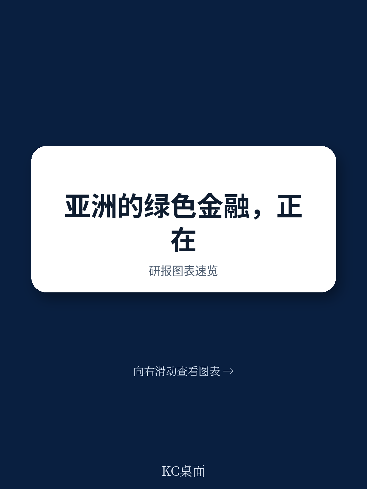
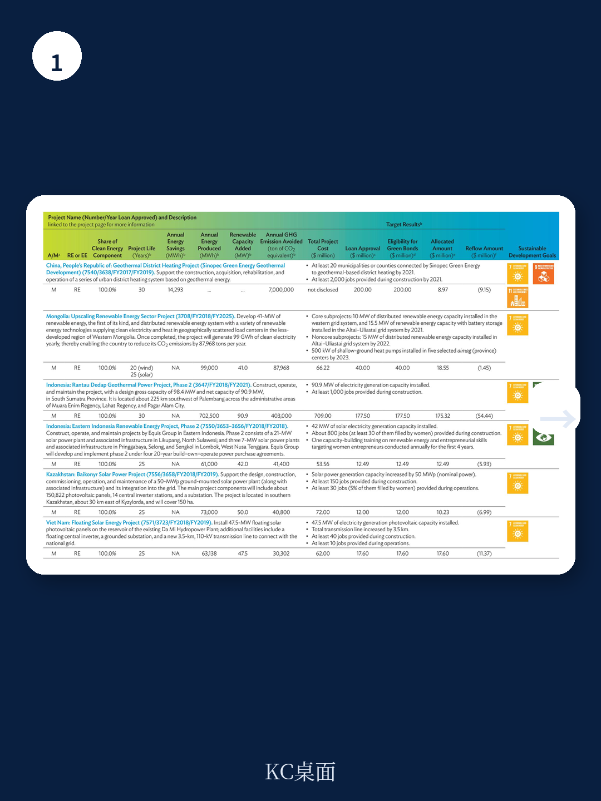
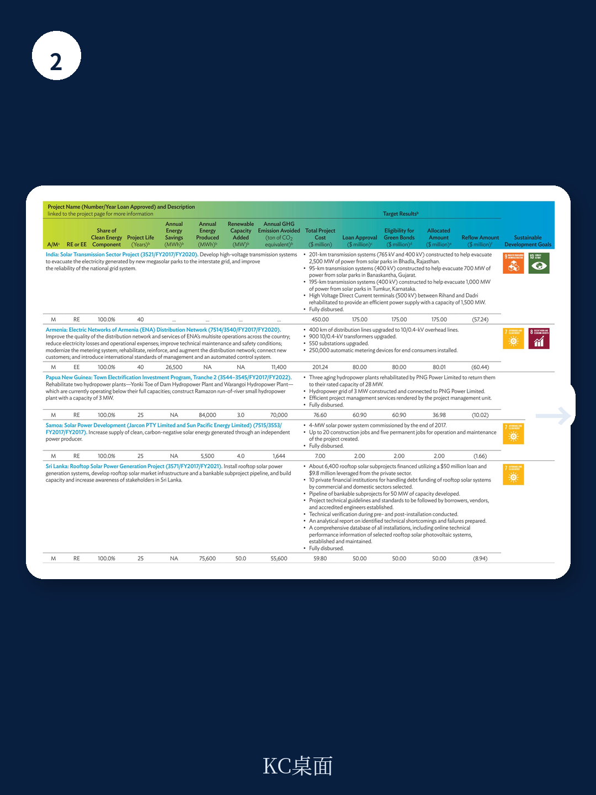

# 亚洲开发银行：绿色与蓝色债券通讯2026

2025年，亚洲开发银行（ADB）从自有资源中承诺了135亿美元的气候融资，占其年度总承诺融资额的51%。这一数字较2024年的111亿美元有明显增长，其中88亿美元用于减缓气候变化，45亿美元用于适应气候变化。自2019年至2025年，ADB累计气候融资承诺已达554亿美元。

这份2026年7月发布的绿色与蓝色债券通讯显示，ADB正在将气候融资目标从承诺转化为可追踪的资产配置。自2015年启动绿色债券计划以来，ADB已通过该工具筹集约150亿美元，覆盖19种货币。蓝色债券自2021年纳入框架后，已发行约6.12亿美元，以澳元、新西兰元和瑞典克朗计价。

> **KC评论：** 135亿美元的年承诺额和51%的占比，意味着ADB已提前实现其2030年气候融资占比50%的目标。对关注多边开发银行资金流向的机构而言，这不仅是规模信号，更意味着项目筛选标准和资金分配机制已经成熟，可供参考。

## 1. 冰川到农场区域项目动员35亿美元，聚焦中亚与西亚气候适应

在巴西贝伦举行的COP30上，ADB与绿色气候产品（GCF）正式启动了“冰川到农场”（G2F）区域项目。该项目动员35亿美元总融资，包括GCF提供的2.5亿美元赠款和优惠融资，支持中亚和西亚的气候韧性发展。

G2F项目覆盖农业、水资源、健康和社会保护等领域，针对全球变暖最快的区域之一。其设计包括三个层次：提升政府部门的气候信息公共研究规划能力、推动可融资适应项目的开发、试点基于成果的韧性债券等创新资金工具。项目还通过知识平台和冰川实践社区促进区域合作，应对冰川融化和水资源短缺等共同不确定性。

这一项目结构表明，ADB正在将气候适应从概念转化为可操作、可融资的项目管道。对于中亚和西亚地区的政府和企业，这提供了明确的资金入口和项目设计参考。

## 2. 绿色债券资金按国家与行业分布呈现集中特征

截至2025年12月31日，ADB绿色债券承诺按国家分布的数据显示，资金流向集中在少数几个国家。按行业划分，能源、交通、城市基础设施和农业是主要投向领域。ADB明确列出了绿色债券的合格项目类别：减缓方面包括可再生能源（太阳能、风能、地热及20兆瓦以下小型水电）、能效和可持续交通（不含道路）；适应方面包括能源基础设施韧性、供水及其他城市基础设施、可持续交通和农业。

蓝色债券的承诺按国家分布同样呈现集中特征，按目标分类则包括生态系统与自然资源管理、污染控制、可持续沿海与海洋发展三大类。ADB的蓝色债券框架与海洋资金框架对接，并获得了奥斯陆国际气候与环境研究中心（CICERO）的“中绿”评级。

这些分类和分布数据为市场参与者提供了可追踪的资产类别参考。读者可以通过这些信息判断ADB债券资金的实际落地领域和区域不确定性敞口。

## 3. 项目级资金分配表揭示具体工程与产出指标

通讯中详细列出了截至2025年12月31日的绿色和蓝色债券合格项目分配表。以印度古吉拉特邦的屋顶太阳能项目为例，该项目总成本1.44亿美元，其中1.01亿美元被认定为绿色债券合格，已分配0.47亿美元。项目预期产出包括安装500兆瓦屋顶太阳能系统，覆盖约50万户家庭，每年减少约50万吨二氧化碳排放。

另一个典型案例是中国福建省沿海城市气候韧性发展与生物多样性保护项目。该项目总成本4.86亿美元，其中2.68亿美元被认定为蓝色债券合格。预期到2032年，至少440万人将从改善的基础设施和生态系统服务中受益，至少221公顷潮间带湿地和7公顷红树林将得到恢复和改善管理。

这些项目级数据是ADB绿色与蓝色债券框架可操作性的直接证据。对于希望理解多边开发银行如何将抽象的气候目标转化为具体工程产出的机构，这些表格提供了完整的追踪链条。

> **KC评论：** 项目分配表中最容易被忽略的是“已分配金额”和“回流量”两列。零回流量意味着项目尚在建设期或还款期未到，这对债券的现金流预测和再研究节奏有直接影响。读者在评估ADB绿色债券时，应关注这些分配进度数据，而非仅看承诺总额。

## 4. 自然融资缺口持续扩大，ADB通过自然解决方案融资中心加速布局

报告指出，自然融资缺口仍在扩大。在生物多样性公约第十六次缔约方大会（CBD COP16）上，虽然建立了卡利产品，但2024年峰会前发布的彭博报告估计，每年需要9420亿美元才能阻止和扭转生物多样性的持续下降。为应对这一挑战，ADB正在扩大自然解决方案融资中心（NSFH）的规模。随着全球环境产品（GEF）资助的自然资本产品获批，ADB预计2025年自然融资将取得显著进展。

ADB还与资本市场协会、联合国全球契约、联合国环境规划署资金倡议和国际资金公司合作，发布了《可持续蓝色宏观环境融资债券：从业者指南》，为蓝色宏观环境融资提供市场一致性和透明度标准。

这一系列动作表明，ADB正在将自然融资作为与气候融资并列的独立赛道。对于关注生物多样性和自然资本市场的机构，ADB的框架文件和项目案例提供了可复用的市场标准。

---

For informational purposes only. Portions may be generated,translated,summarized,or edited with AI assistance based on source materials and may contain omissions or errors. Please verify independently. This is not investment,legal,tax,accounting,or other professional advice.

