# External Sector Dynamics and Firms' Competitiveness in Greece

Tomohide Mineyama

SIP/2026/071

IMF Selected Issues Papers are prepared by IMF staff as background documentation for periodic consultations with member countries. It is based on the information available at the time it was completed on April 30, 2026. This paper is also published separately as IMF Country Report No 26/109.

2026
JUL

# IMF Selected Issues Paper European Department External Sector Dynamics and Firms' Competitiveness in Greece Prepared by Tomohide Mineyama\*

Authorized for distribution by Joong Shik Kang
July 2026

IMF Selected Issues Papers are prepared by IMF staff as background documentation for periodic consultations with member countries. It is based on the information available at the time it was completed on April 30, 2026. This paper is also published separately as IMF Country Report No 26/109.

ABSTRACT: Greece's external sector has undergone significant transformation over the past decades. Precrisis imbalances—including large fiscal deficits, household overinvestment, and elevated labor costs—have largely been corrected. Nevertheless, the current account deficit remains sizable, reflecting persistent challenges such as subdued private saving, low value added in exporting sectors, and high external debt. Advancing supply-side reforms would help strengthen international competitiveness and raise productivity, supporting higher domestic value-added and saving. Maintaining prudent fiscal policy remains essential to further reduce external debt.

RECOMMENDED CITATION: Tomohide Mineyama. External Sector Dynamics and Firms' Competitiveness in Greece. IMF Selected Issues Paper (SIP2026/071). Washington DC. International Monetary Fund.

<table><tr><td>JEL Classification Numbers:</td><td>F32, F41, D24</td></tr><tr><td>Keywords:</td><td>External Balance, Savings, Trade, Competitiveness, Structural Reforms</td></tr><tr><td>Author&#x27;s E-Mail Address:</td><td>tmineyama@imf.org</td></tr></table>

SELECTED ISSUES PAPERS

# External Sector Dynamics and Firms' Competitiveness in Greece

Greece

Prepared by Tomohide Mineyama $^{1}$

## GREECE

SELECTED ISSUES

April 30, 2026

Approved By

Prepared By Tomohide Mineyama (EUR).

European Department

## CONTENTS

EXTERNAL SECTOR DYNAMICS AND FIRMS' COMPETITIVENESS IN GREECE 2
A. Motivation 2
B. Shifting Sectoral Saving-Investment Balances 3
C. Persistent Domestic Production Gaps 5
D. Cyclical Implications of Structural Challenges 9
E. Structural Reforms and Export Competitiveness 11
F. Policy Recommendations 12

## BOX

1. External Financial Flows and Debt Service Burdens 5

## FIGURES

1. Current Account Balance 2  
2. Sectorial SI Balance 3  
3. Sectoral Gross Saving and Investment 3  
4. Drivers of Household and NFC Savings 4  
5. Decomposition of Current Account and Trade Balances 6  
6. Exports and Cost Competitiveness 7  
7. Characteristics of Export Sectors 8  
8. Cost and Non-Cost Competitiveness 9  
9. Estimated Impacts of Recent Developments on CA Balance 10  
10. Structural Impediments and Firms' Performance 12

## APPENDICES

I. Input-Output Analysis 14

II. World Bank Enterprise Survey 16

References 19

# EXTERNAL SECTOR DYNAMICS AND FIRMS' COMPETITIVENESS IN GREECE $^{1}$

Greece's external sector has undergone significant transformation over the past decades. Pre-crisis imbalances—including large fiscal deficits, household overinvestment, and elevated labor costs—have largely been corrected. Nevertheless, the current account deficit remains sizable, reflecting persistent challenges such as subdued private saving, low value added in exporting sectors, and high external debt. Advancing supply-side reforms would help strengthen international competitiveness and raise productivity, supporting higher domestic value-added and saving. Maintaining prudent fiscal policy remains essential to further reduce external debt.

## A. Motivation

1. Greece's current account (CA) deficit has widened in recent years, reversing much of the post-crisis adjustment. While the sovereign debt crisis was marked by large external imbalances, which narrowed substantially during the subsequent adjustment period, the CA deficit

widened again after the pandemic (Figure 1). The deterioration initially reflected the collapse of tourism followed by the impact of higher energy prices and rising interest rates after Russia's war in Ukraine. Although these pressures have partly eased, the CA deficit remains elevated, driven by strong goods imports associated with robust domestic demand, including NGEU-financed investment. As a result, Greece records the second largest CA deficit in the euro area and the largest negative net international investment position (NIIP).

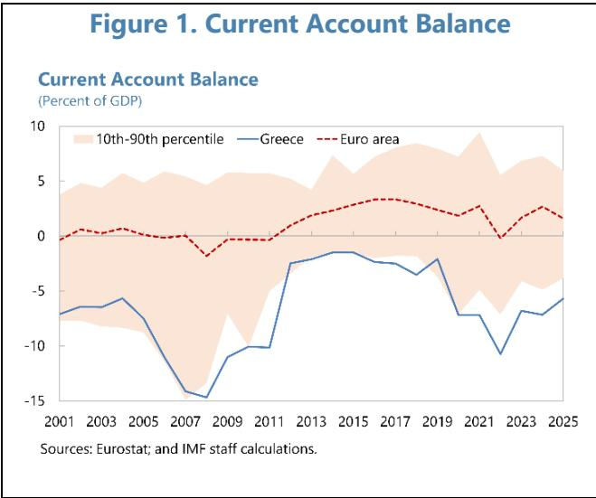

2. This paper examines recent CA dynamics from both cyclical and structural perspectives, highlighting post-crisis improvements alongside remaining challenges. Section B examines the CA dynamics from the saving-investment balance perspectives to understand shifts in sectoral contributions after the crisis. Section C discusses remaining challenges in exporting sectors and competitiveness on the production side of the economy. Section D examines the implications of these challenges for recent CA developments and Section E presents an empirical analysis of the

relationship between structural impediments and firms' competitiveness. Section F concludes with policy implications.

## B. Shifting Sectoral Saving-Investment Balances

3. The recent CA deficit is driven primarily by private sector's saving-investment (SI) imbalance, in contrast to the pre-crisis period when deficits were largely public sector driven.

Before the crisis, external imbalances reflected negative general government (GG) net saving, stemming from expansionary fiscal policies and weak tax collection, alongside household overinvestment associated with the housing boom (Figure 2). Over time, substantial fiscal consolidation has shifted the GG SI balance into surplus, aside from temporary pandemic-related support measures. Despite elevated public external debt, debt service costs remain contained due to a large share of official debt with low interest rates and ultra-long maturities (Box 1). In contrast, the recent CA deficit is largely driven by the private

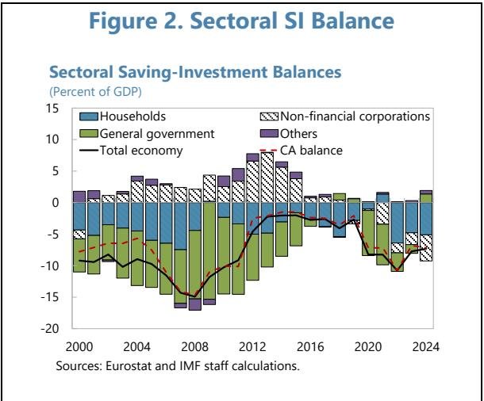

sector, with non-financial corporates' (NFCs') SI balance turning to negative, while households' saving remaining subdued.

4. Private gross saving remains insufficient to finance rising investment. The recent widening of the private sector's SI deficit has been driven mainly by higher NFCs' investment (Figure 3), reflecting the implementation of NGEU projects, pent-up investment needs following years of post-crisis underinvestment, and growing needs related to ICT and energy security. However, domestic saving has not kept pace. Household saving remains low—aside from a temporary post-

Figure 3. Sectoral Gross Saving and Investment  
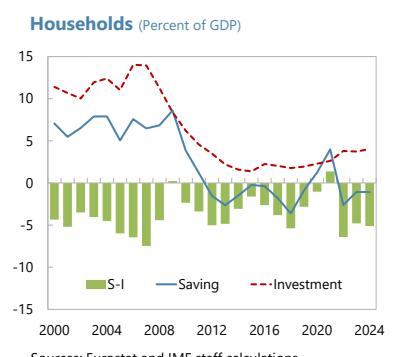  
Sources: Eurostat and IMF staff calculations.

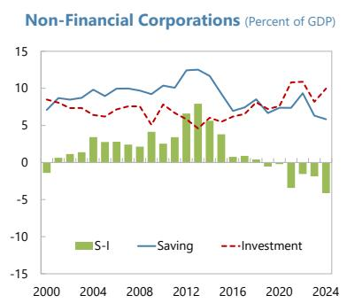

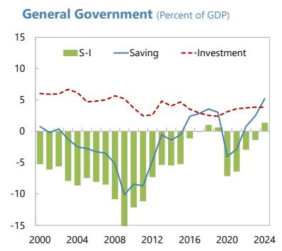

2002 2004 2006 2008 2010 2012 2014 2016 2018 2020 2022 2024
Note: NPISH and GOS stand for "non-profit institutions serving households" and "gross operating surplus," respectively.
Sources: Eurostat and IMF staff calculations.

pandemic increase—despite strong economic growth (Figure 4). $^{2}$ Real wage growth has been limited, consistent with weak labor productivity growth (reflected in “compensation of employees” for employed workers and “gross operating surplus and mixed income” for self-employed workers). High living costs for essentials such as housing, energy, and food further constrain households’ saving capacity. Fiscal consolidation, including lower net social benefits and higher tax burdens, has further weighed on household disposable income. At the same time, NFCs’ gross value-added creation has stagnated, reflecting low productivity growth and high intermediate input costs. Going forward, it is essential that the current investment cycle translates into sustained gains in value-added production, supporting higher corporate surpluses and household incomes—key elements of durable saving.

Figure 4. Drivers of Household and NFC Savings  
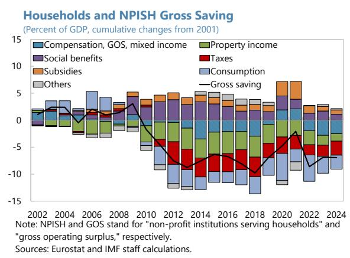

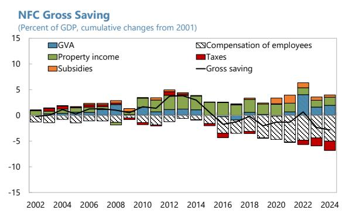

Box 1. External Financial Flows and Debt Service Burdens

Despite high external debt, debt service burdens remain contained. The net international investment position (NIIP), in percent of GDP, continued to increase after the crisis, reflecting elevated external financing needs and the sharp contraction in nominal GDP. However, as the bulk of external debt consists of low-interest official loans with very long maturities and extended grace periods, debt service obligations have remained manageable (see figures below).

The negative NIIP, albeit still elevated, has been on a sustained improving trend in recent years. External financing was initially dominated by official flows in the aftermath of the crisis, but normalized as market access was restored. At the same time, FDI inflows strengthened, reflecting the privatization program and improved investor confidence. Thanks to contained financing need supported by substantial fiscal consolidation and strong nominal GDP growth, the NIIP began to improve after the pandemic.

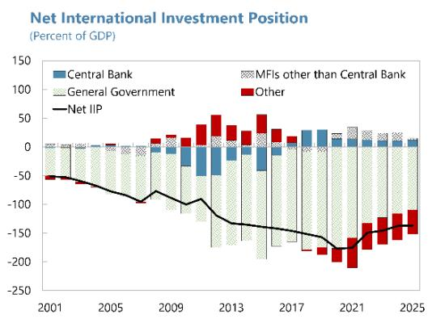

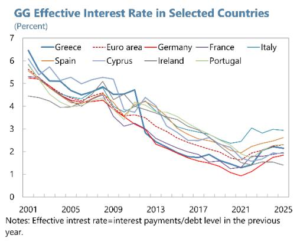  
Financial Account Balance (Percent of GDP)

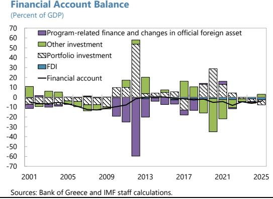

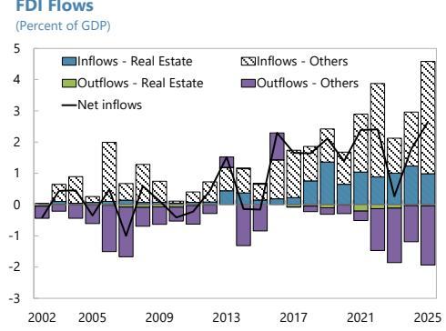

## C. Persistent Domestic Production Gaps

5. The weak private sector SI balance reflects a persistent trade deficit. While Greece generates substantial net services exports, mainly from tourism and shipping, it remains heavily reliant on goods imports across consumption, intermediate, and capital goods, underscoring a limited domestic production base (Figure 5). Despite the recent expansion of renewable energy production, such as solar and wind, the energy balance remains in deficit. The trade balance has averaged a deficit of 5.7 percent of GDP since 2000, as a large goods deficit of 13.7 percent more than offset a service surplus of 8.0 percent, accounting for most of the CA deficit (6.8 percent of GDP).

Figure 5. Decomposition of Current Account and Trade Balances  
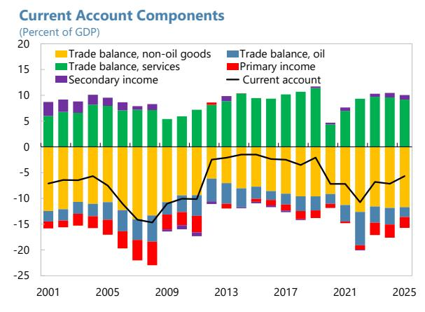

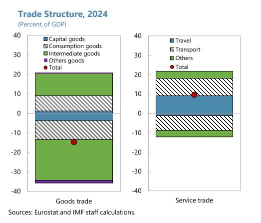

6. Exports have expanded markedly across a broad range of sectors over the past decades. Despite the large trade deficit, the exports-to-GDP ratio has almost doubled since the early 2000s, reaching about 40 percent of GDP in 2025—close to the euro area average of 49 percent (Figure 6). This increase reflects broad-based growth both in goods and services. Goods exports have been driven by traditional sectors, such as (i) refined petroleum products that capitalize on Greece's geographic position by importing crude oil from the Middle East and North Africa and exporting refined products to the rest of Europe, and (ii) food, beverages, and agricultural products, supported by well-established Greek brands. At the same time, (iii) pharmaceuticals and cosmetic products, and (iv) medical devices have emerged as dynamic export sectors, with rising market shares in the EU.

7. Export growth has been underpinned by improved cost competitiveness. The unit labor cost (ULC)-based real effective exchange rate (REER), which measures production costs relative to trading partners, depreciated by more than 30 percent from its peak in 2011Q3 (Figure 6). This was achieved largely through wage adjustments enabled labor market reforms that increased flexibility and facilitated internal devaluation during the adjustment period. This adjustment reversed the pre-crisis overvaluation driven by rapid wage growth and helped restore cost competitiveness across both goods and services, supporting export performance.

## Figure 6. Exports and Cost Competitiveness

Export of Goods and Services (Percent of GDP)

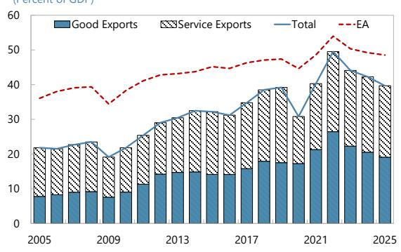  
Goods Exports by Product (Percent of GDP)

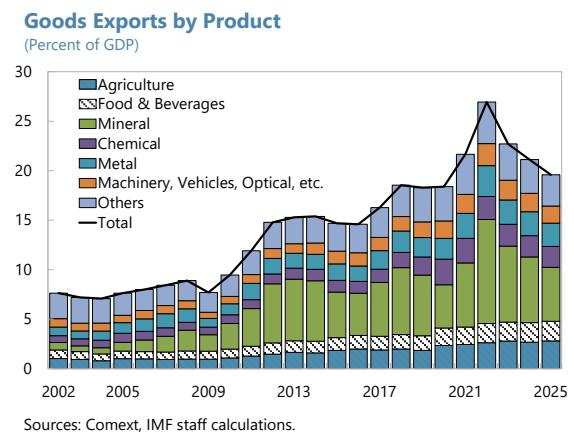  
Export Share in EU (Percent)

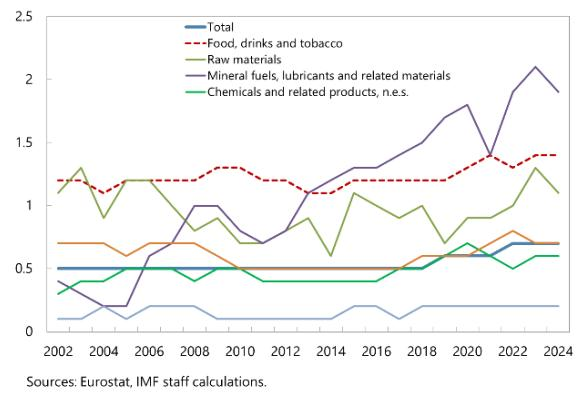  
Real Effective Exchange Rate

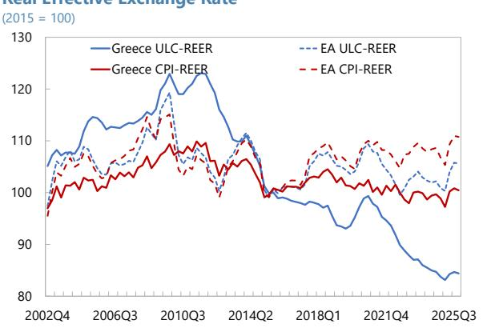

8. However, exports remain concentrated in relatively low value-added sectors, limiting their contribution to net exports. Despite the strong export growth, diversification remains limited, with goods exports dominated by refined petroleum and agricultural and food products, and services exports largely driven by tourism. This concentration is evident in the economic complexity index and revealed comparative advantage measures (Figure 7). While export expansion has supported domestic activity and employment, an analysis based on sectoral input–output linkages indicates that the domestic value-added multiplier of exports is relatively low—about 0.43 on average—implying that €1 of exports generates only about €0.43 in domestic value added or GDP, with substantial import leakages (see Appendix I for technical details). Large sectors—including refined petroleum, metals, and food products—remain locked into lower value-added activities. Moreover, although some higher-technology sectors—including pharmaceuticals and electronic and optical equipment (such as medical devices)—have recorded rapid export growth, their contribution to domestic value added has so far been limited. As a result, export expansion has had only a modest impact on improving the trade balance.

## Figure 7. Characteristics of Export Sectors

Economic Complexity Index of Exports

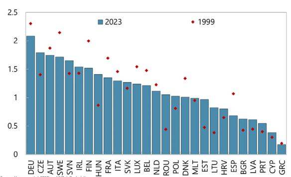  
Sources: Hausmann et al. (2013), and IMF staff calculations.
Note: The Economic Complexity Index (Hausmann et al., 2013) measures the amount of productive knowledge in exports. It is a function of a country's Export diversity (number of products exported) and uniqueness (number of countries exporting a product) in a relative sense. Black diamonds are averages for 1995-1999; blue bars are averages for 2018-23.

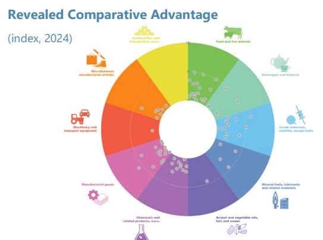  
Notes: The RCA measures a country's export shares relative to the world export shares. Dots are goods at the SITC 3-digit level.
Source: UNCTAD.  
Employment and Export Growth (x-axis: export growth from 2010 to 2020 in percent, y-axis: employment growth from 2010 to 2020 in percent)

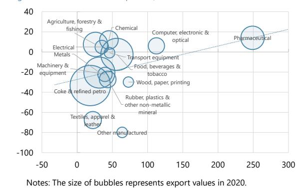  
Notes: The size of bubbles represents export values in 2020. Sources: ELSTAT, EU KLEMS, and IMF staff calculations.  
Value Added Multiplier and Export Growth (x-axis: export growth from 2010 to 2020 in percent, y-axis: value added multiplier in percent)

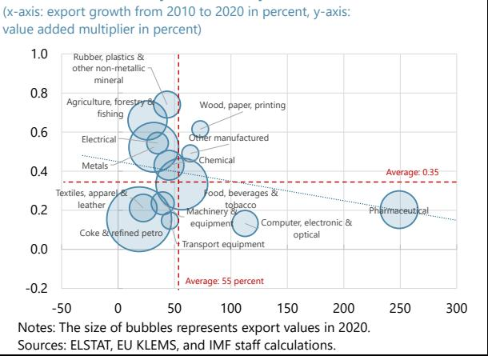  
Notes: The size of bubbles represents export values in 2020. Sources: ELSTAT, EU KLEMS, and IMF staff calculations.

9. Despite gains in cost competitiveness, improvements in underlying productivity have been sluggish. The large post-crisis depreciation of the ULC-based REER was mainly driven by real wage compression, while labor productivity contributed little and at times even exerted upward pressure on ULCs before a recent partial improvement (Figure 8). Real wage adjustment was further dampened by slow price adjustment, reflecting persistent product-market frictions and high non-wage costs, including regulatory and administrative burdens and energy costs. As a result, notwithstanding some recent progress, Greece continues to perform poorly across several structural indicators, and adjustments of the CPI-based REER were much more contained than the ULC-based rate (Figure 6).

Figure 8. Cost and Non-Cost Competitiveness  
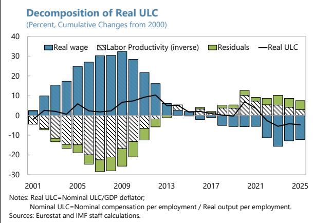

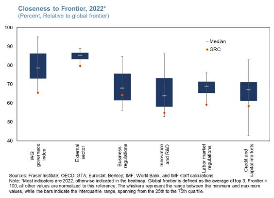

## D. Cyclical Implications of Structural Challenges

10. Structural weaknesses have amplified the recent widening of the CA deficit. Subdued private saving and limited domestic value-added activities, underpinned by sluggish productivity growth, have remained persistent structural constraints. This section aims to quantify how much these structural challenges contribute to the recent widening of the CA deficit, in the context of strong domestic demand-driven growth and volatile global commodity prices and interest rates. Specifically, low household saving implies hand-to-mouth consumption behavior, with income gains translating quickly into consumption rather than saving. At the same time, stagnant value-added creation by NFCs, combined with rising investment, has resulted in a negative SI balance. On the production side, insufficient domestic production capacity—exacerbated by weak productivity growth—has constrained the economy's ability to meet rising domestic demand and leads to higher imports. Moreover, the disparity between a goods trade deficit and a services trade surplus has heightened the sensitivity of the CA balance to relative price movements, especially global commodity price fluctuations. Similarly, a highly negative NIIP has amplified exposure to interest rate movements through higher primary income payments.

11. Parsimonious simulations are conducted to quantify the impacts of key recent domestic and external dynamics. The analysis below focuses on estimating the contribution of domestic demand growth and global commodity price and interest rate fluctuations, based on a set of assumptions:

\- Domestic demand. Imports associated with domestic demand are estimated by applying import multipliers—derived from input–output tables—to observed changes in consumption and investment. The estimated multipliers are around 0.3 for consumption and 0.4 for investment, reflecting the limited domestic capacity to produce capital and intermediate goods.

\- Exports. Exports are measured net of their import content using an estimated import multiplier of about 0.4.

\- Fuel prices. The impact of global fuel price movements is estimated based on the level of the fuel trade balance in 2019 and observed and projected fuel price changes afterwards informed by the WEO.

\- Interest rates. Although a large share of public debt carries fixed-interest rates, higher interest rates increase debt service costs on other liabilities, including central bank's TARGET liabilities. Focusing on the TARGET liabilities, the impact is estimated using the outstanding stock at the end of previous year, assumed constant in the projection period, and the 3-month euro area interest rate.

\- Nominal GDP. Nominal GDP growth and projections are used to express the CA balance as a share of GDP.

\- The approach complements the IMF External Balance Assessment (EBA) methodology, which adjusts the CA balance for cyclical factors including the output gap and commodity terms of trade. $^{3}$ It further accounts for the distinct spillovers of each demand component (consumption, investment, and exports) through sectoral input-output linkages specific to Greece, and also for the impact of global interest rate dynamics.

12. The simulations suggest that the recent widening of CA deficit largely reflects strong domestic demand, especially investment that has high import contents, alongside elevated

global fuel prices and interest rates. The findings indicate that rising investment and consumption have been the main drivers of the deterioration in the CA balance, while the net contribution of exports remains modest once their import content is taken into account (Figure 9). Investment has had a disproportionately large impact relative to its growth share, reflecting its high import intensity. By contrast, the effects of higher fuel prices and interest rates have been modest, as these pressures have eased since the onset of the war in Ukraine. The estimates are subject to uncertainty, as they rely on static input–output relationships and do not capture dynamic responses.

Figure 9. Estimated Impacts of Recent Developments on CA Balance

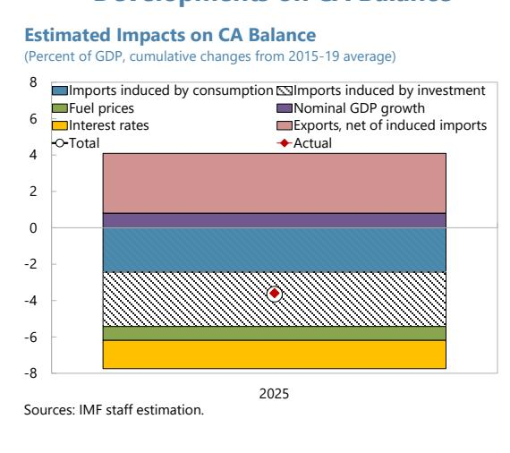

13. Absent structural reforms, these cyclical pressures are expected to ease only gradually. Domestic demand growth is projected to have peaked in 2025 and moderate thereafter, while investment is expected to remain robust, reflecting persistent investment gaps. In the absence of

structural reforms to raise domestic value-added capacity and productivity, these trends are likely to continue to weigh on the CA balance.

## E. Structural Reforms and Export Competitiveness

14. This section analyzes the relationship between structural impediments and firms' performance using firm-level data. Building on earlier findings that limited NFC expansion and weak income distribution to households underpin the recent CA deficit, this section uses firm-level data from the World Bank Enterprise Surveys for EU countries (see Appendix II for details) to identify key constraints on firms' activity. The analysis focuses on how structural impediments for businesses—elicited from the survey's qualitative questions about firms' perceived business obstacles—are associated with firm performance, such as sales growth and export participation.

15. Greek firms face significant structural obstacles. The analysis focuses on four key constraints: (i) regulatory and administrative burdens, (ii) competition from the informal sector, (iii) limited access to skilled labor, and (iv) financing constraints. Regulatory and administrative burdens raise production costs and hinder firms' ability to scale up, while competition with informal firms undermines profitability. Shortage of skilled labor and finance directly limit investment and growth. These constraints are measured using firms' self-reported assessments from survey data. While perception-based indicators may be subject to measurement error, they have the advantage of reflecting binding, de facto constraints on firms' activity rather than solely the de jure policy framework. Greek firms report substantially more severe constraints than their EU peers, with several indicators exceeding the 90th percentile of the EU distribution (Figure 10).

## 16. Structural impediments are strongly associated with weaker firm performance.

Regression analysis shows that these obstacles are associated with lower growth, even after controlling firm characteristics and country-by-year fixed effects (Figure 10). $^{4}$ Export participation is particularly hindered by regulatory and administrative burdens and competition from the informal sector, consistent with firm-selection mechanisms in heterogeneous-firm trade models (à la Melitz), in which only firms with sufficient profitability (either reflecting relatively low regulatory costs or profit margins that are less compressed by competition from the informal sector) can enter export markets. These effects are particularly pronounced for young firms, whereas significant differences are not found across firm size, implying that young firms' growth potential is particularly constrained by the impediments, and their relatively small size prevents from enjoying scale merits to overcome regulatory burdens.

17. Counterfactual simulations indicate sizable gains from reducing structural gaps. Building on the regression estimates, counterfactual simulations assume reforms that close 50 percent of the gap between Greece and the EU frontier, defined as the top decile performer for each indicator. Under this scenario, real sales growth would increase by about 1.8 percentage points,

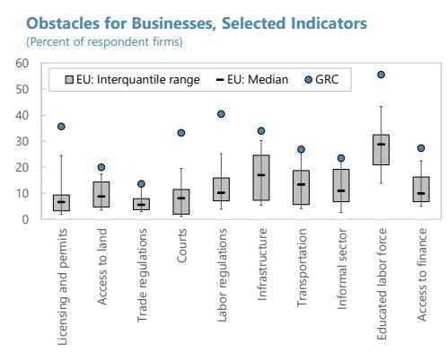

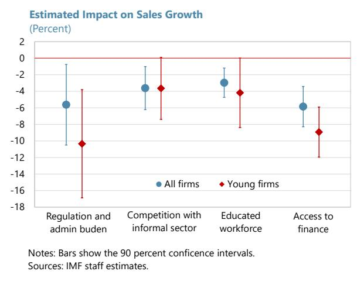

while the probability of exporting would rise by 7.3 percentage points (Figure 10). The effects are larger for young firms, with gains of 2.7 and 8.8 percentage points, respectively. Improved access to finance accounts for the largest share of the sales growth effect (around 0.6 percentage points) for the full sample, while the remaining gains are broadly comparable across skilled labor availability, reduced informality, and lower regulatory and administrative burdens. For young firms, regulatory and administrative burdens and access to finance play an even more prominent role, reflecting the importance of these obstacles. Increased export participation is driven mainly by improvements in regulatory and administrative conditions, consistent with the regression results.

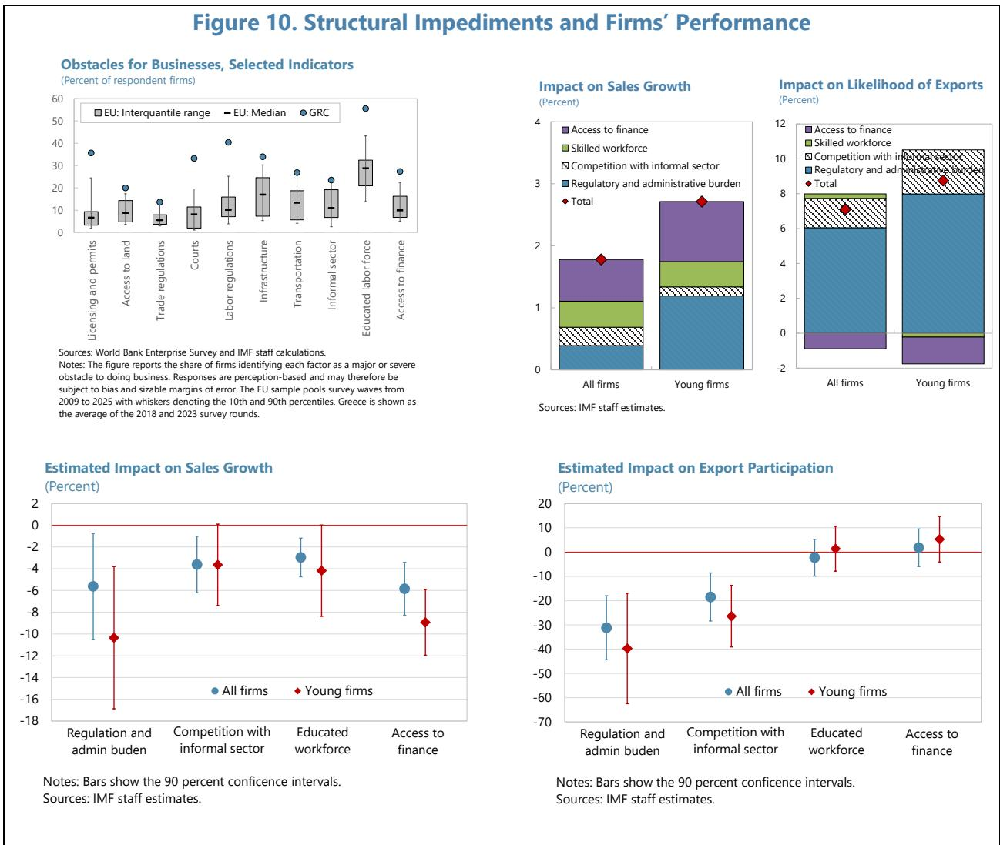

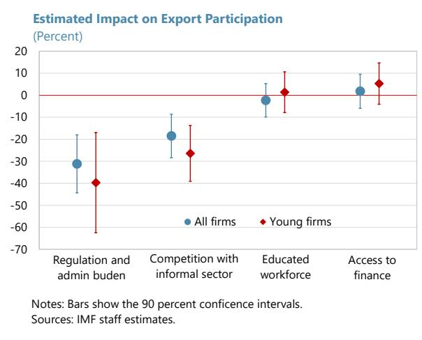

## F. Policy Recommendations

18. Strengthening the external position requires enhancing international competitiveness and expanding domestic supply capacity. Reducing external imbalances hinges on increasing firms' ability to generate domestic value added and ensuring that growth translates into higher domestic income. This calls for structural policies that boost productivity, promote diversification toward higher value-added activities, and deepen linkages between exporters and the broader

economy. Policies that sustainably raise household disposable income and profitability of NFCs would support higher private saving and reduce reliance on CA deficits.

19. Structural reforms should prioritize removing barriers to firm growth and export participation. Evidence in this paper identifies regulatory and administrative burdens, informality, skill shortages, and limited access to finance as key constraints on firm performance and competitiveness. Streamlining administrative procedures, lowering compliance costs, and improving regulatory quality would reduce fixed costs and support firm scaling, particularly among young and productive firms. Continued efforts to address informality—supported by digitalization and tax compliance efforts—would help level the playing field and raise productivity. Policies to alleviate skill shortages through education, training, and lifelong learning would facilitate firms' transition toward higher value-added activities. Improving access to finance, especially for high-return investment including digital investment, would help translate ongoing investment into sustained gains in domestic value added.

20. Prudent fiscal policy should complement structural reforms. Maintaining a prudent fiscal stance is essential to contain excessive domestic demand pressures that could deteriorate the SI balance. Within this fiscal framework, reallocating expenditure toward growth-enhancing priorities—such as public investment and critical social spending—would support private sector investment and household disposable income.

21. EU-level reforms, namely completing the EU single market, would support Greece's domestic structural reforms and strengthen external sustainability. Setting a level playing field across the union and reducing trade barriers would enable Greek firms to scale beyond relatively small domestic markets. Advancing the Savings and Investments Union would lower financing costs and mobilize risk capital for innovators, helping overcome the lack of domestic savings. Greater labor mobility would help mitigate demographic pressures and support skill upgrading. Integrating the energy market would significantly help Greece achieve energy security, reduce energy price and volatility, and lower production costs and energy trade deficit.

22. A credible reform agenda would also support stable external financing. Progress on structural reforms, alongside prudent macroeconomic policies, would enhance Greece's attractiveness for foreign direct investment and other stable capital flows, reducing vulnerabilities to external shocks. Over time, stronger domestic value-added creation and higher private saving would support a more balanced and sustainable growth model.

## Appendix I. Input-Output Analysis

1. The analysis quantifies the spillovers from shifts in final demand—particularly exports—to domestic economic activities and imports through sectoral input-output linkages.

\- The framework considers an economy with multiple sectors, linking demand and supply as follows:

$$
\underbrace {A X} _ {\text { Intermediate   demand }} + \underbrace {F} _ {\text { Final   demand   (C + I + EX) }} = \underbrace {X} _ {\text { Gross   domestic   output }} + \underbrace {I M} _ {\text { Imports }},
$$

where X, F, and IM is n-by-1 vectors containing sectoral gross domestic output, final demand (the sum of consumption C, investment I, and exports EX), and imports, respectively. A is a n-by-n input-output matrix whose $(i,j)$ element denotes inputs from sector i used in sector j. Accordingly, AX represents intermediate demand for each sector.

\- The framework explicitly considers trade, in line with the recent literature on sectoral input-output linkages in an open economy setting (Baqaee and Farhi, 2024). Imports are assumed to be endogenously determined as a constant share of gross output:

$$
I M = \mathrm{diag} (\delta) X,
$$

where $\delta$ is a n-by-1 vector of sectoral import shares.

\- Rearranging these equations yields an expression for gross output:

$$
\underbrace {X} _ {\text {Gross output}} = \underbrace {\left(I - (A - \delta)\right) ^ {- 1}} _ {\text {Adjusted Leontief inverse (\equiv L^{adj})}} \times \underbrace {F} _ {\text {Final output}},
$$

where $L^{adj}$ denotes the adjusted Leontief inverse. This matrix corrects the standard Leontief inverse $L = (I - A)^{-1}$ for import leakages, capturing the erosion of domestic production through imported inputs.

\- The implied effects on total value added (VA) and imports (IM) is given by

$$
\begin{array}{c} \underbrace {V A ^ {t o t a l}} _ {\text {Value added}} = \underbrace {v ^ {\prime} L ^ {a d j}} _ {\text {Value added multiplier}} \times \underbrace {F} _ {\text {Final demand}}, \\ \underbrace {I M ^ {\text {total}}} _ {\text {Imports}} = \underbrace {\delta^ {\prime} L ^ {a d j}} _ {\text {Import multiplier}} \times \underbrace {F} _ {\text {Final demand}}, \end{array}
$$

where v denotes a n-by-1 vector of value-added shares of gross output. The i-th element of the value-added and import multipliers measures the percent change in aggregate value added or imports associated with a one-percent increase in final demand in sector i.

2. The framework is implemented using input–output tables compiled by the Hellenic Statistical Authority (ELSTAT) under ESA 2010. The analysis uses the latest available data for 2020, with robustness checks conducted using earlier vintages (2015 and 2010). Although the tables are provided on a product-by-product basis, they are interpreted as sectoral accounts following Backinezos et al. (2020), as products and sectors largely correspond on a one-to-one basis. The original 62 domestic sectors (excluding imputed rents) are aggregated into 40 sectors to ensure consistency with EU KLEMS classifications. The analysis focuses in particular on export shocks originating from 14 goods-producing sectors, excluding mining and quarrying.

3. Several caveats apply to the analysis. First, the framework treats the economic structure—including input–output relationships and import shares—as fixed and therefore does not capture potential structural changes in response to large shocks. Second, the input–output structure is assumed to be identical across components of final demand within each sector. For example, in the food products sector, exports may be concentrated in specific product categories rather than in the broad set of goods consumed domestically, which could introduce estimation errors. Third, measurement errors in input–output tables may be non-negligible.

## Appendix II. World Bank Enterprise Survey

1. The World Bank Enterprise Survey (WBES) is a firm-level survey designed to assess the business environment and firm performance across countries. It provides harmonized microdata on firms' characteristics, operational conditions, and perceived constraints to growth, enabling both cross-country and within-country comparisons. Surveys are conducted periodically in over 160 economies worldwide, with each country round typically covering between 500 and 1,000 firms. The sample is stratified by firm size, sector, and geographic location to ensure representativeness of the formal non-agricultural private sector. While the survey generally does not track the same firms over time, repeated cross-sections allow for the analysis of changes in the business environment and firm outcomes across survey waves. Prior studies using WBES data include Ospina and Schiffbauer (2010) examining a global sample of countries; Hjort and Poulsen (2019) focusing on Africa; and Bartolini, Wang, and Zhu (forthcoming) covering Central, Eastern, and Southeastern Europe (CESEE).

2. The analysis focuses on manufacturing firms in EU countries over the period 2008–2023. The start year is chosen to ensure consistency in survey questions across waves. The emphasis on manufacturing reflects our interest in good-exporting sectors. The resulting sample comprises approximately 10,000 firms, including observations from Greece's survey waves in 2018 and 2023.

3. The analysis adopts a novel approach to examine the relationship between perceived business obstacles and firm performance. The WBES collects firms' subjective assessments of the severity of key obstacles to doing business—such as regulatory and administrative burdens, infrastructure quality, access to finance, and skills shortages—allowing for the identification of binding constraints from the perspective of firms. These perceived obstacles are linked to quantitative measures of firm performance, including sales growth, labor productivity growth, and export participation, as well as firm characteristics such as size, ownership structure, and employment. Summary statistics are reported as below. In contrast to prior studies that examine individual structural factors in isolation (e.g., Klapper et al., 2006, for regulatory burdens; Reinikka and Svensson, 2002, for infrastructure; Beck et al., 2005, for access to finance), this analysis takes a holistic view of multiple structural impediments and assesses their relative importance. The firm-level evidence also complements cross-country and sector-level analyses of structural factors and growth.

Table 1. Greece: Summary Statistics

<table><tr><td rowspan="2"></td><td colspan="3">EU countries</td><td colspan="3">Greece</td></tr><tr><td>N</td><td>Mean</td><td>SD</td><td>N</td><td>Mean</td><td>SD</td></tr><tr><td colspan="7">Obstacles for businesses (1 or 0)</td></tr><tr><td>Regulation and admin burden</td><td>33,676</td><td>0.15</td><td>0.22</td><td>1,121</td><td>0.39</td><td>0.26</td></tr><tr><td>Competition with informal sector</td><td>35,386</td><td>0.13</td><td>0.34</td><td>1,158</td><td>0.23</td><td>0.42</td></tr><tr><td>Educated workforce</td><td>38,301</td><td>0.30</td><td>0.46</td><td>1,196</td><td>0.56</td><td>0.50</td></tr><tr><td>Access to finance</td><td>38,082</td><td>0.13</td><td>0.34</td><td>1,193</td><td>0.27</td><td>0.45</td></tr><tr><td>Exporter (1 or 0)</td><td>38,464</td><td>0.29</td><td>0.45</td><td>1,198</td><td>0.34</td><td>0.47</td></tr><tr><td>Foreign ownership (1 or 0)</td><td>38,383</td><td>0.11</td><td>0.32</td><td>1,194</td><td>0.12</td><td>0.32</td></tr><tr><td>Employment</td><td>38,578</td><td>83.6</td><td>504.9</td><td>1,198</td><td>78.5</td><td>125.7</td></tr><tr><td>Age</td><td>38,244</td><td>26.2</td><td>22.0</td><td>1,188</td><td>25.1</td><td>18.5</td></tr></table>

4. The empirical approach is based on the following regression specification:

$$
P e r f o r m a n c e _ {i c t} = \beta X _ {i c t} + \gamma Z _ {i c t} + F E _ {c \times t} + \varepsilon_ {i c t}.
$$

\- $Performance_{ict}$ denotes a performance indicator for firm $i$ in country $c$ surveyed in year $t$ . Performance is measured using sales growth (averaged over the previous two years) and export participation (a binary indicator equal to one if the firm exports and zero otherwise).

\- $X_{ict}$ captures firms' perceived business obstacles. Responses are based on the survey question: "To what degree is 'X' an obstacle to the current operations of this establishment?" An indicator equal to one is assigned if the obstacle is reported as "major" or "severe," and zero otherwise. Obstacles are constructed for four areas: (i) regulatory and administrative burdens, (ii) competition from the informal sector, (iii) availability of an educated workforce, and (iv) access to finance. The regulatory and administrative burden indicator is defined as the average of reported obstacles related to tax administration, customs and trade regulations, courts, labor regulation, and political instability, while the remaining obstacles are taken directly from the corresponding survey questions.

\- $Z_{ict}$ denotes a vector of firm-level controls, including the logarithm of total factor productivity (TFP) estimated by Francis et al. (2020) using a production-function approach, an indicator for foreign ownership, the logarithm of employment, firm age, and firm age squared. $FE_{c\times t}$ represents country-year fixed effects, which control for common macroeconomic and institutional conditions at the country-year level, and $\varepsilon_{ict}$ is an error term. As the data consist of repeated cross-sections, firm fixed effects cannot be included; instead, country-year fixed effects and detailed firm-level controls are used to mitigate omitted-variable bias.

\- Standard errors are clustered at the country-year level to account for correlation within survey waves.

\- The analysis is conducted for the full sample and a subsample of young firms (age below the median of 32 years).

## 5. Full regression results are reported as below.

<table><tr><td colspan="10">Table 2. Greece: Regression Results(A) Sales Growth</td></tr><tr><td rowspan="2">Dependent variable: Sample:</td><td rowspan="2"></td><td rowspan="2">All firms</td><td colspan="7">Real sales growth (percent)</td></tr><tr><td></td><td></td><td></td><td colspan="4">Young firms</td></tr><tr><td colspan="10">Obstacles for businesses (1 or 0)</td></tr><tr><td rowspan="2">Regulation and admin burden</td><td>-5.625*</td><td></td><td></td><td>-2.125</td><td>-10.343**</td><td></td><td></td><td></td><td>-6.462**</td></tr><tr><td>(2.951)</td><td></td><td></td><td>(2.717)</td><td>(3.960)</td><td></td><td></td><td></td><td>(3.137)</td></tr><tr><td rowspan="2">Competition with informal sector</td><td></td><td>-3.619**</td><td></td><td>-2.717**</td><td></td><td>-3.646</td><td></td><td></td><td>-1.347</td></tr><tr><td></td><td>(1.577)</td><td></td><td>(1.128)</td><td></td><td>(2.270)</td><td></td><td></td><td>(1.244)</td></tr><tr><td rowspan="2">Educated workforce</td><td></td><td></td><td>-2.965***</td><td>-2.113**</td><td></td><td></td><td>-4.183</td><td></td><td>-2.055</td></tr><tr><td></td><td></td><td>(1.073)</td><td>(0.971)</td><td></td><td></td><td>(2.546)</td><td></td><td>(2.260)</td></tr><tr><td rowspan="2">Access to finance</td><td></td><td></td><td></td><td>-5.849***</td><td>-4.764***</td><td></td><td></td><td></td><td>-8.928***</td></tr><tr><td></td><td></td><td></td><td>(1.474)</td><td>(1.650)</td><td></td><td></td><td></td><td>(1.833)</td></tr><tr><td colspan="10">Controls</td></tr><tr><td rowspan="2">Ln(TFP)</td><td>0.737***</td><td>0.640***</td><td>0.591***</td><td>0.681***</td><td>0.708***</td><td>0.636**</td><td>0.440**</td><td>0.452*</td><td>0.469**</td></tr><tr><td>(0.163)</td><td>(0.152)</td><td>(0.163)</td><td>(0.168)</td><td>(0.199)</td><td>(0.294)</td><td>(0.206)</td><td>(0.227)</td><td>(0.197)</td></tr><tr><td rowspan="2">Foreign ownership</td><td>4.035*</td><td>3.659</td><td>3.433*</td><td>4.119*</td><td>4.182*</td><td>8.256**</td><td>7.345*</td><td>6.670*</td><td>8.076**</td></tr><tr><td>(2.150)</td><td>(2.353)</td><td>(1.974)</td><td>(2.234)</td><td>(2.482)</td><td>(3.871)</td><td>(4.136)</td><td>(3.795)</td><td>(3.925)</td></tr><tr><td rowspan="2">Ln(Employment)</td><td>0.460</td><td>0.689</td><td>0.682</td><td>0.457</td><td>0.513</td><td>0.235</td><td>0.837</td><td>0.656</td><td>0.058</td></tr><tr><td>(0.488)</td><td>(0.420)</td><td>(0.444)</td><td>(0.464)</td><td>(0.439)</td><td>(0.641)</td><td>(0.749)</td><td>(0.792)</td><td>(0.712)</td></tr><tr><td rowspan="2">Age</td><td>-0.203***</td><td>-0.216***</td><td>-0.211***</td><td>-0.215***</td><td>-0.232***</td><td>-0.120</td><td>-0.186</td><td>-0.128</td><td>-0.041</td></tr><tr><td>(0.046)</td><td>(0.046)</td><td>(0.049)</td><td>(0.048)</td><td>(0.044)</td><td>(0.788)</td><td>(0.785)</td><td>(0.709)</td><td>(0.710)</td></tr><tr><td rowspan="2">Age squared</td><td>0.001***</td><td>0.001***</td><td>0.001***</td><td>0.001***</td><td>0.001***</td><td>-0.010</td><td>-0.007</td><td>-0.008</td><td>-0.013</td></tr><tr><td>(0.000)</td><td>(0.000)</td><td>(0.000)</td><td>(0.000)</td><td>(0.000)</td><td>(0.026)</td><td>(0.026)</td><td>(0.024)</td><td>(0.024)</td></tr><tr><td>N of obs.</td><td>9,991</td><td>10,162</td><td>11,035</td><td>10,968</td><td>9,300</td><td>4,426</td><td>4,565</td><td>4,925</td><td>4,898</td></tr><tr><td>R-squared</td><td>0.086</td><td>0.085</td><td>0.084</td><td>0.093</td><td>0.107</td><td>0.087</td><td>0.072</td><td>0.072</td><td>0.095</td></tr><tr><td colspan="10">(B) Export Participation</td></tr><tr><td rowspan="2">Dependent variable: Sample:</td><td rowspan="2"></td><td rowspan="2">All firms</td><td colspan="7">Exporter (1 or 0)</td></tr><tr><td></td><td></td><td></td><td colspan="4">Young firms</td></tr><tr><td colspan="10">Obstacles for businesses (1 or 0)</td></tr><tr><td rowspan="2">Regulation and admin burden</td><td>-0.312***</td><td></td><td></td><td>-0.328***</td><td>-0.397***</td><td></td><td></td><td></td><td>-0.433***</td></tr><tr><td>(0.080)</td><td></td><td></td><td>(0.091)</td><td>(0.138)</td><td></td><td></td><td></td><td>(0.145)</td></tr><tr><td rowspan="2">Competition with informal sector</td><td></td><td>-0.185***</td><td></td><td>-0.155**</td><td></td><td>-0.264***</td><td></td><td></td><td>-0.233***</td></tr><tr><td></td><td>(0.060)</td><td></td><td>(0.062)</td><td></td><td>(0.077)</td><td></td><td></td><td>(0.073)</td></tr><tr><td rowspan="2">Educated workforce</td><td></td><td></td><td>-0.023</td><td>-0.013</td><td></td><td></td><td>0.014</td><td></td><td>0.011</td></tr><tr><td></td><td></td><td>(0.046)</td><td>(0.054)</td><td></td><td></td><td>(0.056)</td><td></td><td>(0.064)</td></tr><tr><td rowspan="2">Access to finance</td><td></td><td></td><td></td><td>0.018</td><td>0.063</td><td></td><td></td><td></td><td>0.053</td></tr><tr><td></td><td></td><td></td><td>(0.047)</td><td>(0.049)</td><td></td><td></td><td></td><td>(0.057)</td></tr><tr><td colspan="10">Controls</td></tr><tr><td rowspan="2">Ln(TFP)</td><td>-0.044***</td><td>-0.046***</td><td>-0.049***</td><td>-0.048***</td><td>-0.044***</td><td>-0.048***</td><td>-0.046***</td><td>-0.051***</td><td>-0.052***</td></tr><tr><td>(0.013)</td><td>(0.013)</td><td>(0.013)</td><td>(0.013)</td><td>(0.013)</td><td>(0.013)</td><td>(0.015)</td><td>(0.015)</td><td>(0.014)</td></tr><tr><td rowspan="2">Foreign ownership</td><td>0.630***</td><td>0.632***</td><td>0.612***</td><td>0.609***</td><td>0.634***</td><td>0.681***</td><td>0.633***</td><td>0.641***</td><td>0.630***</td></tr><tr><td>(0.046)</td><td>(0.048)</td><td>(0.046)</td><td>(0.046)</td><td>(0.050)</td><td>(0.061)</td><td>(0.063)</td><td>(0.064)</td><td>(0.063)</td></tr><tr><td rowspan="2">Ln(Employment)</td><td>0.368***</td><td>0.372***</td><td>0.370***</td><td>0.370***</td><td>0.374***</td><td>0.336***</td><td>0.348***</td><td>0.341***</td><td>0.340***</td></tr><tr><td>(0.019)</td><td>(0.018)</td><td>(0.018)</td><td>(0.018)</td><td>(0.019)</td><td>(0.022)</td><td>(0.023)</td><td>(0.022)</td><td>(0.022)</td></tr><tr><td rowspan="2">Age</td><td>0.006***</td><td>0.006***</td><td>0.006***</td><td>0.006***</td><td>0.006***</td><td>0.018</td><td>0.011</td><td>0.018</td><td>0.017</td></tr><tr><td>(0.001)</td><td>(0.002)</td><td>(0.001)</td><td>(0.001)</td><td>(0.001)</td><td>(0.018)</td><td>(0.016)</td><td>(0.017)</td><td>(0.017)</td></tr><tr><td rowspan="2">Age squared</td><td>-0.000***</td><td>-0.000***</td><td>-0.000***</td><td>-0.000***</td><td>-0.000***</td><td>-0.000</td><td>-0.000</td><td>-0.000</td><td>-0.000</td></tr><tr><td>(0.000)</td><td>(0.000)</td><td>(0.000)</td><td>(0.000)</td><td>(0.000)</td><td>(0.001)</td><td>(0.001)</td><td>(0.001)</td><td>(0.001)</td></tr><tr><td>N of obs.</td><td>10,233</td><td>9,966</td><td>10,776</td><td>10,702</td><td>9,527</td><td>4,605</td><td>4,527</td><td>4,859</td><td>4,830</td></tr></table>

## References

Backinezos, Constantina, Stelios Panagiotou, and Christos Papazoglou (2020), "The Current Account Adjustment in Greece during the Crisis: Cyclical or Structural?," Economic Bulletin 51, pp. 73-90, Bank of Greece, July 2020.

Backinezos, Constantina, Stelios Panagiotou, and Evangelia Vourvachaki (2020), "Multiplier Effects by Sector: An Input-Output Analysis of the Greek Economy," Economic Bulletin 52, pp. 7-27, Bank of Greece, December 2020.

Bank of Greece (2026), "Annual Report 2025."

Baqaee, David Rezza and Emmanuel Farhi (2024), "Networks, Barriers, and Trade," Econometrica, 92(2), pp. 505–541.

Bartolini, David, Mengxue Wang, and Zeju Zhu (forthcoming), "Firm-Level Productivity in CESEE Countries," IMF Working Paper.

Beck Thorsten, Asli Demirgüc-Kunt, and Vojislav Maksimovic (2005), "Financial and Legal Constraints to Growth: Does Firm Size Matter?" Journal of Finance 60(1), pp. 137–177.

Francis, David C., Nona Karalashvili, Hibret Maemir, and Jorge Rodriguez Meza (2020), "Measuring Total Factor Productivity Using the Enterprise Surveys: A Methodological Note," World Bank Policy Research Working Paper 9491, December 2020.

Hjort and Poulsen (2019), "The Arrival of Fast Internet and Employment in Africa," American Economic Review 109(3), pp. 1032–1079.

Klapper, Leora, Luc Laevena, and Raghuram Rajan (2006), "Entry Regulation as a Barrier to Entrepreneurship," Journal of Financial Economics 82, pp. 591–629.

Ospina, Sandra and Marc Schiffbauer (2010), “Competition and Firm Productivity: Evidence from Firm-Level Data,” IMF Working Paper WP/10/67.

Reinikka and Svensson (2002), "Coping with poor public capital," Journal of Development Economics 69, pp. 51–69.