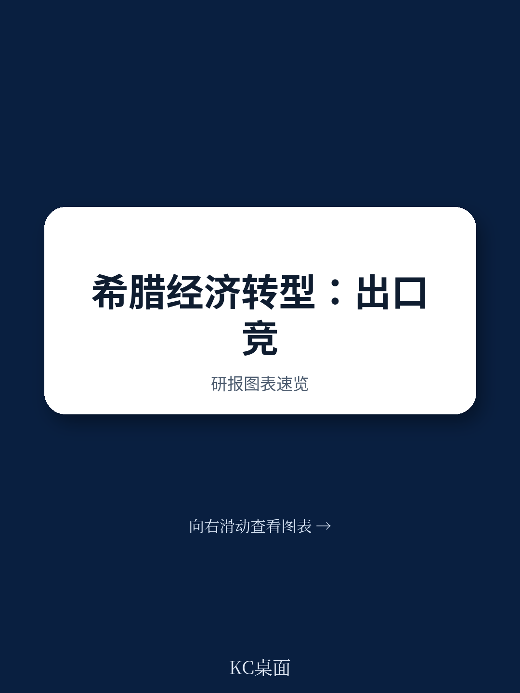
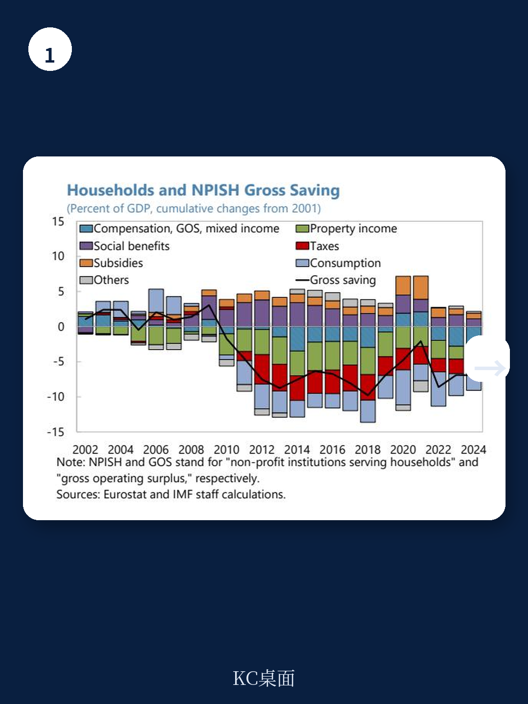
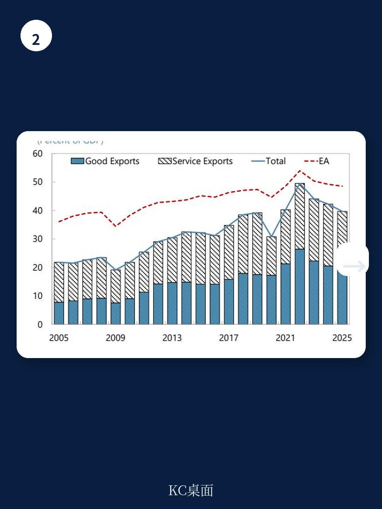

# IMF：希腊外部部门动态与企业竞争力

希腊的经常账户赤字在近年重新扩大，逆转了债务扰动后的大部分调整成果。IMF 最新一期国别报告指出，这一局面并非单纯的周期性波动，而是由私人储蓄不足、出口部门附加值偏低以及生产率增长仍在调整等结构性因素共同驱动。报告基于投入产出分析和企业调查数据，量化了这些约束条件对希腊外部平衡的具体影响。

扰动前的失衡——财政赤字、家庭过度研究和劳动力成本高企——已基本得到纠正。公共部门储蓄研究平衡已转为盈余，官方债务虽高，但因其低利率和超长到期结构，偿债负担仍在可控范围内。然而，经常账户赤字依然位居欧元区第二，净国际研究头寸为欧元区最差。报告认为，当前赤字的主要推手已从公共部门转向私人部门。

## 1. 私人储蓄不足与研究扩张之间的缺口持续扩大

非资金企业的储蓄研究平衡已转为负值，家庭储蓄率仍处于低位。报告数据显示，尽管希腊宏观环境在疫后实现强劲增长，但家庭储蓄并未同步回升。实际工资增长有限，与劳动生产率增长仍在调整一致；住房、能源和食品等必需品的高生活成本进一步挤压了储蓄能力。财政整固——包括净社会福利减少和税负上升——也对家庭可支配收入形成不确定性。

与此同时，非资金企业的研究正在上升，主要受 NGEU 项目落地、疫后补库存需求以及 ICT 和能源安全相关研究的推动。但国内储蓄未能跟上研究扩张的步伐。报告强调，当前研究周期能否转化为可持续的价值创造，是决定未来储蓄能力的关键。

> **KC评论：** 报告通过分解部门储蓄研究平衡，揭示了一个容易被忽略的结构性矛盾：希腊并非缺乏研究机会，而是缺乏将研究转化为国内收入和储蓄的机制。投入产出分析显示，每 1 欧元的出口仅能产生约 0.43 欧元的国内增加值，大量进口漏损意味着研究和出口对国内收入循环的拉动效果有限。

## 2. 出口增长但附加值偏低，生产基础仍显薄弱

希腊的出口占 GDP 比重已从 2000 年代初翻倍，2025 年达到约 40%，接近欧元区 49% 的平均水平。货物出口由精炼石油产品、食品饮料和农产品等传统部门驱动，制药、化妆品和医疗设备等新兴部门也在扩大欧盟市场份额。成本竞争力方面，基于单位劳动成本的实际有效汇率从 2011 年峰值贬值超过 30%，劳动力市场改革带来的内部贬值是主要推动力。

但报告指出，出口集中在低附加值领域。宏观环境复杂度指数和显示性比较优势指标均显示，希腊的出口多样化程度有限。基于投入产出表的分析表明，精炼石油、金属和食品等大型部门的国内增加值乘数偏低。制药和电子光学设备等高技术部门虽然出口增长迅速，但其对国内增加值的贡献目前仍然有限。因此，出口扩张对贸易平衡的改善作用不大。

## 3. 生产率增长仍在调整制约了非成本竞争力的提升

报告进一步区分了成本竞争力与非成本竞争力。尽管单位劳动成本实际有效汇率大幅贬值，但这一改善主要来自工资压缩，而非劳动生产率提升。事实上，劳动生产率在部分时期甚至对单位劳动成本构成上行不确定性。CPI 口径的实际有效汇率调整幅度远小于单位劳动成本口径，反映出产品市场摩擦、监管和行政负担以及能源成本等非工资因素对价格调整的阻碍。

世界银行企业调查数据的回归分析显示，监管和行政负担、与非正规部门的竞争是抑制企业出口参与的最显著结构性障碍。这些因素对年轻企业的谨慎影响尤为突出。报告认为，仅靠工资调整无法持续提升竞争力，供给侧改革必须聚焦于降低制度性成本和提高生产率。

## 4. 结构性弱点放大了外部冲击对经常账户的影响

报告通过简约模拟量化了近期国内和外部动态对经常账户的影响。低家庭储蓄意味着收入增长快速转化为消费而非储蓄；国内生产能力不足导致需求上升时进口激增；货物贸易逆差与服务贸易顺差的并存格局，使经常账户对全球商品价格波动高度敏感；高负净国际研究头寸则放大了利率变动通过初次收入支付产生的传导效应。

模拟结果显示，国内需求增长和全球商品价格波动是近期经常账户赤字扩大的主要解释变量。报告据此提出政策建议：推进供给侧改革以增强国际竞争力和提高生产率，支持国内增加值提升和储蓄增长；维持审慎财政政策以进一步降低外部债务。

> **KC评论：** 报告的模拟框架本身就是一个可复用的分析工具——它将经常账户变动拆解为国内需求拉动、贸易条件冲击和利率传导三个渠道。对于其他小型开放地区而言，这一框架有助于区分周期性波动与结构性出现变化，避免将外部失衡简单归因于单一因素。
