# Inside Greece's Housing Affordability Paradoxes

Tarak Jardak and Summer (Yutian) Cai

SIP/2026/066

IMF Selected Issues Papers are prepared by IMF staff as background documentation for periodic consultations with member countries. It is based on the information available at the time it was completed on April 30, 2026. This paper is also published separately as IMF Country Report No 26/109.

2026
JUL

# IMF Selected Issues Paper European Department

Inside Greece's Housing Affordability Paradoxes Prepared by Tarak Jardak and Summer Cai

Authorized for distribution by Joong Shik Kang
July 2026

IMF Selected Issues Papers are prepared by IMF staff as background documentation for periodic consultations with member countries. It is based on the information available at the time it was completed on April 30, 2026. This paper is also published separately as IMF Country Report No 26/109.

ABSTRACT: Housing affordability is a key challenge in Greece despite high homeownership rates and a relatively large housing stock. This paper investigates the drivers of this apparent paradox using regional housing market data and household-level EU-SILC microdata. The analysis shows that affordability pressures resulted from strong and increasingly concentrated demand, high recurring housing costs, persistent supply constraints, and mismatches between the housing stock characteristics of and household needs. The paper discusses reforms to improve affordability, including through a more efficient use of existing stock, a reduction of the risk premium for short-term rental, and better targeted demand support measures.

RECOMMENDED CITATION: Jardak, Tarak, and Summer (Yutian) Cai. Inside Greece's Housing Affordability Paradoxes. IMF Selected Issues Paper (SIP/26/066). Washington, D.C.: International Monetary Fund, 2026.

<table><tr><td>JEL Classification Numbers:</td><td>R21; R31; D31; G51; H24</td></tr><tr><td>Keywords:</td><td>Housing affordability; Housing cost burden; Residential real estate; Housing supply constraints; Household vulnerability; Housing demand; Housing mismatches, Foreign residential investment; Short-term rental, Housing policy; EU-SILC; Greece</td></tr><tr><td>Authors&#x27; E-Mail Address:</td><td>tjardak@imf.org, scai@imf.org</td></tr></table>

SELECTED ISSUES PAPERS

# Inside Greece's Housing Affordability Paradoxes

Greece

Prepared by Tarak Jardak and Summer (Yutian) Cai $^{1}$

## GREECE

SELECTED ISSUES

April 30, 2026

Approved By

Prepared By Tarak Jardak (EUR).

European Department

## CONTENTS

INSIDE GREECE'S HOUSING AFFORDABILITY PARADOXES 3
A. Introduction 2
B. How Severe are Housing Affordability Challenges? 4
C. Why is the Housing Cost Burden so High? A Micro Perspective 6
D. What Drives Housing Market Imbalances Despite Ample Stock? 9
E. Policies 13
F. Conclusions 17

## FIGURES

1. Greece Housing Affordability Paradoxes 3  
2. House Price Dynamics 4  
3. Rent Price Dynamics 5  
4. Housing Cost Burdens 7  
5. Households Characteristics and Housing Affordability: Who is Affected the Most? 7  
6. Households Joint Wealth-Income Distribution 8  
7. Energy Poverty Trap 9  
8. Housing Demand 10  
9. Distribution of Supply by Price and Size Range 11  
10. Supply Bottlenecks 13

## TABLE

1. Impact of STR Intensity on Asking Prices and Rent \_\_\_\_ 13
References \_\_\_\_ 19

# INSIDE GREECE'S HOUSING AFFORDABILITY PARADOXES $^{1}$

Like many other European countries, Greece faces growing affordability challenges. House prices and—more recently rents—have outpaced income gains, reflecting strong and increasingly concentrated demand, including from foreigners, alongside structural supply rigidities and supply-demand mismatches. Affordability pressures are compounded by high recurring costs, especially utility bills, due to old and energy inefficient stock and limited energy upgrades. Policy priority should be given to mobilizing the underutilized housing stock by combining renovation programs with disincentives to vacancy and by addressing bottlenecks such as fragmented co-ownership, stranded assets related to legacy distressed debt, and unresolved construction compliance issues. The authorities should assess the effectiveness of restrictions on short-term rentals and take measures to reduce the risk premium associated with long-term rental while improving price discovery. Expanding the supply of social and affordable housing requires close public-private partnerships while reducing regulatory uncertainty and streamlining potential zoning and building permits regulations. Facilitating labor and capital reallocation within the construction sector and strengthening domestic workforce training would help raise productivity, ease labor shortages and contain construction costs.

## A. Introduction

1. Like many European countries, Greece is facing mounting and multifaceted housing affordability challenges with potentially significant socioeconomic consequences. In a recent OECD survey, two-thirds of surveyed Greek households declared being concerned about finding or maintaining adequate housing. Since 2017, house prices have rebounded from post-crisis correction

and outpaced income gains. This, together with higher mortgage rates, low savings and borrowing constraints, caused homeownership rates to drop. Rental affordability has also more recently deteriorated, albeit with some heterogeneity across markets and segments. Although improving from post-crisis peaks, the housing cost burden and the share of overburdened households remain very high. The resulting financial strain leads to high level of arrears and could amplify consumption volatility

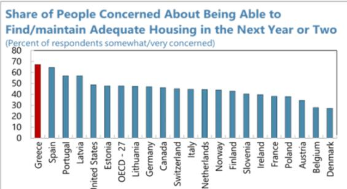  
Sources: OECD (2025), More Effective Social Protection for Stronger Economic Growth: Main Findings from the 2024 OECD Risks that Matter Survey, OECD Publishing, Paris, https://doi.org/10.1787/3947946a-en.
Notes: Respondents had the option of selecting: 1. Not at all concerned; 2. Not so concerned; 3. Somewhat concerned; 4. Very concerned; 5. Can't choose / Not applicable

and growth. It also affects the ability of homeowners to maintain and renovate their properties, leading to high depreciation rate and lower housing quality. Moreover, deteriorating affordability pushes young Greeks to stay longer with their families with delayed independence affecting the already low fertility rate (Hallaert and Vassileva, forthcoming). Finally, rising housing costs can reduce labor mobility toward more productive sectors and regions, weakening competitiveness and the country's ability to retain and attract talent.

2. These affordability pressures coexist with seemingly favorable structural conditions, raising potential paradoxes. First, the high housing cost burden contrasts with the fact that more than 60 percent of Greek households are outright owners (i.e., with no mortgages), incurring only recurring housing costs. Second, Greece has one of the highest dwelling stock per capita with declining population but 35 percent of these properties not used as primary residence, of which one third (12-13 percent of total stock) is vacant. These puzzles point to deeper structural issues, including supply rigidities and mismatches between housing supply and demand.

Figure 1. Greece Housing Affordability Paradoxes  
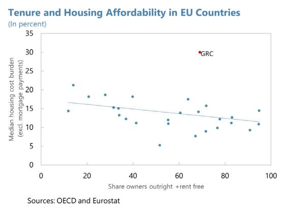

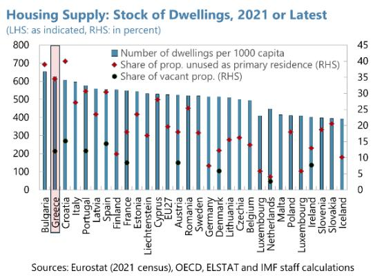

3. To tackle these challenges, the authorities have deployed a combination of demand-and supply-side measures and are developing a new housing strategy. On the demand side, policies include subsidized housing loans for first-time buyers, other help-to-buy measures and rental refunds. In parallel, the regulatory framework for the Golden Visa program has been tightened through higher investment thresholds. On the supply side, the strategy focuses on mobilizing the idle housing stock through renovation programs and tax incentives to boost supply of long-term rentals (LTRs) while restricting short-term rentals in targeted locations. The authorities also plan to develop social housing and student accommodation. In parallel, they are designing a new housing strategy, informed by a better mapping of housing needs and available supply.

4. To better understand the apparent paradoxes and inform the authorities' housing strategy, this paper addresses several key questions. First, how severe are housing affordability pressures (Section B), and what drives the high housing cost burden (Section C)? Second, what explains housing market imbalances? What is the role of foreign demand and short-term rentals, and what factors constrain effective housing supply (Section D)? Finally, what policy measures are needed to address these challenges (Section E)?

## B. How Severe are Housing Affordability Challenges?

5. House prices have outpaced income growth in recent years, largely reflecting a catch-up effect, while overvaluation remains moderate. Prior to the sovereign debt crisis, Greece experienced a prolonged housing boom supported by strong income growth, financial liberalization and expanding mortgage credit following euro adoption, which contributed to rising residential investment and housing demand. The crisis abruptly reversed this cycle with prices falling by more than 40 percent over 2008-16. Since then, prices have been recovering steadily, increasing cumulatively by about 85 percent against 47 percent for disposable income per capita. Most of the price increase occurred after the pandemic (+61 percent since 2020Q4) and unlike in other euro area (EA) countries, the ECB's monetary policy tightening impact on prices has been rather muted. Overvaluation is estimated at around 10 percent. Geographically, asking prices from online real estate platform Spitogatos show significant heterogeneity with prices significantly higher in Attica, Thessaloniki and touristic hubs than in the rest of the country.

Figure 2. House Price Dynamics  
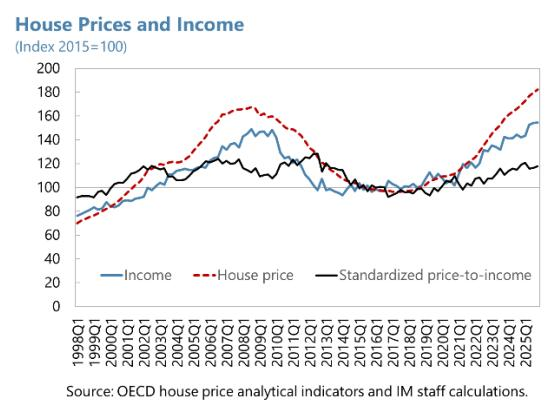

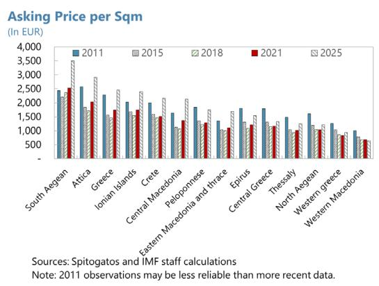

## 6. Access to homeownership is mainly hindered by mortgage affordability and low savings. Reflecting the rapid increase in house prices relative to income as well as higher mortgage

rates, the housing affordability index (Biljanovska et al., 2023)—which measures the ability of the median household to purchase a typical property while meeting other essential consumption needs—has deteriorated in recent years. Assuming a debt service-to-income (DSTI) ratio of 30 percent and a loan-to-value (LTV) ratio of 70 percent (respectively 80 percent), the median household would fall about 7 percent (respectively 17 percent) short of the income needed to qualify for a mortgage in 2024. Even when household income is sufficient to satisfy

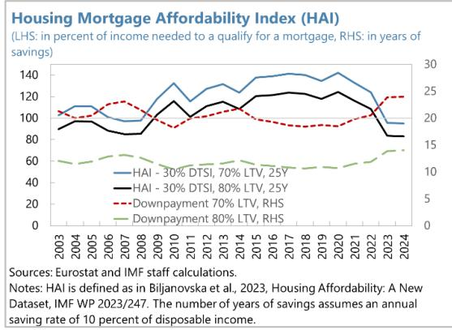  
Notes: HAI is defined as in Biljanovska et al., 2023, Housing Affordability: A New Dataset, IMF WP 2023/247. The number of years of savings assumes an annual saving rate of 10 percent of disposable income.

typical DSTI requirements, the downpayment required to access mortgage credit remains a major barrier. Assuming a saving rate of 10 percent per year, it would take roughly 24 years (respectively

14 years) to accumulate the required downpayment. Access to mortgage credit is further constrained by the crisis legacy, which translates into conservative bank lending standards.

7. Rent prices have been slower to adjust but are increasingly showing signs of pressure. The rent component of the Harmonized Index of the Consumer Price (HICP) remains below pre-crisis levels. However, rent inflation accelerated post-pandemic, culminating at 10 percent in 2025. Additionally, market-based indicators point to stronger dynamics for asking rents per square meter, suggesting faster increases for new leases and continued upward pressure on rent in coming years. Finally, significant heterogeneity across regions and segments is also evident, with much stronger pressures emerging in large metropolitan areas such as Thessaloniki and Athens.

Figure 3. Rent Price Dynamics  
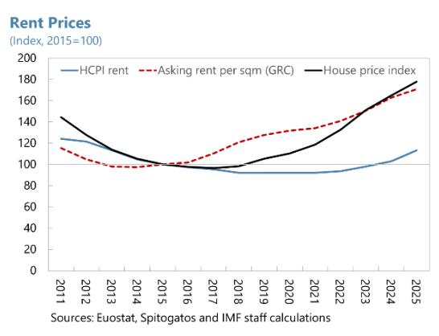

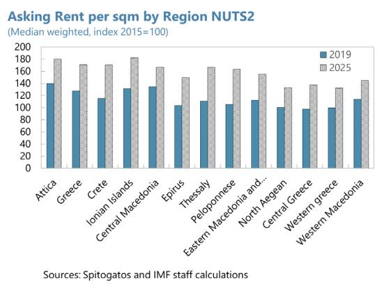

8. The housing cost burden remains persistently elevated, although it remains lower than post-crisis peaks. $^{2}$ The share of disposable income spent on housing costs has been historically high in Greece and increased further during the sovereign debt crisis. This burden has moderated somewhat as the economy recovered, but the improvement has recently stalled and even reversed for lower income households. According to our estimates based on the EU Statistics on Income and Living Conditions (EU-SILC) micro data, the median housing cost (including mortgages) exceeded a third of disposable income in 2025. Approximately two out of five households are overburdened (i.e. they spend more than 40 percent of disposable income on housing-related expenditure) and an additional 20 percent of households spend 30-40 percent of disposable income on housing costs, making them potentially vulnerable in case of income or interest rate shocks.

9. Other indicators point to housing-related difficulties. To cope with affordability challenges, young people stay longer with their parents and households tend to live in smaller houses contributing to a high overcrowding rate, particularly for renters. High housing costs are also associated with a large share of households in arrears on their housing payments (41.8 percent according to EU-SILC survey) and reporting difficulty to warm and cool their properties.

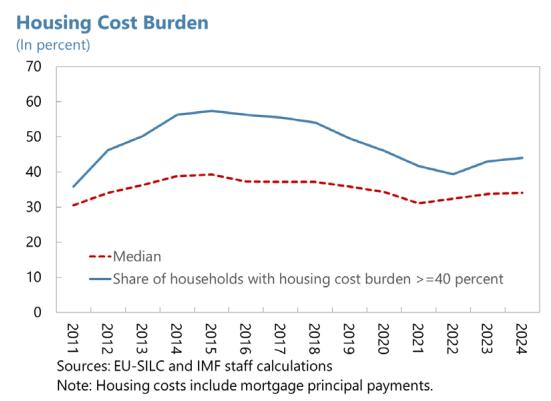

Figure 4. Housing Cost Burden  
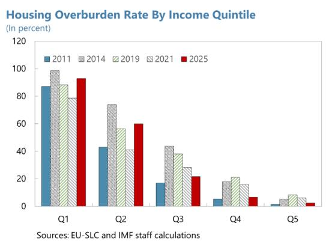

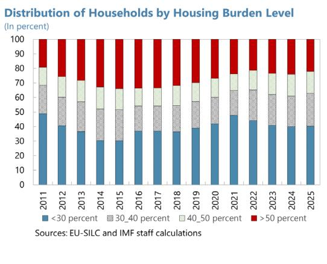

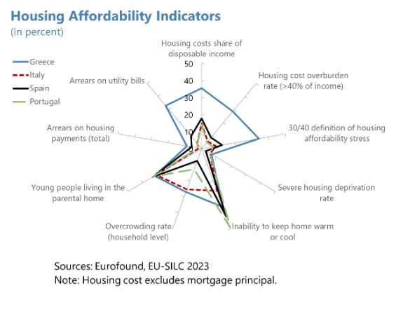

## C. Why is the Housing Cost Burden so High? A Micro Perspective

## 10. The housing cost burden is fundamentally rooted in income capacity.

\- Based on pooled repeated cross-sections regression of the housing cost overburden on household characteristics (using EU-SILC micro data over 2021-25), tenure emerges as a key determinant, but its effect is highly conditional on income. Relative to outright owners, households with a mortgage and renters face a significantly higher probability of overburden. However, these differences widen substantially when interacted with income. Predicted probabilities indicate that low-income households face markedly higher risks across all tenures. Holding other characteristics constant, being in the bottom 40 percent of the income distribution increases the probability of being overburdened by large margins. For example, the predicted probability for low-income mortgagors (renters) exceeds 90 percent, compared to about one-third for higher-income households. A similar gradient is observed for renters, where a low-income household faces four times larger probability of being overburdened than higher income. Even among outright owners, the probability increases sharply for low-income households, underscoring that ownership does not fully shield against affordability pressures.

\- Other household characteristics also play a significant role. Single-person and single-parent households exhibit higher probabilities of overburden, reflecting reduced economies of scale in housing consumption. Lower education and weaker labor market attachment are also associated with higher risk, consistent with their impact on income capacity. Finally, the regional dimension also plays a role, especially for renters. More specifically, households renting in Attica and Central Macedonia (Thessaloniki) have a higher probability of being overburdened than other regions.

Figure 5. Households Characteristics and Housing Affordability: Who is Affected the Most?  
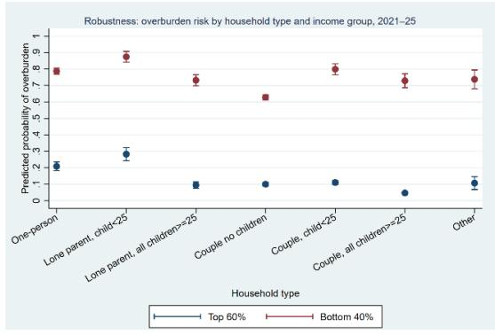

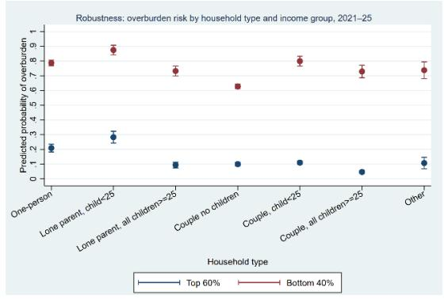

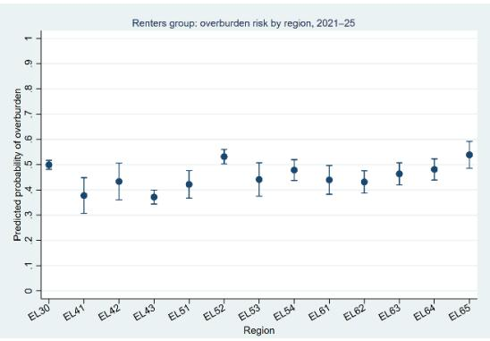

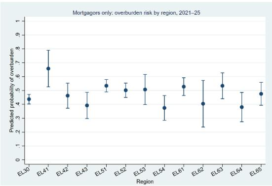  
Notes: The probability of housing cost overburden is estimated using a logit model on pooled EU-SILC microdata (2021–25). The dependent variable equals 1 if total housing costs exceed 40 percent of disposable income. The estimating equation is: $Pr(Overburden_{i} = 1) = \Lambda(\alpha + \beta 1\ Tenure_{i} + \beta 2\ LowInc_{i} + \beta 3(Tenure_{i} \times LowInc_{i}) + \gamma'X_{i} + \delta_{r} + \tau_{t})$ where $\Lambda(u) = 1/(1 + e^{(-u)})$ . $X_{i}$ includes other household characteristics (size, type, age, education, employment), while $\delta_{r}$ and $\tau_{t}$ denote region and year fixed effects. $LowInc_{i}$ is a dummy taking the value 1 if the household belongs to the bottom 40 percent of the income distribution. The model is estimated using survey weights.
Predicted probabilities are computed as: $P_{-}i = 1/(1 + e^{(-X_{-}i\beta)})$ .

These probabilities are evaluated for representative household profiles (e.g., by tenure and income group), holding other characteristics constant, to compare housing affordability risks across groups.

## 11. Compositional effects and changes in preferences have further increased aggregate vulnerability.

\- The joint distribution of income and wealth (households finance and consumption survey) has shifted over 2011-21 and shows a greater share of households holding illiquid housing assets but with limited current income (asset-rich income-poor). As a result, outright owners—who are typically expected to face low housing costs—still incur significant expenses relative to income, particularly when liquidity constraints prevent smoothing through borrowing or asset liquidation. This disconnect between stock wealth and flow income is a central feature of the Greek housing affordability puzzle.

\- Demographic and behavioral shifts have increased per-household housing consumption. The rise in single-person and single-parent households (12 percentage points since 2011), alongside changing preferences (e.g., greater share of students living independently), reduce economies of scale in housing and raise per-capita costs. As single-member households tend also to have lower income and social benefits than larger size households, this compositional effect mechanically raises aggregate housing cost burden even without significant price increases.

Figure 6. Households Joint Wealth-Income Distribution  
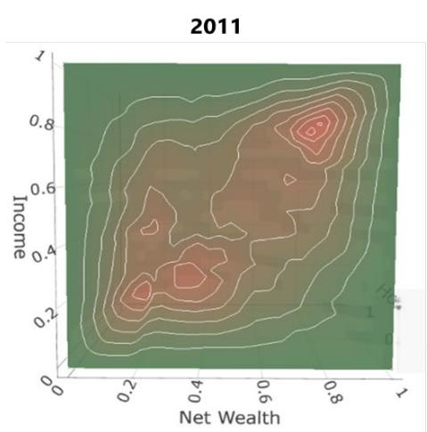

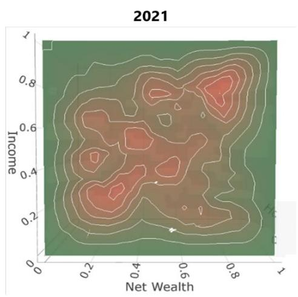  
Source: HFCS (2022 Oesterreichische Nationalbank)
Note: Colors refer to the (kernel) density.

12. The Greek housing stock is old and less energy efficient than similar countries, contributing to higher recurring costs for households. Even in the absence of mortgage or rent payments, many households face recurring expenditures associated with utilities, regular maintenance, and property taxation. The energy bills seem to be higher in purchasing power terms compared to countries with similar weather conditions (Spain and Portugal). As prices are on par with these countries, the difference is mainly driven by energy efficiency. With only 7.4 percent achieving an energy class of B or higher, Greek dwellings consume roughly 65 percent more energy per square meter than Portuguese properties where investment in energy upgrades has been 2.5 times higher. In addition, despite recent reductions in the unified property tax (ENFIA), recurring

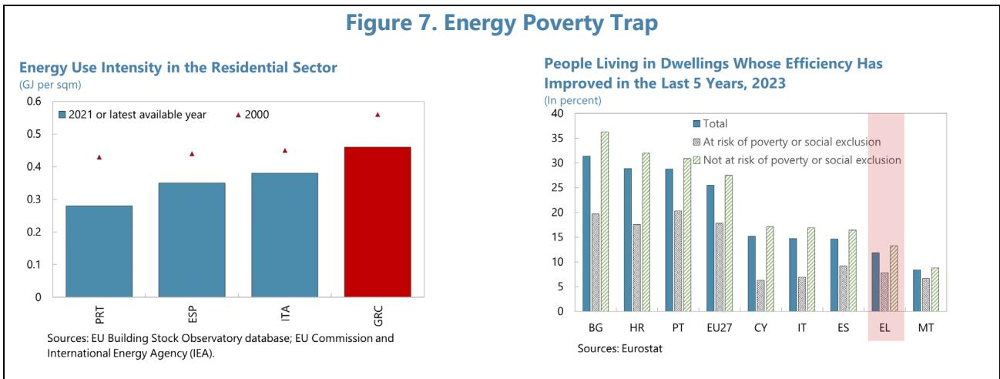

property taxes are relatively high in Greece and could add to housing costs for homeowners. This might be reduced with the recent introduction of exemptions for some low-income households.

## D. What Drives Housing Market Imbalances Despite Ample Stock?

Explanation 1: Rising and Increasingly Concentrated Demand

13. Demand for house purchase has increased rapidly since 2017, driven mainly by investor demand and helped by supportive policies.

\- External demand. Following the post-crisis correction, Greek real estate attracted foreign investors, including the Greek diaspora, due to relatively low valuations and expectations of capital gains. Policy frameworks such as the Golden Visa program, tax incentives for pensioners, and broader “search-for-yield” dynamics as well as lower ENFIA tax since 2022 that reduced the user cost of housing have supported inflows. In addition, “announcement effects” associated with changes in eligibility thresholds for the Golden Visa may have caused an opportunistic investment behavior and temporarily accelerated demand before moderating in recent quarters as the measure became effective.

\- Domestic demand. Demand from residents has been shallow and dominated by high-income households, financing their acquisition mainly using cash. That said, since 2023, demand has shifted to first-time buyers, buoyed by government subsidized loan programs (MyHome I and MyHome II). $^{3}$

14. Demand for housing has also become increasingly concentrated in some sub-markets. While the population has declined in the last 15 years, the number of households has continued to rise, driven by smaller household size and changing living arrangements, including a rise in single-person households. This shift, together with affordability challenges, increased demand for smaller houses. At the same time, post-crisis urbanization has intensified, with economic activity and population flows concentrating in metropolitan areas—particularly Attica where population density is 20 times higher than the rest of the country—thereby amplifying local demand pressures.

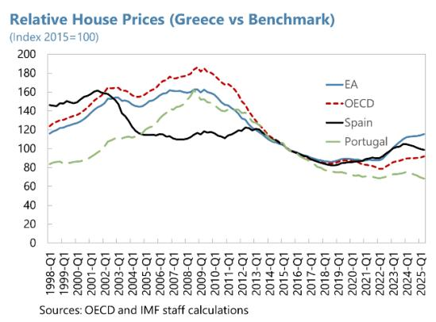  
Figure 8. Housing Demand

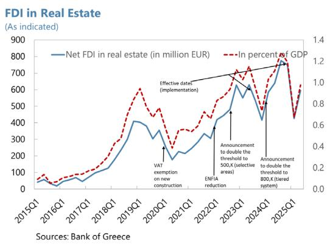

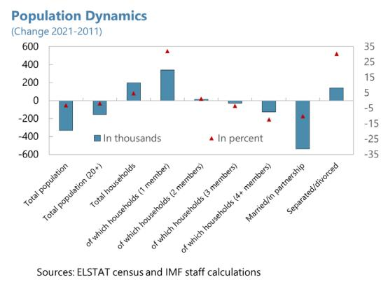

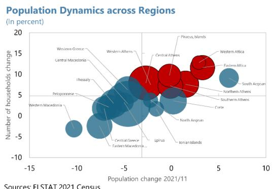

## Explanation 2: Underutilized and Inefficiently Allocated Housing Stock

## 15. The effective housing stock is substantially lower than suggested by headline vacancy rates. Greece has one of the highest number of dwellings per capita in the EU and 35 percent of this

stock is not used for primary residence, of which one third is vacant (12-13 percent of total stock)—the rest is used as holiday or secondary homes. Yet, a significant share of vacant dwellings is old, energy-inefficient, and possibly not readily habitable—more than half of unoccupied units were built before 1980. Bringing these units to the market is constrained by liquidity and financing constraints, high renovation costs, and fragmented co-ownership structures (Alpha Bank, 2026). Availability of vacant properties is also hindered by the

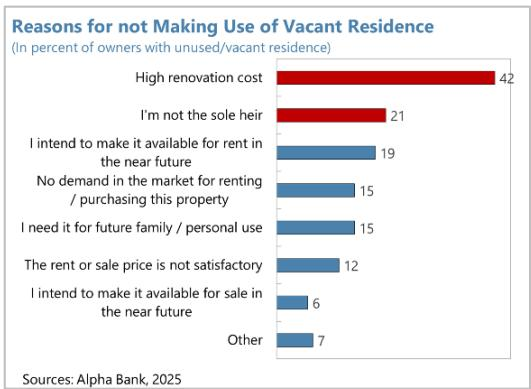

high cost of remedying regulatory and legal irregularities that affect many properties (Mouzakis, forthcoming). Finally, a non trivial number of housing units remain outside the market, including properties held by the public sector, banks, and credit servicers.

16. Evidence also points to significant mismatches between supply and demand. Data obtained from the real estate platform Spitogatos show that supply of properties for sale and rent has increased considerably in recent years. However, the time-on-market is relatively high, around 8 and 6 months respectively, pointing to supply demand mismatches and search and matching frictions that limit the efficient allocation of the housing stock. Alpha Bank survey (2025) finds for example that differences in location, size, and price segments are key impediments for prospective homebuyers. A closer look at available listings confirms this perception. 55 percent of listed properties for sale in 2025 exceed EUR200K and one third are above EUR280K, which makes them out of reach for most Greeks. On the rental side, the median listing is at around EUR575 per month and the situation is worse in Attica where the median listing is about EUR785 per month. Size-wise, while offers for both sale and rent are slowly adapting to demand for smaller houses, about one third of listings for sale are large properties exceeding $120m^{2}$ . On the rental side, pressure seems more acute in Attica and Thessaloniki where the share of small dwellings (lower than $60m^{2}$ ) hovers around 30 percent compared to 55 percent other regions.

Figure 9. Distribution of Supply by Price and Size Range  
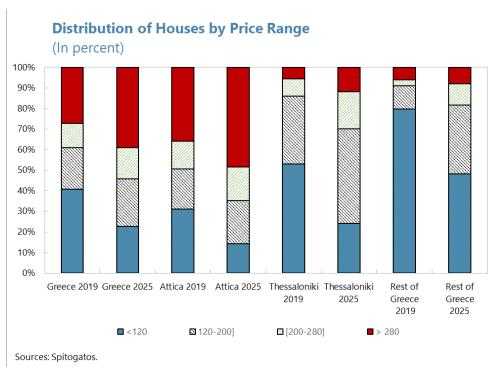

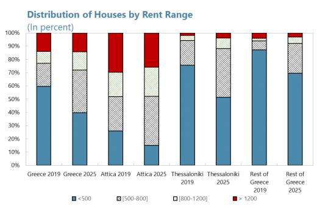

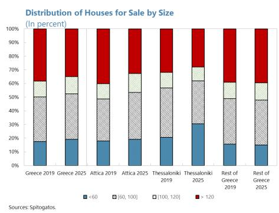

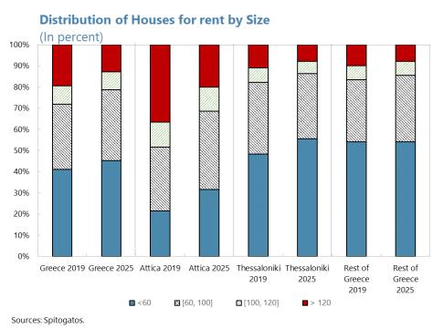

<table><tr><td colspan="5">Table 1. Greece: Impact of STR Intensity on Asking Prices and Rents</td></tr><tr><td></td><td>Asking rent (log)</td><td>Asking rent (log)</td><td>Asking price (log)</td><td>Asking price (log)</td></tr><tr><td rowspan="2">GVA non tourism (t-1), log</td><td>0.4</td><td>0.38</td><td>0.434**</td><td>0.468**</td></tr><tr><td>-0.248</td><td>-0.249</td><td>-0.182</td><td>-0.194</td></tr><tr><td rowspan="2">Employment non tourism, log</td><td>0.237</td><td>0.224</td><td>-0.374*</td><td>-0.351*</td></tr><tr><td>-0.574</td><td>-0.58</td><td>-0.189</td><td>-0.183</td></tr><tr><td rowspan="2">STR density (t-1), log</td><td>0.185*</td><td>0.192*</td><td>0.336***</td><td>0.323***</td></tr><tr><td>-0.086</td><td>-0.091</td><td>-0.078</td><td>-0.069</td></tr><tr><td rowspan="2">STR density (t-1), log* owner occupancy rate</td><td>-0.187*</td><td>-0.187*</td><td>-0.412***</td><td>-0.412***</td></tr><tr><td>-0.101</td><td>-0.098</td><td>-0.088</td><td>-0.066</td></tr><tr><td rowspan="2">STR density (t-1), log* vacancy rate</td><td></td><td>-0.027</td><td></td><td>0.048</td></tr><tr><td></td><td>-0.05</td><td></td><td>-0.042</td></tr><tr><td rowspan="2">Constant</td><td>4.276</td><td>4.513</td><td>6.673***</td><td>6.249**</td></tr><tr><td>-4.692</td><td>-4.707</td><td>-2.124</td><td>-2.278</td></tr><tr><td>N</td><td>182</td><td>182</td><td>182</td><td>182</td></tr><tr><td>Overall R2</td><td>0.913</td><td>0.913</td><td>0.972</td><td>0.973</td></tr><tr><td>Within R2</td><td>0.08</td><td>0.083</td><td>0.402</td><td>0.417</td></tr></table>

## Explanation 3: Competition from Short-Term Rental (STR)

17. STRs emerged in recent years as a key feature of Greek tourism business models.
INSETE database on short-term rental listings $^{4}$ shows a 240 percent increase over 2017-2024 from less than 100K to more than 230K. This represents about 3.5 percent of the housing stock, 10 percent of the unoccupied stock (including holiday and secondary homes) and 29 percent of vacant properties. The distribution of these listings is also uneven across regions, being concentrated in some touristic Islands, central Athens and Piraeus.

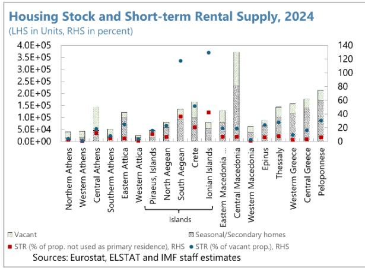

18. Our analysis suggests that STRs have added to localized supply pressures. Using a unique regional database, combing data from Spitogatos, INSETE and ELSTAT, we find that a higher intensity of home sharing is associated with higher prices, especially in areas where the owner occupancy rate is low, i.e. more people renting, confirming the rapid growth of investor demand. We find similar results for rents, though the impact is smaller, which suggests that STRs have reduced the availability of long-term rental (LTR) units in specific high-demand areas. These results are broadly in line with Barron et al. (2021). However, the impact on affordability depends also on the impact of STR on income, which will require further analysis.

Explanation 4: Increasingly Constrained New Supply

19. Despite a strong rebound in activity, the Greek construction sector remains structurally constrained in its ability to scale up housing supply. Following a prolonged collapse in residential investment during the sovereign debt crisis, construction activity has recovered gradually. In 2024, building permits exceeded 41,000 units—close to their 2010 level—which will feed the market likely in 2026. However, capacity constraints are becoming increasingly binding, driven by labor shortages, an aging workforce, and declining participation of younger workers, which undermines the sector's ability to expand output and could put pressure on the already high construction cost going forward. Labor productivity remains below EU levels, reflecting structural factors such as limited technology adoption and firm fragmentation. The sector is highly fragmented, with over 96 percent of firms classified as micro-enterprises, limiting economies of scale and access to financing. While this is a common feature among European countries, the share of workers employed by micro firms is much higher in Greece. At the same time, low investment has weighed on productivity, with capital formation historically insufficient to offset depreciation, leading to weak productive capacity. In addition, albeit improving significantly in recent years, financing conditions continue to constrain growth, with higher borrowing costs and persistent small- and medium-sized enterprise (SME) financing gaps relative to the euro area (IOBE, 2025).

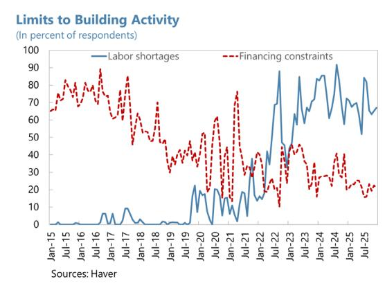

Figure 10. Supply Bottlenecks  
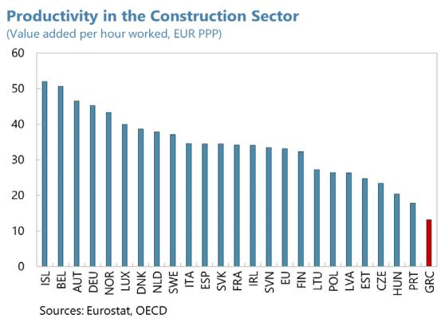

## E. Policies

## What Has Been Done?

20. The Greek authorities have placed housing affordability at the center of the policy agenda. The government has adopted a comprehensive housing package comprising more than 40 measures with a budget exceeding €6.5 billion, aimed at easing price pressures, expanding supply, and improving access to affordable and quality housing, particularly for younger and vulnerable households. Governance reforms—anchored in an interministerial coordination framework and the development of a National Housing Strategy—aim to strengthen policy coherence, monitoring, and implementation.

## 21. Policy measures combine demand-side support with supply-enhancing interventions.

\- On the demand side, affordability is addressed through subsidized mortgage schemes for first-time buyers (My Home I & II), rent refunds, and targeted housing allowances for students, low-income households, and uninsured elderly. These are complemented by tax measures, including reductions in ENFIA, and suspension of VAT on new construction. At the same time, the authorities have tightened the regulatory framework for the Golden Visa program, including higher investment thresholds and usage restrictions.

\- On the supply side, the strategy prioritizes mobilizing idle housing stock, incentivizing reallocation to long-term rental, upgrading ageing dwellings, and expanding social housing. Key initiatives include renovation programs ("Upgrade My Home," "Save 2025," and "Renovate-Rent"), the construction of social housing and student dormitories, and the use of public land and vacant military camps through social exchange schemes that retain a share of housing units in public ownership at below-market rents. To mitigate market distortions and redirect housing stock toward long-term residential use, the government implemented geographically targeted restrictions on STR and tax relief for long-term leasing.

## What Should/Could Be Done?

## Advice 1: Mobilizing Vacant Properties

Mobilizing vacant housing offers the highest near-term payoff but requires a coherent policy mix. International experience suggests that isolated measures are typically ineffective and that successful strategies combine incentives and disincentives as well as institutional support (Housing Europe Observatory, 2023).

\- First, expanded and well-targeted renovation support can address liquidity constraints that prevent owners from bringing units to market. Conditioning support on energy efficiency upgrades can generate dual benefits by reducing recurring costs and improving housing supply.

\- Second, fiscal disincentives for vacancy—such as vacancy taxes or surcharges on underutilized properties in high-demand areas (e.g., France, Ireland)—can increase the opportunity cost of leaving units empty. Key calibration elements to enhance effectiveness while minimizing potential costs include: (i) targeting geographically to tight markets to avoid penalizing structurally weak regions; (ii) graduated rates increasing with duration of vacancy to deter speculative holding; (iii) clear and limited exemptions (e.g., renovation in progress, legal disputes) to preserve credibility; and (iv) robust property registries and enforcement mechanisms, complemented with utility usage data. Poor calibration risks either limited behavioral response (if too low) or unintended effects (if too high), including informal use or legal challenges.

\- Third, tackling fragmented co-ownership and legal gridlock is essential to unlock dormant housing supply and improve market liquidity, particularly for inherited properties held by multiple owners. Coordination failures among multiple heirs limit the ability to sell, rent, or renovate vacant units, contributing to persistent underutilization of the housing stock. The ongoing inheritance law reform—by ending forced co-ownership, allowing one heir to take full ownership while compensating others financially, simplifying transfer procedures and reducing administrative burdens—is a critical step toward easing these constraints. Its impact could be strengthened by enabling majority-based decision-making among co-owners to reduce holdout problems (e.g., France), introducing targeted incentives to consolidate ownership (e.g., tax relief for buyouts or pooling arrangements), and accelerating judicial processes and dispute resolution.

## Advice 2: Enhancing the Attractiveness of Long-Term Leases

## 22. The attractiveness of LTR could benefit from a reduction in the associated risk premium.

\- Alpha Bank survey (2026) shows that landlords prefer STRs not only due to higher returns, but also because of greater flexibility—as they could use their property intermittently—and lower

perceived tenant risk. Policies should therefore target these margins. The authorities' tax incentives for switching from STR/vacancy to LTR and efforts to reduce information asymmetry for landlords (tenant registry) while enforcing regulation and data transparency for STR, all go in the right direction. Complementary measures include reducing minimum rental contract duration (currently three years), faster dispute resolution processes, and rent guarantee

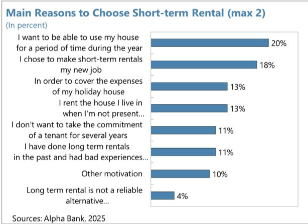  
Sources: Alpha Bank, 2025

schemes to shield low-income renters in the absence of social rental housing.

\- At the same time, the authorities should systematically assess the effectiveness and thoroughly assess the cost-benefits of STR restrictions. As two thirds of vacant properties are secondary/holiday homes that owners use part of the year, LTR and STR are not perfect substitutes. Also, while our analysis suggests some non-linear impact of STR on prices and rent, its impact on affordability is less obvious as it drives tourism-related economic activity and income. Moreover, geographically targeted restrictions could shift activity to neighborhood markets. Such effect was found by Karamanis et al. (2026) for the increase in the Golden Visa thresholds.

Advice 3: Increasing Elasticity of New Supply and Containing Construction Cost Growth

23. Boosting new housing construction requires a step change in construction sector productivity through better resource allocation and stronger firm dynamics. Policies should facilitate reallocation toward more productive firms, including by enabling the exit or restructuring of nonviable ("zombie") firms and reducing barriers to firm growth and consolidation. Strengthening access to financing—particularly for small and medium-sized developers—would support investment and scaling, while promoting innovation and capital deepening (e.g., digital tools, modular construction methods) can raise efficiency and lower unit costs. Improving competition and reducing distortions that fragment the sector would further enhance productivity and supply responsiveness.

24. Addressing labor shortages is critical to unlocking capacity and reducing construction costs. Targeted training and reskilling programs, aligned with sector needs, can help close skill gaps, while incentives to attract younger workers and improve labor mobility would support workforce expansion. Facilitating the reallocation of labor toward construction, including from lower-productivity sectors, can ease bottlenecks. Complementary measures to improve working conditions and formalization could also help increase labor supply and productivity.

25. Improving spatial planning and reducing regulatory uncertainty are also essential to accelerate project delivery and lower costs. Optimizing spatial planning, particularly in high-demand areas, and integrating it with regional development strategies can help align supply with evolving demand patterns, while improving the completeness and accessibility of land and cadastral registries would facilitate transactions and development.

## Advice 4: Boosting Supply of Affordable and Social Housing

26. The authorities' efforts to boost affordable and social housing are welcome and should be reinforced. The planned rehabilitation of publicly-owned properties in close partnership with the private sector, is a critical step towards developing social rental housing. Also, the new building regulation, giving real estate developers incentives to allocate part of their new construction to social and affordable housing, is a welcome development. An efficient allocation of these properties to those who need them the most will be key. At the same time, the authorities' plans to extend student dormitories are also welcome and should be complemented with measures to promote co-living given the prevalence of large properties.

## Advice 5: Recalibrating Demand Measures to Reduce Price Capitalization

## 27. Demand-side support should be better targeted and calibrated to avoid price

capitalization and potential regressive effects. While potentially beneficial in the short term, evidence confirms that when supply is inelastic, untargeted support tends to benefit landlords and sellers rather than improving affordability (OECD, 2021). Indexing the rent refund on the monthly payment could help enhance transparency of the rental market but will come at a higher fiscal cost in the future. Going forward, refining eligibility criteria and means-testing would improve cost-

effectiveness and limit regressive outcomes. Similarly, the authorities should assess the impact of tax incentives, such as the VAT exemption on new construction, which could tend to benefit richer households or real estate companies. Should this be the case, the authorities should consider phasing it out or possibly reorienting it toward renovation.

## Advice 6: Strengthening Policy Coordination

28. Improving housing affordability requires stronger policy coordination across labor, financial, energy, and regional policies to address underlying structural drivers of income, costs, and demand concentration. Labor market measures to increase participation and broader supply-side reforms to boost productivity and wages would support income growth. On the financial side, easing credit constraints is essential, including through accelerating the resolution of legacy debt, promoting greater competition in the banking sector, and encouraging banks to develop tailored financing products for housing renovation. Lowering energy costs requires continued efforts to expand renewable energy and improve interconnections—particularly for island regions.

## F. Conclusions

## 29. Our analysis's main conclusions are as follows:

\- Housing affordability is at the center of a self-reinforcing loop between households' vulnerability, aging housing stock, and societal/demographic dynamics changes.

\- Greece faces a housing allocation problem rather than a standard housing shortage. Structural challenges impede efficient use of the existing stock. Spatial distribution, segmented demand, and market inefficiencies exacerbate supply demand-mismatch.

\- Overall, government measures go in the right direction but need further consolidation, greater focus on affordable supply, and a mix between sticks and carrots to mobilize the existing stock and reduce mismatches. Alleviating capacity constraints in the construction sector and boosting productivity is key to unlock supply and contain the increase in construction costs. The ongoing digitalization and centralization of information on properties will help better identify the problems and design adequate policies. Finally, housing policies are not the only lever; exploiting synergies with other policies is important.

## References

Alpha Bank (2025). Housing Market Insights. Athens.

Alpha Bank (2026). Housing Market Insights. Athens.

Athanassiou, S., & Kotsi, E. (2023). The Sharing Economy in Greece: Short-Term Rental Developments. Athens: Research Report.

Athens University of Economics and Business (2025). Economic and Housing Impact of Short-Term Rentals in Greece. Athens.

Bank of Greece (2025). Economic Bulletin No. 61: Housing Affordability for Greek Households. Athens.

Barron, K., Kung, E., & Proserpio, D. (2021). The Effect of Home-Sharing on House Prices and Rents: Evidence from Airbnb. Marketing Science, 40(1), 23–47.
https://doi.org/10.1287/mksc.2020.1227

Biljanovska, N., Fu, M. C., & Igan, M. D. (2023). Housing Affordability: A New Dataset. IMF Working Paper No. 2023/247. International Monetary Fund. https://doi.org/10.5089/9798400259746.001

European Commission (2022). Greece Country Report 2022. Brussels.
https://commission.europa.eu/system/files/2022-05/2022-european-semester-country-report-greece\_en.pdf

European Commission (2025). Housing in the European Union: Developments and Policy Challenges. Brussels.

Foundation for Economic and Industrial Research (2025). Trends, Challenges and Prospects of the Construction Sector in Greece. Athens. https://iobe.gr/wp-content/uploads/2026/01/RES\_05\_F\_24062025\_REP\_EN.pdf

Foundation for European Progressive Studies (2024). Housing as Investment in Southern Europe. Brussels.

Housing Europe Observatory (2023). Tools to Deal with Vacant Housing. Brussels.

International Monetary Fund (2025). Golden Visa Programs. IMF Working Paper No. 2025/008. Washington, DC.

Karamanis, D., Kotsogiannis, C., & Papapetrou, E. (2026). Threshold-Based Policies and Distortions in Housing Markets. Working Paper No. 359. Bank of Greece. https://doi.org/10.52903/wp2026359

Kontonikas, A., & Pyrgiotakis, E. (2025). A Comprehensive Analysis of Transactions in the Greek Residential Property Market. Hellenic Observatory, London School of Economics and Political Science. London. https://www.lse.ac.uk/Hellenic-Observatory/Assets/Documents/Publications/GreeSE-Papers/GreeSE-No204.pdf

Organisation for Economic Co-operation and Development (2021). Brick by Brick: Building Better Housing Policies. Paris: OECD Publishing. https://doi.org/10.1787/b453b043-en

Organisation for Economic Co-operation and Development (2022). Housing Taxation in OECD Countries. Paris: OECD Publishing. https://doi.org/10.1787/03dfe007-en

Piraeus Bank (2025). Greek Residential Real Estate Market Outlook. Athens.

Vettas, N., Mavropoulos, A., Antonopoulou, C., Valentis, H., Gatopoulos, G., & Kontos, C. (2026). Housing in Greece: Trends, Challenges and Prospects. Dianeosis. Athens (in Greek).