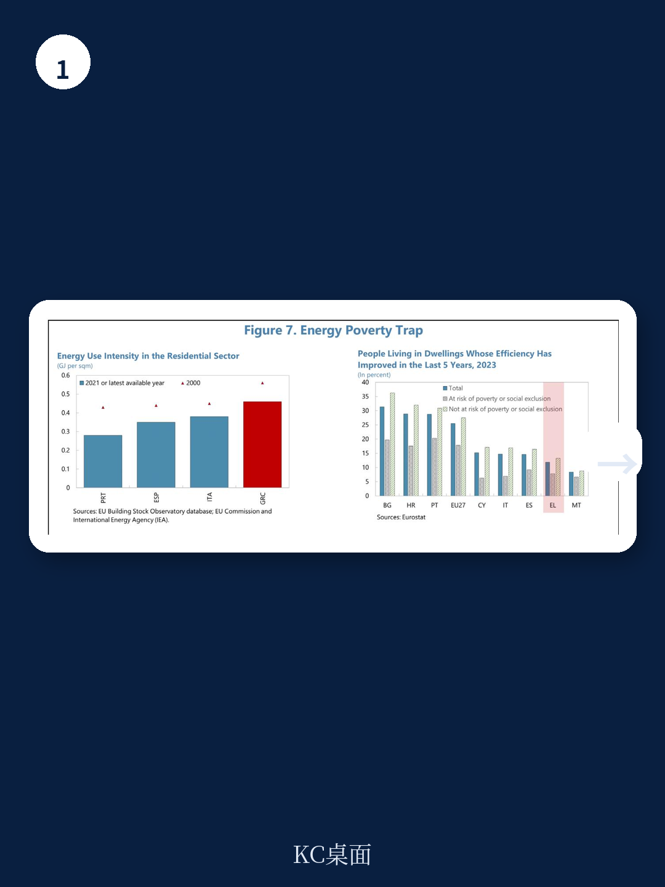
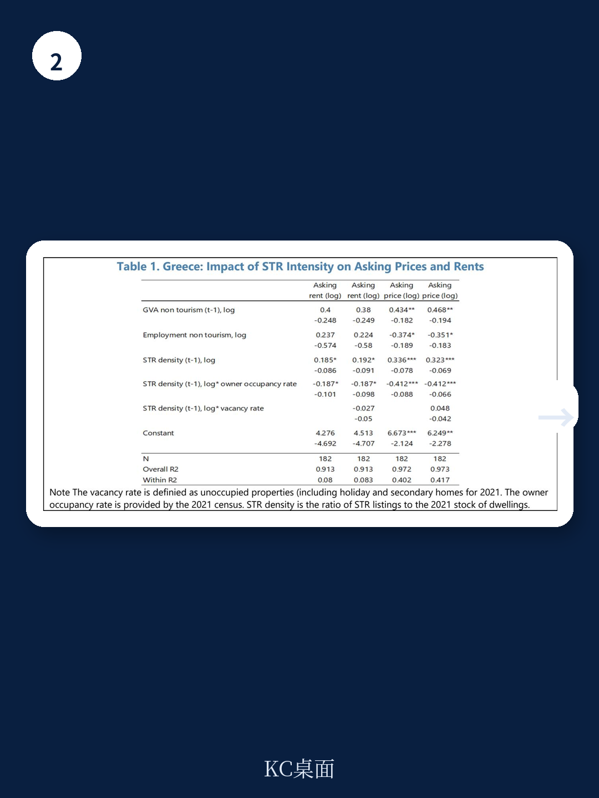

# IMF：研究主题与行业变化观察

希腊的住房可负担性正面临一个看似矛盾的困境：尽管超过六成家庭为全产权拥有者（无按揭），且人均住房存量在欧洲名列前茅，但住房成本负担率依然高企，约四成家庭将超过40%的可支配收入用于住房支出。IMF最新发布的国别报告《Inside Greece‘s Housing Affordability Paradoxes》指出，这一悖论的核心并非住房总量短缺，而是存量利用效率低下、需求结构集中化与供给刚性之间的深层错配。

报告基于EU-SILC微观数据和区域住房市场数据，系统拆解了希腊住房可负担性不确定性的三个驱动因素：高企的经常性住房成本（尤其是能源支出）、持续存在的供给瓶颈，以及住房存量特征与家庭需求之间的结构性不匹配。这些因素共同形成了一个自我强化的循环——住房成本不确定性削弱了家庭维护和改造住房的能力，导致存量老化加剧，进一步推高了居住成本。

## 1. 住房成本负担的微观结构：收入能力是核心变量

报告通过Logit模型对2021-2025年EU-SILC面板数据的回归分析发现，住房成本负担的根本决定因素是家庭收入能力，而非单纯的产权状态。即便在全产权所有者群体中，低收入家庭（收入分布后40%）的住房成本负担概率也显著高于高收入群体。对于有按揭的低收入家庭，其负担概率超过90%；对于租房家庭，低收入者的负担概率是高收入者的四倍。

这一发现揭示了希腊住房可负担性悖论的一个重要机制：资产充裕但收入流动性不足的家庭（asset-rich income-poor）在面临住房成本时缺乏缓冲能力。2011-2021年间，家庭财富与收入的联合分布发生了显著变化，更多家庭持有流动性较差的住房资产，但当期收入有限。当无法通过借贷或资产变现来平滑支出时，产权本身并不能有效抵御住房成本不确定性。

> **KC评论：** 报告的这一分析提示，政策制定者需要关注住房可负担性的“流量”维度，而非仅仅关注“存量”维度。单纯鼓励购房或提供产权支持，可能无法解决低收入家庭面临的经常性成本不确定性，尤其是当这些家庭持有的住房资产本身老化、能耗高时。

## 2. 需求集中化与供给刚性：市场失衡的双重根源

报告指出，希腊住房市场的需求侧正经历显著的结构性变化。自2017年以来，房价累计上涨约85%，远超同期人均可支配收入47%的增幅。需求集中化体现在两个维度：一是地理上，雅典、塞萨洛尼基和旅游热点地区的房价涨幅显著高于其他地区；二是来源上，外国买家（尤其是通过黄金签证计划）和短期租赁（STR）需求成为重要增量。

供给侧的刚性则更为复杂。尽管希腊拥有欧洲最高的住房存量之一（约每千人600套），但约35%的住房未被用作主要居所，其中12-13%处于空置状态。报告识别了三个关键供给瓶颈：碎片化的共有产权结构、与遗留不良债务相关的“搁浅资产”，以及未解决的建筑合规问题。这些因素共同阻碍了存量住房的有效释放。

报告通过计量分析进一步量化了短期租赁对市场的影响。在STR渗透率较高的区域，房价和租金均受到显著推升。这一效应在旅游热点地区尤为明显，STR的扩张不仅减少了长期租赁的供给，还通过提高房东的机会成本，推高了长期租赁市场的租金水平。

## 3. 政策建议：从需求刺激转向存量激活与供给效率

报告对希腊当局已采取的措施给予了肯定，但强调需要进一步整合政策工具，从“胡萝卜加大棒”的组合中寻找平衡。核心建议包括六个方面

第一，通过翻新计划与空置惩罚相结合的方式，激活现有存量住房。报告建议将翻新补贴与空置税或强制租赁要求挂钩，避免补贴被用于提升空置房产的价值。

第二，评估短期租赁限制措施的有效性，并采取措施降低长期租赁的不确定性溢价。报告指出，当前短期租赁的监管框架可能不足以扭转房东的偏好，需要更精细的区域性政策。

第三，扩大社会住房和可负担住房供给，需要公私合作模式，同时减少监管不确定性，简化分区和建筑许可流程。

第四，促进建筑行业的劳动力和资本重新配置，加强本土劳动力培训，以提高生产率、缓解劳动力短缺并控制建筑成本。

第五，重新校准需求侧支持措施，避免价格资本化效应。报告引用OECD的研究指出，在供给缺乏弹性的情况下，无针对性的需求支持往往使房东和卖方受益，而非改善可负担性。

第六，加强政策协调。住房可负担性问题的解决不能仅依赖住房政策本身，还需要劳动市场、资金、能源和区域政策的协同配合。

报告最后强调，希腊面临的本质上是一个“住房分配问题”而非“住房短缺问题”。空间分布、需求分割和市场低效共同加剧了供需错配。当前政府措施方向正确，但需要进一步聚焦于可负担供给，并通过数字化和中央化的房产信息平台来更精准地识别问题、设计政策。

For informational purposes only. Portions may be generated,translated,summarized,or edited with AI assistance based on source materials and may contain omissions or errors. Please verify independently. This is not investment,legal,tax,accounting,or other professional advice.

