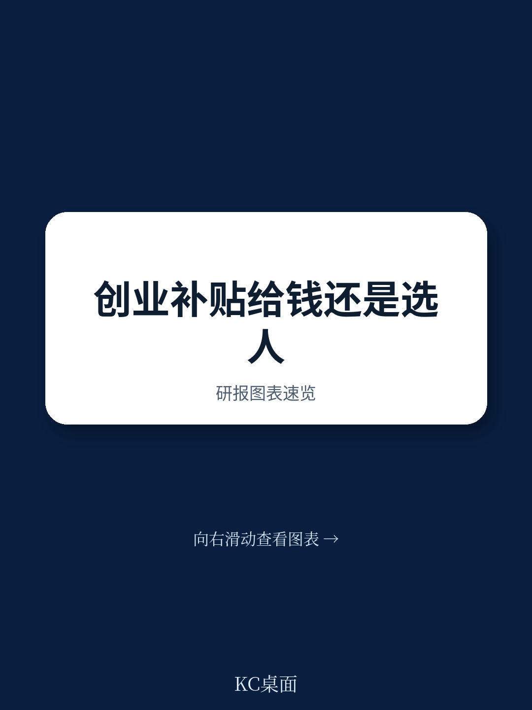
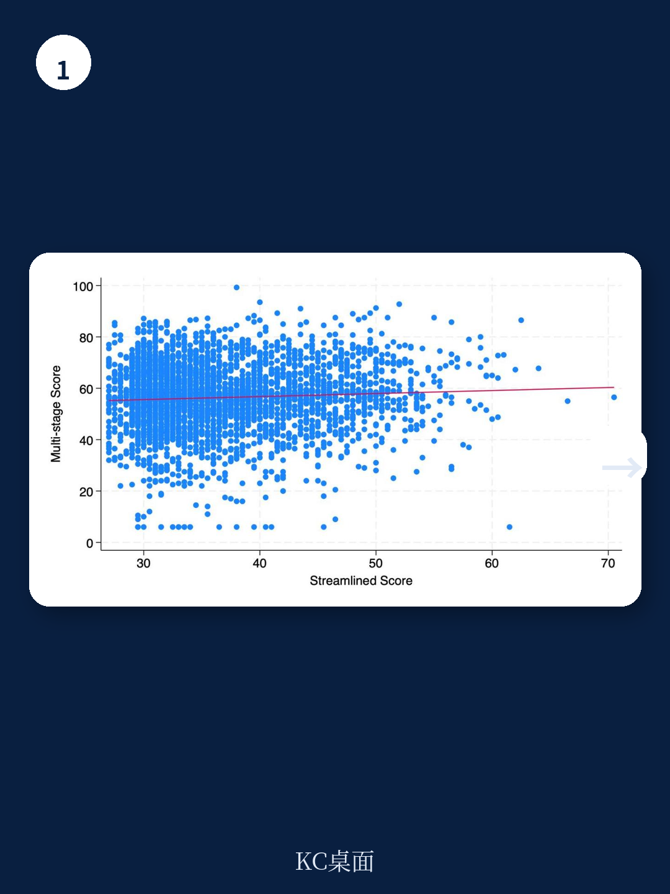
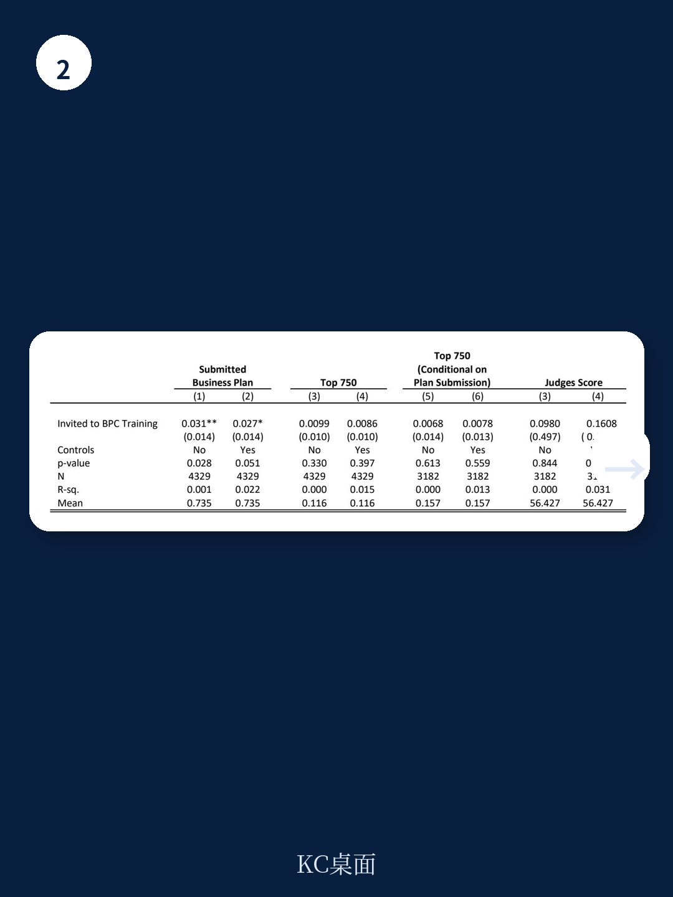

# 世界银行：筛选机制与资金规模对创业的影响

一项嵌入肯尼亚全国商业计划竞赛的随机实验，为“如何有效扶持高增长创业企业”提供了罕见的直接证据。世界银行研究团队在MbeleNaBiz竞赛中设计了两个并行实验：一是比较简化筛选与多阶段筛选对创业结果的影响，二是在多阶段筛选胜出者中随机分配9000美元与36000美元两种不同规模的赠款。三年追踪数据表明，决定企业能否持续增长的核心变量不是资金多少，而是筛选机制。

实验覆盖超过12000份申请。在简化筛选组中，仅通过初筛和提交商业计划两个环节，随机选出250家企业获得9000美元赠款。多阶段筛选组则经过初筛、商业计划评分、独立评委两轮评审，从排名前6%的申请者中随机分配赠款。两组均设有控制组用于对比。

## 1. 多阶段筛选的就业效应在三年后仍持续，简化筛选的效应逐渐消失

第一年，两种筛选方式下的9000美元赠款均带来就业增长。但到第三年，差异变得显著。多阶段筛选组的9000美元赠款使企业平均增加2.0名员工，而简化筛选组的同额赠款仅增加0.6名员工，后者在统计上已不显著。报告认为，多阶段筛选更有效地识别了能从资金支持中获益的创业者，而简化筛选虽然降低了行政成本和时间，却未能筛选出具备持续增长能力的企业。

> **KC评论：** 这一对比的关键在于，简化筛选组的设计本身已排除了最底部的26%申请者，并依赖创业者自我选择提交商业计划。即便如此，缺乏专业评委对商业计划的深度评估，仍导致资金配置效率大幅下降。筛选的“质量”比“速度”更重要。

## 2. 36000美元赠款并未带来与9000美元成比例的长期回报

在多阶段筛选组中，获得36000美元赠款的企业在第三年平均增加2.6名员工，而9000美元组为2.0名员工。两组在“员工超过10人”这一关键规模门槛上的影响几乎相同，均为9-10个百分点。在月销售额和月利润方面，36000美元组的增幅分别为69%和60%，9000美元组为59%和52%，统计上无法拒绝两组影响相等的假设。

报告进一步检验了资金用途。两组企业均将资金按比例用于资本和劳动力投入，而非大规模不可分割的研究项目。这意味着，在9000美元以上的资金区间内，不存在显著的研究不可分性——即创业者无法用9000美元完成、但用36000美元就能实现的高回报研究机会。限制企业规模扩大的主要因素，更接近创业能力而非资本约束。

## 3. 女性创业者从竞赛中获得的绝对收益与男性相当，相对收益更高

在参与竞赛的女性申请者中，多阶段筛选后的女性获奖者与男性在36000美元和9000美元赠款上的处理效应无显著差异。由于女性在无资助状态下经营的企业规模更小，相同的绝对就业增长意味着更高的相对增长。报告认为，精心设计的商业计划竞赛能够识别并支持高潜力的女性创业者，这与小额赠款研究中女性回报率低于男性的发现形成对比。

这一结果也回应了关于女性创业支持有效性的长期讨论。当筛选机制足够严格、资金规模足够大时，性别差异在创业回报上可能不再显著。

## 4. 对创业扶持政策的含义：资金分配效率取决于筛选精度

从成本效益角度看，多阶段筛选下的9000美元赠款是最优方案。以每创造一名新增就业所需的资金计算，9000美元组远低于36000美元组。报告指出，在固定预算下，资助更多企业、每家企业获得较小金额，可以带来更高的就业创造回报——前提是筛选机制能够有效识别出最有可能增长的企业。

这一结论对发展中国家的创业扶持政策具有直接参考价值。许多商业计划竞赛在资金规模和筛选流程上存在巨大差异，从580美元到14万美元不等。世界银行的实验表明，在缺乏有效筛选的情况下，单纯增加资金规模并不能转化为更好的长期结果。

For informational purposes only. Portions may be generated,translated,summarized,or edited with AI assistance based on source materials and may contain omissions or errors. Please verify independently. This is not investment,legal,tax,accounting,or other professional advice.

