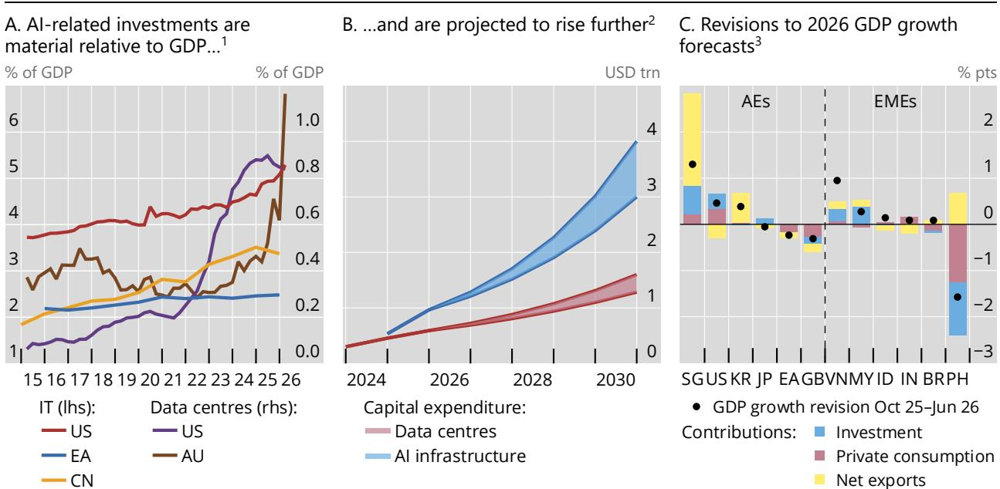
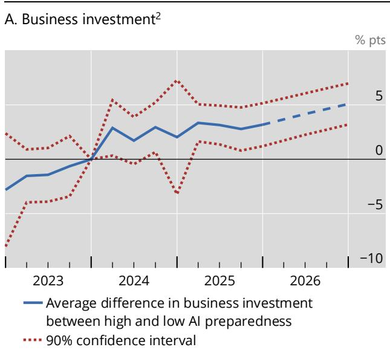
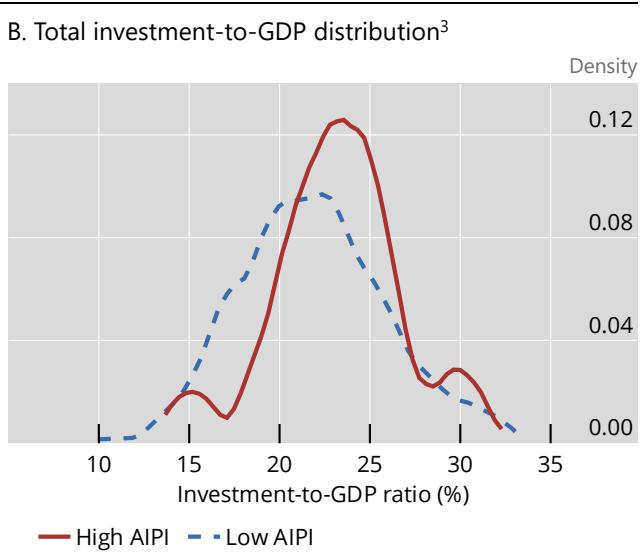
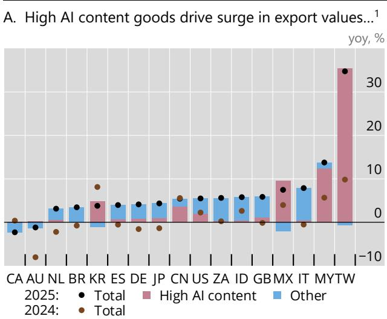
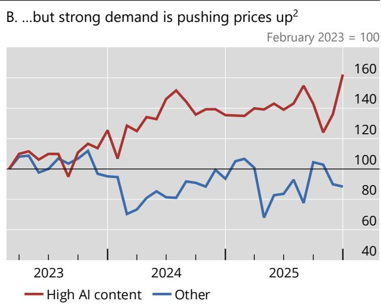
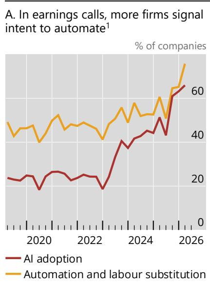
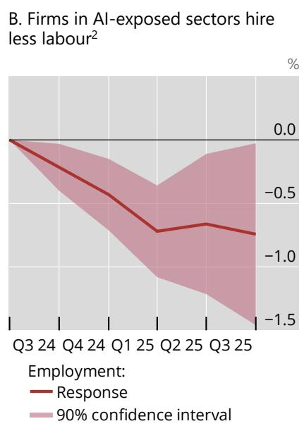
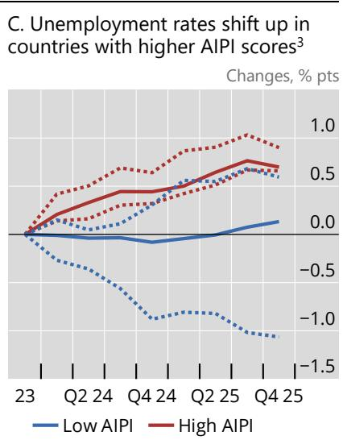

# BIS Bulletin

## No 130

AI and the global economy: implications for central banks

Iñaki Aldasoro, Leonardo Gambacorta, Enisse Kharroubi and Matthias Rottner

BIS Bulletins are written by staff members of the Bank for International Settlements, and from time to time by other economists, and are published by the Bank. The papers are on subjects of topical interest and are technical in character. The views expressed in this publication are those of the authors and do not necessarily reflect the views of the BIS or its member central banks. The authors thank Pablo Hernández de Cos, Phurichai Rungcharoenkitkul, Olivier Sirello and Philip Wooldridge for helpful comments and suggestions, Adam Cap, Andrew Li and Emese Kuruc for excellent statistical assistance and Nicola Faessler for administrative support.

The editor of the BIS Bulletin series are Gaston Gelos and Frank Smets.

This publication is available on the BIS website (www.bis.org).

# AI and the global economy: implications for central banks

## Key takeaways

\- The AI boom is driving a large, increasingly debt-financed investment surge and boosting trade and equity markets, generating sizeable terms-of-trade and wealth effects that differ across countries.

\- The productivity payoff from AI, though potentially large, remains uncertain and uneven, across both sectors and countries.

\- By simultaneously affecting demand and supply, AI blurs cyclical signals, complicating central banks' assessment of underlying economic conditions and monetary policy calibration.

The sustained boom in artificial intelligence (AI) has contributed to surprisingly resilient growth. AI's footprint on investment, trade and asset prices has grown large enough to shape the global outlook in real time. Moreover, it has acted as a powerful countervailing force to trade tensions and geopolitical shocks that have raised energy prices and weighed on growth. In this way, AI has supported aggregate demand, trade, financial market valuations and overall macroeconomic resilience.

This Bulletin assesses how the AI boom is shaping near-term macroeconomic dynamics and the attendant implications for monetary policy and financial stability. It documents four sets of findings. First, AI is driving a large investment and financing impulse: spending on data centres, semiconductors and related infrastructure has reached around 1% of GDP in the most exposed economies, and the associated capital expenditures increasingly rely on public debt markets as well as private credit. Second, these forces are reshaping trade and equity markets, generating sizeable terms-of-trade and wealth effects that differ markedly across countries. Third, the productivity payoff, though potentially large, remains uncertain and uneven and is accompanied by some early signs of labour market softening in the economies most exposed to AI. Finally, by moving demand and supply at the same time, AI blurs the cyclical signals on which central banks rely, thereby complicating monetary policy calibration.

## AI as a driver of short-term macroeconomic dynamics

AI affects economic activity through channels that operate via aggregate demand and supply. On the demand side, AI is driving a powerful investment cycle, lifting the valuations of AI-related firms and reshaping trade flows. On the supply side, AI promises to raise productivity over time. The demand side effects are already large and observable; the supply side effects, while potentially more consequential, remain uncertain in scale and timing. Because these forces affect growth, labour markets and inflation in different – and sometimes offsetting – directions, AI's net macroeconomic impact is unclear and will likely vary across countries and over time.

A broad investment boom and its financing. The promise of AI has unleashed a global investment boom. AI-related investment already accounts for a material share of GDP in some countries (Graph 1.A). This spending spans data centres, specialised chip manufacturing facilities, cloud infrastructure and hardware, and has also bolstered investment in information technology (IT) products and software more broadly. $^{1}$ Available estimates point to a sharp increase in AI-related investment: in the United States and Australia, where more granular investment data are available, estimated spending on data centres (including the IT equipment they house) and IT manufacturing facilities rose steeply to 0.8% and over 1% of GDP, respectively (purple and brown lines, right-hand scale). Industry participants expect global AI-related investment to grow further – from 500 billion today to 3–4 trillion by 2030 – while capital expenditures on data centres are projected to triple by 2030 (Graph 1.B).

## AI firms are growing rapidly and so are AI-related investments

  
$^{1}$ For EA, estimates for 2025. See the online annex for details. $^{2}$ Projections are for global spending on AI infrastructure and data centres. See the online annex for details. $^{3}$ Revisions to 2026 GDP growth forecasts and the contributions of some GDP components. Forecasts are displayed by publication month; survey cutoff precedes this by several weeks.

Sources: Aldasoro et al (2026); Federal Reserve Bank of St Louis; IMF; US Census Bureau; Dell'Oro Group; Focus Economics; Gartner; Goldman Sachs; LSEG Datastream; Omdia; Reuters; Wind Economic Database; national data; BIS.

AI investment has been a significant tailwind to growth. AI-related capital expenditures supported aggregate investment, which has been an important driver of upward revisions to growth forecasts across several countries (Graph 1.C). In line with this, business investment has grown faster in economies with higher scores in an AI preparedness index (AIPI) than in those with lower scores (Graph 2.A). $^{2}$ The fact that total investment is also higher for countries with a high AIPI score suggests that business investment growth has not come at the expense of less investment elsewhere, ie housing or public sector investments (Graph 2.B).

The AI investment boom has also reshaped trade through supply chain linkages that run from semiconductors to data storage and digital infrastructure. These shifts are clearly visible in trade data, where goods with high AI content have recorded the fastest rates of export growth (Graph 3.A). Although volumes have risen, a large part of the increase in exports reflects higher prices. Granular data from the United States show that export prices for goods with high AI content climbed markedly over the past two years, even as prices for other goods fell or stayed broadly flat (Graph 3.B).

AI preparedness raises business investment and supports total investment at the low end of the distribution $^{1}$

  
$^{1}$ AIPi = AI preparedness index. “High AIPi” refers to countries with AIPi scores above the sample median. AIPi scores reflect the capacity to adopt, develop and benefit from AI technologies. See the online annex for details. $^{2}$ The solid blue line plots the difference in cumulative business investment growth since Q4 2023 between countries with high and low AIPi scores. The dashed blue line shows projections based on OECD forecasts. Country sample: AU, CA, DE, DK, FI, FR, GB, JP, KR, NL, NO, NZ, SE and US. $^{3}$ Lines plot the distribution of gross fixed capital formation as a share of GDP, based on quarterly national accounts data for countries with an AIPi score above and below the sample median. Sample: 32 economies (24 advanced economies and eight emerging market economies) over Q4 2023–Q4 2025.  
Sources: IMF; OECD; national data; BIS.

Strong AI-related investment has put upward pressure on AI investment input prices, not least because investment by AI firms has far exceeded that by semiconductor producers. As a result, the impact has been uneven along the AI supply chain. Upstream exporters of AI-related goods (eg semiconductors) – such as Korea, Chinese Taipei, Malaysia and Singapore – have seen export prices outpace import costs, delivering sizeable terms-of-trade gains. This has caused national income and purchasing power to increase by substantially more than real GDP, which measures production volumes.

## AI delivers an export boom, but with price pressures building up

  
$^{1}$ Annual growth rate of exports for different categories of goods and total exports. $^{2}$ Lines plot the US export price indices for goods with high AI content and other goods, rebased to 100 in February 2023.  
Sources: Waugh (2026); UN Comtrade; China Customs; Focus Economics; BIS.

These gains have, however, been narrowly concentrated. In Korea, for example, five firms accounted for 43% of export earnings in the first quarter of 2026, up from 27% two years earlier. By contrast, countries expanding their digital infrastructure often need to import large quantities of AI-related goods, with the higher prices of these goods weighing on their terms of trade. In line with this, terms of trade have weakened in economies with higher AI digital infrastructure scores (Graph A.2.A in the online annex), partly because the cost of imported AI-related equipment and infrastructure has risen.

Financial markets have amplified the demand impulse from AI, although here too the effects have been uneven across countries. The weight of AI firms in equity markets has risen sharply, supported by strong earnings. In the United States, their share of total market capitalisation climbed from 24% to 40% between 2022 and 2025, with similar, though less pronounced, developments in other economies integrated into the AI production chain (Graph A.3.A in the online annex). By contrast, equity markets with more limited exposure to AI production have generally recorded weaker performance. Higher valuations have generated wealth effects for asset-holding households, supporting consumption (notably in the United States and, to a lesser extent, the euro area).

Beyond equity valuations, the scale of AI investments has implications for financial markets in terms of financing. As AI firms' capital expenditures have increased markedly in recent years, free cash flows have shrunk significantly (Graph A.3.B in the online annex, red arrows). This prompted a shift to debt financing, with two sources standing out. The first is private credit, which has grown particularly fast in the United States (Aldasoro et al (2026)). Outstanding private credit loans to AI-related firms grew from near zero in 2016 to \$200 billion in 2025, while their share in total private credit loans rose from less than 2% to 8% over the same period (Graph A.3.C in online annex). The second financing source is bond markets. AI firms raised \$243 billion through bonds in 2025, up from \$79 billion in 2023 (against total non-financial corporate bond issuance of around \$3.0 trillion and \$2.1 trillion, respectively) (OECD (2026)). While US-based AI firms account for most of this, issuance is also increasing elsewhere, albeit from a lower base.

An uncertain productivity payoff. AI also affects activity through productivity, although the size and persistence of these effects remain highly uncertain. Early micro evidence suggests that generative AI can deliver sizeable productivity gains, particularly by automating components of non-routine cognitive tasks. Evidence also suggests that AI compresses performance differences, as less experienced workers often benefit more than senior ones (Graph A.4.A in the online annex). Whether these micro-level gains will translate into higher aggregate total factor productivity (TFP) remains uncertain. $^{3}$ While the range of macro estimates is relatively wide, the median TFP growth gain is around 0.5 percentage points per year (Graph A.4.B in the online annex). Cross-country evidence suggests that some of these effects may already be materialising, with higher AI preparedness as of 2023 correlating positively with labour productivity growth over the subsequent two years (Graph A.5.A in the online annex).

Economic growth and the labour market. The growth effects of AI will reflect both the demand and supply side factors described above. Therefore, they currently vary substantially across countries, reflecting differences in economic structure, the scale of AI-related investment, the countries' capacity to adopt and deploy the technology, or the presence of demand bottlenecks that may constrain the growth benefits of AI (BIS (2026)). The available evidence suggests that advanced economies (AEs) are better positioned to capture the near-term gains, while outcomes across emerging market economies (EMEs) are more heterogeneous (Graph A.5.B in the online annex; Gambacorta et al (2025)).

Beyond its effects on GDP growth, AI could also reshape labour markets. Two broad forces are at work: complementarity between generative AI and tasks that benefit from human input, and substitution for routine cognitive tasks that can be fully or partially automated. So far, labour displacement has been limited, although some early signs are emerging in specific tasks and occupations (ie call centres, business centres). Many firms remain in a “wait-and-see” phase, experimenting with AI technologies but still facing uncertainty regarding regulation, costs, organisational adaptation and the reliability of AI systems, consistent with the current “low hiring, low firing” dynamics observed in several jurisdictions.

Even so, corporate behaviour points to an intensifying impact. In recent earnings calls, nearly 80% of firms indicated plans to automate a growing share of production processes and increase labour substitution (Graph 4.A). Consistent with these soft indicators, employment growth in the United States has been weaker in sectors with higher AI exposure: between the third quarter of 2023 and the third quarter of 2025, employment in high AI-exposure sectors grew around 0.8 percentage points less than in low AI-exposure sectors (Graph 4.B). Unemployment trends tell a similar story. Countries with a high AICI score saw unemployment rates increase by 0.75 percentage points on average between 2023 and 2025; those with low AICI scores saw flat unemployment rates (Graph 4.C).

## AI could pose some risks to labour markets

  
Graph 4

  
$^{1}$ Share of companies reporting the following in their earnings calls: early stage or advanced use of AI within the business, significant positive impact of AI on company productivity and actual or potential reduction in labour input due to AI or automation. Based on earnings call analysis using a large language model. $^{2}$ Estimates based on a cross-sectoral period-by-period regression where cumulative employment growth is regressed on the Q3 2024 log of employment and Q3 2024 sectoral exposure to AI in the United States. Sectoral exposure to AI measured as the fraction of data scientists in sectoral employment in Q3 2024. $^{3}$ Solid lines plot the median change in unemployment rate relative to 2023. Dotted lines display the respective interquartile ranges.

Sources: Kansal and Rungcharoenkitkul (2026); BIS (2026), IMF; OECD; US Bureau of Economic Analysis; US Bureau of Labor Statistics; S&P Global Market Intelligence; BIS.

AI may also create skills mismatches by increasing demand for workers with AI-related and complementary skills. When the skills of unemployed workers do not match those required for newly created jobs, labour market matching efficiency may decline. Consistent with this mechanism, economies that are more advanced in AI adoption tend to exhibit a steeper vacancy-unemployment relationship than countries with lower AI preparedness (Graph A.6 in the online annex).

Impact on inflation. The channels discussed above point to opposing short-run inflation pressures. On the one hand, AI-related investment, trade and wealth-driven consumption can boost aggregate demand and add to price pressures. On the other hand, productivity gains, if they occur, would expand supply, helping to contain inflation. Concerns about AI-induced job losses could also curb demand, wages and, in turn, inflationary pressures. The relative strength and timing of these forces, however, remain uncertain.

Beyond the strength and direction of effects, there are differences in their timing. AI could exert upward pressure on inflation before becoming disinflationary as productivity gains broaden and supply adjusts. Near-term inflationary effects may already be emerging, albeit modestly (Abecasis (2026)). Disinflationary effects from higher productivity or changes in workers' perceptions of their bargaining power are likely to emerge more gradually. Canonical macro models suggest AI tends to be inflationary, as households boost consumption in anticipation of stronger future income growth. And even if they do not anticipate the AI boom, financial markets may, in turn, lift household consumption through wealth effects. The effects on inflation are more muted (possibly even reversed) if the AI-led productivity boom exceeds expectations or if households restrain consumption against potential labour displacement.

## Implications for central banks

The considerable uncertainty surrounding the effects of AI raises several challenges for monetary policy and financial stability. For one, AI simultaneously affects demand and supply, in both cyclical and structural ways. Moreover, the effects differ across sectors, complicating the assessment of underlying trends. Strong activity may reflect temporary demand factors (eg investment booms and wealth effects) rather than sustained increases in potential output, while productivity gains are uneven and hard to measure. The AI boom may thus alter key unobservable benchmarks, including the natural rates of interest and unemployment, frequently used in monetary policy analysis.

Greater uncertainty increases the risk of policy miscalibration. If central banks overestimate supply improvements or underestimate the rise in underlying demand, policy may remain too accommodative; the opposite risk could lead to unnecessarily restrictive conditions. In this environment, a gradual and data-dependent approach may help reduce the risk of policy errors.

The AI boom could also have important financial stability implications. For one, AI can disrupt the business models of specific sectors and generate negative spillovers to their stock prices and employment prospects, as experienced by software as a service (SaaS) companies in February 2026. In some jurisdictions, large export windfalls may also risk contributing to domestic asset price bubbles. More broadly, a key risk at the current juncture is that expectations about the transformative impact of AI may be overly optimistic, raising the risk of overinvestment, resource misallocation and weaker credit quality. A correction in asset prices could tighten financial conditions, dampen investment and weaken aggregate demand, as discussed at greater length in BIS (2026).

## References

Abecasis, M (2026): "AI and (measured) inflation: up then down", Goldman Sachs, US Economics Analyst.

Aldasoro, I, S Doerr and D Rees (2026): "Financing the AI boom: from cash flows to debt", BIS Bulletin, no 120.

Bank for International Settlements (BIS) (2026): "Progress and peril", Annual Economic Report 2026, Chapter I.

Brynjolfsson, E, D Rock and C Syverson (2021): "The productivity J-curve: how intangibles complement general purpose technologies", American Economic Journal: Macroeconomics, vol 13, no 1.

Cazzaniga, M, F Jaumotte, L Li, G Melina, A Panton, C Pizzinelli, E Rockall and M Mendes Tavares (2024): "Gen-Al: artificial intelligence and the future of work", IMF Staff Discussion Notes, no 2024/1.

Gambacorta, L, E Kharroubi, A Mehrotra and T Oliviero (2025): "Artificial intelligence and growth in advanced and emerging economies: short-run impact", BIS Working Papers, no 1321.

Kansal, R and P Rungcharoenkitkul (2026): "AI impacts on firms: insights from earning calls", mimeo.

Organisation for Economic Co-operation and Development (OECD) (2026): Global debt report 2026: sustaining debt market resilience under growing pressure.

Waugh (2026): "Trade in AI-related products", NBER Working Papers, no 35053.