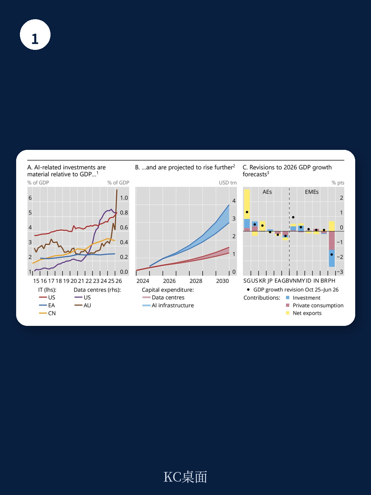

# 国际清算银行：AI与全球宏观环境对央行的启示

AI热潮正在以可量化的方式重塑全球宏观环境格局。国际清算银行（BIS）最新发布的第130号公告指出，AI相关研究在部分地区已达到GDP的1%左右，这一规模足以在贸易、资产价格和增长预期层面产生可观测的宏观效应。报告的核心判断是：AI同时作用于总需求和总供给，模糊了央行赖以判断宏观环境状态的周期信号，增加了货币政策校准的难度。

## 1. AI研究规模已占部分地区GDP的1%，且依赖债务融资

AI驱动的研究浪潮已从概念阶段进入实质性支出阶段。报告引用的数据显示，在美国和澳大利亚，数据中心及IT制造设施的研究分别达到GDP的0.8%和超过1%。行业参与者预计，全球AI相关研究将从目前的5000亿美元增长至2030年的3至4万亿美元，数据中心资本支出预计同期增长两倍。

值得关注的是融资结构的变化。随着AI企业资本支出大幅增加，自由现金流显著调整，企业转向债务融资。2025年，AI企业通过债券市场筹集了2430亿美元，较2023年的790亿美元增长超过两倍。私人信贷市场同样活跃，对AI相关企业的未偿贷款从2016年的接近零增长至2025年的2000亿美元，占私人信贷总额的比重从不到2%升至8%。

> **KC评论：** 研究规模本身并不意外，但融资结构的变化值得注意。AI企业从依赖内部现金流转向债务市场，意味着利率环境和信用条件的变化将更直接地传导至AI研究节奏。私人信贷的快速增长也增加了资金体系的透明度挑战。

## 2. 贸易条件效应在不同地区间出现显著分化

AI研究通过供应链重塑了贸易格局。报告显示，高AI含量商品的出口增速在所有商品类别中最快，但增长主要来自价格上涨而非数量扩张。美国高AI含量商品的出口价格在过去两年显著上升，而其他商品价格持平或下降。

这种价格效应带来了明显的贸易条件分化。韩国、中国台湾、马来西亚和新加坡等AI相关商品上游出口地区，出口价格涨幅超过进口成本，获得了可观的贸易条件改善。以韩国为例，2026年第一季度五家企业贡献了43%的出口收入，两年前这一比例为27%。相比之下，需要大量进口AI基础设施的地区，贸易条件则出现出现变化。

## 3. 劳动力市场已出现早期软化迹象，企业自动化意愿上升

尽管AI对生产力的长期影响仍不确定，但劳动力市场已出现可观测的变化。报告指出，在AI暴露度较高的美国行业，2023年第三季度至2025年第三季度期间，就业增长比低暴露度行业低约0.8个百分点。失业率数据呈现类似模式：AI准备度高的国家，2023年至2025年失业率平均上升0.75个百分点，而低准备度国家失业率基本持平。

企业行为信号更为明确。在近期的财报电话会议中，近80%的企业表示计划增加生产流程自动化和劳动力替代。报告认为，当前许多企业仍处于“观望”阶段，但自动化意愿的上升可能在未来转化为更明显的就业结构调整。

> **KC评论：** 就业数据的变化幅度虽然有限，但方向一致。报告特别指出，AI可能加剧技能错配——AI采用更先进的地区，其职位空缺与失业率之间的关系变得更陡峭，意味着失业工人技能与新增岗位需求之间的匹配效率在下降。

## 4. 央行面临周期信号模糊化与政策校准难度上升

报告的核心政策含义在于：AI同时影响需求和供给，且两者在时间上不同步。短期内，AI研究和财富效应可能推高通胀；中期内，生产力提升可能产生价格变化效应。这种时间差使得央行难以判断当前增长是来自临时需求因素还是潜在产出的持续提升。

报告认为，AI热潮可能改变自然利率和自然失业率等关键不可观测基准，增加政策误判的不确定性。如果央行高估供给改善或低估需求上升，政策可能过于宽松；反之则可能导致不必要的紧缩。报告建议，在此环境下，渐进且依赖数据的政策路径有助于降低错误不确定性。

资金稳定方面，报告提示了过度乐观预期的不确定性。如果市场对AI变革性影响的预期过于乐观，可能导致过度研究、资源错配和信用质量下降。资产价格修正可能收紧资金条件，抑制研究并削弱总需求。

For informational purposes only. Portions may be generated,translated,summarized,or edited with AI assistance based on source materials and may contain omissions or errors. Please verify independently. This is not investment,legal,tax,accounting,or other professional advice.

