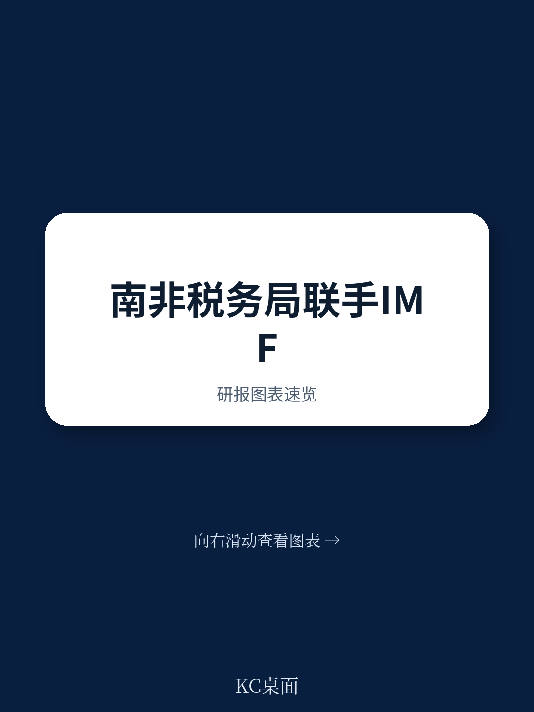

# IMF：南非加密资产欺诈与调查研讨会

南非约9%至12%的人口持有加密资产，超过240家授权服务提供商在境内运营。这一市场规模意味着税务与海关部门面临的合规挑战已从理论讨论进入实操阶段。2025年11月，IMF应南非税务局（SARS）请求，在比勒陀利亚举办了首次聚焦加密资产欺诈与调查的能力建设研讨会。这不是一次常规培训，而是IMF协助成员国将数字资金技术纳入税收与海关执法体系的试点动作。

研讨会由瑞士宏观环境事务国务秘书处资助，韩国海关署派出专家参与授课。SARS内部多个部门——包括联合税务与海关犯罪司、加密资产收入增长组和数据科学团队——共同参与。报告明确写道，这是“首次此类研讨会”，其核心目标不是传授区块链基础知识，而是帮助一线调查人员理解加密资产生态、本国监管框架以及可落地的调查技术。

## 1. 南非加密资产监管框架已形成多机构协作机制

南非的监管格局并非单一机构主导。报告显示，国家财政部、南非储备银行、资金部门行为监管局、SARS以及资金情报中心通过工作组形式共同推进加密资产监管。这种跨部门协作结构在发展中国家并不常见。南非法律已将加密资产归类为资金产品，并正在推进OECD加密资产报告框架（CARF）的实施。这意味着，SARS的调查能力建设并非孤立行动，而是嵌入在一个正在成型的监管体系之中。

> **KC评论：** 报告特别比较了法国和韩国的监管与执法架构。这种横向对比的价值在于，SARS可以借鉴成熟地区在跨机构协作、资产没收程序以及技术工具开发方面的经验，而不必从零摸索。

## 2. 调查难点集中在技术复杂性与信息不对称

研讨会揭示的核心挑战并非法律空白，而是执法部门与犯罪者之间的技术差距。欺诈者使用混币器、跳转器和点对点交易所等工具隐藏交易路径。区块链技术的固有复杂性、加密资产类型的多样性，以及跨境交易的匿名性，使得传统税务稽查手段难以直接适用。

目前SARS的执法重点仍放在加密资产的税务申报上，主要依赖可疑交易报告和间接指标来发现未申报的挖矿活动。这种被动模式在面对结构化洗钱和贸易型非法资金流动时，效果有限。报告指出，关于加密资产欺诈的现有知识仍主要集中在诈骗、盗窃和暗网加密货币使用上，税务与海关领域的系统性欺诈研究相对薄弱。

## 3. 开源情报工具与跨部门协作是当前最可行的突破口

研讨会的实践环节展示了开源情报（OSINT）工具和商业交易追踪平台的实际效用。这些工具不需要高昂的采购成本，但需要调查人员具备将技术知识与侦查逻辑结合的能力。报告强调，将实操练习融入培训全程，而非将技术内容单独隔离，是提升知识留存率和操作有效性的关键。

另一个被反复提及的变量是内部协作。SARS内部不同部门的技术水平参差不齐，研讨会通过跨部门互动识别了知识缺口，并建立了内部技术联络点。报告建议设立“加密资产参考官”或“大使”角色，负责推动意识提升和信息共享。这种组织设计比单纯增加技术工具更能应对快速演变的欺诈手法。

## 4. 后续能力建设需聚焦数据分析与实地案例研究

报告提出的建议并非泛泛而谈。它明确要求培训方案根据专业水平分层设计：一线官员需要足够的技术基础，技术专家则需要接触调查工具的实际操作。更重要的是，报告呼吁SARS与国内外机构合作，推进针对加密资产的数据分析应用，包括整合现有数据源和引入区块链分析软件。

在知识生产层面，报告认为，基于实地调查和真实案例的分析工作将惠及整个执法社区。目前关于加密资产税务欺诈和海关欺诈的系统性知识仍然稀缺，主要研究仍集中在诈骗和暗网领域。SARS如果能够从自身案件出发，产出针对性的分析成果，将填补这一空白。

> **KC评论：** 这份报告的价值不在于提供了多少新数据，而在于它明确了税务与海关部门在加密资产执法中的具体短板——不是法律不够，而是技术认知、内部协作和数据分析能力尚未跟上市场发展速度。对于其他正在考虑类似能力建设的地区，SARS的这次试点提供了一个可参照的起点。

For informational purposes only. Portions may be generated,translated,summarized,or edited with AI assistance based on source materials and may contain omissions or errors. Please verify independently. This is not investment,legal,tax,accounting,or other professional advice.

