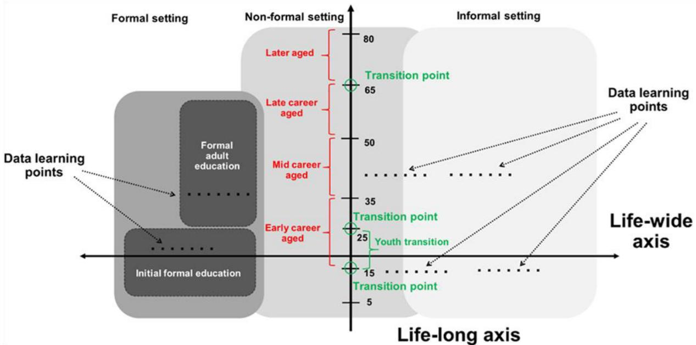
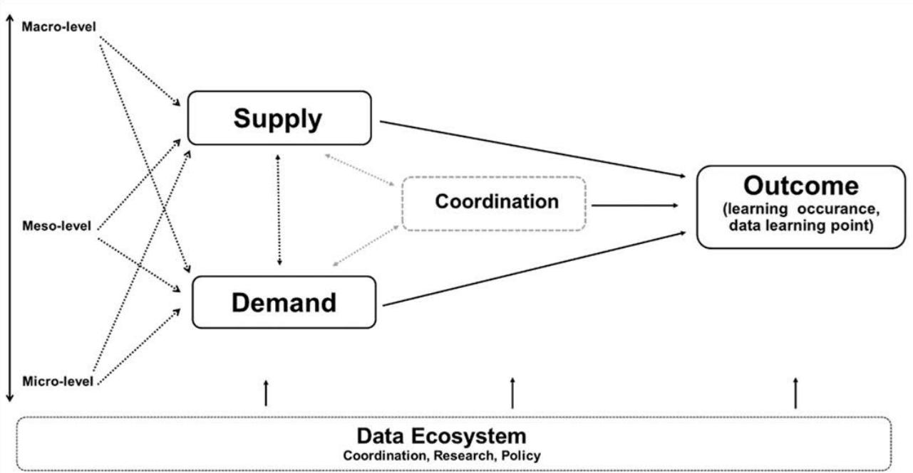
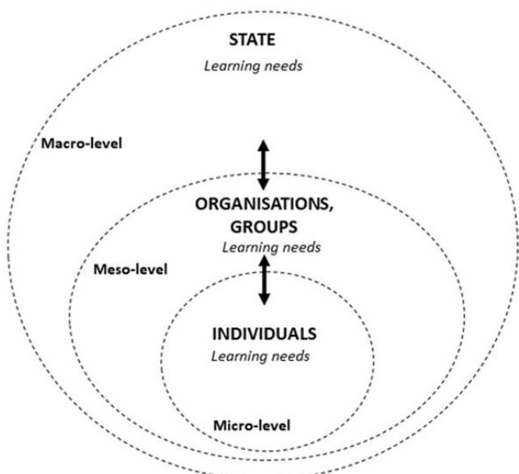
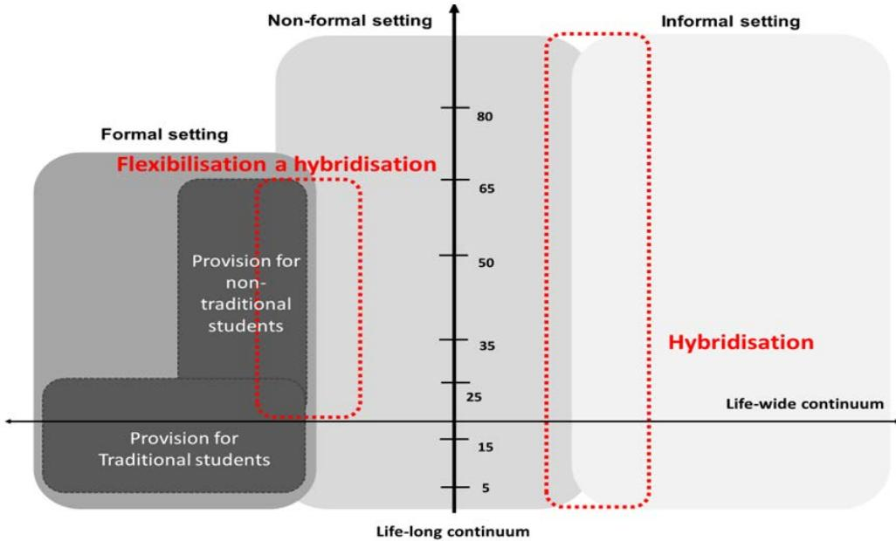
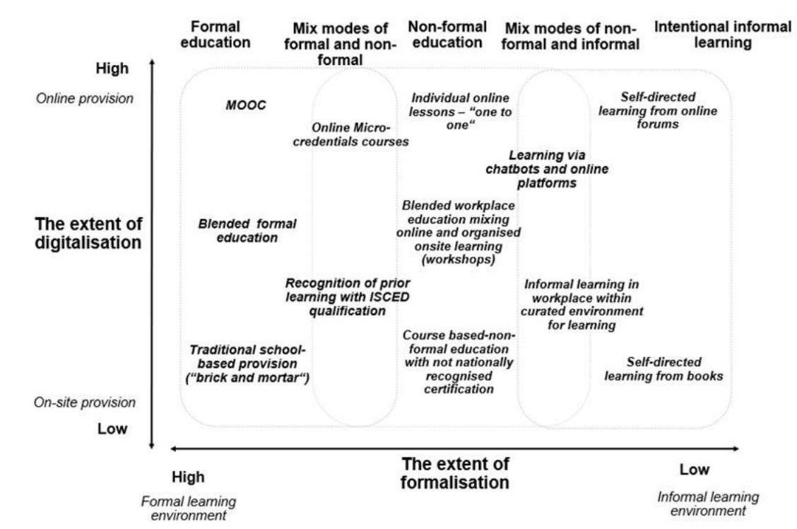
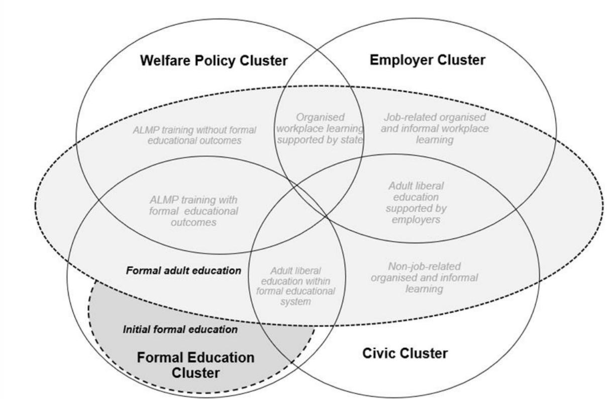
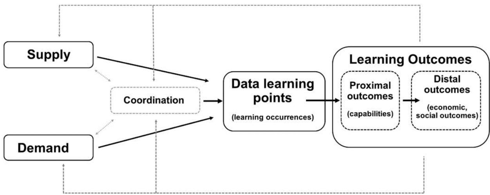

Educational Research and Innovation

# A Conceptual Foundation for the Development of a Lifelong Learning Measurement Framework

## A Conceptual Foundation for the Development of a Lifelong Learning Measurement Framework

This work is issued under the responsibility of the Secretary-General of the OECD, and does not necessarily reflect the official views of OECD Member countries.

This document, as well as any data and map included herein, are without prejudice to the status of or sovereignty over any territory, to the delimitation of international frontiers and boundaries and to the name of any territory, city or area.

Please cite this publication as:
OECD (2026), A Conceptual Foundation for the Development of a Lifelong Learning Measurement Framework, Educational Research and Innovation, OECD Publishing, Paris, https://doi.org/10.1787/27e5a619-en.

ISBN 978-92-64-87701-6 (print)
ISBN 978-92-64-94405-3 (PDF)
ISBN 978-92-64-66732-7 (HTML)

Educational Research and Innovation
ISSN 2076-9660 (print)
ISSN 2076-9679 (online)

Photo credits: Cover © ESB Professional/Shutterstock.com.

Corrigenda to OECD publications may be found at: https://www.oecd.org/en/publications/support/corrigenda.html.
© OECD 2026

## Attribution 4.0 International (CC BY 4.0)

This work is made available under the Creative Commons Attribution 4.0 International licence. By using this work, you accept to be bound by the terms of this licence (https://creativecommons.org/licenses/by/4.0/).

Attribution – you must cite the work.

Translations – you must cite the original work, identify changes to the original and add the following text: In the event of any discrepancy between the original work and the translation, only the text of the original work should be considered valid.

Adaptations – you must cite the original work and add the following text: This is an adaptation of an original work by the OECD. The opinions expressed and arguments employed in this adaptation should not be reported as representing the official views of the OECD or of its Member countries.

Third-party material – the licence does not apply to third-party material in the work. If using such material, you are responsible for obtaining permission from the third party and for any claims of infringement.

You must not use the OECD logo, visual identity or cover image without express permission or suggest the OECD endorses your use of the work.

Any dispute arising under this licence shall be settled by arbitration in accordance with the Permanent Court of Arbitration (PCA) Arbitration Rules 2012. The seat of arbitration shall be Paris (France). The number of arbitrators shall be one.

# Foreword

Today's policy challenges – from AI-driven labour market change to demographic ageing and social cohesion – depend on people's capacity to learn continuously. Yet our international data collections on lifelong learning still provide only fragmented snapshots. Educational surveys rarely follow learners across the life course or connect with adult learning surveys. As for adult learning surveys, they concentrate on certain age groups, particularly adults between 25 and 64, overlook learning before and after those years, rely largely on cross-sectional surveys, and privilege labour-market outcomes over broader benefits such as health, civic participation and wellbeing. Most importantly, they struggle to capture where learning increasingly takes place: in workplaces, families, communities and digital environments.

The instinctive response is often to ask for better surveys or more indicators. That is necessary, but insufficient. What is needed is a different conceptual lens. Rather than treating lifelong learning as an extension of formal education, we should start from the premise that learning occurs across the life course and across many contexts, only some of which are institutionalised. Schools and universities remain important, but they are only one part of a much larger learning ecosystem.

This is why the conceptual framework proposed in this report deserves attention even beyond its immediate recommendations. It reframes lifelong learning around learning systems rather than education systems, and argues that measurement should follow this broader perspective. By organising analysis around the interaction between the demand for learning, the supply of learning opportunities and the mechanisms that coordinate the two, it shifts the focus from educational participation and its learning outcomes to understanding how societies enable people to keep learning throughout their lives.

Such a shift stretches beyond what current statistical systems can readily deliver. But that should not be seen as a weakness. Blue-sky thinking has an important role in public policy: conceptual frameworks often shape what becomes measurable tomorrow. International statistics have repeatedly evolved by first redefining what matters before building the instruments to observe it. This report seeks to do the same for lifelong learning.

It offers practical directions rather than a fixed blueprint. Extending surveys across the full life course, linking longitudinal datasets, integrating administrative records, developing portable learning records and exploiting new analytical techniques all represent plausible pathways towards a richer evidence base. None will be straightforward. But feasibility should not constrain the underlying vision of what societies need to know if they are to govern learning effectively. Only by making learning visible across the life course can countries know whether they are truly becoming lifelong learning societies.

## Abstract

This report proposes a conceptual framework for measuring lifelong learning (LLL) understood as learning across the life course and diverse contexts, aimed at improving policy design and evaluation. It identifies key limitations in current data systems, including narrow age coverage, lack of longitudinal tracking, overemphasis on labour-market outcomes, and insufficient measurement of informal learning. To address these gaps, the framework is structured around three interconnected pillars: demand, supply, and coordination. Demand captures learning needs at individual, organisational, and societal levels; supply maps opportunities across formal education, workplaces, welfare systems, and communities; and coordination focuses on mechanisms that align needs with provision. The framework also redefines learning by introducing a two-dimensional model based on formalisation and digitalisation, better capturing hybrid and emerging forms. Finally, it outlines practical steps for implementation, including improved surveys, longitudinal data linkages, administrative data integration, skills passports, and advanced analytics to support more comprehensive and effective lifelong learning systems.

# Acknowledgments

Richard Desjardins (University of California, Los Angeles, United States) and Jan Kalenda (Tomas Bata University, Czechia) authored this report. It is an output of a Center for Educational Research and Innovation (CERI) “Agility and Innovation” project. Stéphan Vincent-Lancrin, Senior Education Economist and Deputy Head of the Innovation and Measuring Progress division at the OECD Directorate for Education and Skills, led the project and edited the report.

The topic of the project was selected by the CERI Governing Board upon the proposition of a member country. Agility and innovation projects are requested to come up with a report that cast initial light on the topic in a short period of time.

The development of the report benefited from two expert meetings that were held on 23 May and 19 September: the first one provided advice on the scope of the work while the second one discussed an initial version of the report. The following experts are thankfully acknowledged for their contributions to defining the scope of the paper and for providing oral and written feedback on its first draft: Ellen Boeren (University of Glasgow, United Kingdom); Satya Brink (Jönköping University, Sweden); Francesca Borgonovi (OECD); Alex Gordon (Australia); Petya Illieva (Bulgarian Academy of Science, Bulgaria); Hyerim Kim (OECD); Ann-Charlott Larsson (Statistics Sweden, Sweden); Alexandra Loannidou (German Institute for Adult Learning, Germany); Marco Paccagnella (OECD); Teresa Parsons (Canada); Glenda Quintini (OECD); Gara Rojas Gonzalez (OECD); Josef Schrader (German Institute for Adult Learning, Germany); Thomas Schuller (Independent scholar, former Head of CERI); Bart Staats (OECD); Claudia Tamassia (OECD); Quentin Vidal (OECD); Emanuel Von Erlach (Office fédéral de la statistique, Switzerland); Yixi Wang (OECD).

A revised draft was then commented at the November 2025 meeting of the CERI Governing Board. CERI GB members are thanked for their insightful comments.

Edmund Misson, Head of the Innovation and Measuring Progress (IMEP) division is thanked for providing very helpful comments on the different versions of the document.

Chloe Acas, Jennifer O'Brien, and Brianna Jesme provided excellent assistance to the project and prepared the document for publication with the support of Rachel Linden (OECD).

## Table of contents

Foreword 3   
Abstract 4   
Acknowledgments 5   
Executive Summary 9   
1 Introduction 12   
1.1. Multidimensional data space of LLL 13   
1.2. From conceptual framework to data framework 15   
1.3. Distinguishing data to inform research, policy design, and coordination 16   
1.4. Organisation of the report 17   
References 17   
2 Enabling societal coordination and interactions between citizens' needs and structures 19   
2.1. History and accumulation of interactions: educational careers and pathways 20   
2.2. Co-ordination of learning needs: optics on who and what decides the learning needs 21   
2.3. Coordination of current and future learning needs: navigating life transitions and aspirations 23   
2.4. Skills surplus, deficits, and shortages: impacts on organisations and communities 23   
2.5. Policy instruments for effective coordination in LLL 24   
References 26   
3 Conceptualising the learning needs, and demand of stakeholders 28   
3.1. Learning needs and demands of citizens, organisations, communities, and nations 29   
References 32   
4 Understanding the prevalence and diversity of supply of learning opportunities 36   
4.1. Traditional understandings of learning activities 37   
4.1.1. Flexibilisation of formal education 38   
4.1.2. Hybridisation of non-formal education and informal learning 39   
4.2. Towards a revised conceptual framework of learning categories 40   
4.3. Situated provisions across institutional clusters 41   
4.3.1. Formal education cluster 43   
4.3.2. Employer cluster 44   
4.3.3. Welfare policy cluster 44   
4.3.4. Civic cluster 45

## References

5 Accounting for learning outcomes as key drivers of coordination, demand and supply 52
5.1. Setting, valuing, and researching learning objectives and outcomes for effective coordination 53
5.2. Approaches to understanding and assessing learning needs and outcomes 55

6 Distinguishing data purposes and needs: informing research, policy design, and coordination needs 57
6.1. Research: uncovering patterns, relationships, insights and nuances 58
6.2. Policy design: informing the policy process 58
6.3. Coordination: aligning needs and opportunities 59
References 60

7 Toward furthering data and indicator development 61
7.1. Cross-sectional surveys development 62
7.2. Longitudinal survey development 63
7.3. Administrative data development in international contexts: negotiations, concepts, and comparative indicators 64
7.4. Cumulative records of qualifications and capabilities: managing transitions 64
7.5. Data integration: combining survey, administrative, and big data sources 66
7.6. References 67

8 Conclusion and recommendations 69
8.1. Summary of framework 70
8.1.1. Bridging conceptual foundations to data focus: methods, tools, and examples 70
8.1.2. Key insights from the framework 71
8.2. Suggestions for implementation 72
8.2.1. Demand: enhancing needs assessment 72
8.2.2. Supply: expanding provision mapping 73
8.2.3. Coordination: strengthening systemic alignment 73
8.2.4. Cross-cutting: building resilient LLL ecosystems 74
8.3. Next steps 74
8.4. References 75

Annex A. Theoretical foundations of the LLL conceptual framework 76

Annex B. Approaches to understanding and assessing learning needs and outcomes 79
B.1 Qualification approach: individual, organisational, and collective perspectives 79
B.2 Direct skills assessment approach 80
B.3 Skills use and mismatch approach 81
B.4 Understanding dispositions to participation approach: motivations, attitudes, and barriers 82
B.5 Workplace and organisational learning and needs approach 83
B.6 Desirable outcomes approach: individual and family level 84
B.7 Desirable outcomes approach: public and collective level 84

Annex C. Suggested indicators and questions to explore within the framework 86
C.1 Core data and information for learning needs and demand 86
Addressing data gaps 87

Innovative data solutions 88  
Key indicators, research questions, and policy questions 88  
C.2 Core data and information for learning opportunities 89  
Core data and indicators 89  
Addressing data gaps 89  
Innovative data solutions 90  
Key indicators, research questions, and policy questions 90  
C.3 Core data and information for coordinating lifelong learning 91  
Core data and indicators 91  
Addressing data gaps 92  
Innovative data solutions 92  
Key indicators, research questions, and policy questions 92  
C.4 Summary boxes 93  
C.4.1 Demand: measuring capability gaps 93  
C.4.2 Supply: Mapping Diverse Provisions 95  
C.4.3 Coordination: Aligning pathways and policies 96  
References 97

## Tables

Table A C.1. Key data and indicators focused on LLL needs 86  
Table A C.2. Core Data and Indicators 89  
Table A C.3. Key data and indicators focused on LLL coordination 91

## Figures

Figure 1.1. Multidimensional space of LLL 14  
Figure 1.2. LLL conceptual framework 15  
Figure 3.1. The Multi-Level Ecology of LLL Needs 31  
Figure 4.1. Flexibilisation and hybridisation of learning activities 39  
Figure 4.2. Revised conceptualisation of LLL activities with examples of various types of learning 40  
Figure 4.3. Embeddedness of learning activities in institutional clusters 42  
Figure 5.1. Learning data points to learning outcomes 54

## Boxes

Box A C.1. Demand Indicators 94  
Box A C.2. Supply Indicators 95  
Box A C.3. Coordination Indicators 96  
Box A C.4. Resilient Data Ecosystems Indicator 97

# Executive Summary

Building a conceptual foundation for a lifelong learning measurement framework

This report develops a conceptual foundation for a measurement framework that captures learning trajectories across the life course and diverse contexts, and enables systematic assessment of how policies shape participation and outcomes. It provides policymakers with a comprehensive approach to understanding how lifelong learning (LLL) systems function, where gaps exist, and how interventions can strengthen opportunities across populations.

LLL has become a central policy lever for productivity, inclusion, and resilience in the face of demographic ageing, technological change, and evolving skill demands. Yet existing data systems were designed mainly to measure educational attainment and training participation at specific life stages. They do not adequately capture learning as a lifelong and life-wide phenomenon, creating four major limitations that constrain policy design and evaluation.

First, coverage is too narrow across the life course. Most international measurement focuses on adults aged 25-64, offering limited visibility into learning outside formal schooling in childhood and excluding adults over 64. Learning through families, communities, and digital environments is largely invisible, despite its growing importance. As a result, critical phases of human development, skill maintenance, and the links between them remain poorly understood.

Second, measurement is largely cross-sectional, providing static snapshots rather than tracking learning over time. Current instruments do not follow how skills evolve through key life transitions such as entering the workforce, changing occupations, forming families, or retiring. The absence of systematic longitudinal linkages between surveys like the Programme for International Student Assessment (PISA) and Programme for the International Assessment Competencies (PIAAC) prevents a coherent view of skill development across decades. Policymakers cannot assess whether early investments yield long-term returns or identify where trajectories diverge.

Third, outcomes are too focused on the labour market. While employability and earnings matter, learning also produces broader social benefits, including civic participation, health literacy, social cohesion, personal agency, and wellbeing. These wider returns are largely absent from current metrics, limiting understanding of the full value of LLL and narrowing policy debates to economic productivity alone.

Fourth, informal learning is insufficiently captured. Much skill development occurs through everyday activities in workplaces, families, communities, and increasingly through digital resources such as online tutorials and platforms. These forms of learning remain weakly measured, creating blind spots precisely where learning is expanding most rapidly.

## A three-pillar framework for measuring lifelong learning systems

The proposed framework organises measurement around three interconnected pillars: demand, supply, and coordination. Together they provide a system-level perspective for monitoring and policy analysis, recognising that LLL systems depend not only on provision but also on how well supply aligns with needs and how effectively individuals are connected to opportunities.

Demand captures learning needs at three levels. At the individual level, it refers to skill gaps and capabilities required for work and daily life. At the organisational and community level, it reflects skill requirements within firms, sectors, and public services. At the societal level, it encompasses system-wide pressures such as demographic ageing or technological change that generate population-wide learning needs.

Supply maps learning opportunities across four institutional clusters: formal education systems; employers and workplace learning; welfare and labour-market programmes; and civic and community organisations such as libraries and voluntary associations. Countries vary significantly in how these clusters are developed, accessed, and integrated, which shapes participation patterns and outcomes.

Coordination refers to the mechanisms that align demand and supply. Strong provision and clear needs are insufficient if individuals cannot access or navigate appropriate pathways. Coordination includes governance arrangements, policy instruments such as qualifications frameworks, and guidance services that help learners make informed choices. It is the core function that converts available opportunities into effective learning pathways.

Differences across these three pillars explain variation in LLL systems and outcomes across countries. Systems with similar levels of investment can produce very different results depending on how well supply matches demand and how effective coordination mechanisms are. This perspective helps diagnose system weaknesses and understand why some reforms succeed while others fail.

## Redefining what counts as learning in a hybrid, digital context

The framework also updates how learning is classified. The traditional distinction between formal, non-formal education, and informal learning remains useful but is increasingly strained by digitalisation and the emergence of hybrid learning models and (ex-post) certification mechanisms.

New forms of provision blur these boundaries. Micro-credentials, for example, may resemble formal education in structure but function like non-formal training outside traditional degree pathways. Platform-based learning enables organised informal learning that is structured and scalable but not institutionally embedded in formal systems.

To address this, the framework proposes a two-dimensional representation of learning. The horizontal axis captures the degree of formalisation, ranging from highly structured, credentialed provision to unstructured learning embedded in daily life. The vertical axis captures the degree of digitalisation, from fully face-to-face to fully online, including hybrid formats.

This approach allows emerging and mixed forms of learning to be properly classified and measured. It also has direct implications for data collection: if surveys are not designed to capture blended and boundary-crossing forms of learning, they will continue to underestimate where and how learning occurs.

## Strategic pathways to implementation

Operationalising the framework requires investment in data infrastructure that builds on existing systems while addressing key gaps. Five implementation streams should proceed in parallel.

First, survey instruments should be extended and upgraded to cover the full life course and better capture informal learning, motivations, barriers, and contexts. Measurement of digital learning should go beyond simple online/offline distinctions to include delivery modes, platforms, and AI-supported learning. New items should be piloted internationally to ensure comparability.

Second, longitudinal linkages should be developed to improve life-course visibility. Connecting adolescent measures (e.g. PISA) with adult outcomes (e.g. PIAAC) would allow tracking of learning trajectories over time. Integrating LLL modules into national longitudinal studies and linking survey data with administrative records would further strengthen analysis, provided robust privacy safeguards are in place.

Third, administrative data systems should be harmonised and integrated across sectors. Common definitions and reporting standards would improve data quality and comparability. Pilot projects could link learning records with outcomes in employment, health, and civic participation, enabling a fuller assessment of returns to learning investments.

Fourth, cumulative learning records or “skills passports” should be scaled. These would integrate formal qualifications, non-formal certificates, and workplace competencies into portable, individual-controlled profiles. Such systems would make prior learning visible, reduce duplication, and support more efficient learning pathways, while requiring strong standards for interoperability and privacy.

Fifth, advanced methods should be deployed to expand measurement capacity. AI-enabled analytics can link platform data with survey data, while participatory logging via mobile applications can capture informal learning in real time. These approaches should be piloted carefully to address issues of bias, data quality, and participant burden.

Together, these steps would create a coherent measurement infrastructure capable of supporting evidence-based lifelong learning policy. By moving from fragmented data toward a comprehensive system that captures learning across the life course, contexts, and outcomes, the measurement framework supports more effective, equitable, and responsive LLL systems.

This chapter introduces the report's three research aims and outlines a multidimensional conceptualisation of lifelong learning (LLL) that could underpin the development of a structured data framework. It situates LLL along both life-long and life-wide dimensions and centres the analysis on the interaction between the demand for, supply of, and coordination of learning opportunities across individual, organisational, and national levels. The chapter concludes by presenting how the remainder of the report is organised, including how subsequent chapters develop these pillars, their measurement, and their policy implications.

This report introduces a conceptual and data framework to enhance understanding of how individuals and cohorts engage with lifelong learning (LLL) across their lives and to enable examination of the impact of diverse education policies and support measures. The focus is on three interrelated Research Aims (RAs):

\- RA1: Scoping current approaches to the definition and taxonomy of learning types across the life-course – from early age to elderly.

• RA2: Considering factors that shape national differences in LLL.

\- RA3: Examining options to collect, reuse, or integrate data across the life-course.

The stated purposes are to advance a foundation for identifying current gaps in data and inform future international data collection, as well as to support the ability to articulate the outcomes of LLL at individual, national, and global levels and generate policy lessons for countries aiming to strengthen educational engagement across the life-course (Desjardins and Kalenda, 2025[1]; OECD, 2023[2]).

For reference, the initial OECD/CERI project description and the underlying purpose of this paper are as follows:

"This project would scope the development of a data framework to enhance understanding of how individuals and cohorts engage with learning across the life-course and to enable examination of the impact of different education policies and supports. This would include: Scope current approaches to the definition and taxonomy of the types of learning across the life-course (RA1); Consideration of factors that shape national differences in lifelong learning (RA2); and Examination of options to collect, reuse, or integrate data across the life-course (RA3). This would provide the foundation for the development of such a framework to identify current gaps in data and inform future international data collection. Lifelong learning enables a more responsive and capable citizenry to changing global demands. However, understanding about how individuals and cohorts move through education across their lives is limited, reducing capacity to analyse how engagement is shaped by education policies and broader economic drivers. This project would support the ability to articulate the outcomes of lifelong learning at an individual, national and global level and offers policy lessons for countries aiming to strengthen educational engagement across the life-course."

## 1.1. Multidimensional data space of LLL

To address these aims and purposes, we begin by delineating the conceptual space of LLL and its associated data environment. This provides the foundation upon which we construct the core framework guiding our examination of the LLL data landscape. The scope of LLL may be conceptualised along two principal axes (Figure 1.1).

The first is the life-long axis, which represents the temporal continuum of learning across the lifecourse. It encompasses all phases of learning engagement – from early childhood and preschool education, through compulsory schooling and adult education and learning during the mid-life period, to learning that occurs well beyond retirement age. Within this temporal continuum, specific transition points and transition stages can be identified. These transitions may be viewed as part of a continuous and individualised process that can occur at any age or stage, shaped by personal circumstances and learning needs. Nonetheless, specific transition points related to the life-long axis are institutionally or socially structured – for instance, the completion of compulsory education, post-secondary choices, or career transitions in early, mid-, and late adulthood. Others are more diffuse yet still patterned, such as family formation or retirement, which tend to cluster at particular life stages.

Figure 1.1. Multidimensional space of LLL  

The second is the life-wide axis, which reflects the multiplicity of learning contexts and modalities. This dimension encompasses learning that occurs across formal, non-formal, and informal settings, extending beyond educational institutions to include workplaces, families, communities, and civic spaces. The life-wide axis, therefore, captures the relational and contextual nature of learning as an activity embedded within diverse spheres of social life – not only within the school or later within the labour market.

The intersection of these two axes defines the multidimensional space within which all manifestations of LLL can be located. Within this space, we identify learning occurrences (instances of learning activity and engagement) along with their associated proximal and distal outcomes. Each occurrence represents a possible data point within the broader learning trajectory of an individual, potentially arising at any age, in any context, and for varied purposes.

This starting point has several implications for constructing the framework.

First, to develop a genuinely comprehensive LLL data framework, it is essential to collect data from those dimensions of this multidimensional space for which data are currently absent or only partially available. At present, the available data for a research and policy perspective on this wider learning landscape remains fragmented and incomplete. Foremost, significant gaps exist in relation to learning among children and young people outside formal schooling, the oldest age cohorts, and learning that takes place in informal settings. Therefore, this framework explicitly incorporates two groups often overlooked in both data and policy: those under 18 and those over 64. For children and young people, this entails moving beyond formal schooling to acknowledge the growing significance of informal, civic, and digitally mediated learning environments that shape early educational trajectories. For older adults, it calls for a reframing of ageing, not solely in relation to labour-market participation, but as an active stage of cognitive resilience, well-being, and intergenerational engagement. Including these groups secures a genuinely life-wide and life-long perspective.

Second, as learning experiences accumulate along the life-long axis in the case of each individual, we must establish mechanisms to collect and integrate data from different contexts across the life-course in a cumulative manner.

Third, and closely related to the previous point, it is crucial to devise methods for integrating data from diverse stages and learning settings into a holistic representation – one that does not reduce LLL to a single domain or to a specific phase of life.

Fourth, successful life transitions inherently depend on a degree of coordination between the demand for and supply of learning opportunities. Such coordination may be pre-determined by legal or regulatory frameworks, or shaped by selection processes, labour market and career needs, employer requirements, and the aspirations of individuals and communities. Consequently, an LLL framework should not only serve the purpose of systematic data collection for research but also serve as an instrument to enhance coordination of learning opportunities at both the individual and societal levels.

## 1.2. From conceptual framework to data framework

To map a full scope of LLL data space, we have developed a conceptual framework to provide the basis for the proposed data framework, addressing gaps in data collections and proposing new approaches. In building this foundation, we have adopted a “blue-sky” approach, reimagining LLL as a holistic, multi-level, and multi-domain process that transcends traditional labour market-centric models to encompass outcomes such as health and financial literacy, civic engagement, and psychological well-being. Furthermore, it views the acquisition of skills not as separated stages (erg. before formal schooling, during education, and afterwards) but as a continuous process. Likewise, it recognises that knowledge and skills are developed in settings and through forms of learning that are interdependent and extend well beyond the classroom. Consequently, this perspective moves past a narrow focus on labour market demands to encompass diverse life situations and transitions across the life-course (Figure 1.1).

Figure 1.2. LLL conceptual framework  

In the framework (Figure 1.2), each learning occurrence (or data learning point) emerges from the interaction between the demand for, and the supply of, learning opportunities. Building on this premise, the LLL framework rests on three interrelated pillars:

\- Demand for LLL: the recognition of both explicit and latent learning needs that arise from aspirations or gaps in knowledge, skills, attitudes, or capabilities at individual, organisational, and societal levels.

\- Supply of LLL: the provision of varied learning opportunities across formal, non-formal, and informal modes of learning situated within diverse institutional contexts.

\- Coordination of LLL: the structuring of pathways and facilitation of transitions that align learning aspirations or needs with available opportunities, underpinned by multi-level policy design and stakeholder cooperation.

The framework adopts a multi-level perspective on coordination and LLL policies, including education policies. Effective coordination must be orchestrated not only in response to individual needs and opportunities but also across organisational and national levels, ensuring alignment and coherence throughout the system.

This multi-level logic also underpins the interaction between the supply and demand for LLL. At the macro level, state policies shape both the provision of and the demand for learning opportunities. At the meso level, employers, organisations, and communities operate as dual actors, serving simultaneously as providers of learning and as entities with their own learning needs. At the micro level, attention shifts to individuals (their learning interests and needs) as well as to their potential role as contributors to LLL. Individuals may themselves act as providers of learning, particularly in informal or less structured settings involving peer or community-based learning.

Furthermore, we distinguish between two principal types of outcomes arising from the interaction of supply, demand, and coordination. On the one hand, there are learning occurrences – i.e. the instances or processes through which learning takes place. On the other hand, there are learning outcomes – i.e. their manifestations, ranging from proximal expressions such as the acquisition of skills, to more distal impacts, including broader social benefits.

Finally, the last key element of the framework is the recognition that capturing the dynamics of these processes requires a robust data ecosystem. Such an ecosystem must serve three interrelated purposes: facilitating smooth and effective coordination, supporting research to uncover the underlying patterns and dynamics shaping supply, demand, and coordination, and informing policy design to enhance coordination mechanisms and address potential market failures.

## 1.3. Distinguishing data to inform research, policy design, and coordination

The current state of data collection, utilisation, and integration regarding LLL reveals significant limitations (e.g. Rubenson (2018[3]; 2019[4]); Elfert and Rubenson (2023[5]); Holford (2023[6]); Draghi (2024[7]); Boeren and Kalenda (2025[8]) and Karger, Kalenda and Vaculíková (2025[9])). Among the most pressing critiques is the fragmentation of data systems that measure learning activities and their outcomes across the life-course; for instance, the link between the assessment of skills acquired in school and those developed later in life. Other challenges include poor comparability across emerging forms of learning (such as blended formats or short online certifications), the narrow age ranges, centred around adults aged 25 to 64 years, covered by most adult learning data collections, the underreporting of needs and aspirations among low-skilled groups, and the predominant emphasis on the economic dimensions of LLL. Not least, the distinct functions and purposes of data do not necessarily feed into each other as well as they could to foster and inform better research, policy design, and coordination. The ultimate goal is a more integrated data ecosystem – one that connects individual survey results (e.g. Programme for International Student Assessment – PISA, and Programme for International Assessment of Adult Competencies – PIAAC), organisational records, and national aggregates into a coherent whole, enabling a system-level approach to knowledge mobilisation regarding LLL (OECD, 2023[10]).

## 1.4. Organisation of the report

This report develops a conceptual and data framework for LLL that systematically addresses the three research aims. Following the introduction, which outlines the multidimensional conceptual space of LLL, transitions from conceptual framings to data strategies, and presents the core framework, the report progresses through seven core sections, weaving conceptual foundations with practical measurement and policy implications to foster a resilient data ecosystem.

Section 2 establishes coordination as the integrative pillar aligning demand with supply. It traces educational careers, navigates life transitions, addresses skill imbalances at organisational and community levels, and outlines policy instruments for effective coordination, emphasizing multi-level governance to resolve asymmetries and externalities.

Section 3 analyses the demand pillar, clarifying how learning needs and aspirations are formed and expressed across stakeholders. It traces dynamics at three levels – micro (individual), meso (organisational), and macro (national) – and shows how these layers interact to shape demand.

Section 4 maps the supply pillar, detailing the prevalence and diversity of learning opportunities. It critiques the traditional triadic typology of learning activities, proposes revisions accounting for flexibilisation, hybridisation, and digitalisation, and situates provisions within four institutional clusters (formal education, employer, welfare policy, civic), that are mainly responsible for cross-national variations in LLL.

Section 5 synthesises the pillars by exploring the processes, outcomes, and dynamics of LLL systems through stakeholder objectives, interventions, and outcomes. It distinguishes proximal (e.g. skill acquisition) and distal (e.g. societal benefits) outcomes, evaluates diverse assessment approaches, and directs to Annex B for detailed approaches, linking to research, policy design, and coordination.

Section 6 clarifies data purposes and needs for research (pattern discovery), policy design (intervention evaluation and informing the policy process), and coordination (managing real-time alignment and system alignment driven by policy design).

Section 7 advances data and indicator development, reflecting on sources, constraints, and gaps while proposing strategies for cross-sectional and longitudinal survey development, administrative data enhancement, cumulative records (e.g. skills passports), and innovative methods like AI-driven analytics. Detailed exploratory indicators are provided in Annex C and are tied to the framework's pillars.

Section 8 concludes with recommendations that summarise the framework's insights, propose implementation pathways (e.g. OECD-led pilots and observatories), and outline next steps for scaling innovations to enhance LLL engagement and equity.

Annexes supplement the analysis: Annex A details theoretical foundations (e.g. capability theory, complexity theory), Annex B outlines research approaches for assessing learning needs and outcomes, and Annex C proposes exploratory indicators and questions for empirical exploration.

This structure progresses from coordination as the synthesising pillar, through demand and supply foundations, to outcome-driven integration and data innovations, ensuring coherence across the research aims while supporting actionable policy lessons for diverse national contexts.

## References

Boeren, E. and J. Kalenda (2025), “Adult participation and large-scale survey data: conceptual and methodological debates”, International Journal of Lifelong Education, Vol. 44/3, pp. 249-256, https://doi.org/10.1080/02601370.2025.2491194.

Desjardin, R. and J. Kalenda (eds.) (2025), A Modern Guide to Adult Learning Systems, Edward Elgar.

Draghi, M. (2024), “The future of European competitiveness. Part B. In-depth analysis and recommendation.”, European Commission.

Elfert, M. and K. Rubenson (2023), Lifelong learning: Researching a contested concept in the twenty-first century, In K. Evans, W. O. Lee, J. Markowitsch, & M. Zukas (Eds.), Third international handbook of lifelong learning (pp. 1219–1234). Springer Netherlands.

Holford, J. (2023), Lifelong learning, the European Union, and the social inclusion of young adults: Rethinking policy, In J. Holford, et al. (Eds.), Lifelong learning, young adults and challenges of disadvantage in Europe (pp. 3–39). Palgrave Macmillan.

Karger, T., J. Kalenda and J. Vaculíková (2025), “Participation reimagined: beyond the one-dimensional approach to participation in adult learning and education”, International Journal of Lifelong Education, Vol. 44/3, pp. 291-305, https://doi.org/10.1080/02601370.2025.2496654.

OECD (2023), Flexible adult learning: What it is, why it matters and how to make it work, OECD Publishing. [10]

OECD (2023), Who Really Cares about Using Education Research in Policy and Practice?: Developing a Culture of Research Engagement, Educational Research and Innovation, OECD Publishing, Paris, https://doi.org/10.1787/bc641427-en.

Rubenson, K. (2019), “Assessing the status of lifelong learning: Issues with composite indexes and surveys on participation”, International Review of Education, Vol. 65/2, pp. 295-317, https://doi.org/10.1007/s11159-019-09768-3.

Rubenson, K. (2018), Conceptualising participation in adult learning and education: Equity issues, In M. Milana, S. Webb, J. Holford, R. Waller, & P. Jarvis (Eds.), The Palgrave international handbook on adult and lifelong education and learning (pp. 337–357). Palgrave Macmillan.

## 2 Enabling societal coordination and interactions between citizens' needs and structures

This chapter examines coordination as the integrative pillar of lifelong learning (LLL) systems, linking learning needs (demand) with learning opportunities (supply) across the life-course. It explores how coordination mechanisms align individuals, institutions, communities, and policy actors to address information gaps, incentive misalignments, governance fragmentation, and skill imbalances. It analyses how learning pathways are shaped by accumulated educational experiences, life transitions, and different approaches to articulating learning needs, ranging from state-led to community- and individual-driven models. It also discusses the role of data, governance, and policy instruments in anticipating and responding to changing learning demands.

The coordination pillar serves as the integrative mechanism of the LLL framework, aligning learning needs (demand) with available opportunities (supply) to ensure pathways that are responsive, equitable, and adaptive across the life course. It facilitates interactions among individuals, families, organisations, communities, and national institutions, enabling the identification of learning needs, the mobilisation or subsidisation of appropriate provisions, and, to varying degrees, the fulfilment of individual aspirations.

This pillar addresses core policy design challenges, including information asymmetries (e.g. learners unaware of available opportunities), incentive misalignments (e.g. underinvestment in general skills), externalities (e.g. societal benefits not captured by individual or market decisions), and fragmented governance across institutional domains. Effective coordination requires multi-level, multi-actor, and multi-instrumental approaches that operate through structured pathways, transitional support, and adaptive feedback mechanisms.

Coordination extends beyond labour market transitions to encompass life-course junctures such as youth civic engagement, family formation, migration, and retirement. For younger individuals, it connects formal schooling with non-formal and informal initiatives that foster inclusion and capability development, particularly for disadvantaged groups. For older adults, it bridges health, welfare, and education sectors to support cognitive resilience, digital inclusion, and intergenerational learning.

Drawing on complexity and actor-network theories (Prigogine and Stengers, 1984[1]; Latour, 2005[2]), this section conceptualises LLL ecosystems as dynamic networks of emergent interactions that require multi-level governance to buffer disruptions, such as demographic ageing or technological change. As the synthesising pillar, coordination links demand and supply, informs policy design, and strengthens data strategies for measurement and alignment.

## 2.1. History and accumulation of interactions: educational careers and pathways

An individual's learning biography traces the development of their capabilities, their acquisition, maintenance, and potential erosion, across knowledge, skills, attitudes, and capabilities from early childhood through to later life. This learning biography links directly to the demand pillar, revealing how early capabilities shape LLL needs and aspirations, and to the supply pillar, showing how diverse provisions, ranging from formal education to informal, family-, or employer-supported opportunities, expand or channel accessible pathways. Coordination operates as the integrative mechanism on two levels:

\- Actual coordination between demand and supply, often a pragmatic "make-do" alignment driven by real-world decisions and resource flows (e.g. state funding for vocational training, employer-sponsored upskilling, or community-supported informal learning). These interactions generate learning data points (concrete instances of learning occurrence) at the intersection of demand and provision, forming the empirical backbone of LLL trajectories.

\- Envisioned coordination, where policymakers proactively or responsively design systems based on available evidence, stakeholder priorities, and strategic goals. While large-scale assessments like the Programme for International Student Assessment (PISA), the Programme for the International Assessment of Adult Competencies (PIAAC), or the EU Adult Education Survey (AES) inform policy redesign, they rarely drive real-time alignment; instead, coordination emerges from institutional mechanisms, governance models, and adaptive interventions that respond to observed patterns in learning data points and demand.

Thus, coordination not only bridges gaps but actively constructs viable pathways, enabling individuals and systems to build on strengths, leverage existing resources, and adapt to evolving opportunities across life stages.

The central premise is that educational experiences accumulate over time, creating path dependencies in which early advantages or disadvantages compound in line with the “Matthew principle” (Boeren, 2016[3]).

Coordinated interventions are therefore required to break cycles of inequality (Giddens, 1984[4]) and strengthen access to learning opportunities.

To take the lifelong dimension seriously in understanding how changing learning needs interact with actors' opportunity structures, the data collection on LLL must be significantly expanded. On the one hand, it is essential to broaden the conventional age framework (typically 16–64 or 25–64 years) by capturing more data on early and late LLL. This can be achieved through the use of administrative datasets or, in the case of OECD data collections, by establishing stronger longitudinal tracking and linkages between respondents in the PISA and PIAAC programmes. On the other hand, traditional adult education surveys should be expanded to include older age cohorts, extending participation beyond 64 or 69 years. Doing so would provide deeper insight into LLL in later stages of the life course, particularly the mechanisms that support the retention of cognitive and other abilities.

## 2.2. Co-ordination of learning needs: optics on who and what decides the learning needs

Co-ordination of learning needs within LLL ecosystems is shaped by the interaction of governance structures, institutional arrangements, and cultural contexts. These factors influence how priorities are identified, articulated, and addressed – whether by matching them to existing provision structures or by designing and implementing new measures.

This process navigates the convergence or divergence of individual and collective interests, which may lead to either consensus or conflict (see Section 3, Figure 3.1). Drawing on structuration theory (Giddens, 1984[4]) and recent policy literature (Busemeyer, Carstensen and Emmenegger, 2022[5]), we argue that such decision-making is mediated by power relations, stakeholder interactions, and prevailing governance logics. Consequently, LLL governance must be adaptive to local and national realities.

These dynamics directly shape the demand pillar by revealing how learning needs are expressed within society. This, in turn, influences the articulation of national LLL policies – not only the selection of target groups and the variation between them, but also the types of LLL activities countries prioritise in their policy design (formal education vs. less organised types of learning).

To capture this variation, we propose a typology of approaches to articulating learning needs, based on two dimensions: top-down (centralised authority from state or sectoral entities define needs) versus bottom-up (decentralised, community- or individual-led approach to articulation of learning needs); and collective/sectoral (group-oriented priorities among learning needs) versus individualised (person-centred focused on learning needs).

Crossing these axes produces four ideal types:

\- Top-down collective – state-led strategies addressing broad population needs (e.g. compulsory education or national reskilling programmes).

\- Top-down sectoral – targeted interventions for specific groups or industries, often based on the needs of employers or sectoral associations (e.g. vocational education and training, ICT and tech industry certification, or automotive industry).

\- Bottom-up collective – community-driven identification of shared learning priorities (e.g. cultural associations, social movements approach).

\- Bottom-up individualised – personalised learning agendas driven by individual aspirations.

Beyond these ideal types, mixed approaches could also exist, such as neo-corporatist arrangements that blend state oversight with structured stakeholder input (Desjardins, 2017[6]).

Top-down collective approaches prioritise state-led strategies to advance societal needs, such as social inclusion and economic competitiveness, often through integrated national skill formation systems at the macro-social level. Mandatory education for younger people is probably the most obvious pillar of this approach, which is adopted in the early years in all OECD countries, often with state-or jurisdiction-driven curricula. The Nordic institutional model of LLL (Tuijnman, 2003[7]; Rubenson, 2006[8]), exemplified by current Sweden, integrates LLL within a wider welfare regime, ensuring equitable access through generous public funding. According to AES 2022–2023 (Eurostat, 2025[9]), this model achieves a 74% adult participation rate in formal and non-formal education, significantly reducing barriers for low-skilled groups (Nylander and Rubenson, 2025[10]). Such frameworks deliver strong macro-level alignment but risk overlooking local variation, making stakeholder consultation essential to reconcile national priorities with regional realities.

In top-down sectoral approaches, often led by industry and state interests, vocational education and training is primarily oriented towards meeting immediate economic objectives and sectoral needs. This model tends to prioritise the needs of employers and sectoral associations, particularly in contexts such as the United States and the United Kingdom, where employer-led reskilling initiatives are designed to address short-term market demands (Busemeyer and Trampusch, 2012[11]; Desjardins, 2017[6]). As a result, groups of workers whose skills are perceived as having lower economic value and those who are outside of the labour market may receive less attention. Moreover, such approaches often downplay learning needs linked to wider societal aspirations and personal development, such as wellbeing, civic participation, and cultural engagement. In countries where such approaches dominate, data strategies could be designed to serve a dual purpose. First, they should enhance alignment between labour market needs and training provision by tracking sectoral skill mismatches, thereby informing responsive policies that integrate demand, supply, and coordination into adaptive learning ecosystems. Second, they should help reduce tensions when sector-specific objectives conflict with individual LLL needs related to wellbeing and civic capabilities. By doing so, they could support the development of mechanisms within the LLL ecosystem that foster more effective public-private partnerships, balancing efficiency with equity.

Bottom-up collectivised approaches harness community-led processes, often through NGOs or social movement networks, to identify, aggregate, and articulate shared learning needs. For example, Botswana's literacy campaigns demonstrate how grassroots networks, working in public – NGO partnerships, can amplify marginalised voices and influence policy agendas (UNESCO, 2019[12]). By prioritising empowerment, these governance models challenge resource constraints and promote more participatory, inclusive forms of decision-making. We argue that the articulation of LLL needs within this model can be further strengthened through measures outlined in Section 7 and Annex B. One promising avenue is participatory data logging, where community members contribute directly (e.g. via mobile applications, local hubs, or facilitated workshops) to shared databases of learning needs and opportunities. This collective knowledge base enables policymakers and providers to design programmes that reflect community priorities, enhancing inclusivity, responsiveness, and long-term sustainability in diverse settings.

Bottom-up, individualised approaches emphasise personal agency in identifying and articulating learning needs. For adult learners, such approaches are common in countries with limited LLL policies and governance, where responsibility for LLL rests largely with individuals. However, this model often overlooks key constraints, particularly the socioeconomic barriers faced by disadvantaged adults, as well as the challenges many individuals encounter in formulating their learning needs and translating them into tangible learning demands.

Integrating these typologies reveals systemic tensions, such as conflicts between top-down collective goals (e.g. national reskilling for automation or "green transition") and bottom-up individualised pursuits (e.g. hobby-driven learning), which can generate mismatches between individual and societal needs and actual LLL practice, undermining effectiveness, adaptability, and equity of LLL systems.

## 2.3. Coordination of current and future learning needs: navigating life transitions and aspirations

Coordination within LLL systems must address the evolving needs that emerge at key life-course transitions: nonlinear junctures such as career changes, family formation, migration, or retirement. In their case, individual aspirations intersect with external forces, including automation-driven obsolescence or demographic change. Building on the discussion of biographical accumulation and coordinated transitions in Section 2.1, these moments create new learning aspirations and needs and require connecting demand with supply. They require institutional measures that ease navigation and minimise disruption.

In this regard, real-time instruments, such as skill audits embedded in digital platforms (Google, 2025[13]), could generate reusable data for predictive alignment. A focus on coordinated transitions thus ensures that micro-level needs (e.g. reskilling for career shifts) are met by meso-level provisions (e.g. workplace training).

Nonetheless, compounded barriers – shaped by intersections of gender, socioeconomic status, migration, or age – can intensify exclusion, with dispositional constraints often obscuring underlying needs (Kalenda and Kočvarová, 2022[14]; Kalenda, Boeren and Kočvarová, 2023[15]). Participatory methods, such as community assessments, collaborations with NGOs, or sensitive techniques of interviewing, like the score-card method (Broek et al., 2025[16]), give voice to marginalised groups and support inclusive coordination, thereby reducing disparities and aligning policy design with equity.

Platformisation theory (van Dijck, Poell and De Waal, 2018[17]) adds further nuance, underscoring how digital platforms may expand access while simultaneously risking exclusion through algorithmic curation and inequalities based on the initial digital skills (Ma, 2023[18]; Deng and El Hag, 2024[19]; Karger et al., 2024[20]). By targeting transitional phases, LLL ecosystems can cultivate purpose and resilience, integrating the system's pillars into comprehensive, stakeholder-responsive arrangements.

## 2.4. Skills surplus, deficits, and shortages: impacts on organisations and communities

Skill imbalances, whether surpluses (overqualification), deficits (underutilisation within roles), or shortages (labour market gaps), emerge from dynamic interactions across macro, meso, and micro levels of coordination (Brown, Green and Lauder, 2001[21]; Desjardins, 2014[22]). These imbalances reflect not only labour market dynamics but broader coordination challenges in aligning learning needs with opportunities throughout the life course (Milana et al., 2025[23]; Hodge et al., 2025[24]).

At the macro level, imbalances signal systemic coordination gaps. Shortages in emerging sectors (e.g. green or digital industries) may stem from delayed policy responses, while surpluses among older or migrant workers indicate underutilised human capital due to institutional or cultural barriers (Cedefop, 2025[25]). Deficits in foundational skills across cohorts highlight gaps in lifelong access to learning opportunities.

At the meso level, organisations and communities experience imbalances as operational and social constraints. Surpluses can demotivate workers and reduce engagement, while deficits in adaptive or collaborative skills hinder innovation and resilience (Cedefop, 2025[25]). Shortages in caregiving or community leadership roles strain local support systems, particularly in ageing or rural contexts.

At the micro level, individuals face imbalances during life transitions. A worker with surplus formal qualifications but a deficit in digital skills may struggle with career mobility. Conversely, informal skills developed through volunteering or family responsibilities may remain unrecognised, limiting access to formal opportunities.

Timing is critical in co-ordination. Proactive coordination – through skill forecasting and early intervention – prevents imbalances from entrenching during key transitions (e.g. school-to-work, mid-career reskilling, retirement) (Section 2.3). Responsive coordination enables real-time adaptation via flexible instruments such as micro-credentials or recognition of prior learning.

Effective coordination across levels requires:

\- Integrated data to detect emerging imbalances (e.g. linking AES with employer training records).

\- Adaptive instruments (e.g. modular training, skills passports, community hubs) to convert surpluses into assets and close deficits swiftly.

\- Multi-actor governance involving employers, welfare agencies, and civic networks to align incentives and share coordination costs.

Agent-based modelling (ABM) can simulate these multi-level interactions, helping anticipate outcomes and design resilient coordination strategies (Squazzoni and Gandelli, 2014[26]; Combs et al., 2022[27]). By framing skill imbalances as coordination challenges across levels and life stages, rather than isolated market failures, this approach supports adaptive, inclusive pathways that enhance resilience at individual, organisational, and societal scales.

## 2.5. Policy instruments for effective coordination in LLL

Effective LLL systems are built on a carefully designed suite of policy instruments that address coordination failures – such as information asymmetries, misaligned incentives, and unpriced externalities – while promoting equity, autonomy, and wider societal benefits. These instruments span formal education, labour market, and welfare domains, complemented by direct LLL measures. Their common purpose is to align stakeholder interests, reduce mismatches between supply and demand, and ensure that learning opportunities contribute to both individual empowerment and collective resilience.

Foundational policy instruments for LLL coordination are qualifications and education structures:

\- Open, flexible, and permeable formal education structures equip the younger population with a minimum level of education and prepare students for further learning. They are financed mainly through public investment, which counters inequality by offering free public education (for some time) and modular, stackable pathways (e.g. micro-credentials, laddered degrees). These opportunities enable learners, particularly those from disadvantaged groups to re-enter and progress through education at various stages of life.

\- Qualifications systems provide a structured framework for certifying skills, enabling both labour market mobility and personal development. Innovations such as the recognition of prior learning extend access to diverse groups, ensuring that non-formal and informal learning achievements are valued.

Labour market policy instruments then aim to align skills and economic change:

\- Active labour market policies, including targeted training subsidies or job-matching schemes, help align workforce capacities with shifting economic demands, mitigate risks of unemployment, and support productivity and innovation.

\- National workforce strategies that anticipate structural change – for instance, in the green economy or digitalisation – can set priorities for reskilling and upskilling at scale, creating coherence across regional and sectoral initiatives.

Equity instruments support learning for welfare and targeted support:

\- Welfare policies and social safety nets support participation in lifelong learning by reducing the opportunity costs of learning, such as lost income during training.

\- Targeted measures for disadvantaged groups (including migrants, low-skilled adults, or workers at risk of automation) address dispositional and situational barriers. Tailored financial support, guidance, and preparatory programmes strengthen inclusion and widen the base of lifelong learning participation.

## Finally, direct LLL instruments provide guidance and digital innovation:

\- Guidance systems play a pivotal role in connecting learning needs with appropriate opportunities. By reducing information asymmetries, they ensure that individuals can make informed choices about training, upskilling, and career transitions.

\- AI-enabled guidance platforms expand these possibilities. Drawing on real-time labour market intelligence, such systems can generate personalised recommendations, anticipate emerging skills demand, and map dynamic career trajectories beyond traditional linear ladders. They can also support firms by identifying workforce skill gaps and recommending tailored upskilling pathways.

The effectiveness of all these instruments ultimately depends on governance arrangements that secure legitimacy and coherence. Negotiated settlements, such as tripartite agreements between governments, employers, and trade unions, embed social capital into institutional design. By aligning diverse interests, they help overcome coordination failures, balance competitive pressures with collaboration, and reinforce trust in the system.

In sum, resilient LLL systems combine foundational qualifications and education structures with targeted labour market and equity instruments, direct guidance measures, and robust governance. Their effectiveness lies not in isolated tools but in their integration: instruments must reinforce one another across individual, organisational, and national levels, creating learning ecosystems that are adaptive, inclusive, and future-oriented.

## References

Boeren, E. (2016), Lifelong Learning Participation in a Changing Policy Context. An Interdisciplinary Theory, London: Palgrave Macmillan.

Broek, S. et al. (2025), “Exploring card-sorting potential to uncover the interplay between adult learners’ motivations and barriers to (start to) learn”, International Journal of Lifelong Education, Vol. 44/3, pp. 330-346, https://doi.org/10.1080/02601370.2025.2462163.

Brown, P., A. Green and H. Lauder (2001), High skills. Globalization, competitiveness, and skill formation, Oxford University Press. [21]

Busemeyer, M., M. Carstensen and P. Emmenegger (2022), “Orchestrators of coordination: Towards a new role of the state in coordinated capitalism?”, European Journal of Industrial Relations, Vol. 28/2, pp. 231-250, https://doi.org/10.1177/09596801211062556.

Busemeyer, M. and C. Trampusch (2012), The political economy of collective skill formation, Oxford University Press.

Cedefop (2025), “News and events. Bulgaria: Study reveals mismatches between VET provision and labour market needs”, European Centre for the Development of Vocational Training, https://www.cedefop.europa.eu/en/news/bulgaria-study-reveals-mismatches-between-vet-provision-and-labour-market-needs.

Combs, T. et al. (2022), “Simulating the role of knowledge brokers in policy making in state agencies: An agent-based model”, Health Services Research, Vol. 57/S1, pp. 122-136, https://doi.org/10.1111/1475-6773.13916.

Deng, X. and S. El Hag (2024), “Digital Inequality and Two Levels of the Digital Divide in Online Learning: A Mixed Methods Study of Underserved College Students”, Journal of Information Systems Education, Vol. 35/3, pp. 377-389, https://doi.org/10.62273/ssif6302. [19]

Desjardins, R. (2017), “Political economy of adult learning systems: Comparative analysis of strategies, policies and constraints”, Bloomsbury Academic. [6]

Desjardins, R. (2014), “Rewards to skill supply, skill demand and skill match–Mismatch using direct measures of skills. Studies using the adult literacy and lifeskills survey”, Lund economic studies no 176, Lund University.

Eurostat (2025), Participation rate in education and training by sex, [9] https://ec.europa.eu/eurostat/statistics-explained/index.php?title=Adult\_Education\_Survey\_(AES)\_methodology#Introduction.

Giddens, A. (1984), The constitution of society: Outline of the theory of structuration, University of California Press. [4]

Google (2025), Why This Audit Expert Believes Data and AI Skills Are Essential, [13] https://www.knime.com/blog/why-audit-expert-believes-data-and-ai-skills-are-essential.

Hodge, S. et al. (2025), “The perfect (skills) match? Tracking a chimera of lifelong learning policy”, International Journal of Lifelong Education, Vol. 44/4, pp. 351-357, https://doi.org/10.1080/02601370.2025.2528002.

Kalenda, J., E. Boeren and I. Kočvarová (2023), “Exploring attitudes towards adult learning and education: Group patterns among participants and non-participants”, Studies in Continuing Education, Vol. 46/3, pp. 33–50.

Kalenda, J. and I. Kočvarová (2022), “Why do not they participate? Reasons for non-participation in adult learning and education from the viewpoint of self-determination theory”, (RELA) Journal of European Research of learning and education of Adults, Kalenda, J., & Kočvarová, I. (2022). Why do not they participate? Reasons for non-participation in adult learning and education from the viewpoint of self-determination theory. (RELA) Journal of European Research of learning and education of Adults, 13(1), 1–16., pp. 1–16.

Karger, T. et al. (2024), “Online learning platforms and resources in adult education and training: new findings from four European countries”, International Journal of Lifelong Education, Vol. 43/4, pp. 417-431, https://doi.org/10.1080/02601370.2024.2358896.

Latour, B. (2005), Reassembling the social: An introduction to actor-network theory, Oxford University Press. [2]

Ma, L. (2023), “The Platformisation of Scholarly Information and How to Fight It”, LIBER [18] Quarterly: The Journal of the Association of European Research Libraries, Vol. 33/1, pp. 1-20, https://doi.org/10.53377/lq.13561.

Milana, M. et al. (2025), “Skills, skills, skills! The European Commission’s endorsement of a skills-first approach and the future of adult education and lifelong learning”, International Journal of Lifelong Education, Vol. 44/2, pp. 127–130. [23]

Nylander, E. and K. Rubenson (2025), The adult learning system in Sweden: a child of welfare state, In R. Desjardins & J. Kalenda (Eds.), A Modern Guide to Adult Learning Systems (pp. 53–73). Edward Elgar. [10]

Prigogine, I. and I. Stengers (1984), Order out of chaos: Man's new dialogue with nature., Bantam Books. [1]

Rubenson, K. (2006), “The Nordic Model of Lifelong Learning”, Compare. A Journal of Comparative Education, Vol. 36/3, pp. 327–341.

Squazzoni, F. and S. Gandelli (2014), An agent-based model of skill transfer and policy learning in firms, In Simulating the past: Agent-based modeling of historical processes (pp. 235–252). Springer.

Tuijnman, A. (2003), “A “Nordic model” of adult education: What might be its defining parameters?”, International journal of educational research, Vol. 39/3, pp. 283-291.

UNESCO (2019), Global report on adult learning and education, UNESCO Institute for Lifelong Learning. [12]

van Dijck, J., T. Poell and M. De Waal (2018), The Platform Society: Public Values in a Connective World, Oxford University Press. [17]

# Conceptualising the learning needs, and demand of stakeholders

This chapter examines learning needs, aspirations, and demand as a core pillar of the lifelong learning (LLL) framework, defining learning needs as the gap between existing capabilities and those required to achieve personal goals or participate effectively in social, civic, and economic life. It argues that learning needs and aspirations evolve across the life course, remain unevenly expressed among different groups, and often fail to translate into actual demand for learning. The chapter considers learning needs at the individual, organisational, and state levels, highlighting the tensions and interactions between these actors. It emphasises the importance of collecting richer and more inclusive data on learning needs, particularly for disadvantaged groups, children, and older adults, and of recognising the complexity, diversity, and interconnectedness of learning needs across society.

The second of the three fundamental pillars of the LLL framework is the concept of learning needs, aspirations, and demands. Learning needs refer to the gap between an individual's existing capabilities, encompassing knowledge, skills, and attitudes, and those required to either meet personal learning aspirations or to function more effectively within a given social context. These contexts extend beyond the workplace, including civic and personal life, and evolve throughout the life course. They reflect how individuals interact with social structures and respond to social change at different stages of life.

Despite their critical role in understanding engagement with LLL (e.g. Baert, De Rick and Van Valckenborgh (2006[1]); Kyndt et al. (2011[2]); Kyndt et al. (2014[3])), learning needs and interests are rarely examined in depth through large-scale comparative surveys, such as the Programme for International Student Assessment (PISA), the Programme for the International Assessment of Adult Competencies (PIAAC) or the Adult Education Survey (AES). Moreover, particularly among disadvantaged groups, such as migrants or individuals with low skill levels, learning needs may remain latent or only partially articulated (Karger, Kalenda and Kočvarová, 2022[4]; van Nieuwenhove and De Wever, 2022[5]; Van Nieuwenhove and De Wever, 2023[6]; Broek et al., 2025[7]), thereby restricting the impact of policy. This is particularly relevant for children from disadvantaged backgrounds, where the expression of learning needs or interests may be more difficult than for their peers from more advantaged backgrounds (Lareau, 2011[8]; Lareau and Goyette, 2014[9]).

For children and adolescents under 18, learning needs extend beyond formal schooling attainment. Informal and civic contexts – youth associations, digital spaces, volunteering, cultural and sports clubs – provide critical arenas where dispositions, social capital, and digital literacies develop. These experiences are often unequally distributed, with disadvantaged youth having less structured access. Capturing those needs requires data collection focused on traditional PISA respondents (15-year-olds) to map their learning needs and aspirations beyond the boundaries of formal schooling.

For older adults above 64, needs and aspirations are often latent or under-reported, partly because participation in organised learning provision is lower and partly because existing surveys frequently cut off at age 65. Their learning trajectories are tightly linked to well-being, social inclusion, and health literacy, rather than to narrow productivity metrics. Measuring such needs and aspirations requires expanded longitudinal coverage (e.g. modules in ageing surveys).

Learning needs and aspirations are closely linked to the demand for LLL, which signifies the expressed intention of individuals, groups, or organisations to participate in LLL; they usually include perceived reasons and motivations (e.g. career advancement), or perceived barriers (e.g. lack of time for training, or money resources for development of skills among the elderly) to engage in LLL (Baert, De Rick and Van Valckenborgh, 2006[1]; Kyndt et al., 2014[3]; Kalenda and Kočvarová, 2022[10]). Since not all learning needs and aspirations translate directly into demand, we distinguish between them analytically. Individuals may be unaware of their own skill gaps or may deprioritise learning due to competing life pressures and options, including those related to their family.

Consequently, an effective LLL policy must gather data on unmet learning needs to address them, as well as on the factors that influence whether these needs translate into actual engagement with LLL, thereby fostering genuine demand. In the next two sections, we dive much deeper into both concepts.

## 3.1. Learning needs and demands of citizens, organisations, communities, and nations

The recognition that individuals have diverse learning needs is well established (e.g. Knowles (1980[11]); Cross (1981[12]); Jarvis (2004[13])) and has been acknowledged in various LLL policy frameworks, including those of UNESCO (2019[14]), the OECD (2023[15]), and the European Commission (2016[16]).

However, we contend that for both contemporary and forward-looking LLL policies to deliver meaningful and systemic impact, they must move beyond addressing the needs and demands of a generic group of individuals: “adults.” A new data framework is needed to provide a more nuanced and comprehensive portrait of the diverse needs of social groups, age cohorts, and stakeholders. Learning needs do not emerge in a vacuum; rather, they form part of a broader ecology of stakeholders, including organisations, communities, and nation-states. These actors operate at different scales and often express divergent or even conflicting learning needs and consequently demands for LLL.

To address this complexity, LLL policy should be reframed through a multi-level analytical perspective, as recommended by several other authors (see e.g. Blossfeld et al. (2014[17]); Boeren (2016[18]; 2017[19]; 2017[20]); Cabus, Ilieva-Trichkova and Štefánik (2020[21]) and Grotlüschen et al. (2023[22])). We argue that learning needs and aspirations (but analogically also demands) operate across three interrelated levels: (1) the individual (micro), (2) organisational (meso), and (3) state (macro) levels. These levels differ not only in scale but also in how gaps in skills, knowledge, and attitudes are perceived and articulated, which, in turn, influences both the sources of data and the most appropriate data-collection techniques.

Moreover, needs and demands at these levels are not always congruent and may sometimes be in direct tension with one another. For instance, individuals from different social classes and sociocultural backgrounds often have learning priorities that diverge sharply from those of employers, who typically focus on organisational performance and support only a subset of their workforce (Erola, Mills and Solga, 2023[23]; Hornberg, Heisig and Solga, 2024[24]). Similarly, governmental strategies – such as addressing the implications of automation of work or an ageing population through large-scale upskilling and reskilling programs – may not align with the immediate aims of all employers or employer groups from specific industries or economic sectors (Busemeyer, Carstensen and Emmenegger, 2022[25]; Milana et al., 2025[26]; Hodge et al., 2025[27]). Finally, migrant families' educational aspirations for their children may not always align with local school priorities or national education policies.

For the sake of analytical clarity, we have categorised learning needs and demands across three distinct levels.

At the individual level (micro), learning needs refer to the specific learning requirements of individual actors. In shaping LLL policy, it is essential to account for the differing needs and demands between advantaged adults, typically those with higher educational attainment, stable integration into the labour market, and higher occupational status, and disadvantaged adults, who often display the opposite characteristics: low levels of education and or literacy, limited/precarious or no participation in the labour market, and lower occupational status (Desjardins, Rubenson and Milana, 2006[28]; Boeren, 2016[18]). A similar analytical approach can be applied to households, particularly in the context of children's educational needs. To date, scholarly research has mainly focused not on needs but demand of individual actors, and it demonstrated that adults from disadvantaged backgrounds differ not only in their motivations for engaging in organised adult learning, advantaged individuals tend to be driven more by intrinsic motives (Kalenda et al., 2026 (forthcoming)[29]), but also in the barriers they face (Roosmaa and Saar, 2017[30]; Kalenda, Vaculíková and Kočvarová, 2022[31]).

At the organisational level (meso), these learning needs are the skills and knowledge needs of the diverse organisations and communities operating within society. Despite their central role in implementing LLL, meso-level actors remain under-conceptualised (and under-measured) in current policy frameworks (Boeren, 2017[19]; 2017[20]; Broek et al., 2024[32]). At this level, a distinction emerges especially between the learning requirements of private enterprises and those of public organisations and non-governmental organisations (NGOs). Private enterprises, as central actors within late-modern capitalist economies, usually seek to bridge the gap related to skills and knowledge associated with utilitarian business objectives (Hall and Soskice, 2001[33]). Therefore, their investment in human capital is directed along this line (Becker, 1964[34]; Hornberg, Heisig and Solga, 2024[24]). Public organisations and NGOs pursue more frequently missions that are not solely dictated by performance indicators or utilitarian metrics, but reflect wider social, ethical, or public service goals. Additionally, digital platforms (e.g. LinkedIn, YouTube) and tools (e.g. chatbots and conversational agents like Claude and ChatGPT) emerge as key meso-level actors, platformising learning (van Dijck, Poell and De Waal, 2018[35]) by aggregating user data to personalise and mediate access, thereby influencing organisational demands. As the present generation of children grows up in an increasingly digital world, this environment is shaping their learning patterns more than ever, with potentially profound effects on their education and development throughout life (Haidt, 2024[36]).

At the state level (macro), countries are more than a mere aggregation of individuals, families and organisations; they function as policy actors with distinct learning imperatives. These include fostering the skills formation of their population for both national economic performance and the promotion of social inclusion throughout the life course. However, national contexts vary significantly, influenced by degrees of post-industrialisation, types of initial formal education system, demographic of ageing, and a multitude of other factors (Busemeyer and Trampusch, 2012[37]; Solga and van de Werfhorst, 2023[38]; Desjardins and Kalenda, 2025[39]). Such diversity gives rise to distinct challenges and priorities, which shape learning needs and demands on the macro level.

Figure 3.1. The Multi-Level Ecology of LLL Needs  
  
Note: This figure illustrates the multi-level configuration of LLL needs, spanning the micro (individual), meso (organisational), and macro (state) levels. The arrows represent reciprocal and dynamic influences: individuals' learning needs are shaped by organisational and national provisions, while institutions and states are affected by evolving individual and collective demands. The meso level functions as a crucial mediating layer, translating state policy into practice and shaping the accessibility and quality of individual learning opportunities.

The existence of these three levels carries two fundamental implications for the LLL framework.

First, the assessment of learning needs and demands should be systematically conducted at the individual, organisational, and state levels, with policies designed to ensure coherence and alignment across these scales or at least minimise their incoherence and divergence. This multi-level approach necessitates comprehensive data collection: capturing micro-level information from individuals, meso-level data from organisations, and macro-level aggregates to inform national policy design and strategic planning.

Second, these levels are embedded within a process of double structuration (Giddens, 1984[40]), wherein agency and structure mutually constitute one another. Individual needs and demands are influenced by the communities where they live and/or organisations where they work, and these organisations and communities are shaped by national institutions. The educational provisions and expressed demands for specific skills of these institutions affect the learning trajectories available to individuals. Simultaneously, organisations and the state are not merely passive providers but are themselves responsive to individual agency. They are affected by both individuals' demand for learning and the emergent supply of adult skills, which recursively shape organisational strategies and national policy priorities. This reciprocal dynamic illustrates the complex interdependencies that characterise the governance of LLL within multi-level institutional contexts, which have direct implications for both the supply of learning opportunities (see Section 4) and the coordination of LLL systems (see Section 2).

While this mechanism has been widely recognised within the field of LLL (Rubenson and Desjardins, 2009[41]), we would like to emphasise the role of the meso level (see also Figure 3.1), which has hitherto been less explicitly conceptualised. State policy (macro level) seldom influences individual actors directly. Instead, its effects are typically mediated through meso-level organisations and communities (Clarke, 2005[42]) that deliver learning services. In the context of organisational learning, the highest level of such provision is often found within enterprises and publicly funded institutions (Desjardins, 2020[43]).

## References

Baert, H., K. De Rick and K. Van Valckenborgh (2006), Towards the conceptualisation of learning climate, In R. Vieira de Castro, A. V. Sancho, & V. Guimarães (Eds.), Adult education: New routes in a new landscape (pp. 87–111). University of Minho.

Becker, G. (1964), Human capital: A theoretical and empirical analysis with special reference to education, University of Chicago Press. [34]

Blossfeld, H. et al. (2014), Adult learning in modern societies: an international comparison from a life-course perspective (EduLIFE lifelong learning), Edward Elgar Publishing. [17]

Boeren, E. (2017), “Researching lifelong learning participation through an interdisciplinary lens”, [20] International Journal of Research &amp; Method in Education, Vol. 40/3, pp. 299-310, https://doi.org/10.1080/1743727x.2017.1287893.

Boeren, E. (2017), “Understanding adult lifelong learning participation as a layered problem”, Studies in Continuing Education, Vol. 39/2, pp. 161-175, https://doi.org/10.1080/0158037x.2017.1310096.

Boeren, E. (2016), Lifelong Learning Participation in a Changing Policy Context. An Interdisciplinary Theory, London: Palgrave Macmillan. [18]

Broek, S. et al. (2025), “Exploring card-sorting potential to uncover the interplay between adult learners’ motivations and barriers to (start to) learn”, International Journal of Lifelong Education, Vol. 44/3, pp. 330-346, https://doi.org/10.1080/02601370.2025.2462163.

Broek, S. et al. (2024), “Conditions for successful adult learning systems at local level: creating a conducive socio-spatial environment for adults to engage in learning”, International Journal of Lifelong Education, Vol. 43/2-3, pp. 200-223, https://doi.org/10.1080/02601370.2024.2338366.

Busemeyer, M., M. Carstensen and P. Emmenegger (2022), “Orchestrators of coordination: Towards a new role of the state in coordinated capitalism?”, European Journal of Industrial Relations, Vol. 28/2, pp. 231-250, https://doi.org/10.1177/09596801211062556.

Busemeyer, M. and C. Trampusch (2012), The political economy of collective skill formation, Oxford University Press.

Cabus, S., P. Ilieva-Trichkova and M. Štefánik (2020), “Multi-layered perspective on the barriers to learning participation of disadvantaged adults, Mehrebenen-Perspektive auf die Barriere für die Weiterbildungsteilnahme benachteiligter Erwachsener”, Zeitschrift für Weiterbildungsforschung, Vol. 43/2, pp. 169-196, https://doi.org/10.1007/s40955-020-00162-3.

Clarke, A. (2005), Situational Analysis, SAGE Publications, Inc., 2455 Teller Road, Thousand Oaks California 91320 United States of America, https://doi.org/10.4135/9781412985833.

Cross, K. (1981), Adults as learners: Increasing participation and facilitating learning, Jossey-Bass.

Desjardin, R. and J. Kalenda (eds.) (2025), A Modern Guide to Adult Learning Systems, Edward Elgar.

Desjardins, R. (2020), “PIAAC thematic review on adult learning”, OECD Publishing.

Desjardins, R., K. Rubenson and M. Milana (2006), Unequal chances to participate in adult learning: International perspectives, UNESCO.

Erola, J., M. Mills and H. Solga (2023), “Beyond Education and Training – How Can We Adapt to Future Needs of Local Labour Markets?”, Population and Policy 42.

European Commission (2016), A new skills agenda for Europe: Working together to strengthen human capital, employability and competitiveness (COM(2016) 381 final), European Commission, https://eur-lex.europa.eu/legal-content/EN/TXT/PDF/?uri=CELEX:52016DC0381.

Giddens, A. (1984), The constitution of society: Outline of the theory of structuration, University of California Press. [40]

Grotlüschen, A. et al. (2023), “Adult learning and education within the framework of lifelong learning”, International Perspectives in Adult Education, No. 81, https://www.dvv-international.de/en/adult-education-and-development/international-perspectives-in-adult-education.

Haidt, J. (2024), The anxious generation: How the great rewiring of childhood is causing an epidemic of mental illness, Penguin Press. [36]

Hall, P. and D. Soskice (2001), Varieties of capitalism: The institutional foundations of comparative advantage, Oxford University Press.

Hodge, S. et al. (2025), “The perfect (skills) match? Tracking a chimera of lifelong learning policy”, International Journal of Lifelong Education, Vol. 44/4, pp. 351-357, https://doi.org/10.1080/02601370.2025.2528002.

Hornberg, C., J. Heisig and H. Solga (2024), “Explaining the training disadvantage of less-educated workers: The role of labor market allocation in international comparison”, Socio-Economic Review, Vol. 22/1, pp. 195–222.

Jarvis, P. (2004), Adult education and lifelong learning, Routledge.

Kalenda, J. et al. (2026 (forthcoming)), Why do adults participate in non-formal education and training: Evidence from contemporary cross-national studies, In M. Milana, U. Brandi, S. Hodge, T. Hoggan-Kloube, & T. H. Morris (Eds.), The Palgrave international handbook on adult and lifelong education and learning. Palgrave Macmillan (under review).

Kalenda, J. and I. Kočvarová (2022), “Enduring inequality: Long-term trends and factors in participation in adult education and learning among older adults”, Gerontology & Geriatrics Education, Vol. 45/1, pp. 125-140, https://doi.org/10.1080/02701960.2022.2156866.

Kalenda, J., J. Vaculíková and I. Kočvarová (2022), “Barriers to the participation of low-educated workers in non-formal education”, Journal of Education and Work, Vol. 35/5, pp. 455-469, https://doi.org/10.1080/13639080.2022.2091118.

Karger, E., J. Kalenda and I. Kočvarová (2022), “Legitimisation of non-participation in adult education and training”, International Journal of Lifelong Education, Vol. 41/3, pp. 307-325.

Knowles, M. (1980), The modern practice of adult education: From pedagogy to andragogy, Cambridge, the Adult Education Company.

Kyndt, E. et al. (2011), “The Learning Intention of Low-Qualified Employees: A Key for Participation in Lifelong Learning and Continuous Training”, Vocations and Learning, Vol. 4/3, pp. 211-229, https://doi.org/10.1007/s12186-011-9058-5.

Kyndt, E. et al. (2014), “Development and validation of a questionnaire on informal workplace learning outcomes: A study among socio-educational care workers”, British Journal of Social Work, Vol. 44/8, pp. 2391–2410.

Lareau, A. (2011), Unequal childhoods: Class, race, and family life (2nd ed), Berkeley: University of California Press.

Lareau, A. and K. Goyette (2014), Choosing homes, choosing schools, New York: Russell Sage Foundation. [9]

Milana, M. et al. (2025), “Skills, skills, skills! The European Commission’s endorsement of a skills-first approach and the future of adult education and lifelong learning”, International Journal of Lifelong Education, Vol. 44/2, pp. 127–130.

OECD (2023), Who Really Cares about Using Education Research in Policy and Practice?: Developing a Culture of Research Engagement, Educational Research and Innovation, OECD Publishing, Paris, https://doi.org/10.1787/bc641427-en.

Roosmaa, E. and E. Saar (2017), “Adults who do not want to participate in learning: a cross-national European analysis of their perceived barriers”, International Journal of Lifelong Education, Vol. 36/3, pp. 254-277, https://doi.org/10.1080/02601370.2016.1246485.

Rubenson, K. and R. Desjardins (2009), “The Impact of Welfare State Regimes on Barriers to Participation in Adult Education”, Adult Education Quarterly, Vol. 59/3, pp. 187-207, https://doi.org/10.1177/0741713609331548.

Solga, H. and H. van de Werfhorst (2023), Skills and educational systems, In M. Tählin (Ed.), A research agenda for skills and inequality (pp. 257–272). Edward Elgar Publishing.

UNESCO (2019), Global report on adult learning and education, UNESCO Institute for Lifelong Learning.

van Dijck, J., T. Poell and M. De Waal (2018), The Platform Society: Public Values in a Connective World, Oxford University Press.

Van Nieuwenhove, L. and B. De Wever (2023), “Psychosocial Barriers to Adult Learning and the Role of Prior Learning Experiences: A Comparison Based on Educational Level”, Adult Education Quarterly, Vol. 74/1, pp. 62-87, https://doi.org/10.1177/07417136231147491.

van Nieuwenhove, L. and B. De Wever (2022), “Why are low-educated adults underrepresented in adult education? Studying the role of educational background in expressing learning needs and barriers”, Studies in Continuing Education, Vol. 44/1, pp. 189–206.

## 4 Understanding the prevalence and diversity of supply of learning opportunities

This chapter examines the supply of lifelong learning (LLL) opportunities as a fundamental pillar of LLL systems, focusing on how opportunities to learn are organised, delivered, and embedded across different stages of life. It recalls how learning can take place in schools and universities, in training courses, at work, in community organisations, and through everyday activities, including online environments. New technologies and more flexible forms of education are indeed changing the way people learn, often combining different learning experiences. The chapter also explores how governments, employers, welfare services, and community organisations support learning throughout life, and why countries differ in the opportunities they make available to learners.

The third core pillar of the LLL framework is the supply or provision of learning opportunities in various forms across all stages and settings of life. This pillar is important for understanding both types of learning across the life course and between-country variability of LLL systems.

However, despite its centrality and previous intensive theorising (e.g. Coombs (1985[1]); Billett (2002[2]); Colley, Hodkinson and Malcolm (2003[3]) and Rogers (2014[4]), it is currently under-theorised and inconsistently operationalised and applied within policy and data collection frameworks, like the Labour Force Survey (LFS), AES, Continuous Vocational Training Survey (CVTS), or the Programme for the International Assessment of Adult Competencies (PIAAC). Similarly, data on learning beyond formal education are almost entirely absent from surveys like the Programme for International Student Assessment (PISA). As a result, we lack evidence that could help us understand how skill formation outside school at the age of 15 or in secondary school, such as the development of self-regulation capacities or the development of knowledge and skills that are not typically taught in formal education, might influence the acquisition of skills in school and later in life.

In the absence of a robust and up-to-date conceptual foundation, LLL policy is exposed to two significant risks. First, an overreliance on outdated classifications of learning provision that no longer reflect current learning practices. Second, the inadvertent exclusion of important (sub)types of learning that may be of particular relevance to diverse stakeholder groups (see Section 3), e.g. the utilisation of new technologies during informal learning among the current generation of youth. As learner and provider profiles grow increasingly diverse, developing a coherent conceptual basis and subsequent measurement framework for learning provision becomes essential. Doing so enables policymakers to align objectives with the full spectrum of learning opportunities, allowing for more effective allocation of funding, recognition of credentials, and targeted institutional support.

## 4.1. Traditional understandings of learning activities

Over the last two decades, the learning provision has been mostly conceptualised through a “triadic typology” of learning activities that are delivered to individuals (CLA, 2006[5]; CLA, 2016[6]):

\- Formal education refers to highly organised learning in educational institutions, with hierarchical study programmes, chronological succession of levels, leading to accredited qualifications recognised by national education authorities. This form of learning accounts for the overwhelming share of organised education among individuals under the age of 24 (and is mandatory at least until 15) in OECD countries, while representing only a relatively small proportion of learning among older adults.

\- Non-formal education refers to organised learning of adults outside the formal education system, typically without credentials and encompassing various forms of both job-related and non-job-related organised learning like workshops, courses, individual lessons and guided on-the-job training. For children, this form of education encompasses organised learning outside regular school programmes, such as courses in art, digital skills, or social development, as well as in sports clubs, music schools, language classes, coding workshops, drama groups, or community-based cultural activities.

\- Informal learning refers to intentional, unorganised, and typically uncertified learning that may occur in both work- and non-work-related contexts. The source of learning can be the activity itself, various resources such as articles, message boards, or podcasts, as well as interactions with other individuals.

This framework was initially developed to enable comparative international data collection on LLL, particularly through initiatives by Eurostat (Eurostat, 2024[7]) and the OECD (see, e.g. OECD (2023[8]; 2025[9])). While analytically valuable, this classification now requires refinement in light of current empirical realities, as it was constructed around institutional characteristics observable in the early 2000s. The categories were initially conceived as distinct, clearly bounded, and mutually exclusive types of learning activities.

However, as many scholars have since argued (Rogers, 2014[4]; Baert, 2018[10]; Messmann, Segers and Dochy, 2018[11]), learning activities occur along a continuum, with overlapping boundaries that rarely fit neatly into such rigid classifications. Moreover, since the early 2000s, learning practices have become far more diverse. We have witnessed the emergence of semi-qualifications in formal education, and the implementation of recognition of prior learning from non-formal education, increasing organisation and systematisation of workplace informal learning, and a rapid expansion of digital forms of informal learning that differ from the past (Evans, 2023[12]; Kalenda and Boeren, 2025[13]).

Two interrelated processes, fuelled by unprecedented changes in information and computing technologies, call for a much stronger emphasis within LLL landscape: (1) the hybridisation and flexibilisation of higher formal education and formal education for adults, (2) the hybridisation of non-formal education, and informal learning (see Figure 4.1).

As these processes are intertwined with expansion of digital delivery of learning activities, a revised conceptualisation of learning categories should also address a higher level of digitisation. For example, how children's non-formal education and informal learning is increasingly shaped by digital platformisation. As mentioned, algorithmic curation on social media platforms now supplements or competes with organised after-school activities, influencing attention, socialisation, and knowledge acquisition. Including this in the LLL taxonomy foregrounds issues of digital well-being and equity at early ages.

In the case of older adults, informal and community-based learning, ranging from cultural associations and citizen science projects to digital peer support networks, represents the dominant form of participation. These activities often escape current monitoring yet have demonstrated benefits for cognitive health, resilience, and intergenerational solidarity.

## 4.1.1. Flexibilisation of formal education

Policy innovations such as the recognition of prior learning, modular qualifications, and micro-credentials have become increasingly integrated into formal education systems (Desjardins, 2017[14]; OECD, 2023[15]). Although situated within formal institutional frameworks, these tools often adopt organisational structures and pedagogical approaches more typical of non-formal education, and they do not necessarily result in a formal qualification. Moreover, the recognition of prior learning enables skills acquired through non-formal education, often gained in community settings or workplace, to be formally validated. This convergence increasingly blurs the long-standing boundaries between formal and non-formal education, making traditional indicators of formality, such as hierarchical progression, chronological sequencing, selective admission, campus-based delivery, and standardised curricula (CLA, 2006[5]; CLA, 2016[6]), less dependable as distinguishing features (Kalenda and Boeren, 2025[13]).

In Europe, flexibilisation and digitalisation are accelerating this transformation: over 58 per cent of formal provision for adults aged 25 to 64 years old now takes place in online or blended formats, eroding the primacy of the classroom-based model (Kalenda et al., 2026 (forthcoming) $^{[16]}$ ). Such innovations can better align provision with life-course needs, including mid-career reskilling, but also warn of policy risks when modular offers are poorly coordinated, leading to fragmentation and limited labour market recognition. Addressing these risks requires governance mechanisms that ensure interoperability of qualifications, labour market alignment, and equitable access across diverse learner groups.

Figure 4.1. Flexibilisation and hybridisation of learning activities  
  
Source: Desjardins and Kalenda (forthcoming[17]), Worlds of Adult Learning Systems.

## 4.1.2. Hybridisation of non-formal education and informal learning

Digital platforms have transformed not only how learning content is distributed but also how it is experienced. The shift from Web 1.0, marked by passive content consumption, to Web 2.0, defined by interactive, co-created, and algorithmically curated content, has introduced powerful new actors into the ecosystem. Platforms such as LinkedIn, YouTube, and Facebook now influence learning trajectories as much as they disseminate educational material (van Dijck, Poell and De Waal, 2018[18]; Poell, Nieborg and van Dijck, 2019[19]; Pangrazio et al., 2022[20]).

Two interlinked mechanisms drive this transformation. Datafication involves the systematic collection and analysis of user data to personalise learning experiences, while algorithmic selection curates content and learning pathways according to engagement metrics and interface design. Together, these mechanisms blur the boundaries between informal learning and non-formal education by imposing a structured, goal-oriented framework on learning spaces that originated outside formal institutions.

While these developments broaden opportunities by revealing (latent) demand, diversifying provision, and lowering access barriers through free or low-cost resources, they raise governance and equity issues (Zuboff, 2019[21]).

For the younger generation, the platform-driven dynamics of datafication and algorithmic selection are reshaping LLL from its earliest stages, embedding new forms of informal learning in families and communities, as well as in pre-school education into everyday digital practices. On one side, young learners now have unprecedented access to diverse sources of knowledge and self-directed opportunities that may nurture curiosity, adaptability, and skills increasingly aligned with future labour market demands. On the other hand, their reliance on commercial platforms renders their early learning trajectories vulnerable to opaque algorithmic logics that amplify echo chambers, and narrow educational horizons according to patterns of engagement rather than pedagogical value (Haidt, 2024[22]).

## 4.2. Towards a revised conceptual framework of learning categories

In light of these processes, there is a rising need for a revised conceptualisation of the provision of LLL opportunities. For this aim, we propose two conceptual shifts: first related to an updated conception of learning categories, second linked to situating this updated framework in four institutional clusters of late-modern post-industrial societies, in which learning provision is embedded, and that causes multiplicity of national configurations of LLL (See Figure 4.2 for details).

Figure 4.2. Revised conceptualisation of LLL activities with examples of various types of learning  
  
Note: This figure presents a conceptual typology illustrating LLL activities along two intersecting dimensions: the extent of digitalisation (vertical axis). Together, these axes generate a continuum encompassing five main categories: formal education, mixed modes of formal and non-formal learning, non-formal education, mixed modes of non-formal and informal learning, and intentional informal learning. At the lower end of digitalisation and high formalisation, traditional school-based provision dominates, emphasising structured curricula, institutional accreditation, and physical learning environments. As digitalisation increases, new forms of blended and online provision emerge, such as Massive Open Online Courses (MOOCs) and micro-credentials, which combine accessibility with recognised qualifications. In the intermediate zones, hybrid approaches, such as recognition of prior learning, blended workplace education, and non-formal courses with non-recognised certification, reflect the growing interplay between education and employment. At the more informal and highly digitalised end, self-directed learning through online platforms, chatbots, and forums highlights the increasing autonomy of learners and the decentralisation of knowledge creation.
Source: Desjardins and Kalenda (forthcoming $^{[17]}$ ), Worlds of Adult Learning Systems.

Rather than adopting a rigid typology, we begin by considering categories of learning provision as situated within a conceptual space defined by two key axes (see the degree of formalisation and the degree of digitalisation. The first axis captures variations in learning provision based on differing levels of structure, organisation, and credentialing. The second reflects the extent to which learning is mediated by digital technologies (See Figure 4.2).

Crucially, this framework does not assume rigid or impermeable boundaries. Rather, it recognises the fluid and evolving character of learning environments, enabling the emergence of new forms that blend features across these axes. It highlights the continuity between different modes of learning, showing how digitalisation operates both as a catalyst for innovation and as a bridge linking formal and informal settings. The framework also stresses the policy importance of hybrid learning spaces in promoting inclusion, recognising diverse learning outcomes, and supporting adaptability within rapidly changing labour markets. This conceptualisation aligns with the priorities of the OECD and the European Commission on LLL, digital transformation, and skills development (European Commission, 2016[23]; OECD, 2023[15]; 2023[24]; Borgonovi and Suarez-Alvarez, 2025[25]). Moreover, it sheds light on emerging learning activities that remain unmeasured or misclassified in current large-scale data collections, owing to the limited refinement of existing learning activity categories.

In addition, the framework incorporates the growing influence of digitalisation in learning provision along this continuum. This digital shift increasingly decouples the physical location and timing of educational delivery – a phenomenon referred to as the “spatial shift” in learning practice (Evans, 2023[12]). For example, the recent study based on AES 2022-2023 data finds that digital formats (online and blended provision) now account for 58 per cent of formal and 46 per cent of non-formal education participation across European countries, with blended learning prevailing in formal education, while fully online provision is more widespread in non-formal education (Kalenda et al., 2026 (forthcoming)[16]). Therefore, measuring the digital axis should be systematised across various surveys measuring LLL.

Applying this framework across the life course is essential, as current perspectives on LLL under the age of sixteen remain largely confined to formal education and often neglect less formalised modes of learning. This omission is particularly significant given the sharp rise in online engagement and immersion in digital environments among younger generations over the past decade. Increasingly, a substantial proportion of their skill acquisition occurs outside traditional school settings, mediated by commercial platforms. The rapid emergence of conversational agents, with their high levels of usability, is likely to reinforce this trend and further shape future learning pathways and skill development.

We therefore contend that this conceptual framework) applies not only to adults but also to younger learners. It provides a more nuanced understanding of hybrid learning forms, such as micro-credentialed short courses delivered via digital platforms, workplace training that integrates formal assessment with organisational support for informal learning, and community-based initiatives with varying degrees of organisation and institutionalisation (Wenger, 1998[26]). This re-conceptualisation offers policymakers a more precise lens through which to chart the contemporary LLL landscape, identify existing gaps, and design governance mechanisms that recognise new actors and emerging modalities.

Finally, the limitations of the proposed framework should be noted. First, it remains centred on intentional learning and therefore does not capture the accidental, tacit, and incidental learning that can occur across all learning types shown in Figure 4.2. These dimensions are critical for understanding informal learning modalities in particular (OECD, 2025[27]), although they are less central when the primary objective is to map the provision of LLL. Second, the updated topology of learning activities is descriptive rather than evaluative. It does not address how different learning types are valued by individuals or societies, nor how they vary in outcomes, social recognition, and perceived legitimacy.

## 4.3. Situated provisions across institutional clusters

The characteristics of LLL provision differ significantly across countries because more organised learning activities (see the left-hand side) are embedded within specific clusters of institutions, which in turn influence their accessibility. Inspired by LLL systems framework recently outlined by Desjardins and Kalenda (2025[28]), we distinguish four key institutional clusters in the current advanced post-industrial societies, which are the main providers of organised learning: (1) Formal education cluster, (2) Employer cluster, (3) Welfare policy cluster, and (4) Civic cluster. Each of these clusters has its own institutions (rules, norms, and practices) responsible for the provision, financing, and coordination of organised learning (Figure 4.3). offers their overview.

Figure 4.3. Embeddedness of learning activities in institutional clusters  
  
Note: This figure illustrates four institutional clusters related to LLL (formal education, employer, welfare policy, and civic), representing interconnected domains where learning provisions are embedded. Overlaps between clusters, such as vocational training linking formal education with labour market needs or community programmes bridging welfare and civic spheres, highlight dynamic interactions that enable mixed types of provisions and cross-cluster skill flows. These overlaps vary by national context, contributing to diverse LLL configurations and emphasising the need for coordinated governance to align provisions with multi-level needs.
Source: Desjardins and Kalenda (forthcoming $^{[17]}$ ), Worlds of Adult Learning Systems.

The embeddedness of learning provision within these clusters has a marked impact on cross-country variability in LLL systems.

First, countries differ in the origins of their LLL ecosystems within a given cluster. Distinct institutional histories often produce unique national trajectories in the development of LLL provision. For example, some countries may have prioritised a formal education system, particularly the initial phase, while others have emphasised employer-driven provision for adults, shaping legislative and normative frameworks accordingly.

Second, the size and prominence of institutional clusters within national LLL ecosystems vary considerably. In some cases, a single, well-developed cluster dominates a country's LLL system, whereas in others, all four institutional clusters are equally developed. This distinction gives rise to what may be described as “monochrome” versus “multicoloured” LLL ecosystems.

Third, the degree of coordination among stakeholders, both within and between clusters, also differs. In some highly coordinated systems, the initial education, formal adult education and training in other clusters function as a unified whole. In less coordinated systems, LLL provision is fragmented, appearing as a collage of institutions responsible for different forms of adult learning, often using divergent terminologies and operating within separate boundaries. In such cases, stakeholders may even compete for attention and resources (Desjardins and Kalenda, 2025[29]).

## 4.3.1. Formal education cluster

The formal education cluster encompasses structured, credentialed programmes delivered by institutions such as schools, universities, vocational schools, and adult secondary education centres. These programmes follow curricula that culminate in recognised qualifications, classified under frameworks such as International Standard Classification of Education (ISCED) levels. From a life-course perspective, it is essential to distinguish between initial education, designed primarily for so-called traditional students, and the formal adult-learning system that serves non-traditional learners who came back to formal education after a break in their educational pathway.

In modern labour markets, such qualifications perform a dual role. Beyond certifying specific skills, they exert signalling effect – communicating to employers, professional bodies, and society an individual's potential productivity, reliability, and cultural capital (Spence, 1973[30]; Brown, Lauder and Cheung, 2020[31]). This signalling often amplifies the economic and social returns to formal education, sometimes independently of the actual competencies acquired. In this regard, qualifications from formal education predict many financial and labour market outcomes better than skills as measured by adult surveys (Erola, Mills and Solga, 2023[32]; Hornberg, Heisig and Solga, 2024[33]).

However, in the case of non-traditional adult learners, the rigidity of formal provision frequently limits recognition of informal or non-formal learning, thereby disadvantaging low-educated individuals who lack initial credentials despite having gained relevant experience, skills and knowledge through other channels. Beyond that, according to recent data, the signalling power of qualifications has been weakening (OECD, 2026[34]).

Beyond the mandatory formal education up to 15-18-year-olds depending on countries, the availability and accessibility of learning provision within this cluster vary widely across countries for older learners. The Nordic countries (e.g. Sweden, Norway, and Denmark) provide extensive learning opportunities across the life course, with publicly funded institutions offering provision from basic education through to higher vocational programmes. In the United States, a wide array of subsidised community colleges with open enrolment policies provides substantial access to postsecondary and vocational education for adults. However, overall provision for adult learners remains more fragmented due to its decentralised, state- and locally-driven nature, variable funding and eligibility across jurisdictions, and uneven coordination between credit-bearing programmes, non-credit adult basic education (ABE), English language services, and workforce training. This can limit seamless pathways, outreach to underrepresented groups, and consistent accessibility compared to more integrated systems. Accessibility across these contexts is shaped not only by the range of programmes but also by eligibility requirements, delivery modes (e.g. flexible scheduling, online options), financial support, and the extent of proactive outreach to underrepresented and disadvantaged groups (Desjardins, 2017[14]; 2020[35]).

Significant variation exists in how education across both initial and adult formal systems is regulated and financed, and in the balance between public and private provision. Although participation in initial education is compulsory and families may choose private providers, the state typically guarantees a sufficient number of publicly funded places for all learners. In this context, regulation in the form of admissions, accreditation, and curriculum standards often shapes participation and equity more than financing alone (Bukodi et al., 2017[36]).

As with other clusters, the formal education system demonstrates areas of overlap. Particularly significant is its intersection with the labour market cluster, notably through its links to employer training strategies and industrial relations systems (Busemeyer and Trampusch, 2012[37]; Kalenda, 2024[38]). This represents an additional dimension in the ways countries differ in the organisation of LLL provision. Countries with dual vocational systems, such as Germany and Austria, display strong coordination between initial education, continuing training, and employer engagement (Culpepper and Thelen, 2008[39]; Thelen, 2004[40]; 2014[41]). By contrast, systems such as that of the United Kingdom maintain a clearer institutional separation between education and employment. The extent of employer involvement, both financial and strategic, plays a decisive role in shaping the capacity of formal provision to respond to evolving skills demands. Formal education also connects with welfare-oriented interventions (e.g. subsidised second-chance programs), which are vital, as these connections create cumulative effects on capability expansion, employability, and social inclusion (UNESCO, 2016[42]; Desjardins, 2017[14]). Recognising the signalling role of formal credentials within these interconnections is crucial for designing policies that reduce inequality while strengthening the adaptive capacity of education systems.

## 4.3.2. Employer cluster

The employer cluster covers employer-led provision (e.g. apprenticeships, on-the-job training, and reskilling) targeted at easing skill shortages and bolstering productivity, innovation, and competitiveness. Delivery is primarily through private firms and vocational training bodies, typically in job-specific formats; apprenticeships are sometimes offered jointly with formal education. These models are increasingly hybridised via digital platforms (Karger et al., 2024[43]). Within this cluster, LLL is shifting towards less organised, more flexible approaches that prize agility and peer-to-peer learning among employees (Kearns, 2015[44]; Messmann, Segers and Dochy, 2018[11]; Lancaster, 2020[45]). In contrast to the previous cluster, centred on compulsory provision and young people in tertiary education, this one focuses on adults in the labour market beyond their initial schooling.

The foundational Varieties of Capitalism literature (Hall and Soskice, 2001[46]; Culpepper and Thelen, 2008[39]; Estevez-Abe, 2005[47]; Rees, 2013[48]) argues that the provision of LLL during the economically active stages of life is firmly embedded within national labour market institutions and the strategic orientations of firms. As a result, workplace-based adult learning, typically semi-structured, is the most common form of organised LLL worldwide (Rubenson, 2018[49]; Desjardins, 2020[35]; Desjardins and Kim, 2023[50]). Such provision is governed by implicit rules, norms, and practices, and is strongly shaped by the availability and initial skill levels of the workforce.

The scope of provision in this cluster depends heavily on the occupational structure. Countries with a high share of high-skill occupations, particularly in complex services and high-technology industries, such as the Netherlands and Norway, tend to maintain more extensive provision structures (Desjardins and Kalenda, 2025[29]). High labour force participation is also a critical enabler: the more people are active in the labour market, the more opportunities for this form of learning multiply (Saar, Roosmaa and Martma, 2023[51]). Finally, the scale of employer-based learning also depends on management practices and the company's learning culture (Fuller and Unwin, 2004[52]; OECD, 2010[53]; Dochy et al., 2021[54]).

Moreover, this cluster connects to welfare policy through reskilling schemes for unemployed workers, and to civic life through corporate social responsibility programmes that strengthen community networks. Provision often aligns with macro-level priorities such as green transitions (OECD, 2023[24]; Keese and Marcolin, 2023[55]). In liberal economies, automation and AI-driven disruptions have spurred targeted reskilling – for example, US initiatives addressing 14 per cent of jobs at risk (Acemoglu and Restrepo, 2019[56]). In coordinated economies such as Denmark, employer subsidies play a central role in sustaining high participation rates in job-related adult education among individuals aged 25 to 64 (Rasmussen, 2025[57]).

## 4.3.3. Welfare policy cluster

The welfare-policy cluster comprises LLL embedded in social protection systems. It primarily serves working-age adults outside the labour market and younger learners with health conditions or special educational needs within formal education. Provision typically falls under Active Labour Market Policies (ALMPs), including unemployment retraining, elder-care training, and inclusion programmes for migrants and other disadvantaged groups. These initiatives are usually run by public bodies, most often social services, and financed through general taxation or targeted subsidies to promote equity and build human capital (Desjardins and Ioannidou, 2020[58]; Cabus, Ilieva-Trichkova and Štefánik, 2020[59]; Bonoli, Emmenegger and Felder-Stindt, 2025[60]). Delivery is most often through local units of the social security system and training agencies co-funded with public resources.

Across Europe, persistent skill shortages have intensified interest in expanding this cluster (Hemerijck and Matsaganis, 2024[61]; Bonoli, Emmenegger and Felder-Stindt, 2025[60]). Migration has further stimulated welfare-linked LLL provision. Germany and Norway, for example, have seen substantial growth in such programmes in recent years (Bæck, 2025[62]; Ioannidou and Kohl, 2025[63]).

UNESCO's Education 2030 framework highlights welfare-linked education as a pathway to sustainable development, citing examples such as EU-funded programmes that reduce institutional barriers for migrants (UNESCO, 2016[42]). However, significant cross-national variation exists in LLL provision and adoption, design and target groups of such programmes (Kalenda and Desjardins, 2025[28]). Differences reflect each country's adoption of social investment strategies (Bonoli, 2007[64]; Hemerijck, 2018[65]; Hemerijck and Matsaganis, 2024[61]) and the specific groups they prioritise (Thelen, 2014[41]; Busemeyer, Carstensen and Emmenegger, 2022[66]). In Nordic welfare regimes, like in Norway or Sweden, universal access models integrate welfare with LLL, resulting in more extensive and inclusive provision (Bæck, 2025[62]; Nylander and Rubenson, 2025[67]). In contrast, residual models such as those in the U.S. emphasise targeted interventions, which often produce uneven outcomes (Desjardins, 2017[14]; Lee and Desjardins, 2019[68]).

Connections to formal education frequently occur through subsidised access mechanisms, such as tuition-free community colleges. Moreover, labour market linkages are maintained through ALMPs, such as job placement training, designed to address latent skills demand within vulnerable cohorts (Rubenson and Desjardins, 2009[69]; Card, Kluve and Weber, 2018[70]).

## 4.3.4. Civic cluster

The civic cluster comprises community-based learning (e.g. volunteer programmes, citizenship courses, cultural projects) delivered by NGOs, local government, faith and cultural associations, and informal networks. While it serves all ages, its distinctive contribution lies in two domains: (1) organised learning for children, typically outside mandatory schooling, and (2) non-job-related organised adult learning that unfolds across the life course in communities and digital spaces.

For children and young people, organised provision – after-school clubs, youth-led councils, scouting, arts and heritage workshops, service-learning, and local environmental projects – builds participatory skills, civic literacy, and collaborative problem-solving without seeking formal credentials. These programmes create low-stakes settings in which learners experiment with roles, practise deliberation, and develop social responsibility. Social capital theory (Putnam, 2000[71]) helps explain why they work: bonding ties within relatively homogeneous groups (e.g. volunteer networks or cultural associations) generate trust, enable collective action, and provide stable contexts in which civic learning can flourish (European Commission, 2024[72]; UNESCO, 2022[73]). The rise of platform-enabled participation has widened access further; NGO-run forums and educational apps saw marked growth during periods of crisis, lowering barriers to entry for younger participants (Forus International, 2020[74]).

Beyond youth, the civic cluster sustains non-job-related organised learning across the life course. In adulthood, parent academies, neighbourhood councils, cultural societies, and peer-led courses could provide organised opportunities to build civic literacy, deliberation, and collective problem-solving unrelated to employment. Later in life, intergenerational volunteering programmes, heritage projects, and community education workshops could maintain social connectedness and purpose, supporting active citizenship and healthy ageing. Sustainability-focused programmes, such as Botswana's community education initiatives, show how these non-formal provisions foster environmental stewardship and collective efficacy rather than economic returns alone (UNESCO, 2019[75]).

Despite their importance, informal civic activities are poorly represented in international surveys such as AES, PIAAC, or PISA. This omission is especially stark in non-Western contexts, where 50–70 per cent of learning occurs through community-based initiatives yet remains rarely quantified (UNESCO, 2016[76]). As a result, the contribution of civic engagement to social cohesion, skills development, and policy outcomes remains insufficiently understood.

## References

Acemoglu, D. and P. Restrepo (2019), “Automation and New Tasks: How Technology Displaces and Reinstates Labor”, Journal of Economic Perspectives, Vol. 33/2, pp. 3-30, https://doi.org/10.1257/jep.33.2.3.

Bæck, U. (2025), Navigating change: adult learning systems in Norway from 1990 onwards., Edward Elgar.

Baert, H. (2018), Informal learning at work: What do we know more and understand better?, In G. Messmann, M. Segers, & F. Dochy (Eds.), Informal learning at work: Triggers, antecedents, and consequences (pp. 154–187). Routledge.

Billett, S. (2002), “Critiquing workplace learning discourses: Participation and continuity at work”, [2] Studies in the Education of Adults, Vol. 34/1, pp. 56-67.

Bonoli, G. (2007), “Time matters: Postindustrialization, new social risks, and welfare state adaptation in advanced industrial democracies”, Comparative Political Studies, Vol. 40/5, pp. 495-520, https://doi.org/10.1177/0010414005285755.

Bonoli, G., P. Emmenegger and A. Felder-Stindt (2025), “Re-Skilling in the Age of Skill Shortage: [60] Adult Education Rather Than Active Labor Market Policy”, Regulation & Governance, Vol. 20/2, pp. 482-494, https://doi.org/10.1111/rego.70065.

Borgonovi, F. and J. Suarez-Alvarez (2025), “How can adult skills assessments best meet the demands of the 21st century?”, OECD Social, Employment and Migration Working Papers, No. 319, OECD Publishing, Paris, https://doi.org/10.1787/853db37b-en. [25]

Brown, P., H. Lauder and S. Cheung (2020), The Death of Human Capital? Its Failed Promise and How to Renew It in Age of Disruption, Oxford University Press. [31]

Bukodi, E. et al. (2017), “Linking the macro to the micro: a multidimensional approach to educational inequalities in four European countries”, European Societies, Vol. 20/1, pp. 26-64, https://doi.org/10.1080/14616696.2017.1329934.

Busemeyer, M., M. Carstensen and P. Emmenegger (2022), “Orchestrators of coordination: Towards a new role of the state in coordinated capitalism?”, European Journal of Industrial Relations, Vol. 28/2, pp. 231-250, https://doi.org/10.1177/09596801211062556.

Busemeyer, M. and C. Trampusch (2012), The political economy of collective skill formation, Oxford University Press.

Cabus, S., P. Ilieva-Trichkova and M. Štefánik (2020), “Multi-layered perspective on the barriers to learning participation of disadvantaged adults, Mehrebenen-Perspektive auf die Barriere für die Weiterbildungsteilnahme benachteiligter Erwachsener”, Zeitschrift für Weiterbildungsforschung, Vol. 43/2, pp. 169-196, https://doi.org/10.1007/s40955-020-00162-3.

Card, D., J. Kluve and A. Weber (2018), “What Works? A meta-analysis of recent active labor market program evaluations”, Institute for the Study of Labor, Vol. IZA Discussion Paper No. 11441, https://www.iza.org/publications/dp/11441/what-works-a-meta-analysis-of-recent-active-labor-market-program-evaluations.

CLA (2016), Classification of learning activities - Manual, European Commission.

CLA (2006), Classification of learning activities - Manual, European Commission.

Colley, H., P. Hodkinson and J. Malcolm (2003), Informality and formality in learning: A report for the Learning and Skills Research Centre. Learning and Skills Research Centre, Learning and Skills Research Centre, http://lllp.iugaza.edu.ps/Files\_Uploads/634791628087049086.pdf.

Coombs, P. (1985), The world crisis in education: The view from the eighties, Oxford University Press.

Culpepper, P. and K. Thelen (2008), Institutions and collective actors in the provision of training: Historical and cross-national comparisons, In K. U. Mayer & H. Solga (Eds.), Skill formation: Interdisciplinary and cross-national perspectives (pp. 21–49). Cambridge University Press.

Desjardin, R. and J. Kalenda (eds.) (2025), A Modern Guide to Adult Learning Systems, Edward Elgar. [29]

Desjardins, R. (2020), “PIAAC thematic review on adult learning”, OECD Publishing.

Desjardins, R. (2017), “Political economy of adult learning systems: Comparative analysis of strategies, policies and constraints”, Bloomsbury Academic. [14]

Desjardins, R. and A. Ioannidou (2020), “The political economy of adult learning systems—some institutional features that promote adult learning participation, Die politische Ökonomie von Weiterbildungssystemen – einige institutionelle Merkmale, die Weiterbildungsbeteiligung fördern”, Zeitschrift für Weiterbildungsforschung, Vol. 43/2, pp. 143-168, https://doi.org/10.1007/s40955-020-00159-y.

Desjardins, R. and J. Kalenda (forthcoming), Worlds of Adult Learning Systems.

Desjardins, R. and J. Kim (2023), “Inequality in adult education participation across national contexts: Is growing employer support exacerbating or mitigating inequality in participation?”, International Yearbook of Adult Education, pp. 75–98, https://doi.org/10.3278/I73910W005.

Dochy, F. et al. (2021), Theories of Workplace Learning in Changing Times, Routledge.

Erola, J., M. Mills and H. Solga (2023), “Beyond Education and Training – How Can We Adapt to Future Needs of Local Labour Markets?”, Population and Policy 42. [32]

Estevez-Abe, M. (2005), “Gender Bias in Skills and Social Policies: The Varieties of Capitalism Perspective on Sex Segregation”, Social Politics: International Studies in Gender, State &amp; Society, Vol. 12/2, pp. 180-215, https://doi.org/10.1093/sp/jxi011.

European Commission (2024), Horizon Europe Work Programme 2023-2025, European Commission, https://ec.europa.eu/info/funding-tenders/opportunities/docs/2021-2027/horizon/wp-call/2023-2024/wp-1-general-introduction\_horizon-2023-2024\_en.pdf.

European Commission (2016), A new skills agenda for Europe: Working together to strengthen human capital, employability and competitiveness (COM(2016) 381 final), European Commission, https://eur-lex.europa.eu/legal-content/EN/TXT/PDF/?uri=CELEX:52016DC0381.

Eurostat (2024), Adult Education Survey (AES) Methodology, https://ec.europa.eu/eurostat/statistics-explained/index.php?title=Adult\_Education\_Survey\_(AES)\_methodology#Introduction.

Evans, K. (2023), Learning outside the academy: Conceptual debates and research challenges, In G. Parry, M. Osborne, & P. Scott (Eds.), Access, lifelong learning and education for all (pp. 299–324). Palgrave Macmillan.

Forus International (2020), A pandemic induced crossroads: International NGOs after COVID-19, [74] https://www.interaction.org/blog/a-pandemic-induced-crossroads.

Fuller, A. and L. Unwin (2004), Expansive learning environments: Integrating organizational and personal development, In H. Rainbird, A. Fuller, & A. Munro (Eds.), Workplace learning in context (pp. 126–144). Routledge. [52]

Haidt, J. (2024), The anxious generation: How the great rewiring of childhood is causing an epidemic of mental illness, Penguin Press.

Hall, P. and D. Soskice (2001), Varieties of capitalism: The institutional foundations of comparative advantage, Oxford University Press.

Hemerijck, A. (2018), “Social investment as a policy paradigm”, Journal of European Public Policy, Vol. 25/6, pp. 810-827, https://doi.org/10.1080/13501763.2017.1401111.

Hemerijck, A. and M. Matsaganis (2024), Who's Afraid of the Welfare State Now?, Oxford University Press. [61]

Hornberg, C., J. Heisig and H. Solga (2024), “Explaining the training disadvantage of less-educated workers: The role of labor market allocation in international comparison”, Socio-Economic Review, Vol. 22/1, pp. 195–222.

Ioannidou, A. and J. Kohl (2025), The adult learning system in Germany: stakeholder coordination, institutional change and path-dependent development, In R. Desjardins & J. Kalenda (Eds.), A Modern Guide to Adult Learning Systems (pp. 123–145). Edward Elgar. [63]

Kalenda, J. (2024), Formation of Adult Learning Systems in Central Europe, Springer, https://link.springer.com/book/10.1007/978-3-031-59827-2.

Kalenda, J. and E. Boeren (2025), “Revisiting the triadic classification of learning activities: Rethinking their measurement”, International Journal of Lifelong Education, Vol. 44/3, pp. 257–272.

Kalenda, J. and R. Desjardins (2025), Trends and patterns in the development of adult learning systems, In R. Desjardins & J. Kalenda (Eds.), A Modern Guide to Adult Learning Systems (pp. 382–408). Edward Elgar.

Kalenda, J. et al. (2026 (forthcoming)), “Uneven digital shift: Online provision of adult education and training across 30 European countries (under review)”.

Karger, T. et al. (2024), “Online learning platforms and resources in adult education and training: new findings from four European countries”, International Journal of Lifelong Education, Vol. 43/4, pp. 417-431, https://doi.org/10.1080/02601370.2024.2358896.

Kearns, P. (2015), Organizational Learning and Development. From an Evidence Base, Routledge, https://doi.org/10.4324/9781315777320.

Keese, M. and L. Marcolin (2023), “Labour and social policies for the green transition: A conceptual framework”, OECD Social, Employment and Migration Working Papers, No. 295, OECD Publishing, Paris, https://doi.org/10.1787/028ffbeb-en.

Lancaster, A. (2020), Driving Performance Through Learning, Kogan Page Limited.

Lee, J. and R. Desjardins (2019), “Changes to adult learning and education (ALE) policy environment in Finland, Korea and the United States: implications for addressing inequality in ALE participation”, Compare: A Journal of Comparative and International Education, Vol. 51/2, pp. 221-239, https://doi.org/10.1080/03057925.2019.1610356.

Messmann, G., M. Segers and F. Dochy (2018), Informal Learning at Work. Triggers, Antecedents, and Consequences, Routledge.

Nylander, E. and K. Rubenson (2025), The adult learning system in Sweden: a child of welfare state, In R. Desjardins & J. Kalenda (Eds.), A Modern Guide to Adult Learning Systems (pp. 53–73). Edward Elgar. [67]

OECD (2026), A Skills-First Labour Market, Getting Skills Right, OECD Publishing, Paris, https://doi.org/10.1787/2e1b85f0-en.

OECD (2025), Rethinking Informal Learning. Assessment of the Latest Literature and Data, OECD Publishing. [27]

OECD (2025), Trends in Adult Learning: New Data from the 2023 Survey of Adult Skills, Getting Skills Right, OECD Publishing, Paris, https://doi.org/10.1787/ec0624a6-en.

OECD (2023), Assessing and Anticipating Skills for the Green Transition: Unlocking Talent for a Sustainable Future, Getting Skills Right, OECD Publishing, Paris, https://doi.org/10.1787/28fa0bb5-en.

OECD (2023), Flexible adult learning: What it is, why it matters and how to make it work, OECD Publishing. [15]

OECD (2023), Who Really Cares about Using Education Research in Policy and Practice?: Developing a Culture of Research Engagement, Educational Research and Innovation, OECD Publishing, Paris, https://doi.org/10.1787/bc641427-en.

OECD (2010), Innovative Workplaces: Making Better Use of Skills within Organisations, OECD Publishing, Paris, https://doi.org/10.1787/9789264095687-en. [53]

Pangrazio, L. et al. (2022), “Datafication Meets Platformization: Materializing Data Processes in Teaching and Learning”, Harvard Educational Review, Vol. 92/2, pp. 257-283, https://doi.org/10.17763/1943-5045-92.2.257.

Poell, T., D. Nieborg and J. van Dijck (2019), “Platformisation”, Internet Policy Review, Vol. 8/4, https://doi.org/10.14763/2019.4.1425.

Putnam, R. (2000), Bowling alone: The collapse and revival of American community, Simon & Schuster.

Rasmussen, P. (2025), Danish adult education: between welfare state and market, In R. Desjardins & J. Kalenda (Eds.), A Modern Guide to Adult Learning Systems (pp. 184–199). Edward Elgar.

Rees, G. (2013), “Comparing adult learning systems: An emergent political economy”, European Journal of Education, Vol. 48/2, pp. 224–246, https://doi.org/10.1111/ejed.12027.

Rogers, A. (2014), The base of the iceberg: Informal learning and its impact on formal and non-formal learning, Verlag Barbara Budrich.

Rubenson, K. (2018), Conceptualising participation in adult learning and education: Equity issues, In M. Milana, S. Webb, J. Holford, R. Waller, & P. Jarvis (Eds.), The Palgrave international handbook on adult and lifelong education and learning (pp. 337–357). Palgrave Macmillan.

Rubenson, K. and R. Desjardins (2009), “The Impact of Welfare State Regimes on Barriers to Participation in Adult Education”, Adult Education Quarterly, Vol. 59/3, pp. 187-207, https://doi.org/10.1177/0741713609331548.

Saar, E., E. Roosmaa and L. Martma (2023), “Participation of Vulnerable Young Labour Market Groups in Job-Related Training: The Effect of Macro-structural and Institutional Characteristics”, in Palgrave Studies in Adult Education and Lifelong Learning, Lifelong Learning, Young Adults and the Challenges of Disadvantage in Europe, Springer International Publishing, Cham, https://doi.org/10.1007/978-3-031-14109-6\_5.

Spence, M. (1973), “Job Market Signaling”, The Quarterly Journal of Economics, Vol. 87/3, pp. 355-374, https://doi.org/10.2307/1882010. [30]

Thelen, K. (2014), Varieties of liberalization and the new politics of social solidarity, Cambridge University Press. [41]

Thelen, K. (2004), How institutions evolve: The political economy of skills in comparative-historical perspective, Cambridge University Press. [40]

UNESCO (2022), Fifth Global Report on Adult Learning and Education: Citizenship education: Empowering adults for change, UNESCO Institute for Lifelong Learning. [73]

UNESCO (2019), Global report on adult learning and education, UNESCO Institute for Lifelong Learning. [75]

UNESCO (2016), Education 2030: Incheon Declaration and Framework for Action, UNESCO.

UNESCO (2016), Global Education Monitoring Report 2016: Education for People and Planet: Creating Sustainable Futures for All, Paris: UNESCO Publishing. [76]

van Dijck, J., T. Poell and M. De Waal (2018), The Platform Society: Public Values in a Connective World, Oxford University Press. [18]

Wenger, E. (1998), Communities of practice: Learning, meaning, and identity, Cambridge University Press.
[26]
Zuboff, S. (2019), The age of surveillance capitalism: The fight for a human future at the new frontier of power, London: Profile Books.
[21]

## Accounting for learning outcomes as key drivers of coordination, demand and supply

This chapter examines how different stakeholders understand, value, and assess the outcomes of lifelong learning (LLL), and how these views influence learning priorities, opportunities, and policies. It explores how learning can lead to both immediate results, such as the development of knowledge, skills, and qualifications, and longer-term benefits, including employment, well-being, social inclusion, and civic participation. The chapter highlights the role of research and evidence in understanding these outcomes and in supporting decisions about what learning opportunities should be offered and to whom. It also reviews different ways of measuring learning needs and outcomes, showing how individuals, organisations, and governments may prioritise different goals. Overall, the chapter argues for stronger evidence and better data to support more balanced, effective, and inclusive lifelong learning systems.

Stakeholder understandings and approaches to valuing learning outcomes play a central role in framing and setting learning objectives as well as identifying interventions to enhance them. The importance and measurability of learning outcomes, along with how stakeholders at different levels articulate, communicate, and negotiate the relative value and thus prioritisation of outcomes, drive coordination and policy design. These factors ultimately shape the demand and supply of LLL. This section emphasises the role of learning outcomes in driving what is viewed as needed (demand), to be provided (supply), or be facilitated (coordination). It does so by considering how stakeholders' differing views on, and approaches to, understanding and valuing the purpose of fostering learning occurrences influences decision-making at all levels. The relative emphasis and negotiation of such perspectives may explain variations in outcomes across levels, contexts, and countries. That is, the relative weight and significance assigned to different needs at different levels are thus shaped by understandings of actual and desirable outcomes at various levels, highlighting the need for diverse perspectives and approaches as well as integrated evidence to inform balanced, effective coordination.

Building on Section 2.2, where the focus was more on general optics of how this is governed and aligned (or not) in terms of coordination, the emphasis in this section is on the role of research and how understandings and approaches to valuing learning outcomes may interact with the framing of perspectives, approaches and understandings and thus objectives to coordination, demand and supply. A central role of research and evidence is to uncover patterns, relationships, and nuanced insights into the effects and impacts of diverse learning opportunities, their uptake, and outcomes at various ages and stages of the life course. To address this, Section 5.1 presents a simple, general framework that distinguishes proximal outcomes (e.g. immediate skill acquisition or capability enhancement) from distal outcomes (e.g. long-term economic, social, or civic benefits). This distinction is discussed within a multi-level coordination framework, linking it to policy design, particularly at the macro level, where systemic alignment can occur depending on the prevailing governance model. Timing is critical in policy design, particularly at the macro level, where instruments such as funding priorities, qualification frameworks, or Active Labour Market Policy (ALMPs) set the structural conditions for coordination; yet these interventions also profoundly shape coordination possibilities at meso and micro levels by enabling or constraining access, recognition, and resource flows during key life transitions.

Current data, information, and associated statistics and indicators have limitations in fully meeting these needs, often providing fragmented or static views that fail to capture dynamic interactions or non-economic benefits. Distinguishing data purposes and needs in more detail is addressed in greater detail in Section 6 emphasising a more careful distinction among the needs of research, policy design, and coordination, and in Section 7 which focuses on data and indicator development strategies to overcome some of the shortcomings. Section 5.2 introduces a range of methodological approaches to understanding and assessing learning needs, demands, and outcomes, summarising their key features and directing to Annex B for detailed analysis. These approaches are driven by different interpretations of learning objectives, or alternatively, different valuations of the relative significance of what is viewed as needed (demand), to be provided (supply), or be facilitated (coordination) – for whom (e.g. individuals, organisations, or societies) and for what reason (e.g. economic productivity, social equity, or personal fulfilment). Beyond the research understanding and approaches, the net result is often a negotiation dependent on the prevailing governance model, determining what needs to be prioritised and how resources are allocated, which connects back to Section 2.2.

## 5.1. Setting, valuing, and researching learning objectives and outcomes for effective coordination

Research plays a critical role in fostering an understanding of the processes, outcomes, and dynamics of LLL ecosystems by examining the interplay of demand, supply, and learning occurrences, alongside their proximal (e.g. skill acquisition, certifications) and distal (e.g. social mobility, civic cohesion) outcomes. As depicted in Figure 5.1, learning occurrences link demand and supply to outcomes, with proximal outcomes feeding into distal outcomes, illustrating the consequences of learning occurrences. Thus naturally, the actual and desired outcomes dynamically act as drivers of demand, supply and coordination. Stakeholder perspectives and priorities, varying by governance model, shape the identification and fulfilment of needs, provision, and coordination. These are driven by actual and desired learning outcomes, their perceived beneficiaries, and their influence on priorities and policy design.

Figure 5.1. Learning data points to learning outcomes  

Multiple approaches capture learning occurrences and their outcomes, each using metrics shaped by diverse perspectives, purposes, expertise, methods, and disciplines (summarised in the following section and detailed in Annex B). For example, the qualification approach, using certifications as proxies for capabilities, contrasts with direct skills assessments like the Programme for International Student Assessment (PISA) or the Programme for the International Assessment of Adult Competencies (PIAAC), which measure competencies such as literacy or problem-solving. Each can lead to the inference of learning needs differently: qualifications signal broad capability levels, while direct assessments provide precise, but narrow insights. These methods offer complementary lenses to evaluate learning needs and outcomes, reflecting stakeholder priorities (e.g. employers valuing productivity, communities emphasising cohesion) and informing targeted interventions.

Understanding better the underlying processes and estimating relationships among learning outcomes, needs, and provision requires research to determine the relative weights of linkages and under which conditions. High-quality inferences or transpositions among the variables of interest (e.g. from qualifications to direct skills) depend on empirically robust research mapping these relationships. Naturally, quality data, enhanced through strategies like longitudinal tracking, survey-administrative linkages, AI-driven analytics, and participatory logging, can add value for estimating such a comprehensive transposition matrix; one which reflects the nexus of complex relationships among needs, provisions and the desired outcomes across multiple levels. In other words, often desired outcomes from a particular perspective imply the projection of certain needs and demands, or alternatively provision, and vice versa depending on the perspectives, purposes, expertise, methods, and disciplines.

At the micro level, research examines how learning processes (e.g. training programmes, informal learning) translate into immediate capabilities (proximal outcomes) and long-term benefits like employability or well-being (distal outcomes). Key priorities include:

\- Integrating LLL-focused modules into longitudinal datasets (e.g. PIAAC-L, ELSA) to track learning trajectories and processes over time.

\- Linking cross-sectional surveys (e.g. PISA, AES) with administrative data (e.g. labour market records) to analyse outcome dynamics and learning processes across contexts.

\- Developing survey instruments and improving administrative data conceptualisation to capture currently unavailable but relevant LLL data for research, coordination, and policy design.

These efforts will strengthen the evidence base for understanding causal relationships, supporting diverse assessment approaches to infer needs and outcomes. This applies to the meso level too, when organisational and community perspectives, along with available data, are integrated and aggregated effectively.

At the macro level, studying coordination patterns across institutional clusters (formal education, labour market, welfare, civic) informs governance and policy design. Network analysis of stakeholder interactions (e.g. tripartite agreements), for example, has the potential to reveal how policies align supply with demand, addressing gaps like skill mismatches or inequitable access, consistent with multi-level coordination dynamics.

High-quality research, supported by enhanced data through strategies like those outlined in Section 7 is essential for mapping these relationships and processes at micro, meso and macro levels, ensuring coordination aligns with stakeholder priorities and systemic goals.

## 5.2. Approaches to understanding and assessing learning needs and outcomes

Extending the discussion, there is a range of methodological approaches for studying, interpreting, and evaluating learning needs, demands, and outcomes across diverse stakeholder groups, building on the multi-level ecology of needs (Section 3) and governance dynamics (Sections 2.2 and 3). These approaches – drawn from fields such as adult education psychology, labour economics, behavioural economics, and sociolinguistics – help bridge data gaps by integrating individual aspirations, organisational objectives, and societal goals. They are essential for informing coordination (e.g. aligning supply with demand), research (e.g. uncovering causal relationships), and policy design (e.g. targeting interventions for equity and efficiency), while highlighting the negotiated nature of priorities under different governance models.

## The approaches include:

\- Qualification approach: Uses certifications as proxies for capabilities, signalling skills for labour market matching.

\- Direct skills assessment approach: Provides reliable comparative measures of specific competencies, like literacy or problem-solving, through tools such as PISA or PIAAC.

\- Skills use and mismatch approach: Examines alignment between capabilities and job demands to identify surpluses, deficits, or shortages.

\- Understanding dispositions to participation approach: Analyses motivations, attitudes, and barriers to turn needs into actual demand.

\- Workplace and organisational learning approach: Focuses on professional environments shaping skill development and application.

\- Desirable outcomes approach (individual and family level): Assesses personal and relational well-being impacts, such as resilience or fulfilment.

\- Desirable outcomes approach (public and collective level): Evaluates societal benefits, including cohesion, sustainability, and equity.

This non-exhaustive list examines key approaches in detail for illustrative purposes, covering their roles in coordination, research, and policy design; their ability to identify learning gaps across micro, meso, and macro levels; their limitations, such as static snapshots or biases; and opportunities for data integration to provide dynamic, equitable insights (see Annex B). The annex can act as a guide for stakeholders and researchers in selecting and combining methods to foster an integrated data ecosystem, supporting comprehensive LLL alignment with economic, social, and personal goals throughout the life course.

## Distinguishing data purposes and needs: informing research, policy design, and coordination needs

This chapter examines how data and evidence can support lifelong learning (LLL) systems by helping researchers, policymakers, and practitioners better understand learning needs, opportunities, and outcomes. It looks at how data can be used for three main purposes: improving knowledge about how people learn throughout life, informing the design and evaluation of policies, and helping to match learning opportunities with learners' needs. The chapter highlights the strengths and limitations of current data sources and explores how new technologies and better data integration could provide more timely and useful information.

A central insight of the LLL framework is the distinct yet deeply interconnected roles that data must play to support its core logic. Coordination functions as the primary driver of the system, requiring data that are purpose-specific, integrated, and adaptive in order to align learning needs (demand) with available opportunities (supply) effectively across the entire life course. Building on the multidimensional data space and the synthesis of stakeholder objectives, interventions, and outcomes, this section delineates three essential functions that data serve within the framework:

\- Research: Uncovering patterns, relationships, and causal mechanisms embedded at the nexus among learning occurrences, their associated demand, supply, and coordination, as well as their associated outcomes.

\- Policy Design: Evaluating interventions and informing strategic choices to strengthen coordination pathways, transitions, and equity.

\- Coordination: Facilitating both real-time alignment of demand and supply through feedback loops and mismatch detection, and system-level alignment linked to policy design through adaptive governance.

By differentiating research, policy design, and coordination purposes while advocating data enhancements and integration, the framework transforms data from a diagnostic afterthought into a proactive instrument for building adaptive, inclusive, and evidence-informed LLL ecosystems.

## 6.1. Research: uncovering patterns, relationships, insights and nuances

In large-scale comparative research, data help uncover both correlations and causal relationships, as well as recurring patterns such as the erosion of skills through disuse (Section 2.1). Large-scale, representative cross-sectional surveys, including the Adult Education Survey (AES) and the Programme for International Assessment of Adult Competencies (PIAAC), enable comparative analysis of LLL across countries and cohorts at the population level. Complementing these, longitudinal studies – such as the Longitudinal Surveys of Australian Youth, Canada’s Youth in Transition Survey and National Graduate Survey, National Educational Panel Study (NEPS) and PIAAC-L in Germany (Rammstedt et al., 2017[1]; Wicht et al., 2021[2]), the United Kingdom’s 1970 British Cohort Study (BCS70) and English Longitudinal Study of Ageing (ELSA), and in the United States the Education Longitudinal Study of 2002 and the High School and Beyond Longitudinal Study of 2022 – trace the evolution of educational careers and transitions over the life-course.

The principal advantage of comparable datasets such as PIAAC and AES lies in their provision of standardised metrics for skill proficiency and LLL practices. These offer reliable baselines for identifying trends in skill formation across diverse national contexts (Desjardins, 2020[3]; OECD, 2025[4]). However, such datasets are not designed to generate causal inferences. To address this, they must be linked with longitudinal data, whether administrative records, national panels, or experimental big data from private sources, thereby enabling more robust causal analysis and richer evidence on the effects of LLL policy measures (Field, 2011[5]; Grotlüschen et al., 2023[6]).

Together, these steps would strengthen the evidence base on causal relationships in LLL and provide a more reliable foundation for policy design. Advancing data infrastructure in this direction requires collaboration at both national and international levels.

## 6.2. Policy design: informing the policy process

For policy design, data provide the foundation for the entire process: informing analysis, deliberation, and debate with the best available evidence, while enabling both bottom-up formulation and top-down evaluation of interventions (OECD, 2023[7]). For instance, enhanced data on barriers such as time, cost, or access can support the design of equity-focused subsidies. Integrated strategies, such as linking responses from the AES survey with administrative records at aggregated geographical and sociodemographic levels, could improve the quality of evidence available for policymaking. Likewise, combining cross-sectional data from international surveys (e.g. PISA) with platform-based sources (e.g. LinkedIn, YouTube) at aggregated levels may generate more precise insights into learning needs and behaviours.

Future-oriented approaches are also emerging. AI-guided micro-credential pilots and simulation technologies, for example, offer policymakers tools to anticipate and test potential outcomes in controlled settings. AI-guided pilots involve small-scale, experimental programmes that use AI to design, deliver, or evaluate micro-credentials – short, targeted learning modules that certify specific skills or competencies (e.g. digital literacy, data analysis). AI can personalise learning pathways, recommend relevant modules based on individual or labour market needs, and analyse participant outcomes to assess effectiveness.

Similarly, simulation technologies that model the impacts of automation on labour markets and learning demands may soon become more widely available. Such simulations could replicate workplace scenarios where automation (e.g. AI-driven processes or robotics) displaces jobs in a particular economic sector or generates new skill requirements, enabling policymakers to observe how learners respond to training interventions in virtual environments.

Both AI-guided pilots and simulation tools create controlled environments in which hypotheses about LLL interventions can be tested, outcomes such as participation rates or skill gains can be observed, and policies can be adjusted iteratively.

## 6.3. Coordination: aligning needs and opportunities

Current coordination of LLL relies largely on lagged datasets: research-driven estimates of mismatches and policy analyses tailored to local needs. While effective to an extent, both research and policymaking are constrained by retrospective and static information, typically gathered through annual or periodic reporting cycles. Data sources are often fragmented or siloed, and further complicated by persistent privacy concerns.

Looking ahead, technology-driven systems hold the promise of more dynamic forms of alignment. Advances in AI and blockchain could, in principle, enable near-real-time coordination. Yet ethical and technical barriers mean that such a vision remains aspirational rather than immediately attainable.

In the shorter term, meaningful progress is possible within existing constraints. Stakeholders can strengthen cumulative records by integrating administrative data with consented, aggregated insights from other data sources that also cover less formal and organised types of learning. This would support both research, for example, by refining alignment models, and policy analysis, such as evaluations grounded in local needs. Aggregated linkages, such as combining regional administrative data with enrolment patterns from non-formal education providers and learning platforms, could improve coordination around concrete priorities (e.g. green reskilling initiatives or civic literacy programmes). Crucially, this approach connects survey or administrative data to aggregated local information without breaching anonymity through direct survey-platform linkages.

More ambitiously, a coherent data infrastructure, built around integration as a guiding principle, could pave the way for near-real-time coordination. Cumulative records might then combine administrative datasets with skills passports and aggregated big data, updated through secure platforms. For example, a blockchain-based skills passport could validate micro-credentials from platforms such as Coursera and link them to employment records, offering foresight on skill gaps for workers affected by automation. Such systems would enrich both research models and policy analyses through structured stakeholder dialogue.

AI could further expand these capacities. Machine-learning tools, for example, may link regional administrative data with anonymised platform trends to identify needs in areas such as civic or health literacy, thereby strengthening tripartite coordination and supporting more resilient ecosystems. Well-designed national pilots could provide a testing ground for such innovations, creating pathways towards a more adaptive and LLL infrastructure.

Examples such as Australia's My Skills platform, which consolidates qualifications and workplace assessments into digital profiles, demonstrate scalable models (MySkills, 2025[8]). These could be extended into cross-national systems through OECD-led consortia. While achieving full real-time coordination will require overcoming ethical challenges (such as algorithmic bias) and investing in infrastructure, near-real-time systems may be within reach by developing standardised protocols and federated platforms.

## References

Desjardins, R. (2020), “PIAAC thematic review on adult learning”, OECD Publishing. [3]

Field, J. (2011), “Researching the benefits of learning: the persuasive power of longitudinal studies”, London Review of Education. Advance online publication, https://doi.org/10.1080/14748460.2011.61632.

Grotlüschen, A. et al. (2023), “Adult learning and education within the framework of lifelong learning”, International Perspectives in Adult Education, No. 81, https://www.dvv-international.de/en/adult-education-and-development/international-perspectives-in-adult-education.

MySkills (2025), MySkills Australia [Website], https://myskillsaustralia.edu.au/.

OECD (2025), Trends in Adult Learning: New Data from the 2023 Survey of Adult Skills, Getting Skills Right, OECD Publishing, Paris, https://doi.org/10.1787/ec0624a6-en. [4]

OECD (2023), Flexible adult learning: What it is, why it matters and how to make it work, OECD Publishing. [7]

Rammstedt, B. et al. (2017), “The PIAAC Longitudinal Study in Germany: Rationale and design”, [1] Large-scale Assessments in Education, Vol. 5, p. Article 4.

Wicht, A. et al. (2021), “Low Literacy is not Set in Stone”, Zeitschrift Für Pädagogik 67. Beiheft 2021. Advance online publication, https://doi.org/10.3262/ZPB210110. [2]

# Toward furthering data and indicator development

This chapter examines how data and indicators can improve lifelong learning (LLL) systems by providing better information about learning needs, participation, and outcomes throughout life. It discusses the limitations of current data sources, which often provide only a partial picture of learning activities and overlook important forms of learning that take place outside schools and workplaces. The chapter proposes ways to improve data collection, including broader survey coverage, better use of administrative information, and stronger links between different sources of data. It also explores how digital tools and new technologies may help individuals, organisations, and policymakers better understand learning pathways and identify emerging needs.

The LLL framework's three pillars – coordination, demand, and supply – inform consolidated data and indicator strategies, building on the conceptual integration of objectives, interventions, and outcomes and the distinct roles of data in research, policy design, and coordination.

As mentioned at the outset, the framework frames learning data points (i.e. concrete instances of learning occurrence at the intersection of demand and supply) as the foundational unit of measurement. These points, generated through both actual coordination (real-world resource flows and pragmatic alignments) and envisioned co-ordination (policy-driven system design), enable the tracking of proximal outcomes (e.g. skill acquisition) and distal outcomes (e.g. social mobility, civic resilience).

Current data systems, dominated by cross-sectional surveys such as the Programme for International Student Assessment (PISA), the Programme for the International Assessment of Adult Competencies (PIAAC) and the Adult Education Survey (AES), alongside siloed administrative records, produce retrospective, fragmented, and primarily economic insights. They under-represent informal and hybrid learning, non-work outcomes, and life stages outside the 25–64 age range. They also rarely distinguish between coordination as it actually occurs (real resource flows and pragmatic alignments) and coordination as it is envisaged in policy (system design), which limits their usefulness for dynamic policymaking. Specific weaknesses include poor tracking of educational biographies; under-representation of non-traditional learners; incomplete evidence on drivers and barriers to participation; limited coverage of non-formal and informal learning among young people; and weak linkages to welfare policy domains (Rubenson and Desjardins, 2009[1]; Boeren, 2016[2]; Desjardins, 2017[3]; Rubenson, 2018[4]; Boeren and Kalenda, 2025[5]).

To address these limitations, this section proposes experimental, integrative, and adaptive data development strategies that are aligned with the report's objectives:

• Cross-sectional survey development.

• Longitudinal survey developments.

• Administrative data development.

• Cumulative records: Digital profiles (e.g. skills passports) to track learning across life stages.

\- Innovative methods: AI-guided pilots, participatory logging, and real-time indicators.

\- Multi-source integration: Linking surveys (PIAAC, AES), administrative records, and big data (platform analytics).

Further, Annex C outlines a range of exploratory indicators tied to each pillar of the proposed conceptual framework. These are only exploratory indicators at this stage, meant to foster an experimental approach that could pilot the integration of new data to enhance information and indicators for policy purposes. The proposals aim to address gaps in LLL measurement and indicators, pending further validation and development.

## 7.1. Cross-sectional surveys development

To strengthen the LLL data ecosystem, existing survey instruments (e.g. AES, PIAAC, PISA, Continuing Vocational Training Survey – CVTS) should be upgraded, either through core revisions or targeted modules, building on the conceptual groundwork in Sections 2–4. Key areas for development:

1. Broaden age coverage: Extend all LLL cross-sectional surveys to include youth aged 16–18 and older adults (65+, ideally 70+), capturing the full range of learning activities (see Figure 4.2). This secures a genuinely life-wide perspective on early- and later-life learning.

2. Capture youth non-formal and informal learning: Develop PISA modules to measure non-formal and informal learning among 15-year-olds (e.g. participation in civic associations, digital platforms, and cultural activities) to reveal skill acquisition outside school and support a holistic view of youth learning.

3. Map today's learning landscape: Introduce new operationalisations of learning activities that identify mixed modes of learning activities (formal with non-formal; non-formal with informal) (Kalenda and Boeren, 2025[6]). This is particularly relevant for semi-qualifications (e.g. microcredentials), recognition of prior learning, and emerging modalities such as learning via AI applications and chatbots.

4. Measure digital delivery with nuance: Develop concise, sharper measures that move beyond the online/offline binary to capture synchronous vs asynchronous formats, hybrid provision, platform-mediated delivery, AI-supported tutoring, device context, and intensity of use.

5. Extend measurement of informal learning: Current cross-sectional surveys rely on few items, long recall periods, and a narrow focus on intentional informal learning, overlooking incidental and accidental forms of learning that are vital for skill formation (Eraut \*, 2004[7]; Dochy et al., 2021[8]; OECD, 2025[9]). Adopt a new temporal framework centred on everyday learning in natural settings. Diary-based designs and mobile app data collection methods that track learning across the day offer promising routes (e.g. Kahneman et al. (2004[10]) and Killingsworth and Gilbert (2010[11])).

6. Strengthen employer-side coverage: As employers are principal LLL providers in advanced economies, large-scale measures should better capture workplace learning cultures, particularly the distinction between expansive and restrictive environments (Fuller and Unwin, 2004[12]). Expand the CVTS accordingly and add complementary measures for the public and non-profit sectors, as well as for workers in precarious employment, who remain underrepresented.

7. Refine participation drivers: Develop scales that integrate job-related, non-job-related, and skill-specific motives for engagement in LLL (e.g. DeSeCo competencies (2003[13])) Building on motivational scales, like Boshier's Education Participation Scale (EPS) (Boshier, 1971[14]), distinguish between intrinsic and extrinsic motivations to inform responsive policy design.

8. Track support mechanisms: Extend cross-sectional surveys to measure financial support, information and guidance, and backing from unions and NGOs, linking these directly to welfare and employer policies. This will clarify how stakeholder support shapes access and participation.

9. Assess barriers comprehensively: Adopt a barrier framework that covers dispositional, institutional, and situational factors, with transversal constraints of finance, time, and information (Cross, 1981[15]; Kalenda, Vaculíková and Kočvarová, 2022[16]). Items should target both participants and non-participants to surface latent demand and guide equitable interventions.

10. Record educational biographies in depth: Enhance PIAAC and AES with modules on pathways to qualifications, including formal adult education at non-traditional ages. New items should capture flexible transitions, such as second-chance routes, to show how trajectories evolve over time.

These prospective enhancements directly address existing gaps and could be tested through OECD-led pilot surveys in five to ten countries, refining modules for coherence and scalability. Iterative feedback could drive global standardisation, fostering a data ecosystem that supports adaptive, inclusive, and evidence-informed LLL policies.

## 7.2. Longitudinal survey development

To develop longitudinal surveys, key research priorities are to:

1. Enhance existing longitudinal datasets by integrating additional LLL modules – particularly on learning needs, opportunities, and participation. These modules should align with the recommendations set out for cross-sectional surveys above to ensure conceptual and measurement coherence.

2. Synchronise national longitudinal surveys to enable tracking of long-term LLL dynamics across diverse institutional contexts, with harmonised timelines, core variables, and metadata standards to support cross-country comparability.

3. Link international cross-sectional surveys with national longitudinal and administrative data (e.g. labour-market outcomes), and with other relevant international surveys (for example, connecting PISA and PIAAC). Such linkages should use secure, privacy-preserving protocols and common identifiers to support robust, policy-relevant analysis over the life course.

## 7.3. Administrative data development in international contexts: negotiations, concepts, and comparative indicators

Administrative data, routinely collected by governments through sources such as enrolment records and training participation, are essential for constructing indicators of LLL. However, they remain challenging to harmonise for international research and policy learning, with comparability limited by divergent definitions, uneven quality, and incomplete coverage. Even so, there are notable examples of progress, such as the joint United Nations Educational, Scientific and Cultural Organization (UNESCO), OECD, and Eurostat database, which provides comparable indicators derived from administrative data and could serve as a foundation for further development. Advancing this field requires sustained expert negotiations, for instance, within OECD and UNESCO working groups, to clarify concepts, standardise indicators, and strengthen monitoring systems. Such efforts would ensure that data underpin comparative analysis and guide effective policy design.

A particular weakness lies in the treatment of Active Labour Market Policies (ALMPs), which encompass job-search assistance, training schemes, and subsidies. Currently, administrative datasets typically report only aggregated expenditure, obscuring key distinctions between relatively simple ALMPs, such as basic counselling with limited impact, and qualification-linked ALMPs, such as vocational training that leads to certified skills (for the exception see Albrecht, van den Berg and Vroman (2005[17])). This lack of granularity undermines robust evaluation of effectiveness. While simple ALMPs may generate short-term improvements, qualification-linked measures are more likely to support durable labour-market transitions and deliver wider social outcomes, including enhanced inclusion (Desjardins and Ioannidou, 2020[18]). This shift is crucial, as, according to Bonoli, Emmenegger and Felder-Stindt (2025[19]), current welfare policies in many countries are moving towards more adult-education-based measures. Progress in this area depends on expert-led negotiations, such as those convened by the OECD's Working Party on Employment, to define “qualification-linked ALMPs” as ISCED-aligned programs and to establish standardised indicators, such as “ALMP qualification completion rates.”

In practice, developing administrative data for LLL will require sustained international deliberation to harmonise concepts (e.g. measuring "training intensity" in terms of hours leading to certified outcomes) and to use shared platforms such as Eurostat's Labour Market Policies (LMP) database as the basis for integrated datasets that combine ALMP records with survey data from sources such as AES or PIAAC. By bringing together statisticians, policymakers, and researchers through mechanisms like OECD working groups, these negotiations can foster comparable indicators, overcome governance fragmentation, and build more equitable and resilient LLL systems.

## 7.4. Cumulative records of qualifications and capabilities: managing transitions

Cumulative records in the form of ongoing digital profiles that integrate qualifications, skills, and capabilities represent a powerful data tool for tracking and managing LLL transitions along the life-course, such as career pivots or retirement. They allow individuals, organisations, and policymakers to monitor progress and align learning pathways with emerging needs. Unlike static credentials, these records can capture dynamic data across formal qualifications (e.g. degrees), non-formal certifications (e.g. micro-credentials), and informal capabilities (e.g. self-assessed or platform-verified skills).

Illustrative examples of the current implementations of these include:

1. European Skills Passports: The Europass portfolio combines CVs, language passports, and mobility documents into a comprehensive record that enables learners to present their qualifications and capabilities across borders. Recent pilot projects applying blockchain in education suggest new ways to secure, manage, and verify credentials (El Koshiry et al., 2023[20]). Malta, for example, has launched national initiatives to develop blockchain-based systems for educational and professional certification (Grech and Camilleri, 2017[21]), facilitating transitions such as job mobility for migrants.

2. Digital Learning Wallets: Singapore's MySkillsFuture portal serves as a digital wallet, managing credits for approved training courses and allowing users to track competencies, such as digital literacy, throughout their learning journey. The platform offers personalised training recommendations through its Skills and Training Advisory tool, directly supporting mid-career reskilling. Data sharing between employers, training providers, and government agencies, underpinned by the Singapore Skills Taxonomy, ensures coordinated workforce development. By combining self-assessment tools with administrative records, the initiative enhances employability for mid-career and lower-wage workers, widening equitable access to skills development (SkillsFuture Singapore, 2025[22]).

3. National Capability Registries: Australia's SkillsAware platform, launched in 2024 by SkillsIQ and Edalex, employs AI to aggregate competencies from formal education, non-formal training, and informal experiences into evidence-based skill profiles. Integrated with the National Skills Taxonomy, under development by Jobs and Skills Australia, it enables individuals and organisations to identify skills, close gaps, and plan career pathways. SkillsAware also contributes to a shared national language on skills, connecting education and employment systems, and fostering more equitable and resilient labour-market outcomes (SkillsAware, 2025[23]).

Nonetheless, challenges remain. Digital divides and data security concerns highlight the need for international agreements on standardised capability definitions and equitable access. Addressing these issues is essential to ensure that cumulative records contribute not only to employability but also to wider social outcomes such as resilience, inclusion, and well-being.

## 7.5. Data integration: combining survey, administrative, and big data sources

Current LLL data systems remain fragmented, relying predominantly on siloed sources such as large-scale surveys, administrative registries, and various small-scale qualitative studies of varied quality (e.g. Boeren (2017[24]; 2019[25]), Boeren and Kalenda (2025[5]); Elfert and Rubenson (2023[26])). This fragmentation makes it difficult to capture the fluid and multi-domain nature of learning across the life course. Data integration offers a promising approach, combining diverse sources into richer, more comprehensive datasets that enhance accuracy, coverage, and usability.

Each type of data brings distinctive strengths. Surveys can illuminate motivations and barriers; administrative records supply objective, longitudinal measures of participation and outcomes; while big data sources offer the capacity for real-time monitoring of informal learning. When integrated, these sources enable novel forms of analysis.

## Illustrative examples include:

1. LLL Surveys and Administrative Data Combinations: Combining, e.g. AES or PIAAC measures with administrative labour-registry records (e.g. unemployment benefits, earnings) enables rigorous impact evaluations of ALMPs on skills acquisition and employment outcomes. Following this approach in Switzerland, Denzler et al. (Denzler, Ruhose and Wolter, 2025[27]) recently linked microcensus data on adult education with labour-market registers and found that work-related education was associated with higher annual earnings and a lower risk of unemployment two and three years after treatment. Beyond analytical power, such integration reduces respondent burden through data reuse.

2. Big Data and Administrative Data Combinations: Combining administrative qualification records with big data from learning platforms (such as Coursera user logs) enables predictive analytics of capability development. In this regard, the European Skills, Competences, Qualifications and Occupations (ESCO) framework illustrates this potential, integrating job portal data with administrative employment records to identify emerging skills, such as AI literacy, and to refine real-time labour-market forecasts (Cedefop, 2024[28]). In practice, such data linkages could be implemented through API-driven dashboards for policymakers, allowing them to monitor platform-based learning and address gaps in formal qualifications.

3. LLL Surveys and Big Data Combinations: Merging AES survey data with big data from social media or app usage (e.g. YouTube engagement metrics) can shed new light on some of the patterns of informal learning. Such datasets, characteristic of big data, would capture information on respondents' demographic profiles alongside their engagement logs. Applying machine learning and predictive analytics to these combined sources could generate valuable insights into participation and outcomes, particularly when tracked over a longer period (two to four years).

In practice, integration may be implemented through secure, international systems, such as the EU's European Blockchain Services Infrastructure (EBSI) blockchain platforms, where anonymised survey responses are enriched with administrative timestamps and big data metadata. Conversational AI agents can facilitate user-driven data input while ensuring privacy protection. At the international level, OECD and UNESCO working groups can negotiate shared standards (e.g. for measuring “informal learning engagement”), ensuring comparable indicators that promote agency and equitable outcomes across diverse contexts.

## 7.6. References

Albrecht, J., G. van den Berg and S. Vroman (2005), “The Knowledge Lift: The Swedish Adult Education Program that Aimed to Eliminate Low Worker Skill Levels”, SSRN Electronic Journal, https://doi.org/10.2139/ssrn.673516.

Boeren, E. (2019), Quantitative Research in Research on the Education and Learning of Adults, In A. Fejes & E. Nylander. (Eds.). Mapping out the Research Field of Adult Education and Learning (pp. 139–155). Cham: Springer.

Boeren, E. (2017), “The Methodological Underdog: A Review of Quantitative Research in the Key Adult Education Journals”, Adult Education Quarterly, Vol. 68/1, pp. 63-79, https://doi.org/10.1177/0741713617739347.

Boeren, E. (2016), Lifelong Learning Participation in a Changing Policy Context. An Interdisciplinary Theory, London: Palgrave Macmillan. [2]

Boeren, E. and J. Kalenda (2025), “Adult participation and large-scale survey data: conceptual and methodological debates”, International Journal of Lifelong Education, Vol. 44/3, pp. 249-256, https://doi.org/10.1080/02601370.2025.2491194.

Bonoli, G., P. Emmenegger and A. Felder-Stindt (2025), “Re-Skilling in the Age of Skill Shortage: [19] Adult Education Rather Than Active Labor Market Policy”, Regulation & Governance, Vol. 20/2, pp. 482-494, https://doi.org/10.1111/rego.70065.

Boshier, R. (1971), “Motivational Orientations of Adult Education Participants: a Factor Analytic Exploration of Houle’s Typology”, Adult Education, Vol. 21/2, pp. 3-26, https://doi.org/10.1177/074171367102100201.

Cedefop (2024), “European skills index 2024 technical report”, Publications Office of the European Union, https://www.cedefop.europa.eu/files/esi\_technical\_report\_2024.pdf.

Cross, K. (1981), Adults as learners: Increasing participation and facilitating learning, Jossey-Bass. [15]

Denzler, S., J. Ruhose and S. Wolter (2025), “Labour market effects of work-related continuous education in Switzerland – evidence from administrative data”, Economics of Education Review, Vol. 107, p. 102683, https://doi.org/10.1016/j.econedurev.2025.102683.

DeSeCo (2003), Key Competencies for A Successful Life and, Hogrefe & Huber Publishers, [13] https://www.deseco.ch/Key\_Competencies\_for\_a\_successful\_life.pdf.

Desjardins, R. (2017), “Political economy of adult learning systems: Comparative analysis of strategies, policies and constraints”, Bloomsbury Academic. [3]

Desjardins, R. and A. Ioannidou (2020), “The political economy of adult learning systems—some institutional features that promote adult learning participation, Die politische Ökonomie von Weiterbildungssystemen – einige institutionelle Merkmale, die Weiterbildungsbeteiligung fördern”, Zeitschrift für Weiterbildungsforschung, Vol. 43/2, pp. 143-168, https://doi.org/10.1007/s40955-020-00159-y.

Dochy, F. et al. (2021), Theories of Workplace Learning in Changing Times, Routledge.

El Koshiry, A. et al. (2023), “Unlocking the power of blockchain in education: An overview of innovations and outcomes”, Blockchain: Research and Applications, Vol. 4/4, p. 100165, https://doi.org/10.1016/j.bcra.2023.100165.

Elfert, M. and K. Rubenson (2023), Lifelong learning: Researching a contested concept in the twenty-first century, In K. Evans, W. O. Lee, J. Markowitsch, & M. Zukas (Eds.), Third international handbook of lifelong learning (pp. 1219–1234). Springer Netherlands.

Eraut \*, M. (2004), “Informal learning in the workplace”, Studies in Continuing Education, Vol. 26/2, pp. 247-273, https://doi.org/10.1080/158037042000225245.

Fuller, A. and L. Unwin (2004), Expansive learning environments: Integrating organizational and personal development, In H. Rainbird, A. Fuller, & A. Munro (Eds.), Workplace learning in context (pp. 126–144). Routledge. [12]

Grech, A. and A. Camilleri (2017), “Blockchain in Education”, EUR 28778 EN, Publications Office [21] of the European Union, https://doi.org/10.2760/60649.

Kahneman, D. et al. (2004), “A Survey Method for Characterizing Daily Life Experience: The Day Reconstruction Method”, Science, Vol. 306/5702, pp. 1776-1780, https://doi.org/10.1126/science.1103572.

Kalenda, J. and E. Boeren (2025), “Revisiting the triadic classification of learning activities: Rethinking their measurement”, International Journal of Lifelong Education, Vol. 44/3, pp. 257–272.

Kalenda, J., J. Vaculíková and I. Kočvarová (2022), “Barriers to the participation of low-educated workers in non-formal education”, Journal of Education and Work, Vol. 35/5, pp. 455-469, https://doi.org/10.1080/13639080.2022.2091118.

Killingsworth, M. and D. Gilbert (2010), “A Wandering Mind Is an Unhappy Mind”, Science, Vol. 330/6006, pp. 932-932, https://doi.org/10.1126/science.1192439. [11]

OECD (2025), Rethinking Informal Learning. Assessment of the Latest Literature and Data, OECD Publishing. [9]

Rubenson, K. (2018), Conceptualising participation in adult learning and education: Equity issues, In M. Milana, S. Webb, J. Holford, R. Waller, & P. Jarvis (Eds.), The Palgrave international handbook on adult and lifelong education and learning (pp. 337–357). Palgrave Macmillan.

Rubenson, K. and R. Desjardins (2009), “The Impact of Welfare State Regimes on Barriers to Participation in Adult Education”, Adult Education Quarterly, Vol. 59/3, pp. 187-207, https://doi.org/10.1177/0741713609331548.

SkillsAware (2025), SkillsAware [Website], https://skillsaware.com/about-us/.

SkillsFuture Singapore (2025), My Skills future [Website], https://www.myskillsfuture.gov.sg/content/portal/en/index.html.

# Conclusion and recommendations

This chapter brings together the report's main findings and shows how the three pillars of the lifelong learning (LLL) framework (demand, supply, and coordination) can guide future research, data collection, and policy development. It explains how learning needs, learning opportunities, and coordination mechanisms interact throughout the life course and how better information can support more effective lifelong learning systems. The chapter highlights the limitations of current data systems, which often overlook important forms of learning and provide only a partial picture of learning experiences and outcomes. It outlines practical actions for governments, researchers, and international organisations to collect and combine data to better understand learning needs, participation, and outcomes across different stages of life.

This report presents a comprehensive conceptual foundation for the development of a measurement framework for LLL, structured around three interconnected pillars – coordination, demand, and supply – designed to systematically address the research aims of the report: scoping learning types across the life course, analysing national differences in LLL, and advancing data collection, reuse, and integration.

The framework builds on a multidimensional data space defined by lifelong and life-wide axes, with learning data points (concrete instances of learning occurrence) as the focal unit of analysis. These points arise from the interaction of demand and supply, mediated by coordination, and generate both proximal outcomes (e.g. skill acquisition) and distal outcomes (e.g. well-being, social mobility). The integration of these pillars in Section 5 underscores that stakeholder objectives, whether economic, social, or personal, shape not only what is valued but also how coordination is enacted.

Sections 6 and 7 shift to operationalisation, distinguishing the roles of data in research (uncovering patterns), policy design (evaluating interventions and informing strategic choices), and coordination (enabling alignment). They propose innovative strategies – enhanced cross-sectional and longitudinal surveys, data integration, and cumulative records – to overcome current limitations: fragmented coverage, static metrics, and underrepresentation of informal and hybrid learning.

The framework's strength lies in its adaptive, open design, grounded in interdisciplinary theory (Annex A) and responsive to emerging trends: digitalisation, demographic shifts, and platform-mediated learning. It moves beyond labour-market-centric models to encompass health literacy, civic engagement, and intergenerational resilience, aligning with global priorities such as the UN Sustainable Development Goals (SDGs) and the European Pillar of Social Rights.

## 8.1. Summary of framework

## 8.1.1. Bridging conceptual foundations to data focus: methods, tools, and examples

This section translates the framework's conceptual pillars into an operational, data-driven strategy. It outlines methods, tools, and pilot initiatives that can underpin a coherent and scalable OECD-led data ecosystem. Consistent with Section 7 the strategy emphasises integration of data sources and advanced analytics to address persistent blind spots.

\- Demand pillar. Updated cross-sectional survey modules (e.g. tailored extensions of the Programme for International Student Assessment (PISA), The Programme for the International Assessment of Adult Competencies (PIAAC) and the Adult Education Survey (AES)) and participatory logging can help identify latent learning needs. Enhanced and standardised scales on motivation and barriers could be embedded into international surveys, while machine-learning methods may generate composite indicators that combine survey data with digital traces (e.g. online search queries, labour platform activity). Pilot projects drawing on anonymised platform analytics (e.g. YouTube engagement) could help anticipate emerging civic learning demands.

\- Supply pillar. New approaches to mapping LLL are required. Web crawling and metadata analytics can substantially enhance coverage of provision, while updated classifications of learning types are needed to capture hybrid delivery types. National registries, such as Germany's Information Web on Continuing Education (IWWB, 2025[1]), Finland's registry of liberal adult education organisations (Manninen and Vuorikoski, 2024[2]), illustrate the potential of granular mapping and provide testbeds for advanced classification methods, including large language model techniques. Complementary innovations, such as mobile applications that track informal learning in real-time, could help fill major evidence gaps.

\- Coordination pillar. Advanced modelling can improve alignment between supply and demand. Agent-based and Bayesian simulations provide tools to predict mismatches, while big-data linkages (e.g. combining LinkedIn analytics with national administrative records) enable near-real-time monitoring of learner transitions. Internationally, linking PIAAC data with administrative registers could generate predictive models for mobility and skill mismatch.

\- Cross-cutting innovation. System dynamics modelling (e.g. Vensim) can simulate feedback loops across the LLL ecosystem, while the implementation of ethical AI frameworks (e.g. Fairness 360) ensures safeguards against algorithmic bias. Data linkages across OECD surveys (e.g. PIAAC-PISA) enable more robust tracking of learning outcomes.

## Proposed OECD-led actions:

1. Enhance OECD survey programmes. Develop modular extensions based on the recommendations in Section 7 pilot in 5–10 member states and evaluate coherence through structured feedback loops before scaling globally.

2. Harmonise administrative data. Convene expert panels to refine definitions, pilot in volunteer countries, and integrate outputs into GDPR-compliant OECD data lakes.

3. Pilot data integration. Partner with national experts to test AI-driven linkages (e.g. BCS70, ELSA, NEPS, IWWB register, platform analytics), with results documented through comparative case studies.

4. Scale national innovations internationally. Share pilot outcomes within the OECD Working Party on Employment, develop cross-national observatories, and refine predictive analytics and indicators to strengthen systemic comparability.

## 8.1.2. Key insights from the framework

Our analysis produces four critical insights, derived from the three pillars, which together provide a nuanced understanding of LLL dynamics:

## 1. Multi-level demand requires flexible provision and pathways

The interplay of needs across multiple levels – from individual aspirations to employer and state priorities – requires adaptable forms of provision. Approaches such as micro-credentials, which integrate formal certification with informal online modules, can help to address mismatches and support transitional requirements (Sections 2.2, 3). Latent demand, often unexpressed among low-skilled groups, underscores the importance of life-wide learning opportunities that extend beyond traditional categories. Strengthening measures of learning needs and demand within large-scale surveys such as PISA, PIAAC and AES, and combining these datasets with big-data sources (e.g. YouTube, Coursera, LinkedIn, Facebook), offers the potential for more dynamic tracking of needs.

## 2. Institutional Clusters Explain National Variations

Institutional clusters – spanning formal education, employers, welfare policy, and civic systems – together with their coordination capacities, shape national differences in LLL provision. For instance, Norway's approach integrates welfare and education to ensure equitable access (Bæck, 2025[3]). This contrasts with less comprehensive arrangements in Greece (Ioannidou and Zarifis, 2025[4]) and the Czech Republic (Kalenda, Karger and Vaculíková, 2025[5]), where fragmentation constrains participation (Section 4.3). The concept of “overlaps” between clusters, such as the labour–welfare linkages embedded in Germany’s dual system, highlights how integration can reduce mismatches and provide a basis for comparative analysis, underlining the need for governance designed to mitigate inequities (Eichhorst and Marx, 2011[6]). Sequence analysis, using integrated PIAAC and administrative data, can further model these variations and strengthen governance related insights.

## 3. Capabilities and Social Capital Underpin Wider Outcomes

Combining direct measures (such as skills assessments) with indirect proxies (such as motivations and outcomes) illustrates how LLL not only strengthens capabilities, including civic engagement and well-being, but also cultivates social capital through both bridging (across groups) and bonding (within groups) ties. These dynamics help to mitigate coordination failures, such as unpriced externalities and information asymmetries, thereby contributing to more resilient ecosystems (Section 2.3). Evidence suggests that capability gains can also enhance intergenerational mobility, as demonstrated in U.S. preschool studies, complementing economic returns with non-market benefits such as reduced social exclusion (Chetty et al., 2018[7]). Instruments such as Europass enable cumulative tracking of outcomes, while AI-enabled analytics reinforce data integration by embedding wider social benefits, including community cohesion (Section 7.2).

## 4. Data Innovations Address Fragmentation

Current weaknesses in data systems – such as the limited tracking of increasingly hybridised learning forms or context-specific transitions – could be alleviated through sustained research and development aimed at advancing data integration tools, methods, and LLL observatories. Promising directions include AI-adaptive surveys, synthetic cohorts, real-time data from mobile apps, big-data platforms, and blockchain technologies. These approaches have the potential to support predictive analytics and real-time forecasting of emerging trends, including risks such as skill obsolescence.

Blockchain technologies, for instance, offer distinctive applications: encryption and off-chain storage, smart contracts for consent and access control, zero-knowledge proofs for privacy-preserving linkages, tokenisation and anonymisation, and immutable audit trails for compliance (Fatoum et al., 2021[8]). Applied in cross-national observatories, such innovations could substantially enhance data development and integration. Alongside existing standardised datasets and indicators, maintained by international working groups, these advances would help to address current fragmentation and open new possibilities for more sophisticated analysis.

## 8.2. Suggestions for implementation

To operationalise the framework and advance its research aims, the following recommendations offer practical pathways for policymakers, researchers, and educators to strengthen LLL ecosystems. Structured around the framework's three pillars with an overarching cross-cutting focus, these recommendations refine the proposed action points by grounding them in evidence and aligning them with the data strategies in Section 7 by leveraging multi-source data collection, advanced analytics, and iterative feedback loops, they aim to ensure adaptability and equity across diverse national and cultural contexts.

## 8.2.1. Demand: enhancing needs assessment

Strengthening the identification of learning needs across micro, meso, and macro levels requires investment in data tools that capture both expressed and latent demands, with a particular focus on underserved groups.

\- Pilot blended datasets for inclusive integration by developing datasets that combine survey data (e.g. PIAAC, AES) with administrative and big-data sources (e.g. anonymised YouTube, LinkedIn logs), secured through blockchain-enabled linkages, or expand these surveys in longitudinal data-collection projects like PIAAC-L (Rammstedt et al., 2017[9]). Co-designing these datasets with NGOs and community organisations ensures cultural sensitivity, while AI-driven sentiment analysis can surface needs often overlooked, such as civic or health literacy.

\- Implement integrated data systems by developing interoperable, GDPR-compliant data infrastructures (e.g. data lakes) to integrate survey, administrative, and big-data sources. International bodies such as the OECD should work towards standardising key concepts (e.g. “informal learning engagement”) to enable comparability across contexts. Integrating qualitative narratives (e.g. life-story interviews) with quantitative metrics, such as the Latent Needs Index (Annex C), could provide a more comprehensive picture of aspirations.

## 8.2.2. Supply: expanding provision mapping

To comprehensively map LLL provisions, stakeholders must update classification frameworks to reflect the ongoing digitisation, flexibilisation, and hybridisation of learning opportunities.

\- Foster open-source toolkits for collaborative analytics by establishing repositories that host scripts (e.g. Python for capability tracking, R for mismatch modelling) alongside free API access (e.g. Coursera). Such toolkits would quantify informal contributions, which are particularly significant in regions with less developed formal provision of LLL. Revising taxonomies through the Hybridisation Ratio, as outlined in Annex C, could capture emerging modalities, such as micro-credentials.

\- Scale cumulative records by expanding digital profiles, such as Europass and SkillsFuture, to consolidate individual data on various types of learning. Blockchain technologies can provide secure validation, while AI-driven agents could support personalised transition planning. This strengthens not only agency but also advances longitudinal tracking.

In parallel, AI-enabled metadata analytics, using privacy-preserving synthetic data, enhance the visibility of community-driven learning. This can support comparative analysis of institutional cluster variations and advance data integration for policy alignment, as detailed in Section 7.

## 8.2.3. Coordination: strengthening systemic alignment

To improve coordination between needs and provisions, stakeholders should align across levels through integrated data systems.

\- Establish international LLL observatories for cross-national insights by forming consortia that repurpose administrative data into synthetic cohorts. These observatories should also employ new data-collection techniques to capture self-reported informal learning (e.g. mobile application), while also strengthening equity data in underrepresented regions such as the Global South.

\- Innovate policy labs for dynamic coordination by trialling interventions such as AI-guided micro-credentials through randomised controlled trials. Incorporating simulations to model scenarios such as the impacts of automation and subsidising access for low-skilled or migrant learners can enhance both engagement and outcomes.

\- Advance Active Labour Market Policies (ALMPs) data development by promoting international negotiations, for example via the OECD's Working Party on Employment, to define “qualification-linked ALMPs” as ISCED-aligned programmes. Developing indicators such as “ALMP qualification completion rates” would address current shortcomings in data aggregation.

\- Foster governance coordination by utilising LLL observatories (similar to the OECD Skills Strategy implementations) to facilitate negotiated settlements among stakeholders. Leveraging institutional social capital, as seen in Nordic models, can reduce fragmentation and strengthen alignment across systems.

## 8.2.4. Cross-cutting: building resilient LLL ecosystems

To build resilient LLL ecosystems, stakeholders must strengthen integrated governance and harness predictive tools.

\- Advance ethical AI for predictive insights by developing algorithms subject to bias audits (e.g. IBM Fairness 360) to anticipate learning demands from fused datasets (Bellamy et al., 2019[10]). These tools should model cohort outcomes under different policy scenarios, such as subsidies, to mitigate externalities in automation-driven labour markets (Acemoglu and Restrepo, 2019[11]).

Integrating ecosystem indices from Annex C with machine-learning techniques (e.g. Bayesian models, agent-based simulations) and combined datasets ensures that: new taxonomies capture diverse learning forms; comparative insights address institutional variations; and data integration supports adaptive systems.

Finally, resilience can be further enhanced by scaling cumulative records and standardising ALMP data through international negotiations. Open-source dashboards, informed by these datasets, can also capture wider social outcomes such as community cohesion.

## 8.3. Next steps

To operationalise these options, we propose three experimental pathways, each engaging stakeholders in an iterative development process.

Large-scale measurement and survey development. Building on international survey programmes such as PIAAC, AES, PISA, and CVTS, this strand aims to enhance existing instruments to create a more coherent global data ecosystem. The next steps are: (1) establishing OECD working groups to test new measurement concepts; (2) piloting approaches in 5–10 countries; (3) collecting structured feedback to assess coherence across contexts; and (4) scaling internationally to strengthen comparability and system optimisation.

Administrative data: definitions and harmonisation. Drawing on initiatives such as the Indicators of Education Systems (INES) including the Labour Market and Social Outcomes (LSO) network and Network for the Collection and Adjudication of System-level Descriptive Information on Educational Structures (NESLI), as well as groups involved with ALMPs, this effort focuses on standardising definitions and enhancing the comparability of administrative data. The main steps include: (1) convening OECD expert panels to refine definitions; (2) running pilot projects with volunteer countries; (3) developing a core set of shared indicators; and (4) integrating outputs into secure, GDPR-compliant “data lakes” that enable cross-country comparison.

Data integration and exploratory collaborations. A new initiative to connect data scientists with education policy and indicators experts to design strategies and indicators for integrated data systems. Work would begin with small-scale pilots that leverage national strengths, such as longitudinal surveys (e.g. the BCS70, ELSA, NEPS) or comprehensive provider registries (e.g. liberal education providers in Finland, IWWB in Germany). These national testbeds can inform international scaling. The planned steps are: (1) leveraging specialised national datasets; (2) piloting AI-driven linkages with large-scale data sources; (3) documenting lessons through comparative case studies; and (4) sharing insights via OECD forums, contributing directly to ecosystem strategies examining options to collect, reuse, or integrate data across the life-course.

Looking ahead, piloting should be prioritised in regions characterised by high institutional diversity. These efforts should be accompanied by continuous evaluation, ensuring that new measurement and integration approaches not only enhance data coherence but also generate actionable insights to improve participation and outcomes across the life course.

## 8.4. References

Acemoglu, D. and P. Restrepo (2019), “Automation and New Tasks: How Technology Displaces and Reinstates Labor”, Journal of Economic Perspectives, Vol. 33/2, pp. 3-30, https://doi.org/10.1257/jep.33.2.3.

Bæck, U. (2025), Navigating change: adult learning systems in Norway from 1990 onwards., Edward Elgar.

Bellamy, R. et al. (2019), “AI Fairness 360: An extensible toolkit for detecting and mitigating algorithmic bias”, IBM Journal of Research and Development, Vol. 63/4/5, pp. 4:1-4:15, https://doi.org/10.1147/jrd.2019.2942287.

Chetty, R. et al. (2018), The Opportunity Atlas: Mapping the Childhood Roots of Social Mobility [Working paper], National Bureau of Economic Research, Cambridge, MA, https://doi.org/10.3386/w25147.

Eichhorst, W. and P. Marx (2011), “Reforming German labour market institutions: A dual path to flexibility”, Socio-Economic Review, Eichhorst, W., & Marx, P. (2011). Reforming German labour market institutions: A dual path to flexibility. Socio-Economic Review, 9(2), 263–291., pp. 263–291.

Fatoum, H. et al. (2021), “Blockchain Integration With Digital Technology and the Future of Health Care Ecosystems: Systematic Review”, Journal of Medical Internet Research, Vol. 23/11, p. e32422, https://pubmed.ncbi.nlm.nih.gov/34726603/.

Ioannidou, A. and G. Zarifis (2025), The adult learning system in Greece: critical junctures, imposed reforms and transformative changes, In R. Desjardins & J. Kalenda (Eds.), A Modern Guide to Adult Learning Systems (pp. 361–380). Edward Elgar.

IWWB (2025), InfoWeb Weiterbildung [Website], https://www.iwwb.de/information/UEber-das-IWWB-weiterbildung-20.html.

Kalenda, J., T. Karger and J. Vaculíková (2025), Two institutional junctures: shaping adult learning systems in Hungary post-1989, In R. Desjardins & J. Kalenda (Eds.). A Modern Guide to Adult Learning System (pp. 101-122). Edward Elgar.

Manninen, J. and K. Vuorikoski (2024), “Policy vs. practice. An analysis of the course provision of Finnish study centres between 2016 and 2021”, International Journal of Lifelong Education, Vol. 45/1, pp. 49-60, https://doi.org/10.1080/02601370.2024.2442625.

Rammstedt, B. et al. (2017), “The PIAAC Longitudinal Study in Germany: Rationale and design”, Large-scale Assessments in Education, Vol. 5, p. Article 4.

# Annex A. Theoretical foundations of the LLL conceptual framework

This Annex presents the theoretical foundations of the LLL conceptual framework. It builds on and combines a variety of approaches to LLL.

It is grounded in an integrated body of theories that address human agency in learning, systemic interconnections between actors and societies, and the evolving role of (digital) technology in education and learning. These theories provide analytical lenses for the framework's three pillars – demand (capability gaps and needs), supply (diverse provisions), and coordination (alignment mechanisms) – to understand how learning needs emerge, how different types of provisions are structured across institutional clusters, and how they are aligned within multi-level ecosystems. Drawing from diverse disciplines, this foundation ensures a holistic approach.

## Its conceptual foundations draw from:

1. Capability Theory (Sen, 1999[1]; Nussbaum, 2011[2]; Boyadjieva and Ilieva-Trichkova, 2021[3]) views learning as the expansion of substantive freedoms, enabling valued functioning like personal growth, social inclusion, and civic participation beyond economic productivity. It informs the demand pillar of our model by framing learning needs as capability gaps and guides equitable policy design for diverse life domains, aligning with RA3's focus on inclusive data strategies.

2. Social Capital Theory (Putnam, 2000[4]) emphasises the role of social networks in fostering resilience, civic engagement, and collective outcomes. It connects to the provision of LLL within the civic cluster (Section 4.3.4) and the coordination pillar (Section 2), highlighting how relational ties amplify learning impacts and mitigate barriers for disadvantaged groups, supporting RA2's analysis of national variations in community-driven learning.

3. Life-Course Theory (Elder, 1994[5]) illustrates how early experiences shape long-term learning trajectories, emphasising timely interventions to prevent compounding inequalities in the form of the “Matthew effect” (Boeren, 2016[6]). It links to demand (Section 3) and the coordination pillar (Section 2.1), underscoring the cumulative effects of educational biographies across life transitions.

4. Ecological Systems Theory (Bronfenbrenner, 1979[7]) provides a multi-layered model – spanning micro (individual), meso (organisational/community), and macro (national) levels – to analyse how nested environments shape learning opportunities. It informs innovative funding, credentialing, and institutional support within the supply pillar's clusters (Section 4.3), supporting RA2's comparative analysis.

5. Complexity Theory (Prigogine and Stengers, 1984[8]) explains LLL systems' adaptation to unpredictable, non-linear dynamics, such as technological disruptions or demographic shifts. It supports RA3's data strategies through adaptive models (e.g. agent-based simulations) to predict emergent behaviours, enhancing coordination resilience (Section 2.4).

6. Structuration Theory (Giddens, 1984[9]) situates individual and organisational behaviours within structural constraints, framing the recursive interplay of agency and structure. It guides our discussion of multi-level coordination (Section 2), emphasising how meso-level actors (e.g. employers, NGOs) mediate between individual needs and national policies.

7. Actor–Network Theory (Latour, 2005[10]) conceives people, technologies, and policies as interconnected actors co-shaping LLL ecosystems. It enables mapping networks of formal qualifications, informal self-study practice, and digital platforms, ensuring diverse provisions are visible and accessible for RA1's taxonomy and RA3's data integration (Sections 4.2, 2.5).

8. Platformisation Theory (van Dijck, Poell and De Waal, 2018[11]; Poell, Nieborg and van Dijck, 2019[12]) examines how digital platforms transform learning into data-driven processes through algorithmic curation and datafication. It informs the supply pillar (Section 4.2) by analysing platforms like LinkedIn, YouTube, or Coursera as expanding sites of learning, raising equity and governance challenges.

This integrated theoretical foundation mirrors the framework's open, adaptive design, as outlined above. It remains responsive to emerging challenges, such as recent advances in AI (Suleyman and Bhaskar, 2024[13]) and demographic shifts (Scott, 2024[14]), enabling continuous refinement across research agendas. This adaptability reflects Clarke's (2005[15]) approach in her situational analysis, which underscores that new theoretical and methodological frameworks must remain flexible and context-sensitive if they are to grasp the complexity of contemporary social life. By conceptualising LLL as an ecology of networks, our approach facilitates integration of diverse data sources (e.g. Programme for International Student Assessment (PISA), Programme for the International Assessment Competencies (PIAAC), platform analytics, and administrative data) and theoretical perspectives, addressing gaps identified in Sections 2–4.

These theoretical traditions have enabled the formulation of eight foundational principles, which inform the framework's components and their interrelationships, integrating the demand, supply, and coordination pillars:

1. Life-wide and lifelong scope: Encompasses all life stages, from childhood to retirement, across diverse contexts like work, family, and civic life, ensuring a holistic approach to learning needs and provisions (Jarvis, 2004[16]); see Figure 1.1.

2. Bounded agency: Recognises that individual and collective learning choices are shaped by constraints such as socioeconomic barriers or institutional structures, applicable at micro (individual) and meso (organisational/community) levels (Salling Olesen, 2001[17]; Evans, 2007[18]; Rubenson and Desjardins, 2009[19]; Boeren, 2016[6]; West and Michie, 2020[20]); Section 2.2 and 3.

3. Early foundations: Draws on life-course research to underscore the long-term effects of early interventions. For instance, research has shown that exposure to preschool programmes is associated with higher annual earnings among children from low-income backgrounds (World Bank, 2016[21]; Chetty et al., 2024[22]).

4. Coordinated transitions: Emphasises enabling context-specific transitions across the life-course (e.g. career changes, retirement), ensuring LLL systems support unique needs through tailored pathways and coordination, as highlighted in Section 2.3 (Elder, 1994[5]; Desjardins, 2017[23]).

5. Beyond economic returns: Values capabilities linked to well-being, social inclusion, and civic participation, aligning with capability theory and broadening LLL's scope to include social outcomes like community cohesion and wider benefits like health literacy (Schuller et al., 2004[24]; Field, 2011[25]; Boyadjieva and Ilieva-Trichkova, 2021[3]).

6. Institutional embeddedness: Positions LLL within diverse institutional ecosystems, spanning formal education, labour, welfare, and civic clusters, as outlined in Section 4.3. It emphasises that provisions must reflect contextual realities through coordinated action, open communication, and stakeholder negotiation. In many countries, governance networks remain fragmented due to disconnected institutional boundaries and the absence of a coherent, shared vocabulary regarding the scope of LLL (Rothstein and Stolle, 2008[26]; Kalenda and Desjardins, 2025[27]).

7. Negotiated settlements for effective institutions: Leverages the institutional dimension of social capital to foster stakeholder collaborations (e.g. tripartite agreements among governments, employers, unions), creating governance structures that align diverse interests, resolve coordination failures, and enhance system coherence and equity through effective communication and negotiations (Putnam, 2000[4]; Rothstein and Stolle, 2008[26]; Desjardins, 2017[23]).

8. Resilient systems: Supports adaptive feedback loops and data-driven responses to global challenges like automation or ageing populations, leveraging complexity theory to ensure systemic adaptability (Folke, 2006[28]).

This integration ensures the framework remains holistic, multi-domain, and adaptable, aligning theory, policy, and practice to foster inclusive LLL ecosystems.

# Annex B. Approaches to understanding and assessing learning needs and outcomes

This annex outlines a range of methodological approaches for understanding and assessing learning needs, demands, and outcomes in the context of LLL. It explores how these approaches serve key purposes in coordination, research, and policy design. Each approach is examined for its role in inferring learning gaps across micro, meso, and macro scales; its limitations, such as static snapshots or indirect proxies; and prospects for integration with complementary data sources to enable more dynamic, equitable, and comprehensive insights into capability development over the life course. The annex aims to guide stakeholders in selecting and combining these methods to better align LLL with economic, social, and personal goals, addressing barriers and fostering inclusive transitions.

## B.1 Qualification approach: individual, organisational, and collective perspectives

Qualifications are used to certify an individual's knowledge and capabilities at a widely recognised level, gaining broad acceptance among stakeholders like employers, educators, communities, and governments. They serve multiple roles, distinguished as follows:

\- Purpose for Coordination: Qualifications facilitate labour-market efficiency by signalling hard-to-observe skills, enabling clear communication across the labour market to match capabilities with opportunities (Spence, 1973[29]). They support governance alignment by fostering negotiated settlements among stakeholders, reducing information asymmetries, and enhancing coordination pathways, particularly in diverse institutional clusters (Rothstein and Stolle, 2008[26]).

\- Purpose for Research: Qualifications have played a critical role in empirical applications of human capital and signalling theory, providing measurable but indirect proxies for skills and productivity (Becker, 1964[30]; Arrow, 1973[31]; Marcotte et al., 2005[32]; Hanushek and Woessmann, 2015[33]). In particular, they have been used to decipher participation in lifelong learning, earnings and other outcome differentials; however, debate persists regarding the mechanisms underlying these observed differences.

\- Purpose for Policy Design: Qualifications can serve different roles depending on context and perspective. From a critical lens, they may reproduce the unequal distribution of power and resources by favouring privileged groups (Illich, 1971[34]; Bourdieu and Passeron, 1977[35]), yet from a modernist and development perspective, they extend access to knowledge and skills, fostering individual social mobility and advancing society by investing in capabilities for economic and social purposes (Schultz, 1959[36]; Schuller et al., 2004[24]; Marcotte et al., 2005[32]; Cedefop, 2025[37]).

There are several ways in which qualifications can be used to infer learning demands and needs. At a universal level, primary qualifications can be seen to represent a foundational right (UNESCO, 1996[38]), with gaps below this level signalling basic deficiencies in literacy or other essential capabilities. Depending on societal development, goals, and aspirations, higher-level qualifications can infer needs for economic success at micro, meso, and macro levels, such as certifying vocational skills for job entry or advanced degrees for specialised roles essential for economic functioning. They also imply needs and demands related to social and cultural development, including meeting everyday requirements, from civic responsibilities (e.g. understanding taxes) to health management (e.g. interpreting medical advice) and consumer choices (e.g. evaluating products). In advanced post-industrial market democracies, lacking upper secondary education is often interpreted as a marker of unresolved needs and demands, reflecting barriers to mobility or fulfilment, while at organisational and societal scales, it indicates unmet demand for potential increases to productivity and equity. On the supply side, this may imply to set up pathways for later access to qualification.

Limitations: While common in research due to easy access via administrative data and survey collection methods, qualifications serve as indirect proxies for true capabilities, overlooking non-formal skills or leading to mismatches, such as so-called overqualification (OECD, 2024[39]). They also provide a static picture of what people can do at their qualification point, thus ignoring the dynamic nature of the processes underlying the accumulation and depreciation of capabilities over the life course (Hodge et al., 2025[40]; Milana et al., 2025[41]). This restricts deeper analysis, as they do not capture actual capabilities in real time, nor contextual nuances, such as bounded agency constraints faced by disadvantaged groups (Rubenson and Desjardins, 2009[19]). These limitations highlight the need for complementary data sources to address gaps in life-wide learning domains and evolving life course dynamics.

Prospects: Integrating qualification-related data (e.g. national qualification registries) with complementary sources, such as indicators of skills mismatches or direct assessments of skills, yields more precise insights into learning needs and demands. Such integration may enable more tailored coordination of life-course transitions. Linking national qualification registers with broader datasets, including surveys and longitudinal studies, provides a fuller picture of individuals' accumulated capabilities over time and facilitates policy intervention for closer alignment with stakeholder needs. It also strengthens research by tracing the longitudinal processes through which capabilities are built and eroded across diverse contexts. Ultimately, this approach enhances policy design by illuminating both the scope and distribution of capabilities, as well as the effects of interventions on developmental trajectories across the life course.

## B.2 Direct skills assessment approach

Unlike the indirect nature of qualifications, direct assessments of capabilities such as literacy, numeracy, and problem-solving skills provide up-to-date, comparable, reliable, and valid measures of what individuals can do in specific domains and controlled scenarios, serving multiple purposes:

\- Purpose for Coordination: Direct assessments like PISA or PIAAC deliver high-quality, reliable data to align labour-market needs, such as job and task distribution, by pinpointing capability gaps and fostering collaboration between learners and employers to bridge opportunities (Desjardins and Warnke, 2012[42]; van der Velden and Bijlsma, 2019[43]).

\- Purpose for Research: These measures offer data to generate empirical evidence on skill acquisition and depreciation (Rammstedt et al., 2024[44]; Massing et al., 2025[45]), supporting studies on cognitive and emotional growth and the relationship of skills with organised learning in the educational system, as well as informal learning practice at home (Grotlüschen et al., 2016[46]; Hanushek et al., 2025[47]).

\- Purpose for Policy Design: Assessments shape policy by identifying skill deficiencies and enabling targeted strategies, such as designing interventions to address gaps in literacy or numeracy, widely recognised as essential for meeting basic human needs (e.g. Grotlüschen et al. (2016[46]), Borgonovi and Suarez-Alvarez (2025[48]) and OECD (2024[39])).

Basic proficiency levels address core requirements, with shortfalls signalling essential gaps in daily functioning, such as literacy for communication. Advanced evaluations connect to professional demands, like problem-solving in dynamic environments, and extend to practical areas, including civic participation (e.g. ability to analyse conflicting news reports critically) or consumer decision-making (e.g. compare different mobile phone plans, identify hidden costs, and select the most cost-effective option for a family). In developed settings, subpar results often reveal unmet demands linked to well-being or adaptability, while at group levels, they inform organisational efficiency.

Limitations: While quantifiable and adaptable for surveys like PISA and PIAAC, these assessments offer partial views of a narrow range of capabilities, influenced by context or cultural factors, failing to fully capture wider life applications or the dynamic nature of capability needs over the life course (Elias, Hogarth and Pierre, 2002[49]; Desjardins and Warnke, 2012[42]; Schultheiss and Backes-Gellner, 2023[50]).

Prospects: Integrating direct assessments with sources such as qualification registries, mismatch patterns, or motivational insights provides a more comprehensive understanding of needs and demands, supporting smoother life course transitions through targeted interventions. Combining data (e.g. PISA/PIAAC or national assessments with administrative datasets) may enhance coordination by aligning skills with formal education opportunities.

## B.3 Skills use and mismatch approach

The skills use and mismatch approach examines alignment between individuals' capabilities and their application in the labour-market, establishing up-to-date, reliable measures of utilisation, including surpluses, deficits, and shortages. It is valued by stakeholders, including employers, educators, and policymakers, for its economic and personal insights into capability alignment.

\- Purpose for Co-ordination: Mismatch evaluations may enhance labour market efficiency by identifying skills imbalances to align skills with opportunities (Cedefop, 2010[51]; 2025[37]). They foster collaboration among stakeholders by highlighting underuse or shortages, strengthening governance in diverse institutional settings (Desjardins, 2014[52]).

\- Purpose for Research: This approach provides data to generate empirical evidence on capability utilisation, impacting productivity, wages, and job satisfaction, building on human capital theories (Becker, 1964[30]; Hartog, 2000[53]; Hanushek and Woessmann, 2015[33]). It fuels debates on overqualification and underutilisation across economic and cultural contexts (Brown, Lauder and Cheung, 2020[54]; Hodge et al., 2025[40]; Milana et al., 2025[41]; Cedefop, 2025[37]).

\- Purpose for Policy Design: Mismatch insights shape policies targeting imbalances, such as targeted training or labour-market reforms. From a critical perspective, mismatches may reinforce inequalities by limiting opportunities for certain groups (Bourdieu, 1986[55]) or lead to overly narrow LLL policies that focus solely on the supply side of the mismatch equation (Hodge et al., 2025[40]; Milana et al., 2025[41]), in contrast, a developmental view sees addressing them as essential for economic efficiency and social equity (Desjardins, 2017[23]; Cedefop, 2025[37]).

Basic mismatches, such as unused literacy skills, signal gaps in the effective use of core capabilities. Advanced mismatches, such as automation-driven shortages, highlight the economic need for upskilling. In advanced economies, persistent mismatches indicating under-skilling can signal unmet demands, affecting organisational innovation and societal equity across micro, meso, and macro levels.

Limitations: Data from surveys like the Adult Education Survey (AES), Labour Force Survey (LFS), or PIAAC rely on proxies, such as educational attainment and employment status (OECD, 2024[39]; 2019[56]), which oversimplify complex dynamics, including systemic barriers (e.g. socioeconomic disparities, discrimination) and informal capability use (e.g. skills acquired through workplace or community experiences). These surveys provide static snapshots, failing to capture the dynamic, longitudinal utilisation of capabilities over the life course, particularly for marginalised groups like migrants or low-skilled workers. This limitation hinders understanding of how structural obstacles and informal skills shape equitable skill development and labour-market outcomes. Moreover, they do not inform on whether younger people still in education have the skills they need in their personal life.

Prospects: Integrating data, such as motivational insights, provides a more comprehensive understanding of learning needs and demands, supporting coordinated life course transitions. This enhances research through longitudinal tracking of capability alignment dynamics and informs policy design by addressing inequities and fostering efficient capability utilisation.

## B.4 Understanding dispositions to participation approach: motivations, attitudes, and barriers

This approach analyses various demand factors influencing participation in learning opportunities, establishing reliable measures of motivations, barriers, and attitudes. It is valued by stakeholders like researchers, educators, and policymakers for its behavioural insights into learning engagement and turning learning needs into a factual demand:

\- Purpose for Co-ordination: Demand analyses enhance alignment between learning aspirations and learning provision by identifying LLL participation drivers, such as intrinsic motivation or external incentives, facilitating stronger connections between individuals and opportunities (Desjardins, 2017[23]; West and Michie, 2020[20]). They strengthen governance by aligning educational offerings with the needs of stakeholders across diverse contexts (Billett, 2002[57]).

\- Purpose for Research: This approach provides empirical evidence on motivational and attitudinal factors of LLL engagement (Kalenda, Vaculíková and Kočvarová, 2022[58]; Kalenda, Boeren and Kočvarová, 2023[59]), building on adult motivation theories (Houle, 1961[60]; Boshier, 1971[61]; Cross, 1981[62]). Furthermore, it also contributes to debates on how barriers like cost or access shape participation across cultural and socioeconomic settings (Boeren, 2016[6]; Roosmaa and Saar, 2017[63]; Cabus, Ilieva-Trichkova and Štefánik, 2020[64]).

\- Purpose for Policy Design: Uptake insights shape policies targeting participation barriers, such as financial support or flexible learning formats. From a critical perspective, barriers may reflect structural inequalities (Rubenson, 2018[65]), whereas a developmental view considers addressing them essential for inclusive growth and social mobility (Neidhöfer et al., 2021[66]).

Fundamental motivations, such as personal growth, address basic gaps in capability development, while barriers, including a lack of access or of relevant supply, highlight unfulfilled needs. Advanced drivers, like career aspirations, connect to economic demands for upskilling. These factors also relate to wider needs, including civic participation (e.g. attitudes toward community learning) or health (e.g. overcoming barriers to health literacy) or personal well-being (e.g. learning something one is passionate about).

Limitations: Relying on self-reported survey data introduces risks of bias, such as over-optimism or social desirability, and tends to oversimplify the complexity of motivational dynamics, including differences between motivation related to emotions and habits and more deliberate, reflective motivation (Michie, van Stralen and West, 2011[67]; West and Michie, 2020[20]). This approach also provides only a static snapshot, overlooking how motivations and barriers shift across the life course. In addition, large-scale international surveys often employ limited items to capture motivation and barriers, offering only a partial view of attitudinal factors linked to LLL (Kalenda, Vaculíková and Kočvarová, 2022[58]; Kalenda, Boeren and Kočvarová, 2023[59]). Crucially, they also fail to assess barriers and motivations among those who do not participate in organised learning activities (Kalenda and Kočvarová, 2022[68]; Karger, Kalenda and Kočvarová, 2022[69]; Kalenda, Boeren and Kočvarová, 2023[59]; Broek et al., 2025[70]). In the case of younger learners still enrolled in formal education, they also fail to assess barriers and motivations for non-formal and informal learning.

Prospects: Enhancing measures in this field to enable international comparison, and linking them with complementary data such as skills mismatch analyses or workplace insights, would provide a sharper understanding of learning needs and demands, thereby supporting more coordinated life-course transitions. Moreover, longitudinal tracking is essential for uncovering the dynamics of motivation and informing policy design, particularly by identifying barriers and fostering more inclusive learning pathways.

## B.5 Workplace and organisational learning and needs approach

The workplace and organisational learning approach examines how professional environments shape the needs and demands for skill development and application within the job environment, establishing reliable measures of workplace-based education and learning, as well as the factors that influence them. It is valued by stakeholders, including employers, employees, and policymakers, for its practical insights into workplace capability development.

\- Purpose for Coordination: Workplace learning analyses enhance labour-market efficiency by aligning organisational training with workforce needs, fostering collaboration between employers and employees (Eraut \*, 2004[71]). They support governance by integrating learning into workplace strategies to address capability gaps across diverse sectors (Cedefop, 2016[72]).

\- Purpose for Research: This approach provides empirical insights into how workplace cultures and job-related characteristics influence skills acquisition and application, building on organisational learning theories (Kluge and Schilling, 2003[73]). It contributes to debates on the role of informal learning in driving productivity and innovation (Messmann, Segers and Dochy, 2018[74]; Lancaster, 2020[75]).

\- Purpose for Policy Design: Workplace learning informs policies promoting LLL, such as incentives for employer-led training. From a critical perspective, limited learning cultures may reinforce inequities by favouring certain groups of workers (Erola, Mills and Solga, 2023[76]; Hornberg, Heisig and Solga, 2024[77]; Kalenda, Vaculíková and Kočvarová, 2024[78]; Mertens et al., 2025[79]), while a developmental view sees them as vital for economic and social progress (Vignoles, Galindo-Rueda and Feinstein, 2004[80]; Stiglitz and Greenwald, 2014[81]).

Core workplace learning cultures address fundamental gaps, such as the development of basic capabilities, while constrained environments often signal unfulfilled potential. More advanced forms of learning, including innovation-driven training, respond directly to economic pressures for competitiveness. At the same time, they extend beyond market needs, encompassing wider priorities such as civic engagement (for example, team-based civic skills) and workplace well-being initiatives. In mature economies, however, weak or limited learning cultures reflect unmet demands that undermine productivity, compromise employee well-being, and reinforce inequalities across society.

Limitations: Most studies of workplace learning remain narrow in scope, typically concentrating on employees within a single firm or a small set of companies. Their capacity to generate findings generalisable to wider populations is therefore limited. Research also tends to over-represent workers in service and high-technology industries, while giving less attention to lower-qualified employees (Kalenda, Vaculíková and Kočvarová, 2022[58]; Broek et al., 2025[70]). Large-scale representative surveys, such as the Continuing Vocational Training Survey (CVTS), provide valuable insights; however, they largely exclude informal learning and precarious work, narrowing their relevance. Furthermore, CVTS focuses primarily on private enterprises, neglecting public or non-governmental sectors, unlike the European Working Conditions Survey (EWCS), which offers broader sectoral coverage, including self-employed workers. Both surveys, however, offer static snapshots rather than tracing dynamic capability development over the life course, an omission significant for non-traditional workers and marginalised groups (Grimshaw, 2022[82]).

Prospects: On the one hand, scaling up selected methodological approaches from workplace learning research to the level of representative and comparative large-scale measurement could be highly beneficial. Such an effort would enable more robust evidence on workplace learning, including the needs of different actors (employees and organisations) and the dynamics of learning cultures. On the other hand, updating the CVTS to include a module on non-private entities would broaden our understanding of learning needs and practices beyond enterprises. Finally, integrating these forms of data with complementary sources, such as uptake patterns or skills mismatch analyses, would provide a more comprehensive picture of learning needs and demands in this field.

## B.6 Desirable outcomes approach: individual and family level

The individual and family outcomes approach assesses the impact of learning on personal and relational well-being, developing robust measures of achievement in areas such as resilience and fulfilment. Stakeholders - including families, communities, and policymakers - value this perspective for its human-centred insights into the outcomes of learning.

\- Purpose for Coordination: Outcome analyses align learning with personal and family goals, facilitating stakeholder collaboration to support life course transitions (Schuller et al., 2004[24]). They strengthen governance by integrating well-being metrics into educational and social strategies.

\- Purpose for Research: This approach provides empirical evidence on learning's contributions to personal growth, mental health, and family dynamics, building on capability theories (Sen, 1999[1]; Nussbaum, 2011[2]; Boyadjieva and Ilieva-Trichkova, 2021[3]). It fuels debates on non-economic benefits across diverse contexts.

\- Purpose for Policy Design: Outcome insights inform policies promoting holistic development, such as family-focused education programmes. From a critical perspective, unequal access to learning may exacerbate well-being disparities, while a developmental view sees it as essential for social cohesion and resilience (OECD, 2007[83]).

Fundamental outcomes, like improved self-efficacy, address basic gaps in personal development, while low fulfilment signals unfulfilled aspirations. Advanced outcomes, such as intergenerational benefits, are closely tied to economic and social stability. They also relate to broader needs, including civic participation (e.g. family roles in community activities) or health and consumption (e.g. household resilience). In advanced settings, suboptimal outcomes often indicate unmet demands, which can impact personal growth, family dynamics, and societal well-being.

Limitations: Data from longitudinal surveys, such as the English Longitudinal Study of Ageing (ELSA), the British Cohort Study (BCS70), or Germany's National Educational Panel Study (NEPS) (NEPS Network, 2021), and the PIAAC longitudinal study (PIAAC-L) offer valuable insights. However, with the exception of PIAAC-L, their coverage of LLL remains limited, focusing primarily on more formal and structured types of learning provision with minimal account of demand factors. Moreover, these surveys vary considerably among countries.

Prospects: Integrating these data with cross-sectional surveys that focus directly on LLL, such as those examining skills use or workplace learning, can sharpen the understanding of learning needs and demands, while supporting smoother life-course transitions. Such integration could strengthen research by enabling the longitudinal tracking of well-being dynamics and enhancing policy design by addressing equity gaps and fostering more inclusive personal and family development.

## B.7 Desirable outcomes approach: public and collective level

The collective outcomes approach assesses the societal impact of learning, establishing reliable measures of achievement in areas such as cohesion, sustainability, and equity. It is valued by stakeholders, including governments, communities, and policymakers, for its macro-level insights into societal benefits.

\- Purpose for Coordination: Collective outcome analyses promote societal alignment by linking learning to shared goals, facilitating stakeholder collaboration to reduce inequalities and enhance sustainability (Schuller et al., 2004[24]). They strengthen governance by integrating collective outcomes into national and regional strategies.

\- Purpose for Research: This approach provides empirical evidence on learning's contributions to social cohesion, economic growth, and environmental sustainability, building on social capital (Putnam, 2000[4]) and capability theories (Sen, 1999[1]). It contributes to debates on the wider societal impacts of education (Elias, Hogarth and Pierre, 2002[49]; Grotlüschen et al., 2023[84]).

\- Purpose for Policy Design: Collective outcome insights inform policies aimed at reducing inequalities and promoting sustainable development, such as inclusive education initiatives. From a critical perspective, uneven outcomes may perpetuate social divides (Bourdieu and Passeron, 1977[35]), while a developmental view sees them as vital for societal progress and equity (Nussbaum, 2011[2]).

Basic collective outcomes, like improved social cohesion, address foundational gaps in community vitality, while low outcomes signal unfulfilled societal needs. Advanced outcomes, such as reduced inequality, are closely tied to economic and social demands for inclusive growth. They also relate to broader needs, including civic unity (e.g. community engagement).

Limitations: Data from reports such as the Global Education Monitoring Report (GEMR), originating in the Education for All (EFA) Global Monitoring Reports in 2002 and formalised under the Education 2030 Agenda in 2016, support large-scale comparisons by aggregating standardised metrics across diverse national contexts. These include literacy rates, enrolment figures, and equity indicators, which together enable global benchmarking and policy analysis. Yet such reports risk overlooking important local dimensions, including cultural influences, regional disparities, and community-specific learning practices. A more balanced approach requires integrating qualitative insights and locally grounded data collection to capture the full complexity of LLL ecosystems.

While GEMR offers valuable periodic snapshots, it nonetheless presents static assessments that often fail to convey the dynamic, evolving processes of societal change across the life course -for instance, the cumulative impact of early education on later-life capabilities, or the adaptive shifts triggered by technological and demographic transitions. This limitation underscores the need for longitudinal and real-time data strategies, as highlighted by Schuller et al. (2004[24]) and Elias, Hogarth and Pierre (2002[49]) in their critique of how the wider societal benefits of education are captured.

Prospects: Pairing with complementary data, such as individual outcomes, offers a more precise understanding of learning needs and demands at the collective level, thereby supporting more effective macro-social coordination across the life course. This approach strengthens research by enabling longitudinal tracking of societal impact dynamics and informs policy design by fostering equitable and sustainable learning ecosystems.

# Annex C. Suggested indicators and questions to explore within the framework

The framework provides a basis for proposing a set of exploratory indicators to quantify LLL dynamics and to capture interactions among stakeholders (learners, providers, policymakers), technologies (e.g. digital platforms), and data sources (surveys and administrative records). At this stage, we propose exploratory indicators that leverage existing data systems and Python-based analytics (e.g. Pandas for data processing and scikit-learn for clustering). These initiatives could be piloted through projects similar to Norway's Learning Analytics project (Wasson et al., 2024[85]), which focuses on integrating new data sources to enhance learning. The proposals aim to address gaps in LLL measurement and foster resilient ecosystems, pending further validation and development.

Below is a concise overview of the indicators proposed for examination, organised by pillar, with explanations of their purpose, data sources, methods, potential insights, and relevance to the framework.

## C.1 Core data and information for learning needs and demand

Building on the foundations outlined in Sections 3, which address multi-level learning needs (individual, organisational, and country-level), governance dynamics, and diverse assessment approaches from qualification gaps to well-being outcomes, this summary distils the principal data strategies for operationalising the demand pillar within the framework. Here, data acts as a central enabler, transforming raw information into actionable insights that link identified needs with provision and coordination mechanisms. To this end, data are organised by functional role: research for pattern recognition, policy design for targeted intervention, and coordination for systemic alignment.

## Core data and Indicators

The following table (Table A C.1.) outlines key data types, their purposes, and examples, illustrating how they support the assessment of LLL needs.

Table A C.1. Key data and indicators focused on LLL needs

<table><tr><td>Purpose</td><td>Core Data/Indicators</td><td>Examples/Sources</td></tr><tr><td>Research</td><td>Skill gaps, motivations, barriers</td><td>PIAAC/OECD surveys on skills (Desjardins, 2020[86]); (Grotlüschen et al., 2016[46]); surveys focused on attitudinal and motivational studies (Boeren et al., 2012[87]) (Kalenda, Boeren and Kočvarová, 2023[59]); (Karger, Kalenda and Vaculíková, 2025[88]); (Mertens et al., 2025[79])</td></tr><tr><td>Policy Design</td><td>Barriers, expressed demands, transition dynamics</td><td>AES/LFS surveys; motivation studies; barriers (Roosmaa and Saar, 2017[63]); (Broek et al., 2024[89]); (Van Nieuwenhove and De Wever, 2023[90])</td></tr><tr><td>Coordination</td><td>Multi-level needs, conversion factors, mismatches</td><td>Administrative data (UNESCO, 2019[91]); longitudinal pathways (e.g. (Elias, Hogarth and Pierre, 2002[49]); (Bukodi and Goldthorpe, 2018[92]))</td></tr></table>

## Addressing data gaps

Persistent gaps in data on LLL needs remain evident.

These include:

1. limited systematic measurement of learning needs across all societal levels;

2. unarticulated demands among low-skilled adults or marginalised groups;

3. insufficient monitoring of non-work-related needs, such as health and financial literacy, as well as civic engagement;

4. inadequate measurement of motivation and barriers, especially in relation to those not involved in organised learning activities;

5. underdeveloped measurement of motivation in relation to existing learning opportunities and interaction with them.

To address these challenges, we argue that policymakers should adopt more holistic data-ecosystem strategies. These should not only build on existing survey instruments (Sekmokas et al., 2024[93]) but also strengthen them through improved measures of learning needs, various types of barriers and motivations; enhanced data-collection techniques (for example, the longitudinal tracking of LLL at the national level, or supplement existing longitudinal projects by dedicated LLL modules); and integration with newly available data sources. These could include administrative records, real-time signals from digital platforms, and insights generated through community participation.

As an illustration, we propose a blue-sky approach to potential future integration of some of these data sources in the form of a composite Needs Ecosystem Index (see Section 5.4.4). This index is designed to capture the interaction of individual, community, and national factors, thereby supporting more responsive and equitable policies. It combines direct measures (such as skills assessments) with indirect proxies (for instance, AI-driven sentiment analysis of digital platform interactions) to identify shifts in motivation in real time, while ensuring fairness across diverse national contexts.

Although most international data frameworks and policy debates focus on adults aged 25–64, LLL must be understood as extending both earlier and later in the life course. Children and youth under 18, as well as older adults over 64, represent critical but under-examined groups whose learning trajectories have long-term implications for equity, well-being, and social cohesion.

For children and youth, learning occurs not only in formal schooling but also through non-formal and informal settings that include civic associations, cultural and sports clubs, digital platforms, and family environments. These spaces foster dispositions, social capital, and literacies that shape future participation in LLL. Yet access remains stratified, with disadvantaged youth often lacking structured opportunities. Emerging challenges around digital well-being and algorithmic curation also require systematic attention. Data collection must therefore move beyond PISA-style assessment to capture non-formal and civic learning, as well as online experiences that increasingly mediate early educational pathways.

For older adults, participation in LLL is frequently framed through a deficit lens of reskilling or labour-market withdrawal. A more holistic approach recognises their active role in maintaining cognitive resilience, digital inclusion, health literacy, and community vitality. Informal and community-based learning is especially prevalent, from senior universities and cultural associations to citizen science initiatives and intergenerational programmes. These activities are linked to positive health outcomes, reduced isolation, and stronger civic engagement, yet they remain largely invisible in current measurement systems. International surveys typically exclude those over 64, producing a systemic blind spot.

Addressing these blind spots requires both conceptual and methodological innovation. Conceptually, children and seniors must be fully integrated into the demand–supply–coordination framework, rather than treated as peripheral cases. Methodologically, data coverage must be widened: by embedding LLL modules in longitudinal youth and ageing studies; by extending international surveys to capture learning beyond the labour market; and by experimenting with new methods such as digital ethnography and participatory data logging. Doing so would produce a genuinely life-wide and lifelong evidence base

## Innovative data solutions

Strengthening the assessment of LLL needs and demands requires innovative and inclusive approaches to data.

First, updated and inclusive surveys. Large-scale instruments such as AES and PIAAC could be enhanced through AI-tailored questionnaires that reflect the realities of low-skilled and underrepresented groups. For example, a more feasible mode of data collection regarding the measurement of needs and demands. This would also help surface hidden needs – for example, barriers encountered by low-skilled learners – thereby improving inclusivity. These instruments would also benefit from additional pilot survey experiments, which would enable the development of measures to capture more nuanced dimensions of motivation (habitual vs. deliberate) and various perceived barriers (e.g. situational, dispositional, institutional, and time-related) among adults, including their interactions with motivational factors.

Second, extending the age scope of current surveys. Missing formative early experiences and later-life learning that influence well-being and social cohesion. To address this, we should: (a) extend longitudinal youth cohort studies with non-formal/civic modules, (b) incorporate LLL modules into ageing surveys such as SHARE (Survey of Health, Ageing and Retirement in Europe) and ELSA, and (c) pilot digital ethnography methods to capture learning on platforms where youth and seniors increasingly interact.

Third, cross-level data integration. Linking datasets across levels - individual (e.g. survey responses), group (e.g. community forum data), and national (e.g. policy impact metrics) – can provide a more comprehensive perspective. Cross-country observatories, proposed below (see Section 7), could play a central role in harmonising data and addressing institutional differences between countries.

Fourth, ethical use of big data and AI. Anonymised platform analytics – such as LinkedIn activity or YouTube engagement – combined with sentiment analysis, can help reveal unexpressed needs, including interest in non-job-related learning. The use of privacy-preserving synthetic data provides additional opportunities for sensitive analyses while protecting vulnerable groups.

Fifth, feedback loops. Establishing continuous cycles in which participation metrics directly inform policy design is crucial. For instance, mobile applications that monitor barriers in real time could enhance outreach to disadvantaged learners and better align interventions with equity objectives.

Key indicators, research questions, and policy questions

## Key indicators and construction

As an illustration of advanced, “blue-sky” measurement within the demand pillar, we propose the Needs Ecosystem Index (NEI) - a synthetic composite of three indicators designed to assess learning needs:

1. Latent Needs Index: Captures unexpressed demands among marginalised groups by combining survey data on barriers (e.g. stigma scores with a 1–10 scale) with AI-analysed platform engagement (e.g. skill search queries). Results are normalised and weighted (60 per cent barriers, 40 per cent engagement) using pandas in Python.

2. Motivation-Barrier Ratio: Measures the balance between motivation and obstacles, drawing on enhanced AES or PIAAC module responses (motivation score ÷ barrier score). Ratios below 1 reveal high barriers, signalling inequities.

3. Transition Readiness Score: Evaluates preparedness for key life transitions, using longitudinal cohort data (e.g. from ELSA or the United States High School and Beyond Longitudinal Study of

2022 - HSBLS 2022). It compares skill gaps before and after transitions through regression modelling in statsmodels, incorporating demographic variables.

Machine learning techniques (e.g. principal component analysis in scikit-learn) are applied to standardise and weight these factors according to contextual relevance, giving greater weight to barriers in low-income countries. A threshold (e.g. an index score above 70) would indicate a robust ecosystem, while heatmaps could be used to visualise temporal shifts and identify where interventions are most urgently required.

## Research questions

• How do socioeconomic factors shape latent learning needs across national contexts?

• What role do digital platforms play in converting unexpressed needs into participation?

\- How do dispositional barriers evolve over the life course, and what predicts their impact on LLL engagement?

## Policy questions

• How can subsidies be optimised to reduce barriers for low-skilled groups across welfare regimes?

• What interventions best address gender-based mismatches in learning needs?

\- How should policies adapt to emerging needs driven by technological disruptions like AI?

## C.2 Core data and information for learning opportunities

Building on Section 4, which traces the evolution of LLL provision from traditional triadic typologies to more adaptive frameworks reflecting flexibilisation, hybridisation, digitalisation, and institutional embeddedness, this summary consolidates data strategies for operationalising the supply pillar of the framework. The framework reconceptualises provision of LLL as a dynamic ecosystem, integrating diverse learning modalities across the formal education, labour market, welfare, and civic clusters.

## Core data and indicators

Table A C.2. outlines key data types, their purposes, and examples, illustrating how they support the mapping of LLL provisions.

Table A C.2. Core Data and Indicators

<table><tr><td>Purpose</td><td>Core Data/Indicators</td><td>Examples/Sources</td></tr><tr><td>Research</td><td>Classify provision across various types of LLL, trends toward digitalisation, flexibilisation and hybridisation</td><td>AES (e.g. (Karger, Kalenda and Vaculíková, 2025[88])); (Desjardins and Kalenda, forthcoming[94]); administrative registries (e.g., (Manninen and Vuorikoski, 2024[95]); (Albrecht, van den Berg and Vroman, 2005[96])); InfoWeb for Continuing Education from Germany (IWWB, 2025[97]); platform logs</td></tr><tr><td>Policy Design</td><td>Participation and uptake - Accessibility metrics, equity outcomes</td><td>PIAAC, AES (e.g. (Desjardins, 2020[86]), (OECD, 2025[98])); administrative data</td></tr><tr><td>Co-ordination</td><td>Cross-cluster flows – Quantify movement between clusters</td><td>Longitudinal tracking; Linked admin IDs; case management systems</td></tr></table>

## Addressing data gaps

Significant gaps persist in data on LLL provision. These include: (1) inadequate and often inappropriate monitoring of informal learning; (2) inconsistent measurement of hybrid forms that span formal and non-formal education, as well as the boundaries between non-formal and informal learning; (3) limited visibility of cross-cluster interactions, particularly in non-Western contexts where informal learning plays a predominant role; and (4) insufficient coverage of provision from direct providers. The less formalised and structured the learning activity, the more fragmented the data landscape becomes.

To address some of these challenges, we propose a blue-sky approach to data integration through a composite Provision Ecosystem Index. Conceived as a forward-looking data tool, the index is designed to help policymakers benchmark levels of digitalisation, monitor cluster-specific participation using enhanced datasets, and assess national accessibility standards. By consolidating fragmented data, the index would support more strategic decision-making, enabling systems to adapt provision to evolving societal and labour-market needs.

## Innovative data solutions

To strengthen the mapping of LLL provision, several innovative strategies can be pursued.

First, enhancing existing survey modules: International surveys such as AES and PIAAC should be redesigned to better capture both informal learning and hybrid types of learning. Beyond that, informal and semi-formal types of learning, in particular, require new data-collection modalities capable of recording such activities in natural settings (e.g. such as mobile applications or diary-based tools that track learning throughout the day). This is especially important given the anticipated rise of informal learning and the growing role of digital platforms and conversational agents over the coming decade (Milana et al., 2024[99]).

Second, cross-national data harmonisation: The creation of organisational units tasked with integrating administrative records from diverse providers of formal and non-formal education, based on successful national examples (e.g. IWWB, 2025), developing classification methodologies, and combining these with platform-based data would enable meaningful comparisons across varied LLL systems.

Third, AI-assisted metadata analytics: Advanced analytical tools applied to privacy-compliant platform data (e.g. course completions, engagement timestamps) can provide estimates of informal and hybrid participation, with synthetic data used where direct measurement is not feasible.

Fourth, equity-driven feedback loops: Real-time accessibility indices should guide adjustments to provision to ensure that learning opportunities remain aligned with goals of inclusivity and equity.

## Key indicators, research questions, and policy questions

## Key indicators and construction

As an example of a potential “experimental” solution within the supply pillar, we propose the Provision Ecosystem Index (PEI) - a composite indicator designed to assess the breadth and responsiveness of learning supply. It comprises three core dimensions:

1. Hybridisation Ratio: This indicator captures the balance between formal, non-formal, and informal provision. It is constructed by calculating proportional shares (e.g. hybrid activities/total provision) using survey data such as AES, with clustering algorithms in SciPy applied to classify provision types according to structural and digitalisation attributes. The index is defined as: $MH I_{i} = w\_f F_{i} + w\_n N_{i} + w\_i I_{i} + w\_d D_{i}$ , where F, N, I represent the shares of formal, non-formal, and informal provision, and D denotes the digitalisation score. All values are normalised to the interval [0,1]. Weights (w) are determined using a combined expert-Principal component analysis (PCA) approach, and the reported index is scaled to a 0–100 range.

2. Accessibility Index: This dimension evaluates the extent to which provision is equitably available across various demographic groups, identified by expert-policy groups. It draws on administrative databases, aggregating uptake rates (e.g. older vs. younger, urban vs. rural) and weighting them against barriers such as cost, distance, time, or broadband access. The metric is expressed as:

Access\_g = kΣ v\_k U\_gk - bΣ λ\_b B\_gb, where U denotes uptake by channel k and B represents barrier metrics for group g.

3. Provision Alignment Score: This regression-based indicator (scaled 0–100) compares provision profiles with proxies of demand, such as employer needs or community survey data. It incorporates fairness diagnostics to identify disparities within subgroups.

All components of the PEI are z-score normalised within each country and weighted using the combined expert-PCA method. To facilitate interpretation, a tiered classification (P25, P50, P75) identifies levels of ecosystem maturity, with robustness checks conducted via $\pm20\%$ weight variation.

## Research questions

\- How do digitalisation trends influence the hybridisation of learning provisions across institutional clusters?

• What factors explain variations in informal learning access between welfare regimes?

\- How do economic shifts like automation affect the evolution of labour-market provisions?

## Policy questions

\- How can funding models be adapted to increase accessibility in underrepresented regions?

\- What incentives best encourage employers to integrate hybrid forms of non-formal education and informal learning in workplaces?

• How should civic provisions be scaled to address equity gaps in diverse national contexts?

## C.3 Core data and information for coordinating lifelong learning

Building on Section 2, which examines the coordination pillar through educational biographies, life-course transitions, skill mismatches, and policy instruments, this summary outlines the data strategies required to align the evolving needs of citizens and organisations with supportive structures within the framework. The framework treats LLL as a dynamic ecosystem. Here, data is the cornerstone: it turns raw metrics into evidence that reduces coordination failures - such as information asymmetries or misaligned incentives - while widening equitable access. The approach prioritises reusable, AI-enhanced datasets to close gaps, such as fragmented tracking of transitions and under-measured societal benefits (e.g. civic resilience). The synthesis reinforces the coordination pillar's analytical rigour, and ushers in the subsequent focus on data frameworks to support inclusive, adaptive LLL ecosystems across global contexts.

## Core data and indicators

The following Table A C.3. outlines key data types, their purposes, and examples, illustrating how they support LLL coordination.

Table A C.3. Key data and indicators focused on LLL coordination

<table><tr><td>Purpose</td><td>Core Data/Indicators</td><td>Examples/Sources</td></tr><tr><td>Research</td><td>Pathway sequences, transition dynamics, and capability stocks</td><td>Longitudinal cohorts (e.g., (Marcotte et al., 2005[32]); (Bukodi and Goldthorpe, 2018[92]); (Steindórsdóttir et al., 2023[100]); (dos Santos et al., 2024[101])) matched with administrative data; sequence analysis</td></tr><tr><td>Policy Design</td><td>Instrument impacts, incentive effects, equity outcomes</td><td>ALMP evaluations (Albrecht, van den Berg and Vroman, 2005[96]); (OECD, 2020[102]); (Bonoli, Emmenegger and Felder-Stindt, 2025[103]); combination of ALMP data and PIAAC/LFS data (e.g., (Dämmrich, Kosyakova and Blossfeld, 2015[104]); (Desjardins and Ioannidou, 2020[105]); (Cabus, Ilieva-Trichkova and Štefánik, 2020[64]))</td></tr><tr><td>Coordination</td><td>Mismatch indices, externality metrics, governance alignments</td><td>Administrative registers (UNESCO, 2019[91]); welfare-labour metrics</td></tr></table>

## Addressing data gaps

Major gaps remain in the data on the coordination of LLL. These include: (1) fragmented coverage of non-linear transitions, such as those linked to family or retirement; (2) limited measurement of non-economic externalities, including social cohesion; and (3) weak integration across levels, from the individual to the organisational and national.

To address some of these shortcomings, we propose an experimental, forward-looking Coordination Dynamics Index. Grounded in complexity theory, this index combines direct measures - such as transition tracking - with indirect proxies, including AI-based analysis of platform interactions. This approach enables real-time monitoring of system alignment, while embedding equity as a core design principle.

## Innovative data solutions

To strengthen coordination in LLL, several innovative data strategies can be pursued.

First, enhanced longitudinal tracking. Existing longitudinal datasets, such as ELSA, BCS70 NEPS, should be augmented with AI-driven modules to capture non-linear transitions (e.g. entry into parenthood or retirement). This would make visible the informal contributions to learning that occur across diverse contexts.

Second, cross-level data harmonisation. Dedicated observatories, proposed in the conclusion of this report, could integrate individual data (e.g. responses from cross-sectional surveys like PISA and PIAAC), organisational data (e.g. training logs), and national records (e.g. administrative datasets). Such integration would align provision with need and allow for institutional variation to be more systematically accounted for.

Third, ethical AI and blockchain analytics. Anonymised platform data (e.g. career-service recommendations) combined with blockchain-verified records would enable transitions and externalities to be tracked more reliably. Where direct evidence is limited, synthetic data could be deployed to enable robust yet ethically sensitive analysis, particularly for vulnerable groups.

Fourth, feedback loops. Real-time indicators (e.g. mismatch indices) should feed back into governance processes to support ongoing adjustment. For example, mobile applications that track transition readiness could provide timely support to disadvantaged learners, thereby advancing equity objectives.

Key indicators, research questions, and policy questions

## Key indicators and construction

As an illustration of advanced, “blue-sky” measurement within the coordination pillar, we propose the Coordination Dynamic Index (CDI) - a synthetic composite of three indicators designed to assess coordination of LLL.

The framework yields key indicators for coordinating LLL:

1. Transition Dynamics Index: Measures readiness for life shifts, aggregating longitudinal survey data (e.g. skill readiness scores, 1-10) with platform engagement, normalised and weighted (60% survey, 40% engagement) using pandas for processing.

2. Mismatch Resolution Ratio: Quantifies alignment of skills with needs, built from PIAAC surveys, calculating ratios (e.g. resolved mismatches/total), with thresholds (<1 indicating persistent gaps) to flag coordination failures.

3. Externality Impact Score: Evaluates societal benefits like resilience, derived from administrative data, scoring impacts (0-100) via regression in statsmodels, incorporating demographic and policy variables.

Using machine learning - such as Bayesian hierarchical models in Python - it normalises and weights factors by context (e.g. higher weights for transitions in volatile markets). A threshold (e.g. index >70) signals effective coordination. Network visualisations track stakeholder interactions and help target misalignments, including access barriers for marginalised groups.

## Research questions

\- How do early educational experiences shape long-term coordination of LLL pathways across contexts?

• What role do digital platforms play in mitigating information asymmetries in LLL coordination?

• How do governance structures influence the alignment of multi-level needs with provisions?

## Policy questions

• How can tripartite agreements optimise coordination for low-skilled groups across welfare regimes?

• What interventions best address skill mismatches in volatile labour markets?

• How should policies leverage data to enhance societal benefits like civic engagement?

## C.4 Summary boxes

The framework provides a basis for proposing a set of indicators to quantify LLL dynamics and to capture interactions among stakeholders (learners, providers, policymakers), technologies (e.g. digital platforms), and data sources (surveys and administrative records). At this stage, we propose exploratory indicators that leverage existing data systems and Python-based analytics (e.g. Pandas for data processing and scikit-learn for clustering). These initiatives could be piloted through projects similar to Norway's Learning Analytics project (Wasson et al., 2024[85]), which focuses on integrating new data sources to enhance learning. The proposals aim to address gaps in LLL measurement and foster resilient ecosystems, pending further validation and development.

Below is a concise overview of the indicators proposed for exploration organised by pillar, with explanations of their purpose, data sources, methods, potential insights, and relevance to the framework.

## C.4.1 Demand: measuring capability gaps

Proposed indicators in Box A C.1. aim to quantify learning needs as capability gaps, supporting the Demand pillar's focus on identifying expressed and latent needs across individual, organisational, and national levels (Section 3).

## Box A C.1. Demand Indicators

## Latent needs index

Description: Proposed to measure unexpressed demands among marginalised groups (e.g. low-skilled adults).

Data: Survey responses on barriers (e.g., AES/PIAAC) and platform engagement metrics (e.g. YouTube skill searches).

Method: Normalises and weights data (60% barriers, 40% engagement) using pandas, potentially piloted through community-driven data logging.

Potential insights: Could reveal hidden needs, such as dispositional barriers.

Why in framework: Aims to quantify demand gaps to inform targeted interventions, supporting bounded agency and RA3's inclusive data strategies.

## Motivation-barrier ratio

Description: Proposed to assess the balance between learner motivations and barriers to highlight potential inequities.

Data: AES/PIAAC responses on motivation and barrier scores.

Method: Calculates ratio (motivation ÷ barrier), with <1 indicating high barriers, using pandas for aggregation.

Potential insights: This could reveal why needs go unmet, for example, subsidies in some countries may reduce financial barriers more effectively than in others.

Why in framework: Seeks to inform policies to reduce barriers, aligning with the demand pillar's focus on capability gaps and RA2's equity focus.

## Transition readiness score

Description: Proposed to evaluate preparedness for life transitions (e.g. career shifts, retirement).

Data: Longitudinal cohorts (e.g. BCS70, NEPS, PIAAC longitudinal study in Germany) and job platform analytics (e.g. Indeed job searches).

Method: Regression modelling in statsmodels, incorporating demographic variables.

Potential Insights: Could highlight skill gaps affecting transitions.

Why in Framework: Aims to link demand to coordination, supporting policies for smooth transitions and RA3's longitudinal tracking.

## C.4.2 Supply: Mapping Diverse Provisions

Proposed indicators in Box A C.2. map learning opportunities across various types of learning, aligning with the supply pillar's emphasis on provision diversity and accessibility (Section 4).

## Box A C.2. Supply Indicators

## Hybridisation ratio

Description: Proposed to measure the blend of formal, non-formal, and informal provisions, along digital types of learning.

Data: AES survey data on learning formats; Coursera logs for micro-credentials.

Method: Calculates proportions (hybrid activities ÷ total) using SciPy clustering to categorise forms by structure and digitalisation.

Potential insights: Could capture hybridisation, flexibilisation and digitalisation trends.

Why in framework: Seeks to map provision diversity, informing policies on emerging forms like micro-credentials (Section 6.2) and supporting RA1's taxonomy.

## Accessibility index

Description: Proposed to evaluate provision availability across demographics (e.g. older vs. young learners, high vs. low occupational status).

Data: Administrative registries from providers; LinkedIn analytics on course access.

Method: Aggregates weighted rates, normalised via pandas.

Potential insights: Could identify access inequities, e.g. older learners may face different barriers than younger learners in different regimes.

Why in framework: Aims to inform equitable provision policies, aligning with the Supply pillar (Section 4) and RA2's national variations.

## Provision alignment score

Description: Proposed to assess alignment between learning opportunities and needs.

Data: PIAAC or employer data on training needs; funding levels from administrative records.

Method: Regression in statsmodels, scoring 0–100, with fairness diagnostics.

Potential Insights: Could highlight mismatches, e.g. labour-focused provisions may neglect civic needs in fragmented systems.

Why in Framework: Seeks to link supply to coordination, supporting policies for effective provisions (Section 2) and RA3's data integration.

## C.4.3 Coordination: Aligning pathways and policies

The proposed indicators in Box A C.3. and Box A C.4. aim to align demand and supply, supporting the coordination pillar's role in resolving asymmetries and facilitating transitions (Section 2).

## Box A C.3. Coordination Indicators

## Mismatch resolution ratio

Description: Proposed to quantify alignment between skills and needs.

Data: PIAAC/employer surveys; labour registries.

Method: Calculates resolved mismatches $\div$ total, with thresholds <1 signalling gaps, using statsmodels.

Potential insights: Could reveal persistent mismatches.

Why in framework: Aims to identify coordination barriers, informing transition policies (Section 2.3) and RA2's variation analysis.

## Externality impact score

Description: Proposed to evaluate societal benefits like resilience and cohesion.

Data: Administrative data on programme outcomes; social media analytics.

Method: Regression in statsmodels, scoring 0–100, incorporating demographic variables.

Potential insights: Could capture wider outcomes, e.g. civic programs may boost community cohesion.

Why in framework: Seeks to support policies for social outcomes (Section 3.3), aligning with RA3's focus on externalities.

## Governance alignment score

Description: Proposed to quantify policy-stakeholder synergy.

Data: AES/PIAAC responses; LinkedIn analytics on engagement.

Method: Principal component analysis (PCA) in scikit-learn, scoring 0–100 (>80 indicates strong alignment).

Potential insights: Could flag governance failures, e.g. fragmented systems may show lower alignment.

Why in framework: Aims to support stakeholder-driven policies for resilient systems (Section 2.5), advancing RA2's governance focus.

Method: Dynamic analytics (e.g. clustering in scikit-learn, regression in statsmodels).

## Box A C.4. Resilient Data Ecosystems Indicator

Description: Proposed to synthesise indicators to link demand, supply, and coordination, measuring system interdependencies.

Data: Combined survey (PIAAC, AES), administrative (UOE, INES), and big data (LinkedIn, Coursera logs).

Potential Insights: Could reveal interdependencies, e.g. demand gaps may reduce supply uptake in uncoordinated systems.

Why in Framework: Seeks to unify pillars to foster adaptive ecosystems, supporting RA1–RA3 by integrating diverse data for policy and coordination (Sections 2–4).

## References

Albrecht, J., G. van den Berg and S. Vroman (2005), “The Knowledge Lift: The Swedish Adult Education Program that Aimed to Eliminate Low Worker Skill Levels”, SSRN Electronic Journal, https://doi.org/10.2139/ssrn.673516.

Arrow, K. (1973), “Higher education as a filter”, Journal of Public Economics, Vol. 2/3, pp. 193-216, https://doi.org/10.1016/0047-2727(73)90013-3. [31]

Becker, G. (1964), Human capital: A theoretical and empirical analysis with special reference to education, University of Chicago Press. [30]

Billett, S. (2002), “Critiquing workplace learning discourses: Participation and continuity at work”, [57] Studies in the Education of Adults, Vol. 34/1, pp. 56-67.

Boeren, E. (2016), Lifelong Learning Participation in a Changing Policy Context. An Interdisciplinary Theory, London: Palgrave Macmillan. [6]

Boeren, E. et al. (2012), “Why do adults learn? Developing a motivational typology across 12 European countries”, Globalisation, Societies and Education, Vol. 10/2, pp. 247-269, https://doi.org/10.1080/14767724.2012.678764.

Bonoli, G., P. Emmenegger and A. Felder-Stindt (2025), “Re-Skilling in the Age of Skill Shortage: [103] Adult Education Rather Than Active Labor Market Policy”, Regulation & Governance, Vol. 20/2, pp. 482-494, https://doi.org/10.1111/rego.70065.

Borgonovi, F. and J. Suarez-Alvarez (2025), “How can adult skills assessments best meet the demands of the 21st century?”, OECD Social, Employment and Migration Working Papers, No. 319, OECD Publishing, Paris, https://doi.org/10.1787/853db37b-en.

Boshier, R. (1971), “Motivational Orientations of Adult Education Participants: a Factor Analytic Exploration of Houle’s Typology”, Adult Education, Vol. 21/2, pp. 3-26, https://doi.org/10.1177/074171367102100201.

Bourdieu, P. (1986), The forms of capital, In J. G. Richardson (Ed.), Handbook of theory and research for the sociology of education (pp. 241–258). Greenwood Press.

Bourdieu, P. and J. Passeron (1977), Reproduction in education, society and culture, Sage, https://uk.sagepub.com/en-gb/eur/reproduction-in-education-society-and-culture/book203162.

Boyadjieva, P. and P. Ilieva-Trichkova (2021), Adult Education as Empowerment. Re-imagining Lifelong Learning through the Capability Approach, Recognition Theory and Common Goods Perspective, Palgrave Macmillan.

Broek, S. et al. (2025), “Exploring card-sorting potential to uncover the interplay between adult learners’ motivations and barriers to (start to) learn”, International Journal of Lifelong Education, Vol. 44/3, pp. 330-346, https://doi.org/10.1080/02601370.2025.2462163.

Broek, S. et al. (2024), “Conditions for successful adult learning systems at local level: creating a conducive socio-spatial environment for adults to engage in learning”, International Journal of Lifelong Education, Vol. 43/2-3, pp. 200-223, https://doi.org/10.1080/02601370.2024.2338366.

Bronfenbrenner, U. (1979), The ecology of human development: Experiments by nature and design, Harvard University Press.

Brown, P., H. Lauder and S. Cheung (2020), The Death of Human Capital? Its Failed Promise and How to Renew It in Age of Disruption, Oxford University Press.

Bukodi, E. and J. Goldthorpe (2018), Social Origins, Ability and Educational Attainment: Is there a Wastage of Talent?, In: E. Bukodi & J. H. Goldthorpe. Social Mobility and Education in Britain: Research, Politics and Policy (pp. 108-127) Cambridge University Press.

Cabus, S., P. Ilieva-Trichkova and M. Štefánik (2020), “Multi-layered perspective on the barriers to learning participation of disadvantaged adults, Mehrebenen-Perspektive auf die Barriere für die Weiterbildungsteilnahme benachteiligter Erwachsener”, Zeitschrift für Weiterbildungsforschung, Vol. 43/2, pp. 169-196, https://doi.org/10.1007/s40955-020-00162-3.

Cedefop (2025), European skills index. Skills matching. European Centre for the Development of Vocational Training, https://www.cedefop.europa.eu/en/tools/european-skills-index/skills-matching. [37]

Cedefop (2016), Leaving education early: putting vocational education and training centre stage, [72] Publications Office, https://doi.org/10.2801/893397.

Cedefop (2010), The skill matching challenge: Analysing skill mismatch and policy implications, [51] https://www.cedefop.europa.eu/files/3056\_en.pdf.

Chetty, R. et al. (2024), Changing Opportunity: Sociological Mechanisms Underlying Growing Class Gaps and Shrinking Race Gaps in Economic Mobility. NBER WORKING PAPER NO. 32697, National Bureau of Economic Research, Cambridge, MA, https://doi.org/10.3386/w32697.

Clarke, A. (2005), Situational Analysis, SAGE Publications, Inc., 2455 Teller Road, Thousand Oaks California 91320 United States of America, https://doi.org/10.4135/9781412985833.

Cross, K. (1981), Adults as learners: Increasing participation and facilitating learning, Jossey-Bass.

Dämmrich, J., Y. Kosyakova and H. Blossfeld (2015), “Gender and job-related non-formal training: A comparison of 20 countries”, International Journal of Comparative Sociology, Vol. 56/6, pp. 433-459, https://doi.org/10.1177/0020715215626769.

Desjardins, R. (2020), “PIAAC thematic review on adult learning”, OECD Publishing.

Desjardins, R. (2017), “Political economy of adult learning systems: Comparative analysis of strategies, policies and constraints”, Bloomsbury Academic. [23]

Desjardins, R. (2014), “Rewards to skill supply, skill demand and skill match–Mismatch using direct measures of skills. Studies using the adult literacy and lifeskills survey”, Lund economic studies no 176, Lund University.

Desjardins, R. and A. Ioannidou (2020), “The political economy of adult learning systems—some institutional features that promote adult learning participation, Die politische Ökonomie von Weiterbildungssystemen – einige institutionelle Merkmale, die Weiterbildungsbeteiligung fördern”, Zeitschrift für Weiterbildungsforschung, Vol. 43/2, pp. 143-168, https://doi.org/10.1007/s40955-020-00159-y.

Desjardins, R. and J. Kalenda (forthcoming), Worlds of Adult Learning Systems.

Desjardins, R. and A. Warnke (2012), “Ageing and Skills: A Review and Analysis of Skill Gain and Skill Loss Over the Lifespan and Over Time”, OECD Education Working Papers, No. 72, OECD Publishing, Paris, https://doi.org/10.1787/5k9csvw87ckh-en.

dos Santos, S. et al. (2024), “Does training beget training over the life course? Cumulative advantage in work-related non-formal training participation in Germany and the UK”, European Sociological Review, Vol. 40/3, pp. 464-478, https://doi.org/10.1093/esr/jcae022.

Elder, J. (1994), “Time, Human Agency, and Social Change: Perspectives on the Life Course”, [5] Social Psychology Quarterly, Vol. 57/1, pp. 4-15, https://doi.org/10.2307/2786971.

Elias, P., T. Hogarth and G. Pierre (2002), “The wider benefits of education and training: a comparative longitudinal study”, (No. 178). Norwich. Warwick Institute for Employment Research, Department for Work and Pensions, https://warwick.ac.uk/fac/soc/ier/publications/2002/elias\_et\_al\_2002.

Eraut \*, M. (2004), “Informal learning in the workplace”, Studies in Continuing Education, Vol. 26/2, pp. 247-273, https://doi.org/10.1080/158037042000225245.

Erola, J., M. Mills and H. Solga (2023), “Beyond Education and Training – How Can We Adapt to Future Needs of Local Labour Markets?”, Population and Policy 42. [76]

Evans, K. (2007), “Concepts of bounded agency in education, work, and the personal lives of young adults”, International Journal of Psychology, Vol. 42/2, pp. 85-93, https://doi.org/10.1080/00207590600991237.

Field, J. (2011), “Researching the benefits of learning: the persuasive power of longitudinal studies”, London Review of Education. Advance online publication, https://doi.org/10.1080/14748460.2011.61632. [25]

Folke, C. (2006), “Resilience: The emergence of a perspective for social–ecological systems analyses”, Global Environmental Change, Vol. 16/3, pp. 253-267, https://doi.org/10.1016/j.gloenvcha.2006.04.002.

Giddens, A. (1984), The constitution of society: Outline of the theory of structuration, University of California Press.

Grimshaw, D. (2022), “Informal and precarious work: Persistent inequalities and new challenges”, United Nations Department of Economic and Social Affairs (UNDESA), https://www.un.org/development/desa/dspd/wp-content/uploads/sites/22/2022/06/Damian-Grimshaw-Paper.pdf.

Grotlüschen, A. et al. (2023), “Adult learning and education within the framework of lifelong learning”, International Perspectives in Adult Education, No. 81, https://www.dvv-international.de/en/adult-education-and-development/international-perspectives-in-adult-education.

Grotlüschen, A. et al. (2016), “Adults with Low Proficiency in Literacy or Numeracy”, OECD Education Working Papers, No. 131, OECD Publishing, Paris, https://doi.org/10.1787/5jm0v44bnmnx-en.

Hanushek, E. et al. (2025), “Age and cognitive skills: Use it or lose it”, Science Advances, Vol. 11/10, https://doi.org/10.1126/sciadv.ads1560.

Hanushek, E. and L. Woessmann (2015), The Knowledge Capital of Nations: Education and the Economics of Growth, Cambridge, MA: MIT Press.

Hartog, J. (2000), “Over-education and earnings: where are we, where should we go?”, Economics of Education Review, Vol. 19/2, pp. 131-147, https://doi.org/10.1016/s0272-7757(99)00050-3.

Hodge, S. et al. (2025), “The perfect (skills) match? Tracking a chimera of lifelong learning policy”, International Journal of Lifelong Education, Vol. 44/4, pp. 351-357, https://doi.org/10.1080/02601370.2025.2528002.

Hornberg, C., J. Heisig and H. Solga (2024), “Explaining the training disadvantage of less-educated workers: The role of labor market allocation in international comparison”, Socio-Economic Review, Vol. 22/1, pp. 195–222.

Houle, C. (1961), The Inquiring Mind, Madison: The University of Wisconsin Press.

Illich, I. (1971), Deschooling society, Harper & Row.

IWWB (2025), InfoWeb Weiterbildung [Website], https://www.iwwb.de/information/UEber-das-IWWB-weiterbildung-20.html.

Jarvis, P. (2004), Adult education and lifelong learning, Routledge.

Kalenda, J., E. Boeren and I. Kočvarová (2023), “Exploring attitudes towards adult learning and education: Group patterns among participants and non-participants”, Studies in Continuing Education, Vol. 46/3, pp. 33–50.

Kalenda, J. and R. Desjardins (2025), Trends and patterns in the development of adult learning systems, In R. Desjardins & J. Kalenda (Eds.), A Modern Guide to Adult Learning Systems (pp. 382–408). Edward Elgar.

Kalenda, J. and I. Kočvarová (2022), “Why do not they participate? Reasons for non-participation in adult learning and education from the viewpoint of self-determination theory”, (RELA) Journal of European Research of learning and education of Adults, Kalenda, J., & Kočvarová, I. (2022). Why do not they participate? Reasons for non-participation in adult learning and education from the viewpoint of self-determination theory. (RELA) Journal of European Research of learning and education of Adults, 13(1), 1–16., pp. 1–16.

Kalenda, J., J. Vaculíková and I. Kočvarová (2024), “Gender inequality in adult education: a comparative study of four adult learning systems”, Cogent Education, Vol. 11/1, https://doi.org/10.1080/2331186x.2024.2390688.

Kalenda, J., J. Vaculíková and I. Kočvarová (2022), “Barriers to the participation of low-educated workers in non-formal education”, Journal of Education and Work, Vol. 35/5, pp. 455-469, https://doi.org/10.1080/13639080.2022.2091118.

Karger, E., J. Kalenda and I. Kočvarová (2022), “Legitimisation of non-participation in adult education and training”, International Journal of Lifelong Education, Vol. 41/3, pp. 307-325. [69]

Karger, T., J. Kalenda and J. Vaculíková (2025), “Participation reimagined: beyond the one-dimensional approach to participation in adult learning and education”, International Journal of Lifelong Education, Vol. 44/3, pp. 291-305, https://doi.org/10.1080/02601370.2025.2496654.

Kluge, A. and J. Schilling (2003), “Organizational learning and learning organizations: Theory and empirical findings.”, The Psychologist-Manager Journal, Vol. 6/1, pp. 31-50, https://doi.org/10.1037/h0095917.

Lancaster, A. (2020), Driving Performance Through Learning, Kogan Page Limited.

Latour, B. (2005), Reassembling the social: An introduction to actor-network theory, Oxford University Press. [10]

Manninen, J. and K. Vuorikoski (2024), “Policy vs. practice. An analysis of the course provision of Finnish study centres between 2016 and 2021”, International Journal of Lifelong Education, Vol. 45/1, pp. 49-60, https://doi.org/10.1080/02601370.2024.2442625.

Marcotte, D. et al. (2005), “The Returns of a Community College Education: Evidence From the National Education Longitudinal Survey”, Educational Evaluation and Policy Analysis, Vol. 27/2, pp. 157-175, https://doi.org/10.3102/01623737027002157.

Massing, N. et al. (2025), “A first look at low literates in PIAAC Germany 2023”, International Journal of Lifelong Education, Vol. 44/5, pp. 497-521, https://doi.org/10.1080/02601370.2025.2520491.

Mertens, B. et al. (2025), “Unraveling low-educated adults’ motivation for second-chance education: A multidimensional perspective”, Learning and Instruction, Vol. 97, p. 102075, https://doi.org/10.1016/j.learninstruc.2024.102075.

Messmann, G., M. Segers and F. Dochy (2018), Informal Learning at Work. Triggers, Antecedents, and Consequences, Routledge.

Michie, S., M. van Stralen and R. West (2011), “The behaviour change wheel: A new method for characterising and designing behaviour change interventions”, Implementation Science, Vol. 6/1, https://doi.org/10.1186/1748-5908-6-42.

Milana, M. et al. (2025), “Skills, skills, skills! The European Commission’s endorsement of a skills-first approach and the future of adult education and lifelong learning”, International Journal of Lifelong Education, Vol. 44/2, pp. 127–130.

Milana, M. et al. (2024), “Artificial intelligence (AI), conversational agents, and generative AI: implications for adult education practice and research”, International Journal of Lifelong Education, Vol. 43/1, pp. 1-7, https://doi.org/10.1080/02601370.2024.2310448.

Neidhöfer, G. et al. (2021), “Social mobility and economic development”, CEDLAS Working Paper No. 286. Universidad Nacional de La Plata. [66]

Nussbaum, M. (2011), Creating capabilities: The human development approach, Harvard University Press. [2]

OECD (2025), Trends in Adult Learning: New Data from the 2023 Survey of Adult Skills, Getting Skills Right, OECD Publishing, Paris, https://doi.org/10.1787/ec0624a6-en. [98]

OECD (2024), Do Adults Have the Skills They Need to Thrive in a Changing World?: Survey of Adult Skills 2023, OECD Skills Studies, OECD Publishing, Paris, https://doi.org/10.1787/b263dc5d-en. [39]

OECD (2020), Strengthening the Governance of Skills Systems: Lessons from Six OECD Countries, OECD Skills Studies, OECD Publishing, Paris, https://doi.org/10.1787/3a4bb6ea-en. [102]

OECD (2019), Skills Matter: Additional Results from the Survey of Adult Skills, OECD Skills Studies, OECD Publishing, Paris, https://doi.org/10.1787/1f029d8f-en. [56]

OECD (2007), Understanding the Social Outcomes of Learning, OECD Publishing, Paris, [83] https://doi.org/10.1787/9789264034181-en.

Poell, T., D. Nieborg and J. van Dijck (2019), “Platformisation”, Internet Policy Review, Vol. 8/4, [12] https://doi.org/10.14763/2019.4.1425.

Prigogine, I. and I. Stengers (1984), Order out of chaos: Man's new dialogue with nature., Bantam Books. [8]

Putnam, R. (2000), Bowling alone: The collapse and revival of American community, Simon & Schuster. [4]

Rammstedt, B. et al. (2024), PIAAC 2023. Grundlegende Kompetenzen Erwachsener im internationalen Vergleich, Waxmann Verlag GmbH, https://doi.org/10.31244/9783830999652. [44]

Roosmaa, E. and E. Saar (2017), “Adults who do not want to participate in learning: a cross-national European analysis of their perceived barriers”, International Journal of Lifelong Education, Vol. 36/3, pp. 254-277, https://doi.org/10.1080/02601370.2016.1246485.

Rothstein, B. and D. Stolle (2008), “The State and Social Capital: An Institutional Theory of Generalized Trust”, The State and Social Capital: An Institutional Theory of Generalized Trust. Comparative Politics, Vol. 40/4, pp. 441–459, http://www.jstor.org/stable/20434095.

Rubenson, K. (2018), Conceptualising participation in adult learning and education: Equity issues, In M. Milana, S. Webb, J. Holford, R. Waller, & P. Jarvis (Eds.), The Palgrave international handbook on adult and lifelong education and learning (pp. 337–357). Palgrave Macmillan.

Rubenson, K. and R. Desjardins (2009), “The Impact of Welfare State Regimes on Barriers to Participation in Adult Education”, Adult Education Quarterly, Vol. 59/3, pp. 187-207, https://doi.org/10.1177/0741713609331548.

Salling Olesen, H. (2001), “Professional identity as learning processes in life histories”, Journal of Workplace Learning, Vol. 13/7/8, pp. 290-298, https://doi.org/10.1108/13665620110411076.

Schuller, T. et al. (2004), The benefits of learning: The impact of education on health, family life and social capital, Routledge. [24]

Schultheiss, T. and U. Backes-Gellner (2023), “Different degrees of skill obsolescence across hard and soft skills and the role of lifelong learning for labor market outcomes”, Industrial Relations: A Journal of Economy and Society, Vol. 62/3, pp. 257-287, https://doi.org/10.1111/irel.12325.

Schultz, T. (1959), “Investment in Man: An Economist’s View”, Social Service Review, Vol. 33/2, pp. 109-117, https://doi.org/10.1086/640656. [36]

Scott, A. (2024), The Longevity Imperative, Basic. [14]

Sekmokas, M. et al. (2024), “Updated Framework for Monitoring Adult Learning: Enhancing Data Identification and Indicator Selection”, OECD Education Working Paper No. 317. [93]

Sen, A. (1999), Development as freedom, Oxford University Press.

Spence, M. (1973), “Job Market Signaling”, The Quarterly Journal of Economics, Vol. 87/3, pp. 355-374, https://doi.org/10.2307/1882010. [29]

Steindórsdóttir, B. et al. (2023), “Career transitions and career success from a lifespan developmental perspective: A 15-year longitudinal study”, Journal of Vocational Behavior, Vol. 140, p. 103809, https://doi.org/10.1016/j.jvb.2022.103809. [100]

Stiglitz, J. and B. Greenwald (2014), Creating a learning society: A new approach to growth, development, and social progress, Columbia University Press. [81]

Suleyman, M. and M. Bhaskar (2024), The Coming Wave. AI, Power and our Future, Vintage. [13]

UNESCO (2019), Global report on adult learning and education, UNESCO Institute for Lifelong Learning. [91]

UNESCO (1996), “Learning: The treasure within”, Report to UNESCO of the International Commission on Education for the Twenty-first Century. UNESCO, https://unesdoc.unesco.org/ark:/48223/pf0000109590.

van der Velden, R. and I. Bijlsma (2019), “Effective skill: A new theoretical perspective on the relation between skills, skill use, mismatches, and wages”, Effective skill: A new theoretical perspective on the relation between skills, skill use, mismatches, and wages. Oxford Economic Papers, Vol. 71/1, pp. 145–165.

van Dijck, J., T. Poell and M. De Waal (2018), The Platform Society: Public Values in a Connective World, Oxford University Press.

Van Nieuwenhove, L. and B. De Wever (2023), “Psychosocial Barriers to Adult Learning and the Role of Prior Learning Experiences: A Comparison Based on Educational Level”, Adult Education Quarterly, Vol. 74/1, pp. 62-87, https://doi.org/10.1177/07417136231147491.

Vignoles, A., F. Galindo-Rueda and L. Feinstein (2004), “The Labour Market Impact of Adult Education and Training: A Cohort Analysis”, Scottish Journal of Political Economy, Vol. 51/2, pp. 266-280, https://doi.org/10.1111/j.0036-9292.2004.00306.x.

Wasson, B. et al. (2024), “Implementing Learning Analytics in Norway”, Journal of Learning Analytics, Vol. 11/2, pp. 268-280, https://doi.org/10.18608/jla.2024.8241.

West, R. and S. Michie (2020), A brief introduction to the COM-B model of behaviour and the PRIME Theory of motivation, Qeios.

World Bank (2016), Snapshot. Investing in the early years for growth and productivity, Washington DC. World Bank Group, https://www.worlddata.info/life-expectancy.php.

# A Conceptual Foundation for the Development of a Lifelong Learning Measurement Framework

This report proposes a conceptual framework for measuring lifelong learning (LLL) aimed at improving policy design and evaluation. Lifelong learning is understood as learning across the life course and diverse contexts. The report identifies key limitations in current data systems, including narrow age coverage, lack of longitudinal tracking, overemphasis on labour-market outcomes, and insufficient measurement of informal learning.

To address these gaps, the framework is structured around three interconnected pillars: demand, supply, and coordination. Demand captures learning needs at individual, organisational, and societal levels; supply maps opportunities across formal education, workplaces, welfare systems, and communities; and coordination focuses on mechanisms that align needs with provision. The framework also redefines learning by introducing a two-dimensional model based on formalisation and digitalisation, better capturing hybrid and emerging forms.

Finally, it outlines practical steps for implementation, including improved surveys, longitudinal data linkages, administrative data integration, skills passports, and advanced analytics to support more comprehensive and effective lifelong learning systems.

The report will be of interest to education policy makers, whether interested in formal education or adult learning, to statisticians as well as other education stakeholders.